**对** ***《金融机器学习进展》的赞誉***

> 在他的新书《金融机器学习进展》中，著名金融学者马尔科斯·洛佩斯·德·普拉多对当前金融界普遍存在的天真且通常统计过拟合的技术进行了精准的抨击。他指出，传统的业务方式在当今高科技金融领域几乎无能为力，而且在许多情况下，实际上更容易亏损。但洛佩斯·德·普拉多不仅仅是揭露金融世界的数学和统计错误。相反，他为金融专业人士提供了一条技术上可靠的路线图，以便他们能够加入机器学习的浪潮。特别令人耳目一新的是作者的实证方法——他的重点是现实世界数据分析，而不是那些在纸面上看起来漂亮但在实践中往往效果不佳的纯理论方法。这本书面向那些已经熟悉统计数据分析技术的金融专业人士，但对于那些想在该领域进行真正尖端工作的读者而言，努力阅读也是非常值得的。”
> 
> **大卫·H·贝利博士**，前复杂系统主管，
> 
> 劳伦斯·伯克利国家实验室。共同发现者
> 
> BBP 水龙头算法
> 
> “金融已从基于历史财务报表的启发式知识汇编发展为一种高度复杂的科学学科，依赖计算机农场实时分析海量数据流。最近在机器学习（ML）方面的显著进展，既充满了机遇，也伴随着风险，特别是在现代金融中应用时。虽然金融提供了非线性和大数据集，这些正是 ML 所擅长的，但它也提供了嘈杂的数据和目前超出标准 ML 技术范围的人为因素。人非圣贤，但如果你真的想搞砸事情，使用计算机吧。在这样的背景下，洛佩斯·德·普拉多博士撰写了第一本全面描述现代 ML 在金融建模中应用的书籍。该书将最新的 ML 技术发展与作者在领先学术和工业机构中数十年的金融经验中获得的重要人生教训融合在一起。我强烈推荐这本令人振奋的书，给那些希望学习金融 ML 的潜在学生，以及教授和指导他们的教师。”
> 
> **彼得·卡尔教授**，金融与风险工程系主任
> 
> 纽约大学坦登工程学院
> 
> “马尔科斯是一位有远见的人， tirelessly 致力于推动金融领域的发展。他的著作全面而巧妙地将理论与应用连接起来。很少能找到一本能够跨越这一鸿沟的书。这本书对投资界的从业者和技术专家来说都是必读之作。”
> 
> **兰登·唐斯**，1QBit 的总裁兼联合创始人
> 
> “想要理解现代投资管理的学者需要阅读这本书。在书中，马尔科斯·洛佩斯·德·普拉多解释了投资组合经理如何利用机器学习来推导、测试和运用交易策略。他从一种非常不寻常的视角出发，结合了学术视角和丰富的行业经验，使他能够详细解释行业内发生的事情以及其运作方式。我怀疑一些读者可能会发现书中某些部分不理解或与之意见相左，但所有对理解机器学习在金融中的应用感兴趣的人都会从阅读这本书中受益。”
> 
> **大卫·伊斯利教授**，康奈尔大学。主席
> 
> 纳斯达克-OMX 经济顾问委员会
> 
> “几十年来，金融一直依赖过于简单的统计技术来识别数据中的模式。机器学习有望改变这一现状，使研究人员能够使用现代非线性和高维技术，类似于在 DNA 分析和天体物理学等科学领域中使用的方法。同时，将这些机器学习算法应用于金融问题建模将是危险的。金融问题需要非常独特的机器学习解决方案。洛佩斯·德·普拉多博士的书是第一本界定了标准机器学习工具在金融领域应用失败原因的书，也是第一本提供针对资产管理者所面临独特挑战的实用解决方案的书。任何想要了解金融未来的人都应该阅读这本书。”
> 
> **弗兰克·法博齐教授**，EDHEC 商学院。编辑
> 
> *投资组合管理期刊*
> 
> “这是一种令人欢迎的转变，摆脱了困扰量化金融的知识垄断。洛佩斯·德·普拉多为所有读者定义了金融的下一个时代：由机器驱动的工业规模科学研究。”
> 
> **约翰·福塞特**，创始人兼首席执行官，Quantopian
> 
> “马尔科斯将一系列宝贵的课程和技巧汇集在一起，为寻求在金融中应用机器学习技术的从业者提供指导。如果机器学习是量化金融工具箱中一种新的且潜在强大的武器，那么马尔科斯的深刻著作充满了有用的建议，可以帮助好奇的从业者避免误入歧途或自食其果。”
> 
> **罗斯·加龙**，Cubist 系统策略负责人。管理
> 
> Point72 资产管理公司董事
> 
> “金融领域的第一次定量创新浪潮是由马科维茨优化引领的。机器学习是第二次浪潮，它将影响金融的每个方面。洛佩斯·德·普拉多的*金融机器学习进展*对那些希望在技术前沿而不是被技术取代的读者来说至关重要。”
> 
> **坎贝尔·哈维教授**，杜克大学。前任会长
> 
> 美国金融协会
> 
> “在当今金融市场中，复杂的算法负责路由订单，海量的金融数据，交易速度以纳秒为单位，该如何理解？在这本重要的书中，马科斯·洛佩斯·德·普拉多提出了一个建立在机器学习基础上的投资管理新范式。这本书清晰地解释了金融机器学习的工具和过程，远非“黑箱”技术。对于学术界和从业者而言，这本书填补了我们在机器时代投资管理理解中的重要空白。”
> 
> **莫琳·欧哈拉教授**，康奈尔大学。前任会长
> 
> 美国金融协会
> 
> “马科斯·洛佩斯·德·普拉多出版了一本极为及时且重要的机器学习书籍。作者的学术与职业一流资质在书页间熠熠生辉——确实，我很难想到更合适的作者来解释这个对于大多数人来说既新颖又陌生的主题的理论和实践方面。无论是新手还是经验丰富的专业人士都能找到富有洞察力的观点，并理解如何以新颖和实用的方式应用这一主题。Python 代码将为初学者提供一个良好的起步，并使他们迅速获得对该主题的实际理解。这本书注定将在这一迅速发展的领域中成为经典。”
> 
> **里卡多·雷博纳托教授**，EDHEC 商学院。前任
> 
> PIMCO 全球利率与外汇分析主管
> 
> “一本关于金融领域机器学习实际应用的力作，充满了如何使用尖端技术（如分数微分和量子计算机）获得洞察力和竞争优势的想法。对金融和机器学习从业者而言都是一本实用的书籍。”
> 
> **科林·P·威廉姆斯博士**，D-Wave 系统公司研究主管

**金融机器学习进展**

**马科斯·洛佩斯·德·普拉多**

封面图像：© Erikona/Getty Images

封面设计：Wiley

版权所有 © 2018 约翰·威利父子公司。保留所有权利。

由约翰·威利父子公司出版，位于新泽西州霍博肯。

同时在加拿大出版。

本书所表达的观点属于作者，未必反映其所隶属组织的观点。

本出版物的任何部分不得以任何形式或任何方式复制、存储在检索系统中或传输，包括电子、机械、复印、录音、扫描或其他方式，除非在 1976 年美国版权法第 107 或 108 节的允许范围内，且未经出版商的事先书面许可，或通过支付适当的每份费用向版权清算中心（Copyright Clearance Center, Inc.），地址为 222 Rosewood Drive, Danvers, MA 01923, (978) 750-8400, 传真(978) 646-8600，或通过 [www.copyright.com](http://www.copyright.com) 网上申请。对出版商的许可请求应发送至权限部，约翰·威利与儿子公司（John Wiley & Sons, Inc.），地址为 111 River Street, Hoboken, NJ 07030, (201) 748-6011, 传真(201) 748-6008，或在线访问 [www.wiley.com/go/permissions](http://www.wiley.com/go/permissions)。

责任限制/免责声明：虽然出版商和作者在准备本书时已尽最大努力，但他们对本书内容的准确性或完整性不作任何陈述或保证，并明确拒绝任何关于适销性或特定用途适用性的隐含保证。销售代表或书面销售材料可能不会创建或扩展任何保证。本书中包含的建议和策略可能不适合您的情况。您应在适当时咨询专业人士。出版商和作者均不对任何利润损失或其他商业损害负责，包括但不限于特殊、附带、间接或其他损害。本书中表达的观点为作者个人观点，并不一定反映其所隶属组织的观点。

如需有关我们其他产品和服务的一般信息或技术支持，请在美国拨打 (800) 762-2974 联系我们的客户服务部，国际拨打 (317) 572-3993，或传真 (317) 572-4002。

Wiley 以多种印刷和电子格式以及按需印刷出版。一些在本书标准印刷版中包含的材料可能不包括在电子书或按需印刷中。如果本书提及的媒体如 CD 或 DVD 未包含在您购买的版本中，您可以在 [`booksupport.wiley.com`](http://booksupport.wiley.com) 下载这些材料。有关 Wiley 产品的更多信息，请访问 [www.wiley.com](http://www.wiley.com)。

ISBN 978-1-119-48208-6（精装）

ISBN 978-1-119-48211-6（ePDF）

ISBN 978-1-119-48210-9（ePub）

献给我的合著者和朋友的记忆，

乔纳森·M·博尔温教授，FRSC，FAAAS，

FBAS，FAustMS，FAA，FAMS，FRSNSW

（1951–2016）

我们知道的事情非常少，它们都可以简化为数学推理。当它们不能时，说明我们对它们的认识非常有限且混乱。能够进行数学推理时，使用其他任何推理方法都是极大的愚蠢，就像在黑暗中摸索事物时，身边有一根蜡烛却不去使用它。

— *关于机会法则*，序言 (1692)

约翰·阿巴斯诺特 (1667–1735)

**内容**

1.  关于作者

1.  序言

    1.  第一章 财务机器学习作为一个独特主题

        1.  1.1 动机

        1.  1.2 财务机器学习项目通常失败的主要原因

        1.  1.3 书籍结构

        1.  1.4 目标受众

        1.  1.5 必备条件

        1.  1.6 常见问题解答

        1.  1.7 致谢

        1.  练习题

        1.  参考文献

        1.  参考书目

        1.  笔记

1.  第一部分 数据分析

    1.  第二章 财务数据结构

        1.  2.1 动机

        1.  2.2 财务数据的基本类型

        1.  2.3 条形图

        1.  2.4 处理多产品系列

        1.  2.5 特征采样

        1.  练习题

        1.  参考文献

    1.  第三章 标记

        1.  3.1 动机

        1.  3.2 固定时间范围方法

        1.  3.3 计算动态阈值

        1.  3.4 三重障碍法

        1.  3.5 学习侧面和规模

        1.  3.6 元标记

        1.  3.7 如何使用元标记

        1.  3.8 量化思维方式

        1.  3.9 删除不必要的标签

        1.  练习题

        1.  参考书目

        1.  注

    1.  第四章 示例权重

        1.  4.1 动机

        1.  4.2 重叠结果

        1.  4.3 同时标签的数量

        1.  4.4 标签的平均独特性

        1.  4.5 装袋分类器和独特性

        1.  4.6 回报归因

        1.  4.7 时间衰减

        1.  4.8 类别权重

        1.  练习

        1.  参考文献

        1.  参考书目

    1.  第五章 分数微分特征

        1.  5.1 动机

        1.  5.2 平稳性与记忆困境

        1.  5.3 文献综述

        1.  5.4 方法

        1.  5.5 实施

        1.  5.6 最大内存保存的平稳性

        1.  5.7 结论

        1.  练习

        1.  参考文献

        1.  参考书目

1.  第二部分 建模

    1.  第六章 集成方法

        1.  6.1 动机

        1.  6.2 三种误差来源

        1.  6.3 自助聚合

        1.  6.4 随机森林

        1.  6.5 提升法

        1.  6.6 财务中的袋装法与提升法

        1.  6.7 可扩展性的袋装法

        1.  练习

        1.  参考文献

        1.  参考书目

        1.  笔记

    1.  第七章 财务中的交叉验证

        1.  7.1 动机

        1.  7.2 交叉验证的目标

        1.  7.3 为什么 K 折交叉验证在财务中失败

        1.  7.4 解决方案：清理的 K 折交叉验证

        1.  7.5 Sklearn 的交叉验证中的错误

        1.  练习

        1.  参考书目

    1.  第八章 特征重要性

        1.  8.1 动机

        1.  8.2 特征重要性的重要性

        1.  8.3 带替代效应的特征重要性

        1.  8.4 无替代效应的特征重要性

        1.  8.5 并行与堆叠特征重要性

        1.  8.6 使用合成数据的实验

        1.  练习

        1.  参考文献

        1.  注释

    1.  第九章 超参数调整与交叉验证

        1.  9.1 动机

        1.  9.2 网格搜索交叉验证

        1.  9.3 随机搜索交叉验证

        1.  9.4 评分和超参数调优

        1.  练习

        1.  参考文献

        1.  书目

        1.  注释

1.  第三部分 回测

    1.  第十章 投注规模

        1.  10.1 动机

        1.  10.2 独立于策略的投注规模方法

        1.  10.3 基于预测概率的投注规模

        1.  10.4 活动投注的平均值

        1.  10.5 尺寸离散化

        1.  10.6 动态投注规模和限制价格

        1.  练习

        1.  参考文献

        1.  书目

        1.  注释

    1.  第十一章 回测的危险

        1.  11.1 动机

        1.  11.2 不可能的任务：完美回测

        1.  11.3 即使你的回测完美，它也可能是错误的

        1.  11.4 回测不是研究工具

        1.  11.5 一些一般性建议

        1.  11.6 策略选择

        1.  练习

        1.  参考文献

        1.  书目

        1.  注

    1.  第十二章 通过交叉验证进行回测

        1.  12.1 动机

        1.  12.2 前行法

        1.  12.3 交叉验证法

        1.  12.4 组合清理交叉验证法

        1.  12.5 组合清理交叉验证如何解决回测过拟合

        1.  练习

        1.  参考文献

    1.  第十三章 在合成数据上回测

        1.  13.1 动机

        1.  13.2 交易规则

        1.  13.3 问题

        1.  13.4 我们的框架

        1.  13.5 最优交易规则的数值确定

        1.  13.6 实验结果

        1.  13.7 结论

        1.  练习

        1.  参考文献

        1.  注释

    1.  第十四章 回测统计

        1.  14.1 动机

        1.  14.2 回测统计的类型

        1.  14.3 一般特征

        1.  14.4 绩效

        1.  14.5 跑道

        1.  14.6 实施短缺

        1.  14.7 效率

        1.  14.8 分类分数

        1.  14.9 归因

        1.  练习

        1.  参考文献

        1.  参考书目

        1.  注释

    1.  第十五章 理解策略风险

        1.  15.1 动机

        1.  15.2 对称支付

        1.  15.3 非对称支付

        1.  15.4 策略失败的概率

        1.  练习

        1.  参考文献

    1.  第十六章 机器学习资产配置

        1.  16.1 动机

        1.  16.2 凸组合优化的问题

        1.  16.3 马科维茨的诅咒

        1.  16.4 从几何关系到层次关系

        1.  16.5 数值示例

        1.  16.6 超出样本的蒙特卡洛模拟

        1.  16.7 进一步研究

        1.  16.8 结论

        1.  附录

        1.  16.A.1 基于相关性的度量

        1.  16.A.2 反向方差配置

        1.  16.A.3 复制数值示例

        1.  16.A.4 复制蒙特卡洛实验

        1.  练习

        1.  参考文献

        1.  注释

1.  第四部分 有用的金融特征

    1.  第十七章 结构性断裂

        1.  17.1 动机

        1.  17.2 结构性断裂测试的类型

        1.  17.3 CUSUM 测试

        1.  17.4 爆炸性测试

        1.  练习

        1.  参考文献

    1.  第十八章 熵特征

        1.  18.1 动机

        1.  18.2 香农熵

        1.  18.3 插件（或最大似然）估计器

        1.  18.4 兰佩尔-齐夫估计器

        1.  18.5 编码方案

        1.  18.6 高斯过程的熵

        1.  18.7 熵与广义均值

        1.  18.8 熵的一些金融应用

        1.  练习题

        1.  参考文献

        1.  参考书目

        1.  注意

    1.  第十九章 微观结构特征

        1.  19.1 动机

        1.  19.2 文献回顾

        1.  19.3 第一代：价格序列

        1.  19.4 第二代：战略交易模型

        1.  19.5 第三代：顺序交易模型

        1.  19.6 微观结构数据集的附加特征

        1.  19.7 什么是微观结构信息？

        1.  练习题

        1.  参考文献列表

1.  第五部分 高性能计算食谱

    1.  第二十章 多处理与向量化

        1.  20.1 动机

        1.  20.2 向量化示例

        1.  20.3 单线程与多线程与多处理

        1.  20.4 原子与分子

        1.  20.5 多处理引擎

        1.  20.6 多处理示例

        1.  练习题

        1.  参考文献

        1.  参考书目

        1.  注释

    1.  第二十一章 粗暴搜索与量子计算机

        1.  21.1 动机

        1.  21.2 组合优化

        1.  21.3 目标函数

        1.  21.4 问题

        1.  21.5 整数优化方法

        1.  21.6 数值示例

        1.  练习题

        1.  参考文献

    1.  第二十二章 高性能计算智能与预测技术

        1.  22.1 动机

        1.  22.2 对 2010 年闪电崩盘的监管响应

        1.  22.3 背景

        1.  22.4 HPC 硬件

        1.  22.5 HPC 软件

        1.  22.6 用例

        1.  22.7 总结与参与邀请

        1.  22.8 致谢

        1.  参考文献

        1.  注释

1.  索引

1.  最终用户许可协议 (EULA)

**表格列表**

1.  第一章

    1.  **表 1.1**

    1.  **表 1.2**

1.  第二章

    1.  **表 2.1**

1.  第五章

    1.  **表 5.1**

1.  第十三章

    1.  **表 13.1**

1.  第十四章

    1.  **表 14.1**

1.  第十六章

    1.  **表 16.1**

1.  第十七章

    1.  **表 17.1**

**插图列表**

1.  第二章

    1.  **图 2.1**

    1.  **图 2.2**

    1.  **图 2.3**

1.  第三章

    1.  **图 3.1**

    1.  **图 3.2**

1.  第四章

    1.  **图 4.1**

    1.  **图 4.2**

    1.  **图 4.3**

1.  第五章

    1.  **图 5.1**

    1.  **图 5.2**

    1.  **图 5.3**

    1.  **图 5.4**

    1.  **图 5.5**

1.  第六章

    1.  **图 6.1**

    1.  **图 6.2**

    1.  **图 6.3**

1.  第七章

    1.  **图 7.1**

    1.  **图 7.2**

    1.  **图 7.3**

1.  第八章

    1.  **图 8.1**

    1.  **图 8.2**

    1.  **图 8.3**

    1.  **图 8.4**

1.  第九章

    1.  **图 9.1**

    1.  **图 9.2**

1.  第十章

    1.  **图 10.1**

    1.  **图 10.2**

    1.  **图 10.3**

1.  第十一章

    1.  **图 11.1**

    1.  **图 11.2**

1.  第十二章

    1.  **图 12.1**

    1.  **图 12.2**

1.  第十三章

    1.  **图 13.1**

    1.  **图 13.2**

    1.  **图 13.3**

    1.  **图 13.4**

    1.  **图 13.5**

    1.  **图 13.6**

    1.  **图 13.7**

    1.  **图 13.8**

    1.  **图 13.9**

    1.  **图 13.10**

    1.  **图 13.11**

    1.  **图 13.12**

    1.  **图 13.13**

    1.  **图 13.14**

    1.  **图 13.15**

    1.  **图 13.16**

    1.  **图 13.17**

    1.  **图 13.18**

    1.  **图 13.19**

    1.  **图 13.20**

    1.  **图 13.21**

    1.  **图 13.22**

    1.  **图 13.23**

    1.  **图 13.24**

    1.  **图 13.25**

1.  第十四章

    1.  **图 14.1**

    1.  **图 14.2**

    1.  **图 14.3**

1.  第十五章

    1.  **图 15.1**

    1.  **图 15.2**

    1.  **图 15.3**

1.  第十六章

    1.  **图 16.1**

    1.  **图 16.2**

    1.  **图 16.3**

    1.  **图 16.4**

    1.  **图 16.5**

    1.  **图 16.6**

    1.  **图 16.7**

    1.  **图 16.8**

1.  第十七章

    1.  **图 17.1**

    1.  **图 17.2**

    1.  **图 17.3**

1.  第十八章

    1.  **图 18.1**

    1.  **图 18.2**

1.  第十九章

    1.  **图 19.1**

    1.  **图 19.2**

    1.  **图 19.3**

1.  第二十章

    1.  **图 20.1**

    1.  **图 20.2**

1.  第二十一章

    1.  **图 21.1**

1.  第二十二章

    1.  **图 22.1**

    1.  **图 22.2**

    1.  **图 22.3**

    1.  **图 22.4**

    1.  **图 22.5**

    1.  **图 22.6**

    1.  **图 22.7**

    1.  **图 22.8**

    1.  **图 22.9**

    1.  **图 22.10**

**关于作者**

**马科斯·洛佩斯·德·普拉多**使用机器学习算法为机构投资者管理多个数十亿资金的基金。在过去的 20 年中，他的工作将高级数学与超级计算技术结合起来，为投资者和公司带来了数十亿美元的净利润。作为合作研究的倡导者，马科斯与 30 多位顶尖学者合作发表论文，结果是一些在金融领域阅读量最大的论文。

自 2010 年以来，马科斯还在劳伦斯伯克利国家实验室（美国能源部科学办公室）担任研究员，他的研究重点是大规模金融问题的数学和计算研究部门的高性能计算。在过去的七年里，他在康奈尔大学授课，目前在运筹学系教授金融大数据和机器学习的研究生课程。

马科斯是 1999 年国家学术优秀奖的获得者，该奖项由西班牙政府授予全国最优秀的研究生。他于 2003 年获得马德里自治大学的金融经济学博士学位，并于 2011 年获得数学金融博士学位。在获得两个博士学位之间，马科斯在哈佛大学担任 RCC 的博士后研究员三年，期间他在 JCR 索引的科学期刊上发表了十多篇文章。根据美国数学学会的标准，马科斯拥有一个  #2 和一个爱因斯坦 #4。

**前言**

1.  第一章 金融机器学习作为一个独立的学科

**第一章**

**金融机器学习作为一个独立的学科**

**1.1 动机**

机器学习（ML）正在改变我们生活的几乎每个方面。今天，机器学习算法可以完成直到最近只有专业人士才能完成的任务。与金融相关，这是采用一种颠覆性技术的最激动人心的时刻，这将改变每个人在未来几代人的投资方式。这本书解释了在我二十年的职业生涯中使用的科学合理的机器学习工具，帮助我管理一些最苛刻的机构投资者的大量资金。

关于投资的书籍大致可分为两类。一方面，我们发现一些书籍的作者并没有实践他们所教授的内容。这些书籍包含了极其优雅的数学，描述了一个并不存在的世界。一个定理在逻辑上是真实的，并不意味着它在物理上也是真实的。另一方面，我们也看到一些书籍的作者提供的解释缺乏任何严谨的学术理论。他们错误使用数学工具来描述实际观察。他们的模型过拟合，在实施时失败。学术研究和出版与金融市场的实际应用脱节，而在交易/投资领域的许多应用并没有基于适当的科学。

写这本书的首要动机是为了跨越学术界与行业之间的隐喻鸿沟。我曾在这两方面都有所经历，因此我了解跨越这一鸿沟有多么困难，以及在一侧固守有多么容易。美德在于平衡。这本书不会仅仅因为某个理论在数学上美观而加以倡导，也不会仅仅因为某个解决方案看起来有效而提出。我希望传递的是那种仅来自经验的知识，并以严谨的方式加以形式化。

第二个动机源于希望金融能服务于某种目的。多年来，我在学术期刊和报纸上发表的一些文章表达了我对金融在我们社会中当前角色的不满。投资者被诱导将财富押注于来自江湖骗子的荒谬猜测，并受到大众媒体的鼓励。在不久的将来，机器学习将主导金融，科学将限制猜测，投资不再意味着赌博。我希望读者能在这场革命中发挥一份力量。

第三个动机是许多投资者未能理解机器学习应用于投资的复杂性。这在向“量化基本面”领域转型的自由裁量公司中尤其明显。我担心他们的高期望将无法实现，这并不是因为机器学习失败，而是因为他们错误地使用了机器学习。在未来几年中，许多公司将使用从学术界或硅谷直接引进的现成机器学习算法进行投资，我的预测是，他们将因此亏损（相较于更好的机器学习解决方案）。战胜群体智慧比识别面孔或驾驶汽车要困难得多。通过这本书，我希望你能学会解决一些使金融成为机器学习特别困难的挑战，比如回测过拟合。金融机器学习是一个独立的主题，虽然与标准机器学习有关但又有所不同，这本书将为你解开这一主题。

**1.2 金融机器学习项目通常失败的主要原因**

定量金融的失败率很高，尤其是在金融机器学习领域。少数成功者积累了大量资产，并持续为投资者提供卓越的业绩。然而，这是一种罕见的结果，原因在本书中有说明。在过去的二十年中，我见过许多面孔来来往往，许多公司创立又关闭。根据我的经验，所有这些失败的根本原因在于一个关键错误。

**1.2.1 西西弗斯范式**

自由裁量投资组合经理（PMs）做出的投资决策并不遵循特定的理论或理由（如果有，他们就是系统性 PMs）。他们消费原始新闻和分析，但主要依赖于自己的判断或直觉。他们可能根据某个故事来合理化这些决策，但每个决策背后总有一个故事。因为没有人完全理解他们下注背后的逻辑，投资公司要求他们彼此独立工作，形成孤岛，以确保多样化。如果你曾经参加过自由裁量 PM 的会议，可能会注意到它们是多么漫长而无目的。每位与会者似乎对某个特定的轶事信息着迷，并在没有基于事实的实证证据的情况下做出巨大的争论跳跃。这并不意味着自由裁量 PM 不能成功。相反，其中一些确实能成功。关键是，他们不能自然地作为一个团队工作。把 50 个自由裁量 PM 放在一起，他们会互相影响，最终你为一人的工作支付 50 份薪水。因此，他们在孤岛中工作是有意义的，以尽量减少互动。

无论我在哪些定量或机器学习项目中看到这个公式的应用，最终都导致了灾难。董事会的心态是，让我们对定量分析师做与自由裁量基金经理相同的事情。让我们雇佣 50 名博士，并要求每个人在六个月内提出一个投资策略。这种方法总是适得其反，因为每位博士都会疯狂寻找投资机会，最终只能满足于（1）在过度拟合回测中看起来不错的假阳性，或（2）标准因子投资，这是一种竞争激烈且夏普比率低的策略，但至少有学术支持。这两种结果都会让投资委员会失望，项目将被取消。即使其中 5 名博士发现了真正的机会，利润也不足以覆盖 50 人的费用，因此这 5 人会转向其他地方，寻找适当的回报。

**1.2.2 元策略范式**

如果你被要求独自开发机器学习策略，胜算对你来说几乎是微乎其微的。产生一个真实投资策略所需的努力几乎与产生一百个相同，而复杂性是压倒性的：数据整理和处理、高性能计算基础设施、软件开发、特征分析、执行模拟器、回测等。即使公司在这些领域提供共享服务，你就像在 BMW 工厂工作的工人，被要求利用周围的所有车间建造一辆完整的汽车。一周你需要成为一名熟练的焊工，另一周成为电工，再一周成为机械工程师，又一周成为油漆工……你会尝试、失败，然后回到焊接。这样有什么意义呢？

我所了解的每一家成功的定量公司都应用了元策略范式（López de Prado [2014]）。因此，这本书是为团队而非个人编写的研究手册。通过本书的章节，你将学习如何建立一个研究工厂，以及装配线的各个站点。每个量化分析师的角色是专注于特定任务，成为该领域的最佳，同时对整个过程有整体的看法。这本书概述了工厂计划，其中团队合作以可预测的速度产生发现，而不依赖于运气。这就是伯克利实验室和其他美国国家实验室如何定期进行科学发现的方式，比如向元素周期表中添加 16 种元素，或为 MRI 和 PET 扫描奠定基础。^(1) 没有特定个人对这些发现负责，因为它们是团队努力的结果，每个人都有所贡献。当然，建立这些金融实验室需要时间，并且需要那些知道自己在做什么并且曾经做过的人。但你认为，这种经过验证的有组织合作范式成功的可能性更高，还是每个量化分析师像西西弗斯一样把巨石推上山的徒劳替代方式更高？

**1.3 书籍结构**

这本书解开了一系列相互关联的话题，并将其以有序的方式呈现。每一章都假设你已经阅读了前面的内容。第一部分将帮助你以适合机器学习（ML）算法的方式结构化你的财务数据。第二部分讨论如何使用这些数据进行机器学习算法研究。这里强调的是通过科学过程进行研究并取得实际发现，而不是无目的地搜索直到出现某个偶然（可能是错误的）结果。第三部分解释了如何对你的发现进行回测，并评估其错误的可能性。

这三个部分概述了整个过程，从数据分析到模型研究再到发现评估。有了这些知识，第四部分回到数据，解释创新的方法以提取信息特征。最后，这项工作需要大量的计算能力，因此第五部分用一些有用的高性能计算食谱结束本书。

**1.3.1 按生产链结构**

在 16 世纪和 17 世纪，开采黄金或白银是一项相对简单的事业。在不到一百年的时间里，西班牙的财富舰队使欧洲流通的贵金属数量增加了四倍。那样的时代早已过去，今天的勘探者必须采用复杂的工业方法，从吨土中提取微小的金属颗粒。但这并不意味着黄金生产处于历史低点。相反，如今矿工每年提取 2,500 公吨的微观黄金，而西班牙征服者在整个 16 世纪的平均年产量仅为 1.54 公吨！^(2) 可见的黄金只是地球上黄金总量的微不足道的一部分。*埃尔多拉多*一直存在……如果皮萨罗能用显微镜交换他的剑就好了。

投资策略的发现经历了类似的演变。如果说十年前个人发现宏观阿尔法（即使用简单的数学工具如计量经济学）相对普遍，那么目前这种机会正在迅速接近于零。如今，无论经验或知识如何，个人在寻找宏观阿尔法时都面临巨大的困难。唯一真正的阿尔法是微观的，找到它需要资本密集型的工业方法。就像黄金一样，微观阿尔法并不意味着整体利润更小。今天的微观阿尔法比历史上任何时候的宏观阿尔法都要丰富得多。这里有很多钱可赚，但你需要使用强大的机器学习工具。

让我们回顾一下现代资产管理公司生产链中涉及的一些环节。

***1.3.1.1 数据策展人***

这是负责收集、清理、索引、存储、调整和将所有数据传递给生产链的站点。数据的值可以是表格形式或分层结构、对齐或不对齐、历史数据或实时数据馈送等。团队成员是市场微观结构和数据协议（如 FIX）方面的专家。他们必须开发数据处理程序，以理解数据出现的上下文。例如，报价是被取消并在不同级别替换，还是被取消而没有替换？每个资产类别都有其自身的细微差别。例如，债券通常被交换或召回；股票受到拆分、反向拆分、投票权等的影响；期货和期权必须进行滚动；货币不在集中订单簿中交易。这个站点所涉及的专业化程度超出了本书的范围，第一章将仅讨论数据策展的几个方面。

***1.3.1.2 特征分析师***

这是负责将原始数据转换为信息信号的站点。这些信息信号对金融变量具有一定的预测能力。团队成员是信息理论、信号提取与处理、可视化、标注、加权、分类器和特征重要性技术方面的专家。例如，特征分析师可能会发现，当以下情况发生时，抛售的概率特别高：(1) 报价被取消—替换为市场卖单，(2) 报价买单被取消—替换为在深层订单簿中的限价买单。这种发现本身并不是一种投资策略，可以以不同方式使用：执行、流动性风险监测、做市、建仓等。一个常见的错误是认为特征分析师会制定策略。相反，特征分析师收集和分类可以对多个站点有用的发现库。第 2-9 章和第 17-19 章专门讨论这个至关重要的站点。

***1.3.1.3 策略师***

在本站，信息特征被转化为实际的投资算法。战略家将遍历特征库，寻找开发投资策略的创意。这些特征是不同分析师研究广泛的工具和资产类别时发现的。战略家的目标是理解所有这些观察结果，并制定一个解释它们的通用理论。因此，策略仅仅是为验证该理论的有效性而设计的实验。团队成员是对金融市场和经济有深入了解的数据科学家。请记住，理论需要解释大量重要特征。特别是，理论必须识别导致代理人向我们亏损的经济机制。这是行为偏见？不对称信息？监管约束？特征可能由黑箱发现，但策略是在白箱中开发的。将多个目录特征拼凑在一起并不构成理论。一旦策略最终确定，战略家将准备利用完整算法的代码，并将该原型提交给下述回测团队。第十章和第十六章专门讨论本站，理解书中揭示具体投资策略是不合理的。

***1.3.1.4 回测者***

本站评估投资策略在各种情境下的盈利能力。一个感兴趣的情境是如果历史重演，策略将如何表现。然而，历史路径仅仅是随机过程可能结果之一，并不一定是未来最可能的结果。必须评估替代情境，考虑到对所提议策略的优缺点的了解。团队成员是对经验和实验技术有深入理解的数据科学家。一位优秀的回测者在分析中融入有关策略形成过程的元信息。特别是，他的分析必须考虑用于提炼策略所需的试验次数，以评估回测过拟合的概率。这一评估的结果不会被其他站点重用，原因将在第十一章中显现。相反，回测结果会传达给管理层，不会与其他人分享。第 11 至 16 章讨论了本站进行的分析。

***1.3.1.5 部署团队***

部署团队的任务是将策略代码集成到生产线中。有些组件可能会被多个策略重用，特别是在它们共享共同特征时。团队成员是算法专家和核心数学程序员。他们的部分工作是确保已部署的解决方案在逻辑上与他们接收到的原型相同。部署团队还需优化实现，以确保生产延迟最小化。由于生产计算通常是时间敏感的，该团队将大量依赖过程调度器、自动化服务器（Jenkins）、向量化、多线程、多处理、图形处理单元（GPU-NVIDIA）、分布式计算（Hadoop）、高性能计算（Slurm）以及一般并行计算技术。第 20-22 章涉及与此阶段相关的金融机器学习的各种有趣方面。

***1.3.1.6 投资组合监督***

一旦策略被部署，它将遵循一个*cursus honorum*，包括以下阶段或生命周期：

1.  **禁运**：最初，策略在回测结束日期之后观察到的数据上运行。这一时期可能是回测人员保留的，或是实施延迟的结果。如果禁运表现与回测结果一致，策略将被提升到下一个阶段。

1.  **纸上交易**：此时，策略在实时的实际数据流上运行。这样，表现将考虑数据解析延迟、计算延迟、执行延迟以及观察与定位之间的其他时间间隔。纸上交易将持续，直到收集到足够证据证明策略表现如预期。

1.  **毕业**：在这个阶段，策略管理一个真实的位置，无论是孤立的还是作为一个组合的一部分。表现会被精确评估，包括归因风险、收益和成本。

1.  **重新分配**：根据生产表现，毕业策略的分配会在多样化投资组合的背景下频繁且自动地重新评估。一般来说，策略的分配遵循一个凹函数。初始分配（在毕业时）较小。随着时间的推移，如果策略表现如预期，分配会增加。随着时间的推移，表现下降，分配逐渐变小。

1.  **退役**：最终，所有策略都会停止。这发生在它们的表现低于预期，并且持续时间足够长，以得出支持理论不再有实证依据的结论。

一般来说，发布策略的新变体并与旧版本并行运行是比较理想的。每个版本都将经历上述生命周期，而旧策略将获得较小的分配，以便实现多样化，同时考虑到它们较长历史记录所带来的信心程度。

**1.3.2 按策略组件结构**

许多投资经理认为，致富的秘诀是实施一个极其复杂的机器学习算法。他们在为自己设定失望。如果这像编写最先进的分类器那么简单，硅谷大多数人都会成为亿万富翁。成功的投资策略是多个因素的结果。表 1.1 总结了哪些章节将帮助你解决开发成功投资策略所涉及的每个挑战。

**表 1.1** **每章所解决挑战的概述**

| **部分** | **章节** | **金融数据** | **软件** | **硬件** | **数学** | **元策略** | **过拟合** |
| --- | --- | --- | --- | --- | --- | --- | --- |
| 1 | 2 | X | X |  |  |  |

|

| 1 | 3 | X | X |  |  |  |
| --- | --- | --- | --- | --- | --- | --- |

|

| 1 | 4 | X | X |  |  |  |
| --- | --- | --- | --- | --- | --- | --- |

|

| 1 | 5 | X | X |  | X |  |
| --- | --- | --- | --- | --- | --- | --- |

|

| 2 | 6 |
| --- | --- |
| X |

|

|

|

|

| 2 | 7 |  | X |  |  | X | X |
| --- | --- | --- | --- | --- | --- | --- | --- |
| 2 | 8 |  | X |  |  | X |

|

| 2 | 9 |  | X |  |  | X |
| --- | --- | --- | --- | --- | --- | --- |

|

| 3 | 10 |
| --- | --- |
| X |

|

| X |
| --- |

|

| 3 | 11 |  | X |  | X |  | X |
| --- | --- | --- | --- | --- | --- | --- | --- |
| 3 | 12 |  | X |  | X |  | X |
| 3 | 13 |  | X |  | X |  | X |
| 3 | 14 |  | X |  | X |  | X |
| 3 | 15 |  | X |  | X |  | X |
| 3 | 16 |
| X |
| X | X | X |
| 4 | 17 | X | X |
| X |

|

|

| 4 | 18 | X | X |  | X |  |
| --- | --- | --- | --- | --- | --- | --- |

|

| 4 | 19 | X | X |
| --- | --- | --- | --- |

|

|

|

|

| 5 | 20 |  | X | X | X |  |
| --- | --- | --- | --- | --- | --- | --- |

|

| 5 | 21 |
| --- | --- |
| X | X | X |

|

|

| 5 | 22 |
| --- | --- |
| X | X | X |

|

|

在本书中，你会发现我多年来发表的许多期刊文章的引用。与其重复自己，我常常会引用其中的一篇，你将在其中找到该主题的详细分析。所有引用的论文都可以从我的网站免费下载，格式为预印本：[www.QuantResearch.org](http://www.QuantResearch.org)。

***1.3.2.1 数据***

+   问题：垃圾进，垃圾出。

+   解决方案：处理独特且难以操作的数据。如果你是该数据的唯一用户，无论其价值如何，都是你的。

+   如何：

    +   第二章：正确结构化你的数据。

    +   第三章：生成信息丰富的标签。

    +   第四章和第五章：正确建模非独立同分布系列。

    +   第 17 至 19 章：寻找预测特征。

***1.3.2.2 软件***

+   问题：专业任务需要定制工具。

+   解决方案：开发自己的类。使用流行库意味着更多竞争者会共同使用同一资源。

+   如何：

    +   第 2 至 22 章：在书中，对于每一章，我们都会开发自己的函数。针对你的特定问题，你也必须这样做，遵循书中的示例。

***1.3.2.3 硬件***

+   问题：机器学习涉及到数学中一些最耗费计算资源的任务。

+   解决方案：成为高性能计算（HPC）专家。如果可能，与你的国家实验室合作，建立超级计算机。

+   如何：

    +   第 20 和 22 章：学习如何从多处理架构的角度思考。每当你编码一个库时，都要以能够并行调用函数的方式来构建它。你将在书中找到大量示例。

    +   第二十一章：为量子计算机开发算法。

***1.3.2.4 数学***

+   问题：数学证明可能需要数年、数十年甚至数世纪。没有投资者会等这么久。

+   解决方案：使用实验数学。通过实验解决困难的、难以处理的问题，而不是通过证明。例如，Bailey、Borwein 和 Plouffe [1997] 在没有证明的情况下找到了一种*π*（圆周率）的水龙头算法，挑战了之前对这种数学发现不可能的看法。

+   如何：

    +   第五章：熟悉保留记忆的数据转换。

    +   第 11-15 章：有实验方法可以评估你的策略的价值，其可靠性大于历史模拟。

    +   第十六章：在样本中最优的算法在样本外可能表现不佳。没有数学证明可以保证投资成功。依赖实验方法来指导你的研究。

    +   第 17 和 18 章：应用方法检测结构性断裂，并量化金融系列所携带的信息量。

    +   第二十章：学习分布式计算的排队方法，以便可以拆分复杂任务并加速计算。

    +   第二十一章：熟悉离散方法，这些方法被量子计算机等用于解决难以处理的问题。

***1.3.2.5 元策略***

+   问题：业余人士发展个别策略，相信存在致富的神奇公式。相比之下，专业人士则开发批量生产策略的方法。赚钱的不是制造汽车，而是建立汽车工厂。

+   解决方案：像经营企业一样思考。你的目标是将研究实验室像工厂一样运营，真正的发现不是源于灵感，而是源于系统的努力工作。这是物理学家欧内斯特·劳伦斯的哲学，他是美国第一个国家实验室的创始人。

+   如何：

    +   第 7-9 章：建立一个研究过程，以识别跨资产类别相关的特征，同时处理金融特征的多重共线性。

    +   第十章：将多个预测合并为一个单一的赌注。

    +   第十六章：使用一种在样本外表现良好的稳健方法来分配资金给策略。

***1.3.2.6 过拟合***

+   问题：标准交叉验证方法在金融领域失败。由于多重检验和选择偏差，金融领域的大多数发现都是错误的。

+   解决方案：

    +   无论你做什么，总是问自己你可能以何种方式过拟合。对自己的工作保持怀疑，不断挑战自己证明你在创造价值。

    +   过拟合是不道德的。它导致无法兑现的有希望的结果。当明知故犯时，过拟合就是明确的科学欺诈。许多学者这么做并不意味着这是正确的：他们并没有冒任何人的财富风险，甚至连他们自己的都没有。

    +   这也是对你的时间、资源和机会的浪费。此外，行业只支付超出样本的收益。你只有在为投资者创造了可观的财富后才能成功*。

+   如何：

    +   第 11 至 15 章：有三种回测范式，其中历史模拟只是其中之一。每个回测总是会在某种程度上过拟合，学习如何量化过拟合的程度至关重要。

    +   第十六章：学习稳健的资产配置技术，这些技术不会因在样本内信号过拟合而牺牲样本外性能。

**1.3.3 按常见陷阱结构**

尽管机器学习有许多优点，但它并不是灵丹妙药。机器学习技术的灵活性和强大也有其阴暗面。当被误用时，机器学习算法会将统计偶然与模式混淆。这一事实，加上金融领域特有的低信噪比，几乎确保了粗心的用户会以越来越快的速度产生错误发现。本书揭示了一些机器学习专家在将其技术应用于金融数据集时所犯的最普遍错误。这些陷阱的一些列表在表 1.2 中列出，解决方案在指明的章节中解释。

**表 1.2** **金融机器学习中的常见陷阱**

| **#** | **类别** | **陷阱** | **解决方案** | **章节** |
| --- | --- | --- | --- | --- |
| 1 | 认识论 | 西西弗斯范式 | 元策略范式 | 1 |
| 2 | 认识论 | 通过回测进行研究 | 特征重要性分析 | 8 |
| 3 | 数据处理 | 按时间顺序采样 | 量钟 | 2 |
| 4 | 数据处理 | 整数微分 | 分数微分 | 5 |
| 5 | 分类 | 固定时间范围标记 | 三重障碍法 | 3 |
| 6 | 分类 | 同时学习边侧和大小 | 元标记 | 3 |
| 7 | 分类 | 非独立同分布样本加权 | 独特性加权；序列自举 | 4 |
| 8 | 评估 | 交叉验证泄漏 | 清除和禁运 | 7, 9 |
| 9 | 评估 | 向前推进（历史）回测 | 组合清除交叉验证 | 11, 12 |
| 10 | 评估 | 回测过拟合 | 在合成数据上的回测；被通胀调整的夏普比率 | 10–16 |

**1.4 目标受众**

本书介绍了专门设计用来解决金融数据集挑战的高级机器学习（ML）方法。“高级”并不意味着极其难以掌握，或解释最新版本的深度、递归或卷积神经网络。相反，本书回答了经验丰富的研究人员所认为的关键问题，这些研究人员曾将机器学习算法应用于金融问题。如果你是机器学习的新手，并且没有处理复杂算法的经验，那么这本书可能不适合你（还）。除非你在实践中面对过本章讨论的问题，否则你可能会很难理解解决这些问题的实用性。在阅读本书之前，你可能想研究几本近年来出版的优秀入门机器学习书籍。我在参考文献部分列出了其中的一些。

本书的核心读者是具有强大机器学习背景的投资专业人士。我的目标是让你能将本书中的学习变现，帮助我们现代化金融，为投资者提供实际价值。

本书也面向在金融以外领域成功实施机器学习算法的数据科学家。如果你曾在谷歌工作并应用深度神经网络进行人脸识别，但在金融数据上运行算法时似乎效果不佳，这本书将帮助你。有时你可能无法理解某些结构背后的金融逻辑（例如，元标记、三重障碍法、分数差分），但请耐心等候：一旦你管理投资组合的时间足够长，游戏规则会对你变得更加清晰，同时这些章节的含义也会显现。

**1.5 前提条件**

投资管理是研究中最具多学科特征的领域之一，这本书也反映了这一事实。理解各个部分需要对机器学习、市场微观结构、投资组合管理、数学金融、统计学、计量经济学、线性代数、凸优化、离散数学、信号处理、信息论、面向对象编程、并行处理和超级计算有实践性的知识。

Python 已成为机器学习的*事实*标准语言，我必须假设你是经验丰富的开发者。你必须熟悉 scikit-learn（sklearn）、pandas、numpy、scipy、多进程、matplotlib 和一些其他库。代码片段调用这些库的函数，使用它们的常规前缀，pandas 为 pd，numpy 为 np，matplotlib 为 mpl 等等。关于这些库的书籍非常多，你无法对每个库的具体内容知之甚详。在整本书中，我们将讨论它们实施中的一些问题，包括需要注意的未解决的错误。

**1.6 常见问题解答**

***机器学习算法在金融中如何有用？***

许多金融操作需要基于预定义规则做出决策，例如期权定价、算法执行或风险监控。这正是迄今为止自动化的大部分发生的地方，将金融市场转变为超快、超连接的信息交换网络。在执行这些任务时，机器被要求尽可能快地遵循规则。高频交易就是一个典型例子。有关该主题的详细讨论，请参见 Easley、López de Prado 和 O'Hara [2013]。

金融算法化势不可挡。在 1968 年 6 月 12 日到 1968 年 12 月 31 日之间，纽约证券交易所每周三关闭，以便后勤部门赶上文书工作。你能想象吗？我们今天生活在一个不同的世界，10 年后情况会更好。因为下一波自动化并不涉及遵循规则，而是做出判断。作为情感生物，我们受制于恐惧、希望和议程，人在做基于事实的决策时并不是特别擅长，尤其是在这些决策涉及利益冲突时。在这种情况下，投资者在机器根据从硬数据中学习到的事实做出决策时会更有利。这不仅适用于投资策略开发，还适用于几乎每个金融建议领域：授予贷款、评级债券、分类公司、招聘人才、预测收益、预测通货膨胀等。此外，机器在被编程遵循法律时，将始终遵守。如果做出可疑决策，投资者可以回溯记录，准确理解发生了什么。改进算法投资过程比完全依赖人类的过程要容易得多。

***机器学习算法如何在投资上战胜人类？***

你还记得人们曾坚信计算机永远无法战胜人类下棋吗？或者*危险边缘*？扑克？围棋？数百万年的进化（基因算法）让我们的猿脑在一个敌对的三维世界中生存下来，那里自然法则是静态的。现在，当涉及到在高维世界中识别微妙模式时，游戏规则每天都在变化，所有的微调反而成为了弊端。机器学习算法可以在 100 维的世界中像在我们熟悉的三维世界中一样轻松发现模式。虽然我们看到算法犯傻时总是发笑，但请记住，算法的历史仅占我们数百万年的一小部分。它们每天都在变得更好，而我们则没有。人类学习缓慢，这使我们在像金融这样快速变化的世界中处于劣势。

***这是否意味着人类投资者的空间已经没有了？***

绝对没有。没有任何人比计算机下棋更出色。而且没有任何计算机比一个由计算机支持的人更擅长下棋。当与机器学习算法对赌时，自主投资经理处于劣势，但最佳结果可能是通过将自主投资经理与机器学习算法结合来实现的。这就是所谓的“量化与基本面结合”的方式。在整本书中，你会发现可以被量化与基本面团队使用的技术，也就是允许你将人类猜测（受到基本变量启发）与数学预测相结合的方法。特别是，第三章介绍了一种称为元标记的新技术，它允许你在自主层之上添加机器学习层。

***金融机器学习与计量经济学有何不同？***

计量经济学是将经典统计方法应用于经济和金融系列的学科。计量经济学的基本工具是多元线性回归，这是一项 18 世纪的技术，早在 1794 年之前就已被高斯掌握（Stigler [1981]）。标准的计量经济模型并不具备学习能力。很难相信像 21 世纪的金融这样复杂的事物能通过简单的反转协方差矩阵来理解。

每一门实证科学都必须基于观察构建理论。如果用于建模这些观察的统计工具箱是线性回归，研究者将无法识别数据的复杂性，理论将显得极为简单、无用。我毫不怀疑，计量经济学是经济学和金融在过去 70 年未能取得实质性进展的主要原因（Calkin 和 López de Prado [2014a, 2014b]）。

数世纪以来，中世纪的天文学家们进行了观察并发展了关于天体力学的理论。这些理论从未考虑过非圆轨道，因为这被视为不洁和不符合上帝的计划。预测误差如此严重，以至于必须制定越来越复杂的理论来解释它们。直到开普勒敢于考虑非圆（椭圆）轨道时，突然出现了一种更简单的通用模型，能够以惊人的准确性预测行星的位置。如果天文学家从未考虑过非圆轨道，那会怎么样？那么……如果经济学家最终开始考虑非线性函数呢？我们的开普勒在哪里？金融没有《原理》，因为没有开普勒就没有牛顿。

金融机器学习方法并不取代理论，而是指导理论。机器学习算法在高维空间中学习模式，而不需要特定的指引。一旦我们理解了哪些特征能够预测某个现象，就可以建立一个理论解释，并在独立数据集上进行测试。经济学和金融的学生最好参加机器学习课程，而不是计量经济学。计量经济学可能足以让你在金融学术界取得成功（目前），但在商业上成功则需要机器学习。

***你对那些将机器学习算法视为黑箱的人有什么看法？***

如果你正在阅读这本书，机器学习算法对你来说很可能是一个黑箱。它们是透明的、明确定义的、清晰的模式识别函数。大多数人没有你的知识，对于他们来说，机器学习就像魔法师的箱子：“那只兔子从哪里来的？你是怎么欺骗我们的，女巫？”人们对他们不理解的事物充满怀疑。他们的偏见根植于无知，而苏格拉底的解药很简单：教育。此外，我们当中有些人喜欢动脑筋，尽管神经科学家至今仍未完全弄清大脑是如何运作的（本身就是一个黑箱）。

不时你会遇到一些无法救赎的技术抵制者。内德·卢德是来自英格兰莱斯特的一位织布工，他在 1779 年因愤怒而砸毁了两台针织机。随着工业革命的到来，因机械化而愤怒的暴民破坏并摧毁了他们能找到的所有机器。纺织工人损坏了如此多的工业设备，以至于国会不得不通过法律，将“破坏机器”定为死罪。在 1811 年至 1816 年间，英格兰的大部分地区都处于公开反抗的状态，以至于参与对抗卢德派的英国军队数量超过了在伊比利亚半岛对抗拿破仑的军队。卢德派叛乱以残酷的军事镇压而告终。让我们希望黑箱运动不会走到那一步。

***你为什么不讨论具体的机器学习算法？***

这本书对你选择的具体机器学习算法持中立态度。无论你使用卷积神经网络、AdaBoost、随机森林、支持向量机等，你将面临许多共同的通用问题：数据结构化、标记、加权、平稳变换、交叉验证、特征选择、特征重要性、过拟合、回测等。在金融建模的背景下，回答这些问题并非易事，需要开发特定框架的方法。这正是本书的重点。

***你还推荐哪些关于这个主题的书籍？***

据我所知，这是第一本全面且系统地探讨针对金融的机器学习（ML）方法的书籍：从专门讨论金融数据结构的章节开始，还有用于金融序列标记的章节、样本加权、时间序列差分……一直到专门用于投资策略适当回测的完整部分。确实，之前有少量出版物（主要是期刊文章）将标准机器学习应用于金融序列，但这并不是本书所提供的内容。我的目标是解决那些使金融机器学习建模特别具有挑战性的独特问题。像任何新主题一样，它正在快速发展，书籍会随着重大进展而更新。如果您希望在未来版本中看到任何特定主题，请联系我，邮箱是 mldp@quantresearch.org。我会乐意添加这些章节，同时承认提出建议的读者的名字。

***我不理解一些章节和内容。我该怎么办？***

我的建议是先阅读章节末尾列出的参考文献。当我写这本书时，我必须假设读者熟悉现有文献，否则这本书将失去焦点。如果在阅读那些参考文献后章节仍然无法理解，可能的原因是它们与投资专业人士非常了解的问题相关（即使文献中没有提及）。例如，第二章将讨论有效的期货价格调整方法，这是一个大多数从业者都知道的问题，即使在教科书中很少涉及。我鼓励你参加我定期举办的研讨会，并在我演讲结束时向我提问。

***为什么这本书如此专注于回测过拟合？***

这有两个原因。首先，回测过拟合可以说是数学金融中最重要的未解问题。它相当于计算机科学中的“P 与 NP”。如果有一种精确的方法可以防止回测过拟合，我们就能够将回测变现。一个回测几乎可以与现金相媲美，而不是销售推销。对冲基金将有信心将资金分配给投资组合经理。投资者的风险将降低，并愿意支付更高的费用。监管机构将根据可靠的技能和知识证据向对冲基金经理颁发许可证，给骗子留不下空间。在我看来，一本没有解决这一问题的投资书籍是浪费时间。你为什么要读一本讨论 CAPM、APT、资产配置技术、风险管理等内容的书，而这些论点的实证结果在未确定其虚假发现概率的情况下被选择？

第二个原因是，机器学习是您研究工具箱中的一个强大武器，且确实是一个危险的武器。如果在计量经济分析中存在回测过拟合的问题，机器学习的灵活性使其对您的工作构成持续威胁。尤其在金融领域，因为我们的数据集较短，信噪比低，而且我们没有可以控制所有环境变量进行实验的实验室（López de Prado [2015]）。一本不解决这些问题的机器学习书籍对您的职业生涯可能弊大于利。

***这本书的数学术语是什么？***

当我开始写这本书时，我考虑为每个数学变量或函数在所有章节中分配一个符号。如果这本书只涉及一个主题，例如随机最优控制，那会很好。然而，这本书涉及广泛的数学主题，每个主题都有其自己的惯例。读者会发现，如果我不遵循文献标准，查阅参考资料会变得更加困难，这意味着有时我们必须重复使用符号。为了防止任何混淆，每一章都会解释所使用的术语。大多数数学内容都伴随有代码片段，因此如有疑问，请始终遵循代码。

***谁写了第二十二章？***

一个普遍的看法是，机器学习是一项在 IBM、谷歌、脸书、亚马逊、Netflix、特斯拉等公司发明或完善的新技术。确实，技术公司近年来已经成为机器学习的重度用户。这些公司赞助了一些最近备受关注的机器学习成就（如*危险边缘*或围棋），这可能增强了这种看法。

然而，读者可能会惊讶地发现，实际上，美国国家实验室是使用机器学习的研究中心中历史悠久且经验丰富的机构。这些中心在机器学习变得流行之前就已经在使用它，并成功应用了几十年，产生了惊人的科学发现。如果预测 Netflix 应该推荐给你观看的电影是一个值得的努力，那么理解宇宙的扩张速率、预测全球变暖将对哪些海岸线产生最大影响，或者防止国家电网发生灾难性故障同样值得。这些只是伯克利实验室等机构每天默默而不懈地利用机器学习研究的一些令人惊叹的问题。

在第二十二章中，霍斯特·西蒙博士和吴克生博士提供了在一家专注于大规模科学研究的美国国家实验室中，作为副主任和项目负责人的视角，该实验室涉及大数据、高性能计算和机器学习。与传统大学环境不同，国家实验室通过组建跨学科团队，遵循精心设计的程序，实现科学突破，具有明确的分工和责任。这种通过生产链进行研究的模型几乎是在 90 年前在伯克利实验室诞生，并启发了第 1.2.2 节和第 1.3.1 节中解释的元策略范式。

**1.7 致谢**

霍斯特·西蒙博士是劳伦斯伯克利国家实验室的副主任，他与负责多个项目的吴克生博士共同撰写了第二十二章。机器学习需要极大的计算能力，没有他们的慷慨支持和指导，我的研究是无法进行的。在那一章中，霍斯特和克生解释了劳伦斯伯克利实验室如何满足全球研究人员的超级计算需求，以及机器学习和大数据在当今科学突破中所扮演的关键角色。

里卡多·雷博纳托教授是第一个阅读这份手稿并鼓励我出版的人。我与弗兰克·法博兹教授在这些主题上的多次对话对书籍的形成起到了重要作用。在学术界，很少有人具备弗兰克和里卡多的行业经验，而在行业中，也很少有人拥有里卡多和弗兰克的学术背景。

在过去的二十年里，我在本书主题上发表了近百篇作品，包括期刊文章、书籍、章节、讲座、源代码等。根据我最新的统计，这些作品与超过 30 位该领域的顶尖专家共同署名，包括大卫·H·贝利教授（15 篇文章）、大卫·伊斯利教授（8 篇文章）、莫琳·奥哈拉教授（8 篇文章）和乔纳森·M·博尔维因教授（6 篇文章）。在很大程度上，这本书也属于他们，因为没有他们多年来的支持、见解和持续的思想交流，这本书是无法完成的。给予他们适当的信用将花费太长时间，因此我发布了以下链接，您可以在其中找到我们的集体努力：[`www.quantresearch.org/Co-authors.htm`](http://www.quantresearch.org/Co-authors.htm)。

最后但同样重要的是，我要感谢我的一些研究团队成员对书籍的校对，并帮助我制作了一些图表：迭戈·阿帕里西奥、李·科恩博士、迈克尔·刘易斯博士、迈克尔·洛克博士、曾亚雄博士和张志白博士。

**练习**

1.  > > 你知道哪些公司尝试从自由裁量投资转向机器学习主导的投资，或者将其融合成他们所称的“量化基本面”基金吗？

    1.  他们成功了吗？

    1.  在这一转型中涉及哪些文化难题？

1.  > > 数学金融中最重要的未解决问题是什么？如果这个问题得以解决，如何能够：

    1.  监管机构用它来授予投资管理许可证吗？

    1.  投资者用它来分配资金吗？

    1.  公司用它来奖励研究人员吗？

1.  > > 根据 *机构投资者*，只有 17% 的对冲基金资产由定量公司管理。截至 2017 年 6 月，所有定量基金总共分配约 5000 亿美元，而一年前为 3860 亿美元。你认为是什么驱动了这种大规模的资产重新配置？
1.  > > 
1.  > > 根据 *机构投资者* 的富豪榜，有多少定量投资公司位列前 10 名最盈利公司？这与定量基金管理的资产比例相比如何？
1.  > > 
1.  > > 计量经济学方法与机器学习之间的关键区别是什么？经济学和金融学如何从更新其统计工具包中受益？
1.  > > 
1.  > > 科学对人脑（或任何脑）如何工作几乎没有了解。在这个意义上，大脑是一个绝对的黑箱。你认为是什么导致金融机器学习的批评者将其视为黑箱，而接受自由裁量投资？
1.  > > 
1.  > > 你阅读了一篇描述投资策略的期刊文章。在回测中，它的年化夏普比率超过 2，置信水平为 95%。利用他们的数据集，你能够在独立回测中重现他们的结果。为什么这一发现可能是错误的？
1.  > > 
1.  > > 投资顾问在代表投资者做决策时面临利益冲突。

    1.  机器学习算法可以在没有利益冲突的情况下管理投资。为什么？

    1.  假设一个机器学习算法做出的决策导致了损失。该算法执行了其被编程的操作，投资者同意了程序条款，经过计算机日志的法医检查得以验证。与因自由裁量基金经理的糟糕判断而导致的损失相比，这种情况在什么意义上对投资者更好？投资者在每种情况下的救济措施是什么？

    1.  对于金融顾问来说，将他们的决策与这些中立代理人的决策进行基准比较是否有意义？

**参考文献**

1.  贝利, D.，P. 博尔温 和 S. 普卢夫 (1997)： “各种多对数常数的快速计算。” *计算数学*，第 66 卷，第 218 期，第 903–913 页。

1.  卡尔金, N. 和 M. 洛佩斯·德·普拉多 (2014a)： “随机流图。” *算法金融*，第 3 卷，第 1 期，第 21–42 页。

1.  卡尔金, N. 和 M. 洛佩斯·德·普拉多 (2014b)： “宏观金融流的拓扑：随机流图的应用。” *算法金融*，第 3 卷，第 1 期，第 43–85 页。

1.  易斯利, D.，M. 洛佩斯·德·普拉多 和 M. 奥哈拉 (2013)： *高频交易*，第 1 版。风险出版社。

1.  洛佩斯·德·普拉多, M. (2014)： “定量元策略。” *实用应用，机构投资者期刊*，第 2 卷，第 3 期，第 1–3 页。

1.  López de Prado, M. (2015)： “经验金融的未来。” *投资组合管理杂志*，第 41 卷，第 4 期，页 140–144。

1.  Stigler, Stephen M. (1981)： “高斯与最小二乘法的发明。” *统计年鉴*，第 9 卷，第 3 期，页 465–474。

**参考书目**

1.  Abu-Mostafa, Y., M. Magdon-Ismail, 和 H. Lin (2012)： *从数据中学习*，第 1 版。AMLBook。

1.  Akansu, A., S. Kulkarni, 和 D. Malioutov (2016)： *金融信号处理与机器学习*，第 1 版。John Wiley & Sons-IEEE 出版社。

1.  Aronson, D. 和 T. Masters (2013)： *金融工具算法交易的统计学机器学习：基于预测模型的交易系统开发*，第 1 版。CreateSpace 独立出版平台。

1.  Boyarshinov, V. (2012)： *计算金融中的机器学习：构建人工智能应用的实用算法*，第 1 版。LAP LAMBERT 学术出版。

1.  Cerniglia, J., F. Fabozzi, 和 P. Kolm (2016)： “定量股票策略研究的最佳实践。” *投资组合管理杂志*，第 42 卷，第 5 期，页 135–143。

1.  Chan, E. (2017)： *机器交易：部署计算机算法征服市场*，第 1 版。John Wiley & Sons。

1.  Gareth, J., D. Witten, T. Hastie, 和 R. Tibshirani (2013)： *统计学习导论：R 语言的应用*，第 1 版。Springer。

1.  Geron, A. (2017)： *使用 Scikit-Learn 和 TensorFlow 的动手机器学习：构建智能系统的概念、工具和技术*，第 1 版。O'Reilly Media。

1.  Gyorfi, L., G. Ottucsak, 和 H. Walk (2012)： *金融工程的机器学习*，第 1 版。帝国学院出版社。

1.  Hackeling, G. (2014)： *精通 Scikit-Learn 的机器学习*，第 1 版。Packt Publishing。

1.  Hastie, T., R. Tibshirani, 和 J. Friedman (2016)： *统计学习的要素*，第 2 版。Springer-Verlag。

1.  Hauck, T. (2014)： *Scikit-Learn 食谱*，第 1 版。Packt Publishing。

1.  McNelis, P. (2005)： *金融中的神经网络*，第 1 版。学术出版社。

1.  Raschka, S. (2015)： *Python 机器学习*，第 1 版。Packt Publishing。

**备注**

^(1)    伯克利实验室，[`www.lbl.gov/about`](http://www.lbl.gov/about) 。

^(2)     [`www.numbersleuth.org/worlds-gold/`](http://www.numbersleuth.org/worlds-gold/) 。

^(3)     [`www.nersc.gov/about`](http://www.nersc.gov/about) 。

**第一部分**

**数据分析**

1.  第二章 财务数据结构

1.  第三章 标记

1.  第四章 示例权重

1.  第五章 分数微分特征

**第二章**

**财务数据结构**

**2.1 动机**

在本章中，我们将学习如何处理非结构化金融数据，并从中推导出适合机器学习算法的结构化数据集。一般来说，你不希望使用他人处理过的数据集，因为结果往往是发现他人已经知道的内容或即将发现的内容。理想情况下，你的起点是一个非结构化的原始数据集合，你将以某种方式处理这些数据，以生成有用的特征。

**2.2 基本金融数据的基本类型**

金融数据有许多形态和形式。表 2.1 显示了四种基本金融数据类型，按从左到右的多样性递增顺序排列。接下来，我们将讨论它们的不同性质和应用。

**表 2.1** **四种基本金融数据类型**

| **基本数据** | **市场数据** | **分析** | **替代数据** |
| --- | --- | --- | --- |

|

+   资产

+   负债

+   销售

+   成本/收益

+   宏观变量

+   . . .

|

+   价格/收益/隐含波动率

+   交易量

+   股息/优惠券

+   未平仓合约

+   报价/取消

+   攻击方

+   . . .

|

+   分析师推荐

+   信用评级

+   盈利预期

+   新闻情绪

+   . . .

|

+   卫星/CCTV 图像

+   谷歌搜索

+   Twitter/聊天

+   元数据

+   . . .

|

**2.2.1 基本数据**

基本数据包含可以在监管文件和商业分析中找到的信息。它主要是会计数据，按季度报告。这类数据的一个特定方面是它会有滞后报告。你必须确认每个数据点发布的确切时间，以确保你的分析只使用在公开可用后获得的信息。一个常见的初学者错误是假设这些数据在报告期末发布，但实际上从来不是这样。

例如，彭博社发布的基本数据是按报告中包含的最后日期编制索引的，这个日期通常比发布日期早 1.5 个月。换句话说，彭博社将这些值分配给一个未知的日期。你无法想象每年有多少论文使用了不一致的基本数据，尤其是在因子投资文献中。一旦你正确对齐数据，这些论文中的大量发现是无法复制的。

基础数据的第二个方面是，它经常被补填或恢复。“补填”意味着缺失的数据被赋予一个值，即使在当时这些值是未知的。“恢复值”是纠正了初始发布错误的值。一家公司可能会在首次发布后很久对过去一个季度的结果进行多次修正，而数据供应商可能会用其修正覆盖初始值。问题在于，这些修正值在首次发布时并不知道。一些数据供应商通过存储每个变量的多个发布日期和数值来规避这个问题。例如，我们通常会为单个季度的 GDP 发布有三个值：初始发布值和两个月度修正值。不过，常见的情况是，有研究使用最终发布值并将其分配到首次发布的时间，甚至分配到报告期的最后一天。我们将在第十一章讨论回测错误时重新审视这一错误及其影响。

基础数据极其规范化且频率较低。由于其对市场的可获取性，剩余的可利用价值相对较小。不过，将其与其他数据类型结合使用可能仍然有用。

**2.2.2 市场数据**

市场数据包括在交易所（如 CME）或交易场所（如 MarketAxess）发生的所有交易活动。理想情况下，您的数据提供者应为您提供一个原始数据源，包含各种非结构化信息，如 FIX 消息，这使您能够完全重建交易簿，或完整的 BWIC（竞争性求购）响应集合。每个市场参与者在交易记录中留下特征性足迹，凭借足够的耐心，您将找到预测竞争对手下一步行动的方法。例如，TWAP 算法留下了非常独特的足迹，被捕食性算法用来抢先进行其日终交易（通常是对冲）活动（Easley, López de Prado, and O'Hara [2011]）。人类 GUI 交易员通常以整手交易，您可以利用这一点估算在特定时间内来自他们的交易量占比，然后将其与特定市场行为关联起来。

FIX 数据的一个吸引人的方面是，与基础数据不同，它的处理并不简单。此外，这种数据非常丰富，每天生成超过 10 TB 的数据。这使它成为一个更有趣的策略研究数据集。

**2.2.3 分析**

你可以将分析视为基于原始来源的衍生数据，这可能是基本数据、市场数据、替代数据，甚至是其他分析的集合。分析的特征不在于信息的内容，而在于它并非直接从原始来源获得，并且它已以特定方式为你处理。投资银行和研究公司出售通过深入分析公司商业模式、活动、竞争、前景等而产生的有价值信息。一些专业公司出售来自替代数据的统计信息，例如，从新闻报道和社交媒体中提取的情绪。

分析的一个积极方面是信号已经从原始来源中提取出来。消极方面是，分析可能会很昂贵，所使用的方法可能存在偏见或不透明性，并且你不是唯一的消费者。

**2.2.4 替代数据**

Kolanovic 和 Krishnamachari [2017] 区分了由个人（社交媒体、新闻、网页搜索等）、商业流程（交易、公司数据、政府机构等）和传感器（卫星、地理位置、天气、监控摄像头等）生成的替代数据。一些受欢迎的卫星图像或视频源包括对油轮、隧道交通活动或停车场占用率的监测。

真正特征化替代数据的是它是原始信息，也就是说，这些信息尚未被其他来源采纳。在埃克森美孚报告盈利增加之前，在其市场价格飙升之前，在分析师撰写其最新文件的评论之前，所有这些之前，油轮、钻井机和管道交通已经发生。这些活动发生在这些数据类型被反映出来的几个月之前。替代数据的两个问题是其成本和隐私问题。所有的监控活动都是昂贵的，被监视的公司可能会反对，更不用说旁观者。

替代数据提供了处理真正独特、难以处理的数据集的机会。记住，难以存储、操作和处理的数据总是最有前途的。如果数据基础设施团队对某个数据集感到烦恼，你会意识到该数据集*可能是*有用的。也许你的竞争对手由于后勤原因未尝试使用该数据集，或中途放弃，或处理不当。

**2.3 条形图**

为了在你的非结构化数据上应用机器学习算法，我们需要解析数据，从中提取有价值的信息，并将这些提取结果存储在规范化格式中。大多数机器学习算法假设提取数据的表格表示。金融从业者通常将这些表的行称为“条”。我们可以区分两类条形方法：（1）标准条形方法，这些方法在文献中很常见，和（2）更高级的、以信息驱动的方法，尽管这些方法在学术期刊文章中尚未出现，但却被复杂的从业者使用。在本节中，我们将讨论如何形成这些条。

**2.3.1 标准条**

一些条形构建方法在金融行业中非常流行，以至于大多数数据供应商的 API 都提供了几种。这些方法的目的是将不规则频率到达的一系列观察值（通常称为“非均匀系列”）转换为基于规则抽样的均匀系列。

***2.3.1.1 时间条***

时间条是通过在固定时间间隔内抽样信息获得的，例如每分钟一次。收集的信息通常包括：

+   时间戳

+   成交量加权平均价格（VWAP）

+   开盘价（即，第一个价格）

+   收盘价（即，最后一个价格）

+   最高价

+   最低价

+   交易量等。

尽管时间条可能是从业者和学术界中最流行的，但应避免使用时间条，原因有二。首先，市场并不是以固定时间间隔处理信息。开盘后的一小时比正午（或期货交易中午夜时分）周围的一小时要活跃得多。作为生物生物体，人类根据阳光周期组织他们的日常生活是合情合理的。但今天的市场是由算法操作的，这些算法在松散的人类监督下进行交易，因此 CPU 处理周期比时间间隔更为相关（Easley, López de Prado, 和 O'Hara [2011]）。这意味着时间条在低活动期过采样信息，而在高活动期则欠采样信息。其次，时间抽样系列往往表现出较差的统计特性，如序列相关性、异方差性和收益的非正态性（Easley, López de Prado, 和 O'Hara [2012]）。GARCH 模型部分是为了解决与不当抽样相关的异方差性而开发的。正如我们接下来将看到的，形成条作为交易活动的从属过程，首先避免了这个问题。

***2.3.1.2 Tick Bars***

Tick 条背后的理念很简单：每当发生预定义数量的交易时（例如，1,000 次交易），将提取之前列出的样本变量（时间戳、VWAP、开盘价等）。这使我们能够将抽样与信息到达的代理（ticks 的产生速度）进行同步。

Mandelbrot 和 Taylor [1967]是最早意识到按交易次数进行抽样表现出理想统计特性的学者之一：“在固定交易次数下，价格变动可能具有高斯分布。在固定时间段内，价格变动可能遵循稳定的帕累托分布，其方差是无限的。由于任何时间段内的交易次数都是随机的，上述说法并不一定相互矛盾。”

自从 Mandelbrot 和 Taylor 的论文以来，多项研究确认按交易活动进行抽样使我们能够获得更接近 IID 正态分布的回报（参见 Ané和 Geman [2000]）。这一点很重要，因为许多统计方法依赖于观察值来自 IID 高斯过程的假设。直观上，我们只能从一个不变的随机变量中进行推断，而逐笔条比时间条允许更好的推断。

在构建逐笔条时，你需要注意异常值。许多交易所会在开盘和收盘时进行拍卖。这意味着在一段时间内，订单簿积累了未匹配的买单和卖单。当拍卖结束时，会以结算价格发布一笔大交易，交易量相当庞大。这笔拍卖交易可能相当于数千个逐笔交易，即使它被报告为一个逐笔交易。

***2.3.1.3 交易量条***

逐笔条的一个问题是订单碎片化引入了逐笔数量的任意性。例如，假设有一个订单以 10 的数量挂出。如果我们买入 10 手，我们的一个订单将被记录为一个逐笔。如果在挂单上有 10 个数量为 1 的订单，我们的一个买入将被记录为 10 个单独的交易。此外，匹配引擎协议还可能将一个成交进一步拆分为多个人工部分成交，以便于操作。

交易量条通过在每次交换一定量的证券单位（股份、期货合约等）时进行抽样，从而避免了这一问题。例如，我们可以在期货合约每次交换 1,000 单位时进行价格抽样，而不管涉及的逐笔数量。

现在很难想象，但在 1960 年代，供应商很少发布交易量数据，因为客户主要关心的是逐笔价格。随着交易量也开始被报告，Clark [1973]意识到按交易量抽样的回报具有比按逐笔条抽样更好的统计特性（即，更接近 IID 高斯分布）。另一个更倾向于交易量条而非时间条或逐笔条的原因是，许多市场微观结构理论研究价格与交易量之间的相互作用。按这些变量之一进行抽样是方便的工具，正如我们将在第十九章中发现的那样。

***2.3.1.4 美元条***

美元条形图是通过每次交易预定义市场价值时采样一个观察值形成的。当然，美元的参考是针对证券所计价的货币，但没有人会称之为欧元条形图、英镑条形图或日元条形图（尽管金条会构成一个有趣的双关语）。

让我用几个例子来说明美元条形图背后的原理。首先，假设我们希望分析一只在某段时间内上涨了 100%的股票。在该时间段结束时，出售价值$1,000 的股票需要交易买入该股票时所需的一半股数。换句话说，交易的股数是实际交易价值的函数。因此，从美元交易价值的角度进行条形图采样是合理的，而不是以成交笔或成交量进行采样，尤其是在分析涉及重大价格波动的情况下。这一点可以通过实证验证。如果您在给定的条形图大小上计算 E-mini S&P 500 期货的成交笔条形图和成交量条形图，日均条形图的数量在多年间会变化很大。一旦您计算出多年中每天的美元条形图数量，且保持条形图大小不变，这种变化的范围和速度将会减少。图 2.1 绘制了在我们对成交笔、成交量和美元采样方法应用固定条形图大小时，每天的条形图数量的指数加权平均。

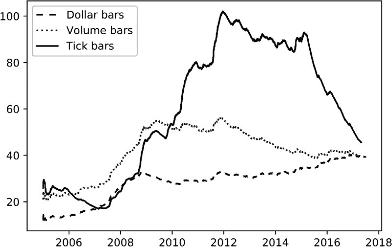

**图 2.1** 日均的成交笔数、成交量和美元条形图

另一个使得美元条形图比时间、成交笔或成交量条形图更有趣的论点是，流通股数在证券生命周期内通常会因公司行为而多次变化。即使在调整了拆分和反向拆分后，还有其他行动会影响成交笔数和成交量，例如发行新股或回购现有股份（自 2008 年大衰退以来非常常见的做法）。美元条形图在这些行动面前往往表现出稳健性。尽管如此，您可能希望对美元条形图进行采样，其中条形图的大小并未随时间保持不变。相反，条形图的大小可以根据公司的自由流通市值（在股票的情况下）或已发行债务的未偿金额（在固定收益证券的情况下）动态调整。

**2.3.2 信息驱动条形图**

信息驱动柱的目的是在新信息到达市场时更频繁地采样。在此背景下，“信息”一词是以市场微观结构的意义使用的。正如我们在第十九章中将看到的，市场微观结构理论赋予不平衡签名交易量的持续性特别重要，因为该现象与有信息交易者的存在相关。通过将采样与有信息交易者的到来同步，我们可能能够在价格达到新的均衡水平之前做出决策。在本节中，我们将探讨如何使用各种信息到达指标来采样柱。

***2.3.2.1 tick 不平衡柱***

考虑一个 tick 序列{(*p[*t*]*, *v[*t*]*)}[*t* = 1, …, *T*]，其中*p[*t*]*是与 tick *t* 相关的价格，而*v[*t*]*是与 tick *t* 相关的交易量。所谓的 tick 规则定义了一个序列{*b[*t*]*}[*t* = 1, …, *T*]，其中

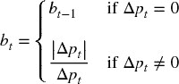

其中*b[*t*]* ∈ {−1, 1}，边界条件*b[0]*被设置为匹配前一柱的终值*b[*T*]*。tick 不平衡柱（TIBs）背后的想法是，每当 tick 不平衡超过我们的预期时，就进行柱的采样。我们希望确定 tick 指数*T*，使得签名 tick 的累积（根据 tick 规则签名）超过给定阈值。接下来，让我们讨论确定*T*的程序。

首先，我们将时间*T*的 tick 不平衡定义为

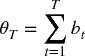

第二，我们计算在柱开始时θ[*T*]的期望值，E[0][θ[*T*]] = E[0]*T*，其中 E[0][*T*]是 tick 柱的预期大小，P[*b[*t*]* = 1]是 tick 被分类为买入的无条件概率，而 P[*b[*t*]* = −1]是 tick 被分类为卖出的无条件概率。由于 P[*b[*t*]* = 1] + P[*b[*t*]* = −1] = 1，因此 E[0][θ[*T*]] = E[0]*T*。在实际操作中，我们可以将 E[0][*T*]视为先前柱中*T*值的指数加权移动平均，而(2P[*b[*t*]* = 1] − 1)视为先前柱中*b[*t*]*值的指数加权移动平均。

第三，我们将 tick 不平衡柱（TIB）定义为一个*T*的*连续 tick 子集，以满足以下条件：

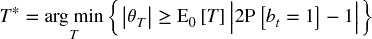

预期不平衡的大小由|2P[*b[*t*]* = 1] − 1|所暗示。当θ[*T*]比预期更不平衡时，较低的*T*将满足这些条件。因此，在有信息交易（触发单边交易的非对称信息）存在的情况下，TIBs 的产生会更频繁。实际上，我们可以将 TIBs 理解为包含相同数量信息的交易桶（无论交易的交易量、价格或 ticks）。

***2.3.2.2 交易量/美元不平衡柱***

交易量失衡柱（VIBs）和美元失衡柱（DIBs）背后的理念是扩展 ticks 失衡柱（TIBs）的概念。我们希望在交易量或美元失衡与我们的预期发生偏离时对柱子进行取样。基于我们为 TIBs 讨论的 ticks 规则和边界条件*b [0]*的相同概念，我们将定义一个程序来确定下一个样本的索引*T*。

首先，我们将时间*T*的失衡定义为

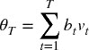

其中*v [*t*]*可以表示交易的证券数量（VIB）或交换的美元金额（DIB）。你选择的*v [*t*]*决定了你是根据前者还是后者进行取样。

第二，我们在柱子的开始计算θ[*T*]的期望值

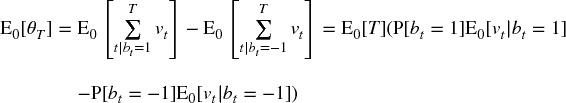

设我们定义*v ^+* = P[*b [*t*]* = 1]E [0] [*v [*t*]* | *b [*t*]* = 1]，*v ^−* = P[*b [*t*]* = −1]E [0] [*v [*t*]* | *b [*t*]* = −1]，因此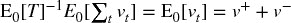。你可以将*v ^+*和*v ^−*视为将*v [*t*]*的初始期望分解为由买入和卖出贡献的成分。然后

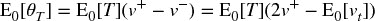

在实践中，我们可以将 E [0] [*T*]估计为来自先前柱子的*T*值的指数加权移动平均值，以及(2 *v ^+* − E [0] [*v [*t*]*])作为来自先前柱子的*b [*t*] v [*t*]*值的指数加权移动平均值。

第三，我们将 VIB 或 DIB 定义为一个*T* *-连续的 ticks 子集，以满足以下条件：

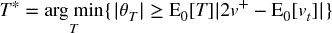

其中期望失衡的大小由|2 *v ^+* − E [0] [*v [*t*]*]|暗示。当θ[*T*]的失衡程度超出预期时，较低的*T*将满足这些条件。这是基于信息的交易量和美元柱的类似物，像其前身一样，它解决了关于 ticks 碎片化和异常值的相同问题。此外，它还解决了公司行为的问题，因为上述程序不依赖于固定的柱子大小。相反，柱子大小是动态调整的。

***2.3.2.3 Tick Runs Bars***

TIBs、VIBs 和 DIBs 监测订单流失衡，以 ticks、交易量和交换的美元值为度量。大型交易者将扫清订单簿，使用冰山订单，或将父订单切分成多个子订单，这些操作都会在{*b [*t*]*}[*t* = 1, …, *T*]序列中留下运行的痕迹。因此，监测整体交易量中的*序列*，并在该序列与我们的预期发生偏离时进行取样是很有用的。

首先，我们将当前运行的长度定义为

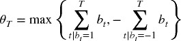

第二，我们在柱子的开始计算θ[*T*]的期望值

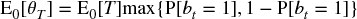

在实践中，我们可以将 E [0] [*T*]估计为来自先前柱子的*T*值的指数加权移动平均值，以及 P[*b [*t*]* = 1]作为来自先前柱子的买 ticks 比例的指数加权移动平均值。

第三，我们将点交易条（TRB）定义为一个 *T* *-连续的点集合，满足以下条件：

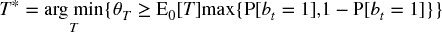

期望的交易次数由 max{P[ *b [*t*]* = 1], 1 − P[ *b [*t*]* = −1]} 所隐含。当 θ [*T*] 展示的交易次数超出预期时，低 *T* 将满足这些条件。注意在这一交易定义中，我们允许序列中断。也就是说，我们不再测量最长序列的长度，而是计算每一方的点数，而不进行偏移（没有不平衡）。在形成条的背景下，这一定义比测量序列长度更有用。

***2.3.2.4 交易量/美元交易条***

交易量条（VRBs）和美元交易条（DRBs）将上述交易定义扩展到交易的量和金额。直观上，我们希望在任一方的交易量或金额超出我们对某条的预期时进行抽样。根据我们习惯的点差规则命名法，我们需要确定条中的最后观察值的索引 *T*。

第一，我们将与交易相关的交易量或美元定义为

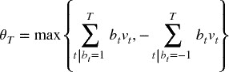

其中 *v [*t*]* 可以代表交易的证券数量（VRB）或交换的美元金额（DRB）。你选择的 *v [*t*]* 决定了你是根据前者还是后者进行抽样。

第二，我们计算条开始时 θ [*T*] 的期望值，

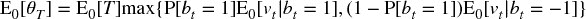

实际上，我们可以将 E [0] [ *T* ] 估计为先前条中 *T* 值的指数加权移动平均，P[ *b [*t*]* = 1] 估计为先前条中买入点比例的指数加权移动平均，E [0] [ *v [*t*]* | *b [*t*]* = 1] 估计为先前条中买入交易量的指数加权移动平均，E [0] [ *v [*t*]* | *b [*t*]* = −1] 估计为先前条中卖出交易量的指数加权移动平均。

第三，我们将交易量条（VRB）定义为一个 *T* *-连续的点集合，满足以下条件：

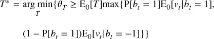

期望的交易量由 max{P[ *b [*t*]* = 1]E [0] [ *v [*t*]* | *b [*t*]* = 1], (1 − P[ *b [*t*]* = 1])E [0] [ *v [*t*]* | *b [*t*]* = −1]} 所隐含。当 θ [*T*] 展示的交易次数超出预期时，或者交易量大于预期时，低 *T* 将满足这些条件。

**2.4 处理多产品系列**

有时我们希望建模一个工具的时间序列，其中权重需要随着时间动态调整。其他时候，我们必须处理支付不规则息票或股息的产品，或受到企业行动影响的产品。改变所研究的时间序列性质的事件需要妥善处理，否则我们会无意中引入结构性突破，从而误导我们的研究工作（更多内容将在第十七章讨论）。这个问题以多种形式出现：当我们建模权重变化的价差，或需要再投资股息/息票的证券篮子，或需要重新平衡的篮子，或当一个指数的成分发生变化，或当我们必须用另一个替换已到期/成熟的合同/证券等。

期货就是一个典型的例子。根据我的经验，人们在处理期货时往往不必要地感到困难，主要是因为他们不知道如何很好地处理换仓。基于期货的价差、或股票或债券的组合策略也可以说是如此。在下一节中，我将向你展示如何将一个证券组合建模为一个单一的现金产品。我称之为“ETF 技巧”，因为目标是将任何复杂的多产品数据集转化为一个类似于总回报 ETF 的单一数据集。这有什么用？因为你的代码可以始终假设你只交易现金类产品（非到期现金工具），无论底层系列的复杂性和组成如何。

**2.4.1 ETF 技巧**

假设我们希望开发一个交易期货价差的策略。在处理价差而不是单一工具时，会出现一些小麻烦。首先，价差由一个随时间变化的权重向量来表征。因此，即使价格不变，价差本身也可能收敛。当这种情况发生时，基于该序列的模型可能会误认为盈亏（利润和损失的净市值）是由于该权重引起的收敛所致。其次，价差可能会出现负值，因为它们并不代表价格。这往往会造成问题，因为大多数模型假设价格为正。第三，交易时间不会完全对齐所有成分，因此价差并不总是可以在最后发布的水平进行交易，或者没有延迟风险。此外，必须考虑执行成本，例如跨越买卖差价。

避免这些问题的一种方法是生成一个反映在价差中投资$1 的时间序列。该序列的变化将反映盈亏（PnL）的变化，该序列在最坏的情况下将始终为正（至多是微小的），并且实施损失将被考虑在内。这个序列将用于建模、生成信号和交易，就像它是一个 ETF 一样。

假设我们有一个由第 2.3 节中解释的任何方法得出的历史数据条。 这些数据条包含以下列：

+   *o [*i* , *t*]* 是在柱 *t* = 1, …, *T* 时工具 *i* = 1, …, *I* 的原始开盘价。

+   *p [*i* , *t*]* 是在柱 *t* = 1, …, *T* 时工具 *i* = 1, …, *I* 的原始收盘价。

+   φ [*i* , *t*] 是在柱 *t* = 1, …, *T* 时工具 *i* = 1, …, *I* 的一个点的 USD 值。这包括外汇汇率。

+   *v [*i* , *t*]* 是在柱 *t* = 1, …, *T* 时工具 *i* = 1, …, *I* 的交易量。

+   *d [*i* , *t*]* 是在柱 *t* 时工具 *i* 支付的持有成本、股息或票息。这个变量也可以用于收取保证金成本或融资成本。

所有工具 *i* = 1, …, *I* 在柱 *t* = 1, …, *T* 时均可交易。换句话说，即使某些工具在时间间隔 [*t* − 1, *t*] 的整个期间不可交易，但至少在时间 *t* − 1 和 *t* 时是可以交易的（市场开放并能够在这些时刻执行订单）。对于由分配向量 ω [*t*] 重新平衡（或滚动）的期货篮子，$1 的投资价值 {*K [*t*]*} 是通过以下公式推导的：

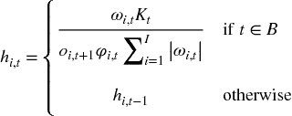

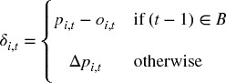

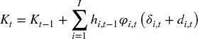

并且 *K [0]* = 1 是初始的 AUM。变量 *h [*i* , *t*]* 表示在时间 *t* 时工具 *i* 的持有量（证券或合约数量）。变量 δ [*i* , *t*] 是在时间 *t* 和 *t* − 1 之间工具 *i* 市场价值的变化。请注意，当 *t* ∈ *B* 时利润或损失被再投资，从而防止负价格。股息 *d [*i* , *t*]* 已经嵌入到 *K [*t*]* 中，因此策略不需要了解它们。*h [*i* , *t*]* 中的目的在于去杠杆配置。对于期货系列，我们可能不知道在滚动时间 *t* 时新合约的 *p [*i* , *t*]*，所以我们使用 *o [*i* , *t* + 1]* 作为时间上最近的价格。

让 τ [*i*] 表示与交易 $1 的工具 *i* 相关的交易成本，例如，τ [*i*] = 1 *E* − 4（一个基点）。策略需要知道每个观察到的柱 *t* 的三个额外变量：

1.  **再平衡成本：** 与配置再平衡相关的变量成本 {*c [*t*]*} 是 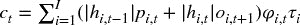，∀*t* ∈ *B*。我们不将 *c [*t*]* 嵌入到 *K [*t*]* 中，否则在配置再平衡时做空价差会产生虚假利润。在你的代码中，可以将 {*c [*t*]*} 视为（负）股息。

1.  **买卖价差：** 购买或出售一个单位此虚拟 ETF 的成本 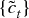 为 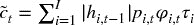。当一个单位被买入或卖出时，策略必须收取这个成本 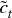，这相当于穿越此虚拟 ETF 的买卖价差。

1.  **交易量：** 交易量 {*v [*t*]*} 由篮子中最不活跃的成员决定。让 *v [*i* , *t*]* 表示在柱 *t* 上由工具 *i* 交易的量。可交易的篮子单位数量是 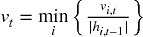。

交易成本函数不一定是线性的，基于上述信息的策略可以模拟这些非线性成本。得益于 ETF 技巧，我们可以将一篮子期货（或单一期货）建模为一个不到期的现金产品。

**2.4.2 PCA 权重**

感兴趣的读者可以在 López de Prado 和 Leinweber [2012] 以及 Bailey 和 López de Prado [2012] 中找到许多计算对冲权重的实用方法。为了完整性，让我们回顾一下推导上一节中使用的向量 {ω [*t*] } 的一种方法。考虑一个 IID 多元高斯过程，其特征由一个均值向量 μ（大小为 *Nx1*）和一个协方差矩阵 *V*（大小为 *NxN*）所描述。这个随机过程描述了一个不变的随机变量，如股票的收益、债券收益率的变化，或一组 *N* 个工具的期权波动率的变化。我们希望计算符合 *V* 主成分特定风险分布的分配向量 ω。

首先，我们进行谱分解，*VW* = *W* Λ，其中 *W* 中的列经过重新排序，使得 Λ 的对角线元素按降序排列。其次，给定一个分配向量 ω，我们可以计算投资组合的风险为 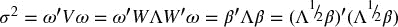，其中 β 表示 ω 在正交基上的投影。第三，Λ 是一个对角矩阵，因此 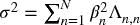，第 *n* 个成分的风险为 *R [*n*] * = β ² [   *n*   ] Λ [*n*  ,  *n*] σ ^(− 2) = [ *W* 'ω] ² [   *n*   ] Λ [*n*  ,  *n*] σ ^(− 2)，且 *R* '1 [*N*] = 1，1 [*N*] 是一个 *N* 个 1 的向量。你可以将 { *R [*n*] * } [*n*  = 1, …,  *N*] 理解为在正交成分间风险的分布。

第四，我们希望计算向量 ω，以实现用户定义的风险分布 *R*。从之前的步骤可以得出，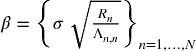 表示在新的（正交）基中的分配。第五，旧基中的分配由 ω = *W* β 给出。重新缩放 ω 仅仅是重新缩放 σ，从而保持风险分布不变。图 2.2 说明了每个主成分对逆方差分配风险的贡献。几乎所有主成分都会贡献风险，包括那些方差最高的主成分（成分 1 和 2）。相比之下，对于 PCA 投资组合，只有方差最低的成分会贡献风险。

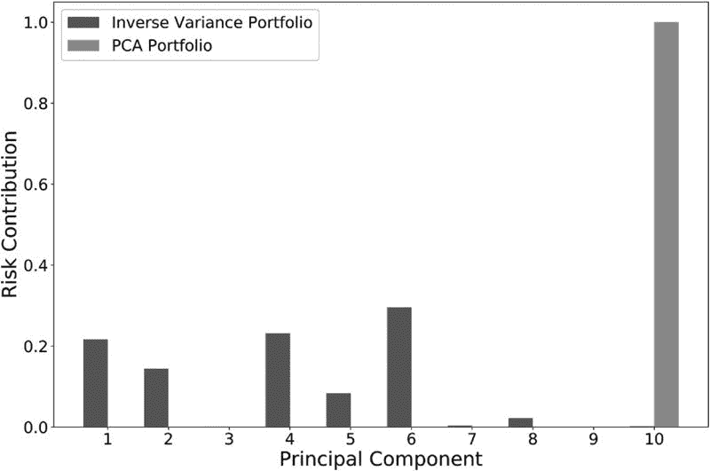

**图 2.2** 每个主成分对风险的贡献

Snippet 2.1 实现了此方法，其中用户定义的风险分布 *R* 通过参数 `riskDist` 传递（可选为 None）。如果 `riskDist` 为 None，代码将假设所有风险必须分配给具有最小特征值的主成分，权重将是最后一个特征向量重新缩放以匹配 σ (`riskTarget`)。

> **代码片段 2.1 从风险分布 R 中得到 PCA 权重**
> 
> 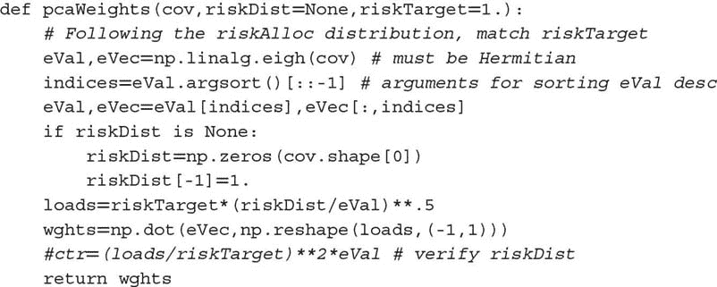

**2.4.3 单一期货滚动**

ETF 技巧可以处理单一期货合约的滚动，作为一腿价差的特例。然而，在处理单一期货合约时，更等效且直接的方法是形成累积滚动间隙的时间序列，并将该间隙系列从价格系列中扣除。代码片段 2.2 展示了这一逻辑的可能实现，使用从彭博社下载的 tick bar 系列并存储在 HDF5 表中。彭博社字段的含义如下：

+   `FUT_CUR_GEN_TICKER`：标识与该价格相关的合约。其值在每次滚动时发生变化。

+   `PX_OPEN`：与该 bar 相关的开盘价。

+   `PX_LAST`：与该 bar 相关的收盘价。

+   `VWAP`：与该 bar 相关的成交量加权平均价格。

函数`rollGaps`中的参数`matchEnd`决定期货系列是否应向前滚动（`matchEnd=False`）或向后滚动（`matchEnd=True`）。在向前滚动中，滚动系列开始时的价格与原始系列开始时的价格相匹配。在向后滚动中，滚动系列结束时的价格与原始系列结束时的价格相匹配。

> **代码片段 2.2 形成间隙系列，并从价格中扣除**
> 
> 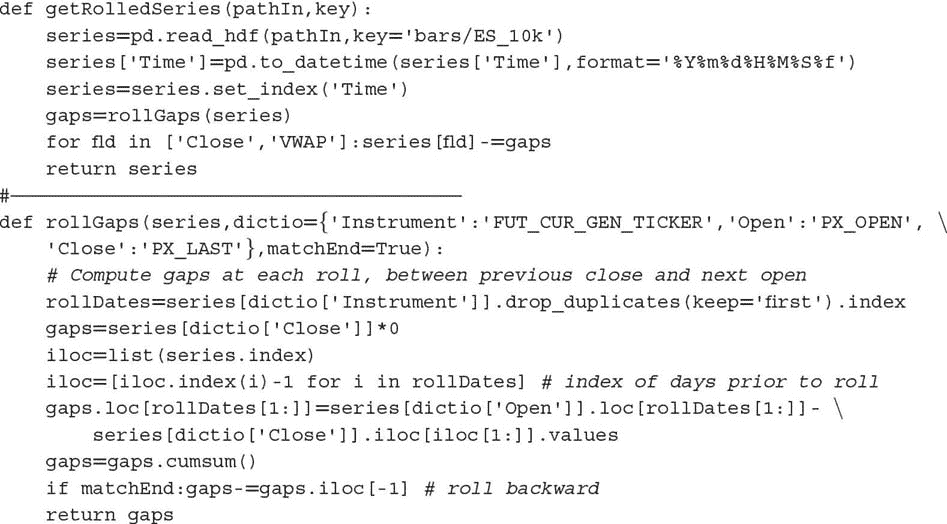

滚动价格用于模拟损益（PnL）和投资组合的市场价值。然而，仍应使用原始价格来确定头寸规模和资本消耗。请记住，滚动价格确实可能变为负值，尤其是在期货合约在升水状态下出售时。要查看这一点，可以在一系列棉花#2 期货或天然气期货上运行代码片段 2.2。

通常，我们希望处理非负的滚动系列，在这种情况下，我们可以按照以下方式推导出$1 投资的价格系列： (1) 计算滚动期货价格的时间序列，(2) 计算收益（*r*），即滚动价格变化除以前的原始价格，以及 (3) 使用这些收益形成价格系列（即`(1+r).cumprod()`）。代码片段 2.3 说明了这个逻辑。

> **代码片段 2.3 非负滚动价格系列**
> 
> 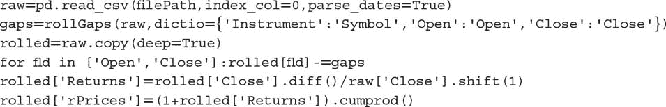

**2.5 采样特征**

到目前为止，我们已经学习如何从一组非结构化金融数据中生成一个连续、同质且结构化的数据集。虽然你可以尝试在这样的数据集上应用机器学习算法，但一般来说，这并不是一个好主意，原因有几个。首先，几个机器学习算法在样本量上扩展性较差（例如，支持向量机）。其次，机器学习算法在尝试从相关示例中学习时会实现最高的准确性。假设你希望预测下一个 5%的绝对回报是否会是正的（5%的上涨）或负的（5%的下跌）。在任何随机时间，这样的预测准确性都会很低。然而，如果我们要求分类器在特定催化条件后预测下一个 5%绝对回报的符号，我们更可能找到有用的特征，这将帮助我们实现更准确的预测。在本节中，我们讨论从条形图中抽样以生成具有相关训练示例的特征矩阵的方法。

**2.5.1 减少的抽样**

正如我们之前提到的，从结构化数据集中抽样特征的一个原因是减少用于拟合机器学习算法的数据量。这种操作也称为*下采样*。这通常通过以固定步长进行顺序抽样（线性空间抽样）或通过使用均匀分布随机抽样（均匀抽样）来完成。

线性空间抽样的主要优点是其简单性。缺点是步长是任意的，并且结果可能因种子条而异。均匀抽样通过在整个条形图集上均匀抽样来解决这些问题。尽管如此，这两种方法都受到批评，认为样本未必包含在预测能力或信息内容方面最相关观察值的子集。

**2.5.2 基于事件的抽样**

投资组合经理通常会在某些事件发生后下注，例如结构性突破（第十七章）、提取的信号（第十八章）或微观结构现象（第十九章）。这些事件可能与一些宏观经济统计数据的发布、波动率的激增、价差偏离其均衡水平等有关。我们可以将事件表征为重要，并让机器学习算法学习在这些情况下是否存在准确的预测函数。也许答案是否定的，在这种情况下，我们会重新定义什么构成一个事件，或尝试使用替代特征再次进行尝试。为了说明这一点，让我们讨论一种有用的基于事件的抽样方法。

***2.5.2.1 CUSUM 滤波器***

CUSUM 滤波器是一种质量控制方法，旨在检测所测量量的均值偏离目标值的变化。考虑来自局部平稳过程的独立同分布观察值{ *y [*t*]* } [*t* = 1, …, *T*]。我们定义累积和。

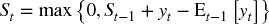

边界条件*S [0]* = 0 *.* 此过程将在满足*S [*t*]* ≥ *h*的第一个*t*上建议采取行动，某个阈值*h*（过滤器大小）。请注意，*S [*t*]* = 0，当*y [*t*]* ≤ E [*t* − 1] [ *y [*t*]* ] − *S [*t* − 1]*时。这一零底线意味着我们将跳过一些向下偏差，否则这些偏差会使*S [*t*]*为负。原因是，过滤器被设置为识别从任何重置水平零的向上偏差序列。特别是，当阈值被激活时

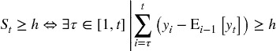

这一上升概念可以扩展到包括下降，形成对称的 CUSUM 过滤器：

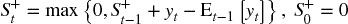

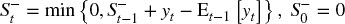

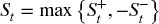

Lam 和 Yam [1997]提出了一种投资策略，当相对于先前的高点或低点观察到绝对回报*h*时生成交替的买卖信号。这些作者证明，这种策略等同于 Fama 和 Blume [1966]研究的“过滤交易策略”。我们使用 CUSUM 过滤器的方式不同：我们仅在*S [*t*]* ≥ *h*时采样一根柱，届时*S [*t*]*被重置。代码片段 2.4 展示了对称 CUSUM 过滤器的实现，其中 E [*t* − 1] [ *y [*t*]* ] = *y [*t* − 1]*。

> **代码片段 2.4 对称 CUSUM 过滤器**
> 
> 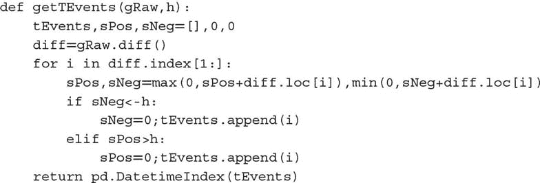

函数`getTEvents`接收两个参数：我们希望过滤的原始时间序列（`gRaw`）和阈值`h`。CUSUM 过滤器的一个实际优点是，当`gRaw`在阈值水平附近徘徊时不会触发多个事件，这是一些流行市场信号（如布林带）所遭受的缺陷。`gRaw`需要完整的长度为`h`的运行才能触发事件。图 2.3 展示了 CUSUM 过滤器在价格序列上采样的情况。

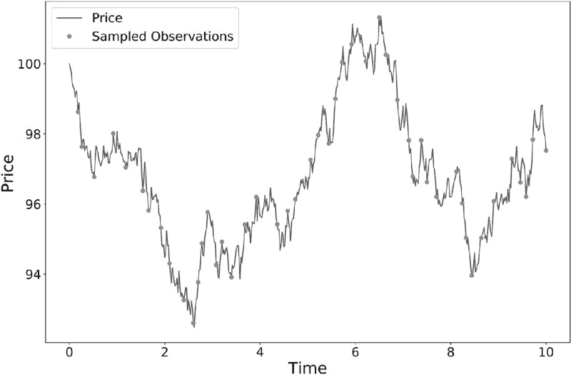

**图 2.3** CUSUM 对价格序列的采样

变量*S [*t*]*可以基于我们将在第 17-19 章讨论的任何特征，如结构性断裂统计、熵或市场微观结构测量。例如，我们可以在 SADF 明显偏离先前重置水平时声明一个事件（将在第十七章定义）。一旦我们获得这一事件驱动的柱子子集，我们将让机器学习算法判断这些事件的发生是否构成可采取的情报。

**练习**

1.  > > 在一系列 E-mini S&P 500 期货交易数据上：

    1.  形成 tick、成交量和美元柱。使用 ETF 技巧处理滚动问题。

    1.  每周计算由 tick、成交量和美元柱生成的柱数。绘制该柱数的时间序列。哪种柱类型产生了最稳定的每周计数？为什么？

    1.  计算三种柱类型的回报序列相关性。哪种柱方法具有最低的序列相关性？

    1.  将柱系列划分为每月子集。计算每种柱类型每个子集的收益方差。计算这些方差的方差。哪种方法表现出最小的方差？ 

    1.  对三种柱类型的收益应用 Jarque-Bera 正态性检验。哪种方法实现了最低的检验统计量？

1.  > > 在一系列 E-mini S&P 500 期货成交数据上，计算美元柱和美元不平衡柱。哪种柱类型表现出更大的序列相关性？为什么？
1.  > > 
1.  > > 在 E-mini S&P 500 期货和 Eurostoxx 50 期货的美元柱序列上：

    1.  应用第 2.4.2 节计算 ETF 技巧使用的 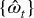 向量。（提示：你需要在滚动日期的 EUR/USD 外汇值。）

    1.  推导 S&P 500/Eurostoxx 50 利差的时间序列。

    1.  通过 ADF 检验确认序列是平稳的。

1.  > > 形成 E-mini S&P 500 期货美元柱：

    1.  计算宽度为 5% 的布林带围绕滚动移动平均线。计算价格跨越布林带的次数（从带内到带外）。

    1.  现在使用 CUSUM 过滤器对这些柱进行采样，其中 {*y [*t*]*} 为收益，*h* = 0.05*。你得到了多少样本？

    1.  计算两个采样序列的滚动标准差。哪个序列的异方差性最小？这些结果的原因是什么？

1.  > > 使用练习 4 中的柱：

    1.  使用 CUSUM 过滤器对柱进行采样，其中 {*y [*t*]*} 为绝对收益，*h* = 0.05*。

    1.  计算采样柱的滚动标准差。

    1.  将此结果与练习 4 的结果进行比较。哪个程序产生了最小的异方差样本？为什么？

**参考文献**

1.  Ané, T. 和 H. Geman (2000)：“订单流、交易时钟和资产收益的正态性。” *金融期刊*，第 55 卷，第 2259–2284 页。

1.  Bailey, David H. 和 M. López de Prado (2012)：“平衡篮子：一种新的交易和对冲风险的方法。” *投资策略期刊（风险期刊）*，第 1 卷，第 4 期（秋季），第 21–62 页。

1.  Clark, P. K. (1973)：“一种具有有限方差的次级随机过程模型用于投机价格。” *计量经济学*，第 41 卷，第 135–155 页。

1.  Easley, D., M. López de Prado 和 M. O'Hara (2011)：“量能时钟：对高频范式的见解。” *投资组合管理期刊*，第 37 卷，第 2 期，第 118–128 页。

1.  Easley, D., M. López de Prado 和 M. O'Hara (2012)：“流动性毒性和高频世界中的流动性。” *金融研究评论*，第 25 卷，第 5 期，第 1457–1493 页。

1.  Fama, E. 和 M. Blume (1966)：“过滤规则和股市交易。” *商业期刊*，第 40 卷，第 226–241 页。

1.  Kolanovic, M. 和 R. Krishnamachari (2017)：“大数据和 AI 策略：机器学习和另类数据的投资方法。” 白皮书，JP 摩根，量化和衍生品策略。5 月 18 日。

1.  Lam, K. 和 H. Yam (1997)：“金融市场技术交易的 CUSUM 技术。” *金融工程与日本市场*，第 4 卷，第 257–274 页。

1.  López de Prado, M. 和 D. Leinweber (2012)： “协整与子集相关对冲方法的进展。” *投资策略期刊（风险期刊）* ，第 1 卷，第 2 期（春季），第 67–115 页。

1.  Mandelbrot, B. 和 M. Taylor (1967)： “股票价格差异的分布。” *运筹学* ，第 15 卷，第 5 期，第 1057–1062 页。

**第三章**

**标记**

**3.1 动机**

在第二章中，我们讨论了如何从非结构化数据集中生成金融特征矩阵 *X* 。无监督学习算法可以从该特征矩阵 *X* 中学习模式，例如是否包含层次聚类。另一方面，有监督学习算法要求 *X* 中的行与标签或值 *y* 数组相关联，以便可以对未见特征样本进行这些标签或值的预测。在本章中，我们将讨论标记金融数据的方法。

**3.2 固定时间范围方法**

在金融领域，几乎所有的机器学习论文都使用固定时间范围方法对观察结果进行标记。该方法可以描述如下。考虑一个特征矩阵 *X* ，具有 *I* 行，{ *X [*i*]* } [*i* = 1, …, *I*] ，从某些以 *t* = 1, …, *T* 为索引的条形图中提取，其中 *I* ≤ *T* 。第二章第 2.5 节讨论了生成特征集 { *X [*i*]* } [*i* = 1, …, *I*] 的采样方法。观察 *X [*i*]* 被分配一个标签 *y [*i*]* ∈ { − 1, 0, 1}，

其中 τ 是预定义的常量阈值，*t [*i* , 0]* 是 *X [*i*]* 发生后紧接着的条形图索引，*t [*i* , 0]* + *h* 是 *t [*i* , 0]* 后第 *h* 个条形图的索引，而 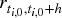 是在条形图范围 *h* 内的价格回报，

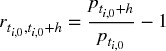

因为文献几乎总是使用时间条形图，*h* 意味着一个固定时间范围。参考文献部分列出了多个机器学习研究，其中 Dixon 等人 [2016] 是这种标记方法的一个近期例子。尽管其流行，但在大多数情况下，有几个理由要避免这种方法。首先，正如我们在第二章中所看到的，时间条形图并不具有良好的统计性质。其次，无论观察到的波动性如何，都应用相同的阈值 τ 。假设 τ = 1 *E* − 2，有时我们将观察标记为 *y [*i*]* = 1，基于实现的条形图波动性 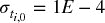 （例如，在夜间交易时段），有时为 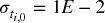 （例如，在开盘时）。即使回报  是可预测且统计显著的，大多数标签将是 0。

换句话说，根据固定的时间柱阈值来标记观察是一个非常常见的错误。这里有几个更好的替代方案。首先，按照变化的阈值标记 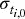，该阈值是通过对收益的滚动指数加权标准差进行估算的。其次，使用成交量或美元柱，因为它们的波动率更接近恒定（同方差性）。但即使这两个改进也忽略了固定时间区间方法的一个关键缺陷：价格的路径。每个投资策略都有止损限制，无论是投资组合经理自设的，风险部门强制执行的，还是因保证金追缴而触发的。建立一种依赖于会被交易所强制平仓的头寸来获利的策略是极不现实的。几乎没有任何出版物在标记观察时考虑到这一点，这说明了当前投资文献的状态。

**3.3 计算动态阈值**

正如前一节所论述的，实际上我们希望设置的利润获取和止损限制是与下注风险相关的函数。否则，有时我们会目标过高（ 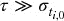），有时目标过低（ 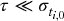），考虑到当前的波动率。

片段 3.1 在日内估计点计算每日波动率，应用`span0`天的跨度到指数加权移动标准差。有关`pandas.Series.ewm`函数的详细信息，请参见 pandas 文档。

> **片段 3.1 每日波动率估计**
> 
> 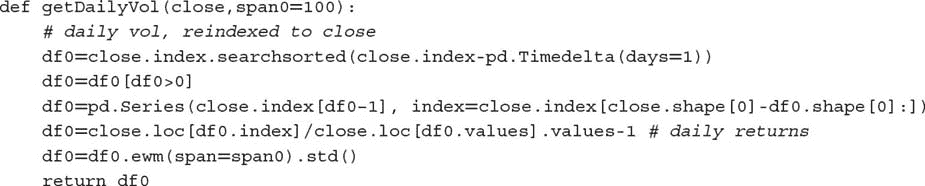

我们可以使用该函数的输出在本章的其余部分设置默认的利润获取和止损限制。

**3.4 三重障碍法**

在这里，我将介绍一种我在文献中未找到的替代标记方法。如果你是一名投资专业人士，我想你会同意这更合理。我称之为三重障碍法，因为它根据接触的第一个障碍对观察进行标记，共有三个障碍。首先，我们设置两个水平障碍和一个垂直障碍。两个水平障碍由利润获取和止损限制定义，这些限制是估计波动率的动态函数（无论是实现的还是隐含的）。第三个障碍根据自持仓以来经过的柱数定义（到期限制）。如果首先触及上障碍，我们将观察标记为 1。如果首先触及下障碍，我们将观察标记为−1。如果首先触及垂直障碍，我们有两个选择：收益的符号，或 0。我个人更倾向于前者，因为这涉及在限制内实现利润或损失，但你应该探索在你的特定问题中 0 是否更有效。

你可能注意到三重障碍方法是路径依赖的。为了标记一个观察，我们必须考虑整个路径 [ *t [*i* , 0]* , *t [*i* , 0]* + *h* ]，其中 *h* 定义了垂直障碍（到期限制）。我们将 *t [*i* , 1]* 表示为第一次障碍触碰的时间，与观察特征相关的回报为 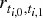 。为了清晰起见，*t [*i* , 1] * ≤ *t [*i* , 0] * + *h*，并且水平障碍不一定是对称的。

片段 3.2 实现了三重障碍方法。该函数接收四个参数：

+   `close` : 一个价格的 pandas 系列。

+   `events` : 一个 pandas 数据框，包含列，

    +   `t1` : 垂直障碍的时间戳。当值为 `np.nan` 时，将没有垂直障碍。

    +   `trgt` : 水平障碍的单位宽度。

+   `ptSl` : 一个包含两个非负浮点值的列表：

    +   `ptSl[0]` : 乘以 `trgt` 设置上障碍宽度的因子。如果为 0，则不会有上障碍。

    +   `ptSl[1]` : 乘以 `trgt` 设置下障碍宽度的因子。如果为 0，则不会有下障碍。

+   `molecule` : 一个包含将由单线程处理的事件索引子集的列表。其使用将在本章后面变得清晰。

> **片段 3.2 三重障碍标记方法**
> 
> 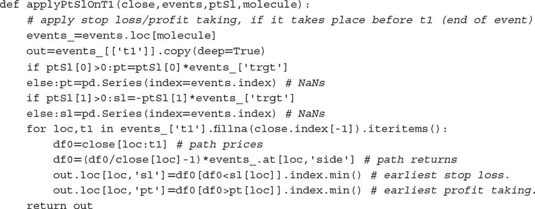

此函数的输出是一个包含每个障碍触碰时间戳（如果有）的 pandas 数据框。从之前的描述可以看出，该方法考虑了三个障碍可能被禁用的情况。我们用三元组 [ `pt,sl,t1` ] 来表示障碍配置，其中 0 表示障碍不活跃，1 表示障碍活跃。可能的八种配置为：

+   三个有用的配置：

    +   [1,1,1]: 这是标准配置，我们定义了三个障碍退出条件。我们希望实现利润，但对于损失有一个最大容忍度和持有期限。

    +   [0,1,1]: 在这个设置中，我们希望在若干柱后退出，除非被止损。

    +   [1,1,0]: 在这里，我们希望在未被止损的情况下获利。这在一定程度上是不现实的，因为我们愿意持有头寸直到成功。

+   三个不太现实的配置：

    +   [0,0,1]: 这等同于固定时间范围的方法。当应用于基于成交量、美元或信息驱动的柱状图时，仍然可能有用，并且在该范围内更新多个预测。

    +   [1,0,1]: 持有一个头寸直到获利或超过最大持有期限，而不考虑中间未实现的损失。

    +   [1,0,0]: 持有一个头寸直到获利。这可能意味着在亏损头寸上锁定多年。

+   两个不合逻辑的配置：

    +   [0,1,0]: 这是一个无目标配置，我们持有头寸直到被止损。

    +   [0,0,0]：没有障碍。该位置永远被锁定，并且未生成任何标签。

图 3.1 展示了三重障碍方法的两种替代配置。在左侧，配置为[1,1,0]，其中第一个触碰的障碍是下方的水平障碍。在右侧，配置为[1,1,1]，其中第一个触碰的障碍是垂直的。

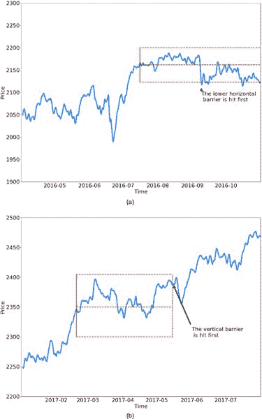

**图 3.1** 三重障碍方法的两种替代配置
