# 第二章：财务数据结构

## 2.1 动机

在本章中，我们将学习如何处理非结构化金融数据，并从中推导出适合机器学习算法的结构化数据集。一般来说，你不希望使用他人处理过的数据集，因为结果往往是发现他人已经知道的内容或即将发现的内容。理想情况下，你的起点是一个非结构化的原始数据集合，你将以某种方式处理这些数据，以生成有用的特征。

## 2.2 基本金融数据的基本类型

金融数据有许多形态和形式。表 2.1 显示了四种基本金融数据类型，按从左到右的多样性递增顺序排列。接下来，我们将讨论它们的不同性质和应用。

**表 2.1** **四种基本金融数据类型**

| **基本数据** | **市场数据** | **分析** | **替代数据** |
| --- | --- | --- | --- |

|

+   资产

+   负债

+   销售

+   成本/收益

+   宏观变量

+   . . .

|

+   价格/收益/隐含波动率

+   交易量

+   股息/优惠券

+   未平仓合约

+   报价/取消

+   攻击方

+   . . .

|

+   分析师推荐

+   信用评级

+   盈利预期

+   新闻情绪

+   . . .

|

+   卫星/CCTV 图像

+   谷歌搜索

+   Twitter/聊天

+   元数据

+   . . .

|

**2.2.1 基本数据**

基本数据包含可以在监管文件和商业分析中找到的信息。它主要是会计数据，按季度报告。这类数据的一个特定方面是它会有滞后报告。你必须确认每个数据点发布的确切时间，以确保你的分析只使用在公开可用后获得的信息。一个常见的初学者错误是假设这些数据在报告期末发布，但实际上从来不是这样。

例如，彭博社发布的基本数据是按报告中包含的最后日期编制索引的，这个日期通常比发布日期早 1.5 个月。换句话说，彭博社将这些值分配给一个未知的日期。你无法想象每年有多少论文使用了不一致的基本数据，尤其是在因子投资文献中。一旦你正确对齐数据，这些论文中的大量发现是无法复制的。

基础数据的第二个方面是，它经常被补填或恢复。“补填”意味着缺失的数据被赋予一个值，即使在当时这些值是未知的。“恢复值”是纠正了初始发布错误的值。一家公司可能会在首次发布后很久对过去一个季度的结果进行多次修正，而数据供应商可能会用其修正覆盖初始值。问题在于，这些修正值在首次发布时并不知道。一些数据供应商通过存储每个变量的多个发布日期和数值来规避这个问题。例如，我们通常会为单个季度的 GDP 发布有三个值：初始发布值和两个月度修正值。不过，常见的情况是，有研究使用最终发布值并将其分配到首次发布的时间，甚至分配到报告期的最后一天。我们将在第十一章讨论回测错误时重新审视这一错误及其影响。

基础数据极其规范化且频率较低。由于其对市场的可获取性，剩余的可利用价值相对较小。不过，将其与其他数据类型结合使用可能仍然有用。

**2.2.2 市场数据**

市场数据包括在交易所（如 CME）或交易场所（如 MarketAxess）发生的所有交易活动。理想情况下，您的数据提供者应为您提供一个原始数据源，包含各种非结构化信息，如 FIX 消息，这使您能够完全重建交易簿，或完整的 BWIC（竞争性求购）响应集合。每个市场参与者在交易记录中留下特征性足迹，凭借足够的耐心，您将找到预测竞争对手下一步行动的方法。例如，TWAP 算法留下了非常独特的足迹，被捕食性算法用来抢先进行其日终交易（通常是对冲）活动（Easley, López de Prado, and O'Hara [2011]）。人类 GUI 交易员通常以整手交易，您可以利用这一点估算在特定时间内来自他们的交易量占比，然后将其与特定市场行为关联起来。

FIX 数据的一个吸引人的方面是，与基础数据不同，它的处理并不简单。此外，这种数据非常丰富，每天生成超过 10 TB 的数据。这使它成为一个更有趣的策略研究数据集。

**2.2.3 分析**

你可以将分析视为基于原始来源的衍生数据，这可能是基本数据、市场数据、替代数据，甚至是其他分析的集合。分析的特征不在于信息的内容，而在于它并非直接从原始来源获得，并且它已以特定方式为你处理。投资银行和研究公司出售通过深入分析公司商业模式、活动、竞争、前景等而产生的有价值信息。一些专业公司出售来自替代数据的统计信息，例如，从新闻报道和社交媒体中提取的情绪。

分析的一个积极方面是信号已经从原始来源中提取出来。消极方面是，分析可能会很昂贵，所使用的方法可能存在偏见或不透明性，并且你不是唯一的消费者。

**2.2.4 替代数据**

Kolanovic 和 Krishnamachari [2017] 区分了由个人（社交媒体、新闻、网页搜索等）、商业流程（交易、公司数据、政府机构等）和传感器（卫星、地理位置、天气、监控摄像头等）生成的替代数据。一些受欢迎的卫星图像或视频源包括对油轮、隧道交通活动或停车场占用率的监测。

真正特征化替代数据的是它是原始信息，也就是说，这些信息尚未被其他来源采纳。在埃克森美孚报告盈利增加之前，在其市场价格飙升之前，在分析师撰写其最新文件的评论之前，所有这些之前，油轮、钻井机和管道交通已经发生。这些活动发生在这些数据类型被反映出来的几个月之前。替代数据的两个问题是其成本和隐私问题。所有的监控活动都是昂贵的，被监视的公司可能会反对，更不用说旁观者。

替代数据提供了处理真正独特、难以处理的数据集的机会。记住，难以存储、操作和处理的数据总是最有前途的。如果数据基础设施团队对某个数据集感到烦恼，你会意识到该数据集*可能是*有用的。也许你的竞争对手由于后勤原因未尝试使用该数据集，或中途放弃，或处理不当。

## 2.3 条形图

为了在你的非结构化数据上应用机器学习算法，我们需要解析数据，从中提取有价值的信息，并将这些提取结果存储在规范化格式中。大多数机器学习算法假设提取数据的表格表示。金融从业者通常将这些表的行称为“条”。我们可以区分两类条形方法：（1）标准条形方法，这些方法在文献中很常见，和（2）更高级的、以信息驱动的方法，尽管这些方法在学术期刊文章中尚未出现，但却被复杂的从业者使用。在本节中，我们将讨论如何形成这些条。

**2.3.1 标准条**

一些条形构建方法在金融行业中非常流行，以至于大多数数据供应商的 API 都提供了几种。这些方法的目的是将不规则频率到达的一系列观察值（通常称为“非均匀系列”）转换为基于规则抽样的均匀系列。

***2.3.1.1 时间条***

时间条是通过在固定时间间隔内抽样信息获得的，例如每分钟一次。收集的信息通常包括：

+   时间戳

+   成交量加权平均价格（VWAP）

+   开盘价（即，第一个价格）

+   收盘价（即，最后一个价格）

+   最高价

+   最低价

+   交易量等。

尽管时间条可能是从业者和学术界中最流行的，但应避免使用时间条，原因有二。首先，市场并不是以固定时间间隔处理信息。开盘后的一小时比正午（或期货交易中午夜时分）周围的一小时要活跃得多。作为生物生物体，人类根据阳光周期组织他们的日常生活是合情合理的。但今天的市场是由算法操作的，这些算法在松散的人类监督下进行交易，因此 CPU 处理周期比时间间隔更为相关（Easley, López de Prado, 和 O'Hara [2011]）。这意味着时间条在低活动期过采样信息，而在高活动期则欠采样信息。其次，时间抽样系列往往表现出较差的统计特性，如序列相关性、异方差性和收益的非正态性（Easley, López de Prado, 和 O'Hara [2012]）。GARCH 模型部分是为了解决与不当抽样相关的异方差性而开发的。正如我们接下来将看到的，形成条作为交易活动的从属过程，首先避免了这个问题。

***2.3.1.2 Tick Bars***

Tick 条背后的理念很简单：每当发生预定义数量的交易时（例如，1,000 次交易），将提取之前列出的样本变量（时间戳、VWAP、开盘价等）。这使我们能够将抽样与信息到达的代理（ticks 的产生速度）进行同步。

Mandelbrot 和 Taylor [1967]是最早意识到按交易次数进行抽样表现出理想统计特性的学者之一：“在固定交易次数下，价格变动可能具有高斯分布。在固定时间段内，价格变动可能遵循稳定的帕累托分布，其方差是无限的。由于任何时间段内的交易次数都是随机的，上述说法并不一定相互矛盾。”

自从 Mandelbrot 和 Taylor 的论文以来，多项研究确认按交易活动进行抽样使我们能够获得更接近 IID 正态分布的回报（参见 Ané和 Geman [2000]）。这一点很重要，因为许多统计方法依赖于观察值来自 IID 高斯过程的假设。直观上，我们只能从一个不变的随机变量中进行推断，而逐笔条比时间条允许更好的推断。

在构建逐笔条时，你需要注意异常值。许多交易所会在开盘和收盘时进行拍卖。这意味着在一段时间内，订单簿积累了未匹配的买单和卖单。当拍卖结束时，会以结算价格发布一笔大交易，交易量相当庞大。这笔拍卖交易可能相当于数千个逐笔交易，即使它被报告为一个逐笔交易。

***2.3.1.3 交易量条***

逐笔条的一个问题是订单碎片化引入了逐笔数量的任意性。例如，假设有一个订单以 10 的数量挂出。如果我们买入 10 手，我们的一个订单将被记录为一个逐笔。如果在挂单上有 10 个数量为 1 的订单，我们的一个买入将被记录为 10 个单独的交易。此外，匹配引擎协议还可能将一个成交进一步拆分为多个人工部分成交，以便于操作。

交易量条通过在每次交换一定量的证券单位（股份、期货合约等）时进行抽样，从而避免了这一问题。例如，我们可以在期货合约每次交换 1,000 单位时进行价格抽样，而不管涉及的逐笔数量。

现在很难想象，但在 1960 年代，供应商很少发布交易量数据，因为客户主要关心的是逐笔价格。随着交易量也开始被报告，Clark [1973]意识到按交易量抽样的回报具有比按逐笔条抽样更好的统计特性（即，更接近 IID 高斯分布）。另一个更倾向于交易量条而非时间条或逐笔条的原因是，许多市场微观结构理论研究价格与交易量之间的相互作用。按这些变量之一进行抽样是方便的工具，正如我们将在第十九章中发现的那样。

***2.3.1.4 美元条***

美元条形图是通过每次交易预定义市场价值时采样一个观察值形成的。当然，美元的参考是针对证券所计价的货币，但没有人会称之为欧元条形图、英镑条形图或日元条形图（尽管金条会构成一个有趣的双关语）。

让我用几个例子来说明美元条形图背后的原理。首先，假设我们希望分析一只在某段时间内上涨了 100%的股票。在该时间段结束时，出售价值$1,000 的股票需要交易买入该股票时所需的一半股数。换句话说，交易的股数是实际交易价值的函数。因此，从美元交易价值的角度进行条形图采样是合理的，而不是以成交笔或成交量进行采样，尤其是在分析涉及重大价格波动的情况下。这一点可以通过实证验证。如果您在给定的条形图大小上计算 E-mini S&P 500 期货的成交笔条形图和成交量条形图，日均条形图的数量在多年间会变化很大。一旦您计算出多年中每天的美元条形图数量，且保持条形图大小不变，这种变化的范围和速度将会减少。图 2.1 绘制了在我们对成交笔、成交量和美元采样方法应用固定条形图大小时，每天的条形图数量的指数加权平均。

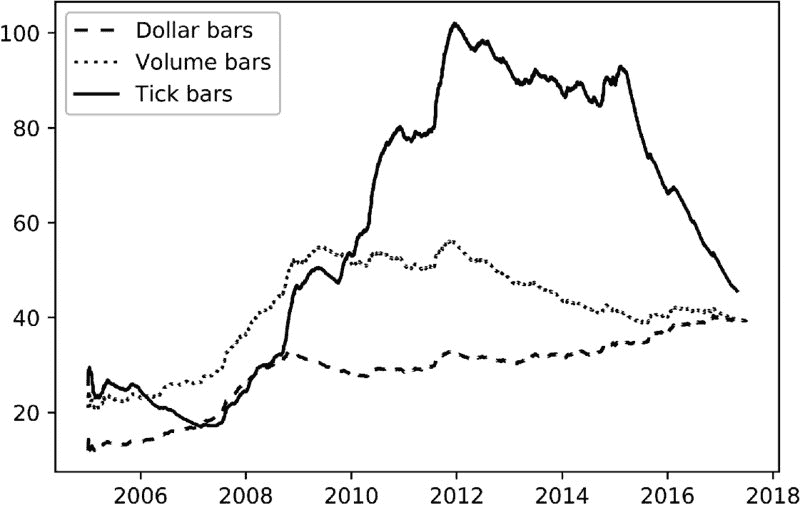

**图 2.1** 日均的成交笔数、成交量和美元条形图

另一个使得美元条形图比时间、成交笔或成交量条形图更有趣的论点是，流通股数在证券生命周期内通常会因公司行为而多次变化。即使在调整了拆分和反向拆分后，还有其他行动会影响成交笔数和成交量，例如发行新股或回购现有股份（自 2008 年大衰退以来非常常见的做法）。美元条形图在这些行动面前往往表现出稳健性。尽管如此，您可能希望对美元条形图进行采样，其中条形图的大小并未随时间保持不变。相反，条形图的大小可以根据公司的自由流通市值（在股票的情况下）或已发行债务的未偿金额（在固定收益证券的情况下）动态调整。

**2.3.2 信息驱动条形图**

信息驱动柱的目的是在新信息到达市场时更频繁地采样。在此背景下，“信息”一词是以市场微观结构的意义使用的。正如我们在第十九章中将看到的，市场微观结构理论赋予不平衡签名交易量的持续性特别重要，因为该现象与有信息交易者的存在相关。通过将采样与有信息交易者的到来同步，我们可能能够在价格达到新的均衡水平之前做出决策。在本节中，我们将探讨如何使用各种信息到达指标来采样柱。

***2.3.2.1 tick 不平衡柱***

考虑一个 tick 序列{(*p[*t*]*, *v[*t*]*)}[*t* = 1, …, *T*]，其中*p[*t*]*是与 tick *t* 相关的价格，而*v[*t*]*是与 tick *t* 相关的交易量。所谓的 tick 规则定义了一个序列{*b[*t*]*}[*t* = 1, …, *T*]，其中

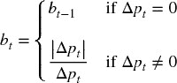

其中*b[*t*]* ∈ {−1, 1}，边界条件*b[0]*被设置为匹配前一柱的终值*b[*T*]*。tick 不平衡柱（TIBs）背后的想法是，每当 tick 不平衡超过我们的预期时，就进行柱的采样。我们希望确定 tick 指数*T*，使得签名 tick 的累积（根据 tick 规则签名）超过给定阈值。接下来，让我们讨论确定*T*的程序。

首先，我们将时间*T*的 tick 不平衡定义为

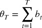

第二，我们计算在柱开始时θ[*T*]的期望值，E[0][θ[*T*]] = E[0]*T*，其中 E[0][*T*]是 tick 柱的预期大小，P[*b[*t*]* = 1]是 tick 被分类为买入的无条件概率，而 P[*b[*t*]* = −1]是 tick 被分类为卖出的无条件概率。由于 P[*b[*t*]* = 1] + P[*b[*t*]* = −1] = 1，因此 E[0][θ[*T*]] = E[0]*T*。在实际操作中，我们可以将 E[0][*T*]视为先前柱中*T*值的指数加权移动平均，而(2P[*b[*t*]* = 1] − 1)视为先前柱中*b[*t*]*值的指数加权移动平均。

第三，我们将 tick 不平衡柱（TIB）定义为一个*T*的*连续 tick 子集，以满足以下条件：

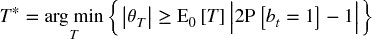

预期不平衡的大小由|2P[*b[*t*]* = 1] − 1|所暗示。当θ[*T*]比预期更不平衡时，较低的*T*将满足这些条件。因此，在有信息交易（触发单边交易的非对称信息）存在的情况下，TIBs 的产生会更频繁。实际上，我们可以将 TIBs 理解为包含相同数量信息的交易桶（无论交易的交易量、价格或 ticks）。

***2.3.2.2 交易量/美元不平衡柱***

交易量失衡柱（VIBs）和美元失衡柱（DIBs）背后的理念是扩展 ticks 失衡柱（TIBs）的概念。我们希望在交易量或美元失衡与我们的预期发生偏离时对柱子进行取样。基于我们为 TIBs 讨论的 ticks 规则和边界条件*b [0]*的相同概念，我们将定义一个程序来确定下一个样本的索引*T*。

首先，我们将时间*T*的失衡定义为

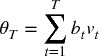

其中*v [*t*]*可以表示交易的证券数量（VIB）或交换的美元金额（DIB）。你选择的*v [*t*]*决定了你是根据前者还是后者进行取样。

第二，我们在柱子的开始计算θ[*T*]的期望值

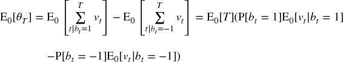

设我们定义*v ^+* = P[*b [*t*]* = 1]E [0] [*v [*t*]* | *b [*t*]* = 1]，*v ^−* = P[*b [*t*]* = −1]E [0] [*v [*t*]* | *b [*t*]* = −1]，因此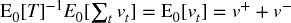。你可以将*v ^+*和*v ^−*视为将*v [*t*]*的初始期望分解为由买入和卖出贡献的成分。然后

在实践中，我们可以将 E [0] [*T*]估计为来自先前柱子的*T*值的指数加权移动平均值，以及(2 *v ^+* − E [0] [*v [*t*]*])作为来自先前柱子的*b [*t*] v [*t*]*值的指数加权移动平均值。

第三，我们将 VIB 或 DIB 定义为一个*T* *-连续的 ticks 子集，以满足以下条件：

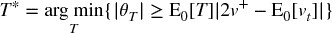

其中期望失衡的大小由|2 *v ^+* − E [0] [*v [*t*]*]|暗示。当θ[*T*]的失衡程度超出预期时，较低的*T*将满足这些条件。这是基于信息的交易量和美元柱的类似物，像其前身一样，它解决了关于 ticks 碎片化和异常值的相同问题。此外，它还解决了公司行为的问题，因为上述程序不依赖于固定的柱子大小。相反，柱子大小是动态调整的。

***2.3.2.3 Tick Runs Bars***

TIBs、VIBs 和 DIBs 监测订单流失衡，以 ticks、交易量和交换的美元值为度量。大型交易者将扫清订单簿，使用冰山订单，或将父订单切分成多个子订单，这些操作都会在{*b [*t*]*}[*t* = 1, …, *T*]序列中留下运行的痕迹。因此，监测整体交易量中的*序列*，并在该序列与我们的预期发生偏离时进行取样是很有用的。

首先，我们将当前运行的长度定义为

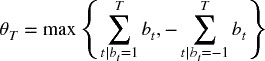

第二，我们在柱子的开始计算θ[*T*]的期望值

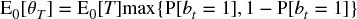

在实践中，我们可以将 E [0] [*T*]估计为来自先前柱子的*T*值的指数加权移动平均值，以及 P[*b [*t*]* = 1]作为来自先前柱子的买 ticks 比例的指数加权移动平均值。

第三，我们将点交易条（TRB）定义为一个 *T* *-连续的点集合，满足以下条件：

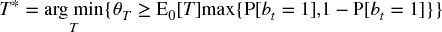

期望的交易次数由 max{P[ *b [*t*]* = 1], 1 − P[ *b [*t*]* = −1]} 所隐含。当 θ [*T*] 展示的交易次数超出预期时，低 *T* 将满足这些条件。注意在这一交易定义中，我们允许序列中断。也就是说，我们不再测量最长序列的长度，而是计算每一方的点数，而不进行偏移（没有不平衡）。在形成条的背景下，这一定义比测量序列长度更有用。

***2.3.2.4 交易量/美元交易条***

交易量条（VRBs）和美元交易条（DRBs）将上述交易定义扩展到交易的量和金额。直观上，我们希望在任一方的交易量或金额超出我们对某条的预期时进行抽样。根据我们习惯的点差规则命名法，我们需要确定条中的最后观察值的索引 *T*。

第一，我们将与交易相关的交易量或美元定义为

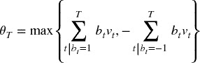

其中 *v [*t*]* 可以代表交易的证券数量（VRB）或交换的美元金额（DRB）。你选择的 *v [*t*]* 决定了你是根据前者还是后者进行抽样。

第二，我们计算条开始时 θ [*T*] 的期望值，

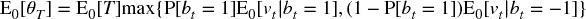

实际上，我们可以将 E [0] [ *T* ] 估计为先前条中 *T* 值的指数加权移动平均，P[ *b [*t*]* = 1] 估计为先前条中买入点比例的指数加权移动平均，E [0] [ *v [*t*]* | *b [*t*]* = 1] 估计为先前条中买入交易量的指数加权移动平均，E [0] [ *v [*t*]* | *b [*t*]* = −1] 估计为先前条中卖出交易量的指数加权移动平均。

第三，我们将交易量条（VRB）定义为一个 *T* *-连续的点集合，满足以下条件：

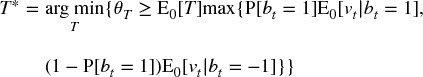

期望的交易量由 max{P[ *b [*t*]* = 1]E [0] [ *v [*t*]* | *b [*t*]* = 1], (1 − P[ *b [*t*]* = 1])E [0] [ *v [*t*]* | *b [*t*]* = −1]} 所隐含。当 θ [*T*] 展示的交易次数超出预期时，或者交易量大于预期时，低 *T* 将满足这些条件。

## 2.4 处理多产品系列

有时我们希望建模一个工具的时间序列，其中权重需要随着时间动态调整。其他时候，我们必须处理支付不规则息票或股息的产品，或受到企业行动影响的产品。改变所研究的时间序列性质的事件需要妥善处理，否则我们会无意中引入结构性突破，从而误导我们的研究工作（更多内容将在第十七章讨论）。这个问题以多种形式出现：当我们建模权重变化的价差，或需要再投资股息/息票的证券篮子，或需要重新平衡的篮子，或当一个指数的成分发生变化，或当我们必须用另一个替换已到期/成熟的合同/证券等。

期货就是一个典型的例子。根据我的经验，人们在处理期货时往往不必要地感到困难，主要是因为他们不知道如何很好地处理换仓。基于期货的价差、或股票或债券的组合策略也可以说是如此。在下一节中，我将向你展示如何将一个证券组合建模为一个单一的现金产品。我称之为“ETF 技巧”，因为目标是将任何复杂的多产品数据集转化为一个类似于总回报 ETF 的单一数据集。这有什么用？因为你的代码可以始终假设你只交易现金类产品（非到期现金工具），无论底层系列的复杂性和组成如何。

**2.4.1 ETF 技巧**

假设我们希望开发一个交易期货价差的策略。在处理价差而不是单一工具时，会出现一些小麻烦。首先，价差由一个随时间变化的权重向量来表征。因此，即使价格不变，价差本身也可能收敛。当这种情况发生时，基于该序列的模型可能会误认为盈亏（利润和损失的净市值）是由于该权重引起的收敛所致。其次，价差可能会出现负值，因为它们并不代表价格。这往往会造成问题，因为大多数模型假设价格为正。第三，交易时间不会完全对齐所有成分，因此价差并不总是可以在最后发布的水平进行交易，或者没有延迟风险。此外，必须考虑执行成本，例如跨越买卖差价。

避免这些问题的一种方法是生成一个反映在价差中投资$1 的时间序列。该序列的变化将反映盈亏（PnL）的变化，该序列在最坏的情况下将始终为正（至多是微小的），并且实施损失将被考虑在内。这个序列将用于建模、生成信号和交易，就像它是一个 ETF 一样。

假设我们有一个由第 2.3 节中解释的任何方法得出的历史数据条。 这些数据条包含以下列：

+   *o [*i* , *t*]* 是在柱 *t* = 1, …, *T* 时工具 *i* = 1, …, *I* 的原始开盘价。

+   *p [*i* , *t*]* 是在柱 *t* = 1, …, *T* 时工具 *i* = 1, …, *I* 的原始收盘价。

+   φ [*i* , *t*] 是在柱 *t* = 1, …, *T* 时工具 *i* = 1, …, *I* 的一个点的 USD 值。这包括外汇汇率。

+   *v [*i* , *t*]* 是在柱 *t* = 1, …, *T* 时工具 *i* = 1, …, *I* 的交易量。

+   *d [*i* , *t*]* 是在柱 *t* 时工具 *i* 支付的持有成本、股息或票息。这个变量也可以用于收取保证金成本或融资成本。

所有工具 *i* = 1, …, *I* 在柱 *t* = 1, …, *T* 时均可交易。换句话说，即使某些工具在时间间隔 [*t* − 1, *t*] 的整个期间不可交易，但至少在时间 *t* − 1 和 *t* 时是可以交易的（市场开放并能够在这些时刻执行订单）。对于由分配向量 ω [*t*] 重新平衡（或滚动）的期货篮子，$1 的投资价值 {*K [*t*]*} 是通过以下公式推导的：

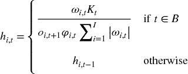

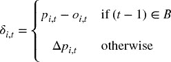

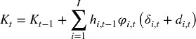

并且 *K [0]* = 1 是初始的 AUM。变量 *h [*i* , *t*]* 表示在时间 *t* 时工具 *i* 的持有量（证券或合约数量）。变量 δ [*i* , *t*] 是在时间 *t* 和 *t* − 1 之间工具 *i* 市场价值的变化。请注意，当 *t* ∈ *B* 时利润或损失被再投资，从而防止负价格。股息 *d [*i* , *t*]* 已经嵌入到 *K [*t*]* 中，因此策略不需要了解它们。*h [*i* , *t*]* 中的目的在于去杠杆配置。对于期货系列，我们可能不知道在滚动时间 *t* 时新合约的 *p [*i* , *t*]*，所以我们使用 *o [*i* , *t* + 1]* 作为时间上最近的价格。

让 τ [*i*] 表示与交易 $1 的工具 *i* 相关的交易成本，例如，τ [*i*] = 1 *E* − 4（一个基点）。策略需要知道每个观察到的柱 *t* 的三个额外变量：

1.  **再平衡成本：** 与配置再平衡相关的变量成本 {*c [*t*]*} 是 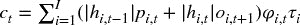，∀*t* ∈ *B*。我们不将 *c [*t*]* 嵌入到 *K [*t*]* 中，否则在配置再平衡时做空价差会产生虚假利润。在你的代码中，可以将 {*c [*t*]*} 视为（负）股息。

1.  **买卖价差：** 购买或出售一个单位此虚拟 ETF 的成本 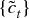 为 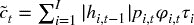。当一个单位被买入或卖出时，策略必须收取这个成本 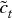，这相当于穿越此虚拟 ETF 的买卖价差。

1.  **交易量：** 交易量 {*v [*t*]*} 由篮子中最不活跃的成员决定。让 *v [*i* , *t*]* 表示在柱 *t* 上由工具 *i* 交易的量。可交易的篮子单位数量是 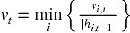。

交易成本函数不一定是线性的，基于上述信息的策略可以模拟这些非线性成本。得益于 ETF 技巧，我们可以将一篮子期货（或单一期货）建模为一个不到期的现金产品。

**2.4.2 PCA 权重**

感兴趣的读者可以在 López de Prado 和 Leinweber [2012] 以及 Bailey 和 López de Prado [2012] 中找到许多计算对冲权重的实用方法。为了完整性，让我们回顾一下推导上一节中使用的向量 {ω [*t*] } 的一种方法。考虑一个 IID 多元高斯过程，其特征由一个均值向量 μ（大小为 *Nx1*）和一个协方差矩阵 *V*（大小为 *NxN*）所描述。这个随机过程描述了一个不变的随机变量，如股票的收益、债券收益率的变化，或一组 *N* 个工具的期权波动率的变化。我们希望计算符合 *V* 主成分特定风险分布的分配向量 ω。

首先，我们进行谱分解，*VW* = *W* Λ，其中 *W* 中的列经过重新排序，使得 Λ 的对角线元素按降序排列。其次，给定一个分配向量 ω，我们可以计算投资组合的风险为 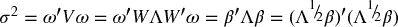，其中 β 表示 ω 在正交基上的投影。第三，Λ 是一个对角矩阵，因此 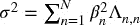，第 *n* 个成分的风险为 *R [*n*] * = β ² [   *n*   ] Λ [*n*  ,  *n*] σ ^(− 2) = [ *W* 'ω] ² [   *n*   ] Λ [*n*  ,  *n*] σ ^(− 2)，且 *R* '1 [*N*] = 1，1 [*N*] 是一个 *N* 个 1 的向量。你可以将 { *R [*n*] * } [*n*  = 1, …,  *N*] 理解为在正交成分间风险的分布。

第四，我们希望计算向量 ω，以实现用户定义的风险分布 *R*。从之前的步骤可以得出，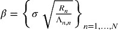 表示在新的（正交）基中的分配。第五，旧基中的分配由 ω = *W* β 给出。重新缩放 ω 仅仅是重新缩放 σ，从而保持风险分布不变。图 2.2 说明了每个主成分对逆方差分配风险的贡献。几乎所有主成分都会贡献风险，包括那些方差最高的主成分（成分 1 和 2）。相比之下，对于 PCA 投资组合，只有方差最低的成分会贡献风险。

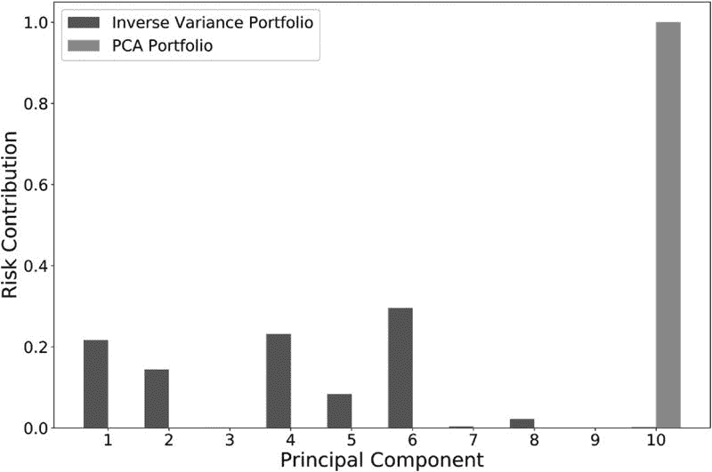

**图 2.2** 每个主成分对风险的贡献

Snippet 2.1 实现了此方法，其中用户定义的风险分布 *R* 通过参数 `riskDist` 传递（可选为 None）。如果 `riskDist` 为 None，代码将假设所有风险必须分配给具有最小特征值的主成分，权重将是最后一个特征向量重新缩放以匹配 σ (`riskTarget`)。

> **代码片段 2.1 从风险分布 R 中得到 PCA 权重**
> 
> 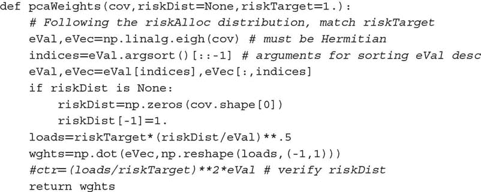

**2.4.3 单一期货滚动**

ETF 技巧可以处理单一期货合约的滚动，作为一腿价差的特例。然而，在处理单一期货合约时，更等效且直接的方法是形成累积滚动间隙的时间序列，并将该间隙系列从价格系列中扣除。代码片段 2.2 展示了这一逻辑的可能实现，使用从彭博社下载的 tick bar 系列并存储在 HDF5 表中。彭博社字段的含义如下：

+   `FUT_CUR_GEN_TICKER`：标识与该价格相关的合约。其值在每次滚动时发生变化。

+   `PX_OPEN`：与该 bar 相关的开盘价。

+   `PX_LAST`：与该 bar 相关的收盘价。

+   `VWAP`：与该 bar 相关的成交量加权平均价格。

函数`rollGaps`中的参数`matchEnd`决定期货系列是否应向前滚动（`matchEnd=False`）或向后滚动（`matchEnd=True`）。在向前滚动中，滚动系列开始时的价格与原始系列开始时的价格相匹配。在向后滚动中，滚动系列结束时的价格与原始系列结束时的价格相匹配。

> **代码片段 2.2 形成间隙系列，并从价格中扣除**
> 
> 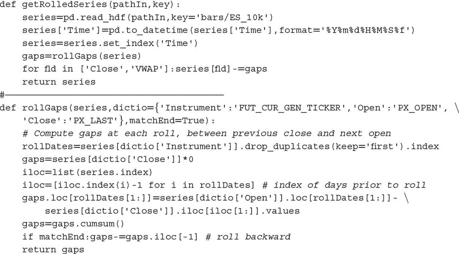

滚动价格用于模拟损益（PnL）和投资组合的市场价值。然而，仍应使用原始价格来确定头寸规模和资本消耗。请记住，滚动价格确实可能变为负值，尤其是在期货合约在升水状态下出售时。要查看这一点，可以在一系列棉花#2 期货或天然气期货上运行代码片段 2.2。

通常，我们希望处理非负的滚动系列，在这种情况下，我们可以按照以下方式推导出$1 投资的价格系列： (1) 计算滚动期货价格的时间序列，(2) 计算收益（*r*），即滚动价格变化除以前的原始价格，以及 (3) 使用这些收益形成价格系列（即`(1+r).cumprod()`）。代码片段 2.3 说明了这个逻辑。

> **代码片段 2.3 非负滚动价格系列**
> 
> 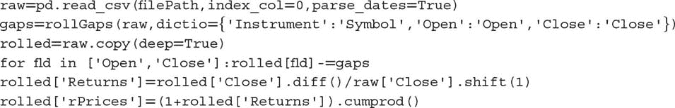

## 2.5 采样特征

到目前为止，我们已经学习如何从一组非结构化金融数据中生成一个连续、同质且结构化的数据集。虽然你可以尝试在这样的数据集上应用机器学习算法，但一般来说，这并不是一个好主意，原因有几个。首先，几个机器学习算法在样本量上扩展性较差（例如，支持向量机）。其次，机器学习算法在尝试从相关示例中学习时会实现最高的准确性。假设你希望预测下一个 5%的绝对回报是否会是正的（5%的上涨）或负的（5%的下跌）。在任何随机时间，这样的预测准确性都会很低。然而，如果我们要求分类器在特定催化条件后预测下一个 5%绝对回报的符号，我们更可能找到有用的特征，这将帮助我们实现更准确的预测。在本节中，我们讨论从条形图中抽样以生成具有相关训练示例的特征矩阵的方法。

**2.5.1 减少的抽样**

正如我们之前提到的，从结构化数据集中抽样特征的一个原因是减少用于拟合机器学习算法的数据量。这种操作也称为*下采样*。这通常通过以固定步长进行顺序抽样（线性空间抽样）或通过使用均匀分布随机抽样（均匀抽样）来完成。

线性空间抽样的主要优点是其简单性。缺点是步长是任意的，并且结果可能因种子条而异。均匀抽样通过在整个条形图集上均匀抽样来解决这些问题。尽管如此，这两种方法都受到批评，认为样本未必包含在预测能力或信息内容方面最相关观察值的子集。

**2.5.2 基于事件的抽样**

投资组合经理通常会在某些事件发生后下注，例如结构性突破（第十七章）、提取的信号（第十八章）或微观结构现象（第十九章）。这些事件可能与一些宏观经济统计数据的发布、波动率的激增、价差偏离其均衡水平等有关。我们可以将事件表征为重要，并让机器学习算法学习在这些情况下是否存在准确的预测函数。也许答案是否定的，在这种情况下，我们会重新定义什么构成一个事件，或尝试使用替代特征再次进行尝试。为了说明这一点，让我们讨论一种有用的基于事件的抽样方法。

***2.5.2.1 CUSUM 滤波器***

CUSUM 滤波器是一种质量控制方法，旨在检测所测量量的均值偏离目标值的变化。考虑来自局部平稳过程的独立同分布观察值{ *y [*t*]* } [*t* = 1, …, *T*]。我们定义累积和。

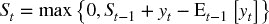

边界条件*S [0]* = 0 *.* 此过程将在满足*S [*t*]* ≥ *h*的第一个*t*上建议采取行动，某个阈值*h*（过滤器大小）。请注意，*S [*t*]* = 0，当*y [*t*]* ≤ E [*t* − 1] [ *y [*t*]* ] − *S [*t* − 1]*时。这一零底线意味着我们将跳过一些向下偏差，否则这些偏差会使*S [*t*]*为负。原因是，过滤器被设置为识别从任何重置水平零的向上偏差序列。特别是，当阈值被激活时

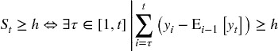

这一上升概念可以扩展到包括下降，形成对称的 CUSUM 过滤器：

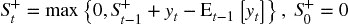

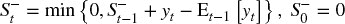

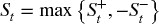

Lam 和 Yam [1997]提出了一种投资策略，当相对于先前的高点或低点观察到绝对回报*h*时生成交替的买卖信号。这些作者证明，这种策略等同于 Fama 和 Blume [1966]研究的“过滤交易策略”。我们使用 CUSUM 过滤器的方式不同：我们仅在*S [*t*]* ≥ *h*时采样一根柱，届时*S [*t*]*被重置。代码片段 2.4 展示了对称 CUSUM 过滤器的实现，其中 E [*t* − 1] [ *y [*t*]* ] = *y [*t* − 1]*。

> **代码片段 2.4 对称 CUSUM 过滤器**
> 
> 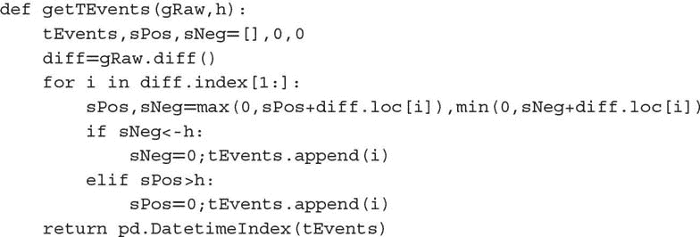

函数`getTEvents`接收两个参数：我们希望过滤的原始时间序列（`gRaw`）和阈值`h`。CUSUM 过滤器的一个实际优点是，当`gRaw`在阈值水平附近徘徊时不会触发多个事件，这是一些流行市场信号（如布林带）所遭受的缺陷。`gRaw`需要完整的长度为`h`的运行才能触发事件。图 2.3 展示了 CUSUM 过滤器在价格序列上采样的情况。

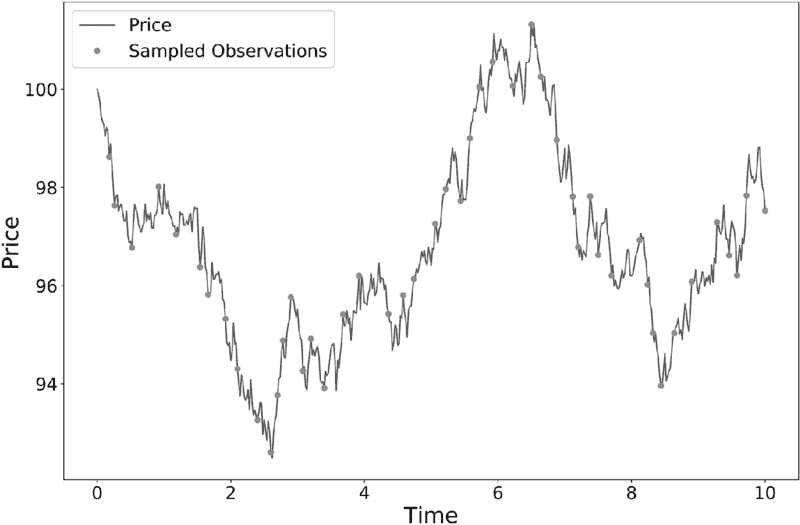

**图 2.3** CUSUM 对价格序列的采样

变量*S [*t*]*可以基于我们将在第 17-19 章讨论的任何特征，如结构性断裂统计、熵或市场微观结构测量。例如，我们可以在 SADF 明显偏离先前重置水平时声明一个事件（将在第十七章定义）。一旦我们获得这一事件驱动的柱子子集，我们将让机器学习算法判断这些事件的发生是否构成可采取的情报。

**练习**

1.  > > 在一系列 E-mini S&P 500 期货交易数据上：

    1.  形成 tick、成交量和美元柱。使用 ETF 技巧处理滚动问题。

    1.  每周计算由 tick、成交量和美元柱生成的柱数。绘制该柱数的时间序列。哪种柱类型产生了最稳定的每周计数？为什么？

    1.  计算三种柱类型的回报序列相关性。哪种柱方法具有最低的序列相关性？

    1.  将柱系列划分为每月子集。计算每种柱类型每个子集的收益方差。计算这些方差的方差。哪种方法表现出最小的方差？ 

    1.  对三种柱类型的收益应用 Jarque-Bera 正态性检验。哪种方法实现了最低的检验统计量？

1.  > > 在一系列 E-mini S&P 500 期货成交数据上，计算美元柱和美元不平衡柱。哪种柱类型表现出更大的序列相关性？为什么？
1.  > > 
1.  > > 在 E-mini S&P 500 期货和 Eurostoxx 50 期货的美元柱序列上：

    1.  应用第 2.4.2 节计算 ETF 技巧使用的 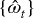 向量。（提示：你需要在滚动日期的 EUR/USD 外汇值。）

    1.  推导 S&P 500/Eurostoxx 50 利差的时间序列。

    1.  通过 ADF 检验确认序列是平稳的。

1.  > > 形成 E-mini S&P 500 期货美元柱：

    1.  计算宽度为 5% 的布林带围绕滚动移动平均线。计算价格跨越布林带的次数（从带内到带外）。

    1.  现在使用 CUSUM 过滤器对这些柱进行采样，其中 {*y [*t*]*} 为收益，*h* = 0.05*。你得到了多少样本？

    1.  计算两个采样序列的滚动标准差。哪个序列的异方差性最小？这些结果的原因是什么？

1.  > > 使用练习 4 中的柱：

    1.  使用 CUSUM 过滤器对柱进行采样，其中 {*y [*t*]*} 为绝对收益，*h* = 0.05*。

    1.  计算采样柱的滚动标准差。

    1.  将此结果与练习 4 的结果进行比较。哪个程序产生了最小的异方差样本？为什么？

**参考文献**

1.  Ané, T. 和 H. Geman (2000)：“订单流、交易时钟和资产收益的正态性。” *金融期刊*，第 55 卷，第 2259–2284 页。

1.  Bailey, David H. 和 M. López de Prado (2012)：“平衡篮子：一种新的交易和对冲风险的方法。” *投资策略期刊（风险期刊）*，第 1 卷，第 4 期（秋季），第 21–62 页。

1.  Clark, P. K. (1973)：“一种具有有限方差的次级随机过程模型用于投机价格。” *计量经济学*，第 41 卷，第 135–155 页。

1.  Easley, D., M. López de Prado 和 M. O'Hara (2011)：“量能时钟：对高频范式的见解。” *投资组合管理期刊*，第 37 卷，第 2 期，第 118–128 页。

1.  Easley, D., M. López de Prado 和 M. O'Hara (2012)：“流动性毒性和高频世界中的流动性。” *金融研究评论*，第 25 卷，第 5 期，第 1457–1493 页。

1.  Fama, E. 和 M. Blume (1966)：“过滤规则和股市交易。” *商业期刊*，第 40 卷，第 226–241 页。

1.  Kolanovic, M. 和 R. Krishnamachari (2017)：“大数据和 AI 策略：机器学习和另类数据的投资方法。” 白皮书，JP 摩根，量化和衍生品策略。5 月 18 日。

1.  Lam, K. 和 H. Yam (1997)：“金融市场技术交易的 CUSUM 技术。” *金融工程与日本市场*，第 4 卷，第 257–274 页。

1.  López de Prado, M. 和 D. Leinweber (2012)： “协整与子集相关对冲方法的进展。” *投资策略期刊（风险期刊）* ，第 1 卷，第 2 期（春季），第 67–115 页。

1.  Mandelbrot, B. 和 M. Taylor (1967)： “股票价格差异的分布。” *运筹学* ，第 15 卷，第 5 期，第 1057–1062 页。

