# 第三章：标记

## 3.1 动机

在第二章中，我们讨论了如何从非结构化数据集中生成金融特征矩阵 *X* 。无监督学习算法可以从该特征矩阵 *X* 中学习模式，例如是否包含层次聚类。另一方面，有监督学习算法要求 *X* 中的行与标签或值 *y* 数组相关联，以便可以对未见特征样本进行这些标签或值的预测。在本章中，我们将讨论标记金融数据的方法。

## 3.2 固定时间范围方法

在金融领域，几乎所有的机器学习论文都使用固定时间范围方法对观察结果进行标记。该方法可以描述如下。考虑一个特征矩阵 *X* ，具有 *I* 行，{ *X [*i*]* } [*i* = 1, …, *I*] ，从某些以 *t* = 1, …, *T* 为索引的条形图中提取，其中 *I* ≤ *T* 。第二章第 2.5 节讨论了生成特征集 { *X [*i*]* } [*i* = 1, …, *I*] 的采样方法。观察 *X [*i*]* 被分配一个标签 *y [*i*]* ∈ { − 1, 0, 1}，

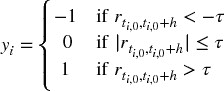

其中 τ 是预定义的常量阈值，*t [*i* , 0]* 是 *X [*i*]* 发生后紧接着的条形图索引，*t [*i* , 0]* + *h* 是 *t [*i* , 0]* 后第 *h* 个条形图的索引，而  是在条形图范围 *h* 内的价格回报，

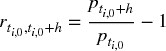

因为文献几乎总是使用时间条形图，*h* 意味着一个固定时间范围。参考文献部分列出了多个机器学习研究，其中 Dixon 等人 [2016] 是这种标记方法的一个近期例子。尽管其流行，但在大多数情况下，有几个理由要避免这种方法。首先，正如我们在第二章中所看到的，时间条形图并不具有良好的统计性质。其次，无论观察到的波动性如何，都应用相同的阈值 τ 。假设 τ = 1 *E* − 2，有时我们将观察标记为 *y [*i*]* = 1，基于实现的条形图波动性 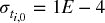 （例如，在夜间交易时段），有时为 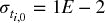 （例如，在开盘时）。即使回报 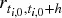 是可预测且统计显著的，大多数标签将是 0。

换句话说，根据固定的时间柱阈值来标记观察是一个非常常见的错误。这里有几个更好的替代方案。首先，按照变化的阈值标记 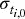，该阈值是通过对收益的滚动指数加权标准差进行估算的。其次，使用成交量或美元柱，因为它们的波动率更接近恒定（同方差性）。但即使这两个改进也忽略了固定时间区间方法的一个关键缺陷：价格的路径。每个投资策略都有止损限制，无论是投资组合经理自设的，风险部门强制执行的，还是因保证金追缴而触发的。建立一种依赖于会被交易所强制平仓的头寸来获利的策略是极不现实的。几乎没有任何出版物在标记观察时考虑到这一点，这说明了当前投资文献的状态。

## 3.3 计算动态阈值

正如前一节所论述的，实际上我们希望设置的利润获取和止损限制是与下注风险相关的函数。否则，有时我们会目标过高（ 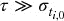），有时目标过低（ 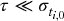），考虑到当前的波动率。

片段 3.1 在日内估计点计算每日波动率，应用`span0`天的跨度到指数加权移动标准差。有关`pandas.Series.ewm`函数的详细信息，请参见 pandas 文档。

> **片段 3.1 每日波动率估计**
> 
> 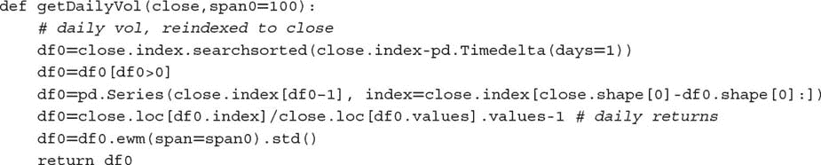

我们可以使用该函数的输出在本章的其余部分设置默认的利润获取和止损限制。

## 3.4 三重障碍法

在这里，我将介绍一种我在文献中未找到的替代标记方法。如果你是一名投资专业人士，我想你会同意这更合理。我称之为三重障碍法，因为它根据接触的第一个障碍对观察进行标记，共有三个障碍。首先，我们设置两个水平障碍和一个垂直障碍。两个水平障碍由利润获取和止损限制定义，这些限制是估计波动率的动态函数（无论是实现的还是隐含的）。第三个障碍根据自持仓以来经过的柱数定义（到期限制）。如果首先触及上障碍，我们将观察标记为 1。如果首先触及下障碍，我们将观察标记为−1。如果首先触及垂直障碍，我们有两个选择：收益的符号，或 0。我个人更倾向于前者，因为这涉及在限制内实现利润或损失，但你应该探索在你的特定问题中 0 是否更有效。

你可能注意到三重障碍方法是路径依赖的。为了标记一个观察，我们必须考虑整个路径 [ *t [*i* , 0]* , *t [*i* , 0]* + *h* ]，其中 *h* 定义了垂直障碍（到期限制）。我们将 *t [*i* , 1]* 表示为第一次障碍触碰的时间，与观察特征相关的回报为 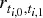 。为了清晰起见，*t [*i* , 1] * ≤ *t [*i* , 0] * + *h*，并且水平障碍不一定是对称的。

片段 3.2 实现了三重障碍方法。该函数接收四个参数：

+   `close` : 一个价格的 pandas 系列。

+   `events` : 一个 pandas 数据框，包含列，

    +   `t1` : 垂直障碍的时间戳。当值为 `np.nan` 时，将没有垂直障碍。

    +   `trgt` : 水平障碍的单位宽度。

+   `ptSl` : 一个包含两个非负浮点值的列表：

    +   `ptSl[0]` : 乘以 `trgt` 设置上障碍宽度的因子。如果为 0，则不会有上障碍。

    +   `ptSl[1]` : 乘以 `trgt` 设置下障碍宽度的因子。如果为 0，则不会有下障碍。

+   `molecule` : 一个包含将由单线程处理的事件索引子集的列表。其使用将在本章后面变得清晰。

> **片段 3.2 三重障碍标记方法**
> 
> 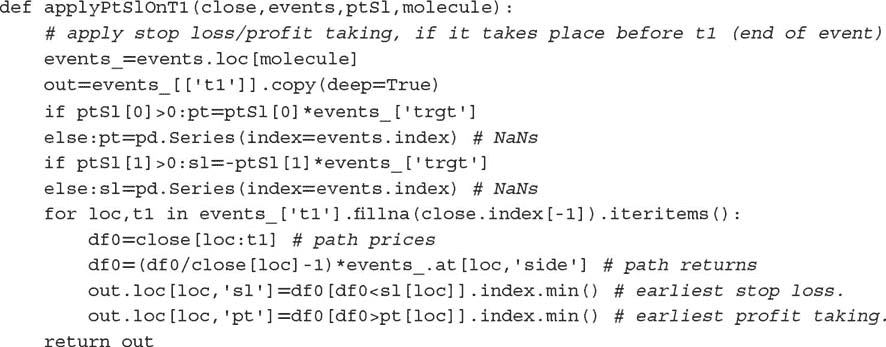

此函数的输出是一个包含每个障碍触碰时间戳（如果有）的 pandas 数据框。从之前的描述可以看出，该方法考虑了三个障碍可能被禁用的情况。我们用三元组 [ `pt,sl,t1` ] 来表示障碍配置，其中 0 表示障碍不活跃，1 表示障碍活跃。可能的八种配置为：

+   三个有用的配置：

    +   [1,1,1]: 这是标准配置，我们定义了三个障碍退出条件。我们希望实现利润，但对于损失有一个最大容忍度和持有期限。

    +   [0,1,1]: 在这个设置中，我们希望在若干柱后退出，除非被止损。

    +   [1,1,0]: 在这里，我们希望在未被止损的情况下获利。这在一定程度上是不现实的，因为我们愿意持有头寸直到成功。

+   三个不太现实的配置：

    +   [0,0,1]: 这等同于固定时间范围的方法。当应用于基于成交量、美元或信息驱动的柱状图时，仍然可能有用，并且在该范围内更新多个预测。

    +   [1,0,1]: 持有一个头寸直到获利或超过最大持有期限，而不考虑中间未实现的损失。

    +   [1,0,0]: 持有一个头寸直到获利。这可能意味着在亏损头寸上锁定多年。

+   两个不合逻辑的配置：

    +   [0,1,0]: 这是一个无目标配置，我们持有头寸直到被止损。

    +   [0,0,0]：没有障碍。该位置永远被锁定，并且未生成任何标签。

图 3.1 展示了三重障碍方法的两种替代配置。在左侧，配置为[1,1,0]，其中第一个触碰的障碍是下方的水平障碍。在右侧，配置为[1,1,1]，其中第一个触碰的障碍是垂直的。

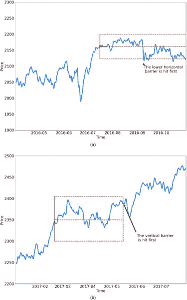

**图 3.1** 三重障碍方法的两种替代配置
