**3.5 学习方向和大小**

在本节中，我们将讨论如何标记示例，以便机器学习算法可以学习赌注的方向和大小。当我们没有基础模型来设置头寸的符号（多头或空头）时，我们对学习赌注的方向感兴趣。在这种情况下，我们无法区分获利了结障碍和止损障碍，因为这需要对方向的了解。学习方向意味着要么没有横向障碍，要么横向障碍必须是对称的。

片段 3.3 实现了函数 `getEvents`，该函数找到第一个障碍触及的时间。该函数接收以下参数：

+   `close` : 一个价格的 pandas 系列。

+   `tEvents` : 包含将为每个三重障碍播种的时间戳的 pandas 时间索引。这些是第二章第 2.5 节讨论的采样程序选定的时间戳。

+   `ptSl` : 一个非负浮点数，用于设置两个障碍的宽度。0 值表示相应的横向障碍（获利了结和/或止损）将被禁用。

+   `t1` : 一个包含垂直障碍时间戳的 pandas 系列。当我们想禁用垂直障碍时传递 `False`。

+   `trgt` : 一个表示绝对收益的 pandas 系列。

+   `minRet` : 进行三重障碍搜索所需的最低目标收益。

+   `numThreads` : 函数同时使用的线程数。

> **片段 3.3 获取第一次触及的时间**
> 
> 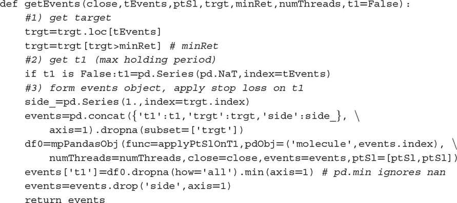

假设 *I* = 1 *E* 6 和 *h* = 1 *E* 3，那么在单个工具上评估的条件数量可高达十亿。许多机器学习任务计算上很昂贵，除非你熟悉多线程，而这就是其中之一。并行计算在这里发挥作用。第二十章讨论了一些我们将在整本书中使用的多进程函数。

函数 `mpPandasObj` 调用一个多进程引擎，这在第二十章中有深入解释。此时，你只需知道该函数将并行执行 `applyPtSlOnT1`。函数 `applyPtSlOnT1` 返回每个障碍被触及的时间戳（如果有的话）。然后，第一个触及的时间是 `applyPtSlOnT1` 返回的三个时间中最早的时间。因为我们必须学习赌注的方向，我们传递 `ptSl = [ptSl, ptSl]` 作为参数，并且我们任意将方向设置为始终为多头（横向障碍是对称的，因此方向与确定第一次触及的时间无关）。该函数的输出是一个包含以下列的 pandas 数据框：

+   `t1` : 第一个障碍被触及的时间戳。

+   `trgt` : 用于生成横向障碍的目标。

代码片段 3.4 展示了定义垂直障碍的一种方法。对于 `tEvents` 中的每个索引，它会找到在 `numDays` 天数之后或立即之后的下一个价格柱的时间戳。这个垂直障碍可以作为可选参数 `t1` 传递给 `getEvents`。

> **代码片段 3.4 添加垂直障碍**
> 
> 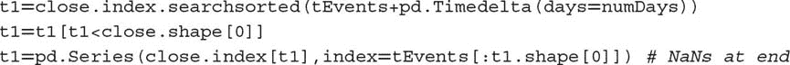

最后，我们可以使用代码片段 3.5 中定义的 `getBins` 函数对观察进行标记。参数是我们刚刚讨论的 `events` 数据框和 `close` pandas 价格序列。输出是一个包含以下列的数据框：

+   `ret` : 第一个触及障碍时实现的回报。

+   `bin` : 标签，{−1, 0, 1}，作为结果符号的函数。该函数可以很容易地调整为将触及垂直障碍的事件标记为 0，这留作练习。

> **代码片段 3.5 侧面和大小的标记**
> 
> 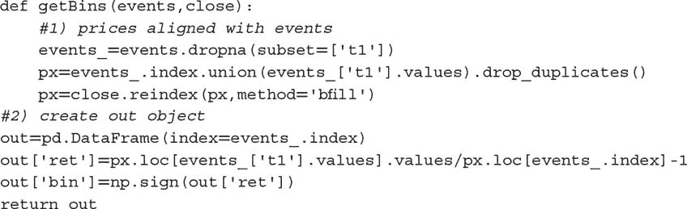

**3.6 元标记**

假设你有一个模型来设置投注方向（做多或做空）。你只需要了解该投注的大小，包括没有投注（零大小）的可能性。这是实践者经常面临的情况。我们通常知道我们想买入还是卖出某种产品，唯一剩下的问题是我们应该在这种投注中冒多大风险。我们不希望机器学习算法学习方向，只希望告诉我们适当的大小。在这一点上，听到没有书籍或论文讨论这一常见问题可能不会让你感到惊讶。幸运的是，这种困境在这里结束。我称这个问题为元标记，因为我们想构建一个次级机器学习模型，学习如何使用一个主要的外生模型。

我们将对之前的代码进行一些调整，而不是编写一个全新的 `getEvents` 函数，以处理元标记。首先，我们接受一个新的 `side` 可选参数（默认值为 `None`），该参数包含由主模型决定的我们的投注方向。当 `side` 不是 `None` 时，函数理解元标记在起作用。其次，由于我们现在知道方向，我们可以有效地区分获利和平仓。水平障碍不需要对称，如第 3.5 节所述。参数 `ptSl` 是一个包含两个非负浮点值的列表，其中 `ptSl[0]` 是乘以 `trgt` 的因子，用于设置上障碍的宽度，而 `ptSl[1]` 是乘以 `trgt` 的因子，用于设置下障碍的宽度。当任一值为 0 时，相应的障碍被禁用。代码片段 3.6 实现了这些增强功能。

> **代码片段 3.6 扩展 `**GETEVENTS**` 以整合元标记**
> 
> 

同样，我们需要扩展 `getBins` 函数，以便它处理元标记。代码片段 3.7 实现了必要的更改。

> **代码片段 3.7 扩展 `**GETBINS**` 以整合元标记**
> 
> 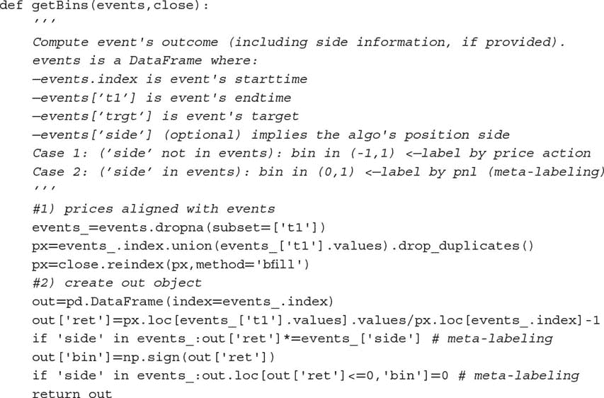

现在，`out[‘bin’]`中标签的可能值为{0,1}，与之前的可行值{−1,0,1}不同。机器学习算法将被训练来决定是下注还是放弃，这是一种纯粹的二元预测。当预测标签为 1 时，我们可以利用这个二次预测的概率来推导下注的大小，其中位置的方向（符号）由主要模型设定。

**3.7 如何使用元标签**

二元分类问题在假阳性（类型 I 错误）和假阴性（类型 II 错误）之间存在权衡。一般来说，提高二元分类器的真正阳性率会倾向于提高其假阳性率。二元分类器的接收者操作特征（ROC）曲线衡量提高真正阳性率的成本，表现为接受更高假阳性率。

图 3.2 说明了所谓的“混淆矩阵”。在一组观察中，有一些项目表现出一种条件（正类，左矩形），而有些项目则没有表现出这种条件（负类，右矩形）。一个二元分类器预测某些项目表现出该条件（椭圆），其中 TP 区域包含真正的正类，TN 区域包含真正的负类。这导致了两种错误：假阳性（FP）和假阴性（FN）。“精确率”是 TP 区域与椭圆区域的比率。“召回率”是 TP 区域与左矩形区域的比率。这种召回率（即真正阳性率）是在分类问题的背景下，类似于假设检验中的“检验力”。“准确率”是 TP 和 TN 区域的总和除以总体项目（方形）。一般来说，降低 FP 区域的代价是增加 FN 区域，因为较高的精确率通常意味着较少的调用，因此召回率较低。尽管如此，仍然存在一种精确率和召回率的组合，可以最大化分类器的整体效率。F1 分数测量分类器的效率，作为精确率和召回率之间的调和平均值（更多内容见第十四章）。

**图 3.2** “混淆矩阵”的可视化

元标签在你想要实现更高的 F1 分数时特别有用。首先，我们建立一个即使精确率不是特别高也能实现高召回率的模型。其次，我们通过对主要模型预测的正类应用元标签来修正低精确率。

元标签将通过过滤掉假阳性来提高你的 F1-score，其中大多数阳性已经被主要模型识别。换句话说，次要机器学习算法的作用是确定来自主要（外生）模型的阳性是真还是假。它*并不是*为了提供投注机会。它的目的是确定我们是采取行动还是放弃所呈现的机会。

元标签是你武器库中一个非常强大的工具，原因有四个。首先，机器学习算法常常被批评为黑箱（见第一章）。元标签允许你在白箱之上构建一个机器学习系统（如基于经济理论的基础模型）。将基础模型转化为机器学习模型的能力使得元标签对于“量化基础”公司特别有用。其次，当应用元标签时，过拟合的影响被限制，因为机器学习不会决定你下注的方向，只会决定大小。第三，通过将方向预测与大小预测分开，元标签能够实现复杂的策略结构。例如，驱动上涨的特征可能与驱动下跌的特征不同。在这种情况下，你可能想要专门开发一个基于主要模型买入推荐的长期头寸机器学习策略，以及一个基于完全不同主要模型卖出推荐的短期头寸机器学习策略。第四，在小额投注上实现高准确率而在大额投注上实现低准确率会毁了你。识别良好机会的同时，合理地确定其规模同样重要，因此开发一个专注于准确判断（规模）的机器学习算法是有意义的。我们将在第十章中重提这一第四点。根据我的经验，元标签机器学习模型能够提供比标准标签模型更稳健和可靠的结果。

**3.8 量化基础方法**

你可能在媒体上看到许多对冲基金正在采纳量化基础的方法。简单的谷歌搜索会显示报告，许多对冲基金，包括一些最传统的基金，正在投资数千万美元于旨在结合人类专业知识与定量方法的技术。事实证明，元标签正是这些人一直在等待的。让我们看看原因。

假设你有一系列特征，相信可以预测某些价格，只是不知道如何做。由于你没有模型来确定每次下注的方向，你需要学习方向和大小。你应用在第 3.5 节中学到的知识，并基于对称水平边界的三重障碍法生成一些标签。现在你准备在训练集上拟合你的算法，并在测试集上评估预测的准确性。或者，你可以这样做：

1.  使用主要模型的预测，并生成元标签。请记住，在这种情况下，水平障碍不需要对称。

1.  再次在相同的训练集上拟合你的模型，但这次使用你刚生成的元标签。

1.  将第一个机器学习模型的“边”与第二个机器学习模型的“大小”结合起来。

你始终可以为任何主要模型添加一个元标签层，无论它是机器学习算法、计量经济方程、技术交易规则、基本分析等。这也包括仅基于人类直觉生成的预测。在这种情况下，元标签将帮助我们判断何时应追求或拒绝一个自由裁量基金经理的建议。这样的元标签机器学习算法使用的特征可以从市场信息到生物统计数据再到心理评估。例如，元标签机器学习算法可能会发现，当发生结构性变化时，自由裁量基金经理往往做出特别好的判断（第十七章），因为他们可能更快地理解市场机制的变化。相反，它可能会发现，由于睡眠不足、疲劳、体重变化等原因，压力下的基金经理往往做出不准确的预测。^(1) 许多职业要求定期进行心理考试，而机器学习元标签算法可能会发现这些分数也与评估我们对基金经理预测的信心程度相关。也许这些因素都不会影响自由裁量基金经理，他们的大脑独立于情感，像冷酷的计算机器一样运作。我猜这不是情况，因此元标签应成为每个自由裁量对冲基金的重要机器学习技术。在不久的将来，每个自由裁量对冲基金都将成为量化与基本结合的公司，元标签为它们提供了明确的转型路径。

**3.9 删除不必要的标签**

一些机器学习分类器在类别严重不平衡时表现不佳。在这种情况下，最好删除极为稀有的标签，专注于更常见的结果。片段 3.8 提供了一种递归删除与极稀有标签相关的观察值的过程。函数 `dropLabels` 递归消除与出现频率低于 `minPct` 的类相关的观察值，除非只剩下两个类。

> **片段 3.8 删除人口不足的标签**
> 
> 

顺便提一下，您可能希望去掉不必要的标签的另一个原因是这个已知的 sklearn bug：[`github.com/scikit-learn/scikit-learn/issues/8566`](https://github.com/scikit-learn/scikit-learn/issues/8566)。这种 bug 是 sklearn 实现中非常基本假设的结果，解决它们远非易事。在这个特定实例中，错误源于 sklearn 选择使用标准 numpy 数组，而不是结构化数组或 pandas 对象。您在阅读本章时不太可能会有修复，或在不久的将来有修复。在后面的章节中，我们将研究通过构建您自己的类和扩展 sklearn 功能来规避这些实现错误的方法。

**练习**

1.  > > 为 E-mini S&P 500 期货形成美元条：

    1.  应用对称 CUSUM 过滤器（第二章，第 2.5.2.1 节），阈值为日收益率的标准差（片段 3.1）。

    1.  在一个 pandas 序列`t1`上使用片段 3.4，其中`numDays = 1`。

    1.  在这些采样特征上，应用三重障碍法，其中`ptSl = [1,1]`，`t1`是您在第 1.b 点创建的序列。

    1.  应用`getBins`生成标签。

1.  > > 从第 1 个练习中，使用片段 3.8 去掉稀有标签。
1.  > > 
1.  > > 调整`getBins`函数（片段 3.5），以便在垂直障碍首先被触及时返回 0。
1.  > > 
1.  > > 基于流行的技术分析指标（例如交叉移动平均）开发趋势跟随策略。对于每个观察值，模型建议一个方向，但不建议下注的大小。

    1.  为`ptSl = [1,2]`和`t1`推导元标签，其中`numDays = 1`。将日标准差（由片段 3.1 计算得出）作为`trgt`。

    1.  训练一个随机森林来决定是否进行交易。注意：决定是是否交易，{0,1}，因为基础模型（交叉移动平均）已决定方向，{−1,1}。

1.  > > 基于布林带开发均值回归策略。对于每个观察值，模型建议一个方向，但不建议下注的大小。

    1.  为`ptSl = [0,2]`和`t1`推导元标签，其中`numDays = 1`。将日标准差（由片段 3.1 计算得出）作为`trgt`。

    1.  训练一个随机森林来决定是否进行交易。特征包括：波动性、序列相关性以及第 2 个练习中的交叉移动平均线。

    1.  主模型的预测准确率是多少（即，如果次级模型不过滤投注）？精确率、召回率和 F1 分数是多少？

    1.  次级模型的预测准确率是多少？精确率、召回率和 F1 分数是多少？

**参考文献**

1.  Ahmed, N., A. Atiya, N. Gayar, 和 H. El-Shishiny (2010): “机器学习模型在时间序列预测中的实证比较。” *计量经济学评论*，第 29 卷，第 5–6 期，第 594–621 页。

1.  Ballings, M., D. van den Poel, N. Hespeels 和 R. Gryp (2015): “评估多种分类器用于股票价格方向预测。” *应用专家系统* ，第 42 卷，第 20 期，页码 7046–7056。

1.  Bontempi, G., S. Taieb 和 Y. Le Borgne (2012): “时间序列预测的机器学习策略。” *商业信息处理讲义* ，第 138 卷，第 1 期，页码 62–77。

1.  Booth, A., E. Gerding 和 F. McGroarty (2014): “使用性能加权随机森林和季节性进行自动交易。” *应用专家系统* ，第 41 卷，第 8 期，页码 3651–3661。

1.  Cao, L. 和 F. Tay (2001): “使用支持向量机进行金融预测。” *神经计算与应用* ，第 10 卷，第 2 期，页码 184–192。

1.  Cao, L., F. Tay 和 F. Hock (2003): “在金融时间序列预测中使用自适应参数的支持向量机。” *IEEE 神经网络学报* ，第 14 卷，第 6 期，页码 1506–1518。

1.  Cervelló-Royo, R., F. Guijarro 和 K. Michniuk (2015): “基于模式识别和技术分析的股票市场交易规则：使用日内数据预测道琼斯工业平均指数。” *应用专家系统* ，第 42 卷，第 14 期，页码 5963–5975。

1.  Chang, P., C. Fan 和 J. Lin (2011): “使用案例基础模糊决策树发现金融时间序列数据的趋势。” *应用专家系统* ，第 38 卷，第 5 期，页码 6070–6080。

1.  Kuan, C. 和 L. Tung (1995): “使用前馈和递归神经网络进行汇率预测。” *应用计量经济学期刊* ，第 10 卷，第 4 期，页码 347–364。

1.  Creamer, G. 和 Y. Freund (2007): “自动交易的提升方法。” *交易期刊* ，第 2 卷，第 3 期，页码 84–96。

1.  Creamer, G. 和 Y. Freund (2010): “使用提升和专家加权的自动交易。” *量化金融* ，第 10 卷，第 4 期，页码 401–420。

1.  Creamer, G., Y. Ren, Y. Sakamoto 和 J. Nickerson (2016): “针对股票市场的文本分析算法：欧洲案例。” *投资期刊* ，第 25 卷，第 3 期，页码 105–116。

1.  Dixon, M., D. Klabjan 和 J. Bang (2016): “基于分类的金融市场预测使用深度神经网络。” *算法金融* ，即将出版 (2017)。可在 SSRN 获取: [`ssrn.com/abstract=2756331`](https://ssrn.com/abstract=2756331) 。

1.  Dunis, C. 和 M. Williams (2002): “建模和交易欧元/美元汇率：神经网络模型表现得更好吗？” *衍生品与对冲基金期刊* ，第 8 卷，第 3 期，页码 211–239。

1.  Feuerriegel, S. 和 H. Prendinger (2016): “基于新闻的交易策略。” *决策支持系统* ，第 90 卷，页码 65–74。

1.  Hsu, S., J. Hsieh, T. Chih 和 K. Hsu (2009): “通过整合自组织映射和支持向量回归进行股票价格预测的两阶段架构。” *应用专家系统* ，第 36 卷，第 4 期，页码 7947–7951。

1.  Huang, W.、Y. Nakamori 和 S. Wang (2005): “使用支持向量机预测股市变动方向。” *计算机与运筹研究* , 第 32 卷, 第 10 期, 第 2513–2522 页。

1.  Kara, Y.、M. Boyacioglu 和 O. Baykan (2011): “使用人工神经网络和支持向量机预测股票价格指数变动的方向：以伊斯坦布尔证券交易所为例。” *专家系统与应用* , 第 38 卷, 第 5 期, 第 5311–5319 页。

1.  Kim, K. (2003): “使用支持向量机进行金融时间序列预测。” *神经计算* , 第 55 卷, 第 1 期, 第 307–319 页。

1.  Krauss, C.、X. Do 和 N. Huck (2017): “深度神经网络、梯度增强树、随机森林：对标普 500 的统计套利。” *欧洲运筹学杂志* , 第 259 卷, 第 2 期, 第 689–702 页。

1.  Laborda, R. 和 J. Laborda (2017): “树结构分类器能为投资者增值吗？” *金融研究快报* , 第 22 卷 (8 月), 第 211–226 页。

1.  Nakamura, E. (2005): “使用神经网络进行通货膨胀预测。” *经济学信函* , 第 86 卷, 第 3 期, 第 373–378 页。

1.  Olson, D. 和 C. Mossman (2003): “使用会计比率的加拿大股票收益的神经网络预测。” *国际预测杂志* , 第 19 卷, 第 3 期, 第 453–465 页。

1.  Patel, J.、S. Sha、P. Thakkar 和 K. Kotecha (2015): “使用趋势确定数据准备和机器学习技术预测股票及股票价格指数的变动。” *专家系统与应用* , 第 42 卷, 第 1 期, 第 259–268 页。

1.  Patel, J.、S. Sha、P. Thakkar 和 K. Kotecha (2015): “使用机器学习技术的融合预测股票市场指数。” *专家系统与应用* , 第 42 卷, 第 4 期, 第 2162–2172 页。

1.  Qin, Q.、Q. Wang、J. Li 和 S. Shuzhi (2013): “线性与非线性交易模型与梯度增强随机森林及其在新加坡股市的应用。” *智能学习系统与应用杂志* , 第 5 卷, 第 1 期, 第 1–10 页。

1.  Sorensen, E.、K. Miller 和 C. Ooi (2000): “股票选择的决策树方法。” *投资组合管理杂志* , 第 27 卷, 第 1 期, 第 42–52 页。

1.  Theofilatos, K.、S. Likothanassis 和 A. Karathanasopoulos (2012): “使用机器学习技术建模和交易欧元/美元汇率。” *工程、技术与应用科学研究* , 第 2 卷, 第 5 期, 第 269–272 页。

1.  Trafalis, T. 和 H. Ince (2000): “回归的支持向量机及其在金融预测中的应用。” *神经网络* , 第 6 卷, 第 1 期, 第 348–353 页。

1.  Trippi, R. 和 D. DeSieno (1992): “使用神经网络进行股票指数期货交易。” *投资组合管理杂志* , 第 19 卷, 第 1 期, 第 27–33 页。

1.  Tsai, C. 和 S. Wang (2009): “通过混合机器学习技术进行股票价格预测。” *国际工程师和计算机科学家多学科会议录* , 第 1 卷, 第 1 期, 第 755–760 页。

1.  Tsai, C., Y. Lin, D. Yen 和 Y. Chen (2011)： “通过分类器集预测股票收益。” *应用软计算*，第 11 卷，第 2 期，页 2452–2459。

1.  Wang, J. 和 S. Chan (2006)： “使用双层偏差决策树发现股票市场交易规则。” *专家系统与应用*，第 30 卷，第 4 期，页 605–611。

1.  Wang, Q., J. Li, Q. Qin 和 S. Ge (2011)： “用于新加坡股票市场的线性、自适应和非线性交易模型，采用随机森林。” 第 9 届 IEEE 国际控制与自动化会议论文集，页 726–731。

1.  Wei, P. 和 N. Wang (2016)： “维基百科与股票收益：维基百科使用模式有助于预测个别股票的走势。” 第 25 届国际互联网大会会议论文集，第 1 卷，页 591–594。

1.   bikowski, K. (2015)： “使用体积加权支持向量机与步进测试和特征选择创建股票交易策略。” *专家系统与应用*，第 42 卷，第 4 期，页 1797–1805。

1.  Zhang, G., B. Patuwo 和 M. Hu (1998)： “使用人工神经网络进行预测：最新进展。” *国际预测杂志*，第 14 卷，第 1 期，页 35–62。

1.  Zhu, M., D. Philpotts 和 M. Stevenson (2012)： “基于树的模型在股票选择中的好处。” *资产管理杂志*，第 13 卷，第 6 期，页 437–448。

1.  Zhu, M., D. Philpotts, R. Sparks 和 J. Stevenson, Maxwell (2011)： “结合 CART 和逻辑回归的混合方法用于股票排名。” *投资组合管理杂志*，第 38 卷，第 1 期，页 100–109。

**备注**

^(1)    你可能知道至少有一家大型对冲基金每天监测其研究分析师的情绪状态。

**第四章**

**样本权重**

**4.1 动机**

第三章介绍了几种标记金融观察的新方法。我们引入了两个新概念，三重障碍法和元标记法，并解释了它们在金融应用中的作用，包括量化投资策略。在本章中，您将学习如何使用样本权重来解决另一个在金融应用中普遍存在的问题，即观察并非由独立同分布（IID）过程生成。大多数机器学习文献基于 IID 假设，许多机器学习应用在金融中失败的原因之一是这些假设在金融时间序列的情况下不切实际。

**4.2 重叠结果**

在第三章中，我们给观察到的特征 *X [*i*]* 指定了一个标签 *y [*i*]*，其中 *y [*i*]* 是发生在区间 [ *t [*i* , 0]* , *t [*i* , 1]* ] 的价格条的函数。当 *t [*i* , 1]* > *t [*j* , 0]* 且 *i* < *j* 时，*y [*i*]* 和 *y [*j*]* 都将依赖于一个共同的收益 ，即在区间 [ *t [*j* , 0]* , min{ *t [*i* , 1]* , *t [*j* , 1]* } ] 上的收益。这意味着，标签系列 { *y [*i*]* } [*i* = 1, …, *I*] 在任意两个连续结果之间存在重叠时，均不满足独立同分布（IID）条件，∃ *i* | *t [*i* , 1]* > *t [*i* + 1, 0]* ..

假设我们通过将投注时间限制为 *t [*i* , 1]* ≤ *t [*i* + 1, 0]* 来规避这个问题。在这种情况下，没有重叠，因为每个特征的结果在下一个观察到的特征开始之前或开始时就已经确定。这将导致粗糙的模型，其中特征的采样频率将受到用于确定结果的时间范围的限制。一方面，如果我们希望研究持续一个月的结果，特征就必须以每月的频率进行采样。另一方面，如果我们将采样频率提高到每日，那么我们将被迫将结果的时间范围缩短为一天。此外，如果我们希望应用路径依赖的标签技术，比如三重障碍法，采样频率将从属于第一个障碍的触及。无论你做什么，将结果的时间范围限制以消除重叠都是一个糟糕的解决方案。我们必须允许 *t [*i* , 1]* > *t [*i* + 1, 0]*，这又让我们回到了之前描述的重叠结果的问题。

这种情况在金融应用中是典型的。大多数非金融的机器学习研究人员可以假设观察结果来自独立同分布的过程。例如，你可以从大量患者中提取血样并测量他们的胆固醇。当然，各种潜在的共同因素会影响胆固醇分布的均值和标准差，但样本仍然是独立的：每个受试者只有一个观察结果。假设你取这些血样，并且实验室里有人把每个试管的血液倒入右侧的九个试管中。也就是说，试管 10 包含患者 10 的血液，但也包含患者 1 到 9 的血液。试管 11 包含患者 11 的血液，但也包含患者 2 到 10 的血液，依此类推。现在你需要确定能够预测高胆固醇的特征（饮食、运动、年龄等），而无法确切知道每个患者的胆固醇水平。这正是我们在金融机器学习中面临的挑战，且额外的障碍在于溢出模式是非确定性的且未知的。金融与机器学习应用并不是一种即插即用的主题。任何告诉你相反的人都会浪费你的时间和金钱。

解决非 IID 标签问题有几种方法，本章将通过设计采样和加权方案来应对这一问题，以纠正重叠结果的不当影响。

**4.3 并发标签的数量**

当两个标签 *y [*i*]* 和 *y [*j*]* 在 *t* 时都是至少一个共同回报的函数时，它们是并发的。。重叠不需要是完美的，意味着两个标签跨越相同的时间区间。在这一部分，我们将计算给定回报 *r [*t* − 1,  *t*]* 的标签数量。首先，对于每个时间点 *t* = 1, …, *T*，我们形成一个二进制数组，{1 [*t*  ,  *i*]} [*i*  = 1, …,  *I*]，其中 1 [*t*  ,  *i*] ∈ {0, 1}。变量 1 [*t*  ,  *i*] = 1 当且仅当 [*t [*i*  , 0] * , *t [*i*  , 1] *] 与 [*t* − 1, *t*] 重叠，且 1 [*t*  ,  *i*] = 0 否则。回想一下，标签的跨度 {[ *t [*i*  , 0] * , *t [*i*  , 1] *]} [*i*  = 1, …,  *I*] 是由第三章中介绍的 `t1` 对象定义的。其次，我们计算在 *t* 时并发的标签数量。。代码片段 4.1 说明了此逻辑的实现。

> **代码片段 4.1 估计标签的唯一性**
> 
> 

**4.4 标签的平均唯一性**

在这一部分，我们将估计标签的唯一性（非重叠性），作为其生命周期内的平均唯一性。首先，标签 *i* 在时间 *t* 的唯一性为 *u [*t* , *i*]* = 1 [*t* , *i*] *c ^(− 1) [*t*]*。其次，标签 *i* 的平均唯一性是标签生命周期内 *u [*t* , *i*]* 的平均值。。这个平均唯一性也可以解释为事件生命周期内 *c [*t*]* 的调和平均的倒数。 **图 4.1** 绘制了从对象 `t1` 得出的唯一性值的直方图。代码片段 4.2 实现了此计算。

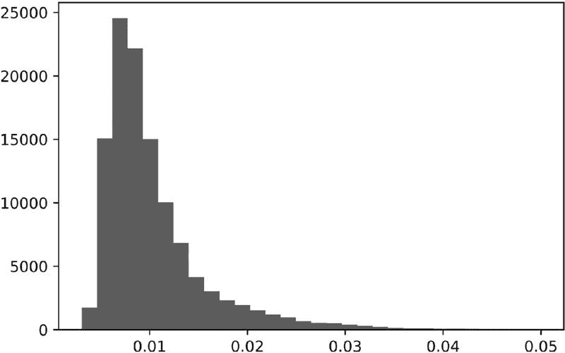

**图 4.1** 唯一性值的直方图

> **代码片段 4.2 估计标签的平均唯一性**
> 
> 

请注意，我们再次使用了函数 `mpPandasObj`，它通过多处理加速计算（见第二十章）。计算与标签 *i* 相关的平均唯一性，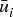，需要在未来时间 `events['t1']` 可用的信息。这不是问题，因为 在训练集上结合标签信息使用，而不在测试集上使用。这些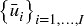不用于预测标签，因此不存在信息泄漏。这个过程允许我们为每个观察到的特征分配一个在 0 到 1 之间的唯一性评分，基于非重叠结果。

**4.5 装袋分类器和唯一性**

在对*I*个项目进行*I*次有放回抽样后，未选择特定项目*i*的概率为(1 − *I ^(− 1)* ) ^(*I*)。随着样本量的增加，该概率收敛于渐近值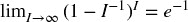。这意味着抽取的独特观察数量预计为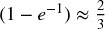。

假设最大的不重叠结果数量为*K* ≤ *I*。根据同样的论点，在对*I*个项目进行*I*次有放回抽样后，未选择特定项目*i*的概率为(1 − *K ^(− 1)* ) ^(*I*)。随着样本量的增加，该概率可以近似为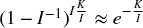。这意味着抽取的独特观察数量预计为。这暗示着错误地假设独立同分布抽样会导致过采样。

在对具有的观察进行有放回抽样（自助法）时，袋内观察相互（1）冗余且（2）与袋外观察非常相似的可能性越来越高。抽样的冗余性使得自助法效率低下（见第六章）。例如，在随机森林的情况下，森林中的所有树实际上都是单一过拟合决策树的非常相似的副本。由于随机抽样使得袋外样本与袋内样本非常相似，袋外准确率将被极大夸大。我们将在第七章中讨论这个第二个问题，当时我们将研究非独立同分布观察下的交叉验证。此刻，让我们集中于第一个问题，即在观察中进行装袋，当 *。*

第一个解决方案是在执行自助法之前删除重叠结果。由于重叠并不完美，仅仅因为部分重叠而删除观察将导致信息的极大损失。我不建议您遵循这个解决方案。

第二个更好的解决方案是利用平均独特性，以减少包含冗余信息结果的不当影响。因此，我们可以仅抽取观察的一部分`out['tW'].mean()`，或者是其小倍数。在 sklearn 中，`sklearn.ensemble.BaggingClassifier`类接受一个参数`max_samples`，可以设置为`max_samples=out['tW'].mean()`。这样，我们确保袋内观察的抽样频率不会远高于其独特性。然而，随机森林并不提供该`max_samples`功能，解决方案是装袋大量决策树。我们将在第六章进一步讨论此解决方案。

**4.5.1 顺序自助法**

第三种更好的解决方案是执行顺序自助法，根据控制冗余的变化概率进行抽取。Rao 等人[1997]提出了在出现 *K* 个不同原始观察值之前进行有替换的顺序重抽样。尽管有趣，但他们的方案并不完全适用于我们的金融问题。在接下来的部分中，我们将介绍一种直接解决重叠结果问题的替代方法。

首先，从均匀分布中抽取一个观察值 *X [*i*]*，*i* ∼ *U* [1, *I*]，即抽取任何特定值 *i* 的概率最初为 δ ^((1)) [*i*] = *I ^(− 1)*。在第二次抽取中，我们希望减少抽取高度重叠结果的观察值 *X [*j*]* 的概率。请记住，自助法允许重复抽样，因此仍然可以再次抽取 *X [*i*]*，但我们希望降低其可能性，因为 *X [*i*]* 和自身之间存在重叠（实际上是完全重叠）。我们将到目前为止的抽样序列表示为 φ，可能包括重复项。到现在为止，我们知道 φ ^((1)) = { *i* }。在时间 *t* 时 *j* 的唯一性是 ，因为这是通过向现有的抽样序列 φ ^((1)) 添加替代 *j* 得到的唯一性。*j* 的平均唯一性是 *j* 生命周期内的平均 *u ^((2)) [*t*，*j*]*，。现在我们可以根据更新后的概率 {δ ^((2)) [*j*]} [*j* = 1, …, *I*] 进行第二次抽取，

其中 {δ ^((2)) [*j*]} [*j* = 1, .., *I*] 被缩放为加起来为 1，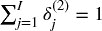 *.* 现在我们可以进行第二次抽取，更新 φ ^((2)) 并重新评估 {δ ^((3)) [*j*]} [*j* = 1, …, *I*]。该过程重复进行，直到进行 *I* 次抽取。这个顺序自助法方案的优点是仍然可能出现重叠（甚至重复），但可能性逐渐降低。顺序自助样本将比从标准自助法中抽取的样本更接近独立同分布（IID）。可以通过测量相对于标准自助法的 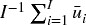 的增加来验证这一点。

**4.5.2 顺序自助法的实现**

片段 4.3 根据两个参数推导出一个指示矩阵：柱子的索引（`barIx`）和 pandas Series `t1`，我们在第三章中多次使用。提醒一下，`t1`的定义是一个包含特征观察时间的索引和一个包含标签确定时间的值数组。该函数的输出是一个二进制矩阵，指示哪些（价格）柱子影响每个观察的标签。

> **片段 4.3 构建指示矩阵**
> 
> 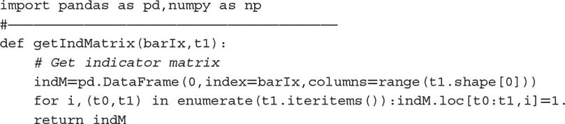

片段 4.4 返回每个观察特征的平均唯一性。输入是通过 `getIndMatrix` 构建的指示矩阵。

> **片段 4.4 计算平均唯一性**
> 
> 

片段 4.5 为我们提供了通过顺序自助抽样的特征索引。输入是指示矩阵（`indM`）和一个可选的样本长度（`sLength`），其默认值为与`indM`中的行数相同的抽样次数。

> **片段 4.5 从顺序自助法返回样本**
> 
> 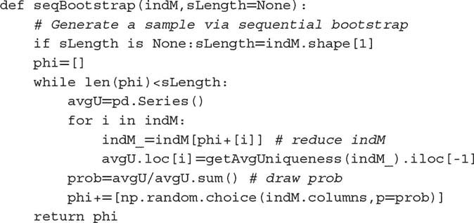

**4.5.3 数值示例**

考虑一组标签{ *y [*i*]* } [*i* = 1, 2, 3]，其中标签*y [1]*是回报*r [0, 3]*的函数，标签*y [2]*是回报*r [2, 4]*的函数，标签*y [3]*是回报*r [4, 6]*的函数。结果的重叠由此指示矩阵{1 [*t* , *i*]}表征，

该程序以φ ^((0)) = ∅开始，概率均匀分布为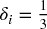，∀ *i* = 1, 2, 3 *.* 假设我们从{1, 2, 3}中随机抽取一个数字，选择了 2。在我们对{1, 2, 3}进行第二次抽样之前（请记住，自助抽样是带重复的），我们需要调整概率。迄今为止抽取的观察集为φ ^((1)) = {2}。第一个特征的平均独特性为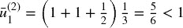，第二个特征为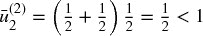 *.* 第二次抽样的概率为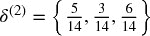。有两点值得注意：(1) 最低概率赋予首次抽样中被选中的特征，因为这将表现出最高的重叠；(2) 在φ ^((1))外的两个可能抽样中，较大的概率赋予δ ^((2)) [  3  ]，因为这是与φ ^((1))没有重叠的标签。假设第二次抽样选择了数字 3。我们留作练习更新第三次和最后一次抽样的概率δ ^((3))。片段 4.6 在此示例中对{1 [*t* , *i*]}指示矩阵进行顺序自助抽样。

> **片段 4.6 顺序自助法示例**
> 
> 

**4.5.4 蒙特卡洛实验**

我们可以通过实验方法评估顺序自助算法的效率。片段 4.7 列出了为多个观察值`numObs`（*I*）生成随机`t1`系列的函数。每个观察值是在从均匀分布中抽取的随机数下进行的，其边界为 0 和`numBars`，其中`numBars`是柱子的数量（*T*）。观察值跨度的柱子数量是通过从均匀分布中抽取边界为 0 和`maxH`的随机数来确定的。

> **片段 4.7 生成随机 T1 系列**
> 
> 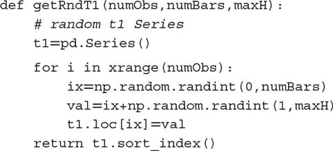

片段 4.8 利用该随机`t1`系列推导出隐含的指示矩阵`indM`。然后，该矩阵经过两个程序。在第一个程序中，我们从标准自助法（带替换的随机抽样）中推导出平均独特性。在第二个程序中，我们通过应用顺序自助算法推导出平均独特性。结果以字典的形式报告。

> **片段 4.8 从标准和顺序自助法中得出的独特性**
> 
> 

这些操作必须在大量迭代中重复进行。片段 4.9 使用第二十章讨论的多进程技术实现了这个蒙特卡罗实验。例如，使用 24 核服务器进行 1E6 次迭代的蒙特卡罗实验大约需要 6 小时，其中 `numObs=10`，`numBars=100`，`maxH=5`。如果不并行化，类似的蒙特卡罗实验将需要约 6 天。

> **片段 4.9 多线程蒙特卡罗**
> 
> 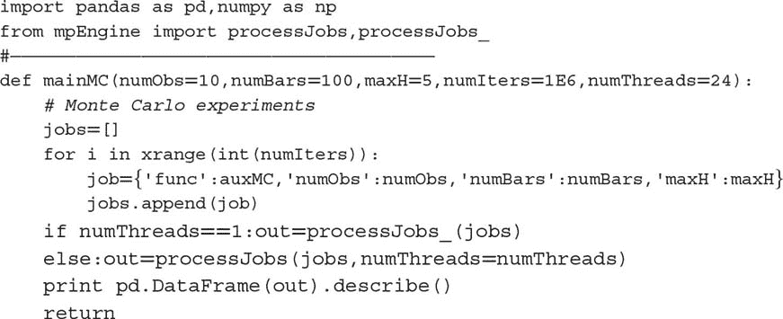

图 4.2 绘制了标准重采样样本（左）和顺序重采样样本（右）唯一性的直方图。标准方法的平均唯一性的中位数为 0.6，顺序方法的平均唯一性的中位数为 0.7。对均值差异的方差分析（ANOVA）测试返回的概率极小。从统计学角度来看，顺序重采样方法的样本在任何合理的置信水平下，其预期唯一性超过标准重采样方法。

**图 4.2**标准与顺序重采样的蒙特卡罗实验

**4.6 回报归因**

在前一节中，我们学习了一种将样本重采样得更接近 IID 的方法。在这一节中，我们将介绍一种为训练机器学习算法加权这些样本的方法。如果考虑到重叠结果与非重叠结果相等，重叠结果将具有不成比例的权重。同时，与大绝对回报相关的标签应比与微不足道的绝对回报相关的标签更重要。简而言之，我们需要通过唯一性和绝对回报的某种函数对观察进行加权。

当标签是回报符号的函数（{−1, 1}用于标准标记或{0, 1}用于元标记）时，样本权重可以根据事件生命周期内归因回报的总和来定义，[ *t [*i* , 0]* , *t [*i* , 1]* ]。

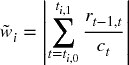

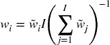

因此 。我们已将这些权重缩放为加起来等于 *I*，因为库（包括 sklearn）通常假设算法参数的默认权重为 1。

该方法的 rationale 是我们希望将观察加权为可以唯一归因于它的绝对对数回报的函数。然而，如果存在“中性”（低于阈值的回报）情况，则该方法将无效。在这种情况下，应给较低回报分配较高的权重，而不是其倒数。“中性”情况是多余的，因为它可以通过低置信度的“−1”或“1”预测来隐含。这是我一般建议你放弃“中性”情况的几个原因之一。片段 4.10 实现了该方法。

> **片段 4.10 通过绝对回报归因确定样本权重**
> 
> 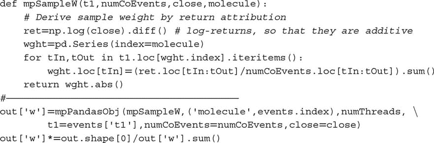

**4.7 时间衰减**

市场是自适应系统（Lo [2017]）。随着市场的演变，旧例子相对于新例子而言相关性下降。因此，我们通常希望样本权重在新观察到来时衰减。设 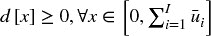 为将乘以上一节中得出的样本权重的时间衰减因子。最终权重没有衰减，，所有其他权重将相对调整。让 *c* ∈ (−1., .1] 成为用户定义的参数，以决定衰减函数如下：对于 *c* ∈ [0, 1]，则 *d* [1] = *c*，线性衰减；对于 *c* ∈ (−1, 0)，则 ，在 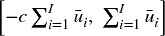 和 *d* [*x*] = 0 之间线性衰减！。对于线性分段函数 *d* = max{0, *a* + *bx*}，以下边界条件满足这些要求：

1.  。

1.  依赖于 *c*：

    1.  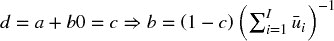，∀*c* ∈ [0, 1]

    1.  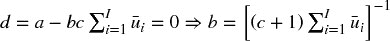，∀*c* ∈ (−1, 0)

片段 4.11 实现了这种时间衰减因子。注意，时间并不意味着是按时间顺序的。在这个实现中，衰减是根据累计独特性进行的，，因为按时间顺序的衰减会在存在冗余观察时过快地降低权重。

> **片段 4.11 时间衰减因子的实现**
> 
> 

值得讨论几个有趣的案例：

+   *c* = 1 表示没有时间衰减。

+   0 < *c* < 1 表示权重随时间线性衰减，但每个观察仍然会得到严格正的权重，无论它有多老。

+   *c* = 0 意味着权重随着时间的推移线性收敛到零。

+   *c* < 0 意味着观察中最老的部分 *cT* 得到零权重（即，它们从记忆中被抹去）。

图 4.3 显示了在 *c* ∈ {1, .75, .5, 0, −.25, −.5} 的时间衰减因子应用后的衰减权重，`out['w']*df`。尽管不一定实用，但该过程允许生成随着时间变老而增加的权重，通过设置 *c* > 1。

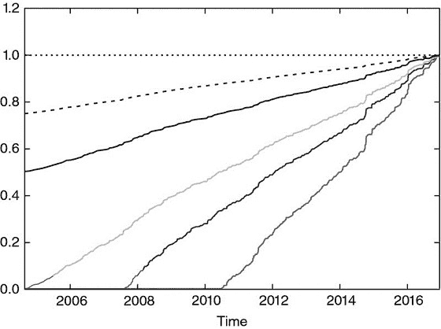

**图 4.3** 分段线性时间衰减因子

**4.8 类别权重**

除了样本权重，应用类别权重通常也是有用的。类别权重是用于纠正欠代表标签的权重。这在分类问题中尤为重要，其中最重要的类别出现频率较低（King 和 Zeng [2001]）。例如，假设你希望预测流动性危机，如 2010 年 5 月 6 日的闪电崩盘。这些事件相对于其间发生的数百万次观察来说是罕见的。除非我们为与这些罕见标签相关的样本分配更高的权重，否则机器学习算法将最大化最常见标签的准确性，而将闪电崩盘视为异常值而非罕见事件。

ML 库通常实现处理类权重的功能。例如，sklearn 会对 `class[j]` 的样本中的错误进行惩罚，*j=1,…,J*，权重为 `class_weight[j]` 而不是 1。因此，标签 *j* 的更高类权重将迫使算法在 *j* 上实现更高的准确性。当类权重不加总为 *J* 时，效果相当于改变分类器的正则化参数。

在金融应用中，分类算法的标准标签为 { − 1, 1}，其中零（或中性）案例将由概率略高于 0.5 且低于某个中性阈值的预测暗示。没有理由偏向于一个类别的准确性，因此一个好的默认选择是将 `class_weight='balanced'`。这个选择重新加权观察，以模拟所有类别以相等频率出现。在包外分类器的上下文中，你可能想考虑参数 `class_weight='balanced_subsample'`，这意味着 `class_weight='balanced'` 将应用于包内自举样本，而不是整个数据集。有关完整细节，查看实现 `class_weight` 的 sklearn 源代码是有帮助的。请注意这个报告的错误：[`github.com/scikit-learn/scikit-learn/issues/4324`](https://github.com/scikit-learn/scikit-learn/issues/4324)。

**练习**

1.  > > 在第三章中，我们将第一次触及障碍的时间戳 pandas 系列表示为 `t1`，索引为观察的时间戳。这是 `getEvents` 函数的输出。

    1.  在从 E-mini S&P 500 期货的 tick 数据导出的美元条上计算 `t1` 系列。

    1.  应用函数 `mpNumCoEvents` 来计算每个时间点的重叠结果数量。

    1.  在主轴上绘制并发标签数量的时间序列，在次轴上绘制回报的指数加权移动标准差的时间序列。

    1.  生成并发标签数量（x 轴）与回报的指数加权移动标准差（y 轴）的散点图。你能体会到一种关系吗？

1.  > > 使用函数 `mpSampleTW`，计算每个标签的平均唯一性。这个时间序列的一阶序列相关性 AR(1) 是多少？它在统计上显著吗？为什么？
1.  > > 
1.  > > 为包含  的金融数据集拟合随机森林。

    1.  什么是平均包外准确率？

    1.  在同一数据集上，k 折交叉验证（不打乱）的平均准确率是多少？

    1.  为什么包外准确率比交叉验证准确率高得多？哪个更正确/偏差更小？这种偏差的来源是什么？

1.  > > 修改第 4.7 节中的代码以应用指数时间衰减因子。
1.  > > 
1.  > > 考虑到你已经对由趋势跟踪模型确定的事件应用了元标签。假设三分之二的标签为 0，三分之一的标签为 1。

    1.  如果在没有平衡类别权重的情况下拟合分类器，会发生什么？

    1.  标签 1 表示真正例，标签 0 表示假正例。通过应用平衡类别权重，我们迫使分类器更关注真正例，减少对假正例的关注。这有什么意义？

    1.  在应用平衡类别权重之前和之后，预测标签的分布是什么？

1.  > > 更新 4.5.3 节最后一次抽取的概率。
1.  > > 
1.  > > 在 4.5.3 节中，假设在第二次抽取中再次选择了数字 2。第三次抽取的更新概率会是什么？

**参考文献**

1.  Rao, C.，P. Pathak 和 V. Koltchinskii (1997)： “通过序贯重抽样进行自助法。” *统计规划与推断杂志* ，第 64 卷，第 2 期，第 257–281 页。

1.  King, G. 和 L. Zeng (2001)： “稀有事件数据中的逻辑回归。” 工作论文，哈佛大学。可在 [`gking.harvard.edu/files/0s.pdf`](https://gking.harvard.edu/files/0s.pdf) 获得。

1.  Lo, A. (2017)： *自适应市场* ，第 1 版。普林斯顿大学出版社。

**参考文献**

样本加权是机器学习文献中的一个常见主题。然而，本章讨论的实际问题是投资应用的特征，相关的学术文献极为稀缺。以下是一些与本章讨论的一些问题间接相关的出版物。

1.  Efron, B. (1979)： “自助法：对切片法的另一种看法。” *统计年鉴* ，第 7 卷，第 1–26 页。

1.  Efron, B. (1983)： “估计预测规则的错误率：交叉验证的改进。” *美国统计协会杂志* ，第 78 卷，第 316–331 页。

1.  Bickel, P. 和 D. Freedman (1981)： “自助法的一些渐近理论。” *统计年鉴* ，第 9 卷，第 1196–1217 页。

1.  Gine, E. 和 J. Zinn (1990)： “引导一般经验度量。” *概率年鉴* ，第 18 卷，第 851–869 页。

1.  Hall, P. 和 E. Mammen (1994)： “关于一般重抽样算法及其在分布估计中的表现。” *统计年鉴* ，第 24 卷，第 2011–2030 页。

1.  Mitra, S. 和 P. Pathak (1984)： “简单随机抽样的性质。” *统计年鉴* ，第 12 卷，第 1536–1542 页。

1.  Pathak, P. (1964)： “抽样理论中的充分性。” *数学统计年鉴* ，第 35 卷，第 795–808 页。

1.  Pathak, P. (1964)： “在不等概率下的逆抽样。” *生物统计* ，第 51 卷，第 185–193 页。

1.  Praestgaard, J. 和 J. Wellner (1993)： “一般经验过程的可交换加权自助法。” *概率年鉴* ，第 21 卷，第 2053–2086 页。

1.  Rao, C.，P. Pathak 和 V. Koltchinskii (1997)： “通过序贯重抽样进行自助法。” *统计规划与推断杂志* ，第 64 卷，第 2 期，第 257–281 页。

**第五章**

**分数差分特征**

**5.1 动机**

已知，由于套利力量的影响，金融序列表现出低信噪比（洛佩斯·德·普拉多[2015]）。更糟糕的是，标准平稳性变换，比如整数差分，进一步通过去除记忆降低了信号。价格序列具有记忆，因为每个值依赖于长期的历史水平。相比之下，像收益这样的整数差分序列具有记忆截止，意味着在有限的样本窗口后历史被完全忽视。一旦平稳性变换将数据中的所有记忆抹去，统计学家会 resort to 复杂的数学技术来提取剩余的信号。不出所料，在去记忆序列上应用这些复杂技术可能会导致错误发现。在本章中，我们介绍了一种数据变换方法，确保数据的平稳性，同时尽可能保留记忆。

**5.2 平稳性与记忆的困境**

在金融领域，发现非平稳时间序列是很常见的。导致这些序列非平稳的原因是存在记忆，即长期的历史水平影响序列的均值。为了进行推断分析，研究人员需要处理不变过程，比如价格的收益（或对数价格的变化）、收益变化或波动率变化。这些数据变换使序列平稳，但代价是从原始序列中去除了所有记忆（亚历山大[2001]，第十一章）。虽然平稳性是推断分析的必要属性，但在信号处理时，我们通常并不希望完全消除所有记忆，因为这些记忆是模型预测能力的基础。例如，平衡（平稳）模型需要一定的记忆来评估价格过程偏离长期期望值的程度，以生成预测。困境在于，收益是平稳的，但没有记忆，而价格有记忆，但又是非平稳的。问题是：什么是使价格序列平稳的最小差分量，同时尽可能保留记忆？因此，我们希望推广收益的概念，以考虑*保留部分记忆的平稳序列*。在这个框架下，收益只是一种（在大多数情况下是次优的）价格变换，还有许多其他可能性。

协整方法的重要性部分在于它们能够对具有记忆的序列建模。但为什么零差分的特定情况会带来最佳结果？零差分与 1 步差分一样任意。这两者之间有一个广泛的区域（完全差分序列在一端，零差分序列在另一端），可以通过分数差分来探索，以便开发出高预测能力的机器学习模型。

监督学习算法通常要求特征是平稳的。原因在于我们需要将一个先前未见（未标记）的观察值映射到一组标记示例，并从中推断出该新观察值的标签。如果特征不平稳，我们就无法将新观察值映射到大量已知示例。然而，平稳性并不保证预测能力。平稳性是机器学习算法高性能的必要但不充分条件。问题在于，平稳性与记忆之间存在权衡。我们总是可以通过微分使序列更平稳，但这将以抹去部分记忆为代价，这将削弱机器学习算法的预测目的。在本章中，我们将研究解决这一困境的一种方法。

**5.3 文献综述**

几乎所有的金融时间序列文献都是基于通过整数变换使非平稳序列平稳的前提（参见汉密尔顿 [1994] 的例子）。这引出了两个问题：（1）为什么整数 1 微分（例如用于计算对数价格回报的微分）是最优的？（2）过度微分是否是文献在高效市场假说方面存在偏见的一个原因？

应用于预测时间序列分析的分数微分概念至少可以追溯到霍斯金 [1981]。在那篇论文中，通过允许微分的阶数取分数值，推广了一类 ARIMA 过程。这是有用的，因为分数微分过程表现出长期的持续性和反持续性，因此增强了与标准 ARIMA 方法相比的预测能力。在同一篇论文中，霍斯金指出：“除了格兰杰（1978）的简短提及，分数微分似乎以前在时间序列分析中并未被提及。”

在霍斯金的论文发表后，这一主题的文献出奇地稀少，总共只有九位作者撰写的八篇期刊文章：霍斯金、约汉森、尼尔森、麦金农、延森、琼斯、波皮尔、卡瓦利埃雷和泰勒。具体参考文献请见文后。大多数论文涉及技术问题，例如计算连续随机过程中的分数微分的快速算法（例如，延森和尼尔森 [2014]）。

对随机过程进行微分是一项计算成本高昂的操作。在本章中，我们将采用一种实用的、替代的和新颖的方法来恢复平稳性：我们将将差分算子推广到非整数步。

**5.4 方法**

考虑反移位算子 *B*，应用于实值特征矩阵 { *X [*t*]* }，其中 *B ^(*k*) X [*t*]* = *X [*t* − *k*]*，对于任何整数 *k* ≥ 0 *.* 例如，(1 − *B* ) ² = 1 − 2 *B* + *B ²*，其中 *B ² X [*t*]* = *X [*t* − 2]*，因此 (1 − *B* ) ² *X [*t*]* = *X [*t*]* − 2 *X [*t* − 1]* + *X [*t* − 2]*。注意 ，对于 *n* 为正整数。对于实数 *d*，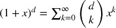，二项级数。

在分数模型中，指数 *d* 可以是实数，具有以下形式的二项级数展开：

**5.4.1 长期记忆**

让我们看看一个实数（非整数）正 *d* 是如何保持记忆的。这一算术序列由一个点积组成。

带权重ω

和数值 *X*

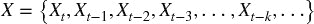

当 *d* 是正整数时，，超出该点的内存被取消。例如，*d* = 1 用于计算回报，其中 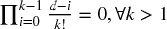，且 ω = {1, −1, 0, 0, …}。

**5.4.2 迭代估计**

从权重序列 ω 中，我们可以看出对于 *k* = 0, …, ∞，当 ω [0] = 1 时，权重可以通过迭代生成：

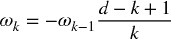

图 5.1 绘制了用于计算每个分数差分序列值的权重序列。图例报告了生成每个序列所使用的 *d* 值，x 轴表示 *k* 值，y 轴显示 ω [*k*] 的值。例如，对于 *d* = 0，所有权重均为 0，只有 ω [0] = 1。这是差分序列与原始序列重合的情况。对于 *d* = 1，所有权重均为 0，只有 ω [0] = 1 和 ω [1] = −1。这是标准的一阶整数差分，用于推导对数价格回报。在这两种情况之间，所有 ω [0] = 1 之后的权重均为负且大于 −1。

**图 5.1** *ω [*k*]*（y 轴）随着 *k* 的增加（x 轴）。每条线与特定值的 *d* ∈ [0,1] 相关，增量为 0.1。

图 5.2 绘制了 *d* ∈ [1, 2] 的权重序列，增量为 0.1。当 *d* > 1 时，我们观察到 ω [1] < −1 和 ω [*k*] > 0，∀ *k* ≥ 2 *.* 

**图 5.2** *ω [*k*]*（y 轴）随着 *k* 的增加（x 轴）。每条线与特定值的 *d* ∈ [1,2] 相关，增量为 0.1。

片段 5.1 列出了用于生成这些图表的代码。

> **片段 5.1 加权函数**
> 
> 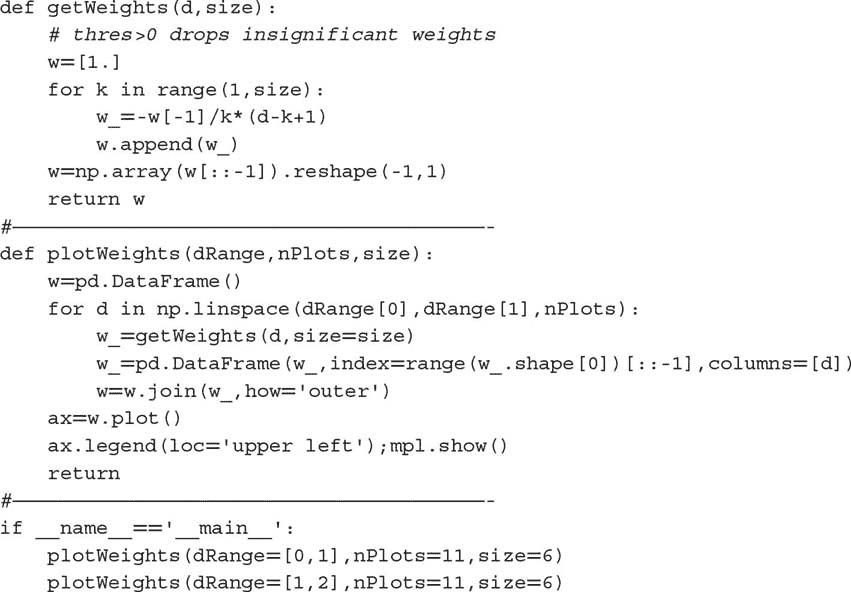

**5.4.3 收敛性**

让我们考虑权重的收敛性。从上述结果可以看出，对于*k* > *d*，如果ω [*k* − 1] ≠ 0，则，而ω [*k*] = 0 则为其他情况。因此，权重渐近收敛到零，作为单位圆内因素的无限乘积。此外，对于正的*d*和*k* < *d* + 1，我们有，这使得初始权重在符号上交替。对于非整数*d*，一旦*k* ≥ *d* + 1，若 int[*d*]为偶数，ω [*k*]将为负，反之则为正。总结一下，当 int[*d*]为偶数时，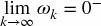（从左收敛到零），而当 Int[*d*]为奇数时，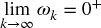（从右收敛到零）。在特殊情况下*d* ∈ (0, 1)，这意味着−1 < ω [*k*] < 0，∀ *k* > 0 *。这种权重符号的交替对于使保持平稳是必要的，因为记忆随着时间的推移而减弱或被抵消。

**5.5 实施**

在本节中，我们将探讨两种替代的分数微分实现方法：标准的“扩展窗口”方法和我称之为“固定宽度窗口分数微分”（FFD）的新方法。

**5.5.1 扩展窗口**

让我们讨论如何在实践中进行分数微分的（有限）时间序列。假设有一个包含*T*个实际观察值的时间序列，{*X [*t*]*}，*t* = 1, …, *T*。由于数据限制，分数微分值无法在无限权重序列上计算。例如，最后一个点将使用权重{ω [*k*]}，*k* = 0, …, *T* − 1，而将使用权重{ω [*k*]}，*k* = 0, …, *T* − *l* − 1。这意味着初始点与最终点的记忆量不同。对于每个*l*，我们可以确定相对权重损失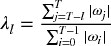。给定容忍水平τ ∈ [0, 1]，我们可以确定值*l* *，使得和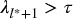。这个值*l* *对应于权重损失超过可接受阈值的第一次结果，其中λ [*t*] > τ（例如，τ = 0.01）*。

从我们之前的讨论来看，依赖于{ω [*k*]}的收敛速度，而这又依赖于*d* ∈ [0, 1]。对于*d* = 1，ω [*k*] = 0，∀ *k* > 1，而λ [*l*] = 0，∀ *l* > 1，因此可以忽略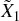。随着*d* → 0 ^+，*l* *增加，为了保持权重损失，需要丢弃更多初始的。 图 5.3 绘制了 E-mini S&P 500 期货的交易条，大小为 1E4，前移，分数微分，参数为（*d* = .4，τ = 1）在上方，参数为（*d* = .4，τ = 1 *E* − 2）在下方。

**图 5.3** 在不控制体重损失的情况下的分数微分（顶部图）和在使用扩展窗口控制体重损失后的分数微分（底部图）

两个图中的负漂移是由于在扩展窗口时添加到初始观测值的负权重造成的。当我们不控制体重损失时，负漂移非常明显，以至于只有该趋势可见。然而，在控制体重损失后，右侧图中的负漂移相对温和，但仍然相当显著，因为值 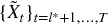 是在扩展窗口上计算的。这个问题可以通过在代码片段 5.2 中实现的固定宽度窗口来纠正。

> **代码片段 5.2 标准分数微分（扩展窗口）**
> 
> 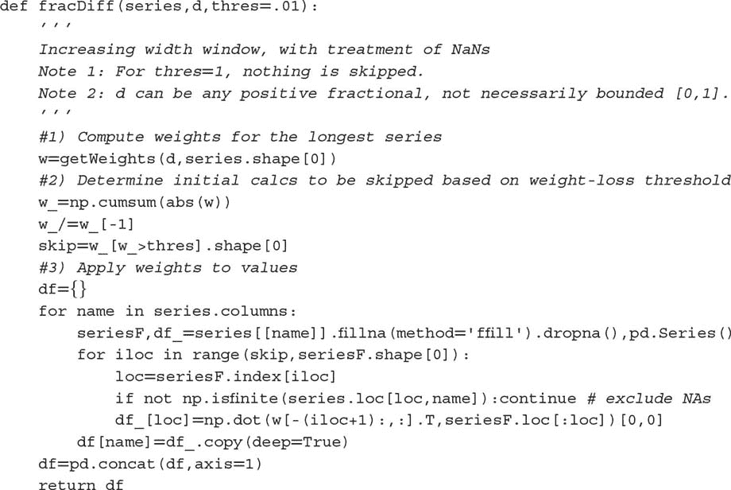

**5.5.2 固定宽度窗口分数微分**

或者，可以使用固定宽度窗口计算分数微分，也就是说，当权重的模（|ω [*k*] |）低于给定阈值（τ）时，丢弃权重 *。这相当于找到第一个 *l* *，使得  和 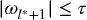 成立，并设置一个新变量 。

和 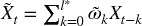，对于 *t* = *T* − *l* * + 1, …, *T*。 图 5.4 绘制了 E-mini S&P 500 期货交易条的大小为 1E4，向前滚动，分数微分（*d* = .4, τ = 1 *E* − 5）。

**图 5.4** 在控制体重损失后，使用固定宽度窗口的分数微分

该过程的优点在于，在所有  的估计中使用相同的权重向量，从而避免了扩展窗口添加的权重所造成的负漂移。结果是一个无漂移的水平加噪声的组合，符合预期。由于记忆带来的偏斜度和超额峰度，分布不再是高斯分布，但它是平稳的。代码片段 5.3 展示了这个想法的实现。

> **代码片段 5.3 新的固定宽度窗口分数微分方法**
> 
> 

**5.6 最大记忆保留的平稳性**

考虑一个序列 { *X [*t*]* } [*t* = 1, …, *T*] 。对该序列应用固定宽度窗口的分数差分 (FFD) 方法，我们可以计算出最小系数 *d* *，使得得到的分数差分序列  是平稳的。这个系数 *d* * 量化了需要去除的记忆量以实现平稳性。如果  已经是平稳的，则 *d* * = 0 *。如果  包含单位根，则 *d* * < 1 *。如果 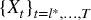 表现出爆炸性行为（如在泡沫中），则 *d* * > 1 *。一个特别值得关注的情况是 0 < *d* * ≪ 1，当原始序列“轻微非平稳”时。在这种情况下，虽然需要进行差分，但完整的整数差分会移除过多的记忆（和预测能力）。

图 5.5 说明了这个概念。在右侧 y 轴上，它绘制了基于 E-mini S&P 500 期货对数价格计算的 ADF 统计量，使用 ETF 技巧（见第二章）向前滚动，降采样到每日频率，追溯到合同的起始时间。在 x 轴上，它显示了用于生成计算 ADF 统计量的序列的 *d* 值。原始序列的 ADF 统计量为 –0.3387，而收益序列的 ADF 统计量为 –46.9114。在 95% 的置信水平下，测试的临界值为 –2.8623。ADF 统计量在 *d* = 0.35 附近穿越了该阈值。左侧 y 轴绘制了原始序列（ *d* = 0）与在不同 *d* 值下的差分序列之间的相关性。在 *d* = 0.35 时，相关性仍然非常高，为 0.995。这证实了本章介绍的程序在实现平稳性而不牺牲过多记忆方面是成功的。相比之下，原始序列与收益序列之间的相关性仅为 0.03，这表明标准整数差分几乎完全消除了序列的记忆。

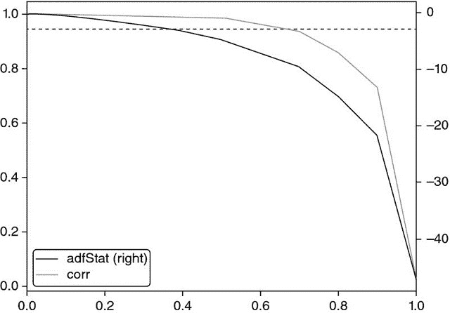

**图 5.5** ADF 统计量作为 *d* 的函数，基于 E-mini S&P 500 期货的对数价格。

几乎所有的金融论文都试图通过应用整数差分 *d* = 1 ≫ 0.35 来恢复平稳性，这意味着大多数研究过度差分了序列，也就是说，它们移除了比满足标准计量经济学假设所需的更多记忆。片段 5.4 列出了用于产生这些结果的代码。

> **片段 5.4 寻找通过 ADF 测试的最小** ***D*** **值**
> 
> 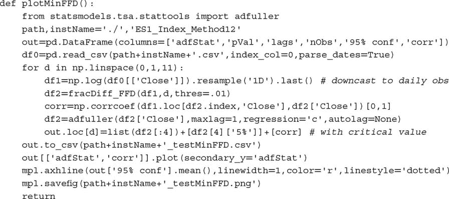

E-mini 期货的例子绝对不是例外。表 5.1 显示了在对 87 个全球最活跃期货合约的各种 *d* 值应用 FFD(*d*) 后的 ADF 统计量。在所有情况下，用于计算收益的标准 *d* = 1 表示过度差分。事实上，在所有情况下，*d* < 0.6 时都能实现平稳性。在某些情况下，如橙汁 (JO1 Comdty) 或活牛 (LC1 Comdty)，根本不需要进行任何差分。

**表 5.1** **某些最活跃期货合约的 FFD(** ***d*** **) 的 ADF 统计量**

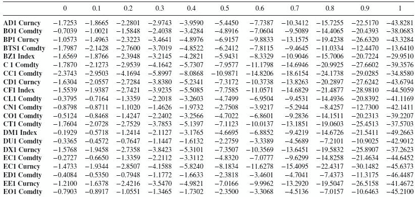

**5.7 结论**

总结来说，大多数计量经济学分析遵循两种范式之一：

1.  Box-Jenkins：收益是平稳的，但没有记忆。

1.  Engle-Granger：对数价格具有记忆，但它们是非平稳的。协整是使回归在非平稳序列上有效的技巧，从而保留记忆。然而，协整变量的数量是有限的，且协整向量 notoriously 不稳定。

相比之下，本章介绍的 FFD 方法表明，不需要放弃所有的记忆就可以获得平稳性。并且在与 ML 预测相关时，没有必要使用协整技巧。一旦你熟悉 FFD，它将使你能够在不放弃记忆（或预测能力）的情况下实现平稳性。

在实践中，我建议你尝试以下特征转换：首先，计算时间序列的累积和。这确保需要某种顺序的差分。第二，计算不同 *d* ∈ [0, 1] 的 FFD(*d*) 序列。第三，确定最小的 *d* 使得 FFD(*d*) 的 ADF 统计量的 p 值低于 5%。第四，将 FFD(*d*) 序列用作你的预测特征。

**练习**

1.  > > 从 IID 高斯随机过程中生成一个时间序列。这是一个没有记忆的平稳序列：

    1.  计算该序列的 ADF 统计量。p 值是多少？

    1.  计算观测值的累积和。这是一个没有记忆的非平稳序列。

        1.  这个累积序列的积分顺序是多少？

        1.  计算该序列的 ADF 统计量。p 值是多少？

    1.  对序列进行两次差分。这个过度差分序列的 p 值是多少？

1.  > > 生成一个遵循正弦函数的时间序列。这是一个具有记忆的平稳序列。

    1.  计算该序列的 ADF 统计量。p 值是多少？

    1.  将每个观测值都加上相同的正值。计算观测值的累积和。这是一个具有记忆的非平稳序列。

        1.  计算该序列的 ADF 统计量。p 值是多少？

        1.  应用扩展窗口 fracdiff，τ = 1*E* − 2*.* 在什么最小 *d* 值下，你会得到低于 5% 的 p 值？

        1.  应用 FFD，τ = 1*E* − 5*.* 在什么最小 *d* 值下，你会得到低于 5% 的 p 值？

1.  > > 取第 2.b 题中的系列：

    1.  将系列拟合到正弦函数上。R 平方值是多少？

    1.  应用 FFD(*d = 1*)。将系列拟合到正弦函数上。R 平方值是多少？

    1.  什么 *d* 值最大化 FFD(*d*) 上的 R 平方值？为什么？

1.  > > 取 E-mini S&P 500 期货的美元条形系列。使用代码 Snippet 5.3，对于某些 *d* ∈ [0, 2]，计算 `fracDiff_FFD(fracDiff_FFD(series,d),-d)`。你得到了什么？为什么？
1.  > > 
1.  > > 取 E-mini S&P 500 期货的美元条形系列。

    1.  形成一个新的系列作为对数价格的累积和。

    1.  应用 FFD，τ = 1*E* − 5*.* 确定新系列在什么最小 *d* ∈ [0, 2] 下是平稳的。

    1.  计算 fracdiff 系列与原始（未转换）系列的相关性。

    1.  对原始系列和 fracdiff 系列应用 Engel-Granger 协整检验。它们是协整的吗？为什么？

    1.  对 fracdiff 系列应用 Jarque-Bera 正态性检验。

1.  > > 取第 5 题中的 fracdiff 系列。

    1.  应用 CUSUM 滤波器（第二章），其中 *h* 是系列的两倍标准差。

    1.  使用过滤后的时间戳来抽样特征矩阵。将 fracdiff 值作为特征之一。

    1.  使用三重障碍法形成标签，设置为每日标准差的两倍的对称水平障碍，以及 5 天的垂直障碍。

    1.  拟合一个决策树的包袋分类器，其中：

        1.  观察到的特征使用第四章中的顺序方法进行自助抽样。

        1.  在每个自助抽样中，样本权重使用第四章中的技术确定。

**参考文献**

1.  Alexander, C. (2001): *市场模型* , 第 1 版。约翰·威利与儿子公司。

1.  Hamilton, J. (1994): *时间序列分析* , 第 1 版。普林斯顿大学出版社。

1.  Hosking, J. (1981): “分数差分。” *生物统计学* , 第 68 卷，第 1 期，页码 165–176。

1.  Jensen, A. 和 M. Nielsen (2014): “快速分数差分算法。” *时间序列分析杂志* , 第 35 卷，第 5 期，页码 428–436。

1.  López de Prado, M. (2015): “经验金融的未来。” *投资组合管理杂志* , 第 41 卷，第 4 期，页码 140–144\. 可在 [`ssrn.com/abstract=2609734`](https://ssrn.com/abstract=2609734) 获取。

**参考书目**

1.  Cavaliere, G., M. Nielsen 和 A. Taylor (2017): “具有未知形式异方差的分数时间序列模型的准最大似然估计和自助推断。” *计量经济学杂志* , 第 198 卷，第 1 期，页码 165–188。

1.  Johansen, S. 和 M. Nielsen (2012): “分数函数中心极限定理的必要矩条件。” *计量经济理论* , 第 28 卷，第 3 期，页码 671–679。

1.  Johansen, S. 和 M. Nielsen (2012): “分数协整向量自回归模型的似然推断。” *计量经济学* , 第 80 卷，第 6 期，页码 2267–2732。

1.  Johansen, S. 和 M. Nielsen (2016): “初始值在非平稳分数时间序列模型的条件最小二乘估计中的作用。” *计量经济理论* , 第 32 卷，第 5 期，页码 1095–1139。

1.  Jones, M., M. Nielsen 和 M. Popiel (2015): “经济投票与政治支持的分数协整 VAR 分析。” *加拿大经济学杂志*，第 47 卷，第 4 期，页 1078–1130。

1.  Mackinnon, J. 和 M. Nielsen, M. (2014): “分数单位根和协整检验的数值分布函数。” *应用计量经济学杂志*，第 29 卷，第 1 期，页 161–171。

**第二部分**

**建模**

1.  第六章 集成方法

1.  第七章 金融中的交叉验证

1.  第八章 特征重要性

1.  第九章 超参数调整与交叉验证

**第六章**

**集成方法**

**6.1 动机**

在这一章中，我们将讨论两种最流行的机器学习集成方法。^(1) 在参考文献和脚注中，您将找到介绍这些技术的书籍和文章。就像本书的其他部分一样，假设您已经使用过这些方法。本章的目的是解释是什么使它们有效，以及如何避免导致其在金融中误用的常见错误。

**6.2 三种误差来源**

机器学习模型通常会遭受三种错误：^(2)

1.  **偏差：** 这种误差是由于不现实的假设造成的。当偏差高时，机器学习算法未能识别特征与结果之间的重要关系。在这种情况下，算法被称为“欠拟合”。

1.  **方差：** 这种误差是由于对训练集中的小变化的敏感性造成的。当方差高时，算法已经对训练集进行了过拟合，因此即使是训练集的微小变化也会产生截然不同的预测。算法没有建模训练集中的一般模式，而是将噪声误认为信号。

1.  **噪声：** 这种误差是由于观测值的方差造成的，例如不可预测的变化或测量误差。这是不可减少的误差，任何模型都无法解释。

考虑一个观察训练集 { *x [*i*]* } [*i* = 1, …, *n*] 和实际值结果 { *y [*i*]* } [*i* = 1, …, *n*]。假设存在一个函数 *f* [ *x* ]，使得 *y* = *f* [ *x* ] + ϵ，其中 *ϵ* 是白噪声，且 E[ϵ [*i*] ] = 0 和 E[ϵ ² [*i*] ] = σ [ϵ] ²。我们希望估计最佳拟合 *f* [ *x* ] 的函数 ，以使得估计误差的方差 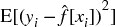 最小（均方误差不能为零，因为噪声由 σ ² [ ϵ ] 表示）。这个均方误差可以分解为

集成方法是一种结合了一组弱学习者的方法，所有学习者均基于相同的学习算法，以创建一个（更强的）学习者，该学习者的表现优于任何单个学习者。集成方法有助于减少偏差和/或方差。

**6.3 自助聚合**

自助聚合（袋装法）是减少预测方差的有效方法。其工作原理如下：首先，通过带替换的随机抽样生成 *N* 个训练数据集。其次，为每个训练集拟合 *N* 个估计器。这些估计器是相互独立拟合的，因此模型可以并行拟合。第三，集成预测是 *N* 个模型的个别预测的 *简单* 平均值。在分类变量的情况下，观察属于某个类别的概率由将该观察分类为该类别成员的估计器的比例给出（多数投票）。当基础估计器能够用预测概率进行预测时，袋装分类器可能会推导出概率的均值。

如果你使用 sklearn 的 `BaggingClassifier` 类来计算袋外准确率，你应该注意到这个错误：[`github.com/scikit-learn/scikit-learn/issues/8933`](https://github.com/scikit-learn/scikit-learn/issues/8933)。一种解决方法是将标签按整数顺序重命名。

**6.3.1 方差减少**

袋装法的主要优点是它降低了预测的方差，从而有助于解决过拟合问题。袋装预测的方差 (φ [*i*] [ *c* ]) 是袋装估计器数量 (*N*)、单个估计器预测的平均方差 ( 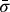 ) 和它们预测之间的平均相关性 (  ) 的函数：

其中 σ [*i* , *j*] 是估计器 *i* 和 *j* 的预测协方差； 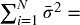 ；和 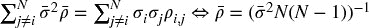 。

上面的方程表明，袋装法仅在  的范围内有效；当  时。序列自助抽样（第四章）的一个目标是生成尽可能独立的样本，从而减少 ，这应该降低袋装分类器的方差。图 6.1 绘制了袋装预测的标准差与 *N* ∈ [5, 30] 的关系，  和  *.*

**图 6.1** 袋装预测的标准差

**6.3.2 提高准确性**

考虑一个通过对 *N* 个独立分类器进行多数投票来对 *k* 类进行预测的袋装分类器。我们可以将预测标记为 {0, 1}，其中 1 表示正确预测。分类器的准确性是将预测标记为 1 的概率 *p*。平均而言，我们将获得 *Np* 个标记为 1 的预测，方差为 *Np* (1 − *p*)。当观察到预测的类别是最多被预测的类别时，多数投票会做出正确的预测。例如，当 *N* = 10 和 *k* = 3 时，当观察到类别 *A* 且投票结果为 [ *A* , *B* , *C* ] = [4, 3, 3] 时，袋装分类器做出了正确的预测。然而，当观察到类别 *A* 且投票结果为 [ *A* , *B* , *C* ] = [4, 1, 5] 时，袋装分类器做出了错误的预测。一个充分条件是这些标签的总和是 。一个必要（但不充分）条件是 ，其发生的概率为

这意味着对于一个足够大的 *N*，例如 ，那么 ，因此袋装分类器的准确性超过了个体分类器的平均准确性。片段 6.1 实现了此计算。

> **片段 6.1 袋装分类器的准确性**
> 
> 

这是支持一般情况下袋装任何分类器的有力论据，前提是计算要求允许。然而，与提升方法不同，袋装方法无法改善差分类器的准确性：如果个体学习者是差分类器（ ），多数投票仍然表现不佳（尽管方差较低）。 图 6.2 阐明了这些事实。因为实现  比实现  更容易，袋装方法在降低方差方面更有可能成功，而不是在降低偏差方面。

关于此主题的进一步分析，请参阅孔多塞的陪审团定理。尽管该定理是为了政治科学中的多数投票而推导的，但该定理所解决的问题与上述讨论有相似之处。

**图 6.2** 袋装分类器的准确性作为个体估计器的准确性 (*P* )、估计器数量 (*N* ) 和 *k* = 2 的函数

**6.3.3 观察冗余**

在第四章中，我们研究了为什么金融观察不能假设为独立同分布（IID）的原因。冗余观察对自助法有两个有害影响。首先，抽样替换的样本更有可能几乎相同，即使它们不共享相同的观察结果。这使得！，自助法不会降低方差，无论*N*。例如，如果每个时间点*t*的观察根据*t*与*t + 100*之间的回报进行标记，我们应该每个袋装估计器抽样 1%的观察，而不是更多。第四章第 4.5 节推荐了三种替代解决方案，其中之一是在 sklearn 自助分类器类的实现中设置`max_samples=out[‘tW’].mean()`。另一种（更好的）解决方案是应用序贯自助法。

观察冗余的第二个有害影响是袋外准确性会被夸大。这是因为随机抽样替换会在训练集中放入与袋外样本非常相似的样本。在这种情况下，适当的分层 k 折交叉验证（在分区前不洗牌）将显示出测试集准确性远低于袋外估计值。因此，建议在使用该 sklearn 类时设置`StratifiedKFold(n_splits=k,` `shuffle=False)`来交叉验证自助分类器，并忽略袋外准确性结果。较低的数值*k*比较高的更为可取，因为过度分区会导致测试集样本与训练集样本过于相似。

**6.4 随机森林**

决策树被认为容易过拟合，这会增加预测的方差。^(3) 为了解决这个问题，随机森林（RF）方法被设计用来生成具有更低方差的集成预测。

随机森林与自助法（bagging）有一些相似之处，即在对数据的自助子集上独立训练个体估计器。与自助法的主要区别在于，随机森林引入了第二层随机性：在优化每个节点分裂时，仅评估随机属性子样本（不替换），目的是进一步去相关化估计器。

像自助法一样，随机森林在不发生过拟合的情况下降低预测方差（记住，只要！）。第二个优点是，随机森林评估特征的重要性，我们将在第八章深入讨论。第三个优点是，随机森林提供了袋外准确性估计，然而在金融应用中，它们可能被夸大（如第 6.3.3 节讨论的那样）。但是，像自助法一样，随机森林未必会表现出比单个决策树更低的偏差。

如果大量样本是冗余的（非独立同分布），仍然会发生过拟合：带替换的随机抽样将构建大量本质上相同的树（ ），其中每棵决策树都是过拟合的（决策树臭名昭著的缺陷）。与袋装法不同，随机森林始终将自助样本的大小固定为与训练数据集大小相匹配。让我们回顾一下在 sklearn 中解决 RF 过拟合问题的方法。为了便于说明，我将引用 sklearn 的类；但是，这些解决方案可以应用于任何实现：

1.  将参数`max_features`设置为较低值，以强制树之间产生差异。

1.  提前停止：将正则化参数`min_weight_fraction_leaf`设置为足够大的值（例如 5%），以使袋外准确率收敛于样本外（k 折）准确率。

1.  在`DecisionTreeClassifier`上使用`BaggingClassifier`，其中`max_samples`设置为样本之间的平均唯一性（`avgU`）。

    1.  `clf=DecisionTreeClassifier(criterion=‘entropy’,max_features=‘auto’,class_weight=‘balanced’)`

    1.  `bc=BaggingClassifier(base_estimator=clf,n_estimators=1000,max_samples=avgU,max_features=1.)`

1.  在`RandomForestClassifier`上使用`BaggingClassifier`，其中`max_samples`设置为样本之间的平均唯一性（`avgU`）。

    1.  `clf=RandomForestClassifier(n_estimators=1,criterion=‘entropy’,bootstrap=False,class_weight=‘balanced_subsample’)`

    1.  `bc=BaggingClassifier(base_estimator=clf,n_estimators=1000,max_samples=avgU,max_features=1.)`

1.  修改 RF 类以用顺序自助抽样替代标准自助抽样。

总结来说，片段 6.2 展示了使用不同类设置 RF 的三种替代方法。

> **片段 6.2 三种设置 RF 的方法**
> 
> 

在拟合决策树时，特征空间朝着与轴对齐的方向旋转通常会减少树所需的层数。因此，我建议你在特征的主成分分析（PCA）上拟合随机森林（RF），这样可能会加速计算并减少一些过拟合（在第八章中会详细讨论）。此外，如第四章第 4.8 节所述，`class_weight=‘balanced_subsample’`将帮助你防止树错误分类少数类。

**6.5 提升**

Kearns 和 Valiant [1989] 是最早提出是否可以结合弱估计器以获得高准确度的研究者之一。随后，Schapire [1990]证明了这个问题的答案是肯定的，使用了我们今天称之为 boosting 的过程。一般来说，它的工作原理如下：首先，根据某些样本权重（初始化为均匀权重），通过随机抽样带回生成一个训练集。其次，使用该训练集拟合一个估计器。第三，如果单个估计器的准确度超过接受阈值（例如，二分类器中的 50%，使其表现优于随机），则保留该估计器，否则将其丢弃。第四，对误分类的观测值给予更多权重，而对正确分类的观测值给予较少权重。第五，重复前面的步骤，直到产生*N*个估计器。第六，集成预测是来自*N*个模型的个别预测的*加权*平均，其中权重由个别估计器的准确度决定。有许多 boosting 算法，其中 AdaBoost 是最受欢迎的算法之一（Geron [2017]）。图 6.3 总结了标准 AdaBoost 实现的决策流程。

**图 6.3** AdaBoost 决策流程

**6.6 金融中的 Bagging 与 Boosting**

从上述描述来看，boosting 与 bagging 有几个方面的显著不同：^(4)

+   各个分类器是顺序拟合的。

+   表现不佳的分类器会被淘汰。

+   在每次迭代中，观测值的权重不同。

+   集成预测是各个学习者的加权平均。

Boosting 的主要优势在于它能降低预测中的方差和偏差。然而，纠正偏差的代价是增加过拟合的风险。在金融应用中，可以认为 bagging 通常优于 boosting。Bagging 解决过拟合问题，而 boosting 则解决欠拟合问题。过拟合往往比欠拟合更令人担忧，因为在金融数据上对机器学习算法进行过拟合并不困难，原因是信噪比低。此外，bagging 可以并行处理，而 boosting 通常需要顺序运行。

**6.7 可扩展性的 Bagging**

众所周知，几种流行的机器学习算法在样本量增加时扩展性较差。支持向量机（SVM）就是一个典型的例子。如果你尝试在一百万个观测值上拟合 SVM，算法可能需要一段时间才能收敛。即使它已经收敛，也不能保证解是全局最优的，或者不是过拟合的。

一种实用的方法是构建一个袋装算法，其中基础估计器属于一种对样本大小扩展不佳的类别，比如支持向量机（SVM）。在定义该基础估计器时，我们将施加严格的早期停止条件。例如，在 sklearn 的 SVM 实现中，你可以为 `max_iter` 参数设置一个较低的值，比如 1E5 次迭代。默认值是 `max_iter=-1`，这告诉估计器在错误降到容忍水平之前继续进行迭代。或者，你可以通过参数 `tol` 提高容忍水平，默认值为 `tol=1E-3`。这两个参数中的任何一个都会强制早期停止。你可以用等效参数提前停止其他算法，如随机森林中的层数（`max_depth`）或到达叶子节点所需的输入样本总权重的最小加权比例（`min_weight_fraction_leaf`）。

鉴于袋装算法可以并行化，我们将一个大型顺序任务转化为多个同时运行的小任务。当然，早期停止会增加来自单个基础估计器的输出方差；然而，这种增加可以被与袋装算法相关的方差减少所抵消。通过添加更多独立的基础估计器，你可以控制这种减少。以这种方式使用袋装算法将使你在极大数据集上实现快速而稳健的估计。

**练习**

1.  > > 为什么袋装基于有放回的随机抽样？如果采样是无放回的，袋装是否仍会减少预测的方差？
1.  > > 
1.  > > 假设你的训练集基于高度重叠的标签（即，低唯一性，如第四章所定义）。

    1.  这使得袋装算法容易过拟合，还是仅仅无效？为什么？

    1.  袋外准确率在金融应用中一般可靠吗？为什么？

1.  > > 构建一个估计器集成，其中基础估计器是决策树。

    1.  这个集成与随机森林有什么不同？

    1.  使用 sklearn，产生一个表现如随机森林的袋装分类器。你需要设置哪些参数，如何设置？

1.  > > 考虑随机森林、其组成树的数量以及所使用特征数量之间的关系：

    1.  你能设想在随机森林中所需的最小树木数量与所使用的特征数量之间的关系吗？

    1.  树的数量是否可能对于所使用的特征数量过少？

    1.  树的数量是否可能对于可用的观察数量过高？

1.  > > 袋外准确率与分层 k 折（带洗牌）交叉验证准确率有什么不同？

**参考文献**

1.  Geron, A. (2017): *动手学机器学习与 Scikit-Learn 和 TensorFlow: 构建智能系统的概念、工具和技术*，第 1 版。O'Reilly Media。

1.  Kearns, M. 和 L. Valiant (1989)： “关于学习布尔公式和有限自动机的密码学限制。” 见第 21 届年度 ACM 计算理论研讨会论文集，第 433–444 页，纽约。计算机协会。

1.  Schapire, R. (1990)： “弱学习能力的强度。” *机器学习*。Kluwer 学术出版社。第 5 卷第 2 期，第 197–227 页。

**参考文献**

1.  Gareth, J., D. Witten, T. Hastie 和 R. Tibshirani (2013)： *统计学习导论：R 语言应用*，第 1 版。Springer-Verlag。

1.  Hackeling, G. (2014)： *掌握机器学习与 Scikit-Learn*，第 1 版。Packt 出版。

1.  Hastie, T., R. Tibshirani 和 J. Friedman (2016)： *统计学习的元素*，第 2 版。Springer-Verlag。

1.  Hauck, T. (2014)： *Scikit-Learn 食谱*，第 1 版。Packt 出版。

1.  Raschka, S. (2015)： *Python 机器学习*，第 1 版。Packt 出版。

**注释**

^(1)    要了解集成方法的介绍，请访问：[`scikit-learn.org/stable/modules/ensemble.html.`](http://scikit-learn.org/stable/modules/ensemble.html.)

^(2)    我通常不会引用维基百科，然而在这个主题上，用户可能会发现这篇文章中的一些插图很有用：[`en.wikipedia.org/wiki/Bias%E2%80%93variance_tradeoff.`](https://en.wikipedia.org/wiki/Bias%E2%80%93variance_tradeoff.)

^(3)    要获得随机森林的直观解释，请访问以下链接：[`quantdare.com/random-forest-many-is-better-than-one/.`](https://quantdare.com/random-forest-many-is-better-than-one/.)

^(4)    要获取装袋与提升之间差异的视觉解释，请访问：[`quantdare.com/what-is-the-difference-between-bagging-and-boosting/.`](https://quantdare.com/what-is-the-difference-between-bagging-and-boosting/.)

**第七章**

**金融中的交叉验证**

**7.1 动机**

交叉验证（CV）的目的是确定机器学习算法的泛化误差，以防止过拟合。CV 在应用于金融问题时又是一个标准机器学习技术失效的例子。过拟合会发生，而 CV 无法检测到。实际上，CV 通过超参数调优会加剧过拟合。在本章中，我们将学习为什么标准 CV 在金融中失效，以及可以采取什么措施来解决这个问题。

**7.2 交叉验证的目标**

机器学习的一个目的在于学习数据的一般结构，以便我们能够对未来未知特征进行预测。当我们在与训练时使用的同一数据集上测试机器学习算法时，结果往往令人惊讶地出色。当机器学习算法以这种方式被滥用时，它们与文件有损压缩算法并无二致：它们可以极高保真度地总结数据，但却没有任何预测能力。

交叉验证将从 IID 过程中抽取的观察值划分为两个集合：*训练* 集和 *测试* 集。完整数据集中每个观察值仅属于一个集合。这是为了防止一个集合的信息泄漏到另一个集合中，因为那样会违背在未见数据上进行测试的目的。更多细节可以在参考文献部分列出的书籍和文章中找到。

有许多替代的交叉验证方案，其中最流行的之一是 k 折交叉验证。图 7.1 展示了 k 折交叉验证所执行的 *k* 次训练/测试划分，其中 *k* = 5。在该方案中：

1.  数据集被划分为 *k* 个子集。

1.  对于 *i = 1,…,k*

    1.  机器学习算法在不包括 *i* 的所有子集上进行训练。

    1.  拟合的机器学习算法在 *i* 上进行测试。

**图 7.1** 在 5 折交叉验证方案中的训练/测试划分

k 折交叉验证的结果是一个 *kx1* 的交叉验证性能指标数组。例如，在一个二元分类器中，如果交叉验证的准确率超过 1/2，则模型被认为学到了某些东西，因为那是我们抛一枚公平硬币所能达到的准确率。

在金融领域，交叉验证通常用于两种场景：模型开发（例如超参数调优）和回测。回测是一个复杂的主题，我们将在第 10 到 16 章中详细讨论。在本章中，我们将重点关注用于模型开发的交叉验证。

**7.3 为什么 K 折交叉验证在金融中失败**

到现在为止，你可能已经阅读了不少金融领域的论文，这些论文展示了 k 折交叉验证（k-fold CV）证据，表明某个机器学习算法表现良好。不幸的是，这些结果几乎可以肯定是错误的。k 折交叉验证在金融中的失败原因之一是观察值不能被假定为来自独立同分布（IID）过程。交叉验证失败的第二个原因是，在模型开发过程中测试集被多次使用，导致多重测试和选择偏差。我们将在第 11 到 13 章重新讨论这一第二个失败原因。暂时，我们只关注第一个失败原因。

当训练集包含也出现在测试集中的信息时，就会发生泄漏。考虑一个与重叠数据形成标签 *Y* 的序列相关特征 *X*：

+   由于序列相关性，*X [*t*]* ≈ *X [*t* + 1]* 。

+   由于标签源自重叠的数据点，*Y [*t*]* ≈ *Y [*t* + 1]* 。

通过将 *t* 和 *t + 1* 放置在不同的集合中，会导致信息泄漏。当分类器首次在 (*X [*t*]* , *Y [*t*]*) 上训练，然后根据观察到的 *X [*t* + 1]* 预测 E[*Y [*t* + 1]* | *X [*t* + 1]*] 时，这个分类器更有可能实现 *Y [*t* + 1]* = E[*Y [*t* + 1]* | *X [*t* + 1]*]，即使 *X* 是一个无关特征。

如果 *X* 是预测特征，泄漏将增强已经有价值策略的表现。问题在于存在不相关特征的泄漏，这会导致虚假发现。至少有两种方法可以减少泄漏的可能性：

1.  从训练集中删除任何观察 *i*，其中 *Y [*i*]* 是用于确定 *Y [*j*]* 的信息的函数，并且 *j* 属于测试集。

    1.  例如，*Y [*i*]* 和 *Y [*j*]* 不应跨越重叠的时间段（见第四章关于样本独特性的讨论）。

1.  避免对分类器的过拟合。这样，即使发生了一些泄漏，分类器也无法从中获利。使用：

    1.  提前停止基础估计器（见第六章）。

    1.  对分类器进行集成，同时控制对冗余样本的过采样，使得个体分类器尽可能多样化。

        1.  将 `max_samples` 设置为平均独特性。

        1.  应用序贯自助法（第四章）。

考虑 *X [*i*]* 和 *X [*j*]* 是基于重叠信息形成的情况，其中 *i* 属于训练集，*j* 属于测试集。这是信息泄漏的情况吗？不一定，只要 *Y [*i*]* 和 *Y [*j*]* 是独立的。要发生泄漏，必须满足（ *X [*i*]* , *Y [*i*]* ）≈（ *X [*j*]* , *Y [*j*]* ），而仅仅 *X [*i*]* ≈ *X [*j*]* 或甚至 *Y [*i*]* ≈ *Y [*j*]* 是不够的。

**7.4 解决方案：清除 K-折 CV**

减少泄漏的一种方法是从训练集中清除与测试集中标签时间重叠的所有观察。我称这个过程为“清除”。此外，由于金融特征通常包含表现出序列相关性的序列（如 ARMA 过程），我们应该从训练集中清除紧接着测试集中观察的观察。我称这个过程为“禁运”。

**7.4.1 清除训练集**

假设一个测试观察，其标签 *Y [*j*]* 是基于信息集 Φ [*j*] 决定的。为了防止前一节所述的泄漏类型，我们希望从训练集中清除任何标签 *Y [*i*]* 是基于信息集 Φ [*i*] 决定的观察，以便 Φ [*i*] ∩Φ [*j*] = ∅ *。

特别地，我们将确定两个观察值 *i* 和 *j* 之间存在信息重叠，当 *Y [*i*]* 和 *Y [*j*]* 同时发生时（参见第四章，第 4.3 节），这意味着两个标签依赖于至少一个共同的随机抽样。例如，考虑一个标签 *Y [*j*]*，它是闭区间 *t* ∈ [ *t [*j* , 0]* , *t [*j* , 1]* ] 中观察值的函数，*Y [*j*]* = *f* [[ *t [*j* , 0]* , *t [*j* , 1]* ]]（在符号使用上有些滥用）。例如，在三重障碍标记法的背景下（第三章），这意味着该标签是价格柱之间的回报符号，其索引为 *t [*j* , 0]* 和 *t [*j* , 1]*，即 。如果任一满足以下三条充分条件，标签 *Y [*i*]* = *f* [[ *t [*i* , 0]* , *t [*i* , 1]* ]] 与 *Y [*j*]* 重叠：

1.  *t [*j* , 0]* ≤ *t [*i* , 0]* ≤ *t [*j* , 1]*

1.  *t [*j* , 0]* ≤ *t [*i* , 1]* ≤ *t [*j* , 1]*

1.  *t [*i* , 0]* ≤ *t [*j* , 0]* ≤ *t [*j* , 1]* ≤ *t [*i* , 1]*

片段 7.1 实现了从训练集中清理观察值。如果测试集是连续的，即在第一个和最后一个测试观察值之间没有训练观察值，则可以加速清理：对象 `testTimes` 可以是一个仅包含一个项目的 pandas 系列，跨越整个测试集。

> **片段 7.1 清理训练集中的观察值**
> 
> 

当泄露发生时，仅通过增加 *k* → *T* 来提高性能，其中 *T* 是柱的数量。原因是测试划分的数量越大，训练集中的重叠观察值数量就越多。在许多情况下，清理就足以防止泄露：随着 *k* 的增加，性能将得到改善，因为我们允许模型更频繁地重新校准。但超过某个值 *k*，性能将不再改善，这表明回测未能从泄露中获利。图 7.2 描绘了 k 折 CV 的一个划分。测试集被两个训练集包围，生成两个必须清理以防止泄露的重叠。

**图 7.2** 清理训练集中的重叠

**7.4.2 禁运**

对于无法完全防止所有泄漏的情况，我们可以在每个测试集*之后*对训练观察施加禁令。禁令不需要影响测试集之前的训练观察，因为训练标签*Y [*i*]* = *f* [[ *t [*i* , 0]* , *t [*i* , 1]* ]]，其中 *t [*i* , 1]* < *t [*j* , 0]*（训练在测试开始之前结束），包含在测试时间*t [*j* , 0]*可用的信息。换句话说，我们只关注在测试后立即发生的训练标签*Y [*i*]* = *f* [[ *t [*i* , 0]* , *t [*i* , 1]* ]]，满足 *t [*j* , 1]* ≤ *t [*i* , 0]* ≤ *t [*j* , 1]* + *h*。我们可以通过在清除之前设置*Y [*j*]* = *f* [[ *t [*j* , 0]* , *t [*j* , 1]* + *h* ]]来实施这个禁令期*h*。一个小的值*h* ≈ .01 *T* 通常足以防止所有泄漏，可以通过测试性能是否不会随着*k* → *T*而无限改善来确认。图 7.3 说明了在测试集之后立即禁令训练观察。代码片段 7.2 实现了禁令逻辑。

**图 7.3** 测试后训练观察的禁令

> **SNIPPET 7.2 训练观察的禁令**
> 
> 

**7.4.3 清除的 K-Fold 类**

在前面的章节中，我们讨论了在标签重叠时如何生成训练/测试划分。这引入了清除和禁令的概念，特别是在模型开发的背景下。一般来说，每当我们生成训练/测试划分时，无论是用于超参数调整、回测还是性能评估，我们都需要清除和禁令重叠的训练观察。代码片段 7.3 扩展了 scikit-learn 的 `KFold` 类，以考虑测试信息泄漏到训练集的可能性。

> **SNIPPET 7.3 当观察重叠时的交叉验证类**
> 
> 

**7.5 Sklearn 交叉验证中的错误**

你可能会认为，像交叉验证这样关键的东西应该在最流行的机器学习库之一中得到完美实现。不幸的是，情况并非如此，这也是你必须始终阅读所运行的所有代码的原因之一，也是开源的一个强有力的支持点。开源代码的许多优点之一是你可以验证所有内容并根据自己的需要进行调整。代码片段 7.4 解决了两个已知的 sklearn 错误：

1.  评分函数不知道 `classes_`，这是由于 sklearn 依赖于 numpy 数组而不是 pandas 系列：[`github.com/scikit-learn/scikit-learn/issues/6231`](https://github.com/scikit-learn/scikit-learn/issues/6231)

1.  `cross_val_score` 将给出不同的结果，因为它将权重传递给拟合方法，而不传递给 `log_loss` 方法：[`github.com/scikit-learn/scikit-learn/issues/9144`](https://github.com/scikit-learn/scikit-learn/issues/9144)

> **SNIPPET 7.4 使用** `**PURGEDKFOLD**` **类**
> 
> 

请理解，直到就这些错误达成一致、实施、测试和发布可能需要很长时间。在此之前，你应使用`cvScore`，并避免运行函数`cross_val_score`。

**练习**

1.  > > 为什么在进行 k 折 CV 之前洗牌数据集在金融领域通常是个坏主意？洗牌的目的是什么？洗牌为什么会削弱 k 折 CV 在金融数据集中的目的？
1.  > > 
1.  > > 取一对矩阵（*X*，*y*），表示观察到的特征和标签。这些可能是来自第三章练习的某个数据集。

    1.  从(*X*，*y*)的 RF 分类器进行 10 折 CV 中推导性能，不进行洗牌。

    1.  从(*X*，*y*)的 RF 进行 10 折 CV 中推导性能，进行洗牌。

    1.  为什么这两个结果如此不同？

    1.  洗牌如何泄露信息？

1.  > > 取你在练习 2 中使用的相同矩阵对（*X*，*y*）。

    1.  从(*X*，*y*)的 RF 进行 10 折排除 CV 中推导性能，保留 1%的禁运。

    1.  为什么性能更低？

    1.  为什么这个结果更现实？

1.  > > 本章我们集中讨论了 k 折交叉验证在金融应用中失败的一个原因，即测试集的一些信息泄露到训练集中。你能想到 CV 失败的第二个原因吗？
1.  > > 
1.  > > 假设你尝试一千种相同投资策略的配置，并对每种配置进行 CV。由于运气原因，某些结果肯定会看起来很好。如果你只发布这些积极的结果，并隐藏其余部分，观众将无法推断这些结果是虚假积极结果，统计上的偶然现象。这种现象称为“选择偏差”。

    1.  你能想象一种防止这种情况的程序吗？

    1.  如果我们将数据集分成三个部分：训练集、验证集和测试集，会怎么样？验证集用于评估训练的参数，而测试集只在验证阶段选择的一种配置上运行。在什么情况下这个过程仍然失败？

    1.  避免选择偏差的关键是什么？

**参考文献**

1.  Bharat Rao, R., G. Fung, 和 R. Rosales (2008)： “关于交叉验证的危险：实验评估。” IKM CKS 西门子医疗解决方案白皮书。可在 [`people.csail.mit.edu/romer/papers/CrossVal_SDM08.pdf`](http://people.csail.mit.edu/romer/papers/CrossVal_SDM08.pdf) 获取。

1.  Bishop, C. (1995)：*模式识别的神经网络*，第一版。牛津大学出版社。

1.  Breiman, L. 和 P. Spector (1992)： “回归中的子模型选择与评估：X-随机情况。” 加州大学伯克利分校统计系白皮书。可在 [`digitalassets.lib.berkeley.edu/sdtr/ucb/text/197.pdf`](http://digitalassets.lib.berkeley.edu/sdtr/ucb/text/197.pdf) 获取。

1.  Hastie, T., R. Tibshirani, 和 J. Friedman (2009)：*统计学习的要素*，第一版。斯普林格。

1.  James, G., D. Witten, T. Hastie 和 R. Tibshirani (2013)：*统计学习导论*，第 1 版。施普林格出版社。

1.  Kohavi, R. (1995)： “交叉验证和自助法在准确性估计和模型选择中的研究。” 国际人工智能联合会议。可在[`web.cs.iastate.edu/∼jtian/cs573/Papers/Kohavi-IJCAI-95.pdf`](http://web.cs.iastate.edu/~jtian/cs573/Papers/Kohavi-IJCAI-95.pdf)获取。

1.  Ripley, B. (1996)：*模式识别与神经网络*，第 1 版。剑桥大学出版社。

**第八章**

**特征重要性**

**8.1 动机**

财务研究中最普遍的错误之一是拿一些数据，运行机器学习算法，对预测进行回测，然后重复这一过程，直到出现一个看起来不错的回测结果。学术期刊充斥着这种伪发现，甚至大型对冲基金也常常陷入这个陷阱。无论回测是否为前向行走的样本外测试，我们在同一数据上反复测试的事实都可能导致错误发现。这个方法论错误在统计学家中如此臭名昭著，以至于他们将其视为科学欺诈，美国统计协会在其伦理准则中对此发出警告（美国统计协会[2016]，讨论 #4）。通常需要大约 20 次这样的迭代才能发现一个（错误的）投资策略，符合 5%的标准显著性水平（假阳性率）。在本章中，我们将探讨为何这种方法是浪费时间和金钱，以及特征重要性如何提供替代方案。

**8.2 特征重要性的重要性**

财务行业的一个显著特征是，许多经验丰富的投资组合经理（包括许多具有定量背景的人）并未意识到过度拟合回测是多么简单。如何正确进行回测并不是本章的主题；我们将在第 11 至 15 章中探讨这一极其重要的话题。本章的目标是解释在进行任何回测之前必须执行的分析之一。

假设你得到了一对矩阵（*X*，*y*），分别包含特定金融工具的特征和标签。我们可以在（*X*，*y*）上拟合一个分类器，并通过经过清除的 k 折交叉验证（CV）来评估泛化误差，如第七章所述。假设我们取得了良好的性能。下一个自然的问题是尝试理解哪些特征对该性能有贡献。也许我们可以添加一些增强分类器预测能力的特征。也许我们可以消除一些仅为系统添加噪声的特征。值得注意的是，理解特征重要性打开了所谓的黑箱。如果我们了解分类器所需的信息来源，我们就能洞察分类器识别的模式。这也是机器学习怀疑论者对黑箱论调过分强调的原因之一。是的，算法在黑箱中学习，没有我们指导这个过程（这就是机器学习的全部意义！），但这并不意味着我们不能（或不应该）查看算法所发现的内容。猎人不会盲目地吃掉他们聪明的狗为他们找回的一切，不是吗？

一旦我们找到了重要特征，我们可以通过进行多次实验来深入了解。 这些特征是否总是重要，还是仅在某些特定环境中重要？是什么导致了重要性的变化？这些转变可以预测吗？这些重要特征与其他相关金融工具相关吗？它们与其他资产类别相关吗？在所有金融工具中，最相关的特征是什么？在整个投资领域中，具有最高排名相关性的特征子集是什么？这是一种比愚蠢的回测周期更好的研究策略的方法。让我把这个格言作为我希望你从本书中学到的最关键的教训之一陈述：

> **片段 8.1 马科斯的回测第一法则—自行承担后果**
> 
> > “回测不是研究工具。特征重要性才是。”
> > 
> > > 马科斯·洛佩斯·德·普拉多 *金融机器学习的进展*（2018）

**8.3 具有替代效应的特征重要性**

我认为根据特征重要性方法是否受到替代效应的影响进行区分是有用的。在此背景下，当其他相关特征的存在降低了一个特征的估计重要性时，就会发生替代效应。替代效应是机器学习中类似于统计学和计量经济学文献所称的“多重共线性”的概念。解决线性替代效应的一种方法是对原始特征应用 PCA，然后对正交特征进行特征重要性分析。有关更多细节，请参阅 Belsley 等人[1980]、Goldberger [1991，第 245-253 页]和 Hill 等人[2001]。

**8.3.1 平均减少杂质**

平均降低杂质（MDI）是一种快速的、解释性的重要性（样本内，IS）方法，专门针对树基分类器，如 RF。在每棵决策树的每个节点，所选特征以减少杂质的方式划分其接收到的子集。因此，我们可以推导出每棵决策树中，整体杂质降低的多少可以归因于每个特征。考虑到我们有一片森林的树木，我们可以在所有估计器中平均这些值，并相应地对特征进行排名。有关详细描述，请参见 Louppe 等人 [2013]。在使用 MDI 时，有一些重要的考虑因素需要记住：

1.  遮蔽效应发生在某些特征被树基分类器系统性忽略以偏向其他特征的情况下。为了避免这种情况，在使用 sklearn 的 RF 类时设置 `max_features=int(1)`。这样，每层只考虑一个随机特征。

    1.  每个特征都有机会（在某些随机树的某些随机层次中）减少杂质。

    1.  确保零重要性的特征不被平均，因为 0 的唯一原因是该特征没有被随机选择。将这些值替换为 `np.nan`。

1.  该过程显然是 IS。每个特征都会有一定的重要性，即使它们没有任何预测能力。

1.  MDI 不能推广到其他非树基分类器。

1.  从构造上看，MDI 具有一个良好的特性，即特征重要性之和为 1，且每个特征的重要性介于 0 和 1 之间。

1.  该方法没有解决相关特征存在时的替代效应。由于特征的可互换性，MDI 稀释了替代特征的重要性：两个相同特征的重要性将减半，因为它们被随机选择的概率相等。

1.  Strobl 等人 [2007] 实验证明 MDI 对某些预测变量存在偏见。White 和 Liu [1994] 认为，在单棵决策树的情况下，这种偏见是由于流行的杂质函数对类别数量较多的预测变量给予了不公平的优势。

Sklearn 的 `RandomForest` 类将 MDI 实现为默认的特征重要性评分。这一选择可能是因为能够以最低的计算成本实时计算 MDI。^(1) 片段 8.2 说明了 MDI 的实现，包含了前面提到的考虑因素。

> **片段 8.2 MDI 特征重要性**
> 
> 

**8.3.2 平均降低准确率**

平均降低准确率（MDA）是一种缓慢的预测重要性（样本外，OOS）方法。首先，它拟合一个分类器；其次，根据某种性能评分（准确率、负对数损失等），推导出其样本外性能；第三，它逐列打乱特征矩阵（*X*），每次处理一列，在每列打乱后推导出样本外性能。特征的重要性是其列打乱造成的性能损失的函数。一些相关考虑包括：

1.  此方法可以应用于任何分类器，而不仅限于树基分类器。

1.  MDA 并不限于准确率作为唯一的性能评分。例如，在元标签应用的背景下，我们可能更愿意用 F1 而不是准确率来评分分类器（参见第十四章，第 14.8 节的解释）。这也是一个更好的描述性名称应为“打乱重要性”的原因。当评分函数不对应于度量空间时，MDA 结果应作为排名使用。

1.  与 MDI 一样，考虑到相关特征，该程序也易受到替代效应的影响。考虑到两个相同的特征，MDA 总是将一个视为冗余于另一个。不幸的是，MDA 会使这两个特征都显得完全无关，即使它们是至关重要的。

1.  与 MDI 不同，MDA 可能会得出所有特征都不重要的结论。这是因为 MDA 基于 OOS 性能。

1.  交叉验证必须被清理和封存，原因在第七章中已解释。

Snippet 8.3 实现了带样本权重的 MDA 特征重要性，采用清理过的 k 折交叉验证，并通过负对数损失或准确率进行评分。它将 MDA 重要性测量为改善的函数（从打乱特征到不打乱特征），相对于最大可能得分（负对数损失为 0，或准确率为 1）。请注意，在某些情况下，改善可能是负的，这意味着该特征实际上对 ML 算法的预测能力是有害的。

> **SNIPPET 8.3 MDA 特征重要性**
> 
> 

**8.4 没有替代效应的特征重要性**

替代效应可能导致我们丢弃一些偶然冗余的重要特征。这在预测的背景下通常不是问题，但当我们试图理解、改进或简化模型时，可能会导致错误的结论。因此，以下单一特征重要性方法可以很好地补充 MDI 和 MDA。

**8.4.1 单一特征重要性**

单一特征重要性（SFI）是一种横截面预测重要性（样本外）方法。它计算每个特征单独的样本外性能评分。一些考虑事项：

1.  此方法可以应用于任何分类器，而不仅限于树基分类器。

1.  SFI 并不限于准确率作为唯一的性能评分。

1.  与 MDI 和 MDA 不同，此时没有替代效应，因为每次只考虑一个特征。

1.  与 MDA 类似，它可以得出所有特征都不重要的结论，因为性能是通过 OOS CV 进行评估的。

SFI 的主要限制在于，具有两个特征的分类器的性能可能优于两个单特征分类器的集成。例如，(1) 特征 B 可能仅在与特征 A 组合时有用；或者 (2) 特征 B 可能在解释特征 A 的分裂时有用，即使特征 B 单独的表现并不准确。换句话说，联合效应和层次重要性在 SFI 中丧失了。一个替代方案是计算来自特征子集的 OOS 性能评分，但随着考虑的特征增多，该计算将变得难以处理。片段 8.4 演示了 SFI 方法的一个可能实现。关于函数 `cvScore` 的讨论可以在第七章中找到。

> **片段 8.4 SFI 的实现**
> 
> 

**8.4.2 正交特征**

正如第 8.3 节所述，替代效应稀释了通过 MDI 测量的特征的重要性，并显著低估了通过 MDA 测量的特征的重要性。一个部分解决方案是在应用 MDI 和 MDA 之前对特征进行正交化。诸如主成分分析（PCA）这样的正交化程序不能完全消除所有替代效应，但至少应该减轻线性替代效应的影响。

考虑一个由平稳特征组成的矩阵 { *X [*t* , *n*]* }，其中观测 *t* = 1, …, *T*，变量 *n* = 1, …, *N*。首先，我们计算标准化特征矩阵 *Z*，使得 *Z [*t* , *n*]* = σ ^(− 1) [*n*] ( *X [*t* , *n*]* − μ [*n*] )，其中 μ [*n*] 是 { *X [*t* , *n*]* } [*t* = 1, …, *T*] 的均值，σ [*n*] 是 { *X [*t* , *n*]* } [*t* = 1, …, *T*] 的标准差。其次，我们计算特征值 Λ 和特征向量 *W*，使得 *Z* ' *ZW* = *W* Λ，其中 Λ 是一个 *NxN* 的对角矩阵，主条目按降序排列，*W* 是一个 *NxN* 的正交归一化矩阵。第三，我们推导正交特征为 *P* = *ZW*。我们可以通过注意到 *P* ' *P* = *W* ' *Z* ' *ZW* = *W* ' *W* Λ *W* ' *W* = Λ 来验证特征的正交性。

对 *Z* 而不是 *X* 进行对角化，原因有二：（1）数据居中确保第一主成分在观测的主要方向上正确定位。这相当于在线性回归中添加截距；（2）重新缩放数据使 PCA 专注于解释相关性而非方差。如果不重新缩放，第一主成分将会被 *X* 中方差最大的列主导，我们将无法深入了解变量之间的结构或关系。

片段 8.5 计算解释至少 95% 方差的最小正交特征数量 *Z*。

> **片段 8.5 正交特征的计算**
> 
> 

除了解决替代效应外，使用正交特征还提供了两个额外的好处：（1）正交化还可以通过丢弃与小特征值相关的特征来减少特征矩阵*X*的维度。这通常加快机器学习算法的收敛速度；（2）分析是在设计用来解释数据结构的特征上进行的。

让我强调这一点。本书中一个普遍关注的问题是过拟合的风险。机器学习算法总会找到某种模式，即使该模式是统计上的偶然。你应该对任何方法（包括 MDI、MDA 和 SFI）所识别的重要特征保持怀疑态度。现在，假设你使用 PCA 得出了正交特征。你的 PCA 分析已经确定某些特征比其他特征更“主要”，而没有任何标签知识（无监督学习）。也就是说，PCA 在分类意义上排名特征时没有任何可能的过拟合。当你的 MDI、MDA 或 SFI 分析（使用标签信息）选择与 PCA 作为主要特征所选相同的特征（忽略标签信息）时，这构成了确认性证据，表明机器学习算法识别的模式并非完全过拟合。如果特征完全随机，PCA 排名将与特征重要性排名没有任何对应关系。图 8.1 显示了与特征相关的特征值（x 轴）与特征 MDI（y 轴）配对的散点图。皮尔逊相关系数为 0.8491（p 值低于 1E-150），证明 PCA 识别了有信息的特征并在没有过拟合的情况下正确排名。

**图 8.1** 特征值（x 轴）和 MDI 水平（y 轴）在对数-对数尺度上的散点图

我发现计算特征重要性与其相关特征值（或等价地，其逆 PCA 排名）之间的加权肯德尔τ非常有用。这个值越接近 1，PCA 排名与特征重要性排名之间的一致性就越强。偏好加权肯德尔τ而不是标准肯德尔的一个理由是，我们希望优先考虑最重要特征之间的排名一致性。我们并不太关心无关（可能噪声）特征之间的排名一致性。图 8.1 中的样本的双曲加权肯德尔τ为 0.8206。

片段 8.6 展示了如何使用 Scipy 计算这种相关性。在这个例子中，按重要性降序排列特征给我们一个非常接近升序列表的 PCA 排名序列。由于`weightedtau`函数对较高值赋予更高权重，我们在逆 PCA 排名`pcRank**-1`上计算相关性。得到的加权肯德尔τ相对较高，为 0.8133。

> **SNIPPET 8.6 加权肯德尔 tau 计算特征重要性与逆主成分分析排名之间的关系**
> 
> 

**8.5 并行与堆叠特征重要性**

至少有两种研究特征重要性的方法。首先，对于投资宇宙中的每个证券 *i*（*i* = 1, …, *I*），我们形成一个数据集（*X [*i*]*，*y [*i*]*），并并行推导特征重要性。例如，设λ [*i* , *j* , *k*]为特征 *j* 在标准 *k* 下对工具 *i* 的重要性。然后，我们可以汇总整个宇宙中的所有结果，以推导特征 *j* 在标准 *k* 下的综合重要性Λ [*j* , *k*]。在各种工具中重要的特征更可能与潜在现象相关，特别是当这些特征重要性在标准之间表现出高排名相关性时。深入研究使这些特征具有预测能力的理论机制可能是值得的。这种方法的主要优点是计算速度快，因为可以并行处理。缺点是，由于替代效应，重要特征可能会在工具之间交换其排名，从而增加估计的λ [*i* , *j* , *k*] 的方差。如果我们在足够大的投资宇宙中平均λ [*i* , *j* , *k*]，则这一缺点相对较小。

第二种选择是我称之为“特征堆叠”。它包括将所有数据集  堆叠成一个单一的组合数据集（*X*，*y*），其中  是对 *X [*i*] * 的变换实例（例如，在滚动窗口上标准化）。这种变换的目的是确保一些分布同质性，。在这种方法下，分类器必须同时学习哪些特征在所有工具中更重要，就好像整个投资宇宙实际上是一个单一工具。特征堆叠有一些优点：（1）分类器将在比并行化（第一种）方法使用的更大数据集上进行训练；（2）重要性是直接推导的，不需要加权方案来组合结果；（3）结论更具普遍性，且不易受异常值或过拟合的影响；（4）由于重要性分数不在工具间平均，替代效应不会抑制这些分数。

我通常更倾向于特征堆叠，不仅用于特征重要性，而且在分类器可以在一组工具上进行拟合时，包括用于模型预测的目的。这减少了对特定工具或小数据集过拟合估计量的可能性。堆叠的主要缺点是可能消耗大量内存和资源，但这正是对 HPC 技术有良好知识的地方（第 20–22 章）。

**8.6 与合成数据的实验**

在本节中，我们将测试这些特征重要性方法如何对合成数据做出响应。我们将生成一个由三种特征组成的数据集 (*X*, *y*)：

1.  信息性：这些是用于确定标签的特征。

1.  冗余：这些是信息性特征的随机线性组合。它们会引起替代效应。

1.  噪声：这些是对确定观测标签没有影响的特征。

片段 8.7 显示了如何生成一个包含 40 个特征的合成数据集，其中 10 个是信息性特征，10 个是冗余特征，20 个是噪声特征，基于 10,000 个观测值。有关 sklearn 如何生成合成数据集的详细信息，请访问：[`scikit-learn.org/stable/modules/generated/sklearn.datasets.make_classification.html`](http://scikit-learn.org/stable/modules/generated/sklearn.datasets.make_classification.html)。

> **片段 8.7 创建合成数据集**
> 
> 

鉴于我们确切知道每个特征属于哪个类别，我们可以评估这三种特征重要性方法是否按设计执行。现在我们需要一个可以对同一数据集进行各项分析的函数。片段 8.8 实现了这一点，使用袋装决策树作为默认分类器（第六章）。

> **片段 8.8 调用任何方法的特征重要性**
> 
> 

最后，我们需要一个主函数来调用所有组件，从数据生成到特征重要性分析，再到输出的收集和处理。这些任务由片段 8.9 执行。

> **片段 8.9 调用所有组件**
> 
> 

对于审美有要求的用户，片段 8.10 提供了一个不错的布局来绘制特征重要性图。

> **片段 8.10 特征重要性绘图函数**
> 
> 

图 8.2 显示了 MDI 的结果。对于每个特征，水平条表示所有决策树的平均 MDI 值，水平线是该平均值的标准差。由于 MDI 重要性加起来为 1，如果所有特征同样重要，则每个重要性值将为 1/40。垂直虚线标记了 1/40 的阈值，区分了特征的重要性是否超过了不可区分特征所期望的水平。如你所见，MDI 在将所有信息性和冗余特征置于红色虚线之上方面表现非常好，唯一例外的是 R_5，略微未能入选。替代效应使得一些信息性或冗余特征的排名优于其他特征，这一点是预期之中的。

**图 8.2** 在合成数据集上计算的 MDI 特征重要性

图 8.3 显示 MDA 也表现良好。结果与 MDI 的结果一致，即所有信息量大的和冗余的特征排名都优于噪声特征，R_6 除外，可能是由于替代效应。MDA 的一个不太积极的方面是均值的标准差稍高，虽然通过将清理后的 k 折交叉验证中的分区数量从 10 增加到 100（在没有并行化的情况下计算时间增加 10 倍）可以解决这一问题。

**图 8.3** 在合成数据集上计算的 MDA 特征重要性

图 8.4 显示 SFI 的表现也不错；然而，几个重要特征的排名低于噪声 (I_6, I_2, I_9, I_1, I_3, R_5)，可能是由于联合效应。

标签是特征组合的函数，独立预测它们会错过联合效应。不过，SFI 作为 MDI 和 MDA 的补充是有用的，正是因为这两种分析受不同问题的影响。

**图 8.4** 在合成数据集上计算的 SFI 特征重要性

**练习**

1.  > > 使用第 8.6 节中提供的代码：

    1.  生成数据集 (*X* , *y* )。

    1.  对 *X* 应用 PCA 转换，记作 。

    1.  在  上计算 MDI、MDA 和 SFI 特征重要性，其中基准估计器为 RF。

    1.  这三种方法在重要特征上是否一致？为什么？

1.  > > 从练习 1 中生成新数据集 ，其中  是 *X* 和  的特征联合。

    1.  在  上计算 MDI、MDA 和 SFI 特征重要性，其中基准估计器为 RF。

    1.  这三种方法在重要特征上是否一致？为什么？

1.  > > 从练习 2 中获取结果：

    1.  根据每种方法删除最重要的特征，得到特征矩阵 。

    1.  在  上计算 MDI、MDA 和 SFI 特征重要性，其中基准估计器为 RF。

    1.  相比于练习 2 的结果，你是否注意到重要特征排名的显著变化？

1.  > > 使用第 8.6 节中提供的代码：

    1.  生成一个包含 1E6 个观察值的数据集 (*X* , *y* )，其中 5 个特征是信息量大的，5 个是冗余的，10 个是噪声。

    1.  将 (*X* , *y* ) 拆分为 10 个数据集 {(*X [*i*]* , *y [*i*]* )} [*i* = 1, …, 10]，每个包含 1E5 个观察值。

    1.  在每个 10 个数据集 {(*X [*i*]* , *y [*i*]* )} [*i* = 1, …, 10] 上计算并行化特征重要性（第 8.5 节）。

    1.  在组合数据集 (*X* , *y* ) 上计算堆叠特征重要性。

    1.  两者之间的差异是什么？哪一个更可靠？

1.  > > 重复第 1–4 题中的所有 MDI 计算，但这次允许掩蔽效应。这意味着，不要在代码片段 8.2 中设置`max_features=int(1)`。结果因这一变化而有何不同？为什么？

**参考文献**

1.  美国统计协会 (2016): “统计实践的伦理指南。”美国统计协会职业伦理委员会（四月）。可在[`www.amstat.org/asa/files/pdfs/EthicalGuidelines.pdf`](http://www.amstat.org/asa/files/pdfs/EthicalGuidelines.pdf)获取。

1.  Belsley, D., E. Kuh, 和 R. Welsch (1980): *回归诊断：识别影响数据和共线性来源*，第 1 版。约翰·威利父子公司。

1.  Goldberger, A. (1991): *计量经济学课程*。哈佛大学出版社，第 1 版。

1.  Hill, R. 和 L. Adkins (2001): “共线性。”见 Baltagi, Badi H. *理论计量经济学的伴侣*，第 1 版。Blackwell，页码 256–278。

1.  Louppe, G., L. Wehenkel, A. Sutera, 和 P. Geurts (2013): “理解随机树森林中的变量重要性。”第 26 届国际神经信息处理系统会议论文集，页码 431–439。

1.  Strobl, C., A. Boulesteix, A. Zeileis, 和 T. Hothorn (2007): “随机森林变量重要性度量中的偏差：插图、来源和解决方案。” *BMC 生物信息学*，第 8 卷，第 25 期，页码 1–11。

1.  White, A. 和 W. Liu (1994): “技术说明：决策树归纳中基于信息的度量的偏差。” *机器学习*，第 15 卷，第 3 期，页码 321–329。

**注意**

^(1)     [`blog.datadive.net/selecting-good-features-part-iii-random-forests/`](http://blog.datadive.net/selecting-good-features-part-iii-random-forests/) .

**第九章**

**交叉验证下的超参数调优**

**9.1 动机**

超参数调优是拟合机器学习算法的重要步骤。如果这一步没有做好，算法可能会过拟合，实际表现会令人失望。机器学习文献特别关注对任何调优超参数进行交叉验证。正如我们在第七章中看到的，金融领域的交叉验证（CV）是一个特别困难的问题，其他领域的解决方案可能会失败。在本章中，我们将讨论如何使用清除的 k 折 CV 方法进行超参数调优。参考文献部分列出了提出可能在特定问题中有用的替代方法的研究。

**9.2 网格搜索交叉验证**

网格搜索交叉验证根据用户定义的得分函数对最大化 CV 性能的参数组合进行彻底搜索。当我们对数据的底层结构了解不多时，这是一种合理的初步方法。Scikit-learn 在`GridSearchCV`函数中实现了这一逻辑，该函数接受 CV 生成器作为参数。由于第七章中解释的原因，我们需要传递`PurgedKFold`类（代码片段 7.3），以防止`GridSearchCV`对泄漏信息过拟合 ML 估计器。

> **代码片段 9.1 使用清除的 K 折交叉验证的网格搜索**
> 
> 

代码片段 9.1 列出了函数`clfHyperFit`，该函数实现了清除的`GridSearchCV`。参数`fit_params`可用于传递`sample_weight`，而`param_grid`包含将组合成网格的值。此外，该函数允许对调优的估计器进行集成。对估计器进行集成通常是个好主意，原因在第六章中已解释，上述函数包含了为此目的的逻辑。

我建议你在元标签应用的上下文中使用`scoring=‘f1’`，原因如下。假设样本中有大量负面（即，标签为‘0’）案例。一个将所有案例预测为负面的分类器将获得高`‘accuracy’`或`‘neg_log_loss’`，尽管它并未从特征中学习如何区分案例。实际上，这种模型的召回率为零，精确度未定义（见第三章第 3.7 节）。`‘f1’`分数通过从精确度和召回率的角度评分分类器来纠正这种性能膨胀（见第十四章第 14.8 节）。

对于其他（非元标签）应用，使用`‘accuracy’`或`‘neg_log_loss’`是可以的，因为我们对所有案例的预测都同样感兴趣。请注意，对案例的重新标记对`‘accuracy’`或`‘neg_log_loss’`没有影响，但会对`‘f1’`产生影响。

此示例很好地引入了 sklearn 的`Pipelines`的一个限制：它们的拟合方法不期望`sample_weight`参数，而是期望一个带关键字的`fit_params`参数。这是一个已在 GitHub 上报告的错误；不过，修复可能需要一些时间，因为这涉及到重写和测试大量功能。在那之前，可以自由使用代码片段 9.2 中的解决方法。它创建了一个新类，称为`MyPipeline`，该类继承了 sklearn 的`Pipeline`中的所有方法。它用一个新的方法覆盖继承的`fit`方法，该方法处理参数`sample_weight`，然后重定向到父类。

> **代码片段 9.2 增强型管道类**
> 
> 

如果你不熟悉扩展类的这种技术，建议阅读这个入门的 Stackoverflow 文章：[`stackoverflow.com/questions/ 576169/understanding-python-super-with-init-methods`](http://stackoverflow.com/questions/576169/understanding-python-super-with-init-methods)。

**9.3 随机搜索交叉验证**

对于参数数量较多的机器学习算法，网格搜索交叉验证 (CV) 变得计算上不可行。在这种情况下，一个具有良好统计特性的替代方案是从一个分布中抽样每个参数（Begstra 等人 [2011, 2012]）。这有两个好处：首先，我们可以控制搜索的组合数量，而不考虑问题的维度（相当于计算预算）。其次，性能上相对无关的参数不会显著增加我们的搜索时间，这与网格搜索 CV 的情况相反。

与其编写一个新的函数来处理 `RandomizedSearchCV`，不如扩展代码片段 9.1，加入一个选项。一个可能的实现是代码片段 9.3。

> **代码片段 9.3 使用清除 K 折交叉验证的随机搜索**
> 
> 

**9.3.1 对数均匀分布**

一些机器学习算法通常仅接受非负超参数。这就是一些非常流行的参数的情况，例如 SVC 分类器中的 `C` 和 RBF 核中的 `gamma`。^(1) 我们可以从一个界定在 0 和某个大值（例如 100）的均匀分布中抽取随机数。这意味着 99% 的值预计会大于 1。这并不一定是探索非线性响应参数的可行区域的最有效方法。例如，SVC 对于将 `C` 从 0.01 增加到 1 的反应与将 `C` 从 1 增加到 100 的反应是一样的。^(2) 因此，从 *U* [0, 100]（均匀）分布中抽样 `C` 将是低效的。在这种情况下，似乎从对数分布均匀抽取值更为有效。我称之为“对数均匀分布”，由于在文献中找不到这个定义，我必须对其进行恰当的定义。

随机变量 *x* 在 *a* > 0 和 *b* > *a* 之间遵循对数均匀分布，当且仅当 log [ *x* ] ∼ *U* [log [ *a* ], log [ *b* ]]。该分布的累积分布函数 (CDF) 为：

从中，我们得出一个 PDF：

**图 9.1** 测试 `logUniform_gen` 类的结果

请注意，CDF 对对数的底数是不变的，因为！，对任何底数 *c* 都是如此，因此随机变量不是 *c* 的函数。Snippet 9.4 在 `scipy.stats` 中实现（并测试）了一个随机变量，其中 [ *a* , *b* ] = [1 *E* − 3, 1 *E* 3]，因此 log [ *x* ] ∼ *U* [log [1 *E* − 3], log [1 *E* 3]]。  图 9.1  显示了样本在对数尺度上的均匀性。

> **SNIPPET 9.4 THE** `**LOGUNIFORM_GEN**` **CLASS**
> 
> 
