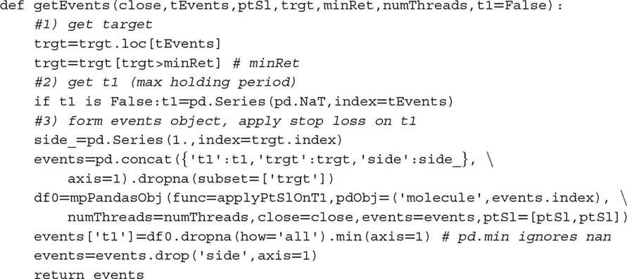
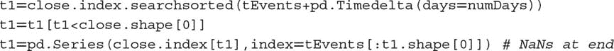
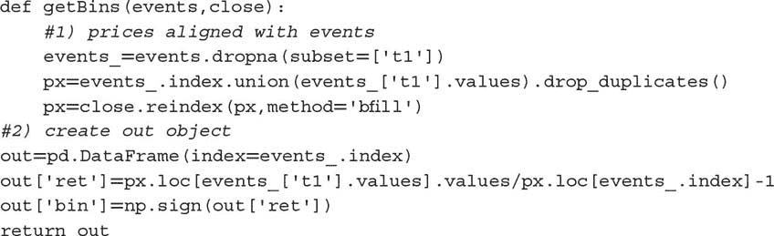
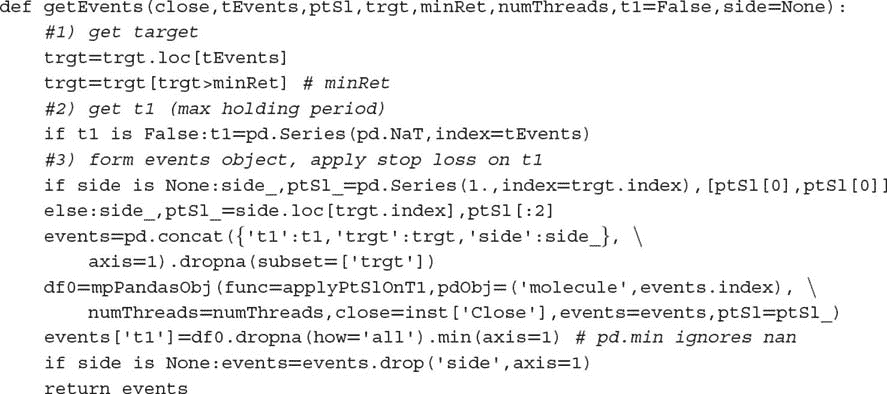
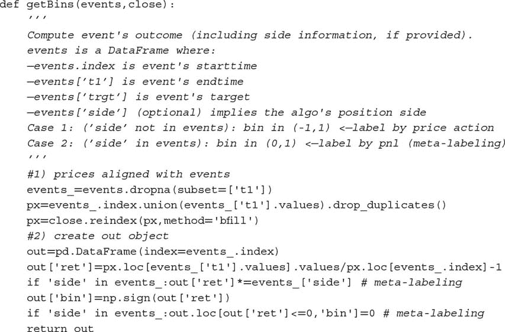
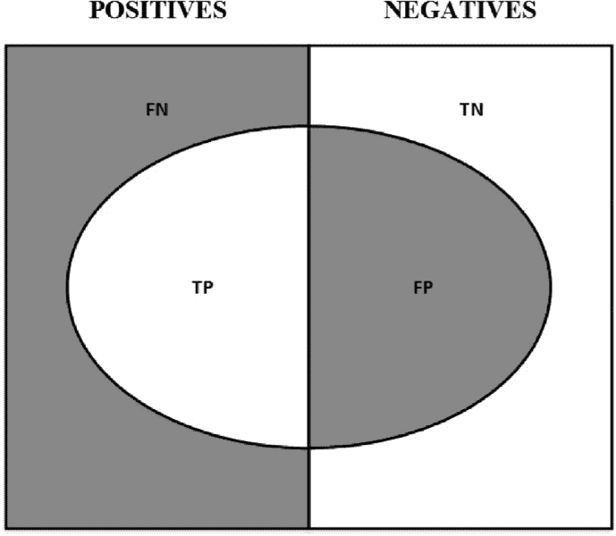
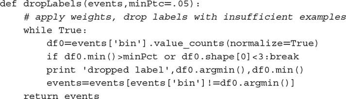
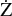

## 3.5 学习方向和大小

在本节中，我们将讨论如何标记示例，以便机器学习算法可以学习赌注的方向和大小。当我们没有基础模型来设置头寸的符号（多头或空头）时，我们对学习赌注的方向感兴趣。在这种情况下，我们无法区分获利了结障碍和止损障碍，因为这需要对方向的了解。学习方向意味着要么没有横向障碍，要么横向障碍必须是对称的。

片段 3.3 实现了函数 `getEvents`，该函数找到第一个障碍触及的时间。该函数接收以下参数：

+   `close` : 一个价格的 pandas 系列。

+   `tEvents` : 包含将为每个三重障碍播种的时间戳的 pandas 时间索引。这些是第二章第 2.5 节讨论的采样程序选定的时间戳。

+   `ptSl` : 一个非负浮点数，用于设置两个障碍的宽度。0 值表示相应的横向障碍（获利了结和/或止损）将被禁用。

+   `t1` : 一个包含垂直障碍时间戳的 pandas 系列。当我们想禁用垂直障碍时传递 `False`。

+   `trgt` : 一个表示绝对收益的 pandas 系列。

+   `minRet` : 进行三重障碍搜索所需的最低目标收益。

+   `numThreads` : 函数同时使用的线程数。

> **片段 3.3 获取第一次触及的时间**
> 
> 

假设 *I* = 1 *E* 6 和 *h* = 1 *E* 3，那么在单个工具上评估的条件数量可高达十亿。许多机器学习任务计算上很昂贵，除非你熟悉多线程，而这就是其中之一。并行计算在这里发挥作用。第二十章讨论了一些我们将在整本书中使用的多进程函数。

函数 `mpPandasObj` 调用一个多进程引擎，这在第二十章中有深入解释。此时，你只需知道该函数将并行执行 `applyPtSlOnT1`。函数 `applyPtSlOnT1` 返回每个障碍被触及的时间戳（如果有的话）。然后，第一个触及的时间是 `applyPtSlOnT1` 返回的三个时间中最早的时间。因为我们必须学习赌注的方向，我们传递 `ptSl = [ptSl, ptSl]` 作为参数，并且我们任意将方向设置为始终为多头（横向障碍是对称的，因此方向与确定第一次触及的时间无关）。该函数的输出是一个包含以下列的 pandas 数据框：

+   `t1` : 第一个障碍被触及的时间戳。

+   `trgt` : 用于生成横向障碍的目标。

代码片段 3.4 展示了定义垂直障碍的一种方法。对于 `tEvents` 中的每个索引，它会找到在 `numDays` 天数之后或立即之后的下一个价格柱的时间戳。这个垂直障碍可以作为可选参数 `t1` 传递给 `getEvents`。

> **代码片段 3.4 添加垂直障碍**
> 
> 

最后，我们可以使用代码片段 3.5 中定义的 `getBins` 函数对观察进行标记。参数是我们刚刚讨论的 `events` 数据框和 `close` pandas 价格序列。输出是一个包含以下列的数据框：

+   `ret` : 第一个触及障碍时实现的回报。

+   `bin` : 标签，{−1, 0, 1}，作为结果符号的函数。该函数可以很容易地调整为将触及垂直障碍的事件标记为 0，这留作练习。

> **代码片段 3.5 侧面和大小的标记**
> 
> 

## 3.6 元标记

假设你有一个模型来设置投注方向（做多或做空）。你只需要了解该投注的大小，包括没有投注（零大小）的可能性。这是实践者经常面临的情况。我们通常知道我们想买入还是卖出某种产品，唯一剩下的问题是我们应该在这种投注中冒多大风险。我们不希望机器学习算法学习方向，只希望告诉我们适当的大小。在这一点上，听到没有书籍或论文讨论这一常见问题可能不会让你感到惊讶。幸运的是，这种困境在这里结束。我称这个问题为元标记，因为我们想构建一个次级机器学习模型，学习如何使用一个主要的外生模型。

我们将对之前的代码进行一些调整，而不是编写一个全新的 `getEvents` 函数，以处理元标记。首先，我们接受一个新的 `side` 可选参数（默认值为 `None`），该参数包含由主模型决定的我们的投注方向。当 `side` 不是 `None` 时，函数理解元标记在起作用。其次，由于我们现在知道方向，我们可以有效地区分获利和平仓。水平障碍不需要对称，如第 3.5 节所述。参数 `ptSl` 是一个包含两个非负浮点值的列表，其中 `ptSl[0]` 是乘以 `trgt` 的因子，用于设置上障碍的宽度，而 `ptSl[1]` 是乘以 `trgt` 的因子，用于设置下障碍的宽度。当任一值为 0 时，相应的障碍被禁用。代码片段 3.6 实现了这些增强功能。

> **代码片段 3.6 扩展 `**GETEVENTS**` 以整合元标记**
> 
> 

同样，我们需要扩展 `getBins` 函数，以便它处理元标记。代码片段 3.7 实现了必要的更改。

> **代码片段 3.7 扩展 `**GETBINS**` 以整合元标记**
> 
> 

现在，`out[‘bin’]`中标签的可能值为{0,1}，与之前的可行值{−1,0,1}不同。机器学习算法将被训练来决定是下注还是放弃，这是一种纯粹的二元预测。当预测标签为 1 时，我们可以利用这个二次预测的概率来推导下注的大小，其中位置的方向（符号）由主要模型设定。

## 3.7 如何使用元标签

二元分类问题在假阳性（类型 I 错误）和假阴性（类型 II 错误）之间存在权衡。一般来说，提高二元分类器的真正阳性率会倾向于提高其假阳性率。二元分类器的接收者操作特征（ROC）曲线衡量提高真正阳性率的成本，表现为接受更高假阳性率。

图 3.2 说明了所谓的“混淆矩阵”。在一组观察中，有一些项目表现出一种条件（正类，左矩形），而有些项目则没有表现出这种条件（负类，右矩形）。一个二元分类器预测某些项目表现出该条件（椭圆），其中 TP 区域包含真正的正类，TN 区域包含真正的负类。这导致了两种错误：假阳性（FP）和假阴性（FN）。“精确率”是 TP 区域与椭圆区域的比率。“召回率”是 TP 区域与左矩形区域的比率。这种召回率（即真正阳性率）是在分类问题的背景下，类似于假设检验中的“检验力”。“准确率”是 TP 和 TN 区域的总和除以总体项目（方形）。一般来说，降低 FP 区域的代价是增加 FN 区域，因为较高的精确率通常意味着较少的调用，因此召回率较低。尽管如此，仍然存在一种精确率和召回率的组合，可以最大化分类器的整体效率。F1 分数测量分类器的效率，作为精确率和召回率之间的调和平均值（更多内容见第十四章）。

**图 3.2** “混淆矩阵”的可视化

元标签在你想要实现更高的 F1 分数时特别有用。首先，我们建立一个即使精确率不是特别高也能实现高召回率的模型。其次，我们通过对主要模型预测的正类应用元标签来修正低精确率。

元标签将通过过滤掉假阳性来提高你的 F1-score，其中大多数阳性已经被主要模型识别。换句话说，次要机器学习算法的作用是确定来自主要（外生）模型的阳性是真还是假。它*并不是*为了提供投注机会。它的目的是确定我们是采取行动还是放弃所呈现的机会。

元标签是你武器库中一个非常强大的工具，原因有四个。首先，机器学习算法常常被批评为黑箱（见第一章）。元标签允许你在白箱之上构建一个机器学习系统（如基于经济理论的基础模型）。将基础模型转化为机器学习模型的能力使得元标签对于“量化基础”公司特别有用。其次，当应用元标签时，过拟合的影响被限制，因为机器学习不会决定你下注的方向，只会决定大小。第三，通过将方向预测与大小预测分开，元标签能够实现复杂的策略结构。例如，驱动上涨的特征可能与驱动下跌的特征不同。在这种情况下，你可能想要专门开发一个基于主要模型买入推荐的长期头寸机器学习策略，以及一个基于完全不同主要模型卖出推荐的短期头寸机器学习策略。第四，在小额投注上实现高准确率而在大额投注上实现低准确率会毁了你。识别良好机会的同时，合理地确定其规模同样重要，因此开发一个专注于准确判断（规模）的机器学习算法是有意义的。我们将在第十章中重提这一第四点。根据我的经验，元标签机器学习模型能够提供比标准标签模型更稳健和可靠的结果。

## 3.8 量化基础方法

你可能在媒体上看到许多对冲基金正在采纳量化基础的方法。简单的谷歌搜索会显示报告，许多对冲基金，包括一些最传统的基金，正在投资数千万美元于旨在结合人类专业知识与定量方法的技术。事实证明，元标签正是这些人一直在等待的。让我们看看原因。

假设你有一系列特征，相信可以预测某些价格，只是不知道如何做。由于你没有模型来确定每次下注的方向，你需要学习方向和大小。你应用在第 3.5 节中学到的知识，并基于对称水平边界的三重障碍法生成一些标签。现在你准备在训练集上拟合你的算法，并在测试集上评估预测的准确性。或者，你可以这样做：

1.  使用主要模型的预测，并生成元标签。请记住，在这种情况下，水平障碍不需要对称。

1.  再次在相同的训练集上拟合你的模型，但这次使用你刚生成的元标签。

1.  将第一个机器学习模型的“边”与第二个机器学习模型的“大小”结合起来。

你始终可以为任何主要模型添加一个元标签层，无论它是机器学习算法、计量经济方程、技术交易规则、基本分析等。这也包括仅基于人类直觉生成的预测。在这种情况下，元标签将帮助我们判断何时应追求或拒绝一个自由裁量基金经理的建议。这样的元标签机器学习算法使用的特征可以从市场信息到生物统计数据再到心理评估。例如，元标签机器学习算法可能会发现，当发生结构性变化时，自由裁量基金经理往往做出特别好的判断（第十七章），因为他们可能更快地理解市场机制的变化。相反，它可能会发现，由于睡眠不足、疲劳、体重变化等原因，压力下的基金经理往往做出不准确的预测。^(1) 许多职业要求定期进行心理考试，而机器学习元标签算法可能会发现这些分数也与评估我们对基金经理预测的信心程度相关。也许这些因素都不会影响自由裁量基金经理，他们的大脑独立于情感，像冷酷的计算机器一样运作。我猜这不是情况，因此元标签应成为每个自由裁量对冲基金的重要机器学习技术。在不久的将来，每个自由裁量对冲基金都将成为量化与基本结合的公司，元标签为它们提供了明确的转型路径。

## 3.9 删除不必要的标签

一些机器学习分类器在类别严重不平衡时表现不佳。在这种情况下，最好删除极为稀有的标签，专注于更常见的结果。片段 3.8 提供了一种递归删除与极稀有标签相关的观察值的过程。函数 `dropLabels` 递归消除与出现频率低于 `minPct` 的类相关的观察值，除非只剩下两个类。

> **片段 3.8 删除人口不足的标签**
> 
> 

顺便提一下，您可能希望去掉不必要的标签的另一个原因是这个已知的 sklearn bug：[`github.com/scikit-learn/scikit-learn/issues/8566`](https://github.com/scikit-learn/scikit-learn/issues/8566)。这种 bug 是 sklearn 实现中非常基本假设的结果，解决它们远非易事。在这个特定实例中，错误源于 sklearn 选择使用标准 numpy 数组，而不是结构化数组或 pandas 对象。您在阅读本章时不太可能会有修复，或在不久的将来有修复。在后面的章节中，我们将研究通过构建您自己的类和扩展 sklearn 功能来规避这些实现错误的方法。

**练习**

1.  > > 为 E-mini S&P 500 期货形成美元条：

    1.  应用对称 CUSUM 过滤器（第二章，第 2.5.2.1 节），阈值为日收益率的标准差（片段 3.1）。

    1.  在一个 pandas 序列`t1`上使用片段 3.4，其中`numDays = 1`。

    1.  在这些采样特征上，应用三重障碍法，其中`ptSl = [1,1]`，`t1`是您在第 1.b 点创建的序列。

    1.  应用`getBins`生成标签。

1.  > > 从第 1 个练习中，使用片段 3.8 去掉稀有标签。
1.  > > 
1.  > > 调整`getBins`函数（片段 3.5），以便在垂直障碍首先被触及时返回 0。
1.  > > 
1.  > > 基于流行的技术分析指标（例如交叉移动平均）开发趋势跟随策略。对于每个观察值，模型建议一个方向，但不建议下注的大小。

    1.  为`ptSl = [1,2]`和`t1`推导元标签，其中`numDays = 1`。将日标准差（由片段 3.1 计算得出）作为`trgt`。

    1.  训练一个随机森林来决定是否进行交易。注意：决定是是否交易，{0,1}，因为基础模型（交叉移动平均）已决定方向，{−1,1}。

1.  > > 基于布林带开发均值回归策略。对于每个观察值，模型建议一个方向，但不建议下注的大小。

    1.  为`ptSl = [0,2]`和`t1`推导元标签，其中`numDays = 1`。将日标准差（由片段 3.1 计算得出）作为`trgt`。

    1.  训练一个随机森林来决定是否进行交易。特征包括：波动性、序列相关性以及第 2 个练习中的交叉移动平均线。

    1.  主模型的预测准确率是多少（即，如果次级模型不过滤投注）？精确率、召回率和 F1 分数是多少？

    1.  次级模型的预测准确率是多少？精确率、召回率和 F1 分数是多少？

**参考文献**

1.  Ahmed, N., A. Atiya, N. Gayar, 和 H. El-Shishiny (2010): “机器学习模型在时间序列预测中的实证比较。” *计量经济学评论*，第 29 卷，第 5–6 期，第 594–621 页。

1.  Ballings, M., D. van den Poel, N. Hespeels 和 R. Gryp (2015): “评估多种分类器用于股票价格方向预测。” *应用专家系统* ，第 42 卷，第 20 期，页码 7046–7056。

1.  Bontempi, G., S. Taieb 和 Y. Le Borgne (2012): “时间序列预测的机器学习策略。” *商业信息处理讲义* ，第 138 卷，第 1 期，页码 62–77。

1.  Booth, A., E. Gerding 和 F. McGroarty (2014): “使用性能加权随机森林和季节性进行自动交易。” *应用专家系统* ，第 41 卷，第 8 期，页码 3651–3661。

1.  Cao, L. 和 F. Tay (2001): “使用支持向量机进行金融预测。” *神经计算与应用* ，第 10 卷，第 2 期，页码 184–192。

1.  Cao, L., F. Tay 和 F. Hock (2003): “在金融时间序列预测中使用自适应参数的支持向量机。” *IEEE 神经网络学报* ，第 14 卷，第 6 期，页码 1506–1518。

1.  Cervelló-Royo, R., F. Guijarro 和 K. Michniuk (2015): “基于模式识别和技术分析的股票市场交易规则：使用日内数据预测道琼斯工业平均指数。” *应用专家系统* ，第 42 卷，第 14 期，页码 5963–5975。

1.  Chang, P., C. Fan 和 J. Lin (2011): “使用案例基础模糊决策树发现金融时间序列数据的趋势。” *应用专家系统* ，第 38 卷，第 5 期，页码 6070–6080。

1.  Kuan, C. 和 L. Tung (1995): “使用前馈和递归神经网络进行汇率预测。” *应用计量经济学期刊* ，第 10 卷，第 4 期，页码 347–364。

1.  Creamer, G. 和 Y. Freund (2007): “自动交易的提升方法。” *交易期刊* ，第 2 卷，第 3 期，页码 84–96。

1.  Creamer, G. 和 Y. Freund (2010): “使用提升和专家加权的自动交易。” *量化金融* ，第 10 卷，第 4 期，页码 401–420。

1.  Creamer, G., Y. Ren, Y. Sakamoto 和 J. Nickerson (2016): “针对股票市场的文本分析算法：欧洲案例。” *投资期刊* ，第 25 卷，第 3 期，页码 105–116。

1.  Dixon, M., D. Klabjan 和 J. Bang (2016): “基于分类的金融市场预测使用深度神经网络。” *算法金融* ，即将出版 (2017)。可在 SSRN 获取: [`ssrn.com/abstract=2756331`](https://ssrn.com/abstract=2756331) 。

1.  Dunis, C. 和 M. Williams (2002): “建模和交易欧元/美元汇率：神经网络模型表现得更好吗？” *衍生品与对冲基金期刊* ，第 8 卷，第 3 期，页码 211–239。

1.  Feuerriegel, S. 和 H. Prendinger (2016): “基于新闻的交易策略。” *决策支持系统* ，第 90 卷，页码 65–74。

1.  Hsu, S., J. Hsieh, T. Chih 和 K. Hsu (2009): “通过整合自组织映射和支持向量回归进行股票价格预测的两阶段架构。” *应用专家系统* ，第 36 卷，第 4 期，页码 7947–7951。

1.  Huang, W.、Y. Nakamori 和 S. Wang (2005): “使用支持向量机预测股市变动方向。” *计算机与运筹研究* , 第 32 卷, 第 10 期, 第 2513–2522 页。

1.  Kara, Y.、M. Boyacioglu 和 O. Baykan (2011): “使用人工神经网络和支持向量机预测股票价格指数变动的方向：以伊斯坦布尔证券交易所为例。” *专家系统与应用* , 第 38 卷, 第 5 期, 第 5311–5319 页。

1.  Kim, K. (2003): “使用支持向量机进行金融时间序列预测。” *神经计算* , 第 55 卷, 第 1 期, 第 307–319 页。

1.  Krauss, C.、X. Do 和 N. Huck (2017): “深度神经网络、梯度增强树、随机森林：对标普 500 的统计套利。” *欧洲运筹学杂志* , 第 259 卷, 第 2 期, 第 689–702 页。

1.  Laborda, R. 和 J. Laborda (2017): “树结构分类器能为投资者增值吗？” *金融研究快报* , 第 22 卷 (8 月), 第 211–226 页。

1.  Nakamura, E. (2005): “使用神经网络进行通货膨胀预测。” *经济学信函* , 第 86 卷, 第 3 期, 第 373–378 页。

1.  Olson, D. 和 C. Mossman (2003): “使用会计比率的加拿大股票收益的神经网络预测。” *国际预测杂志* , 第 19 卷, 第 3 期, 第 453–465 页。

1.  Patel, J.、S. Sha、P. Thakkar 和 K. Kotecha (2015): “使用趋势确定数据准备和机器学习技术预测股票及股票价格指数的变动。” *专家系统与应用* , 第 42 卷, 第 1 期, 第 259–268 页。

1.  Patel, J.、S. Sha、P. Thakkar 和 K. Kotecha (2015): “使用机器学习技术的融合预测股票市场指数。” *专家系统与应用* , 第 42 卷, 第 4 期, 第 2162–2172 页。

1.  Qin, Q.、Q. Wang、J. Li 和 S. Shuzhi (2013): “线性与非线性交易模型与梯度增强随机森林及其在新加坡股市的应用。” *智能学习系统与应用杂志* , 第 5 卷, 第 1 期, 第 1–10 页。

1.  Sorensen, E.、K. Miller 和 C. Ooi (2000): “股票选择的决策树方法。” *投资组合管理杂志* , 第 27 卷, 第 1 期, 第 42–52 页。

1.  Theofilatos, K.、S. Likothanassis 和 A. Karathanasopoulos (2012): “使用机器学习技术建模和交易欧元/美元汇率。” *工程、技术与应用科学研究* , 第 2 卷, 第 5 期, 第 269–272 页。

1.  Trafalis, T. 和 H. Ince (2000): “回归的支持向量机及其在金融预测中的应用。” *神经网络* , 第 6 卷, 第 1 期, 第 348–353 页。

1.  Trippi, R. 和 D. DeSieno (1992): “使用神经网络进行股票指数期货交易。” *投资组合管理杂志* , 第 19 卷, 第 1 期, 第 27–33 页。

1.  Tsai, C. 和 S. Wang (2009): “通过混合机器学习技术进行股票价格预测。” *国际工程师和计算机科学家多学科会议录* , 第 1 卷, 第 1 期, 第 755–760 页。

1.  Tsai, C., Y. Lin, D. Yen 和 Y. Chen (2011)： “通过分类器集预测股票收益。” *应用软计算*，第 11 卷，第 2 期，页 2452–2459。

1.  Wang, J. 和 S. Chan (2006)： “使用双层偏差决策树发现股票市场交易规则。” *专家系统与应用*，第 30 卷，第 4 期，页 605–611。

1.  Wang, Q., J. Li, Q. Qin 和 S. Ge (2011)： “用于新加坡股票市场的线性、自适应和非线性交易模型，采用随机森林。” 第 9 届 IEEE 国际控制与自动化会议论文集，页 726–731。

1.  Wei, P. 和 N. Wang (2016)： “维基百科与股票收益：维基百科使用模式有助于预测个别股票的走势。” 第 25 届国际互联网大会会议论文集，第 1 卷，页 591–594。

1.   bikowski, K. (2015)： “使用体积加权支持向量机与步进测试和特征选择创建股票交易策略。” *专家系统与应用*，第 42 卷，第 4 期，页 1797–1805。

1.  Zhang, G., B. Patuwo 和 M. Hu (1998)： “使用人工神经网络进行预测：最新进展。” *国际预测杂志*，第 14 卷，第 1 期，页 35–62。

1.  Zhu, M., D. Philpotts 和 M. Stevenson (2012)： “基于树的模型在股票选择中的好处。” *资产管理杂志*，第 13 卷，第 6 期，页 437–448。

1.  Zhu, M., D. Philpotts, R. Sparks 和 J. Stevenson, Maxwell (2011)： “结合 CART 和逻辑回归的混合方法用于股票排名。” *投资组合管理杂志*，第 38 卷，第 1 期，页 100–109。

**备注**

^(1)    你可能知道至少有一家大型对冲基金每天监测其研究分析师的情绪状态。

