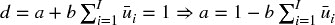

# 第四章：样本权重

## 4.1 动机

第三章介绍了几种标记金融观察的新方法。我们引入了两个新概念，三重障碍法和元标记法，并解释了它们在金融应用中的作用，包括量化投资策略。在本章中，您将学习如何使用样本权重来解决另一个在金融应用中普遍存在的问题，即观察并非由独立同分布（IID）过程生成。大多数机器学习文献基于 IID 假设，许多机器学习应用在金融中失败的原因之一是这些假设在金融时间序列的情况下不切实际。

## 4.2 重叠结果

在第三章中，我们给观察到的特征 *X [*i*]* 指定了一个标签 *y [*i*]*，其中 *y [*i*]* 是发生在区间 [ *t [*i* , 0]* , *t [*i* , 1]* ] 的价格条的函数。当 *t [*i* , 1]* > *t [*j* , 0]* 且 *i* < *j* 时，*y [*i*]* 和 *y [*j*]* 都将依赖于一个共同的收益 ，即在区间 [ *t [*j* , 0]* , min{ *t [*i* , 1]* , *t [*j* , 1]* } ] 上的收益。这意味着，标签系列 { *y [*i*]* } [*i* = 1, …, *I*] 在任意两个连续结果之间存在重叠时，均不满足独立同分布（IID）条件，∃ *i* | *t [*i* , 1]* > *t [*i* + 1, 0]* ..

假设我们通过将投注时间限制为 *t [*i* , 1]* ≤ *t [*i* + 1, 0]* 来规避这个问题。在这种情况下，没有重叠，因为每个特征的结果在下一个观察到的特征开始之前或开始时就已经确定。这将导致粗糙的模型，其中特征的采样频率将受到用于确定结果的时间范围的限制。一方面，如果我们希望研究持续一个月的结果，特征就必须以每月的频率进行采样。另一方面，如果我们将采样频率提高到每日，那么我们将被迫将结果的时间范围缩短为一天。此外，如果我们希望应用路径依赖的标签技术，比如三重障碍法，采样频率将从属于第一个障碍的触及。无论你做什么，将结果的时间范围限制以消除重叠都是一个糟糕的解决方案。我们必须允许 *t [*i* , 1]* > *t [*i* + 1, 0]*，这又让我们回到了之前描述的重叠结果的问题。

这种情况在金融应用中是典型的。大多数非金融的机器学习研究人员可以假设观察结果来自独立同分布的过程。例如，你可以从大量患者中提取血样并测量他们的胆固醇。当然，各种潜在的共同因素会影响胆固醇分布的均值和标准差，但样本仍然是独立的：每个受试者只有一个观察结果。假设你取这些血样，并且实验室里有人把每个试管的血液倒入右侧的九个试管中。也就是说，试管 10 包含患者 10 的血液，但也包含患者 1 到 9 的血液。试管 11 包含患者 11 的血液，但也包含患者 2 到 10 的血液，依此类推。现在你需要确定能够预测高胆固醇的特征（饮食、运动、年龄等），而无法确切知道每个患者的胆固醇水平。这正是我们在金融机器学习中面临的挑战，且额外的障碍在于溢出模式是非确定性的且未知的。金融与机器学习应用并不是一种即插即用的主题。任何告诉你相反的人都会浪费你的时间和金钱。

解决非 IID 标签问题有几种方法，本章将通过设计采样和加权方案来应对这一问题，以纠正重叠结果的不当影响。

## 4.3 并发标签的数量

当两个标签 *y [*i*]* 和 *y [*j*]* 在 *t* 时都是至少一个共同回报的函数时，它们是并发的。。重叠不需要是完美的，意味着两个标签跨越相同的时间区间。在这一部分，我们将计算给定回报 *r [*t* − 1,  *t*]* 的标签数量。首先，对于每个时间点 *t* = 1, …, *T*，我们形成一个二进制数组，{1 [*t*  ,  *i*]} [*i*  = 1, …,  *I*]，其中 1 [*t*  ,  *i*] ∈ {0, 1}。变量 1 [*t*  ,  *i*] = 1 当且仅当 [*t [*i*  , 0] * , *t [*i*  , 1] *] 与 [*t* − 1, *t*] 重叠，且 1 [*t*  ,  *i*] = 0 否则。回想一下，标签的跨度 {[ *t [*i*  , 0] * , *t [*i*  , 1] *]} [*i*  = 1, …,  *I*] 是由第三章中介绍的 `t1` 对象定义的。其次，我们计算在 *t* 时并发的标签数量。。代码片段 4.1 说明了此逻辑的实现。

> **代码片段 4.1 估计标签的唯一性**
> 
> 

## 4.4 标签的平均唯一性

在这一部分，我们将估计标签的唯一性（非重叠性），作为其生命周期内的平均唯一性。首先，标签 *i* 在时间 *t* 的唯一性为 *u [*t* , *i*]* = 1 [*t* , *i*] *c ^(− 1) [*t*]*。其次，标签 *i* 的平均唯一性是标签生命周期内 *u [*t* , *i*]* 的平均值。。这个平均唯一性也可以解释为事件生命周期内 *c [*t*]* 的调和平均的倒数。 **图 4.1** 绘制了从对象 `t1` 得出的唯一性值的直方图。代码片段 4.2 实现了此计算。

**图 4.1** 唯一性值的直方图

> **代码片段 4.2 估计标签的平均唯一性**
> 
> 

请注意，我们再次使用了函数 `mpPandasObj`，它通过多处理加速计算（见第二十章）。计算与标签 *i* 相关的平均唯一性，，需要在未来时间 `events['t1']` 可用的信息。这不是问题，因为 在训练集上结合标签信息使用，而不在测试集上使用。这些不用于预测标签，因此不存在信息泄漏。这个过程允许我们为每个观察到的特征分配一个在 0 到 1 之间的唯一性评分，基于非重叠结果。

## 4.5 装袋分类器和唯一性

在对*I*个项目进行*I*次有放回抽样后，未选择特定项目*i*的概率为(1 − *I ^(− 1)* ) ^(*I*)。随着样本量的增加，该概率收敛于渐近值。这意味着抽取的独特观察数量预计为。

假设最大的不重叠结果数量为*K* ≤ *I*。根据同样的论点，在对*I*个项目进行*I*次有放回抽样后，未选择特定项目*i*的概率为(1 − *K ^(− 1)* ) ^(*I*)。随着样本量的增加，该概率可以近似为。这意味着抽取的独特观察数量预计为。这暗示着错误地假设独立同分布抽样会导致过采样。

在对具有的观察进行有放回抽样（自助法）时，袋内观察相互（1）冗余且（2）与袋外观察非常相似的可能性越来越高。抽样的冗余性使得自助法效率低下（见第六章）。例如，在随机森林的情况下，森林中的所有树实际上都是单一过拟合决策树的非常相似的副本。由于随机抽样使得袋外样本与袋内样本非常相似，袋外准确率将被极大夸大。我们将在第七章中讨论这个第二个问题，当时我们将研究非独立同分布观察下的交叉验证。此刻，让我们集中于第一个问题，即在观察中进行装袋，当 *。*

第一个解决方案是在执行自助法之前删除重叠结果。由于重叠并不完美，仅仅因为部分重叠而删除观察将导致信息的极大损失。我不建议您遵循这个解决方案。

第二个更好的解决方案是利用平均独特性，以减少包含冗余信息结果的不当影响。因此，我们可以仅抽取观察的一部分`out['tW'].mean()`，或者是其小倍数。在 sklearn 中，`sklearn.ensemble.BaggingClassifier`类接受一个参数`max_samples`，可以设置为`max_samples=out['tW'].mean()`。这样，我们确保袋内观察的抽样频率不会远高于其独特性。然而，随机森林并不提供该`max_samples`功能，解决方案是装袋大量决策树。我们将在第六章进一步讨论此解决方案。

**4.5.1 顺序自助法**

第三种更好的解决方案是执行顺序自助法，根据控制冗余的变化概率进行抽取。Rao 等人[1997]提出了在出现 *K* 个不同原始观察值之前进行有替换的顺序重抽样。尽管有趣，但他们的方案并不完全适用于我们的金融问题。在接下来的部分中，我们将介绍一种直接解决重叠结果问题的替代方法。

首先，从均匀分布中抽取一个观察值 *X [*i*]*，*i* ∼ *U* [1, *I*]，即抽取任何特定值 *i* 的概率最初为 δ ^((1)) [*i*] = *I ^(− 1)*。在第二次抽取中，我们希望减少抽取高度重叠结果的观察值 *X [*j*]* 的概率。请记住，自助法允许重复抽样，因此仍然可以再次抽取 *X [*i*]*，但我们希望降低其可能性，因为 *X [*i*]* 和自身之间存在重叠（实际上是完全重叠）。我们将到目前为止的抽样序列表示为 φ，可能包括重复项。到现在为止，我们知道 φ ^((1)) = { *i* }。在时间 *t* 时 *j* 的唯一性是 ，因为这是通过向现有的抽样序列 φ ^((1)) 添加替代 *j* 得到的唯一性。*j* 的平均唯一性是 *j* 生命周期内的平均 *u ^((2)) [*t*，*j*]*，。现在我们可以根据更新后的概率 {δ ^((2)) [*j*]} [*j* = 1, …, *I*] 进行第二次抽取，

其中 {δ ^((2)) [*j*]} [*j* = 1, .., *I*] 被缩放为加起来为 1， *.* 现在我们可以进行第二次抽取，更新 φ ^((2)) 并重新评估 {δ ^((3)) [*j*]} [*j* = 1, …, *I*]。该过程重复进行，直到进行 *I* 次抽取。这个顺序自助法方案的优点是仍然可能出现重叠（甚至重复），但可能性逐渐降低。顺序自助样本将比从标准自助法中抽取的样本更接近独立同分布（IID）。可以通过测量相对于标准自助法的  的增加来验证这一点。

**4.5.2 顺序自助法的实现**

片段 4.3 根据两个参数推导出一个指示矩阵：柱子的索引（`barIx`）和 pandas Series `t1`，我们在第三章中多次使用。提醒一下，`t1`的定义是一个包含特征观察时间的索引和一个包含标签确定时间的值数组。该函数的输出是一个二进制矩阵，指示哪些（价格）柱子影响每个观察的标签。

> **片段 4.3 构建指示矩阵**
> 
> 

片段 4.4 返回每个观察特征的平均唯一性。输入是通过 `getIndMatrix` 构建的指示矩阵。

> **片段 4.4 计算平均唯一性**
> 
> 

片段 4.5 为我们提供了通过顺序自助抽样的特征索引。输入是指示矩阵（`indM`）和一个可选的样本长度（`sLength`），其默认值为与`indM`中的行数相同的抽样次数。

> **片段 4.5 从顺序自助法返回样本**
> 
> 

**4.5.3 数值示例**

考虑一组标签{ *y [*i*]* } [*i* = 1, 2, 3]，其中标签*y [1]*是回报*r [0, 3]*的函数，标签*y [2]*是回报*r [2, 4]*的函数，标签*y [3]*是回报*r [4, 6]*的函数。结果的重叠由此指示矩阵{1 [*t* , *i*]}表征，

该程序以φ ^((0)) = ∅开始，概率均匀分布为，∀ *i* = 1, 2, 3 *.* 假设我们从{1, 2, 3}中随机抽取一个数字，选择了 2。在我们对{1, 2, 3}进行第二次抽样之前（请记住，自助抽样是带重复的），我们需要调整概率。迄今为止抽取的观察集为φ ^((1)) = {2}。第一个特征的平均独特性为，第二个特征为 *.* 第二次抽样的概率为。有两点值得注意：(1) 最低概率赋予首次抽样中被选中的特征，因为这将表现出最高的重叠；(2) 在φ ^((1))外的两个可能抽样中，较大的概率赋予δ ^((2)) [  3  ]，因为这是与φ ^((1))没有重叠的标签。假设第二次抽样选择了数字 3。我们留作练习更新第三次和最后一次抽样的概率δ ^((3))。片段 4.6 在此示例中对{1 [*t* , *i*]}指示矩阵进行顺序自助抽样。

> **片段 4.6 顺序自助法示例**
> 
> 

**4.5.4 蒙特卡洛实验**

我们可以通过实验方法评估顺序自助算法的效率。片段 4.7 列出了为多个观察值`numObs`（*I*）生成随机`t1`系列的函数。每个观察值是在从均匀分布中抽取的随机数下进行的，其边界为 0 和`numBars`，其中`numBars`是柱子的数量（*T*）。观察值跨度的柱子数量是通过从均匀分布中抽取边界为 0 和`maxH`的随机数来确定的。

> **片段 4.7 生成随机 T1 系列**
> 
> 

片段 4.8 利用该随机`t1`系列推导出隐含的指示矩阵`indM`。然后，该矩阵经过两个程序。在第一个程序中，我们从标准自助法（带替换的随机抽样）中推导出平均独特性。在第二个程序中，我们通过应用顺序自助算法推导出平均独特性。结果以字典的形式报告。

> **片段 4.8 从标准和顺序自助法中得出的独特性**
> 
> 

这些操作必须在大量迭代中重复进行。片段 4.9 使用第二十章讨论的多进程技术实现了这个蒙特卡罗实验。例如，使用 24 核服务器进行 1E6 次迭代的蒙特卡罗实验大约需要 6 小时，其中 `numObs=10`，`numBars=100`，`maxH=5`。如果不并行化，类似的蒙特卡罗实验将需要约 6 天。

> **片段 4.9 多线程蒙特卡罗**
> 
> 

图 4.2 绘制了标准重采样样本（左）和顺序重采样样本（右）唯一性的直方图。标准方法的平均唯一性的中位数为 0.6，顺序方法的平均唯一性的中位数为 0.7。对均值差异的方差分析（ANOVA）测试返回的概率极小。从统计学角度来看，顺序重采样方法的样本在任何合理的置信水平下，其预期唯一性超过标准重采样方法。

**图 4.2**标准与顺序重采样的蒙特卡罗实验

## 4.6 回报归因

在前一节中，我们学习了一种将样本重采样得更接近 IID 的方法。在这一节中，我们将介绍一种为训练机器学习算法加权这些样本的方法。如果考虑到重叠结果与非重叠结果相等，重叠结果将具有不成比例的权重。同时，与大绝对回报相关的标签应比与微不足道的绝对回报相关的标签更重要。简而言之，我们需要通过唯一性和绝对回报的某种函数对观察进行加权。

当标签是回报符号的函数（{−1, 1}用于标准标记或{0, 1}用于元标记）时，样本权重可以根据事件生命周期内归因回报的总和来定义，[ *t [*i* , 0]* , *t [*i* , 1]* ]。

因此 。我们已将这些权重缩放为加起来等于 *I*，因为库（包括 sklearn）通常假设算法参数的默认权重为 1。

该方法的 rationale 是我们希望将观察加权为可以唯一归因于它的绝对对数回报的函数。然而，如果存在“中性”（低于阈值的回报）情况，则该方法将无效。在这种情况下，应给较低回报分配较高的权重，而不是其倒数。“中性”情况是多余的，因为它可以通过低置信度的“−1”或“1”预测来隐含。这是我一般建议你放弃“中性”情况的几个原因之一。片段 4.10 实现了该方法。

> **片段 4.10 通过绝对回报归因确定样本权重**
> 
> 

## 4.7 时间衰减

市场是自适应系统（Lo [2017]）。随着市场的演变，旧例子相对于新例子而言相关性下降。因此，我们通常希望样本权重在新观察到来时衰减。设  为将乘以上一节中得出的样本权重的时间衰减因子。最终权重没有衰减，，所有其他权重将相对调整。让 *c* ∈ (−1., .1] 成为用户定义的参数，以决定衰减函数如下：对于 *c* ∈ [0, 1]，则 *d* [1] = *c*，线性衰减；对于 *c* ∈ (−1, 0)，则 ，在  和 *d* [*x*] = 0 之间线性衰减！。对于线性分段函数 *d* = max{0, *a* + *bx*}，以下边界条件满足这些要求：

1.  。

1.  依赖于 *c*：

    1.  ，∀*c* ∈ [0, 1]

    1.  ，∀*c* ∈ (−1, 0)

片段 4.11 实现了这种时间衰减因子。注意，时间并不意味着是按时间顺序的。在这个实现中，衰减是根据累计独特性进行的，，因为按时间顺序的衰减会在存在冗余观察时过快地降低权重。

> **片段 4.11 时间衰减因子的实现**
> 
> 

值得讨论几个有趣的案例：

+   *c* = 1 表示没有时间衰减。

+   0 < *c* < 1 表示权重随时间线性衰减，但每个观察仍然会得到严格正的权重，无论它有多老。

+   *c* = 0 意味着权重随着时间的推移线性收敛到零。

+   *c* < 0 意味着观察中最老的部分 *cT* 得到零权重（即，它们从记忆中被抹去）。

图 4.3 显示了在 *c* ∈ {1, .75, .5, 0, −.25, −.5} 的时间衰减因子应用后的衰减权重，`out['w']*df`。尽管不一定实用，但该过程允许生成随着时间变老而增加的权重，通过设置 *c* > 1。

**图 4.3** 分段线性时间衰减因子

## 4.8 类别权重

除了样本权重，应用类别权重通常也是有用的。类别权重是用于纠正欠代表标签的权重。这在分类问题中尤为重要，其中最重要的类别出现频率较低（King 和 Zeng [2001]）。例如，假设你希望预测流动性危机，如 2010 年 5 月 6 日的闪电崩盘。这些事件相对于其间发生的数百万次观察来说是罕见的。除非我们为与这些罕见标签相关的样本分配更高的权重，否则机器学习算法将最大化最常见标签的准确性，而将闪电崩盘视为异常值而非罕见事件。

ML 库通常实现处理类权重的功能。例如，sklearn 会对 `class[j]` 的样本中的错误进行惩罚，*j=1,…,J*，权重为 `class_weight[j]` 而不是 1。因此，标签 *j* 的更高类权重将迫使算法在 *j* 上实现更高的准确性。当类权重不加总为 *J* 时，效果相当于改变分类器的正则化参数。

在金融应用中，分类算法的标准标签为 { − 1, 1}，其中零（或中性）案例将由概率略高于 0.5 且低于某个中性阈值的预测暗示。没有理由偏向于一个类别的准确性，因此一个好的默认选择是将 `class_weight='balanced'`。这个选择重新加权观察，以模拟所有类别以相等频率出现。在包外分类器的上下文中，你可能想考虑参数 `class_weight='balanced_subsample'`，这意味着 `class_weight='balanced'` 将应用于包内自举样本，而不是整个数据集。有关完整细节，查看实现 `class_weight` 的 sklearn 源代码是有帮助的。请注意这个报告的错误：[`github.com/scikit-learn/scikit-learn/issues/4324`](https://github.com/scikit-learn/scikit-learn/issues/4324)。

**练习**

1.  > > 在第三章中，我们将第一次触及障碍的时间戳 pandas 系列表示为 `t1`，索引为观察的时间戳。这是 `getEvents` 函数的输出。

    1.  在从 E-mini S&P 500 期货的 tick 数据导出的美元条上计算 `t1` 系列。

    1.  应用函数 `mpNumCoEvents` 来计算每个时间点的重叠结果数量。

    1.  在主轴上绘制并发标签数量的时间序列，在次轴上绘制回报的指数加权移动标准差的时间序列。

    1.  生成并发标签数量（x 轴）与回报的指数加权移动标准差（y 轴）的散点图。你能体会到一种关系吗？

1.  > > 使用函数 `mpSampleTW`，计算每个标签的平均唯一性。这个时间序列的一阶序列相关性 AR(1) 是多少？它在统计上显著吗？为什么？
1.  > > 
1.  > > 为包含  的金融数据集拟合随机森林。

    1.  什么是平均包外准确率？

    1.  在同一数据集上，k 折交叉验证（不打乱）的平均准确率是多少？

    1.  为什么包外准确率比交叉验证准确率高得多？哪个更正确/偏差更小？这种偏差的来源是什么？

1.  > > 修改第 4.7 节中的代码以应用指数时间衰减因子。
1.  > > 
1.  > > 考虑到你已经对由趋势跟踪模型确定的事件应用了元标签。假设三分之二的标签为 0，三分之一的标签为 1。

    1.  如果在没有平衡类别权重的情况下拟合分类器，会发生什么？

    1.  标签 1 表示真正例，标签 0 表示假正例。通过应用平衡类别权重，我们迫使分类器更关注真正例，减少对假正例的关注。这有什么意义？

    1.  在应用平衡类别权重之前和之后，预测标签的分布是什么？

1.  > > 更新 4.5.3 节最后一次抽取的概率。
1.  > > 
1.  > > 在 4.5.3 节中，假设在第二次抽取中再次选择了数字 2。第三次抽取的更新概率会是什么？

**参考文献**

1.  Rao, C.，P. Pathak 和 V. Koltchinskii (1997)： “通过序贯重抽样进行自助法。” *统计规划与推断杂志* ，第 64 卷，第 2 期，第 257–281 页。

1.  King, G. 和 L. Zeng (2001)： “稀有事件数据中的逻辑回归。” 工作论文，哈佛大学。可在 [`gking.harvard.edu/files/0s.pdf`](https://gking.harvard.edu/files/0s.pdf) 获得。

1.  Lo, A. (2017)： *自适应市场* ，第 1 版。普林斯顿大学出版社。

**参考文献**

样本加权是机器学习文献中的一个常见主题。然而，本章讨论的实际问题是投资应用的特征，相关的学术文献极为稀缺。以下是一些与本章讨论的一些问题间接相关的出版物。

1.  Efron, B. (1979)： “自助法：对切片法的另一种看法。” *统计年鉴* ，第 7 卷，第 1–26 页。

1.  Efron, B. (1983)： “估计预测规则的错误率：交叉验证的改进。” *美国统计协会杂志* ，第 78 卷，第 316–331 页。

1.  Bickel, P. 和 D. Freedman (1981)： “自助法的一些渐近理论。” *统计年鉴* ，第 9 卷，第 1196–1217 页。

1.  Gine, E. 和 J. Zinn (1990)： “引导一般经验度量。” *概率年鉴* ，第 18 卷，第 851–869 页。

1.  Hall, P. 和 E. Mammen (1994)： “关于一般重抽样算法及其在分布估计中的表现。” *统计年鉴* ，第 24 卷，第 2011–2030 页。

1.  Mitra, S. 和 P. Pathak (1984)： “简单随机抽样的性质。” *统计年鉴* ，第 12 卷，第 1536–1542 页。

1.  Pathak, P. (1964)： “抽样理论中的充分性。” *数学统计年鉴* ，第 35 卷，第 795–808 页。

1.  Pathak, P. (1964)： “在不等概率下的逆抽样。” *生物统计* ，第 51 卷，第 185–193 页。

1.  Praestgaard, J. 和 J. Wellner (1993)： “一般经验过程的可交换加权自助法。” *概率年鉴* ，第 21 卷，第 2053–2086 页。

1.  Rao, C.，P. Pathak 和 V. Koltchinskii (1997)： “通过序贯重抽样进行自助法。” *统计规划与推断杂志* ，第 64 卷，第 2 期，第 257–281 页。

