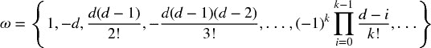
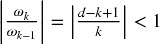

# 第五章：分数差分特征

## 5.1 动机

已知，由于套利力量的影响，金融序列表现出低信噪比（洛佩斯·德·普拉多[2015]）。更糟糕的是，标准平稳性变换，比如整数差分，进一步通过去除记忆降低了信号。价格序列具有记忆，因为每个值依赖于长期的历史水平。相比之下，像收益这样的整数差分序列具有记忆截止，意味着在有限的样本窗口后历史被完全忽视。一旦平稳性变换将数据中的所有记忆抹去，统计学家会 resort to 复杂的数学技术来提取剩余的信号。不出所料，在去记忆序列上应用这些复杂技术可能会导致错误发现。在本章中，我们介绍了一种数据变换方法，确保数据的平稳性，同时尽可能保留记忆。

## 5.2 平稳性与记忆的困境

在金融领域，发现非平稳时间序列是很常见的。导致这些序列非平稳的原因是存在记忆，即长期的历史水平影响序列的均值。为了进行推断分析，研究人员需要处理不变过程，比如价格的收益（或对数价格的变化）、收益变化或波动率变化。这些数据变换使序列平稳，但代价是从原始序列中去除了所有记忆（亚历山大[2001]，第十一章）。虽然平稳性是推断分析的必要属性，但在信号处理时，我们通常并不希望完全消除所有记忆，因为这些记忆是模型预测能力的基础。例如，平衡（平稳）模型需要一定的记忆来评估价格过程偏离长期期望值的程度，以生成预测。困境在于，收益是平稳的，但没有记忆，而价格有记忆，但又是非平稳的。问题是：什么是使价格序列平稳的最小差分量，同时尽可能保留记忆？因此，我们希望推广收益的概念，以考虑*保留部分记忆的平稳序列*。在这个框架下，收益只是一种（在大多数情况下是次优的）价格变换，还有许多其他可能性。

协整方法的重要性部分在于它们能够对具有记忆的序列建模。但为什么零差分的特定情况会带来最佳结果？零差分与 1 步差分一样任意。这两者之间有一个广泛的区域（完全差分序列在一端，零差分序列在另一端），可以通过分数差分来探索，以便开发出高预测能力的机器学习模型。

监督学习算法通常要求特征是平稳的。原因在于我们需要将一个先前未见（未标记）的观察值映射到一组标记示例，并从中推断出该新观察值的标签。如果特征不平稳，我们就无法将新观察值映射到大量已知示例。然而，平稳性并不保证预测能力。平稳性是机器学习算法高性能的必要但不充分条件。问题在于，平稳性与记忆之间存在权衡。我们总是可以通过微分使序列更平稳，但这将以抹去部分记忆为代价，这将削弱机器学习算法的预测目的。在本章中，我们将研究解决这一困境的一种方法。

## 5.3 文献综述

几乎所有的金融时间序列文献都是基于通过整数变换使非平稳序列平稳的前提（参见汉密尔顿 [1994] 的例子）。这引出了两个问题：（1）为什么整数 1 微分（例如用于计算对数价格回报的微分）是最优的？（2）过度微分是否是文献在高效市场假说方面存在偏见的一个原因？

应用于预测时间序列分析的分数微分概念至少可以追溯到霍斯金 [1981]。在那篇论文中，通过允许微分的阶数取分数值，推广了一类 ARIMA 过程。这是有用的，因为分数微分过程表现出长期的持续性和反持续性，因此增强了与标准 ARIMA 方法相比的预测能力。在同一篇论文中，霍斯金指出：“除了格兰杰（1978）的简短提及，分数微分似乎以前在时间序列分析中并未被提及。”

在霍斯金的论文发表后，这一主题的文献出奇地稀少，总共只有九位作者撰写的八篇期刊文章：霍斯金、约汉森、尼尔森、麦金农、延森、琼斯、波皮尔、卡瓦利埃雷和泰勒。具体参考文献请见文后。大多数论文涉及技术问题，例如计算连续随机过程中的分数微分的快速算法（例如，延森和尼尔森 [2014]）。

对随机过程进行微分是一项计算成本高昂的操作。在本章中，我们将采用一种实用的、替代的和新颖的方法来恢复平稳性：我们将将差分算子推广到非整数步。

## 5.4 方法

考虑反移位算子 *B*，应用于实值特征矩阵 { *X [*t*]* }，其中 *B ^(*k*) X [*t*]* = *X [*t* − *k*]*，对于任何整数 *k* ≥ 0 *.* 例如，(1 − *B* ) ² = 1 − 2 *B* + *B ²*，其中 *B ² X [*t*]* = *X [*t* − 2]*，因此 (1 − *B* ) ² *X [*t*]* = *X [*t*]* − 2 *X [*t* − 1]* + *X [*t* − 2]*。注意 ，对于 *n* 为正整数。对于实数 *d*，，二项级数。

在分数模型中，指数 *d* 可以是实数，具有以下形式的二项级数展开：

**5.4.1 长期记忆**

让我们看看一个实数（非整数）正 *d* 是如何保持记忆的。这一算术序列由一个点积组成。

带权重ω

和数值 *X*

当 *d* 是正整数时，，超出该点的内存被取消。例如，*d* = 1 用于计算回报，其中 ，且 ω = {1, −1, 0, 0, …}。

**5.4.2 迭代估计**

从权重序列 ω 中，我们可以看出对于 *k* = 0, …, ∞，当 ω [0] = 1 时，权重可以通过迭代生成：

图 5.1 绘制了用于计算每个分数差分序列值的权重序列。图例报告了生成每个序列所使用的 *d* 值，x 轴表示 *k* 值，y 轴显示 ω [*k*] 的值。例如，对于 *d* = 0，所有权重均为 0，只有 ω [0] = 1。这是差分序列与原始序列重合的情况。对于 *d* = 1，所有权重均为 0，只有 ω [0] = 1 和 ω [1] = −1。这是标准的一阶整数差分，用于推导对数价格回报。在这两种情况之间，所有 ω [0] = 1 之后的权重均为负且大于 −1。

**图 5.1** *ω [*k*]*（y 轴）随着 *k* 的增加（x 轴）。每条线与特定值的 *d* ∈ [0,1] 相关，增量为 0.1。

图 5.2 绘制了 *d* ∈ [1, 2] 的权重序列，增量为 0.1。当 *d* > 1 时，我们观察到 ω [1] < −1 和 ω [*k*] > 0，∀ *k* ≥ 2 *.* 

**图 5.2** *ω [*k*]*（y 轴）随着 *k* 的增加（x 轴）。每条线与特定值的 *d* ∈ [1,2] 相关，增量为 0.1。

片段 5.1 列出了用于生成这些图表的代码。

> **片段 5.1 加权函数**
> 
> 

**5.4.3 收敛性**

让我们考虑权重的收敛性。从上述结果可以看出，对于*k* > *d*，如果ω [*k* − 1] ≠ 0，则，而ω [*k*] = 0 则为其他情况。因此，权重渐近收敛到零，作为单位圆内因素的无限乘积。此外，对于正的*d*和*k* < *d* + 1，我们有，这使得初始权重在符号上交替。对于非整数*d*，一旦*k* ≥ *d* + 1，若 int[*d*]为偶数，ω [*k*]将为负，反之则为正。总结一下，当 int[*d*]为偶数时，（从左收敛到零），而当 Int[*d*]为奇数时，（从右收敛到零）。在特殊情况下*d* ∈ (0, 1)，这意味着−1 < ω [*k*] < 0，∀ *k* > 0 *。这种权重符号的交替对于使保持平稳是必要的，因为记忆随着时间的推移而减弱或被抵消。

## 5.5 实施

在本节中，我们将探讨两种替代的分数微分实现方法：标准的“扩展窗口”方法和我称之为“固定宽度窗口分数微分”（FFD）的新方法。

**5.5.1 扩展窗口**

让我们讨论如何在实践中进行分数微分的（有限）时间序列。假设有一个包含*T*个实际观察值的时间序列，{*X [*t*]*}，*t* = 1, …, *T*。由于数据限制，分数微分值无法在无限权重序列上计算。例如，最后一个点将使用权重{ω [*k*]}，*k* = 0, …, *T* − 1，而将使用权重{ω [*k*]}，*k* = 0, …, *T* − *l* − 1。这意味着初始点与最终点的记忆量不同。对于每个*l*，我们可以确定相对权重损失。给定容忍水平τ ∈ [0, 1]，我们可以确定值*l* *，使得和。这个值*l* *对应于权重损失超过可接受阈值的第一次结果，其中λ [*t*] > τ（例如，τ = 0.01）*。

从我们之前的讨论来看，依赖于{ω [*k*]}的收敛速度，而这又依赖于*d* ∈ [0, 1]。对于*d* = 1，ω [*k*] = 0，∀ *k* > 1，而λ [*l*] = 0，∀ *l* > 1，因此可以忽略。随着*d* → 0 ^+，*l* *增加，为了保持权重损失，需要丢弃更多初始的。 图 5.3 绘制了 E-mini S&P 500 期货的交易条，大小为 1E4，前移，分数微分，参数为（*d* = .4，τ = 1）在上方，参数为（*d* = .4，τ = 1 *E* − 2）在下方。

**图 5.3** 在不控制体重损失的情况下的分数微分（顶部图）和在使用扩展窗口控制体重损失后的分数微分（底部图）

两个图中的负漂移是由于在扩展窗口时添加到初始观测值的负权重造成的。当我们不控制体重损失时，负漂移非常明显，以至于只有该趋势可见。然而，在控制体重损失后，右侧图中的负漂移相对温和，但仍然相当显著，因为值  是在扩展窗口上计算的。这个问题可以通过在代码片段 5.2 中实现的固定宽度窗口来纠正。

> **代码片段 5.2 标准分数微分（扩展窗口）**
> 
> 

**5.5.2 固定宽度窗口分数微分**

或者，可以使用固定宽度窗口计算分数微分，也就是说，当权重的模（|ω [*k*] |）低于给定阈值（τ）时，丢弃权重 *。这相当于找到第一个 *l* *，使得  和  成立，并设置一个新变量 。

和 ，对于 *t* = *T* − *l* * + 1, …, *T*。 图 5.4 绘制了 E-mini S&P 500 期货交易条的大小为 1E4，向前滚动，分数微分（*d* = .4, τ = 1 *E* − 5）。

**图 5.4** 在控制体重损失后，使用固定宽度窗口的分数微分

该过程的优点在于，在所有  的估计中使用相同的权重向量，从而避免了扩展窗口添加的权重所造成的负漂移。结果是一个无漂移的水平加噪声的组合，符合预期。由于记忆带来的偏斜度和超额峰度，分布不再是高斯分布，但它是平稳的。代码片段 5.3 展示了这个想法的实现。

> **代码片段 5.3 新的固定宽度窗口分数微分方法**
> 
> 

## 5.6 最大记忆保留的平稳性

考虑一个序列 { *X [*t*]* } [*t* = 1, …, *T*] 。对该序列应用固定宽度窗口的分数差分 (FFD) 方法，我们可以计算出最小系数 *d* *，使得得到的分数差分序列  是平稳的。这个系数 *d* * 量化了需要去除的记忆量以实现平稳性。如果  已经是平稳的，则 *d* * = 0 *。如果  包含单位根，则 *d* * < 1 *。如果  表现出爆炸性行为（如在泡沫中），则 *d* * > 1 *。一个特别值得关注的情况是 0 < *d* * ≪ 1，当原始序列“轻微非平稳”时。在这种情况下，虽然需要进行差分，但完整的整数差分会移除过多的记忆（和预测能力）。

图 5.5 说明了这个概念。在右侧 y 轴上，它绘制了基于 E-mini S&P 500 期货对数价格计算的 ADF 统计量，使用 ETF 技巧（见第二章）向前滚动，降采样到每日频率，追溯到合同的起始时间。在 x 轴上，它显示了用于生成计算 ADF 统计量的序列的 *d* 值。原始序列的 ADF 统计量为 –0.3387，而收益序列的 ADF 统计量为 –46.9114。在 95% 的置信水平下，测试的临界值为 –2.8623。ADF 统计量在 *d* = 0.35 附近穿越了该阈值。左侧 y 轴绘制了原始序列（ *d* = 0）与在不同 *d* 值下的差分序列之间的相关性。在 *d* = 0.35 时，相关性仍然非常高，为 0.995。这证实了本章介绍的程序在实现平稳性而不牺牲过多记忆方面是成功的。相比之下，原始序列与收益序列之间的相关性仅为 0.03，这表明标准整数差分几乎完全消除了序列的记忆。

**图 5.5** ADF 统计量作为 *d* 的函数，基于 E-mini S&P 500 期货的对数价格。

几乎所有的金融论文都试图通过应用整数差分 *d* = 1 ≫ 0.35 来恢复平稳性，这意味着大多数研究过度差分了序列，也就是说，它们移除了比满足标准计量经济学假设所需的更多记忆。片段 5.4 列出了用于产生这些结果的代码。

> **片段 5.4 寻找通过 ADF 测试的最小** ***D*** **值**
> 
> 

E-mini 期货的例子绝对不是例外。表 5.1 显示了在对 87 个全球最活跃期货合约的各种 *d* 值应用 FFD(*d*) 后的 ADF 统计量。在所有情况下，用于计算收益的标准 *d* = 1 表示过度差分。事实上，在所有情况下，*d* < 0.6 时都能实现平稳性。在某些情况下，如橙汁 (JO1 Comdty) 或活牛 (LC1 Comdty)，根本不需要进行任何差分。

**表 5.1** **某些最活跃期货合约的 FFD(** ***d*** **) 的 ADF 统计量**

## 5.7 结论

总结来说，大多数计量经济学分析遵循两种范式之一：

1.  Box-Jenkins：收益是平稳的，但没有记忆。

1.  Engle-Granger：对数价格具有记忆，但它们是非平稳的。协整是使回归在非平稳序列上有效的技巧，从而保留记忆。然而，协整变量的数量是有限的，且协整向量 notoriously 不稳定。

相比之下，本章介绍的 FFD 方法表明，不需要放弃所有的记忆就可以获得平稳性。并且在与 ML 预测相关时，没有必要使用协整技巧。一旦你熟悉 FFD，它将使你能够在不放弃记忆（或预测能力）的情况下实现平稳性。

在实践中，我建议你尝试以下特征转换：首先，计算时间序列的累积和。这确保需要某种顺序的差分。第二，计算不同 *d* ∈ [0, 1] 的 FFD(*d*) 序列。第三，确定最小的 *d* 使得 FFD(*d*) 的 ADF 统计量的 p 值低于 5%。第四，将 FFD(*d*) 序列用作你的预测特征。

**练习**

1.  > > 从 IID 高斯随机过程中生成一个时间序列。这是一个没有记忆的平稳序列：

    1.  计算该序列的 ADF 统计量。p 值是多少？

    1.  计算观测值的累积和。这是一个没有记忆的非平稳序列。

        1.  这个累积序列的积分顺序是多少？

        1.  计算该序列的 ADF 统计量。p 值是多少？

    1.  对序列进行两次差分。这个过度差分序列的 p 值是多少？

1.  > > 生成一个遵循正弦函数的时间序列。这是一个具有记忆的平稳序列。

    1.  计算该序列的 ADF 统计量。p 值是多少？

    1.  将每个观测值都加上相同的正值。计算观测值的累积和。这是一个具有记忆的非平稳序列。

        1.  计算该序列的 ADF 统计量。p 值是多少？

        1.  应用扩展窗口 fracdiff，τ = 1*E* − 2*.* 在什么最小 *d* 值下，你会得到低于 5% 的 p 值？

        1.  应用 FFD，τ = 1*E* − 5*.* 在什么最小 *d* 值下，你会得到低于 5% 的 p 值？

1.  > > 取第 2.b 题中的系列：

    1.  将系列拟合到正弦函数上。R 平方值是多少？

    1.  应用 FFD(*d = 1*)。将系列拟合到正弦函数上。R 平方值是多少？

    1.  什么 *d* 值最大化 FFD(*d*) 上的 R 平方值？为什么？

1.  > > 取 E-mini S&P 500 期货的美元条形系列。使用代码 Snippet 5.3，对于某些 *d* ∈ [0, 2]，计算 `fracDiff_FFD(fracDiff_FFD(series,d),-d)`。你得到了什么？为什么？
1.  > > 
1.  > > 取 E-mini S&P 500 期货的美元条形系列。

    1.  形成一个新的系列作为对数价格的累积和。

    1.  应用 FFD，τ = 1*E* − 5*.* 确定新系列在什么最小 *d* ∈ [0, 2] 下是平稳的。

    1.  计算 fracdiff 系列与原始（未转换）系列的相关性。

    1.  对原始系列和 fracdiff 系列应用 Engel-Granger 协整检验。它们是协整的吗？为什么？

    1.  对 fracdiff 系列应用 Jarque-Bera 正态性检验。

1.  > > 取第 5 题中的 fracdiff 系列。

    1.  应用 CUSUM 滤波器（第二章），其中 *h* 是系列的两倍标准差。

    1.  使用过滤后的时间戳来抽样特征矩阵。将 fracdiff 值作为特征之一。

    1.  使用三重障碍法形成标签，设置为每日标准差的两倍的对称水平障碍，以及 5 天的垂直障碍。

    1.  拟合一个决策树的包袋分类器，其中：

        1.  观察到的特征使用第四章中的顺序方法进行自助抽样。

        1.  在每个自助抽样中，样本权重使用第四章中的技术确定。

**参考文献**

1.  Alexander, C. (2001): *市场模型* , 第 1 版。约翰·威利与儿子公司。

1.  Hamilton, J. (1994): *时间序列分析* , 第 1 版。普林斯顿大学出版社。

1.  Hosking, J. (1981): “分数差分。” *生物统计学* , 第 68 卷，第 1 期，页码 165–176。

1.  Jensen, A. 和 M. Nielsen (2014): “快速分数差分算法。” *时间序列分析杂志* , 第 35 卷，第 5 期，页码 428–436。

1.  López de Prado, M. (2015): “经验金融的未来。” *投资组合管理杂志* , 第 41 卷，第 4 期，页码 140–144\. 可在 [`ssrn.com/abstract=2609734`](https://ssrn.com/abstract=2609734) 获取。

**参考书目**

1.  Cavaliere, G., M. Nielsen 和 A. Taylor (2017): “具有未知形式异方差的分数时间序列模型的准最大似然估计和自助推断。” *计量经济学杂志* , 第 198 卷，第 1 期，页码 165–188。

1.  Johansen, S. 和 M. Nielsen (2012): “分数函数中心极限定理的必要矩条件。” *计量经济理论* , 第 28 卷，第 3 期，页码 671–679。

1.  Johansen, S. 和 M. Nielsen (2012): “分数协整向量自回归模型的似然推断。” *计量经济学* , 第 80 卷，第 6 期，页码 2267–2732。

1.  Johansen, S. 和 M. Nielsen (2016): “初始值在非平稳分数时间序列模型的条件最小二乘估计中的作用。” *计量经济理论* , 第 32 卷，第 5 期，页码 1095–1139。

1.  Jones, M., M. Nielsen 和 M. Popiel (2015): “经济投票与政治支持的分数协整 VAR 分析。” *加拿大经济学杂志*，第 47 卷，第 4 期，页 1078–1130。

1.  Mackinnon, J. 和 M. Nielsen, M. (2014): “分数单位根和协整检验的数值分布函数。” *应用计量经济学杂志*，第 29 卷，第 1 期，页 161–171。

