# 第六章：集成方法

## 6.1 动机

在这一章中，我们将讨论两种最流行的机器学习集成方法。^(1) 在参考文献和脚注中，您将找到介绍这些技术的书籍和文章。就像本书的其他部分一样，假设您已经使用过这些方法。本章的目的是解释是什么使它们有效，以及如何避免导致其在金融中误用的常见错误。

## 6.2 三种误差来源

机器学习模型通常会遭受三种错误：^(2)

1.  **偏差：** 这种误差是由于不现实的假设造成的。当偏差高时，机器学习算法未能识别特征与结果之间的重要关系。在这种情况下，算法被称为“欠拟合”。

1.  **方差：** 这种误差是由于对训练集中的小变化的敏感性造成的。当方差高时，算法已经对训练集进行了过拟合，因此即使是训练集的微小变化也会产生截然不同的预测。算法没有建模训练集中的一般模式，而是将噪声误认为信号。

1.  **噪声：** 这种误差是由于观测值的方差造成的，例如不可预测的变化或测量误差。这是不可减少的误差，任何模型都无法解释。

考虑一个观察训练集 { *x [*i*]* } [*i* = 1, …, *n*] 和实际值结果 { *y [*i*]* } [*i* = 1, …, *n*]。假设存在一个函数 *f* [ *x* ]，使得 *y* = *f* [ *x* ] + ϵ，其中 *ϵ* 是白噪声，且 E[ϵ [*i*] ] = 0 和 E[ϵ ² [*i*] ] = σ [ϵ] ²。我们希望估计最佳拟合 *f* [ *x* ] 的函数 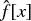，以使得估计误差的方差 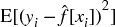 最小（均方误差不能为零，因为噪声由 σ ² [ ϵ ] 表示）。这个均方误差可以分解为

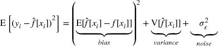

集成方法是一种结合了一组弱学习者的方法，所有学习者均基于相同的学习算法，以创建一个（更强的）学习者，该学习者的表现优于任何单个学习者。集成方法有助于减少偏差和/或方差。

## 6.3 自助聚合

自助聚合（袋装法）是减少预测方差的有效方法。其工作原理如下：首先，通过带替换的随机抽样生成 *N* 个训练数据集。其次，为每个训练集拟合 *N* 个估计器。这些估计器是相互独立拟合的，因此模型可以并行拟合。第三，集成预测是 *N* 个模型的个别预测的 *简单* 平均值。在分类变量的情况下，观察属于某个类别的概率由将该观察分类为该类别成员的估计器的比例给出（多数投票）。当基础估计器能够用预测概率进行预测时，袋装分类器可能会推导出概率的均值。

如果你使用 sklearn 的 `BaggingClassifier` 类来计算袋外准确率，你应该注意到这个错误：[`github.com/scikit-learn/scikit-learn/issues/8933`](https://github.com/scikit-learn/scikit-learn/issues/8933)。一种解决方法是将标签按整数顺序重命名。

**6.3.1 方差减少**

袋装法的主要优点是它降低了预测的方差，从而有助于解决过拟合问题。袋装预测的方差 (φ [*i*] [ *c* ]) 是袋装估计器数量 (*N*)、单个估计器预测的平均方差 ( 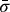 ) 和它们预测之间的平均相关性 ( 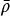 ) 的函数：

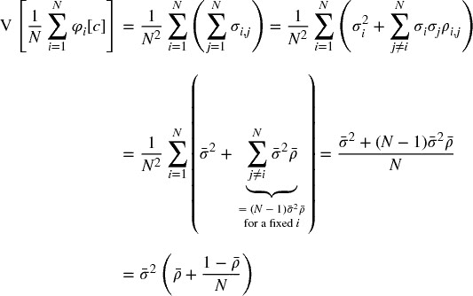

其中 σ [*i* , *j*] 是估计器 *i* 和 *j* 的预测协方差； 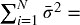 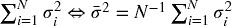；和 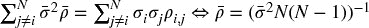 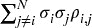。

上面的方程表明，袋装法仅在 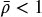 的范围内有效；当 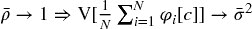 时。序列自助抽样（第四章）的一个目标是生成尽可能独立的样本，从而减少 ，这应该降低袋装分类器的方差。图 6.1 绘制了袋装预测的标准差与 *N* ∈ [5, 30] 的关系， 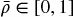 和 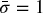 *.*

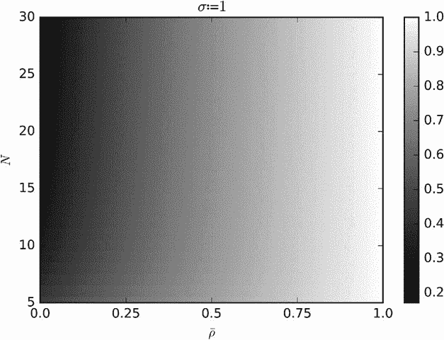

**图 6.1** 袋装预测的标准差

**6.3.2 提高准确性**

考虑一个通过对 *N* 个独立分类器进行多数投票来对 *k* 类进行预测的袋装分类器。我们可以将预测标记为 {0, 1}，其中 1 表示正确预测。分类器的准确性是将预测标记为 1 的概率 *p*。平均而言，我们将获得 *Np* 个标记为 1 的预测，方差为 *Np* (1 − *p*)。当观察到预测的类别是最多被预测的类别时，多数投票会做出正确的预测。例如，当 *N* = 10 和 *k* = 3 时，当观察到类别 *A* 且投票结果为 [ *A* , *B* , *C* ] = [4, 3, 3] 时，袋装分类器做出了正确的预测。然而，当观察到类别 *A* 且投票结果为 [ *A* , *B* , *C* ] = [4, 1, 5] 时，袋装分类器做出了错误的预测。一个充分条件是这些标签的总和是 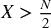。一个必要（但不充分）条件是 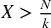，其发生的概率为

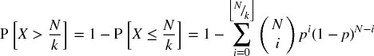

这意味着对于一个足够大的 *N*，例如 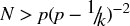，那么 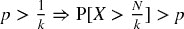，因此袋装分类器的准确性超过了个体分类器的平均准确性。片段 6.1 实现了此计算。

> **片段 6.1 袋装分类器的准确性**
> 
> 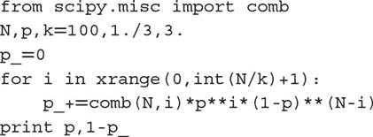

这是支持一般情况下袋装任何分类器的有力论据，前提是计算要求允许。然而，与提升方法不同，袋装方法无法改善差分类器的准确性：如果个体学习者是差分类器（ 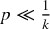），多数投票仍然表现不佳（尽管方差较低）。 图 6.2 阐明了这些事实。因为实现 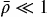 比实现 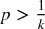 更容易，袋装方法在降低方差方面更有可能成功，而不是在降低偏差方面。

关于此主题的进一步分析，请参阅孔多塞的陪审团定理。尽管该定理是为了政治科学中的多数投票而推导的，但该定理所解决的问题与上述讨论有相似之处。

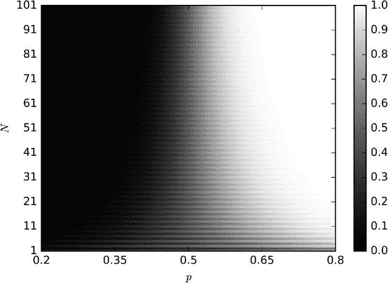

**图 6.2** 袋装分类器的准确性作为个体估计器的准确性 (*P* )、估计器数量 (*N* ) 和 *k* = 2 的函数

**6.3.3 观察冗余**

在第四章中，我们研究了为什么金融观察不能假设为独立同分布（IID）的原因。冗余观察对自助法有两个有害影响。首先，抽样替换的样本更有可能几乎相同，即使它们不共享相同的观察结果。这使得！，自助法不会降低方差，无论*N*。例如，如果每个时间点*t*的观察根据*t*与*t + 100*之间的回报进行标记，我们应该每个袋装估计器抽样 1%的观察，而不是更多。第四章第 4.5 节推荐了三种替代解决方案，其中之一是在 sklearn 自助分类器类的实现中设置`max_samples=out[‘tW’].mean()`。另一种（更好的）解决方案是应用序贯自助法。

观察冗余的第二个有害影响是袋外准确性会被夸大。这是因为随机抽样替换会在训练集中放入与袋外样本非常相似的样本。在这种情况下，适当的分层 k 折交叉验证（在分区前不洗牌）将显示出测试集准确性远低于袋外估计值。因此，建议在使用该 sklearn 类时设置`StratifiedKFold(n_splits=k,` `shuffle=False)`来交叉验证自助分类器，并忽略袋外准确性结果。较低的数值*k*比较高的更为可取，因为过度分区会导致测试集样本与训练集样本过于相似。

## 6.4 随机森林

决策树被认为容易过拟合，这会增加预测的方差。^(3) 为了解决这个问题，随机森林（RF）方法被设计用来生成具有更低方差的集成预测。

随机森林与自助法（bagging）有一些相似之处，即在对数据的自助子集上独立训练个体估计器。与自助法的主要区别在于，随机森林引入了第二层随机性：在优化每个节点分裂时，仅评估随机属性子样本（不替换），目的是进一步去相关化估计器。

像自助法一样，随机森林在不发生过拟合的情况下降低预测方差（记住，只要！）。第二个优点是，随机森林评估特征的重要性，我们将在第八章深入讨论。第三个优点是，随机森林提供了袋外准确性估计，然而在金融应用中，它们可能被夸大（如第 6.3.3 节讨论的那样）。但是，像自助法一样，随机森林未必会表现出比单个决策树更低的偏差。

如果大量样本是冗余的（非独立同分布），仍然会发生过拟合：带替换的随机抽样将构建大量本质上相同的树（ 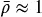），其中每棵决策树都是过拟合的（决策树臭名昭著的缺陷）。与袋装法不同，随机森林始终将自助样本的大小固定为与训练数据集大小相匹配。让我们回顾一下在 sklearn 中解决 RF 过拟合问题的方法。为了便于说明，我将引用 sklearn 的类；但是，这些解决方案可以应用于任何实现：

1.  将参数`max_features`设置为较低值，以强制树之间产生差异。

1.  提前停止：将正则化参数`min_weight_fraction_leaf`设置为足够大的值（例如 5%），以使袋外准确率收敛于样本外（k 折）准确率。

1.  在`DecisionTreeClassifier`上使用`BaggingClassifier`，其中`max_samples`设置为样本之间的平均唯一性（`avgU`）。

    1.  `clf=DecisionTreeClassifier(criterion=‘entropy’,max_features=‘auto’,class_weight=‘balanced’)`

    1.  `bc=BaggingClassifier(base_estimator=clf,n_estimators=1000,max_samples=avgU,max_features=1.)`

1.  在`RandomForestClassifier`上使用`BaggingClassifier`，其中`max_samples`设置为样本之间的平均唯一性（`avgU`）。

    1.  `clf=RandomForestClassifier(n_estimators=1,criterion=‘entropy’,bootstrap=False,class_weight=‘balanced_subsample’)`

    1.  `bc=BaggingClassifier(base_estimator=clf,n_estimators=1000,max_samples=avgU,max_features=1.)`

1.  修改 RF 类以用顺序自助抽样替代标准自助抽样。

总结来说，片段 6.2 展示了使用不同类设置 RF 的三种替代方法。

> **片段 6.2 三种设置 RF 的方法**
> 
> 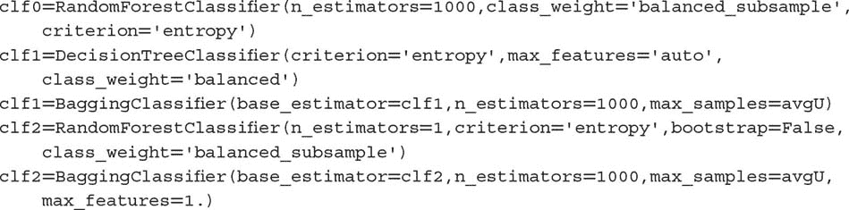

在拟合决策树时，特征空间朝着与轴对齐的方向旋转通常会减少树所需的层数。因此，我建议你在特征的主成分分析（PCA）上拟合随机森林（RF），这样可能会加速计算并减少一些过拟合（在第八章中会详细讨论）。此外，如第四章第 4.8 节所述，`class_weight=‘balanced_subsample’`将帮助你防止树错误分类少数类。

## 6.5 提升

Kearns 和 Valiant [1989] 是最早提出是否可以结合弱估计器以获得高准确度的研究者之一。随后，Schapire [1990]证明了这个问题的答案是肯定的，使用了我们今天称之为 boosting 的过程。一般来说，它的工作原理如下：首先，根据某些样本权重（初始化为均匀权重），通过随机抽样带回生成一个训练集。其次，使用该训练集拟合一个估计器。第三，如果单个估计器的准确度超过接受阈值（例如，二分类器中的 50%，使其表现优于随机），则保留该估计器，否则将其丢弃。第四，对误分类的观测值给予更多权重，而对正确分类的观测值给予较少权重。第五，重复前面的步骤，直到产生*N*个估计器。第六，集成预测是来自*N*个模型的个别预测的*加权*平均，其中权重由个别估计器的准确度决定。有许多 boosting 算法，其中 AdaBoost 是最受欢迎的算法之一（Geron [2017]）。图 6.3 总结了标准 AdaBoost 实现的决策流程。

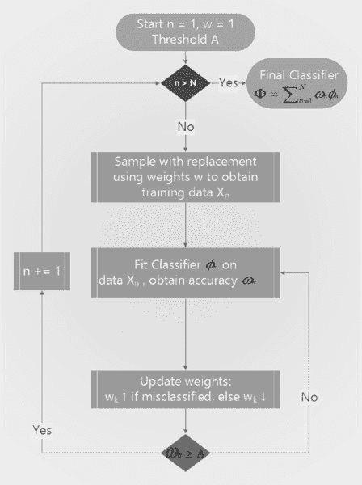

**图 6.3** AdaBoost 决策流程

## 6.6 金融中的 Bagging 与 Boosting

从上述描述来看，boosting 与 bagging 有几个方面的显著不同：^(4)

+   各个分类器是顺序拟合的。

+   表现不佳的分类器会被淘汰。

+   在每次迭代中，观测值的权重不同。

+   集成预测是各个学习者的加权平均。

Boosting 的主要优势在于它能降低预测中的方差和偏差。然而，纠正偏差的代价是增加过拟合的风险。在金融应用中，可以认为 bagging 通常优于 boosting。Bagging 解决过拟合问题，而 boosting 则解决欠拟合问题。过拟合往往比欠拟合更令人担忧，因为在金融数据上对机器学习算法进行过拟合并不困难，原因是信噪比低。此外，bagging 可以并行处理，而 boosting 通常需要顺序运行。

## 6.7 可扩展性的 Bagging

众所周知，几种流行的机器学习算法在样本量增加时扩展性较差。支持向量机（SVM）就是一个典型的例子。如果你尝试在一百万个观测值上拟合 SVM，算法可能需要一段时间才能收敛。即使它已经收敛，也不能保证解是全局最优的，或者不是过拟合的。

一种实用的方法是构建一个袋装算法，其中基础估计器属于一种对样本大小扩展不佳的类别，比如支持向量机（SVM）。在定义该基础估计器时，我们将施加严格的早期停止条件。例如，在 sklearn 的 SVM 实现中，你可以为 `max_iter` 参数设置一个较低的值，比如 1E5 次迭代。默认值是 `max_iter=-1`，这告诉估计器在错误降到容忍水平之前继续进行迭代。或者，你可以通过参数 `tol` 提高容忍水平，默认值为 `tol=1E-3`。这两个参数中的任何一个都会强制早期停止。你可以用等效参数提前停止其他算法，如随机森林中的层数（`max_depth`）或到达叶子节点所需的输入样本总权重的最小加权比例（`min_weight_fraction_leaf`）。

鉴于袋装算法可以并行化，我们将一个大型顺序任务转化为多个同时运行的小任务。当然，早期停止会增加来自单个基础估计器的输出方差；然而，这种增加可以被与袋装算法相关的方差减少所抵消。通过添加更多独立的基础估计器，你可以控制这种减少。以这种方式使用袋装算法将使你在极大数据集上实现快速而稳健的估计。

**练习**

1.  > > 为什么袋装基于有放回的随机抽样？如果采样是无放回的，袋装是否仍会减少预测的方差？
1.  > > 
1.  > > 假设你的训练集基于高度重叠的标签（即，低唯一性，如第四章所定义）。

    1.  这使得袋装算法容易过拟合，还是仅仅无效？为什么？

    1.  袋外准确率在金融应用中一般可靠吗？为什么？

1.  > > 构建一个估计器集成，其中基础估计器是决策树。

    1.  这个集成与随机森林有什么不同？

    1.  使用 sklearn，产生一个表现如随机森林的袋装分类器。你需要设置哪些参数，如何设置？

1.  > > 考虑随机森林、其组成树的数量以及所使用特征数量之间的关系：

    1.  你能设想在随机森林中所需的最小树木数量与所使用的特征数量之间的关系吗？

    1.  树的数量是否可能对于所使用的特征数量过少？

    1.  树的数量是否可能对于可用的观察数量过高？

1.  > > 袋外准确率与分层 k 折（带洗牌）交叉验证准确率有什么不同？

**参考文献**

1.  Geron, A. (2017): *动手学机器学习与 Scikit-Learn 和 TensorFlow: 构建智能系统的概念、工具和技术*，第 1 版。O'Reilly Media。

1.  Kearns, M. 和 L. Valiant (1989)： “关于学习布尔公式和有限自动机的密码学限制。” 见第 21 届年度 ACM 计算理论研讨会论文集，第 433–444 页，纽约。计算机协会。

1.  Schapire, R. (1990)： “弱学习能力的强度。” *机器学习*。Kluwer 学术出版社。第 5 卷第 2 期，第 197–227 页。

**参考文献**

1.  Gareth, J., D. Witten, T. Hastie 和 R. Tibshirani (2013)： *统计学习导论：R 语言应用*，第 1 版。Springer-Verlag。

1.  Hackeling, G. (2014)： *掌握机器学习与 Scikit-Learn*，第 1 版。Packt 出版。

1.  Hastie, T., R. Tibshirani 和 J. Friedman (2016)： *统计学习的元素*，第 2 版。Springer-Verlag。

1.  Hauck, T. (2014)： *Scikit-Learn 食谱*，第 1 版。Packt 出版。

1.  Raschka, S. (2015)： *Python 机器学习*，第 1 版。Packt 出版。

**注释**

^(1)    要了解集成方法的介绍，请访问：[`scikit-learn.org/stable/modules/ensemble.html.`](http://scikit-learn.org/stable/modules/ensemble.html.)

^(2)    我通常不会引用维基百科，然而在这个主题上，用户可能会发现这篇文章中的一些插图很有用：[`en.wikipedia.org/wiki/Bias%E2%80%93variance_tradeoff.`](https://en.wikipedia.org/wiki/Bias%E2%80%93variance_tradeoff.)

^(3)    要获得随机森林的直观解释，请访问以下链接：[`quantdare.com/random-forest-many-is-better-than-one/.`](https://quantdare.com/random-forest-many-is-better-than-one/.)

^(4)    要获取装袋与提升之间差异的视觉解释，请访问：[`quantdare.com/what-is-the-difference-between-bagging-and-boosting/.`](https://quantdare.com/what-is-the-difference-between-bagging-and-boosting/.)

