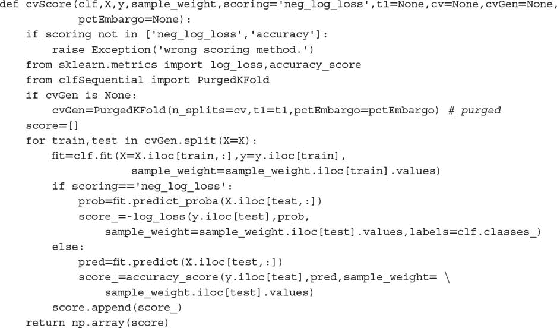

# 第七章：金融中的交叉验证

## 7.1 动机

交叉验证（CV）的目的是确定机器学习算法的泛化误差，以防止过拟合。CV 在应用于金融问题时又是一个标准机器学习技术失效的例子。过拟合会发生，而 CV 无法检测到。实际上，CV 通过超参数调优会加剧过拟合。在本章中，我们将学习为什么标准 CV 在金融中失效，以及可以采取什么措施来解决这个问题。

## 7.2 交叉验证的目标

机器学习的一个目的在于学习数据的一般结构，以便我们能够对未来未知特征进行预测。当我们在与训练时使用的同一数据集上测试机器学习算法时，结果往往令人惊讶地出色。当机器学习算法以这种方式被滥用时，它们与文件有损压缩算法并无二致：它们可以极高保真度地总结数据，但却没有任何预测能力。

交叉验证将从 IID 过程中抽取的观察值划分为两个集合：*训练* 集和 *测试* 集。完整数据集中每个观察值仅属于一个集合。这是为了防止一个集合的信息泄漏到另一个集合中，因为那样会违背在未见数据上进行测试的目的。更多细节可以在参考文献部分列出的书籍和文章中找到。

有许多替代的交叉验证方案，其中最流行的之一是 k 折交叉验证。图 7.1 展示了 k 折交叉验证所执行的 *k* 次训练/测试划分，其中 *k* = 5。在该方案中：

1.  数据集被划分为 *k* 个子集。

1.  对于 *i = 1,…,k*

    1.  机器学习算法在不包括 *i* 的所有子集上进行训练。

    1.  拟合的机器学习算法在 *i* 上进行测试。

**图 7.1** 在 5 折交叉验证方案中的训练/测试划分

k 折交叉验证的结果是一个 *kx1* 的交叉验证性能指标数组。例如，在一个二元分类器中，如果交叉验证的准确率超过 1/2，则模型被认为学到了某些东西，因为那是我们抛一枚公平硬币所能达到的准确率。

在金融领域，交叉验证通常用于两种场景：模型开发（例如超参数调优）和回测。回测是一个复杂的主题，我们将在第 10 到 16 章中详细讨论。在本章中，我们将重点关注用于模型开发的交叉验证。

## 7.3 为什么 K 折交叉验证在金融中失败

到现在为止，你可能已经阅读了不少金融领域的论文，这些论文展示了 k 折交叉验证（k-fold CV）证据，表明某个机器学习算法表现良好。不幸的是，这些结果几乎可以肯定是错误的。k 折交叉验证在金融中的失败原因之一是观察值不能被假定为来自独立同分布（IID）过程。交叉验证失败的第二个原因是，在模型开发过程中测试集被多次使用，导致多重测试和选择偏差。我们将在第 11 到 13 章重新讨论这一第二个失败原因。暂时，我们只关注第一个失败原因。

当训练集包含也出现在测试集中的信息时，就会发生泄漏。考虑一个与重叠数据形成标签 *Y* 的序列相关特征 *X*：

+   由于序列相关性，*X [*t*]* ≈ *X [*t* + 1]* 。

+   由于标签源自重叠的数据点，*Y [*t*]* ≈ *Y [*t* + 1]* 。

通过将 *t* 和 *t + 1* 放置在不同的集合中，会导致信息泄漏。当分类器首次在 (*X [*t*]* , *Y [*t*]*) 上训练，然后根据观察到的 *X [*t* + 1]* 预测 E[*Y [*t* + 1]* | *X [*t* + 1]*] 时，这个分类器更有可能实现 *Y [*t* + 1]* = E[*Y [*t* + 1]* | *X [*t* + 1]*]，即使 *X* 是一个无关特征。

如果 *X* 是预测特征，泄漏将增强已经有价值策略的表现。问题在于存在不相关特征的泄漏，这会导致虚假发现。至少有两种方法可以减少泄漏的可能性：

1.  从训练集中删除任何观察 *i*，其中 *Y [*i*]* 是用于确定 *Y [*j*]* 的信息的函数，并且 *j* 属于测试集。

    1.  例如，*Y [*i*]* 和 *Y [*j*]* 不应跨越重叠的时间段（见第四章关于样本独特性的讨论）。

1.  避免对分类器的过拟合。这样，即使发生了一些泄漏，分类器也无法从中获利。使用：

    1.  提前停止基础估计器（见第六章）。

    1.  对分类器进行集成，同时控制对冗余样本的过采样，使得个体分类器尽可能多样化。

        1.  将 `max_samples` 设置为平均独特性。

        1.  应用序贯自助法（第四章）。

考虑 *X [*i*]* 和 *X [*j*]* 是基于重叠信息形成的情况，其中 *i* 属于训练集，*j* 属于测试集。这是信息泄漏的情况吗？不一定，只要 *Y [*i*]* 和 *Y [*j*]* 是独立的。要发生泄漏，必须满足（ *X [*i*]* , *Y [*i*]* ）≈（ *X [*j*]* , *Y [*j*]* ），而仅仅 *X [*i*]* ≈ *X [*j*]* 或甚至 *Y [*i*]* ≈ *Y [*j*]* 是不够的。

## 7.4 解决方案：清除 K-折 CV

减少泄漏的一种方法是从训练集中清除与测试集中标签时间重叠的所有观察。我称这个过程为“清除”。此外，由于金融特征通常包含表现出序列相关性的序列（如 ARMA 过程），我们应该从训练集中清除紧接着测试集中观察的观察。我称这个过程为“禁运”。

**7.4.1 清除训练集**

假设一个测试观察，其标签 *Y [*j*]* 是基于信息集 Φ [*j*] 决定的。为了防止前一节所述的泄漏类型，我们希望从训练集中清除任何标签 *Y [*i*]* 是基于信息集 Φ [*i*] 决定的观察，以便 Φ [*i*] ∩Φ [*j*] = ∅ *。

特别地，我们将确定两个观察值 *i* 和 *j* 之间存在信息重叠，当 *Y [*i*]* 和 *Y [*j*]* 同时发生时（参见第四章，第 4.3 节），这意味着两个标签依赖于至少一个共同的随机抽样。例如，考虑一个标签 *Y [*j*]*，它是闭区间 *t* ∈ [ *t [*j* , 0]* , *t [*j* , 1]* ] 中观察值的函数，*Y [*j*]* = *f* [[ *t [*j* , 0]* , *t [*j* , 1]* ]]（在符号使用上有些滥用）。例如，在三重障碍标记法的背景下（第三章），这意味着该标签是价格柱之间的回报符号，其索引为 *t [*j* , 0]* 和 *t [*j* , 1]*，即 。如果任一满足以下三条充分条件，标签 *Y [*i*]* = *f* [[ *t [*i* , 0]* , *t [*i* , 1]* ]] 与 *Y [*j*]* 重叠：

1.  *t [*j* , 0]* ≤ *t [*i* , 0]* ≤ *t [*j* , 1]*

1.  *t [*j* , 0]* ≤ *t [*i* , 1]* ≤ *t [*j* , 1]*

1.  *t [*i* , 0]* ≤ *t [*j* , 0]* ≤ *t [*j* , 1]* ≤ *t [*i* , 1]*

片段 7.1 实现了从训练集中清理观察值。如果测试集是连续的，即在第一个和最后一个测试观察值之间没有训练观察值，则可以加速清理：对象 `testTimes` 可以是一个仅包含一个项目的 pandas 系列，跨越整个测试集。

> **片段 7.1 清理训练集中的观察值**
> 
> 

当泄露发生时，仅通过增加 *k* → *T* 来提高性能，其中 *T* 是柱的数量。原因是测试划分的数量越大，训练集中的重叠观察值数量就越多。在许多情况下，清理就足以防止泄露：随着 *k* 的增加，性能将得到改善，因为我们允许模型更频繁地重新校准。但超过某个值 *k*，性能将不再改善，这表明回测未能从泄露中获利。图 7.2 描绘了 k 折 CV 的一个划分。测试集被两个训练集包围，生成两个必须清理以防止泄露的重叠。

**图 7.2** 清理训练集中的重叠

**7.4.2 禁运**

对于无法完全防止所有泄漏的情况，我们可以在每个测试集*之后*对训练观察施加禁令。禁令不需要影响测试集之前的训练观察，因为训练标签*Y [*i*]* = *f* [[ *t [*i* , 0]* , *t [*i* , 1]* ]]，其中 *t [*i* , 1]* < *t [*j* , 0]*（训练在测试开始之前结束），包含在测试时间*t [*j* , 0]*可用的信息。换句话说，我们只关注在测试后立即发生的训练标签*Y [*i*]* = *f* [[ *t [*i* , 0]* , *t [*i* , 1]* ]]，满足 *t [*j* , 1]* ≤ *t [*i* , 0]* ≤ *t [*j* , 1]* + *h*。我们可以通过在清除之前设置*Y [*j*]* = *f* [[ *t [*j* , 0]* , *t [*j* , 1]* + *h* ]]来实施这个禁令期*h*。一个小的值*h* ≈ .01 *T* 通常足以防止所有泄漏，可以通过测试性能是否不会随着*k* → *T*而无限改善来确认。图 7.3 说明了在测试集之后立即禁令训练观察。代码片段 7.2 实现了禁令逻辑。

**图 7.3** 测试后训练观察的禁令

> **SNIPPET 7.2 训练观察的禁令**
> 
> 

**7.4.3 清除的 K-Fold 类**

在前面的章节中，我们讨论了在标签重叠时如何生成训练/测试划分。这引入了清除和禁令的概念，特别是在模型开发的背景下。一般来说，每当我们生成训练/测试划分时，无论是用于超参数调整、回测还是性能评估，我们都需要清除和禁令重叠的训练观察。代码片段 7.3 扩展了 scikit-learn 的 `KFold` 类，以考虑测试信息泄漏到训练集的可能性。

> **SNIPPET 7.3 当观察重叠时的交叉验证类**
> 
> 

## 7.5 Sklearn 交叉验证中的错误

你可能会认为，像交叉验证这样关键的东西应该在最流行的机器学习库之一中得到完美实现。不幸的是，情况并非如此，这也是你必须始终阅读所运行的所有代码的原因之一，也是开源的一个强有力的支持点。开源代码的许多优点之一是你可以验证所有内容并根据自己的需要进行调整。代码片段 7.4 解决了两个已知的 sklearn 错误：

1.  评分函数不知道 `classes_`，这是由于 sklearn 依赖于 numpy 数组而不是 pandas 系列：[`github.com/scikit-learn/scikit-learn/issues/6231`](https://github.com/scikit-learn/scikit-learn/issues/6231)

1.  `cross_val_score` 将给出不同的结果，因为它将权重传递给拟合方法，而不传递给 `log_loss` 方法：[`github.com/scikit-learn/scikit-learn/issues/9144`](https://github.com/scikit-learn/scikit-learn/issues/9144)

> **SNIPPET 7.4 使用** `**PURGEDKFOLD**` **类**
> 
> 

请理解，直到就这些错误达成一致、实施、测试和发布可能需要很长时间。在此之前，你应使用`cvScore`，并避免运行函数`cross_val_score`。

**练习**

1.  > > 为什么在进行 k 折 CV 之前洗牌数据集在金融领域通常是个坏主意？洗牌的目的是什么？洗牌为什么会削弱 k 折 CV 在金融数据集中的目的？
1.  > > 
1.  > > 取一对矩阵（*X*，*y*），表示观察到的特征和标签。这些可能是来自第三章练习的某个数据集。

    1.  从(*X*，*y*)的 RF 分类器进行 10 折 CV 中推导性能，不进行洗牌。

    1.  从(*X*，*y*)的 RF 进行 10 折 CV 中推导性能，进行洗牌。

    1.  为什么这两个结果如此不同？

    1.  洗牌如何泄露信息？

1.  > > 取你在练习 2 中使用的相同矩阵对（*X*，*y*）。

    1.  从(*X*，*y*)的 RF 进行 10 折排除 CV 中推导性能，保留 1%的禁运。

    1.  为什么性能更低？

    1.  为什么这个结果更现实？

1.  > > 本章我们集中讨论了 k 折交叉验证在金融应用中失败的一个原因，即测试集的一些信息泄露到训练集中。你能想到 CV 失败的第二个原因吗？
1.  > > 
1.  > > 假设你尝试一千种相同投资策略的配置，并对每种配置进行 CV。由于运气原因，某些结果肯定会看起来很好。如果你只发布这些积极的结果，并隐藏其余部分，观众将无法推断这些结果是虚假积极结果，统计上的偶然现象。这种现象称为“选择偏差”。

    1.  你能想象一种防止这种情况的程序吗？

    1.  如果我们将数据集分成三个部分：训练集、验证集和测试集，会怎么样？验证集用于评估训练的参数，而测试集只在验证阶段选择的一种配置上运行。在什么情况下这个过程仍然失败？

    1.  避免选择偏差的关键是什么？

**参考文献**

1.  Bharat Rao, R., G. Fung, 和 R. Rosales (2008)： “关于交叉验证的危险：实验评估。” IKM CKS 西门子医疗解决方案白皮书。可在 [`people.csail.mit.edu/romer/papers/CrossVal_SDM08.pdf`](http://people.csail.mit.edu/romer/papers/CrossVal_SDM08.pdf) 获取。

1.  Bishop, C. (1995)：*模式识别的神经网络*，第一版。牛津大学出版社。

1.  Breiman, L. 和 P. Spector (1992)： “回归中的子模型选择与评估：X-随机情况。” 加州大学伯克利分校统计系白皮书。可在 [`digitalassets.lib.berkeley.edu/sdtr/ucb/text/197.pdf`](http://digitalassets.lib.berkeley.edu/sdtr/ucb/text/197.pdf) 获取。

1.  Hastie, T., R. Tibshirani, 和 J. Friedman (2009)：*统计学习的要素*，第一版。斯普林格。

1.  James, G., D. Witten, T. Hastie 和 R. Tibshirani (2013)：*统计学习导论*，第 1 版。施普林格出版社。

1.  Kohavi, R. (1995)： “交叉验证和自助法在准确性估计和模型选择中的研究。” 国际人工智能联合会议。可在[`web.cs.iastate.edu/∼jtian/cs573/Papers/Kohavi-IJCAI-95.pdf`](http://web.cs.iastate.edu/~jtian/cs573/Papers/Kohavi-IJCAI-95.pdf)获取。

1.  Ripley, B. (1996)：*模式识别与神经网络*，第 1 版。剑桥大学出版社。

