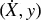

# 第八章：特征重要性

## 8.1 动机

财务研究中最普遍的错误之一是拿一些数据，运行机器学习算法，对预测进行回测，然后重复这一过程，直到出现一个看起来不错的回测结果。学术期刊充斥着这种伪发现，甚至大型对冲基金也常常陷入这个陷阱。无论回测是否为前向行走的样本外测试，我们在同一数据上反复测试的事实都可能导致错误发现。这个方法论错误在统计学家中如此臭名昭著，以至于他们将其视为科学欺诈，美国统计协会在其伦理准则中对此发出警告（美国统计协会[2016]，讨论 #4）。通常需要大约 20 次这样的迭代才能发现一个（错误的）投资策略，符合 5%的标准显著性水平（假阳性率）。在本章中，我们将探讨为何这种方法是浪费时间和金钱，以及特征重要性如何提供替代方案。

## 8.2 特征重要性的重要性

财务行业的一个显著特征是，许多经验丰富的投资组合经理（包括许多具有定量背景的人）并未意识到过度拟合回测是多么简单。如何正确进行回测并不是本章的主题；我们将在第 11 至 15 章中探讨这一极其重要的话题。本章的目标是解释在进行任何回测之前必须执行的分析之一。

假设你得到了一对矩阵（*X*，*y*），分别包含特定金融工具的特征和标签。我们可以在（*X*，*y*）上拟合一个分类器，并通过经过清除的 k 折交叉验证（CV）来评估泛化误差，如第七章所述。假设我们取得了良好的性能。下一个自然的问题是尝试理解哪些特征对该性能有贡献。也许我们可以添加一些增强分类器预测能力的特征。也许我们可以消除一些仅为系统添加噪声的特征。值得注意的是，理解特征重要性打开了所谓的黑箱。如果我们了解分类器所需的信息来源，我们就能洞察分类器识别的模式。这也是机器学习怀疑论者对黑箱论调过分强调的原因之一。是的，算法在黑箱中学习，没有我们指导这个过程（这就是机器学习的全部意义！），但这并不意味着我们不能（或不应该）查看算法所发现的内容。猎人不会盲目地吃掉他们聪明的狗为他们找回的一切，不是吗？

一旦我们找到了重要特征，我们可以通过进行多次实验来深入了解。 这些特征是否总是重要，还是仅在某些特定环境中重要？是什么导致了重要性的变化？这些转变可以预测吗？这些重要特征与其他相关金融工具相关吗？它们与其他资产类别相关吗？在所有金融工具中，最相关的特征是什么？在整个投资领域中，具有最高排名相关性的特征子集是什么？这是一种比愚蠢的回测周期更好的研究策略的方法。让我把这个格言作为我希望你从本书中学到的最关键的教训之一陈述：

> **片段 8.1 马科斯的回测第一法则—自行承担后果**
> 
> > “回测不是研究工具。特征重要性才是。”
> > 
> > > 马科斯·洛佩斯·德·普拉多 *金融机器学习的进展*（2018）

## 8.3 具有替代效应的特征重要性

我认为根据特征重要性方法是否受到替代效应的影响进行区分是有用的。在此背景下，当其他相关特征的存在降低了一个特征的估计重要性时，就会发生替代效应。替代效应是机器学习中类似于统计学和计量经济学文献所称的“多重共线性”的概念。解决线性替代效应的一种方法是对原始特征应用 PCA，然后对正交特征进行特征重要性分析。有关更多细节，请参阅 Belsley 等人[1980]、Goldberger [1991，第 245-253 页]和 Hill 等人[2001]。

**8.3.1 平均减少杂质**

平均降低杂质（MDI）是一种快速的、解释性的重要性（样本内，IS）方法，专门针对树基分类器，如 RF。在每棵决策树的每个节点，所选特征以减少杂质的方式划分其接收到的子集。因此，我们可以推导出每棵决策树中，整体杂质降低的多少可以归因于每个特征。考虑到我们有一片森林的树木，我们可以在所有估计器中平均这些值，并相应地对特征进行排名。有关详细描述，请参见 Louppe 等人 [2013]。在使用 MDI 时，有一些重要的考虑因素需要记住：

1.  遮蔽效应发生在某些特征被树基分类器系统性忽略以偏向其他特征的情况下。为了避免这种情况，在使用 sklearn 的 RF 类时设置 `max_features=int(1)`。这样，每层只考虑一个随机特征。

    1.  每个特征都有机会（在某些随机树的某些随机层次中）减少杂质。

    1.  确保零重要性的特征不被平均，因为 0 的唯一原因是该特征没有被随机选择。将这些值替换为 `np.nan`。

1.  该过程显然是 IS。每个特征都会有一定的重要性，即使它们没有任何预测能力。

1.  MDI 不能推广到其他非树基分类器。

1.  从构造上看，MDI 具有一个良好的特性，即特征重要性之和为 1，且每个特征的重要性介于 0 和 1 之间。

1.  该方法没有解决相关特征存在时的替代效应。由于特征的可互换性，MDI 稀释了替代特征的重要性：两个相同特征的重要性将减半，因为它们被随机选择的概率相等。

1.  Strobl 等人 [2007] 实验证明 MDI 对某些预测变量存在偏见。White 和 Liu [1994] 认为，在单棵决策树的情况下，这种偏见是由于流行的杂质函数对类别数量较多的预测变量给予了不公平的优势。

Sklearn 的 `RandomForest` 类将 MDI 实现为默认的特征重要性评分。这一选择可能是因为能够以最低的计算成本实时计算 MDI。^(1) 片段 8.2 说明了 MDI 的实现，包含了前面提到的考虑因素。

> **片段 8.2 MDI 特征重要性**
> 
> 

**8.3.2 平均降低准确率**

平均降低准确率（MDA）是一种缓慢的预测重要性（样本外，OOS）方法。首先，它拟合一个分类器；其次，根据某种性能评分（准确率、负对数损失等），推导出其样本外性能；第三，它逐列打乱特征矩阵（*X*），每次处理一列，在每列打乱后推导出样本外性能。特征的重要性是其列打乱造成的性能损失的函数。一些相关考虑包括：

1.  此方法可以应用于任何分类器，而不仅限于树基分类器。

1.  MDA 并不限于准确率作为唯一的性能评分。例如，在元标签应用的背景下，我们可能更愿意用 F1 而不是准确率来评分分类器（参见第十四章，第 14.8 节的解释）。这也是一个更好的描述性名称应为“打乱重要性”的原因。当评分函数不对应于度量空间时，MDA 结果应作为排名使用。

1.  与 MDI 一样，考虑到相关特征，该程序也易受到替代效应的影响。考虑到两个相同的特征，MDA 总是将一个视为冗余于另一个。不幸的是，MDA 会使这两个特征都显得完全无关，即使它们是至关重要的。

1.  与 MDI 不同，MDA 可能会得出所有特征都不重要的结论。这是因为 MDA 基于 OOS 性能。

1.  交叉验证必须被清理和封存，原因在第七章中已解释。

Snippet 8.3 实现了带样本权重的 MDA 特征重要性，采用清理过的 k 折交叉验证，并通过负对数损失或准确率进行评分。它将 MDA 重要性测量为改善的函数（从打乱特征到不打乱特征），相对于最大可能得分（负对数损失为 0，或准确率为 1）。请注意，在某些情况下，改善可能是负的，这意味着该特征实际上对 ML 算法的预测能力是有害的。

> **SNIPPET 8.3 MDA 特征重要性**
> 
> 

## 8.4 没有替代效应的特征重要性

替代效应可能导致我们丢弃一些偶然冗余的重要特征。这在预测的背景下通常不是问题，但当我们试图理解、改进或简化模型时，可能会导致错误的结论。因此，以下单一特征重要性方法可以很好地补充 MDI 和 MDA。

**8.4.1 单一特征重要性**

单一特征重要性（SFI）是一种横截面预测重要性（样本外）方法。它计算每个特征单独的样本外性能评分。一些考虑事项：

1.  此方法可以应用于任何分类器，而不仅限于树基分类器。

1.  SFI 并不限于准确率作为唯一的性能评分。

1.  与 MDI 和 MDA 不同，此时没有替代效应，因为每次只考虑一个特征。

1.  与 MDA 类似，它可以得出所有特征都不重要的结论，因为性能是通过 OOS CV 进行评估的。

SFI 的主要限制在于，具有两个特征的分类器的性能可能优于两个单特征分类器的集成。例如，(1) 特征 B 可能仅在与特征 A 组合时有用；或者 (2) 特征 B 可能在解释特征 A 的分裂时有用，即使特征 B 单独的表现并不准确。换句话说，联合效应和层次重要性在 SFI 中丧失了。一个替代方案是计算来自特征子集的 OOS 性能评分，但随着考虑的特征增多，该计算将变得难以处理。片段 8.4 演示了 SFI 方法的一个可能实现。关于函数 `cvScore` 的讨论可以在第七章中找到。

> **片段 8.4 SFI 的实现**
> 
> 

**8.4.2 正交特征**

正如第 8.3 节所述，替代效应稀释了通过 MDI 测量的特征的重要性，并显著低估了通过 MDA 测量的特征的重要性。一个部分解决方案是在应用 MDI 和 MDA 之前对特征进行正交化。诸如主成分分析（PCA）这样的正交化程序不能完全消除所有替代效应，但至少应该减轻线性替代效应的影响。

考虑一个由平稳特征组成的矩阵 { *X [*t* , *n*]* }，其中观测 *t* = 1, …, *T*，变量 *n* = 1, …, *N*。首先，我们计算标准化特征矩阵 *Z*，使得 *Z [*t* , *n*]* = σ ^(− 1) [*n*] ( *X [*t* , *n*]* − μ [*n*] )，其中 μ [*n*] 是 { *X [*t* , *n*]* } [*t* = 1, …, *T*] 的均值，σ [*n*] 是 { *X [*t* , *n*]* } [*t* = 1, …, *T*] 的标准差。其次，我们计算特征值 Λ 和特征向量 *W*，使得 *Z* ' *ZW* = *W* Λ，其中 Λ 是一个 *NxN* 的对角矩阵，主条目按降序排列，*W* 是一个 *NxN* 的正交归一化矩阵。第三，我们推导正交特征为 *P* = *ZW*。我们可以通过注意到 *P* ' *P* = *W* ' *Z* ' *ZW* = *W* ' *W* Λ *W* ' *W* = Λ 来验证特征的正交性。

对 *Z* 而不是 *X* 进行对角化，原因有二：（1）数据居中确保第一主成分在观测的主要方向上正确定位。这相当于在线性回归中添加截距；（2）重新缩放数据使 PCA 专注于解释相关性而非方差。如果不重新缩放，第一主成分将会被 *X* 中方差最大的列主导，我们将无法深入了解变量之间的结构或关系。

片段 8.5 计算解释至少 95% 方差的最小正交特征数量 *Z*。

> **片段 8.5 正交特征的计算**
> 
> 

除了解决替代效应外，使用正交特征还提供了两个额外的好处：（1）正交化还可以通过丢弃与小特征值相关的特征来减少特征矩阵*X*的维度。这通常加快机器学习算法的收敛速度；（2）分析是在设计用来解释数据结构的特征上进行的。

让我强调这一点。本书中一个普遍关注的问题是过拟合的风险。机器学习算法总会找到某种模式，即使该模式是统计上的偶然。你应该对任何方法（包括 MDI、MDA 和 SFI）所识别的重要特征保持怀疑态度。现在，假设你使用 PCA 得出了正交特征。你的 PCA 分析已经确定某些特征比其他特征更“主要”，而没有任何标签知识（无监督学习）。也就是说，PCA 在分类意义上排名特征时没有任何可能的过拟合。当你的 MDI、MDA 或 SFI 分析（使用标签信息）选择与 PCA 作为主要特征所选相同的特征（忽略标签信息）时，这构成了确认性证据，表明机器学习算法识别的模式并非完全过拟合。如果特征完全随机，PCA 排名将与特征重要性排名没有任何对应关系。图 8.1 显示了与特征相关的特征值（x 轴）与特征 MDI（y 轴）配对的散点图。皮尔逊相关系数为 0.8491（p 值低于 1E-150），证明 PCA 识别了有信息的特征并在没有过拟合的情况下正确排名。

**图 8.1** 特征值（x 轴）和 MDI 水平（y 轴）在对数-对数尺度上的散点图

我发现计算特征重要性与其相关特征值（或等价地，其逆 PCA 排名）之间的加权肯德尔τ非常有用。这个值越接近 1，PCA 排名与特征重要性排名之间的一致性就越强。偏好加权肯德尔τ而不是标准肯德尔的一个理由是，我们希望优先考虑最重要特征之间的排名一致性。我们并不太关心无关（可能噪声）特征之间的排名一致性。图 8.1 中的样本的双曲加权肯德尔τ为 0.8206。

片段 8.6 展示了如何使用 Scipy 计算这种相关性。在这个例子中，按重要性降序排列特征给我们一个非常接近升序列表的 PCA 排名序列。由于`weightedtau`函数对较高值赋予更高权重，我们在逆 PCA 排名`pcRank**-1`上计算相关性。得到的加权肯德尔τ相对较高，为 0.8133。

> **SNIPPET 8.6 加权肯德尔 tau 计算特征重要性与逆主成分分析排名之间的关系**
> 
> 

## 8.5 并行与堆叠特征重要性

至少有两种研究特征重要性的方法。首先，对于投资宇宙中的每个证券 *i*（*i* = 1, …, *I*），我们形成一个数据集（*X [*i*]*，*y [*i*]*），并并行推导特征重要性。例如，设λ [*i* , *j* , *k*]为特征 *j* 在标准 *k* 下对工具 *i* 的重要性。然后，我们可以汇总整个宇宙中的所有结果，以推导特征 *j* 在标准 *k* 下的综合重要性Λ [*j* , *k*]。在各种工具中重要的特征更可能与潜在现象相关，特别是当这些特征重要性在标准之间表现出高排名相关性时。深入研究使这些特征具有预测能力的理论机制可能是值得的。这种方法的主要优点是计算速度快，因为可以并行处理。缺点是，由于替代效应，重要特征可能会在工具之间交换其排名，从而增加估计的λ [*i* , *j* , *k*] 的方差。如果我们在足够大的投资宇宙中平均λ [*i* , *j* , *k*]，则这一缺点相对较小。

第二种选择是我称之为“特征堆叠”。它包括将所有数据集  堆叠成一个单一的组合数据集（*X*，*y*），其中  是对 *X [*i*] * 的变换实例（例如，在滚动窗口上标准化）。这种变换的目的是确保一些分布同质性，。在这种方法下，分类器必须同时学习哪些特征在所有工具中更重要，就好像整个投资宇宙实际上是一个单一工具。特征堆叠有一些优点：（1）分类器将在比并行化（第一种）方法使用的更大数据集上进行训练；（2）重要性是直接推导的，不需要加权方案来组合结果；（3）结论更具普遍性，且不易受异常值或过拟合的影响；（4）由于重要性分数不在工具间平均，替代效应不会抑制这些分数。

我通常更倾向于特征堆叠，不仅用于特征重要性，而且在分类器可以在一组工具上进行拟合时，包括用于模型预测的目的。这减少了对特定工具或小数据集过拟合估计量的可能性。堆叠的主要缺点是可能消耗大量内存和资源，但这正是对 HPC 技术有良好知识的地方（第 20–22 章）。

## 8.6 与合成数据的实验

在本节中，我们将测试这些特征重要性方法如何对合成数据做出响应。我们将生成一个由三种特征组成的数据集 (*X*, *y*)：

1.  信息性：这些是用于确定标签的特征。

1.  冗余：这些是信息性特征的随机线性组合。它们会引起替代效应。

1.  噪声：这些是对确定观测标签没有影响的特征。

片段 8.7 显示了如何生成一个包含 40 个特征的合成数据集，其中 10 个是信息性特征，10 个是冗余特征，20 个是噪声特征，基于 10,000 个观测值。有关 sklearn 如何生成合成数据集的详细信息，请访问：[`scikit-learn.org/stable/modules/generated/sklearn.datasets.make_classification.html`](http://scikit-learn.org/stable/modules/generated/sklearn.datasets.make_classification.html)。

> **片段 8.7 创建合成数据集**
> 
> 

鉴于我们确切知道每个特征属于哪个类别，我们可以评估这三种特征重要性方法是否按设计执行。现在我们需要一个可以对同一数据集进行各项分析的函数。片段 8.8 实现了这一点，使用袋装决策树作为默认分类器（第六章）。

> **片段 8.8 调用任何方法的特征重要性**
> 
> 

最后，我们需要一个主函数来调用所有组件，从数据生成到特征重要性分析，再到输出的收集和处理。这些任务由片段 8.9 执行。

> **片段 8.9 调用所有组件**
> 
> 

对于审美有要求的用户，片段 8.10 提供了一个不错的布局来绘制特征重要性图。

> **片段 8.10 特征重要性绘图函数**
> 
> 

图 8.2 显示了 MDI 的结果。对于每个特征，水平条表示所有决策树的平均 MDI 值，水平线是该平均值的标准差。由于 MDI 重要性加起来为 1，如果所有特征同样重要，则每个重要性值将为 1/40。垂直虚线标记了 1/40 的阈值，区分了特征的重要性是否超过了不可区分特征所期望的水平。如你所见，MDI 在将所有信息性和冗余特征置于红色虚线之上方面表现非常好，唯一例外的是 R_5，略微未能入选。替代效应使得一些信息性或冗余特征的排名优于其他特征，这一点是预期之中的。

**图 8.2** 在合成数据集上计算的 MDI 特征重要性

图 8.3 显示 MDA 也表现良好。结果与 MDI 的结果一致，即所有信息量大的和冗余的特征排名都优于噪声特征，R_6 除外，可能是由于替代效应。MDA 的一个不太积极的方面是均值的标准差稍高，虽然通过将清理后的 k 折交叉验证中的分区数量从 10 增加到 100（在没有并行化的情况下计算时间增加 10 倍）可以解决这一问题。

**图 8.3** 在合成数据集上计算的 MDA 特征重要性

图 8.4 显示 SFI 的表现也不错；然而，几个重要特征的排名低于噪声 (I_6, I_2, I_9, I_1, I_3, R_5)，可能是由于联合效应。

标签是特征组合的函数，独立预测它们会错过联合效应。不过，SFI 作为 MDI 和 MDA 的补充是有用的，正是因为这两种分析受不同问题的影响。

**图 8.4** 在合成数据集上计算的 SFI 特征重要性

**练习**

1.  > > 使用第 8.6 节中提供的代码：

    1.  生成数据集 (*X* , *y* )。

    1.  对 *X* 应用 PCA 转换，记作 。

    1.  在  上计算 MDI、MDA 和 SFI 特征重要性，其中基准估计器为 RF。

    1.  这三种方法在重要特征上是否一致？为什么？

1.  > > 从练习 1 中生成新数据集 ，其中  是 *X* 和  的特征联合。

    1.  在  上计算 MDI、MDA 和 SFI 特征重要性，其中基准估计器为 RF。

    1.  这三种方法在重要特征上是否一致？为什么？

1.  > > 从练习 2 中获取结果：

    1.  根据每种方法删除最重要的特征，得到特征矩阵 。

    1.  在  上计算 MDI、MDA 和 SFI 特征重要性，其中基准估计器为 RF。

    1.  相比于练习 2 的结果，你是否注意到重要特征排名的显著变化？

1.  > > 使用第 8.6 节中提供的代码：

    1.  生成一个包含 1E6 个观察值的数据集 (*X* , *y* )，其中 5 个特征是信息量大的，5 个是冗余的，10 个是噪声。

    1.  将 (*X* , *y* ) 拆分为 10 个数据集 {(*X [*i*]* , *y [*i*]* )} [*i* = 1, …, 10]，每个包含 1E5 个观察值。

    1.  在每个 10 个数据集 {(*X [*i*]* , *y [*i*]* )} [*i* = 1, …, 10] 上计算并行化特征重要性（第 8.5 节）。

    1.  在组合数据集 (*X* , *y* ) 上计算堆叠特征重要性。

    1.  两者之间的差异是什么？哪一个更可靠？

1.  > > 重复第 1–4 题中的所有 MDI 计算，但这次允许掩蔽效应。这意味着，不要在代码片段 8.2 中设置`max_features=int(1)`。结果因这一变化而有何不同？为什么？

**参考文献**

1.  美国统计协会 (2016): “统计实践的伦理指南。”美国统计协会职业伦理委员会（四月）。可在[`www.amstat.org/asa/files/pdfs/EthicalGuidelines.pdf`](http://www.amstat.org/asa/files/pdfs/EthicalGuidelines.pdf)获取。

1.  Belsley, D., E. Kuh, 和 R. Welsch (1980): *回归诊断：识别影响数据和共线性来源*，第 1 版。约翰·威利父子公司。

1.  Goldberger, A. (1991): *计量经济学课程*。哈佛大学出版社，第 1 版。

1.  Hill, R. 和 L. Adkins (2001): “共线性。”见 Baltagi, Badi H. *理论计量经济学的伴侣*，第 1 版。Blackwell，页码 256–278。

1.  Louppe, G., L. Wehenkel, A. Sutera, 和 P. Geurts (2013): “理解随机树森林中的变量重要性。”第 26 届国际神经信息处理系统会议论文集，页码 431–439。

1.  Strobl, C., A. Boulesteix, A. Zeileis, 和 T. Hothorn (2007): “随机森林变量重要性度量中的偏差：插图、来源和解决方案。” *BMC 生物信息学*，第 8 卷，第 25 期，页码 1–11。

1.  White, A. 和 W. Liu (1994): “技术说明：决策树归纳中基于信息的度量的偏差。” *机器学习*，第 15 卷，第 3 期，页码 321–329。

**注意**

^(1)     [`blog.datadive.net/selecting-good-features-part-iii-random-forests/`](http://blog.datadive.net/selecting-good-features-part-iii-random-forests/) .

