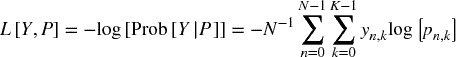

## 9.4 评分与超参数调优

片段 9.1 和 9.3 为元标签应用设置了 `scoring=‘f1’`。对于其他应用，它们设置了 `scoring=`neg_log_loss`` 而不是标准的 `scoring=‘accuracy’`。尽管准确度有更直观的解释，我建议你在调整投资策略的超参数时使用 `neg_log_loss`。让我解释一下我的理由。

假设你的机器学习投资策略预测你应该以高概率购买某个证券。你将根据策略的信心进入一个较大的多头头寸。如果预测是错误的，而市场反而下跌，你将会损失很多钱。然而，准确度对高概率的错误买入预测和低概率的错误买入预测一视同仁。此外，准确度可以用低概率的命中来弥补高概率的漏掉。

投资策略通过以高信心预测正确标签而获利。低信心的良好预测所带来的收益不足以弥补高信心的错误预测带来的损失。因此，准确度无法真实反映分类器的性能。相反，日志损失 ^(3)（也称交叉熵损失）计算分类器在给定真实标签时的对数似然，考虑了预测的概率。日志损失可以如下估计：

其中

+   *p [*n* , *k*]* 是与标签 *k* 的预测 *n* 相关的概率。

+   *Y* 是一个 1-of-*K* 的二元指示矩阵，当观察 *n* 被分配标签 *k*（从 *K* 个可能标签中）时，*y [*n* , *k*]* = 1，否则为 0。

假设分类器预测两个 1，其中真实标签分别为 1 和 0。第一个预测是命中，第二个预测是漏掉，因此准确度为 50%。图 9.2 绘制了这些预测来自于概率范围 [0.5, 0.9] 时的交叉熵损失。可以观察到在图的右侧，由于高概率的漏掉，日志损失很大，尽管所有情况下的准确度都是 50%。

**图 9.2** 日志损失与命中和漏掉的预测概率的关系

偏好交叉熵损失而不是准确度的第二个原因是，交叉验证通过应用样本权重来评估分类器（见第七章，第 7.5 节）。正如您在第四章中回忆的那样，观察权重是根据观察的绝对收益确定的。这意味着，样本加权的交叉熵损失在 PNL（市值损益）计算中估计了分类器的表现：它使用正确的标签来表示方向，概率来表示头寸规模，样本权重来表示观察的收益/结果。这是金融应用中超参数调整的正确机器学习性能指标，而不是准确度。

当我们使用对数损失作为评分统计时，通常更喜欢改变其符号，因此称之为“负对数损失 *.* ”。这种变化的原因是出于美观，基于直觉：高的负对数损失值优于低的负对数损失值，这与准确度类似。在使用`neg_log_loss`时，请记住这个 sklearn 的 bug：[`github.com/scikit-learn/scikit-learn/issues/9144`](https://github.com/scikit-learn/scikit-learn/issues/9144)。为了规避此 bug，您应该使用第七章中介绍的`cvScore`函数。

**练习**

1.  > > 使用第八章中的`getTestData`函数，形成一个包含 10,000 个观测值和 10 个特征的合成数据集，其中 5 个是信息性特征，5 个是噪声特征。

    1.  在 10 折交叉验证中使用`GridSearchCV`来寻找具有 RBF 内核的 SVC 的`C`和`gamma`最优超参数，其中`param_grid = {'C':[1E-2,1E-1,1,10,100],'gamma':[1E-2,1E-1,1,10,100]}`，评分函数为`neg_log_loss`。

    1.  网格中有多少个节点？

    1.  找到最优解决方案花了多少次拟合？

    1.  找到这个解决方案花了多长时间？

    1.  如何访问最优结果？

    1.  最优参数组合的 CV 评分是多少？

    1.  如何将样本权重传递给 SVC？

1.  > > 使用练习 1 中的相同数据集，

    1.  在 10 折交叉验证中使用`RandomizedSearchCV`来寻找具有 RBF 内核的 SVC 的`C`和`gamma`最优超参数，其中`param_distributions = {`C`:logUniform(a = 1E-2,b = 1E2),`gamma`:logUniform(a = 1E-2,b = 1E2)},n_iter = 25`，评分函数为`neg_log_loss`。

    1.  找到这个解决方案花了多长时间？

    1.  最优参数组合是否与练习 1 中找到的类似？

    1.  最优参数组合的 CV 评分是多少？与练习 1 中的 CV 评分相比如何？

1.  > > 来自练习 1，

    1.  计算从 1.a 中得出的样本内预测的夏普比率（有关夏普比率的定义，请参见第十四章）。

    1.  重复 1.a，这次使用`accuracy`作为评分函数。计算由超参数调整得出的样本内预测。

    1.  哪种评分方法导致更高的（样本内）夏普比率？

1.  > > 来自练习 2，

    1.  计算从 2.a 中得出的样本内预测的夏普比率。

    1.  重复第 2.a 点，这次用 `accuracy` 作为评分函数。计算基于超调参数的样本内预测。

    1.  什么评分方法会导致更高的（样本内）Sharpe 比率？

1.  > > 阅读日志损失的定义，*L* [*Y* , *P*]。

    1.  为什么评分函数 `neg_log_loss` 被定义为负日志损失，− *L* [*Y* , *P*]？

    1.  最大化日志损失而不是负日志损失的结果会是什么？

1.  > > 考虑一种投资策略，无论预测的置信度如何，均等地调整赌注。在这种情况下，进行超参数调整时，更合适的评分函数是准确性还是交叉熵损失？

**参考文献**

1.  Bergstra, J., R. Bardenet, Y. Bengio 和 B. Kegl (2011): “超参数优化的算法。” *神经信息处理系统进展*，页 2546–2554。

1.  Bergstra, J. 和 Y. Bengio (2012): “超参数优化的随机搜索。” *机器学习研究期刊*，第 13 卷，页 281–305。

**参考书目**

1.  Chapelle, O., V. Vapnik, O. Bousquet 和 S. Mukherjee (2002): “为支持向量机选择多个参数。” *机器学习*，第 46 卷，页 131–159。

1.  Chuong, B., C. Foo 和 A. Ng (2008): “对数线性模型的高效多超参数学习。” *神经信息处理系统进展*，第 20 卷。可在 [`ai.stanford.edu/∼chuongdo/papers/learn_reg.pdf`](http://ai.stanford.edu/~chuongdo/papers/learn_reg.pdf) 查阅。

1.  Gorissen, D., K. Crombecq, I. Couckuyt, P. Demeester 和 T. Dhaene (2010): “用于计算机设计的替代建模和自适应采样工具箱。” *机器学习研究期刊*，第 11 卷，页 2051–2055。

1.  Hsu, C., C. Chang 和 C. Lin (2010): “支持向量分类的实用指南。” 技术报告，国立台湾大学。

1.  Hutter, F., H. Hoos 和 K. Leyton-Brown (2011): “通用算法配置的顺序模型优化。” 第五届国际学习与智能优化会议论文集，页 507–523。

1.  Larsen, J., L. Hansen, C. Svarer 和 M. Ohlsson (1996): “神经网络的设计与正则化：验证集的最佳使用。” 1996 年 IEEE 信号处理学会研讨会论文集。

1.  Maclaurin, D., D. Duvenaud 和 R. Adams (2015): “通过可逆学习进行基于梯度的超参数优化。” 工作论文。可在 [`arxiv.org/abs/1502.03492`](https://arxiv.org/abs/1502.03492) 查阅。

1.  Martinez-Cantin, R. (2014): “BayesOpt：用于非线性优化、实验设计和赌博的贝叶斯优化库。” *机器学习研究期刊*，第 15 卷，页 3915–3919。

**注释**

^(1)     [`scikit-learn.org/stable/modules/metrics.html.`](http://scikit-learn.org/stable/modules/metrics.html.)

^(2)     [`scikit-learn.org/stable/auto_examples/svm/plot_rbf_parameters.html.`](http://scikit-learn.org/stable/auto_examples/svm/plot_rbf_parameters.html.)

^(3)     [`scikit-learn.org/stable/modules/model_evaluation.html#log-loss`](http://scikit-learn.org/stable/modules/model_evaluation.html#log-loss) .

