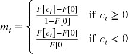

# 第十章：下注大小

## 10.1 动机

策略游戏和投资之间有着迷人的相似之处。我曾与一些最优秀的投资组合经理合作，他们都是出色的扑克玩家，也许比棋手更优秀。一个原因是下注大小，德州扑克牌提供了很好的类比和训练场。你的机器学习算法可以实现高准确度，但如果你不正确地设置下注大小，你的投资策略必然会亏损。在本章中，我们将回顾几种基于机器学习预测的下注大小方法。

## 10.2 独立于策略的下注大小方法

考虑在同一工具上的两种策略。令 *m [*i* , *t*]* ∈ [ − 1, 1] 为策略 *i* 在时间 *t* 的下注大小，其中 *m [*i* , *t*]* = −1 表示完全空头头寸，而 *m [*i* , *t*]* = 1 表示完全多头头寸。假设一种策略产生了一系列下注大小 [ *m [1, 1]* , *m [1, 2]* , *m [1, 3]* ] = [.5, 1, 0]，市场价格跟随的序列为 [ *p [1]* , *p [2]* , *p [3]* ] = [1, .5, 1.25]，其中 *p [*t*]* 是时间 *t* 的价格。另一种策略产生的序列为 [ *m [2, 1]* , *m [2, 2]* , *m [2, 3]* ] = [1, .5, 0]，因为它在市场对初始全头寸不利时被迫减少下注大小。两种策略的预测都正确（在 *p [1]* 和 *p [3]* 之间价格上涨了 25%），然而第一种策略盈利 (0.5)，而第二种策略亏损 (−.125)。

我们希望以某种方式调整头寸，以便为交易信号在减弱之前可能增强的情况保留一些现金。一种选择是计算序列 *c [*t*]* = *c [*t* , *l*]* − *c [*t* , *s*]*，其中 *c [*t* , *l*]* 是时间 *t* 时同时存在的多头赌注数量，而 *c [*t* , *s*]* 是时间 *t* 时同时存在的空头赌注数量。这种赌注并发性是类似于我们在第四章中计算标签并发性的方法得出的（回忆一下 `t1` 对象，具有重叠的时间跨度）。我们对 { *c [*t*]* } 进行两个高斯混合模型的拟合，采用类似于 López de Prado 和 Foreman [2014] 中描述的方法。然后，赌注大小得出为

其中 *F* [ *x* ] 是拟合的两个高斯混合模型在值 *x* 处的累积分布函数（CDF）。例如，当观察到更大值的信号的概率仅为 0.1 时，我们可以将赌注大小设为 0.9。信号越强，信号变得更强的概率越小，因此赌注大小越大。

第二种解决方案是采用预算方法。我们计算同时存在的多头赌注的最大数量（或其他某个分位数），，以及同时存在的空头赌注的最大数量，。然后我们得出赌注大小为 ，其中 *c [*t*  ,  *l*]* 是时间 *t* 时同时存在的多头赌注数量，而 *c [*t*  ,  *s*]* 是时间 *t* 时同时存在的空头赌注数量。目标是在最后一个并发信号触发之前，不达到最大头寸。

第三种方法是应用元标签技术，如我们在第三章中解释的那样。我们拟合一个分类器，例如 SVC 或 RF，以确定误分类的概率，并利用该概率推导赌注大小。^(1) 这种方法有几个优点：首先，决定赌注大小的机器学习算法独立于主要模型，允许引入预测假阳性的特征（见第三章）。其次，预测概率可以直接转化为赌注大小。让我们看看如何实现。

## 10.3 根据预测概率进行赌注大小调整

我们用 *p* [ *x* ] 表示标签 *x* 发生的概率。对于两个可能的结果，*x* ∈ { − 1, 1}，我们希望检验原假设 。我们计算检验统计量 ，其中 *z* ∈ ( − ∞, +∞)，*Z* 表示标准正态分布。我们得出赌注大小为 *m* = 2 *Z* [ *z* ] − 1，其中 *m* ∈ [ − 1, 1]，*Z* [.] 是 *Z* 的 CDF。

对于超过两个可能结果的情况，我们遵循一对多的方法。设 *X* = { − 1, …, 0, …, 1} 为与赌注大小相关的各种标签，*x* ∈ *X* 为预测标签。换句话说，标签是由与之相关的赌注大小所确定的。对于每个标签 *i* = 1, …, || *X* ||，我们估计概率 *p [*i*]*，其中  *.* 我们将  定义为 *x* 的概率，我们希望对  进行检验。^(  2  ) 我们计算检验统计量 ，其中 *z* ∈ 0., . + ∞)。我们将赌注大小推导为 ![，其中 *m* ∈ [ − 1, 1]，而 *Z* [ *z* ] 调节预测 *x* 的大小（其中边际由 *x* 隐含）。

图 10.1 绘制了赌注大小与检验统计量的关系。片段 10.1 实现了从概率到赌注大小的转换。它处理了预测来自元标签估计器或标准标签估计器的可能性。在步骤 #2 中，它还平均化活跃赌注，并离散化最终值，我们将在后面的章节中解释。

**图 10.1** 预测概率下的赌注大小

> **片段 10.1 从概率到赌注大小**
> 
> 

## 10.4 活跃赌注的平均化

每个赌注都与持有期相关，涵盖从赌注产生到触及第一个障碍的时间 `t1`（见第三章）。一种可能的方法是在新赌注到来时覆盖旧赌注；然而，这可能导致过度交易。更明智的方法是在某一时刻平均所有仍然活跃的赌注大小。片段 10.2 说明了这个想法的一种可能实现。

> **片段 10.2 只要仍然活跃，赌注就被平均化**
> 
> 

## 10.5 大小离散化

平均化可以减少一些过度交易，但仍然可能会在每次预测时触发小额交易。由于这种抖动可能导致不必要的过度交易，我建议将赌注大小离散化为 ，其中 *d* ∈ (0, ..1] 决定离散化的程度。图 10.2 说明了赌注大小的离散化。片段 10.3 实现了这个概念。

**图 10.2** 赌注大小的离散化，d = 0.2

> **片段 10.3 大小离散化以防止过度交易**
> 
> 

## 10.6 动态赌注大小和限制价格

回顾第三章中介绍的三重障碍标记方法。*i* 号障碍在时间 *t [*i* , 0]* 形成，此时我们预测将触及的第一个障碍。该预测隐含了与障碍设置一致的预测价格 。在结果发生之前的时间段内，*t* ∈ [ *t [*i* , 0] * , *t [*i* , 1] * ]，价格 *p [*t*] * 波动，可能会形成额外的预测 ，其中 *j* ∈ [ *i* + 1, *I* ] 且 *t [*j* , 0] * ≤ *t [*i* , 1] * 。在第 10.4 节和第 10.5 节中，我们讨论了在形成新预测时对活跃赌注进行平均和离散化赌注大小的方法。在本节中，我们将介绍一种方法来调整赌注大小，因为市场价格 *p [*t*] * 和预测价格 *f [*i*] * 发生波动。在这个过程中，我们将推导出订单的限价。

令 *q [*t*]* 为当前头寸，*Q* 为最大绝对头寸大小， 为与预测 *f [*i*] * 相关的目标头寸大小，使得

其中 *m* [ω, *x* ] 是赌注大小，*x* = *f [*i*]* − *p [*t*]* 是当前市场价格与预测之间的偏差，ω 是调节 sigmoid 函数宽度的系数，Int[ *x* ] 是 *x* 的整数值。请注意，对于实值价格偏差 *x* ，− 1 < *m* [ω, *x* ] < 1，整数值  是有界的 。

目标头寸大小  可以根据 *p [*t*] * 的变化动态调整。特别地，当 *p [*t*] * → *f [*i*] * 时，我们得到 ，因为算法希望实现收益。这意味着为了避免实现损失，订单大小的盈亏平衡限价是  。具体来说，

其中 *L* [ *f [*i*]* , ω, *m* ] 是关于 *p [*t*]* 的 *m* [ω, *f [*i*]* − *p [*t*]* ] 的反函数，

我们不需要担心 *m ²* = 1 的情况，因为  *.* 由于该函数是单调的，算法在 *p [*t*] * → *f [*i*] * 时无法实现损失。

让我们校准ω。给定用户定义的对 ( *x* , *m* *），使得 *x* = *f [*i*]* − *p [*t*]* 和 *m* * = *m* [ω, *x* ]，关于ω的 *m* [ω, *x* ] 的反函数是

代码片段 10.4 实现了一个算法，该算法根据*p [*t*]*和*f [*i*]*计算动态头寸大小和限制价格。首先，我们对 sigmoid 函数进行校准，以便在价格偏差*x* = 10 时返回一个下注大小*m* * = .95。第二，我们计算目标头寸 ，最大头寸*Q* = 100，*f [*i*]* = 115 和*p [*t*]* = 100。如果你尝试*f [*i*]* = 110，你会得到 ，这与ω的校准一致。第三，此大小订单的限制价格为*p [*t*]* < 112.3657 < *f [*i*]*，位于当前价格和预测价格之间。

> **代码片段 10.4 动态头寸大小和限制价格**
> 
> 

作为 sigmoid 函数的替代方案，我们可以使用幂函数 ，其中ω ≥ 0，*x* ∈ [−1, 1]，其结果为 。这种替代方案具有以下优点：

+   。

+   曲率可以通过ω直接操控。

+   对于ω > 1，该函数由凹变为凸，而不是反过来，因此该函数在拐点附近几乎是平坦的。

我们将幂函数方程的推导留给读者作为练习。图 10.3 绘制了下注大小（y 轴）作为价格偏差*f* − *p [*t*]*（x 轴）的函数，包括 sigmoid 和幂函数。

**图 10.3** *f* [*x*] = *sgn* [*x*]|*x*|²（由凹到凸）和 *f* [*x*] = *x* (.1 + *x²*) ^(−.5)（由凸到凹）

**练习**

1.  > > 使用第 10.3 节中的公式，绘制下注大小（*m*）作为最大预测概率的函数（当|| *X* || = 2, 3, …, 10 时）。
1.  > > 
1.  > > 从均匀分布中抽取 10,000 个随机数，边界为*U* [.5, 1.]。

    1.  计算下注大小*m*，使得||*X*|| = 2*。

    1.  将 10,000 个连续的日历天分配给下注大小。

    1.  从均匀分布中抽取 10,000 个随机数，边界为*U* [1, 25]。

    1.  形成一个由 2.b 中的日期索引的 pandas 系列，值等于 2.c 中的天数前移的索引。这是一个与我们在第三章中使用的`t1`对象类似的对象。

    1.  计算结果的平均活跃下注，遵循第 10.4 节。

1.  > > 使用来自练习 2.d 的`t1`对象：

    1.  确定最大并发多头下注数量，。

    1.  确定最大并发空头下注数量，。

    1.  将下注大小推导为 ，其中*c [*t* , *l*]*是时间*t*时的并发多头下注数量，*c [*t* , *s*]*是时间*t*时的并发空头下注数量。

1.  > > 使用来自练习 2.d 的`t1`对象：

    1.  计算系列*c [*t*]* = *c [*t* , *l*]* − *c [*t* , *s*]*，其中*c [*t* , *l*]*是时间*t*时的并发多头下注数量，*c [*t* , *s*]*是时间*t*时的并发空头下注数量。

    1.  在 {*c [*t*]* } 上拟合双高斯混合。你可能想使用 López de Prado 和 Foreman [2014] 中描述的方法。

    1.  计算投注大小为  ，其中 *F* [*x* ] 是针对值 *x* 的拟合双高斯混合的累计分布函数（CDF）。

    1.  解释此系列 {*m [*t*]* } 如何不同于在练习 3 中计算的投注大小系列。

1.  > > 重复练习 1，其中你使用 `stepSize=.01` ， `stepSize=.05` 和 `stepSize=.1` 来离散化 *m* 。
1.  > > 
1.  > > 重写第 10.6 节中的方程，以便投注大小由幂函数确定，而不是由 sigmoid 函数确定。
1.  > > 
1.  > > 修改代码片段 10.4，以便实现你在练习 6 中推导的方程。

**参考文献**

1.  López de Prado, M. 和 M. Foreman (2014)： “高斯混合方法在数学投资组合监督中的应用：EF3M 算法。” *定量金融* ，第 14 卷，第 5 期，页码 913–930。

1.  Wu, T.，C. Lin 和 R. Weng (2004)： “通过成对耦合进行多类分类的概率估计。” *机器学习研究期刊* ，第 5 卷，页码 975–1005。

**书目**

1.  Allwein, E.，R. Schapire 和 Y. Singer (2001)： “将多类问题简化为二类问题：边际分类器的统一方法。” *机器学习研究期刊* ，第 1 卷，页码 113–141。

1.  Hastie, T. 和 R. Tibshirani (1998)： “通过成对耦合进行分类。” *统计年鉴* ，第 26 卷，第 1 期，页码 451–471。

1.  Refregier, P. 和 F. Vallet (1991)： “神经网络多类分类的概率方法。” 国际人工网络会议论文集，页码 1003–1007。

**注释**

^(1)    参考文献部分列出了一些解释这些概率如何推导的文章。通常这些概率会结合拟合优度或对预测的信心的信息。参见 Wu 等 [2004]，并访问 [`scikit-learn.org/stable/modules/svm.html#scores-and-probabilities`](http://scikit-learn.org/stable/modules/svm.html#scores-and-probabilities) 。

^(2)    当所有结果同样可能时，不确定性是绝对的。

