# 第十一章：回测的危险

## 11.1 动机

回测是量化工具箱中最重要但却最少被理解的技术之一。一个常见的误解是将回测视为研究工具。研究与回测就像饮酒与驾驶。不要在回测的影响下进行研究。大多数在期刊上发表的回测都有缺陷，因多次测试导致选择偏差（Bailey、Borwein、López de Prado 和 Zhu [2014]; Harvey et al. [2016]）。可以写一本完整的书列出人们在回测过程中所犯的各种错误。尽管我可能是发表回测^(1)和投资绩效指标的学术作者中拥有最多期刊文章的，但我仍然感觉没有精力汇总过去 20 年里看到的所有不同错误。本章并不是回测的速成课程，而是一些即使是经验丰富的专业人士也会犯的常见错误的简短列表。

## 11.2 不可能的任务：完美的回测

在其狭义的定义中，回测是对一项策略在过去某一时期内可能表现的历史模拟。因此，它是一个假设，而绝不是实验。在物理实验室，比如伯克利实验室，我们可以在控制环境变量的情况下重复实验，从而推导出精确的因果关系。相比之下，回测*不是*实验，并且不证明任何事情。回测不能保证任何结果，甚至如果我们能够穿越时空回到过去，也无法确保达到那种夏普比率（Bailey 和 López de Prado [2012]）。随机抽样的结果会有所不同。过去不会重演。

那么，回测的意义何在？它是对多个变量的理性检验，包括下注规模、周转率、对成本的韧性以及在特定情境下的表现。一个好的回测可以非常有帮助，但做好回测却非常困难。在 2014 年，德意志银行的量化团队，在尹罗的带领下，发布了一项题为“量化投资的七大罪恶”（Luo et al. [2014]）的研究。这是一篇非常生动易懂的文章，我建议这个领域的每一个人都仔细阅读。在文中，这个团队提到了常见的偏差：

1.  **幸存者偏差：** 以当前的投资范围为基础，因此忽略了一些公司在过程中破产以及某些证券被摘牌的情况。

1.  **前瞻性偏差：** 使用在模拟决策时并不公开的信息。确保每个数据点的时间戳准确无误。考虑发布日期、分发延迟和补充修正。

1.  **叙事：** 为了证明某种随机模式而事后编造故事。

1.  **数据挖掘和数据窥探：** 在测试集上训练模型。

1.  **交易成本：** 模拟交易成本是困难的，因为唯一能确定这一成本的方法是与交易记录互动（即，进行实际交易）。

1.  **离群值：** 基于过去观察到的一些极端结果制定策略，这些结果可能永远不会再发生。

1.  **做空：** 对现金产品采取空头头寸需要找到借款人。借贷的成本和可用金额通常是未知的，取决于关系、库存、相对需求等。

这些只是大多数期刊发表的论文常见的一些基本错误。其他常见错误包括使用非标准方法计算业绩（第十四章）；忽视隐性风险；只关注收益而忽视其他指标；将相关性与因果关系混淆；选择不具代表性的时间段；未能预见意外情况；忽视强平线或保证金要求的存在；忽视融资成本；以及忘记实用方面（Sarfati [2015]）。还有很多其他错误，但真的，没有必要列举它们，因为接下来的部分标题。

## 11.3 即使你的回测完美，它也可能是错误的

恭喜你！你的回测在每个人都能重现你结果的意义上是完美的，并且你的假设是如此保守，以至于连你的老板都无法反对。你为每一笔交易支付的费用是任何人可能要求的两倍以上。你是在全球一半的人已知信息几个小时后，以极低的参与率执行的。尽管有这些严重的成本，你的回测仍然赚了很多钱。然而，这个完美的回测可能是错误的。为什么？因为只有专家才能生成完美的回测。成为专家意味着你在多年中进行了成千上万次的回测。总之，这并不是你第一次进行回测，因此我们需要考虑到这可能是一次虚假发现，一个在你对同一数据集进行多次测试后不可避免出现的统计异常。

回测令人抓狂的地方在于，你在这方面变得越擅长，出现虚假发现的可能性就越高。初学者会陷入罗等人 [2014] 提出的七大罪恶（还有更多，但谁在计数呢？）。专业人士可能会生成完美的回测，仍然会陷入多重测试、选择偏差或回测过拟合（Bailey 和 López de Prado [2014b]）。

## 11.4 回测不是研究工具

第八章讨论了替代效应、联合效应、掩蔽、MDI、MDA、SFI、并行特征、堆叠特征等。即使某些特征非常重要，也并不意味着可以通过投资策略实现货币化。相反，许多策略看似盈利，尽管它们是基于无关特征的。特征重要性是真正的研究工具，因为它帮助我们理解机器学习算法揭示的模式的性质，无论其是否能货币化。重要的是，特征重要性是*事前*得出的，在历史表现被模拟之前。

相比之下，回测不是研究工具。它对特定策略为何能赚钱几乎没有提供任何见解。就像彩票赢家可能觉得自己做了什么值得的事情来获得运气一样，总是有一些*事后*的故事（罗的罪过第三）。作者们声称发现了数百个“阿尔法”和“因子”，并且总有一些复杂的解释。相反，他们所发现的只是赢得上局游戏的彩票。赢家已经兑现，那些数字对下一轮毫无用处。如果你不愿意为那些彩票支付额外费用，为什么你会在意那些数百个阿尔法呢？这些作者从未告诉我们所有售出的票，即找到这些“幸运”阿尔法所需的数百万次模拟。

回测的目的是剔除糟糕的模型，而不是改进它们。根据回测结果调整模型是浪费时间……而且是危险的。把你的时间和精力投入到确保所有组件正确上，正如我们在书中其他地方讨论的那样：结构化数据、标记、加权、集成、交叉验证、特征重要性、投注规模等。等你进行回测时，已经太晚了。永远不要在模型完全指定之前进行回测。如果回测失败，就重新开始。如果这样做，找到虚假发现的机会将会大幅降低，但仍然不会是零。

## 11.5 一些一般性建议

回测过拟合可以定义为在多个回测中的选择偏差。当一个策略是为了在回测中表现良好而开发时，通过利用随机历史模式，就会发生回测过拟合。因为这些随机模式不太可能在未来再次出现，因此所开发的策略将会失败。每个经过回测的策略都在某种程度上受到“选择偏差”的过拟合：大多数人分享的唯一回测结果是那些展现所谓成功投资策略的。

如何解决回测过拟合可以说是量化金融中最根本的问题。为什么？因为如果这个问题有简单的答案，投资公司就能确定实现高性能，因为它们只会投资于成功的回测。期刊将自信地评估某个策略是否可能是假阳性。金融可能在波普尔和拉卡托斯的意义上成为真正的科学（洛佩斯·德·普拉多 [2017]）。回测过拟合如此难以评估的原因在于，每次对同一数据集进行新的测试时，假阳性的概率都会变化，而这些信息要么研究者不知道，要么不与投资者或审稿人分享。虽然没有简单的方法可以防止过拟合，但一些步骤可以帮助减少其出现。

1.  为整个资产类别或投资领域开发模型，而不是针对特定证券（第八章）。投资者会分散投资，因此他们不会仅在证券 *Y* 上犯错误 *X*。如果你在证券 *Y* 上发现错误 *X*，无论其看似多么有利可图，可能都是一个虚假发现。

1.  应用袋装法（第六章）作为防止过拟合和减少预测误差方差的手段。如果袋装法降低了策略的表现，可能是因为它过拟合了少数观察值或离群值。

1.  在完成所有研究之前不要进行回测（第 1–10 章）。

1.  记录在数据集上进行的每一次回测，以便可以在最终选择结果上估计回测过拟合的概率（见贝利、博温、洛佩斯·德·普拉多和朱 [2017a] 和第十四章），并且夏普比率可以通过进行的试验数量进行适当调整（贝利和洛佩斯·德·普拉多 [2014b]）。

1.  模拟场景而不是历史（第十二章）。标准的回测是历史模拟，容易过拟合。历史只是实现的随机路径，完全可能不同。你的策略应该在广泛的场景下盈利，而不仅仅是轶事性的历史路径。过拟合数千个“如果”场景的结果更困难。

1.  如果回测未能识别出盈利策略，则从头开始。抵制重用那些结果的诱惑。遵循回测第二法则。

> **片段 11.1 马尔科斯的回测第二法则**
> 
> > “在研究时进行回测就像酒后驾驶。不要在回测的影响下进行研究。”
> > 
> > > 马尔科斯·洛佩斯·德·普拉多 *金融机器学习进展*（2018）

## 11.6 策略选择

在第七章中，我们讨论了标签中的序列条件性如何破坏标准的 k 折交叉验证，因为随机抽样会将冗余观察分散到训练集和测试集中。我们必须找到一种不同的（真实的外样本）验证程序：一种在最不可能与用于训练模型的观察相关/冗余的观察上评估我们的模型的程序。有关详细调查，请参见 Arlot 和 Celisse [2010]。

Scikit-learn 实现了一种步进前进的时间折叠方法。² 在这种方法下，测试沿时间方向前进，旨在防止泄漏。这与历史回测（和交易）的一般方式一致。然而，在存在长程序列依赖的情况下，仅在训练集结束前一个观察点进行测试可能不足以避免信息泄漏。我们将在第十二章第 12.2 节重新讨论这一点。

步进前进法的一个缺点是容易过拟合。原因在于如果没有随机抽样，就会有一条可以重复多次的测试路径，直到出现假阳性。与标准的交叉验证一样，需要一些随机化来避免这种绩效目标或回测优化，同时避免将与训练集相关的样本泄漏到测试集中。接下来，我们将介绍一种基于回测过拟合概率估计（PBO）的策略选择交叉验证方法。我们将在第十二章中解释回测的交叉验证方法。

Bailey 等人[2017a]通过组合对称交叉验证（CSCV）方法估计 PBO。示意图如下。

首先，我们通过收集*N*次试验的绩效系列形成一个矩阵*M*。特别地，每一列*n* = 1, …, *N*表示与研究人员尝试的特定模型配置相关的*P&L*（市值利润和损失）在*t* = 1, …, *T*观察下的向量。因此，*M*是一个实值矩阵，阶数为(*T×N*)。我们施加的唯一条件是：(1) *M*是真正的矩阵，即每一列的行数相同，观察在*N*次试验中的每一行都是同步的，(2) 用于选择“最佳”策略的性能评估指标可以在每一列的子样本上进行估计。例如，如果该指标是夏普比率，我们假设在报告的绩效的各个切片上可以保持独立同分布的正态分布假设。如果不同的模型配置以不同的频率交易，观察会被聚合（降采样）以匹配一个公共索引*t* = 1, …, *T*。

其次，我们将*M*按行划分为*个数*S*的相等维度的不相交子矩阵。每个子矩阵*M[*s*]*，其中*s* = 1, …, *S*，的阶数为！。

第三，我们形成所有组合 *C [*S*]* 的 *M [*s*]* ，按大小为 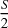 的组进行选择。这给出了组合的总数。

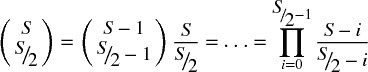

例如，如果 *S = 16* ，我们将形成 12,780 个组合。每个组合 *c* ∈ *C [*S*]* 由 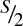 子矩阵 *M [*s*]* 组成。

第四，对于每个组合 *c* ∈ *C [*S*]* ，我们：

1.  形成 *训练集 J* ，通过连接构成 *c* 的  子矩阵 *M [*s*]* 。*J* 是一个阶数为 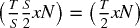 的矩阵。

1.  形成 *测试集* 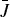 ，作为 *J* 在 *M* 中的补集。换句话说， 是由 *M* 中所有不属于 *J* 的行构成的 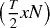 矩阵。

1.  形成一个阶数为 *N* 的性能统计向量 *R* ，其中 *R* 的第 *n* 项报告与 *J* （训练集）的第 *n* 列相关的性能。

1.  确定元素 *n* * ，使得 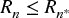 ，∀*n* = 1, …, *N* 。换句话说，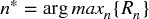 。

1.  形成一个阶数为 *N* 的性能统计向量  ，其中 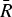 的第 *n* 项报告与  （测试集）的第 *n* 列相关的性能。

1.  确定 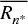 在  中的相对等级。我们将此相对等级表示为 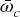 ，其中 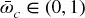 。这是与在样本 (IS) 中选择的试验相关的样本外 (OOS) 性能的相对等级。如果策略优化过程没有过拟合，我们应该观察到  系统性地优于  （OOS），就像 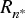 超过了 *R* （IS）。

1.  定义 logit 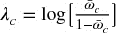 。这展示了 λ [*c*] = 0 的特性，当  与  的中位数重合时。高 logit 值暗示 IS 与 OOS 性能之间的一致性，表明回测过拟合的水平较低。

第五，通过收集所有的 λ [*c*] 来计算 OOS 的等级分布，其中 *c* ∈ *C [*S*]* 。概率分布函数 *f* (λ) 然后被估计为 λ 在所有 *C [*S*]* 中出现的相对频率，带有 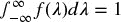 *。最后，PBO 被估计为 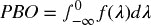 ，因为这是与表现不佳的 OOS 的 IS 最优策略相关的概率。

图 11.1 的 x 轴显示最佳策略选择的 Sharpe 比率 IS。y 轴显示该最佳策略选择的 Sharpe 比率 OOS。如可以看出，由于回测过拟合，性能出现强烈且持续的衰退。应用上述算法，我们可以推导与该策略选择过程相关的 PBO，如 图 11.2 所示。

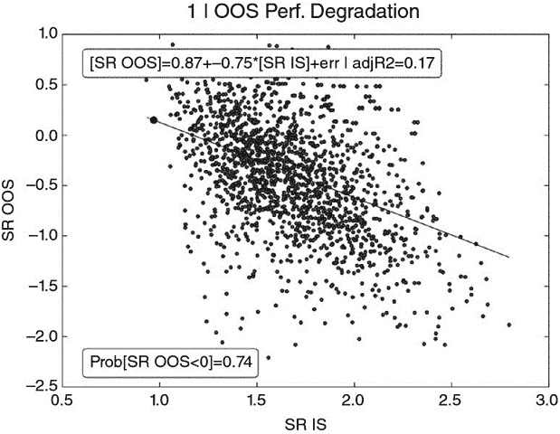

**图 11.1** 样本内最佳夏普比率 (SR IS) 与样本外夏普比率 (SR OOS)

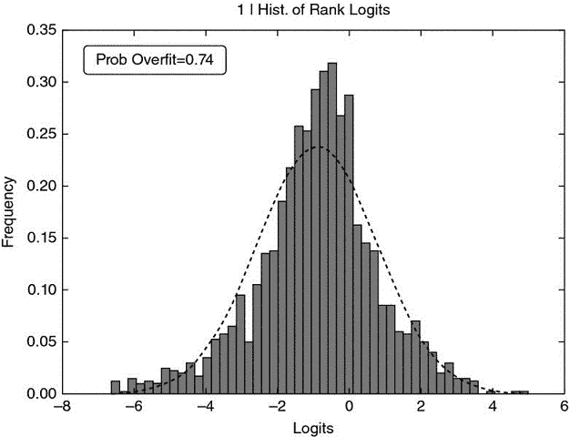

**图 11.2** 从 logits 分布中推导的回测过拟合概率

每个子集中的观察结果保持原始时间序列。随机抽样是在相对不相关的子集上进行的，而不是在观察结果上。有关该方法准确性的实验分析，请参见 Bailey 等人 [2017a]。

**练习**

1.  > > 一位分析师拟合了一个随机森林分类器，其中一些特征包括季节性调整的就业数据。他将季节性调整后的数据与一月的数据对齐，等等。他犯了什么“罪”？
1.  > > 
1.  > > 一位分析师开发了一种机器学习算法，他利用收盘价生成信号，并在收盘时执行。罪过在哪里？
1.  > > 
1.  > > 美国的游戏厅产生的总收入与授予的计算机科学博士学位之间的相关性为 98.51%。随着博士学位数量的预期增长，我们应该投资游戏厅公司吗？如果不，罪过在哪里？
1.  > > 
1.  > > *华尔街日报* 报道，九月份是年度中唯一一个平均股票收益为负的月份，回顾过去 20、50 和 100 年。我们应该在八月底出售股票吗？如果不，罪过在哪里？
1.  > > 
1.  > > 我们从彭博社下载市盈率，每月对股票进行排名，出售排名前四分之一的股票，并购买排名后四分之一的股票。表现惊人。罪过在哪里？

**参考文献**

1.  Arlot, S. 和 A. Celisse (2010)： “模型选择的交叉验证程序综述。” *统计调查*，第 4 卷，第 40–79 页。

1.  Bailey, D., J. Borwein, M. López de Prado, 和 J. Zhu (2014)： “伪数学与金融骗子：回测过拟合对样本外表现的影响。” *美国数学学会公告*，第 61 卷，第 5 期（五月），第 458–471 页。可在 [`ssrn.com/abstract=2308659`](https://ssrn.com/abstract=2308659) 获取。

1.  Bailey, D., J. Borwein, M. López de Prado, 和 J. Zhu (2017a)： “回测过拟合的概率。” *计算金融杂志*，第 20 卷，第 4 期，第 39–70 页。可在 [`ssrn.com/abstract=2326253`](http://ssrn.com/abstract=2326253) 获取。

1.  Bailey, D. 和 M. López de Prado (2012)： “夏普比率有效前沿。” *风险杂志*，第 15 卷，第 2 期（冬季）。可在 [`ssrn.com/abstract=1821643`](https://ssrn.com/abstract=1821643) 获取。

1.  Bailey, D. 和 M. López de Prado (2014b)： “膨胀夏普比率：修正选择偏差、回测过拟合和非正态性。” *投资组合管理杂志*，第 40 卷，第 5 期，第 94–107 页。可在 [`ssrn.com/abstract=2460551`](https://ssrn.com/abstract=2460551) 获取。

1.  Harvey, C., Y. Liu, 和 H. Zhu (2016)： “. . . 和预期收益的横截面。” *金融研究回顾*，第 29 卷，第 1 期，第 5–68 页。

1.  López de Prado, M. (2017)： “金融作为一门工业科学。” *投资组合管理杂志*，第 43 卷，第 4 期，5–9 页。可在 [`www.iijournals.com/doi/pdfplus/10.3905/jpm.2017.43.4.005`](http://www.iijournals.com/doi/pdfplus/10.3905/jpm.2017.43.4.005) 获取。

1.  Luo, Y., M. Alvarez, S. Wang, J. Jussa, A. Wang 和 G. Rohal (2014)： “量化投资的七大罪恶。” 白皮书，德意志银行市场研究，9 月 8 日。

1.  Sarfati, O. (2015)： “回测：评估策略和避免陷阱的实务指南。” Citi Equity Derivatives。CBOE 2015 风险管理会议。可在 [`www.cboe.com/rmc/2015/olivier-pdf-Backtesting-Full.pdf`](https://www.cboe.com/rmc/2015/olivier-pdf-Backtesting-Full.pdf) 获取。

**参考文献**

1.  Bailey, D., J. Borwein 和 M. López de Prado (2016)： “股票投资组合设计与回测过拟合。” *投资管理杂志*，第 15 卷，第 1 期，1–13 页。可在 [`ssrn.com/abstract=2739335`](https://ssrn.com/abstract=2739335) 获取。

1.  Bailey, D., J. Borwein, M. López de Prado, A. Salehipour 和 J. Zhu (2016)： “金融市场中的回测过拟合。” *自动化交易者*，第 39 卷。可在 [`ssrn.com/abstract=2731886`](https://ssrn.com/abstract=2731886) 获取。

1.  Bailey, D., J. Borwein, M. López de Prado 和 J. Zhu (2017b)： “‘回测过拟合的概率’的数学附录。” *计算金融杂志（风险期刊）*，第 20 卷，第 4 期。可在 [`ssrn.com/abstract=2568435`](https://ssrn.com/abstract=2568435) 获取。

1.  Bailey, D., J. Borwein, A. Salehipour 和 M. López de Prado (2017)： “市场预测者的评估与排名。” *投资管理杂志*，即将出版。可在 [`ssrn.com/abstract=2944853`](https://ssrn.com/abstract=2944853) 获取。

1.  Bailey, D., J. Borwein, A. Salehipour, M. López de Prado 和 J. Zhu (2015)： “在线工具用于展示回测过拟合。” 工作论文。可在 [`ssrn.com/abstract=2597421`](https://ssrn.com/abstract=2597421) 获取。

1.  Bailey, D., S. Ger, M. López de Prado, A. Sim 和 K. Wu (2016)： “统计过拟合与回测表现。” 收录于 *基于风险和因子的投资*，定量金融，Elsevier。可在 [`ssrn.com/abstract=2507040`](https://ssrn.com/abstract=2507040) 获取。

1.  Bailey, D. 和 M. López de Prado (2014a)： “在序列相关性下的止损和‘三重惩罚规则’。” *风险杂志*，第 18 卷，第 2 期，61–93 页。可在 [`ssrn.com/abstract=2201302`](https://ssrn.com/abstract=2201302) 获取。

1.  Bailey, D. 和 M. López de Prado (2015)： “‘在序列相关性下的止损’的数学附录。” *风险杂志*，第 18 卷，第 2 期。可在 [`ssrn.com/abstract=2511599`](https://ssrn.com/abstract=2511599) 获取。

1.  Bailey, D., M. López de Prado, 和 E. del Pozo (2013): “策略批准决策：夏普比率无差异曲线方法。” *算法金融* ，第 2 卷，第 1 期，页码 99–109。可在 [`ssrn.com/abstract=2003638`](https://ssrn.com/abstract=2003638) 获取。

1.  Carr, P. 和 M. López de Prado (2014): “确定最佳交易规则而不进行回测。” 工作论文。可在 [`ssrn.com/abstract=2658641`](https://ssrn.com/abstract=2658641) 获取。

1.  López de Prado, M. (2012a): “投资组合监督：一种进化的方法。” 在康奈尔大学的讲座。可在 [`ssrn.com/abstract=2172468`](https://ssrn.com/abstract=2172468) 获取。

1.  López de Prado, M. (2012b): “锋利的刀刃：非正态收益的绩效评估。” 在康奈尔大学的讲座。可在 [`ssrn.com/abstract=2150879`](https://ssrn.com/abstract=2150879) 获取。

1.  López de Prado, M. (2013): “回测中需要关注的事项。” 在康奈尔大学的讲座。可在 [`ssrn.com/abstract=2308682`](https://ssrn.com/abstract=2308682) 获取。

1.  López de Prado, M. (2014a): “没有回测的最佳交易规则。” 在康奈尔大学的讲座。可在 [`ssrn.com/abstract=2502613`](https://ssrn.com/abstract=2502613) 获取。

1.  López de Prado, M. (2014b): “降低夏普比率。” 在康奈尔大学的讲座。可在 [`ssrn.com/abstract=2465675`](https://ssrn.com/abstract=2465675) 获取。

1.  López de Prado, M. (2015a): “量化元策略。” *实用应用，机构投资者期刊* ，第 2 卷，第 3 期，页码 1–3。可在 [`ssrn.com/abstract=2547325`](https://ssrn.com/abstract=2547325) 获取。

1.  López de Prado, M. (2015b): “经验金融的未来。” *投资组合管理杂志* ，第 41 卷，第 4 期，页码 140–144。可在 [`ssrn.com/abstract=2609734`](https://ssrn.com/abstract=2609734) 获取。

1.  López de Prado, M. (2015c): “回测。” 在康奈尔大学的讲座。可在 [`ssrn.com/abstract=2606462`](https://ssrn.com/abstract=2606462) 获取。

1.  López de Prado, M. (2015d): “经验金融中的近期趋势。” *投资组合管理杂志* ，第 41 卷，第 4 期，页码 29–33。可在 [`ssrn.com/abstract=2638760`](https://ssrn.com/abstract=2638760) 获取。

1.  López de Prado, M. (2015e): “为什么大多数经验发现可能是错误的，以及可以采取的措施。” 在宾夕法尼亚大学的讲座。可在 [`ssrn.com/abstract=2599105`](https://ssrn.com/abstract=2599105) 获取。

1.  López de Prado, M. (2015f): “量化元策略的进展。” 在康奈尔大学的讲座。可在 [`ssrn.com/abstract=2604812`](https://ssrn.com/abstract=2604812) 获取。

1.  López de Prado, M. (2016): “构建超越样本外表现的多元化投资组合。” *投资组合管理杂志* ，第 42 卷，第 4 期，页码 59–69。可在 [`ssrn.com/abstract=2708678`](https://ssrn.com/abstract=2708678) 获取。

1.  López de Prado, M. 和 M. Foreman (2014): “一种高斯混合方法的数学投资组合监督：EF3M 算法。” *定量金融* ，第 14 卷，第 5 期，页码 913–930。可在 [`ssrn.com/abstract=1931734`](https://ssrn.com/abstract=1931734) 获取。

1.  López de Prado, M. 和 A. Peijan (2004): “对冲基金策略损失潜力的测量。” *替代投资期刊* ，第 7 卷，第 1 期，页码 7–31，2004 年夏季。可在 [`ssrn.com/abstract=641702`](https://ssrn.com/abstract=641702) 获取。

1.  López de Prado, M.，R. Vince，和 J. Zhu (2015): “有限投资期限内的风险调整增长投资组合。” 康奈尔大学讲座。可在 [`ssrn.com/abstract=2624329`](https://ssrn.com/abstract=2624329) 获取。

**注意**

^(1)     [`papers.ssrn.com/sol3/cf_dev/AbsByAuth.cfm?per_id=434076`](http://papers.ssrn.com/sol3/cf_dev/AbsByAuth.cfm?per_id=434076) ; [`www.QuantResearch.org/`](http://www.QuantResearch.org/) .

