# 第十二章：通过交叉验证进行回测

## 12.1 动机

回测使用过去的观察结果评估投资策略的超样本表现。这些过去的观察结果可以通过两种方式使用：（1）在狭义上，模拟投资策略的历史表现，就好像它在过去运行过一样；（2）在广义上，模拟过去没有发生的情景。第一种（狭义）方法，也称为前向行走，普遍到“回测”一词实际上已经成为“历史模拟”的*事实*同义词。第二种（广义）方法则鲜为人知，在本章中我们将介绍一些新的实施方式。每种方法都有其优缺点，都应给予谨慎考虑。

## 12.2 前向行走法

文献中最常见的回测方法是前向行走（WF）方法。WF 是对策略在过去表现的历史模拟。每个策略决策都是基于该决策之前的观察结果。正如我们在第十一章看到的，进行无懈可击的 WF 模拟是一项艰巨的任务，需要对数据源、市场微观结构、风险管理、绩效测量标准（例如，GIPS）、多重测试方法、实验数学等有极高的知识。遗憾的是，没有通用的回测配方。为了准确且具有代表性，每个回测都必须定制以评估特定策略的假设。

WF 享有两个关键优势：（1）WF 具有明确的历史解释。其表现可以与纸上交易相协调。（2）历史是过滤；因此，使用滞后数据确保测试集是样本外的（没有泄漏），只要清除工作得到了正确实施（见第七章，第 7.4.1 节）。在 WF 回测中发现泄漏是一个常见错误，在这里 `t1.index` 落在训练集内，但 `t1.values` 落在测试集内（见第三章）。在 WF 回测中不需要禁运，因为训练集总是早于测试集。

**12.2.1 前向验证方法的陷阱**

WF 存在三个主要缺点：首先，仅测试单一场景（历史路径），容易过拟合（Bailey et al. [2014]）。其次，WF 不一定代表未来表现，因为结果可能受到特定数据点序列的偏见。WF 方法的支持者通常认为预测过去会导致过于乐观的表现估计。然而，常常在反向观察序列上拟合出表现优越的模型会导致表现不佳的 WF 回测。事实上，过拟合前向回测和后向回测同样容易，而观察序列的变化导致不一致的结果就是这种过拟合的证据。如果 WF 的支持者是对的，我们应该观察到后向回测系统地优于前向回测。但事实并非如此，因此支持 WF 的主要论点相对较弱。

为了更清楚地说明这个第二个缺点，假设一个在标普 500 数据上进行 WF 回测的股票策略，从 2007 年 1 月 1 日开始。直到 2009 年 3 月 15 日，涨跌混合将训练策略使其保持市场中性，对每个头寸信心较低。之后，长期上涨将主导数据集，到 2017 年 1 月 1 日，买入预测将占主导地位。若从 2017 年 1 月 1 日向后回放信息，表现会大相径庭（长期上涨后跟随剧烈下跌）。通过利用特定序列，WF 选择的策略可能会让我们陷入困境。

WF 的第三个缺点是初始决策是在总样本的一小部分上做出的。即使设置了热身期，大部分信息仅用于少部分决策。考虑一个热身期的策略，它使用 *t [0]* 的观察值中的 *T.* 这个策略在平均数据点上做出一半的决策 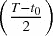。

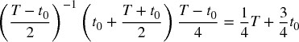

这仅仅是观察值的一个 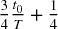 比例。尽管通过增加热身期可以减轻这个问题，但这样做也会缩短回测的长度。

## 12.3 交叉验证方法

投资者常常询问，如果将策略置于如 2008 年危机、网络泡沫、缩减恐慌或 2015–2016 年中国恐慌等不可预见的压力情境中，策略会表现如何。回答的一种方法是将观察值分为两组，一组是我们希望测试的时间段（测试集），另一组是其余的时间段（训练集）。例如，一个分类器将在 2009 年 1 月 1 日至 2017 年 1 月 1 日的时间段上进行训练，然后在 2008 年 1 月 1 日至 2008 年 12 月 31 日的时间段上进行测试。我们对于 2008 年的性能并不具备历史准确性，因为分类器是在 2008 年之后才可用的数据上进行训练的。但是，测试的目标并不是历史准确性。测试的目的在于将一个*对 2008 年无知*的策略置于如 2008 年的压力情境中。

通过交叉验证（CV）进行回测的目标并不是推导历史准确的表现，而是从多个样本外场景中推断未来表现。对于回测的每个时间段，我们模拟一个分类器的表现，该分类器知道除该时间段以外的一切信息。

**优势**

1.  测试并不是特定（历史）情境的结果。事实上，CV 测试了 *k* 个替代情境，其中只有一个与历史序列相对应。

1.  每个决策都是基于相等大小的集合做出的。这使得在不同时间段之间的结果在决策所用信息量方面可以进行比较。

1.  每个观察值都是一个且仅一个测试集的一部分。没有热身子集，从而实现最长的样本外模拟。

**劣势**

1.  与 WF 类似，模拟了一个单一的回测路径（尽管不是历史路径）。每个观察值生成的预测只有一个且唯一。

1.  CV 并没有明确的历史解释。输出并不模拟策略在过去的表现，而是模拟在各种压力情境下它可能在 *未来* 的表现（这本身就是一个有用的结果）。

1.  由于训练集并不落后于测试集，因此可能会出现信息泄漏。必须非常小心以避免将测试信息泄漏到训练集中。有关如何通过清除和禁运来防止信息泄漏的讨论，请参见第七章。

## 12.4 组合清除交叉验证方法

在这一部分，我将介绍一种新方法，它解决了 WF 和 CV 方法的主要缺点，即这些方案只测试单一路径。我称之为“组合清除交叉验证”（CPCV）方法。考虑研究者所针对的回测路径数量 φ，CPCV 生成所需的训练/测试集组合的精确数量，同时清除包含泄漏信息的训练观察值。

**12.4.1 组合分割**

考虑*T*个观测值划分为*N*个组而不进行洗牌，其中组*n* = 1, …, *N* − 1 的大小为⌊ *T* / *N* ⌋，第*N*组的大小为*T* − ⌊ *T* / *N* ⌋( *N* − 1)，⌊.⌋是向下取整或整数函数。对于大小为*k*组的测试集，可能的训练/测试划分数量为

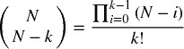

由于每种组合涉及到*k*个测试组，因此测试组的总数为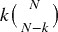。而且，由于我们计算了所有可能的组合，这些测试组在所有*N*中是均匀分布的（每个组属于相同数量的训练集和测试集）。这意味着，从*N*组的*k*大小测试集中，我们可以回测总路径数φ[ *N* , *k* ]。

图 12.1 说明了*N* = 6 和*k* = 2 时训练/测试划分的组成。存在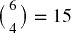个划分，索引为*S1, … ,S15*。对于每个划分，图中用叉号（*x*）标记了包含在测试集中的组，未标记的组则形成训练集。每个组都是φ[6, 2] = 5 个测试集的一部分，因此这个训练/测试划分方案允许我们计算 5 条回测路径。

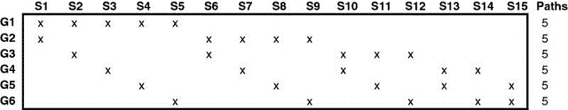

**图 12.1**生成的路径为***φ*** [6, 2] = 5

图 12.2 显示了每个测试组分配到一个回测路径的情况。例如，路径 1 是将来自（*G* 1, *S* 1），(*G* 2, *S* 1），(*G* 3, *S* 2），(*G* 4, *S* 3），(*G* 5, *S* 4）和(*G* 6, *S* 5）的预测结果结合起来的结果。路径 2 则是将来自（*G* 1, *S* 2），(*G* 2, *S* 6），(*G* 3, *S* 6），(*G* 4, *S* 7），(*G* 5, *S* 8）和(*G* 6, *S* 9）的预测结果结合起来的结果，依此类推。

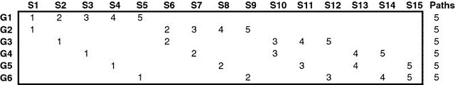

**图 12.2**测试组分配到每个 5 条路径

这些路径是通过在每种组合的数据部分θ = 1 − *k* / *N*上训练分类器生成的。虽然理论上可以在部分θ < 1/2 上进行训练，但在实践中我们将假设*k* ≤ *N* /2。训练集中数据的部分θ随着*N* → *T*而增加，但随着*k* → *N* /2 而减少。路径数量φ[ *N* , *k* ]随着*N* → *T*和*k* → *N* /2 而增加。在极限情况下，通过设置*N* = *T*和*k* = *N* /2 = *T* /2 可以实现路径数量的最大值，但这意味着每个组合的分类器仅在一半的数据上进行训练（θ = 1/2）。

**12.4.2 组合清除交叉验证回测算法**

在第七章中，我们介绍了在 CV 上下文中清除和禁止的概念。现在我们将利用这些概念进行回测。CPCV 回测算法如下进行：

1.  将 *T* 个观察值划分为 *N* 组，不进行洗牌，其中组 *n* = 1, …, *N* − 1 的大小为 ⌊*T* /*N* ⌋，第 *N* 组的大小为 *T* − ⌊*T* /*N* ⌋(*N* − 1)。

1.  计算所有可能的训练/测试划分，其中每个划分 *N* − *k* 组构成训练集，*k* 组构成测试集。

1.  对于任何一对标签 (*y [*i*]* , *y [*j*]* )，其中 *y [*i*]* 属于训练集，*y [*j*]* 属于测试集，应用 `PurgedKFold` 类来清除 *y [*i*]*，如果 *y [*i*]* 跨越了用于确定标签 *y [*j*]* 的时间段。该类还会实施禁令，如果某些测试样本早于某些训练样本。

1.  在 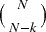 训练集上拟合分类器，并在各自的  测试集上生成预测。

1.  计算 φ[*N* , *k* ] 回测路径。你可以从每条路径计算一个夏普比率，并由此推导出策略的夏普比率的经验分布（而不是单个夏普比率，如 WF 或 CV）。

**12.4.3 一些示例**

对于 *k* = 1，我们将获得 φ[ *N* , 1] = 1 条路径，在这种情况下 CPCV 简化为 CV。因此，CPCV 可以理解为 CV 的一种推广，适用于 *k* > 1 *。

对于 *k* = 2，我们将获得 φ[ *N* , 2] = *N* − 1 路径。这是一个特别有趣的情况，因为在大部分数据上训练分类器时，θ = 1 − 2/ *N*，我们几乎可以生成与组数相同的回测路径，即 *N* − 1 *。一个简单的经验法则是将数据划分为 *N* = φ + 1 组，其中 φ 是我们目标的路径数，然后形成 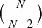 组合。在极限情况下，我们可以将每个观察分配到一个组，*N* = *T*，并生成 φ[ *T* , 2] = *T* − 1 路径，同时在每个组合中训练分类器的数据部分为 θ = 1 − 2/ *T*。

如果需要更多路径，可以将 *k* 增加到 *N* /2，但正如之前所述，这将以使用更小的数据集部分进行训练为代价。在实践中，*k* = 2 通常足以生成所需的 φ 路径，通过设置 *N* = φ + 1 ≤ *T*。

## 12.5 组合清除交叉验证如何解决回测过拟合

给定一个 IID 随机变量样本，*x [*i*]* ∼ *Z*，*i* = 1, …, *I*，其中 *Z* 是标准正态分布，该样本的期望最大值可以近似为

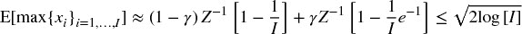

其中 *Z ^(− 1)* [.] 是 *Z* 的 CDF 的逆，γ ≈ 0.5772156649⋅⋅⋅ 是欧拉-马歇罗尼常数，且 *I* ≫ 1（见 Bailey et al. [2014] 以获取证明）。现在假设一位研究者在一个表现如马尔可夫链的工具上回测 *I* 个策略，夏普比率为 { *y [*i*]* } [*i* = 1, …, *I*]，E[ *y [*i*]* ] = 0，σ ² [ *y [*i*]* ] > 0，并且 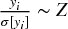。尽管真实的夏普比率为零，我们期望找到一个夏普比率为

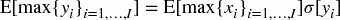

WF 回测表现出高方差，σ[ *y [*i*]* ] ≫ 0，至少有一个原因：大部分决策基于小部分数据集。一些观察会对夏普比率产生很大影响。使用预热期会缩短回测时间，这可能导致方差更高。WF 的高方差导致虚假发现，因为研究人员会选择最大*估计*夏普比率的回测，即使*真实*夏普比率为零。这就是在 WF 回测中控制试验次数*(I)*的必要原因。没有这些信息，就无法确定家庭错误率(FWER)、虚假发现率(FDR)、回测过拟合概率(PBO，见第十一章)或类似的模型评估统计。

CV 回测（第 12.3 节）通过在数据集的相等且较大部分上训练每个分类器来解决该方差来源。虽然 CV 比 WF 导致更少的虚假发现，但两种方法仍然是从策略*i*、*y [*i*]*的单一路径中估计夏普比率，而这种估计可能非常波动。相比之下，CPCV 从大量路径中推导夏普比率的分布，*j* = 1, …, φ，均值为 E[{ *y [*i* , *j*]* } [*j* = 1, …, φ] ] = μ [*i*]，方差为σ ² [{ *y [*i* , *j*]* } [*j* = 1, …, φ] ] = σ ² [*i*]。CPCV 路径的样本均值方差是

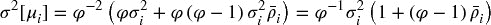

其中σ ² [*i*]是策略*i*在路径之间的夏普比率方差，而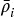是{ *y [*i* ,  *j*] * } [*j*  = 1, …, φ]之间的平均非对角相关性。CPCV 比 CV 和 WF 导致更少的虚假发现，因为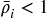意味着样本均值的方差低于样本的方差，

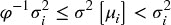

路径越不相关，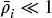，CPCV 的方差就会越小，极限情况下 CPCV 将报告真实的夏普比率 E[ *y [*i*] * ]，方差为零，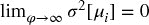 *.* 不会有选择偏差，因为从*i* = 1, …, *I*中选择的策略将是具有最高*真实*夏普比率的策略。

当然，我们知道零方差是无法实现的，因为φ有上界，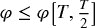。尽管如此，对于足够多的路径φ，CPCV 可以使回测的方差小到几乎可以忽略虚假发现的概率。

在第十一章中，我们认为回测过拟合可能是所有数学金融领域中最重要的未解问题。让我们看看 CPCV 如何在实践中帮助解决这个问题。假设一位研究者向期刊提交了一项策略，支持该策略的 WF 回测存在过拟合，从大量未公开的试验中选择。期刊可以要求研究者在给定的*N*和*k*下重复实验，使用 CPCV。由于研究者事先不知道要回测的路径的数量和特征，他的过拟合努力将很容易被击败。该论文将被拒绝或撤回。希望 CPCV 能减少期刊及其他地方发表的虚假发现的数量。

**练习**

1.  > > 假设你在一个期货合约上开发了一个动量策略，预测基于 AR(1)过程。你使用 WF 方法对该策略进行回测，夏普比率为**1.5**。然后你在反向序列上重复回测，获得了**–1.5**的夏普比率。如果有的话，忽略第二个结果的数学依据是什么？
1.  > > 
1.  > > 你在一个期货合约上开发了一个均值回归策略。你的 WF 回测达到了**1.5**的夏普比率。你增加了热身期的长度，结果夏普比率降到了**0.7**。你继续仅呈现较高夏普比率的结果，辩称较短的热身策略更为现实。这是否构成选择偏差？
1.  > > 
1.  > > 你的策略在 WF 回测中达到了**1.5**的夏普比率，但在 CV 回测中只有**0.7**。你继续仅呈现较高夏普比率的结果，辩称 WF 回测在历史上是准确的，而 CV 回测则是情景模拟或推理练习。这是否构成选择偏差？
1.  > > 
1.  > > 你的策略在一段时间内产生了**100,000**个预测。你希望通过生成**1,000**条路径来推导夏普比率的 CPCV 分布。哪些参数组合（*N*，*k*）能让你实现这一目标？
1.  > > 
1.  > > 你发现一个策略在 WF 回测中达到了**1.5**的夏普比率。你撰写了一篇论文，解释可以证明该结果的理论，并提交给一个学术期刊。编辑回复说，有一位评审要求你使用*CPCV*方法重复回测，设置*N*=**100**和*k*=**2**，包括你的代码和完整数据集。你按照这些指示进行，平均夏普比率为**–1**，标准差为**0.5**。你愤怒地不再回复，而是撤回你的提交，并在一个影响因子更高的期刊重新提交。6 个月后，你的论文被接受。你安慰自己的良心，认为如果发现是错误的，那是期刊没有要求进行 CPCV 测试的错。你想：“这不可能不道德，因为这是允许的，大家都这样做。”你有哪些科学或伦理上的论据来为自己的行为辩护？

**参考文献**

1.  Bailey, D. 和 M. López de Prado (2012)： “夏普比率有效前沿。” *风险杂志* ，第 15 卷，第 2 期（冬季）。可在 [`ssrn.com/abstract=1821643`](https://ssrn.com/abstract=1821643) 获取。

1.  Bailey, D. 和 M. López de Prado (2014)： “通胀调整的夏普比率：修正选择偏差、回测过拟合和非正态性。” *投资组合管理杂志* ，第 40 卷，第 5 期，页码 94–107。可在 [`ssrn.com/abstract=2460551`](https://ssrn.com/abstract=2460551) 获取。

1.  Bailey, D.、J. Borwein、M. López de Prado 和 J. Zhu (2014)： “伪数学与金融江湖术士：回测过拟合对样本外表现的影响。” *美国数学学会通告* ，第 61 卷，第 5 期，页码 458–471。可在 [`ssrn.com/abstract=2308659`](http://ssrn.com/abstract=2308659) 获取。

1.  Bailey, D.、J. Borwein、M. López de Prado 和 J. Zhu (2017)： “回测过拟合的概率。” *计算金融杂志* ，第 20 卷，第 4 期，页码 39–70。可在 [`ssrn.com/abstract=2326253`](https://ssrn.com/abstract=2326253) 获取。

