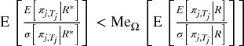
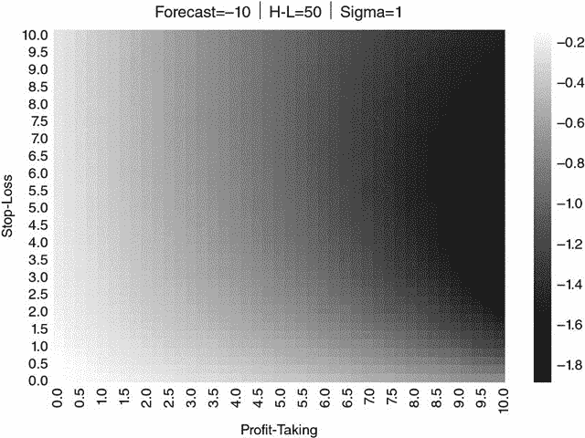

# 第十三章：合成数据的回测

## 13.1 动机

在本章中，我们将研究一种替代的回测方法，该方法使用历史数据生成具有从观察数据中估计的统计特征的合成数据集。这将使我们能够在大量未见的合成测试集上回测策略，从而减少策略与特定数据点集拟合的可能性。^(1) 这是一个非常广泛的主题，为了深入探讨，我们将重点关注交易规则的回测。

## 13.2 交易规则

投资策略可以定义为假设市场存在非效率的算法。一些策略依赖于计量经济学模型来预测价格，使用如 GDP 或通货膨胀等宏观经济变量；其他策略则利用基本面和会计信息为证券定价，或者寻找衍生品定价中的套利机会等。例如，假设金融中介倾向于在美国财政拍卖前两天出售未发行债券，以筹集购买新“纸张”所需的现金。人们可以利用这一知识，在拍卖前三天出售未发行债券。那么，如何做到呢？每种投资策略都需要实施战术，通常被称为“交易规则”。

对冲基金的风格有几十种，每种风格都运行着几十种独特的投资策略。尽管策略在性质上可能非常异质，但战术相对同质。交易规则提供了进入和退出头寸必须遵循的算法。例如，当策略的信号达到某个值时，将进入一个头寸。退出头寸的条件通常通过盈利和止损的阈值来定义。这些进出规则依赖于通常通过历史模拟进行校准的参数。这种做法导致了*回测过拟合*的问题，因为这些参数针对样本内的特定观察，以至于投资策略与过去紧密相连，从而不适合未来。

一个重要的澄清是，我们关注的是最大化绩效的退出走廊条件。换句话说，头寸已经存在，问题是如何以最佳方式退出。这是执行交易员常常面临的困境，不应与投资证券的进出阈值的确定混淆。有关这个替代问题的研究，请参见 Bertram [2009]。

Bailey 等人 [2014, 2017] 讨论了回测过拟合的问题，并提供了方法来确定模拟绩效在多大程度上可能因过拟合而被夸大。虽然评估回测过拟合的概率是淘汰冗余投资策略的有用工具，但最好还是避免过拟合的风险，至少在校准交易规则的背景下是如此。从理论上讲，这可以通过直接从生成数据的随机过程推导交易规则的最佳参数来实现，而不是进行历史模拟。这就是我们在本章中采取的方法。利用整个历史样本，我们将描述生成观察到的收益流的随机过程，并在不需要历史模拟的情况下推导出交易规则参数的最佳值。

## 13.3 问题

假设投资策略*S*在*i* = 1,… *I*个机会或赌注中进行投资。在每个机会*i*中，*S*持有*m [*i*]*单位的证券*X*，其中*m [*i*]* ∈ (−∞, ∞)。进入该机会的交易价格为*m [*i*] P [*i* , 0]*，其中*P [*i* , 0]*是*m [*i*]*证券交易的每单位平均价格。随着其他市场参与者交易证券*X*，我们可以在观察到的*t*次交易后按市值标记（MtM）机会*i*的价值为*m [*i*] P [*i* , *t*]*。这代表了如果在*t*次交易后以市场观察到的价格清算机会*i*的价值。因此，我们可以计算机会*i*在*t*次交易后的 MtM 利润/亏损为π [*i* , *t*] = *m [*i*]* (*P [*i* , *t*]* − *P [*i* , 0]*）。

标准交易规则提供了在*t* = *T [*i*]*时退出机会*i*的逻辑。这一过程在两个条件之一得到验证时立即发生：

+   ，其中是获利平仓阈值。

+   ，其中是止损阈值。

这些阈值等同于我们在元标记（第三章）中讨论的水平障碍。因为，两个退出条件中只能有一个触发机会*i*的退出。假设机会*i*可以在*T [*i*]*时退出，其最终利润/亏损为。在每个机会开始时，目标是实现预期利润，其中是预测价格，*P [*i* , 0]*是机会*i*的入场水平。

> **定义 1：交易规则：** 策略*S*的交易规则由参数集定义。

一种通过暴力校准交易规则的方法是：

1.  定义一组替代值*R*，Ω：={*R*}。

1.  在不同的*R* ∈ Ω值下模拟历史表现（回测）*S*。

1.  选择最佳*R*。

更正式地：

(13.1) 

其中 E[.]和σ[.]分别是基于交易规则*R*对的期望值和标准差，在*i* = 1,… *I*上。换句话说，方程（13.1）最大化了*S*在*I*个机会中替代交易规则*R*空间的夏普比率（参见 Bailey 和 López de Prado [2012]对夏普比率的定义和分析）。由于我们有两个变量来最大化*SR [*R*]*在大小为*I*的样本上，因此容易对*R*进行过拟合。当一对目标对一些异常值时，发生微不足道的过拟合。Bailey 等人[2017]提供了一个严谨的回测过拟合定义，可以应用于我们对交易规则的研究。

> **定义 2：过拟合交易规则：** *R* * 过拟合当且仅当 ，其中 *j* = *I* + 1, … *J*，而 Me [Ω] [.]是中位数。

直观上，当一个最优样本内（IS, *i* ∈ [1, *I*]）交易规则 *R* * 预期在样本外（OOS, *j* ∈ [*I* + 1, *J*]）表现不如替代交易规则的中位数时，它就被认为是过拟合。这与我们在第十一章中用来推导 PBO 的定义基本相同。Bailey 等人 [2014] 认为，避免过拟合回测是困难的，特别是当存在能够针对特定观测值 IS 的自由变量，或者Ω中的元素数量很大时。交易规则引入了这样的自由变量，因为 *R* * 可以独立于 *S* 确定。结果是，回测从随机噪声 IS 中获利，使得 *R* * 不适合 OOS 机会。这些作者展示了当Δπ [*i* , *t*] 展现序列依赖时，过拟合会导致 OOS 表现不佳。虽然 PBO 提供了评估回测过拟合程度的有用方法，但避免这个问题在一开始是很方便的。^(2) 为此，我们专门 dedicate 了以下部分。

## 13.4 我们的框架

迄今为止，我们尚未描述观察值π [*i* , *t*] 的随机过程。我们有兴趣寻找一个最优交易规则（OTR），用于那些过拟合最具破坏性的情境，比如当π [*i* , *t*] 显示序列相关性时。具体来说，假设价格服从离散的 Ornstein-Uhlenbeck (O-U) 过程

(13.2) 

使得随机冲击是独立同分布的 ϵ [*i* , *t*] ∼ *N* (0, 1)。该过程的种子值为 *P [*i* , 0]*，机会 *i* 的目标水平为 ，而φ决定了 *P [*i* , 0]* 向  收敛的速度。因为π [*i* , *t*] = *m [*i*] * ( *P [*i* , *t*] * − *P [*i* , 0]* )，方程（ 13.2 ）意味着机会 *i* 的表现由过程描述

(13.3)

从 Bailey 和 López de Prado [2013]的命题 4 的证明可以看出，方程（ 13.2 ）中指定的过程的分布是高斯分布，参数为

(13.4)

其平稳性的必要和充分条件是φ ∈ ( − 1, 1)。给定一组输入参数{σ, φ}和与机会*i*相关的初始条件，是否存在 OTR ？类似地，如果策略*S*预测了一个利润目标，我们是否可以根据输入值{σ, φ}计算出最优止损？如果这些问题的答案是肯定的，则不需要进行回测来确定*R*，从而避免了过拟合交易规则的问题。在下一节中，我们将展示如何通过实验回答这些问题。

## 13.5 最优交易规则的数值确定

在上一部分中，我们使用 O-U 模型来描述生成策略*S*回报的随机过程。在本节中，我们将介绍一个程序，以数值方式推导任何规范的一般 OTR，特别是 O-U 规范。

**13.5.1 算法**

算法由五个顺序步骤组成。

+   **步骤 1**：我们通过线性化方程（13.2）来估计输入参数{σ, φ}，如下：

    > > (13.5) 

然后，我们可以通过排序机会来形成向量*X*和*Y*：

(13.6)

在方程（13.5）上应用 OLS，我们可以估计原始的 O-U 参数为：

(13.7)

其中 cov[ ·, ·]是协方差算子。

+   **步骤 2**：我们构建一个止损和获利了结对的网格，。例如，和的笛卡尔积给我们提供 20 × 20 个节点，每个节点构成一个备选交易规则*R* ∈ Ω。

+   **步骤 3**：我们为π [*i* , *t*]生成大量路径（例如，100,000），应用我们的估计。作为种子值，我们使用与机会*i*相关的观察初始条件。由于一个头寸不能无限期持有，我们可以施加一个最大持有期（例如，100 个观察值），在此期间即使也会退出该头寸。这个最大持有期等同于三重障碍法（第三章）的竖线。^(3)

+   **步骤 4**：我们将步骤 3 中生成的 100,000 条路径应用于步骤 2 中生成的每个 20 × 20 网格节点。对于每个节点，我们应用止损和获利了结逻辑，得到 100,000 个的值。同样，对于每个节点，我们计算与该交易规则相关的夏普比率，如方程（13.1）所述。请参阅 Bailey 和 López de Prado [2012]，了解夏普比率估计量置信区间的研究。该结果可以通过三种不同方式使用：步骤 5a、步骤 5b 和步骤 5c）。

+   **步骤 5a** : 我们在交易规则网格中确定最优的对 ，给定输入参数  和观察到的初始条件 。

+   **步骤 5b** : 如果策略 *S* 为特定机会 *i* 提供获利目标 ，我们可以结合步骤 4 的结果使用该信息来确定最佳止损 。

+   **步骤 5c** : 如果交易者的最大止损  是基金管理层对机会 *i* 的要求，我们可以结合步骤 4 的结果使用该信息来确定止损范围内的最佳获利 。

Bailey 和 López de Prado [2013] 证明方程 ( 13.2 ) 中过程的半衰期为 ，要求 φ ∈ (0, 1)。根据该结果，我们可以确定与特定半衰期 τ 相关的 φ 值为 。

**13.5.2 实现**

Snippet 13.1 提供了本章实验的 Python 实现。函数 `main` 生成参数  的笛卡尔积，这些参数表征方程 (  13.5  ) 中的随机过程。在所有仿真中，我们均使用 σ = 1，而不损失一般性。然后，对于每对 ，函数 `batch` 计算与各种交易规则相关的 Sharpe 比率。

> **SNIPPET 13.1 确定最佳交易规则的 Python 代码**
> 
> 

Snippet 13.2 计算了一个 20 × 20 的 Sharpe 比率网格，每个交易规则对应一个 ，给定一对参数 。存在一个垂直障碍，因为最大持有期设置为 100（`maxHP = 100`）。我们将 *P [*i* , 0]* 设为 0，因为是方程 (  13.5  ) 中的距离  驱动了收敛，而不是特定的绝对价格水平。一旦触及三重障碍中的第一个，退出价格将被存储，并开始下一次迭代。完成所有迭代后 (1E5)，可以计算该对的 Sharpe 比率 ，算法将移至下一对。当所有交易规则对都处理完成后，结果将报告回 `main`。该算法可以并行化，类似于我们在第三章中对三重障碍法所做的。我们将这一任务留作练习。

> **SNIPPET 13.2 确定最佳交易规则的 Python 代码**
> 
> 

## 13.6 实验结果

表 13.1 列出了本研究中分析的组合。尽管这些输入参数的不同值会产生不同的数值结果，但所应用的组合允许我们分析最一般的情况。“预测”列指的是  ; “半衰期”列指的是 τ; “西格玛”列指的是 σ; “maxHP”代表最大持有期。

**表 13.1** **模拟中使用的输入参数组合**

| **图** | **预测** | **半衰期** | **西格玛** | **maxHP** |
| --- | --- | --- | --- | --- |
| 16.1 | 0       | 5       | 1       | 100       |
| 16.2 | 0       | 10       | 1       | 100       |
| 16.3 | 0       | 25       | 1       | 100       |
| 16.4 | 0       | 50       | 1       | 100       |
| 16.5 | 0       | 100       | 1       | 100       |
| 16.6 | 5       | 5       | 1       | 100       |
| 16.7 | 5       | 10       | 1       | 100       |
| 16.8 | 5       | 25       | 1       | 100       |
| 16.9 | 5       | 50       | 1       | 100       |
| 16.10 | 5       | 100       | 1       | 100       |
| 16.11 | 10       | 5       | 1       | 100       |
| 16.12 | 10       | 10       | 1       | 100       |
| 16.13 | 10       | 25       | 1       | 100       |
| 16.14 | 10       | 50       | 1       | 100       |
| 16.15 | 10       | 100       | 1       | 100       |
| 16.16 |  − 5       | 5       | 1       | 100       |
| 16.17 |  − 5       | 10       | 1       | 100       |
| 16.18 |  − 5       | 25       | 1       | 100       |
| 16.19 |  − 5       | 50       | 1       | 100       |
| 16.20 |  − 5       | 100       | 1       | 100       |
| 16.21 |  − 10       | 5       | 1       | 100       |
| 16.22 |  − 10       | 10       | 1       | 100       |
| 16.23 |  − 10       | 25       | 1       | 100       |
| 16.24 |  − 10       | 50       | 1       | 100       |
| 16.25 |  − 10       | 100       | 1       | 100       |

在以下图中，我们绘制了不同利润了结和止损退出条件组合所产生的非年化夏普比率。为了简便起见，我们省略了 y 轴（止损）的负号。夏普比率以灰度表示（颜色较浅表示表现较好；颜色较暗表示表现较差），格式称为热图。性能（  ）是按每单位持有计算的（*m [*i*] * = 1），因为其他值的 *m [*i*] * 只是重新缩放了性能，对夏普比率没有影响。交易成本可以很容易地添加，但出于教育目的，最好在没有这些成本的情况下绘制结果，这样您可以欣赏函数的对称性。

**13.6.1 零长期均衡的情况**

零长期均衡的情况与做市商的业务一致，他们在假设价格偏离当前水平将随时间自行修正的情况下提供流动性。τ 越小，自回归系数越小（ ）。小的自回归系数结合零期望利润的效果是大多数对  的表现为零。

图 13.1 显示了参数组合的热图 。半衰期如此之小，以至于性能在小利润和大止损的狭窄组合范围内达到最大。换句话说，**最佳交易规则**是在出现小利润之前，足够长时间持有库存，即使要承受一些 5 倍或 7 倍的未实现损失。夏普比率很高，达到大约 3.2 的水平。这实际上是许多做市商在实践中所做的，与 Easley 等人[2011]描述的“**不对称收益困境**”一致。在这种情况下，最糟糕的交易规则是将短止损与大获利阈值结合，这种情况是做市商在实践中避免的。在网格的对角线上，利润获取和止损是对称的，此时表现最接近中性。当使用三重障碍法（第三章）标记观察时，您应记住这一结果。

**图 13.1** 热图 

图 13.2 显示，如果我们将 τ 从 5 增加到 10，最高和最低性能的区域在对  的网格上扩散，同时夏普比率降低。这是因为随着半衰期的增加，自回归系数的幅度也增加（回忆一下 ），使过程更接近随机游走。

**图 13.2** 热图 

在 图 13.3 中，τ = 25，这再次扩展了最高和最低性能的区域，同时降低了夏普比率。图 13.4 (τ = 50) 和 图 13.5 (τ = 100) 继续这一进展。最终，当 φ → 1 时，没有可识别的区域可以最大化性能。

**图 13.3** 热图 

**图 13.4** 热图 

**图 13.5** 热图 

在历史模拟中，基于随机游走校准交易规则会导致回测过拟合，因为将会选择一个随机的利润兑现和止损组合，这恰好最大化了夏普比率。这就是合成数据回测如此重要的原因：避免因为过去某些统计偶然而选择某个策略（单一路径）。我们的程序通过认识到表现没有一致的模式来防止过拟合，表明没有最佳交易规则。

**13.6.2 长期均衡为正的案例**

长期均衡为正的案例与头寸持有者的业务一致，如对冲基金或资产管理者。图 13.6 显示了参数组合的结果！因为头寸往往盈利，最佳利润兑现高于之前的案例，集中在 6 周围，止损范围在 4 到 10 之间。最佳交易规则的区域呈现出特征性的矩形形状，结合了较宽的止损范围与较窄的利润兑现范围。所有实验中的表现最高，夏普比率约为 12。

**图 13.6** 热力图！

在图 13.7 中，我们将半衰期从τ = 5 提高到τ = 10 *.* 现在最佳表现是在以 5 为中心的利润兑现中实现，止损范围在 7 到 10 之间。最佳利润兑现的范围更广，而最佳止损的范围更窄，使得前者的矩形区域更接近正方形。同样，较大的半衰期使得过程更接近随机游走，因此表现相对较低，夏普比率约为 9。

**图 13.7** 热力图！

在图 13.8 中，我们设定τ = 25 *.* 现在最佳的利润兑现集中在 3 周围，而最佳的止损范围在 9 到 10 之间。之前的最佳表现的平方区域让位于小利润兑现与大止损阈值的半圆形区域。我们再次看到表现的恶化，夏普比率为 2.7。

**图 13.8** 热力图！

在图 13.9 中，半衰期提高到τ = 50 *.* 结果，最佳表现区域扩展，而夏普比率继续下降到 0.8。这与我们在零长期均衡的案例中观察到的效果相同（第 13.6.1 节），不同之处在于现在！因此，没有对称的最差表现区域。

**图 13.9** 热图 

在 图 13.10 中，我们可以看到 τ = 100 自然得出了上述趋势的结论。该过程现在接近随机游走，最大夏普比率仅为 0.32。

**图 13.10** 热图 

我们可以在 图 13.11 到 13.15 中观察到类似的模式，其中  和 τ 分别逐渐增加到 5、10、25、50 和 100。

**图 13.11** 热图 

**图 13.12** 热图 

**图 13.13** 热图 

**图 13.14** 热图 

**图 13.15** 热图 

**13.6.3 具有负长期均衡的案例**

理性的市场参与者不会在预期损失的假设下开仓。然而，如果交易者意识到损失是一个已有头寸的预期结果，她仍然需要一种策略来平仓，同时尽量减少损失。

我们获得了 图 13.16，这是应用参数  的结果。如果我们将 图 13.16 与 图 13.6 进行比较，似乎一个是另一个的旋转互补。图 13.6 像是 图 13.16 的旋转照片负片。原因在于 图 13.6 的利润在 图 13.16 中变成了损失，而 图 13.6 的损失在 图 13.16 中变成了利润。一个案例是另一个的反转图像，就像赌徒的损失是赌场的收益。

**图 13.16** 热图 

正如预期，夏普比率为负，最差表现区域集中在止损点 6 附近，获利了结阈值范围在 4 到 10 之间。现在，矩形形状并不对应最佳表现区域，而是对应最差表现区域，夏普比率约为−12。

在 图 13.17 中，τ = 10，现在接近随机游走对我们有利。最差表现区域扩展，矩形区域变为正方形。表现变得不那么负，夏普比率约为−9。

**图 13.17** 热图 

在图 13.18、13.19 和 13.20 中可以欣赏到这种熟悉的进程，因为 τ 提高到了 25、50 和 100。当过程接近随机游走时，性能趋于平稳，优化交易规则变成了一个回测过拟合的练习。

**图 13.18** 热图 

**图 13.19** 热图 

**图 13.20** 热图 

图 13.21 至 13.25 对 和逐步增加的 τ（从 5 增加到 10、25、50 和 100）重复了相同的过程。同样的模式，一个与正的长期均衡案例互补的旋转模式出现了。

**图 13.21** 热图 

**图 13.22** 热图 

**图 13.23** 热图 

**图 13.24** 热图 

**图 13.25** 热图 

## 13.7 结论

在本章中，我们展示了如何通过实验确定与遵循离散 O-U 过程的价格相关的最佳交易策略。由于这种交易策略的推导不是基于历史模拟的结果，我们的过程避免了与将回测过拟合于单一路径相关的风险。相反，最佳交易规则是基于推动价格的基础随机过程的特征得出的。相同的方法也可以应用于其他过程，而我们之所以专注于这一特定过程，仅仅是出于教育目的。

虽然我们在本章中没有推导出最佳交易策略问题的闭式解，但我们的实验结果似乎支持以下 OTR 猜想：

> **猜想：** 给定一个以离散 O-U 过程为特征的金融工具价格，存在一个独特的最佳交易规则，其利润获取和止损的组合最大化该规则的夏普比率。

鉴于这些最优交易规则可以在几秒钟内通过数值方法得出，因此几乎没有实际动机去获取封闭形式的解决方案。正如在数学研究中越来越常见的那样，猜想的实验分析可以帮助我们实现目标，即使在没有证明的情况下。如果要证明上述猜想可能需要数年甚至数十年，而迄今为止所有进行的实验都在经验上确认了它。这样说吧：这个猜想是错误的概率相对于你忽视猜想而过度拟合交易规则的概率是微不足道的。因此，理性的行动方案是假设该猜想是正确的，并通过合成数据确定 OTR。在最坏的情况下，交易规则将是次优的，但它几乎肯定会优于一个过度拟合的交易规则。

**练习**

1.  > > 假设你是一个执行交易员。客户给你打电话，要求平仓一个她以 100 的价格进入的空头头寸。她给你两个退出条件：在 90 获利了结和在 105 止损。

    1.  假设客户认为价格遵循 O-U 过程，这些水平合理吗？对于哪些参数？

    1.  你能想到在什么其他随机过程下这些水平是合理的吗？

1.  > > 将 E-mini S&P 500 期货的美元条时间序列拟合到 O-U 过程。给定这些参数：

    1.  制作各种获利了结和止损水平的夏普比率热图。

    1.  OTR 是什么？

1.  > > 在一段美元条的时间序列上重复练习 2，

    1.  10 年期美国国债期货

    1.  WTI 原油期货

    1.  结果是否有显著差异？这是否证明了按产品专业化的执行交易员的必要性？

1.  > > 在将时间序列分为两部分后重复练习 2：

    1.  第一个时间序列截止于 2009 年 3 月 15 日。

    1.  第二个时间序列始于 2009 年 3 月 16 日。

    1.  OTRs 是否有显著差异？

1.  > > 你估计推导出全球 100 个最具流动性期货合约的 OTR 需要多长时间？考虑到练习 4 的结果，你认为你可能需要多频繁地重新校准 OTR？预先计算这些数据是否有意义？
1.  > > 
1.  > > 使用第二十章中描述的`mpEngine`模块并行化片段 13.1 和 13.2。

**参考文献**

1.  Bailey, D. 和 M. López de Prado (2012)： “夏普比率有效前沿。” *风险杂志* ，第 15 卷，第 2 期，3–44 页。可在[`ssrn.com/abstract=1821643`](http://ssrn.com/abstract=1821643)获取。

1.  Bailey, D. 和 M. López de Prado (2013)： “基于回撤的止损和三重惩罚规则。” *风险杂志* ，第 18 卷，第 2 期，61–93 页。可在[`ssrn.com/abstract=2201302`](http://ssrn.com/abstract=2201302)获取。

1.  Bailey, D., J. Borwein, M. López de Prado, 和 J. Zhu (2014): “伪数学与金融江湖术士：回测过拟合对样本外表现的影响。” *美国数学学会通知*，61(5)，页码 458–471\. 可在 [`ssrn.com/abstract=2308659`](http://ssrn.com/abstract=2308659) 获取。

1.  Bailey, D., J. Borwein, M. López de Prado, 和 J. Zhu (2017): “回测过拟合的概率。” *计算金融杂志*，第 20 卷，第 4 期，页码 39–70\. 可在 [`ssrn.com/abstract=2326253`](http://ssrn.com/abstract=2326253) 获取。

1.  Bertram, W. (2009): “最优统计套利交易的解析解决方案。” 工作论文。可在 [`ssrn.com/abstract=1505073`](http://ssrn.com/abstract=1505073) 获取。

1.  Easley, D., M. Lopez de Prado, 和 M. O'Hara (2011): “流动性毒性的交换。” *交易杂志*，第 6 卷，第 2 期，页码 8–13\. 可在 [`ssrn.com/abstract=1748633`](http://ssrn.com/abstract=1748633) 获取。

**笔记**

^(1)    我要感谢彼得·卡尔教授（纽约大学）对本章的贡献。

^(2)    该策略可能仍然是回测过拟合的结果，但至少交易规则不会导致该问题。

^(3)    交易规则 *R* 可以被描述为三种障碍的函数，而不是水平障碍。这一变化对程序没有影响。它只是会为网格增加一个维度（20 × 20 × 20）。在本章中，我们不考虑这一设定，因为这会使该方法的可视化变得不那么直观。

