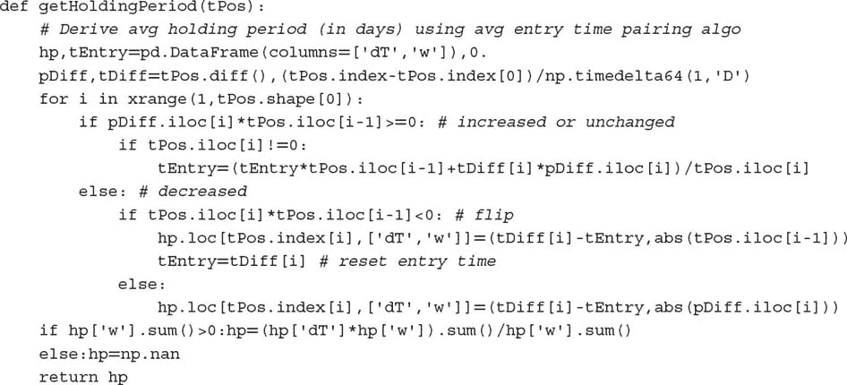
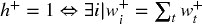
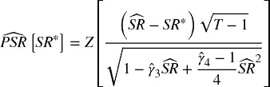

# 第十四章：回测统计

## 14.1 动机

在前面的章节中，我们研究了三种回测范式：第一，历史模拟（前进走法，第十一章和第十二章）。第二，情景模拟（CV 和 CPCV 方法，第十二章）。第三，合成数据模拟（第十三章）。无论你选择哪种回测范式，都需要根据一系列统计结果报告，以便投资者用来比较和评估你的策略与竞争对手的表现。在本章中，我们将讨论一些最常用的绩效评估统计数据。其中一些统计数据被包含在全球投资绩效标准（GIPS）中，^(1) 然而，全面的绩效分析需要针对所审查的机器学习策略的特定指标。

## 14.2 回测统计类型

回测统计数据包括投资者用来评估和比较各种投资策略的指标。它们应帮助我们发现策略中可能存在的问题，如显著的不对称风险或低容量。总体而言，它们可以被分类为一般特征、表现、交易/回撤、实施不足、收益/风险效率、分类评分和归因。

## 14.3 一般特征

以下统计数据告诉我们关于回测的一般特征：

+   **时间范围：** 时间范围指定了开始和结束日期。用于测试策略的时间段应足够长，以涵盖全面的市场状态（Bailey 和 López de Prado [2012]）。

+   **平均 AUM：** 这是管理资产的平均美元价值。为了计算这个平均值，长期和短期头寸的美元价值被视为正的实数。

+   **容量：** 策略的容量可以通过最高的 AUM 来衡量，该 AUM 能够实现目标的风险调整表现。需要最低 AUM 以确保适当的下注规模（第十章）和风险分散（第十六章）。超出该最低 AUM，随着 AUM 的增加，表现会因更高的交易成本和较低的周转率而下降。

+   **杠杆：** 杠杆衡量实现报告表现所需的借款金额。如果存在杠杆，必须为其分配成本。测量杠杆的一种方法是将平均头寸规模与平均 AUM 的比率。

+   **最大头寸规模：** 最大头寸规模告诉我们该策略是否在某些时候采取了大大超过平均 AUM 的头寸。一般来说，我们更倾向于那些最大头寸规模接近平均 AUM 的策略，这表明它们不依赖于极端事件的发生（可能是异常值）。

+   **多头比例：** 多头比例显示了下注中涉及多头头寸的比例。在多头-空头的市场中性策略中，理想情况下该值接近 0.5。如果不是，策略可能存在头寸偏差，或者回测的时间段可能过短且不具代表性。

+   **下注频率：** 下注频率是回测中每年下注的次数。连续在同一方向上的头寸被视为同一下注的一部分。当头寸被平仓或翻转至对立方向时，下注结束。下注的数量始终少于交易的数量。交易数量会高估策略发现的独立机会的数量。

+   **平均持有期：** 平均持有期是投注持有的平均天数。高频策略可能持有一个头寸仅为几秒，而低频策略可能持有数月甚至数年。短期持有可能限制策略的能力。持有期与投注频率相关但不同。例如，一种策略可能在每月的非农就业数据发布时下注，每个投注仅持有几分钟。

+   **年化换手率：** 年化换手率测量每年平均交易的美元金额与平均年化资产管理规模（AUM）之间的比例。即使投注数量较少，高换手率也可能发生，因为策略可能需要不断调整头寸。如果每笔交易都涉及在最大多头和最大空头之间转换，即使交易数量较少也可能出现高换手率。

+   **与基础资产的相关性：** 这是策略收益与基础投资范围收益之间的相关性。当相关性显著为正或负时，策略实际上是在持有或卖空投资范围，而没有增加太多价值。

Snippet 14.1 列出了一个算法，该算法从目标头寸的 pandas 系列（`tPos`）推导出平 flattening 或翻转 trades 的时间戳。这为我们提供了发生的投注数量。

> **SNIPPET 14.1 从目标头寸序列推导投注时间**
> 
> 

Snippet 14.2 说明了一个算法的实现，该算法根据目标头寸的 pandas 系列（`tPos`）估算策略的平均持有期。

> **SNIPPET 14.2 持有期估算器的实现**
> 
> 

## 14.4 性能

性能统计数据是没有风险调整的美元和收益数字。一些有用的性能测量指标包括：

+   **盈亏（PnL）：** 在整个回测期间产生的总美元金额（或相应的货币等值），包括来自终端头寸的清算成本。

+   **来自多头头寸的盈亏（PnL）：** 完全由多头头寸生成的盈亏美元部分。这是评估多空市场中性策略偏向的有趣数值。

+   **年化收益率：** 包括股息、利息、成本等的时间加权平均年化总收益率。

+   **命中率：** 导致正的盈亏（PnL）的投注比例。

+   **命中带来的平均收益：** 来自产生利润的投注的平均收益。

+   **失误带来的平均收益：** 来自产生亏损的投注的平均收益。

**14.4.1 时间加权收益率**

总收益是来自已实现和未实现的收益和损失的收益率，包括应计利息、支付的息票和测量期的股息。GIPS 规则计算时间加权收益率（TWRR），并调整外部现金流（CFA Institute [2010]）。定期和子定期收益按几何方式链接。对于 2005 年 1 月 1 日或之后开始的周期，GIPS 规则要求计算调整日加权外部现金流的投资组合收益。

我们可以通过确定每个外部现金流时投资组合的价值来计算 TWRR。 ^(2) 投资组合 *i* 在子周期 [ *t* − 1, *t* ] 之间的 TWRR 用 *r [*i* , *t*]* 表示，其公式为

其中

+   π [*i* , *t*] 是投资组合 *i* 在时间 *t* 的市值（MtM）利润或损失。

+   *K [*i* , *t*]* 是投资组合 *i* 在子周期 *t* 下管理的资产的市场价值。包含 max{.} 项的目的是为了资助额外的购买（ ramp-up）。

+   *A [*j* , *t*]* 是金融工具 *j* 在时间 *t* 所累积的利息或支付的股息。

+   *P [*j* , *t*]* 是证券 *j* 在时间 *t* 的净价。

+   θ [*i* , *j* , *t*] 是投资组合 *i* 在时间 *t* 对证券 *j* 的持有量。

+    是证券 *j* 在时间 *t* 的脏价。

+    是投资组合 *i* 在证券 *j* 上于子周期 *t* 的平均成交净价。

+    是投资组合 *i* 在证券 *j* 上于子周期 *t* 的平均成交脏价。

现金流入假定在一天开始时发生，而现金流出假定在一天结束时发生。这些子周期收益然后按几何方式链接为

变量 φ [*i* , *T*] 可以理解为投资组合 *i* 在其整个生命周期中投资一美元的表现，*t* = 1, …, *T*。最后，投资组合 *i* 的年化收益率为

其中 *y [*i*]* 是从 *r [*i* , 1]* 到 *r [*i* , *T*]* 之间经过的年数。

## 14.5 连续性

投资策略很少会产生来自 IID 过程的收益。在缺乏此属性的情况下，策略收益序列会表现出频繁的连续性。连续性是同一符号的收益的不断序列。因此，连续性增加了下行风险，这需要通过适当的指标进行评估。

**14.5.1 收益浓度**

给定一系列来自投注的收益时间序列，{ *r [*t*]* } [*t* = 1, …, *T*]，我们计算两个权重序列，*w ^−* 和 *w ^+*：

受到赫芬达尔-赫希曼指数（HHI）的启发，当 || *w ^+* || > 1 时，其中 ||.|| 是向量的大小，我们定义正收益的浓度为

当 || *w ^−* || > 1 时，负收益的浓度相应地为

根据詹森不等式，我们知道 E[ *r ^+ [*t*]* ] ² ≤ E[( *r [*t*] ^+* ) ² ]。由于 ，我们推导出 E[ *r ^+ [   *t*   ] * ] ² ≤ E[( *r [*t*] ^(  +  ) * ) ² ] ≤ E[ *r ^+ [   *t*   ] * ] ² || *r ^+ * ||，负投注回报有一个等效边界。这些定义有一些有趣的属性：

1.  0 ≤ *h ^+* ≤ 1

1.  *h ^+* = 0⇔*w ^+ [*t*]* = ||*w ^+* || ^(− 1)，∀*t*（均匀回报）

1.  （仅一个非零回报）

我们可以很容易地推导出一个类似的表达式，表示跨月份的投注集中度，*h* [ *t* ]。片段 14.3 实现了这些概念。理想情况下，我们感兴趣的策略是 *bets* 的回报表现出：

+   高夏普比率

+   每年高数量的投注，||*r ^+* || + ||*r ^−* || = *T*

+   高命中率（相对低的 ||*r ^−* ||）

+   低 *h ^+*（没有右侧胖尾）

+   低 *h ^−*（没有左侧胖尾）

+   低 *h* [*t*]（投注没有集中在时间上）

> **片段 14.3 推导 HHI 集中度的算法**
> 
> 

**14.5.2 回撤和水下时间**

直观地说，回撤（DD）是投资在两个连续高水位（HWM）之间遭受的最大损失。水下时间（TuW）是从高水位到盈亏超过前一个最大盈亏的时间。这些概念通过阅读片段 14.4 可以得到最佳理解。此代码从（1）回报系列（ `dollars = False`）或（2）美元表现系列（ `dollar = True`）推导出 DD 和 TuW 系列。图 14.1 提供了 DD 和 TuW 的示例。

**图 14.1** 回撤 (DD) 和水下时间 (TuW) 的示例

> **片段 14.4 推导 DD 和 TuW 的序列**
> 
> 

**14.5.3 性能评估的运行统计**

一些有用的运行统计测量包括：

+   **正回报的 HHI 指数：** 这是片段 14.3 中的 `getHHI(ret[ret > = 0])`。

+   **负回报的 HHI 指数：** 这是片段 14.3 中的 `getHHI(ret[ret < 0])`。

+   **投注间时间的 HHI 指数：** 这是片段 14.3 中的 `getHHI(ret.groupby` `(pd.TimeGrouper (freq = 'M')).count())`。

+   **95 百分位 DD：** 这是通过片段 14.4 推导的 DD 系列的第 95 百分位。

+   **95 百分位 TuW：** 这是通过片段 14.4 推导的 TuW 系列的第 95 百分位。

## 14.6 实施缺口

投资策略常常由于对执行成本的错误假设而失败。一些重要的测量包括：

+   **每次周转的经纪费用：** 这些是支付给经纪人的费用，包括交易所费用。

+   **每次周转的平均滑点：** 这些是涉及一次投资组合周转的执行成本，不包括经纪费用。例如，包括因在发送订单时以高于中价的成交价购买证券而造成的损失。

+   **每次交易的美元表现：** 这是美元表现（包括佣金费用和滑点成本）与总投资组合周转率之间的比率。它表明，在策略达到盈亏平衡之前，执行的成本可能会变得多么高。

+   **执行成本的回报：** 这是美元表现（包括佣金费用和滑点成本）与总执行成本之间的比率。它应该是一个较大的倍数，以确保策略能在比预期更糟的执行下存活。

## 14.7 效率

到目前为止，所有绩效统计都考虑了利润、损失和成本。在本节中，我们考虑实现这些结果所涉及的风险。

**14.7.1 夏普比率**

假设一个策略的超额收益（超过无风险利率），{*r[*t*]*}[*t* = 1，…，*T*]，是 IID 高斯分布，均值为μ，方差为σ²。夏普比率（SR）定义为

SR 的目的是评估特定策略或投资者的技能。由于μ，σ通常是未知的，真实的 SR 值不能确定。不可避免的结果是，夏普比率计算可能会存在相当大的估计误差。

**14.7.2 概率夏普比率**

概率夏普比率（PSR）通过消除由偏斜和/或重尾收益引起的短期序列的通货膨胀效应，提供了对夏普比率（*SR*）的调整估计。给定用户定义的基准^(3)夏普比率（*SR*）和观察到的夏普比率！，PSR 估计！大于假设的*SR*的概率。根据 Bailey 和 López de Prado [2012]，PSR 可以估计为

其中*Z*[.]是标准正态分布的累积分布函数（CDF），*T*是观察到的收益数量，是收益的偏斜度，是收益的峰度（对于高斯收益来说为）。对于给定的*SR*，随着更大的（在原始采样频率下，即非年化），或更长的历史记录（*T*），或正偏斜收益（）而增加，但随着更厚的尾部（）而减少。图 14.2 绘制了对于，和*SR* = 1.0 作为和*T*的函数。

**图 14.2** PSR 作为偏斜度和样本长度的函数

**14.7.3 通胀调整夏普比率**

通胀调整夏普比率（DSR）是一个 PSR，其中拒绝阈值经过调整以反映试验的多重性。根据 Bailey 和 López de Prado [2014]，DSR 可以估计为！，其中基准夏普比率*SR*不再由用户定义。相反，*SR*的估计为

其中  是试验估计的 SR 的方差，*N* 是独立试验的数量，*Z* [.] 是标准正态分布的 CDF，γ 是欧拉-马歇罗尼常数，*n* = 1, …, *N*。**图 14.3** 绘制了 *SR* * 作为  和 *N* 的函数。

**图 14.3** *SR* * 作为  和 *N* 的函数

DSR 背后的理论是：给定一组 SR 估计值，，其期望最大值大于零，即使真实的 SR 为零。在零假设下，即实际的夏普比率为零，*H [0]* : *SR* = 0，我们知道期望最大值  可以估算为 *SR* *。事实上，随着更多独立试验的进行 (*N*)，或试验涉及更大的方差 ，*SR* * 快速增加。根据这些知识，我们推导出回测的第三定律。

> **摘录 14.5 马尔科斯的回测第三定律。金融中的大多数发现都是虚假的，因为其违反了这一原则**
> 
> > “每个回测结果必须与其生成过程中的所有试验一同报告。缺乏这些信息，无法评估回测的‘虚假发现’概率。”
> > 
> > 马尔科斯·洛佩斯·德·普拉多
> > 
> > *金融机器学习的进展* (2018)

**14.7.4 效率统计**

有用的效率统计包括：

+   **年化夏普比率：** 这是通过因子  年化的 SR 值，其中 *a* 是每年观察到的收益平均数。这种常见的年化方法依赖于收益是 IID 的假设。

+   **信息比率：** 这是一个投资组合的 SR 等效指标，用于衡量其相对于基准的表现。它是平均超额收益与跟踪误差之间的年化比率。超额收益被定义为投资组合的收益超过基准收益的部分。跟踪误差被估算为超额收益的标准差。

+   **概率夏普比率：** PSR 修正了由于非正态收益或记录长度引起的通货膨胀效应。它应该超过 0.95，以达到标准的 5% 显著性水平。它可以在绝对收益或相对收益上进行计算。

+   **通胀调整后的夏普比率：** DSR 修正了由于非正态收益、记录长度和多重测试/选择偏差引起的通货膨胀效应。它应该超过 0.95，以达到标准的 5% 显著性水平。它可以在绝对收益或相对收益上进行计算。

## 14.8 分类评分

在元标签策略的背景下（第三章，第 3.6 节），理解 ML 覆盖算法的独立性能是很有用的。请记住，主要算法识别机会，而次要（覆盖）算法决定是否追求这些机会或放弃它们。一些有用的统计数据包括：

+   **准确率：** 准确率是覆盖算法正确标记的机会的比例，

    > > 

    其中 TP 是真正例的数量，TN 是真负例的数量，FP 是假正例的数量，FN 是假负例的数量。

+   **精确度：** 精确度是预测为正例的样本中真实正例的比例，

    > > 

+   **召回率：** 召回率是正例中真实正例的比例，

    > > 

+   **F1：** 对于元标签应用，准确率可能不是一个充分的分类评分。假设在应用元标签后，负样本（标签‘0’）的数量远多于正样本（标签‘1’）。在这种情况下，预测所有样本为负的分类器将获得高准确率，即使召回率=0 且精确度未定义。F1 分数通过评估精确度和召回率的（同等加权）调和平均数来修正这一缺陷，

    > > 

    顺便提一下，考虑一种不寻常的情况，即在应用元标签后，正例的数量远超过负例。一个将所有样本预测为正例的分类器将达到 TN=0 和 FN=0，因此准确率=精确度和召回率=1。准确率会很高，而 F1 不会小于准确率，即使该分类器无法区分观察样本。一个解决方案是调换正负样本的定义，使得负样本占主导地位，然后用 F1 评分。

+   **负对数损失：** 负对数损失在第九章，第 9.4 节中介绍，涉及超参数调优。请参阅该节以获取详细信息。准确率和负对数损失之间的关键概念区别在于，负对数损失不仅考虑我们的预测是否正确，还考虑这些预测的概率。

请参见第三章，第 3.7 节以获取精确度、召回率和准确率的可视化表示。表 14.1 描述了二分类的四种退化情况。正如你所见，F1 分数在其中两种情况下未定义。因此，当 Scikit-learn 被请求在没有观察到 1 或没有预测到 1 的样本上计算 F1 时，它将打印警告（`UndefinedMetricWarning`），并将 F1 值设为 0。

**表 14.1** **二分类的四种退化情况**

| **条件** | **崩溃** | **准确率** | **精确度** | **召回率** | **F1** |
| --- | --- | --- | --- | --- | --- |
| 观察到所有为 1 | TN=FP=0 | =召回率 | 1 | [0,1] | [0,1] |
| 观察到所有为 0 | TP=FN=0 | [0,1] | 0 | NaN | NaN |
| 预测所有为 1 | TN=FN=0 | =精确度 | [0,1] | 1 | [0,1] |
| 预测所有为 0 | TP=FP=0 | [0,1] | NaN | 0 | NaN |

当所有观察值都是正值（标签‘1’）时，没有真实负例或假阳性，因此精确度为 1，召回率是介于 0 和 1（包括）之间的正实数，准确率等于召回率。然后，。

当所有预测值都是正值（标签‘1’）时，没有真实负例或假阴性，因此精确度是介于 0 和 1（包括）之间的正实数，召回率为 1，准确率等于精确度。然后，。

## 14.9 归因

性能归因的目的是根据风险类别分解损益。例如，企业债券投资组合经理通常希望了解其业绩中有多少来自他对以下风险类别的敞口：久期、信用、流动性、经济部门、货币、主权、发行人等。他的久期押注是否获得回报？他在哪些信用细分领域表现出色？还是应该关注他的发行人选择能力？

这些风险并非正交，因此它们之间总是存在重叠。例如，高流动性债券往往具有短久期和高信用评级，通常由大实体以大量美元发行。因此，归因的损益总和将与总损益不匹配，但至少我们将能够计算每个风险类别的夏普比率（或信息比率）。这种方法的最受欢迎示例可能是 Barra 的多因子方法。有关详细信息，请参见 Barra [1998, 2013] 和 Zhang 与 Rachev [2004]。

同样重要的是在每个类别内将 PnL 归因于不同类别。例如，持续时间类别可以分为短期（少于 5 年）、中期（5 到 10 年之间）和长期（超过 10 年）。这种 PnL 归因可以通过以下方式实现：首先，为了避免我们之前提到的重叠问题，我们需要确保投资组合中的每个成员在任何时候都只属于每个风险类别的一个且仅一个类别。换句话说，对于每个风险类别，我们将整个投资组合划分为不相交的部分。其次，对于每个风险类别，我们为每个风险类别形成一个指数。例如，我们将计算短期债券的指数表现、另一个中期债券的指数以及另一个长期债券的指数。每个指数的权重是我们投资组合的重新缩放权重，从而使每个指数的权重总和为 1。第三，我们重复第二步，但这次我们使用来自投资组合（例如 Markit iBoxx 投资级别）的权重来形成这些风险类别指数，同样重新缩放，使每个指数的权重总和为 1。第四，我们计算在这些指数的收益和超额收益上讨论的表现指标。为了清晰起见，在这种情况下，短期指数的超额收益是使用（重新缩放的）投资组合权重（步骤 2）减去使用（重新缩放的）投资组合权重（步骤 3）的收益。

**练习**

1.  > > 一项策略展现出高周转率、高杠杆和大量投注，持有期短，执行成本回报低，同时夏普比率高。它有可能具有大容量吗？你认为这是什么样的策略？
1.  > > 
1.  > > 在 E-mini S&P 500 期货的美元柱数据集上计算。

    1.  正收益的 HHI 指数。

    1.  负收益的 HHI 指数。

    1.  K 线间隔时间的 HHI 指数。

    1.  95 百分位 DD。

    1.  95 百分位 TuW。

    1.  年化平均收益。

    1.  从命中（正收益）中获得的平均收益。

    1.  从失误（负收益）中获得的平均收益。

    1.  年化 SR。

    1.  信息比率，以无风险利率为基准。

    1.  PSR。

    1.  DSR，我们假设进行了 100 次试验，试验的 SR 方差为 0.5。

1.  > > 考虑一种策略，在偶数年做多一个期货合约，在奇数年做空一个期货合约。

    1.  重复练习 2 中的计算。

    1.  与基础资产的相关性是什么？

1.  > > 2 年回测的结果是，月收益的均值为 3.6%，标准差为 0.079%。

    1.  SR 是什么？

    1.  年化 SR 是什么？

1.  > > 继续练习 1：

    1.  收益的偏度为 0，峰度为 3\. PSR 是什么？

    1.  收益的偏度为-2.448，峰度为 10.164\. PSR 是什么？

1.  > > 如果回测长度为 3 年，2.b 的 PSR 将是多少？
1.  > > 
1.  > > 一项为期 5 年的回测的年化 SR 为 2.5，计算基于日收益。偏度为-3，峰度为 10。

    1.  PSR 是什么？

    1.  为了找到最佳结果，进行了 100 次试验。这些试验中夏普比率的方差为 0.5。DSR 是多少？

**参考文献**

1.  Bailey, D. 和 M. López de Prado (2012)： “夏普比率有效前沿。” *风险期刊* , 第 15 卷，第 2 期，页码 3–44。

1.  Bailey, D. 和 M. López de Prado (2014)： “去通胀的夏普比率：修正选择偏差、回测过拟合和非正态性。” *投资组合管理期刊* , 第 40 卷，第 5 期。可在 [`ssrn.com/abstract=2460551`](https://ssrn.com/abstract=2460551) 获取。

1.  Barra (1998)： *风险模型手册：美国股票* , 第 1 版。Barra。可在 [`www.alacra.com/alacra/help/barra_handbook_US.pdf`](http://www.alacra.com/alacra/help/barra_handbook_US.pdf) 获取。

1.  Barra (2013)： *MSCI BARRA 因子指数方法论* , 第 1 版。MSCI Barra。可在 [`www.msci.com/eqb/methodology/meth_docs/MSCI_Barra_Factor%20Indices_Methodology_Nov13.pdf`](https://www.msci.com/eqb/methodology/meth_docs/MSCI_Barra_Factor%20Indices_Methodology_Nov13.pdf) 获取。

1.  CFA Institute (2010)： “全球投资业绩标准。” CFA Institute, 第 2010 卷，第 4 期，二月。可在 [`www.gipsstandards.org/.`](https://www.gipsstandards.org/.) 获取。

1.  Zhang, Y. 和 S. Rachev (2004)： “风险归因与投资组合业绩测量—概述。” 工作论文，加州大学圣巴巴拉分校。可在 [`citeseerx.ist.psu.edu/viewdoc/summary?doi=10.1.1.318.7169`](http://citeseerx.ist.psu.edu/viewdoc/summary?doi=10.1.1.318.7169) 获取。

**参考文献**

1.  美国统计协会 (1999): “统计实践的伦理指南。” 可在 [`www.amstat.org/committees/ethics/index.html`](http://www.amstat.org/committees/ethics/index.html) 获取。

1.  Bailey, D., J. Borwein, M. 洛佩斯·德·普拉多 和 J. 朱 (2014): “伪数学与金融骗子：回测过度拟合对样本外表现的影响。” *美国数学学会通告* , 第 61 卷，第 5 期\. 可在 [`ssrn.com/abstract=2308659`](http://ssrn.com/abstract=2308659) 获取。

1.  Bailey, D., J. Borwein, M. 洛佩斯·德·普拉多 和 J. 朱 (2017): “回测过度拟合的概率。” *计算金融学杂志* , 第 20 卷，第 4 期，第 39–70 页\. 可在 [`ssrn.com/abstract=2326253`](http://ssrn.com/abstract=2326253) 获取。

1.  Bailey, D. 和 M. 洛佩斯·德·普拉多 (2012): “平衡篮子：一种新的交易和对冲风险的方法。” *投资策略杂志（风险期刊）* , 第 1 卷，第 4 期，第 21–62 页。

1.  Beddall, M. 和 K. 兰德 (2013): “CTA 的假设表现。” 工作论文，温顿资本管理。

1.  Benjamini, Y. 和 Y. Hochberg (1995): “控制错误发现率：一种实用而强大的多重检验方法。” *皇家统计学会杂志，B 系列（方法论）* , 第 57 卷，第 1 期，第 289–300 页。

1.  Bennet, C., A. Baird, M. 米勒 和 G. 沃尔福德 (2010): “大西洋鲑鱼尸体中的跨物种视角取舍的神经相关性：对适当的多重比较校正的论证。” *意外结果杂志* , 第 1 卷，第 1 期，第 1–5 页。

1.  Bruss, F. (1984): “对一类最佳选择问题的统一方法，选项数量未知。” *概率年鉴* , 第 12 卷，第 3 期，第 882–891 页。

1.  Dmitrienko, A., A.C. Tamhane 和 F. Bretz (2010): *制药统计中的多重检验问题* , 第 1 版. CRC 出版社。

1.  Dudoit, S. 和 M.J. van der Laan (2008): *多重检验程序及其在基因组学中的应用* , 第 1 版. 施普林格。

1.  Fisher, R.A. (1915): “在无限大总体样本中相关系数值的频率分布。” *生物统计学* , 第 10 卷，第 4 期，第 507–521 页。

1.  Hand, D. J. (2014): *不可能原则* , 第 1 版. 科学美国人/法拉尔，斯特劳斯与吉鲁。

1.  Harvey, C., Y. 刘 和 H. 朱 (2013): “. . . 以及预期收益的横截面。” 工作论文，杜克大学。可在 [`ssrn.com/abstract=2249314`](http://ssrn.com/abstract=2249314) 获取。

1.  Harvey, C. 和 Y. 刘 (2014): “回测。” 工作论文，杜克大学。可在 [`ssrn.com/abstract=2345489`](http://ssrn.com/abstract=2345489) 获取。

1.  Hochberg Y. 和 A. Tamhane (1987): *多重比较程序* , 第 1 版. 约翰·威利与儿子。

1.  Holm, S. (1979): “一种简单的顺序拒绝多重检验程序。” *斯堪的纳维亚统计学杂志* , 第 6 卷，第 65–70 页。

1.  Ioannidis, J.P.A. (2005): “为什么大多数已发表的研究结果是错误的。” *PloS 医学*，第 2 卷，第 8 期，第 696–701 页。

1.  Ingersoll, J., M. Spiegel, W. Goetzmann 和 I. Welch (2007): “投资组合绩效操纵和抗操纵绩效度量。” *金融研究评论*，第 20 卷，第 5 期，第 1504–1546 页。

1.  Lo, A. (2002): “Sharpe 比率的统计学。” *金融分析师期刊*，第 58 卷，第 4 期（7/8 月），第 36–52 页。

1.  López de Prado M. 和 A. Peijan (2004): “对冲基金策略的损失潜力测量。” *另类投资期刊*，第 7 卷，第 1 期（夏季），第 7–31 页。可在 [`ssrn.com/abstract=641702`](http://ssrn.com/abstract=641702) 获得。

1.  Mertens, E. (2002): “Lo (2002) 中 IID 估计量的方差。” 工作论文，巴塞尔大学。

1.  Roulston, M. 和 D. Hand (2013): “被乐观蒙蔽。” 工作论文，Winton 资本管理公司。

1.  Schorfheide, F. 和 K. Wolpin (2012): “关于使用保留样本进行模型选择。” *美国经济评论*，第 102 卷，第 3 期，第 477–481 页。

1.  Sharpe, W. (1966): “共同基金绩效。” *商业期刊*，第 39 卷，第 1 期，第 119–138 页。

1.  Sharpe, W. (1975): “在投资组合绩效测量中调整风险。” *投资组合管理期刊*，第 1 卷，第 2 期（冬季），第 29–34 页。

1.  Sharpe, W. (1994): “Sharpe 比率。” *投资组合管理期刊*，第 21 卷，第 1 期（秋季），第 49–58 页。

1.  Studený M. 和 Vejnarová J. (1999): “多信息函数作为测量随机依赖的工具，” 见 M. I. Jordan, 编，*图形模型中的学习*。MIT 出版社，第 261–296 页。

1.  Wasserstein R. 和 Lazar N. (2016) “ASA 对 p 值的声明：背景、过程和目的。” *美国统计学家*，第 70 卷，第 2 期，第 129–133 页。DOI: 10.1080/00031305.2016.1154108。

1.  Watanabe S. (1960): “多变量相关的信息理论分析。” *IBM 研究与开发期刊*，第 4 卷，第 66–82 页。

**注释**

^(1)    有关更多细节，请访问 [`www.gipsstandards.org.`](https://www.gipsstandards.org.)

^(2)    外部现金流是进入或退出投资组合的资产（现金或投资）。例如，股息和利息收入支付不被视为外部现金流。

^(3)    这可以设置为零的默认值（即与没有投资技能进行比较）。

