**参考文献**

1.  美国统计协会 (1999): “统计实践的伦理指南。” 可在 [`www.amstat.org/committees/ethics/index.html`](http://www.amstat.org/committees/ethics/index.html) 获取。

1.  Bailey, D., J. Borwein, M. 洛佩斯·德·普拉多 和 J. 朱 (2014): “伪数学与金融骗子：回测过度拟合对样本外表现的影响。” *美国数学学会通告* , 第 61 卷，第 5 期\. 可在 [`ssrn.com/abstract=2308659`](http://ssrn.com/abstract=2308659) 获取。

1.  Bailey, D., J. Borwein, M. 洛佩斯·德·普拉多 和 J. 朱 (2017): “回测过度拟合的概率。” *计算金融学杂志* , 第 20 卷，第 4 期，第 39–70 页\. 可在 [`ssrn.com/abstract=2326253`](http://ssrn.com/abstract=2326253) 获取。

1.  Bailey, D. 和 M. 洛佩斯·德·普拉多 (2012): “平衡篮子：一种新的交易和对冲风险的方法。” *投资策略杂志（风险期刊）* , 第 1 卷，第 4 期，第 21–62 页。

1.  Beddall, M. 和 K. 兰德 (2013): “CTA 的假设表现。” 工作论文，温顿资本管理。

1.  Benjamini, Y. 和 Y. Hochberg (1995): “控制错误发现率：一种实用而强大的多重检验方法。” *皇家统计学会杂志，B 系列（方法论）* , 第 57 卷，第 1 期，第 289–300 页。

1.  Bennet, C., A. Baird, M. 米勒 和 G. 沃尔福德 (2010): “大西洋鲑鱼尸体中的跨物种视角取舍的神经相关性：对适当的多重比较校正的论证。” *意外结果杂志* , 第 1 卷，第 1 期，第 1–5 页。

1.  Bruss, F. (1984): “对一类最佳选择问题的统一方法，选项数量未知。” *概率年鉴* , 第 12 卷，第 3 期，第 882–891 页。

1.  Dmitrienko, A., A.C. Tamhane 和 F. Bretz (2010): *制药统计中的多重检验问题* , 第 1 版. CRC 出版社。

1.  Dudoit, S. 和 M.J. van der Laan (2008): *多重检验程序及其在基因组学中的应用* , 第 1 版. 施普林格。

1.  Fisher, R.A. (1915): “在无限大总体样本中相关系数值的频率分布。” *生物统计学* , 第 10 卷，第 4 期，第 507–521 页。

1.  Hand, D. J. (2014): *不可能原则* , 第 1 版. 科学美国人/法拉尔，斯特劳斯与吉鲁。

1.  Harvey, C., Y. 刘 和 H. 朱 (2013): “. . . 以及预期收益的横截面。” 工作论文，杜克大学。可在 [`ssrn.com/abstract=2249314`](http://ssrn.com/abstract=2249314) 获取。

1.  Harvey, C. 和 Y. 刘 (2014): “回测。” 工作论文，杜克大学。可在 [`ssrn.com/abstract=2345489`](http://ssrn.com/abstract=2345489) 获取。

1.  Hochberg Y. 和 A. Tamhane (1987): *多重比较程序* , 第 1 版. 约翰·威利与儿子。

1.  Holm, S. (1979): “一种简单的顺序拒绝多重检验程序。” *斯堪的纳维亚统计学杂志* , 第 6 卷，第 65–70 页。

1.  Ioannidis, J.P.A. (2005): “为什么大多数已发表的研究结果是错误的。” *PloS 医学*，第 2 卷，第 8 期，第 696–701 页。

1.  Ingersoll, J., M. Spiegel, W. Goetzmann 和 I. Welch (2007): “投资组合绩效操纵和抗操纵绩效度量。” *金融研究评论*，第 20 卷，第 5 期，第 1504–1546 页。

1.  Lo, A. (2002): “Sharpe 比率的统计学。” *金融分析师期刊*，第 58 卷，第 4 期（7/8 月），第 36–52 页。

1.  López de Prado M. 和 A. Peijan (2004): “对冲基金策略的损失潜力测量。” *另类投资期刊*，第 7 卷，第 1 期（夏季），第 7–31 页。可在 [`ssrn.com/abstract=641702`](http://ssrn.com/abstract=641702) 获得。

1.  Mertens, E. (2002): “Lo (2002) 中 IID 估计量的方差。” 工作论文，巴塞尔大学。

1.  Roulston, M. 和 D. Hand (2013): “被乐观蒙蔽。” 工作论文，Winton 资本管理公司。

1.  Schorfheide, F. 和 K. Wolpin (2012): “关于使用保留样本进行模型选择。” *美国经济评论*，第 102 卷，第 3 期，第 477–481 页。

1.  Sharpe, W. (1966): “共同基金绩效。” *商业期刊*，第 39 卷，第 1 期，第 119–138 页。

1.  Sharpe, W. (1975): “在投资组合绩效测量中调整风险。” *投资组合管理期刊*，第 1 卷，第 2 期（冬季），第 29–34 页。

1.  Sharpe, W. (1994): “Sharpe 比率。” *投资组合管理期刊*，第 21 卷，第 1 期（秋季），第 49–58 页。

1.  Studený M. 和 Vejnarová J. (1999): “多信息函数作为测量随机依赖的工具，” 见 M. I. Jordan, 编，*图形模型中的学习*。MIT 出版社，第 261–296 页。

1.  Wasserstein R. 和 Lazar N. (2016) “ASA 对 p 值的声明：背景、过程和目的。” *美国统计学家*，第 70 卷，第 2 期，第 129–133 页。DOI: 10.1080/00031305.2016.1154108。

1.  Watanabe S. (1960): “多变量相关的信息理论分析。” *IBM 研究与开发期刊*，第 4 卷，第 66–82 页。

**注释**

^(1)    有关更多细节，请访问 [`www.gipsstandards.org.`](https://www.gipsstandards.org.)

^(2)    外部现金流是进入或退出投资组合的资产（现金或投资）。例如，股息和利息收入支付不被视为外部现金流。

^(3)    这可以设置为零的默认值（即与没有投资技能进行比较）。

**第十五章**

**理解策略风险**

**15.1 动机**

正如我们在第三章和第十三章中看到的，投资策略通常以持有头寸的方式实现，直到满足以下两种条件之一：（1）以盈利退出头寸的条件（获利了结），或者（2）以亏损退出头寸的条件（止损）。即使策略未明确声明止损，始终存在一个隐含的止损限度，投资者在此限度下无法继续为其头寸提供资金（追加保证金通知）或承受因未实现亏损增加而带来的痛苦。由于大多数策略（隐含或明确）都有这两个退出条件，因此通过二项过程建模结果的分布是有意义的。这将帮助我们理解投注频率、赔率和收益的哪些组合是经济上的不合理。本章的目标是帮助您评估何时策略对这些变量中的小变化脆弱。

**15.2 对称收益**

考虑一个策略，每年产生 *n* 个独立同分布的投注，其中投注 *i* ∈ [1, *n*] 的结果 *X [*i*]* 是以概率 P[ *X [*i*]* = π] = *p* 获得的利润 π > 0，以及以概率 P[ *X [*i*]* = −π] = 1 − *p* 的亏损 − π。你可以将 *p* 理解为一个二分类器的精度，其中正面表示投注一个机会，负面表示放弃一个机会：真正的正面得到奖励，假阳性受到惩罚，而负面（无论是真还是假）没有收益。由于投注结果 { *X [*i*]* } [*i* = 1, …, *n*] 是独立的，我们将计算每次投注的期望时刻。一次投注的期望利润为 E[ *X [*i*]* ] = π *p* + ( − π)(1 − *p* ) = π(2 *p* − 1)。方差为 V[ *X [*i*]* ] = E[ *X ² [*i*]* ] − E[ *X [*i*]* ] ²，其中 E[ *X ² [*i*]* ] = π ² *p* + ( − π) ² (1 − *p* ) = π ²，因此 V[ *X [*i*]* ] = π ² − π ² (2 *p* − 1) ² = π ² [1 − (2 *p* − 1) ² ] = 4π ² *p* (1 − *p* )。对于每年 *n* 个独立同分布的投注，年化夏普比率 (θ) 是

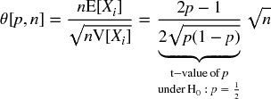

注意到 π 从上述方程中消去，因为收益是对称的。就像在高斯情况下，θ[ *p* , *n* ]可以理解为重新缩放的 t 值。这说明了一个观点，即使是很小的 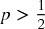，在足够大的 *n* 下，夏普比率也可以被提高。这就是高频交易的经济基础，在这种情况下，*p* 可能仅略高于 .5，而成功业务的关键是增加 *n*。夏普比率是精度的函数而非准确性的，因为放弃一个机会（负面）不会直接受到奖励或惩罚（尽管过多的负面可能导致小 *n*，从而将夏普比率压低到接近零）。

例如，对于 *p* = .55， ，并且实现年化夏普比率 2 需要每年 396 次投注。摘录 15.1 在实验中验证了这一结果。图 15.1 绘制了夏普比率作为不同投注频率下精度的函数。

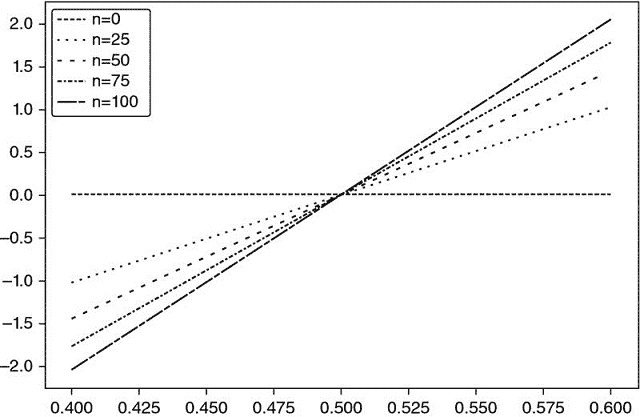

**图 15.1** 各种下注频率 (n) 下精度 (x 轴) 和夏普比率 (y 轴) 的关系

> **片段 15.1 将夏普比率作为下注次数的函数**
> 
> 

解出 0 ≤ *p* ≤ 1，得到 ，解为

该方程明确了给定夏普比率 (θ) 下精度 (*p*) 和频率 (*n*) 之间的权衡。例如，只有每周下注 (*n* = 52) 的策略需要相当高的精度 *p* = 0.6336 才能实现年化夏普比率为 2。

**15.3 非对称支付**

考虑一个每年产生 *n* 个独立同分布 (IID) 下注的策略，其中下注 *i* ∈ [1, *n* ] 的结果 *X [*i*]* 以概率 P[ *X [*i*]* = π [+] ] = *p* 为 π [+]，结果为 π [−]，π [−] < π [+] 的概率为 P[ *X [*i*]* = π [−] ] = 1 − *p*。一次下注的期望利润为 E[ *X [*i*]* ] = *p* π [+] + (1 − *p* )π [−] = (π [+] − π [−] ) *p* + π [−]。方差为 V[ *X [*i*]* ] = E[ *X ² [*i*]* ] − E[ *X [*i*]* ] ²，其中 E[ *X ² [*i*]* ] = *p* π [+] ² + (1 − *p* )π ² [−] = (π [+] ² − π ² [−] ) *p* + π [−] ²，因此 V[ *X [*i*]* ] = (π [+] − π [−] ) ² *p* (1 − *p* )。对于每年 *n* 个 IID 下注，年化夏普比率 (θ) 为

而对于 π [−] = −π [+]，我们可以看到这个方程简化为对称情况：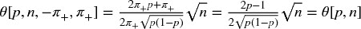。例如，对于 *n* = 260，π [−] = −.01，π [+] = .005，*p* = .7，我们得到 θ = 1.173。

最后，我们可以解出前面的方程，得到 0 ≤ *p* ≤ 1，

其中：

+   *a* = (*n* + θ ² )(π [+] − π [−] ) ²

+   *b* = [2*n* π [−] − θ ² (π [+] − π [−] )](π [+] − π [−] )

+   *c* = *n* π ² [−]

作为旁注，片段 15.2 使用 SymPy Live 验证了这些符号运算：[`live.sympy.org/`](http://live.sympy.org/) 。

> **片段 15.2 使用 SymPy 库进行符号运算**
> 
> 

上述方程回答了以下问题：给定参数为 {π [−] , π [+] , *n* } 的交易规则，达到 θ* 的夏普比率所需的精度率 *p* 是多少？例如，对于 *n* = 260，π [−] = −.01，π [+] = .005，想要得到 θ = 2，我们需要 *p* = .72 *。* 由于下注次数众多，*p* 的一个微小变化（从 *p* = .7 到 *p* = .72）使夏普比率从 θ = 1.173 提升到 θ = 2 *。* 另一方面，这也告诉我们，该策略对 *p* 的小变化非常敏感。片段 15.3 实现了隐含精度的推导。图 15.2 显示了 *n* 和 π [−] 的隐含精度，其中 π [+] = 0.1，θ* = 1.5 *。* 当给定 *n* 时，π [−] 越负，达到给定 π [+] 的 θ* 需要的 *p* 越高。当给定 π [−] 时，*n* 越小，达到给定 π [+] 的 θ* 需要的 *p* 越高。

**图 15.2** 隐含精度的热图作为 *n* 和 π [−] 的函数，π [+] = 0.1 和 θ* = 1.5。

> **片段 15.3 计算隐含精度**
> 
> 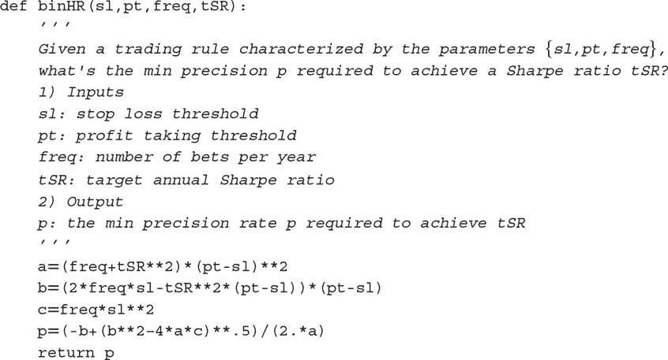

片段 15.4 计算隐含投注频率的 θ[ *p* , *n* , π [−] , π [+] ]。 图 15.3 绘制了隐含频率作为 *p* 和 π [−] 的函数，其中 π [+] = 0.1 和 θ* = 1.5 *.* 当对于给定的 *p*，π [−] 越负，达到给定 π [+] 的 θ* 所需的 *n* 越高。当对于给定的 π [−]，*p* 越小，达到给定 π [+] 的 θ* 所需的 *n* 越高。

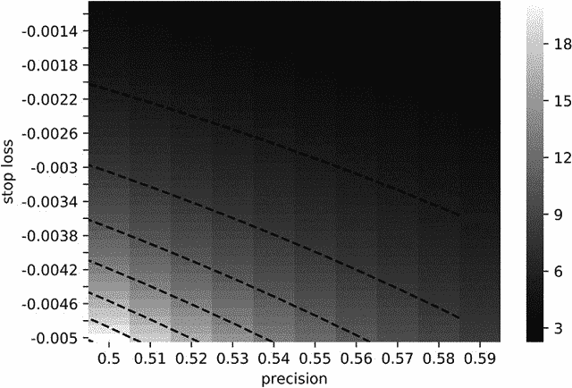

**图 15.3** 隐含频率作为 *p* 的函数，并且 = 0.1 和 = 1.5。

> **片段 15.4 计算隐含投注频率**
> 
> 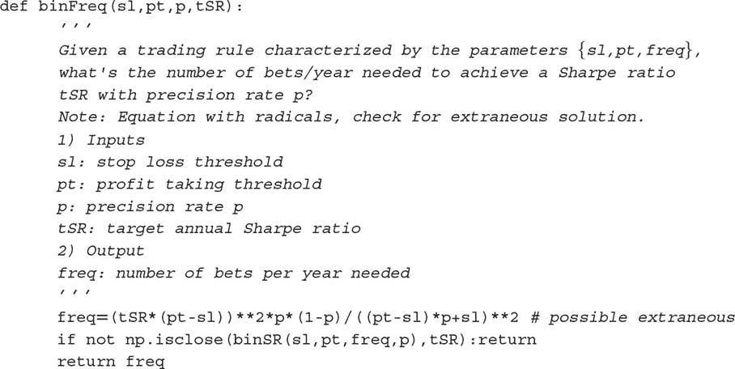

**15.4 策略失败的概率**

在上述示例中，参数 π [−] = −.01, π [+] = .005 由投资组合经理设定，并传递给交易员执行订单。参数 *n* = 260 也是由投资组合经理设定，因为她决定什么构成值得投注的机会。两个不在投资组合经理控制之下的参数是 *p*（由市场决定）和 θ*（投资者设定的目标）。由于 *p* 是未知的，我们可以将其建模为随机变量，期望值为 E[ *p* ]。我们定义  为 *p* 的值，低于此值策略将低于目标夏普比率 θ*，即 。我们可以使用上述方程（或 `binHR` 函数）得出结论，对于 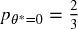， *.* 这突显了该策略所涉及的风险，因为 *p* 的相对小幅下降（从 *p* = .7 降至 *p* = .67）将消灭所有利润。该策略本质上是有风险的，即使持仓没有风险。这是我们希望在本章中明确的关键区别：*策略风险* 不应与 *投资组合风险* 混淆。

大多数公司和投资者在计算、监控和报告投资组合风险时，未意识到这并不能告诉我们策略本身的风险。策略风险不是由首席风险官计算的基础投资组合的风险。策略风险是投资策略随时间推移未能成功的风险，这是对首席投资官而言更具相关性的问题。问题“这项策略失败的概率是什么？”的答案相当于计算 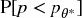。以下算法将帮助我们计算策略风险。

**15.4.1 算法**

在本节中，我们将描述计算  的过程。给定一系列投注结果 {π [*t*] } [*t* = 1, …, *T*]，首先我们估计 π [−] = E[{π [*t*] |π [*t*] ≤ 0} [*t* = 1, …, *T*] ]，以及 π [+] = E[{π [*t*] |π [*t*] > 0} [*t* = 1, …, *T*] ]。或者，{π [−] , π [+] } 可以通过拟合两个高斯混合模型得出，使用 EF3M 算法（López de Prado 和 Foreman [2014]）。其次，年度频率 *n* 由 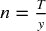 给出，其中 *y* 是 *t* = 1 和 *t* = *T* 之间经过的年份数。第三，我们对 *p* 的分布进行自助抽样，如下所示：

1.  对于迭代 *i* = 1, …, *I*：

    1.  从 {π [*t*] } [*t* = 1, …, *T*] 中以替换方式抽取 ⌊*nk*⌋ 个样本，其中 *k* 是投资者用来评估策略的年数（例如，2 年）。我们将这些抽取的样本集合记作 {π ^(( *i* )) [*j*] } [*j* = 1, …, ⌊ *nk*⌋]。

    1.  从迭代 *i* 中推导观察到的精度为 。

1.  通过对 {*p [*i*]* } [*i* = 1, …, *I*] 应用核密度估计器 (KDE)，拟合 *p* 的概率密度函数 (PDF)，记作 *f* [*p*]。

对于足够大的 *k*，我们可以将第三步近似为 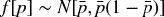，其中 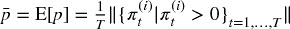。第四，给定一个阈值 θ*（将失败与成功分开的夏普比率），推导出 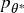（见第 15.4 节）。第五，策略风险计算为 。

**15.4.2 实现**

片段 15.5 列出了该算法的一种可能实现。通常我们会将  的策略视为过于冒险，即使它们投资于低波动性的工具。原因在于，即使它们的资金损失不多，但未能达到目标的概率仍然太高。为了能够使用，该策略开发者必须找到降低  的方法。

> **片段 15.5 实际计算策略风险**
> 
> 

这种方法与 PSR 有一些相似之处（见第十四章，以及 Bailey 和 López de Prado [2012, 2014]）。PSR 在非高斯收益下推导出真实夏普比率超过给定阈值的概率。类似地，本章介绍的方法基于不对称二元结果推导策略的失败概率。关键区别在于，PSR 不区分在投资组合经理控制内外的参数，而这里讨论的方法允许投资组合经理研究在其控制参数 {π [−] , π [+] , *n* } 下策略的可行性。这在设计或评估交易策略的可行性时非常有用。

**练习**

1.  > > 一位投资组合经理打算推出一项目标年化 SR 为 2 的策略。投注的精度率为 60%，且频率为每周。退出条件为盈利时的 2% 和止损时的 -2%。

    1.  该策略可行吗？

    1.  *其他条件相同*，使策略盈利所需的精度率是多少？

    1.  达到目标的下注频率是多少？

    1.  达到目标的获利阈值是多少？

    1.  替代止损的选项是什么？

1.  > > 跟进练习 1 中的策略。

    1.  SR 对每个参数 1%变化的敏感度是多少？

    1.  鉴于这些敏感性，并假设所有参数都同样难以改进，哪一个提供了最低的回报？

    1.  练习 1 中任何参数的变化是否影响其他参数？例如，改变下注频率是否会修改精度率等？

1.  > > 假设一个策略在两年内每月产生下注，收益遵循两个高斯分布的混合。第一个分布的均值为-0.1，标准差为 0.12\. 第二个分布的均值为 0.06，标准差为 0.03\. 从第一个分布得出的抽样概率为 0.15。

    1.  根据 López de Prado 和 Peijan [2004]以及 López de Prado 和 Foreman [2014]，推导混合收益的前四个矩。

    1.  年化 SR 是多少？

    1.  利用这些矩，计算 PSR[1]（见第十四章）。在 95%的置信水平下，你会否决这个策略吗？

1.  > > 使用 Snippet 15.5，计算练习 3 中描述的  。在 0.05 的显著性水平下，你会否决这个策略吗？这个结果与*PSR* [θ*]一致吗？
1.  > > 
1.  > > 通常，你期望哪个结果更准确，*PSR* [θ*] 还是  ? 这两种方法如何互补？
1.  > > 
1.  > > 根据你在本章学到的知识，重新审视第十三章的结果。

    1.  在 OTR 中，获利和止损阈值之间的不对称是否有意义？

    1.  图 13.1 所暗示的每日下注频率下的*p*范围是什么？

    1.  图 13.5 所暗示的每周下注频率下的*p*范围是什么？

**参考文献**

1.  Bailey, D. 和 M. López de Prado (2014): “通胀 Sharpe 比率：修正选择偏差、回测过拟合和非正态性。” *投资组合管理杂志* , 第 40 卷，第 5 期\. 可在 [`ssrn.com/abstract=2460551`](https://ssrn.com/abstract=2460551) 获取。

1.  Bailey, D. 和 M. López de Prado (2012): “Sharpe 比率有效前沿。” *风险杂志* , 第 15 卷，第 2 期，页 3–44\. 可在 [`ssrn.com/abstract=1821643.`](https://ssrn.com/abstract=1821643.) 获取。

1.  López de Prado, M. 和 M. Foreman (2014): “高斯混合模型的数学投资组合监督方法：EF3M 算法。” *定量金融* , 第 14 卷，第 5 期，页 913–930\. 可在 [`ssrn.com/abstract=1931734`](https://ssrn.com/abstract=1931734) 获取。

1.  López de Prado, M. 和 A. Peijan (2004): “衡量对冲基金策略的损失潜力。” *另类投资杂志* , 第 7 卷，第 1 期（夏季），页 7–31\. 可在 [`ssrn.com/abstract=641702`](http://ssrn.com/abstract=641702) 获取。

**第十六章**

**机器学习资产配置**

**16.1 动机**

本章介绍了层次风险平价（HRP）方法。^(1) HRP 投资组合解决了二次优化器普遍存在的三个主要问题，特别是马科维茨的关键线算法（CLA）：不稳定性、集中度和表现不佳。HRP 运用现代数学（图论和机器学习技术）根据协方差矩阵中的信息构建多元化投资组合。然而，与二次优化器不同，HRP 并不要求协方差矩阵可逆。实际上，HRP 可以在病态甚至奇异的协方差矩阵上计算投资组合，这对二次优化器来说是不可能的。蒙特卡洛实验表明，尽管最小方差是 CLA 的优化目标，HRP 的样本外方差却低于 CLA。与传统的风险平价方法相比，HRP 在样本外产生的投资组合风险更低。历史分析也表明，HRP 的表现优于标准方法（Kolanovic 等[2017]，Raffinot[2017]）。HRP 的一个实际应用是确定多个机器学习（ML）策略之间的配置。

**16.2 凸投资组合优化的问题**

投资组合构建可能是最常见的金融问题。投资经理每天必须构建包含他们对风险和收益看法与预测的投资组合。这是 24 岁的哈里·马科维茨在六十多年前试图回答的根本问题。他的重大见解是认识到，不同的最优投资组合在风险调整收益方面与各种风险水平相关，因此有了“有效前沿”的概念（马科维茨[1952]）。一个含义是，通常将所有资产分配给预期收益最高的投资并不最优。相反，我们应该考虑替代投资之间的相关性，以构建一个多元化的投资组合。

在 1954 年获得博士学位之前，马科维茨离开学术界为兰德公司工作，他在那开发了关键线算法。CLA 是一种专门为不等式约束的投资组合优化问题设计的二次优化程序。这个算法的显著之处在于，它保证在已知的迭代次数后找到精确解，并巧妙地规避了卡鲁什-库恩-塔克条件（库恩和塔克[1951]）。有关该算法的描述和开源实现可以在贝利和洛佩斯·德·普拉多[2013]中找到。令人惊讶的是，大多数金融从业者似乎仍对 CLA 一无所知，因为他们常常依赖于不保证正确解或停止时间的通用二次规划方法。

尽管马科维茨理论非常出色，但一些实际问题使得 CLA 解决方案有些不可靠。一个主要的警告是，预测收益的小偏差会导致 CLA 产生非常不同的投资组合（Michaud [1998]）。鉴于收益很难以足够的准确性进行预测，许多作者选择完全放弃预测，专注于协方差矩阵。这导致了基于风险的资产配置方法，其中“风险平价”是一个突出的例子（Jurczenko [2015]）。放弃收益预测可以改善但无法防止不稳定性问题。原因在于，二次规划方法需要对正定协方差矩阵进行求逆（所有特征值必须为正）。当协方差矩阵数值条件较差时，即当其条件数较高时，这种求逆容易产生较大误差（Bailey 和 López de Prado [2012]）。

**16.3 马科维茨的诅咒**

协方差、相关（或正态，因此可对角化）矩阵的条件数是其最大和最小（按模）特征值之间绝对值的比率。图 16.1 绘制了几个相关矩阵的特征值排序图，其中条件数是每行首尾值的比率。对角相关矩阵的条件数最低，且其自身是逆矩阵。随着我们增加相关（多重共线性）投资，条件数增长。在某个时刻，条件数高到数值误差使逆矩阵变得不稳定：任何条目的小变化都会导致非常不同的逆。这就是马科维茨的诅咒：投资越相关，越需要分散投资，但我们越有可能得到不稳定的解决方案。分散投资的好处往往被估计误差所抵消。

**图 16.1** 马科维茨诅咒的可视化

对角相关矩阵具有最低的条件数。随着我们增加相关投资，最大特征值增大，最小特征值减小。条件数迅速上升，导致不稳定的逆相关矩阵。在某个时刻，分散投资的好处被估计误差所抵消。

增加协方差矩阵的大小只会使问题变得更糟，因为每个协方差系数的估计自由度较少。一般来说，我们至少需要个独立同分布（IID）观测值，以便估计一个不奇异的大小为*N*的协方差矩阵。例如，估计一个可逆的 50 大小的协方差矩阵至少需要 5 年的日常 IID 数据。正如大多数投资者所知，相关结构在如此长的时间内不会以任何合理的置信水平保持不变。这些挑战的严重性体现在，即使是天真的（等权重）投资组合也已显示出超越均值-方差和基于风险的优化的样本外表现（De Miguel 等人[2009]）。

**16.4 从几何关系到层次关系**

近年来，这些不稳定性问题得到了相当大的关注，正如 Kolm 等人[2014]仔细记录的那样。大多数替代方案试图通过引入额外约束（Clarke et al. [2002]）、引入贝叶斯先验（Black 和 Litterman [1992]）或改善协方差矩阵逆的数值稳定性（Ledoit 和 Wolf [2003]）来实现鲁棒性。

到目前为止讨论的所有方法，虽然近年来发表，但源自（非常）经典的数学领域：几何、线性代数和微积分。相关性矩阵是一个线性代数对象，用于测量由收益序列形成的向量空间中任意两个向量之间角度的余弦（见 Calkin 和 López de Prado [2014a, 2015b]）。二次优化器不稳定的一个原因是向量空间被建模为一个完整（完全连接）的图，其中每个节点都是替代其他节点的潜在候选者。从算法的角度看，反转矩阵意味着评估完整图上的部分相关性。图 16.2（a）可视化了 50 × 50 的协方差矩阵所隐含的关系，即 50 个节点和 1225 条边。这种复杂结构放大了小的估计误差，导致错误的解决方案。从直观上看，减少不必要的边缘是可取的。

**图 16.2** 完整图（上）和树图（下）结构

相关性矩阵可以表示为完整图，缺乏层次结构的概念：每项投资都可以替代另一项。相比之下，树结构则包含层次关系。

让我们暂时考虑这种拓扑结构的实际意义。假设一个投资者希望构建一个多样化的证券投资组合，包括数百种股票、债券、对冲基金、房地产、私募等。有些投资似乎是彼此的近似替代品，而其他投资则似乎是互补的。例如，股票可以根据流动性、规模、行业和地区进行分组，在给定组内的股票竞争配置。在决定对像摩根大通这样的美国大型上市金融股票的配置时，我们将考虑增加或减少对另一家大型上市美国银行如高盛的配置，而不是瑞士的一家小社区银行或加勒比地区的一项房地产投资。然而，在相关矩阵中，所有投资都是彼此的潜在替代品。换句话说，相关矩阵缺乏*层次性*的概念。这种缺乏层次结构的情况导致权重以意想不到的方式自由变化，这是 CLA 不稳定的根本原因。图 16.2 (b)可视化了一种称为树的层次结构。树结构引入了两个理想特性：(1) 它只有*N* - 1 条边连接*N*个节点，因此权重仅在不同层次的同级之间重新平衡；(2) 权重是自上而下分配的，这与许多资产管理者构建投资组合的方式一致（例如，从资产类别到行业再到个别证券）。出于这些原因，层次结构更适合提供不仅稳定而且直观的结果。

在本章中，我们将研究一种新的投资组合构建方法，利用现代数学：图论和机器学习来解决 CLA 的缺陷。这种层次风险平价方法利用协方差矩阵中包含的信息，而无需其逆或正定性。HRP 甚至可以基于单一协方差矩阵计算投资组合。该算法分为三个阶段：树聚类、准对角化和递归二分法。

**16.4.1 树聚类**

考虑一个*TxN*的观察矩阵*X*，例如*N*个变量在*T*个时期的回报系列。我们希望将这*N*个列向量组合成一个层次结构的聚类，以便配置可以通过树图向下流动。

首先，我们计算一个 *NxN* 的相关矩阵，条目为 ρ = {ρ [*i* , *j*] } [*i* , *j* = 1, …, *N*]，其中 ρ [*i* , *j*] = ρ[ *X [*i*]* , *X [*j*]* ]。我们定义距离度量  , ，其中 *B* 是 {1, …, *i* , …, *N* } 中项目的笛卡尔积。这使我们能够计算 *NxN* 的距离矩阵 *D* = { *d [*i*  ,  *j*] * } [*i*  ,  *j*  = 1, …,  *N*]。矩阵 *D* 是一个合适的度量空间（见附录 16.A.1 以获取证明），在于 *d* [ *x* , *y* ] ≥ 0（非负性），*d* [ *x* , *y* ] = 0⇔ *X* = *Y* （重合），*d* [ *x* , *y* ] = *d* [ *Y* , *X* ] （对称性），以及 *d* [ *X* , *Z* ] ≤ *d* [ *x* , *y* ] + *d* [ *Y* , *Z* ] （亚加性）。参见示例 16.1。

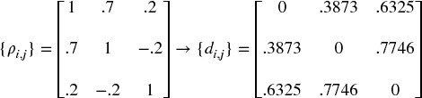

**示例 16.1 将相关矩阵** ***ρ*** **编码为距离矩阵** ***D***

其次，我们计算 *D* 中任意两个列向量之间的欧几里得距离， , 。注意距离度量 *d [*i*  ,  *j*] * 和  之间的区别。虽然 *d [*i*  ,  *j*] * 是在 *X* 的列向量上定义的， 是在 *D* 的列向量上定义的（距离的距离）。因此， 是在整个度量空间 *D* 上定义的距离，因为每个  是整个相关矩阵的函数（而不是特定的互相关对）。参见示例 16.2。

**示例 16.2 相关距离的欧几里得距离**

第三，我们将满足  的列对 ( *i* *, *j* *) 聚在一起，称这个聚类为 *u* [1]。参见示例 16.3。

**示例 16.3 聚类项目**

第四，我们需要定义新形成的聚类 *u* [1] 与单个（未聚类）项目之间的距离，以便可以更新 。在层次聚类分析中，这被称为“连结标准”。例如，我们可以将  中的一个项目 *i* 与新聚类 *u* [1] 之间的距离定义为 （最近点算法）。参见示例 16.4。

**示例 16.4 更新矩阵**  **与新聚类** ***u***

第五，矩阵  通过附加  并删除聚类的列和行 *j* ∈ *u* [1] 进行更新。参见示例 16.5。

**示例 16.5 更新矩阵**  **与新聚类** ***u***

第六，递归应用步骤 3、4 和 5，使我们能够将 *N* − 1 个这样的聚类附加到矩阵 *D*，此时最终聚类包含所有原始项目，聚类算法停止。参见示例 16.6。

**示例 16.6 搜索剩余聚类的递归**

图 16.3 显示了此示例中每次迭代形成的聚类，以及触发每个聚类的距离 （第三步）。该过程可以应用于广泛的距离度量 *d [*i*  ,  *j*] * ， 和 ，超出了本章所示的那些。请参见 Rokach 和 Maimon [2005] 的替代度量，Brualdi [2010] 中关于 Fiedler 向量和 Stewart 光谱聚类方法的讨论，以及 scipy 库中的算法。^(  2  ) 片段 16.1 提供了一个使用 scipy 功能的树聚类示例。

**图 16.3** 聚类形成的序列

从我们的数值示例中派生出的树结构，这里绘制为树状图。y 轴测量合并的两个叶子之间的距离。

> **片段 16.1 使用 SCIPY 功能的树聚类**
> 
> 

这个阶段允许我们定义一个链接矩阵，作为一个 ( *N* − 1) *x* 4 矩阵，结构为 *Y* = {( *y [*m* , 1]* , *y [*m* , 2]* , *y [*m* , 3]* , *y [*m* , 4]* )} [*m* = 1, …, *N* − 1]（即，每个聚类一个 4 元组）。项目 ( *y [*m* , 1]* , *y [*m* , 2]* ) 报告构成。项目 *y [*m* , 3]* 报告 *y [*m* , 1]* 和 *y [*m* , 2]* 之间的距离，即 。项目 *y [*m* , 4]* ≤ *N* 报告聚类 *m* 中包含的原始项目数量。

**16.4.2 准对角化**

这个阶段重新组织协方差矩阵的行和列，使得最大值位于对角线上。这种协方差矩阵的准对角化（不需要更改基）呈现出一个有用的特性：相似的投资被放在一起，不相似的投资则远离（见图 16.5 和 16.6 的例子）。算法工作如下：我们知道链接矩阵的每一行将两个分支合并为一个。我们递归地用其构成替换 ( *y [*N* − 1, 1]* , *y [*N* − 1, 2]* ) 中的聚类，直到没有聚类为止。这些替换保持聚类的顺序。输出是原始（未聚类）项目的排序列表。此逻辑在片段 16.2 中实现。

> **片段 16.2 准对角化**
> 
> 

**16.4.3 递归二分法**

第 2 阶段交付了一个准对角矩阵。逆方差分配对于对角协方差矩阵是最优的（见附录 16.A.2 的证明）。我们可以通过两种不同方式利用这些事实：（1）自下而上，定义一个连续子集的方差为逆方差分配的方差；或（2）自上而下，在与它们的聚合方差成反比的情况下，分割相邻子集之间的分配。以下算法形式化了这个想法：

1.  算法初始化为：

    1.  设置项目列表：*L* = {*L [0]*}，其中 *L [0]* = {*n*} [*n* = 1, …, *N*]。

    1.  对所有项目分配单位权重：*w [*n*]* = 1，∀*n* = 1, …, *N*。

1.  如果 |*L [*i*]*| = 1，∀*L [*i*]* ∈ *L*，则停止。

1.  对于每个 *L [*i*]* ∈ *L*，当 |*L [*i*]*| > 1 时：

    1.  将 *L [*i*]* 二分为两个子集，*L ^((1)) [*i*]* ∪*L [*i*] ^((2))* = *L [*i*]*，其中 ，并且顺序保持不变。

    1.  定义 *L ^((*j*)) [*i*]* 的方差，*j* = 1, 2，作为二次形式 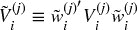，其中 *V ^((*j*)) [*i*]* 是 *L ^((*j*)) [*i*]* 二分的组成部分之间的协方差矩阵，和 ，其中 diag[.] 和 tr[.] 是对角线和迹运算符。

    1.  计算拆分因子：，以使 0 ≤ α [*i*] ≤ 1。

    1.  通过 α [*i*] 的因子重新缩放分配 *w [*n*]*，∀*n* ∈ *L ^((1)) [*i*]*。

    1.  通过 (1 − α [*i*]) 的因子重新缩放分配 *w [*n*]*，∀*n* ∈ *L ^((2)) [*i*]*。

1.  循环到步骤 2

步骤 3b 利用自下而上的准对角化，因为它使用逆方差加权定义分区 *L ^((*j*)) [*i*]* 的方差！。步骤 3c 利用自上而下的准对角化，因为它按与集群方差的反比例分割权重。该算法确保 0 ≤ *w [*i*]* ≤ 1，∀ *i* = 1, …, *N*，并且 ，因为在每次迭代中，我们都在分割来自更高层次的权重。在此阶段，可以通过根据用户偏好替换步骤 3c、3d 和 3e 中的方程轻松引入约束。阶段 3 在代码片段 16.3 中实现。

> **代码片段 16.3 递归二分**
> 
> 

这结束了 HRP 算法的第一次描述，该算法在最佳情况下以确定性对数时间解决分配问题，！，在最坏情况下以确定性线性时间解决，！。接下来，我们将实践所学，并评估该方法的样本外准确性。

**16.5 数值示例**

我们首先模拟一个观测矩阵 *X*，维度为 (10000 *x* 10)。相关矩阵在 图 16.4 中以热图形式可视化。图 16.5 显示了结果集群的树状图（阶段 1）。图 16.6 显示了同一相关矩阵，按识别的集群重新组织成块（阶段 2）。附录 16.A.3 提供了用于生成此数值示例的代码。

**图 16.4** 原始协方差矩阵的热图

此相关矩阵是使用代码片段 16.4 中的函数 `generateData` 计算的（见第 16.A.3 节）。最后五列与前五列的某些系列部分相关。

**图 16.5** 聚类形成的树状图

聚类过程正确识别了序列 9 和 10 是序列 2 的扰动，因此（9, 2, 10）被聚集在一起。同样，7 是 1 的扰动，6 是 3 的扰动，而 8 是 5 的扰动。唯一没有扰动的原始项目是 4，而聚类算法未能找到与之相似的项。

**图 16.6** 聚类协方差矩阵

第 2 阶段准对角化了相关矩阵，意义在于最大值沿对角线分布。然而，与 PCA 或类似程序不同，HRP 不需要基变换。HRP 以稳健的方式解决分配问题，同时处理原始投资。

在这些随机数据上，我们计算 HRP 的分配（第 3 阶段），并将其与两种竞争方法的分配进行比较：（1）二次优化，由 CLA 的最小方差投资组合表示（这是有效前沿中唯一不依赖于收益均值的投资组合）；（2）传统风险平价，以逆方差投资组合（IVP）为例。有关 CLA 的全面实现，请参见 Bailey 和 López de Prado [2013]，关于 IVP 的推导请参见附录 16.A.2。我们应用标准约束条件 0 ≤ *w [*i*]* ≤ 1（非负性），∀ *i* = 1, …, *N*，以及 （完全投资）。顺便提一下，这个例子中协方差矩阵的条件数仅为 150.9324，算不上特别高，因此对 CLA 并不不利。

从 表 16.1 的分配中，我们可以欣赏到一些典型特征：首先，CLA 将 92.66% 的分配集中在前五个持有资产上，而 HRP 仅集中 62.57%。其次，CLA 对 3 项投资分配零权重（如果没有 0 ≤ *w [*i*]* 的约束，分配将是负数）。第三，HRP 似乎在 CLA 集中解决方案和传统风险平价的 IVP 分配之间找到了一种折衷。读者可以使用附录 16.A.3 中的代码来验证这些发现通常适用于其他随机协方差矩阵。

**表 16.1** **三种分配的比较**

| **权重 #** | **CLA** | **HRP** | **IVP** |
| --- | --- | --- | --- |
| 1 | 14.44% | 7.00% | 10.36% |
| 2 | 19.93% | 7.59% | 10.28% |
| 3 | 19.73% | 10.84% | 10.36% |
| 4 | 19.87% | 19.03% | 10.25% |
| 5 | 18.68% | 9.72% | 10.31% |
| 6 | 0.00% | 10.19% | 9.74% |
| 7 | 5.86% | 6.62% | 9.80% |
| 8 | 1.49% | 9.10% | 9.65% |
| 9 | 0.00% | 7.12% | 9.64% |
| 10 | 0.00% | 12.79% | 9.61% |

三种方法的一个特征结果是：CLA 将权重集中于少数投资，因此容易受到特有冲击的影响。IVP 则将权重均匀分配到所有投资中，忽略了相关性结构，这使其容易受到系统性冲击的影响。HRP 在所有投资之间分散与在聚类之间分散之间找到了折衷，从而使其对这两种冲击更具韧性。

CLA 极端集中化的驱动因素是其最小化投资组合风险的目标。然而，这两个投资组合的标准差非常相似（σ [*HRP*] = 0.4640, σ [*CLA*] = 0.4486）。因此，CLA 放弃了一半的投资范围，以换取较小的风险降低。当然，现实是 CLA 的投资组合在表面上看似分散，因为任何影响前五个配置的危机情况将对 CLA 的影响远大于对 HRP 的投资组合。

**16.6 样本外蒙特卡洛模拟**

在我们的数值示例中，CLA 的投资组合在样本内的风险低于 HRP。然而，样本内的最小方差投资组合不一定是样本外最小方差的投资组合。我们很容易选择一个特定的历史数据集，其中 HRP 的表现优于 CLA 和 IVP（参见 Bailey 和 López de Prado [2014]，并回忆我们在第十一章讨论的选择偏差）。相反，在这一部分我们遵循第十三章中解释的回测范式，通过蒙特卡洛方法评估 HRP 与 CLA 的最小方差和传统风险平价的 IVP 配置的样本外表现。这也将帮助我们理解哪些特征使一种方法优于其他方法，而不论个案反例。

首先，我们生成 10 系列随机高斯收益（520 个观察值，相当于 2 年的每日历史），均值为 0，标准差为 10%（任意）。真实价格经常出现跳跃（Merton [1976]），收益并非横截面独立，因此我们必须向生成的数据中添加随机冲击和随机相关性结构。其次，我们通过回顾 260 个观察值（相当于一年的每日历史）计算 HRP、CLA 和 IVP 投资组合。这些投资组合每 22 个观察值重新估算和再平衡一次（相当于每月一次）。第三，我们计算与这三种投资组合相关的样本外收益。这个过程重复 10,000 次。

所有样本外的平均投资组合收益基本为 0，符合预期。关键的差异来自样本外投资组合收益的方差：σ ² [*CLA*] = 0.1157，σ ² [*IVP*] = 0.0928，以及σ ² [*HRP*] = 0.0671 *.* 尽管 CLA 的目标是实现最低方差（这是其优化程序的目标），但其表现恰好在样本外显示出最高的方差，比 HRP 的方差高出 72.47%。这一实验发现与 De Miguel 等人[2009]的历史证据一致。换句话说，HRP 将使 CLA 策略的样本外夏普比率提高约 31.3%，这是相当显著的提升。假设协方差矩阵是对角线形式，可以为 IVP 带来一定的稳定性；然而，其方差仍比 HRP 高出 38.24%。这一样本外方差的降低对风险平价投资者至关重要，因为他们使用了大量杠杆。有关样本内与样本外表现的更广泛讨论，请参见 Bailey 等人[2014]。

HRP 在超越 Markowitz 的 CLA 和传统风险平价的 IVP 方面的数学证明相对复杂，超出了本章的范围。从直观上讲，我们可以这样理解上述实证结果：影响特定投资的冲击会惩罚 CLA 的集中性。涉及多个相关投资的冲击会惩罚 IVP 对相关结构的无知。HRP 通过在所有投资之间的多样化和在多个层次的投资集群之间的多样化之间找到妥协，从而更好地抵御共同和特异性冲击。图 16.7 绘制了 10,000 次运行中第一次分配的时间序列。

**图 16.7** (a) IVP 的分配时间序列。

在第一次和第二次再平衡之间，一项投资受到特异性冲击，导致其方差增加。IVP 的应对方式是减少对该投资的分配，并将以前的风险敞口分散到所有其他投资中。在第五次和第六次再平衡之间，两项投资受到共同冲击。IVP 的应对方式相同。因此，在七项未受影响的投资之间的分配随着时间的推移而增长，无论它们的相关性如何。

(b) HRP 的分配时间序列

HRP 对特异性冲击的响应是减少对受影响投资的分配，并利用减少的金额增加对未受影响的相关投资的分配。作为对共同冲击的回应，HRP 减少对受影响投资的分配，并增加对不相关投资（具有较低方差）的分配。

(c) CLA 的分配时间序列

CLA 配置对特定和共同冲击的反应是不可预测的。如果考虑了再平衡成本，CLA 的表现将会非常糟糕。

附录 16.A.4 提供了实现上述研究的 Python 代码。读者可以尝试不同的参数配置，并得出类似的结论。特别地，HRP 的样本外超越表现对于更大的投资范围变得更加显著，或者当添加更多冲击时，或者考虑更强的相关性结构，或考虑再平衡成本时。这些 CLA 再平衡每次都产生交易成本，随着时间的推移可能会累积成巨大的损失。

**16.7 进一步研究**

本章介绍的方法灵活、可扩展，并允许相同思想的多种变体。使用提供的代码，读者可以研究和评估哪些 HRP 配置最适合他们特定的问题。例如，在第一阶段，他们可以应用 *d [*i* , *j*]* 的替代定义， 和 ，或不同的聚类算法，如双聚类；在第三阶段，他们可以对  和 α 使用不同的函数，或替代配置约束。第三阶段不仅可以执行递归二分，还可以使用第一阶段的聚类进行自上而下的配置拆分。

将预测收益、Ledoit-Wolf 收缩和 Black-Litterman 风格的观点整合到这种层次化方法中相对简单。实际上，细心的读者可能已经意识到，HRP 在本质上是一种避免矩阵求逆的稳健程序，HRP 背后的相同理念可以用来替代许多著名的计量经济学回归方法，这些方法以其不稳定的输出而闻名（如 VAR 或 VECM）。图 16.8 显示了（a）聚类前的固定收益证券的大型相关性矩阵和（b）聚类后的相关性矩阵，包含超过 210 万个条目。传统的优化或计量经济学方法未能识别金融大数据的层次结构，使得数值不稳定性削弱了分析的优势，导致不可靠和有害的结果。

**图 16.8** 聚类前后的相关性矩阵

本章所述的方法可以应用于优化之外的问题。例如，对大型固定收益投资组合进行 PCA 分析也面临与 CLA 相同的缺陷。几十年前和几个世纪前开发的小数据技术（因子模型、回归分析、计量经济学）未能识别金融大数据的层次性质。

Kolanovic 等人[2017]进行了一项关于 HRP 的详细研究，得出结论：“HRP 提供了优越的风险调整收益。虽然 HRP 和 MV 投资组合都提供最高的回报，但 HRP 投资组合在波动性目标上表现得远远优于 MV 投资组合。我们还进行了模拟研究以确认我们的发现的稳健性，其中 HRP 始终在 MV 和其他基于风险的策略中表现优越[…] HRP 投资组合真正实现了多元化，具有更高数量的无相关敞口，并且权重和风险配置不那么极端。”

Raffinot[2017]得出结论：“实证结果表明，基于层次聚类的投资组合稳健、真正多元化，并且在风险调整表现上统计上优于常用的投资组合优化技术。”

**16.8 结论**

精确的分析解决方案可能表现得比近似的最大似然解决方案差得多。尽管在数学上是正确的，二次优化器通常，以及马科维茨的 CLA 特别，以其不稳定性、集中性和表现不佳而闻名，提供的解决方案通常不可靠。这些问题的根本原因在于二次优化器需要对协方差矩阵进行反演。马科维茨的诅咒是，投资之间相关性越高，对多元化投资组合的需求就越大，但该投资组合的估计误差也越大。

在这一章中，我们揭示了二次优化器不稳定性的一个主要来源：大小为*N*的矩阵与一幅完整图相连，包含条边。如此多的边连接图的节点，使得权重可以完全自由地重新平衡。这种缺乏层次结构意味着小的估计误差将导致完全不同的解决方案。HRP 用树结构替代协方差结构，实现了三个目标：（1）与传统的风险平价方法不同，它充分利用了协方差矩阵中包含的信息，（2）权重的稳定性得以恢复，以及（3）通过构建，解决方案变得直观。该算法在确定性对数（最佳情况）或线性（最坏情况）时间内收敛。

HRP 具有稳健性、可视化和灵活性，允许用户引入约束或操控树结构而不妨碍算法的搜索。这些属性源于 HRP 不要求协方差可逆的事实。实际上，HRP 可以在退化或甚至奇异的协方差矩阵上计算投资组合。

本章专注于组合构建应用；然而，读者会发现其他在不确定性下做决策的实际应用，特别是在几乎奇异的协方差矩阵存在时：对组合经理的资本分配、算法策略之间的分配、机器学习信号的集成和提升、随机森林的预测、对不稳定计量经济模型的替代（VAR, VECM）等。

当然，像 CLA 这样的二次优化器在样本内生成最小方差组合（这就是它的目标函数）。蒙特卡罗实验表明，HRP 在样本外的方差低于 CLA 或传统风险平价方法（IVP）。自从 Bridgewater 在 1990 年代首创风险平价以来，一些最大的资产管理公司推出了遵循这种方法的基金，合计资产超过 5000 亿美元。鉴于这些基金广泛使用杠杆，它们应该从采用更稳定的风险平价分配方法中受益，从而实现更优的风险调整回报和较低的再平衡成本。

**附录**

**16.A.1 基于相关性的度量**

考虑两个实值向量 *X* , *Y*，大小为 *T*，以及一个相关变量 ρ[ *x* , *y* ]，唯一要求是 σ[ *x* , *y* ] = ρ[ *x* , *y* ]σ[ *X* ]σ[ *Y* ]，其中 σ[ *x* , *y* ] 是两个向量之间的协方差，σ[.] 是标准差。请注意，皮尔逊相关不是唯一满足这些要求的相关性。

让我们证明  是一个真实的度量。首先，两个向量之间的欧几里得距离是 。其次，我们将这些向量进行 z 标准化，得到  , 。因此，0 ≤ ρ[ *x* , *y* ] = ρ[ *x* , *y* ]。第三，我们推导出欧几里得距离 *d* [ *x* , *y* ] 为，

换句话说，距离 *d* [ *x* , *y* ] 是经过 z 标准化后向量 { *X* , *Y* } 之间欧几里得距离的线性倍数，因此它继承了欧几里得距离的真度量特性。

同样，我们可以证明  在  /2  商上下降为真实度量。为此，我们重新定义 ，其中 sgn[.] 是符号运算符，因此 0 ≤ ρ[ *x* , *y* ] = |ρ[ *x* , *y* ]|。然后，

**16.A.2 反方差分配**

第 3 阶段（见第 16.4.3 节）根据子集的方差反比例划分权重。我们现在证明，当协方差矩阵是对角时，这种分配是最优的。考虑大小为 *N* 的标准二次优化问题，

解为 。对于特征向量 *a* = 1 [*N*]，解是最小方差组合。如果 *V* 是对角的，则 。在 *N* = 2 的特定情况下，，这就是第 3 阶段如何在子集的两个二分之间划分权重。

**16.A.3 复制数值示例**

Snippet 16.4 可用于复制我们的结果并模拟其他数值示例。函数 `generateData` 生成一个时间序列矩阵，其中数量为 `size0` 的向量是无相关的，数量为 `size1` 的向量是相关的。读者可以更改 `generateData` 中的 `np.random.seed` 来运行其他示例，从而直观了解 HRP 的工作原理。Scipy 的函数 `linkage` 可用于执行第一阶段（第 16.4.1 节），函数 `getQuasiDiag` 执行第二阶段（第 16.4.2 节），函数 `getRecBipart` 执行第三阶段（第 16.4.3 节）。

> **SNIPPET 16.4 HRP 算法的完整实现**
> 
>   

**16.A.4 复制蒙特卡洛实验**

Snippet 16.5 对三种分配方法进行蒙特卡洛实验：HRP、CLA 和 IVP。除 HRP 外，所有库都是标准库，HRP 的内容在附录 16.A.3 中提供，CLA 的内容可以在 Bailey 和 López de Prado [2013]中找到。子程序 `generateData` 模拟相关数据，具有两种类型的随机冲击：对多项投资共同的和对单项投资特有的。每种类型有两个冲击，一个正面和一个负面。实验变量作为`hrpMC`的参数设置。它们是任意选择的，用户可以尝试其他组合。

> **SNIPPET 16.5 蒙特卡洛实验的 HRP 样本外表现**
> 
>   

**练习**

1.  > > 给定 *N* 个投资策略的 PnL 序列：

    1.  将它们与其投注的平均频率对齐（例如，对于每周交易的策略进行每周观察）。提示：这种数据对齐有时称为“下采样”。

    1.  计算它们收益的协方差 *V*。

    1.  确定 *N* 个策略之间的层次聚类。

    1.  绘制 *N* 个策略的聚类相关矩阵。

1.  > > 使用练习 1 中的聚类协方差矩阵 *V*：

    1.  计算 HRP 分配。

    1.  计算 CLA 分配。

    1.  计算 IVP 分配。

1.  > > 使用练习 1 中的协方差矩阵 *V*：

    1.  执行光谱分解：*VW* = *W* Λ。

    1.  通过从 *U* [0, 1] 分布中抽取 *N* 个随机数来形成数组 ϵ。

    1.  形成一个 *NxN* 矩阵  , 其中  , *n* = 1, …, *N* 。

    1.  计算  。

    1.  重复练习 2，这次使用  作为协方差矩阵。哪个分配方法受到光谱方差重缩放的影响最大？

1.  > > 你会如何修改 HRP 算法，以产生总和为 0 的分配，其中 | *w [*n*]* | ≤ 1, ∀ *n* = 1, …, *N* ?
1.  > > 
1.  > > 你能想到一种简单的方法将预期收益纳入 HRP 分配中吗？

**参考文献**

1.  Bailey, D. 和 M. López de Prado (2012)： “平衡篮子：一种交易和对冲风险的新方法。” *投资策略杂志* ，第 1 卷，第 4 期，页 21–62。可在 [`ssrn.com/abstract=2066170`](http://ssrn.com/abstract=2066170) 查阅。

1.  Bailey, D. 和 M. López de Prado (2013)： “投资组合优化的关键线算法的开源实现。” *算法* ，第 6 卷，第 1 期，页 169–196。可在 [`ssrn.com/abstract=2197616`](http://ssrn.com/abstract=2197616) 查阅。

1.  Bailey, D., J. Borwein, M. López de Prado 和 J. Zhu (2014) “伪数学和金融江湖术士：回测过拟合对样本外表现的影响。” *美国数学学会通告* ，第 61 卷，第 5 期，页 458–471。可在 [`ssrn.com/abstract=2308659`](http://ssrn.com/abstract=2308659) 查阅。

1.  Bailey, D. 和 M. López de Prado (2014)： “调整夏普比率：修正选择偏差、回测过拟合和非正态性。” *投资组合管理杂志* ，第 40 卷，第 5 期，页 94–107。

1.  Black, F. 和 R. Litterman (1992)： “全球投资组合优化。” *金融分析师杂志* ，第 48 卷，页 28–43。

1.  Brualdi, R. (2010)： “图形与矩阵的互利关系。” 数学科学会议委员会，数学区域会议系列，第 115 号。

1.  Calkin, N. 和 M. López de Prado (2014)： “随机流图。” *算法金融* ，第 3 卷，第 1 期，页 21–42。可在 [`ssrn.com/abstract=2379314`](http://ssrn.com/abstract=2379314) 查阅。

1.  Calkin, N. 和 M. López de Prado (2014)： “宏观金融流的拓扑：随机流图的应用。” *算法金融* ，第 3 卷，第 1 期，页 43–85。可在 [`ssrn.com/abstract=2379319`](http://ssrn.com/abstract=2379319) 查阅。

1.  Clarke, R., H. De Silva 和 S. Thorley (2002)： “投资组合约束与主动管理的基本法则。” *金融分析师杂志* ，第 58 卷，页 48–66。

1.  De Miguel, V., L. Garlappi 和 R. Uppal (2009)： “最优与天真多样化：1/N 投资组合策略有多低效？” *金融研究回顾* ，第 22 卷，页 1915–1953。

1.  Jurczenko, E. (2015)： *基于风险和因子的投资* ，第 1 版。爱思唯尔科学出版社。

1.  Kolanovic, M., A. Lau, T. Lee, 和 R. Krishnamachari (2017)： “可交易风险溢价指数的跨资产投资组合。分层风险均衡：在目标波动率下提升收益。” 白皮书，全球量化与衍生品策略。摩根大通，4 月 26 日。

1.  Kolm, P., R. Tutuncu 和 F. Fabozzi (2014)： “投资组合优化的 60 年。” *欧洲运筹学杂志* ，第 234 卷，第 2 期，页 356–371。

1.  Kuhn, H. W. 和 A. W. Tucker (1951)： “非线性规划。” 第二届伯克利研讨会论文集。加州大学出版社，页 481–492。

1.  Markowitz, H. (1952)： “投资组合选择。” *金融杂志* ，第 7 卷，页 77–91。

1.  Merton, R. (1976)： “当基础股票收益不连续时的期权定价。” *金融经济学杂志*，第 3 卷，页码 125–144。

1.  Michaud, R. (1998)：*有效资产配置：股票投资组合优化与资产配置的实用指南*，第 1 版。哈佛商学院出版社。

1.  Ledoit, O. 和 M. Wolf (2003)： “通过应用于投资组合选择的改进股票收益协方差矩阵估计。” *实证金融杂志*，第 10 卷，第 5 期，页码 603–621。

1.  Raffinot, T. (2017)： “基于层次聚类的资产配置。” *投资组合管理杂志*，即将出版。

1.  Rokach, L. 和 O. Maimon (2005)： “聚类方法，” 见 Rokach, L. 和 O. Maimon 编，*数据挖掘与知识发现手册*。施普林格，页码 321–352。

**笔记**

^(1)    本章的简短版本出现在*投资组合管理杂志*，第 42 卷，第 4 期，页码 59–69，2016 年夏季。

^(2)    有关其他指标，请参见：

+   [`docs.scipy.org/doc/scipy/reference/generated/scipy.spatial.distance.pdist.html`](http://docs.scipy.org/doc/scipy/reference/generated/scipy.spatial.distance.pdist.html)

+   [`docs.scipy.org/doc/scipy-0.16.0/reference/generated/scipy.cluster.hierarchy.linkage.html`](http://docs.scipy.org/doc/scipy-0.16.0/reference/generated/scipy.cluster.hierarchy.linkage.html)

**第四部分**

**有用的金融特征**

1.  第十七章 结构性突破

1.  第十八章 熵特征

1.  第十九章 微观结构特征

**第十七章**

**结构性突破**

**17.1 动机**

在制定基于机器学习的投资策略时，我们通常希望在多个因素汇聚、其预测结果提供有利的风险调整收益时进行投资。结构性突破，例如从一个市场状态转变为另一个市场状态，就是这样一种特别值得关注的汇聚实例。例如，均值回归模式可能会转变为动量模式。在这种转变发生时，大多数市场参与者会感到措手不及，并会犯下代价高昂的错误。这类错误是许多盈利策略的基础，因为处于失败一方的参与者通常在为时已晚时才意识到自己的错误。在他们接受损失之前，往往会表现出非理性行为，试图持有头寸，并希望市场反弹。有时，他们甚至会因绝望而增加亏损头寸。最终，他们会被迫止损或平仓。结构性突破提供了一些最佳的风险/回报。在本章中，我们将回顾一些测量结构性突破可能性的方法，以便基于这些方法构建有用的特征。

**17.2 结构性突破测试的类型**

我们可以将结构性突破测试分为两个一般类别：

+   **CUSUM 测试：** 这些测试评估累积预测误差是否显著偏离白噪声。

+   **爆炸性测试：** 除了偏离白噪声之外，这些测试还评估过程是否表现出指数增长或崩溃，因为这与随机游走或平稳过程不一致，且在长期内是不可持续的。

    +   **右尾单位根测试：** 这些测试评估指数增长或崩溃的存在，同时假设自回归规范。

    +   **次/超马丁戈尔测试：** 这些测试在各种函数形式下评估指数增长或崩溃的存在。

**17.3 CUSUM 测试**

在第二章中，我们介绍了 CUSUM 滤波器，并将其应用于基于事件的柱状图采样。其想法是每当某个变量（如累积预测误差）超过预定义阈值时，就采样一个柱状图。这个概念可以进一步扩展到结构性断裂的测试。

**17.3.1 布朗-达宾-埃文斯递归残差 CUSUM 测试**

该测试由布朗、达宾和埃文斯 [1975] 提出。假设在每个观察值*t* = 1, …, *T*下，我们使用特征数组*x [*t*]*来预测值*y [*t*]*。矩阵*X [*t*]*由特征时间序列组成*t* ≤ *T*，{ *x [*i*]* } [*i* = 1, …, *t*]。这些作者建议我们根据以下规范计算递归最小二乘（RLS）估计的β。

该值在子样本上拟合（[1, *k* + 1]，[1, *k* + 2]，…，[1, *T*]），给出*T* − *k*的最小二乘估计！。我们可以计算标准化的 1 步前递归残差为

CUSUM 统计量定义为

在假设β是某个常数值的情况下，*H [0]* : β [*t*] = β，则*S [*t*]* ∼ *N* [0, *t* − *k* − 1]。该程序的一个警告是起始点是任意选择的，结果可能由于此而不一致。

**17.3.2 朱-斯廷科姆-怀特水平 CUSUM 测试**

该测试遵循 Homm 和 Breitung [2012]。它通过去掉{ *x [*t*]* } [*t* = 1, …, *T*]，简化了之前的方法，并假设*H [0]* : β [*t*] = 0，即我们预测没有变化（E [*t* − 1] [Δ *y [*t*]* ] = 0）。这将使我们能够直接处理*y [*t*]*的水平，从而减轻计算负担。我们计算相对于*y [*n*]*的对数价格*y [*t*]*的标准化偏离，*t* > *n*，为

在原假设*H [0]* : β [*t*] = 0 下，*S [*n* , *t*]* ∼ *N* [0, 1]。一侧检验的时间相关临界值为

这些作者通过蒙特卡洛法得出 *b [0.05]* = 4.6。该方法的一个缺点是参考水平 *y [*n*]* 的设定有些任意。为克服这个缺陷，我们可以在一系列向后移动的窗口 *n* ∈ [1, *t*] 上估计 *S [*n* , *t*]*，并选择 。

**17.4 爆炸性测试**

爆炸性测试通常可以分为测试单一泡沫和测试多个泡沫的测试。在这种情况下，泡沫不仅限于价格上涨，还包括抛售。允许多个泡沫的测试更为稳健，因为泡沫-破裂-泡沫的周期会使单一泡沫测试的系列看起来是平稳的。Maddala 和 Kim [1998]，以及 Breitung [2014] 提供了文献的良好概述。

**17.4.1 周-类型迪基-福勒检验**

一系列爆炸性测试的灵感来源于 Gregory Chow 的研究，从 Chow [1960] 开始。考虑一阶自回归过程

其中 ϵ [*t*] 是白噪声。零假设是 *y [*t*]* 遵循随机游走，*H [0]* : ρ = 1，备择假设是 *y [*t*]* 最初作为随机游走，但在时刻 τ* *T* 发生变化，其中 τ* ∈ (0, 1)，变为爆炸过程：

在时刻 *T* 我们可以检验是否在时刻 τ* *T*（断裂日期）发生了从随机游走到爆炸过程的转换。为了检验这个假设，我们拟合以下模型，

其中 *D [*t*]* [τ*] 是一个虚拟变量，当 *t* < τ* *T* 时取值为零，当 *t* ≥ τ* *T* 时取值为一。然后，零假设 *H [0]* : δ = 0 与（单侧）备择假设 *H [1]* : δ > 1 进行检验：

此方法的主要缺点是 τ* 是未知的。为了解决这个问题，Andrews [1993] 提出了一个新的检验方法，其中在某个区间 τ* ∈ [τ [0] , 1 − τ [0] ] 内尝试所有可能的 τ*。正如 Breitung [2014] 所解释的，我们应该在样本的开始和结束处排除一些可能的 τ*，以确保任一状态都有足够的观测值（*D [*t*]* [τ*] 中必须有足够的零和足够的一）。未知 τ* 的检验统计量是所有 *T* (1 − 2τ [0] ) 值的最大值！。

Chow 方法的另一个缺点是它假设只有一个断裂日期 τ* *T*，并且泡沫一直持续到样本结束（没有回到随机游走）。对于存在三种或更多状态（随机游走 → 泡沫 → 随机游走……）的情况，我们需要讨论极大增强的迪基-福勒（SADF）检验。

**17.4.2 极大增强的迪基-福勒检验**

正如 Phillips、Wu 和 Yu [2011] 所说：“标准单位根和协整检验不适合检测泡沫行为，因为它们无法有效区分平稳过程和周期性崩溃的泡沫模型。数据中周期性崩溃泡沫的模式看起来更像是来自单位根或平稳自回归生成的数据，而不是潜在的爆炸性过程。”为了解决这个缺陷，这些作者提出拟合回归规范

这里我们检验 *H [0]* : β ≤ 0, *H [1]* : β > 0。受 Andrews [1993] 的启发，Phillips 和 Yu [2011] 以及 Phillips、Wu 和 Yu [2011] 提出了极大值增强迪基-福勒检验（SADF）。SADF 在每个结束点 *t* 上使用向后扩展的起始点拟合上述回归，然后计算

其中  是在从 *t [0]* 开始并在 *t* 结束的样本上估计的，τ 是分析中使用的最小样本长度，*t [0]* 是向后扩展窗口的左边界，而 *t* = τ，…，*T* 。在 *SADF [*t*]* 的估计中，窗口的右侧固定在 *t*。标准 ADF 检验是 *SADF [*t*]* 的特例，其中 τ = *t* − 1。

*SADF [*t*]* 和 SDFC 之间有两个关键区别：首先，*SADF [*t*]* 在每个 *t* ∈ [τ, *T* ] 处计算，而 SDFC 仅在 *T* 处计算。其次，SADF 通过递归扩展样本的开始（*t [0]* ∈ [1, *t* − τ]）而不是引入虚拟变量。通过在（*t [0]*，*t*）上尝试所有组合的嵌套双重循环，SADF 不假设已知的 regime 切换或断点数量。图 17.1 显示了在应用 ETF 技巧（第二章，第 2.4.1 节）后的 E-mini S&P 500 期货价格系列，以及由该价格系列得出的 SADF。SADF 曲线在价格出现泡沫行为时激增，并在泡沫破裂时回落至低水平。在接下来的部分中，我们将讨论对 Phillips 原始 SADF 方法的一些增强。

**图 17.1** 价格（左侧 y 轴）和 SADF（右侧 y 轴）随时间变化

***17.4.2.1 原始价格与对数价格***

在文献中常见的研究会对原始价格进行结构性断裂检验。在这一节中，我们将探讨为什么应优先使用对数价格，特别是在处理涉及泡沫和崩溃的长期时间序列时。

对于原始价格 { *y [*t*]* }，如果拒绝 ADF 的原假设，这意味着价格是平稳的，具有有限的方差。这意味着收益  并不是时间不变的，因为收益的波动性必须随着价格上涨而降低，随着价格下跌而增加，以保持价格方差恒定。当我们对原始价格进行 ADF 检验时，我们假设收益的方差并不对价格水平不变。如果收益方差恰好对价格水平不变，该模型将结构性异方差。

相比之下，如果我们使用对数价格，ADF 规格将指出

让我们进行变量替换，*x [*t*]* = *ky [*t*]*。现在，log[ *x [*t*]* ] = log[ *k* ] + log[ *y [*t*]* ]，ADF 规格将指出

在这个基于对数价格的替代规格下，价格水平决定了收益的均值，而不是收益的波动性。在小样本中，*k* ≈ 1 时，差异可能在实践中并不重要，但 SADF 在跨十年和泡沫中进行回归时，产生的水平在不同状态下是显著不同的（*k* ≠ 1）。

***17.4.2.2 计算复杂性***

算法运行在 ，因为 SADF 所需的总样本长度 *T* 的 ADF 测试数量是

考虑 ADF 规格的矩阵表示，其中  和 。解决单个 ADF 回归涉及到的浮点运算（FLOPs）如 表 17.1 中列出。

**表 17.1** **每个 ADF 估计的 FLOPs**

| **矩阵运算** | **FLOPs** |
| --- | --- |
| *o [1]* = *X* '*y* | (2*T* − 1)*N* |
| *o [2]* = *X* '*X* | (2*T* − 1)*N ²* |
| *o [3]* = *o ^(− 1) [2]* | *N ³* + *N ²* + *N* |
| *o [4]* = *o [3] o [1]* | 2*N ²* − *N* |
| *o [5]* = *y* − *Xo [4]* | *T* + (2*N* − 1)*T* |
| *o [6]* = *o ^' [5] o [5]* | 2*T* − 1 |
|  | 2 + *N ²* |
|  | 1 |

这给出了每个 ADF 估计的总 *f* ( *N* , *T* ) = *N ³* + *N ²* (2 *T* + 3) + *N* (4 *T* − 1) + 2 *T* + 2 FLOPs。单个 SADF 更新需要  FLOPs（*T* − τ 次运算以找到最大 ADF 统计量），而估计完整的 SADF 序列需要 。

考虑 E-mini S&P 500 期货上的美元条形系列。对于(*T*, *N*) = (356631, 3)，ADF 估计需要 11,412,245 FLOPs，而 SADF 更新需要 2,034,979,648,799 次操作（大约 2.035 TFLOPs）。完整的 SADF 时间序列需要 241,910,974,617,448,672 次操作（大约 242 PFLOPs）。随着*T*的持续增长，这个数字将迅速增加。而且这个估计不包括对齐、数据预处理、I/O 作业等著名的昂贵操作。毫无疑问，这个算法的双重循环需要大量操作。可能需要一个高性能计算集群来在合理时间内估计 SADF 系列。第二十章将介绍一些在这些情况下有用的并行化策略。

***17.4.2.3 指数行为的条件***

考虑对数价格的零滞后规范，Δlog[*y [*t*]*] = α + βlog[*y [*t* − 1]*] + ϵ[*t*]。这可以重写为，其中。回滚*t*个离散步骤，我们得到，或。索引*t*可以在给定时间重置，以预测在接下来的*t*步骤后*y [0]* → *y [*t*]*的未来轨迹。这揭示了表征该动态系统三种状态的条件：

+   稳定：。

    +   不均衡是。

    +   然后在（半衰期）。

+   单根：β = 0，其中系统是非平稳的，表现为一个鞅。

+   爆炸性：β > 0，其中。

***17.4.2.4 分位数 ADF***

SADF 在 t 值系列中取上确界，。选择极值会引入一些鲁棒性问题，其中 SADF 估计可能会根据采样频率和样本的具体时间戳显著变化。ADF 极值的更鲁棒的估计量如下：首先，设定。其次，我们定义*Q [*t* , *q*]* = *Q* [*s [*t*]* , *q*]，作为高 ADF 值的集中性度量，其中*q* ∈ [0, 1]。第三，我们定义，其中 0 < *v* ≤ min{*q*, 1 − *q*}，作为高 ADF 值的离散度量。例如，我们可以设置*q* = 0.95 和*v* = 0.025。请注意，SADF 只是 QADF 的一个特例，其中*SADF [*t*]* = *Q [*t* , 1]*，并且未定义，因为*q* = 1。

***17.4.2.5 条件 ADF***

或者，我们可以通过计算条件矩来解决对 SADF 稳健性的担忧。设 *f* [ *x* ] 为  的概率分布函数，*x* ∈ *s [*t*]*。然后，我们定义 *C [*t*  ,  *q*] * = *K ^(− 1) * ∫ ^∞ [   *Qt*  ,  *q*   ]  *xf* [ *x* ] *dx* 作为高 ADF 值的中心度量， 作为高 ADF 值的离散度量，正则化常数为 。例如，我们可以使用 *q* = 0.95。

由构造得出，*C [*t* , *q*]* ≤ *SADF [*t*]*。*SADF [*t*]* 与 *C [*t* , *q*]* 的散点图显示了下边界，呈现为一条大约单位梯度的上升线（见 图 17.2）。当 SADF 超过 -1.5 时，我们可以看到一些水平轨迹，这与 *s [*t*]* 的右侧肥尾突然扩展一致。换句话说， 即使 *C [*t* , *q*]* 相对较小，也可以达到显著大的值，因为 *SADF [*t*]* 对离群值敏感。

**图 17.2** SADF (x 轴) 对比 CADF (y 轴)

图 17.3 (a) 绘制了随时间变化的 E-mini S&P 500 期货价格的 。 图 17.3 (b) 是  与 *SADF [*t*] * 的散点图，基于 E-mini S&P 500 期货价格计算。它显示了 *s [*t*] * 中的离群值向上偏倚 *SADF [*t*] * 的证据。

**图 17.3** (a)  随时间变化 (b)  (y 轴) 作为 *SADF [*t*] * (x 轴) 的函数

***17.4.2.6 SADF 实现***

本节介绍 SADF 算法的实现。此代码的目的是阐明估算 SADF 的步骤，而不是快速估算 SADF。代码片段 17.1 列出了 SADF 的内部循环。这部分估算 ，这是算法的回移成分。外部循环（此处未显示）对逐步的 *t* 重复此计算，{ *SADF [*t*] * } [*t*  = 1, …,  *T*]。参数为：

+   `logP` : 包含对数价格的 pandas 系列

+   `minSL` : 最小样本长度 (τ)，用于最终回归

+   `constant` : 回归的时间趋势成分

    +   `'nc'` : 没有时间趋势，仅有一个常数

    +   `'ct'` : 一个常数加上线性时间趋势

    +   `'ctt'` : 一个常数加上二次多项式时间趋势

+   `lags` : ADF 规范中使用的滞后数

> **代码片段 17.1 SADF 的内部循环**
> 
> 

代码片段 17.2 列出了函数 `getXY`，该函数准备进行递归测试所需的 numpy 对象。

> **代码片段 17.2 准备数据集**
> 
> 

代码片段 17.3 列出了函数 `lagDF`，它将滞后应用于指定的参数 `lags` 的数据框。

> **代码片段 17.3 将滞后应用于数据框**
> 
> 

最后，片段 17.4 列出了函数`getBetas`，它执行实际的回归。

> **片段 17.4 拟合 ADF 规范**
> 
> 

**17.4.3 次级和超级马尔可夫链测试**

在本节中，我们将介绍不依赖于标准 ADF 规范的爆炸性测试。考虑一个过程，它要么是次马尔可夫链，要么是超级马尔可夫链。给定一些观测值{ *y [*t*]* }，我们希望测试是否存在爆炸性时间趋势，*H [0]* : β = 0，*H [1]* : β ≠ 0，在其他规范下：

+   多项式趋势（SM-Poly1）：

    > > 

+   多项式趋势（SM-Poly2）：

    > > 

+   指数趋势（SM-Exp）：

    > > 

+   势能趋势（SM-Power）：

    > > 

类似于 SADF，我们对每个结束点*t* = τ, …, *T*进行向后扩展的起始点拟合，然后计算

绝对值的原因在于我们同样关注爆炸性增长和崩溃。在简单回归情况下（Greene [2008], p. 48），β的方差是，因此。相同的结果可以推广到多元线性回归情况（Greene [2008], pp. 51–52）。弱长期泡沫的可能小于强短期泡沫的，从而使该方法偏向长期泡沫。为了纠正这种偏差，我们可以通过确定系数φ ∈ [0, 1]来惩罚较大的样本长度，从而产生最佳的爆炸性信号。

例如，当φ = 0.5 时，我们在简单回归情况下补偿与较长样本长度相关的较低。当φ → 0 时，*SMT [*t*]*将显示更长的趋势，因为这种补偿减弱，长期泡沫掩盖短期泡沫。当φ → 1 时，*SMT [*t*]*变得更加嘈杂，因为更多的短期泡沫被选中而不是长期泡沫。因此，这是一种自然的方法来调整爆炸性信号，使其过滤针对特定持有期的机会。机器学习算法使用的特征可能包括从广泛的φ值估算的*SMT [*t*]*。

**练习**

1.  > > 在 E-mini S&P 500 期货的美元条形系列中，

    1.  应用布朗-达宾-埃文斯方法。它能识别网络泡沫吗？

    1.  应用 Chu-Stinchcombe-White 方法。它能找到 2007-2008 年的泡沫吗？

1.  > > 在 E-mini S&P 500 期货的美元条形系列中，

    1.  计算*SDFC*（周-类型）爆炸性测试。此方法选择了什么断裂日期？这是你所预期的吗？

    1.  计算并绘制此系列的 SADF 值。你是否观察到围绕网络泡沫和大衰退之前的极端峰值？这些爆发是否也导致了峰值？

1.  > > 继续练习 2，

    1.  确定系列显示的周期

        1.  稳定条件

        1.  单根条件

        1.  爆炸性条件

    1.  计算 QADF。

    1.  计算 CADF。

1.  > > 在 E-mini S&P 500 期货的美元条形系列中，

    1.  计算 SM-Poly1 和 SM-Poly 2 的 SMT，其中φ = 1。它们的相关性是什么？

    1.  计算 SM-Exp 的 SMT，其中φ = 1 和φ = 0.5。它们的相关性是什么？

    1.  计算 SM-Power 的 SMT，其中φ = 1 和φ = 0.5。它们的相关性是什么？

1.  > > 如果你计算每个价格的倒数，序列{ *y ^(− 1) [*t*]* }将泡沫转变为爆破，爆破转变为泡沫。

    1.  识别爆破是否需要这种转化？

    1.  本章中有哪些方法可以识别爆破而不需要这种转化？

**参考文献**

1.  Andrews, D. (1993): “具有未知变更点的参数不稳定性和结构变化的检验。” *计量经济学*，第 61 卷，第 4 期（7 月），页码 821–856。

1.  Breitung, J. 和 R. Kruse (2013): “当泡沫破裂时：基于结构断裂的计量经济学检验。” *统计论文*，第 54 卷，页码 911–930。

1.  Breitung, J. (2014): “投机泡沫的计量经济学检验。” *波恩经济学杂志*，第 3 卷，第 1 期，页码 113–127。

1.  Brown, R.L., J. Durbin, 和 J.M. Evans (1975): “检验回归关系在时间上的恒定性的技术。” *皇家统计学会杂志 B 系列*，第 35 卷，页码 149–192。

1.  Chow, G. (1960). “两个线性回归中系数集相等的检验。” *计量经济学*，第 28 卷，第 3 期，页码 591–605。

1.  Greene, W. (2008): *计量经济学分析*，第 6 版。培生普伦蒂斯霍尔。

1.  Homm, U. 和 J. Breitung (2012): “股市投机泡沫的检验：替代方法的比较。” *金融计量经济学杂志*，第 10 卷，第 1 期，198–231。

1.  Maddala, G. 和 I. Kim (1998): *单位根、协整与结构变化*，第一版。剑桥大学出版社。

1.  Phillips, P., Y. Wu, 和 J. Yu (2011): “1990 年代纳斯达克的爆炸性行为：何时过度乐观推动资产价值上升？” *国际经济评论*，第 52 卷，页码 201–226。

1.  Phillips, P. 和 J. Yu (2011): “在次贷危机期间对金融泡沫时间线的追溯。” *定量经济学*，第 2 卷，页码 455–491。

1.  Phillips, P., S. Shi, 和 J. Yu (2013): “多重泡沫的检验 1：S&P 500 的历史过度乐观与崩溃事件。” 工作论文 8–2013，新加坡管理大学。

**第十八章**

**熵特征**

**18.1 动机**

价格序列传达关于需求和供应力量的信息。在完美市场中，价格是不可预测的，因为每个观察都传递了关于产品或服务的所有已知信息。当市场不完美时，价格是基于部分信息形成的，由于一些参与者了解的信息比其他人更多，他们可以利用这种信息不对称。评估价格序列的信息内容，并形成特征以供机器学习算法学习可能的结果将是有益的。例如，机器学习算法可能发现，当价格传递的信息很少时，动量投资更有利可图，而当价格传递的信息很多时，均值回归投资更有利可图。在本章中，我们将探讨确定价格序列中包含的信息量的方法。

**18.2 香农熵**

在本节中，我们将回顾一些信息理论中的概念，这些概念在本章的其余部分将会有用。读者可以在 MacKay [2003] 中找到完整的阐述。信息理论之父克劳德·香农定义熵为由一个静态数据源产生的平均信息量（在长消息中）。它是描述消息所需的每个字符的最小比特数，以唯一可解码的方式表示。数学上，香农 [1948] 将离散随机变量 *X* 的熵定义为其可能值 *x* ∈ *A* 的

满足 0 ≤ *H* [ *X* ] ≤ log [2] [|| *A* ||]，其中：*p* [ *x* ] 是 *x* 的概率；*H* [ *X* ] = 0⇔∃ *x* | *p* [ *x* ] = 1； 对于所有 *x*；|| *A* || 是集合 *A* 的大小。这可以解释为在 *X* 中信息内容的概率加权平均值，其中信息的比特数被测量为 。将信息测量为  的原因在于观察到低概率结果所揭示的信息比高概率结果更多。换句话说，当意外发生时，我们会学习。类似地，冗余被定义为

满足 0 ≤ *R* [ *X* ] ≤ 1。科尔莫哥洛夫 [1965] 形式化了冗余与马尔可夫信息源复杂性之间的联系。两个变量之间的互信息被定义为从联合概率密度到边际概率密度乘积的库尔贝克-莱布勒发散。

互信息（MI）总是非负的，对称的，并且当且仅当 *X* 和 *Y* 独立时等于零。对于正态分布的变量，互信息与熟悉的皮尔逊相关性 ρ 密切相关。

因此，互信息是变量之间关联的自然度量，无论它们是线性还是非线性的（Hausser 和 Strimmer [2009]）。信息的标准化变异是从互信息派生的度量。有关多个熵估计器的信息，请参见：

+   在 R 中：[`cran.r-project.org/web/packages/entropy/entropy.pdf`](http://cran.r-project.org/web/packages/entropy/entropy.pdf)

+   在 Python 中：[`code.google.com/archive/p/pyentropy/`](https://code.google.com/archive/p/pyentropy/)

**18.3 插值（或最大似然）估计器**

在本节中，我们将按照 Gao 等人 [2008] 对熵最大似然估计器的阐述进行讨论。术语可能一开始显得有些奇怪（无意中的双关），但一旦你熟悉它，就会发现它很方便。给定数据序列 *x ^(*n*) [1]*，包括从位置 1 开始到位置 *n* 结束的值串，我们可以在该序列中形成所有长度为 *w* < *n* 的单词字典 *A ^(*w*)*。考虑一个任意单词 *y ^(*w*) [1]* ∈ *A ^(*w*)*，其长度为 *w*。我们用  表示单词 *y ^(*w*) [1]* 在 *x ^(*n*) [1]* 中的经验概率，这意味着  是 *y ^(*w*) [1]* 在 *x ^(*n*) [1]* 中出现的频率。假设数据是由一个平稳且遍历的过程生成的，那么大数法则保证，对于固定的 *w* 和较大的 *n*，经验分布  将接近真实分布 *p [*w*]*。在这种情况下，熵率（即每位的平均熵）的自然估计器是

由于经验分布也是对真实分布的最大似然估计，因此这通常被称为最大似然熵估计器。值 *w* 应足够大，以便  接近真实熵 *H*。值 *n* 需要远大于 *w*，以确保阶数为 *w* 的经验分布接近真实分布。片段 18.1 实现了插值熵估计器。

> **片段 18.1 插值熵估计器**
> 
> 

**18.4 Lempel-Ziv 估计器**

熵可以被解释为复杂度的度量。复杂的序列包含的信息比规则（可预测）序列要多。Lempel-Ziv（LZ）算法有效地将消息分解为非冗余子串（Ziv 和 Lempel [1978]）。我们可以将消息的压缩率估计为 Lempel-Ziv 字典中项目数量相对于消息长度的函数。这里的直觉是，复杂消息具有高熵，这会要求相对于要传输的字符串长度需要较大的字典。片段 18.2 显示了 LZ 压缩算法的实现。

> **片段 18.2 使用 LZ 算法构建的库**
> 
> 

Kontoyiannis [1998] 试图更有效地利用消息中的可用信息。以下是对 Gao 等人[2008]的阐述的忠实总结。我们将重现该论文中的步骤，并补充实现其思想的代码片段。我们定义 *L ^(*n*) [*i*]* 为在*i*之前的*n*位中找到的最长匹配长度加 1，

片段 18.3 实现了确定最长匹配长度的算法。一些值得注意的事项：

+   对于滑动窗口，值*n*是常量，而对于扩展窗口，*n* = *i*。

+   计算*L ^(*n*) [*i*]*需要数据*x ^(*i* + *n* − 1) [*i* − *n*]*。换句话说，索引*i*必须位于窗口的中心。这一点很重要，以确保两个匹配字符串的长度相同。如果它们长度不同，*l*的范围将有限，最大值会被低估。

+   允许两个子字符串之间有一些重叠，尽管显然它们不能同时在*i*处开始。

> **片段 18.3 计算最长匹配长度的函数**
> 
> 

Ornstein 和 Weiss [1993] 正式建立了

Kontoyiannis 利用这一结果来估计香农的熵率。他估计平均值，并使用该平均值的倒数来估计*H*。一般的直觉是，随着可用历史的增加，我们期望具有高熵的消息产生相对较短的非冗余子字符串。相反，具有低熵的消息在解析时将产生相对较长的非冗余子字符串。给定数据实现*x ^∞ [ − ∞ ]*、窗口长度*n* ≥ 1，以及匹配数量*k* ≥ 1，滑动窗口 LZ 估计器定义为

同样，增加窗口的 LZ 估计器定义为

计算时窗口大小*n*是常量，因此*L ^(*n*) [ *i* ]*。然而，计算时，窗口大小随着*i*的增加而增加，因此*L ^(*i*) [ *i* ]*，并且。在这个扩展窗口的情况下，消息的长度*N*应该是一个偶数，以确保所有位都被解析（回想一下，*x [*i*]*位于中心，因此对于奇数长度的消息，最后一位不会被读取）。

上述表达式是在以下假设下推导出的：平稳性、遍历性，过程取有限多个值，并且该过程满足 Doeblin 条件。直观上，这一条件要求在有限步骤*r*后，无论之前发生了什么，任何事情都可以以正概率发生。事实证明，如果我们考虑上述估计器的修改版本，可以完全避免这一 Doeblin 条件：

在估计  时，一个实际问题是如何确定窗口大小 *n*。Gao et al. [2008] 认为 *k* + *n* = *N* 应该大致等于消息长度。考虑到 *L ^(*n*) [   *i*   ] * 的偏差为  级别，*L ^(*n*) [   *i*   ] * 的方差为  级别，偏差/方差权衡在  附近达到平衡。也就是说，*n* 可以选择使 *N* ≈ *n* + (log [2] [ *n* ])²。比如，对于 *N* = 2 ⁸，一个平衡的偏差/方差窗口大小将是 *n* ≈ 198，此时 *k* ≈ 58。

Kontoyiannis [1998] 证明了  在 *n* 趋近于无穷大时以概率 1 收敛于香农的熵率。代码片段 18.4 实现了 Gao et al. [2008] 中讨论的思想，通过寻找两个相同大小子字符串之间的最大冗余来改进 Kontoyiannis [1997] 的方法。

> **代码片段 18.4 在 Gao et al. [2008] 中讨论的算法的实现**
> 
> 

该方法的一个警告是熵率在极限中定义。用 Kontoyiannis 的话说，“我们将一个大整数 *N* 固定为我们的数据库大小。”Kontoyiannis 论文中使用的定理证明了渐近收敛；然而，哪里也没有声称单调性属性。当消息较短时，解决方案可能是多次重复相同的消息。

第二个警告是，由于匹配的窗口必须是对称的（字典与被匹配的子字符串长度相同），只有在消息长度对应于偶数时，最后一位才会被考虑进行匹配。一个解决方案是去掉长度为奇数的消息的第一位。

第三个警告是，当前面的序列不规则时，一些最终位将被忽略。这也是对称匹配窗口的一个结果。例如，“10000111”的熵率等于“10000110”的熵率，这意味着由于第六位和第七位的不匹配“11”，最后一位是无关的。当消息的结尾特别重要时，一个好的解决方案可能是分析反转消息的熵。这不仅确保了最终位（即反转后的初始位）被使用，实际上，它们将被用于潜在地匹配每一位。根据前面的例子，“11100001”的熵率为 0.96，而“01100001”的熵率为 0.84。

**18.5 编码方案**

估计熵需要对消息进行编码。在本节中，我们将回顾文献中使用的一些基于收益的编码方案。尽管接下来的讨论中未提及，但建议对分数（而非整数）微分系列中的信息进行编码（第四章），因为它们仍然包含一些记忆。

**18.5.1 二进制编码**

熵率估计需要将连续变量离散化，以便每个值可以从有限字母表中分配一个代码。例如，一串收益 *r [*t*]* 可以根据符号进行编码，*r [*t*]* > 0 时为 1，*r [*t*]* < 0 时为 0，去除 *r [*t*]* = 0 的情况。在从价格条采样的收益序列中，二进制编码自然产生，因为 | *r [*t*]* | 大致是恒定的。

当 | *r [*t*]* | 可以采用广泛的结果时，二进制编码会丢弃潜在的有用信息。尤其在处理受异方差影响的日内时间条时，这一点尤为明显，因其源于非均质的逐笔数据。解决这种异方差的一种方法是根据一个从属随机过程对价格进行采样。例如，交易条和成交量条包含固定数量的交易或固定成交量的交易（见第二章）。通过在这种非时间顺序的市场驱动时钟中操作，我们在高度活跃的时期更频繁地采样，而在活动较少的时期则较少采样，从而使 | *r [*t*]* | 的分布得到规整，并减少对大量字母表的需求。

**18.5.2 分位数编码**

除非使用价格条，否则可能需要超过两个代码。一种方法是根据每个 *r [*t*]* 所在的分位数分配代码。分位数边界是使用样本内周期（训练集）确定的。总体样本内每个字母分配的观察数量相同，样本外每个字母的观察数量接近相同。在使用该方法时，某些代码覆盖的 *r [*t*]* 范围比其他代码大。这种均匀（样本内）或接近均匀（样本外）的代码分布往往会平均提高熵值读数。

**18.5.3 西格玛编码**

作为一种替代方法，我们可以让价格流决定实际字典，而不是固定代码数量。假设我们固定一个离散化步骤，σ。那么，我们将值 0 分配给 *r [*t*]* ∈ [.min{ *r* }, min{ *r* } + σ)，1 分配给 *r [*t*]* ∈ .min{ *r* } + σ, min{ *r* } + 2σ)，以此类推，直到每个观察值都用总共 ![ 个代码进行编码，其中 ceil[.] 是天花板函数。与分位数编码不同，现在每个代码覆盖 *r [*t*]* 的范围相同的比例。由于代码并非均匀分布，熵读数往往会比分位数编码小；然而，“稀有”代码的出现会导致熵读数的峰值。

**18.6 高斯过程的熵**

IID 正态随机过程的熵（见诺里奇 [2003]）可以推导为

对于标准正态分布，*H* ≈ 1.42。这个结果至少有两个用途。首先，它允许我们基准测试熵估计器的性能。我们可以从标准正态分布中抽样，找出哪种估计器、消息长度和编码的组合给出的熵估计  足够接近理论推导的值 *H*。例如，图 18.1 绘制了使用 Kontoyiannis 方法在长度为 100 的消息中，使用 10、7、5 和 2 字母编码下的熵估计的引导分布。当字母表至少有 10 个字母时，Snippet 18.4 中的算法给出了正确答案。当字母表过小时，信息会丢失，熵会被低估。

**图 18.1** 在长度为 100 的消息中，使用 10（顶部）、7（底部）字母编码下的熵估计分布

在长度为 100 的消息中，使用 5（顶部）和 2（底部）字母编码下的熵估计分布

其次，我们可以使用上述方程将熵与波动性联系起来，注意到 。这给出了熵隐含的波动性估计，前提是收益确实来自正态分布。

**18.7 熵与广义均值**

这里有一种有趣的思考熵的方法。考虑一组实数 *x* = { *x [*i*]* } [*i* = 1, …, *n*] 和权重 *p* = { *p [*i*]* } [*i* = 1, …, *n*]，使得 0 ≤ *p [*i*]* ≤ 1，∀ *i* 并且 。加权均值的推广 *x* 在幂 *q* ≠ 0 时定义为

对于 *q* < 0，我们必须要求 *x [*i*]* > 0，∀ *i*。之所以称其为广义均值，是因为其他均值可以作为特例得到：

+   最小值: 

+   调和均值: 

+   几何均值: 

+   算术均值: 

+   加权均值: 

+   二次均值: 

+   最大值: 

在信息理论的背景下，一个有趣的特例是 *x* = { *p [*i*]* } [*i* = 1, …, *n*]，因此

让我们定义量 ，对于某些 *q* ≠ 1。再次，对于 *q* < 1 在 *N [*q*] * [ *p* ]中，我们必须有 *p [*i*] * > 0，∀ *i*。如果  对于 *k* ∈ [1, *n*] 不同的索引，且 *p [*i*] * = 0 在其他地方，则权重均匀分布在 *k* 个不同项目上，并且 *N [*q*] * [ *p* ] = *k* 对于 *q* > 1。换句话说，*N [*q*] * [ *p* ] 根据 *q* 设置的某种加权方案，给出了 *有效数量* 或 *多样性*。

使用詹森不等式，我们可以证明 ，因此 。较小的*q*值为分区的元素分配了更均匀的权重，相对赋予较少见元素更多的权重，而  只是非零 *p [*i*]* 的总数。

香农熵是 。这表明熵可以被解释为列表 *p* 中项目的*有效数*的对数，其中 *q* → 1。图 18.2 说明了一族随机生成的 *p* 数组的对数有效数是如何随着 *q* 接近 1 而收敛到香农熵的。同时注意，当 *q* 变大时，它们的行为是如何稳定的。

**图 18.2** 随机生成的*p*数组族的对数有效数

直观上，熵测量信息的水平是随机变量所包含的*多样性*。这一直觉通过广义均值的概念得到形式化。这意味着香农熵是多样性度量的一个特例（因此与波动性的关联）。我们现在可以定义和计算除了熵之外的其他多样性度量，其中 *q* ≠ 1。

**18.8 熵的一些金融应用**

在本节中，我们将介绍熵在金融市场建模中的一些应用。

**18.8.1 市场效率**

当套利机制利用了所有机会时，价格会瞬间反映出所有可用信息的总量，变得不可预测（即，鞅），且没有明显的模式。相反，当套利不完美时，价格包含不完整的信息，这会导致可预测的模式。当一串数据包含冗余信息时，就会出现模式，这使得其能够被压缩。字符串的熵率决定了其最佳压缩率。熵越高，冗余越低，信息内容越丰富。因此，价格字符串的熵告诉我们在某一时刻市场效率的程度。“未压缩”的市场是一个有效市场，因为价格信息是非冗余的。“压缩”的市场是一个无效市场，因为价格信息是冗余的。泡沫是在压缩（低熵）市场中形成的。

**18.8.2 最大熵生成**

在一系列论文中，Fiedor [2014a, 2014b, 2014c] 提出使用 Kontoyiannis [1997] 来估计价格序列中的熵量。他认为，在可能的未来结果中，最大化熵的结果可能是最有利可图的，因为它是最不易被频率统计模型预测的情形。这是最有可能触发止损的黑天鹅情境，从而产生一个反馈机制，增强并加剧市场变动，导致收益时间序列的波动。

**18.8.3 投资组合集中度**

考虑一个在收益上计算的*NxN*协方差矩阵*V*，首先，我们计算矩阵的特征值分解，*VW* = *W* Λ。其次，我们获得因子负载向量为*f [ω]* = *W* 'ω，其中ω是分配向量， . ^(  1  ) 第三，我们推导每个主成分所贡献的风险部分（Bailey 和 López de Prado [2012]）为

其中 ，且θ[*i*] ∈ [0, 1]，∀ *i* = 1, …, *N*。第四，Meucci [2009] 提出了以下受熵启发的投资组合集中度定义，

起初，这一定义的投资组合集中度可能听起来很惊人，因为θ[*i*]不是一个概率。这种集中度概念与熵的联系源于我们在第十八章第 18.7 节讨论的广义均值。

**18.8.4 市场微观结构**

Easley 等人 [1996, 1997] 表明，当好消息/坏消息的赔率相等时，信息交易的概率（PIN）可以推导为

其中μ是知情交易者的到达率，ϵ是不知情交易者的到达率，α是信息事件的概率。PIN 可以解释为来自知情交易者的订单相对于整体订单流的比例。

在大小为*V*的成交量区间内，我们可以根据某些算法（例如 tick 规则或 Lee-Ready 算法）将价格波动分类为买入或卖出。设*V ^(*B*) [τ]*为成交量区间τ内买入价格波动的成交量总和，*V ^(*S*) [τ]*为成交量区间τ内卖出价格波动的成交量总和。Easley 等人 [2012a, 2012b] 指出 E[| *V ^(*B*) [τ]* − *V [τ] ^(*S*)* |] ≈ αμ，并且期望总成交量为 E[ *V ^(*B*) [τ]* + *V [τ] ^(*S*)* ] = αμ + 2ϵ。通过使用成交量时钟（Easley 等人 [2012c]），我们可以将 E[ *V ^(*B*) [τ]* + *V [τ] ^(*S*)* ] = αμ + 2ϵ = *V* 设定为外生的。这意味着，在成交量时钟下，PIN 简化为

其中 。注意，2 *v ^(*B*) [  τ  ] * − 1 表示订单流不平衡 *OI [τ]*，这是一个有界的实值变量，其中 *OI [τ]* ∈ [ − 1, 1]。因此，VPIN 理论提供了在成交量时钟下，信息交易概率（PIN）与订单流不平衡的持久性之间的正式联系。有关此微观结构理论的进一步细节，请参见第十九章。

持续的订单流失衡是不利选择的必要但不充分条件。为了使市场做市商能够向知情交易者提供流动性，该订单流失衡 | *OI [τ]* | 也必须相对不可预测。换句话说，当市场做市商对订单流失衡的预测准确时，即使 | *OI [τ]* | ≫ 0，他们也不会被不利选择。在确定不利选择的概率时，我们必须确定订单流失衡的不可预测性。我们可以通过应用信息理论来确定这一点。

考虑一个长的符号序列。当该序列包含少量冗余模式时，它具有一种复杂性，使其难以描述和预测。Kolmogorov [1965] 制定了冗余与复杂性之间的联系。在信息理论中，无损压缩的任务是用尽可能少的比特完美描述一个序列。序列中包含的冗余越多，可以实现的压缩率就越大。熵表征了源的冗余，因此也表征了其 Kolmogorov 复杂性及其可预测性。我们可以利用序列的冗余与其不可预测性（由市场做市商判断）之间的联系来推导不利选择的概率。

在这里，我们将讨论一种特定程序，该程序将不利选择的概率推导为订单流失衡中固有复杂性的函数。首先，给定一个按τ = 1, …, *N* 索引的成交量条序列，每个条的大小为*V*，我们确定被分类为买入的成交量部分，*v ^(*B*) [τ]* ∈ [0, 1]。第二，我们计算{ *v ^(*B*) [τ]* }上的 *q* -分位数，定义一个集合*K* 的 *q* 个不相交子集，*K* = { *K [1]* , …, *K [*q*]* }。第三，我们从每个 *v ^(*B*) [τ]* 生成一个映射到其中一个不相交子集，*f* : *v ^(*B*) [τ]* → {1, …, *q* }，其中 *f* [ *v ^(*B*) [τ]* ] = *i* ⇔ *v [τ] ^(*B*)* ∈ *K [*i*]* , ∀ *i* ∈ [1, *q* ]。第四，我们通过将每个值 *v ^(*B*) [τ]* 分配给它所属的子集 *K* 的索引 *f* [ *v ^(*B*) [τ]* ] 来量化{ *v ^(*B*) [τ]* }。这导致将订单失衡集合{ *v ^(*B*) [τ]* }翻译为量化消息 *X* = [ *f* [ *v ^(*B*) [1]* ], *f* [ *v [2] ^(*B*)* ], …, *f* [ *v ^(*B*) [*N*]* ] ]。第五，我们使用 Kontoyiannis 的 Lempel-Ziv 算法估计熵 *H* [ *X* ]。第六，我们推导累积分布函数 *F* [ *H* [ *X* ] ]，并使用{ *F* [ *H* [ *X [τ]* ]]} [τ = 1, …, *N*]的时间序列作为特征来预测不利选择。

**练习**

1.  > > 在 E-mini S&P 500 期货上形成美元条：

    1.  使用二进制方法量化回报序列。

    1.  使用分位数编码对回报序列进行量化，使用 10 个字母。

    1.  使用σ为所有条回报的标准差的 sigma 编码对回报序列进行量化。

    1.  使用插值法计算三个编码序列的熵。

    1.  使用 Kontoyiannis 方法计算三个编码序列的熵，窗口大小为 100。

1.  > > 使用练习 1 中的柱状图：

    1.  计算收益序列，{*r [*t*]* }。

    1.  将序列编码如下：如果 *r [*t*] r [*t* − 1]* < 0，则为 0；如果 *r [*t*] r [*t* − 1]* ≥ 0，则为 1。

    1.  将序列分成 1000 个相等大小的不重叠子集（你可能需要在开头丢弃一些观测值）。

    1.  使用插值法计算每个 1000 个编码子集的熵。

    1.  使用 Kontoyiannis 方法计算每个 1000 个编码子集的熵，窗口大小为 100。

    1.  计算结果 2.d 和 2.e 之间的相关性。

1.  > > 从标准正态分布中抽取 1000 个观测值：

    1.  这个过程的真实熵是什么？

    1.  根据 8 个分位数标记观测值。

    1.  使用插值法估计熵。

    1.  使用 Kontoyiannis 方法估计熵：

        1.  使用窗口大小为 10。

        1.  使用窗口大小为 100。

1.  > > 使用练习 3 中的抽样，{ *x [*t*]* } [*t* = 1, …, 1000]：

    1.  计算 *y [*t*]* = ρ*y [*t* − 1]* + *x [*t*]*，其中ρ = .5，*y [0]* = 0。

    1.  根据 8 个分位数标记 {*y [*t*]* } 的观测值。

    1.  使用插值法估计熵。

    1.  使用 Kontoyiannis 方法估计熵。

        1.  使用窗口大小为 10。

        1.  使用窗口大小为 100。

1.  > > 假设有一个投资组合，包含 10 个等额投资的持仓。

    1.  总风险中由第 *i* 个主成分贡献的部分是 ，*i* = 1, …, 10。投资组合的熵是多少？

    1.  总风险中由第 *i* 个主成分贡献的部分是 ，*i* = 1, …, 10。投资组合的熵是多少？

    1.  总风险中由第 *i* 个主成分贡献的部分是 ，*i* = 1, …, 10，α ∈ [0, 1]。将投资组合的熵作为α的函数进行绘图。

**参考文献**

1.  Bailey, D.和 M. López de Prado（2012）：“平衡篮子：一种新的交易和对冲风险的方法。” *投资策略期刊*，第 1 卷，第 4 期，页 21–62。可在[`ssrn.com/abstract=2066170`](https://ssrn.com/abstract=2066170)获得。

1.  Easley D.、M. Kiefer、M. O'Hara 和 J. Paperman（1996）：“流动性、信息与不常交易的股票。” *金融期刊*，第 51 卷，第 4 期，页 1405–1436。

1.  Easley D.、M. Kiefer 和 M. O'Hara（1997）：“交易过程的信息内容。” *实证金融期刊*，第 4 卷，第 2 期，页 159–185。

1.  Easley, D.、M. López de Prado 和 M. O'Hara（2012a）：“流动性毒性与高频世界中的流动性。” *金融研究评论*，第 25 卷，第 5 期，页 1547–1493。

1.  Easley, D.、M. López de Prado 和 M. O'Hara（2012b）：“成交量时钟：对高频范式的洞察。” *投资组合管理期刊*，第 39 卷，第 1 期，页 19–29。

1.  Gao, Y., I. Kontoyiannis 和 E. Bienestock (2008): “估计二元时间序列的熵：方法论、一些理论和仿真研究。” 工作论文，arXiv。可在 [`arxiv.org/abs/0802.4363v1.`](https://arxiv.org/abs/0802.4363v1.) 查看。

1.  Fiedor, Pawel (2014a): “基于互信息率的金融市场网络。” 工作论文，arXiv。可在 [`arxiv.org/abs/1401.2548.`](https://arxiv.org/abs/1401.2548.) 查看。

1.  Fiedor, Pawel (2014b): “信息论方法对金融市场的领先-滞后效应。” 工作论文，arXiv。可在 [`arxiv.org/abs/1402.3820.`](https://arxiv.org/abs/1402.3820.) 查看。

1.  Fiedor, Pawel (2014c): “因果非线性金融网络。” 工作论文，arXiv。可在 [`arxiv.org/abs/1407.5020.`](https://arxiv.org/abs/1407.5020.) 查看。

1.  Hausser, J. 和 K. Strimmer (2009): “熵推断与詹姆斯-斯坦因估计器，及其在非线性基因关联网络中的应用，” *机器学习研究杂志*，第 10 卷，第 1469–1484 页。[`www.jmlr.org/papers/volume10/hausser09a/hausser09a.pdf.`](http://www.jmlr.org/papers/volume10/hausser09a/hausser09a.pdf.)

1.  Kolmogorov, A. (1965): “信息定量定义的三种方法。” *信息传输问题*，第 1 卷，第 1 期，第 1–7 页。

1.  Kontoyiannis, I. (1997): “文学风格的复杂性与熵”， *NSF 技术报告* # 97。

1.  Kontoyiannis (1998): “渐近最优有损 Lempel-Ziv 编码，” *ISIT*，马萨诸塞州剑桥，8 月 16–21 日。

1.  MacKay, D. (2003): *信息理论、推理与学习算法，第 1 版*。剑桥大学出版社。

1.  Meucci, A. (2009): “管理多样化。” *风险杂志*，第 22 卷，第 74–79 页。

1.  Norwich, K. (2003): *信息、感觉与知觉，第 1 版*。学术出版社。

1.  Ornstein, D.S. 和 B. Weiss (1993): “熵与数据压缩方案。” *IEEE 信息理论学报*，第 39 卷，第 78–83 页。

1.  Shannon, C. (1948): “通信的数学理论。” *贝尔系统技术杂志*，第 27 卷，第 3 期，第 379–423 页。

1.  Ziv, J. 和 A. Lempel (1978): “通过可变速率编码压缩个体序列。” *IEEE 信息理论学报*，第 24 卷，第 5 期，第 530–536 页。

**参考文献**

1.  Easley, D., R. Engle, M. O'Hara 和 L. Wu (2008): “信息与非信息交易者的时间变化到达率。” *金融计量学杂志*，第 6 卷，第 2 期，第 171–207 页。

1.  Easley, D., M. López de Prado 和 M. O'Hara (2011): “闪电崩盘的微观结构。” *投资组合管理杂志*，第 37 卷，第 2 期，第 118–128 页。

1.  Easley, D., M. López de Prado 和 M. O'Hara (2012c): “最优执行时间。” *数学金融*，第 25 卷，第 3 期，第 640–672 页。

1.  Gnedenko, B. 和 I. Yelnik (2016): “最小熵作为有效维数的度量。” 工作论文。可在 [`ssrn.com/abstract=2767549.`](https://ssrn.com/abstract=2767549.) 查看。

**备注**

^(1)    另外，如果协方差矩阵是基于价格变化计算的，我们也可以使用持仓向量。

**第十九章**

**微观结构特征**

**19.1 动机**

市场微观结构研究“在明确的交易规则下交换资产的过程和结果”（O'Hara [1995]）。微观结构数据集包括关于拍卖过程的主要信息，如订单取消、双向拍卖簿、排队、部分成交、主动方、修正、更换等。主要来源是金融信息交换（FIX）消息，这些消息可以从交易所购买。FIX 消息中包含的细节水平使研究人员能够理解市场参与者如何隐瞒和透露他们的意图。这使得微观结构数据成为构建预测机器学习特征的重要成分之一。

**19.2 文献回顾**

市场微观结构理论的深度和复杂性随着可用数据的数量和多样性而不断演变。第一代模型仅使用价格信息。那时的两个基础性结果是交易分类模型（如 tick 规则）和 Roll [1984]模型。第二代模型是在成交量数据集开始可用后出现的，研究者将注意力转向研究成交量对价格的影响。该代模型的两个例子是 Kyle [1985]和 Amihud [2002]。

第三代模型在 1996 年之后出现，那时莫琳·奥哈拉、大卫·伊斯利等人发表了他们的“知情交易的概率”（PIN）理论（Easley et al. [1996]）。这是一个重大的突破，因为 PIN 解释了买卖差价是流动性提供者（市场做市商）与持仓者（知情交易者）之间顺序战略决策的结果。本质上，它说明了市场做市商是知情交易者的反向选择的卖方，而买卖差价是他们为此选项收取的溢价。Easley et al. [2012a, 2012b] 解释了如何估计 VPIN，即基于成交量采样下的 PIN 高频估计。

这些是微观结构文献中使用的主要理论框架。O'Hara [1995]和 Hasbrouck [2007]提供了低频微观结构模型的良好汇编。Easley et al. [2013]呈现了高频微观结构模型的现代处理。
