# 第十五章：理解策略风险

## 15.1 动机

正如我们在第三章和第十三章中看到的，投资策略通常以持有头寸的方式实现，直到满足以下两种条件之一：（1）以盈利退出头寸的条件（获利了结），或者（2）以亏损退出头寸的条件（止损）。即使策略未明确声明止损，始终存在一个隐含的止损限度，投资者在此限度下无法继续为其头寸提供资金（追加保证金通知）或承受因未实现亏损增加而带来的痛苦。由于大多数策略（隐含或明确）都有这两个退出条件，因此通过二项过程建模结果的分布是有意义的。这将帮助我们理解投注频率、赔率和收益的哪些组合是经济上的不合理。本章的目标是帮助您评估何时策略对这些变量中的小变化脆弱。

## 15.2 对称收益

考虑一个策略，每年产生 *n* 个独立同分布的投注，其中投注 *i* ∈ [1, *n*] 的结果 *X [*i*]* 是以概率 P[ *X [*i*]* = π] = *p* 获得的利润 π > 0，以及以概率 P[ *X [*i*]* = −π] = 1 − *p* 的亏损 − π。你可以将 *p* 理解为一个二分类器的精度，其中正面表示投注一个机会，负面表示放弃一个机会：真正的正面得到奖励，假阳性受到惩罚，而负面（无论是真还是假）没有收益。由于投注结果 { *X [*i*]* } [*i* = 1, …, *n*] 是独立的，我们将计算每次投注的期望时刻。一次投注的期望利润为 E[ *X [*i*]* ] = π *p* + ( − π)(1 − *p* ) = π(2 *p* − 1)。方差为 V[ *X [*i*]* ] = E[ *X ² [*i*]* ] − E[ *X [*i*]* ] ²，其中 E[ *X ² [*i*]* ] = π ² *p* + ( − π) ² (1 − *p* ) = π ²，因此 V[ *X [*i*]* ] = π ² − π ² (2 *p* − 1) ² = π ² [1 − (2 *p* − 1) ² ] = 4π ² *p* (1 − *p* )。对于每年 *n* 个独立同分布的投注，年化夏普比率 (θ) 是

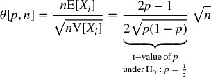

注意到 π 从上述方程中消去，因为收益是对称的。就像在高斯情况下，θ[ *p* , *n* ]可以理解为重新缩放的 t 值。这说明了一个观点，即使是很小的 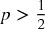，在足够大的 *n* 下，夏普比率也可以被提高。这就是高频交易的经济基础，在这种情况下，*p* 可能仅略高于 .5，而成功业务的关键是增加 *n*。夏普比率是精度的函数而非准确性的，因为放弃一个机会（负面）不会直接受到奖励或惩罚（尽管过多的负面可能导致小 *n*，从而将夏普比率压低到接近零）。

例如，对于 *p* = .55， 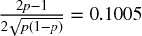，并且实现年化夏普比率 2 需要每年 396 次投注。摘录 15.1 在实验中验证了这一结果。图 15.1 绘制了夏普比率作为不同投注频率下精度的函数。

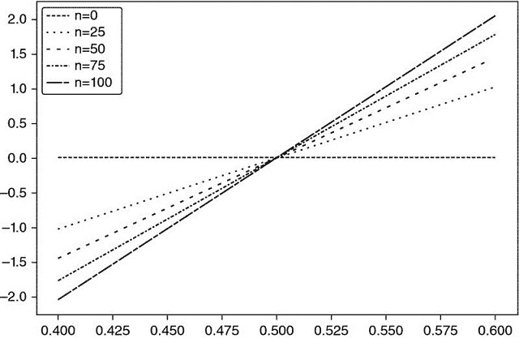

**图 15.1** 各种下注频率 (n) 下精度 (x 轴) 和夏普比率 (y 轴) 的关系

> **片段 15.1 将夏普比率作为下注次数的函数**
> 
> 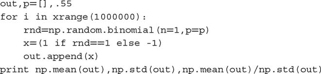

解出 0 ≤ *p* ≤ 1，得到 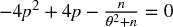，解为

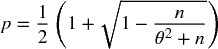

该方程明确了给定夏普比率 (θ) 下精度 (*p*) 和频率 (*n*) 之间的权衡。例如，只有每周下注 (*n* = 52) 的策略需要相当高的精度 *p* = 0.6336 才能实现年化夏普比率为 2。

## 15.3 非对称支付

考虑一个每年产生 *n* 个独立同分布 (IID) 下注的策略，其中下注 *i* ∈ [1, *n* ] 的结果 *X [*i*]* 以概率 P[ *X [*i*]* = π [+] ] = *p* 为 π [+]，结果为 π [−]，π [−] < π [+] 的概率为 P[ *X [*i*]* = π [−] ] = 1 − *p*。一次下注的期望利润为 E[ *X [*i*]* ] = *p* π [+] + (1 − *p* )π [−] = (π [+] − π [−] ) *p* + π [−]。方差为 V[ *X [*i*]* ] = E[ *X ² [*i*]* ] − E[ *X [*i*]* ] ²，其中 E[ *X ² [*i*]* ] = *p* π [+] ² + (1 − *p* )π ² [−] = (π [+] ² − π ² [−] ) *p* + π [−] ²，因此 V[ *X [*i*]* ] = (π [+] − π [−] ) ² *p* (1 − *p* )。对于每年 *n* 个 IID 下注，年化夏普比率 (θ) 为

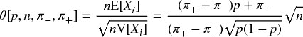

而对于 π [−] = −π [+]，我们可以看到这个方程简化为对称情况：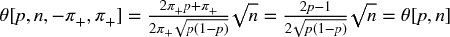。例如，对于 *n* = 260，π [−] = −.01，π [+] = .005，*p* = .7，我们得到 θ = 1.173。

最后，我们可以解出前面的方程，得到 0 ≤ *p* ≤ 1，

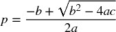

其中：

+   *a* = (*n* + θ ² )(π [+] − π [−] ) ²

+   *b* = [2*n* π [−] − θ ² (π [+] − π [−] )](π [+] − π [−] )

+   *c* = *n* π ² [−]

作为旁注，片段 15.2 使用 SymPy Live 验证了这些符号运算：[`live.sympy.org/`](http://live.sympy.org/) 。

> **片段 15.2 使用 SymPy 库进行符号运算**
> 
> 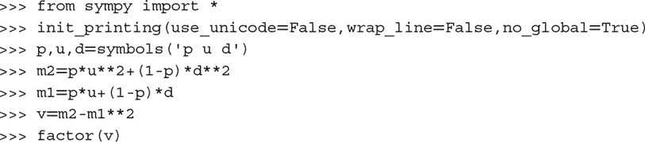

上述方程回答了以下问题：给定参数为 {π [−] , π [+] , *n* } 的交易规则，达到 θ* 的夏普比率所需的精度率 *p* 是多少？例如，对于 *n* = 260，π [−] = −.01，π [+] = .005，想要得到 θ = 2，我们需要 *p* = .72 *。* 由于下注次数众多，*p* 的一个微小变化（从 *p* = .7 到 *p* = .72）使夏普比率从 θ = 1.173 提升到 θ = 2 *。* 另一方面，这也告诉我们，该策略对 *p* 的小变化非常敏感。片段 15.3 实现了隐含精度的推导。图 15.2 显示了 *n* 和 π [−] 的隐含精度，其中 π [+] = 0.1，θ* = 1.5 *。* 当给定 *n* 时，π [−] 越负，达到给定 π [+] 的 θ* 需要的 *p* 越高。当给定 π [−] 时，*n* 越小，达到给定 π [+] 的 θ* 需要的 *p* 越高。

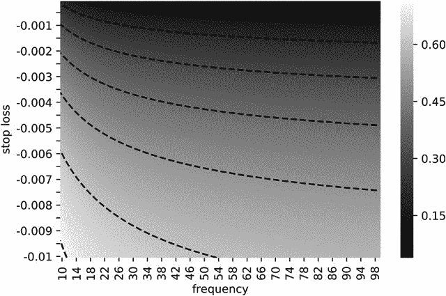

**图 15.2** 隐含精度的热图作为 *n* 和 π [−] 的函数，π [+] = 0.1 和 θ* = 1.5。

> **片段 15.3 计算隐含精度**
> 
> 

片段 15.4 计算隐含投注频率的 θ[ *p* , *n* , π [−] , π [+] ]。 图 15.3 绘制了隐含频率作为 *p* 和 π [−] 的函数，其中 π [+] = 0.1 和 θ* = 1.5 *.* 当对于给定的 *p*，π [−] 越负，达到给定 π [+] 的 θ* 所需的 *n* 越高。当对于给定的 π [−]，*p* 越小，达到给定 π [+] 的 θ* 所需的 *n* 越高。

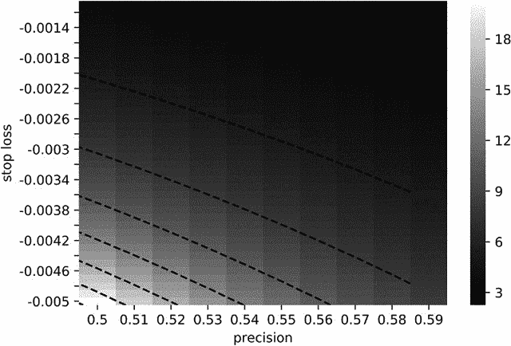

**图 15.3** 隐含频率作为 *p* 的函数，并且 = 0.1 和 = 1.5。

> **片段 15.4 计算隐含投注频率**
> 
> 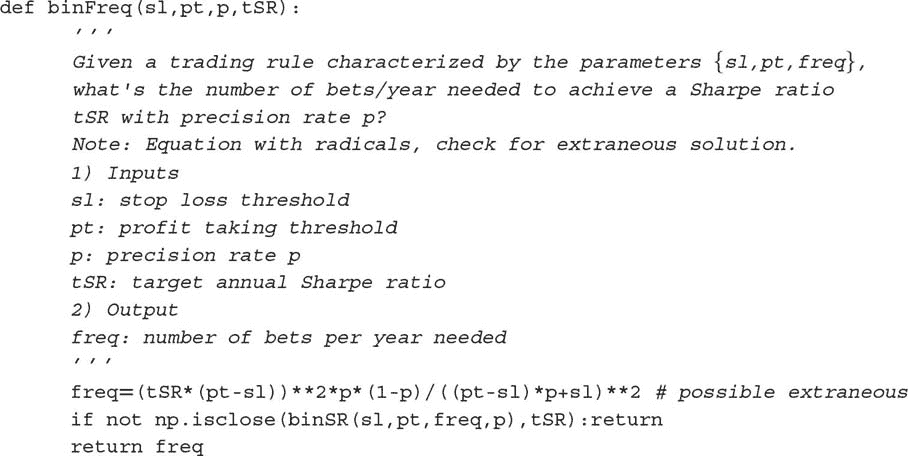

## 15.4 策略失败的概率

在上述示例中，参数 π [−] = −.01, π [+] = .005 由投资组合经理设定，并传递给交易员执行订单。参数 *n* = 260 也是由投资组合经理设定，因为她决定什么构成值得投注的机会。两个不在投资组合经理控制之下的参数是 *p*（由市场决定）和 θ*（投资者设定的目标）。由于 *p* 是未知的，我们可以将其建模为随机变量，期望值为 E[ *p* ]。我们定义 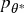 为 *p* 的值，低于此值策略将低于目标夏普比率 θ*，即 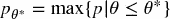。我们可以使用上述方程（或 `binHR` 函数）得出结论，对于 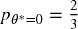，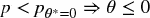 *.* 这突显了该策略所涉及的风险，因为 *p* 的相对小幅下降（从 *p* = .7 降至 *p* = .67）将消灭所有利润。该策略本质上是有风险的，即使持仓没有风险。这是我们希望在本章中明确的关键区别：*策略风险* 不应与 *投资组合风险* 混淆。

大多数公司和投资者在计算、监控和报告投资组合风险时，未意识到这并不能告诉我们策略本身的风险。策略风险不是由首席风险官计算的基础投资组合的风险。策略风险是投资策略随时间推移未能成功的风险，这是对首席投资官而言更具相关性的问题。问题“这项策略失败的概率是什么？”的答案相当于计算 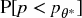。以下算法将帮助我们计算策略风险。

**15.4.1 算法**

在本节中，我们将描述计算  的过程。给定一系列投注结果 {π [*t*] } [*t* = 1, …, *T*]，首先我们估计 π [−] = E[{π [*t*] |π [*t*] ≤ 0} [*t* = 1, …, *T*] ]，以及 π [+] = E[{π [*t*] |π [*t*] > 0} [*t* = 1, …, *T*] ]。或者，{π [−] , π [+] } 可以通过拟合两个高斯混合模型得出，使用 EF3M 算法（López de Prado 和 Foreman [2014]）。其次，年度频率 *n* 由 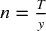 给出，其中 *y* 是 *t* = 1 和 *t* = *T* 之间经过的年份数。第三，我们对 *p* 的分布进行自助抽样，如下所示：

1.  对于迭代 *i* = 1, …, *I*：

    1.  从 {π [*t*] } [*t* = 1, …, *T*] 中以替换方式抽取 ⌊*nk*⌋ 个样本，其中 *k* 是投资者用来评估策略的年数（例如，2 年）。我们将这些抽取的样本集合记作 {π ^(( *i* )) [*j*] } [*j* = 1, …, ⌊ *nk*⌋]。

    1.  从迭代 *i* 中推导观察到的精度为 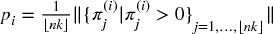。

1.  通过对 {*p [*i*]* } [*i* = 1, …, *I*] 应用核密度估计器 (KDE)，拟合 *p* 的概率密度函数 (PDF)，记作 *f* [*p*]。

对于足够大的 *k*，我们可以将第三步近似为 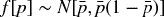，其中 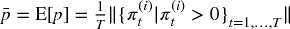。第四，给定一个阈值 θ*（将失败与成功分开的夏普比率），推导出 （见第 15.4 节）。第五，策略风险计算为 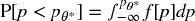。

**15.4.2 实现**

片段 15.5 列出了该算法的一种可能实现。通常我们会将 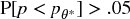 的策略视为过于冒险，即使它们投资于低波动性的工具。原因在于，即使它们的资金损失不多，但未能达到目标的概率仍然太高。为了能够使用，该策略开发者必须找到降低  的方法。

> **片段 15.5 实际计算策略风险**
> 
> 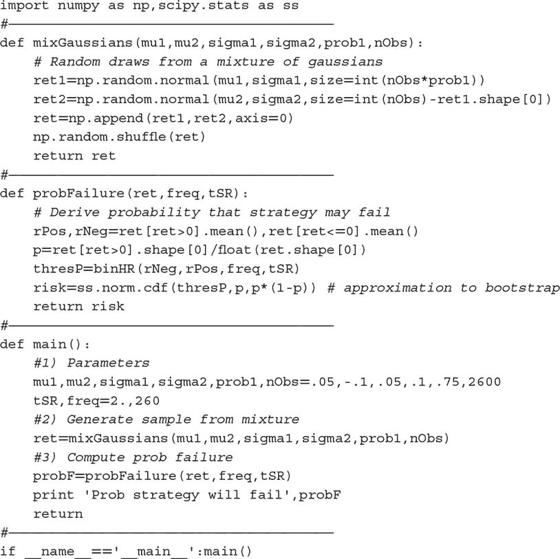

这种方法与 PSR 有一些相似之处（见第十四章，以及 Bailey 和 López de Prado [2012, 2014]）。PSR 在非高斯收益下推导出真实夏普比率超过给定阈值的概率。类似地，本章介绍的方法基于不对称二元结果推导策略的失败概率。关键区别在于，PSR 不区分在投资组合经理控制内外的参数，而这里讨论的方法允许投资组合经理研究在其控制参数 {π [−] , π [+] , *n* } 下策略的可行性。这在设计或评估交易策略的可行性时非常有用。

**练习**

1.  > > 一位投资组合经理打算推出一项目标年化 SR 为 2 的策略。投注的精度率为 60%，且频率为每周。退出条件为盈利时的 2% 和止损时的 -2%。

    1.  该策略可行吗？

    1.  *其他条件相同*，使策略盈利所需的精度率是多少？

    1.  达到目标的下注频率是多少？

    1.  达到目标的获利阈值是多少？

    1.  替代止损的选项是什么？

1.  > > 跟进练习 1 中的策略。

    1.  SR 对每个参数 1%变化的敏感度是多少？

    1.  鉴于这些敏感性，并假设所有参数都同样难以改进，哪一个提供了最低的回报？

    1.  练习 1 中任何参数的变化是否影响其他参数？例如，改变下注频率是否会修改精度率等？

1.  > > 假设一个策略在两年内每月产生下注，收益遵循两个高斯分布的混合。第一个分布的均值为-0.1，标准差为 0.12\. 第二个分布的均值为 0.06，标准差为 0.03\. 从第一个分布得出的抽样概率为 0.15。

    1.  根据 López de Prado 和 Peijan [2004]以及 López de Prado 和 Foreman [2014]，推导混合收益的前四个矩。

    1.  年化 SR 是多少？

    1.  利用这些矩，计算 PSR[1]（见第十四章）。在 95%的置信水平下，你会否决这个策略吗？

1.  > > 使用 Snippet 15.5，计算练习 3 中描述的 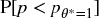 。在 0.05 的显著性水平下，你会否决这个策略吗？这个结果与*PSR* [θ*]一致吗？
1.  > > 
1.  > > 通常，你期望哪个结果更准确，*PSR* [θ*] 还是  ? 这两种方法如何互补？
1.  > > 
1.  > > 根据你在本章学到的知识，重新审视第十三章的结果。

    1.  在 OTR 中，获利和止损阈值之间的不对称是否有意义？

    1.  图 13.1 所暗示的每日下注频率下的*p*范围是什么？

    1.  图 13.5 所暗示的每周下注频率下的*p*范围是什么？

**参考文献**

1.  Bailey, D. 和 M. López de Prado (2014): “通胀 Sharpe 比率：修正选择偏差、回测过拟合和非正态性。” *投资组合管理杂志* , 第 40 卷，第 5 期\. 可在 [`ssrn.com/abstract=2460551`](https://ssrn.com/abstract=2460551) 获取。

1.  Bailey, D. 和 M. López de Prado (2012): “Sharpe 比率有效前沿。” *风险杂志* , 第 15 卷，第 2 期，页 3–44\. 可在 [`ssrn.com/abstract=1821643.`](https://ssrn.com/abstract=1821643.) 获取。

1.  López de Prado, M. 和 M. Foreman (2014): “高斯混合模型的数学投资组合监督方法：EF3M 算法。” *定量金融* , 第 14 卷，第 5 期，页 913–930\. 可在 [`ssrn.com/abstract=1931734`](https://ssrn.com/abstract=1931734) 获取。

1.  López de Prado, M. 和 A. Peijan (2004): “衡量对冲基金策略的损失潜力。” *另类投资杂志* , 第 7 卷，第 1 期（夏季），页 7–31\. 可在 [`ssrn.com/abstract=641702`](http://ssrn.com/abstract=641702) 获取。

