# 第十六章：机器学习资产配置

## 16.1 动机

本章介绍了层次风险平价（HRP）方法。^(1) HRP 投资组合解决了二次优化器普遍存在的三个主要问题，特别是马科维茨的关键线算法（CLA）：不稳定性、集中度和表现不佳。HRP 运用现代数学（图论和机器学习技术）根据协方差矩阵中的信息构建多元化投资组合。然而，与二次优化器不同，HRP 并不要求协方差矩阵可逆。实际上，HRP 可以在病态甚至奇异的协方差矩阵上计算投资组合，这对二次优化器来说是不可能的。蒙特卡洛实验表明，尽管最小方差是 CLA 的优化目标，HRP 的样本外方差却低于 CLA。与传统的风险平价方法相比，HRP 在样本外产生的投资组合风险更低。历史分析也表明，HRP 的表现优于标准方法（Kolanovic 等[2017]，Raffinot[2017]）。HRP 的一个实际应用是确定多个机器学习（ML）策略之间的配置。

## 16.2 凸投资组合优化的问题

投资组合构建可能是最常见的金融问题。投资经理每天必须构建包含他们对风险和收益看法与预测的投资组合。这是 24 岁的哈里·马科维茨在六十多年前试图回答的根本问题。他的重大见解是认识到，不同的最优投资组合在风险调整收益方面与各种风险水平相关，因此有了“有效前沿”的概念（马科维茨[1952]）。一个含义是，通常将所有资产分配给预期收益最高的投资并不最优。相反，我们应该考虑替代投资之间的相关性，以构建一个多元化的投资组合。

在 1954 年获得博士学位之前，马科维茨离开学术界为兰德公司工作，他在那开发了关键线算法。CLA 是一种专门为不等式约束的投资组合优化问题设计的二次优化程序。这个算法的显著之处在于，它保证在已知的迭代次数后找到精确解，并巧妙地规避了卡鲁什-库恩-塔克条件（库恩和塔克[1951]）。有关该算法的描述和开源实现可以在贝利和洛佩斯·德·普拉多[2013]中找到。令人惊讶的是，大多数金融从业者似乎仍对 CLA 一无所知，因为他们常常依赖于不保证正确解或停止时间的通用二次规划方法。

尽管马科维茨理论非常出色，但一些实际问题使得 CLA 解决方案有些不可靠。一个主要的警告是，预测收益的小偏差会导致 CLA 产生非常不同的投资组合（Michaud [1998]）。鉴于收益很难以足够的准确性进行预测，许多作者选择完全放弃预测，专注于协方差矩阵。这导致了基于风险的资产配置方法，其中“风险平价”是一个突出的例子（Jurczenko [2015]）。放弃收益预测可以改善但无法防止不稳定性问题。原因在于，二次规划方法需要对正定协方差矩阵进行求逆（所有特征值必须为正）。当协方差矩阵数值条件较差时，即当其条件数较高时，这种求逆容易产生较大误差（Bailey 和 López de Prado [2012]）。

## 16.3 马科维茨的诅咒

协方差、相关（或正态，因此可对角化）矩阵的条件数是其最大和最小（按模）特征值之间绝对值的比率。图 16.1 绘制了几个相关矩阵的特征值排序图，其中条件数是每行首尾值的比率。对角相关矩阵的条件数最低，且其自身是逆矩阵。随着我们增加相关（多重共线性）投资，条件数增长。在某个时刻，条件数高到数值误差使逆矩阵变得不稳定：任何条目的小变化都会导致非常不同的逆。这就是马科维茨的诅咒：投资越相关，越需要分散投资，但我们越有可能得到不稳定的解决方案。分散投资的好处往往被估计误差所抵消。

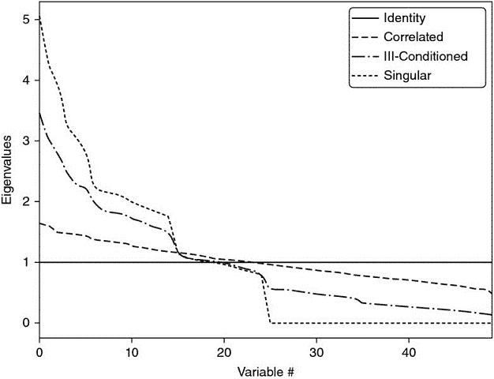

**图 16.1** 马科维茨诅咒的可视化

对角相关矩阵具有最低的条件数。随着我们增加相关投资，最大特征值增大，最小特征值减小。条件数迅速上升，导致不稳定的逆相关矩阵。在某个时刻，分散投资的好处被估计误差所抵消。

增加协方差矩阵的大小只会使问题变得更糟，因为每个协方差系数的估计自由度较少。一般来说，我们至少需要个独立同分布（IID）观测值，以便估计一个不奇异的大小为*N*的协方差矩阵。例如，估计一个可逆的 50 大小的协方差矩阵至少需要 5 年的日常 IID 数据。正如大多数投资者所知，相关结构在如此长的时间内不会以任何合理的置信水平保持不变。这些挑战的严重性体现在，即使是天真的（等权重）投资组合也已显示出超越均值-方差和基于风险的优化的样本外表现（De Miguel 等人[2009]）。

## 16.4 从几何关系到层次关系

近年来，这些不稳定性问题得到了相当大的关注，正如 Kolm 等人[2014]仔细记录的那样。大多数替代方案试图通过引入额外约束（Clarke et al. [2002]）、引入贝叶斯先验（Black 和 Litterman [1992]）或改善协方差矩阵逆的数值稳定性（Ledoit 和 Wolf [2003]）来实现鲁棒性。

到目前为止讨论的所有方法，虽然近年来发表，但源自（非常）经典的数学领域：几何、线性代数和微积分。相关性矩阵是一个线性代数对象，用于测量由收益序列形成的向量空间中任意两个向量之间角度的余弦（见 Calkin 和 López de Prado [2014a, 2015b]）。二次优化器不稳定的一个原因是向量空间被建模为一个完整（完全连接）的图，其中每个节点都是替代其他节点的潜在候选者。从算法的角度看，反转矩阵意味着评估完整图上的部分相关性。图 16.2（a）可视化了 50 × 50 的协方差矩阵所隐含的关系，即 50 个节点和 1225 条边。这种复杂结构放大了小的估计误差，导致错误的解决方案。从直观上看，减少不必要的边缘是可取的。

**图 16.2** 完整图（上）和树图（下）结构

相关性矩阵可以表示为完整图，缺乏层次结构的概念：每项投资都可以替代另一项。相比之下，树结构则包含层次关系。

让我们暂时考虑这种拓扑结构的实际意义。假设一个投资者希望构建一个多样化的证券投资组合，包括数百种股票、债券、对冲基金、房地产、私募等。有些投资似乎是彼此的近似替代品，而其他投资则似乎是互补的。例如，股票可以根据流动性、规模、行业和地区进行分组，在给定组内的股票竞争配置。在决定对像摩根大通这样的美国大型上市金融股票的配置时，我们将考虑增加或减少对另一家大型上市美国银行如高盛的配置，而不是瑞士的一家小社区银行或加勒比地区的一项房地产投资。然而，在相关矩阵中，所有投资都是彼此的潜在替代品。换句话说，相关矩阵缺乏*层次性*的概念。这种缺乏层次结构的情况导致权重以意想不到的方式自由变化，这是 CLA 不稳定的根本原因。图 16.2 (b)可视化了一种称为树的层次结构。树结构引入了两个理想特性：(1) 它只有*N* - 1 条边连接*N*个节点，因此权重仅在不同层次的同级之间重新平衡；(2) 权重是自上而下分配的，这与许多资产管理者构建投资组合的方式一致（例如，从资产类别到行业再到个别证券）。出于这些原因，层次结构更适合提供不仅稳定而且直观的结果。

在本章中，我们将研究一种新的投资组合构建方法，利用现代数学：图论和机器学习来解决 CLA 的缺陷。这种层次风险平价方法利用协方差矩阵中包含的信息，而无需其逆或正定性。HRP 甚至可以基于单一协方差矩阵计算投资组合。该算法分为三个阶段：树聚类、准对角化和递归二分法。

**16.4.1 树聚类**

考虑一个*TxN*的观察矩阵*X*，例如*N*个变量在*T*个时期的回报系列。我们希望将这*N*个列向量组合成一个层次结构的聚类，以便配置可以通过树图向下流动。

首先，我们计算一个 *NxN* 的相关矩阵，条目为 ρ = {ρ [*i* , *j*] } [*i* , *j* = 1, …, *N*]，其中 ρ [*i* , *j*] = ρ[ *X [*i*]* , *X [*j*]* ]。我们定义距离度量  , ，其中 *B* 是 {1, …, *i* , …, *N* } 中项目的笛卡尔积。这使我们能够计算 *NxN* 的距离矩阵 *D* = { *d [*i*  ,  *j*] * } [*i*  ,  *j*  = 1, …,  *N*]。矩阵 *D* 是一个合适的度量空间（见附录 16.A.1 以获取证明），在于 *d* [ *x* , *y* ] ≥ 0（非负性），*d* [ *x* , *y* ] = 0⇔ *X* = *Y* （重合），*d* [ *x* , *y* ] = *d* [ *Y* , *X* ] （对称性），以及 *d* [ *X* , *Z* ] ≤ *d* [ *x* , *y* ] + *d* [ *Y* , *Z* ] （亚加性）。参见示例 16.1。

**示例 16.1 将相关矩阵** ***ρ*** **编码为距离矩阵** ***D***

其次，我们计算 *D* 中任意两个列向量之间的欧几里得距离，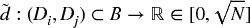 , 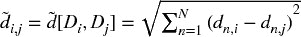。注意距离度量 *d [*i*  ,  *j*] * 和  之间的区别。虽然 *d [*i*  ,  *j*] * 是在 *X* 的列向量上定义的，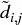 是在 *D* 的列向量上定义的（距离的距离）。因此，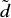 是在整个度量空间 *D* 上定义的距离，因为每个  是整个相关矩阵的函数（而不是特定的互相关对）。参见示例 16.2。

**示例 16.2 相关距离的欧几里得距离**

第三，我们将满足 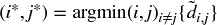 的列对 ( *i* *, *j* *) 聚在一起，称这个聚类为 *u* [1]。参见示例 16.3。

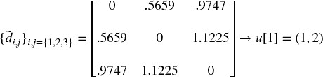

**示例 16.3 聚类项目**

第四，我们需要定义新形成的聚类 *u* [1] 与单个（未聚类）项目之间的距离，以便可以更新 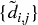。在层次聚类分析中，这被称为“连结标准”。例如，我们可以将  中的一个项目 *i* 与新聚类 *u* [1] 之间的距离定义为 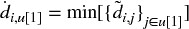（最近点算法）。参见示例 16.4。

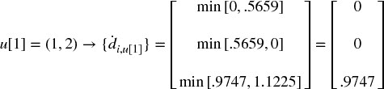

**示例 16.4 更新矩阵**  **与新聚类** ***u***

第五，矩阵  通过附加 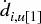 并删除聚类的列和行 *j* ∈ *u* [1] 进行更新。参见示例 16.5。

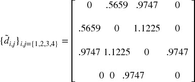

**示例 16.5 更新矩阵**  **与新聚类** ***u***

第六，递归应用步骤 3、4 和 5，使我们能够将 *N* − 1 个这样的聚类附加到矩阵 *D*，此时最终聚类包含所有原始项目，聚类算法停止。参见示例 16.6。

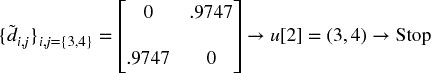

**示例 16.6 搜索剩余聚类的递归**

图 16.3 显示了此示例中每次迭代形成的聚类，以及触发每个聚类的距离 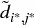（第三步）。该过程可以应用于广泛的距离度量 *d [*i*  ,  *j*] * ， 和 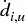，超出了本章所示的那些。请参见 Rokach 和 Maimon [2005] 的替代度量，Brualdi [2010] 中关于 Fiedler 向量和 Stewart 光谱聚类方法的讨论，以及 scipy 库中的算法。^(  2  ) 片段 16.1 提供了一个使用 scipy 功能的树聚类示例。

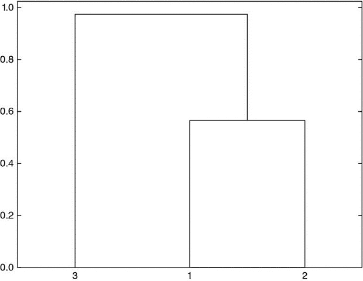

**图 16.3** 聚类形成的序列

从我们的数值示例中派生出的树结构，这里绘制为树状图。y 轴测量合并的两个叶子之间的距离。

> **片段 16.1 使用 SCIPY 功能的树聚类**
> 
> 

这个阶段允许我们定义一个链接矩阵，作为一个 ( *N* − 1) *x* 4 矩阵，结构为 *Y* = {( *y [*m* , 1]* , *y [*m* , 2]* , *y [*m* , 3]* , *y [*m* , 4]* )} [*m* = 1, …, *N* − 1]（即，每个聚类一个 4 元组）。项目 ( *y [*m* , 1]* , *y [*m* , 2]* ) 报告构成。项目 *y [*m* , 3]* 报告 *y [*m* , 1]* 和 *y [*m* , 2]* 之间的距离，即 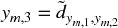。项目 *y [*m* , 4]* ≤ *N* 报告聚类 *m* 中包含的原始项目数量。

**16.4.2 准对角化**

这个阶段重新组织协方差矩阵的行和列，使得最大值位于对角线上。这种协方差矩阵的准对角化（不需要更改基）呈现出一个有用的特性：相似的投资被放在一起，不相似的投资则远离（见图 16.5 和 16.6 的例子）。算法工作如下：我们知道链接矩阵的每一行将两个分支合并为一个。我们递归地用其构成替换 ( *y [*N* − 1, 1]* , *y [*N* − 1, 2]* ) 中的聚类，直到没有聚类为止。这些替换保持聚类的顺序。输出是原始（未聚类）项目的排序列表。此逻辑在片段 16.2 中实现。

> **片段 16.2 准对角化**
> 
> 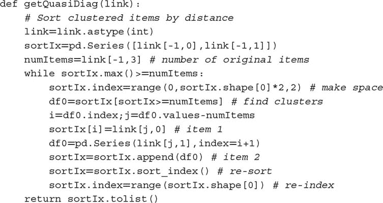

**16.4.3 递归二分法**

第 2 阶段交付了一个准对角矩阵。逆方差分配对于对角协方差矩阵是最优的（见附录 16.A.2 的证明）。我们可以通过两种不同方式利用这些事实：（1）自下而上，定义一个连续子集的方差为逆方差分配的方差；或（2）自上而下，在与它们的聚合方差成反比的情况下，分割相邻子集之间的分配。以下算法形式化了这个想法：

1.  算法初始化为：

    1.  设置项目列表：*L* = {*L [0]*}，其中 *L [0]* = {*n*} [*n* = 1, …, *N*]。

    1.  对所有项目分配单位权重：*w [*n*]* = 1，∀*n* = 1, …, *N*。

1.  如果 |*L [*i*]*| = 1，∀*L [*i*]* ∈ *L*，则停止。

1.  对于每个 *L [*i*]* ∈ *L*，当 |*L [*i*]*| > 1 时：

    1.  将 *L [*i*]* 二分为两个子集，*L ^((1)) [*i*]* ∪*L [*i*] ^((2))* = *L [*i*]*，其中 ，并且顺序保持不变。

    1.  定义 *L ^((*j*)) [*i*]* 的方差，*j* = 1, 2，作为二次形式 ，其中 *V ^((*j*)) [*i*]* 是 *L ^((*j*)) [*i*]* 二分的组成部分之间的协方差矩阵，和 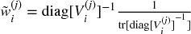，其中 diag[.] 和 tr[.] 是对角线和迹运算符。

    1.  计算拆分因子：，以使 0 ≤ α [*i*] ≤ 1。

    1.  通过 α [*i*] 的因子重新缩放分配 *w [*n*]*，∀*n* ∈ *L ^((1)) [*i*]*。

    1.  通过 (1 − α [*i*]) 的因子重新缩放分配 *w [*n*]*，∀*n* ∈ *L ^((2)) [*i*]*。

1.  循环到步骤 2

步骤 3b 利用自下而上的准对角化，因为它使用逆方差加权定义分区 *L ^((*j*)) [*i*]* 的方差！。步骤 3c 利用自上而下的准对角化，因为它按与集群方差的反比例分割权重。该算法确保 0 ≤ *w [*i*]* ≤ 1，∀ *i* = 1, …, *N*，并且 ，因为在每次迭代中，我们都在分割来自更高层次的权重。在此阶段，可以通过根据用户偏好替换步骤 3c、3d 和 3e 中的方程轻松引入约束。阶段 3 在代码片段 16.3 中实现。

> **代码片段 16.3 递归二分**
> 
> 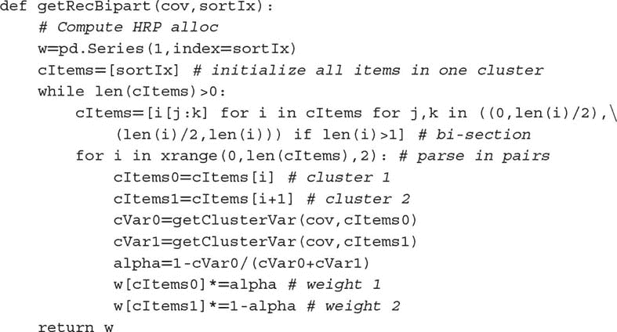

这结束了 HRP 算法的第一次描述，该算法在最佳情况下以确定性对数时间解决分配问题，！，在最坏情况下以确定性线性时间解决，！。接下来，我们将实践所学，并评估该方法的样本外准确性。

## 16.5 数值示例

我们首先模拟一个观测矩阵 *X*，维度为 (10000 *x* 10)。相关矩阵在 图 16.4 中以热图形式可视化。图 16.5 显示了结果集群的树状图（阶段 1）。图 16.6 显示了同一相关矩阵，按识别的集群重新组织成块（阶段 2）。附录 16.A.3 提供了用于生成此数值示例的代码。

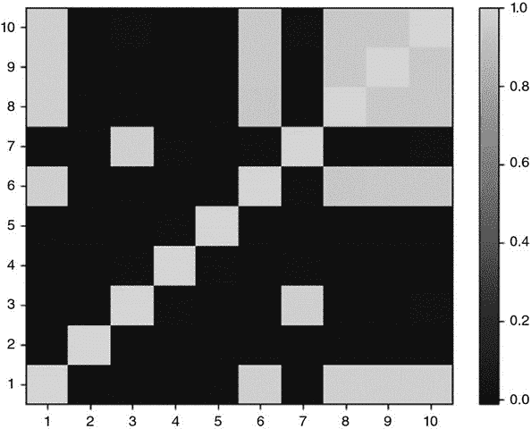

**图 16.4** 原始协方差矩阵的热图

此相关矩阵是使用代码片段 16.4 中的函数 `generateData` 计算的（见第 16.A.3 节）。最后五列与前五列的某些系列部分相关。

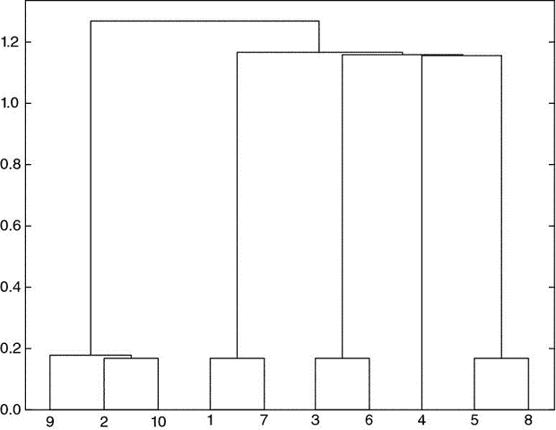

**图 16.5** 聚类形成的树状图

聚类过程正确识别了序列 9 和 10 是序列 2 的扰动，因此（9, 2, 10）被聚集在一起。同样，7 是 1 的扰动，6 是 3 的扰动，而 8 是 5 的扰动。唯一没有扰动的原始项目是 4，而聚类算法未能找到与之相似的项。

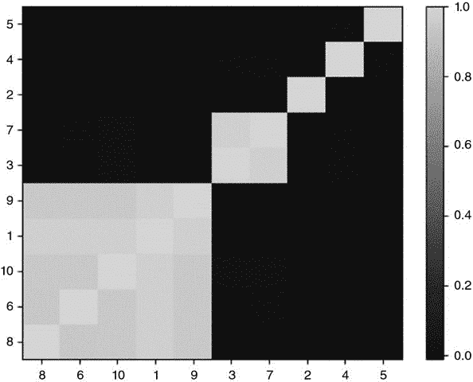

**图 16.6** 聚类协方差矩阵

第 2 阶段准对角化了相关矩阵，意义在于最大值沿对角线分布。然而，与 PCA 或类似程序不同，HRP 不需要基变换。HRP 以稳健的方式解决分配问题，同时处理原始投资。

在这些随机数据上，我们计算 HRP 的分配（第 3 阶段），并将其与两种竞争方法的分配进行比较：（1）二次优化，由 CLA 的最小方差投资组合表示（这是有效前沿中唯一不依赖于收益均值的投资组合）；（2）传统风险平价，以逆方差投资组合（IVP）为例。有关 CLA 的全面实现，请参见 Bailey 和 López de Prado [2013]，关于 IVP 的推导请参见附录 16.A.2。我们应用标准约束条件 0 ≤ *w [*i*]* ≤ 1（非负性），∀ *i* = 1, …, *N*，以及 （完全投资）。顺便提一下，这个例子中协方差矩阵的条件数仅为 150.9324，算不上特别高，因此对 CLA 并不不利。

从 表 16.1 的分配中，我们可以欣赏到一些典型特征：首先，CLA 将 92.66% 的分配集中在前五个持有资产上，而 HRP 仅集中 62.57%。其次，CLA 对 3 项投资分配零权重（如果没有 0 ≤ *w [*i*]* 的约束，分配将是负数）。第三，HRP 似乎在 CLA 集中解决方案和传统风险平价的 IVP 分配之间找到了一种折衷。读者可以使用附录 16.A.3 中的代码来验证这些发现通常适用于其他随机协方差矩阵。

**表 16.1** **三种分配的比较**

| **权重 #** | **CLA** | **HRP** | **IVP** |
| --- | --- | --- | --- |
| 1 | 14.44% | 7.00% | 10.36% |
| 2 | 19.93% | 7.59% | 10.28% |
| 3 | 19.73% | 10.84% | 10.36% |
| 4 | 19.87% | 19.03% | 10.25% |
| 5 | 18.68% | 9.72% | 10.31% |
| 6 | 0.00% | 10.19% | 9.74% |
| 7 | 5.86% | 6.62% | 9.80% |
| 8 | 1.49% | 9.10% | 9.65% |
| 9 | 0.00% | 7.12% | 9.64% |
| 10 | 0.00% | 12.79% | 9.61% |

三种方法的一个特征结果是：CLA 将权重集中于少数投资，因此容易受到特有冲击的影响。IVP 则将权重均匀分配到所有投资中，忽略了相关性结构，这使其容易受到系统性冲击的影响。HRP 在所有投资之间分散与在聚类之间分散之间找到了折衷，从而使其对这两种冲击更具韧性。

CLA 极端集中化的驱动因素是其最小化投资组合风险的目标。然而，这两个投资组合的标准差非常相似（σ [*HRP*] = 0.4640, σ [*CLA*] = 0.4486）。因此，CLA 放弃了一半的投资范围，以换取较小的风险降低。当然，现实是 CLA 的投资组合在表面上看似分散，因为任何影响前五个配置的危机情况将对 CLA 的影响远大于对 HRP 的投资组合。

## 16.6 样本外蒙特卡洛模拟

在我们的数值示例中，CLA 的投资组合在样本内的风险低于 HRP。然而，样本内的最小方差投资组合不一定是样本外最小方差的投资组合。我们很容易选择一个特定的历史数据集，其中 HRP 的表现优于 CLA 和 IVP（参见 Bailey 和 López de Prado [2014]，并回忆我们在第十一章讨论的选择偏差）。相反，在这一部分我们遵循第十三章中解释的回测范式，通过蒙特卡洛方法评估 HRP 与 CLA 的最小方差和传统风险平价的 IVP 配置的样本外表现。这也将帮助我们理解哪些特征使一种方法优于其他方法，而不论个案反例。

首先，我们生成 10 系列随机高斯收益（520 个观察值，相当于 2 年的每日历史），均值为 0，标准差为 10%（任意）。真实价格经常出现跳跃（Merton [1976]），收益并非横截面独立，因此我们必须向生成的数据中添加随机冲击和随机相关性结构。其次，我们通过回顾 260 个观察值（相当于一年的每日历史）计算 HRP、CLA 和 IVP 投资组合。这些投资组合每 22 个观察值重新估算和再平衡一次（相当于每月一次）。第三，我们计算与这三种投资组合相关的样本外收益。这个过程重复 10,000 次。

所有样本外的平均投资组合收益基本为 0，符合预期。关键的差异来自样本外投资组合收益的方差：σ ² [*CLA*] = 0.1157，σ ² [*IVP*] = 0.0928，以及σ ² [*HRP*] = 0.0671 *.* 尽管 CLA 的目标是实现最低方差（这是其优化程序的目标），但其表现恰好在样本外显示出最高的方差，比 HRP 的方差高出 72.47%。这一实验发现与 De Miguel 等人[2009]的历史证据一致。换句话说，HRP 将使 CLA 策略的样本外夏普比率提高约 31.3%，这是相当显著的提升。假设协方差矩阵是对角线形式，可以为 IVP 带来一定的稳定性；然而，其方差仍比 HRP 高出 38.24%。这一样本外方差的降低对风险平价投资者至关重要，因为他们使用了大量杠杆。有关样本内与样本外表现的更广泛讨论，请参见 Bailey 等人[2014]。

HRP 在超越 Markowitz 的 CLA 和传统风险平价的 IVP 方面的数学证明相对复杂，超出了本章的范围。从直观上讲，我们可以这样理解上述实证结果：影响特定投资的冲击会惩罚 CLA 的集中性。涉及多个相关投资的冲击会惩罚 IVP 对相关结构的无知。HRP 通过在所有投资之间的多样化和在多个层次的投资集群之间的多样化之间找到妥协，从而更好地抵御共同和特异性冲击。图 16.7 绘制了 10,000 次运行中第一次分配的时间序列。

**图 16.7** (a) IVP 的分配时间序列。

在第一次和第二次再平衡之间，一项投资受到特异性冲击，导致其方差增加。IVP 的应对方式是减少对该投资的分配，并将以前的风险敞口分散到所有其他投资中。在第五次和第六次再平衡之间，两项投资受到共同冲击。IVP 的应对方式相同。因此，在七项未受影响的投资之间的分配随着时间的推移而增长，无论它们的相关性如何。

(b) HRP 的分配时间序列

HRP 对特异性冲击的响应是减少对受影响投资的分配，并利用减少的金额增加对未受影响的相关投资的分配。作为对共同冲击的回应，HRP 减少对受影响投资的分配，并增加对不相关投资（具有较低方差）的分配。

(c) CLA 的分配时间序列

CLA 配置对特定和共同冲击的反应是不可预测的。如果考虑了再平衡成本，CLA 的表现将会非常糟糕。

附录 16.A.4 提供了实现上述研究的 Python 代码。读者可以尝试不同的参数配置，并得出类似的结论。特别地，HRP 的样本外超越表现对于更大的投资范围变得更加显著，或者当添加更多冲击时，或者考虑更强的相关性结构，或考虑再平衡成本时。这些 CLA 再平衡每次都产生交易成本，随着时间的推移可能会累积成巨大的损失。

## 16.7 进一步研究

本章介绍的方法灵活、可扩展，并允许相同思想的多种变体。使用提供的代码，读者可以研究和评估哪些 HRP 配置最适合他们特定的问题。例如，在第一阶段，他们可以应用 *d [*i* , *j*]* 的替代定义， 和 ，或不同的聚类算法，如双聚类；在第三阶段，他们可以对 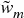 和 α 使用不同的函数，或替代配置约束。第三阶段不仅可以执行递归二分，还可以使用第一阶段的聚类进行自上而下的配置拆分。

将预测收益、Ledoit-Wolf 收缩和 Black-Litterman 风格的观点整合到这种层次化方法中相对简单。实际上，细心的读者可能已经意识到，HRP 在本质上是一种避免矩阵求逆的稳健程序，HRP 背后的相同理念可以用来替代许多著名的计量经济学回归方法，这些方法以其不稳定的输出而闻名（如 VAR 或 VECM）。图 16.8 显示了（a）聚类前的固定收益证券的大型相关性矩阵和（b）聚类后的相关性矩阵，包含超过 210 万个条目。传统的优化或计量经济学方法未能识别金融大数据的层次结构，使得数值不稳定性削弱了分析的优势，导致不可靠和有害的结果。

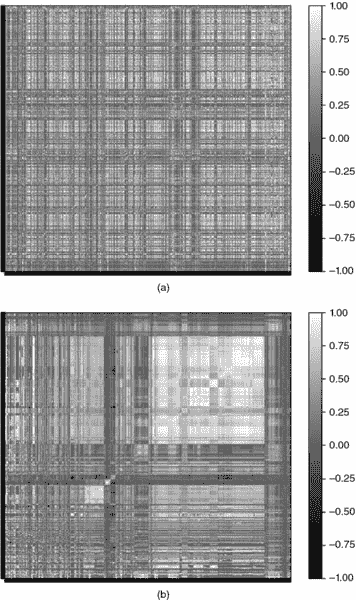

**图 16.8** 聚类前后的相关性矩阵

本章所述的方法可以应用于优化之外的问题。例如，对大型固定收益投资组合进行 PCA 分析也面临与 CLA 相同的缺陷。几十年前和几个世纪前开发的小数据技术（因子模型、回归分析、计量经济学）未能识别金融大数据的层次性质。

Kolanovic 等人[2017]进行了一项关于 HRP 的详细研究，得出结论：“HRP 提供了优越的风险调整收益。虽然 HRP 和 MV 投资组合都提供最高的回报，但 HRP 投资组合在波动性目标上表现得远远优于 MV 投资组合。我们还进行了模拟研究以确认我们的发现的稳健性，其中 HRP 始终在 MV 和其他基于风险的策略中表现优越[…] HRP 投资组合真正实现了多元化，具有更高数量的无相关敞口，并且权重和风险配置不那么极端。”

Raffinot[2017]得出结论：“实证结果表明，基于层次聚类的投资组合稳健、真正多元化，并且在风险调整表现上统计上优于常用的投资组合优化技术。”

## 16.8 结论

精确的分析解决方案可能表现得比近似的最大似然解决方案差得多。尽管在数学上是正确的，二次优化器通常，以及马科维茨的 CLA 特别，以其不稳定性、集中性和表现不佳而闻名，提供的解决方案通常不可靠。这些问题的根本原因在于二次优化器需要对协方差矩阵进行反演。马科维茨的诅咒是，投资之间相关性越高，对多元化投资组合的需求就越大，但该投资组合的估计误差也越大。

在这一章中，我们揭示了二次优化器不稳定性的一个主要来源：大小为*N*的矩阵与一幅完整图相连，包含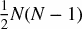条边。如此多的边连接图的节点，使得权重可以完全自由地重新平衡。这种缺乏层次结构意味着小的估计误差将导致完全不同的解决方案。HRP 用树结构替代协方差结构，实现了三个目标：（1）与传统的风险平价方法不同，它充分利用了协方差矩阵中包含的信息，（2）权重的稳定性得以恢复，以及（3）通过构建，解决方案变得直观。该算法在确定性对数（最佳情况）或线性（最坏情况）时间内收敛。

HRP 具有稳健性、可视化和灵活性，允许用户引入约束或操控树结构而不妨碍算法的搜索。这些属性源于 HRP 不要求协方差可逆的事实。实际上，HRP 可以在退化或甚至奇异的协方差矩阵上计算投资组合。

本章专注于组合构建应用；然而，读者会发现其他在不确定性下做决策的实际应用，特别是在几乎奇异的协方差矩阵存在时：对组合经理的资本分配、算法策略之间的分配、机器学习信号的集成和提升、随机森林的预测、对不稳定计量经济模型的替代（VAR, VECM）等。

当然，像 CLA 这样的二次优化器在样本内生成最小方差组合（这就是它的目标函数）。蒙特卡罗实验表明，HRP 在样本外的方差低于 CLA 或传统风险平价方法（IVP）。自从 Bridgewater 在 1990 年代首创风险平价以来，一些最大的资产管理公司推出了遵循这种方法的基金，合计资产超过 5000 亿美元。鉴于这些基金广泛使用杠杆，它们应该从采用更稳定的风险平价分配方法中受益，从而实现更优的风险调整回报和较低的再平衡成本。

**附录**

**16.A.1 基于相关性的度量**

考虑两个实值向量 *X* , *Y*，大小为 *T*，以及一个相关变量 ρ[ *x* , *y* ]，唯一要求是 σ[ *x* , *y* ] = ρ[ *x* , *y* ]σ[ *X* ]σ[ *Y* ]，其中 σ[ *x* , *y* ] 是两个向量之间的协方差，σ[.] 是标准差。请注意，皮尔逊相关不是唯一满足这些要求的相关性。

让我们证明  是一个真实的度量。首先，两个向量之间的欧几里得距离是 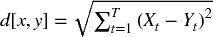。其次，我们将这些向量进行 z 标准化，得到  , 。因此，0 ≤ ρ[ *x* , *y* ] = ρ[ *x* , *y* ]。第三，我们推导出欧几里得距离 *d* [ *x* , *y* ] 为，

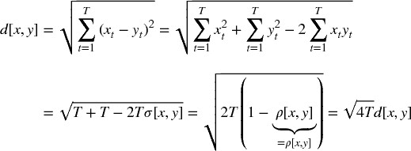

换句话说，距离 *d* [ *x* , *y* ] 是经过 z 标准化后向量 { *X* , *Y* } 之间欧几里得距离的线性倍数，因此它继承了欧几里得距离的真度量特性。

同样，我们可以证明 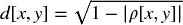 在  /2 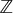 商上下降为真实度量。为此，我们重新定义 ，其中 sgn[.] 是符号运算符，因此 0 ≤ ρ[ *x* , *y* ] = |ρ[ *x* , *y* ]|。然后，

**16.A.2 反方差分配**

第 3 阶段（见第 16.4.3 节）根据子集的方差反比例划分权重。我们现在证明，当协方差矩阵是对角时，这种分配是最优的。考虑大小为 *N* 的标准二次优化问题，

解为 。对于特征向量 *a* = 1 [*N*]，解是最小方差组合。如果 *V* 是对角的，则 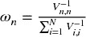。在 *N* = 2 的特定情况下，，这就是第 3 阶段如何在子集的两个二分之间划分权重。

**16.A.3 复制数值示例**

Snippet 16.4 可用于复制我们的结果并模拟其他数值示例。函数 `generateData` 生成一个时间序列矩阵，其中数量为 `size0` 的向量是无相关的，数量为 `size1` 的向量是相关的。读者可以更改 `generateData` 中的 `np.random.seed` 来运行其他示例，从而直观了解 HRP 的工作原理。Scipy 的函数 `linkage` 可用于执行第一阶段（第 16.4.1 节），函数 `getQuasiDiag` 执行第二阶段（第 16.4.2 节），函数 `getRecBipart` 执行第三阶段（第 16.4.3 节）。

> **SNIPPET 16.4 HRP 算法的完整实现**
> 
>   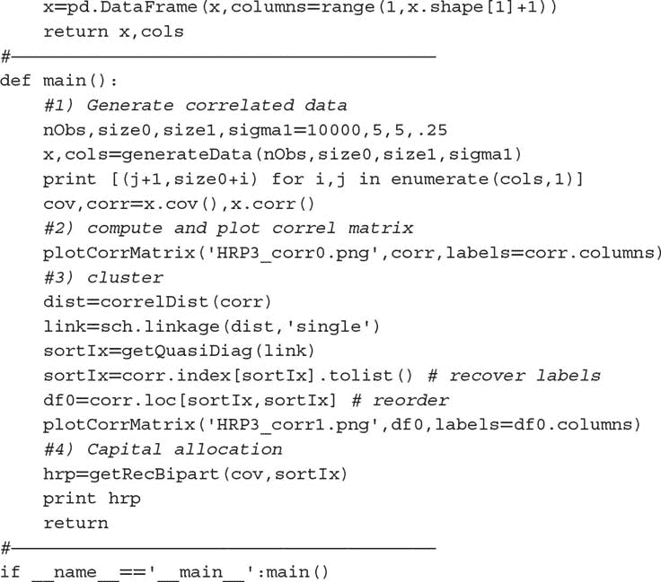

**16.A.4 复制蒙特卡洛实验**

Snippet 16.5 对三种分配方法进行蒙特卡洛实验：HRP、CLA 和 IVP。除 HRP 外，所有库都是标准库，HRP 的内容在附录 16.A.3 中提供，CLA 的内容可以在 Bailey 和 López de Prado [2013]中找到。子程序 `generateData` 模拟相关数据，具有两种类型的随机冲击：对多项投资共同的和对单项投资特有的。每种类型有两个冲击，一个正面和一个负面。实验变量作为`hrpMC`的参数设置。它们是任意选择的，用户可以尝试其他组合。

> **SNIPPET 16.5 蒙特卡洛实验的 HRP 样本外表现**
> 
> 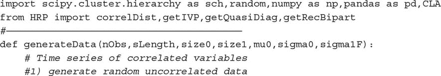 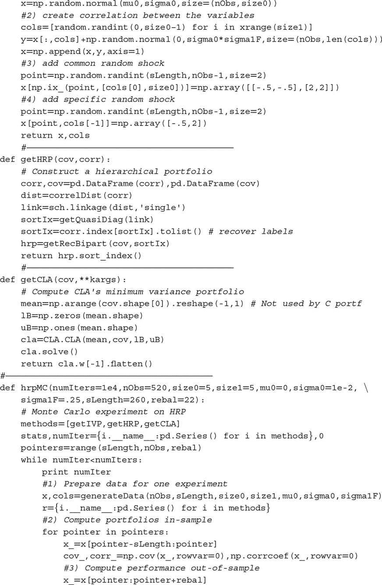 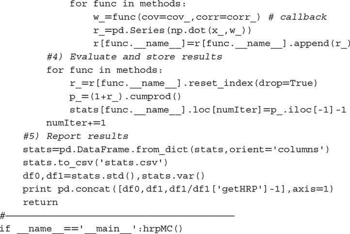

**练习**

1.  > > 给定 *N* 个投资策略的 PnL 序列：

    1.  将它们与其投注的平均频率对齐（例如，对于每周交易的策略进行每周观察）。提示：这种数据对齐有时称为“下采样”。

    1.  计算它们收益的协方差 *V*。

    1.  确定 *N* 个策略之间的层次聚类。

    1.  绘制 *N* 个策略的聚类相关矩阵。

1.  > > 使用练习 1 中的聚类协方差矩阵 *V*：

    1.  计算 HRP 分配。

    1.  计算 CLA 分配。

    1.  计算 IVP 分配。

1.  > > 使用练习 1 中的协方差矩阵 *V*：

    1.  执行光谱分解：*VW* = *W* Λ。

    1.  通过从 *U* [0, 1] 分布中抽取 *N* 个随机数来形成数组 ϵ。

    1.  形成一个 *NxN* 矩阵  , 其中 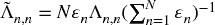 , *n* = 1, …, *N* 。

    1.  计算  。

    1.  重复练习 2，这次使用  作为协方差矩阵。哪个分配方法受到光谱方差重缩放的影响最大？

1.  > > 你会如何修改 HRP 算法，以产生总和为 0 的分配，其中 | *w [*n*]* | ≤ 1, ∀ *n* = 1, …, *N* ?
1.  > > 
1.  > > 你能想到一种简单的方法将预期收益纳入 HRP 分配中吗？

**参考文献**

1.  Bailey, D. 和 M. López de Prado (2012)： “平衡篮子：一种交易和对冲风险的新方法。” *投资策略杂志* ，第 1 卷，第 4 期，页 21–62。可在 [`ssrn.com/abstract=2066170`](http://ssrn.com/abstract=2066170) 查阅。

1.  Bailey, D. 和 M. López de Prado (2013)： “投资组合优化的关键线算法的开源实现。” *算法* ，第 6 卷，第 1 期，页 169–196。可在 [`ssrn.com/abstract=2197616`](http://ssrn.com/abstract=2197616) 查阅。

1.  Bailey, D., J. Borwein, M. López de Prado 和 J. Zhu (2014) “伪数学和金融江湖术士：回测过拟合对样本外表现的影响。” *美国数学学会通告* ，第 61 卷，第 5 期，页 458–471。可在 [`ssrn.com/abstract=2308659`](http://ssrn.com/abstract=2308659) 查阅。

1.  Bailey, D. 和 M. López de Prado (2014)： “调整夏普比率：修正选择偏差、回测过拟合和非正态性。” *投资组合管理杂志* ，第 40 卷，第 5 期，页 94–107。

1.  Black, F. 和 R. Litterman (1992)： “全球投资组合优化。” *金融分析师杂志* ，第 48 卷，页 28–43。

1.  Brualdi, R. (2010)： “图形与矩阵的互利关系。” 数学科学会议委员会，数学区域会议系列，第 115 号。

1.  Calkin, N. 和 M. López de Prado (2014)： “随机流图。” *算法金融* ，第 3 卷，第 1 期，页 21–42。可在 [`ssrn.com/abstract=2379314`](http://ssrn.com/abstract=2379314) 查阅。

1.  Calkin, N. 和 M. López de Prado (2014)： “宏观金融流的拓扑：随机流图的应用。” *算法金融* ，第 3 卷，第 1 期，页 43–85。可在 [`ssrn.com/abstract=2379319`](http://ssrn.com/abstract=2379319) 查阅。

1.  Clarke, R., H. De Silva 和 S. Thorley (2002)： “投资组合约束与主动管理的基本法则。” *金融分析师杂志* ，第 58 卷，页 48–66。

1.  De Miguel, V., L. Garlappi 和 R. Uppal (2009)： “最优与天真多样化：1/N 投资组合策略有多低效？” *金融研究回顾* ，第 22 卷，页 1915–1953。

1.  Jurczenko, E. (2015)： *基于风险和因子的投资* ，第 1 版。爱思唯尔科学出版社。

1.  Kolanovic, M., A. Lau, T. Lee, 和 R. Krishnamachari (2017)： “可交易风险溢价指数的跨资产投资组合。分层风险均衡：在目标波动率下提升收益。” 白皮书，全球量化与衍生品策略。摩根大通，4 月 26 日。

1.  Kolm, P., R. Tutuncu 和 F. Fabozzi (2014)： “投资组合优化的 60 年。” *欧洲运筹学杂志* ，第 234 卷，第 2 期，页 356–371。

1.  Kuhn, H. W. 和 A. W. Tucker (1951)： “非线性规划。” 第二届伯克利研讨会论文集。加州大学出版社，页 481–492。

1.  Markowitz, H. (1952)： “投资组合选择。” *金融杂志* ，第 7 卷，页 77–91。

1.  Merton, R. (1976)： “当基础股票收益不连续时的期权定价。” *金融经济学杂志*，第 3 卷，页码 125–144。

1.  Michaud, R. (1998)：*有效资产配置：股票投资组合优化与资产配置的实用指南*，第 1 版。哈佛商学院出版社。

1.  Ledoit, O. 和 M. Wolf (2003)： “通过应用于投资组合选择的改进股票收益协方差矩阵估计。” *实证金融杂志*，第 10 卷，第 5 期，页码 603–621。

1.  Raffinot, T. (2017)： “基于层次聚类的资产配置。” *投资组合管理杂志*，即将出版。

1.  Rokach, L. 和 O. Maimon (2005)： “聚类方法，” 见 Rokach, L. 和 O. Maimon 编，*数据挖掘与知识发现手册*。施普林格，页码 321–352。

**笔记**

^(1)    本章的简短版本出现在*投资组合管理杂志*，第 42 卷，第 4 期，页码 59–69，2016 年夏季。

^(2)    有关其他指标，请参见：

+   [`docs.scipy.org/doc/scipy/reference/generated/scipy.spatial.distance.pdist.html`](http://docs.scipy.org/doc/scipy/reference/generated/scipy.spatial.distance.pdist.html)

+   [`docs.scipy.org/doc/scipy-0.16.0/reference/generated/scipy.cluster.hierarchy.linkage.html`](http://docs.scipy.org/doc/scipy-0.16.0/reference/generated/scipy.cluster.hierarchy.linkage.html)

