# 第十七章：结构性突破

## 17.1 动机

在制定基于机器学习的投资策略时，我们通常希望在多个因素汇聚、其预测结果提供有利的风险调整收益时进行投资。结构性突破，例如从一个市场状态转变为另一个市场状态，就是这样一种特别值得关注的汇聚实例。例如，均值回归模式可能会转变为动量模式。在这种转变发生时，大多数市场参与者会感到措手不及，并会犯下代价高昂的错误。这类错误是许多盈利策略的基础，因为处于失败一方的参与者通常在为时已晚时才意识到自己的错误。在他们接受损失之前，往往会表现出非理性行为，试图持有头寸，并希望市场反弹。有时，他们甚至会因绝望而增加亏损头寸。最终，他们会被迫止损或平仓。结构性突破提供了一些最佳的风险/回报。在本章中，我们将回顾一些测量结构性突破可能性的方法，以便基于这些方法构建有用的特征。

## 17.2 结构性突破测试的类型

我们可以将结构性突破测试分为两个一般类别：

+   **CUSUM 测试：** 这些测试评估累积预测误差是否显著偏离白噪声。

+   **爆炸性测试：** 除了偏离白噪声之外，这些测试还评估过程是否表现出指数增长或崩溃，因为这与随机游走或平稳过程不一致，且在长期内是不可持续的。

    +   **右尾单位根测试：** 这些测试评估指数增长或崩溃的存在，同时假设自回归规范。

    +   **次/超马丁戈尔测试：** 这些测试在各种函数形式下评估指数增长或崩溃的存在。

## 17.3 CUSUM 测试

在第二章中，我们介绍了 CUSUM 滤波器，并将其应用于基于事件的柱状图采样。其想法是每当某个变量（如累积预测误差）超过预定义阈值时，就采样一个柱状图。这个概念可以进一步扩展到结构性断裂的测试。

**17.3.1 布朗-达宾-埃文斯递归残差 CUSUM 测试**

该测试由布朗、达宾和埃文斯 [1975] 提出。假设在每个观察值*t* = 1, …, *T*下，我们使用特征数组*x [*t*]*来预测值*y [*t*]*。矩阵*X [*t*]*由特征时间序列组成*t* ≤ *T*，{ *x [*i*]* } [*i* = 1, …, *t*]。这些作者建议我们根据以下规范计算递归最小二乘（RLS）估计的β。

该值在子样本上拟合（[1, *k* + 1]，[1, *k* + 2]，…，[1, *T*]），给出*T* − *k*的最小二乘估计！。我们可以计算标准化的 1 步前递归残差为

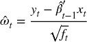

CUSUM 统计量定义为

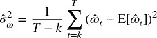

在假设β是某个常数值的情况下，*H [0]* : β [*t*] = β，则*S [*t*]* ∼ *N* [0, *t* − *k* − 1]。该程序的一个警告是起始点是任意选择的，结果可能由于此而不一致。

**17.3.2 朱-斯廷科姆-怀特水平 CUSUM 测试**

该测试遵循 Homm 和 Breitung [2012]。它通过去掉{ *x [*t*]* } [*t* = 1, …, *T*]，简化了之前的方法，并假设*H [0]* : β [*t*] = 0，即我们预测没有变化（E [*t* − 1] [Δ *y [*t*]* ] = 0）。这将使我们能够直接处理*y [*t*]*的水平，从而减轻计算负担。我们计算相对于*y [*n*]*的对数价格*y [*t*]*的标准化偏离，*t* > *n*，为

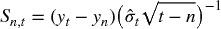

在原假设*H [0]* : β [*t*] = 0 下，*S [*n* , *t*]* ∼ *N* [0, 1]。一侧检验的时间相关临界值为

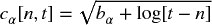

这些作者通过蒙特卡洛法得出 *b [0.05]* = 4.6。该方法的一个缺点是参考水平 *y [*n*]* 的设定有些任意。为克服这个缺陷，我们可以在一系列向后移动的窗口 *n* ∈ [1, *t*] 上估计 *S [*n* , *t*]*，并选择 。

## 17.4 爆炸性测试

爆炸性测试通常可以分为测试单一泡沫和测试多个泡沫的测试。在这种情况下，泡沫不仅限于价格上涨，还包括抛售。允许多个泡沫的测试更为稳健，因为泡沫-破裂-泡沫的周期会使单一泡沫测试的系列看起来是平稳的。Maddala 和 Kim [1998]，以及 Breitung [2014] 提供了文献的良好概述。

**17.4.1 周-类型迪基-福勒检验**

一系列爆炸性测试的灵感来源于 Gregory Chow 的研究，从 Chow [1960] 开始。考虑一阶自回归过程

其中 ϵ [*t*] 是白噪声。零假设是 *y [*t*]* 遵循随机游走，*H [0]* : ρ = 1，备择假设是 *y [*t*]* 最初作为随机游走，但在时刻 τ* *T* 发生变化，其中 τ* ∈ (0, 1)，变为爆炸过程：

在时刻 *T* 我们可以检验是否在时刻 τ* *T*（断裂日期）发生了从随机游走到爆炸过程的转换。为了检验这个假设，我们拟合以下模型，

其中 *D [*t*]* [τ*] 是一个虚拟变量，当 *t* < τ* *T* 时取值为零，当 *t* ≥ τ* *T* 时取值为一。然后，零假设 *H [0]* : δ = 0 与（单侧）备择假设 *H [1]* : δ > 1 进行检验：

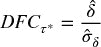

此方法的主要缺点是 τ* 是未知的。为了解决这个问题，Andrews [1993] 提出了一个新的检验方法，其中在某个区间 τ* ∈ [τ [0] , 1 − τ [0] ] 内尝试所有可能的 τ*。正如 Breitung [2014] 所解释的，我们应该在样本的开始和结束处排除一些可能的 τ*，以确保任一状态都有足够的观测值（*D [*t*]* [τ*] 中必须有足够的零和足够的一）。未知 τ* 的检验统计量是所有 *T* (1 − 2τ [0] ) 值的最大值！。

Chow 方法的另一个缺点是它假设只有一个断裂日期 τ* *T*，并且泡沫一直持续到样本结束（没有回到随机游走）。对于存在三种或更多状态（随机游走 → 泡沫 → 随机游走……）的情况，我们需要讨论极大增强的迪基-福勒（SADF）检验。

**17.4.2 极大增强的迪基-福勒检验**

正如 Phillips、Wu 和 Yu [2011] 所说：“标准单位根和协整检验不适合检测泡沫行为，因为它们无法有效区分平稳过程和周期性崩溃的泡沫模型。数据中周期性崩溃泡沫的模式看起来更像是来自单位根或平稳自回归生成的数据，而不是潜在的爆炸性过程。”为了解决这个缺陷，这些作者提出拟合回归规范

这里我们检验 *H [0]* : β ≤ 0, *H [1]* : β > 0。受 Andrews [1993] 的启发，Phillips 和 Yu [2011] 以及 Phillips、Wu 和 Yu [2011] 提出了极大值增强迪基-福勒检验（SADF）。SADF 在每个结束点 *t* 上使用向后扩展的起始点拟合上述回归，然后计算

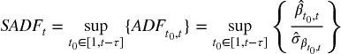

其中 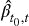 是在从 *t [0]* 开始并在 *t* 结束的样本上估计的，τ 是分析中使用的最小样本长度，*t [0]* 是向后扩展窗口的左边界，而 *t* = τ，…，*T* 。在 *SADF [*t*]* 的估计中，窗口的右侧固定在 *t*。标准 ADF 检验是 *SADF [*t*]* 的特例，其中 τ = *t* − 1。

*SADF [*t*]* 和 SDFC 之间有两个关键区别：首先，*SADF [*t*]* 在每个 *t* ∈ [τ, *T* ] 处计算，而 SDFC 仅在 *T* 处计算。其次，SADF 通过递归扩展样本的开始（*t [0]* ∈ [1, *t* − τ]）而不是引入虚拟变量。通过在（*t [0]*，*t*）上尝试所有组合的嵌套双重循环，SADF 不假设已知的 regime 切换或断点数量。图 17.1 显示了在应用 ETF 技巧（第二章，第 2.4.1 节）后的 E-mini S&P 500 期货价格系列，以及由该价格系列得出的 SADF。SADF 曲线在价格出现泡沫行为时激增，并在泡沫破裂时回落至低水平。在接下来的部分中，我们将讨论对 Phillips 原始 SADF 方法的一些增强。

**图 17.1** 价格（左侧 y 轴）和 SADF（右侧 y 轴）随时间变化

***17.4.2.1 原始价格与对数价格***

在文献中常见的研究会对原始价格进行结构性断裂检验。在这一节中，我们将探讨为什么应优先使用对数价格，特别是在处理涉及泡沫和崩溃的长期时间序列时。

对于原始价格 { *y [*t*]* }，如果拒绝 ADF 的原假设，这意味着价格是平稳的，具有有限的方差。这意味着收益 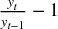 并不是时间不变的，因为收益的波动性必须随着价格上涨而降低，随着价格下跌而增加，以保持价格方差恒定。当我们对原始价格进行 ADF 检验时，我们假设收益的方差并不对价格水平不变。如果收益方差恰好对价格水平不变，该模型将结构性异方差。

相比之下，如果我们使用对数价格，ADF 规格将指出

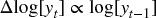

让我们进行变量替换，*x [*t*]* = *ky [*t*]*。现在，log[ *x [*t*]* ] = log[ *k* ] + log[ *y [*t*]* ]，ADF 规格将指出

在这个基于对数价格的替代规格下，价格水平决定了收益的均值，而不是收益的波动性。在小样本中，*k* ≈ 1 时，差异可能在实践中并不重要，但 SADF 在跨十年和泡沫中进行回归时，产生的水平在不同状态下是显著不同的（*k* ≠ 1）。

***17.4.2.2 计算复杂性***

算法运行在 ，因为 SADF 所需的总样本长度 *T* 的 ADF 测试数量是

考虑 ADF 规格的矩阵表示，其中  和 。解决单个 ADF 回归涉及到的浮点运算（FLOPs）如 表 17.1 中列出。

**表 17.1** **每个 ADF 估计的 FLOPs**

| **矩阵运算** | **FLOPs** |
| --- | --- |
| *o [1]* = *X* '*y* | (2*T* − 1)*N* |
| *o [2]* = *X* '*X* | (2*T* − 1)*N ²* |
| *o [3]* = *o ^(− 1) [2]* | *N ³* + *N ²* + *N* |
| *o [4]* = *o [3] o [1]* | 2*N ²* − *N* |
| *o [5]* = *y* − *Xo [4]* | *T* + (2*N* − 1)*T* |
| *o [6]* = *o ^' [5] o [5]* | 2*T* − 1 |
| 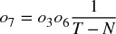 | 2 + *N ²* |
|  | 1 |

这给出了每个 ADF 估计的总 *f* ( *N* , *T* ) = *N ³* + *N ²* (2 *T* + 3) + *N* (4 *T* − 1) + 2 *T* + 2 FLOPs。单个 SADF 更新需要  FLOPs（*T* − τ 次运算以找到最大 ADF 统计量），而估计完整的 SADF 序列需要 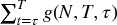。

考虑 E-mini S&P 500 期货上的美元条形系列。对于(*T*, *N*) = (356631, 3)，ADF 估计需要 11,412,245 FLOPs，而 SADF 更新需要 2,034,979,648,799 次操作（大约 2.035 TFLOPs）。完整的 SADF 时间序列需要 241,910,974,617,448,672 次操作（大约 242 PFLOPs）。随着*T*的持续增长，这个数字将迅速增加。而且这个估计不包括对齐、数据预处理、I/O 作业等著名的昂贵操作。毫无疑问，这个算法的双重循环需要大量操作。可能需要一个高性能计算集群来在合理时间内估计 SADF 系列。第二十章将介绍一些在这些情况下有用的并行化策略。

***17.4.2.3 指数行为的条件***

考虑对数价格的零滞后规范，Δlog[*y [*t*]*] = α + βlog[*y [*t* − 1]*] + ϵ[*t*]。这可以重写为，其中。回滚*t*个离散步骤，我们得到，或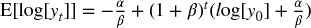。索引*t*可以在给定时间重置，以预测在接下来的*t*步骤后*y [0]* → *y [*t*]*的未来轨迹。这揭示了表征该动态系统三种状态的条件：

+   稳定：。

    +   不均衡是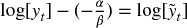。

    +   然后在（半衰期）。

+   单根：β = 0，其中系统是非平稳的，表现为一个鞅。

+   爆炸性：β > 0，其中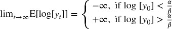。

***17.4.2.4 分位数 ADF***

SADF 在 t 值系列中取上确界，。选择极值会引入一些鲁棒性问题，其中 SADF 估计可能会根据采样频率和样本的具体时间戳显著变化。ADF 极值的更鲁棒的估计量如下：首先，设定。其次，我们定义*Q [*t* , *q*]* = *Q* [*s [*t*]* , *q*]，作为高 ADF 值的集中性度量，其中*q* ∈ [0, 1]。第三，我们定义，其中 0 < *v* ≤ min{*q*, 1 − *q*}，作为高 ADF 值的离散度量。例如，我们可以设置*q* = 0.95 和*v* = 0.025。请注意，SADF 只是 QADF 的一个特例，其中*SADF [*t*]* = *Q [*t* , 1]*，并且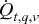未定义，因为*q* = 1。

***17.4.2.5 条件 ADF***

或者，我们可以通过计算条件矩来解决对 SADF 稳健性的担忧。设 *f* [ *x* ] 为  的概率分布函数，*x* ∈ *s [*t*]*。然后，我们定义 *C [*t*  ,  *q*] * = *K ^(− 1) * ∫ ^∞ [   *Qt*  ,  *q*   ]  *xf* [ *x* ] *dx* 作为高 ADF 值的中心度量，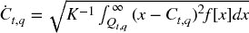 作为高 ADF 值的离散度量，正则化常数为 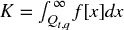。例如，我们可以使用 *q* = 0.95。

由构造得出，*C [*t* , *q*]* ≤ *SADF [*t*]*。*SADF [*t*]* 与 *C [*t* , *q*]* 的散点图显示了下边界，呈现为一条大约单位梯度的上升线（见 图 17.2）。当 SADF 超过 -1.5 时，我们可以看到一些水平轨迹，这与 *s [*t*]* 的右侧肥尾突然扩展一致。换句话说， 即使 *C [*t* , *q*]* 相对较小，也可以达到显著大的值，因为 *SADF [*t*]* 对离群值敏感。

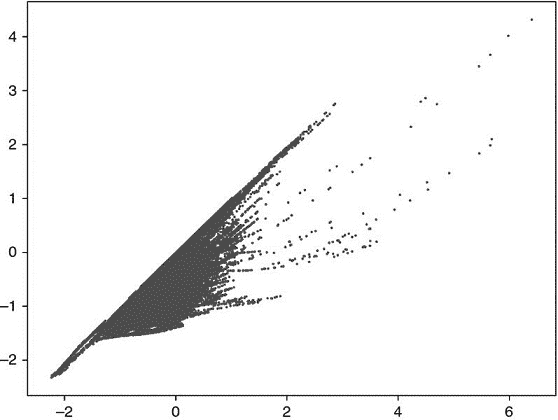

**图 17.2** SADF (x 轴) 对比 CADF (y 轴)

图 17.3 (a) 绘制了随时间变化的 E-mini S&P 500 期货价格的 。 图 17.3 (b) 是  与 *SADF [*t*] * 的散点图，基于 E-mini S&P 500 期货价格计算。它显示了 *s [*t*] * 中的离群值向上偏倚 *SADF [*t*] * 的证据。

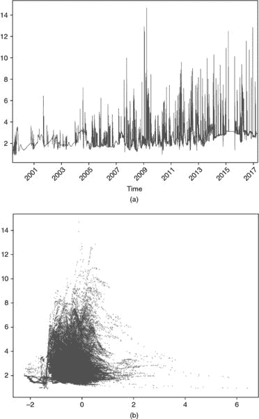

**图 17.3** (a)  随时间变化 (b) 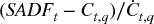 (y 轴) 作为 *SADF [*t*] * (x 轴) 的函数

***17.4.2.6 SADF 实现***

本节介绍 SADF 算法的实现。此代码的目的是阐明估算 SADF 的步骤，而不是快速估算 SADF。代码片段 17.1 列出了 SADF 的内部循环。这部分估算 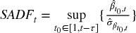，这是算法的回移成分。外部循环（此处未显示）对逐步的 *t* 重复此计算，{ *SADF [*t*] * } [*t*  = 1, …,  *T*]。参数为：

+   `logP` : 包含对数价格的 pandas 系列

+   `minSL` : 最小样本长度 (τ)，用于最终回归

+   `constant` : 回归的时间趋势成分

    +   `'nc'` : 没有时间趋势，仅有一个常数

    +   `'ct'` : 一个常数加上线性时间趋势

    +   `'ctt'` : 一个常数加上二次多项式时间趋势

+   `lags` : ADF 规范中使用的滞后数

> **代码片段 17.1 SADF 的内部循环**
> 
> 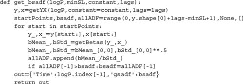

代码片段 17.2 列出了函数 `getXY`，该函数准备进行递归测试所需的 numpy 对象。

> **代码片段 17.2 准备数据集**
> 
> 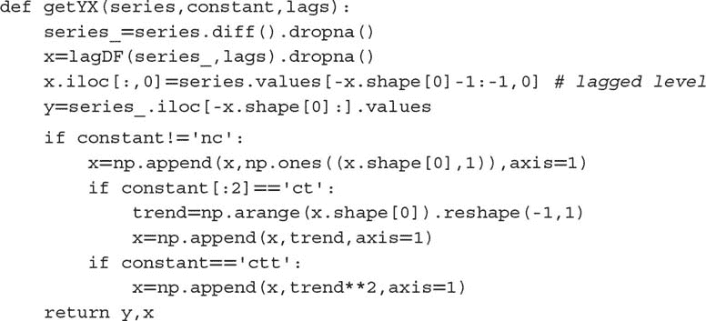

代码片段 17.3 列出了函数 `lagDF`，它将滞后应用于指定的参数 `lags` 的数据框。

> **代码片段 17.3 将滞后应用于数据框**
> 
> 

最后，片段 17.4 列出了函数`getBetas`，它执行实际的回归。

> **片段 17.4 拟合 ADF 规范**
> 
> 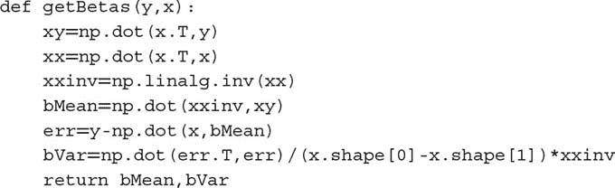

**17.4.3 次级和超级马尔可夫链测试**

在本节中，我们将介绍不依赖于标准 ADF 规范的爆炸性测试。考虑一个过程，它要么是次马尔可夫链，要么是超级马尔可夫链。给定一些观测值{ *y [*t*]* }，我们希望测试是否存在爆炸性时间趋势，*H [0]* : β = 0，*H [1]* : β ≠ 0，在其他规范下：

+   多项式趋势（SM-Poly1）：

    > > 

+   多项式趋势（SM-Poly2）：

    > > 

+   指数趋势（SM-Exp）：

    > > 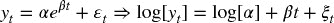

+   势能趋势（SM-Power）：

    > > 

类似于 SADF，我们对每个结束点*t* = τ, …, *T*进行向后扩展的起始点拟合，然后计算

绝对值的原因在于我们同样关注爆炸性增长和崩溃。在简单回归情况下（Greene [2008], p. 48），β的方差是，因此。相同的结果可以推广到多元线性回归情况（Greene [2008], pp. 51–52）。弱长期泡沫的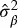可能小于强短期泡沫的，从而使该方法偏向长期泡沫。为了纠正这种偏差，我们可以通过确定系数φ ∈ [0, 1]来惩罚较大的样本长度，从而产生最佳的爆炸性信号。

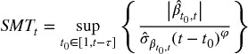

例如，当φ = 0.5 时，我们在简单回归情况下补偿与较长样本长度相关的较低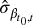。当φ → 0 时，*SMT [*t*]*将显示更长的趋势，因为这种补偿减弱，长期泡沫掩盖短期泡沫。当φ → 1 时，*SMT [*t*]*变得更加嘈杂，因为更多的短期泡沫被选中而不是长期泡沫。因此，这是一种自然的方法来调整爆炸性信号，使其过滤针对特定持有期的机会。机器学习算法使用的特征可能包括从广泛的φ值估算的*SMT [*t*]*。

**练习**

1.  > > 在 E-mini S&P 500 期货的美元条形系列中，

    1.  应用布朗-达宾-埃文斯方法。它能识别网络泡沫吗？

    1.  应用 Chu-Stinchcombe-White 方法。它能找到 2007-2008 年的泡沫吗？

1.  > > 在 E-mini S&P 500 期货的美元条形系列中，

    1.  计算*SDFC*（周-类型）爆炸性测试。此方法选择了什么断裂日期？这是你所预期的吗？

    1.  计算并绘制此系列的 SADF 值。你是否观察到围绕网络泡沫和大衰退之前的极端峰值？这些爆发是否也导致了峰值？

1.  > > 继续练习 2，

    1.  确定系列显示的周期

        1.  稳定条件

        1.  单根条件

        1.  爆炸性条件

    1.  计算 QADF。

    1.  计算 CADF。

1.  > > 在 E-mini S&P 500 期货的美元条形系列中，

    1.  计算 SM-Poly1 和 SM-Poly 2 的 SMT，其中φ = 1。它们的相关性是什么？

    1.  计算 SM-Exp 的 SMT，其中φ = 1 和φ = 0.5。它们的相关性是什么？

    1.  计算 SM-Power 的 SMT，其中φ = 1 和φ = 0.5。它们的相关性是什么？

1.  > > 如果你计算每个价格的倒数，序列{ *y ^(− 1) [*t*]* }将泡沫转变为爆破，爆破转变为泡沫。

    1.  识别爆破是否需要这种转化？

    1.  本章中有哪些方法可以识别爆破而不需要这种转化？

**参考文献**

1.  Andrews, D. (1993): “具有未知变更点的参数不稳定性和结构变化的检验。” *计量经济学*，第 61 卷，第 4 期（7 月），页码 821–856。

1.  Breitung, J. 和 R. Kruse (2013): “当泡沫破裂时：基于结构断裂的计量经济学检验。” *统计论文*，第 54 卷，页码 911–930。

1.  Breitung, J. (2014): “投机泡沫的计量经济学检验。” *波恩经济学杂志*，第 3 卷，第 1 期，页码 113–127。

1.  Brown, R.L., J. Durbin, 和 J.M. Evans (1975): “检验回归关系在时间上的恒定性的技术。” *皇家统计学会杂志 B 系列*，第 35 卷，页码 149–192。

1.  Chow, G. (1960). “两个线性回归中系数集相等的检验。” *计量经济学*，第 28 卷，第 3 期，页码 591–605。

1.  Greene, W. (2008): *计量经济学分析*，第 6 版。培生普伦蒂斯霍尔。

1.  Homm, U. 和 J. Breitung (2012): “股市投机泡沫的检验：替代方法的比较。” *金融计量经济学杂志*，第 10 卷，第 1 期，198–231。

1.  Maddala, G. 和 I. Kim (1998): *单位根、协整与结构变化*，第一版。剑桥大学出版社。

1.  Phillips, P., Y. Wu, 和 J. Yu (2011): “1990 年代纳斯达克的爆炸性行为：何时过度乐观推动资产价值上升？” *国际经济评论*，第 52 卷，页码 201–226。

1.  Phillips, P. 和 J. Yu (2011): “在次贷危机期间对金融泡沫时间线的追溯。” *定量经济学*，第 2 卷，页码 455–491。

1.  Phillips, P., S. Shi, 和 J. Yu (2013): “多重泡沫的检验 1：S&P 500 的历史过度乐观与崩溃事件。” 工作论文 8–2013，新加坡管理大学。

