# 第十八章：熵特征

## 18.1 动机

价格序列传达关于需求和供应力量的信息。在完美市场中，价格是不可预测的，因为每个观察都传递了关于产品或服务的所有已知信息。当市场不完美时，价格是基于部分信息形成的，由于一些参与者了解的信息比其他人更多，他们可以利用这种信息不对称。评估价格序列的信息内容，并形成特征以供机器学习算法学习可能的结果将是有益的。例如，机器学习算法可能发现，当价格传递的信息很少时，动量投资更有利可图，而当价格传递的信息很多时，均值回归投资更有利可图。在本章中，我们将探讨确定价格序列中包含的信息量的方法。

## 18.2 香农熵

在本节中，我们将回顾一些信息理论中的概念，这些概念在本章的其余部分将会有用。读者可以在 MacKay [2003] 中找到完整的阐述。信息理论之父克劳德·香农定义熵为由一个静态数据源产生的平均信息量（在长消息中）。它是描述消息所需的每个字符的最小比特数，以唯一可解码的方式表示。数学上，香农 [1948] 将离散随机变量 *X* 的熵定义为其可能值 *x* ∈ *A* 的

满足 0 ≤ *H* [ *X* ] ≤ log [2] [|| *A* ||]，其中：*p* [ *x* ] 是 *x* 的概率；*H* [ *X* ] = 0⇔∃ *x* | *p* [ *x* ] = 1；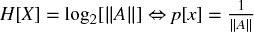 对于所有 *x*；|| *A* || 是集合 *A* 的大小。这可以解释为在 *X* 中信息内容的概率加权平均值，其中信息的比特数被测量为 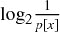。将信息测量为 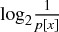 的原因在于观察到低概率结果所揭示的信息比高概率结果更多。换句话说，当意外发生时，我们会学习。类似地，冗余被定义为

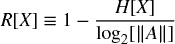

满足 0 ≤ *R* [ *X* ] ≤ 1。科尔莫哥洛夫 [1965] 形式化了冗余与马尔可夫信息源复杂性之间的联系。两个变量之间的互信息被定义为从联合概率密度到边际概率密度乘积的库尔贝克-莱布勒发散。

互信息（MI）总是非负的，对称的，并且当且仅当 *X* 和 *Y* 独立时等于零。对于正态分布的变量，互信息与熟悉的皮尔逊相关性 ρ 密切相关。

因此，互信息是变量之间关联的自然度量，无论它们是线性还是非线性的（Hausser 和 Strimmer [2009]）。信息的标准化变异是从互信息派生的度量。有关多个熵估计器的信息，请参见：

+   在 R 中：[`cran.r-project.org/web/packages/entropy/entropy.pdf`](http://cran.r-project.org/web/packages/entropy/entropy.pdf)

+   在 Python 中：[`code.google.com/archive/p/pyentropy/`](https://code.google.com/archive/p/pyentropy/)

## 18.3 插值（或最大似然）估计器

在本节中，我们将按照 Gao 等人 [2008] 对熵最大似然估计器的阐述进行讨论。术语可能一开始显得有些奇怪（无意中的双关），但一旦你熟悉它，就会发现它很方便。给定数据序列 *x ^(*n*) [1]*，包括从位置 1 开始到位置 *n* 结束的值串，我们可以在该序列中形成所有长度为 *w* < *n* 的单词字典 *A ^(*w*)*。考虑一个任意单词 *y ^(*w*) [1]* ∈ *A ^(*w*)*，其长度为 *w*。我们用  表示单词 *y ^(*w*) [1]* 在 *x ^(*n*) [1]* 中的经验概率，这意味着  是 *y ^(*w*) [1]* 在 *x ^(*n*) [1]* 中出现的频率。假设数据是由一个平稳且遍历的过程生成的，那么大数法则保证，对于固定的 *w* 和较大的 *n*，经验分布  将接近真实分布 *p [*w*]*。在这种情况下，熵率（即每位的平均熵）的自然估计器是

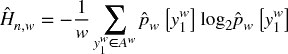

由于经验分布也是对真实分布的最大似然估计，因此这通常被称为最大似然熵估计器。值 *w* 应足够大，以便  接近真实熵 *H*。值 *n* 需要远大于 *w*，以确保阶数为 *w* 的经验分布接近真实分布。片段 18.1 实现了插值熵估计器。

> **片段 18.1 插值熵估计器**
> 
> 

## 18.4 Lempel-Ziv 估计器

熵可以被解释为复杂度的度量。复杂的序列包含的信息比规则（可预测）序列要多。Lempel-Ziv（LZ）算法有效地将消息分解为非冗余子串（Ziv 和 Lempel [1978]）。我们可以将消息的压缩率估计为 Lempel-Ziv 字典中项目数量相对于消息长度的函数。这里的直觉是，复杂消息具有高熵，这会要求相对于要传输的字符串长度需要较大的字典。片段 18.2 显示了 LZ 压缩算法的实现。

> **片段 18.2 使用 LZ 算法构建的库**
> 
> 

Kontoyiannis [1998] 试图更有效地利用消息中的可用信息。以下是对 Gao 等人[2008]的阐述的忠实总结。我们将重现该论文中的步骤，并补充实现其思想的代码片段。我们定义 *L ^(*n*) [*i*]* 为在*i*之前的*n*位中找到的最长匹配长度加 1，

片段 18.3 实现了确定最长匹配长度的算法。一些值得注意的事项：

+   对于滑动窗口，值*n*是常量，而对于扩展窗口，*n* = *i*。

+   计算*L ^(*n*) [*i*]*需要数据*x ^(*i* + *n* − 1) [*i* − *n*]*。换句话说，索引*i*必须位于窗口的中心。这一点很重要，以确保两个匹配字符串的长度相同。如果它们长度不同，*l*的范围将有限，最大值会被低估。

+   允许两个子字符串之间有一些重叠，尽管显然它们不能同时在*i*处开始。

> **片段 18.3 计算最长匹配长度的函数**
> 
> 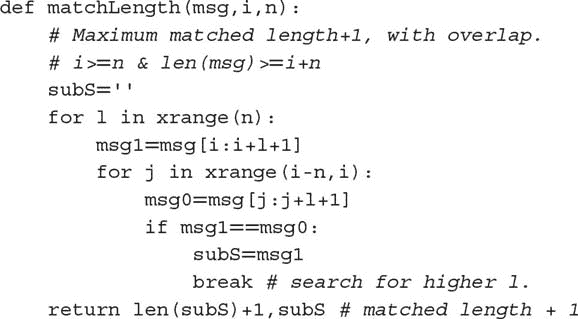

Ornstein 和 Weiss [1993] 正式建立了

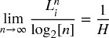

Kontoyiannis 利用这一结果来估计香农的熵率。他估计平均值，并使用该平均值的倒数来估计*H*。一般的直觉是，随着可用历史的增加，我们期望具有高熵的消息产生相对较短的非冗余子字符串。相反，具有低熵的消息在解析时将产生相对较长的非冗余子字符串。给定数据实现*x ^∞ [ − ∞ ]*、窗口长度*n* ≥ 1，以及匹配数量*k* ≥ 1，滑动窗口 LZ 估计器定义为

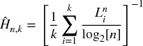

同样，增加窗口的 LZ 估计器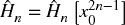定义为

计算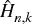时窗口大小*n*是常量，因此*L ^(*n*) [ *i* ]*。然而，计算时，窗口大小随着*i*的增加而增加，因此*L ^(*i*) [ *i* ]*，并且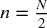。在这个扩展窗口的情况下，消息的长度*N*应该是一个偶数，以确保所有位都被解析（回想一下，*x [*i*]*位于中心，因此对于奇数长度的消息，最后一位不会被读取）。

上述表达式是在以下假设下推导出的：平稳性、遍历性，过程取有限多个值，并且该过程满足 Doeblin 条件。直观上，这一条件要求在有限步骤*r*后，无论之前发生了什么，任何事情都可以以正概率发生。事实证明，如果我们考虑上述估计器的修改版本，可以完全避免这一 Doeblin 条件：

在估计 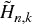 时，一个实际问题是如何确定窗口大小 *n*。Gao et al. [2008] 认为 *k* + *n* = *N* 应该大致等于消息长度。考虑到 *L ^(*n*) [   *i*   ] * 的偏差为  级别，*L ^(*n*) [   *i*   ] * 的方差为 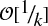 级别，偏差/方差权衡在  附近达到平衡。也就是说，*n* 可以选择使 *N* ≈ *n* + (log [2] [ *n* ])²。比如，对于 *N* = 2 ⁸，一个平衡的偏差/方差窗口大小将是 *n* ≈ 198，此时 *k* ≈ 58。

Kontoyiannis [1998] 证明了 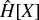 在 *n* 趋近于无穷大时以概率 1 收敛于香农的熵率。代码片段 18.4 实现了 Gao et al. [2008] 中讨论的思想，通过寻找两个相同大小子字符串之间的最大冗余来改进 Kontoyiannis [1997] 的方法。

> **代码片段 18.4 在 Gao et al. [2008] 中讨论的算法的实现**
> 
> 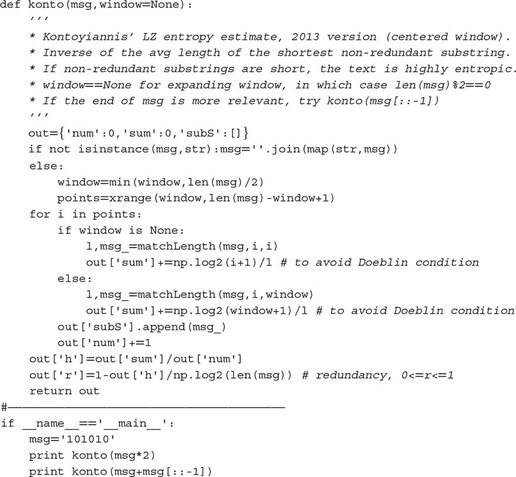

该方法的一个警告是熵率在极限中定义。用 Kontoyiannis 的话说，“我们将一个大整数 *N* 固定为我们的数据库大小。”Kontoyiannis 论文中使用的定理证明了渐近收敛；然而，哪里也没有声称单调性属性。当消息较短时，解决方案可能是多次重复相同的消息。

第二个警告是，由于匹配的窗口必须是对称的（字典与被匹配的子字符串长度相同），只有在消息长度对应于偶数时，最后一位才会被考虑进行匹配。一个解决方案是去掉长度为奇数的消息的第一位。

第三个警告是，当前面的序列不规则时，一些最终位将被忽略。这也是对称匹配窗口的一个结果。例如，“10000111”的熵率等于“10000110”的熵率，这意味着由于第六位和第七位的不匹配“11”，最后一位是无关的。当消息的结尾特别重要时，一个好的解决方案可能是分析反转消息的熵。这不仅确保了最终位（即反转后的初始位）被使用，实际上，它们将被用于潜在地匹配每一位。根据前面的例子，“11100001”的熵率为 0.96，而“01100001”的熵率为 0.84。

## 18.5 编码方案

估计熵需要对消息进行编码。在本节中，我们将回顾文献中使用的一些基于收益的编码方案。尽管接下来的讨论中未提及，但建议对分数（而非整数）微分系列中的信息进行编码（第四章），因为它们仍然包含一些记忆。

**18.5.1 二进制编码**

熵率估计需要将连续变量离散化，以便每个值可以从有限字母表中分配一个代码。例如，一串收益 *r [*t*]* 可以根据符号进行编码，*r [*t*]* > 0 时为 1，*r [*t*]* < 0 时为 0，去除 *r [*t*]* = 0 的情况。在从价格条采样的收益序列中，二进制编码自然产生，因为 | *r [*t*]* | 大致是恒定的。

当 | *r [*t*]* | 可以采用广泛的结果时，二进制编码会丢弃潜在的有用信息。尤其在处理受异方差影响的日内时间条时，这一点尤为明显，因其源于非均质的逐笔数据。解决这种异方差的一种方法是根据一个从属随机过程对价格进行采样。例如，交易条和成交量条包含固定数量的交易或固定成交量的交易（见第二章）。通过在这种非时间顺序的市场驱动时钟中操作，我们在高度活跃的时期更频繁地采样，而在活动较少的时期则较少采样，从而使 | *r [*t*]* | 的分布得到规整，并减少对大量字母表的需求。

**18.5.2 分位数编码**

除非使用价格条，否则可能需要超过两个代码。一种方法是根据每个 *r [*t*]* 所在的分位数分配代码。分位数边界是使用样本内周期（训练集）确定的。总体样本内每个字母分配的观察数量相同，样本外每个字母的观察数量接近相同。在使用该方法时，某些代码覆盖的 *r [*t*]* 范围比其他代码大。这种均匀（样本内）或接近均匀（样本外）的代码分布往往会平均提高熵值读数。

**18.5.3 西格玛编码**

作为一种替代方法，我们可以让价格流决定实际字典，而不是固定代码数量。假设我们固定一个离散化步骤，σ。那么，我们将值 0 分配给 *r [*t*]* ∈ [.min{ *r* }, min{ *r* } + σ)，1 分配给 *r [*t*]* ∈ .min{ *r* } + σ, min{ *r* } + 2σ)，以此类推，直到每个观察值都用总共 ![ 个代码进行编码，其中 ceil[.] 是天花板函数。与分位数编码不同，现在每个代码覆盖 *r [*t*]* 的范围相同的比例。由于代码并非均匀分布，熵读数往往会比分位数编码小；然而，“稀有”代码的出现会导致熵读数的峰值。

## 18.6 高斯过程的熵

IID 正态随机过程的熵（见诺里奇 [2003]）可以推导为

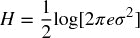

对于标准正态分布，*H* ≈ 1.42。这个结果至少有两个用途。首先，它允许我们基准测试熵估计器的性能。我们可以从标准正态分布中抽样，找出哪种估计器、消息长度和编码的组合给出的熵估计 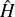 足够接近理论推导的值 *H*。例如，图 18.1 绘制了使用 Kontoyiannis 方法在长度为 100 的消息中，使用 10、7、5 和 2 字母编码下的熵估计的引导分布。当字母表至少有 10 个字母时，Snippet 18.4 中的算法给出了正确答案。当字母表过小时，信息会丢失，熵会被低估。

**图 18.1** 在长度为 100 的消息中，使用 10（顶部）、7（底部）字母编码下的熵估计分布

在长度为 100 的消息中，使用 5（顶部）和 2（底部）字母编码下的熵估计分布

其次，我们可以使用上述方程将熵与波动性联系起来，注意到 。这给出了熵隐含的波动性估计，前提是收益确实来自正态分布。

## 18.7 熵与广义均值

这里有一种有趣的思考熵的方法。考虑一组实数 *x* = { *x [*i*]* } [*i* = 1, …, *n*] 和权重 *p* = { *p [*i*]* } [*i* = 1, …, *n*]，使得 0 ≤ *p [*i*]* ≤ 1，∀ *i* 并且 。加权均值的推广 *x* 在幂 *q* ≠ 0 时定义为

对于 *q* < 0，我们必须要求 *x [*i*]* > 0，∀ *i*。之所以称其为广义均值，是因为其他均值可以作为特例得到：

+   最小值: 

+   调和均值: 

+   几何均值: 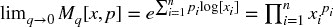

+   算术均值: 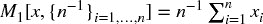

+   加权均值: 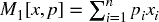

+   二次均值: 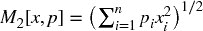

+   最大值: 

在信息理论的背景下，一个有趣的特例是 *x* = { *p [*i*]* } [*i* = 1, …, *n*]，因此

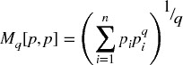

让我们定义量 ，对于某些 *q* ≠ 1。再次，对于 *q* < 1 在 *N [*q*] * [ *p* ]中，我们必须有 *p [*i*] * > 0，∀ *i*。如果 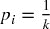 对于 *k* ∈ [1, *n*] 不同的索引，且 *p [*i*] * = 0 在其他地方，则权重均匀分布在 *k* 个不同项目上，并且 *N [*q*] * [ *p* ] = *k* 对于 *q* > 1。换句话说，*N [*q*] * [ *p* ] 根据 *q* 设置的某种加权方案，给出了 *有效数量* 或 *多样性*。

使用詹森不等式，我们可以证明 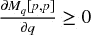，因此 。较小的*q*值为分区的元素分配了更均匀的权重，相对赋予较少见元素更多的权重，而  只是非零 *p [*i*]* 的总数。

香农熵是 。这表明熵可以被解释为列表 *p* 中项目的*有效数*的对数，其中 *q* → 1。图 18.2 说明了一族随机生成的 *p* 数组的对数有效数是如何随着 *q* 接近 1 而收敛到香农熵的。同时注意，当 *q* 变大时，它们的行为是如何稳定的。

**图 18.2** 随机生成的*p*数组族的对数有效数

直观上，熵测量信息的水平是随机变量所包含的*多样性*。这一直觉通过广义均值的概念得到形式化。这意味着香农熵是多样性度量的一个特例（因此与波动性的关联）。我们现在可以定义和计算除了熵之外的其他多样性度量，其中 *q* ≠ 1。

## 18.8 熵的一些金融应用

在本节中，我们将介绍熵在金融市场建模中的一些应用。

**18.8.1 市场效率**

当套利机制利用了所有机会时，价格会瞬间反映出所有可用信息的总量，变得不可预测（即，鞅），且没有明显的模式。相反，当套利不完美时，价格包含不完整的信息，这会导致可预测的模式。当一串数据包含冗余信息时，就会出现模式，这使得其能够被压缩。字符串的熵率决定了其最佳压缩率。熵越高，冗余越低，信息内容越丰富。因此，价格字符串的熵告诉我们在某一时刻市场效率的程度。“未压缩”的市场是一个有效市场，因为价格信息是非冗余的。“压缩”的市场是一个无效市场，因为价格信息是冗余的。泡沫是在压缩（低熵）市场中形成的。

**18.8.2 最大熵生成**

在一系列论文中，Fiedor [2014a, 2014b, 2014c] 提出使用 Kontoyiannis [1997] 来估计价格序列中的熵量。他认为，在可能的未来结果中，最大化熵的结果可能是最有利可图的，因为它是最不易被频率统计模型预测的情形。这是最有可能触发止损的黑天鹅情境，从而产生一个反馈机制，增强并加剧市场变动，导致收益时间序列的波动。

**18.8.3 投资组合集中度**

考虑一个在收益上计算的*NxN*协方差矩阵*V*，首先，我们计算矩阵的特征值分解，*VW* = *W* Λ。其次，我们获得因子负载向量为*f [ω]* = *W* 'ω，其中ω是分配向量，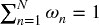 . ^(  1  ) 第三，我们推导每个主成分所贡献的风险部分（Bailey 和 López de Prado [2012]）为

其中 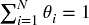，且θ[*i*] ∈ [0, 1]，∀ *i* = 1, …, *N*。第四，Meucci [2009] 提出了以下受熵启发的投资组合集中度定义，

起初，这一定义的投资组合集中度可能听起来很惊人，因为θ[*i*]不是一个概率。这种集中度概念与熵的联系源于我们在第十八章第 18.7 节讨论的广义均值。

**18.8.4 市场微观结构**

Easley 等人 [1996, 1997] 表明，当好消息/坏消息的赔率相等时，信息交易的概率（PIN）可以推导为

其中μ是知情交易者的到达率，ϵ是不知情交易者的到达率，α是信息事件的概率。PIN 可以解释为来自知情交易者的订单相对于整体订单流的比例。

在大小为*V*的成交量区间内，我们可以根据某些算法（例如 tick 规则或 Lee-Ready 算法）将价格波动分类为买入或卖出。设*V ^(*B*) [τ]*为成交量区间τ内买入价格波动的成交量总和，*V ^(*S*) [τ]*为成交量区间τ内卖出价格波动的成交量总和。Easley 等人 [2012a, 2012b] 指出 E[| *V ^(*B*) [τ]* − *V [τ] ^(*S*)* |] ≈ αμ，并且期望总成交量为 E[ *V ^(*B*) [τ]* + *V [τ] ^(*S*)* ] = αμ + 2ϵ。通过使用成交量时钟（Easley 等人 [2012c]），我们可以将 E[ *V ^(*B*) [τ]* + *V [τ] ^(*S*)* ] = αμ + 2ϵ = *V* 设定为外生的。这意味着，在成交量时钟下，PIN 简化为

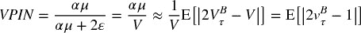

其中 。注意，2 *v ^(*B*) [  τ  ] * − 1 表示订单流不平衡 *OI [τ]*，这是一个有界的实值变量，其中 *OI [τ]* ∈ [ − 1, 1]。因此，VPIN 理论提供了在成交量时钟下，信息交易概率（PIN）与订单流不平衡的持久性之间的正式联系。有关此微观结构理论的进一步细节，请参见第十九章。

持续的订单流失衡是不利选择的必要但不充分条件。为了使市场做市商能够向知情交易者提供流动性，该订单流失衡 | *OI [τ]* | 也必须相对不可预测。换句话说，当市场做市商对订单流失衡的预测准确时，即使 | *OI [τ]* | ≫ 0，他们也不会被不利选择。在确定不利选择的概率时，我们必须确定订单流失衡的不可预测性。我们可以通过应用信息理论来确定这一点。

考虑一个长的符号序列。当该序列包含少量冗余模式时，它具有一种复杂性，使其难以描述和预测。Kolmogorov [1965] 制定了冗余与复杂性之间的联系。在信息理论中，无损压缩的任务是用尽可能少的比特完美描述一个序列。序列中包含的冗余越多，可以实现的压缩率就越大。熵表征了源的冗余，因此也表征了其 Kolmogorov 复杂性及其可预测性。我们可以利用序列的冗余与其不可预测性（由市场做市商判断）之间的联系来推导不利选择的概率。

在这里，我们将讨论一种特定程序，该程序将不利选择的概率推导为订单流失衡中固有复杂性的函数。首先，给定一个按τ = 1, …, *N* 索引的成交量条序列，每个条的大小为*V*，我们确定被分类为买入的成交量部分，*v ^(*B*) [τ]* ∈ [0, 1]。第二，我们计算{ *v ^(*B*) [τ]* }上的 *q* -分位数，定义一个集合*K* 的 *q* 个不相交子集，*K* = { *K [1]* , …, *K [*q*]* }。第三，我们从每个 *v ^(*B*) [τ]* 生成一个映射到其中一个不相交子集，*f* : *v ^(*B*) [τ]* → {1, …, *q* }，其中 *f* [ *v ^(*B*) [τ]* ] = *i* ⇔ *v [τ] ^(*B*)* ∈ *K [*i*]* , ∀ *i* ∈ [1, *q* ]。第四，我们通过将每个值 *v ^(*B*) [τ]* 分配给它所属的子集 *K* 的索引 *f* [ *v ^(*B*) [τ]* ] 来量化{ *v ^(*B*) [τ]* }。这导致将订单失衡集合{ *v ^(*B*) [τ]* }翻译为量化消息 *X* = [ *f* [ *v ^(*B*) [1]* ], *f* [ *v [2] ^(*B*)* ], …, *f* [ *v ^(*B*) [*N*]* ] ]。第五，我们使用 Kontoyiannis 的 Lempel-Ziv 算法估计熵 *H* [ *X* ]。第六，我们推导累积分布函数 *F* [ *H* [ *X* ] ]，并使用{ *F* [ *H* [ *X [τ]* ]]} [τ = 1, …, *N*]的时间序列作为特征来预测不利选择。

**练习**

1.  > > 在 E-mini S&P 500 期货上形成美元条：

    1.  使用二进制方法量化回报序列。

    1.  使用分位数编码对回报序列进行量化，使用 10 个字母。

    1.  使用σ为所有条回报的标准差的 sigma 编码对回报序列进行量化。

    1.  使用插值法计算三个编码序列的熵。

    1.  使用 Kontoyiannis 方法计算三个编码序列的熵，窗口大小为 100。

1.  > > 使用练习 1 中的柱状图：

    1.  计算收益序列，{*r [*t*]* }。

    1.  将序列编码如下：如果 *r [*t*] r [*t* − 1]* < 0，则为 0；如果 *r [*t*] r [*t* − 1]* ≥ 0，则为 1。

    1.  将序列分成 1000 个相等大小的不重叠子集（你可能需要在开头丢弃一些观测值）。

    1.  使用插值法计算每个 1000 个编码子集的熵。

    1.  使用 Kontoyiannis 方法计算每个 1000 个编码子集的熵，窗口大小为 100。

    1.  计算结果 2.d 和 2.e 之间的相关性。

1.  > > 从标准正态分布中抽取 1000 个观测值：

    1.  这个过程的真实熵是什么？

    1.  根据 8 个分位数标记观测值。

    1.  使用插值法估计熵。

    1.  使用 Kontoyiannis 方法估计熵：

        1.  使用窗口大小为 10。

        1.  使用窗口大小为 100。

1.  > > 使用练习 3 中的抽样，{ *x [*t*]* } [*t* = 1, …, 1000]：

    1.  计算 *y [*t*]* = ρ*y [*t* − 1]* + *x [*t*]*，其中ρ = .5，*y [0]* = 0。

    1.  根据 8 个分位数标记 {*y [*t*]* } 的观测值。

    1.  使用插值法估计熵。

    1.  使用 Kontoyiannis 方法估计熵。

        1.  使用窗口大小为 10。

        1.  使用窗口大小为 100。

1.  > > 假设有一个投资组合，包含 10 个等额投资的持仓。

    1.  总风险中由第 *i* 个主成分贡献的部分是 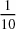，*i* = 1, …, 10。投资组合的熵是多少？

    1.  总风险中由第 *i* 个主成分贡献的部分是 ，*i* = 1, …, 10。投资组合的熵是多少？

    1.  总风险中由第 *i* 个主成分贡献的部分是 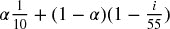，*i* = 1, …, 10，α ∈ [0, 1]。将投资组合的熵作为α的函数进行绘图。

**参考文献**

1.  Bailey, D.和 M. López de Prado（2012）：“平衡篮子：一种新的交易和对冲风险的方法。” *投资策略期刊*，第 1 卷，第 4 期，页 21–62。可在[`ssrn.com/abstract=2066170`](https://ssrn.com/abstract=2066170)获得。

1.  Easley D.、M. Kiefer、M. O'Hara 和 J. Paperman（1996）：“流动性、信息与不常交易的股票。” *金融期刊*，第 51 卷，第 4 期，页 1405–1436。

1.  Easley D.、M. Kiefer 和 M. O'Hara（1997）：“交易过程的信息内容。” *实证金融期刊*，第 4 卷，第 2 期，页 159–185。

1.  Easley, D.、M. López de Prado 和 M. O'Hara（2012a）：“流动性毒性与高频世界中的流动性。” *金融研究评论*，第 25 卷，第 5 期，页 1547–1493。

1.  Easley, D.、M. López de Prado 和 M. O'Hara（2012b）：“成交量时钟：对高频范式的洞察。” *投资组合管理期刊*，第 39 卷，第 1 期，页 19–29。

1.  Gao, Y., I. Kontoyiannis 和 E. Bienestock (2008): “估计二元时间序列的熵：方法论、一些理论和仿真研究。” 工作论文，arXiv。可在 [`arxiv.org/abs/0802.4363v1.`](https://arxiv.org/abs/0802.4363v1.) 查看。

1.  Fiedor, Pawel (2014a): “基于互信息率的金融市场网络。” 工作论文，arXiv。可在 [`arxiv.org/abs/1401.2548.`](https://arxiv.org/abs/1401.2548.) 查看。

1.  Fiedor, Pawel (2014b): “信息论方法对金融市场的领先-滞后效应。” 工作论文，arXiv。可在 [`arxiv.org/abs/1402.3820.`](https://arxiv.org/abs/1402.3820.) 查看。

1.  Fiedor, Pawel (2014c): “因果非线性金融网络。” 工作论文，arXiv。可在 [`arxiv.org/abs/1407.5020.`](https://arxiv.org/abs/1407.5020.) 查看。

1.  Hausser, J. 和 K. Strimmer (2009): “熵推断与詹姆斯-斯坦因估计器，及其在非线性基因关联网络中的应用，” *机器学习研究杂志*，第 10 卷，第 1469–1484 页。[`www.jmlr.org/papers/volume10/hausser09a/hausser09a.pdf.`](http://www.jmlr.org/papers/volume10/hausser09a/hausser09a.pdf.)

1.  Kolmogorov, A. (1965): “信息定量定义的三种方法。” *信息传输问题*，第 1 卷，第 1 期，第 1–7 页。

1.  Kontoyiannis, I. (1997): “文学风格的复杂性与熵”， *NSF 技术报告* # 97。

1.  Kontoyiannis (1998): “渐近最优有损 Lempel-Ziv 编码，” *ISIT*，马萨诸塞州剑桥，8 月 16–21 日。

1.  MacKay, D. (2003): *信息理论、推理与学习算法，第 1 版*。剑桥大学出版社。

1.  Meucci, A. (2009): “管理多样化。” *风险杂志*，第 22 卷，第 74–79 页。

1.  Norwich, K. (2003): *信息、感觉与知觉，第 1 版*。学术出版社。

1.  Ornstein, D.S. 和 B. Weiss (1993): “熵与数据压缩方案。” *IEEE 信息理论学报*，第 39 卷，第 78–83 页。

1.  Shannon, C. (1948): “通信的数学理论。” *贝尔系统技术杂志*，第 27 卷，第 3 期，第 379–423 页。

1.  Ziv, J. 和 A. Lempel (1978): “通过可变速率编码压缩个体序列。” *IEEE 信息理论学报*，第 24 卷，第 5 期，第 530–536 页。

**参考文献**

1.  Easley, D., R. Engle, M. O'Hara 和 L. Wu (2008): “信息与非信息交易者的时间变化到达率。” *金融计量学杂志*，第 6 卷，第 2 期，第 171–207 页。

1.  Easley, D., M. López de Prado 和 M. O'Hara (2011): “闪电崩盘的微观结构。” *投资组合管理杂志*，第 37 卷，第 2 期，第 118–128 页。

1.  Easley, D., M. López de Prado 和 M. O'Hara (2012c): “最优执行时间。” *数学金融*，第 25 卷，第 3 期，第 640–672 页。

1.  Gnedenko, B. 和 I. Yelnik (2016): “最小熵作为有效维数的度量。” 工作论文。可在 [`ssrn.com/abstract=2767549.`](https://ssrn.com/abstract=2767549.) 查看。

**备注**

^(1)    另外，如果协方差矩阵是基于价格变化计算的，我们也可以使用持仓向量。

