# 第十九章：微观结构特征

## 19.1 动机

市场微观结构研究“在明确的交易规则下交换资产的过程和结果”（O'Hara [1995]）。微观结构数据集包括关于拍卖过程的主要信息，如订单取消、双向拍卖簿、排队、部分成交、主动方、修正、更换等。主要来源是金融信息交换（FIX）消息，这些消息可以从交易所购买。FIX 消息中包含的细节水平使研究人员能够理解市场参与者如何隐瞒和透露他们的意图。这使得微观结构数据成为构建预测机器学习特征的重要成分之一。

## 19.2 文献回顾

市场微观结构理论的深度和复杂性随着可用数据的数量和多样性而不断演变。第一代模型仅使用价格信息。那时的两个基础性结果是交易分类模型（如 tick 规则）和 Roll [1984]模型。第二代模型是在成交量数据集开始可用后出现的，研究者将注意力转向研究成交量对价格的影响。该代模型的两个例子是 Kyle [1985]和 Amihud [2002]。

第三代模型在 1996 年之后出现，那时莫琳·奥哈拉、大卫·伊斯利等人发表了他们的“知情交易的概率”（PIN）理论（Easley et al. [1996]）。这是一个重大的突破，因为 PIN 解释了买卖差价是流动性提供者（市场做市商）与持仓者（知情交易者）之间顺序战略决策的结果。本质上，它说明了市场做市商是知情交易者的反向选择的卖方，而买卖差价是他们为此选项收取的溢价。Easley et al. [2012a, 2012b] 解释了如何估计 VPIN，即基于成交量采样下的 PIN 高频估计。

这些是微观结构文献中使用的主要理论框架。O'Hara [1995]和 Hasbrouck [2007]提供了低频微观结构模型的良好汇编。Easley et al. [2013]呈现了高频微观结构模型的现代处理。

## 19.3 第一代：价格序列

第一代微观结构模型关注于估计买卖差价和波动率作为流动性的代理。他们在数据有限的情况下，未对交易过程施加战略或顺序结构。

**19.3.1 Tick 规则**

在双重拍卖书中，报价用于在不同价格水平上出售证券（出价）或在不同价格水平上购买证券（竞标）。出价价格始终高于竞标价格，因为否则将立即匹配。每当买方匹配出价或卖方匹配竞标时，就会发生交易。每笔交易都有买方和卖方，但只有一方发起交易。

Tick 规则是一种用于确定交易主动方的算法。根据该逻辑，买方发起的交易标记为“1”，卖方发起的交易标记为“-1”。

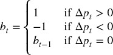

其中 *p [*t*]* 是按 *t* = 1, …, *T* 索引的交易价格，而 *b [0]* 被任意设定为 1。许多研究已确定，尽管相对简单，tick 规则仍能实现高分类准确率（Aitken 和 Frino [1996]）。竞争分类方法包括 Lee 和 Ready [1991] 以及 Easley 等 [2016]。

对 { *b [*t*]* } 序列的变换可以产生有用的特征。这些变换包括：(1) 对其未来期望值 E [*t*] [ *b [*t* + 1]* ] 的卡尔曼滤波；(2) 对这些预测的结构性断裂（第十七章）；(3) { *b [*t*]* } 序列的熵（第十八章）；(4) 对 { *b [*t*]* } 进行的 Wald-Wolfowitz 的运行检验的 t 值；(5) 对累积 { *b [*t*]* } 序列的分数微分，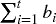（第五章）；等等。

**19.3.2 Roll 模型**

Roll [1984] 是首个提出证券有效买卖差价解释的模型之一。这是有用的，因为买卖差价是流动性的函数，因此 Roll 的模型可以被视为早期测量证券流动性的尝试。考虑中间价格序列 { *m [*t*]* }，其中价格遵循随机游走且无漂移。

因此，价格变化 Δ *m [*t*]* = *m [*t*]* − *m [*t* − 1]* 是从正态分布独立且同分布地抽取的。

这些假设当然与所有实证观察相悖，这些观察表明金融时间序列存在漂移、异方差、表现出序列依赖性，其回报分布是非正态的。但通过适当的抽样程序，如我们在第二章中看到的，这些假设可能并不太不现实。观察到的价格 { *p [*t*]* } 是对买卖差价进行顺序交易的结果：

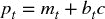

其中 *c* 是买卖差价的一半，*b [*t*]* ∈ { − 1, 1} 是主动方。Roll 模型假设买卖双方的可能性相等，，序列独立，E[ *b [*t*] b [*t*  − 1] * ] = 0，并且与噪声独立，E[ *b [*t*] u [*t*] * ] = 0 *.* 在这些假设下，Roll 推导出 *c* 和 σ ² [   *u*   ] 的值如下：

导致  和 σ ² [   *u*   ] = σ ² [Δ *p [*t*] * ] + 2σ[Δ *p [*t*] * , Δ *p [*t*  − 1] * ]。总之，买卖差价是价格变化的序列协方差的函数，而真实（未观察到的）价格噪声，排除微观结构噪声，是观察到的噪声和价格变化的序列协方差的函数。

读者可能会质疑如今使用 Roll 模型的必要性，因为数据集中包含了多个书籍层次的买卖价格。尽管 Roll 模型存在局限性，但它仍在使用的一个原因是，它提供了一种相对直接的方法来确定那些交易较少的证券或其公开报价不能代表市场做市商愿意提供流动性的水平（例如公司债券、市政债券和机构债券）的*有效*买卖差价。使用 Roll 的估计，我们可以推导出有关市场流动性状况的信息特征。

**19.3.3 高低波动率估计器**

Beckers [1983] 显示，基于高低价格的波动率估计器比基于收盘价格的标准波动率估计器更准确。Parkinson [1980] 推导出，对于遵循几何布朗运动的连续观察价格，

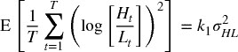

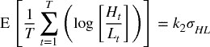

其中 *k [1]* = 4log[2]，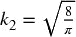，*H [*t*] * 是柱 *t* 的最高价格，*L [*t*] * 是柱 *t* 的最低价格。然后，基于观察到的高低价格，可以稳健地估计波动率特征 σ [*HL*]。

**19.3.4 Corwin 和 Schultz**

在 Beckers [1983] 的基础上，Corwin 和 Schultz [2012] 引入了一种基于高低价格的买卖差价估计器。该估计器基于两个原则：首先，最高价格几乎总是与出价匹配，而最低价格几乎总是与买价匹配。高低价格的比率反映了基本波动率以及买卖差价。其次，高低价格比率中由于波动性造成的部分与两个观察之间的时间推移成比例增加。

Corwin 和 Schultz 表明，作为价格百分比的差价可以估计为

其中

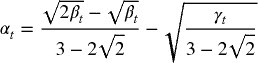

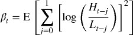

并且 *H [*t* − 1, *t*]* 是两个时间段（*t* − 1 和 *t*）的最高价，而 *L [*t* − 1, *t*]* 是两个时间段的最低价（*t* − 1 和 *t*）。因为 α [*t*] < 0⇒ *S [*t*]* < 0，作者建议将负阿尔法设为 0（见科尔温和舒尔茨 [2012]，第 727 页）。片段 19.1 实现了该算法。`corwinSchultz` 函数接受两个参数，一个带有列（`High`，`Low`）的系列数据框，以及一个整数值 `sl`，用于定义估计 β [*t*] 时使用的样本长度。

> **片段 19.1 科尔温-舒尔茨算法的实现**
> 
> 

注意，波动性未出现在最终的科尔温-舒尔茨方程中。原因是波动性已被其高/低估计器取代。作为该模型的副产品，我们可以推导出贝克-帕金森波动性，如片段 19.2 所示。

> **片段 19.2 高低价波动性的估计**
> 
> 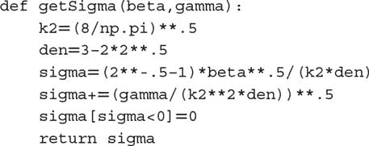

该程序在公司债券市场中特别有用，因为该市场没有集中订单簿，交易通过竞标（BWIC）进行。由此产生的特征，买卖差价 *S* ，可以在滚动窗口中递归估计，并且可以使用卡尔曼滤波器进行平滑处理。

## 19.4 第二代：战略交易模型

第二代微观结构模型专注于理解和测量非流动性。非流动性是金融机器学习模型中的一个重要信息特征，因为它是一种具有相关溢价的风险。这些模型比第一代模型具有更强的理论基础，因为它们将交易解释为知情交易者与非知情交易者之间的战略互动。在此过程中，它们关注签名交易量和订单流不平衡。

这些特征大多数是通过回归估计的。在实践中，我观察到与这些微观结构估计相关的 t 值比（均值）估计本身更具信息性。尽管文献中没有提到这一观察，但有充分理由偏好基于 t 值的特征而非基于均值的特征：t 值是由估计误差的标准差重新缩放的，包含了均值估计中缺失的另一维信息。

**19.4.1 凯尔的 Lambda**

凯尔 [1985] 引入了以下战略交易模型。考虑一个风险资产，其终值 *v* ∼ *N* [ *p [0]* , Σ [0] ]，以及两个交易者：

+   一个噪音交易者以数量 *u* = *N* [0, σ ² [*u*] ] 进行交易，且与 *v* 独立。

+   一个知情交易者知道 *v* 并通过市场订单需求数量 *x*。

市场做市商观察到总订单流 *y* = *x* + *u*，并相应地设定价格 *p*。在这个模型中，做市商无法区分噪音交易者和知情交易者的订单。他们根据订单流不平衡调整价格，因为这可能表明有知情交易者的存在。因此，价格变化与订单流不平衡之间存在正相关关系，这被称为市场影响。

知情交易者推测市场做市商有一个线性的价格调整函数 *p* = λ *y* + μ，其中 λ 是流动性的逆测量。知情交易者的利润为 π = ( *v* − *p* ) *x*，在  处最大化，且二阶条件为 λ > 0。

相反，市场做市商推测知情交易者的需求是 *v* 的线性函数：*x* = α + β *v*，这意味着  和 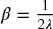。注意，流动性降低意味着 λ 增加，这意味着知情交易者的需求降低。

凯尔认为，市场做市商必须在利润最大化和市场效率之间找到平衡，在上述线性函数下，唯一可能的解决方案发生在

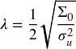

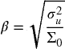

最后，知情交易者的预期利润可以重写为

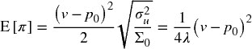

这意味着知情交易者有三个利润来源：

+   证券的错误定价。

+   噪音交易者净订单流的方差。噪音越大，知情交易者越容易隐藏他的意图。

+   终端证券方差的倒数。波动性越低，错误定价的货币化就越容易。

在凯尔的模型中，变量 λ 捕捉价格影响。流动性不足随着对 *v* 的不确定性增加而增加，并随着噪音的增加而减少。作为一个特征，它可以通过拟合回归进行估计。

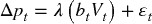

其中 { *p [*t*]* } 是价格的时间序列，{ *b [*t*]* } 是攻击者标志的时间序列，{ *V [*t*]* } 是交易量的时间序列，因此 { *b [*t*] V [*t*]* } 是签名交易量或净订单流的时间序列。图 19.1 绘制了在 E-mini S&P 500 期货系列上估计的凯尔的 λ 的直方图。

**图 19.1** 凯尔在 E-mini S&P 500 期货上计算的 λ

**19.4.2 Amihud 的 Lambda**

Amihud [2002] 研究了绝对收益与流动性不足之间的正相关关系。特别地，他计算了与一美元交易量相关的每日价格反应，并认为其值是价格影响的代理。这个思想的一个可能实现是

其中 *B [τ]* 是包含在时间柱 τ 中的交易集， 是时间柱 τ 的收盘价，*p [*t*] V [*t*] * 是涉及交易 *t* ∈ *B [τ] * 的美元交易量。尽管其表面上看似简单，Hasbrouck [2009] 发现每日的 Amihud λ 估计与日内有效价差的估计之间存在高度秩相关。图 19.2 绘制了在 E-mini S&P 500 期货系列上估计的 Amihud 的 λ 的直方图。

**图 19.2** 在 E-mini S&P 500 期货上估计的 Amihud 的 λ

**19.4.3 Hasbrouck 的 λ**

Hasbrouck [2009] 跟进了 Kyle 和 Amihud 的思想，并将其应用于基于交易和报价（TAQ）数据的价格影响系数估计。他使用 Gibbs 采样器生成回归规范的贝叶斯估计。

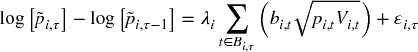

其中 *B [*i* , τ]* 是包含在安全 *i* 的时间柱 τ 中的交易集，*i* = 1, …, *I*， 是安全 *i* 的时间柱 τ 的收盘价，*b [*i*  ,  *t*] * ∈ { − 1, 1} 表示交易 *t* ∈ *B [*i*  , τ] * 是买入启动还是卖出启动；而 *p [*i*  ,  *t*] V [*i*  ,  *t*] * 是涉及交易 *t* ∈ *B [*i*  , τ] * 的美元交易量。然后我们可以为每个安全 *i* 估计 λ [*i*]，并将其用作近似交易有效成本（市场影响）的特征。

与大多数文献一致，Hasbrouck 推荐使用 5 分钟的时间柱来抽样价格波动。然而，正如第二章所讨论的，通过与市场活动同步的随机抽样方法可以获得更好的结果。图 19.3 绘制了在 E-mini S&P 500 期货系列上估计的 Hasbrouck 的 λ 的直方图。

**图 19.3** 在 E-mini S&P 500 期货上估计的 Hasbrouck 的 λ

## 19.5 第三代：顺序交易模型

正如我们在上一节中所见，战略交易模型以一个能够多次交易的单一知情交易者为特征。在本节中，我们将讨论一种替代模型，其中随机选择的交易者顺序独立地进入市场。

自出现以来，顺序交易模型在市场制造商中变得非常流行。原因之一是，它们包含了流动性提供者面临的不确定性来源，即信息事件发生的概率、该事件是负面的概率、噪声交易者的到达率和知情交易者的到达率。考虑到这些变量，市场制造商必须动态更新报价，并管理他们的库存。

**19.5.1 基于信息的交易概率**

Easley 等人[1996]使用交易数据来确定个别证券的基于信息的交易概率（PIN）。这个微观结构模型将交易视为市场制造者和持仓者之间在多个交易期间重复进行的博弈。

将某证券的价格表示为*S*，当前值为*S [0]*。然而，一旦某些新信息被纳入价格中，*S*将是*S [*B*]*（坏消息）或*S [*G*]*（好消息）。在分析的时间范围内，新信息到达的概率为α，坏消息的概率为δ，而好消息的概率为(1 − δ)。这些作者证明，证券价格的期望值可以在时间*t*处计算为

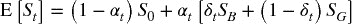

按照泊松分布，知情交易者以速率μ到达，而不知情交易者以速率ε到达。然后，为了避免知情交易者的损失，市场制造者在竞标水平*B [*t*]* 达到盈亏平衡，

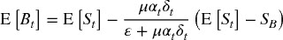

盈亏平衡的卖出价水平*A [*t*]*在时间*t*处必须为，

由此，盈亏平衡的买卖价差被确定为

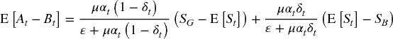

当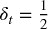时，我们得到

这个方程告诉我们，决定市场制造者提供流动性的价格区间的关键因素是

下标*t*表示在该时间点估计的概率α和δ。作者应用贝叶斯更新过程，将每次交易到达市场后的信息纳入考虑。

为了确定值*PIN [*t*]*，我们必须估计四个不可观察的参数，即{α, δ, μ, ε}。一种最大似然方法是拟合三个泊松分布的混合体，

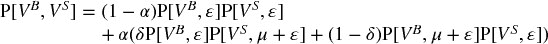

其中*V ^(*B*)*是以卖出价交易的交易量（买入发起交易），而*V ^(*S*)*是以买入价交易的交易量（卖出发起交易）。

**19.5.2 量化同步信息交易概率**

Easley 等人[2008]证明了

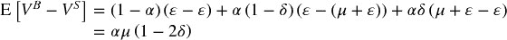

特别地，对于足够大的μ，

Easley 等人[2011]提出了一种高频 PIN 估计方法，他们称之为量化同步信息交易概率（VPIN）。该过程采用了*量化时钟*，它将数据采样与市场活动同步，这通过交易量来捕捉（见第二章）。我们可以估计

其中*V ^(*B*) [τ]*是量化柱τ内买入发起交易的交易量总和，*V ^(*S*) [τ]*是量化柱τ内卖出发起交易的交易量总和，*n*是用于生成该估计的柱数。由于所有量化柱的大小相同*V*，我们知道通过构造

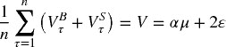

因此，PIN 可以高频估计为

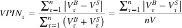

有关 VPIN 的更多细节和案例研究，请参见 Easley 等人[2013]。Andersen 和 Bondarenko [2013]通过线性回归得出 VPIN 不是波动性的良好预测指标。然而，许多研究发现 VPIN 确实具有预测能力：Abad 和 Yague [2012]、Bethel 等人[2012]、Cheung 等人[2015]、Kim 等人[2014]、Song 等人[2014]、Van Ness 等人[2017]和 Wei 等人[2013]等。无论如何，线性回归是一种 18 世纪数学家已经知道的技术（Stigler [1981]），经济学家不应感到惊讶，当它无法识别 21 世纪金融市场中的复杂非线性模式时。

## 19.6 来自微观结构数据集的附加特征

我们在第 19.3 到 19.5 节中研究的特征是由市场微观结构理论建议的。此外，我们还应考虑一些替代特征，尽管这些特征未被理论提出，但我们怀疑它们携带有关市场参与者运作方式及其未来意图的重要信息。在这样做时，我们将利用机器学习算法的力量，这些算法可以学习如何使用这些特征，而不需要理论的具体指导。

**19.6.1 顺序大小的分布**

Easley 等人[2016]研究了每个交易规模的交易频率，发现圆整规模的交易异常频繁。例如，频率率随着交易规模的增加迅速衰减，圆整交易规模{5, 10, 20, 25, 50, 100, 200, …}除外。这些作者将这一现象归因于所谓的“鼠标”或“GUI”交易者，即通过点击 GUI（图形用户界面）上的按钮发送订单的人类交易者。例如，在 E-mini S&P 500 中，大小为 10 的交易比大小为 9 的交易频率高出 2.9 倍；大小为 50 的交易比大小为 49 的交易频率高出 10.9 倍；大小为 100 的交易比大小为 99 的交易频率高出 16.8 倍；大小为 200 的交易比大小为 199 的交易频率高出 27.2 倍；大小为 250 的交易比大小为 249 的交易频率高出 32.5 倍；大小为 500 的交易比大小为 499 的交易频率高出 57.1 倍。这种模式对于“硅基交易者”而言并不典型，他们通常被编程为随机化交易，以掩盖他们在市场中的足迹。

一个有用的特征可能是确定圆整规模交易的正常频率，并监测与该预期值的偏差。例如，机器学习算法可以确定通常比例较大的圆整规模交易是否与趋势相关，因为人类交易者往往倾向于基于基本面观点、信念或信念进行下注。相反，比例低于通常水平的圆整规模交易可能会增加价格横盘的可能性，因为硅基交易者通常不会持有长期观点。

**19.6.2 取消率、限价单、市场单**

Eisler 等人 [2012] 研究市场订单、限价单和报价取消的影响。这些作者发现，小型股票对这些事件的反应与大型股票不同。他们得出结论，测量这些量与建模买卖价差的动态相关。

Easley 等人 [2012] 还认为，大量的报价取消率可能表明流动性低，因为参与者发布的报价并不打算被成交。

+   **报价填塞者：** 他们参与“延迟套利”。他们的策略是用信息淹没交易所，唯一的目的是减缓竞争算法的速度，迫使其解析只有发起者知道可以忽略的消息。

+   **报价悬挂者：** 这一策略发送报价，迫使被挤压的交易者追逐与其利益相悖的价格。O'Hara [2011] 提供了其扰乱活动的证据。

+   **流动性挤压者：** 当一个处于困境的大型投资者被迫平仓时，掠夺性算法会朝同一方向交易，尽可能地抽取流动性。因此，价格会过度波动，从中获利（Carlin 等人 [2007]）。

+   **成群捕猎者：** 独立捕猎的掠夺者会意识到彼此的活动，并组成一个团队以最大化触发级联效应的机会（Donefer [2010]，Fabozzi 等人 [2011]，Jarrow 和 Protter [2011]）。NANEX [2011] 显示了似乎是成群捕猎者强制止损的情况。尽管他们各自的行为太小，无法引起监管者的怀疑，但他们的集体行为可能是市场操控的。当这种情况发生时，很难证明他们的勾结，因为他们以去中心化、自发的方式进行协调。

这些掠夺性算法利用报价取消和各种订单类型，试图对市场制造者进行不利选择。它们在交易记录中留下不同的特征，测量报价取消率、限价单和市场订单可以为其意图提供有用的特征基础。

**19.6.3 时间加权平均价格执行算法**

Easley 等 [2012] 演示了如何识别针对特定时间加权平均价格（TWAP）的执行算法的存在。TWAP 算法是一种将大订单分割成小订单的算法，这些小订单在固定时间间隔内提交，以试图实现预定义的时间加权平均价格。这些作者以 2010 年 11 月 7 日至 2011 年 11 月 7 日期间的 E-mini S&P 500 期货交易为样本。他们将一天分为 24 小时，并为每个小时统计每秒的交易量，而不考虑分钟。然后，他们将这些总交易量绘制成一个表面，其中 x 轴表示每秒的交易量，y 轴表示一天中的小时，z 轴表示总交易量。这一分析使我们能够看到一天中每分钟内交易量的分布，并寻找在时间-空间上执行其大额订单的低频交易者。在几乎每天的每个小时内，分钟内交易量的最大集中往往发生在前几秒。这在 00:00–01:00 GMT（亚洲市场开盘时）、05:00–09:00 GMT（英国和欧洲股票开盘时）、13:00–15:00 GMT（美国股票开盘时）和 20:00–21:00 GMT（美国股票收盘时）尤为明显。

一个有用的机器学习特征可能是评估每分钟开始时的订单不平衡，并确定是否存在持续的成分。这可以用于提前跟踪大型机构投资者，同时他们的 TWAP 订单的大部分仍在待处理。

**19.6.4 期权市场**

Muravyev 等 [2013] 利用美国股票和期权的微观结构信息研究两个市场不一致的事件。他们通过推导由看跌-看涨平价报价隐含的基础买卖差价范围并将其与股票的实际买卖差价范围进行比较，来表征这种不一致性。他们得出结论，争议往往倾向于股票报价，这意味着期权的 *报价* 不包含经济上显著的信息。同时，他们确实发现期权的 *交易* 包含了股票价格中未包含的信息。这些发现对于习惯于交易相对流动性较低产品（包括股票期权）的投资组合经理来说并不意外。报价可能在较长时间内保持非理性，即使稀疏的价格也很有信息量。

Cremers 和 Weinbaum [2010] 发现，相对昂贵的看涨期权的股票（同时具有高波动率差和高波动率差变化的股票）每周的表现优于相对昂贵的看跌期权的股票（同时具有低波动率差和低波动率差变化的股票）50 个基点。当期权流动性较高而股票流动性较低时，这种可预测性更强。

与这些观察一致，可以通过计算从期权交易衍生的买权-卖权隐含股价提取有用特征。期货价格仅代表平均或预期的未来值。但期权价格使我们能够推导出被定价的结果的整个分布。机器学习算法可以在不同执行价格和到期日的希腊字母中搜索模式。

**19.6.5 签名订单流的序列相关性**

Toth 等人 [2011] 研究了伦敦证券交易所股票的签名订单流，发现订单符号在许多天内是正自相关的。他们将这一观察归因于两个候选解释：羊群效应和订单分拆。他们得出结论，在几小时以下的时间尺度上，订单流的持续性主要是由于分拆而非羊群效应。

鉴于市场微观结构理论将订单流不平衡的持续性归因于知情交易者的存在，通过签名成交量的序列相关性来衡量这种持续性的强度是合理的。这一特征将与我们在第 19.5 节中研究的特征相辅相成。

## 19.7 什么是微观结构信息？

让我通过讨论我认为市场微观结构文献中的一个主要缺陷来结束本章。大多数关于这个主题的文章和书籍研究的是不对称信息，以及战略性参与者如何利用这些信息从市场制造商中获利。但是，在交易的背景下，信息究竟是如何定义的呢？不幸的是，在微观结构意义上，并没有广泛接受的信息定义，文献中以一种令人惊讶的松散且相对非正式的方式使用这一概念（López de Prado [2017]）。本节提出一个基于信号处理的适当信息定义，可以应用于微观结构研究。

考虑一个特征矩阵*X* = {*X [*t*]*} [*t* = 1, …, *T*]，其中包含做市商通常用来判断是否在特定水平提供流动性或取消被动报价的信息。例如，列可以是本章讨论的所有特征，如 VPIN、凯尔的λ、取消率等。矩阵*X*每个决策点有一行。例如，做市商可能在每次交易 10,000 份合约时，或在价格发生显著变化时（回忆第二章中的抽样方法）重新考虑提供流动性或退出市场的决定等。首先，我们导出一个数组*y* = {*y [*t*]*} [*t* = 1, …, *T*]，将标记 1 分配给导致做市获利的观察，并将标记 0 分配给导致做市亏损的观察（请参见第三章的标记方法）。其次，我们在训练集（*X*，*y*）上拟合一个分类器。第三，当新的样本外观察到来时τ > *T*，我们使用拟合的分类器预测标签！。第四，我们计算这些预测的交叉熵损失*L [τ]*，如第九章第 9.4 节所述。第五，我们在负交叉熵损失数组{−*L [*t*]*}[*t* = *T* + 1, …, τ]上拟合一个核密度估计器（KDE），以导出其累积分布函数*F*。第六，我们在时间*t*处估计微观结构信息为φ [τ] = *F* [−*L [τ]*]，其中φ [τ] ∈ (0, 1)。

这种微观结构信息可以理解为市场做市商决策模型面临的复杂性。在正常市场条件下，做市商以低交叉熵损失生成*有信息的预测*，并能够通过向持仓者提供流动性获利。然而，在存在（非对称）有信息交易者的情况下，做市商生成*无信息的预测*，其高交叉熵损失表明他们受到不利选择。换句话说，微观结构信息只能相对于做市商的预测能力来定义和测量。其含义是{φ [τ]}应成为您金融机器学习工具包中的一个重要特征。

考虑 2010 年 5 月 6 日闪电崩盘的事件。市场制造商错误地预测他们在买价上的被动报价能够被成交，并以更高的价格卖出。崩盘并非由单一的错误预测造成，而是由数千个预测错误的积累（Easley 等人 [2011]）。如果市场制造商监控了他们预测的交叉熵损失上升，他们会意识到有知情交易者的存在，以及不利选择的概率危险地上升。这将使他们能够扩大买卖价差，达到停止订单流失衡的水平，因为卖方将不再愿意以这些折扣出售。相反，市场制造商一直在以极其慷慨的水平向卖方提供流动性，直到最终被迫平仓，触发了一场流动性危机，震惊了市场、监管机构和学术界数月甚至数年。

**练习**

1.  > > 从 E-mini 标普 500 期货的逐笔数据时间序列中，

    1.  应用逐笔规则推导交易符号系列。

    1.  与 CME 提供的攻击方数据进行比较（FIX 标签 5797）。逐笔规则的准确性如何？

    1.  选择 FIX 标签 5797 与逐笔规则不一致的情况。

        1.  你能看到任何不同之处来解释这种分歧吗？

        1.  这些分歧与大幅价格跳跃有关吗？或者高撤单率？或者薄报价规模？

        1.  这些分歧在高市场活动期还是低市场活动期更可能发生？

1.  > > 在 E-mini 标普 500 期货逐笔数据的时间序列上计算 Roll 模型。

    1.  σ ² [*u*] 和 *c* 的估计值是多少？

    1.  了解到该合约是全球最具流动性的产品之一，并且其交易具有最紧的买卖价差，这些值是否符合你的预期？

1.  > > 计算 E-mini 标普 500 期货的高低波动率估计器（第 19.3.3 节）：

    1.  使用每周值，这与收盘到收盘收益的标准差有什么不同？

    1.  使用每日值，这与收盘到收盘收益的标准差有什么不同？

    1.  使用美元柱，每天平均 50 根柱，这与收盘到收盘收益的标准差有什么不同？

1.  > > 将 Corwin-Schultz 估计应用于 E-mini 标普 500 期货的每日序列。

    1.  预期的买卖价差是多少？

    1.  隐含波动率是什么？

    1.  这些估计与练习 2 和 3 的早期结果一致吗？

1.  > > 计算凯尔的 λ：

    1.  逐笔数据。

    1.  在 E-mini 标普 500 期货上形成一个美元柱的时间序列，其中

        1.  *b [*t*]* 是交易符号的成交量加权平均。

        1.  *V [*t*]* 是该柱中的成交量总和。

        1.  Δ*p [*t*]* 是两个连续柱之间价格的变化。

1.  > > 重复练习 5，这次应用哈斯布鲁克的 λ。结果一致吗？
1.  > > 
1.  > > 重复练习 5，这次应用阿米哈德的 λ。结果一致吗？
1.  > > 
1.  > > 在 E-mini 标普 500 期货上形成一个成交量柱的时间序列，

    1.  计算 2010 年 5 月 6 日的 VPIN 系列（闪电崩盘）。

    1.  绘制 VPIN 和价格的系列。你看到了什么？

1.  > > 计算 E-mini S&P 500 期货的订单大小分布。

    1.  在整个期间。

    1.  关于 2010 年 5 月 6 日。

    1.  对两个分布进行 Kolmogorov-Smirnov 检验。它们在 95%的置信水平下显著不同吗？

1.  > > 计算 E-mini S&P 500 期货数据集中每日报价取消率和市场订单部分的时间序列。

    1.  这两个系列之间的相关性是什么？它在统计上显著吗？

    1.  这两个系列与每日波动性之间的相关性是什么？这是否是你预期的结果？

1.  > > 在 E-mini S&P 500 期货的逐笔数据上：

    1.  计算每分钟前 5 秒内执行的交易量分布。

    1.  计算每分钟执行的交易量分布。

    1.  对两个分布进行 Kolmogorov-Smirnov 检验。它们在 95%的置信水平下显著不同吗？

1.  > > 在 E-mini S&P 500 期货的逐笔数据上：

    1.  计算签名交易量的一阶序列相关性。

    1.  在 95%的置信水平下，它在统计上显著吗？

**参考文献**

1.  Abad, D. 和 J. Yague (2012): “从 PIN 到 VPIN。” *西班牙金融经济评论*，第 10 卷，第 2 期，页码 74-83。

1.  Aitken, M. 和 A. Frino (1996): “逐笔测试的准确性：来自澳大利亚证券交易所的证据。” *银行与金融学期刊*，第 20 卷，页码 1715–1729。

1.  Amihud, Y. 和 H. Mendelson (1987): “交易机制与股票收益：一项实证研究。” *金融学期刊*，第 42 卷，页码 533–553。

1.  Amihud, Y. (2002): “流动性不足与股票收益：横截面与时间序列效应。” *金融市场期刊*，第 5 卷，页码 31–56。

1.  Andersen, T. 和 O. Bondarenko (2013): “VPIN 与闪电崩盘。” *金融市场期刊*，第 17 卷，页码 1-46。

1.  Beckers, S. (1983): “基于高、低和收盘价格的证券价格收益的方差。” *商业期刊*，第 56 卷，页码 97–112。

1.  Bethel, E. W.、Leinweber, D.、Rubel, O. 和 K. Wu (2012): “闪电崩盘后时代的联邦市场信息技术：超级计算的角色。” *交易期刊*，第 7 卷，第 2 期，页码 9–25。

1.  Carlin, B.、M. Sousa Lobo 和 S. Viswanathan (2005): “偶发流动性危机：合作与掠夺性交易。” *金融学期刊*，第 42 卷，第 5 期（10 月），页码 2235–2274。

1.  Cheung, W.、R. Chou、A. Lei (2015): “交易所交易障碍期权与 VPIN。” *期货市场期刊*，第 35 卷，第 6 期，页码 561-581。

1.  Corwin, S. 和 P. Schultz (2012): “从每日高低价格估算买卖差价的一种简单方法。” *金融学期刊*，第 67 卷，第 2 期，页码 719–760。

1.  Cremers, M. 和 D. Weinbaum (2010): “偏离期权平价与股票收益可预测性。” *金融与数量分析期刊*，第 45 卷，第 2 期（4 月），页码 335–367。

1.  Donefer, B. (2010): “算法失控：自动交易策略世界中的风险。” *交易期刊*，第 5 卷，页码 31–34。

1.  Easley, D., N. Kiefer, M. O'Hara 和 J. Paperman (1996): “流动性、信息与不常交易的股票。” *金融期刊*，第 51 卷，第 4 期，第 1405–1436 页。

1.  Easley, D., R. Engle, M. O'Hara 和 L. Wu (2008): “信息与无信息交易者的到达率随时间变化。” *金融计量经济学期刊*，第 6 卷，第 2 期，第 171–207 页。

1.  Easley, D., M. López de Prado 和 M. O'Hara (2011): “闪崩的微观结构。” *投资组合管理期刊*，第 37 卷，第 2 期（冬季），第 118–128 页。

1.  Easley, D., M. López de Prado 和 M. O'Hara (2012a): “高频世界中的流动性毒性与流动性。” *金融研究评论*，第 25 卷，第 5 期，第 1457–1493 页。

1.  Easley, D., M. López de Prado 和 M. O'Hara (2012b): “成交量时钟：高频范式的洞察。” *投资组合管理期刊*，第 39 卷，第 1 期，第 19–29 页。

1.  Easley, D., M. López de Prado 和 M. O'Hara (2013): *高频交易：交易者、市场与监管者的新现实*，第 1 版。风险书籍。

1.  Easley, D., M. López de Prado 和 M. O'Hara (2016): “从交易数据中辨别信息。” *金融经济学期刊*，第 120 卷，第 2 期，第 269–286 页。

1.  Eisler, Z., J. Bouchaud 和 J. Kockelkoren (2012): “订单簿事件的影响：市场订单、限价订单和取消。” *定量金融*，第 12 卷，第 9 期，第 1395–1419 页。

1.  Fabozzi, F., S. Focardi 和 C. Jonas (2011): “高频交易。方法论与市场影响。” *期货市场评论*，第 19 卷，第 7–38 页。

1.  Hasbrouck, J. (2007): *实证市场微观结构*，第 1 版。牛津大学出版社。

1.  Hasbrouck, J. (2009): “美国股票的交易成本与回报：从每日数据中估计有效成本。” *金融期刊*，第 64 卷，第 3 期，第 1445–1477 页。

1.  Jarrow, R. 和 P. Protter (2011): “高频交易在电子市场中的功能失调角色。” *理论与应用金融国际期刊*，第 15 卷，第 3 期。

1.  Kim, C., T. Perry 和 M. Dhatt (2014): “全天候的信息交易与价格发现。” *替代投资期刊*，第 17 卷，第 2 期，第 68-81 页。

1.  Kyle, A. (1985): “连续拍卖与内幕交易。” *计量经济学*，第 53 卷，第 1315–1336 页。

1.  Lee, C. 和 M. Ready (1991): “从日内数据推断交易方向。” *金融期刊*，第 46 卷，第 733–746 页。

1.  López de Prado, M. (2017): “数学与经济学：现实检查。” *投资组合管理期刊*，第 43 卷，第 1 期，第 5–8 页。

1.  Muravyev, D., N. Pearson 和 J. Broussard (2013): “股票期权中存在价格发现吗？” *金融经济学期刊*，第 107 卷，第 2 期，第 259–283 页。

1.  NANEX (2011): “奇怪的日子：2011 年 6 月 8 日—NatGas 算法。” NANEX 博客。可在[www.nanex.net/StrangeDays/06082011.html](http://www.nanex.net/StrangeDays/06082011.html)查看。

1.  O'Hara, M. (1995): *市场微观结构*，第 1 版。布莱克威尔，牛津。

1.  O'Hara, M. (2011): “什么是报价？” *交易期刊*，第 5 卷，第 2 期（春季），第 10–15 页。

1.  Parkinson, M. (1980): “极值法估计收益率方差。” *商业期刊* , 第 53 卷，页 61–65。

1.  Patzelt, F. 和 J. Bouchaud (2017): “金融市场中集体价格影响的普遍缩放性和非线性。” 工作论文。可在 [`arxiv.org/abs/1706.04163.`](https://arxiv.org/abs/1706.04163.) 获取。

1.  Roll, R. (1984): “在有效市场中有效买卖价差的简单隐含测量。” *金融期刊* , 第 39 卷，页 1127–1139。

1.  Stigler, Stephen M. (1981): “高斯与最小二乘法的发明。” *统计年鉴* , 第 9 卷，第 3 期，页 465–474。

1.  Song, J, K. Wu 和 H. Simon (2014): “VPIN（量化同步信息交易概率）指标的参数分析。” 在 Zopounidis, C. 主编, *定量金融风险管理：理论与实践* , 第 1 版，Wiley 出版。

1.  Toth, B., I. Palit, F. Lillo 和 J. Farmer (2011): “为什么订单流如此持续？” 工作论文。可在 [`arxiv.org/abs/1108.1632.`](https://arxiv.org/abs/1108.1632.) 获取。

1.  Van Ness, B., R. Van Ness 和 S. Yildiz (2017): “HFT 在订单流毒性和股票价格方差中的作用，以及预测 HFT 流动性提供的变化。” *经济与金融期刊* , 第 41 卷，第 4 期，页 739–762。

1.  Wei, W., D. Gerace 和 A. Frino (2013): “知情交易、流动毒性及其对日内交易因素的影响。” *澳大利亚会计商业与金融期刊* , 第 7 卷，第 2 期，页 3–24。

