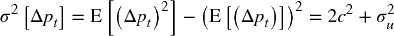
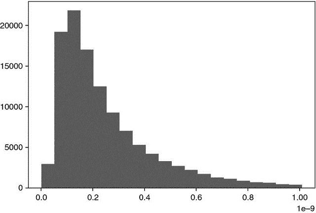
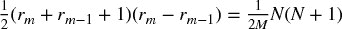
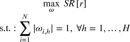
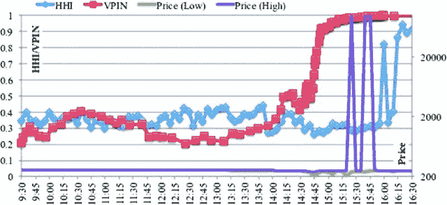

**19.3 第一代：价格序列**

第一代微观结构模型关注于估计买卖差价和波动率作为流动性的代理。他们在数据有限的情况下，未对交易过程施加战略或顺序结构。

**19.3.1 Tick 规则**

在双重拍卖书中，报价用于在不同价格水平上出售证券（出价）或在不同价格水平上购买证券（竞标）。出价价格始终高于竞标价格，因为否则将立即匹配。每当买方匹配出价或卖方匹配竞标时，就会发生交易。每笔交易都有买方和卖方，但只有一方发起交易。

Tick 规则是一种用于确定交易主动方的算法。根据该逻辑，买方发起的交易标记为“1”，卖方发起的交易标记为“-1”。

其中 *p [*t*]* 是按 *t* = 1, …, *T* 索引的交易价格，而 *b [0]* 被任意设定为 1。许多研究已确定，尽管相对简单，tick 规则仍能实现高分类准确率（Aitken 和 Frino [1996]）。竞争分类方法包括 Lee 和 Ready [1991] 以及 Easley 等 [2016]。

对 { *b [*t*]* } 序列的变换可以产生有用的特征。这些变换包括：(1) 对其未来期望值 E [*t*] [ *b [*t* + 1]* ] 的卡尔曼滤波；(2) 对这些预测的结构性断裂（第十七章）；(3) { *b [*t*]* } 序列的熵（第十八章）；(4) 对 { *b [*t*]* } 进行的 Wald-Wolfowitz 的运行检验的 t 值；(5) 对累积 { *b [*t*]* } 序列的分数微分，（第五章）；等等。

**19.3.2 Roll 模型**

Roll [1984] 是首个提出证券有效买卖差价解释的模型之一。这是有用的，因为买卖差价是流动性的函数，因此 Roll 的模型可以被视为早期测量证券流动性的尝试。考虑中间价格序列 { *m [*t*]* }，其中价格遵循随机游走且无漂移。

因此，价格变化 Δ *m [*t*]* = *m [*t*]* − *m [*t* − 1]* 是从正态分布独立且同分布地抽取的。

这些假设当然与所有实证观察相悖，这些观察表明金融时间序列存在漂移、异方差、表现出序列依赖性，其回报分布是非正态的。但通过适当的抽样程序，如我们在第二章中看到的，这些假设可能并不太不现实。观察到的价格 { *p [*t*]* } 是对买卖差价进行顺序交易的结果：

其中 *c* 是买卖差价的一半，*b [*t*]* ∈ { − 1, 1} 是主动方。Roll 模型假设买卖双方的可能性相等，，序列独立，E[ *b [*t*] b [*t*  − 1] * ] = 0，并且与噪声独立，E[ *b [*t*] u [*t*] * ] = 0 *.* 在这些假设下，Roll 推导出 *c* 和 σ ² [   *u*   ] 的值如下：

导致  和 σ ² [   *u*   ] = σ ² [Δ *p [*t*] * ] + 2σ[Δ *p [*t*] * , Δ *p [*t*  − 1] * ]。总之，买卖差价是价格变化的序列协方差的函数，而真实（未观察到的）价格噪声，排除微观结构噪声，是观察到的噪声和价格变化的序列协方差的函数。

读者可能会质疑如今使用 Roll 模型的必要性，因为数据集中包含了多个书籍层次的买卖价格。尽管 Roll 模型存在局限性，但它仍在使用的一个原因是，它提供了一种相对直接的方法来确定那些交易较少的证券或其公开报价不能代表市场做市商愿意提供流动性的水平（例如公司债券、市政债券和机构债券）的*有效*买卖差价。使用 Roll 的估计，我们可以推导出有关市场流动性状况的信息特征。

**19.3.3 高低波动率估计器**

Beckers [1983] 显示，基于高低价格的波动率估计器比基于收盘价格的标准波动率估计器更准确。Parkinson [1980] 推导出，对于遵循几何布朗运动的连续观察价格，

其中 *k [1]* = 4log[2]，，*H [*t*] * 是柱 *t* 的最高价格，*L [*t*] * 是柱 *t* 的最低价格。然后，基于观察到的高低价格，可以稳健地估计波动率特征 σ [*HL*]。

**19.3.4 Corwin 和 Schultz**

在 Beckers [1983] 的基础上，Corwin 和 Schultz [2012] 引入了一种基于高低价格的买卖差价估计器。该估计器基于两个原则：首先，最高价格几乎总是与出价匹配，而最低价格几乎总是与买价匹配。高低价格的比率反映了基本波动率以及买卖差价。其次，高低价格比率中由于波动性造成的部分与两个观察之间的时间推移成比例增加。

Corwin 和 Schultz 表明，作为价格百分比的差价可以估计为

其中

并且 *H [*t* − 1, *t*]* 是两个时间段（*t* − 1 和 *t*）的最高价，而 *L [*t* − 1, *t*]* 是两个时间段的最低价（*t* − 1 和 *t*）。因为 α [*t*] < 0⇒ *S [*t*]* < 0，作者建议将负阿尔法设为 0（见科尔温和舒尔茨 [2012]，第 727 页）。片段 19.1 实现了该算法。`corwinSchultz` 函数接受两个参数，一个带有列（`High`，`Low`）的系列数据框，以及一个整数值 `sl`，用于定义估计 β [*t*] 时使用的样本长度。

> **片段 19.1 科尔温-舒尔茨算法的实现**
> 
> 

注意，波动性未出现在最终的科尔温-舒尔茨方程中。原因是波动性已被其高/低估计器取代。作为该模型的副产品，我们可以推导出贝克-帕金森波动性，如片段 19.2 所示。

> **片段 19.2 高低价波动性的估计**
> 
> 

该程序在公司债券市场中特别有用，因为该市场没有集中订单簿，交易通过竞标（BWIC）进行。由此产生的特征，买卖差价 *S* ，可以在滚动窗口中递归估计，并且可以使用卡尔曼滤波器进行平滑处理。

**19.4 第二代：战略交易模型**

第二代微观结构模型专注于理解和测量非流动性。非流动性是金融机器学习模型中的一个重要信息特征，因为它是一种具有相关溢价的风险。这些模型比第一代模型具有更强的理论基础，因为它们将交易解释为知情交易者与非知情交易者之间的战略互动。在此过程中，它们关注签名交易量和订单流不平衡。

这些特征大多数是通过回归估计的。在实践中，我观察到与这些微观结构估计相关的 t 值比（均值）估计本身更具信息性。尽管文献中没有提到这一观察，但有充分理由偏好基于 t 值的特征而非基于均值的特征：t 值是由估计误差的标准差重新缩放的，包含了均值估计中缺失的另一维信息。

**19.4.1 凯尔的 Lambda**

凯尔 [1985] 引入了以下战略交易模型。考虑一个风险资产，其终值 *v* ∼ *N* [ *p [0]* , Σ [0] ]，以及两个交易者：

+   一个噪音交易者以数量 *u* = *N* [0, σ ² [*u*] ] 进行交易，且与 *v* 独立。

+   一个知情交易者知道 *v* 并通过市场订单需求数量 *x*。

市场做市商观察到总订单流 *y* = *x* + *u*，并相应地设定价格 *p*。在这个模型中，做市商无法区分噪音交易者和知情交易者的订单。他们根据订单流不平衡调整价格，因为这可能表明有知情交易者的存在。因此，价格变化与订单流不平衡之间存在正相关关系，这被称为市场影响。

知情交易者推测市场做市商有一个线性的价格调整函数 *p* = λ *y* + μ，其中 λ 是流动性的逆测量。知情交易者的利润为 π = ( *v* − *p* ) *x*，在  处最大化，且二阶条件为 λ > 0。

相反，市场做市商推测知情交易者的需求是 *v* 的线性函数：*x* = α + β *v*，这意味着  和 。注意，流动性降低意味着 λ 增加，这意味着知情交易者的需求降低。

凯尔认为，市场做市商必须在利润最大化和市场效率之间找到平衡，在上述线性函数下，唯一可能的解决方案发生在

最后，知情交易者的预期利润可以重写为

这意味着知情交易者有三个利润来源：

+   证券的错误定价。

+   噪音交易者净订单流的方差。噪音越大，知情交易者越容易隐藏他的意图。

+   终端证券方差的倒数。波动性越低，错误定价的货币化就越容易。

在凯尔的模型中，变量 λ 捕捉价格影响。流动性不足随着对 *v* 的不确定性增加而增加，并随着噪音的增加而减少。作为一个特征，它可以通过拟合回归进行估计。

其中 { *p [*t*]* } 是价格的时间序列，{ *b [*t*]* } 是攻击者标志的时间序列，{ *V [*t*]* } 是交易量的时间序列，因此 { *b [*t*] V [*t*]* } 是签名交易量或净订单流的时间序列。图 19.1 绘制了在 E-mini S&P 500 期货系列上估计的凯尔的 λ 的直方图。

**图 19.1** 凯尔在 E-mini S&P 500 期货上计算的 λ

**19.4.2 Amihud 的 Lambda**

Amihud [2002] 研究了绝对收益与流动性不足之间的正相关关系。特别地，他计算了与一美元交易量相关的每日价格反应，并认为其值是价格影响的代理。这个思想的一个可能实现是

其中 *B [τ]* 是包含在时间柱 τ 中的交易集， 是时间柱 τ 的收盘价，*p [*t*] V [*t*] * 是涉及交易 *t* ∈ *B [τ] * 的美元交易量。尽管其表面上看似简单，Hasbrouck [2009] 发现每日的 Amihud λ 估计与日内有效价差的估计之间存在高度秩相关。图 19.2 绘制了在 E-mini S&P 500 期货系列上估计的 Amihud 的 λ 的直方图。

**图 19.2** 在 E-mini S&P 500 期货上估计的 Amihud 的 λ

**19.4.3 Hasbrouck 的 λ**

Hasbrouck [2009] 跟进了 Kyle 和 Amihud 的思想，并将其应用于基于交易和报价（TAQ）数据的价格影响系数估计。他使用 Gibbs 采样器生成回归规范的贝叶斯估计。

其中 *B [*i* , τ]* 是包含在安全 *i* 的时间柱 τ 中的交易集，*i* = 1, …, *I*， 是安全 *i* 的时间柱 τ 的收盘价，*b [*i*  ,  *t*] * ∈ { − 1, 1} 表示交易 *t* ∈ *B [*i*  , τ] * 是买入启动还是卖出启动；而 *p [*i*  ,  *t*] V [*i*  ,  *t*] * 是涉及交易 *t* ∈ *B [*i*  , τ] * 的美元交易量。然后我们可以为每个安全 *i* 估计 λ [*i*]，并将其用作近似交易有效成本（市场影响）的特征。

与大多数文献一致，Hasbrouck 推荐使用 5 分钟的时间柱来抽样价格波动。然而，正如第二章所讨论的，通过与市场活动同步的随机抽样方法可以获得更好的结果。图 19.3 绘制了在 E-mini S&P 500 期货系列上估计的 Hasbrouck 的 λ 的直方图。

**图 19.3** 在 E-mini S&P 500 期货上估计的 Hasbrouck 的 λ

**19.5 第三代：顺序交易模型**

正如我们在上一节中所见，战略交易模型以一个能够多次交易的单一知情交易者为特征。在本节中，我们将讨论一种替代模型，其中随机选择的交易者顺序独立地进入市场。

自出现以来，顺序交易模型在市场制造商中变得非常流行。原因之一是，它们包含了流动性提供者面临的不确定性来源，即信息事件发生的概率、该事件是负面的概率、噪声交易者的到达率和知情交易者的到达率。考虑到这些变量，市场制造商必须动态更新报价，并管理他们的库存。

**19.5.1 基于信息的交易概率**

Easley 等人[1996]使用交易数据来确定个别证券的基于信息的交易概率（PIN）。这个微观结构模型将交易视为市场制造者和持仓者之间在多个交易期间重复进行的博弈。

将某证券的价格表示为*S*，当前值为*S [0]*。然而，一旦某些新信息被纳入价格中，*S*将是*S [*B*]*（坏消息）或*S [*G*]*（好消息）。在分析的时间范围内，新信息到达的概率为α，坏消息的概率为δ，而好消息的概率为(1 − δ)。这些作者证明，证券价格的期望值可以在时间*t*处计算为

按照泊松分布，知情交易者以速率μ到达，而不知情交易者以速率ε到达。然后，为了避免知情交易者的损失，市场制造者在竞标水平*B [*t*]* 达到盈亏平衡，

盈亏平衡的卖出价水平*A [*t*]*在时间*t*处必须为，

由此，盈亏平衡的买卖价差被确定为

当时，我们得到

这个方程告诉我们，决定市场制造者提供流动性的价格区间的关键因素是

下标*t*表示在该时间点估计的概率α和δ。作者应用贝叶斯更新过程，将每次交易到达市场后的信息纳入考虑。

为了确定值*PIN [*t*]*，我们必须估计四个不可观察的参数，即{α, δ, μ, ε}。一种最大似然方法是拟合三个泊松分布的混合体，

其中*V ^(*B*)*是以卖出价交易的交易量（买入发起交易），而*V ^(*S*)*是以买入价交易的交易量（卖出发起交易）。

**19.5.2 量化同步信息交易概率**

Easley 等人[2008]证明了

特别地，对于足够大的μ，

Easley 等人[2011]提出了一种高频 PIN 估计方法，他们称之为量化同步信息交易概率（VPIN）。该过程采用了*量化时钟*，它将数据采样与市场活动同步，这通过交易量来捕捉（见第二章）。我们可以估计

其中*V ^(*B*) [τ]*是量化柱τ内买入发起交易的交易量总和，*V ^(*S*) [τ]*是量化柱τ内卖出发起交易的交易量总和，*n*是用于生成该估计的柱数。由于所有量化柱的大小相同*V*，我们知道通过构造

因此，PIN 可以高频估计为

有关 VPIN 的更多细节和案例研究，请参见 Easley 等人[2013]。Andersen 和 Bondarenko [2013]通过线性回归得出 VPIN 不是波动性的良好预测指标。然而，许多研究发现 VPIN 确实具有预测能力：Abad 和 Yague [2012]、Bethel 等人[2012]、Cheung 等人[2015]、Kim 等人[2014]、Song 等人[2014]、Van Ness 等人[2017]和 Wei 等人[2013]等。无论如何，线性回归是一种 18 世纪数学家已经知道的技术（Stigler [1981]），经济学家不应感到惊讶，当它无法识别 21 世纪金融市场中的复杂非线性模式时。

**19.6 来自微观结构数据集的附加特征**

我们在第 19.3 到 19.5 节中研究的特征是由市场微观结构理论建议的。此外，我们还应考虑一些替代特征，尽管这些特征未被理论提出，但我们怀疑它们携带有关市场参与者运作方式及其未来意图的重要信息。在这样做时，我们将利用机器学习算法的力量，这些算法可以学习如何使用这些特征，而不需要理论的具体指导。

**19.6.1 顺序大小的分布**

Easley 等人[2016]研究了每个交易规模的交易频率，发现圆整规模的交易异常频繁。例如，频率率随着交易规模的增加迅速衰减，圆整交易规模{5, 10, 20, 25, 50, 100, 200, …}除外。这些作者将这一现象归因于所谓的“鼠标”或“GUI”交易者，即通过点击 GUI（图形用户界面）上的按钮发送订单的人类交易者。例如，在 E-mini S&P 500 中，大小为 10 的交易比大小为 9 的交易频率高出 2.9 倍；大小为 50 的交易比大小为 49 的交易频率高出 10.9 倍；大小为 100 的交易比大小为 99 的交易频率高出 16.8 倍；大小为 200 的交易比大小为 199 的交易频率高出 27.2 倍；大小为 250 的交易比大小为 249 的交易频率高出 32.5 倍；大小为 500 的交易比大小为 499 的交易频率高出 57.1 倍。这种模式对于“硅基交易者”而言并不典型，他们通常被编程为随机化交易，以掩盖他们在市场中的足迹。

一个有用的特征可能是确定圆整规模交易的正常频率，并监测与该预期值的偏差。例如，机器学习算法可以确定通常比例较大的圆整规模交易是否与趋势相关，因为人类交易者往往倾向于基于基本面观点、信念或信念进行下注。相反，比例低于通常水平的圆整规模交易可能会增加价格横盘的可能性，因为硅基交易者通常不会持有长期观点。

**19.6.2 取消率、限价单、市场单**

Eisler 等人 [2012] 研究市场订单、限价单和报价取消的影响。这些作者发现，小型股票对这些事件的反应与大型股票不同。他们得出结论，测量这些量与建模买卖价差的动态相关。

Easley 等人 [2012] 还认为，大量的报价取消率可能表明流动性低，因为参与者发布的报价并不打算被成交。

+   **报价填塞者：** 他们参与“延迟套利”。他们的策略是用信息淹没交易所，唯一的目的是减缓竞争算法的速度，迫使其解析只有发起者知道可以忽略的消息。

+   **报价悬挂者：** 这一策略发送报价，迫使被挤压的交易者追逐与其利益相悖的价格。O'Hara [2011] 提供了其扰乱活动的证据。

+   **流动性挤压者：** 当一个处于困境的大型投资者被迫平仓时，掠夺性算法会朝同一方向交易，尽可能地抽取流动性。因此，价格会过度波动，从中获利（Carlin 等人 [2007]）。

+   **成群捕猎者：** 独立捕猎的掠夺者会意识到彼此的活动，并组成一个团队以最大化触发级联效应的机会（Donefer [2010]，Fabozzi 等人 [2011]，Jarrow 和 Protter [2011]）。NANEX [2011] 显示了似乎是成群捕猎者强制止损的情况。尽管他们各自的行为太小，无法引起监管者的怀疑，但他们的集体行为可能是市场操控的。当这种情况发生时，很难证明他们的勾结，因为他们以去中心化、自发的方式进行协调。

这些掠夺性算法利用报价取消和各种订单类型，试图对市场制造者进行不利选择。它们在交易记录中留下不同的特征，测量报价取消率、限价单和市场订单可以为其意图提供有用的特征基础。

**19.6.3 时间加权平均价格执行算法**

Easley 等 [2012] 演示了如何识别针对特定时间加权平均价格（TWAP）的执行算法的存在。TWAP 算法是一种将大订单分割成小订单的算法，这些小订单在固定时间间隔内提交，以试图实现预定义的时间加权平均价格。这些作者以 2010 年 11 月 7 日至 2011 年 11 月 7 日期间的 E-mini S&P 500 期货交易为样本。他们将一天分为 24 小时，并为每个小时统计每秒的交易量，而不考虑分钟。然后，他们将这些总交易量绘制成一个表面，其中 x 轴表示每秒的交易量，y 轴表示一天中的小时，z 轴表示总交易量。这一分析使我们能够看到一天中每分钟内交易量的分布，并寻找在时间-空间上执行其大额订单的低频交易者。在几乎每天的每个小时内，分钟内交易量的最大集中往往发生在前几秒。这在 00:00–01:00 GMT（亚洲市场开盘时）、05:00–09:00 GMT（英国和欧洲股票开盘时）、13:00–15:00 GMT（美国股票开盘时）和 20:00–21:00 GMT（美国股票收盘时）尤为明显。

一个有用的机器学习特征可能是评估每分钟开始时的订单不平衡，并确定是否存在持续的成分。这可以用于提前跟踪大型机构投资者，同时他们的 TWAP 订单的大部分仍在待处理。

**19.6.4 期权市场**

Muravyev 等 [2013] 利用美国股票和期权的微观结构信息研究两个市场不一致的事件。他们通过推导由看跌-看涨平价报价隐含的基础买卖差价范围并将其与股票的实际买卖差价范围进行比较，来表征这种不一致性。他们得出结论，争议往往倾向于股票报价，这意味着期权的 *报价* 不包含经济上显著的信息。同时，他们确实发现期权的 *交易* 包含了股票价格中未包含的信息。这些发现对于习惯于交易相对流动性较低产品（包括股票期权）的投资组合经理来说并不意外。报价可能在较长时间内保持非理性，即使稀疏的价格也很有信息量。

Cremers 和 Weinbaum [2010] 发现，相对昂贵的看涨期权的股票（同时具有高波动率差和高波动率差变化的股票）每周的表现优于相对昂贵的看跌期权的股票（同时具有低波动率差和低波动率差变化的股票）50 个基点。当期权流动性较高而股票流动性较低时，这种可预测性更强。

与这些观察一致，可以通过计算从期权交易衍生的买权-卖权隐含股价提取有用特征。期货价格仅代表平均或预期的未来值。但期权价格使我们能够推导出被定价的结果的整个分布。机器学习算法可以在不同执行价格和到期日的希腊字母中搜索模式。

**19.6.5 签名订单流的序列相关性**

Toth 等人 [2011] 研究了伦敦证券交易所股票的签名订单流，发现订单符号在许多天内是正自相关的。他们将这一观察归因于两个候选解释：羊群效应和订单分拆。他们得出结论，在几小时以下的时间尺度上，订单流的持续性主要是由于分拆而非羊群效应。

鉴于市场微观结构理论将订单流不平衡的持续性归因于知情交易者的存在，通过签名成交量的序列相关性来衡量这种持续性的强度是合理的。这一特征将与我们在第 19.5 节中研究的特征相辅相成。

**19.7 什么是微观结构信息？**

让我通过讨论我认为市场微观结构文献中的一个主要缺陷来结束本章。大多数关于这个主题的文章和书籍研究的是不对称信息，以及战略性参与者如何利用这些信息从市场制造商中获利。但是，在交易的背景下，信息究竟是如何定义的呢？不幸的是，在微观结构意义上，并没有广泛接受的信息定义，文献中以一种令人惊讶的松散且相对非正式的方式使用这一概念（López de Prado [2017]）。本节提出一个基于信号处理的适当信息定义，可以应用于微观结构研究。

考虑一个特征矩阵*X* = {*X [*t*]*} [*t* = 1, …, *T*]，其中包含做市商通常用来判断是否在特定水平提供流动性或取消被动报价的信息。例如，列可以是本章讨论的所有特征，如 VPIN、凯尔的λ、取消率等。矩阵*X*每个决策点有一行。例如，做市商可能在每次交易 10,000 份合约时，或在价格发生显著变化时（回忆第二章中的抽样方法）重新考虑提供流动性或退出市场的决定等。首先，我们导出一个数组*y* = {*y [*t*]*} [*t* = 1, …, *T*]，将标记 1 分配给导致做市获利的观察，并将标记 0 分配给导致做市亏损的观察（请参见第三章的标记方法）。其次，我们在训练集（*X*，*y*）上拟合一个分类器。第三，当新的样本外观察到来时τ > *T*，我们使用拟合的分类器预测标签！。第四，我们计算这些预测的交叉熵损失*L [τ]*，如第九章第 9.4 节所述。第五，我们在负交叉熵损失数组{−*L [*t*]*}[*t* = *T* + 1, …, τ]上拟合一个核密度估计器（KDE），以导出其累积分布函数*F*。第六，我们在时间*t*处估计微观结构信息为φ [τ] = *F* [−*L [τ]*]，其中φ [τ] ∈ (0, 1)。

这种微观结构信息可以理解为市场做市商决策模型面临的复杂性。在正常市场条件下，做市商以低交叉熵损失生成*有信息的预测*，并能够通过向持仓者提供流动性获利。然而，在存在（非对称）有信息交易者的情况下，做市商生成*无信息的预测*，其高交叉熵损失表明他们受到不利选择。换句话说，微观结构信息只能相对于做市商的预测能力来定义和测量。其含义是{φ [τ]}应成为您金融机器学习工具包中的一个重要特征。

考虑 2010 年 5 月 6 日闪电崩盘的事件。市场制造商错误地预测他们在买价上的被动报价能够被成交，并以更高的价格卖出。崩盘并非由单一的错误预测造成，而是由数千个预测错误的积累（Easley 等人 [2011]）。如果市场制造商监控了他们预测的交叉熵损失上升，他们会意识到有知情交易者的存在，以及不利选择的概率危险地上升。这将使他们能够扩大买卖价差，达到停止订单流失衡的水平，因为卖方将不再愿意以这些折扣出售。相反，市场制造商一直在以极其慷慨的水平向卖方提供流动性，直到最终被迫平仓，触发了一场流动性危机，震惊了市场、监管机构和学术界数月甚至数年。

**练习**

1.  > > 从 E-mini 标普 500 期货的逐笔数据时间序列中，

    1.  应用逐笔规则推导交易符号系列。

    1.  与 CME 提供的攻击方数据进行比较（FIX 标签 5797）。逐笔规则的准确性如何？

    1.  选择 FIX 标签 5797 与逐笔规则不一致的情况。

        1.  你能看到任何不同之处来解释这种分歧吗？

        1.  这些分歧与大幅价格跳跃有关吗？或者高撤单率？或者薄报价规模？

        1.  这些分歧在高市场活动期还是低市场活动期更可能发生？

1.  > > 在 E-mini 标普 500 期货逐笔数据的时间序列上计算 Roll 模型。

    1.  σ ² [*u*] 和 *c* 的估计值是多少？

    1.  了解到该合约是全球最具流动性的产品之一，并且其交易具有最紧的买卖价差，这些值是否符合你的预期？

1.  > > 计算 E-mini 标普 500 期货的高低波动率估计器（第 19.3.3 节）：

    1.  使用每周值，这与收盘到收盘收益的标准差有什么不同？

    1.  使用每日值，这与收盘到收盘收益的标准差有什么不同？

    1.  使用美元柱，每天平均 50 根柱，这与收盘到收盘收益的标准差有什么不同？

1.  > > 将 Corwin-Schultz 估计应用于 E-mini 标普 500 期货的每日序列。

    1.  预期的买卖价差是多少？

    1.  隐含波动率是什么？

    1.  这些估计与练习 2 和 3 的早期结果一致吗？

1.  > > 计算凯尔的 λ：

    1.  逐笔数据。

    1.  在 E-mini 标普 500 期货上形成一个美元柱的时间序列，其中

        1.  *b [*t*]* 是交易符号的成交量加权平均。

        1.  *V [*t*]* 是该柱中的成交量总和。

        1.  Δ*p [*t*]* 是两个连续柱之间价格的变化。

1.  > > 重复练习 5，这次应用哈斯布鲁克的 λ。结果一致吗？
1.  > > 
1.  > > 重复练习 5，这次应用阿米哈德的 λ。结果一致吗？
1.  > > 
1.  > > 在 E-mini 标普 500 期货上形成一个成交量柱的时间序列，

    1.  计算 2010 年 5 月 6 日的 VPIN 系列（闪电崩盘）。

    1.  绘制 VPIN 和价格的系列。你看到了什么？

1.  > > 计算 E-mini S&P 500 期货的订单大小分布。

    1.  在整个期间。

    1.  关于 2010 年 5 月 6 日。

    1.  对两个分布进行 Kolmogorov-Smirnov 检验。它们在 95%的置信水平下显著不同吗？

1.  > > 计算 E-mini S&P 500 期货数据集中每日报价取消率和市场订单部分的时间序列。

    1.  这两个系列之间的相关性是什么？它在统计上显著吗？

    1.  这两个系列与每日波动性之间的相关性是什么？这是否是你预期的结果？

1.  > > 在 E-mini S&P 500 期货的逐笔数据上：

    1.  计算每分钟前 5 秒内执行的交易量分布。

    1.  计算每分钟执行的交易量分布。

    1.  对两个分布进行 Kolmogorov-Smirnov 检验。它们在 95%的置信水平下显著不同吗？

1.  > > 在 E-mini S&P 500 期货的逐笔数据上：

    1.  计算签名交易量的一阶序列相关性。

    1.  在 95%的置信水平下，它在统计上显著吗？

**参考文献**

1.  Abad, D. 和 J. Yague (2012): “从 PIN 到 VPIN。” *西班牙金融经济评论*，第 10 卷，第 2 期，页码 74-83。

1.  Aitken, M. 和 A. Frino (1996): “逐笔测试的准确性：来自澳大利亚证券交易所的证据。” *银行与金融学期刊*，第 20 卷，页码 1715–1729。

1.  Amihud, Y. 和 H. Mendelson (1987): “交易机制与股票收益：一项实证研究。” *金融学期刊*，第 42 卷，页码 533–553。

1.  Amihud, Y. (2002): “流动性不足与股票收益：横截面与时间序列效应。” *金融市场期刊*，第 5 卷，页码 31–56。

1.  Andersen, T. 和 O. Bondarenko (2013): “VPIN 与闪电崩盘。” *金融市场期刊*，第 17 卷，页码 1-46。

1.  Beckers, S. (1983): “基于高、低和收盘价格的证券价格收益的方差。” *商业期刊*，第 56 卷，页码 97–112。

1.  Bethel, E. W.、Leinweber, D.、Rubel, O. 和 K. Wu (2012): “闪电崩盘后时代的联邦市场信息技术：超级计算的角色。” *交易期刊*，第 7 卷，第 2 期，页码 9–25。

1.  Carlin, B.、M. Sousa Lobo 和 S. Viswanathan (2005): “偶发流动性危机：合作与掠夺性交易。” *金融学期刊*，第 42 卷，第 5 期（10 月），页码 2235–2274。

1.  Cheung, W.、R. Chou、A. Lei (2015): “交易所交易障碍期权与 VPIN。” *期货市场期刊*，第 35 卷，第 6 期，页码 561-581。

1.  Corwin, S. 和 P. Schultz (2012): “从每日高低价格估算买卖差价的一种简单方法。” *金融学期刊*，第 67 卷，第 2 期，页码 719–760。

1.  Cremers, M. 和 D. Weinbaum (2010): “偏离期权平价与股票收益可预测性。” *金融与数量分析期刊*，第 45 卷，第 2 期（4 月），页码 335–367。

1.  Donefer, B. (2010): “算法失控：自动交易策略世界中的风险。” *交易期刊*，第 5 卷，页码 31–34。

1.  Easley, D., N. Kiefer, M. O'Hara 和 J. Paperman (1996): “流动性、信息与不常交易的股票。” *金融期刊*，第 51 卷，第 4 期，第 1405–1436 页。

1.  Easley, D., R. Engle, M. O'Hara 和 L. Wu (2008): “信息与无信息交易者的到达率随时间变化。” *金融计量经济学期刊*，第 6 卷，第 2 期，第 171–207 页。

1.  Easley, D., M. López de Prado 和 M. O'Hara (2011): “闪崩的微观结构。” *投资组合管理期刊*，第 37 卷，第 2 期（冬季），第 118–128 页。

1.  Easley, D., M. López de Prado 和 M. O'Hara (2012a): “高频世界中的流动性毒性与流动性。” *金融研究评论*，第 25 卷，第 5 期，第 1457–1493 页。

1.  Easley, D., M. López de Prado 和 M. O'Hara (2012b): “成交量时钟：高频范式的洞察。” *投资组合管理期刊*，第 39 卷，第 1 期，第 19–29 页。

1.  Easley, D., M. López de Prado 和 M. O'Hara (2013): *高频交易：交易者、市场与监管者的新现实*，第 1 版。风险书籍。

1.  Easley, D., M. López de Prado 和 M. O'Hara (2016): “从交易数据中辨别信息。” *金融经济学期刊*，第 120 卷，第 2 期，第 269–286 页。

1.  Eisler, Z., J. Bouchaud 和 J. Kockelkoren (2012): “订单簿事件的影响：市场订单、限价订单和取消。” *定量金融*，第 12 卷，第 9 期，第 1395–1419 页。

1.  Fabozzi, F., S. Focardi 和 C. Jonas (2011): “高频交易。方法论与市场影响。” *期货市场评论*，第 19 卷，第 7–38 页。

1.  Hasbrouck, J. (2007): *实证市场微观结构*，第 1 版。牛津大学出版社。

1.  Hasbrouck, J. (2009): “美国股票的交易成本与回报：从每日数据中估计有效成本。” *金融期刊*，第 64 卷，第 3 期，第 1445–1477 页。

1.  Jarrow, R. 和 P. Protter (2011): “高频交易在电子市场中的功能失调角色。” *理论与应用金融国际期刊*，第 15 卷，第 3 期。

1.  Kim, C., T. Perry 和 M. Dhatt (2014): “全天候的信息交易与价格发现。” *替代投资期刊*，第 17 卷，第 2 期，第 68-81 页。

1.  Kyle, A. (1985): “连续拍卖与内幕交易。” *计量经济学*，第 53 卷，第 1315–1336 页。

1.  Lee, C. 和 M. Ready (1991): “从日内数据推断交易方向。” *金融期刊*，第 46 卷，第 733–746 页。

1.  López de Prado, M. (2017): “数学与经济学：现实检查。” *投资组合管理期刊*，第 43 卷，第 1 期，第 5–8 页。

1.  Muravyev, D., N. Pearson 和 J. Broussard (2013): “股票期权中存在价格发现吗？” *金融经济学期刊*，第 107 卷，第 2 期，第 259–283 页。

1.  NANEX (2011): “奇怪的日子：2011 年 6 月 8 日—NatGas 算法。” NANEX 博客。可在[www.nanex.net/StrangeDays/06082011.html](http://www.nanex.net/StrangeDays/06082011.html)查看。

1.  O'Hara, M. (1995): *市场微观结构*，第 1 版。布莱克威尔，牛津。

1.  O'Hara, M. (2011): “什么是报价？” *交易期刊*，第 5 卷，第 2 期（春季），第 10–15 页。

1.  Parkinson, M. (1980): “极值法估计收益率方差。” *商业期刊* , 第 53 卷，页 61–65。

1.  Patzelt, F. 和 J. Bouchaud (2017): “金融市场中集体价格影响的普遍缩放性和非线性。” 工作论文。可在 [`arxiv.org/abs/1706.04163.`](https://arxiv.org/abs/1706.04163.) 获取。

1.  Roll, R. (1984): “在有效市场中有效买卖价差的简单隐含测量。” *金融期刊* , 第 39 卷，页 1127–1139。

1.  Stigler, Stephen M. (1981): “高斯与最小二乘法的发明。” *统计年鉴* , 第 9 卷，第 3 期，页 465–474。

1.  Song, J, K. Wu 和 H. Simon (2014): “VPIN（量化同步信息交易概率）指标的参数分析。” 在 Zopounidis, C. 主编, *定量金融风险管理：理论与实践* , 第 1 版，Wiley 出版。

1.  Toth, B., I. Palit, F. Lillo 和 J. Farmer (2011): “为什么订单流如此持续？” 工作论文。可在 [`arxiv.org/abs/1108.1632.`](https://arxiv.org/abs/1108.1632.) 获取。

1.  Van Ness, B., R. Van Ness 和 S. Yildiz (2017): “HFT 在订单流毒性和股票价格方差中的作用，以及预测 HFT 流动性提供的变化。” *经济与金融期刊* , 第 41 卷，第 4 期，页 739–762。

1.  Wei, W., D. Gerace 和 A. Frino (2013): “知情交易、流动毒性及其对日内交易因素的影响。” *澳大利亚会计商业与金融期刊* , 第 7 卷，第 2 期，页 3–24。

**第五部分**

**高性能计算秘籍**

1.  第二十章 多处理与向量化

1.  第二十一章 暴力破解与量子计算机

1.  第二十二章 高性能计算智能与预测技术

**第二十章**

**多处理与向量化**

**20.1 动机**

多处理对机器学习至关重要。机器学习算法计算密集，需要高效利用所有的 CPU、服务器和集群。因此，本书中介绍的大多数功能都是为异步多处理设计的。例如，我们频繁使用一个神秘的函数`mpPandasObj`，而从未定义它。在本章中，我们将解释该函数的功能。此外，我们将详细研究如何开发多处理引擎。本章介绍的程序结构与执行它们所用的硬件架构无关，无论我们使用单个服务器的核心还是分布在多个互连服务器上的核心（例如，在高性能计算集群或云中）。

**20.2 向量化示例**

向量化，也称为数组编程，是并行化的最简单示例，其中操作一次性应用于整个值集。举个简单的例子，假设你需要在一个三维空间中进行暴力搜索，每个维度有 2 个节点。未向量化的笛卡尔积实现将类似于片段 20.1。假如你需要在 100 个维度中搜索，或者如果维度的数量在运行时由用户定义，这段代码会是什么样子呢？

> **片段 20.1 未向量化的笛卡尔积**
> 
> 

向量化的解决方案将用矩阵代数操作或编译的迭代器或生成器替换所有显式迭代器（例如，`For. . .loops`）。片段 20.2 实现了片段 20.1 的向量化版本。向量化版本有四个优点：（1）慢速的嵌套 `For. . .loops` 被快速迭代器替换；（2）代码从 `dict0` 的维度推断网格的维度；（3）我们可以在不修改代码的情况下运行 100 个维度，而无需 100 个 `For. . .loops`；（4）在内部，Python 可以在 C 或 C++ 中运行操作。

> **片段 20.2 向量化的笛卡尔积**
> 
> 

**20.3 单线程与多线程与多进程**

现代计算机拥有多个 CPU 插槽。每个 CPU 有多个核心（处理器），每个核心有多个线程。多线程是一种在同一核心的两个或多个线程上并行运行多个应用程序的技术。多线程的一个优势是，由于应用程序共享同一个核心，它们共享同一个内存空间。这引入了多个应用程序可能同时写入同一内存空间的风险。为防止这种情况发生，全局解释器锁（GIL）一次只为每个核心分配一个线程的写入权限。在 GIL 的限制下，Python 的多线程只能在每个处理器上使用一个线程。因此，Python 通过多进程而非实际的多线程实现并行处理。处理器不共享同一内存空间，因此多进程不会存在写入同一内存空间的风险；然而，这也使得在进程之间共享对象变得更加困难。

为单线程执行而实现的 Python 函数只会利用现代计算机、服务器或集群的部分性能。让我们看看一个简单任务在单线程执行时如何低效地运行的例子。片段 20.3 找到 10,000 个长度为 1,000 的高斯过程首次触碰宽度为标准差 50 倍的对称双障碍的最早时间。

> **片段 20.3 单线程实现的一次触摸双障碍**
> 
> 

将此实现与代码片段 20.4 进行比较。现在代码将之前的问题分为 24 个任务，每个处理器一个。然后，任务在 24 个处理器上异步并行运行。如果在一个拥有 5000 个 CPU 的集群上运行相同的代码，经过的时间将大约是单线程实现的 1/5000。

> **代码片段 20.4 一次触摸双障碍的多处理实现**
> 
> 

此外，你可以实现相同的代码来多处理一个向量化函数，正如我们在第三章中对函数`applyPtSlOnT1`所做的那样，其中并行进程执行包括向量化 pandas 对象的子例程。这样，你将同时实现两个层次的并行化。但为什么止步于此？你还可以通过在 HPC 集群中运行向量化代码的多进程实例一次性实现三个层次的并行化，其中集群中的每个节点提供第三层并行化。在接下来的部分中，我们将解释多处理的工作原理。

**20.4 原子和分子**

在准备并行化作业时，区分原子和分子是很有用的。原子是不可分割的任务。我们希望将这些任务分组为分子，而不是在单个线程中顺序执行所有任务，这样可以使用多个处理器并行处理。每个分子是将由回调函数顺序处理的一组原子，使用单个线程。并行化在分子级别进行。

**20.4.1 线性划分**

形成分子最简单的方法是将原子列表分成相等大小的子集，其中子集的数量是处理器数量与原子数量之间的最小值。对于*N*个子集，我们需要找到*N + 1*个索引来划分分区。这个逻辑在代码片段 20.5 中得到了展示。

> **代码片段 20.5 `**LINPARTS**` 函数**
> 
> 

通常会遇到涉及两个嵌套循环的操作。例如，计算 SADF 序列（第十七章）、评估多个障碍触摸（第三章），或计算未对齐系列的协方差矩阵。在这些情况下，原子任务的线性划分会低效，因为某些处理器必须解决比其他处理器更多的操作，计算时间将取决于最重的分子。一个部分解决方案是将原子任务划分为处理器数量的倍数，然后优先加载重分子到作业队列中。这样，轻分子将被分配给那些首先完成重分子的处理器，确保所有 CPU 在作业队列耗尽之前保持忙碌。在下一节中，我们将讨论更完整的解决方案。图 20.1 绘制了 20 个复杂度相等的原子任务线性划分为 6 个分子的情况。

**图 20.1** 20 个原子任务的线性划分为 6 个分子

**20.4.2 双重嵌套循环划分**

考虑两个嵌套循环，外循环迭代 *i* = 1, …, *N*，内循环迭代 *j* = 1, …, *i*。我们可以将这些原子任务 {( *i* , *j* )|1 ≤ *j* ≤ *i* , *i* = 1, …, *N* } 排序为一个 *下* 三角矩阵（包括主对角线）。这需要  次操作，其中  是非对角线操作，*N* 是对角线操作。我们希望通过将原子任务划分为 *M* 个子集 { *S [*m*]* } [*m*  = 1, …,  *M*] 来并行化这些任务，每个子集大约包含  个任务。以下算法确定构成每个子集（一个分子）的行。

第一个子集 *S [1]* 由前 *r [1]* 行组成，即 *S [1]* = {1, …, *r [1]* }，总共有  个项目。然后，*r [1]* 必须满足条件 。解出 *r [1]*，我们得到正根。

第二个子集包含行 *S [2]* = { *r [1]* + 1, …, *r [2]* }，总共有  个项目。然后，*r [2]* 必须满足条件 。解出 *r [2]*，我们得到正根。

我们可以对未来的子集 *S [*m*]* = { *r [*m* − 1]* + 1, …, *r [*m*]* } 重复相同的论点，总共有  个项目。然后，*r [*m*]* 必须满足条件 。解出 *r [*m*]*，我们得到正根。

很容易看出 *r [*m*]* 约简为 *r [1]*，其中 *r [*m* − 1]* = *r [0]* = 0 *.* 由于行号是正整数，上述结果取整为最接近的自然数。这可能意味着某些划分的大小可能会稍微偏离  目标。片段 20.6 实现了这一逻辑。

> **片段 20.6 THE** `**NESTEDPARTS**` **FUNCTION**
> 
> 

如果外循环迭代 *i* = 1, …, *N*，内循环迭代 *j* = *i* , …, *N*，我们可以将这些原子任务 {( *i* , *j* )|1 ≤ *i* ≤ *j* ., *j* = 1, …, *N* } 排序为一个 *上* 三角矩阵（包括主对角线）。在这种情况下，必须将参数 `upperTriang = True` 传递给函数 `nestedParts`。对于好奇的读者，这是一个特殊的装箱问题案例。图 20.2 绘制了原子到分子的双重嵌套循环划分，复杂性逐渐增加。最终得到的 6 个分子涉及类似数量的工作，尽管一些原子任务的难度可能高达其他任务的 20 倍。

**图 20.2** 原子到分子的双重嵌套循环划分

**20.5 多进程引擎**

为每个多进程函数编写一个并行化封装是错误的。相反，我们应该开发一个可以并行化未知函数的库，无论它们的参数和输出结构如何。这就是多处理引擎的目标。在这一部分，我们将研究一个这样的引擎，一旦你理解了逻辑，你将准备好开发自己的引擎，包括各种定制属性。

**20.5.1 准备作业**

在之前的章节中，我们频繁使用了`mpPandasObj`。该函数接收六个参数，其中四个是可选的：

+   `func` : 一个回调函数，将在并行中执行

+   `pdObj` : 包含的元组：

    +   用于将分子传递给回调函数的参数名称

    +   一份不可分割的任务（原子）列表，将被分组为分子

+   `numThreads` : 将在并行中使用的线程数量（每个线程一个处理器）

+   `mpBatches` : 并行批次的数量（每个核心的作业数）

+   `linMols` : 分区将是线性还是双重嵌套

+   `kargs` : `func`所需的关键字参数

片段 20.7 列出了`mpPandasObj`的工作原理。首先，原子被分组为分子，使用`linParts`（每个分子相同数量的原子）或`nestedParts`（原子分布在下三角结构中）。当`mpBatches`大于 1 时，分子的数量将超过核心的数量。假设我们将任务分为 10 个分子，其中分子 1 的处理时间是其余分子的两倍。如果我们在 10 个核心上运行该过程，9 个核心将在运行时的一半处于闲置状态，等待第一个核心处理分子 1。另一方面，我们可以将`mpBatches =10`设置为将该任务分为 100 个分子。这样，每个核心将接收到相等的工作负载，即使前 10 个分子的处理时间与接下来的 20 个分子相同。在这个例子中，使用`mpBatches =10`的运行时间将是`mpBatches =1`所消耗时间的一半。

其次，我们形成作业列表。作业是一个字典，包含处理分子所需的所有信息，即回调函数、其关键字参数以及构成分子的原子子集。第三，如果`numThreads = =1`（见片段 20.8），我们将顺序处理作业，否则并行处理（见 20.5.2 节）。我们希望顺序运行作业的选项是出于调试目的。在多个处理器中运行程序时，很难捕获错误。^(1) 一旦代码调试完成，我们将希望使用`numThreads > 1`。第四，我们将每个分子的输出拼接成一个单一的列表、系列或数据框。

> **片段 20.7 **`**MPPANDASOBJ**`**，在书中多个地方使用
> 
> 

在 20.5.2 节中，我们将看到片段 20.8 的`processJobs_`函数的多进程对应项。

> **片段 20.8 单线程执行，用于调试**
> 
> 

**20.5.2 异步调用**

Python 有一个名为`multiprocessing`的并行化库。这个库是多进程引擎的基础，例如`joblib`，^(2) 这是许多`sklearn`算法使用的引擎。^(3) 示例 20.9 说明了如何异步调用 Python 的`multiprocessing`库。`reportProgress`函数让我们了解已完成工作的百分比。

> **示例 20.9 异步调用 Python 的多进程库的例子**
> 
> 

**20.5.3 解包回调**

在示例 20.9 中，指令`pool.imap_unordered()`通过在单个线程中运行`jobs`（一个分子）中的每个项目并行化`expandCall`。示例 20.10 列出了`expandCall`，它解包工作（分子）中的项目（原子），并执行回调函数。这个小函数是多进程引擎核心的技巧：它将字典转化为任务。一旦你理解了它的角色，你就能够开发自己的引擎。

> **示例 20.10 将任务（分子）传递给回调函数**
> 
> 

**20.5.4 序列化/反序列化对象**

多进程必须序列化方法，以便将其分配给不同的处理器。问题是，绑定的方法是不可序列化的。^(4) 解决办法是为你的引擎添加功能，告诉库如何处理这种对象。示例 20.11 包含应列在多进程引擎库顶部的指令。如果你对这段代码的具体原因感到好奇，可能想要阅读 Ascher 等人[2005]，第 7.5 节。

> **示例 20.11 将此代码放在你的引擎开头**
> 
> 

**20.5.5 输出减少**

假设你将一个任务分成 24 个分子，目标是让引擎将每个分子分配给一个可用的核心。代码段`processJobs`将在示例 20.9 中捕获这 24 个输出并将其存储在一个列表中。这种方法在输出不大的问题中是有效的。如果输出必须合并为一个单一输出，首先我们将等待最后一个分子完成，然后处理列表中的项目。只要输出的大小和数量不大，这种后处理所增加的延迟应该不会显著。

然而，当输出消耗大量 RAM，并且需要合并成单个输出时，将所有这些输出存储在列表中可能会导致内存错误。在结果由`func`异步返回时，动态执行输出减少操作会更好，而不是等到最后一个分子完成。我们可以通过改善 processJobs 来解决这个问题。特别是，我们将传递三个额外参数，以确定如何将分子输出*减少*为单个输出。片段 20.12 列出了增强版本的`processJobs`，其中包含三个新参数：

+   `redux` : 这是一个回调，用于执行减少操作的函数。例如，如果输出数据框应相加，则`redux = pd.DataFrame.add`。

+   `reduxArgs` : 这是一个字典，包含必须传递给`redux`的关键字参数（如果有的话）。例如，如果`redux = pd.DataFrame.join`，则可能是`reduxArgs = {'how':'outer'}`。

+   `reduxInPlace` : 一个布尔值，指示`redux`操作是否应在*原地*发生。例如，`redux = dict.update`和`redux = list.append`需要`reduxInPlace = True`，因为附加列表和更新字典都是原地操作。

> **片段 20.12 增强** `**PROCESSJOBS**` **以执行动态输出减少**
> 
> 

现在`processJobsRedux`知道如何处理输出，我们还可以增强 Snippet 20.7 中的`mpPandasObj`。在 Snippet 20.13 中，新函数`mpJobList`将三个输出减少参数传递给`processJobsRedux`。这消除了像`mpPandasObj`那样处理输出列表的需要，从而节省了内存和时间。

> **片段 20.13 增强** `**MPPANDASOBJ**` **以执行动态输出减少**
> 
> 

**20.6 多进程示例**

到目前为止，我们在本章中介绍的内容可以大幅加速许多冗长且大规模的数学运算。在这一节中，我们将说明多进程的另一个动机：内存管理。

假设你已经对形式为*Z* ' *Z*的协方差矩阵进行了谱分解，正如我们在第八章第 8.4.2 节所做的，其中*Z*的大小为*TxN*。这产生了一个特征向量矩阵*W*和一个特征值矩阵Λ，使得*Z* ' *ZW* = *W* Λ。现在你想要推导出解释用户定义部分总方差的正交主成分，0 ≤ τ ≤ 1。为此，我们计算！，其中！包含*W*的前*M* ≤ *N*列，使得！。计算！可以通过注意来并行化。

其中*Z [*b*]*是一个稀疏的*TxN*矩阵，仅有*TxN [*b*]*项（其余为空），是一个*NxM*矩阵，仅有*N [*b*] xM*项（其余为空），以及。这种稀疏性是通过将列集合分割为*B*个列子集的分区创建的，仅将列的*b*个子集加载到*Z [*b*]*中。这种稀疏性的概念乍一看可能有点复杂，但代码片段 20.14 展示了 pandas 如何使我们以无缝的方式实现它。函数`getPCs`通过参数`eVec`接收。参数`molecules`包含`fileNames`中的文件名子集，每个文件代表*Z [*b*]*。关键概念是我们计算*Z [*b*]*与由*Z [*b*]*中的列定义的的行切片的点积，而分子结果会即时聚合（`redux = pd.DataFrame.add`）。

> **代码片段 20.14 针对部分列的主成分**
> 
> 

这种方法有两个优点：首先，因为`getPCs`顺序加载数据框*Z [*b*]*，对于足够大的*B*，内存不会被耗尽。第二，`mpJobList`并行执行分子，从而加快计算速度。

在实际的机器学习应用中，我们经常会遇到*Z*包含数十亿个数据点的数据集。正如这个例子所示，并行化不仅在减少运行时间方面有益。许多问题由于内存限制而无法解决，即使我们愿意等待更长时间。

**练习**

1.  > > 使用`timeit`运行代码片段 20.1 和 20.2。重复 100 次执行的 10 个批次。每个代码片段的最小耗时是多少？
1.  > > 
1.  > > 代码片段 20.2 中的指令对于单元测试、穷举搜索和情景分析非常有用。你能记得书中还在哪里见过它们吗？它们还有可能被用于哪里？
1.  > > 
1.  > > 调整代码片段 20.4，以使用两个嵌套循环方案形成分子，而不是线性方案。
1.  > > 
1.  > > 与`timeit`比较：

    1.  代码片段 20.4，通过重复 100 次执行的 10 个批次来实现。每个代码片段的最小耗时是多少？

    1.  修改代码片段 20.4（来自练习 3），通过重复 100 次执行的 10 个批次来实现。每个代码片段的最小耗时是多少？

1.  > > 通过使用`mpPandasObj`简化代码片段 20.4。
1.  > > 
1.  > > 修改`mpPandasObj`以处理使用两个嵌套循环方案形成分子的可能性，采用上三角结构。

**参考**

1.  Ascher, D., A. Ravenscroft, and A. Martelli (2005): *Python Cookbook*，第 2 版。O'Reilly Media。

**参考文献**

1.  Gorelick, M.和 I. Ozsvald (2008): *高性能 Python*，第 1 版。O'Reilly Media。

1.  López de Prado, M. (2017): “金融领域的超级计算：温和入门。”康奈尔大学讲座材料。可在[`ssrn.com/abstract=2907803.`](https://ssrn.com/abstract=2907803.)

1.  McKinney, W. (2012): *Python 数据分析*，第 1 版。O'Reilly Media。

1.  Palach, J. (2008): *用 Python 进行并行编程*，第 1 版。Packt Publishing。

1.  Summerfield, M. (2013): *Python 实战：使用并发、库和模式创建更好的程序*，第 1 版。Addison-Wesley。

1.  Zaccone, G. (2015): *Python 并行编程食谱*，第 1 版。Packt Publishing。

**注释**

^(1)    *海森堡效应*，以海森堡的不确定性原理命名，描述了在仔细观察时会改变行为的错误。多处理的错误就是一个典型例子。

^(2)     [`pypi.python.org/pypi/joblib`](https://pypi.python.org/pypi/joblib)。

^(3)     [`scikit-learn.org/stable/developers/performance.html#multi-core-parallelism-using-joblib-parallel`](http://scikit-learn.org/stable/developers/performance.html#multi-core-parallelism-using-joblib-parallel)。

^(4)     [`stackoverflow.com/questions/1816958/cant-pickle-type-instancemethod-when-using-pythons-multiprocessing-pool-ma`](http://stackoverflow.com/questions/1816958/cant-pickle-type-instancemethod-when-using-pythons-multiprocessing-pool-ma)。

**第二十一章**

**暴力搜索与量子计算机**

**21.1 动机**

离散数学自然地出现在多个机器学习问题中，包括层次聚类、网格搜索、基于阈值的决策和整数优化。有时，这些问题没有已知的解析（封闭形式）解决方案，甚至没有可以近似的启发式方法，我们唯一的希望就是通过暴力搜索来寻找解决方案。在本章中，我们将研究一个对现代超级计算机来说无法解决的金融问题如何被重新表述为一个整数优化问题。这种表示方式使其适合量子计算机。通过这个例子，读者可以推断出如何将他特定的金融机器学习难题转化为量子暴力搜索。

**21.2 组合优化**

组合优化问题可以描述为存在有限个可行解的问题，这些解是通过组合有限个变量的离散值而得出的。随着可行组合数量的增加，穷举搜索变得不切实际。旅行推销员问题就是一个已知为 NP 困难的组合优化问题的例子（Woeginger [2003]），即问题类别至少和最难的可解问题一样困难，并且是非确定性多项式时间内的。

使得全面搜索不切实际的原因在于标准计算机是顺序评估和存储可行解的。但如果我们能够一次性评估和存储所有可行解呢？这正是量子计算机的目标。标准计算机的位只能在两个可能状态（{0, 1}）中选择一个，而量子计算机依赖于量子位（qubits），这是一种可以同时持有两种状态的 *线性叠加* 的存储元素。理论上，量子计算机能够做到这一点，得益于量子力学现象。在某些实现中，量子位可以支持两个方向的电流同时流动，从而提供所需的叠加。这种线性叠加特性使得量子计算机特别适合解决 NP 难的组合优化问题。有关量子计算机能力的一般论述，请参见 Williams [2010]。

理解这种方法的最佳方式是通过一个特定的例子。我们将看到一个动态投资组合优化问题如何在一般交易成本函数的约束下，被表示为一个组合优化问题，从而使量子计算机能够处理。与 Garleanu 和 Pedersen [2012] 不同，我们不假设收益来自 IID 正态分布。这个问题对大型资产管理者尤其相关，因为过度周转和执行短缺所带来的成本可能会严重侵蚀其投资策略的盈利能力。

**21.3 目标函数**

考虑一组资产 *X* = { *x [*i*]* }, *i* = 1, …, *N*，其收益在每个时间阶段 *h* = 1, …, *H* 下遵循多元正态分布，且均值和方差各不相同。我们假设收益是多元正态分布，与时间无关，但在时间上并非同分布。我们将交易轨迹定义为一个 *NxH* 矩阵 ω，该矩阵决定在每个 *H* 阶段对每个 *N* 资产分配的资本比例。在特定阶段 *h* = 1, …, *H* 下，我们有一个预测均值 μ [*h*]、一个预测方差 *V [*h*]* 和一个预测交易成本函数 τ [*h*] [ω]。这意味着，给定交易轨迹 ω，我们可以计算预期投资收益的向量 *r* ，为

其中 τ[ω] 可以采用任何功能形式。为简化起见，考虑以下情况：

+   

+   ，对于 *h* = 2, …, *H*。

+   ω[*n*] 是对工具 n 的初始分配，*n* = 1, …, *N*。

τ[ω] 是一个 *Hx1* 的交易成本向量。用通俗的话来说，与每项资产相关的交易成本是资本分配变化平方根的总和，经过一个与资产相关的特定因子 *C [*h*]* = { *c [*n* , *h*]* } [*n* = 1, …, *N*] 重新缩放，该因子会随 *h* 而变化。因此，*C [*h*]* 是一个 *Nx1* 的向量，用于确定各资产之间的相对交易成本。

与 *r* 相关的夏普比率（第十四章）可以计算为（μ [*h*] 为净风险无风险利率）

**21.4 问题**

我们希望计算出能够解决该问题的最佳交易轨迹。

该问题试图计算全局动态最优解，与均值方差优化器（见第十六章）导出的静态最优解形成对比。注意，非连续的交易成本嵌入在 *r* 中。与标准的投资组合优化应用相比，这至少有三个原因使其不是一个凸（二维）规划问题：（1）收益并非同分布，因为 μ [*h*] 和 *V [*h*]* 随 *h* 而变化。（2）交易成本 τ [*h*] [ω] 是非连续的，并随 *h* 而变化。（3）目标函数 *SR* [ *r* ] 不是凸的。接下来，我们将展示如何在不利用目标函数的任何分析性质的情况下计算解决方案（因此这种方法的广义性质）。

**21.5 整数优化方法**

该问题的普遍性使得使用标准的凸优化技术变得不可行。我们的解决策略是对其进行离散化，以便使其适合整数优化。这反过来又使我们能够利用量子计算技术找到最优解。

**21.5.1 鸽笼划分**

假设我们计算 *K* 单位资本在 *N* 资产之间的分配方式，其中我们假设 *K* > *N*。这等同于寻找非负整数解 *x [1]* + … + *x [*N*]* = *K* 的数量，该方程有一个很好的组合解 。这与数论中经典的整数划分问题相似，哈代和拉马努金（后来还有拉德马克）证明了一个渐近表达式（见约翰逊 [2012]）。虽然在划分问题中顺序并不重要，但在我们面临的问题中，顺序非常相关。例如，如果 *K* = 6 且 *N* = 3，则划分 (1, 2, 3) 和 (3, 2, 1) 必须视为不同（显然 (2, 2, 2) 不需要排列）。 图 21.1 说明了在将 6 单位资本分配给 3 个不同资产时顺序的重要性。这意味着我们必须考虑每个划分的所有不同排列。尽管有一个很好的组合解来找到这些分配的数量，但随着 *K* 和 *N* 的增大，计算可能仍然非常复杂。然而，我们可以使用斯特林近似法来轻松得到一个估算值。

**图 21.1** 划分 (1, 2, 3) 和 (3, 2, 1) 必须视为不同。

片段 21.1 提供了一种高效的算法来生成所有划分的集合，，其中  是包括零的自然数（整数）。

> **片段 21.1 将** ***K*** **个对象划分到** ***N*** **个槽位中**
> 
> 

**21.5.2 可行静态解**

我们希望计算在任何给定时间点 *h* 的所有可行解的集合，记作 Ω。考虑将 *K* 单位划分为 *N* 资产的划分集合 *p ^(*K* , *N*)*。对于每个划分 { *p [*i*]* } [*i* = 1, …, *N*] ∈ *p ^(*K* , *N*)*，我们可以定义一个绝对权重向量，使得 ，其中 （全投资约束）。这个全投资（无杠杆）约束意味着每个权重可以是正数或负数，因此对于每个绝对权重向量 {|ω [*i*] |} [*i* = 1, …, *N*]，我们可以生成 2 ^(*N*) 个（有符号）权重向量。这是通过将 {|ω [*i*] |} [*i* = 1, …, *N*] 中的项目与 {−1, 1} 的笛卡尔积项目进行 *N* 次重复相乘来完成的。片段 21.2 展示了如何生成与所有划分相关的权重向量集合 Ω，。

> **片段 21.2 与所有划分相关的所有向量集合 Ω**
> 
> 

**21.5.3 评估轨迹**

给定所有向量 Ω 的集合，我们定义所有可能轨迹的集合 Φ 为 Ω 的笛卡尔积，重复 *H* 次。然后，对于每条轨迹，我们可以评估其交易成本和 SR，并选择在 Φ 中表现最优的轨迹。片段 21.3 实现了这一功能。对象 `params` 是一个包含 *C*、μ、*V* 值的字典列表。

> **片段 21.3 评估所有轨迹**
> 
> 

请注意，该过程选择了一个全球最优轨迹，而不依赖于凸优化。即使协方差矩阵条件不良，交易成本函数不连续等，仍然会找到解决方案。我们为这种通用性付出的代价是计算解决方案极其耗费计算资源。实际上，评估所有轨迹类似于旅行推销员问题。数字计算机不适合这种 NP 完全或 NP 困难的问题；然而，量子计算机因线性叠加特性而能够同时评估多个解。

本章提出的方法为 Rosenberg 等人 [2016] 的研究奠定了基础，该研究利用量子退火器解决了最优交易轨迹问题。同样的逻辑可以应用于涉及路径依赖的大范围金融问题，如交易轨迹。难以处理的 ML 算法可以离散化并转化为针对量子计算机的暴力搜索。

**21.6 数值示例**

以下我们说明如何在实践中找到全局最优解，使用数字计算机。量子计算机将同时评估所有轨迹，而数字计算机则是顺序进行。

**21.6.1 随机矩阵**

代码片段 21.4 返回具有已知秩的高斯值随机矩阵，这在许多应用中很有用（见练习）。下次你想执行多变量蒙特卡罗实验或情景分析时，可以考虑使用这段代码。

> **代码片段 21.4 生成给定秩的随机矩阵**
> 
> 

代码片段 21.5 生成*H*均值向量、协方差矩阵和交易成本因子*C*，μ，*V*。这些变量存储在`params`列表中。

> **代码片段 21.5 生成问题的参数**
> 
> 

**21.6.2 静态解决方案**

代码片段 21.6 计算了由局部（静态）最优解产生的轨迹性能。

> **代码片段 21.6 计算和评估静态解决方案**
> 
> 

**21.6.3 动态解决方案**

代码片段 21.7 计算与全局动态最优轨迹相关的性能，应用本章中解释的函数。

> **代码片段 21.7 计算和评估动态解决方案**
> 
> 

**练习**

1.  > > 使用抽屉原则，证明！ *.*
1.  > > 
1.  > > 使用代码片段 21.4 生成大小为（1000, 10），`sigma = 1`的随机矩阵。

    1.  `rank = 1`。绘制协方差矩阵的特征值。

    1.  `rank = 5`。绘制协方差矩阵的特征值。

    1.  `rank = 10`。绘制协方差矩阵的特征值。

    1.  你观察到了什么模式？你如何将其与马科维茨的诅咒（第十六章）联系起来？

1.  > > 在第 21.6 节运行数值示例：

    1.  使用 `size = 3`，并使用 `timeit` 计算运行时间。重复 10 批次的 100 次执行。花费了多长时间？

    1.  使用 `size = 4` 和 `timeit`。重复 10 批次的 100 次执行。花费了多长时间？

1.  > > 审查本章中的所有代码片段。

    1.  有多少可以向量化？

    1.  有多少可以使用第二十章中的技术进行并行化？

    1.  如果你优化代码，你认为你能加快多少速度？

    1.  使用优化代码，在一年内可以解决的问题维度是什么？

1.  > > 在什么情况下，全局动态最优轨迹将与局部最优序列相匹配？

    1.  这是一组现实的假设吗？

    1.  如果不是，

        1.  这是否可以解释为什么简单的解决方案优于马科维茨的（第十六章）？

        1.  你认为为什么这么多公司在计算局部最优序列上花费如此多的精力？

**参考文献**

1.  Garleanu, N. 和 L. Pedersen (2012): “具有可预测回报和交易成本的动态交易。” *金融学期刊* ，第 68 卷，第 6 期，第 2309–2340 页。

1.  Johansson, F. (2012): “哈迪-拉马努金-拉德默赫公式的高效实现，” *LMS 计算与数学期刊* ，第 15 卷，第 341–359 页。

1.  Rosenberg, G., P. Haghnegahdar, P. Goddard, P. Carr, K. Wu, 和 M. López de Prado (2016): “使用量子退火器解决最优交易轨迹问题。” *IEEE 信号处理选刊* ，第 10 卷，第 6 期（9 月），第 1053–1060 页。

1.  威廉姆斯，C.（2010）：*量子计算探索*，第 2 版。施普林格。

1.  沃根格，G.（2003）： “NP-hard 问题的精确算法：一项调查。” 见于于永，M.，G. 雷因特和 G. 里纳尔迪：*组合优化—奇迹，你变小了！* 计算机科学讲义，卷 2570，施普林格，第 185–207 页。

**第二十二章**

**高性能计算智能与预测技术**

> > 吴克生和霍斯特·D·西蒙

**22.1 动机**

本章介绍了劳伦斯伯克利国家实验室（LBNL）的计算智能与预测技术（CIFT）项目。CIFT 的主要目标是促进高性能计算（HPC）工具和技术在流数据分析中的应用。在注意到数据量被作为美国证券交易委员会（SEC）和商品期货交易委员会（CFTC）发布 2010 年闪电崩盘报告延迟五个月的解释后，LBNL 启动了 CIFT 项目，以应用 HPC 技术来管理和分析金融数据。及时处理流数据是许多商业应用的要求，例如避免电力网中的潜在故障或金融市场中的流动性危机。在所有这些情况下，HPC 工具在处理复杂数据依赖关系和提供及时解决方案方面都非常适合。多年来，CIFT 处理了多种形式的流数据，包括来自车辆交通、电力网、电力使用等的数据。以下部分将解释 HPC 系统的关键特性，介绍在这些系统上使用的一些特殊工具，并提供使用这些 HPC 工具进行流数据分析的示例。

**22.2 对 2010 年闪电崩盘的监管响应**

2010 年 5 月 6 日下午约 2:45（美国东部夏令时间），美国股市道琼斯工业平均指数经历了近 10%的下跌，但在几分钟后几乎恢复了所有损失。监管机构花了大约五个月时间才提出调查报告。在国会小组面前调查崩盘时，数据量（约 20TB）被认为是延迟的主要原因。由于高性能计算（HPC）系统，例如国家能源研究科学计算中心（NERSC），^(1)通常在几分钟内处理数百 TB 数据，我们应该能够轻松处理金融市场的数据。这促成了 CIFT 项目的建立，其使命是应用 HPC 技术和工具进行金融数据分析。

金融大数据的一个关键方面是它主要由时间序列组成。多年来，CIFT 团队及其众多合作者开发了分析多种形式的数据流和时间序列的技术。本章简要介绍了 HPC 系统，包括硬件（第 22.4 节）和软件（第 22.5 节），并讲述了一些成功的案例（第 22.6 节）。我们最后总结了迄今为止的愿景和工作，并为感兴趣的读者提供了联系方式。

**22.3 背景**

计算技术的进步使得寻找复杂模式变得相当容易。这种模式发现能力是近期若干科学突破的基础，例如希格斯粒子的发现（Aad et al. [2016]）和引力波（Abbot et al. [2016]）。这种能力同样是许多互联网公司的核心，例如，用于将用户与广告商匹配（Zeff and Aronson [1999], Yen et al. [2009]）。然而，科学与商业中使用的硬件和软件有着明显的不同。HPC 工具在多种商业应用中具有一些重要优势。

科学家的工具通常围绕高性能计算（HPC）平台构建，而商业应用的工具则围绕云计算平台构建。为了从大量数据中筛选出有用模式，这两种方法都被证明效果良好。然而，HPC 系统的主要应用是大规模仿真，例如用于预测未来几天区域性风暴的天气模型（Asanovic et al. [2006]）。相比之下，商业云最初是出于同时处理大量独立数据对象（数据并行任务）的需求而产生的。

在我们的工作中，我们主要关注流数据的分析。特别是来自传感器网络的高速复杂数据流，这些网络监测着我国的电力网和公路系统。这种流工作负载对 HPC 系统或云系统都不是理想的，如我们下面所讨论的，但我们认为 HPC 生态系统在处理流数据分析方面比云生态系统有更多的优势。

云系统最初是为并行数据任务设计的，在这些任务中，大量独立的数据对象可以同时处理。因此，该系统旨在实现高吞吐量，而不是产生实时响应。然而，许多商业应用需要实时或近实时的响应。例如，电力网中的不稳定事件可能在几分钟内发展并演变为灾难；快速找到明显的征兆可以避免灾难。同样，金融研究文献中也识别出了新出现的流动性不足事件的迹象；在活跃的市场交易时间内快速发现这些迹象可以提供防止市场冲击和避免闪崩的选项。在这些情况下，优先考虑快速周转时间的能力至关重要。

数据流按定义是逐步可用的；因此，可能没有大量的数据对象可以并行处理。通常，仅有固定数量的最新数据记录可用于分析。在这种情况下，有效利用许多中央处理单元（CPU）核心的计算能力的一种方式是将对单个数据对象（或单个时间步）的分析工作分配给多个 CPU 核心。HPC 生态系统在这类工作方面拥有比云生态系统更先进的工具。

这些是激励我们工作的主要点。关于 HPC 系统与云系统的更全面比较，我们建议感兴趣的读者参考 Asanovic 等人的[2006]文献。尤其是，Fox 等人[2015]为描述任何应用场景的相似性和差异性创建了一个详尽的分类法。

简而言之，我们认为 HPC 社区在推动流分析的最先进技术方面有很多可提供的帮助。CIFT 项目的使命是将 LBNL 的 HPC 专业知识转移到流业务应用中。我们通过合作、演示和工具开发来追求这一使命。

为了评估 HPC 技术的潜在用途，我们花费时间与各种应用进行合作。这一过程不仅使我们的 HPC 专家接触到多个领域，还使我们能够获得资金支持，以建立一个演示设施。

在众多早期支持者的慷慨捐赠下，我们建立了一个专门用于此工作的庞大计算集群。这个专用计算机（名为 dirac1）允许用户利用 HPC 系统，自行评估他们的应用。

我们还参与了一项工具开发工作，以提高高性能计算（HPC）系统在流数据分析中的可用性。在接下来的部分中，我们将描述专用 CIFT 机器的硬件和软件，以及一些演示和工具开发的努力。亮点包括将数据处理速度提高 21 倍，以及将早期预警指标的计算速度提高 720 倍。

**22.4 HPC 硬件**

传说第一代大数据系统是用从大学校园收集的闲置计算组件构建的。这可能是一个都市传说，但它强调了 HPC 系统和云系统之间差异的重要一点。理论上，HPC 系统是用定制的高成本组件构建的，而云系统则是用标准的低成本商品组件构建的。实际上，由于全球对 HPC 系统的投资远低于个人电脑，因此制造商不可能仅为 HPC 市场生产定制组件。事实是，HPC 系统在很大程度上是由商品组件组装而成，就像云系统一样。然而，由于它们的目标应用不同，组件选择上存在一些差异。

让我们依次描述计算元素、存储系统和网络系统。图 22.1 是一个高层次示意图，表示 2010 年左右的 Magellan 集群的关键组件（Jackson 等人[2010]；Yelick 等人[2011]）。计算元素包括 CPU 和图形处理单元（GPU）。这些 CPU 和 GPU 几乎都是商业产品。例如，dirac1 上的节点使用的是一个 24 核 2.2GHz 的 Intel 处理器，这在云计算系统中很常见。目前，dirac1 不包含 GPU。

**图 22.1** Magellan 集群的示意图（约 2010 年），HPC 计算集群的一个例子

网络系统由两部分组成：连接集群内组件的 InfiniBand 网络和与外界的交换网络连接。在这个特定的例子中，外部连接标记为“ESNet”和“ANI”。InfiniBand 网络交换机在云计算系统中也很常见。

图 1 中的存储系统包括旋转硬盘和闪存存储。这种组合也很常见。不同之处在于，HPC 系统的存储系统通常集中在计算节点外，而典型的云计算系统的存储系统则分布在计算节点之间。这两种方法各有优缺点。例如，集中存储通常作为全球文件系统导出给所有计算节点，这使得处理存储在文件中的数据变得更容易。然而，这需要一个高效能的网络来连接 CPU 和磁盘。相比之下，分布式方法可以使用较低容量的网络，因为有一些存储靠近每个 CPU。通常，像谷歌文件系统（Ghemawat、Gobioff 和 Leung [2003]）这样的分布式文件系统会在云计算系统之上层叠，使存储对所有 CPU 可访问。

简而言之，当前一代 HPC 系统和云系统使用的几乎都是相同的商业硬件组件。它们的区别主要在于存储系统和网络系统的布局。显然，存储系统设计的差异可能会影响应用性能。然而，云系统的虚拟化层可能是应用性能差异的更大原因。在下一节中，我们将讨论另一个可能有更大影响的因素，即软件工具和库。

虚拟化通常用于云计算环境，使同一硬件可供多个用户使用，并将一个软件环境与另一个环境隔离。这是区分云计算环境与 HPC 环境的更突出特点之一。在大多数情况下，计算机系统的三个基本组件——CPU、存储和网络——都是虚拟化的。这种虚拟化有很多好处。例如，现有应用可以在 CPU 芯片上运行而无需重新编译；许多用户可以共享相同的硬件；硬件故障可以通过虚拟化软件进行修复；失败计算节点上的应用可以更轻松地迁移到其他节点。然而，这一虚拟化层也会增加一些运行时开销，可能会降低应用性能。对于时间敏感的应用，这种性能降低可能成为一个关键问题。

测试表明，性能差异可能相当大。接下来，我们简要描述了 Jackson 等人于[2010]报告的一项性能研究。图 22.2 显示了使用不同计算机系统时的性能下降。横轴下方的名称是 NERSC 常用的不同软件包。左侧条形代表商业云，中间条形代表 Magellan，右侧（有时缺失）条形代表 EC2-Beta-Opt 系统。未优化的商业云实例运行这些软件包的速度比 NERSC 超级计算机慢 2 到 10 倍。即使在更昂贵的高性能实例上，也会有明显的减速。

**图 22.2** 云在运行科学应用时的速度明显慢于 HPC 系统（大约 2010 年）

图 22.3 显示了导致软件包 PARATEC 性能下降的主要因素的研究。在图 2 中，我们看到 PARATEC 在商业云上的完成时间比在 HPC 系统上长 53 倍。从图 3 中我们观察到，随着核心数量（横轴）的增加，测量性能（以 TFLOP/s 为单位）之间的差异变得更大。特别是，标记为 “10G-TCPoEth Vm” 的线在核心数量增加时几乎没有变化。这是网络实例使用虚拟化网络（TCP over Ethernet）的情况。它清楚地表明，网络虚拟化开销是显著的，以至于使云变得无用。

**图 22.3** 随着核心数量的增加（横轴），虚拟化开销变得更加显著（约 2010 年）。

虚拟化开销问题被广泛认可（Chen et al. [2015]）。已经进行了大量研究，旨在解决 I/O 虚拟化开销（Gordon et al. [2012]）以及网络虚拟化开销（Dong et al. [2012]）。随着这些最先进的技术逐渐进入商业产品，我们预计未来开销将减少，但某些开销不可避免地会保留。

在本节的总结中，我们简要讨论 HPC 与云计算的经济学。通常，HPC 系统由非营利研究组织和大学运行，而云系统由商业公司提供。利润、客户保留以及许多其他因素影响云系统的成本（Armburst et al. [2010]）。在 2011 年，Magellan 项目报告指出：“成本分析表明，与商业云提供商相比，DOE 中心的成本具有竞争力，通常便宜 3–7 倍”（Yelick et al. [2010]）。

一组高能物理学家认为他们的用例非常适合云计算，并进行了详细的比较研究（Holzman et al. [2017]）。他们的成本比较仍然表明，商业云服务在可比计算任务中大约比专用 HPC 系统贵 50%；然而，作者在数据进出方面面临严重限制，以避免可能的高额数据移动费用。对于复杂的工作负载，例如本书讨论的流数据分析，我们预计这种 HPC 成本优势在未来仍将存在。2016 年美国国家科学院的一项研究得出了同样的结论，即即使是亚马逊的长期租赁，其处理 NSF 预期科学工作负载的成本也可能是 HPC 系统的 2 到 3 倍（见国家科学院的第 6.2 节，[2016]）。

**22.5 HPC 软件**

具有讽刺意味的是，超级计算机的真正力量在于其专门的软件。无论是 HPC 系统还是云系统，都有多种软件包可供选择。在大多数情况下，相同的软件包在这两个平台上均可用。因此，我们选择专注于独特于 HPC 系统的软件包，并且有潜力改善计算智能和预测技术。

HPC 软件生态系统的一个显著特征是，许多应用软件通过消息传递接口（MPI）执行自身的处理器间通信。事实上，大多数科学计算书籍的基石就是 MPI（Kumar 等 [1994], Gropp, Lusk, 和 Skjellum [1999]）。因此，我们对 HPC 软件工具的讨论将从 MPI 开始。由于本书依赖于数据处理算法，我们将专注于数据管理工具（Shoshami 和 Rotem [2010]）。

**22.5.1 消息传递接口**

消息传递接口是一种用于并行计算的通信协议（Gropp, Lusk, 和 Skjellum [1999], Snir 等 [1988]）。它定义了一些点对点数据交换操作以及一些集体通信操作。MPI 标准的建立是基于几次早期尝试建立可移植通信库的基础上。来自阿贡国家实验室的早期实现，名为 MPICH，具有高性能、可扩展和可移植的特点。这帮助 MPI 在科学用户中获得了广泛的接受。

MPI 的成功部分归功于其将语言无关规范（LIS）与语言绑定的分离。这使得同一个核心功能可以为许多不同的编程语言提供，这也促进了其被广泛接受。第一个 MPI 标准同时指定了 ANSI C 和 Fortran-77 的绑定以及 LIS。草案规范在 1994 年超级计算会议上向用户社区进行了展示。

另一个促成 MPI 成功的关键因素是 MPICH 所使用的开源许可证。该许可证允许供应商获取源代码来生成他们自己的定制版本，这使得高性能计算（HPC）系统供应商能够快速生成自己的 MPI 库。直到今天，所有 HPC 系统都在其计算机上支持熟悉的 MPI。这种广泛的采用也确保了 MPI 将继续成为 HPC 系统用户喜爱的通信协议。

**22.5.2 分层数据格式 5**

在描述 HPC 硬件组件时，我们注意到 HPC 平台中的存储系统通常与云平台中的存储系统不同。因此，大多数用户用于访问存储系统的软件库也不同。这种差异可以追溯到数据概念模型的不同。通常，HPC 应用将数据视为多维数组，因此，HPC 系统上最流行的 I/O 库被设计为与多维数组配合使用。在这里，我们描述最广泛使用的数组格式库 HDF5（Folk 等人 [2011]）。

HDF5 是由 HDF 集团推出的分层数据格式的第五个版本。^(2) HDF5 中的基本数据单位是数组及其相关信息，如属性、维度和数据类型。它们合在一起称为数据集。数据集可以被分组为称为组的大单元，组可以组织成高层次的组。这种灵活的层次组织使用户能够表达数据集之间复杂的关系。

除了将用户数据组织成文件的基本库外，HDF 集团还提供了一套工具以及针对不同应用的 HDF5 专业化。例如，HDF5 包括一个性能分析工具。NASA 为其地球观测系统（EOS）数据提供了 HDF5 的专业化版本，名为 HDF5-EOS；而下一代 DNA 序列社区则为其生物信息数据推出了一种名为 BioHDF 的专业化版本。

HDF5 为高性能计算（HPC）平台上的存储系统提供了一种高效的访问方式。在测试中，我们已经证明，使用 HDF5 存储股市数据显著加快了分析操作。这在很大程度上归功于其高效的压缩/解压缩算法，这些算法最小化了网络流量和 I/O 操作，这也引出了我们的下一个要点。

**22.5.3** ***原位*** **处理**

在过去几十年里，CPU 性能大约每 18 个月翻一番（摩尔定律），而磁盘性能每年增加不到 5%。这种差异导致将 CPU 内存内容写出所需的时间越来越长。为了解决这个问题，一些研究工作集中于*原位*分析能力（Ayachit 等人 [2016]）。

在当前一代处理系统中，适应性 I/O 系统（ADIOS）是使用最广泛的系统（Liu et al. [2014]）。它采用了多种数据传输引擎，使用户能够接入 I/O 流并执行分析操作。这是有用的，因为不相关的数据可以在传输过程中被丢弃，从而避免其缓慢且庞大的存储。同样的*就地*机制也使得它能够非常快速地完成写入操作。事实上，它最初引起关注是因为其写入速度。从那时起，ADIOS 开发者与许多大型团队合作，改进了他们的 I/O 管道和分析能力。

由于 ADIOS 支持流数据访问，因此它与 CIFT 的工作高度相关。在多个演示中，结合 ICEE 传输引擎的 ADIOS 能够实时完成分布式流数据分析（Choi et al. [2013]）。我们将在下一节描述一个涉及融合等离子体中斑点的用例。

总结来说，*就地*数据处理能力是高性能计算（HPC）生态系统中的另一个非常有用的工具。

**22.5.4 趋同**

我们之前提到，HPC 硬件市场是整体计算机硬件市场中的一小部分。与整体软件市场相比，HPC 软件市场甚至更小。到目前为止，HPC 软件生态系统主要由一些小型供应商和一些开源贡献者维护。因此，HPC 系统用户面临着迁移到更好支持的云软件系统的巨大压力。这是 HPC 软件与云软件之间趋同的重要驱动因素（Fox et al. [2015]）。

尽管趋同似乎是不可避免的，但我们主张选择一种趋同方案，以保留上述软件工具的优势。CIFT 项目的一个动机是寻求将上述工具转移到未来计算环境的方法。

**22.6 用例**

数据处理在现代科学研究中是如此重要，以至于一些研究人员将其称为科学的第四范式（Hey, Tansley, and Tolle [2009]）。在经济学中，相同的数据驱动研究活动催生了广受欢迎的行为经济学（Camerer and Loewenstein [2011]）。最近的数据驱动研究的许多进展基于机器学习应用（Qiu et al. [2016], Rudin and Wagstaff [2014]）。它们在行星科学和生物信息学等广泛领域的成功引起了来自不同领域研究人员的极大兴趣。在本节的其余部分，我们将描述几个将先进数据分析技术应用于各个领域的示例，其中许多用例源自 CIFT 项目。

**22.6.1 超新星搜寻**

在天文学中，通过测量爆炸的 Ia 型超新星的光来确定许多重要事实，例如宇宙的膨胀速度（Bloom et al. [2012]）。在夜空中寻找爆炸超新星的过程称为综合成像调查。帕洛马瞬态工厂（PTF）就是此类综合调查的一个例子（Nicholas et al. [2009]）。PTF 望远镜每 45 分钟扫描一次夜空并生成一组图像。新的图像与之前对同一片天空的观察进行比较，以确定发生了什么变化并对这些变化进行分类。这类识别和分类任务过去是由天文学家手动完成的。然而，来自 PTF 望远镜的输入图像数量过于庞大，无法进行手动检查。为这些图像处理任务开发并部署了一种自动化工作流，在多个不同的计算中心运行。

图 22.4 显示了在爆炸过程中最早被识别的超新星。2011 年 8 月 23 日，天空的一片区域没有显示出这颗星星的迹象，但在 8 月 24 日出现了一道微弱的光。这一快速的变化使世界各地的天文学家能够进行详细的后续观察，这对确定与宇宙膨胀相关的参数至关重要。

**图 22.4** 超新星 SN 2011fe 是在首次发现爆炸证据后 11 小时被发现的，这得益于天文观测分类的广泛自动化。

这颗超新星的快速识别是自动化工作流机器学习能力的重要证明。该工作流处理输入图像，以提取自上次观察以来发生变化的对象。然后，它对变化的对象进行分类，以根据先前的训练确定初步类型。由于提取快速变化的瞬态新科学的后续资源非常宝贵，因此分类不仅需要指示假定的类型，还需要表明分类的可能性和置信度。使用在 PTF 数据上训练的分类算法，瞬态和变星的错误标记率为 3.8%。预计在即将进行的调查中，例如大视场巡天望远镜，将取得更高的准确率。

**22.6.2 融合等离子体中的斑点**

在物理学和气候学等领域的大规模科学探索中，涉及成千上万的科学家的国际合作项目。随着这些合作产生越来越多的数据，并且速度不断加快，现有的工作流程管理系统难以跟上。一个必要的解决方案是，在数据到达相对缓慢的磁盘存储系统之前，对其进行处理、分析、总结和缩减，这一过程称为在传输中处理（或飞行分析）。与 ADIOS 开发人员合作，我们实施了 ICEE 传输引擎，显著提升了协作工作流程系统的数据处理能力（Choi et al. [2013]）。这一新功能显著改善了分布式工作流程的数据流管理。测试表明，ICEE 引擎使多个大型国际合作能够做出近实时的协作决策。这里，我们简要描述了涉及 KSTAR 的聚变合作。

KSTAR 是一个配备全超导磁体的核聚变反应堆。它位于韩国，但全球有许多相关研究团队。在聚变实验的运行期间，一些研究人员在 KSTAR 控制物理设备，而其他研究人员则可能希望通过对先前实验运行进行协作分析来参与，以提供如何配置设备以进行下一个运行的建议。在实验测量数据的分析过程中，科学家可能会运行模拟或检查之前的模拟以研究参数选择。通常，在两次连续运行之间可能会有 10 到 30 分钟的间隔，所有的协作分析需要在这个时间窗口内完成，以影响下一个运行。

我们展示了 ICEE 工作流程系统在两种不同数据类型下的功能：一种来自 KSTAR 测量的电子回旋辐射成像（ECEI）数据，另一种涉及来自 XGC 建模的合成诊断数据。分布式工作流程引擎需要收集这两个来源的数据，提取称为“blob”的特征，跟踪这些 blob 的运动，预测实验测量中 blob 的移动，并提供行动建议。图 22.5 展示了 ECEI 数据的处理方式。XGC 模拟数据的工作流程与图 22.5 中显示的类似，只是 XGC 数据位于 NERSC。

**图 22.5** 研究聚变等离子体动态的分布式工作流程

为了能够实时完成上述分析任务，使用 ADIOS 的 ICEE 传输引擎进行有效的数据管理只是部分解决方案。第二部分是高效检测数据块（Wu et al. [2016]）。在这项工作中，我们需要通过仅选择必要的数据块来减少跨广域网传输的数据量。然后，我们识别所有位于数据块内的单元，并将这些单元分组为空间中的连接区域，每个连接区域形成一个数据块。我们开发的新算法通过充分利用 MPI 在节点之间的通信和同一节点上 CPU 核心之间的共享内存，将工作分配到不同的 CPU 核心。此外，我们还更新了连接组件标签算法，以正确识别边缘的数据块，而这些数据块在早期检测算法中经常被遗漏。总体而言，我们的算法能够在每个时间步中识别数据块，时间仅为几毫秒，充分利用了 HPC 系统中的并行性。

**22.6.3 日内峰值电力使用**

公用事业公司正在部署先进的计量基础设施（AMI），以捕捉前所未有的电力消费时空细节。这一庞大且快速增长的数据流为基于大数据分析平台的预测能力提供了重要的测试场（Kim et al. [2015]）。这些尖端的数据科学技术结合行为理论，使得行为分析能够获得对电力消费模式及其潜在驱动因素的新见解（Todd et al. [2014]）。

由于电力无法轻易储存，其生成必须与消费相匹配。当需求超过发电能力时，就会发生停电，通常发生在消费者最需要电力的时候。由于增加发电能力成本高昂且需要数年时间，监管机构和公用事业公司制定了一系列定价方案，旨在抑制高峰需求期间的不必要消费。

为了衡量定价政策对峰值需求的有效性，可以分析由 AMI 生成的电力使用数据。我们的工作专注于提取家庭电力使用的基线模型，以进行行为分析研究。基线模型理想上应捕捉家庭电力使用的模式，包括除新定价方案外的所有特征。建立这样的模型面临众多挑战。例如，有许多特征可能影响电力使用，但没有记录相关信息，如空调的设定温度或新设备的购买。其他特征，例如室外温度是已知的，但其影响很难用简单函数捕捉。

我们的工作开发了多种新的基线模型，以满足上述要求。目前，黄金标准基线是一个设计良好的随机对照组。我们展示了我们新的数据驱动基线能够准确预测对照组的平均电力使用量。为了进行此评估，我们使用了来自美国某地区的一个精心设计的研究，该地区在五月到八月的下午和晚上电力使用量最高。尽管这项工作集中于证明新的基线模型对群体的有效性，但我们相信这些新模型在未来研究个别家庭时也非常有用。

我们探索了多种标准的黑盒方法。在机器学习方法中，我们发现梯度树提升（GTB）比其他方法更有效。然而，最准确的 GTB 模型需要滞后变量作为特征（例如，前一天和前一周的电力使用量）。在我们的工作中，我们需要使用 T-1 年的数据来建立 T 年和 T+1 年的基线使用量。前一天和前一周的滞后变量将包含在 T-1 年中没有的最近信息。我们尝试修改预测程序，用最近的预测值替代前一天和前一周的实际测量值；然而，我们的测试表明，预测误差随着时间的推移而累积，导致在夏季进入一个月左右后产生不切实际的预测。这种预测误差的累积在时间序列的连续预测过程中很常见。

为了解决上述问题，我们设计了多种白盒方法，其中最有效的方法称为 LTAP，在此报告。LTAP 基于这样一个事实：每日的总变量电力使用量可以用平均每日温度的分段线性函数准确描述。这个事实使我们能够对每日的总电力使用量进行预测。通过进一步假设每个家庭的使用模式在研究期间保持不变，我们能够从每日的总使用量中分配出每小时的使用值。该方法被证明是自我一致的；即预测过程完全重现了 T-1 年的电力使用量，并且 T 年和 T+1 年对照组的预测值与实际测量值非常接近。两个处理组在峰值需求小时的电力使用量都有所减少，主动组的减少幅度大于被动组。这一观察结果与其他研究一致。

尽管新的数据驱动基线模型 LTAP 准确预测了控制组的平均使用情况，但对于旨在减少高峰需求时段使用的新时段定价的预测影响存在一些差异（见图 22.6）。例如，以控制组作为基线，活跃组在第一个年度新价格下的高峰需求时段平均减少使用量 0.277 kWh（约 2 kWh），在第二年减少 0.198 kWh。以 LTAP 作为基线，两年的平均减少量仅为 0.164 kWh。部分差异可能由于处理组中的自我选择偏差，尤其是活跃组，其中家庭必须明确选择参加试验。选择加入活跃组的家庭很可能适合利用新定价结构。我们认为 LTAP 基线是解决自我选择偏差的一种方法，并计划进行额外研究以进一步验证这一点。

**图 22.6** 梯度树提升（GBT）似乎过于紧密地跟随最近的使用情况，因此无法像新开发的名为 LTAP 的方法那样预测基线使用情况。(a) 控制组的 GTB。(b) 控制组的 LTAP。(c) 被动组的 GTB。(d) 被动组的 LTAP。(e) 活跃组的 GTB。(f) 活跃组的 LTAP。

**22.6.4 2010 年闪电崩盘**

美国证券交易委员会（SEC）和商品期货交易委员会（CFTC）调查 2010 年闪电崩盘所需的延长时间是 CIFT 工作的最初动机。联邦调查人员需要筛选数十 TB 的数据以寻找崩盘的根本原因。由于 CFTC 公开指责数据量是导致延误的原因，我们开始寻找能够轻松处理数十 TB 数据的高性能计算（HPC）工具。鉴于 HDF5 是最常用的 I/O 库，我们的工作始于将 HDF5 应用于组织大量的股票交易数据（Bethel et al. [2011]）。

让我们快速回顾一下 2010 年闪电崩盘期间发生的事件。5 月 6 日，大约在下午 2:45（美国东部夏令时），道琼斯工业平均指数下跌近 10%，许多股票以每股一美分交易，这是任何可能交易的最低价格。图 22.7 展示了另一个极端案例，苹果公司（股票代码 AAPL）的股票以每股$100,000 的价格交易，这是交易所允许的最高价格。显然，这些都是不寻常的事件，削弱了投资者对我们金融市场的信心。投资者要求知道造成这些事件的原因。

**图 22.7** 2010 年 5 月 6 日苹果股票价格，以及在市场交易时段每 5 分钟计算的 HHI 和 VPIN 值。

为了使我们的工作与金融行业相关，我们寻求使用 HDF5 软件进行实验，并将其应用于计算早期预警指标的具体任务。基于一组机构投资者、监管机构和学术界的推荐，我们实现了两组指标，这些指标已被证明具有在闪电崩盘前的“早期预警”特性。它们分别是信息交易的量同步概率（VPIN）（Easley, Lopez de Prado, 和 O'Hara [2011]）以及市场碎片化的赫芬达尔-赫希曼指数（HHI）的一个变体（Hirschman [1980]）。我们在 C++语言中实现了这两个算法，同时使用 MPI 进行进程间通信，以充分利用高性能计算（HPC）系统。这一选择的理由是，如果这些早期预警指标中的任何一个被证明是成功的，高性能实现将使我们能够尽早提取警告信号，从而有时间采取纠正措施。我们的努力是展示能够快速计算早期警告信号的第一步之一。

对于我们的工作，我们实现了两个版本的程序：一个使用组织在 HDF5 文件中的数据，另一个从常用的 ASCII 文本文件中读取数据。图 22.8 显示了处理所有标准普尔 500 只股票在 10 年期间的交易记录所需的时间。由于 10 年交易数据的大小仍然相对较小，我们还将数据复制了 10 倍。在单个 CPU 核心上（在图 22.8 中标记为“串行”），使用 ASCII 数据大约需要 3.5 小时，但使用 HDF5 文件仅需 603.98 秒。当使用 512 个 CPU 核心时，这一时间使用 HDF5 文件减少到 2.58 秒，速度提升达到 234 倍。

**图 22.8** 处理存储在 HDF5 文件中的 10 年期 SP500 报价数据所需的时间，当相同数据存储在 ASCII 文件中时，所需时间要长 21 倍（603.98 秒与大约 3.5 小时相比）。

在更大的（复制的）数据集中，计算这些指标的 HPC 代码的优势更加明显。数据量增加 10 倍时，计算机完成任务所需的时间仅增加了约 2.3 倍，延迟增幅低于线性。使用更多 CPU 使得 HPC 更具可扩展性。

图 22.8 还显示，利用大量数据集，我们可以进一步利用 HDF5 中可用的索引技术来减少数据访问时间（这反过来又减少了整体计算时间）。当使用 512 个 CPU 核心时，总运行时间从 16.95 秒减少到 4.59 秒，得益于这一 HPC 索引技术，速度提升为 3.7 倍。

**22.6.5 量同步信息交易概率校准**

理解金融市场的波动性需要处理大量数据。我们应用数据密集型科学应用中的技术来完成这一任务，并通过在大量期货合约上计算称为成交量同步知情交易概率（VPIN）的早期预警指标来证明其有效性。测试数据包含了最常交易的百种期货合约的 67 个月交易记录。平均而言，处理一个合约的 67 个月数据大约需要 1.5 秒。在我们有这个 HPC 实现之前，完成同样的任务大约需要 18 分钟。我们的 HPC 实现实现了 720 倍的加速。

请注意，上述加速仅基于算法改进，未利用并行化的优势。HPC 代码可以在使用 MPI 的并行机器上运行，从而进一步减少计算时间。

我们工作中采用的软件技术包括上述通过 HDF5 实现的更快 I/O 访问，以及用于存储计算 VPIN 所需的柱状图和桶的更简化数据结构。更多详细信息可见于 Wu 等人[2013]。

借助更快的 VPIN 计算程序，我们也能更深入地探索参数选择。例如，我们能够识别出将 VPIN 的假阳性率从 100 多种合约的 20%降低到仅 7%的参数值，见图 22.9。实现这一性能的参数选择为：(1) 用交易的中位价格为成交量柱定价（而非通常分析中使用的收盘价），(2) 每天 200 个桶，(3) 每个桶 30 个柱，(4) 计算 VPIN 的支持窗口=1 天，事件持续时间=0.1 天，(5) 使用ν=0.1 的学生 t 分布进行大宗成交量分类，(6) VPIN 的 CDF 阈值=0.99。再次强调，这些参数在所有期货合约上提供了低假阳性率，而不是个别拟合的结果。

**图 22.9**不同类别的期货合约的平均假阳性率（α），按照其平均值排序。

在不同类别的期货合约中，可以选择不同的参数以实现更低的假阳性率。在某些情况下，假阳性率甚至可以显著低于 1%。基于图 22.9，利率和指数期货合约的假阳性率通常较低。商品期货合约，如能源和金属，通常假阳性率较高。

此外，更快的 VPIN 计算程序使我们能够验证 VPIN 识别的事件是“内在的”，因为诸如 VPIN CDF 阈值等参数的变化只会稍微改变检测到的事件数量。如果这些事件是随机的，将阈值从 0.9 更改为 0.99 将会使事件数量减少十倍。简而言之，更快的 VPIN 程序还使我们能够确认 VPIN 的实时有效性。

**22.6.6 使用非均匀快速傅里叶变换揭示高频事件**

高频交易在所有电子金融市场中普遍存在。随着算法取代人类以前执行的任务，类似于 2010 年闪电崩盘的级联效应可能变得更加可能。在我们的研究中（宋等人 [2014]），我们汇集了一些高性能信号处理工具，以提高对这些交易活动的理解。作为一个例证，我们总结了天然气期货交易价格的傅里叶分析。

通常，傅里叶分析应用于均匀间隔的数据。由于市场活动呈现爆发式，因此我们可能希望根据交易活动的指数来抽样金融时间序列。例如，VPIN 根据成交量对金融系列进行抽样。然而，对金融系列进行按时间顺序的傅里叶分析仍然可能是有启发的。为此，我们使用非均匀快速傅里叶变换（FFT）程序。

从天然气期货市场的傅里叶分析中，我们看到市场中存在强烈的高频交易证据。对应于高频的傅里叶成分在近年来（1）变得更加突出，且（2）远远强于市场结构所能预期的。此外，每分钟的第一秒发生了大量交易活动，这显然是由旨在达到时间加权平均价格（TWAP）的算法触发的交易迹象。

对交易数据的傅里叶分析表明，每分钟频率的活动明显高于邻近频率（见 图 22.10）。请注意，纵轴为对数刻度。每分钟频率的活动强度比邻近频率强十倍以上。此外，活动在每分钟的定义非常精确，这表明这些交易是由故意构建的自动事件触发的。我们将此视为 TWAP 算法在该市场中具有显著存在的强烈证据。

**图 22.10** 显示了 2012 年天然气期货合约交易价格的傅里叶频谱。非均匀快速傅里叶变换（FFT）识别出每日发生一次（频率= 366）、每日发生两次（频率= 732）和每分钟发生一次（频率= 527040 = 366*24*60）活动的强烈存在。

我们预期频率分析会显示出强烈的日常周期。在图 22.10 中，我们预计频率 365 的振幅会很大。然而，我们看到最高的振幅是频率 366。这可以解释为 2012 年是闰年。这验证了非均匀 FFT 捕捉到了预期信号。第二和第三高的振幅分别对应于频率 732 和 52，分别是一天两次和一周一次，这也并不令人意外。

我们还对交易量应用了非均匀 FFT，发现了更多算法交易的证据。此外，信号指向近年来算法交易的强劲存在。显然，非均匀 FFT 算法对于分析高度不规则的时间序列非常有用。

**22.7 摘要与参与呼吁**

目前，构建大规模计算平台有两种主要方式：HPC 方法和云方法。大多数科学计算工作使用 HPC 方法，而大多数商业计算需求则通过云方法满足。传统观点认为，HPC 方法只占据了一个小的、无关紧要的市场。这并不正确。HPC 系统对科学研究的进展至关重要。它们在一些激动人心的新科学发现中发挥了重要作用，包括希格斯粒子和引力波。它们还促进了新研究领域的开发，如行为经济学，以及通过互联网进行商业的新方式。极大规模 HPC 系统的实用性促成了 2015 年国家战略计算倡议。

还有一些努力使 HPC 工具变得更加有用，以加速它们在商业应用中的采用。HPC4Manufacturing ^(4)项目正在将这一知识转移到美国制造业，并引起了相当大的关注。现在是推动 HPC 以满足其他关键商业需求的更集中时刻。

最近几年，我们开发了 CIFT 作为一类广泛的商业应用，这些应用可以从 HPC 工具和技术中受益。在如何应对电力变压器的电压波动和即将发生的市场波动事件的早期预警信号等决策中，HPC 软件工具可以帮助决策者提前识别信号，为预测提供足够的信心，并在灾难性事件发生之前预测后果。这些应用具有复杂的计算需求，且通常对响应时间有严格要求。HPC 工具更适合满足这些需求，而不是基于云的工具。

在我们的工作中，我们已经证明 HPC I/O 库 HDF5 可以将数据访问速度加速 21 倍，而 HPC 技术可以将 Flash Crash 预警指标 VPIN 的计算加速 720 倍。我们开发了额外的算法，使我们能够预测未来数年的日峰电力使用情况。我们预计将 HPC 工具和技术应用于其他领域也能取得同样显著的成果。

除了上述提到的性能优势外，若干已发布的研究（Yelick 等 [2011]，Holzman 等 [2017]）还显示 HPC 系统在价格上也具有显著优势。根据工作负载对 CPU、存储和网络的需求，使用云系统的成本可能比使用 HPC 系统高 50%，在某些情况下甚至高达七倍。对于本书中描述的复杂分析任务，由于其对数据摄取的持续需求，我们预计成本优势将继续很大。

CIFT 正在扩大将 HPC 技术转移到私营公司的努力，以便他们也能享受到大型研究设施所享有的价格和性能优势。我们之前的合作伙伴提供了资金，以启动一个专用的 HPC 系统供我们使用。这个资源应该能让感兴趣的各方更容易地在 HPC 系统上尝试他们的应用程序。我们欢迎不同形式的合作。如需有关 CIFT 的更多信息，请访问 CIFT 的网页 [`crd.lbl.gov/cift/`](http://crd.lbl.gov/cift/)。

**22.8 致谢**

CIFT 项目是大卫·莱因维伯博士的构想。霍斯特·西蒙博士于 2010 年将其引入 LBNL。E. W. 贝瑟尔博士和 D. 贝利博士领导了该项目四年。

CIFT 项目得到了多位捐赠者的慷慨支持。这项工作部分得到了美国能源部科学办公室高级科学计算研究办公室的支持，合同号为 DE-AC02-05CH11231。此项研究还使用了在同一合同下支持的国家能源研究科学计算中心的资源。

**参考文献**

1.  Aad, G. 等 (2016)： “在 ATLAS 实验中使用 *pp* 碰撞数据测量希格斯玻色子的产生和衰变率及耦合强度。” *欧洲物理杂志 C*，第 76 卷，第 1 期，第 6 页。

1.  Abbott, B.P. 等 (2016)： “观察到来自双黑洞合并的引力波。” *物理评论快报*，第 116 卷，第 6 期，第 061102 页。

1.  Armbrust, M. 等 (2010)： “云计算的视角。” *ACM 通讯*，第 53 卷，第 4 期，第 50–58 页。

1.  Asanovic, K. 等 (2006)： “并行计算研究的全景：来自伯克利的视角。” *技术报告 UCB/EECS-2006-183*，加州大学伯克利分校 EECS 系。

1.  Ayachit, U. 等：“极大规模在线基础设施的性能分析、设计考虑和应用。”《国际高性能计算、网络、存储与分析会议论文集》。IEEE 出版社。

1.  Bethel, E. W. 等（2011）：“闪电崩盘后时代的联邦市场信息技术：超级计算的角色。”《WHPCF'2011 会议论文集》。ACM。23–30 页。

1.  Bloom, J. S. 等（2012）：“在综述调查时代自动发现和分类瞬态与变星。” *太平洋天文学会出版物* ，第 124 卷，第 921 期，1175 页。

1.  Camerer, C.F. 和 G. Loewenstein（2011）：“行为经济学：过去、现在、未来。”载于 *行为经济学进展* ，1–52 页。

1.  Chen, L. 等（2015）：“云计算中虚拟化开销的剖析与理解。” *并行处理（ICPP）* ，2015 年第 44 届国际会议。IEEE。

1.  Choi, J.Y. 等（2013）：ICEE：“针对近实时科学应用的广域在线数据处理框架。”第 4 届 SC 大型（大）数据分析研讨会：与 SC13 相关的挑战与机遇。

1.  Dong, Y. 等（2012）：“基于 SR-IOV 的高性能网络虚拟化。” *并行与分布计算杂志* ，第 72 卷，第 11 期，1471–1480 页。

1.  Easley, D.，M. Lopez de Prado 和 M. O'Hara（2011）：“‘闪电崩盘’的微观结构：流动性毒性、流动性崩溃和知情交易的概率。” *投资组合管理杂志* ，第 37 卷，第 2 期，118–128 页。

1.  Folk, M. 等（2011）：“HDF5 技术套件及其应用概述。”《EDBT/ICDT 2011 数组数据库研讨会论文集》。ACM。

1.  Fox, G. 等（2015）：“大数据、模拟与 HPC 融合，iBig Data 基准测试”：第 6 届国际研讨会，WBDB 2015，2015 年 6 月 16–17 日，加拿大多伦多；第 7 届国际研讨会，WBDB 2015，2015 年 12 月 14–15 日，印度新德里，修订精选论文，由 T. Rabl 等编辑。2016，Springer 国际出版：Cham。3–17 页。DOI: 10.1007/978-3-319-49748-8_1。

1.  Ghemawat, S.，H. Gobioff 和 S.-T. Leung（2003）：“谷歌文件系统，” *SOSP '03：第十九届 ACM 操作系统原理研讨会论文集* 。ACM。29–43 页。

1.  Gordon, A. 等（2012）：“ELI：为 I/O 虚拟化提供裸金属性能。” *SIGARCH 计算机架构新闻* ，第 40 卷，第 1 期，411–422 页。

1.  Gropp, W.，E. Lusk 和 A. Skjellum（1999）：*使用 MPI：基于消息传递接口的可移植并行编程* 。MIT 出版社。

1.  Hey, T.，S. Tansley 和 K.M. Tolle（2009）：*第四范式：数据密集型科学发现* 。第 1 卷。微软研究，华盛顿州雷德蒙德。

1.  Hirschman, A. O.（1980）：*国家力量与国际贸易结构* 。第 105 卷。加州大学出版社。

1.  Holzman, B. 等（2017）：“HEPCloud，HEP 设施的新范式：CMS 亚马逊网络服务调查。” *大科学的计算与软件*，第 1 卷，第 1 期，第 1 页。

1.  Jackson, K. R. 等（2010）：“在亚马逊网络服务云上高性能计算应用的性能分析。” *云计算技术与科学（CloudCom）*。2010 年第二届国际会议。IEEE。

1.  Kim, T. 等（2015）：“使用梯度树提升提取基线电力使用情况。” IEEE 智能城市/社会计算/可持续计算国际会议（SmartCity）。IEEE。

1.  Kumar, V. 等（1994）：*并行计算导论：算法的设计与分析*。本杰明/卡明斯出版社。

1.  Liu, Q. 等（2014）：“你好，ADIOS：开发领导级 I/O 框架的挑战和经验。” *并发与计算：实践与经验*，第 26 卷，第 7 期，第 1453–1473 页。

1.  国家科学院、工程院和医学研究院（2016）：*2017–2020 年支持美国科学和工程的国家科学基金会先进计算基础设施的未来方向*。国家科学院出版社。

1.  Nicholas, M. L. 等（2009）：“Palomar 瞬态工厂：系统概述、性能与初步结果。” *太平洋天文学会出版物*，第 121 卷，第 886 期，第 1395 页。

1.  Qiu, J. 等（2016）：“大数据处理的机器学习调查。” *EURASIP 信号处理进展杂志*，第 2016 卷，第 1 期，第 67 页。DOI: 10.1186/s13634-016-0355-x

1.  Rudin, C. 和 K. L. Wagstaff（2014）“科学与社会的机器学习。” *机器学习*，第 95 卷，第 1 期，第 1–9 页。

1.  Shoshani, A. 和 D. Rotem（2010）：“科学数据管理：挑战、技术与部署。” *Chapman & Hall/CRC 计算科学系列*。CRC 出版社。

1.  Snir, M. 等（1998）：*MPI：完整参考。第 1 卷，MPI-1 核心*。麻省理工学院出版社。

1.  Song, J. H. 等（2014）：“通过非均匀快速傅里叶变换探索不规则时间序列。”第 7 届高性能计算金融研讨会论文集，IEEE 出版社。

1.  Todd, A. 等（2014）：“智能电表的见解：基于行为的项目在高峰时段节省潜力。”劳伦斯·伯克利国家实验室。可在[`www4.eere.energy.gov/seeaction/system/files/documents/smart_meters.pdf`](https://www4.eere.energy.gov/seeaction/system/files/documents/smart_meters.pdf)获取。

1.  Wu, K. 等（2013）：“分析市场波动的大数据方法。” *算法金融*。第 2 卷，第 3 期，第 241–267 页。

1.  Wu, L. 等（2016）：“朝着实时检测和追踪时空特征：融合等离子体中的斑块-细丝。” *IEEE 大数据学报*，第 2 卷，第 3 期，第 262–275 页。

1.  Yan, J. 等（2009）：“行为定向在在线广告中能提供多少帮助？”第 18 届国际万维网会议论文集。ACM。第 261–270 页。

1.  Yelick, K., 等 (2011): “关于科学的云计算的马格兰报告。” 美国能源部，科学办公室。

1.  Zeff, R.L. 和 B. Aronson (1999): *互联网广告* 。约翰·威利与儿子公司。

**笔记**

^(1)    NERSC 是一个由美国能源部资助的国家用户设施，位于 LBNL。关于 NERSC 的更多信息可在 [`nersc.gov/`](http://nersc.gov/) 找到。

^(2)    HDF Group 网站是 [`www.hdfgroup.org/`](https://www.hdfgroup.org/) 。

^(3)    国家战略计算计划可在线查看，网址为 [`www.whitehouse.gov/ sites/whitehouse.gov/files/images/NSCI%20Strategic%20Plan.pdf`](https://www.whitehouse.gov/sites/whitehouse.gov/files/images/NSCI%20Strategic%20Plan.pdf) 。该主题的维基百科页面 ([`en.wikipedia.org/wiki/National_Strategic_Computing_Initiative`](https://en.wikipedia.org/wiki/National_Strategic_Computing_Initiative) ) 也有一些有用的额外信息链接。

^(4)    关于 HPC4Manufacturing 的信息可在线查看，网址为 [`hpc4mfg.llnl.gov/`](https://hpc4mfg.llnl.gov/) 。

# 读累了记得休息一会哦~

**公众号：古德猫宁李**

+   电子书搜索下载

+   书单分享

+   书友学习交流

**网站：**[沉金书屋 https://www.chenjin5.com](https://www.chenjin5.com)

+   电子书搜索下载

+   电子书打包资源分享

+   学习资源分享
