# 第二十章：多处理与向量化

## 20.1 动机

多处理对机器学习至关重要。机器学习算法计算密集，需要高效利用所有的 CPU、服务器和集群。因此，本书中介绍的大多数功能都是为异步多处理设计的。例如，我们频繁使用一个神秘的函数`mpPandasObj`，而从未定义它。在本章中，我们将解释该函数的功能。此外，我们将详细研究如何开发多处理引擎。本章介绍的程序结构与执行它们所用的硬件架构无关，无论我们使用单个服务器的核心还是分布在多个互连服务器上的核心（例如，在高性能计算集群或云中）。

## 20.2 向量化示例

向量化，也称为数组编程，是并行化的最简单示例，其中操作一次性应用于整个值集。举个简单的例子，假设你需要在一个三维空间中进行暴力搜索，每个维度有 2 个节点。未向量化的笛卡尔积实现将类似于片段 20.1。假如你需要在 100 个维度中搜索，或者如果维度的数量在运行时由用户定义，这段代码会是什么样子呢？

> **片段 20.1 未向量化的笛卡尔积**
> 
> 

向量化的解决方案将用矩阵代数操作或编译的迭代器或生成器替换所有显式迭代器（例如，`For. . .loops`）。片段 20.2 实现了片段 20.1 的向量化版本。向量化版本有四个优点：（1）慢速的嵌套 `For. . .loops` 被快速迭代器替换；（2）代码从 `dict0` 的维度推断网格的维度；（3）我们可以在不修改代码的情况下运行 100 个维度，而无需 100 个 `For. . .loops`；（4）在内部，Python 可以在 C 或 C++ 中运行操作。

> **片段 20.2 向量化的笛卡尔积**
> 
> 

## 20.3 单线程与多线程与多进程

现代计算机拥有多个 CPU 插槽。每个 CPU 有多个核心（处理器），每个核心有多个线程。多线程是一种在同一核心的两个或多个线程上并行运行多个应用程序的技术。多线程的一个优势是，由于应用程序共享同一个核心，它们共享同一个内存空间。这引入了多个应用程序可能同时写入同一内存空间的风险。为防止这种情况发生，全局解释器锁（GIL）一次只为每个核心分配一个线程的写入权限。在 GIL 的限制下，Python 的多线程只能在每个处理器上使用一个线程。因此，Python 通过多进程而非实际的多线程实现并行处理。处理器不共享同一内存空间，因此多进程不会存在写入同一内存空间的风险；然而，这也使得在进程之间共享对象变得更加困难。

为单线程执行而实现的 Python 函数只会利用现代计算机、服务器或集群的部分性能。让我们看看一个简单任务在单线程执行时如何低效地运行的例子。片段 20.3 找到 10,000 个长度为 1,000 的高斯过程首次触碰宽度为标准差 50 倍的对称双障碍的最早时间。

> **片段 20.3 单线程实现的一次触摸双障碍**
> 
> 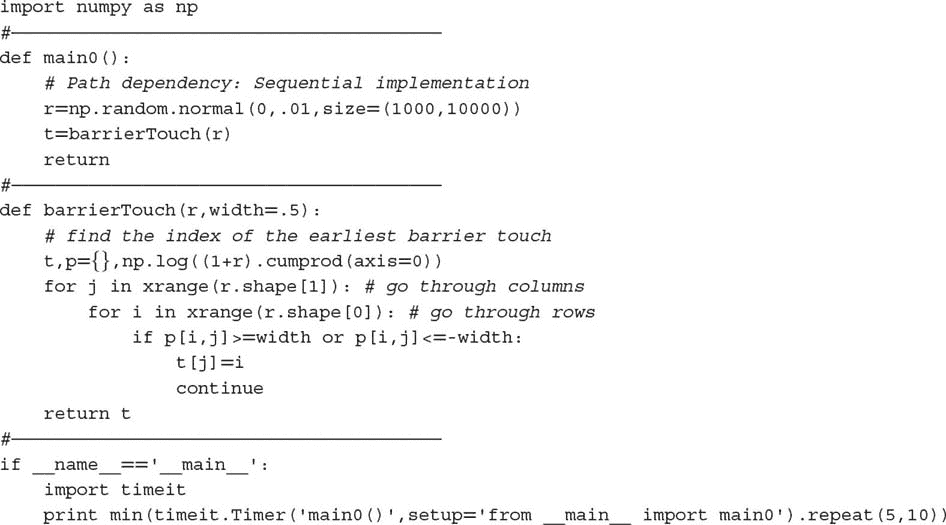

将此实现与代码片段 20.4 进行比较。现在代码将之前的问题分为 24 个任务，每个处理器一个。然后，任务在 24 个处理器上异步并行运行。如果在一个拥有 5000 个 CPU 的集群上运行相同的代码，经过的时间将大约是单线程实现的 1/5000。

> **代码片段 20.4 一次触摸双障碍的多处理实现**
> 
> 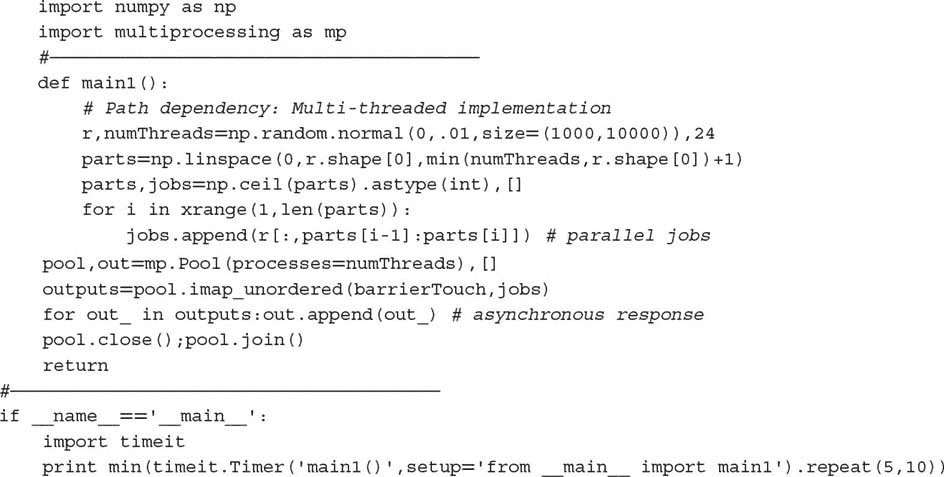

此外，你可以实现相同的代码来多处理一个向量化函数，正如我们在第三章中对函数`applyPtSlOnT1`所做的那样，其中并行进程执行包括向量化 pandas 对象的子例程。这样，你将同时实现两个层次的并行化。但为什么止步于此？你还可以通过在 HPC 集群中运行向量化代码的多进程实例一次性实现三个层次的并行化，其中集群中的每个节点提供第三层并行化。在接下来的部分中，我们将解释多处理的工作原理。

## 20.4 原子和分子

在准备并行化作业时，区分原子和分子是很有用的。原子是不可分割的任务。我们希望将这些任务分组为分子，而不是在单个线程中顺序执行所有任务，这样可以使用多个处理器并行处理。每个分子是将由回调函数顺序处理的一组原子，使用单个线程。并行化在分子级别进行。

**20.4.1 线性划分**

形成分子最简单的方法是将原子列表分成相等大小的子集，其中子集的数量是处理器数量与原子数量之间的最小值。对于*N*个子集，我们需要找到*N + 1*个索引来划分分区。这个逻辑在代码片段 20.5 中得到了展示。

> **代码片段 20.5 `**LINPARTS**` 函数**
> 
> 

通常会遇到涉及两个嵌套循环的操作。例如，计算 SADF 序列（第十七章）、评估多个障碍触摸（第三章），或计算未对齐系列的协方差矩阵。在这些情况下，原子任务的线性划分会低效，因为某些处理器必须解决比其他处理器更多的操作，计算时间将取决于最重的分子。一个部分解决方案是将原子任务划分为处理器数量的倍数，然后优先加载重分子到作业队列中。这样，轻分子将被分配给那些首先完成重分子的处理器，确保所有 CPU 在作业队列耗尽之前保持忙碌。在下一节中，我们将讨论更完整的解决方案。图 20.1 绘制了 20 个复杂度相等的原子任务线性划分为 6 个分子的情况。

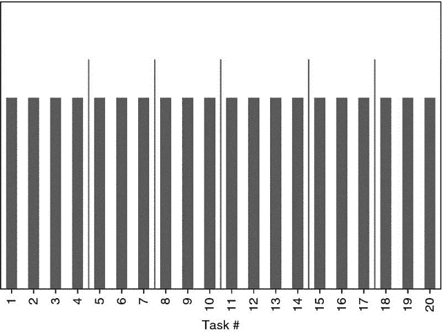

**图 20.1** 20 个原子任务的线性划分为 6 个分子

**20.4.2 双重嵌套循环划分**

考虑两个嵌套循环，外循环迭代 *i* = 1, …, *N*，内循环迭代 *j* = 1, …, *i*。我们可以将这些原子任务 {( *i* , *j* )|1 ≤ *j* ≤ *i* , *i* = 1, …, *N* } 排序为一个 *下* 三角矩阵（包括主对角线）。这需要  次操作，其中  是非对角线操作，*N* 是对角线操作。我们希望通过将原子任务划分为 *M* 个子集 { *S [*m*]* } [*m*  = 1, …,  *M*] 来并行化这些任务，每个子集大约包含 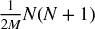 个任务。以下算法确定构成每个子集（一个分子）的行。

第一个子集 *S [1]* 由前 *r [1]* 行组成，即 *S [1]* = {1, …, *r [1]* }，总共有  个项目。然后，*r [1]* 必须满足条件 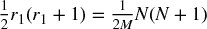。解出 *r [1]*，我们得到正根。

第二个子集包含行 *S [2]* = { *r [1]* + 1, …, *r [2]* }，总共有 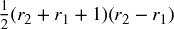 个项目。然后，*r [2]* 必须满足条件 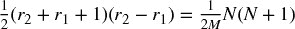。解出 *r [2]*，我们得到正根。

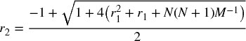

我们可以对未来的子集 *S [*m*]* = { *r [*m* − 1]* + 1, …, *r [*m*]* } 重复相同的论点，总共有 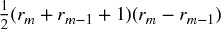 个项目。然后，*r [*m*]* 必须满足条件 。解出 *r [*m*]*，我们得到正根。

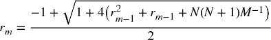

很容易看出 *r [*m*]* 约简为 *r [1]*，其中 *r [*m* − 1]* = *r [0]* = 0 *.* 由于行号是正整数，上述结果取整为最接近的自然数。这可能意味着某些划分的大小可能会稍微偏离  目标。片段 20.6 实现了这一逻辑。

> **片段 20.6 THE** `**NESTEDPARTS**` **FUNCTION**
> 
> 

如果外循环迭代 *i* = 1, …, *N*，内循环迭代 *j* = *i* , …, *N*，我们可以将这些原子任务 {( *i* , *j* )|1 ≤ *i* ≤ *j* ., *j* = 1, …, *N* } 排序为一个 *上* 三角矩阵（包括主对角线）。在这种情况下，必须将参数 `upperTriang = True` 传递给函数 `nestedParts`。对于好奇的读者，这是一个特殊的装箱问题案例。图 20.2 绘制了原子到分子的双重嵌套循环划分，复杂性逐渐增加。最终得到的 6 个分子涉及类似数量的工作，尽管一些原子任务的难度可能高达其他任务的 20 倍。

**图 20.2** 原子到分子的双重嵌套循环划分

## 20.5 多进程引擎

为每个多进程函数编写一个并行化封装是错误的。相反，我们应该开发一个可以并行化未知函数的库，无论它们的参数和输出结构如何。这就是多处理引擎的目标。在这一部分，我们将研究一个这样的引擎，一旦你理解了逻辑，你将准备好开发自己的引擎，包括各种定制属性。

**20.5.1 准备作业**

在之前的章节中，我们频繁使用了`mpPandasObj`。该函数接收六个参数，其中四个是可选的：

+   `func` : 一个回调函数，将在并行中执行

+   `pdObj` : 包含的元组：

    +   用于将分子传递给回调函数的参数名称

    +   一份不可分割的任务（原子）列表，将被分组为分子

+   `numThreads` : 将在并行中使用的线程数量（每个线程一个处理器）

+   `mpBatches` : 并行批次的数量（每个核心的作业数）

+   `linMols` : 分区将是线性还是双重嵌套

+   `kargs` : `func`所需的关键字参数

片段 20.7 列出了`mpPandasObj`的工作原理。首先，原子被分组为分子，使用`linParts`（每个分子相同数量的原子）或`nestedParts`（原子分布在下三角结构中）。当`mpBatches`大于 1 时，分子的数量将超过核心的数量。假设我们将任务分为 10 个分子，其中分子 1 的处理时间是其余分子的两倍。如果我们在 10 个核心上运行该过程，9 个核心将在运行时的一半处于闲置状态，等待第一个核心处理分子 1。另一方面，我们可以将`mpBatches =10`设置为将该任务分为 100 个分子。这样，每个核心将接收到相等的工作负载，即使前 10 个分子的处理时间与接下来的 20 个分子相同。在这个例子中，使用`mpBatches =10`的运行时间将是`mpBatches =1`所消耗时间的一半。

其次，我们形成作业列表。作业是一个字典，包含处理分子所需的所有信息，即回调函数、其关键字参数以及构成分子的原子子集。第三，如果`numThreads = =1`（见片段 20.8），我们将顺序处理作业，否则并行处理（见 20.5.2 节）。我们希望顺序运行作业的选项是出于调试目的。在多个处理器中运行程序时，很难捕获错误。^(1) 一旦代码调试完成，我们将希望使用`numThreads > 1`。第四，我们将每个分子的输出拼接成一个单一的列表、系列或数据框。

> **片段 20.7 **`**MPPANDASOBJ**`**，在书中多个地方使用
> 
> 

在 20.5.2 节中，我们将看到片段 20.8 的`processJobs_`函数的多进程对应项。

> **片段 20.8 单线程执行，用于调试**
> 
> 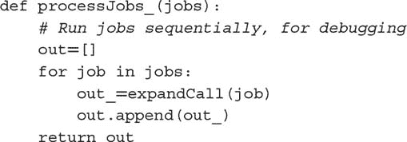

**20.5.2 异步调用**

Python 有一个名为`multiprocessing`的并行化库。这个库是多进程引擎的基础，例如`joblib`，^(2) 这是许多`sklearn`算法使用的引擎。^(3) 示例 20.9 说明了如何异步调用 Python 的`multiprocessing`库。`reportProgress`函数让我们了解已完成工作的百分比。

> **示例 20.9 异步调用 Python 的多进程库的例子**
> 
> 

**20.5.3 解包回调**

在示例 20.9 中，指令`pool.imap_unordered()`通过在单个线程中运行`jobs`（一个分子）中的每个项目并行化`expandCall`。示例 20.10 列出了`expandCall`，它解包工作（分子）中的项目（原子），并执行回调函数。这个小函数是多进程引擎核心的技巧：它将字典转化为任务。一旦你理解了它的角色，你就能够开发自己的引擎。

> **示例 20.10 将任务（分子）传递给回调函数**
> 
> 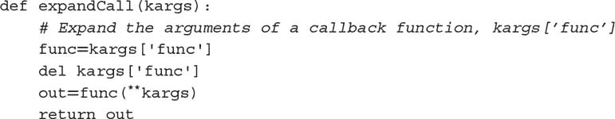

**20.5.4 序列化/反序列化对象**

多进程必须序列化方法，以便将其分配给不同的处理器。问题是，绑定的方法是不可序列化的。^(4) 解决办法是为你的引擎添加功能，告诉库如何处理这种对象。示例 20.11 包含应列在多进程引擎库顶部的指令。如果你对这段代码的具体原因感到好奇，可能想要阅读 Ascher 等人[2005]，第 7.5 节。

> **示例 20.11 将此代码放在你的引擎开头**
> 
> 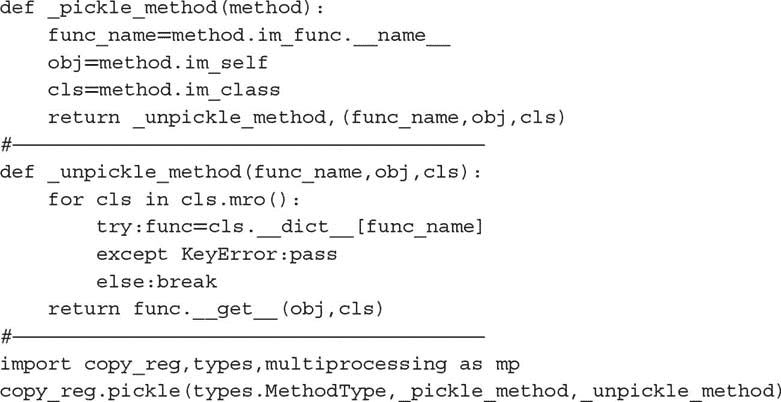

**20.5.5 输出减少**

假设你将一个任务分成 24 个分子，目标是让引擎将每个分子分配给一个可用的核心。代码段`processJobs`将在示例 20.9 中捕获这 24 个输出并将其存储在一个列表中。这种方法在输出不大的问题中是有效的。如果输出必须合并为一个单一输出，首先我们将等待最后一个分子完成，然后处理列表中的项目。只要输出的大小和数量不大，这种后处理所增加的延迟应该不会显著。

然而，当输出消耗大量 RAM，并且需要合并成单个输出时，将所有这些输出存储在列表中可能会导致内存错误。在结果由`func`异步返回时，动态执行输出减少操作会更好，而不是等到最后一个分子完成。我们可以通过改善 processJobs 来解决这个问题。特别是，我们将传递三个额外参数，以确定如何将分子输出*减少*为单个输出。片段 20.12 列出了增强版本的`processJobs`，其中包含三个新参数：

+   `redux` : 这是一个回调，用于执行减少操作的函数。例如，如果输出数据框应相加，则`redux = pd.DataFrame.add`。

+   `reduxArgs` : 这是一个字典，包含必须传递给`redux`的关键字参数（如果有的话）。例如，如果`redux = pd.DataFrame.join`，则可能是`reduxArgs = {'how':'outer'}`。

+   `reduxInPlace` : 一个布尔值，指示`redux`操作是否应在*原地*发生。例如，`redux = dict.update`和`redux = list.append`需要`reduxInPlace = True`，因为附加列表和更新字典都是原地操作。

> **片段 20.12 增强** `**PROCESSJOBS**` **以执行动态输出减少**
> 
> 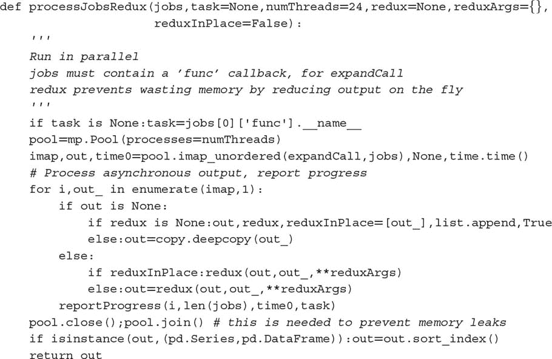

现在`processJobsRedux`知道如何处理输出，我们还可以增强 Snippet 20.7 中的`mpPandasObj`。在 Snippet 20.13 中，新函数`mpJobList`将三个输出减少参数传递给`processJobsRedux`。这消除了像`mpPandasObj`那样处理输出列表的需要，从而节省了内存和时间。

> **片段 20.13 增强** `**MPPANDASOBJ**` **以执行动态输出减少**
> 
> 

## 20.6 多进程示例

到目前为止，我们在本章中介绍的内容可以大幅加速许多冗长且大规模的数学运算。在这一节中，我们将说明多进程的另一个动机：内存管理。

假设你已经对形式为*Z* ' *Z*的协方差矩阵进行了谱分解，正如我们在第八章第 8.4.2 节所做的，其中*Z*的大小为*TxN*。这产生了一个特征向量矩阵*W*和一个特征值矩阵Λ，使得*Z* ' *ZW* = *W* Λ。现在你想要推导出解释用户定义部分总方差的正交主成分，0 ≤ τ ≤ 1。为此，我们计算！，其中！包含*W*的前*M* ≤ *N*列，使得！。计算！可以通过注意来并行化。

其中*Z [*b*]*是一个稀疏的*TxN*矩阵，仅有*TxN [*b*]*项（其余为空），是一个*NxM*矩阵，仅有*N [*b*] xM*项（其余为空），以及。这种稀疏性是通过将列集合分割为*B*个列子集的分区创建的，仅将列的*b*个子集加载到*Z [*b*]*中。这种稀疏性的概念乍一看可能有点复杂，但代码片段 20.14 展示了 pandas 如何使我们以无缝的方式实现它。函数`getPCs`通过参数`eVec`接收。参数`molecules`包含`fileNames`中的文件名子集，每个文件代表*Z [*b*]*。关键概念是我们计算*Z [*b*]*与由*Z [*b*]*中的列定义的的行切片的点积，而分子结果会即时聚合（`redux = pd.DataFrame.add`）。

> **代码片段 20.14 针对部分列的主成分**
> 
> 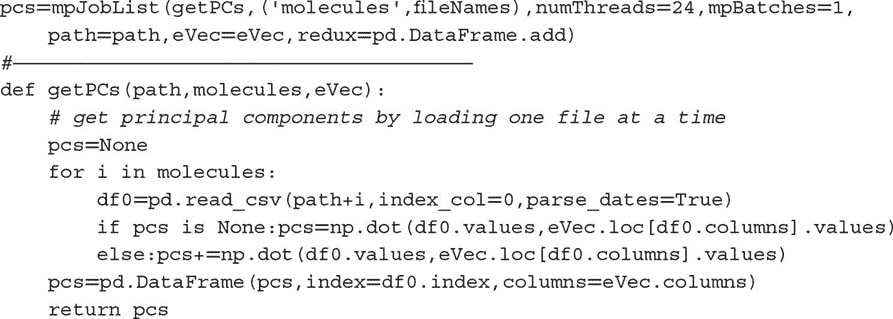

这种方法有两个优点：首先，因为`getPCs`顺序加载数据框*Z [*b*]*，对于足够大的*B*，内存不会被耗尽。第二，`mpJobList`并行执行分子，从而加快计算速度。

在实际的机器学习应用中，我们经常会遇到*Z*包含数十亿个数据点的数据集。正如这个例子所示，并行化不仅在减少运行时间方面有益。许多问题由于内存限制而无法解决，即使我们愿意等待更长时间。

**练习**

1.  > > 使用`timeit`运行代码片段 20.1 和 20.2。重复 100 次执行的 10 个批次。每个代码片段的最小耗时是多少？
1.  > > 
1.  > > 代码片段 20.2 中的指令对于单元测试、穷举搜索和情景分析非常有用。你能记得书中还在哪里见过它们吗？它们还有可能被用于哪里？
1.  > > 
1.  > > 调整代码片段 20.4，以使用两个嵌套循环方案形成分子，而不是线性方案。
1.  > > 
1.  > > 与`timeit`比较：

    1.  代码片段 20.4，通过重复 100 次执行的 10 个批次来实现。每个代码片段的最小耗时是多少？

    1.  修改代码片段 20.4（来自练习 3），通过重复 100 次执行的 10 个批次来实现。每个代码片段的最小耗时是多少？

1.  > > 通过使用`mpPandasObj`简化代码片段 20.4。
1.  > > 
1.  > > 修改`mpPandasObj`以处理使用两个嵌套循环方案形成分子的可能性，采用上三角结构。

**参考**

1.  Ascher, D., A. Ravenscroft, and A. Martelli (2005): *Python Cookbook*，第 2 版。O'Reilly Media。

**参考文献**

1.  Gorelick, M.和 I. Ozsvald (2008): *高性能 Python*，第 1 版。O'Reilly Media。

1.  López de Prado, M. (2017): “金融领域的超级计算：温和入门。”康奈尔大学讲座材料。可在[`ssrn.com/abstract=2907803.`](https://ssrn.com/abstract=2907803.)

1.  McKinney, W. (2012): *Python 数据分析*，第 1 版。O'Reilly Media。

1.  Palach, J. (2008): *用 Python 进行并行编程*，第 1 版。Packt Publishing。

1.  Summerfield, M. (2013): *Python 实战：使用并发、库和模式创建更好的程序*，第 1 版。Addison-Wesley。

1.  Zaccone, G. (2015): *Python 并行编程食谱*，第 1 版。Packt Publishing。

**注释**

^(1)    *海森堡效应*，以海森堡的不确定性原理命名，描述了在仔细观察时会改变行为的错误。多处理的错误就是一个典型例子。

^(2)     [`pypi.python.org/pypi/joblib`](https://pypi.python.org/pypi/joblib)。

^(3)     [`scikit-learn.org/stable/developers/performance.html#multi-core-parallelism-using-joblib-parallel`](http://scikit-learn.org/stable/developers/performance.html#multi-core-parallelism-using-joblib-parallel)。

^(4)     [`stackoverflow.com/questions/1816958/cant-pickle-type-instancemethod-when-using-pythons-multiprocessing-pool-ma`](http://stackoverflow.com/questions/1816958/cant-pickle-type-instancemethod-when-using-pythons-multiprocessing-pool-ma)。

