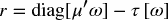
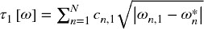
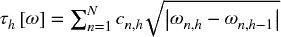
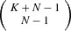
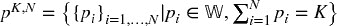
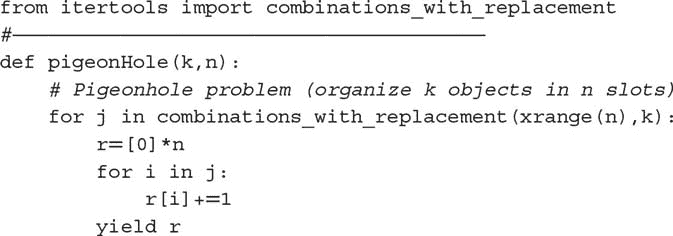
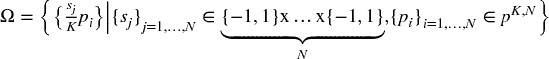
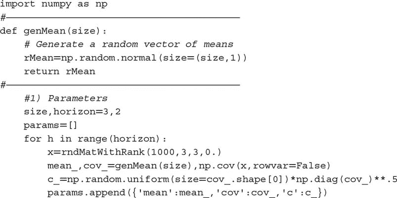

# 第二十一章：暴力搜索与量子计算机

## 21.1 动机

离散数学自然地出现在多个机器学习问题中，包括层次聚类、网格搜索、基于阈值的决策和整数优化。有时，这些问题没有已知的解析（封闭形式）解决方案，甚至没有可以近似的启发式方法，我们唯一的希望就是通过暴力搜索来寻找解决方案。在本章中，我们将研究一个对现代超级计算机来说无法解决的金融问题如何被重新表述为一个整数优化问题。这种表示方式使其适合量子计算机。通过这个例子，读者可以推断出如何将他特定的金融机器学习难题转化为量子暴力搜索。

## 21.2 组合优化

组合优化问题可以描述为存在有限个可行解的问题，这些解是通过组合有限个变量的离散值而得出的。随着可行组合数量的增加，穷举搜索变得不切实际。旅行推销员问题就是一个已知为 NP 困难的组合优化问题的例子（Woeginger [2003]），即问题类别至少和最难的可解问题一样困难，并且是非确定性多项式时间内的。

使得全面搜索不切实际的原因在于标准计算机是顺序评估和存储可行解的。但如果我们能够一次性评估和存储所有可行解呢？这正是量子计算机的目标。标准计算机的位只能在两个可能状态（{0, 1}）中选择一个，而量子计算机依赖于量子位（qubits），这是一种可以同时持有两种状态的 *线性叠加* 的存储元素。理论上，量子计算机能够做到这一点，得益于量子力学现象。在某些实现中，量子位可以支持两个方向的电流同时流动，从而提供所需的叠加。这种线性叠加特性使得量子计算机特别适合解决 NP 难的组合优化问题。有关量子计算机能力的一般论述，请参见 Williams [2010]。

理解这种方法的最佳方式是通过一个特定的例子。我们将看到一个动态投资组合优化问题如何在一般交易成本函数的约束下，被表示为一个组合优化问题，从而使量子计算机能够处理。与 Garleanu 和 Pedersen [2012] 不同，我们不假设收益来自 IID 正态分布。这个问题对大型资产管理者尤其相关，因为过度周转和执行短缺所带来的成本可能会严重侵蚀其投资策略的盈利能力。

## 21.3 目标函数

考虑一组资产 *X* = { *x [*i*]* }, *i* = 1, …, *N*，其收益在每个时间阶段 *h* = 1, …, *H* 下遵循多元正态分布，且均值和方差各不相同。我们假设收益是多元正态分布，与时间无关，但在时间上并非同分布。我们将交易轨迹定义为一个 *NxH* 矩阵 ω，该矩阵决定在每个 *H* 阶段对每个 *N* 资产分配的资本比例。在特定阶段 *h* = 1, …, *H* 下，我们有一个预测均值 μ [*h*]、一个预测方差 *V [*h*]* 和一个预测交易成本函数 τ [*h*] [ω]。这意味着，给定交易轨迹 ω，我们可以计算预期投资收益的向量 *r* ，为

其中 τ[ω] 可以采用任何功能形式。为简化起见，考虑以下情况：

+   

+   ，对于 *h* = 2, …, *H*。

+   ω[*n*] 是对工具 n 的初始分配，*n* = 1, …, *N*。

τ[ω] 是一个 *Hx1* 的交易成本向量。用通俗的话来说，与每项资产相关的交易成本是资本分配变化平方根的总和，经过一个与资产相关的特定因子 *C [*h*]* = { *c [*n* , *h*]* } [*n* = 1, …, *N*] 重新缩放，该因子会随 *h* 而变化。因此，*C [*h*]* 是一个 *Nx1* 的向量，用于确定各资产之间的相对交易成本。

与 *r* 相关的夏普比率（第十四章）可以计算为（μ [*h*] 为净风险无风险利率）

## 21.4 问题

我们希望计算出能够解决该问题的最佳交易轨迹。

该问题试图计算全局动态最优解，与均值方差优化器（见第十六章）导出的静态最优解形成对比。注意，非连续的交易成本嵌入在 *r* 中。与标准的投资组合优化应用相比，这至少有三个原因使其不是一个凸（二维）规划问题：（1）收益并非同分布，因为 μ [*h*] 和 *V [*h*]* 随 *h* 而变化。（2）交易成本 τ [*h*] [ω] 是非连续的，并随 *h* 而变化。（3）目标函数 *SR* [ *r* ] 不是凸的。接下来，我们将展示如何在不利用目标函数的任何分析性质的情况下计算解决方案（因此这种方法的广义性质）。

## 21.5 整数优化方法

该问题的普遍性使得使用标准的凸优化技术变得不可行。我们的解决策略是对其进行离散化，以便使其适合整数优化。这反过来又使我们能够利用量子计算技术找到最优解。

**21.5.1 鸽笼划分**

假设我们计算 *K* 单位资本在 *N* 资产之间的分配方式，其中我们假设 *K* > *N*。这等同于寻找非负整数解 *x [1]* + … + *x [*N*]* = *K* 的数量，该方程有一个很好的组合解 。这与数论中经典的整数划分问题相似，哈代和拉马努金（后来还有拉德马克）证明了一个渐近表达式（见约翰逊 [2012]）。虽然在划分问题中顺序并不重要，但在我们面临的问题中，顺序非常相关。例如，如果 *K* = 6 且 *N* = 3，则划分 (1, 2, 3) 和 (3, 2, 1) 必须视为不同（显然 (2, 2, 2) 不需要排列）。 图 21.1 说明了在将 6 单位资本分配给 3 个不同资产时顺序的重要性。这意味着我们必须考虑每个划分的所有不同排列。尽管有一个很好的组合解来找到这些分配的数量，但随着 *K* 和 *N* 的增大，计算可能仍然非常复杂。然而，我们可以使用斯特林近似法来轻松得到一个估算值。

**图 21.1** 划分 (1, 2, 3) 和 (3, 2, 1) 必须视为不同。

片段 21.1 提供了一种高效的算法来生成所有划分的集合，，其中  是包括零的自然数（整数）。

> **片段 21.1 将** ***K*** **个对象划分到** ***N*** **个槽位中**
> 
> 

**21.5.2 可行静态解**

我们希望计算在任何给定时间点 *h* 的所有可行解的集合，记作 Ω。考虑将 *K* 单位划分为 *N* 资产的划分集合 *p ^(*K* , *N*)*。对于每个划分 { *p [*i*]* } [*i* = 1, …, *N*] ∈ *p ^(*K* , *N*)*，我们可以定义一个绝对权重向量，使得 ，其中 （全投资约束）。这个全投资（无杠杆）约束意味着每个权重可以是正数或负数，因此对于每个绝对权重向量 {|ω [*i*] |} [*i* = 1, …, *N*]，我们可以生成 2 ^(*N*) 个（有符号）权重向量。这是通过将 {|ω [*i*] |} [*i* = 1, …, *N*] 中的项目与 {−1, 1} 的笛卡尔积项目进行 *N* 次重复相乘来完成的。片段 21.2 展示了如何生成与所有划分相关的权重向量集合 Ω，。

> **片段 21.2 与所有划分相关的所有向量集合 Ω**
> 
> 

**21.5.3 评估轨迹**

给定所有向量 Ω 的集合，我们定义所有可能轨迹的集合 Φ 为 Ω 的笛卡尔积，重复 *H* 次。然后，对于每条轨迹，我们可以评估其交易成本和 SR，并选择在 Φ 中表现最优的轨迹。片段 21.3 实现了这一功能。对象 `params` 是一个包含 *C*、μ、*V* 值的字典列表。

> **片段 21.3 评估所有轨迹**
> 
> 

请注意，该过程选择了一个全球最优轨迹，而不依赖于凸优化。即使协方差矩阵条件不良，交易成本函数不连续等，仍然会找到解决方案。我们为这种通用性付出的代价是计算解决方案极其耗费计算资源。实际上，评估所有轨迹类似于旅行推销员问题。数字计算机不适合这种 NP 完全或 NP 困难的问题；然而，量子计算机因线性叠加特性而能够同时评估多个解。

本章提出的方法为 Rosenberg 等人 [2016] 的研究奠定了基础，该研究利用量子退火器解决了最优交易轨迹问题。同样的逻辑可以应用于涉及路径依赖的大范围金融问题，如交易轨迹。难以处理的 ML 算法可以离散化并转化为针对量子计算机的暴力搜索。

## 21.6 数值示例

以下我们说明如何在实践中找到全局最优解，使用数字计算机。量子计算机将同时评估所有轨迹，而数字计算机则是顺序进行。

**21.6.1 随机矩阵**

代码片段 21.4 返回具有已知秩的高斯值随机矩阵，这在许多应用中很有用（见练习）。下次你想执行多变量蒙特卡罗实验或情景分析时，可以考虑使用这段代码。

> **代码片段 21.4 生成给定秩的随机矩阵**
> 
> 

代码片段 21.5 生成*H*均值向量、协方差矩阵和交易成本因子*C*，μ，*V*。这些变量存储在`params`列表中。

> **代码片段 21.5 生成问题的参数**
> 
> 

**21.6.2 静态解决方案**

代码片段 21.6 计算了由局部（静态）最优解产生的轨迹性能。

> **代码片段 21.6 计算和评估静态解决方案**
> 
> 

**21.6.3 动态解决方案**

代码片段 21.7 计算与全局动态最优轨迹相关的性能，应用本章中解释的函数。

> **代码片段 21.7 计算和评估动态解决方案**
> 
> 

**练习**

1.  > > 使用抽屉原则，证明！ *.*
1.  > > 
1.  > > 使用代码片段 21.4 生成大小为（1000, 10），`sigma = 1`的随机矩阵。

    1.  `rank = 1`。绘制协方差矩阵的特征值。

    1.  `rank = 5`。绘制协方差矩阵的特征值。

    1.  `rank = 10`。绘制协方差矩阵的特征值。

    1.  你观察到了什么模式？你如何将其与马科维茨的诅咒（第十六章）联系起来？

1.  > > 在第 21.6 节运行数值示例：

    1.  使用 `size = 3`，并使用 `timeit` 计算运行时间。重复 10 批次的 100 次执行。花费了多长时间？

    1.  使用 `size = 4` 和 `timeit`。重复 10 批次的 100 次执行。花费了多长时间？

1.  > > 审查本章中的所有代码片段。

    1.  有多少可以向量化？

    1.  有多少可以使用第二十章中的技术进行并行化？

    1.  如果你优化代码，你认为你能加快多少速度？

    1.  使用优化代码，在一年内可以解决的问题维度是什么？

1.  > > 在什么情况下，全局动态最优轨迹将与局部最优序列相匹配？

    1.  这是一组现实的假设吗？

    1.  如果不是，

        1.  这是否可以解释为什么简单的解决方案优于马科维茨的（第十六章）？

        1.  你认为为什么这么多公司在计算局部最优序列上花费如此多的精力？

**参考文献**

1.  Garleanu, N. 和 L. Pedersen (2012): “具有可预测回报和交易成本的动态交易。” *金融学期刊* ，第 68 卷，第 6 期，第 2309–2340 页。

1.  Johansson, F. (2012): “哈迪-拉马努金-拉德默赫公式的高效实现，” *LMS 计算与数学期刊* ，第 15 卷，第 341–359 页。

1.  Rosenberg, G., P. Haghnegahdar, P. Goddard, P. Carr, K. Wu, 和 M. López de Prado (2016): “使用量子退火器解决最优交易轨迹问题。” *IEEE 信号处理选刊* ，第 10 卷，第 6 期（9 月），第 1053–1060 页。

1.  威廉姆斯，C.（2010）：*量子计算探索*，第 2 版。施普林格。

1.  沃根格，G.（2003）： “NP-hard 问题的精确算法：一项调查。” 见于于永，M.，G. 雷因特和 G. 里纳尔迪：*组合优化—奇迹，你变小了！* 计算机科学讲义，卷 2570，施普林格，第 185–207 页。

