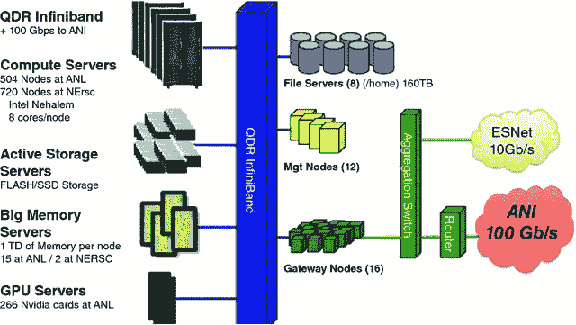
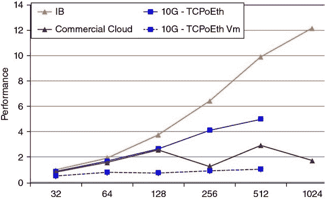
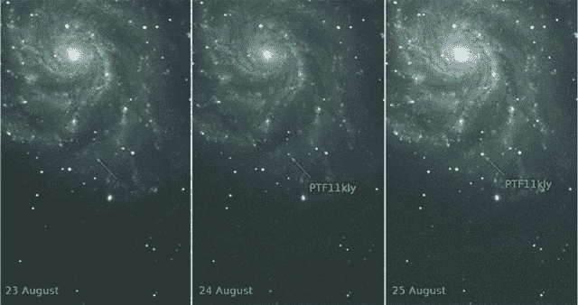
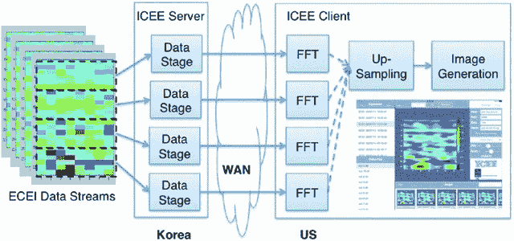
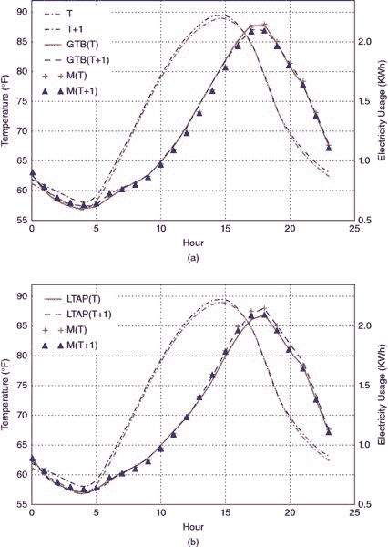
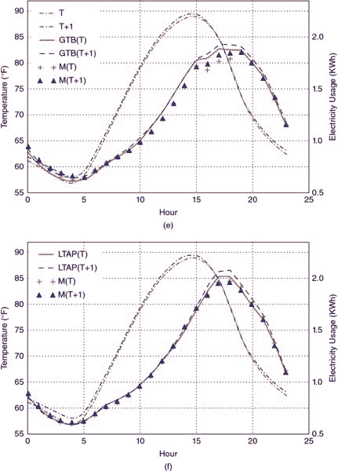
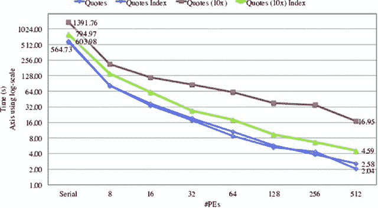
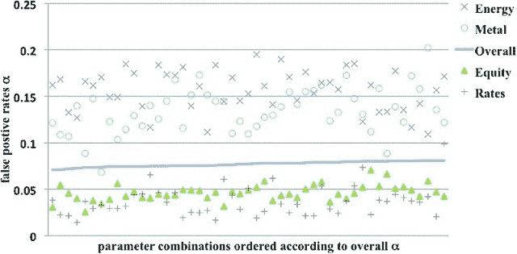
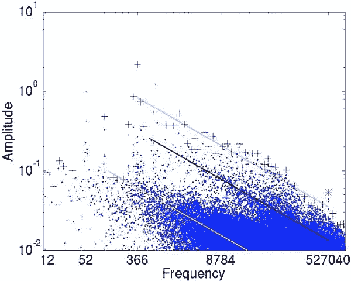

# 第二十二章：高性能计算智能与预测技术

> > 吴克生和霍斯特·D·西蒙

## 22.1 动机

本章介绍了劳伦斯伯克利国家实验室（LBNL）的计算智能与预测技术（CIFT）项目。CIFT 的主要目标是促进高性能计算（HPC）工具和技术在流数据分析中的应用。在注意到数据量被作为美国证券交易委员会（SEC）和商品期货交易委员会（CFTC）发布 2010 年闪电崩盘报告延迟五个月的解释后，LBNL 启动了 CIFT 项目，以应用 HPC 技术来管理和分析金融数据。及时处理流数据是许多商业应用的要求，例如避免电力网中的潜在故障或金融市场中的流动性危机。在所有这些情况下，HPC 工具在处理复杂数据依赖关系和提供及时解决方案方面都非常适合。多年来，CIFT 处理了多种形式的流数据，包括来自车辆交通、电力网、电力使用等的数据。以下部分将解释 HPC 系统的关键特性，介绍在这些系统上使用的一些特殊工具，并提供使用这些 HPC 工具进行流数据分析的示例。

## 22.2 对 2010 年闪电崩盘的监管响应

2010 年 5 月 6 日下午约 2:45（美国东部夏令时间），美国股市道琼斯工业平均指数经历了近 10%的下跌，但在几分钟后几乎恢复了所有损失。监管机构花了大约五个月时间才提出调查报告。在国会小组面前调查崩盘时，数据量（约 20TB）被认为是延迟的主要原因。由于高性能计算（HPC）系统，例如国家能源研究科学计算中心（NERSC），^(1)通常在几分钟内处理数百 TB 数据，我们应该能够轻松处理金融市场的数据。这促成了 CIFT 项目的建立，其使命是应用 HPC 技术和工具进行金融数据分析。

金融大数据的一个关键方面是它主要由时间序列组成。多年来，CIFT 团队及其众多合作者开发了分析多种形式的数据流和时间序列的技术。本章简要介绍了 HPC 系统，包括硬件（第 22.4 节）和软件（第 22.5 节），并讲述了一些成功的案例（第 22.6 节）。我们最后总结了迄今为止的愿景和工作，并为感兴趣的读者提供了联系方式。

## 22.3 背景

计算技术的进步使得寻找复杂模式变得相当容易。这种模式发现能力是近期若干科学突破的基础，例如希格斯粒子的发现（Aad et al. [2016]）和引力波（Abbot et al. [2016]）。这种能力同样是许多互联网公司的核心，例如，用于将用户与广告商匹配（Zeff and Aronson [1999], Yen et al. [2009]）。然而，科学与商业中使用的硬件和软件有着明显的不同。HPC 工具在多种商业应用中具有一些重要优势。

科学家的工具通常围绕高性能计算（HPC）平台构建，而商业应用的工具则围绕云计算平台构建。为了从大量数据中筛选出有用模式，这两种方法都被证明效果良好。然而，HPC 系统的主要应用是大规模仿真，例如用于预测未来几天区域性风暴的天气模型（Asanovic et al. [2006]）。相比之下，商业云最初是出于同时处理大量独立数据对象（数据并行任务）的需求而产生的。

在我们的工作中，我们主要关注流数据的分析。特别是来自传感器网络的高速复杂数据流，这些网络监测着我国的电力网和公路系统。这种流工作负载对 HPC 系统或云系统都不是理想的，如我们下面所讨论的，但我们认为 HPC 生态系统在处理流数据分析方面比云生态系统有更多的优势。

云系统最初是为并行数据任务设计的，在这些任务中，大量独立的数据对象可以同时处理。因此，该系统旨在实现高吞吐量，而不是产生实时响应。然而，许多商业应用需要实时或近实时的响应。例如，电力网中的不稳定事件可能在几分钟内发展并演变为灾难；快速找到明显的征兆可以避免灾难。同样，金融研究文献中也识别出了新出现的流动性不足事件的迹象；在活跃的市场交易时间内快速发现这些迹象可以提供防止市场冲击和避免闪崩的选项。在这些情况下，优先考虑快速周转时间的能力至关重要。

数据流按定义是逐步可用的；因此，可能没有大量的数据对象可以并行处理。通常，仅有固定数量的最新数据记录可用于分析。在这种情况下，有效利用许多中央处理单元（CPU）核心的计算能力的一种方式是将对单个数据对象（或单个时间步）的分析工作分配给多个 CPU 核心。HPC 生态系统在这类工作方面拥有比云生态系统更先进的工具。

这些是激励我们工作的主要点。关于 HPC 系统与云系统的更全面比较，我们建议感兴趣的读者参考 Asanovic 等人的[2006]文献。尤其是，Fox 等人[2015]为描述任何应用场景的相似性和差异性创建了一个详尽的分类法。

简而言之，我们认为 HPC 社区在推动流分析的最先进技术方面有很多可提供的帮助。CIFT 项目的使命是将 LBNL 的 HPC 专业知识转移到流业务应用中。我们通过合作、演示和工具开发来追求这一使命。

为了评估 HPC 技术的潜在用途，我们花费时间与各种应用进行合作。这一过程不仅使我们的 HPC 专家接触到多个领域，还使我们能够获得资金支持，以建立一个演示设施。

在众多早期支持者的慷慨捐赠下，我们建立了一个专门用于此工作的庞大计算集群。这个专用计算机（名为 dirac1）允许用户利用 HPC 系统，自行评估他们的应用。

我们还参与了一项工具开发工作，以提高高性能计算（HPC）系统在流数据分析中的可用性。在接下来的部分中，我们将描述专用 CIFT 机器的硬件和软件，以及一些演示和工具开发的努力。亮点包括将数据处理速度提高 21 倍，以及将早期预警指标的计算速度提高 720 倍。

## 22.4 HPC 硬件

传说第一代大数据系统是用从大学校园收集的闲置计算组件构建的。这可能是一个都市传说，但它强调了 HPC 系统和云系统之间差异的重要一点。理论上，HPC 系统是用定制的高成本组件构建的，而云系统则是用标准的低成本商品组件构建的。实际上，由于全球对 HPC 系统的投资远低于个人电脑，因此制造商不可能仅为 HPC 市场生产定制组件。事实是，HPC 系统在很大程度上是由商品组件组装而成，就像云系统一样。然而，由于它们的目标应用不同，组件选择上存在一些差异。

让我们依次描述计算元素、存储系统和网络系统。图 22.1 是一个高层次示意图，表示 2010 年左右的 Magellan 集群的关键组件（Jackson 等人[2010]；Yelick 等人[2011]）。计算元素包括 CPU 和图形处理单元（GPU）。这些 CPU 和 GPU 几乎都是商业产品。例如，dirac1 上的节点使用的是一个 24 核 2.2GHz 的 Intel 处理器，这在云计算系统中很常见。目前，dirac1 不包含 GPU。

**图 22.1** Magellan 集群的示意图（约 2010 年），HPC 计算集群的一个例子

网络系统由两部分组成：连接集群内组件的 InfiniBand 网络和与外界的交换网络连接。在这个特定的例子中，外部连接标记为“ESNet”和“ANI”。InfiniBand 网络交换机在云计算系统中也很常见。

图 1 中的存储系统包括旋转硬盘和闪存存储。这种组合也很常见。不同之处在于，HPC 系统的存储系统通常集中在计算节点外，而典型的云计算系统的存储系统则分布在计算节点之间。这两种方法各有优缺点。例如，集中存储通常作为全球文件系统导出给所有计算节点，这使得处理存储在文件中的数据变得更容易。然而，这需要一个高效能的网络来连接 CPU 和磁盘。相比之下，分布式方法可以使用较低容量的网络，因为有一些存储靠近每个 CPU。通常，像谷歌文件系统（Ghemawat、Gobioff 和 Leung [2003]）这样的分布式文件系统会在云计算系统之上层叠，使存储对所有 CPU 可访问。

简而言之，当前一代 HPC 系统和云系统使用的几乎都是相同的商业硬件组件。它们的区别主要在于存储系统和网络系统的布局。显然，存储系统设计的差异可能会影响应用性能。然而，云系统的虚拟化层可能是应用性能差异的更大原因。在下一节中，我们将讨论另一个可能有更大影响的因素，即软件工具和库。

虚拟化通常用于云计算环境，使同一硬件可供多个用户使用，并将一个软件环境与另一个环境隔离。这是区分云计算环境与 HPC 环境的更突出特点之一。在大多数情况下，计算机系统的三个基本组件——CPU、存储和网络——都是虚拟化的。这种虚拟化有很多好处。例如，现有应用可以在 CPU 芯片上运行而无需重新编译；许多用户可以共享相同的硬件；硬件故障可以通过虚拟化软件进行修复；失败计算节点上的应用可以更轻松地迁移到其他节点。然而，这一虚拟化层也会增加一些运行时开销，可能会降低应用性能。对于时间敏感的应用，这种性能降低可能成为一个关键问题。

测试表明，性能差异可能相当大。接下来，我们简要描述了 Jackson 等人于[2010]报告的一项性能研究。图 22.2 显示了使用不同计算机系统时的性能下降。横轴下方的名称是 NERSC 常用的不同软件包。左侧条形代表商业云，中间条形代表 Magellan，右侧（有时缺失）条形代表 EC2-Beta-Opt 系统。未优化的商业云实例运行这些软件包的速度比 NERSC 超级计算机慢 2 到 10 倍。即使在更昂贵的高性能实例上，也会有明显的减速。

**图 22.2** 云在运行科学应用时的速度明显慢于 HPC 系统（大约 2010 年）

图 22.3 显示了导致软件包 PARATEC 性能下降的主要因素的研究。在图 2 中，我们看到 PARATEC 在商业云上的完成时间比在 HPC 系统上长 53 倍。从图 3 中我们观察到，随着核心数量（横轴）的增加，测量性能（以 TFLOP/s 为单位）之间的差异变得更大。特别是，标记为 “10G-TCPoEth Vm” 的线在核心数量增加时几乎没有变化。这是网络实例使用虚拟化网络（TCP over Ethernet）的情况。它清楚地表明，网络虚拟化开销是显著的，以至于使云变得无用。

**图 22.3** 随着核心数量的增加（横轴），虚拟化开销变得更加显著（约 2010 年）。

虚拟化开销问题被广泛认可（Chen et al. [2015]）。已经进行了大量研究，旨在解决 I/O 虚拟化开销（Gordon et al. [2012]）以及网络虚拟化开销（Dong et al. [2012]）。随着这些最先进的技术逐渐进入商业产品，我们预计未来开销将减少，但某些开销不可避免地会保留。

在本节的总结中，我们简要讨论 HPC 与云计算的经济学。通常，HPC 系统由非营利研究组织和大学运行，而云系统由商业公司提供。利润、客户保留以及许多其他因素影响云系统的成本（Armburst et al. [2010]）。在 2011 年，Magellan 项目报告指出：“成本分析表明，与商业云提供商相比，DOE 中心的成本具有竞争力，通常便宜 3–7 倍”（Yelick et al. [2010]）。

一组高能物理学家认为他们的用例非常适合云计算，并进行了详细的比较研究（Holzman et al. [2017]）。他们的成本比较仍然表明，商业云服务在可比计算任务中大约比专用 HPC 系统贵 50%；然而，作者在数据进出方面面临严重限制，以避免可能的高额数据移动费用。对于复杂的工作负载，例如本书讨论的流数据分析，我们预计这种 HPC 成本优势在未来仍将存在。2016 年美国国家科学院的一项研究得出了同样的结论，即即使是亚马逊的长期租赁，其处理 NSF 预期科学工作负载的成本也可能是 HPC 系统的 2 到 3 倍（见国家科学院的第 6.2 节，[2016]）。

## 22.5 HPC 软件

具有讽刺意味的是，超级计算机的真正力量在于其专门的软件。无论是 HPC 系统还是云系统，都有多种软件包可供选择。在大多数情况下，相同的软件包在这两个平台上均可用。因此，我们选择专注于独特于 HPC 系统的软件包，并且有潜力改善计算智能和预测技术。

HPC 软件生态系统的一个显著特征是，许多应用软件通过消息传递接口（MPI）执行自身的处理器间通信。事实上，大多数科学计算书籍的基石就是 MPI（Kumar 等 [1994], Gropp, Lusk, 和 Skjellum [1999]）。因此，我们对 HPC 软件工具的讨论将从 MPI 开始。由于本书依赖于数据处理算法，我们将专注于数据管理工具（Shoshami 和 Rotem [2010]）。

**22.5.1 消息传递接口**

消息传递接口是一种用于并行计算的通信协议（Gropp, Lusk, 和 Skjellum [1999], Snir 等 [1988]）。它定义了一些点对点数据交换操作以及一些集体通信操作。MPI 标准的建立是基于几次早期尝试建立可移植通信库的基础上。来自阿贡国家实验室的早期实现，名为 MPICH，具有高性能、可扩展和可移植的特点。这帮助 MPI 在科学用户中获得了广泛的接受。

MPI 的成功部分归功于其将语言无关规范（LIS）与语言绑定的分离。这使得同一个核心功能可以为许多不同的编程语言提供，这也促进了其被广泛接受。第一个 MPI 标准同时指定了 ANSI C 和 Fortran-77 的绑定以及 LIS。草案规范在 1994 年超级计算会议上向用户社区进行了展示。

另一个促成 MPI 成功的关键因素是 MPICH 所使用的开源许可证。该许可证允许供应商获取源代码来生成他们自己的定制版本，这使得高性能计算（HPC）系统供应商能够快速生成自己的 MPI 库。直到今天，所有 HPC 系统都在其计算机上支持熟悉的 MPI。这种广泛的采用也确保了 MPI 将继续成为 HPC 系统用户喜爱的通信协议。

**22.5.2 分层数据格式 5**

在描述 HPC 硬件组件时，我们注意到 HPC 平台中的存储系统通常与云平台中的存储系统不同。因此，大多数用户用于访问存储系统的软件库也不同。这种差异可以追溯到数据概念模型的不同。通常，HPC 应用将数据视为多维数组，因此，HPC 系统上最流行的 I/O 库被设计为与多维数组配合使用。在这里，我们描述最广泛使用的数组格式库 HDF5（Folk 等人 [2011]）。

HDF5 是由 HDF 集团推出的分层数据格式的第五个版本。^(2) HDF5 中的基本数据单位是数组及其相关信息，如属性、维度和数据类型。它们合在一起称为数据集。数据集可以被分组为称为组的大单元，组可以组织成高层次的组。这种灵活的层次组织使用户能够表达数据集之间复杂的关系。

除了将用户数据组织成文件的基本库外，HDF 集团还提供了一套工具以及针对不同应用的 HDF5 专业化。例如，HDF5 包括一个性能分析工具。NASA 为其地球观测系统（EOS）数据提供了 HDF5 的专业化版本，名为 HDF5-EOS；而下一代 DNA 序列社区则为其生物信息数据推出了一种名为 BioHDF 的专业化版本。

HDF5 为高性能计算（HPC）平台上的存储系统提供了一种高效的访问方式。在测试中，我们已经证明，使用 HDF5 存储股市数据显著加快了分析操作。这在很大程度上归功于其高效的压缩/解压缩算法，这些算法最小化了网络流量和 I/O 操作，这也引出了我们的下一个要点。

**22.5.3** ***原位*** **处理**

在过去几十年里，CPU 性能大约每 18 个月翻一番（摩尔定律），而磁盘性能每年增加不到 5%。这种差异导致将 CPU 内存内容写出所需的时间越来越长。为了解决这个问题，一些研究工作集中于*原位*分析能力（Ayachit 等人 [2016]）。

在当前一代处理系统中，适应性 I/O 系统（ADIOS）是使用最广泛的系统（Liu et al. [2014]）。它采用了多种数据传输引擎，使用户能够接入 I/O 流并执行分析操作。这是有用的，因为不相关的数据可以在传输过程中被丢弃，从而避免其缓慢且庞大的存储。同样的*就地*机制也使得它能够非常快速地完成写入操作。事实上，它最初引起关注是因为其写入速度。从那时起，ADIOS 开发者与许多大型团队合作，改进了他们的 I/O 管道和分析能力。

由于 ADIOS 支持流数据访问，因此它与 CIFT 的工作高度相关。在多个演示中，结合 ICEE 传输引擎的 ADIOS 能够实时完成分布式流数据分析（Choi et al. [2013]）。我们将在下一节描述一个涉及融合等离子体中斑点的用例。

总结来说，*就地*数据处理能力是高性能计算（HPC）生态系统中的另一个非常有用的工具。

**22.5.4 趋同**

我们之前提到，HPC 硬件市场是整体计算机硬件市场中的一小部分。与整体软件市场相比，HPC 软件市场甚至更小。到目前为止，HPC 软件生态系统主要由一些小型供应商和一些开源贡献者维护。因此，HPC 系统用户面临着迁移到更好支持的云软件系统的巨大压力。这是 HPC 软件与云软件之间趋同的重要驱动因素（Fox et al. [2015]）。

尽管趋同似乎是不可避免的，但我们主张选择一种趋同方案，以保留上述软件工具的优势。CIFT 项目的一个动机是寻求将上述工具转移到未来计算环境的方法。

## 22.6 用例

数据处理在现代科学研究中是如此重要，以至于一些研究人员将其称为科学的第四范式（Hey, Tansley, and Tolle [2009]）。在经济学中，相同的数据驱动研究活动催生了广受欢迎的行为经济学（Camerer and Loewenstein [2011]）。最近的数据驱动研究的许多进展基于机器学习应用（Qiu et al. [2016], Rudin and Wagstaff [2014]）。它们在行星科学和生物信息学等广泛领域的成功引起了来自不同领域研究人员的极大兴趣。在本节的其余部分，我们将描述几个将先进数据分析技术应用于各个领域的示例，其中许多用例源自 CIFT 项目。

**22.6.1 超新星搜寻**

在天文学中，通过测量爆炸的 Ia 型超新星的光来确定许多重要事实，例如宇宙的膨胀速度（Bloom et al. [2012]）。在夜空中寻找爆炸超新星的过程称为综合成像调查。帕洛马瞬态工厂（PTF）就是此类综合调查的一个例子（Nicholas et al. [2009]）。PTF 望远镜每 45 分钟扫描一次夜空并生成一组图像。新的图像与之前对同一片天空的观察进行比较，以确定发生了什么变化并对这些变化进行分类。这类识别和分类任务过去是由天文学家手动完成的。然而，来自 PTF 望远镜的输入图像数量过于庞大，无法进行手动检查。为这些图像处理任务开发并部署了一种自动化工作流，在多个不同的计算中心运行。

图 22.4 显示了在爆炸过程中最早被识别的超新星。2011 年 8 月 23 日，天空的一片区域没有显示出这颗星星的迹象，但在 8 月 24 日出现了一道微弱的光。这一快速的变化使世界各地的天文学家能够进行详细的后续观察，这对确定与宇宙膨胀相关的参数至关重要。

**图 22.4** 超新星 SN 2011fe 是在首次发现爆炸证据后 11 小时被发现的，这得益于天文观测分类的广泛自动化。

这颗超新星的快速识别是自动化工作流机器学习能力的重要证明。该工作流处理输入图像，以提取自上次观察以来发生变化的对象。然后，它对变化的对象进行分类，以根据先前的训练确定初步类型。由于提取快速变化的瞬态新科学的后续资源非常宝贵，因此分类不仅需要指示假定的类型，还需要表明分类的可能性和置信度。使用在 PTF 数据上训练的分类算法，瞬态和变星的错误标记率为 3.8%。预计在即将进行的调查中，例如大视场巡天望远镜，将取得更高的准确率。

**22.6.2 融合等离子体中的斑点**

在物理学和气候学等领域的大规模科学探索中，涉及成千上万的科学家的国际合作项目。随着这些合作产生越来越多的数据，并且速度不断加快，现有的工作流程管理系统难以跟上。一个必要的解决方案是，在数据到达相对缓慢的磁盘存储系统之前，对其进行处理、分析、总结和缩减，这一过程称为在传输中处理（或飞行分析）。与 ADIOS 开发人员合作，我们实施了 ICEE 传输引擎，显著提升了协作工作流程系统的数据处理能力（Choi et al. [2013]）。这一新功能显著改善了分布式工作流程的数据流管理。测试表明，ICEE 引擎使多个大型国际合作能够做出近实时的协作决策。这里，我们简要描述了涉及 KSTAR 的聚变合作。

KSTAR 是一个配备全超导磁体的核聚变反应堆。它位于韩国，但全球有许多相关研究团队。在聚变实验的运行期间，一些研究人员在 KSTAR 控制物理设备，而其他研究人员则可能希望通过对先前实验运行进行协作分析来参与，以提供如何配置设备以进行下一个运行的建议。在实验测量数据的分析过程中，科学家可能会运行模拟或检查之前的模拟以研究参数选择。通常，在两次连续运行之间可能会有 10 到 30 分钟的间隔，所有的协作分析需要在这个时间窗口内完成，以影响下一个运行。

我们展示了 ICEE 工作流程系统在两种不同数据类型下的功能：一种来自 KSTAR 测量的电子回旋辐射成像（ECEI）数据，另一种涉及来自 XGC 建模的合成诊断数据。分布式工作流程引擎需要收集这两个来源的数据，提取称为“blob”的特征，跟踪这些 blob 的运动，预测实验测量中 blob 的移动，并提供行动建议。图 22.5 展示了 ECEI 数据的处理方式。XGC 模拟数据的工作流程与图 22.5 中显示的类似，只是 XGC 数据位于 NERSC。

**图 22.5** 研究聚变等离子体动态的分布式工作流程

为了能够实时完成上述分析任务，使用 ADIOS 的 ICEE 传输引擎进行有效的数据管理只是部分解决方案。第二部分是高效检测数据块（Wu et al. [2016]）。在这项工作中，我们需要通过仅选择必要的数据块来减少跨广域网传输的数据量。然后，我们识别所有位于数据块内的单元，并将这些单元分组为空间中的连接区域，每个连接区域形成一个数据块。我们开发的新算法通过充分利用 MPI 在节点之间的通信和同一节点上 CPU 核心之间的共享内存，将工作分配到不同的 CPU 核心。此外，我们还更新了连接组件标签算法，以正确识别边缘的数据块，而这些数据块在早期检测算法中经常被遗漏。总体而言，我们的算法能够在每个时间步中识别数据块，时间仅为几毫秒，充分利用了 HPC 系统中的并行性。

**22.6.3 日内峰值电力使用**

公用事业公司正在部署先进的计量基础设施（AMI），以捕捉前所未有的电力消费时空细节。这一庞大且快速增长的数据流为基于大数据分析平台的预测能力提供了重要的测试场（Kim et al. [2015]）。这些尖端的数据科学技术结合行为理论，使得行为分析能够获得对电力消费模式及其潜在驱动因素的新见解（Todd et al. [2014]）。

由于电力无法轻易储存，其生成必须与消费相匹配。当需求超过发电能力时，就会发生停电，通常发生在消费者最需要电力的时候。由于增加发电能力成本高昂且需要数年时间，监管机构和公用事业公司制定了一系列定价方案，旨在抑制高峰需求期间的不必要消费。

为了衡量定价政策对峰值需求的有效性，可以分析由 AMI 生成的电力使用数据。我们的工作专注于提取家庭电力使用的基线模型，以进行行为分析研究。基线模型理想上应捕捉家庭电力使用的模式，包括除新定价方案外的所有特征。建立这样的模型面临众多挑战。例如，有许多特征可能影响电力使用，但没有记录相关信息，如空调的设定温度或新设备的购买。其他特征，例如室外温度是已知的，但其影响很难用简单函数捕捉。

我们的工作开发了多种新的基线模型，以满足上述要求。目前，黄金标准基线是一个设计良好的随机对照组。我们展示了我们新的数据驱动基线能够准确预测对照组的平均电力使用量。为了进行此评估，我们使用了来自美国某地区的一个精心设计的研究，该地区在五月到八月的下午和晚上电力使用量最高。尽管这项工作集中于证明新的基线模型对群体的有效性，但我们相信这些新模型在未来研究个别家庭时也非常有用。

我们探索了多种标准的黑盒方法。在机器学习方法中，我们发现梯度树提升（GTB）比其他方法更有效。然而，最准确的 GTB 模型需要滞后变量作为特征（例如，前一天和前一周的电力使用量）。在我们的工作中，我们需要使用 T-1 年的数据来建立 T 年和 T+1 年的基线使用量。前一天和前一周的滞后变量将包含在 T-1 年中没有的最近信息。我们尝试修改预测程序，用最近的预测值替代前一天和前一周的实际测量值；然而，我们的测试表明，预测误差随着时间的推移而累积，导致在夏季进入一个月左右后产生不切实际的预测。这种预测误差的累积在时间序列的连续预测过程中很常见。

为了解决上述问题，我们设计了多种白盒方法，其中最有效的方法称为 LTAP，在此报告。LTAP 基于这样一个事实：每日的总变量电力使用量可以用平均每日温度的分段线性函数准确描述。这个事实使我们能够对每日的总电力使用量进行预测。通过进一步假设每个家庭的使用模式在研究期间保持不变，我们能够从每日的总使用量中分配出每小时的使用值。该方法被证明是自我一致的；即预测过程完全重现了 T-1 年的电力使用量，并且 T 年和 T+1 年对照组的预测值与实际测量值非常接近。两个处理组在峰值需求小时的电力使用量都有所减少，主动组的减少幅度大于被动组。这一观察结果与其他研究一致。

尽管新的数据驱动基线模型 LTAP 准确预测了控制组的平均使用情况，但对于旨在减少高峰需求时段使用的新时段定价的预测影响存在一些差异（见图 22.6）。例如，以控制组作为基线，活跃组在第一个年度新价格下的高峰需求时段平均减少使用量 0.277 kWh（约 2 kWh），在第二年减少 0.198 kWh。以 LTAP 作为基线，两年的平均减少量仅为 0.164 kWh。部分差异可能由于处理组中的自我选择偏差，尤其是活跃组，其中家庭必须明确选择参加试验。选择加入活跃组的家庭很可能适合利用新定价结构。我们认为 LTAP 基线是解决自我选择偏差的一种方法，并计划进行额外研究以进一步验证这一点。

**图 22.6** 梯度树提升（GBT）似乎过于紧密地跟随最近的使用情况，因此无法像新开发的名为 LTAP 的方法那样预测基线使用情况。(a) 控制组的 GTB。(b) 控制组的 LTAP。(c) 被动组的 GTB。(d) 被动组的 LTAP。(e) 活跃组的 GTB。(f) 活跃组的 LTAP。

**22.6.4 2010 年闪电崩盘**

美国证券交易委员会（SEC）和商品期货交易委员会（CFTC）调查 2010 年闪电崩盘所需的延长时间是 CIFT 工作的最初动机。联邦调查人员需要筛选数十 TB 的数据以寻找崩盘的根本原因。由于 CFTC 公开指责数据量是导致延误的原因，我们开始寻找能够轻松处理数十 TB 数据的高性能计算（HPC）工具。鉴于 HDF5 是最常用的 I/O 库，我们的工作始于将 HDF5 应用于组织大量的股票交易数据（Bethel et al. [2011]）。

让我们快速回顾一下 2010 年闪电崩盘期间发生的事件。5 月 6 日，大约在下午 2:45（美国东部夏令时），道琼斯工业平均指数下跌近 10%，许多股票以每股一美分交易，这是任何可能交易的最低价格。图 22.7 展示了另一个极端案例，苹果公司（股票代码 AAPL）的股票以每股$100,000 的价格交易，这是交易所允许的最高价格。显然，这些都是不寻常的事件，削弱了投资者对我们金融市场的信心。投资者要求知道造成这些事件的原因。

**图 22.7** 2010 年 5 月 6 日苹果股票价格，以及在市场交易时段每 5 分钟计算的 HHI 和 VPIN 值。

为了使我们的工作与金融行业相关，我们寻求使用 HDF5 软件进行实验，并将其应用于计算早期预警指标的具体任务。基于一组机构投资者、监管机构和学术界的推荐，我们实现了两组指标，这些指标已被证明具有在闪电崩盘前的“早期预警”特性。它们分别是信息交易的量同步概率（VPIN）（Easley, Lopez de Prado, 和 O'Hara [2011]）以及市场碎片化的赫芬达尔-赫希曼指数（HHI）的一个变体（Hirschman [1980]）。我们在 C++语言中实现了这两个算法，同时使用 MPI 进行进程间通信，以充分利用高性能计算（HPC）系统。这一选择的理由是，如果这些早期预警指标中的任何一个被证明是成功的，高性能实现将使我们能够尽早提取警告信号，从而有时间采取纠正措施。我们的努力是展示能够快速计算早期警告信号的第一步之一。

对于我们的工作，我们实现了两个版本的程序：一个使用组织在 HDF5 文件中的数据，另一个从常用的 ASCII 文本文件中读取数据。图 22.8 显示了处理所有标准普尔 500 只股票在 10 年期间的交易记录所需的时间。由于 10 年交易数据的大小仍然相对较小，我们还将数据复制了 10 倍。在单个 CPU 核心上（在图 22.8 中标记为“串行”），使用 ASCII 数据大约需要 3.5 小时，但使用 HDF5 文件仅需 603.98 秒。当使用 512 个 CPU 核心时，这一时间使用 HDF5 文件减少到 2.58 秒，速度提升达到 234 倍。

**图 22.8** 处理存储在 HDF5 文件中的 10 年期 SP500 报价数据所需的时间，当相同数据存储在 ASCII 文件中时，所需时间要长 21 倍（603.98 秒与大约 3.5 小时相比）。

在更大的（复制的）数据集中，计算这些指标的 HPC 代码的优势更加明显。数据量增加 10 倍时，计算机完成任务所需的时间仅增加了约 2.3 倍，延迟增幅低于线性。使用更多 CPU 使得 HPC 更具可扩展性。

图 22.8 还显示，利用大量数据集，我们可以进一步利用 HDF5 中可用的索引技术来减少数据访问时间（这反过来又减少了整体计算时间）。当使用 512 个 CPU 核心时，总运行时间从 16.95 秒减少到 4.59 秒，得益于这一 HPC 索引技术，速度提升为 3.7 倍。

**22.6.5 量同步信息交易概率校准**

理解金融市场的波动性需要处理大量数据。我们应用数据密集型科学应用中的技术来完成这一任务，并通过在大量期货合约上计算称为成交量同步知情交易概率（VPIN）的早期预警指标来证明其有效性。测试数据包含了最常交易的百种期货合约的 67 个月交易记录。平均而言，处理一个合约的 67 个月数据大约需要 1.5 秒。在我们有这个 HPC 实现之前，完成同样的任务大约需要 18 分钟。我们的 HPC 实现实现了 720 倍的加速。

请注意，上述加速仅基于算法改进，未利用并行化的优势。HPC 代码可以在使用 MPI 的并行机器上运行，从而进一步减少计算时间。

我们工作中采用的软件技术包括上述通过 HDF5 实现的更快 I/O 访问，以及用于存储计算 VPIN 所需的柱状图和桶的更简化数据结构。更多详细信息可见于 Wu 等人[2013]。

借助更快的 VPIN 计算程序，我们也能更深入地探索参数选择。例如，我们能够识别出将 VPIN 的假阳性率从 100 多种合约的 20%降低到仅 7%的参数值，见图 22.9。实现这一性能的参数选择为：(1) 用交易的中位价格为成交量柱定价（而非通常分析中使用的收盘价），(2) 每天 200 个桶，(3) 每个桶 30 个柱，(4) 计算 VPIN 的支持窗口=1 天，事件持续时间=0.1 天，(5) 使用ν=0.1 的学生 t 分布进行大宗成交量分类，(6) VPIN 的 CDF 阈值=0.99。再次强调，这些参数在所有期货合约上提供了低假阳性率，而不是个别拟合的结果。

**图 22.9**不同类别的期货合约的平均假阳性率（α），按照其平均值排序。

在不同类别的期货合约中，可以选择不同的参数以实现更低的假阳性率。在某些情况下，假阳性率甚至可以显著低于 1%。基于图 22.9，利率和指数期货合约的假阳性率通常较低。商品期货合约，如能源和金属，通常假阳性率较高。

此外，更快的 VPIN 计算程序使我们能够验证 VPIN 识别的事件是“内在的”，因为诸如 VPIN CDF 阈值等参数的变化只会稍微改变检测到的事件数量。如果这些事件是随机的，将阈值从 0.9 更改为 0.99 将会使事件数量减少十倍。简而言之，更快的 VPIN 程序还使我们能够确认 VPIN 的实时有效性。

**22.6.6 使用非均匀快速傅里叶变换揭示高频事件**

高频交易在所有电子金融市场中普遍存在。随着算法取代人类以前执行的任务，类似于 2010 年闪电崩盘的级联效应可能变得更加可能。在我们的研究中（宋等人 [2014]），我们汇集了一些高性能信号处理工具，以提高对这些交易活动的理解。作为一个例证，我们总结了天然气期货交易价格的傅里叶分析。

通常，傅里叶分析应用于均匀间隔的数据。由于市场活动呈现爆发式，因此我们可能希望根据交易活动的指数来抽样金融时间序列。例如，VPIN 根据成交量对金融系列进行抽样。然而，对金融系列进行按时间顺序的傅里叶分析仍然可能是有启发的。为此，我们使用非均匀快速傅里叶变换（FFT）程序。

从天然气期货市场的傅里叶分析中，我们看到市场中存在强烈的高频交易证据。对应于高频的傅里叶成分在近年来（1）变得更加突出，且（2）远远强于市场结构所能预期的。此外，每分钟的第一秒发生了大量交易活动，这显然是由旨在达到时间加权平均价格（TWAP）的算法触发的交易迹象。

对交易数据的傅里叶分析表明，每分钟频率的活动明显高于邻近频率（见 图 22.10）。请注意，纵轴为对数刻度。每分钟频率的活动强度比邻近频率强十倍以上。此外，活动在每分钟的定义非常精确，这表明这些交易是由故意构建的自动事件触发的。我们将此视为 TWAP 算法在该市场中具有显著存在的强烈证据。

**图 22.10** 显示了 2012 年天然气期货合约交易价格的傅里叶频谱。非均匀快速傅里叶变换（FFT）识别出每日发生一次（频率= 366）、每日发生两次（频率= 732）和每分钟发生一次（频率= 527040 = 366*24*60）活动的强烈存在。

我们预期频率分析会显示出强烈的日常周期。在图 22.10 中，我们预计频率 365 的振幅会很大。然而，我们看到最高的振幅是频率 366。这可以解释为 2012 年是闰年。这验证了非均匀 FFT 捕捉到了预期信号。第二和第三高的振幅分别对应于频率 732 和 52，分别是一天两次和一周一次，这也并不令人意外。

我们还对交易量应用了非均匀 FFT，发现了更多算法交易的证据。此外，信号指向近年来算法交易的强劲存在。显然，非均匀 FFT 算法对于分析高度不规则的时间序列非常有用。

## 22.7 摘要与参与呼吁

目前，构建大规模计算平台有两种主要方式：HPC 方法和云方法。大多数科学计算工作使用 HPC 方法，而大多数商业计算需求则通过云方法满足。传统观点认为，HPC 方法只占据了一个小的、无关紧要的市场。这并不正确。HPC 系统对科学研究的进展至关重要。它们在一些激动人心的新科学发现中发挥了重要作用，包括希格斯粒子和引力波。它们还促进了新研究领域的开发，如行为经济学，以及通过互联网进行商业的新方式。极大规模 HPC 系统的实用性促成了 2015 年国家战略计算倡议。

还有一些努力使 HPC 工具变得更加有用，以加速它们在商业应用中的采用。HPC4Manufacturing ^(4)项目正在将这一知识转移到美国制造业，并引起了相当大的关注。现在是推动 HPC 以满足其他关键商业需求的更集中时刻。

最近几年，我们开发了 CIFT 作为一类广泛的商业应用，这些应用可以从 HPC 工具和技术中受益。在如何应对电力变压器的电压波动和即将发生的市场波动事件的早期预警信号等决策中，HPC 软件工具可以帮助决策者提前识别信号，为预测提供足够的信心，并在灾难性事件发生之前预测后果。这些应用具有复杂的计算需求，且通常对响应时间有严格要求。HPC 工具更适合满足这些需求，而不是基于云的工具。

在我们的工作中，我们已经证明 HPC I/O 库 HDF5 可以将数据访问速度加速 21 倍，而 HPC 技术可以将 Flash Crash 预警指标 VPIN 的计算加速 720 倍。我们开发了额外的算法，使我们能够预测未来数年的日峰电力使用情况。我们预计将 HPC 工具和技术应用于其他领域也能取得同样显著的成果。

除了上述提到的性能优势外，若干已发布的研究（Yelick 等 [2011]，Holzman 等 [2017]）还显示 HPC 系统在价格上也具有显著优势。根据工作负载对 CPU、存储和网络的需求，使用云系统的成本可能比使用 HPC 系统高 50%，在某些情况下甚至高达七倍。对于本书中描述的复杂分析任务，由于其对数据摄取的持续需求，我们预计成本优势将继续很大。

CIFT 正在扩大将 HPC 技术转移到私营公司的努力，以便他们也能享受到大型研究设施所享有的价格和性能优势。我们之前的合作伙伴提供了资金，以启动一个专用的 HPC 系统供我们使用。这个资源应该能让感兴趣的各方更容易地在 HPC 系统上尝试他们的应用程序。我们欢迎不同形式的合作。如需有关 CIFT 的更多信息，请访问 CIFT 的网页 [`crd.lbl.gov/cift/`](http://crd.lbl.gov/cift/)。

## 22.8 致谢

CIFT 项目是大卫·莱因维伯博士的构想。霍斯特·西蒙博士于 2010 年将其引入 LBNL。E. W. 贝瑟尔博士和 D. 贝利博士领导了该项目四年。

CIFT 项目得到了多位捐赠者的慷慨支持。这项工作部分得到了美国能源部科学办公室高级科学计算研究办公室的支持，合同号为 DE-AC02-05CH11231。此项研究还使用了在同一合同下支持的国家能源研究科学计算中心的资源。

**参考文献**

1.  Aad, G. 等 (2016)： “在 ATLAS 实验中使用 *pp* 碰撞数据测量希格斯玻色子的产生和衰变率及耦合强度。” *欧洲物理杂志 C*，第 76 卷，第 1 期，第 6 页。

1.  Abbott, B.P. 等 (2016)： “观察到来自双黑洞合并的引力波。” *物理评论快报*，第 116 卷，第 6 期，第 061102 页。

1.  Armbrust, M. 等 (2010)： “云计算的视角。” *ACM 通讯*，第 53 卷，第 4 期，第 50–58 页。

1.  Asanovic, K. 等 (2006)： “并行计算研究的全景：来自伯克利的视角。” *技术报告 UCB/EECS-2006-183*，加州大学伯克利分校 EECS 系。

1.  Ayachit, U. 等：“极大规模在线基础设施的性能分析、设计考虑和应用。”《国际高性能计算、网络、存储与分析会议论文集》。IEEE 出版社。

1.  Bethel, E. W. 等（2011）：“闪电崩盘后时代的联邦市场信息技术：超级计算的角色。”《WHPCF'2011 会议论文集》。ACM。23–30 页。

1.  Bloom, J. S. 等（2012）：“在综述调查时代自动发现和分类瞬态与变星。” *太平洋天文学会出版物* ，第 124 卷，第 921 期，1175 页。

1.  Camerer, C.F. 和 G. Loewenstein（2011）：“行为经济学：过去、现在、未来。”载于 *行为经济学进展* ，1–52 页。

1.  Chen, L. 等（2015）：“云计算中虚拟化开销的剖析与理解。” *并行处理（ICPP）* ，2015 年第 44 届国际会议。IEEE。

1.  Choi, J.Y. 等（2013）：ICEE：“针对近实时科学应用的广域在线数据处理框架。”第 4 届 SC 大型（大）数据分析研讨会：与 SC13 相关的挑战与机遇。

1.  Dong, Y. 等（2012）：“基于 SR-IOV 的高性能网络虚拟化。” *并行与分布计算杂志* ，第 72 卷，第 11 期，1471–1480 页。

1.  Easley, D.，M. Lopez de Prado 和 M. O'Hara（2011）：“‘闪电崩盘’的微观结构：流动性毒性、流动性崩溃和知情交易的概率。” *投资组合管理杂志* ，第 37 卷，第 2 期，118–128 页。

1.  Folk, M. 等（2011）：“HDF5 技术套件及其应用概述。”《EDBT/ICDT 2011 数组数据库研讨会论文集》。ACM。

1.  Fox, G. 等（2015）：“大数据、模拟与 HPC 融合，iBig Data 基准测试”：第 6 届国际研讨会，WBDB 2015，2015 年 6 月 16–17 日，加拿大多伦多；第 7 届国际研讨会，WBDB 2015，2015 年 12 月 14–15 日，印度新德里，修订精选论文，由 T. Rabl 等编辑。2016，Springer 国际出版：Cham。3–17 页。DOI: 10.1007/978-3-319-49748-8_1。

1.  Ghemawat, S.，H. Gobioff 和 S.-T. Leung（2003）：“谷歌文件系统，” *SOSP '03：第十九届 ACM 操作系统原理研讨会论文集* 。ACM。29–43 页。

1.  Gordon, A. 等（2012）：“ELI：为 I/O 虚拟化提供裸金属性能。” *SIGARCH 计算机架构新闻* ，第 40 卷，第 1 期，411–422 页。

1.  Gropp, W.，E. Lusk 和 A. Skjellum（1999）：*使用 MPI：基于消息传递接口的可移植并行编程* 。MIT 出版社。

1.  Hey, T.，S. Tansley 和 K.M. Tolle（2009）：*第四范式：数据密集型科学发现* 。第 1 卷。微软研究，华盛顿州雷德蒙德。

1.  Hirschman, A. O.（1980）：*国家力量与国际贸易结构* 。第 105 卷。加州大学出版社。

1.  Holzman, B. 等（2017）：“HEPCloud，HEP 设施的新范式：CMS 亚马逊网络服务调查。” *大科学的计算与软件*，第 1 卷，第 1 期，第 1 页。

1.  Jackson, K. R. 等（2010）：“在亚马逊网络服务云上高性能计算应用的性能分析。” *云计算技术与科学（CloudCom）*。2010 年第二届国际会议。IEEE。

1.  Kim, T. 等（2015）：“使用梯度树提升提取基线电力使用情况。” IEEE 智能城市/社会计算/可持续计算国际会议（SmartCity）。IEEE。

1.  Kumar, V. 等（1994）：*并行计算导论：算法的设计与分析*。本杰明/卡明斯出版社。

1.  Liu, Q. 等（2014）：“你好，ADIOS：开发领导级 I/O 框架的挑战和经验。” *并发与计算：实践与经验*，第 26 卷，第 7 期，第 1453–1473 页。

1.  国家科学院、工程院和医学研究院（2016）：*2017–2020 年支持美国科学和工程的国家科学基金会先进计算基础设施的未来方向*。国家科学院出版社。

1.  Nicholas, M. L. 等（2009）：“Palomar 瞬态工厂：系统概述、性能与初步结果。” *太平洋天文学会出版物*，第 121 卷，第 886 期，第 1395 页。

1.  Qiu, J. 等（2016）：“大数据处理的机器学习调查。” *EURASIP 信号处理进展杂志*，第 2016 卷，第 1 期，第 67 页。DOI: 10.1186/s13634-016-0355-x

1.  Rudin, C. 和 K. L. Wagstaff（2014）“科学与社会的机器学习。” *机器学习*，第 95 卷，第 1 期，第 1–9 页。

1.  Shoshani, A. 和 D. Rotem（2010）：“科学数据管理：挑战、技术与部署。” *Chapman & Hall/CRC 计算科学系列*。CRC 出版社。

1.  Snir, M. 等（1998）：*MPI：完整参考。第 1 卷，MPI-1 核心*。麻省理工学院出版社。

1.  Song, J. H. 等（2014）：“通过非均匀快速傅里叶变换探索不规则时间序列。”第 7 届高性能计算金融研讨会论文集，IEEE 出版社。

1.  Todd, A. 等（2014）：“智能电表的见解：基于行为的项目在高峰时段节省潜力。”劳伦斯·伯克利国家实验室。可在[`www4.eere.energy.gov/seeaction/system/files/documents/smart_meters.pdf`](https://www4.eere.energy.gov/seeaction/system/files/documents/smart_meters.pdf)获取。

1.  Wu, K. 等（2013）：“分析市场波动的大数据方法。” *算法金融*。第 2 卷，第 3 期，第 241–267 页。

1.  Wu, L. 等（2016）：“朝着实时检测和追踪时空特征：融合等离子体中的斑块-细丝。” *IEEE 大数据学报*，第 2 卷，第 3 期，第 262–275 页。

1.  Yan, J. 等（2009）：“行为定向在在线广告中能提供多少帮助？”第 18 届国际万维网会议论文集。ACM。第 261–270 页。

1.  Yelick, K., 等 (2011): “关于科学的云计算的马格兰报告。” 美国能源部，科学办公室。

1.  Zeff, R.L. 和 B. Aronson (1999): *互联网广告* 。约翰·威利与儿子公司。

**笔记**

^(1)    NERSC 是一个由美国能源部资助的国家用户设施，位于 LBNL。关于 NERSC 的更多信息可在 [`nersc.gov/`](http://nersc.gov/) 找到。

^(2)    HDF Group 网站是 [`www.hdfgroup.org/`](https://www.hdfgroup.org/) 。

^(3)    国家战略计算计划可在线查看，网址为 [`www.whitehouse.gov/ sites/whitehouse.gov/files/images/NSCI%20Strategic%20Plan.pdf`](https://www.whitehouse.gov/sites/whitehouse.gov/files/images/NSCI%20Strategic%20Plan.pdf) 。该主题的维基百科页面 ([`en.wikipedia.org/wiki/National_Strategic_Computing_Initiative`](https://en.wikipedia.org/wiki/National_Strategic_Computing_Initiative) ) 也有一些有用的额外信息链接。

^(4)    关于 HPC4Manufacturing 的信息可在线查看，网址为 [`hpc4mfg.llnl.gov/`](https://hpc4mfg.llnl.gov/) 。

