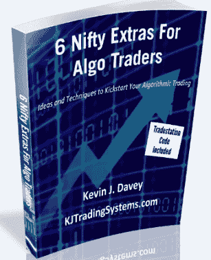
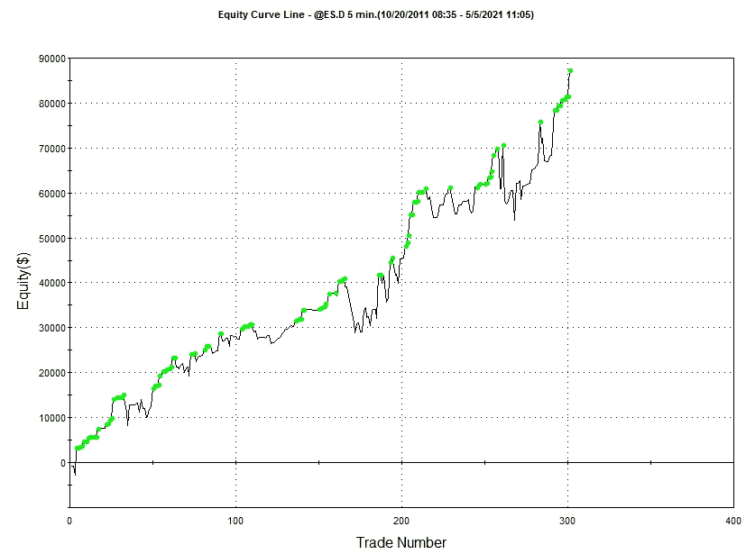

获取我的奖金材料！  在开始之前，请访问 [`www.AOKbooks.com/cheat-codes`](http://www.AOKbooks.com/cheat-codes) 以获取这些奖金：

+   代码包 – 本书中许多研究的 Tradestation 代码

+   “6 个精美附加” – 不是进场，不是出场，而是您可以用于算法交易的 Tradestation 有用代码片段

+   免费迷你标准普尔算法策略，包含完全公开的代码

+   邀请您参加我提供的免费交易网络研讨会，免费文章以及更多内容！

 在开始之前，请访问 [`www.AOKbooks.com/cheat-codes`](http://www.AOKbooks.com/cheat-codes) 以获取这些奖金：

+   代码包 – 本书中许多研究的 Tradestation 代码

+   “6 个精美附加” – 不是进场，不是出场，而是您可以用于算法交易的 Tradestation 有用代码片段

+   免费迷你标准普尔算法策略，包含完全公开的代码

+   邀请您参加我提供的免费交易网络研讨会，免费文章以及更多内容！

在开始之前，请访问 [`www.AOKbooks.com/cheat-codes`](http://www.AOKbooks.com/cheat-codes) 以获取这些奖金：

+   代码包 – 本书中许多研究的 Tradestation 代码

+   “6 个精美附加” – 不是进场，不是出场，而是您可以用于算法交易的 Tradestation 有用代码片段

+   免费迷你标准普尔算法策略，包含完全公开的代码

+   邀请您参加我提供的免费交易网络研讨会，免费文章以及更多内容！

+   代码包 – 本书中许多研究的 Tradestation 代码

+   “6 个精美附加” – 不是进场，不是出场，而是您可以用于算法交易的 Tradestation 有用代码片段

+   免费迷你标准普尔算法策略，包含完全公开的代码

+   邀请您参加我提供的免费交易网络研讨会，免费文章以及更多内容！

+   “6 个精美附加” – 不是进场，不是出场，而是您可以用于算法交易的 Tradestation 有用代码片段

+   免费迷你标准普尔算法策略，包含完全公开的代码

+   邀请您参加我提供的免费交易网络研讨会，免费文章以及更多内容！

+   免费迷你标准普尔算法策略，包含完全公开的代码

+   邀请您参加我提供的免费交易网络研讨会，免费文章以及更多内容！

+   邀请您参加我提供的免费交易网络研讨会，免费文章以及更多内容！
