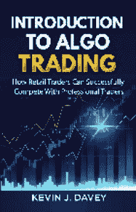
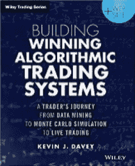
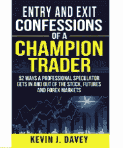
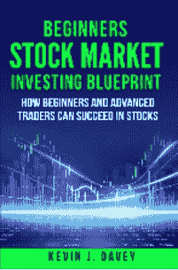
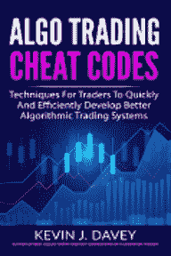

我的算法交易书籍路线图随着这本书的发布，我现在已经出版了 5 本关于交易的书籍。因此，人们经常问“哪本书适合我？”这是一个方便的小路线图，帮助你做出决定。“算法交易入门” - 如果你是算法交易世界的新手，这本书是一个很好的起点。它为你提供了算法交易的基础知识，并讨论了一些在认真对待之前需要了解的简单内容。 “构建成功的算法交易系统” – 如果你在算法交易中有一点经验，你可能意识到，算法交易最难的部分是构建一个真正有效的算法交易系统。我的第一本书帮助你达到这个目标。在书中，你将学习到开发自己算法交易策略的正确技术。 “冠军交易者的入场与出场忏悔” – 一旦你在算法交易中获得经验并了解如何开发策略，就会进入一个不断尝试构建新策略的过程。由于你测试的大多数想法和策略不会奏效，因此你需要不断的创意来源。这本书正好提供了这些。我在自己的交易中使用的大量入场和出场的想法。这本书将长期为中级交易者提供测试想法的来源。“初学者股票市场投资蓝图” – 针对初学者交易者和投资者设计，但同样适用于高级交易者。这本书与我的算法交易书籍方向不同，更加关注股票市场。许多算法期货交易者发现这本书对他们退休账户中的股票投资组合非常有用。“算法交易作弊码” – 这是你现在手中拿着的书。它是为中级到高级算法交易者设计的——那些寻求新概念和研究以帮助他们创建新策略的交易者。利用我为这本书所做工作的结论，交易者将能够避免算法系统开发中固有的一些死胡同。正如你所看到的，我的书涵盖了从入门教材到高级信息的广泛内容。希望你能随着经验的增加，决定尝试其中一本或多本书。
