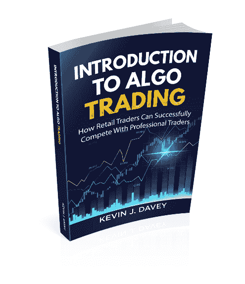

关于作者凯文·J·戴维！作为一名获奖的全职交易员和畅销书作者，凯文·戴维在算法交易领域已经有几十年的专业经验。凯文参加了期货交易的世界杯锦标赛，曾获得一次第一名和两次第二名，每年的收益超过 100%。凯文在每个期货市场中开发、分析和测试交易策略。他目前以个人账户全职交易。他还通过算法交易课程“策略工厂®”帮助交易员显著提高交易能力。凯文的策略工厂研讨会在 2016 年被一家知名交易网站评为“年度最佳交易课程”。更多信息请访问[`www.kjtradingsystems.com`](https://www.kjtradingsystems.com)。凯文为《股票与商品技术分析》杂志撰写每月的“算法问答”专栏，并因其交易书籍和在线课程获得多个行业奖项。凯文居住在俄亥俄州克利夫兰，是密歇根大学（航天工程学士，荣誉生）的优等毕业生。他还拥有凯斯西储大学韦瑟海德管理学院技术管理集中方向的 MBA 学位，并因其完美的 G.P.A.获得校长学术成就奖。在全职交易之前，凯文曾担任一家设计和制造飞行关键部件的航空公司质量和工程副总裁，管理超过 100 名工程师、审计员和支持人员。因其努力，他获得了《克利夫兰商业》杂志颁发的“40 位 40 岁以下”奖项。凯文目前与妻子和三个孩子居住在克利夫兰郊区。凯文·J·戴维的其他书籍：初学算法交易者：中级/高级算法交易者：   所有这些高度评价的书籍均可在 Amazon.com 上找到。点击任何一本书即可访问 Amazon。
