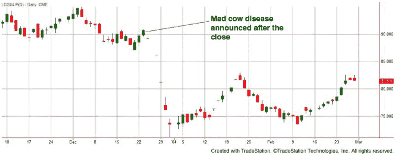

# 引言

我想呕吐。胃里的胆汁达到了无法承受的程度，但我周围没有洗手间。在高速公路上以 75 英里每小时的速度疾驰，看不到任何出口，我只能硬着头皮接受我的命运。我真的很想蜷缩起来去死。好吧，不完全是。我想先呕吐，*然后*再蜷缩起来去死。

是因为吃了没煮到“鞋皮”程度的猪肉而导致的旋虫病吗，正如我妈妈总是预言的那样？不对。是夹杂着*大肠杆菌*的生煎汉堡？也不完全是。罪魁祸首确实是肉，但它是以活牛的形式出现的。准确地说，是活牛期货。所有 40,000 磅的活牛让我突然感到恶心。具体来说，是牛海绵状脑病，更常被称为疯牛病。我并没有得这种病，但我那场不幸的投机投资确实得了。

这是在 2003 年 12 月的最后时刻，那是一个充满个人和职业希望的月份。我最近被提升为阿戈科技公司的质量保证副总裁，这是一家中型航天公司，我很幸运能够参与其中，直到它被一家没有灵魂的庞大企业收购。我还曾被《克里夫兰商业》杂志评选为“40 位 40 岁以下的杰出人才”——被认定为俄亥俄州克里夫兰新兴商业明星之一。我的期货交易账户表现良好，以至于我感觉自己知道自己在做什么（这种感觉往往在之后被市场狠狠打脸，不过我不想多说）。最后，我的第一个孩子将在几个月后出生。考虑到这一切，我的运势似乎很好。

然后，灾难来袭。三次。迅速。

在 2003 年 12 月 12 日，我美丽而了不起的妻子艾米和我迎来了我们的第一个儿子安东尼。他早产了两个月，而且是死胎。为我们第一个孩子的到来而进行的计划，突然间变成了为葬礼和埋葬做准备。失去孩子带来的撕心裂肺的痛苦几乎无法理解，直到它发生在你身上。我显然没有为此做好准备。那天，梦想被摧毁，生活突然变得不公，希望和快乐似乎变成了遥远的记忆。毫无疑问，艾米和我在精神上、身体上和情感上都遭受了巨大的打击。

不到一周后，12 月 17 日，第二场灾难降临。我的父亲在他 75 岁生日那天去世。讽刺的是，经过 30 年的三次心脏搭桥手术，并不是他的动脉堵塞了他，而是癌症——一种在烟囱清扫工中常见的可怕癌症。我想这也算合理，因为他是消防员，正值壮年时追赶过很多浣熊，作为一家害虫控制公司的共同老板。看着他躺在床上，生命慢慢离开他的身体，我的头开始像陀螺一样旋转。说我无法思考清楚，那简直是轻描淡写。

在一周内经历两次如此改变人生的事件，你可能会猜测我不会再进行交易或从事其他任何心理和情感任务。但你错了。我依然在交易。回首往事，我在交易时真是疯狂。然而，我还是这样做了。在 12 月 23 日，收盘前大约一个小时，我一时兴起决定买入活牛期货。我确信我有我的理由，但我同样确定那些理由是我脑中构造出来的，以证明这笔交易。我根本不在理智状态，根本不该交易。

我相信你知道这个故事的结局。在 12 月 23 日收盘后，美国农业部宣布在美国发现一起疯牛病病例。对市场的影响将是非常负面的。由于我持有活牛期货，而市场显然要急剧下跌，我的账户正经历缓慢的死亡，只有期货市场的每日限额暂时减缓了这种情况。每份合约我每天最多只能损失 600 美元，至少在交易所扩大每日下跌限制之前。对于我的账户规模来说，即使只有一份合约的“限价”下跌也是极其痛苦的。

**图 0.1** 疯牛病导致活牛期货崩溃

一周后，经过三天的限价跌停市场——我无法以任何价格退出——我终于能够清算，损失为 5400 美元。

这次的损失是我预期的最大损失的七倍，按我账户的百分比计算，真是惨痛。这并不是世界末日，但让我深思。过去一个月是否只是交易和生活长期亏损的开始？我在交易中究竟在做什么，经历了如此多的情感打击？仅凭一时冲动和直觉进行交易？我何时才能停止这种破坏性行为？我能否停止这种破坏性行为，最终成为一名成功的交易员？这一系列的不幸事件能否成为我涅槃重生的动力，扭转我的交易？有太多问题——我没有答案。

结果表明，这笔交易虽然糟糕，但疯牛病可能救了我的交易生涯。这本书记录了我的交易故事，包含了所有的缺陷。在这个过程中，我在开发机械交易系统方面越来越出色，稍后我会向你展示我用来开发成功算法交易系统的过程。

##  谁能从这本书中受益？

不论你是什么类型的交易员，或者你在交易方面的经验如何，我相信你会在这本书中找到与你产生共鸣的内容。

对于初学者，我希望这本书能为你们打开眼界。我不能，也不会，给你灌输交易利润像雨水一样从天而降的想法。任何告诉你交易很简单的人都是在欺骗你。当然，你可以通过交易赚很多钱，但你也需要准备面对大量的亏损、大幅的回撤和风险。每当有人告诉我交易轻而易举时，我总会怀疑他们的判断。我所讲述的故事，尽管有时痛苦，却是许多散户交易者的现实旅程。当然，正如我对所有初学者所说的，读完我写的内容后，也要阅读其他交易者的书籍。对所有事物保持开放的心态。经过大量阅读后，你将能够对什么是正确的、什么是胡说八道，以及你喜欢和不喜欢的内容做出明智的判断。关于交易的信息误导是惊人的，因此所有初学者都必须保持警惕。

对于中级或略有经验但仍在挣扎的交易者，也许你们至今的失败并不是心理或信心的问题。如今，许多交易书籍对心理方面非常强调，但如果你在错误地制定策略，即使有再多的心理准备也无济于事。如果你曾经在优化策略后立刻开始交易却亏了钱，那么你很可能意识到自己做错了什么。本书中详细描述的过程应该非常适合你，因为它将引导你走上正确的方向。

对于专业交易者，我在这里展示的大部分内容你们可能已经以某种方式见过。当然，有许多优秀的交易书籍讨论了我在这里提到的许多问题和难点。但总有新的东西可供学习，新的方法可以尝试，以及不同的思维方式。你可能会在本书中发现许多与你当前方法不同的内容，并且你很可能会通过将这些新想法融入交易中受益。

虽然本书是围绕算法或机械交易设计的，这是我主要的交易方式，但自由裁量交易者也可以从本书详细阐述的概念中受益。也许你自由裁量方法中的某些部分可以进行统计测试。例如，假设你的自由裁量入场是基于移动平均线交叉，结合你的直觉。测试你的直觉可能是不可能的，但移动平均线交叉可以进行前向测试并进行轻微优化。或者你可能想评估盈亏平衡或移动止损的退出方式。有许多错误的测试方法，但只有少数正确的方法。你将在本书中学到一种正确的方法。因此，利用本书中的概念，你可以大大改善你的自由裁量方法，因为你将知道如何正确设计和测试交易系统。无论是 100%机械策略，还是部分机械和部分自由裁量系统，将实际绩效数字应用于进出都只会给你信心，并形成更好的交易方法。

我将*构建成功的算法交易系统*分为七个部分。在书中的七个部分中，你会看到我交替使用某些术语：

+   *策略或交易系统*——用于交易的方法。这可以是严格的规则、一般指导原则，或者完全随机的猜测。最终结果就是你的策略或交易系统。

+   *机械或基于规则的交易或算法交易*——一种交易风格，其中所有规则都是 100%明确定义的。没有自由裁量，交易者不需做出决策。

+   *混合交易系统*——一种交易风格，结合了算法交易与自由裁量交易的特点。一个例子是一个机械系统，它提供进出信号，但给交易者选择接受或拒绝信号的选项。

在第一部分，我带你回顾我的交易历史。我认为我早期的起起落落——主要是下跌——对于新手或初学交易者来说是相当典型的。我为市场支付了“学费”多年。但我能够坚持下来，在 2006 年赢得期货交易世界冠军^®，并在 2005 年和 2007 年获得第二名。在那些成功之后，我达到了所有兼职、爱好型、零售交易者梦想的境地：我能够离开一个有前途的职业，全职交易，实现我的梦想。

本书的第二部分，我会告诉你我目前是如何做事情的。从评估交易系统到设计新的交易系统，我详细阐述了我的过程。这个过程并不完美，而且不断演变，但它包含了我在刚开始时希望能够拥有的重要信息。即使你只是跟随我所做的一些片段，你也应该能够节省数千的市场学费。

在第三到第七部分，我构建了一个交易系统，从概念到实盘交易。它是一个好的交易系统，但绝不是终极解决方案（顺便说一下，这个是不存在的）。我还在这一部分讨论了我认为最接近终极解决方案的方式——多样化。最后，我讨论了如何实时监控我的策略，通过几个月的交易进展实时记录我的交易日记。

我希望通过阅读我的故事，你能够避免我的错误，并从中学习。相信我，因为你会看到，我犯了很多错误。
