# 第一部分

一个交易者的旅程

# 第一章

交易者的诞生

那是 1989 年，我在加州追梦。其实我并不在做梦，我已经身处加州，过着年轻单身汉的梦想。大学毕业一年左右，我住在阳光明媚的曼哈顿海滩，加州，公寓距离柔软的白沙仅三个街区，那里的沙子如此美妙，以至于用于帮助创造夏威夷的威基基海滩。我在一年之前以优异的成绩毕业，获得密歇根大学的航空航天工程学士学位，这是一所顶尖的工程学校。随后，我拒绝了麻省理工学院、加州理工学院、斯坦福大学、普渡大学和密歇根州的航空航天硕士项目录取。我放弃了那些伟大的学校，以实现我在阳光明媚的加州生活和工作的终生梦想。

我仍然记得我做出那个决定的确切时刻。在密歇根州安阿伯的一个寒冷冬天，我正走在南大学大道上去上我的最后一个学期的课。风吹得如此猛烈，我甚至倾身迎向风，看看它是否能让我站稳。此时，面朝冰冻人行道摔倒并不会比脸上感受到刺骨的寒风更糟。那似乎像是狂风的气流让我保持直立，然后我知道——我不想，也不需要，生活在冬天寒冷的地方，而像我这样的航空航天工程毕业生都在涌向阳光明媚的南加州。我的决定已经做出。阳光和沙滩就是我的选择。

毕业几周后，我打包了我的 belongings，和我的姐姐凯伦一起，跨越全国开车去温暖阳光明媚的洛杉矶。

一年后，我安定下来了。我有一群亲密的朋友，他们大多数像我一样都是来自中西部的移民。我们周末常常玩海滩排球，通常在当地酒吧喝几杯来结束一天的活动。我喜欢海滩生活以及它提供的所有娱乐。开着我的小红色 T 顶跑车在海滩城市周围兜风，生活真不错。

但总觉得缺少了什么。

我无法确切说出原因，但我知道这并不是我想要的生活。海滩生活当然很适合我，但我选择的职业是错误的。设计未来的战斗机和参与秘密政府项目在某种程度上确实令人满足，但我就是感觉这不是我的未来。我无法想象自己做那种工作五年，更不用说三十或四十年的职业生涯了。我需要一剂兴奋剂来唤醒我。那剂兴奋剂出现在一天的垃圾邮件中，它改变了一切。

这本垃圾邮件小册子来自肯·罗伯茨，一位期货和商品交易者。至少他是这么自我介绍的。回想起来，他确实更像是一个推销员，而不是交易者。肯带着亲切的微笑和一顶牛仔帽，描述了等待任何勇敢交易期货或商品的人们的财富，那时人们更常称之为商品。

他在那本小册子里有一个引人入胜的故事，我承认我很快就被吸引住了。看着糖的图表，如图 1.1 所示，看到所有等待我的潜在利润，我怎么能不被吸引呢？

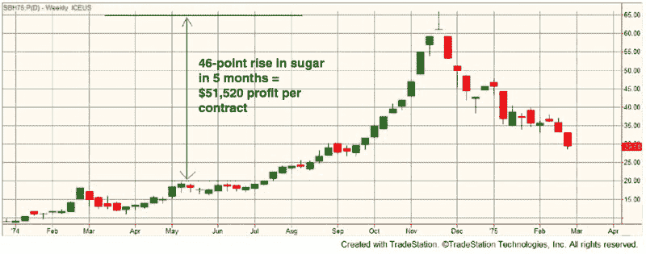

**图 1.1** 糖价暴涨 = 无限利润？

在那个时候，*回撤、破产风险*和*情绪控制*这些词并不在我的词汇表中。但*巨额利润、轻松赚钱*和*简单交易*突然出现了！而且还有退款保证，我怎么会出错呢？这是一张无风险进入无限利润潜力世界的通行证——或者说我的天真自我这么认为。所以我寄出了支票，那个晚上梦想着所有即将流向我的财富。

几周后，我收到了完整的交易课程。这是一本厚重的手册，里面充满了有利可图的示例图表。起初，我感到非常震撼。但随后我开始仔细查看细节。结果发现整个课程主要基于 1-2-3 头肩形态。如大多数交易者和投资者所知，这是一种经典的图表模式，如图 1.2 所示。在你查看的任何图表上都容易找到这个模式——你几乎可以在任何图表、任何工具和任何时间框架上找到一两个有利可图的例子。

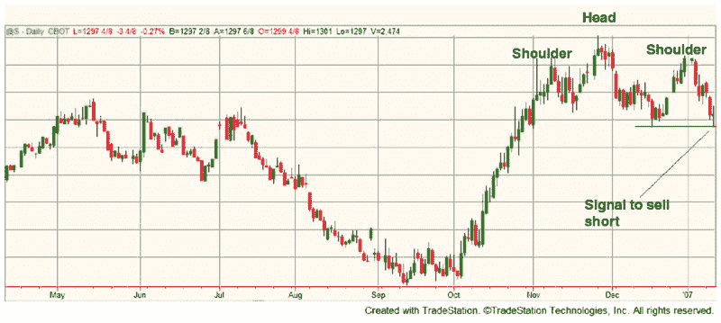

**图 1.2** 好的头肩形态还是仅仅是错误信号？

问题在于，头肩形态给出了很多错误信号，通常在事后看起来才会显得不错。当然，我起初并不知道这一点。我只知道我可以查看图表，找出头肩形态，并观察它的效果。

我最终发现我错过了两个关键的拼图。首先，当你查看带有头肩形态或任何其他模式的图表时，很容易看到成功的交易，因为你同时在观察模式及其结果。如果你试着隐藏模式的结果，找到好的模式就会变得更加困难。

我错过的第二个关键是，仅仅存在一种模式并不一定意味着应该进行交易。如果你采取你看到的每一个头肩交易，你很快就会破产，如图 1.3 所示。当然，天真的渴望成为交易者的我对此事实毫无察觉。

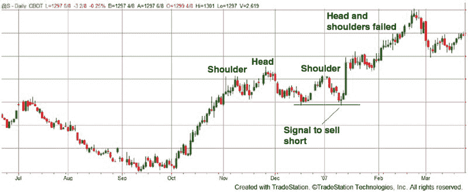

**图 1.3** 许多头肩形态看起来不错，但最终都会失败

在认真跟踪并模拟交易所有头肩信号一个月后，发现大多数都是无利可图的，我将所有交易记录和手册寄回申请退款。罗伯茨先生兑现了他的承诺，退回了我的钱。

我对交易致富的梦想暂时破灭。好在，我现在看到期货是前进的方向——我刚意识到头肩形态并不是我的出路。一旦我放弃了通过 1-2-3 头肩形态快速致富的想法，我就做了许多科学的、以数字为导向的人常做的事：我寻求数学公式来帮助我做决策。我从许多人开始的地方入手：移动平均线。

##  我的移动平均灾难

我相信每个交易者或投资者在其交易生涯中某个时刻都见过或使用过移动平均线。移动平均是观察市场总体方向的好方法，简化了有时混乱的价格行为。但这也有代价——滞后。无论其计算基于什么，移动平均总是会滞后，这可能是一个主要问题。

有很多种利用移动平均线进行交易的方法。在最简单的方法中，当价格高于移动平均线时买入，当价格低于移动平均线时卖出（或做空）。这个方案在持续的趋势中效果很好，但在交易区间的价格走势中却表现糟糕（见 图 1.4）。

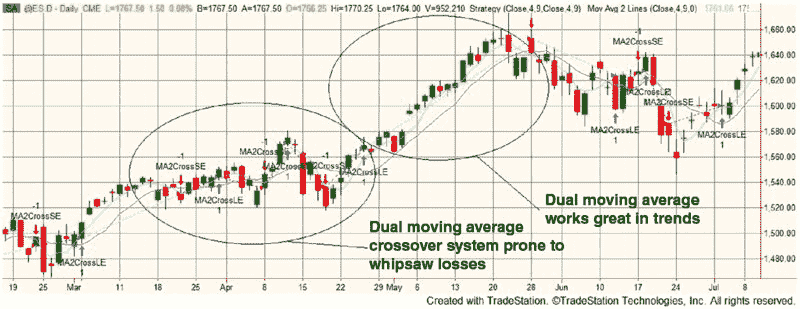

**图 1.4** 趋势中表现优秀的移动平均在交易区间失效

早期的市场技术先锋通过采用两个甚至三个移动平均线来纠正这一点。通过使用更多的移动平均线，目的是过滤掉一些交易区间的震荡交易，留下长期盈利的趋势交易。

在我对期货图表模式的失败尝试后，三重移动平均的明显出色和简单性让我印象深刻。查看图表时，轻易就能看到盈利交易，而不盈利的震荡交易则很难被察觉（见 图 1.5）。在震荡期，移动平均线非常接近，看到线的交叉极为困难。显然，我在头肩形态的经验中学到的东西并不多，图表上看到的东西欺骗了我。

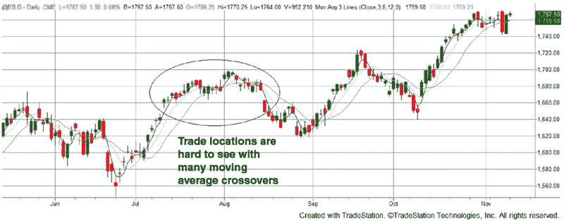

**图 1.5** 三重移动平均交叉可能具有欺骗性

我很快就成为了移动平均概念的信徒，经过几次快速的成功测试（那时我并不理解为什么需要在数百次交易中进行测试，所以 10 或 20 次手动计算的交易对我来说已经足够！），我决定为我的第一个账户提供资金。尽管我最近在南加州买了一套昂贵的公寓，耗费了我大部分的积蓄，但我还是凑出了$5,000 来开一个账户。当然，我非常紧张。这是我的积蓄，完全依赖于移动平均线。从事后看来，这种疯狂显而易见，但那时我只看到利润。

我决定我的三重移动平均系统非常适合活猪（当时合约就是这样称呼的）。我不记得这是测试的结果，还是因为活猪的保证金要求相对较小。我怀疑是后者。我也喜欢活猪的低波动性，尤其是与大豆和猪腹肉等其他农产品相比。

我每天早晨在上班之前，都会带上我可靠的计算器、日报和一张有五列的纸，记录日期、收盘价，并计算 4 日、9 日和 13 日的移动平均线。然后，一到公司，我就会打电话给我的经纪人并进行必要的交易。

第一个交易系统的前几天和几周进行得相当顺利。我亏损的金额超过了盈利，我亲身体验了滑点、经纪人的错误以及打电话下单的低效。但我在生存，这让我认为是最重要的事情。

然后灾难降临。我持有活猪的多头头寸，有一天早晨，我盈利$400。我感觉非常好——这是我致富的机会！午餐时，我花了半个小时试图说服我的超保守、规避风险的工程同事戴夫，认为对技术型思维的人来说，投机商品是很简单的。只需做几次计算，一些简单的数学（不需要微积分），然后哗！钱就会在我的账户中增加。他并不相信，我开始想知道原因。

午餐后，我才明白原因。我在午餐后立刻查看了活猪价格。我的盈利从$400 变成了亏损$800。一个小时左右的时间里，损失了$1,200。我的账户在一瞬间蒸发了 25%。我感到麻木。而且由于我的系统还没有给出平仓信号，我依然持有这个头寸。

几天后，在经历了几次快速的亏损后，我总计了损失：$1,500——占我账户的 30%。我从未想过会出现这样的结果。恐慌开始蔓延。我暂时停止了交易。谢天谢地，我没有冲动地想要加倍或三倍下注来报复我的亏损（这种误入歧途的行为在我的交易旅程中后续会出现）。

我利用周末进行调整，想清楚接下来的步骤。显然，我错误地认为，在做了几笔交易后，很明显我的三重移动平均系统不好。如果那个系统糟糕，我那受到亏损困扰的头脑推理说，那么相反的系统肯定是答案，对吧？有点像《宋飞正传》中乔治·卡斯坦扎开始做与他过去完全相反的事情后成功的那一集。

对我来说，这是一个*顿悟*的时刻——如果我的第一个系统这么糟糕，那么相反的系统肯定也一样好！而且，我甚至不需要测试或评估这个计划。我所要做的就是在我的初始账户余额上再加 1500 美元，而不是减去它（出于某种原因，佣金和滑点损失在我扭曲的推理中变成了赚钱的理由，但那是另一个故事）。星期天晚上我上床睡觉，脑海中想着我用反向交易系统赚了 1500 美元，而实际上我用原始系统亏损了 1500 美元。我感到兴奋和快乐。星期一早上，我准备全力以赴地投入交易。

几周后，猪肉期货终于迎来了一个良好的趋势。这个趋势被一个三重移动平均系统完美捕捉到。如果我当时使用的是原始方法就好了！当然，对于“相反”的方法来说，大趋势是个致命打击，而市场正是提供了一个巨大的亏损交易。经过那次亏损交易后，我的账户余额下降了 3000 美元，相当于 60%的账户损失，这都是由于三重移动平均和反向三重移动平均系统造成的。我受够了。我举起白旗，暂时放弃，决定我需要更多的教育。

# 第二章

够了就是够了

在我继续讲述交易期货亏钱的故事之前，你可能会问自己：“这个家伙为什么这么难？我每天都能看到期货和外汇交易的广告，似乎任何一个半傻子都能轻松赚钱。这个凯文家伙怎么会这么失败？”好问题，但让我换个角度问：“假设交易真的那么简单——你可以每天花五分钟在电脑上输入订单，同时在加勒比海的白沙滩上放松——那为什么卖给你这个神奇系统的人要花 99 美元做这些事情？他为什么不花时间几乎把自己的秘密分享出去，而不是自己交易那越来越多的钱？”

这个答案应该不会让你感到惊讶：交易是艰难的，即使是所谓的高手，他们大多数在任何意义上都不是高手。我估计，市场上出售的交易系统中超过 90%都是垃圾（我这里算是宽容了——实际数字可能接近 99%），这些系统是由一些发现向新手交易者销售要比实际交易简单得多、利润丰厚得多的人所推广的。你听到的关于 80%或 90%的交易者亏损的统计数据并不是谎言，原因是交易确实非常非常困难。我希望通过阅读我的交易历程，以及后来了解我的交易过程，你能感受到这其中的挑战。同时，你会意识到交易成功是可能的，但没有任何捷径。

##  研究

在我快速且惨痛的期货交易初试之后，账户价值损失了 60%，我害怕再进行交易。我也意识到我还有很多不知道的东西，如果我想在交易“战争”中取得成功，我需要的不仅仅是一个简单的移动平均交叉。所以我潜心研究了几乎所有能找到的交易书籍。我阅读了经典作品，如《股票操盘手的回忆》（George H. Doran Company, 1923）和《市场巫师》（New York Institute of Finance, 1989），还有一些可能从未进行过交易的新书。但无论是哪本书，我都保持开放的心态，尽量吸收所有内容。在阅读了至少十几本书后，我非常困惑。这是我学到的一些东西：

+   止损是必须的。止损只是给亏损的交易者的。

+   进场是唯一重要的。出场是唯一重要的。

+   激进的资金管理是致富的关键。激进的资金管理会导致账户失败。

+   趋势跟随是交易的最佳方式。趋势跟随已经死了。

我可以继续说下去，但你明白我的意思。一本书中宣扬的每个交易“原则”，另一书籍都会声称正好相反。哪一个是对的？哪一个是错的？我的头脑感到眩晕。但我继续阅读，收集更多信息。最终，我得出结论：所有书籍都是对的，所有书籍都是错的。例如，对于某些交易风格，止损是个好主意。但对于其他方法，止损只会阻止你赚钱。这个概念让我豁然开朗：没有一种正确的交易方式。重要的是正确评估我想要的交易方式，无论那意味着什么。

在这个“恍然大悟”的时刻之后，我去购买了一个每日期货价格的数据库，并为自己找了一些编程软件。在 1990 年代早期，我决定不使用昂贵的交易软件（当时交易软件不太普及，且相对昂贵），而是自己创建一个回测软件，使用 Microsoft Excel 和 Visual Basic。我就不细说了，但可以说，我在开发出看起来很不错的交易系统时毫无困难。忽略佣金和滑点时，创建漂亮的收益曲线显得相当简单。当你的系统有 10 个变量并且运行 100 万次不同变量组合时，这也是很容易做到的。这都是典型的新手错误，而我一次又一次地犯着同样的错误。唯一拯救我的就是结果如此之好，利润高得令人难以置信，连我自己都不敢相信。我以为这是数据有问题或者我的软件有故障，但这并不是根本原因。主要问题是我测试的方法不正确。

因为我觉得自己制作的系统“好得令人难以置信”，所以我幸运地没有把任何钱投入到这些“圣杯”系统的实时交易中。谢天谢地我没有。相反，我决定放弃测试，朝另一个方向前进。这一切都是因为一本书告诉我，交易中我不会亏损。这真是天真到了极点！

##  你不会失去——或者你会吗？

那本暂时让我离开系统化测试交易系统的书是*你不会在商品交易中亏损*（R. F. Wiest，1988），作者是罗伯特·维斯特。当我在 1990 年代早期阅读这本书时，它已经出版超过五年，我记得它在当地书店显眼地展示着。我认为这意味着它一定是一个合法的赚钱书籍，能在五年后仍然存在。这本书主要讲的是规模交易。概念是找到一种接近多年低点的商品，寻找其在不久的将来会上涨的基本理由，然后分批买入，略微获利后再卖出。举个例子：假设小麦目前的价格为 300 美分，正处于 10 年来的低点。你还听到预测下一个小麦作物由于恶劣天气将大幅减产。你的分析表明，在接下来的六个月内，小麦可能会上涨。因此，你以 300 美分的价格买入小麦，希望在 305 美分时卖出（每份合约获利 250 美元）。如果价格跌至 290 美分，你再买入第二份合约，期望在 295 美分时卖出。你每跌 10 美分就增加持仓，利润目标是比相应的买入价高 5 美分。理想情况下，价格会稍微下跌，让你买入三份或更多的合约，然后在价格升至 305 时，获利退出每份合约。然后，如果价格再次下跌，你只需重复这个过程，逐步买入和卖出。

作者声称使用这种方法的胜率高达 90%到 95%，这完全是有可能的。但胜率实际上是没有意义的。重要的是账户的回报率和回撤。当操作得当时，规模交易的回报率相对较低（10%到 20%），但回撤相对较高（20%或更多）。这是因为你需要大量资金在下跌过程中不断买入。如果资金不足，你将无法继续买入，从而无法在价格的有利波动中获利。最终，如果情况变得足够严重，你将面临追加保证金的风险，规模交易可能会突然结束。

尽管这种方法存在缺陷，规模交易对我这个缺乏经验的交易者来说非常吸引。我只需找到接近多年低点的商品，并设置规模进行交易。我知道仅仅 10%到 20%的回报率不会让我满意，因此我必须做出一些调整，主要是以远低于推荐的账户规模进行交易。这在我第一次尝试时效果很好。我以约 90%的年回报率结束了这一年，全部来自规模交易。

人们常说，在任何领域的早期成功最终会导致灾难，这正是我在规模交易中经历的。在第一年获得 90%的年回报后，我以为我已经掌握了这种交易。损失会很小且不频繁，但随着我不断兑现规模交易的赢家，收银机会一直响个不停。当然，市场狠狠地给了我教训，让我意识到这种想法是错误的。我甚至不记得哪个商品带来了痛苦——可能是小麦、玉米、棉花或咖啡——但我第二年的一个规模交易出现了严重的问题。我损失了第一年的所有利润，以及账户中剩下的大部分。对我来说，书名*你无法在商品交易中失败*应该改为“当你忽视简单的指引时，你可能在商品交易中损失惨重！”不必说，我已经放弃了规模交易。

##  平均成本法——增加亏损

尽管我放弃了规模交易的方法，但我对在价格不利时增加持仓的想法产生了兴趣。当这种情况发生时（经常会发生），我可以以更低的价格买入更多！然后，当我的市场分析最终被证明是正确时，我会获得更多的利润。我已经通过定期投资在共同基金中做过同样的事情；当价格下跌时，我会买入更多的股份，从而以更好的价格获取资产。

整个方法听起来太好了，当然这是真的。增加亏损头寸在共同基金中有效，因为（1）随着时间推移，共同基金几乎总是会最终上涨，以及（2）共同基金没有杠杆。像小麦这样的期货（我个人喜欢的增加亏损策略）价格并不一定在 5 年或 10 年的时间内上涨。价格可能会长期低迷，导致你面临一堆未平仓的亏损交易。此外，每购买一份小麦合约，你都需要额外的保证金，最终即使是小幅价格波动也会在你的资产中造成巨大的影响。这正是我所经历的。

那是 1998 年。出于某种疯狂的原因，我坚信小麦会涨。在 1998 年中，小麦价格处于五年低点（见图 2.1）。

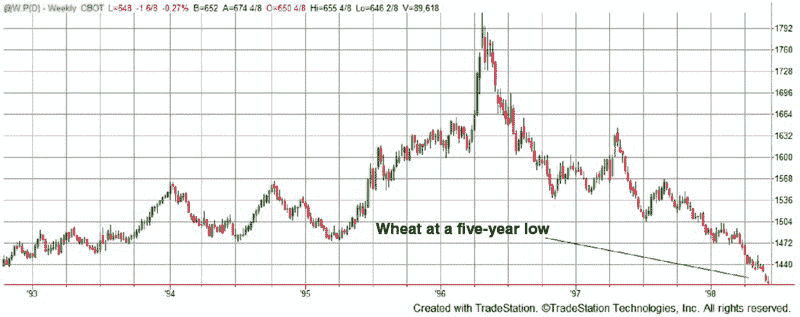

**图 2.1** 在 1998 年，小麦价格处于五年低点

基于这一事实，加上一些粗略的基本面分析，我决定小麦价格将回升至 1996 年中期的高点。所以我买了小麦。价格下跌了。我又买了更多小麦。价格又下跌了一些。从 5 月到 9 月，每次我买了另一个合约，我的损失就更大。

如果小麦价格持续下跌，我知道不久就会收到追加保证金的通知。心理上，我无法接受这一点，所以我每周午餐时会跑一两次银行，把$1,000 到$5,000 转入我的交易账户。以某种方式，我觉得这样比收到可怕的保证金通知要好。我这样做了很多次——跳过午餐，赶去银行，又急匆匆回到工作岗位——以至于我在银行有了自己的专属转账女士。她的名字叫 Cookie，在这些多次转账中，我了解到很多关于她的家庭、孙子孙女和她的生活的事。我甚至给她的小孙子孙女送了一些小礼物和玩具。此时，应该响起的警报声却静默无声——我觉得不断给一个濒临破产的交易账户转钱竟然是个好主意，这不是很奇怪吗？

幸运的是，从 1998 年 9 月初开始，小麦价格开始反弹。不再转账了！事实上，到 10 月中旬，我快要接近保本了。我开始在价格上涨的过程中购买更多合约，进一步加大杠杆。不过，我相信低点已经过去，如果真是这样，我不应该买入吗？总的来说，我现在的交易亏损约$20,000，这在我的账户规模中是巨大的。但价格在上涨，我看到了胜利的希望。然后，1998 年 10 月 13 日来了（见图 2.2）。

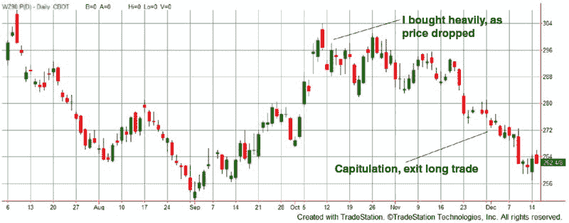

**图 2.2** 我最后一次在小麦中加仓的尝试

我记得 1998 年 10 月 13 日，有好有坏的原因。我在西雅图出差，市场关闭后，我看到小麦上涨了 6 点！再加上，我家乡的棒球队克利夫兰印第安人正在美国联盟冠军系列赛中对阵可怕的纽约扬基队。我在酒店房间观看第六场比赛，在第五局时，印第安人的吉姆·托米打出了一个满贯。我心想，事情有转机了。我的印第安人会赢，小麦也在上涨。不知为何，我的脑海将小麦和印第安人的命运联系在了一起。

当然，你可以猜到这个故事是如何结束的。下一局，扬基队得了三分，印第安人输掉了比赛，因此被淘汰出季后赛。小麦的价格也慢慢而稳地下跌，随着我在前一波上涨中购买的额外合约，即便是小幅修正也是致命的。到 12 月初，仅这笔交易我就损失了约 70,000 美元，而且我已没有资金可以转入我的账户。库基必须向其他人索要玩具给她的孙子孙女，因为我不再进行交易。至少一年或两年内都不再交易。

##  野人出现

在我的平均成本法惨败之后，我花了接下来的几年只进行小规模交易，专注于重建我的交易资金。当我有足够的闲置资本时，我转向我称之为“野人”方法。采用这种方法，我无需在用真金白银交易前测试或评估任何想法。如果我有个绝妙的主意，认为咖啡应该下跌，我就会卖出；如果石油输出国组织讨论更严格的配额，我就会买入原油。我的方法没有真实的逻辑依据，只是根据我听到的谣言或浮现在脑海中的想法进行疯狂交易。我努力保持小损失和大收益，但不知为何反其道而行之在心理上要容易得多。此外，我仍然采用一些早期交易的技巧，比如加仓亏损。我敢肯定我的经纪人喜欢我，但我的账户权益并不喜欢。这种无序的方法使我的账户趋于平稳，但过了一段时间我知道这种方式没有未来。然而，我仍然沿用这种方法，直到我之前提到的那笔灾难性的疯牛交易。那笔交易和所有相关的情境都是对我的冷酷一击。我迫切需要以不同的方式进行交易。

##  评估时间

2004 年开始时，我仍在舔着活牛/疯牛危机的伤口。我对自己的交易进行了深入而艰难的反思，发现我不喜欢自己看到的结果：

+   移动平均交叉系统——亏损。

+   反向移动平均交叉系统——亏损。

+   测试了数千个系统——结果好得令人难以置信，从未交易。

+   规模交易——亏损。

+   平均成本法——亏损。

+   野人方法——亏损。

几乎无论我做什么，我都在亏损。令人困惑的是，很多方法在一段时间内有效，让我在不可避免的下跌之前获得了一些不理性的信心。这种额外的信心实际上让随之而来的崩溃在情感上和经济上都变得更加艰难。

然而，当我查看自己的历史时，我看到了一个亮点：我确实成功开发了机械交易算法，但并未进行实际交易。问题在于，我不知道这是否是因为我确实拥有良好的系统，还是良好结果是由于测试过程中的缺陷（数据不良、过度优化、编程错误等）。我在 2004 年初决定，这是我成为持续盈利的机会——我必须开发和测试机械算法。

2004 年上半年的大部分时间都是在整理事务——调查交易思路，查看软件选项，确定如何手动进行逐步测试。对于我的策略，我决定采用简单的 X 日收盘突破；也就是说，如果今天的收盘是过去 X 根 K 线中最高的收盘价，那么就在下一根 K 线开盘时买入。对于短线入场，则正好相反。对于退出，我采用了基于平均真实波幅的简单止损，一个固定金额的止损，随着利润累积的移动止损，以及仅在出现较大未实现利润时应用的紧缩止损。这是一个相当简单的系统，但我最初的结果显示它运行良好。这个策略的入场和退出并没有什么惊天动地之处——我相信很多人之前也曾采用过这种方法。这只是一个简单的趋势跟随方法，只要出现了一些持续的趋势，整体系统就会盈利。

尽管到目前为止我一直使用自己开发的回测软件，但我决定并不完全信任这些结果。我获得了一份 TradeStation 软件的拷贝，当时它可能是最好的和最受欢迎的（许多人说它现在仍然是最好的，我也仍然将其作为我的主要工具，但今天市场上还有很多其他优秀的回测程序）。除了让测试更容易外，我对结果的信任也大大增加。唯一的问题是我想利用逐步测试（稍后会详细讨论），而当时 TradeStation 并不支持该功能。因此，我只能在 TradeStation 上进行优化，然后计算结果并手动执行逐步分析。这是一项繁琐的工作，但同时让我对逐步测试的实际运作有了扎实的理解（我建议你第一次逐步测试时手动进行，以提高理解）。

到 2004 年最后一个季度，我有了一个我觉得准备好的交易系统。我试探性地进行了几笔交易，发现结果与回测结果相当吻合。我的新系统将在 2005 年开始全规模交易。2004 年结束时，经过十多年的痛苦尝试，最终在大多数方法上失败，我终于看到了象征性的隧道尽头的光明。幸运的是，那不是一列朝我驶来的火车！我有了一个经过测试的、用真钱有效的方法，我想从山顶大喊：“我是个好交易员！”由于我住在俄亥俄州，那里山脉稀少，我做了下一个最好的选择：我参加了一个公开的全球交易比赛。实际上，我在 2004 年就参加了比赛，但当时我使用的是一个伪机械、主要依赖裁量的系统，起初表现不错，但最终崩溃了。但这一次，我将装备一个好的机械方法，希望不会让自己丢脸。怀着这个决定，我的交易冒险继续进行。

# 第三章

期货交易世界杯冠军^®胜利

基于我在 2004 年完成的工作，我认为我有一个可行的交易策略。当然，我想将我的“成功”与世界分享，但又不想透露我的策略。因此，我做了下一个最好的选择：我参加了一个公开交易比赛。

对于那些从未听说过的人，期货交易世界杯冠军由 Robbins 交易公司赞助，是全球首屈一指的真实资金、为期一年的期货交易比赛。它吸引了来自世界各地的一些最佳和最聪明的交易员，彼此较量，策略相互对抗。这是一个高压的比赛，结果不断更新供所有人查看（在旧时，结果每月在交易杂志上发布；现在它们每天在世界杯网站上更新：[www.worldcupchampionships.com](http://www.worldcupchampionships.com)）。在 1987 年，传奇交易员拉里·威廉姆斯将 10,000 美元变成了超过 110 万美元。这让你对参赛交易员的水准有个了解。

一旦我决定参加交易比赛，就必须确保我的系统足够好。通过查看过去获胜者的表现，我得出结论，只要我的年回报率达到 100%或更高，我就有合理的机会进入前三名。这实际上是我的目标；并不是赢得比赛，因为我意识到在高水平的表现中，运气会起到一定作用。我不能指望靠运气赢得比赛；我能做的就是让自己尽量接近顶端。为了在一年内实现 100%的回报，我知道我必须接受非常大的最大回撤。我决定允许大约 75%的最大回撤，这对于任何普通交易者的账户来说都是荒谬的。但正如我稍后将详细讨论的，你的目标和期望应基于当前的情况。对于一个唯一成功标准是账户回报的交易比赛，允许较大的回撤是合理的。然而，如果比赛是基于回报和风险（例如，获胜者拥有最高的 Calmar 比率），我将以完全不同的方式参与比赛。这将在稍后详细讨论，但现在要明白，我在一开始设定的目标和目的决定了交易开发过程中的每一步。

如前所述，我在 2004 年开发了一个不错的交易策略。实际上，这个策略在 2004 年的比赛中足以获得第二或第三名，但当然，那时我还没有准备好参加。然而，我在 2005 年为以下系统做好了准备：

入场

+   在 48 根 K 线高位收盘后买入下一根 K 线（对于做空则相反），只要 30 日 RSI 大于 50（做空交易时小于 50）。

出口

+   根据以下计算止损：

    +   固定美元价值（$1,000）

    +   Y * 入场的平均真实波幅

    +   Z * 入场的平均真实波幅（盈利目标）

其他规则（基于我的心理，我觉得我需要这些）

+   如果上一次交易亏损，请等待 5 根 K 线再进行下一次交易（这可以最小化频繁交易）。

+   如果上一次交易获利，请等待 20 根 K 线再进行下一次交易（在获胜后要耐心）。

该系统利用每日 K 线作为所有交易信号，这对像我这样有全职工作的人来说非常完美。每晚，我可以简单地查看我的图表，为第二天下单，然后不必担心日内的波动。这是理想的设置，因为我在白天检查持仓的时间有限。

我选择了九个期货市场进行交易：

+   玉米

+   棉花

+   铜

+   黄金

+   糖

+   5 年或 10 年期国债

+   咖啡

+   日元

+   日经指数

我选择这些工具是基于它们过去的表现、相对较低的保证金要求以及它们之间的普遍缺乏相关性。然而，回顾这点，我意识到我犯了两个相当大的新手错误。首先，当我测试我的系统时，我测试了 20 到 25 种不同的工具。然后，在看到实际表现后，我简单地选择了表现最好的那些。换句话说，我是根据市场进行了优化！这是在良好的策略开发中绝对不能犯的错误。至于我的第二个错误，我在选择投资组合时没有进行任何详细的相关性研究。相反，我只是根据自己的猜测判断相关性应该是什么（“玉米和日经指数可能没有相关性，所以我可以同时交易这两者。”）。当时，这似乎是合理的，但我从那时起的经验告诉我，相关性有时与常识所指的不同，应该在投资组合中始终进行检查。即便如此，重要的是要意识到，即使是没有相关性的工具在市场恐慌期间也可能会变得相关。幸好，尽管我在开发过程中犯了新手错误，我的交易方法仍然取得了成功。

由于我的资本有限（每年我开始时的账户只有$15,000），我只能交易每种工具一个合约。偶尔，如果我没有足够的可用保证金，我不得不跳过一些信号。无论何时，我都尽量以“满负荷”的方式交易，尽可能利用我的购买力，同时避免追加保证金的要求。我的计划是在可用资本的限制内，尽量抓住每一个信号，并尽量遵循系统。

这是我在 2005 年至 2007 年每年的表现和一些想法。

##  2005

我的 2005 年权益图如图 3.1 所示。在 2005 年的第一个月结束后，我的情况略有下滑。怎么回事？我本想凭借这个策略征服交易世界，却在亏损？似乎这总是发生在我身上——一开始交易策略时，就开始亏钱。我感到精神崩溃。我只亏了 4 到 5 个百分比，但年初有个好的开端总是令人愉快的。幸好，到四月中旬，情况开始好转。到那时，我的年收益已超过 30%，这将转化为 120%的年回报。我如火如荼！一切都按计划进行。

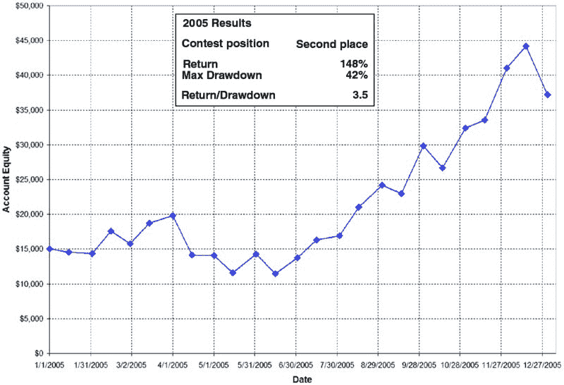

**图 3.1** 我的权益图，2005 世界杯比赛账户

当然，就像任何好莱坞电影一样，故事必须有一个黑暗时期。对我来说，那是从四月中旬到八月中旬的四个月回撤。这不仅持续了很长时间，而且幅度也很大——超过 40%的回撤。在最低点时，我几乎放弃了赢得比赛甚至接近获胜的希望。但我坚持了自己的计划。我尽量按系统交易，但因为保证金问题不得不跳过几个交易。那个夏天对我的比赛账户来说绝对是“糟糕的一天”。

事情在六月中旬开始好转，尽管需要几个月才能达到新的权益高点，但到 12 月中旬，我的账户几乎翻了三倍。2005 年 9 月的日元和铜的几个良好趋势，以及 11 月的咖啡趋势，确实帮助账户腾飞。这就是趋势交易的真正运作方式——你可以经历几个月的平淡甚至下跌表现，但抓住几个趋势可以改变整年的结果。当然，问题在于，如果你错过了趋势交易——假设因为多次虚假突破的损失而在趋势显现之前放弃，或者账户里没有足够的钱去执行每个交易信号——你的表现将会很糟糕。因此，趋势交易并不适合每个人，因为跟随它在心理上可能非常困难。

当我在 2005 年 12 月中旬达到最高权益时，我知道自己在比赛中处于良好状态，可能能拿到第二或第三名。第一名根本不可能，因为比赛的领先者埃德·特瓦尔杜斯全年上涨超过 250%。在信心高涨的情况下，我确实在年底时违反了我的系统，在咖啡的亏损头寸上加仓。当时，我的目标是 200%的回报，显然旧习难改，因为我再次尝试了摊平（我到底能学到什么？）。所以在 12 月的最后两周，我损失了部分权益。再次吸取教训：不要对亏损头寸加仓！

##  2006

在我 2005 年取得成功后，我意识到自己有一个不错的策略，如果我能正确地、不带情绪地进行交易，2006 年可能会表现不错。当然，公开交易比赛的问题在于，有时候你一个月在前三名之内，下一月却跌出前三。更糟糕的是，当你发现自己恰好在领先交易者身后时，这会让人很想冒险去追赶。我在 2004 年就尝试过这种冒险，试图追赶最终获胜者库尔特·坂井。顺便说一下，我根本没有机会：库尔特全年上涨了 929%，表现非常出色。然而，他对自己的表现始终保持谦逊（这是一个伟大的交易者特质）。

2006 年交易开始时，我充满希望，有一个可靠的计划，头脑清晰。我的 2006 年表现如图 3.2 所示。与 2005 年不同，2006 年首月对我来说非常好。我上涨了约 30%，对自己的机会感到很不错。当然，每当我对交易感到不错时，回调就在眼前。二月和三月就发生了这种情况，把我拉回了盈亏平衡。几笔日元和 10 年期国债的亏损交易让我回到了现实。

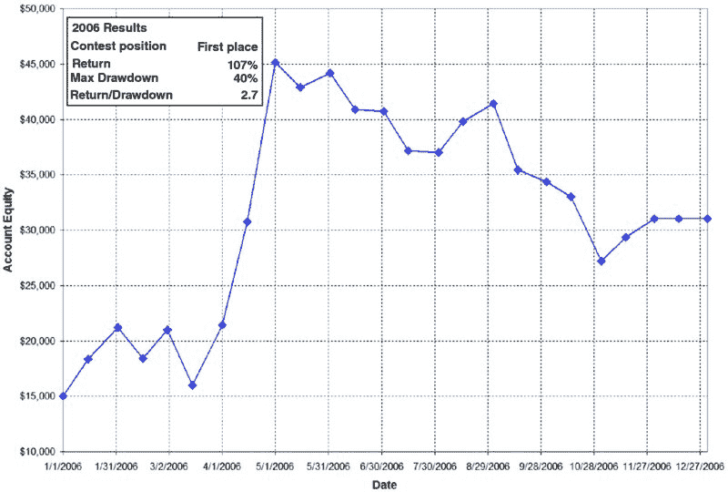

**图 3.2** 我的第一名股权图，2006 年世界杯竞赛账户

但在这次回调中，二月中旬，我进入了改变一切的交易：我做多铜，如图 3.3 所示。我从 2006 年 2 月 17 日到 5 月 1 日持有这笔交易（实际上是两笔独立交易，考虑到展期），产生了每份合约净利润 28,875 美元。这是那种千载难逢的交易，市场突然起飞，而我则紧紧把握着。到 5 月 1 日，我的账户价值为 45,122 美元，这意味着一笔铜交易贡献了我全年利润的 95%以上。

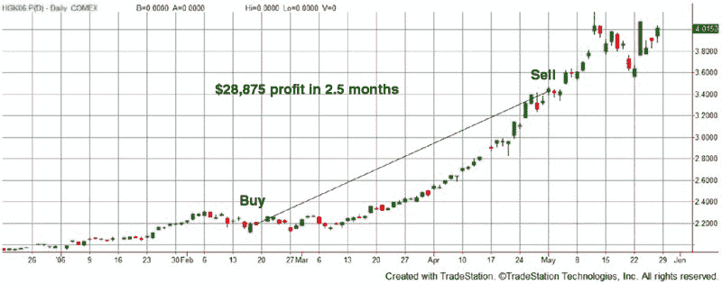

**图 3.3** 铜价飙升，我在做多

在 2006 年 5 月初，比赛中已经上涨 200%让我感到欣快。然而，我不知道这就是我这一年的巅峰，接下来的日子将是缓慢的下滑。在 2006 年的其余时间里，我仍然按计划进行交易，并且每笔交易只做一份合约。我本该交易更大规模，因为我的账户已经翻了三倍，但我有一部分心里害怕会把利润回吐。这证明是个好决定，因为接下来七个月的大部分时间都是净亏损。

在比赛快结束时，我还要面对迈克尔·库克，一个值得尊敬的第二名对手。虽然我知道只需专注于自己的表现，不必担心其他交易者的指导方针，但我听说他是一位出色的交易者，因此我害怕落后于他，甚至在 12 月初就关闭了我的交易。这部分是有原因的（看看过去六个月的糟糕表现），但部分原因是我觉得我让迈克尔赢，而不是我输给他。

我停止在十二月份交易以保住最终胜利的讽刺在于，几年后我对比赛的记忆并非如此。在我心中，我全年都遵循系统，并按计划交易直到最后一天。我确信在公开的网络研讨会和写作中，我也说过同样的话——我从未停止交易，只为保持第一名。然而，这正是我所做的！这让我现在感到困扰。不，是我停止交易让我困扰，而是我记忆中的现实有所不同。当这种情况发生在交易中时，通常是个坏事。一个好的交易者会如实记住事情的发生，而不是美好却错误地回忆。

即使在最后的六个月出现亏损，我仍然能够在比赛中获得第一名。我感到得到了验证——这些年的努力终于得到了回报。现在的问题是：我能在 2007 年重复这样的表现吗？

##  2007

在 2005 年获得第二名和 2006 年获得第一名之后，我不知为何觉得自己已经突破，现在交易对我来说会变得更容易。当然，我学到的教训是，交易从来都不是轻松的，总是充满了斗争。确实是愉快的斗争，但依然是斗争。随着 2007 年的开始，我怀着满腔希望参加比赛。此外，我决定交易两个比赛账户（一个崩溃了），并尝试对我的核心策略做一些小修改。毕竟，我对 2006 年最后六个月的经历仍然有些心慌，想知道我的原始系统会遭受多长时间的折磨。

不幸的是，就像 2005 年一样，我一开始就走错了方向。我的 2007 年表现见于图 3.4。几乎每种工具的亏损交易困扰着我的努力，到三月底时我面临 50%的回撤。到五月中旬，由于橙汁和瘦猪肉（我作为修改的一部分添加的市场）的一些良好交易，我恢复到盈亏平衡，接下来几个月我都保持在这个水平。

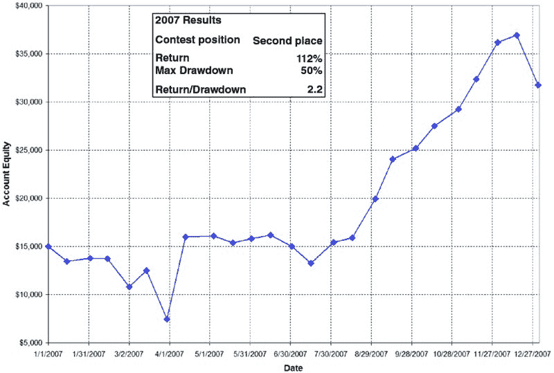

**图 3.4** 我的权益图表，2007 年世界杯比赛账户

在 2007 年夏末和秋季，瑞士法郎和 30 年期国债出现了良好的趋势，我按照我系统的规则进行交易。到年底，我的收益再次超过 100%，这足够让我获得第二名。迈克尔·库克，这位我在 2006 年最后阶段一直关注的交易者，在 2007 年超越了我，年底时的收益高达 250%。

##  关于比赛的反思

在期货交易锦标赛中连续三年获得前两名，每次都超过 100%的回报率后，我对自己的交易感到非常满意。对我来说，这并不证明我是一个优秀的交易者，而是让我更加意识到设定目标和目的的重要性。由于我开发了自己的交易系统，使我有机会赢得比赛，我现在意识到，如果没有事先确立的目标和目的，这场比赛就只能被视为赌博。正如你在书中稍后会看到的，目标和目的在我的工作中是关键部分。

在 2005 年获得第二名后，我想让我的非正式导师，市场奇才范·萨普博士，知道我的成功。我与范有一种联系，因为我参加过他的许多自学课程，并且读过他大部分的书。他是我曾经拥有的最接近导师的人。我为自己感到骄傲，也想感谢他。他当然为我的成功感到自豪，但他也说了这句话：

“虽然凯文已经交易和学习了 15 年，但大多数在交易比赛中获胜的人都在做一些非常危险的头寸管理。所以注意你的反应。你是否对赢得比赛的人感到印象深刻？还是你的直觉反应是学习如何在任何市场中有效交易——并且只要继续参与就好！”

我花了很长时间才明白范所说的这句话，起初我的反应是愤怒（“怎么可能有人对我的成功不感到印象深刻？”）。但最终，我意识到范的话中蕴含的智慧。令人印象深刻的并不是赢得比赛——运气、鲁莽和许多其他因素都可能影响最终结果。令人印象深刻的是有效地进行比赛交易。对我而言，这意味着遵循我的系统，这个系统专门设计用于平均每年约 100%的回报率。所以不要被表现本身所打动。我当然不会。我所钦佩的是我在设定目标、追求目标并实现目标方面的纪律。对我来说，这才是真正的成功。

# 第四章

跃迁——转向全职交易

每个兼职零售交易者的梦想——一个热爱交易所有方面的人——都是全职交易，靠交易为生。至少这一直是我的目标，过上梦想的生活。交易者加里·史密斯写了一本书，标题正是这个：《通过有利可图的日间交易股票期货来实现梦想》（高级交易研讨会，1995 年）。当然，梦想是每天用你惊人的策略在市场上获得胜利，从市场中提取你所需的资金（想要一辆新车？简单——只需把你下次交易的规模加倍！），花费充足的空闲时间陪孩子玩或者做志愿者，或者进行典型的刻板印象行为：在海滩上悠闲地躺着，手中拿着玛格丽塔，身边走过的是穿着比基尼的女人（或者如果你喜欢的话，是壮汉），在你自己的私人岛屿上。

问题在于，梦想很少，甚至从不，成为现实。事实是，全职交易，正如我告诉许多人，依我看“是最艰难的轻松赚钱方式。”但这并不意味着不可能做到；这只是意味着非常困难。任何值得追求的伟大事物总是艰难的，对吗？

在大约 15 年的兼职交易和许多不成功的交易之后，我有了连续 3 年的比赛获胜表现。2007 年结束时，我开始认真考虑将交易作为全职职业。毕竟，如果我不能成功，经过我所经历的一切以及所取得的成就，谁能成功呢？所以在 2008 年初，我决定勇敢一跃，全职交易为生。我以为自己已经搞明白了全职交易的所有事情。天哪，我错得离谱！我跳入全职交易时做了一些事情，有些做错了，还有很多事情如果可以重来，我会选择不同的方式。

##  信心

尽管你需要许多东西来成功交易（资本、策略、计算机等），但自信会比大多数其他因素更影响你在全职交易中的长期成功。让我花了很长时间才明白，我的交易成功与失败并不是因为拥有最快的计算机或拥有完美策略，而是对自己交易能力的自信，对策略发展的自信，以及在面对严峻回撤时始终保持乐观的信心，这些都帮助我作为一名交易者生存下去。显然，仅凭自信是无法达到目标的——无论一些交易大师怎么说——但在某个时刻，你需要自信来应对交易风暴。不论是重大回撤、多次失败的策略，还是无法开发新方法，迟早你对自己能力的信心将是度过艰难时刻所必需的。在经历了三年的交易比赛获胜后，我感到自己有信心取得成功。毕竟，每天看着三个交易奖杯（图 4.1）让我觉得自己是无敌的。

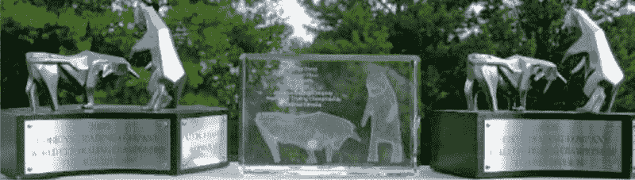

**图 4.1** 我的比赛奖杯

### 我做对了什么

我有足够的信心认为我能在全职交易中成功。

### 我做错了什么

当我开始以交易为生时，我可能自信过头。毕竟，赢得交易比赛很不错，但这是否意味着我真的能全职交易？现在我当然明白这一点。那时，我把比赛的成功等同于全职的成功。这是一种危险的思维方式。

##  资本

我相信你听过那些从$1,000 开始并将其发展成丰厚全职交易职业的故事。我同样相信，对于每一个这样的成功者，可能有 999 个以同样金额起步并失败的人。毕竟，正如我在后面的章节中将展示的，资金不足是通向破产的最简单道路，无论你是否拥有优秀的交易策略。如果你的资金规模小于对手，即使是持平策略也会导致破产。迈克尔和艾伦·卡普兰的优秀书籍*Chances Are … Adventures in Probability*（维京企鹅出版社，2006 年）对此进行了很好的描述：

> 让我们想象一些佛教徒开了一家赌场。不愿意对任何人占不公平的便宜，管理层提供了一种完全公平赔率的游戏：与银行掷硬币，正面赢一美元，反面输一美元。随着时间的推移，会发生什么？这个游戏会永远进行下去，还是有一位玩家最终会将另一位玩家清空？
> 
> 一种可视化的方法是想象赌徒手中只剩下最后一美元的瞬间。你同意他避免破产的机会微乎其微吗？现在增加你想象中他口袋里的金额，同时相应减少银行的资本；你认为在什么情况下赌徒破产的机会与银行相等？是的：当他们的资本相等时。严格计算证实了两个严酷的事实：游戏必然以一方的破产结束，而那一方会是最初资本较小的。即使生活是公平的，也并非如此。你在这个世界上的机会与口袋的深度成正比——赌场凭借其身份获胜。

当然，你可能会抗议：“但我有优势，因此我会长期获胜。”虽然这是真的，但请记住，你的优势可能很小，并且可能不会永远存在。随着时间的推移，它可能会回归到持平，这意味着你的账户规模变得至关重要。你能否比对手更持久？

### 我所做的对的事情

我以一个低六位数的账户开始全职交易，尽管我将其中一部分资金保持在交易账户之外，实际上是“留作备用”。我觉得我的资金状况相对合理。

### 我所做的错事

根据我的启动资金，我必须每年获得 50%到 100%的回报，才能支付生活费用、税款，并略微增加我的交易账户。哇！回想起来，我意识到我真是疯狂，开始时的资金大约比我应该有的少了 10 倍。另一位全职交易的朋友曾告诉我，他认识的每位成功交易员在开始全职交易之前都以 200 万到 300 万美元起步。尽管这个数字听起来很疯狂（六年前我开始全职时会对此嗤之以鼻），但现在我认为这是合理的。毕竟，你希望你的交易账户随着时间的推移而增长，并希望从中提取生活费用，同时还需要应对不可避免的回撤。在资金紧张的情况下，几乎不可能同时实现这三点。

##  生活费用

当我在 2008 年开始全职交易时，我很幸运地储蓄了三到五年的生活费用。这笔储蓄不属于退休金，也不属于我的交易资本。我认为这是全职交易时生活费用的关键问题。交易本身已经足够紧张，而不必担心下顿饭或按揭款从哪里来。你需要感到安全，知道你的费用是有保障的，即使你一开始就遇到回撤（对我来说这似乎总是如此！）。

### 我做对了什么

由于多年的储蓄，以及我在工作中获得的一项丰厚的股权转让协议，我能够轻松覆盖生活费用，甚至在家庭不断增长的情况下也是如此。知道这一点让我能够全心全意地专注于我的交易。

### 我做错了什么

没什么。我认为有三到五年的生活费用储备是个很好的决定。

##  家庭支持

我可能是少数派，但我有（并且仍然有）一位深爱我的配偶，她完全支持我全职交易的梦想。对我们来说，这意味着我放弃了在航空航天行业的高管职位，那里可谓是天高任鸟飞。但她意识到，我的心并不在向无情的公司牺牲我的灵魂上，我注定要追求更好的事物。我的孩子们也支持我的交易，因为他们还小，这实际上是他们见过的唯一的“工作”。他们知道什么时候是玩耍时间，什么时候爸爸需要工作。在他们眼中——对我来说也是——这似乎有很多工作，而玩乐的时间却不够。

### 我做对了什么

我嫁给了合适的人，她完全理解并支持我的交易。现在，经过六年的全职交易，她仍然全心投入我的旅程，我的三个孩子也是。

### 我做错了什么

我几乎完全做对了这一点。我不敢想象如果没有支持我的配偶和家庭，全职交易会有多困难。

##  家庭办公室设置

为了节省开支，我决定在家里的专用办公室进行交易。干扰很多，尤其是现在有三个小孩子在周围跑。有时候我的工作会被一堆蜡笔画埋没，有时候一个过于热情的孩子会不小心在没有保存的情况下关闭电子表格。此外，我的长子甚至在我的开放交易平台上进行了一些迷你标准普尔交易。至少他的交易是赚钱的！总的来说，我不能抱怨，因为对我来说，高峰时段的交通只是需要躲避楼梯上的几个乐高。

### 我做对了什么

我为我的交易业务创建了一个专用办公室。

### 我做错了什么

我可能应该设立更严格的界限，比如不碰爸爸的电脑。但大多数时候，孩子们的干扰并没有问题。

##  交易策略

当我开始全职交易时，我有大约三到五个我觉得可以实时使用的策略。不幸的是，我没有任何额外的策略在等待中，当我第一组策略失去表现优势时可以交易。那时，我天真地认为可以永远交易同样的策略。现在我意识到，有些策略像天空中的星星一样，长时间闪烁。而其他的，更像流星——在它们坠落到地球之前，你需要停止交易它们。

### 我做对了什么

我有多种策略可供交易。即使从一开始，我就知道只依赖某一种特定的方法是个坏主意。

### 我做错了什么

如果我今天开始全职交易，我会确保每个实时策略都有至少一个良好的策略准备替代。此外，我会确保有一长串潜在的策略可以测试和评估。

##  经纪商

就像交易的其他方面（电脑、互联网连接、策略等），确保你有一个备用经纪商至关重要。我并不是说要有备用的交易台电话号码（顺便说一句，你当然应该随时准备好）。我的意思是，在多个经纪商那里拥有多个账户，理想情况下有不同的清算公司。经纪商有时会失败（我曾是 Refco 破产和 PFG Best 腐败老板的受害者），通过拥有多个账户，即使一个经纪商出现问题，你仍然可以交易。由于我交易多种策略，这也使得记账稍微简单一些，因为我经常会将一个策略专门分配给一个特定的账户。

### 我做对了什么

我有多个经纪商，使用多个清算公司。所以我认为在这方面我还算聪明。

### 我做错了什么

在过去的 15 年里，我经历了两次经纪商破产，每次都有明显的警告信号——我错过或忽视了这些警告信号。我以为系统会让我得到补偿，确实在 Refco 的案例中发生了。但我仍在等待 PFG Best 案中大部分的钱。这让我很生气，你可以通过观看我在福克斯商业频道的采访亲自看到这一点（访问[www.foxbusiness.com](http://www.foxbusiness.com)，搜索“davey”，你会看到我的采访）。

##  自由时间

啊，那段有空闲时间的工作日子。那大部分是我在企业世界的生活。但现在，作为全职在家工作的人，我感到随时需要查看市场。交易的想法不断涌入我的脑海，我立刻跑下楼去编程和测试它们。如今，我的大部分清醒时间都在思考或进行交易。我在追求全职交易的生活中变得过于单一。我想我的妻子认为我的交易电脑实际上是我身体的一部分，因为我似乎和它紧密相连。

当然，对于许多离职后开始交易的人来说，情况可能正好相反。所有的自由时间，没有老板和规则，导致许多潜在的交易者过上懒散的生活。有时保持动力并继续开发新的交易策略是很困难的，尤其是当你的交易账户出现亏损时。动力确实可能成为一个问题，尽管这今天可能不会影响表现，但未来可能会影响表现。

### 我做对了什么

我一直足够自律，持续工作，从未停止改进我的交易。

### 我做错了什么

我可能花太多时间在交易上，我敢打赌这些额外的小时中很多并没有一点成效。交易者，和任何其他自我驱动的工作者一样，需要平衡。我需要在这方面努力。

##  冒险一试

一旦我把前面的所有事项都安排到我当时认为可接受的程度，我就准备冒险一试。我在 2008 年 5 月全职投入交易，从那时起我再也没有回头。难吗？绝对不！有趣吗？肯定有！如果有机会我还会再做一次吗？当然，不过第二次我自然会更聪明。这里的主要点是我有一个目标，思考了所有的细节，并最终冒了险。如果我—一个在阅读了一些书籍并开始交易之前没有任何交易知识的人—能做到，我认为大多数人也能做到。如果你的心中有它，就像我一直以来那样，通往交易成功的道路就容易得多。如果你觉得讨论策略的开发令人厌烦，我的建议是：离开—交易可能不适合你。

随着我全职交易多年后回顾自己的交易日，我发现大部分交易活动并不是下单或查看账户报表。相反，我的日常活动主要包括开发策略、寻找创意、思考交易，以及当然，测试和评估潜在策略。书中大部分内容正是围绕这一点展开——我如何评估、设计和测试交易策略。
