# 第二部分

你的交易系统

# 第五章

测试和评估交易系统

如果你打算设计交易系统，了解如何评估交易系统的性能指标至关重要。这并不总是像听起来那么简单。为了让你明白我的意思，看看图 5.1。这个权益曲线是一个期货交易系统的，典型地表现出如果你自己测试策略，或者你可能在互联网上找到的一个系统。这个曲线是使用 TradeStation 软件生成的，但其他流行程序的结果，如 MultiCharts 和 NinjaTrader，基本上是一样的。所有好的交易软件都提供多种重要的（在我看来，许多是不重要的）指标供你审查和检查。大多数时候，权益曲线和性能报告引发的问题比答案还要多。结果是好是坏？结果可信么？结果有任何预测价值吗？最后，如何将好与坏区分开来？我将在本章中回答这些问题和更多内容。

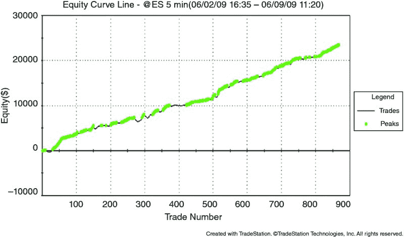

**图 5.1** 交易系统结果——这可信么？

在查看性能报告、权益曲线或交易数据时，首先要意识到并理解的一点是那句老话：“如果听起来好得令人难以置信，那可能真的不可信。”一般来说，交易系统的未来表现几乎从来都没有其历史表现那么好。事实上，一个交易系统在历史测试中表现越好，未来表现如此优秀的可能性就越小。当然，这条规则也有例外，经过一段时间的交易策略开发，这些例外会变得更容易发现。

为什么历史测试结果通常看起来比未来结果更好？部分原因与存活偏差有关，这意味着通常只展示表现良好的历史交易系统。为什么供应商会出售历史表现不佳的系统？为什么你会交易自己创建的糟糕系统？简单的答案是，在这两种情况下，糟糕的结果会被丢弃，只留下剩余的良好结果。

也有可能历史测试结果确实有效，系统开发者在市场中发现了真实的优势。然而，随着时间的推移，这种优势可能会消失，原因可能是其他人发现了它、市场变化或其他各种原因。然后，交易系统会回归均值，这将是一个在扣除佣金和交易成本之前的盈亏平衡策略。

历史测试结果看起来可能比未来结果更好，这与历史测试的方法有关。大多数人错误地测试和评估系统。稍后在书中，你将学习一种正确的测试和评估系统的方法，但现在只需意识到，公认的测试标准是错误的。这种错误的测试导致过于乐观的结果和一定会让最终用户失望的交易系统。当然，经验丰富的交易者知道如何测试系统。问题是：在查看历史结果时，你如何知道该相信什么？

图 5.2 描绘了我所称的性能结果“废话”计量器。它给你提供了一个想法，让你知道如果有人提供交易结果，你可以相信谁。

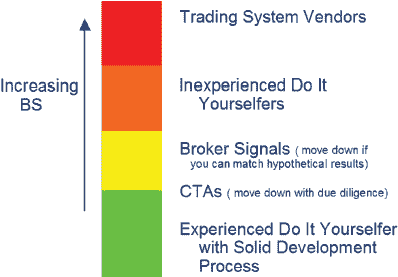

**图 5.2** 交易系统结果的“废话”计量器

在这个等级的最顶部——拥有最多“废话”的群体——是交易系统供应商。我将这个群体放在最上面，尽管我曾是这个群体的一部分（虽然我用自己的钱进行交易，不像这个群体中的大多数人）。一般来说，任何你从想要向你出售信号、黑箱系统、订阅、交易室等的人那里获得的业绩信息都*不*值得信任。一个优秀的通用规则是：不要相信任何这些。

我意识到这种方法很极端，但考虑到供应商出售优秀交易系统的概率，相比于供应商向你出售看起来不错但实际上糟糕的系统，这是合理的建议。通过避免任何向你提供绝佳交易系统的人，你将节省很多钱。任何仅以少量钱提供优秀交易系统的人，都不能通过我的“嗅觉”测试——供应商应该自己进行交易，赚取丰厚的利润，而不是在互联网上低价兜售系统。这就是为什么交易系统供应商位居“废话”榜首的原因。

由于交易系统供应商通常提供毫无价值的垃圾，你可能会倾向于走“自己动手”（DIY）的路线。对于那些 DIY 者，有数十种交易平台可以帮助你分析、测试和优化你想要创建的任何类型的交易系统。从表面上看，这似乎是一个很好的方法，仅依靠自己、自己的想法和交易软件。问题在于，稍后将详细讨论，开发交易系统并不像软件供应商所声称的那么简单。事实上，遵循软件建议的方法的新开发者不可避免地会创建一个过度优化、曲线拟合的交易系统。这种系统会产生很好的回测，但在实时未来中几乎从未表现良好。因此，初学者 DIY 开发者在“废话”等级上排在交易系统供应商之下。

如果从供应商那里购买充满风险，而初学者的 DIY 开发者也没好到哪里去，那么还有什么选择呢？如果你坚信必须让其他人提供交易系统或信号，使用经纪商提供的系统或商品交易顾问（CTA）系统将是一个更好的选择。让我们快速看看他们提供的内容，以及其优缺点。

许多期货经纪商现在提供他们所称的“经纪人协助”或“跟随信号”类型的服务。提供这些服务的两个机构是 Striker Securities ([www.striker.com](http://www.striker.com)) 和 World Cup Advisor ([www.worldcupadvisor.com](http://www.worldcupadvisor.com))。（完全披露：我过去曾经或将来计划通过这两家经纪商提供信号。根据我的个人经验，我认为他们是值得信赖的。）支付月费后，你可以“跟随”信号提供者的交易信号。信号提供者通常会在经纪商那里有一个账户，并会进行实时交易。因此，所显示的结果通常是真实结果，*远远高于*大多数交易系统供应商所展示的“真实”内容。

当然，仅仅因为这些服务提供的结果来自于一个交易账户，并不意味着你会获得相同的结果。即使是真实结果也应被视为假设性结果。事实上，我的一般原则是，除非结果确实发生在你的账户中，否则你*必须*将这些结果视为假设性的。正如你所知，假设性结果给实际结果的变化留出了很多空间，你应对此做好准备。这是经纪服务的一个缺点。

经纪商提供的信号服务的另一个可能缺点是，提供信号的开发者或经纪商本身可能会出现问题。例如，如果开发者采用自由裁量的交易方式，个人危机可能会影响他的交易，而曾经有效的交易方法现在可能变得无效。在经纪商方面，像 2012 年 PFG Best 公司的腐败和破产那样的迅速和突发的欺诈，可能会使你的账户处于风险之中。

如果你选择跟随商品交易顾问（CTA），知道该组织接受监管机构和会计师事务所的审计，并且交易结果通常是准确的，这令人感到安慰。当然，总有一些不道德的坏分子混入其中，他们可能会在许多年内产生出色的结果，然后在欺诈和欺骗的爆炸中被摧毁。伯尼·麦道夫和他的公司虽然不是 CTA，但却是一个值得信赖的投资公司实际上是一个彻底的欺诈的好例子。

如果你不能相信交易系统供应商，而经验不足的 DIY 交易系统开发者也没好到哪里去，经纪商和 CTA 虽然更好但也有风险，那么你该怎么办？在这个 BS 图腾柱上，最低的层级是什么？

我的观点是，经验丰富的 DIY 交易系统开发者最不容易受到虚假信息或其他无效表现报告的影响。我这样说有几个理由。首先，经验丰富的开发者了解自己的交易回测软件，并且知道如何欺骗它。他知道如何避免这些软件的限制，而许多交易系统供应商则积极利用这些限制，制作出虚假的、看似非常优秀的表现报告。

另一原因是，经验丰富的开发者在创建自己系统时掌控整个过程。他可以消除许多潜在问题，例如错误或缺失的市场数据、不正确的前瞻性规则，以及过度优化和曲线拟合。掌控整个过程是一项巨大的责任，但经验丰富的开发者能迅速解决问题，因为最终他对自己的结果负全责。

当然，单靠多年的交易系统开发并不能使人变成专家。关键在于开发系统并实时验证其表现。在几年的过程中，一位优秀的开发者会越来越擅长为交易系统生成历史结果，这些结果在未来的有效性也会越来越高。当然，如果操作得当，一位经验丰富的 DIY 开发者在虚假信息的比例上可以相当低。

此时，一些读者可能会问：“为什么还要测试呢？这只证明过去某些事情有效，和未来表现无关。”这个论点在某种程度上是有一定道理的。确实，“过去的表现并不能预示未来的结果”，这也是为什么美国政府在讨论交易系统表现时要求使用这个免责声明。但是，这是否意味着历史测试*没有*任何有效性呢？我并不这样认为。

这里有一个例子。假设你想建立一个关于太阳升起的模型。一个月的时间里，你每天黎明前起床，等待太阳出现。每天，太阳都是从东方升起的。那么，你构建了模型，运行明天的预测，它“预测”太阳将从东方升起。那会是真的吗？谁能确定呢？某种奇怪的轴切换或地球自转反转可能会在夜间发生，太阳可能会从北方、南方或西方升起。这种可能性非常小，没错，但 2010 年的闪电崩盘和 2008 年的金融危机也同样出人意料。极端和意外事件确实可能发生。

如果这样的灾难发生，这是否意味着模型毫无用处，永远不应该被构建？不，但你必须考虑到你建模的世界发生了巨大变化。交易系统也是如此。全新的市场条件可能会在明天、下周或下个月使你的交易策略变得无用，或者根本不会。但我认为，基于历史的模型比完全猜测要好得多。通过猜测，你很可能在明天早上太阳升起时朝错误的方向看。

在评估交易系统及其表现报告和权益曲线时，区分*如何*获得结果非常重要。有四种主要方法来产生结果：

+   历史回测

+   超出样本测试

+   向前走测试

+   实时测试

接下来将逐一讨论每种方法。

##  历史回测

历史回测是最常见的测试方法。这也是最容易执行的，也是最容易滥用和误用的。开发者只需输入开始日期和结束日期（通常是今天的日期），包括任何要优化的参数，然后让策略引擎进行所有计算。最终结果将是该时间段内的最佳参数集，可以用于真实交易。

不幸的是，以这种方式进行回测时存在一个主要问题。假设结果不是由于过度优化造成的——规则过多、参数过多和/或参数值过多——历史结果在定义上看起来会非常好。毕竟，这些结果来自于优化！未来的结果几乎没有可能接近优化结果。这些结果对测试中使用的数据过于“调谐”了。

一个很好的例子在图 5.3 中展示。仅仅看一个简单交易系统的优化结果，似乎这是一个可行的系统。但这只是因为你看到的是优化后的结果。换一组参数，系统的表现就会更糟。往前看，你认为哪种结果更可能——那个优化过的良好结果还是许多糟糕的结果？我希望答案非常清晰：糟糕的结果更真实地反映了实际系统性能。令人误解的是，这些系统在优化后有时会在一段时间内表现良好。然而，通常来说，优化越多，系统在未来表现良好的可能性就越小。

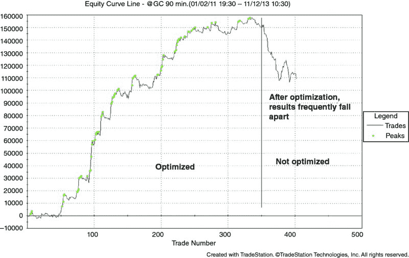

**图 5.3** 优化结果在测试后常常崩溃

##  超出样本测试

只有最缺乏经验和天真的开发者才会在整个历史数据集上测试和优化他们的交易系统。如果你一直以来都是这样做的，这句话可能会让你感到愤怒。但很可能你的实时交易结果并不好，或者至少不是一直都好。很多原因都可以归结为在与优化时相同的数据上评估策略的表现。这并不是一个很好的做法。相信我，我知道——在市场通过从我的账户中取钱告诉我我做错了之前，我一直在这样做！

一些开发者通过包括一个超出样本的时期来规避这个问题。这在图 5.4 中有所展示。超出样本的时期将是 10%到 20%的数据，这部分数据在优化后保留供复审。通常，留作超出样本测试的数据是最新的数据。然而，我见过有人将其应用于他们优化数据之前的数据。这种替代方法的理论是，优化应包括最新的数据，以便策略“调优”到当前市场条件。

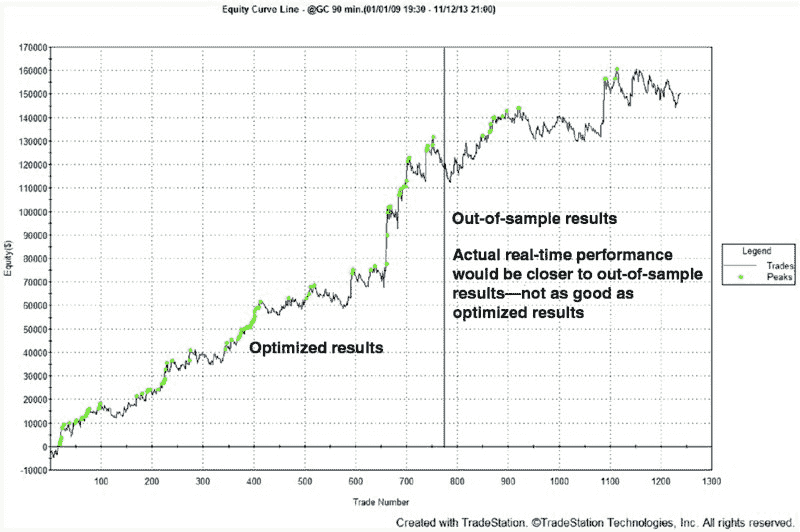

**图 5.4** 超出样本的测试结果

在超出样本数据上进行测试比在所有数据上优化要好得多，尤其是当超出样本的时期有大量交易时。如果优化后的结果在超出样本数据上表现良好，那么对这些优化结果的信心就会更大。这可能在实时中表现得更好。

超出样本方法的一个问题是，优化参数是永久设定的。因此，例如，如果你优化了交易系统并得到 X、Y 和 Z 作为系统的最佳输入，这些输入就不应改变。但也许由于市场条件的变化，你确实希望能够更改输入参数，或者至少在持续的基础上检查它们。通过这种方式，超出样本测试的想法可以更进一步。结果分析，向前走分析，要好得多，并且更接近现实。

##  向前走分析

向前走分析比传统的回测要复杂得多，但结果通常值得付出这些努力。向前走分析可以手动进行，并结合交易软件的优化。这是我曾经在世界杯比赛中取得优异成绩所使用的方法，我鼓励你手动尝试几次，以充分理解这个过程。之后，许多交易软件包现在都在其可用工具中包括向前走分析。

向前走分析背后的想法很简单：表现结果和优化结果基于两个不同的数据集。这可以在图 5.5 中看到。向前走分析就是将许多超出样本的时期汇总在一起。

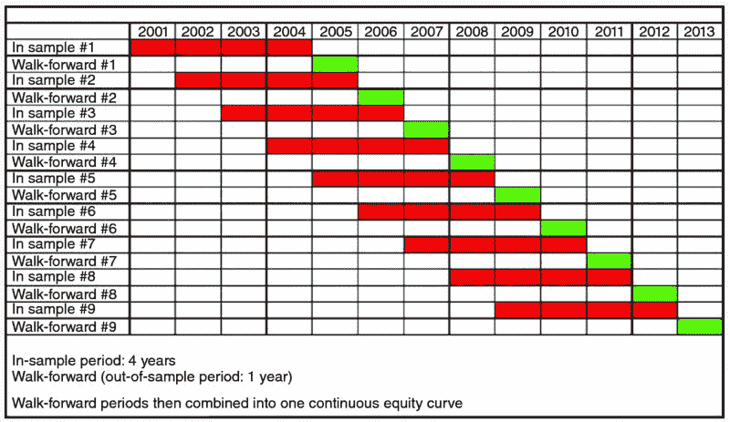

**图 5.5** 前向分析

正确进行的前向分析结果，往往比简单的优化测试更接近现实。这个样本在图 5.6 中展示，显示前向分析和实时结果相当可比。实时与前向结果之间的绩效没有显著的差异。

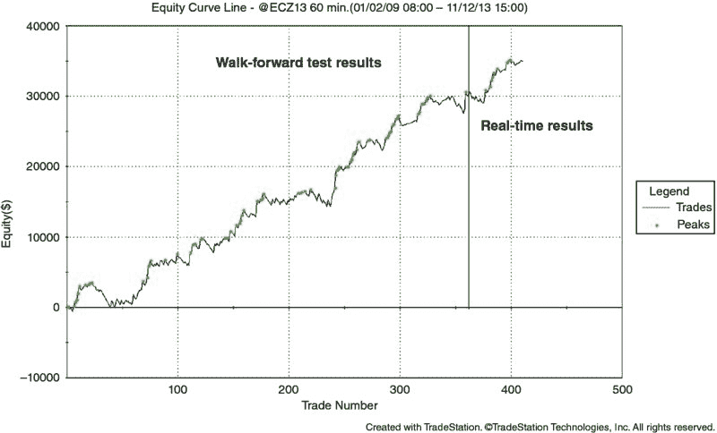

**图 5.6** 前向测试结果

当有大量历史数据可供分析时，前向分析是一个很好的工具。这是我推荐的方法。但在历史数据不多的情况下，最佳的方式可能是在实时中测试和评估交易系统。

##  实时分析

一些非常成功的交易者由于这种测试固有的冲突和问题，避免所有形式的回测。这些人只是实时测试策略，甚至可能使用真实资金。这种方法的明显优势是，不可能将规则适配于过去数据并利用后见之明。一个重大缺点是，你只能以市场速度收集数据。直到你在实时中测试多年，才有可能在多年内收集统计数据。大多数人没有耐心等待这样的测试完成。另一个缺点是，每当策略更改时，时钟就会回到零，评估重新开始。这可能会真正延长测试周期。

出于上述原因，大多数人并不认为实时测试，即使有其优势，也是一个可行的解决方案。然而，在本书后面展示的交易系统开发方法中，实时分析被使用，并为交易系统提供了有用的验证。

# 第六章

初步分析

现在我们已经检查了测试交易策略和生成交易绩效报告的主要方法，我将分享我认为这些报告中重要的内容。典型的总结绩效报告如图 6.1 所示。完整的 TradeStation 生成的绩效报告至少有七页，并包括数百个计算参数、交易列表和绩效图表。提供的信息量实在令人不知所措。结果显示，很多结果在评估交易系统时并不那么重要。“回撤—变异系数”的绩效指标可能对某些人重要，但对我来说却并非如此。

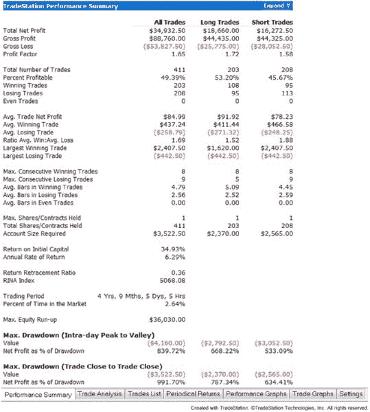

**图 6.1** 样本绩效报告

和交易的多数方面一样，我试图保持我的绩效报告分析简单。通常我只需要几个数字就能进行对任何交易系统的粗略审查。一旦我找到我喜欢的东西，我就会深入探讨。

首先，必须设定一些基本规则。绩效报告应基于实时数据或前向测试。优化的回测结果甚至不应被分析，因为它们的结果是虚假的且具有误导性。接下来，应有多年的数据，并有大量的交易。一个好的经验法则是 5 到 10 年的数据，以及每个交易规则 30 到 100 笔交易。第三，我通常会审查未应用头寸大小的绩效报告。在审查许多绩效报告时，比较“苹果与苹果”将非常重要。如果你查看一个基于单合约交易的绩效报告，并试图与另一个使用多合约头寸大小的报告进行比较，公平比较几乎是不可能的。此外，糟糕的策略通过头寸大小可能看起来吸引人。为了简单起见，我只有在对策略的可行性感到自信后，才考虑头寸大小。

最后，报告中必须包含佣金和滑点的准确假设。许多时候，我看到的业绩报告没有这些值，创作者却轻描淡写地回应：“这些成本可以稍后添加，没问题。”不包括佣金和滑点，不仅极不道德——如果不是不道德——因为这些成本对交易系统的影响，暗示开发者并不真正理解适当的策略开发。很容易证明，未考虑佣金和滑点的测试会导致选择交易频率更高、每笔交易平均利润更低的交易系统。例如，如果你基于净利润或类似的东西进行优化，优化器通常会给出一组最佳参数，使你交易过于频繁。这里有一个例子：

无滑点或佣金

+   参数设置 1：每笔交易毛利 = $25，1,000 笔交易，毛利 = $25,000

+   参数设置 2：每笔交易毛利 = $50，300 笔交易，毛利 = $15,000

优化器将选择设置 1 作为更优选择。

带有 $25 滑点和佣金

+   参数设置 1：每笔交易净利 = $0，1,000 笔交易，毛利 = $0

+   参数设置 2：每笔交易净利 = $25，300 笔交易，净利 = $7,500

优化器将选择设置 2 作为更优选择。

哪种方法更好？在第一种情况下，这样的系统在现实世界中将使平均交易者耗尽账户。绝非“你可以稍后加入佣金和滑点”那么简单。然而，第二种情况产生的结果要现实得多。因此，其他条件相同的情况下，考虑滑点和佣金的优化方法更接近现实，应该始终使用。

在这些基本规则到位后，我首先查看的数字是总净利润。这似乎是不言自明的，因为如果没有利润，为什么还要继续查看报告呢？可能显示的净利润并不值得，可能是由于涉及的时间段或必须忍受的回撤，但无论如何应该有利润。在我的经验中，经过前瞻性回测，每份合约的年净利润至少应为 $5,000，最好是 $10,000 或更多。任何低于这个数额的收益在风险调整基础上可能都不值得，或者交易次数不够，无法具有统计意义。

利润因子是我接下来审核的数字。显然，这里的数字越高越好。很多人说，只有利润因子大于 2.0 的系统才是可以接受的，但我并不认同这个观点。在我看来，任何超过 1.0 的利润因子至少都有一些价值，所以我不会仅仅基于这个数字而排除介于 1.0 和 2.0 之间的系统。不过，我确实发现利润因子低于 1.5 的系统通常很难通过开发过程中的其余步骤。

我总是审查交易总数，以确保在测试期间进行的交易足够多。例如，如果报告中仅包含 5 笔交易，那么结果到底有多有效呢？我通常会使用每个策略规则至少 30 到 100 笔交易的粗略指南。因此，例如，如果我有四个策略规则，我希望在报告中看到至少 120 到 400 笔交易。显然，交易越多越好。

平均交易净利润是我查看的下一个绩效数字。由于这个数字是扣除佣金和滑点后的，所以这是比较交易系统的一个好且简单的方法。我通常希望看到每笔交易的平均值在 $50 或以上，基于交易一份合约。对于平均交易值低于 $50 的系统，可能仍然可行，但你越接近 $0 的盈亏平衡线，允许错误、失误和轻微表现变化的余地就越小。

我接下来审核的数字是平均亏损交易，我将其与平均交易净利润结合起来计算期望值。关于期望值及其计算方式有很多困惑，所以我将在这里解释。

许多交易者以这种方式计算期望值：

期望值 = 平均 $ 胜利者 * 胜率 + 平均 $ 输家 * 失败率 = 平均交易

其中平均 $ 输家是一个负数。

注意，这也是平均交易净利润。因此，使用这个方程计算期望值并没有提供超出平均交易净利润已知信息的任何额外信息。

替代期望值可以按如下方式计算：

期望值 = (平均 $ 胜利者 * 胜率 + 平均 $ 输家 * 失败率) / (-平均 $ 输家)

这个指标是有用的，因为它是一个风险调整后的值。它基本上说明了你每冒险一美元，预期回报是多少？因此，若期望值为 0.2，你可以预期每冒险$1 会获得 20 美分的收益。这个期望值受到了交易心理学家和教育者 Dr. Van Tharp 的高度推崇，为了避免将来的混淆，我将这一计算称为“Tharp 期望”。对我来说，它比计算期望的第一种方法更有价值。

对于 Tharp 期望值，我通常寻找大于 0.1 的值。低于这个阈值的交易将很难进行，并且可能需要承受过大的风险以换取太少的回报。

我在绩效报告中查看的下一个数字是总滑点和总佣金。如果这些数字为$0，我会立即丢弃报告，并忽略我可能看到的所有其他结果。没有无成本交易，因此任何显示这种情况的绩效报告都是虚假的。一般来说，我需要每合约每个回合的交易佣金为$5。毕竟，这是折扣券商在加上所有交易所费用、全国期货协会费用等后收取的典型值。佣金可以低于这个数字，特别是如果你进行大量交易或是交易所会员，但$5 的数字对大多数零售交易者来说是合适的。

总滑点比总佣金更为关键。许多开发者，尤其是那些从未交易过的人，始终低估了现实世界中经历的滑点量。我将滑点定义为软件策略回测引擎给出的成交价格与实际成交价格之间的差异。例如，许多策略引擎假设在买入时按买价成交，而在实际交易中你会按卖价成交。这种差异就是我认为的滑点。根据我的经验，我假设重度交易市场的滑点值如下：

+   市场订单：每个回合 1 到 2 个点的滑点。

+   停止订单：每个回合 1 到 2 个点的滑点。

+   限价订单：0 个点的滑点。

棘手的部分在于，典型的交易策略将混合使用市场、限价和停止订单。在这种情况下，如果你只能对每笔交易应用一个滑点值，那应该是什么呢？我发现在这种情况下采取保守态度是有帮助的。对于这些混合订单类型策略，我通常会每个回合交易应用 1.5 到 2.0 个点的滑点。我发现这通常有点悲观，但总比低估滑点成本而对现实结果感到失望要好。

我在表现报告中查看的最后一个数字是最大回撤。我没有设定回撤限制的具体标准，但如果我看到某个策略的最大回撤为$10,000，而净利润仅为$15,000，就会引起警觉。在我心里，我会考虑回撤，知道在实时交易中我可能会看到更大的回撤。如果我无法承受这种回撤，我会立即放弃该系统。否则，我知道高风险、低回报的策略会在后面的步骤中被淘汰，因此我不会立即排除该策略。

无疑，表现报告中还有其他重要数字。例如，许多人对胜率、夏普比率或数百种其他指标非常信任。事实是，所有指标在一定程度上都是重要的，开发者应该尽量找到自己熟悉的指标。最终，任何依赖的指标都应通过导致成功的实时策略来证明自己。

一旦我完成了对表现报告的审查，我通常会查看一些交易图表。我对一张图表特别感兴趣：已平仓交易的权益图。如果你是一个视觉学习者，仅仅查看一个权益曲线——无论是已平仓交易的权益曲线还是每日权益曲线（如图 6.2 所示）——可能就能告诉你所有你需要知道的内容。以下是我在权益图中关注的主要事项。

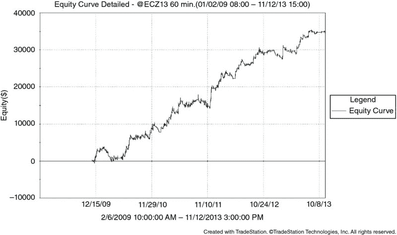

**图 6.2** 示例权益曲线

我在权益曲线中寻找的第一件事是斜率。如果图表没有稳步从左下角上升到右上角，可能不是一个很好的策略。问题在于，图表可能会因为使用的缩放而扭曲。因此，查看最终权益也很重要，然后将其除以曲线中的年数。这将给你一个年均利润的好指示，判断该策略是否值得投资。

在斜率之后，我喜欢寻找平坦的时期。显然，平坦的时期比回撤时期要好，但许多被快速上涨穿插的时期应引起关注。这样的权益曲线表明，该策略可能只抓住了一些好的交易，这可能是由于曲线拟合或过度优化所致。平坦的时期也可能是由于政府干预造成的，例如 2009 年至 2013 年间美国的量化宽松计划（QE、QE2、QE3）。在这种情况下，可以假设政府干预结束时表现会改善。当然，何时以及是否会结束某种形式的政府干预，谁能预测呢？

我关注的第三个主要项目是回撤期。回撤的严重程度如何，策略需要多长时间才能从这些回撤中恢复？这些问题的答案将让你对如果实际交易这个策略时应该期待什么有一个大致的了解。未来的回撤可能更严重，持续时间可能更长——你的仓位规模和资金管理应该假设这两种情况都会发生——但至少你可以对预期有一个大致的了解。

权益曲线上没有任何回撤的情况也应引起关注。我知道除了存入储蓄账户的钱，没有任何真正的系统仅有小幅或没有回撤。同样，曲线必须“看起来”真实。没有风险的回报是不现实的。

我在权益图表上检查的最后一项是曲线的“模糊性”。这在封闭的权益图表上无法看到，但在每日权益图表上可以看到。曲线越模糊，每日结果的波动就越大，即使长期趋势向上，短期内也会上下波动。非常模糊的曲线更难交易，更难进行仓位规模调整，也更难情感上应对。想想看：如果系统 A 在第一天获得$200，第二天损失$200，第三天获得$75，这是否比系统 B（每天稳定获得$25）更可取？两者的最终结果相同，但系统 A 的模糊性使其不如系统 B 有吸引力。

显然，仅仅查看权益曲线并不是评估交易系统的科学或严格的方法。但这对于初步分析是有用的。如果你对权益曲线的表现不满意，就没有必要查看绩效报告的详细信息。在这种情况下，你可以节省很多时间，只需花几秒钟盯着权益曲线，然后拒绝一个你不喜欢的系统。

到目前为止的讨论集中在简单、快速的数字和方法上，以评估交易系统的绩效。这种分析在开发的早期阶段非常有用，因为大多数策略都不靠谱，快速的初步审查可以排除它们，从而为你作为开发者创造新系统腾出更多时间。但最终，你将需要对绩效结果进行深入分析。这是一个完全不同的层面。

# 第七章

详细分析

随着交易策略的发展，分析也在不断进步，策略必须满足的绩效障碍变得越来越严格。在后期阶段，我主要采用蒙特卡罗分析方法。但在我解释如何进行分析以及我关注结果中的哪些内容之前，我首先简要描述一下这个过程。

##  什么是蒙特卡罗分析？

蒙特卡洛分析或模拟听起来是一个艰巨的话题，但实际上并非如此。使用我创建的蒙特卡洛电子表格，你可以免费下载（[www.wiley.com/go/algotradingsystems](http://www.wiley.com/go/algotradingsystems)），分析过程相当简单。那么，它实际上是什么呢？

想想你策略中的个别交易。这些交易按发生顺序依次进行，形成策略的权益曲线。但如果这些交易的顺序不同呢？回撤是否会变得更严重？最终权益是否会不同？这些都是蒙特卡洛分析可以回答的问题。

在最简单的形式下，你可以这样理解：首先，准备一些小纸片，每个纸片对应你策略中的一个交易。然后，在每个纸片上写下一个交易结果。当你记录完所有交易后，把所有纸片放进一个帽子里。随机选择一张。这就是你的第一次交易。记录它，将其加入你的初始权益中，然后把纸片放回帽子里（这称为有放回的随机抽样）。然后，选另一张纸片，记录它的值，并将其加入你正在构建的现有权益曲线中。

如果你对多个交易进行这种分析，你将会得到一个可能的权益曲线。如果你多次执行整个分析，你将得到一系列的权益曲线。每一条曲线代表着在你的策略中交易可能发生的方式。利用这系列可能的曲线，你可以获取有关交易系统的统计数据。这些统计数据可以帮助你评估策略，确定头寸大小方法，并为你在实际交易中可能面临的情况提供现实的场景。当然，这一切都假设历史交易将与未来的交易相同。如果你的历史交易基于有缺陷的开发，未来的结果将毫无价值。

显然，这种分析存在一些潜在的严重缺陷。首先，分析假设你的绩效报告中的交易是唯一可能发生的交易。这显然是错误的，因为当你开始实时交易时，任何结果都是可能的。但如果交易的分布（总体均值和标准差）是准确的，那么蒙特卡洛方法可以产生有意义的结果。

第二个缺点是该分析假设每笔交易与前一笔交易是独立的，这种情况通常称为序列或自相关。对于大多数交易策略来说，这不是问题。然而，如果你的策略中交易结果相互依赖，简单的蒙特卡洛分析就不适用了。比如，交易 B 信号依赖于前一笔交易 A 的结果。在使用蒙特卡洛分析之前，最好先检查这种情况。检查序列相关性的一种方法是 Durbin Watson 统计量。尽管超出了本书的范围，但你可以在网上找到有关此计算的详细信息、示例和电子表格。

如果你发现交易确实表现出序列相关性，那么简单的蒙特卡洛分析可能不适用。在这种情况下，你可以尝试使用包含序列相关性影响的蒙特卡洛模拟，或者可以收集一种称为“开始交易分析”或“移动开始分析”的方法的统计数据。在此分析中，你在每笔交易开始时进行模拟，并收集回报和回撤的统计数据。例如，如果你的样本中有 10 笔交易，*i*, *i + 1, … i + 9*，你首先从交易 *i* 开始创建一个权益曲线。从生成的曲线中，你可以获得回撤 *d[i]*。然后，从交易 *i + 1* 开始这条权益曲线。这条曲线将给你回撤 *d[i]*[+1]。如果你继续遍历所有交易，可以分析回撤集合 *d*。这种方法可能比蒙特卡洛更复杂，但在存在序列相关时，它是分析数据的更好方法，因为交易顺序大部分会被保留。

假设你能接受列出的缺点，蒙特卡洛方法可以帮助你回答以下问题：

+   对于给定账户规模，我的破产风险是多少？

+   我的系统发生最大回撤 X 百分比的几率有多大？

+   我可以期望从这个交易系统获得什么样的年回报？

+   我为交易这个策略所承担的风险是否与我所获得的回报相符？

这些问题将在接下来的讨论中逐一解决。为了简化叙述，我将假设读者使用我的蒙特卡洛电子表格。任何可公开使用的蒙特卡洛模拟器都应该能够给出相同的结果，尽管使用的术语和假设可能会有所不同。因此，无论你是否使用模拟器，讨论仍然对你有用。

##  蒙特卡洛模拟器的输入

执行蒙特卡洛模拟只需要少量输入。这些输入如下所列，并显示在图 7.1 中。

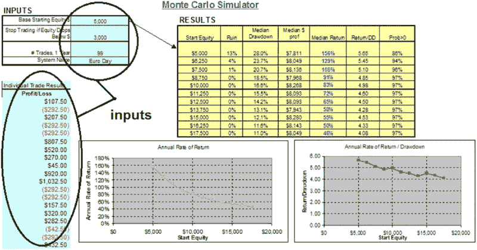

**图 7.1** 蒙特卡洛模拟器输入

+   *基础起始权益。* 这是你账户的起始金额，以美元计。

+   *如果权益低于 $，则停止交易。* 这是指低于该金额时你将停止交易的资本。例如，如果你在这里输入 $3,500，一旦你的权益在平仓基础上低于 $3,500，你将不再被允许进行交易。你的账户将被视为“破产”。至少，该值必须大于你的系统所交易工具的一个合约的初始保证金。在前面的例子中，你只能交易初始保证金低于 $3,500 的产品。如果你想交易更高保证金的工具，如黄金（当前初始保证金为 $8,800），你将必须增加这个最低金额。通常，我从不推荐只用足够满足保证金要求的资本进行交易，但对于这个模拟，假设是可以接受的。

+   *# 交易次数，1 年。* 这仅仅是你的系统在一年内进行的交易数量。我的模拟器设计为仅交易一年，因此生成的每条权益曲线将由此交易次数组成。当然，这是假设破产点未先触及。

+   *单个交易结果。* 这一列数据包含所有交易数据，每行一笔交易。所有交易应基于相同的参考点，即每合约、每天等。你不能将一些基于一个合约的交易与多个合约的交易混合在一起。

##  模拟器的局限性

为了简化问题，模拟器做了一些假设。首先，假设每次交易只交易一个合约。模拟器中没有包含仓位规模。其次，模拟器假设交易时间为一年。这两个假设可以由任何了解宏编程语言的人在 Excel 宏代码中进行更改。

在接下来的讨论中，“运行”或迭代被定义为生成一条单一的权益曲线。在一次“模拟”中，将有多个运行——在讨论的模拟器中，这为 2,500 次运行。为了生成风险破产或中位回报等统计数据，将使用一次模拟的结果（2,500 次单独运行）。

##  模拟器输出

一旦模拟器运行，将生成一个输出值表和相应的曲线，如图 7.2 所示。以下是对每个输出值的解释，包括如何解读它，以及我认为适合可交易系统的值。

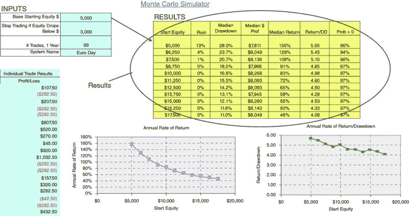

**图 7.2** 蒙特卡洛模拟器输出

### 起始权益

这是你在蒙特卡洛分析开始时的账户规模。所有的回报率都是基于这个数字计算的，破产风险和最大回撤都受到它的强烈影响。模拟器使用不同的起始权益范围来生成表格和输出曲线。

### 破产风险

这个统计数据告诉你，在一年内，你的账户被清零（即，低于“如果股本低于$，则停止交易”）的几率（概率）。例如，如果破产风险为 12%，这意味着在系统的第一个交易年内，你有 12%的机会必须停止交易。

破产风险是一个极其重要的统计数据，特别是对于小账户的交易者。即使系统是一个成功的系统，小账户的破产风险也可能很高！这里有一个例子可以说明这一点：

假设你有一个非常好的日间交易系统。它每天交易两次。盈利交易每次在扣除所有成本后能赚$200，发生的概率为 50%。当它在另外 50%的时间内亏损时，每次净亏损$175。

平均而言，你每天可以赚取$25。一年内，每个合约你可以赚取$6,300。如果你用$10,000 的账户进行交易，始终保持一个合约，你的年回报率将为 63%，最大回撤大约为 15%。按大多数标准，这真的很不错。

现在，假设你用一个小账户（$5,000 及以下）来交易这个积极预期的系统。假设你的经纪商允许$500 的日间交易保证金，所以这是你的“破产”点——如果你的账户低于$500，你就破产了，停止交易。

在一年交易中，你破产（跌破$500 并停止交易）的可能性有多大？结果在图 7.3 中展示，可能会让你感到惊讶。

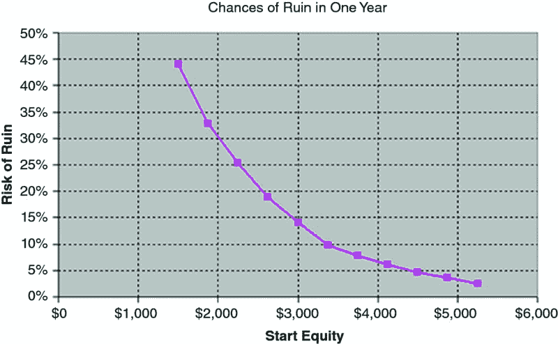

**图 7.3** 账户规模与破产风险

问题是：你在这条曲线上感觉最舒适的位置在哪里？拥有$1,500 的人在每次损失后可能会感到恐慌，因为他没有太多的灵活空间。但拥有$5,000 的交易者——仍然是一个小账户，仅为第一位交易者账户的 3.3 倍——破产的可能性低 20 倍。

结论是，资金不足可能是灾难性的，*即使有一个成功的系统。*因此，我非常关注模拟器输出的破产风险值。任何超过 10%的值对我而言意味着，我试图以过少的资本进行交易，应该增加资本以降低到 10%以下。显然，破产概率在 0 到 1%的系统是最好的，但与交易中的任何事物一样，这都是收益率的权衡。在我的经验中，我发现破产风险低于 10%的模拟结果相对安全，同时仍能提供可接受的收益率。

### 中位数回撤

这个统计数据一开始可能会有点困惑。它实际上是最大回撤的中位数值。你现在困惑了吗？也许将其拆分会有所帮助。

首先，最大回撤是账户规模从股本峰值的最大百分比下降。它应始终从前一个股本峰值进行测量。图 7.4 给出了三种不同回撤的例子：

+   回撤 1：$5,000 回撤，在最高权益 $20,000 后 = $5,000/ $20,000 = 25% 回撤

+   回撤 2：$10,000 回撤，在最高权益 $30,000 后 = $10,000/ $30,000 = 33% 回撤

+   回撤 3：$15,000 回撤，在最高权益 $60,000 后 = $15,000/ $60,000 = 25% 回撤

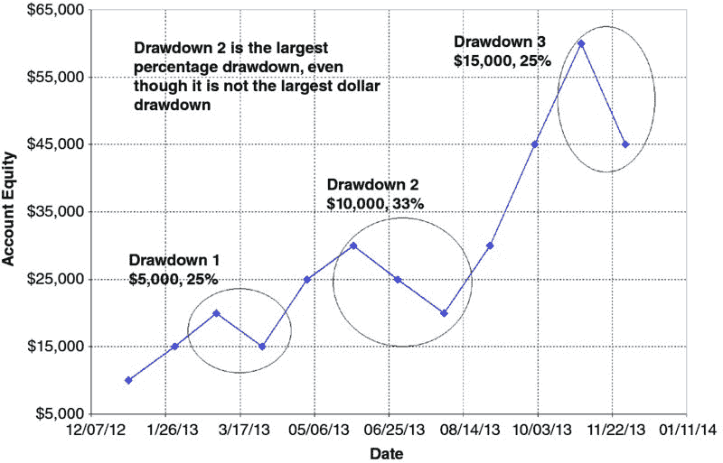

**图 7.4** 最大回撤解释

在这个例子中，最大百分比回撤发生在回撤 2 中，为 33%。有趣的是，这是最大百分比回撤，而不是绝对美元最大回撤（回撤 3 的美元金额高于回撤 2）。

对于每次模拟运行，都会有一个相应的最大百分比回撤。在大量模拟运行中，会有一个最大回撤的分布，范围从 0%（完全没有回撤，完全不切实际的情况）到 100%（从最高权益点完全崩溃到 $0 权益）。这个分布将有一个中位数值，这意味着 50% 的回撤值超过中位数，50% 在其以下。因此，在“中位数最大回撤”这个术语中，*最大*一词指的是特定模拟运行中的最大回撤，而*中位数*指的是大量模拟运行中最大回撤的中点。

在选择中位数最大回撤作为模拟的输出值时，并没有什么魔法。它也可以轻易是 30%、60%、90% 等百分位值。我选择中位数值只是为了与其他系统进行比较。如果我想要一个最坏情况值，我可以使用回撤的第 95 百分位值，这意味着只有 5% 的最大回撤会比这个值更糟。

根据我个人的偏好，我一般接受最多 40% 的中位数最大回撤。也就是说，在 1 年内，我有 50% 的机会达到 40% 的最大回撤。这对于大多数人来说可能太极端，但它符合我的目标和个性。

需要记住的一件事是，交易者，尤其是新交易者，往往会大大高估自己承受回撤的能力。根据我与不同交易者的对话，我发现交易者通常只能承受他们认为可以承受的最大回撤的一半。例如，如果一个交易者在交易系统之前决定他可以承受 30% 的最大回撤，当真实资金面临风险时，他会开始恐慌，可能会在 15% 回撤时退出或更改系统。我为这种现象创造了一个短语：“你认为的只有一半。”当你建立个人最大允许回撤时，请记得牢记这一点。

### 中位数 $ 利润，中位数回报

与回撤类似，在 2,500 次完整模拟中，结果会有一个分布。这种分布用于计算中位数利润和中位数回报。中位数 $ 利润就是经过一年的交易后，最终股本减去初始股本。在 2,500 次运行过程中，可以计算出一个中位数水平。这就是中位数 $ 利润。中位数回报以类似方式计算，但它是最终股本除以初始股本，以百分比形式表示。

对于我个人的交易，我没有设定中位数 $ 利润的目标。我确实希望看到中位数回报超过 50%，特别是因为我之前提到过我会允许高达 40% 的中位数回撤值。如果我将回报阈值设定为 20%，而回撤为 40%，那就不明智。为了让我意识到风险与回报之间的关系，我还会计算回报/回撤比率。

### 回报/回撤

在蒙特卡洛分析生成的所有统计数据中，我认为这个数字是最重要的。当它在三年期间计算时，金融文献中称其为卡尔马比率。由于我仅模拟一年表现，因此模拟器结果并不完全是卡尔马比率。电子表格生成的数字只是中位数年百分比回报除以中位数最大百分比回撤。

一种思考这个比率的方法是“需要 Y 的风险来获得 X。”在这种情况下，Y 是回撤，X 是利润回报。显然，这个比率的高值更好。我通常寻找回报/回撤比率在 2.0 以上，尽管在特殊情况下我会接受较低的值。在我的经验中，我发现超过 2.0 的比率通常能在实际交易中产生可接受的结果。

### 概率 > 0

这给你提供了系统在第一年交易中盈利的概率，以百分比表示。例如，如果概率 > 0 等于 89%，这意味着你在第一年有 89% 的机会实现盈利。当然，这一切都基于你的历史测试结果，因此如果它们不准确，这个结果也不会准确。

##  摘要

现在我们已经讨论了性能报告、股本曲线和蒙特卡洛模拟器，我们可以总结所有数值及其可接受性阈值的用途 (表 7.1)。

**表 7.1** 重要性能参数

| 参数 | 来源 | 使用期间 | 阈值 |
| --- | --- | --- | --- |
| 总净利润 | 性能报告 | 初步审查 | ∼每合同每年$10K |
| 利润因子 | 性能报告 | 初步审查 | >1.0 可接受, >1.5 理想 |
| 平均交易净利润 | 性能报告 | 初步审查 | 每合同 >$50 |
| Tharp 期望值 | 性能报告 | 初步审查 | >0.10 |
| 滑点和佣金 | 绩效报告 | 初步审查 | 如果$0 则丢弃，其他情况下每次交易$5 佣金，1-2 个点的滑点 |
| 最大回撤 | 绩效报告 | 初步审查 | 应远小于总净利润 |
| 资金曲线斜率 | 资金曲线 | 初步审查 | 理想情况下以 45 度角上升 |
| 资金曲线平坦期 | 资金曲线 | 初步审查 | 持续时间短 |
| 资金曲线回撤、深度和持续时间 | 资金曲线 | 初步审查 | 与整体曲线成比例 |
| 资金曲线模糊度 | 资金曲线 | 初步审查 | 较小为佳 |
| 破产风险 | 蒙特卡洛模拟 | 详细审查 | <10% |
| 中位数最大回撤 | 蒙特卡洛模拟 | 详细审查 | <40% |
| 中位数 % 回报 | 蒙特卡洛模拟 | 详细审查 | >40% |
| 回报/回撤比 | 蒙特卡洛模拟 | 详细审查 | >2.0 |

# 第八章

设计与开发系统

随着现在可用的交易系统软件包数量庞大，设计自己的交易系统从未如此简单。当然，像 TradeStation、NinjaTrader 和 MultiCharts 这样的软件包的流行既是福音也是诅咒。这些易于使用的软件程序使将想法转化为策略变得比以往任何时候都更容易。以前在 Microsoft Excel 或硬核编程语言（如 C、C++、Visual Basic，或者对于那些年长程序员而言，Fortran）中完成的工作，现在只需几分钟甚至几秒钟。生活在这方面确实轻松了很多。

这种现代软件的缺点在于——除了许多人每天测试数百万个交易想法，并最终可能发现你找到的任何“优势”，从而使其变得无用——就是交易软件使一切变得太简单。只需查看图表，插入策略——可能是软件附带的许多标准策略之一——你就可以快速分析和优化，尽情享受。

不幸的是，正是这种简单性也成为了该软件的致命弱点。以交易软件产品所描述的简单方式创建可行策略几乎是不可能的。走捷径确实可能让你得到一个回测结果看起来很不错的策略，但当策略开始在实盘中运行时，所有统计数据都会变得糟糕。也许这曾经发生在你身上，就像我在早期开发阶段所经历的一样。我擅长生成看起来像图 5.3 左侧的回测，但将它们放到实时市场上后，却体验到了资金曲线的右侧，最终不可避免地亏损。

这些“零售”交易软件包简单易用的另一个缺点是，许多专业交易者无法或不愿使用它们。这应该让每个认为知名商业软件包是最佳选择的零售交易者有所警惕。事实上，许多专业人士通常使用更复杂的编程和分析工具，如 R、Python、Matlab 等等。或者，他们从头开始开发自己的平台，利用互联网上可用的开源代码。我并不是想暗示只有专业软件工具才好；而是想提醒交易者，所有交易软件都有局限性和不足之处。如果某些工具在分析、策略开发或自动化方面无法满足你的需求，那么很有可能另一个可能更昂贵的软件工具能够提供这些功能。

多年来，我从手动评估系统逐步转变为通过电子表格分析，再到使用 Fortran（我作为工程师的一面）和 Visual Basic 创建策略评估器，如今主要使用 TradeStation 和 NinjaTrader。在这个过程中，我在开发交易系统时犯了许多错误，并不得不以交易亏损的形式支付市场的“学费”。最终，我终于聪明地改进了我的交易系统开发方法。现在，我遵循多步骤的方法，如 图 8.1 所示。在每个过程的节点上都有一个“关卡”——策略必须满足的标准，以便进入下一步。对于在过程中失败的策略，可以在适当时对其进行小的调整。然而在大多数情况下，最好将策略放到废弃堆上，然后继续下一想法。为什么？很多时候，当一个策略在第一次过程中不起作用时，对其的更改可能会无意中引入曲线拟合、事后偏见或其他数百万个策略禁忌中的一种。欺骗性的部分在于，回测看起来会更好——可能好得多。但请记住，目标不是创建一个出色的回测；而是创建一个能够反映策略未来表现的回测。通过水刑或其他方式折磨你的策略直到其给出优秀结果并不是成功的方法。

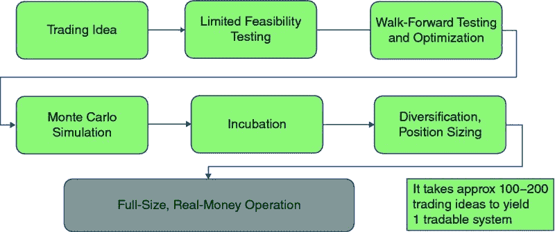

**图 8.1** 我的策略开发过程

在我开发现在使用的过程之前，早期的日子里，我做的和大多数人一样：我选择一个市场，设定一个时间段和条形间隔，制定一些规则，然后进行优化。无论最终表现最佳的是什么，我就用它开始进行实盘交易。计算机的魔力在于能够迅速进行数百万次迭代，揭示我确信将会带来财富的东西。哦，我真是失望透顶！

这些早期的失败让我得以建立一个更复杂、稳健，并理想上无故障的开发过程。我不能为任何单独的概念归功——当然，许多交易者在我之前早就开发了我过程中的大部分步骤。关于系统开发的一个经典参考是系统设计的“圣经”：《交易策略的评估与优化》，作者是**罗伯特·帕多**（John Wiley and Sons, 1992）。我只是将我所学到和阅读的内容进行了调整，创造出让我觉得合适的东西，总体上它在实时中取得了不错的结果。

这并不是说策略通过的过程很简单。当我第一次开始使用我今天所用的基本过程时（多年来我对其进行了增强和完善，如果说有什么不同的话，如今的标准比几年前更严格），我大约需要 100 到 200 个交易想法用于进出交易，才找到值得交易的策略。随着时间和经验的积累，这个数字显著减少，但提出可交易策略并不是一件容易的事情。

对于新手交易者来说，使用前向分析、蒙特卡洛分析等方法时，经常会因为发现策略的困难而感到沮丧。我对这种困境的回答通常是：“但这就是应该如此！”想一想，如果找到策略是容易的，你不觉得其他人早就找到了并加以利用吗？每天都有成千上万的交易者和研究者在寻找优势、挖掘数据和进行测试。我可以保证，所有简单的策略要么不再有效，要么早已被发现。

我的一位好交易朋友，他是一名商品交易顾问（CTA），曾告诉我，如果他每年能找到一个新策略进行交易，他就会感到高兴。他确实应该如此，因为即使一个策略，只要管理得当，也能让你致富。但要每年找到一个策略需要付出大量的努力。我常常把策略开发过程视为一个工厂。在工厂的接收门口是你的交易想法和策略，这些是你不断需要运行工厂的原材料。你的分析工具、回测软件和前向算法就是工厂中的机器。你当然是操作这些机器的熟练工人，监控产品的质量。可惜的是，输出的产品通常装满了工厂外的大垃圾桶。但未被丢弃的垃圾却是纯金：你的可交易策略。

工厂的比喻恰当，因为策略开发是一项艰巨的工作。工厂工人是我认识的最坚韧的人之一，而你需要具备这样的品质来开发策略。我总是对那些忽视策略开发的教育者感到惊讶。他们往往专注于诸如感受的联系或写日记等无意义的事情。别误会——这些方面在交易中有其时间和地点，但不能替代拥有一个具有优势的策略。如果你没有一个好的策略，再多的记录也无法拯救你。不过，讽刺的是，许多时候，心理学或记录等“软”技能对拥有优势的交易者是不可或缺的。成功确实需要两者。

既然策略开发是一座工厂，你需要时刻保持工厂运转。以下是一些我使用或曾经使用过的保持运转的建议：

+   每当你看到一个吸引你的交易想法时，写下来。保持一个想要测试的想法列表。

+   在任何地方寻找想法。交易书籍、杂志和网络论坛都是很好的原始想法来源。不过，我不建议完全照搬一个想法来交易。我会先考虑修改它，并加入你独特的见解。

+   没有任何想法是太傻、太愚蠢或太笨的。唯一愚蠢的想法是你从未测试过的想法。

+   如果你在编码中犯了一个大错误，还是要进行测试。我是“意外”错误的大力支持者。也许它们真的是你潜意识的偶然创造。我意识到这听起来很疯狂，但我确实用真实资金成功交易过不止一个我的编程错误。

+   如果情况不佳，尝试相反的方法。在你认为应该卖出时买入，反之亦然。也许你的相反想法会带来一些有趣的结果。

+   如果你设定目标，尽量每周测试一到五个策略，至少。可能需要六个月到一年的严格测试，但最终你会找到一些有效的东西。

+   如果你没有想法，就随机挑选一些图表盯着看。你甚至可以添加一两个指标。盯着一段时间，但不思考，然后离开这些图表，几天或一周后再回来看。然后开始思考：你在指标与图表的关系或图表本身中看到什么吗？写下你看到的，编程实现并测试。

+   找到与你技能水平相近的其他交易者，提出交换想法或策略的建议。借鉴这些交易者的观点，然后围绕他们的想法构建策略。我经常这样做，和一些我的期货交易世界冠军同事们交流。

+   改变你的标准。也许你对可接受的标准要求过于严格。稍微放宽一下标准，以便接受那些符合大部分但不是全部标准的策略。你的工厂开始生产后，你可以随时收紧标准。如果你放宽了标准，不一定要交易第一个通过的策略。这样做的真正目的是为了让你在开发“通过”系统时获得更多经验和信心。然后，慢慢收紧标准，理想情况下到那时你将能够改善你的系统以满足更严格的挑战。不断重复这个过程，最终你会有一个符合你原始标准的策略。

##  这难道不只是优化吗？

在阅读接下来的几章关于我的过程后，你可能会想，“策略开发难道不就是优化吗？”这是个合理的问题，从某种意义上来说，所有的策略开发确实都是这样。如果你一开始就有一千万个策略待测试，那么至少有几个策略会在你设置的绩效门槛中脱颖而出，经过孵化后成为潜在的获胜策略。在这一点上，关于策略有几种可能性出现：

+   你确实有一个真正的优势，你将至少在一段时间内通过交易获得盈利，直到这个优势消失。

+   你过度优化并过度拟合了策略，以便通过所有测试，但实际上没有任何能够在实时中有效的策略（这在缺乏经验的开发者中很常见）。

+   你测试了这么多策略，迟早会有一个能够通过你所有的测试。你认为这个策略有优势，但实际上并没有。你只是碰巧尝试了这个特定的策略。就像盲目松鼠偶尔找到一个坚果一样，你只是运气好！

显然，你在寻找适合情景 1 的策略。我的过程将帮助你避免情景 2 中的策略（虽然你可以放宽我给出的指导方针，从而导致过度优化）。在我看来，情景 3 是可怕的替代选择。在这种情况下，你认为自己有优势，但实际上只是非常幸运。你永远无法确定这个情景是否适用。你可能会用一个幸运策略成功交易多年，或者从第一天起就亏损。你永远不知道会发生什么。

我的建议是避免情景 3——找到一个“幸运”策略：

+   为你的策略有一个逻辑基础。考虑一下你的进出场时机，以及它们如何给你带来优势。运用你的头脑来利用你在市场中看到的情况。

+   尽量保持事情简单。通常，更多的规则和条件会导致策略在未来不太可能有效。

+   不要随意将随机指标拼凑在一起，直到找到真正有效的东西。如果你进行足够多的测试，你最终会找到一些东西，但这可能只是一次幸运的捕获。市场上确实存在使用这种技术的产品，如果使用得当，它们可以非常有用。只是不要指望电脑为你完成所有的策略思考。

+   温和地优化你所做的任何事情。

有时候，我将战略开发过程比作钓鱼。如果你想抓住一条鲶鱼，一种方法是用一个巨大的渔网捕捉成千上万条鱼，然后从被网困住的鱼堆中挑出你的鲶鱼。这相当于随机测试一百万种策略，然后找到几种看似不错的。更好的方法可能是考虑鲶鱼喜欢什么，并根据你认为能够钓到鲶鱼的方式来调整你的饵料和钓鱼方法。这类似于发展一个优势，然后制定规则来利用这个优势。其他条件相同的情况下，后者方法可能更有利于你获得长期成功。

在接下来的章节中，我将详细介绍我目前用于设计和开发交易系统的过程。你可以完全按照这个过程进行，也可以提取适合你情况的部分。无论哪种方式，跟随适合我的方法，你的开发技能都将得到提升。
