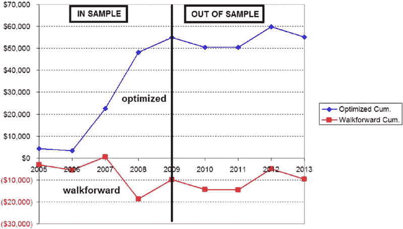

# 第三部分

制定策略

# 第九章

策略开发–目标与任务

当你开车进行一次长途旅行时，你是否有地图或全球定位系统来引导你？还是仅凭直觉和路标希望找到目的地？当然，大多数人会带上地图。这让旅程变得更容易。在开发交易系统时也是如此。你应该在开始之前就知道自己想要达到什么。这一切都始于目标。

你可能一辈子听过无数次：如果你想要实现某件事，必须有目标。不幸的是，听过这么多次后，许多人只是列出目标以表明他们做到了，或者列出无法测量或实现的模糊目标。

要开发一个好的交易系统，你绝对需要目标。为此，我采用 SMART 技巧（图 9.1）。SMART 是一个小记忆技巧，帮助记住目标的重要部分。以下是我在交易中应用的方法：


**图 9.1** SMART 目标

+   *具体性。* 目标必须具体，而不是模糊。例如，仅仅说“我想要一个能让我赚钱的交易系统”或“我想要一个没有风险的交易系统”是不够的。这种模糊的目标不仅不现实，而且过于宽泛。你怎么能知道何时达成如此模糊的目标呢？简单的事实是，你根本不知道自己是否达到了这个目标。

+   *可测量性。* 如果目标无法测量，你怎么知道自己是否创建了一个符合目标的交易系统呢？这是一个坚实目标的第二个关键。在开发过程结束时，你希望拥有一个具有特定性能指标的交易系统，并将其与最初设定的目标进行比较。这是一个非常简单的概念，但你会惊讶于有多少人制定了无法测量的目标，例如“我想创建一个让我的家人骄傲的交易系统”。这无疑是一个值得赞赏的质量，但你怎么衡量这个呢？也许如果你的青少年孩子在公共场合与你并肩走，而不是在你前面或后面 10 英尺的地方，你就会知道他们为你感到骄傲。但是如果你没有青少年呢？

+   *可实现性。* SMART 中的“A”代表可实现性。说“我需要开发一个能提供 500%年回报且最大回撤低于 2%的交易系统”是完全没有意义的。这不符合现实。你需要追求一个可实现的目标。否则，你只会一次又一次地感到失望，因为你无法创建出符合如此高目标的交易系统。最终，大多数有不切实际目标的人最终会通过作弊来达成目标。他们会生成一个超优化的回测，极度曲线拟合，显示他们达到了不现实的目标。但正如我之前所说，“如果听起来好得令人难以置信，那很可能就是不可信的。”

+   *相关性。* 如果你设定的交易系统开发目标与当前主题无关，那么整个目标设定过程都是浪费时间。例如，假设你讨厌创建交易系统并厌恶整个开发过程。追求创建交易系统对你来说真的有价值吗？换句话说，整个过程对你来说值得吗？如果不值得，你可能现在就该放弃。要在这个领域取得成功，你的心和脑必须完全投入。相信我，有成千上万的专业交易者致力于这个事业。在投入与不投入的交易者之间的竞争中，你觉得谁会赢？

+   *时间限制。* 创建交易系统需要时间，占用你的自由和工作时间，因此将时间作为目标的一个方面是个好主意。你可能会给自己设定一个创建策略的时间，或者设定评估单个想法的时间限制。这个想法是始终保持过程的推进。正如你将发现的那样，找到时间和动力来测试新的策略想法真的很难，特别是当之前的 100 个想法都失败时。

现在我们有了目标的框架，让我们看看一些例子：

+   *“我将创建一个满足我绩效目标的交易系统。”*

    具体吗？不。可衡量吗？按现有写法不行。可达成吗？可能。相关吗？是的。时间有限吗？不。这种目标需要很多工作。

+   *“我将在六个月内创建一个满足我绩效目标的交易系统。”*

+   这是一个 SMART 目标吗？是的和不是。第一部分具体且可衡量（“在六个月内创建一个交易系统”），但“满足绩效目标”这一短语过于模糊，无法衡量。目标的开头是非常可达成的——六个月的努力应该能产生一个不错的交易系统，后续系统的开发会更快。这也是相关且有时间限制的。总的来说这是一个好目标，除了最后几句话。让我们试着改进一下。

+   *“我将在六个月内创建一个交易系统，该系统交易欧元货币，年均回报率为 50%，最大回撤为 30%，胜率为 45%或更高，并遵循明确定义的开发过程中的所有步骤。”*

    太好了！这个目标符合 SMART 目标的所有要求。你可以轻松地将你创建的任何系统与这些目标进行比较。

一旦你有了 SMART 目标，并尝试开发几个交易系统，你可能会发现你认为可达成的目标其实并不那么可达成。通常，当人们在目标中列出年回报率和最大回撤时，便会意识到这一点。确实，100%的年回报是可能的（我就是活生生的例证！），但如果你还想要 10%的最大回撤，这样的回报就不切实际。有时很容易提前看到一个目标不可达成，但其他时候你只有通过开发过程才能发现这一点。

在这种情况下，你会希望将 SMART 目标转化为 SMARTER 目标。这意味着在你尝试实现目标之后，如有必要，你需要评估和重新评估你的目标。你要根据当下的情况调整它们。这对某些人来说可能看起来像是放弃——如果你的目标无法实现，那就降低目标——但这也可以提高你成功和找到良好交易系统的机会。如果你发现自己处于一个永远无法满足目标的情况中，你可以选择离开这个过程，寻找新的爱好或职业，或者评估并调整你的目标，使其更相关和可实现。

开发交易系统的目标应该只有一两句话，足够 SMART。但是对于你对交易系统的一些期望和愿望呢？你该如何处理它们？它们可能不容易融入你的目标，但无论如何它们仍然重要。这方面的例子可能是你交易的市场、你交易的时间，或任何其他你认为重要的特征。

为了适应我在交易系统中想要的特征和特性，但这些特征并不足以包含在 SMART 目标中，我创建了一个我称之为“愿望清单”的东西。这就像它听起来那么简单；它是我希望在交易系统中具备的功能清单。

愿望清单中可以包含哪些项目？图 9.2 展示了我曾经创建的一个清单示例。这是我尝试开发的迷你标准普尔期货（符号 ES）策略。人们说策略必须符合你的个性，而这正是我在这里努力的方向。通过详细列出我的喜好和厌恶，并将其记录下来，我可以轻松勾画出我的交易系统应该是什么样子。


**图 9.2** 示例交易系统“愿望清单”

当然，愿望清单越长，创建交易系统就越困难。你很可能无法满足所有的愿望。不过没关系——就像生活中的一切都是妥协，交易开发也是如此。对愿望清单的妥协迫使你确定什么是真正重要的，然后只保留那些项目。你认为重要的东西可能并不真的那么重要。不过，最终，你能满足的愿望越多，你就越有可能以信心和决心进行交易。这种信心和决心，迟早会对你有价值。

# 第十章

交易想法

一旦你明确设定了目标，就可以开始开发交易系统。在整个过程中，你将拥有一个准备测试的交易系统。然而，要达到这一点，你首先必须解决以下主题：

+   进入规则

+   退出规则

+   市场选择

+   时间框架/条形图大小

+   编程

+   数据考虑

每个领域的重要点将在接下来的两章中讨论。

##  你将如何进入市场？

对于大多数人来说，入场规则是设计交易系统中最简单的部分。想想您最近看到的所有交易文章、广告和信息。通常的重点是什么？“80%的获胜信号！”“独特的神经网络入场技术！”“绝对不失败的指标！”“一位前火箭科学家开发出无懈可击的寻找盈利股票的技术！”这类的例子不胜枚举。大多数交易者痴迷于获得正确的入场。解决了这个问题，其他一切就简单了，或者他们这么认为。入场爱好者喜欢指着股市说：“看看如果您在那时买入微软会发生什么。”这些人往往忽视了交易中的回撤，只要入场是正确的。

我认为，入场成为大多数交易者关注焦点的原因还有一个更根本的因素。在入场前的时间真的是您感到完全掌控的唯一时刻。您对市场说：“市场先生，在我下单之前，您必须做这个、那个和其他事情。如果您不遵循我的规则，市场先生，我就不会下单。我掌控这里。”这感觉很好，相比于交易期间，您常常希望并祈祷市场的过山车会朝您的方向发展！

当然，入场只是交易策略拼图中的一部分。多年来，人们争论入场是系统中最重要的方面，或者说入场是最不重要的部分。范·萨普博士多年前做了一项随机入场的研究，通过仔细设计退出策略创建了成功的交易系统。然而，我相信也有人通过随机退出创造了良好的系统。

根据我的经验，入场的重要性与您在交易中花费的时间直接相关。如果您是长期波段交易者，交易持续数周到数月，您并不需要精确的入场时机。提前或延迟几天的入场可能不会破坏您策略的盈利能力。然而，如果您是日内交易者，那么入场就显得非常重要。偏差一两个点的入场可能会将一个盈利系统变成一堆废物。在设计系统时，请牢记这一点。在开发之前，了解您的入场需要多么精确。

许多人在开发入场想法上遇到困难，这实在可惜，因为入场的想法无处不在。我有一个很好的交易朋友，他在决策过程中使用杂志封面。例如，当他看到几本杂志封面讨论即将到来的干旱或实物黄金短缺时，他知道这可能是进入受影响市场的好时机——当然是朝相反的方向！

我在早期的章节中提供了一些入场的来源，建议你在灵感枯竭时随时查阅这份清单。一旦你有了这个创意清单，关键在于将它们转化为可以进行回测的可靠入场。这是判断力没有立足之地的地方。算法策略的定义是由算法组成，即定义行为的一组规则。如果你的入场规则无法被严格定义，那么创建一个算法系统就不合适。

一旦你有了入场想法，你需要将其转换为计算机语言。如果你不知道如何在交易回测软件中编程，你可能需要雇人来为你完成这项工作。在你这样做之前，最好将规则写成所谓的*伪代码*。这只是用简单英语给出的入场指令。这里有一个例子：

+   如果本条的收盘价是过去 X 条中的最高收盘价，则在下条以市场价买入。

转换为像 TradeStation 的 Easy Language 这样的语言会得到以下内容：

+   如果收盘价 = 最高（收盘价，X），则在下条以市场价买入。

创建伪代码是一个非常重要的步骤，因为它将帮助你理清入场规则，并帮助你识别出你想要优化的任何重要变量（前面的例子中的“X”）。

创建良好入场的一些提示：

+   *保持简单。* 如果你无法用简单的英语解释规则，你在将其转换为计算机代码时将会很困难，且你所编写的代码可能并不是你真正想要的。

+   *限制输入参数的数量。* 如果你的入场有两个或三个条件，容易导致你觉得应该优化 5、10 甚至更多的参数。然而，请记住，对于每个你优化的参数，你就越有可能使模型过拟合。保持简单。我个人喜欢为我的入场使用 1 或 2 个可优化的参数。

+   *尝试不同的思维方式。* 移动平均交叉已被专业人士和业余爱好者反复测试。尝试开发一个与你见过的任何入场都不同的入场——一个很少有人尝试过的。

+   *初始时使用单一规则。* 如果你想要一个有多个条件的入场，首先只从一个条件开始。然后，只有在这些条件显著改善性能时，才慢慢添加新的条件。你可能会发现，许多你认为重要的入场条件其实并不重要。

##  你将如何退出市场？

与入场相比，退出在交易策略中就像红发继子一样。大多数人，包括我自己，有时对退出几乎不予关注。我想这与之前提到的控制缺乏有关，因为在交易中，市场先生掌控着局面。对于许多人来说，想到不同的方式来逃离亏损交易可能也会让人感到不安，因为交易的全部意义就是赚钱的交易，对吧？

简单来说，退出对整体盈利能力有巨大的影响，交易者确实需要花费大量时间准备适当的退出方式。与进场一样，退出的方式也有很多种。最常见的方式列举如下：

+   *停止并反转。* 你进入新仓位的信号也成为你现有仓位的退出信号。许多人喜欢随时参与市场，这种方法正好实现了这一点。

+   *基于技术的退出。* 支撑/阻力线、移动平均线、蜡烛图形态等都可以形成可行的退出规则。使用这些规则的关键是确保它们与进入规则相协调。否则，退出可能会在进入信号触发后立即触发。

+   *保本止损。* 许多人坚信保本止损，尽可能快地将止损位移至保本水平。这对于注重心理的自由交易者或那些执着于“获胜”的人来说可能确实有用，他们不想看到盈利交易变为亏损。但根据我的经验，保本止损似乎总是限制了利润潜力，因为它们通常在市场回调时退出，而市场随后又恢复早期趋势。

+   *止损。* 有些人坚信*止损*，而有些人则对*止损*嗤之以鼻。我是这样看的：如果一个止损，即使远离你的入场点，显著降低了你的策略表现，也许你的入场信号才是真正的问题。当止损与良好的入场结合时，可以帮助防止灾难。你能想象在恐怖袭击前交易迷你标普而没有止损吗？确实，你可能会在止损时遇到过大的滑点，但除非市场停摆，至少你可以退出，并继续交易。止损可以基于美元、图表（即，靠近支撑/阻力位退出），或基于平均真实波幅等参数。一个简单的止损可能确实会变得非常复杂。

+   *利润目标。* “让你的利润奔跑”这句老话是经过验证的交易错误。但是，让利润奔跑并不总是最佳的交易方式。有时，更好的是达到一个目标，无论是基于利润还是基于图表，然后再为下一个入场信号做准备。我倾向于测试利润目标，但我也允许上方有巨大的利润空间。很多时候，这成为最佳选择。

+   *跟踪止损。* 当市场向有利方向上涨时，你保留一定比例的利润。这实际上是一个移动止损，但与其导致亏损，不如让利润减少。跟踪止损的一个问题是，它们可能有很多需要优化的参数。在实际交易中，这些额外的参数可能不值得付出努力，尽管它们会让回测看起来更好。

##  你将交易哪些市场？

设计系统时你面临的最艰难决定之一是选择哪个市场或多个市场进行交易。在这个领域实际上有两种不同的观点，我将描述每种观点的优缺点。

第一种方法是为所有市场设计一个系统。这将是一个“统一标准”的方法，系统的规则在不同市场间不会改变。然而，参数可以为每个市场进行调整（或不调整）。这种方法的优点是，如果一种策略在所有市场上表现良好，那么它可能具有较高的稳健性。这可能使系统对市场变化的脆弱性降低，因为该系统可能已经经历了测试历史中许多不同类型的市场。这种方法的一个大缺点是，开发变得无比困难。为一个市场设计系统已经足够困难。如果你现在要求系统适用于多个市场，你将很难找到一个可接受的策略。在这种情况下，开发者通常会采取两种做法中的一种：（1）放宽接受标准，或（2）在所有市场上进行测试，然后选择表现最好的 5 到 10 个进行交易。

意识到这两种妥协，虽然在创建多市场系统时可能是必要的，但都是非常糟糕的。放宽接受标准会导致你早期放弃系统，因为你会在用真钱操作时意识到该策略并未满足你最初的目标。在多个市场上测试，然后“挑选”最佳表现者进行交易，只是另一种方式，尽管隐秘，却是在优化。

为特定市场创建策略是另一种流行的方法。这种方法的一个优点是可以根据市场的特点进行定制。例如，众所周知，货币市场的趋势表现良好，因此可能适合使用突破型系统。或者，对于股票市场，可能采用长期偏向的均值回归策略是最佳选择。另一个优点是，如前所述，为单一市场创建系统总是比为多个市场创建系统更容易。但这并不意味着它是更好的系统，它只是意味着创建起来更简单。创建单一市场系统的缺点是，当你在了解市场特征的情况下创建系统时，你假设这些特征将永远保持不变。虽然这可能是正确的，但如果不是呢？当货币因某种原因变为均值回归市场时，你的趋势跟随货币系统将如何表现？

如你所见，市场选择的每种方法都有有效的优缺点。我个人这些年来都使用过这两种方法。当我在期货交易世界杯中连续三年获得第一或第二名时，我使用了一个“适合所有人”的系统，在大约六到十二个市场上交易。这效果很好。目前，我交易的系统中大约一半是这种类型。我也喜欢单市场系统，不仅因为它们更容易创建，还因为我可以将它们混合搭配以实现多样化。在任何给定的一年中，这些系统中的一些会表现不佳，一些接近盈亏平衡，一些会表现优异。拥有众多单市场方法使这更易于管理，特别是在策略需要退休时。

##  你想要什么类型的系统？

每当我开始考虑一个新策略时，我几乎总是会看看它是否可以变成日内交易策略。我将“日内交易”定义为在一个交易时段内进出交易，或进行多次交易。这种策略有一些不错的好处：

+   没有由于意外事件导致的隔夜风险，因为你是平仓状态。

+   降低的保证金要求，使得用大规模交易变得更容易（尽管大多数人不应该这样做，因为高杠杆可能导致更大的灾难风险）。

+   一种“工作型”的感觉。你早上启动电脑，交易一段时间，赚到每日所需，关掉电脑，回家和孩子们玩一整天——这是一种非常令人满意的生活方式。

通常，当我开始开发时，我会选择短时间框架的线（1 到 5 分钟），加入“在收盘时设定退出”的声明，在一天结束时退出，然后开始开发。然而，十次中有九次，策略失败。无论是进入思路（趋势、逆势等）还是退出方案（固定止损、移动止损、盈亏平衡止损、利润目标等），似乎没有任何策略能始终如一地有效。

不可避免地，如果我喜欢这个策略思路，我会将时间框架扩大到 60 分钟、240 分钟和日线。我想看看我的想法是否有任何有效性。几乎总是会发生什么？表现会更好！也许表现仍然达不到我的目标，但日线图上的表现几乎总是比 1 分钟图好。我已经看到足够多的案例，意识到这不仅仅是巧合。那么问题就变成了：我为什么会看到这种行为？以下是我的一些想法：

+   交易数量和交易成本。假设我有一个每日线策略，每月交易 1 次，或每 20 根线交易 1 次。这将大约花费我 25 美元的交易成本。如果我改为 1 分钟线，采用相同的策略可能每天交易 10 次（每 120 根线交易 1 次），导致 250 美元的交易成本。这是一个必须克服的巨大成本差异。再加上 1 分钟的波动小于日线的波动，这使得情况更加困难。

+   当你使用更小的时间框架柱时，数据似乎有更多的随机性。查看迷你标准普尔期货（符号 ES）的 1 分钟图表，发现大多数日子的波动范围很窄。随机噪声水平很高时，找到真实的价格路径变得更加困难。作为替代，日线似乎有更多的趋势。当然，我在数据中看到的随机噪声可能只是因为我脑中存在的其他偏见。

+   当你有小止损和目标时，进出场成为系统中更重要的部分，因为大多数日内交易系统都是这样设置的。所以我必须有非常优秀的进出场，具备很好的优势。但进场越好，在开发过程中找到的难度就越大。此外，如果你错过了一个点，可能会损失很大一部分利润。如果你使用日线进行波段交易，进场时的一两个点相对整个交易的平均规模可能不会那么重要。

+   使用点图或 1 到 5 分钟的图表时，要考虑你是在和谁交易。很多时候，对手是高频交易公司，他们的进场可能比你更好，并且在速度上也有优势。我感觉在更高的时间框架上，专业交易者的影响不那么明显，尽管我知道很多专业交易者也会交易日线。

+   对于大多数策略，正如我之前提到的，我发现交易越少越好。这可能与交易成本有关，但也可能是一个非常糟糕的原因：也许你认为自己有优势，但交易越少，你对自己拥有优势的统计置信度就越低。换句话说，如果我有两个策略，每笔交易的平均利润为 50 美元，其中一个在过去 10 年中有 100 笔交易，另一个有 1,000 笔，我总是会选择 1,000 笔交易的策略（每个理性的人都会如此）。但现实是，100 笔交易的策略更容易找到——也许因为它们根本不是优势，而只是暂时幸运的策略？

我真的希望我所有的策略都是日内交易类型的策略。实际上，可能有 9 成的策略正好相反。在过去四到五年中，我最好的策略持仓时间为数周到数月——绝对不是日内交易的方法。

##  你将交易什么时间框架/柱大小？

选择的时间框架几乎和你将要交易的市场一样重要。对于大多数查看柱状图的人来说，这只是每个柱的时间长度。当然，策略在不同时间框架上表现截然不同，所以最好选择一个符合你目标的时间框架。你想快速进出吗？也许 1 分钟或基于点的图表最合适。你更喜欢长期波段交易吗？如果是这样，可能日线甚至周线是你所需要的。关键是选择一个与你兴趣匹配的时间框架。

一个需要意识到的重要因素是，通常较短的时间框架会导致更多的交易。如果你的交易成本较小，进行许多快速交易，那就太好了——只需看看所有高频交易公司的成功。即使是微小的优势，在重复足够多次后也能带来可观的利润。然而，对于大多数散户交易者来说，更高的交易成本只是游戏的一部分，使得快速策略更难以成功。

在确定柱子的时间大小时，许多开发者使用的方法是我所称的*时间框架收缩和扩张*。这个概念是用 10 分钟的时间框架测试策略。如果成功，接下来测试 9 分钟和 11 分钟的柱子也应该是盈利的。无论往哪一边变化一分钟都不应该摧毁策略，而在这些收缩和扩张期的良好表现则表明其稳健性。

我个人在这种方法上很少成功，我认为有两个原因。首先，通过改变柱子的时间长度，在一天的过程中，现在要评估的柱子数量发生了变化。在之前的例子中，将 10 分钟的柱子改变 1 分钟会导致 9%的柱子增多或减少。这可能严重影响你可能使用的指标表现。另一个我对这种方法的疑虑是，许多交易者在标准周期柱的收盘时做出决策。想想所有基于图表交易的人，他们中的大多数使用标准的时间周期，如 5、10、15 分钟或更多。如果你的系统在不同的时间交易，你的结果可能会与标准（即 10 分钟）柱的结果相差甚远。

抛开我个人的反对意见，如果你在 9 分钟、10 分钟和 11 分钟的图表上取得成功，那么我会同意你的系统是稳健的。这会给我额外的信心。不过，另一方面，如果 10 分钟的表现很好，而 9 分钟和 11 分钟的表现糟糕，我也不会因此而全盘否定。

如果你决定使用点图进行测试，一个关于柱子大小和时间框架的重要考虑是可用的历史数据量。我在后面的章节中会讨论“使用多少数据”的问题，但现在要意识到，许多数据供应商仅提供六个月的数据。这在短时间框架的柱子（1 到 5 分钟）中也可能是一个问题，因为订单在柱内被触发。点数据对特殊柱子（如点和图表、Kase 柱、Renko 柱等）也很重要。关键是，如果你依赖点图或点数据，在测试之前，要仔细考虑有限历史数据的影响。

还有一个重要考虑因素涉及每日结算价格和每日最后交易价格，这在你使用日线数据时非常重要。“有什么问题，”你会问，“收盘/结算价格和最后交易价格不是同一回事吗？”在某些市场是的，在某些市场则不是。此外，随着 24 小时交易的出现，这些术语的含义也发生了变化。黄金市场就是一个很好的例子。早在黄金仅在交易大厅内交易的时期（这可能很容易是你的历史测试期间的一部分），市场在东部时间下午 1:30 关闭，通常当天的最后交易价格非常接近，但不一定与交易所公布的结算价格相同。然而，现在，黄金市场进行电子交易，交易持续到东部时间下午 5:00。不幸的是，交易所的结算价格是从下午 1:28 到 1:30 的交易中得出的。你可以想象，下午 1:29 的结算时间价格与下午 5:00 的最后交易价格可能会有很大差异。2013 年 9 月 18 日星期三的价格波动就是一个很好的例子，如图 10.1 所示。美联储在下午 2:00 的公告，在结算价格确定后，搅动了市场。结算价格和最后交易价格之间的差异非常显著！


**图 10.1** 不要假设结算价格 = 最后交易价格

数据供应商在如何处理结算价格和最后交易价格上存在差异。截至本文写作时，TradeStation 例如，将交易所结算价格用作日线和周线的收盘价格。对于 X 分钟的 K 线，日线最后一根 K 线的收盘价格也是最后交易价格。NinjaTrader 的供应商 Kinetick 采用相同的方法。然而，另一个受欢迎的数据供应商 CQG 则将最后交易价格作为其日线的收盘价格。

这在你的测试中可能会造成什么问题？例如，假设你正在使用日线数据进行测试，而你的策略使用指令“在收盘时卖出该日线”。你的策略在下午 4:59 准时执行命令，你被成交了。但是，当后续应用交易所结算价格到数据时，策略会认为你是以结算价格（现在是日线的收盘价格）成交的，但实际上你是在接近最后交易价格时被成交的。这只是回测结果可能欺骗你的方式之一。

##  你将如何编程策略？

一旦你想出了基本的进出场规则；选择了测试的市场、时间框架和柱大小；并获得了所需的历史数据，就该准备你的测试策略了。此时大多数人会问：“我能自己编程这个策略吗？”对于真正的自助型学习者来说，答案无疑是“可以”。但如果你从未在策略测试软件的语言中编程，可能会觉得这是一个令人畏惧的任务。以下是一些可能对你有帮助的建议。

如果你对计算机编程完全无知，且没有学习的愿望，编程任务最好交给专业人士。你可以按小时雇佣专家，甚至可以雇佣一支专家团队，这样没有一个开发者会知道你所有的交易秘密。缺点是每次你需要代码更改，即使是小的更改，也需要等待开发者来完成，而且你可能还要为此支付额外费用。与更改、更新、增强等相关的额外时间和费用会迅速增加。如果你仍然觉得程序员是合适的选择，可以在各种交易论坛上找到他们，或通过联系你的软件供应商。

另一种选择是与编程专家合作，理想情况下是一个对交易完成项目感兴趣的人。你无需担心合作伙伴会窃取你的想法，合作可能会导致更有利可图的系统。我以前这样做过，通常担任编程专家，当一切顺利时，这真的很令人满意。问题在于找到值得信任的人来帮助你。

我推荐的最佳方法是你应该自己编程。所有的交易软件包都有类、书籍、在线教程和示例策略来帮助你提升技能。通过这种方式，你无需担心有人窃取你的“秘密武器”。此外，随着你学习编程方面的内容，你会对回测引擎的特性更加熟悉。当结果看起来好得令人难以置信时，这点尤其重要。一旦你足够了解软件和编程，你就不必担心自己只是欺骗了回测引擎，而不是现实世界。

# 第十一章

让我们谈谈数据

在决定进场、出场、市场和时间框架/条形长度后，接下来就是测试中最重要、最被低估但又最不被理解的方面之一：市场数据。人们往往对数据掉以轻心，这可能是一个大错误。我见过因为不同数据来源而导致策略表现的巨大差异。我会大胆假设你的数据是干净的，没有错误数据点、缺失数据等等。当然，这并不是实际情况，几乎无论供应商如何。但大多数人都明白数据可能会出错；而大多数人不理解的是与这些数据相关问题的答案背后的影响：

+   你应该使用多少数据？

+   你应该使用交易所数据还是电子数据？

+   你应该使用连续合约数据吗？

+   电子交易的出现对市场数据产生了影响吗？

+   你如何使用外汇（forex）数据进行测试？

现在，在你开始测试之前，是审视所有这些问题并做出一些决策的时刻。返回并使用不同的数据结构进行重新测试通常意味着你将使用受污染的数据，这并不好。

##  多少？

如果你像我一样，可能已经进行过多次“目测”测试。你查看一个图表，知道你的进场和出场标准，快速测试过去几天或几周的数据。在几次交易后，如果看到大量利润，你会感到兴奋，并冒险进行更深入的测试。如果出现亏损，你要么放弃策略，要么稍微调整一下再试一次。

希望你意识到这种简单测试的徒劳。不够多的交易，不够多的市场条件，根本没有足够的任何东西来做出明智的决定——就是这样。要实现长期成功，你必须查看比这更多的数据。

那么，什么是可以接受的数据量呢？当我被问到这个问题时，我几乎总是回答：“尽可能多。”更多的数据提供了更多的市场条件——更多的牛市，更多的熊市，更多的平稳市场。它还提供了更多的平静期和更多的波动期。随着你进行更多的交易，且系统保持盈利，结果是仅仅由于偶然的可能性就会越来越小。想想抛硬币。如果你抛一次，出现正面的概率是 50/50。如果你抛 10 次，至少出现一次正面的概率就很高。抛 100 次，你几乎可以保证至少会出现一次正面。更多的抛掷意味着更多的确定性，就像更多的交易带来更多的信心一样。

对于日线系统，这通常是波段系统（交易持续数天到数周），我发现 10 年的数据是一个不错的折中。它允许你的策略看到许多不同的市场条件，并且与前向测试（需要一些初始化时间）配合得很好。

对于日内或短期系统，我也喜欢使用 10 年的数据。然而，实际考虑因素如电子数据的引入，可能使这一任务变得困难。因此，在许多情况下，我将仅使用 5 年的数据，意识到我的结果可能不如 10 年测试的系统那么稳健。

对于一些人来说，5 到 10 年的数据测试时间太长，或者数据不可用。在这种情况下，我建议以下经验法则：对于策略中的每个规则和参数，至少有 30 到 100 笔交易。作为例子，考虑一个有两个入场条件和两个出场条件的策略。对于这样的系统，我希望看到 120 到 400 笔交易。少于这个数量可能是可以接受的，但也存在策略与数据“匹配”或拟合的风险。

使用尽可能多的数据的缺点是，这使得开发变得更加困难。说实话，最好的情况下，大多数交易系统在扣除佣金和滑点之前可能只是收支平衡。这意味着你测试的时间越长，总利润回归零的可能性就越大。我相信你以前见过这种情况，当一个策略在一个、三个月或六个月的期间表现出色，结果在下一个期间又全数回吐。所以，最后，问问自己你想要一个长时间正收益的系统，还是想要一个短期内表现优秀的策略？前者更难找到，而后者更可能导致实时损失。

##  交易所数据还是电子数据？

在交易所交易的早期，知道使用什么数据很简单——只需使用交易所数据，因为那时只有这些数据！如今，电子数据占主导地位，有多种选择：

+   仅限交易所数据

+   仅限电子数据

+   交易所和电子数据结合

+   仅限传统交易所时段的数据

+   全天候数据

+   白天/晚上交易时段的数据

向前选择数据可能很简单——电子数据是最好的，因为目前交易量集中在这里，但当你历史测试策略时该怎么做呢？

我给你一个简单的例子来突显这一困境。假设你在交易黄金，想使用 20 年的数据（优秀选择！），以 60 分钟的 K 线为单位。20 年前，交易所是唯一的数据来源，因此你必须使用这些数据。在日交易所时段，可能大约有六到八根 K 线（由于交易时段多年来的变化，每天的 60 分钟 K 线数量也会变化）。对于你的策略，假设你使用 14 期移动平均线。这通常代表两个交易日。

现在，快进到今天的电子市场。今天的市场每天大约交易 23 小时。如果你仍然使用 14 期移动平均线，这仅相当于半个交易日，而不是之前的两个交易日。你认为这会对你的历史测试产生根本影响吗？肯定会的！

你是如何处理这个问题的？通常，我非常依赖每日数据，特别是每日结算价格。场内和电子结算是相同的。我不喜欢使用每日最高和最低价格，因为场内高低之间的平均范围通常会小于电子日高和低。如果这听起来令人困惑，只需想象一个持续一个小时的隔夜价格冲击，然后恢复到之前的价格水平。在旧的场内交易时代，这样的冲击在数据中根本不会出现，因为它发生在隔夜。然而，对于电子数据，日高会包括这个价格冲击。因此，你的策略在旧时代与今天的市场表现可能会有很大不同。

一个帮助使所有数据保持一致的技巧是选择一个标准的每日交易时段，并将其应用于你的完整历史数据库。例如，对于货币，场内交易的时间是东部时间早上 8:20 到下午 3:00。为了在电子时代保持这一时间不变，我简单地为所有历史数据创建一个特殊的“货币场”交易时段，从早上 8:20 到下午 3:00。这样我的所有数据就保持一致了。

在所有可用的数据选项中，我强烈建议你花时间考虑你使用的数据。确保它在你的测试历史中保持一致无疑是测试的最佳方式。然而，创建这些数据可能并不容易。

##  连续合约

一个让大多数初级系统开发人员困惑的概念是期货市场测试中的连续合约。连续合约是必要的，因为每个期货合约都有有限的生命周期，而连续合约则创造了一个源源不断的数据流。这个概念很简单——只是将即将到期的期货合约人为地拼接在一起，形成一个连续的数据流——但实施路径充满了陷阱，等待着那些不谨慎的人。我将讨论期货数据选择的三种主要技术中的这些陷阱。

测试期货数据最纯粹的方法就是使用原始合约数据。这样你就不需要担心连续合约的问题。问题在于大多数交易软件并没有设置成可以轻松实现这一点。比如说，如果你想测试欧元货币的策略。在 2013 年进行测试时，从 1 月 1 日到大约 3 月 15 日，你会使用 3 月合约 6EH13。从 3 月 15 日到 6 月 15 日，你会使用 6 月合约 6EM13。这样，你可以逐年推进你的数据。但这种测试方法会遇到一些问题。首先，你需要设定逻辑来（1）确定每个合约的适当结束日期（即，在首次通知日或最后交易日之前，以先到者为准）和（2）“滚动”当前头寸，从当前合约转到新合约。当然，这可以实现，但需要一些详细的编程。更大的问题是，如果你想优化所有这些合约上的策略。大多数交易软件要求在一张数据图表上进行优化。对于多份合约的数据，无法不手动进行优化，这是一个繁琐且耗时的过程。

为了克服单个合约测试的这些局限性，许多人将合约数据拼接在一起形成连续合约。创建连续合约主要有两种方式（还有许多不太流行的方法），当然，这两种方法都有一些严重的缺陷。第一种连续合约是未经调整的连续合约。以之前的例子为例，在 3 月 15 日，合约数据将从 3 月切换到 6 月。这种方法的好处在于原始数据得以保留——没有对数据进行调整。这些数据的缺陷在于，在滚动时，两份合约的价格几乎从未完全相同。通常，前一个月的合约会有显著的折扣或溢价。例如，图 11.1 展示了这一点。直接使用这些数据将产生错误的信号和虚假的利润与损失。假设你持有 11 月大豆的多头头寸，然后你转为 5 月大豆。若存在 38 个点的价差，使用未经调整的连续合约，交易策略会认为这个差距是真实的，并认为你从中获利。然而，现实是你并不会真正从这个差距中受益。这个差距的存在仅仅是因为合约月份发生了变化。


**图 11.1** 不同月份的合约价格将会不同

许多人通过使用所谓的*回调调整合约*来解决这个人为差距。通过这种类型的合约，差距被扣除，所有之前的数据都得到了适当的调整。一个例子如下：假设在 3 月 15 日，6 月欧元的收盘价为 1.3512，而 3 月欧元的收盘价为 1.3516，两者相差 0.0004。要消除这个 0.0004 的差距，必须将所有 3 月及之前的数据加上 0.0004。这将消除所有数据中的差距，并提供一个良好的连续数据流。看起来这是理想的解决方案。

当然，没有任何方法是完美的，这种技术有几个问题，其中一个几乎没有人谈论，至少我从未见过。第一个问题是，在每次换手时不断考虑差距会导致历史数据实际上变为负值。这一例子在图 11.2 中有所体现。显然，原油的价格从未出现负值，但连续合约显示的就是这一点，而你的策略将会以此进行测试。尽管连续数据可能看起来奇怪（不要向你的朋友展示你用这些市场数据得到的“圣杯”交易系统，因为他们会认为你在用负价格进行测试而发疯！），只要你不陷入第二个陷阱，结果就是准确的。


**图 11.2** 回调调整的连续合约可能会有负价格

连续回调调整合约的第二个陷阱也是最可能导致无效交易结果的问题。简单来说，当使用回调调整合约时，不能有任何指示器对价格进行除法或乘法运算。一个例子最能说明这一点：

假设你有一个策略，使用日常收盘价的百分比变化，close[i]/close[i-1]。在 3 月 10 日，你使用的是 3 月合约，收盘价是 1.3500。前一天的收盘价是 1.3420。因此，百分比变化的计算为 1.3500/1.3420 = 1.00596。

快进到 3 月 20 日，此时 6 月合约为前端合约。当你进行了连续合约的回调调整时，加了 0.0030。这是一个极大的换手调整数值，只是为了证明我的观点。因此，现在 3 月 10 日的收盘价是 1.353，前一天的收盘价是 1.345，比例现在是 1.353/1.345 = 1.00595。相同日期的比例已经发生变化！此外，它将在未来每次换手时再次变化。这意味着，当你用比例进行策略回测时，回测信号将与实时信号不同。差异可能不大，但一定会存在。接下来的问题是：“你能否依赖于你知道将来会变化的表现历史？”

如果这看起来像是一个微妙的区别，只需想象一下当价格数据接近零时会发生什么，这也是后调整数据的另一个已知陷阱。除以零或接近零的数字会导致巨大的结果！显然，这在实时情况下永远不会发生——除非，当然，相关工具的实际价格降至零。不要指望那种情况会发生！

避免这个陷阱的唯一方法是特别注意，在后调整的连续合约中不要使用价格数据进行除法或乘法。价格比率和价格百分比变化都是不可行的。如果你选择不遵循这个规则，不要感到惊讶，当（1）你的历史表现结果随时间变化，以及（2）你的历史结果与未来结果不匹配时。

##  电子市场的影响

许多交易系统开发者只在电子数据上测试策略。他们忽略任何交易大厅数据，因此他们的策略通常只测试过去几年的数据。他们的理由是，电子市场出现后，市场从根本上发生了变化，因此现在有效的策略不一定在早已被遗忘的交易大厅时代也能有效。对此论点，我既同意又不同意。

电子市场无疑改变了期货市场。没有一堆交易者在交易大厅，定价的整个动态发生了变化。事实上，许多曾经在交易大厅获得良好收入的交易者，在转向电子交易时遭遇了巨大的困难。他们大多数人试图像在交易大厅那样进行交易，而市场的变化使得这些技巧不再盈利。加上今天的高频交易公司，短期市场显然与旧的交易大厅时代不同。

然而，从长期来看，几乎所有商品都受到供需法则的支配。交易场所——电子交易、交易大厅，或两者的结合——对长期影响不大。认为高频交易者在交易中只花费几秒钟，但会对两三个月后的价格产生影响是没有意义的。

考虑到这些对立的观点，我仍然使用交易大厅的数据以及它们提供的历史数据，用于我的长期波段交易开发。这样，我的策略能够经历更多的市场条件。如果我为大豆开发的策略在 1990 年代、2000 年代和 2010 年代表现良好，我会对该系统更加自信和印象深刻。有些人甚至会追溯到 1970 年代和 1980 年代！对于短期系统，尤其是日内系统，仅使用电子数据可能是有意义的。如果它在交易大厅数据上也有效，那就更好了，但我可能不会将其作为一个要求。

##  使用外汇数据进行测试

如果你正在测试外汇系统，有两个主要问题需要注意。第一个问题是，并不是所有的外汇数据都是相同的。事实上，由于外汇市场是去中心化的，并没有像期货市场那样的官方价格流。这意味着每个经纪商都会有自己独特的价格数据集。当然，如果你使用与未来交易相同的数据源进行回测，那么就没有问题。但如果你用经纪商 A 的数据进行测试，然后想要用经纪商 B 进行实时交易，系统现在将面临不同的数据。在这种情况下，你基本上可以将所有的回测结果抛到窗外，因为它们不再有效。根据数据的差异，你的结果可能会更好，也可能会更差。关键是，通过更改数据源，你使得所有测试失效了。

测试外汇数据的第二个问题是你使用的订单类型。如果你在外汇数据上测试你的系统，确实需要对策略如何下单非常谨慎。由于我稍后提到的问题，我只使用市价单进行进场和出场。我的外汇策略中从不包含限价单或止损单。当然，我始终会将点差成本计算到每笔交易的最终利润/损失中，但通过使用市价单，我不必担心“虚假”成交。

使用限价单和/或止损单与外汇数据的陷阱是什么？在期货市场中，只有一个价格数据流，这总是代表交易价格。然而，在外汇市场中，存在买价数据流和卖价数据流。这两个数据流之间的差异就是当前的点差，通常为几点。根据定义，你只能在卖价买入，在买价卖出。

使用外汇数据测试交易策略的问题在于，图表上显示的数据流通常是买价数据流。虽然你可以选择显示卖价数据流（如果可用），但大多数交易软件的回测引擎只能使用一种数据流来计算交易结果。如果你的交易软件能够同时使用买价和卖价数据进行计算，你可能不会遇到这个问题。例如，非面向对象的 TradeStation 只能使用买价*或*卖价数据进行测试。而 MultiCharts 则可以同时使用买价*和*卖价数据。不过，在假设这不会对你构成潜在问题之前，最好先检查一下你的软件。如果这对你是一个潜在问题，以下是一个可能出现问题的例子：

假设你正在交易 EURUSD 外汇对。当前价格是 1.3502/1.3505（为了这个例子，我使用了一个不现实的三点点差，但这个原则适用于更小的点差）。这意味着买价是 1.3502，而卖价是 1.3505。记住，你可以在卖价买入，但不能低于这个价格；你可以在买价卖出，但不能高于这个价格。还假设你的交易软件显示的是买价数据，所以目前显示的是 1.3502。

在这个例子中，你的策略在 1.3500 下单买入。就在你的订单之后，价格下跌到 1.3499/1.3502。由于图表上的价格现在是 1.3499，而你的买入价格是 1.3500，因此软件策略引擎认为你在 1.3500 成交。它认为你当前是多头，但卖出价仅达到 1.3502，因此在现实中你根本无法成交。

“这有什么大不了！”你可能会说。“这种情况发生的频率有多高？”好吧，对于亏损交易来说，这种情况是永远不会发生的，因为对于亏损，价格会持续下跌，你将在现实中成交，就像你的回测引擎成交一样。但对于在卖出价达到 1.3500 之前就变得盈利的交易，你将永远无法成交。根据你的交易方法，这可能导致回测引擎结果与现实结果之间出现巨大差异。至少，你的回测报告将*始终*偏向乐观。由于你使用这些信息来制定策略，你可能会根据一些非常可疑的结果做出交易决策。尽管我所提供的例子是针对限价单的，但止损单也会发生同样的情况。你的止损会在从未出现在买价数据图上的价格被成交。

为了解决这个问题，你不能像期货那样在每笔交易中简单地增加滑点。这是因为买卖差价问题并不是轻微劣质成交的情况，而是成交与否的问题。或者你的软件平台可能提供先进的订单技术和方法（TradeStation 将该方法称为“价格系列提供者”）。关键在于能够以与你实际交易相同的方式进行回测。这正是我对所有外汇策略使用市价单的原因。由于我使用诸如“在市场上卖出下一根 K 线”的订单，我可能会面临一些远大于止损的损失，这就是市价单的一个重大缺点。想象一下，例如，在美联储公告发布后的五分钟 K 线中，价格可能会发生多大的变化。然而，从长远来看，我知道市价单始终会被成交，并且在考虑点差后，其回测结果与真实账户交易相同。因此，我发现这种情况是可以接受的，因为它提供的回测结果与真实市场成交结果相当吻合。

##  摘要

如你所见，市场数据背后的问题比交易软件让你相信的要复杂得多。你需要投入时间和精力，仔细审查和理解你所使用的市场数据。使用错误的数据，或者不正确地使用正确的数据，可能会导致完全虚假的测试结果。不幸的是，在大多数情况下，你甚至不会意识到存在问题。我建议你在开始时花费与制定进出场标准相同的时间来审查你的市场数据。

# 第十二章

限制测试

此时，我假设你已经编写、调试并准备好测试策略。不幸的是，当他们到达这一步时，许多交易者会在他们感兴趣的整个市场历史上测试策略，并看看策略的盈利能力。有些人会更进一步，实际上进行数千甚至数百万次的优化迭代。还有什么比将策略运行到极限更好的方法来了解策略的优劣呢？

如你所猜测，我坚决反对进行这种全面的测试。这些测试可能会导致一些看起来很不错的优化回测，但在实时交易中几乎总是会失败。既然成功的实时交易才是目标，那我们成功的标准应该是实时交易，而不是漂亮的回测吗？

测试所有数据的另一个主要问题是，一旦你测试了数据，你就“烧掉”了它。这意味着任何后续的重新测试都会更加曲线拟合，更加优化。想想看：你在所有数据上运行策略 A。结果不错，但不是很棒。你对策略做了一些小的调整和规则更改，然后测试新的策略 B。现在，它产生了更好的结果。你非常兴奋。但你意识到你刚刚进行了优化吗？不，你并没有以优化参数的方式运行策略 A，这是大多数交易软件描述优化的方式。但你确实进行了优化，因为你测试了策略 A 和策略 B，并选择了表现最好的一个。尽管在这种情况下策略 B 的回测优于策略 A，但我更相信策略 A 的结果（除非策略 B 比 A 好得多），因为 A 是在未受影响的数据上运行的。

理论上，你应该只在一组数据上运行策略一次。如果有效，那就太好了；如果无效，你应该转向下一个数据集或工具。原始数据在一定程度上被你的测试污染了。这就是理论与实践偏离的地方。在实际操作中，你最终会在相同数据上测试多个策略，也许不是立刻，但最终这是不可避免的。这就是为什么你需要小心。在我的测试中，我喜欢遵循《*伊特克兰之旅：唐·胡安的教训*》（西蒙与舒斯特，1972）中唐·胡安的教导：“他轻轻敲击，停留所需的时间，然后迅速离开，几乎不留痕迹。”

如果你把数据视为脆弱的，你更有可能避免这个问题。请以**极大的谨慎**对待你的数据！

由于使用所有数据进行测试是不合适的，合理且可接受的策略测试方法是什么？一方面，你想验证你开发的核心思想是否有其价值；另一方面，你希望能够添加或更改策略规则，而不被曲线拟合或事后偏差所困扰。此外，你希望尽可能保留数据集中的大量数据不被触碰，因为这将创建一个更好和更现实的前向测试（前向测试将在下一章讨论）。

考虑到所有这些竞争力量，我发现最好在一段历史数据上进行初步测试，但不是在整个数据集上。例如，如果我有 10 年的数据进行完整测试，我将在以下描述的一个或两年的数据上进行初步有限测试。我会尽量使用尽可能少的数据，同时确保交易足够多以具有统计意义。我会尽量随机选择两年的数据，不使用相同的数据或偏向任何特定年份。

一些交易者主张首先在“最有趣”的数据上进行测试。对于大多数商品和期货而言，那将是 2007 年至 2009 年期间，世界市场几乎崩溃。 他们的观点是，如果一个系统在这个时期表现不佳，那么在下一个市场冲击中也可能表现不佳。虽然我理解他们的方法，但我尊重地不同意。我会尽量避免在金融危机期间进行初步测试，因为这可能会让我陷入一个只在严重冲击和恐慌中表现良好的系统。虽然这样的系统在这些时候可能不错，但我担心在更普遍的“正常”时期它会损失更多。

如果我把两年的数据分段并遵循以下流程，我会相当确定我的想法是否有价值。在有限测试阶段的目标并不是确定一个系统是否可交易；而是作为一个门槛，看看交易系统是否有潜力。通常，我会有交易策略在有限的两年测试中存活下来，但在之后更严格的测试中失败。只有极少数情况下，会出现相反的情况，我因为有限的结果而否定一个策略，后来却发现它是一个绝佳的策略。

##  进入测试

测试交易系统时，我通常想知道的第一件事是进入点是否有用。许多时候，看起来好的进入点之所以如此，往往是因为退出点。整体系统测试时，通常很难知道进入点的真实影响。

当我单独评估条目时，通常会采用三种方式进行分析：

+   固定止损和目标退出

+   固定栏退出

+   随机退出

### 固定止损和目标退出

对于固定止损和目标退出测试，我只是选择适合我交易的工具和时间框架的固定止损和利润目标。对于持续几天的摆动型系统，500 到 1500 美元是合理的止损金额。同样，我设置适当的利润目标。在其他条件相同的情况下，如果你将止损和目标设置为相同的金额，在扣除佣金和滑点之前，你应该在 50%的交易中获胜，假设你的入场不比随机入场更好。使用固定金额作为止损和利润，我只是创建一个带有入场信号、固定止损和设定利润目标的策略。

### 固定柱退出

对于固定柱退出测试，我创建一个退出条件，在经过 X 个柱后关闭交易。这背后的想法是，大多数好的交易会立刻显示利润，几乎可以立即退出。如果你的入场在 10 个或更多柱之前不显示利润，或许你的入场太早，应该延迟。这个测试确实有助于检查入场信号是否能让你朝正确的方向前进。

### 随机退出

对于随机退出测试，我通常将其作为“猴子测试”过程的一部分，如后文所述。然而，有时我在测试开始时就使用它。这个概念是基于消除任何退出的影响，仅仅查看入场产生盈利交易的能力。如果一个入场在随机生成的退出情况下总是盈利，那么很可能存在优势。

### 入场评估标准

对于刚描述的三种测试技术，有几种方法可以查看和分析结果。例如，胜率是比较入场的有效方式。如果你在没有滑点和佣金的情况下测试，你的入场应该能获胜超过 50%的时间，因为这就是随机入场所带来的结果。根据我的经验，我发现 52%到 60%是可实现的，这样高的值表明存在值得的入场技术。

使用胜率的反对论点是，虽然正确很重要，但赚钱更重要。60%的胜率可能比 40%的胜率赚得更少，尤其是当入场是趋势跟随时。趋势跟随入场，如突破和移动平均交叉，通常是胜率较低的系统。它们通过产生少量大赢家和许多小输家来报复高胜率系统，胜利金额很容易超过损失金额。因此，在这些情况下，平均每笔交易的利润变得有用。

由于胜率和平均利润都提供有意义的信息，我同时使用它们。因为这是初步测试，我不担心回撤或其他任何指标。我此时只想知道我的入场是否有任何优势。这两个指标可以帮助我判断这一点。

此时你可能会对优化感到好奇。你应该使用它吗？我会，但当我查看结果时，不仅仅关注最佳的迭代，而是会查看所有迭代。例如，假设我运行 100 次迭代，使用不同的入场输入参数。如果只有少数几次迭代是盈利的或胜率超过 50%，我可能会放弃那个系统。但如果 70%或更多的迭代是有利的，那么我会认为该入场成功通过了测试。

##  出场测试

与入场测试类似，测试出场有几种不同的方法。当出场与入场以某种方式相关联时，它就变得复杂了。这的一个例子可能是在入场时使用支撑线，而在出场时使用阻力线。很难将两者分开。在这些情况下，我可能选择不独立测试出场，而是进行全面的系统测试，这将在后面讨论。

当我独立评估出场时，我通常有两种分析方式：

+   类似策略入场

+   随机入场

### 类似策略入场

独立测试出场的核心思想是看它们是否能帮助你获得优势。大多数人认为优势只在入场时适用，但实际上，出场对最终结果的影响同样重要，甚至更大。研究表明，一个设计良好的出场策略，能够使即使是糟糕的入场系统也能盈利！

因为我稍后会测试实际的入场和出场，所以在这一点上，我想看看出场的表现。为此，我创建一个类似于我想使用的入场的入场。这通常分为两个主要类别：趋势跟随和逆趋势跟随。因为我知道我有什么类型的入场，所以我只是创建一个类似的通用入场。例如，对于趋势跟随的方法，我可能只会采用 X-bar 突破策略。对于逆趋势策略，也许我会使用基于相对强弱指数（RSI）的入场。在任何情况下，我都会创建一个可与我的实际入场相比较的入场。然后，我用我的出场策略测试它。一个对我的类似策略入场有效的稳健出场策略，可能在我的实际入场中也会盈利。这是一种在不涉及入场的情况下测试出场的方法。

### 随机入场

在后面的章节中讨论，如果你有一个与随机入场配合良好的出场策略，当你将其与一个可靠的入场技术结合时，你可能会拥有一个非常好的系统。我不再像以前那样常用这种方法，但偶尔我也想看看新的出场技术如何与随机的、没有优势的入场配合。

##  出场评估标准

当我单独测试退出时，我通常不看获胜百分比，而是专注于整体盈利能力。此外，我会使用最大有利波动（MFE）和最大不利波动（MAE）作为衡量标准。使用这些指标的目的是避免退出带来过多麻烦（不利波动），并且不希望它回吐过多潜在利润（通过比较实际利润与有利波动）。我发现这些指标的问题在于，设计时过于容易只针对这些数值，而根据我的经验，这并不一定能导致更好的系统。不过，它们确实可以帮助你看到系统的潜力。

##  核心系统测试

虽然单独测试进出信号有其好处（其中一个是你可以随时保存良好的进出点，以便用于其他系统），但如前所述，进出点之间的相互作用通常是相当重要的。无论我是否单独测试进出点，我始终会在初步阶段测试完整的核心系统。

我测试整个系统的目标是查看在有限的数据历史下，策略是否表现良好。此时我使用的主要标准是净利润，我希望在广泛的变量范围内和大多数迭代中看到盈利结果。例如，如果我有一个简单的突破，突破量有 10 个可能值，止损/利润值有 10 个，那就创建了 10 × 10 = 100 个迭代。我希望一个好的策略在这个小数据集中能够在 70 个或更多的迭代中盈利。如果我确实看到这种行为，我通常会运行后面显示的猴子测试，然后继续更深入的测试。

大多数情况下，盈利迭代的数量大约占总案例的 30%到 70%。这使我处于一种“无人区”——显然，该策略本身并不够好，但可能还有可以利用的东西。在这种情况下，我可能会决定添加规则、过滤器，或者以其他方式更改进出点。不幸的是，进行此操作没有固定的协议。很多时候，我会使用之前成功的额外规则或条件。一旦我进行了一些小改动，我会重新评估我的样本结果。

这种修改规则的迭代过程的缺点是你有可能将系统调整到历史数据上。一两个修改可能还可以，但如果你花很多时间修改策略以获得更好的结果，你很可能会陷入“创建一个看起来很好的回测，但实际表现却不佳”的情景。大多数情况下，如果第一次或第二次修改没有显著改善情况，那么这个策略最好就留在废料堆上。

正如我所说，当我进行初步测试并进行有限优化时，我希望看到 70%或更高的案例有净利润，我会稍微调整 30%到 70%的案例，看看是否能改进它们。但是，针对那些糟糕的策略，迭代中产生任何利润的比例不足 30%怎么办？在这些情况下，我采用乔治·科斯坦扎的方法：如果我构建的所有东西都很糟糕，那么相反的东西一定是好的！我会反转信号，在我卖出时买入，反之亦然。根据策略逻辑，这并不总是产生完全相反的结果，但在许多情况下是接近的。不过，毫无疑问，这种相反的效果在加入佣金和滑点之前是非常明显的。为什么会这样？好吧，假设一个交易系统每笔交易平均亏损 50 美元，在 30 美元的佣金和滑点之后。这可能是一个不错的反向策略候选，因为很多人会认为它的平均每笔交易收益是 50 美元 - 30 美元 = 20 美元。但实际上，反向交易的结果会是亏损 10 美元。反转系统时，您必须将佣金和滑点加倍。这里是计算过程：

+   平均每笔交易-50 美元，在滑点和佣金之后

+   +30 美元的佣金和滑点

+   平均每笔交易-20 美元，没有滑点或佣金

现在反转系统以产生相反的结果，然后再加上佣金和滑点

+   平均每笔交易 20 美元，没有滑点或佣金

+   -30 美元的佣金和滑点

+   平均每笔交易-10 美元，反向系统，加上滑点和佣金

我相信当人们考虑交易相反系统时，他们忽略了正确加上佣金和滑点。这就是为什么大多数“相反”系统表面上看起来很吸引，但在现实世界中很少成功的原因。

在这个过程中，如果我的策略表现成功，我将测试入场、出场和核心系统，所有结果都表明可能实现可交易系统（请记住，我们还有很多步骤要走才能确定系统确实可交易）。这只是初步测试，第一道障碍，但即使我能走到这一步，我也感到有些鼓舞。此时，进入初步流程的最后一步。这个步骤涉及动物，至少在比喻层面上是如此。

##  猴子看，猴子做

我喜欢进行的最后一个测试是我所称的“猴子看，猴子做”。测试的本质是看我的策略是否比扔飞镖的猴子表现得更好。1973 年，巴顿·马尔基尔的一本书声称，“向报纸的财务页面扔飞镖可以选择一个与专家精心挑选的投资组合一样好的组合。”这本书，《*华尔街的随机漫步*》（W. W. Norton, 1973），是投资者和交易者的经典之作，猴子的想法引起了许多人的共鸣。毕竟，没有人想表现得比猴子还差！我个人并不认同市场随机的所有说法——如果我认同，我真的就没必要寻找交易优势。由于在随机市场中不会存在持续的优势，我发现猴子测试是一个非常有用的测试。

对于我创建的任何策略，其表现必须明显优于任何猴子仅通过扔飞镖所能做到的。如果没有，那么我就没有兴趣交易这样的策略。我使用三种不同的猴子测试和两个不同的时间框架进行测试。通过所有测试让我有信心我拥有比随机更好的东西。

### 测试 1：“猴子入场”

我进行的第一个测试是看看我开发的入场是否比随机更好。我只是将策略中的入场替换为一个随机生成的入场。我运行这个随机入场，保持其他策略不变，进行了 8,000 次。这生成了 8,000 个独特的性能报告，因为每次运行都会有不同的随机生成入场。通过调整入场信号的频率，我确保获得与我的前行历史相近的交易数量。此外，我还试图匹配多头和空头交易的比例。这两个条件意味着“猴子”交易的频率与我的系统大致相同，并且多头和空头交易的比例大致相同。

通常，一个好的策略在净利润和最大回撤方面会在 10 次中击败猴子 9 次。对于我的 8,000 次猴子测试，这意味着大约 7,200 次的净利润必须低于我的结果，且同样数量的运行的最大回撤要高于我的前行结果。如果我达不到这些目标，我真的要怀疑我的入场是否真的比随机更好。

### 测试 2：“猴子退出”

我进行的第二个测试是看看我开发的退出策略是否比随机退出更好。显然，它与入场测试类似，只是这次猴子随机退出头寸。我主要通过保持每笔交易的条数与我的前行历史相同来控制随机退出。例如，如果我的前行历史每笔交易平均有四个条，且总是在一天结束时退出，我会调节随机退出，使其平均保持相同。此外，如果这是我的标准，它总是在一天结束时退出。

与猴子入场一样，我希望我的前行结果比 90%的猴子退出表现得更好。

### 测试 3：“猴子进，猴子出”

在确定我的策略比猴子入场和猴子出场更优之后，我希望看到我的策略优于猴子入场*和*出场。我这样做是因为有时候我的优势在于入场和出场的互动。例如，可能我的入场仅在我将出场设置在支撑或阻力区附近时才有效。单独的入场或单独的出场可能都不足以产生效果。

在这个测试中，我用随机的猴子代码替换所有入场和出场代码。我调整随机入场和出场的参数，使其符合我的策略，具体如下：

+   交易次数

+   多头交易与空头交易的比例

+   平均每笔交易所花费的时间

请注意，这些条件与我应用于其他猴子测试的是相同的。然后，我像其他测试一样运行猴子入场和猴子出场策略 8,000 次，并以相同的方式比较结果。

### 时间框架

我第一次运行猴子测试是在开发阶段，作为策略需要克服的又一个障碍。不过，大多数情况下，在前进回测的时间框架内运行这些测试几乎总能得到良好的结果。这是因为糟糕的策略很可能在开发过程中不会走到这一步。然而，我还是希望看到我的策略通过这个测试。这让我有信心我的确可能有优势。

另一个我用来运行猴子测试的时间框架是策略实盘运行时。我会参考过去 6 到 12 个月的结果（3 个月也可能是一个不错的数字，尽管如果交易数量较少，有效性可能会受到质疑）。如果在那 6 到 12 个月的时间段内，猴子的表现大幅提升，我就知道我假设的优势可能已经减弱或完全消失。这时，我可能需要考虑停止交易该系统。

### 猴子测试—示例

为了让你了解猴子测试是如何工作的，在前进回测历史和实时历史中，我将提供一个示例。

图 12.1 显示了该开发系统的前进回测表现，以及初步开发后的表现。该系统在一段时间内表现相当不错，但最终经历了一些显著的回撤。问题是：6 个月的猴子测试是否能显示该系统的优势已不复存在，交易是否应该停止？为了回答这个问题，我将在图中显示的点进行猴子测试。


**图 12.1** 样本系统前进回测性能

基准策略及三种猴子策略的代码，均在附录 A 中展示。

创建可与基准策略相比较的随机策略的第一步是收集基准策略的相关统计数据。这些数据在表 12.1 中展示。

**表 12.1** 基准性能

| 参数 | 值 |
| --- | --- |
| 时间段 | 2007 年 3 月 19 日–2011 年 11 月 1 日 |
| 净利润 | $72,650 |
| 最大日内回撤 | -$22,270 |
| 交易数量 | 430 |
| 多头交易的百分比 | 40% |
| 平均每笔交易的条形数 | 2.5 |
| 交易天数 | 1,165 |
| 交易数量/交易天数 | 0.37 |

所有信息都可以从表 12.1 的性能报告中获取。我将用来与随机策略进行比较的两个参数是净利润和最大日内回撤。所有其他列出的参数将用于“调优”随机策略。调优的目标是使随机策略的交易数量、长短交易的百分比以及每笔交易的平均时间与基准策略大致相同。这样可以实现这两种策略的公平比较。

一旦随机策略的交易数量与基准策略大致相同，我可以将每个随机策略运行 8,000 次。然后我可以比较结果。这些结果在表 12.2 中显示。

**表 12.2** 随机“猴子”测试 1

| 测试周期：2007 年 3 月 19 日至 2011 年 11 月 1 日 | 净利润低于基准案例的案例百分比 | 最大日内回撤低于基准案例的案例百分比 |
| --- | --- | --- |
| 随机进入，基准退出 | 100% | 99% |
| 基准进入，随机退出 | 99% | 94% |
| 随机进入，随机退出 | 99% | 99% |

结果非常明显——基准策略远远好于任何随机策略。这是人类对猴子的胜利！根据这些信息，基准策略显然通过了随机测试。

那么基准策略与随机策略在几个月后相比如何呢？参考图 12.1，基准策略在 2012 年 2 月至 3 月间遇到了一些困难。假设结束日期为 2012 年 3 月 1 日，在过去的 12 个月中，该策略的净利润为$780，最大日内回撤为-$15,680。与随机策略相比如何？经过 8,000 次运行，这里是结果（见表 12.3）。

**表 12.3** 随机“猴子”测试 2

| 测试周期：2011 年 3 月 1 日至 2012 年 3 月 1 日 | 净利润低于基准案例的随机案例百分比 ($780) | 最大日内回撤低于基准案例的随机案例百分比 (–$15,680) |
| --- | --- | --- |
| 随机进入，基准退出 | 49% | 73% |
| 基准进入，随机退出 | 99% | 100% |
| 随机进入，随机退出 | 60% | 95% |

这些结果应该引起一些关注。显然，基准策略的表现仅比随机策略稍好，这取决于你关注的数字。就个人而言，我会将所有数字作为一个整体来看，如果大多数数字在 60%到 70%之间或更低，我会感到担忧。如果大多数数字低于 50%，我会非常担忧，因为在所有指标下，我的策略并没有比猴子表现得更好。

在这种特殊情况下，仅有一个值低于 50%，两个值低于 70%，我可能会让策略继续交易。更保守的交易者可能会在此时决定停止交易，这也是一个合理的决定。

基准策略引起关注的下一次是在 2013 年 5 月。在截至 2013 年 5 月 1 年的一年中，基准策略亏损- $1,105，最大日内回撤为- $15,100。这与随机猴子系统相比如何？见表 12.4。

**表 12.4** 随机“猴子”测试 3

| 测试周期：2012 年 5 月 1 日至 2012 年 5 月 1 日 | 净利润低于基准案例的随机案例百分比（–$1,105） | 最大日内回撤低于基准案例的随机案例百分比（–$15,100） |
| --- | --- | --- |
| 随机进场，基准出场 | 50% | 64% |
| 基准进场，随机出场 | 1% | 1% |
| 随机进场，随机出场 | 49% | 72% |

结果现在更清晰了。平均而言，猴子系统与基准策略相当或更好。这表明该策略原本的优势消失了，或至少是暂时休眠。明智的交易者会在 2013 年 5 月初停止交易该系统。在这种情况下，从 2013 年 5 月 1 日后基准策略的表现来看，那是一个明智的决定。

将你的策略与随机生成的策略进行比较也可能是有用的。在前面的示例系统中，分析能够显示所开发的策略显著优于随机的猴子掷飞镖系统。这是值得知道的，因为它给了你在开始交易时的信心。

不幸的是，在你制定策略时进行此分析并不能告诉你该策略在未来的表现如何。策略本身可能存在缺陷，导致实时损失。或者市场的特性可能发生了变化，而你的策略无法适应。在这两种情况下，定期将基准策略结果与随机猴子结果进行比较可以帮助你判断策略是否损坏。正如早期分析所示，随机测试可以是一种早期预警检测方法，并可以建议你停止交易该策略，直到其表现好于随机交易。因此，它可以是决定何时停止交易策略的有用工具。

# 第十三章

深入测试/向前分析

一旦我拥有一个我认为具有某种优势的交易系统，并且它通过了我所有的初步测试，我就会觉得可以进行更深入的测试。如前所述，有四种主要的测试方法：

+   历史回测——全为样本内

+   超出样本测试

+   向前回测

+   实时测试

多年来，我成功和不成功地使用了每一种方法。目前，我认为逐步前进分析提供了可以测试的历史量、历史与实时结果之间的匹配程度以及对市场变化的敏感性之间的最佳组合。在本章描述的深入测试阶段，我将只使用逐步前进测试。但在我们讨论逐步前进测试之前，如果你没有任何参数需要优化呢？

##  无参数

偶尔，你可能会开发出没有任何参数需要优化的系统。例如，你的进场可能基于特定的蜡烛图形态，而出场可能是设定的止损金额和盈利目标。出于某种原因，你可能决定从不想更改这些止损和目标值，也不想更改进场。你的理念可能是“永不优化”，这无疑是一种避免曲线拟合或过拟合的方法。

在这种情况下，你的深入分析将仅仅是对数据进行一次历史测试。如果结果符合你的目标，你可以直接进入下一步。如果不符合，你应该放弃该策略并继续下一个想法。

一个重要的观点是，如果你的无优化策略不奏效，你不应该回过头来调整策略，然后重新运行。例如，如果你第一次运行后对结果不满意，不应该将进场更改为不同的蜡烛图形态然后再试。这只是另一种方式的进场优化，但仍然是优化。

如果你认为这个技巧可能适用于你，你可以将这两个独特的策略合并为一个可优化的策略，遵循下面展示的伪代码技巧：

**策略 1**

+   以蜡烛图形态 A 进场做多

+   止损 $X，盈利目标 $Y

**策略 2**

+   以蜡烛图形态 B 进场做多

+   止损 $X，盈利目标 $Y

**策略 3——策略 1 和 2 的组合**

+   对于 i = 1 到 2

+   如果 i = 1，以蜡烛图形态 A 进场做多

+   如果 i = 2，以蜡烛图形态 B 进场做多

+   止损 $X，盈利目标 $Y

这种方法的好处在于你可以事先知道你正在优化（没有隐藏或遗忘的优化影响你的结果），而且不同策略的组合（例如，策略 1 在第一年可能更好，但策略 2 在第二年可能更好）可能会比单独使用任何一个策略更有效。

如果你真的决定没有参数需要优化，简单地用后面展示的逐步前进分析替代单次历史分析。如果结果有利，则可以继续下一步。不过在大多数情况下，你至少会有一个参数需要优化，对于这些情况，逐步前进分析是最佳选择。

##  前进分析入门

许多人对前进测试感到困惑，不知道它与传统优化有什么真正不同。我认为大多数交易软件包中引入的前进概念使其更难以理解。在“旧”时代，没有专门的软件或电子表格，前进测试必须通过手动或自定义计算机编程进行。实际上，当我在世界杯交易比赛中取得成功时，我依赖于手动进行前进测试开发的策略。这很困难且繁琐，但让我清楚地理解了该过程是如何运作的。

为了使这个概念更容易理解，我将首先在一个简单的突破交易系统上演示该过程。通过这种方式，你可以逐步看到前进分析是如何进行的。

首先，有必要对前进分析做一些简单定义：

+   *在此期间。* 这是将要优化的历史数据片段。

+   *样本外期间。* 这是将使用来自相邻样本内的优化结果评估的历史数据片段。

+   *适应度因子。* 这是用于确定“最佳”结果的标准，使我们能够选择优化的参数。

+   *锚定/非锚定测试。* 这告诉我们在此期间的开始日期是否随着时间的推移而变化，或者开始日期是否始终相同。

尽管我稍后会讨论如何选择这些参数的细节，但对于我们的测试案例，我们将使用 5 年的样本内期、1 年的样本外期、净利润的适应度因子和非锚定测试。

我们的策略将是一个非常简单的反趋势突破型系统：

+   如果收盘价是“X”日的最高收盘价，则进入短仓

+   如果收盘价是“Y”日的最低收盘价，则进入长仓

+   止损为“Z”

+   在 TradeStation Easy Language 中，系统代码变为：

```py

input: X(5), Y(5), Z(200);

if close=highest(close,X) then buy next bar at market;

if close=lowest(close,Y) then sellshort next bar at market;

SetStopLoss(Z);

```

在这个例子中，我们将使用迷你标准普尔（ES）的连续合约，并使用 10 年的数据，从 2000 年 1 月 1 日到 2010 年 1 月 1 日。我们将使用日线，并在每笔交易中包含$25 的滑点和佣金。

为了比较目的，首先我们将在 2000 年至 2010 年的所有数据上进行优化。使用净利润作为我们的适应度函数标准，我们得到了最优值：

+   X = 9

+   Y = 5

+   Z = $600

这次完整优化在 10 年期间产生了净利润$55,162。

现在，我们将运行前进分析。由于我们正在进行 5 年的优化期，我们将首先优化从 2000 年 1 月 1 日到 2005 年 1 月 1 日。当我们这样做时，我们得到以下最高净利润案例的参数：

+   X = 7

+   Y = 17

+   Z = $600

这完成了我们的第一次样本内评估。现在我们将前述参数应用于我们的第一次样本外期，即 2005 年 1 月 1 日至 2006 年 1 月 1 日。请注意，它被视为样本外，因为它不在第一次优化期间。这个第一次样本外的结果产生了$3,138 的损失。

以类似方式，我们随后对表 13.1 中显示的每一行进行样本内优化和样本外性能运行。

**表 13.1** 样本向前走测试结果

| 样本内测试周期 | 最佳参数 X, Y, Z | 样本外周期 | 样本外结果 |
| --- | --- | --- | --- |
| 2000 年 1 月 1 日–2005 年 1 月 1 日 | 7,17,600 | 2005 年 1 月 1 日–2006 年 1 月 1 日 | -$3,138 |
| 2001 年 1 月 1 日–2006 年 1 月 1 日 | 7,45,100 | 2006 年 1 月 1 日–2007 年 1 月 1 日 | -$2,325 |
| 2002 年 1 月 1 日–2007 年 1 月 1 日 | 49,7,600 | 2007 年 1 月 1 日–2008 年 1 月 1 日 | +$5,963 |
| 2003 年 1 月 1 日–2008 年 1 月 1 日 | 21,11,1000 | 2008 年 1 月 1 日–2009 年 1 月 1 日 | -$19,113 |
| 2004 年 1 月 1 日–2009 年 1 月 1 日 | 9,5,600 | 2009 年 1 月 1 日–2010 年 1 月 1 日 | +$8,675 |

一旦完成，我们就得到了向前走分析。为了创建完整的向前走数据性能报告，我们可以创建一个策略，使得每次向前走周期改变时，数值都变化。这样的策略如下：

```py

var: X(5), Y(5), Z(200);
If date>1050101 and date<1060101 then begin
    x=7; y=17; z=600;
end;
If date>1060101 and date<1070101 then begin
    x=7; y=45; z=100;
end;
If date>1070101 and date<1080101 then begin
    x=49; y=7; z=600;
end;
If date>1080101 and date<1090101 then begin
    x=21; y=11; z=1000;
end;
If date>1090101 and date<1100101 then begin
    x=9; y=5; z=600;
end;
If date>1100101 and date<1110101 then begin
    x=9; y=5; z=600;
end;
If date>1110101 and date<1120101 then begin
    x=9; y=5; z=700;
end;
If date>1120101 and date<1130101 then begin
    x=9; y=5; z=700;
end;

If date>1130101 and date<1140101 then begin
    x=9; y=5; z=700;
end;

if close=highest(close,X) then sellshort next bar at market;
if close=lowest(close,Y) then buy next bar at market;
SetStopLoss(Z); 
```

这将使我们能够比较向前走的结果与优化结果。这在图 13.1 中显示。此比较的有趣之处在于：

+   优化后的收益曲线远远好于向前走的曲线。这是意料之中的，因为优化曲线是优化的结果。这应该告诉你，几乎任何策略只要优化其参数，就可以看起来很好。

+   向前走的结果并不好。向前走分析是对策略的“通过”进行严格测试。大多数策略在此分析中失败。但由于这更能模拟现实生活，相较于完全优化的结果，它是一种更准确的分析方法。


**图 13.1** 向前走的结果与优化结果，按开发而成

我提到过几次，但你可能仍在想，“你怎么知道向前走分析更能代表未来的表现，而不是完全优化的测试？”我根据我的经验声称这一点。当前系统就是这种性能差异的一个好例子。对于刚刚完成的分析，优化与向前走分析在 2010 年 1 月 1 日至 2013 年 11 月 14 日的表现如下。在图 13.2 中可以看到，对于优化情况，2010–2013 年样本外周期的表现是平坦的。它与 2005 到 2009 年优化部分的曲线毫无相似之处，后者的年均收益大约为$10,000。向前走分析的情况则大为不同，如图 13.2 所示。2010–2013 年的向前走收益曲线同样是平坦的，但它模仿了 2005–2009 年的向前走结果。换句话说，向前走系统的表现多年来并没有改变——大多数年份都是稳定的平坦或下滑。



**图 13.2** 向前走的结果与优化结果，开发前后

虽然一个例子并不能成为规则，但一般来说，这就是你可以期待的优化回测和向前推进回测的表现。优化结果在应用于样本外数据时，通常会降低。这就是为什么许多人对那些不道德供应商出售的系统感到沮丧的原因。这些供应商展示优化结果，而未来的表现几乎从未与回测一样好。然而，向前推进的结果在整个测试期间应该保持大致相同。这就是许多交易者更喜欢向前推进结果的原因。向前推进分析往往会产生更稳定的权益曲线。再次强调，这不是规则，但根据我的经验，这通常是正确的。

##  向前推进输入

如果我们手动进行分析，如上所述，我们必须在开始分析之前知道以下参数：

+   在期间

+   出期间

+   适应度函数

+   方法：有锚或无锚

如果你使用软件进行分析（就像我现在所做的那样），你不一定需要提前知道这些值。这既是一个祝福也是一个诅咒。好处在于你只需运行一次优化，而不必反复进行向前推进分析。坏处在于这些参数可以被优化，就像你策略中的任何传统输入参数一样。这可能看起来不像传统意义上的优化，但例如，如果你查看在期间的两个值，并选择结果更好的那个，这仍然是优化。你希望在进行分析之前做出决定。

假设你会提前选择向前推进输入（稍后我们将检查一种替代方法），那么我们该如何为每个输入选择值呢？以下描述了一种确定每个值的方法。

### 在期间

对于在期间，目标是获得足够的交易，以便对每个期间使用的最佳参数得出有意义的结论。因此，在你的在期间中，每个输入变量应该有一定数量的交易。例如，如果你有四个需要优化的输入，那么你可能希望在在期间获得 100 到 200 笔交易，这相当于每个输入 25 到 50 笔交易。不幸的是，并没有固定的每个输入的“最佳”交易数量，尽管许多人认为 30 是一个具有统计显著性的好数字。

### 出期间

听起来很疯狂，但我知道有人每天都进行前向分析，这意味着他们的外部周期是一天。就我个人而言，我认为这是极端的，但如果他们成功，我又有什么资格去争辩呢？在选择外部周期时，有几个因素在起作用。首先，如果你设置的外部周期太大，你可能只有一两个外部周期进行前向分析，这意味着测试类似于单周期的样本外测试。其次，如果你设置的外部周期太小，你将每天或每周进行重新优化。如果你有很多系统需要重新优化，这可能在有限的时间内是不可持续的。知道外部周期是有界限的，我通常将我的外部周期设置为内部周期的 10%到 50%之间。因此，如果我的内部周期是 1000 天，那么我的外部周期可能在 100 到 500 天之间。这是一个非常广泛的范围，但对于健壮的系统，你通常会看到最终结果对外部周期并不是特别敏感。100 天的外部周期可能与 500 天的外部周期表现相似。

##  健身函数

在所有的前向分析参数中，健身函数是最具争议的。我相信，两个开发者关于健身函数的激烈争论曾经导致过身体冲突（如此投入的态度！）。我不想通过讨论各种健身函数的利弊来激起争论，但我会告诉你我最成功的几种。

### 净利润

对许多人来说，这是默认选择，而且这个选择相当不错。毕竟，如果测试结束时没有利润，所有其他参数都是无意义的。我个人使用这个健身因子最多，因为它易于理解和实施。但它没有考虑另一个重要结果：回撤。不过，根据我的经验，通常高净利润与低最大回撤是相辅相成的。如果你决定回撤是必须考虑的，那么下面的某个健身函数应该适合你。

### 资本曲线的线性

想象一下你理想的权益曲线。权益每天都在上升，而且非常稳定。一个现实的例子是银行或货币市场账户的利息。获得的利息可能很小，但在银行账户中，你每天都能赚钱，永远不会有亏损的日子。如果你能设计一个每天都赚钱的期货系统，且从不出现回撤，那该多好！线性上升的权益曲线是理想的，也是一个很好的优化参数。问题是，除非你的软件将这个适应度函数作为选择之一，否则在实际操作中可能很难真正进行优化。此外，在没有锚定的前向测试中实现这一点可能也很困难。最后，这种优化方法可能会选择低净利润的迭代作为最佳，因为它们可能表现出最线性的特征。低利润案例存在两个潜在问题：首先，由于利润不多，如果你低估了滑点和佣金，可能会选择一个实时亏损的策略。其次，如果最终结果是每笔交易的平均利润非常小，市场的细微变化可能会使你的有效性受到影响。

使用线性权益曲线作为优化标准的一个大优点是，它非常适合头寸规模的设定。想想一个策略，其中你的回撤很小，而利润则缓慢而稳定。这种方法对于积极的头寸规模设定是理想的。

### 账户回报

如果你在适应度函数中明确使用最大回撤，那么账户回报是一个不错的选择。虽然一些软件包的定义有所不同，账户回报通常被定义为：

账户回报 = 净利润 / (最大回撤 + 所需保证金)

由于所需保证金随着时间变化，许多人只是假设它等于零或某个其他任意值，从而将其从计算中排除。作为适应度函数，账户回报很好用，因为它考虑了利润和获取该利润所需的风险。使用它的最大缺点是，在使用非锚定的前向分析时，结果可能会在不同的时期产生巨大差异。

##  锚定/非锚定

前向分析的一个微妙方面是优化窗口。你可以选择两种方式来处理这个窗口：你可以随时间移动它，或者可以保持起点不变。图 13.3 展示了这两种方法的区别。


**图 13.3** 锚定与非锚定的前向分析

一般来说，这两种方法会给出相似的结果，特别是在分析开始时。但随着时间的推移，结果会趋向分歧。这是因为锚定的前行分析始终考虑整个数据集的结果，而无锚结果仅包括最近窗口的结果。某些情况下，一个方法可能比另一个更合适，但我更倾向于使用无锚方法。我喜欢这种方法，因为它确保优化只包含最近的数据。我并不希望十年前的结果仍然影响我今天的优化结果。

使用无锚数据时，有些适应度函数需要谨慎，结果可能会有误，具体取决于你的前行分析软件。如果你使用手动方法，这不应该是问题，但如果使用软件，请确保计算是基于相关的开始和结束日期，而不是在此期间适应度函数的差异。

一个简单的例子很好地解释了这一点。假设你有在表 13.2 中展示的优化结果。

**表 13.2** 许多绩效指标不是可加的

| 优化周期 | 净利润 | 最大回撤 | 账户收益率 = 净利润/最大回撤 |
| --- | --- | --- | --- |
| 年 1 | $12,000 | $6,000 | 2.0 |
| 年份 2 |   $6,000 | $4,000 | 1.5 |
| 年 1– 年 2 | $18,000 | $6,000 | 3.0 |

在这个例子中请注意，虽然净利润是可加的（第一年和第二年的净利润之和等于第一年加第二年的总净利润），但最大回撤和账户收益率却不是。有些前行分析软件可能假设你的适应度函数是可加的（像净利润），所以在使用无锚结果时，确保你理解软件的工作原理。根据你选择的适应度函数，你的分析可能完全错误。

##  运行分析

一旦你定义了所有的前行输入，就可以像我在之前的例子中展示的那样手动运行分析，或者用软件自动运行。无论哪种方式，最终你都会得到完整的前行分析和你的策略的收益曲线。此时，你需要将结果与目标和指标进行比较。如果系统通过，你当然可以进入下一步。如果它失败，理论上你应该放弃这个策略，开始一个不同的策略。然而，实际上，这样做极其困难。你已经在初步测试和深入测试上投入了大量时间，似乎很可惜就这样放弃你的工作。如果结果接近你的目标，这种感觉尤其强烈。也许降低目标或者对策略做一些小改动并重新进行前行分析可能是成功的路径。或者这只是导致更多的不良习惯和决策呢？

通常情况下，我会在这个时候放弃策略，而不是妥协我的目标或改变策略。但有时我会这样做其中之一或两者。偶尔，这可能是个好决定，但往往并没有那么顺利。记住，你越多地接触（测试）历史数据，你的系统就越可能适应数据。而且，当你放宽标准时，最终得到的东西可能并不是你真正想要的。当真正的资金受到影响时，这可能会成为你心理上的一个重大争论点——为什么继续交易一个你一开始就对其有疑虑的目前亏损系统？

在前向走动分析中，一个常见错误是偷偷优化*进*和*出*期。例如，假设你以四年的进期和一年的出期运行前向走动分析。那种情况下的前向走动结果不错，但不算出色，所以你想：“也许我应该使用四年的进期和两年的出期。”那个案例好 200％，并且满足了你所有的目标，因此你决定“这就是要使用的组合。走吧！”

停止。

你意识到刚刚发生了什么吗？一旦你选择了第二组进出参数，重新运行结果并选择最佳案例，你就进行了优化。虽然这不是全面的优化，因为你只比较了两个案例，但仍然算是优化。记住优化结果不能被信任的规则，你在这里面临一个两难选择：接受第一次运行（4 年/1 年），然后因为未达到目标而放弃策略，还是接受第二次运行，并假装你从未优化过。

我再次承认偶尔会这样做，尽管我不记得这曾有过好的结果。关键问题是“有没有办法测试多个进出期，并选择最佳的，同时保持前向走动的完整性？”答案幸运的是，是有的。做法本质上是在第一次分析内部创建第二次前向走动分析。具体做法是按常规运行前向走动分析，但保留最后几年的数据。我通常会保留三年的数据不动。然后，利用我拥有的前向走动数据，我选择最佳的进出组合，然后在最后三年的数据上运行。如果通过了，我就进入下一步。如果没有，我就放弃该策略。但在任何情况下，至少我已经努力选择了最佳的进出组合。这个方法的缺点是你进行了优化，而你越是进行优化，通常情况会越糟。

这个过程看起来是这样的：

1.  1\. 2000 年至 2008 年 >> 运行不同的进出期组合的前向走动分析，选择最佳的进出组合。

1.  2\. 2009 年至今 >> 运行前向走动分析，使用第一步确定的最佳进出组合。

1.  3a. 如果 2009 年至今的前向走动结果良好，继续开发。

1.  3b. 如果结果不佳，最好放弃该策略，而不是尝试另一个进出对。

图 13.4 描绘了优化进出期的方法，与传统的前向分析相比。


**图 13.4** 前向测试，嵌套在另一个前向测试中

##  整合前向策略

一旦你完成了前向分析，分析了结果，并发现结果与目标相比相当良好，你就快准备好下一步了。只需再进行一次检查，那就是使用完成的前向历史策略。前向历史策略与可优化策略之间的区别如下：

**可优化策略**

```py

input: avg(10);
// strategy code

```

**前向历史策略**

```py

var: avg(10);
If date is between Jan 1, 2010 and Jan 1, 2011 then
avg=8
If date is between Jan 1, 2011 and Jan 1, 2012 then
avg=12
If date is between Jan 1, 2012 and Jan 1, 2013 then
avg=6
// strategy code

```

使用前向历史的策略根据日期改变变量。这样，你将拥有无缝的历史记录来运行你的策略；你不需要剪切和粘贴结果来创建前向历史。

注意，你从该策略获得的结果可能与逐个分析方法的结果不同。这在持续数天或数周的波段策略中特别明显。之所以如此，是因为根据前向参数，变量可能在交易中途发生变化，导致交易被退出或反转。要查看这对你的策略是否重要，因此，创建一个独立的前向历史策略变得至关重要。

# 第十四章

蒙特卡洛分析与孵化

一旦你设置了前向策略，并对结果满意，就该在蒙特卡洛模拟中评估该策略。这是一个重要步骤，因为随机模拟可能显示出截然不同的利润和回撤。历史交易的排列方式可能使最大回撤非常小。但由于历史不会重复，查看交易该策略时可能遭受的最大回撤类型非常重要。

正如第七章之前所述，我使用 Excel 电子表格进行蒙特卡洛分析。你可以在书籍资源网站上下载这个工具 ([www.wiley.com/go/algotradingsystems](http://www.wiley.com/go/algotradingsystems))。网上还有许多免费的和付费的蒙特卡洛模拟器，如果你选择这种方式。一个不错的免费模拟器是 NeoTick 的 Equity Monaco ([equitymonaco.software.informer.com/](http://equitymonaco.software.informer.com/))。一个好的付费工具是@Risk ([www.palisade.com/](http://www.palisade.com/))。所有这些选择将给你相同的基本结果，你可能更喜欢某个工具的结果展示和功能。关键是获得可以作为决策基础的模拟结果。

如果你使用我创建的模拟电子表格，只需从你的策略表现报告中复制交易结果，粘贴到电子表格中，输入你的初始资本、退出点资本和每年的交易次数，然后按计算。电子表格将计算 2,500 次迭代的模拟权益曲线，并向你提供摘要结果。这些结果将基于一年的交易。电子表格的示例输出在图 7.2 中显示过。我通常关注回报与最大回撤比率（ret/DD），我希望看到可接受策略的值高于 2.0。低于 2.0 则表明该策略承担了过多风险，而获得的回报可能不值得交易。

如果你擅长编写 Excel 宏，可以轻松地使用我创建的蒙特卡罗电子表格，并根据自己的需要进行修改。你可以添加头寸规模，例如，或者更改呈现的结果。最终，模拟的目的在于给你提供可以理解和解释的结果。我告诉你什么对我有效；也许这对你有用，但也许你会想到更好的方法。

##  孵化

在我看来，策略开发中最关键的步骤之一，也是心理上最难以实施的步骤。在讨论这最后一步之前，让我们回顾一下我们在策略开发过程中所走的路：

1.  我们为完成的策略设定了目标和目的，并为各个步骤设定了目标。通过这种方式，我们可以快速排除策略，以避免花费太多时间。

1.  我们为我们的策略制定了一个我们认为有优势的交易想法。我们还定义了市场、时间框架和其他重要因素，以便进行测试。

1.  我们对该策略进行了有限测试，并对结果感到满意。我们相信我们可能有优势。

1.  我们进行了深入测试，尽可能使用步进测试。再次强调，我们对获得的表现结果感到满意。

1.  我们进行了蒙特卡罗测试，以帮助我们确定策略表现的概率，并为我们提供现实的未来表现情景。

这五个完成的步骤代表了大量的工作，并且可能导致我们在找到成功之前丢弃了数十或数百个策略。完成最后一步，即蒙特卡罗测试，肯定是一项成就。当这一切发生时，你可能会感到非常兴奋，想要立即交易！当然，这将是错误的做法。孵化才是正确的做法。

孵化到底是什么？简单来说，就是观察和等待。通过孵化，你需要在开始真实交易之前等待三到六个月。在此期间，你偶尔会监控策略的表现，就像另一个样本外测试期。我喜欢每月检查一次我的孵化策略。

为什么孵化策略很重要？以下是几个原因：

+   当你完成蒙特卡罗测试时，你会感到情绪高涨。你的“宝贝”存活下来，并充满潜力。你在这个策略上投入了大量的情感资本，以及你的时间和精力。你希望它成功，甚至可能*需要*它成功。当然，这导致了脆弱的情绪状态。如果你立即用真钱开始交易，一旦策略表现不佳，你可能会失去清晰的思维，这种情况常常发生。这可能导致你过早放弃策略，或者更糟的是，在表现不佳时胡乱增加规模（“加倍下注”）。

+   通过在实时交易之前等待一段时间，你会忘记为创建策略付出的心血和泪水，从而更客观地看待它。如果它通过了孵化，太好了——但如果没有，你不会感到沮丧。记住，短期的困难有时是长期成功的代价，这在交易系统中绝对适用。

+   正如我所展示的，系统开发过程既困难又复杂。在这个过程中，你可能会犯下千百种不同的错误。有些错误可能显而易见，比如过度优化，而另一些可能微妙，比如使用事后偏见来制定你的策略规则。关键是，由于开发中的错误，在你在实时、未见的数据上测试策略之前，没有办法确切知道你是否做错了。重大错误几乎会在实时结果中立即显现，而在这一时期将现金闲置，你将节省大量资金。

+   孵化给你机会看到策略在实时中的表现。你可能会发现，即使策略赚钱，你也不喜欢它。例如，也许你的策略在每个反转高点卖出。在历史回测中，这可能不会让你烦恼。但在实时中，看着你的策略在每个市场高点抗争，可能并不是你的菜。现在意识到这一点，远比在你投入资金后要好得多。

我通常在没有真钱的情况下进行孵化。这是因为，随着时间的推移，我得出的结论是，我下单的方式、使用的柱形类型等都可以被策略回测引擎很好地复制。然而，有时你可能会希望在小规模上投入真钱。例如，如果你的策略依赖于限价单进行入场，你可能希望用真钱测试，以确保你的成交匹配策略引擎的成交。在某些软件包中，情况可能并非如此。此外，如果你使用特殊的柱形类型，回测结果和真实交易结果可能会完全不同。你可能需要进行实时的真钱测试来检查这一点，但一旦确认问题，你就能够在以后的策略中避免这些柱形类型。有时，检验回测是否准确的唯一方法是用真钱测试策略。

如我所提到的，我通常在孵化过程中不需要进行真实资金测试。一个原因是我避免那些显示或包含以下内容的回测：

+   在 K 线低点的买入成交或在 K 线高点的卖出成交。这在现实生活中很少发生，但许多不道德的系统供应商和天真的开发者会开发出频繁显示这一现象的策略。

+   当价格被触及时成交的限价单。偶尔，也许在 0 到 30%的情况下，你会在价格刚被触及时以限价成交。但大多数情况下，价格必须穿透你的价格才能保证成交。

+   任何异型 K 线，如 Renko、Kase，甚至点数图。由于这些 K 线是根据历史构建的，你的策略成交很多时候是不可相信的。最好避免这些 K 线，除了在实时自由裁量交易中。

+   策略在同一根 K 线的入场和出场，或者止损和目标设置得如此紧凑，以至于在同一根 K 线上可能会发生盈亏出场。我的经验是，当出场或入场与出场发生在同一根 K 线时，欺骗策略引擎是很容易的，即使是使用逐笔数据。这是由于策略引擎必须对价格波动做出的假设。通常，与真实交易相比，结果会显得过于乐观。

##  评估孵化

我对孵化的目标是让我有合理的保证，确保我在开发过程中没有重大错误，消除我在过程中的情绪，同时还要看看实时表现是否足够吸引人以进行交易。在本书后面，我会分享一些我用来检查这些目标是否确实达到的技巧。

# 第十五章

多样化

随着你多次推进交易系统开发过程，你会开始意识到你手中有一个算法策略工厂。原材料以入场和出场的策略构思进来。机器，如有限测试、步行前进测试和蒙特卡罗模拟，会处理你的构思，要么将其塑造成更好的产品，要么将其撕得粉碎。在你的工厂末尾，你最终得到的是可以交易的交易系统或注定要报废的垃圾。如果你反复这样做，你会产生大量的垃圾，但也会有一堆可以交易的策略。这就是多样化可以大有作为的地方。

我相信你听过那句老话：“把你的鸡蛋放在一个篮子里，然后看好那个篮子！”在交易中，这就像找到一个交易系统（那个篮子），然后把所有的钱（鸡蛋）都放进去。如果它有效，那当然很好。我相信有些交易者专注于交易一个系统，但我不是其中之一，也不推荐你试图成为这样的人。为什么呢？简单的事实是，交易系统会失败，很少有交易系统能永远存在。此外，所有交易系统都会经历回撤，有时它们会恢复，有时则不会。你真的想让你的钱与一个交易策略的运气（或厄运）绑定在一起吗？我可不想！

为了绕过这个问题，我采取相反的方法，使用多元化。与其只用一个篮子（交易系统），不如把我的资本分散到多个不相关的交易系统中。实际上，我有许多篮子，虽然需要更多的精力来观察和追踪每个篮子，但好处显而易见：

+   *减少对系统失败的担忧。* 当你交易一个系统时，你就要受到该系统或其背后方法的制约。如果你采用趋势跟随的方法，而市场在几年内处于平盘状态，你将处于回撤状态，直到市场开始趋势。当你用不同风格的多个系统进行交易时，你的反趋势系统在趋势系统表现不佳时很可能会表现良好，反之亦然。

+   *更少的成交问题。* 在交易一个系统时，随着资本的增长，你的交易规模也会增加。最终，你的规模会大到影响你的成交。例如，在黄金交易中，即使交易 10 手，你的止损订单可能会经历几次额外的滑点。然而，如果你交易多个系统，任何一次交易的规模都会较小，从而使成交问题减少。

+   *更平滑的权益曲线。* 当你正确地进行多元化时，你将拥有不同的风格、不同的市场和不同的时间框架。这些差异结合在一起，产生更平滑的权益曲线，许多时候减少回撤，几乎总是降低整体波动性。

合理的多元化可能是我见过的最接近所谓交易“圣杯”的东西。多元化背后的技巧是（1）如何设计以多元化为目标的系统，以及（2）如何衡量你是否真正拥有多元化。我将在本章中讨论这两个主题。

##  以多元化为设计理念

在下一节中，我将描述一些简单的方法来衡量多样化，但我在事后使用这些衡量标准，而不是在设计过程中。这是因为很难查看一个交易系统，识别其弱点，然后设计一个第二个互补系统来平滑第一个系统。这是可以做到的，但我认为这是困难的方式。我采取了更简单的方法，并且似乎效果很好。

如果你回顾策略开发的初始阶段，你会记得我们识别了我们交易系统的某些特征：

+   市场

+   柱类型/大小

+   任何自定义时间段

+   进入

+   退出

事实证明，采取初始策略并改变这些策略特征中的几个，可能会产生一个不相关的系统。这变得简单，就像用你的交易想法做一些不同的事情！

一个很好的例子是我在本书第四部分设计的两个欧元期货策略。尽管交易的市场完全相同，但我改变了柱的大小（105 分钟柱与 60 分钟柱）、时间段（一个策略在夜间交易，另一个在白天）、进入（每个策略的进入完全不同）和退出（不同的退出，其中一个系统追求小利润，而另一个则追求超额收益）。这些变化导致完全不同的系统行为，进而产生不同的结果，因此实现了多样化。

##  衡量多样化

一旦我们有两个或更多系统，我们如何检查这两个系统的交易是否确实增加了多样化？我通常使用四种方法进行检查。

### 每日收益相关性

使用这种方法，你只需在 Excel 中对每个系统的每日收益进行相关性分析。对于日内系统，你可以在较短时间段的柱子上运行分析，比如每小时。当我使用每日结果时，我通常检查整个历史期间的相关性，然后是六个月到一年的期间。这种分析可以很容易地在 Excel 中进行。我将每个策略的每日结果绘制成 X 和 Y，并计算 R²相关系数。相关系数越低，说明多样化越好。如果在所有情况下，相关性远低于 1.0，我可以放心地假设相关性很低，因此多样化很高。不过，有一个警告：长期相关性低并不意味着系统永远不会相关。可能会有几周或几个月的结果高度相关。如果你在头寸大小上采取激进策略，你需要格外小心——你认为不相关的策略可能会突然变得相关，从而可能不仅无法降低风险，反而可能加大风险。一个很好的例子发生在 2008 年的金融危机中，当时之前不相关的市场和方法突然齐头并进。在危机时期，多样化可能对你帮助不大。

### 权益曲线的线性

正如我之前所述，完美线性的权益曲线是交易系统的理想曲线。这也是衡量多样化效果的绝佳方法。你只需获取策略的权益曲线，对其进行线性回归（可以在 Excel 中完成），并报告相关系数 R²值。R²值为 1 是理想的，因为它代表了完美的线性权益曲线。在后面的章节中讨论的欧元系统中，示例的测量结果见于表 15.1。如你所见，组合权益的 R²值优于各个部分的 R²。因此，将这些策略组合成一个系统提供了多样化，导致了更平滑的权益曲线。

**表 15.1** 使用相关性测量进行多样化检查

| 策略 | R²相关系数 |
| --- | --- |
| 欧元夜 | 0.9370 |
| 欧元日 | 0.9745 |
| 欧元日 + 夜 | 0.9817 |

### 最大回撤

衡量多样化影响的另一种方法是通过最大回撤。尽管交易多个系统可能并不总是导致绝对回撤的减少，但许多情况下确实如此。如果你拥有每个系统和组合系统的权益曲线，这一点很容易检查。这在表 15.2 中展示了欧元系统。

**表 15.2** 利用回撤进行多样化检查

| 策略 | 最大回撤 |
| --- | --- |
| 欧元夜 | $3,008 |
| 欧元日 | $3,523 |
| 欧元日 + 夜 | $3,265 |

在这种情况下，组合系统的回撤介于欧元日和欧元夜系统之间。这使得多样化是否发生变得有些不清晰。但一旦我们查看相对风险的回报，答案就明确了。

### 蒙特卡洛，收益/回撤

由于单独测量回撤并不总是给出明确的答案，我使用蒙特卡洛分析查看组合系统在风险调整后的表现是否更佳。我通过查看年百分比收益与最大百分比回撤的比率来衡量这一点。较高的值意味着我为风险获得了更多的回报。我还查看一年的盈利概率以作确认。当我运行此分析时，结果非常明确（见表 15.3）。

**表 15.3** 使用收益/回撤和盈利概率进行多样化检查

| 策略 | 收益/回撤 | 一年内盈利概率 |
| --- | --- | --- |
| 欧元夜 | 2.2 | 89% |
| 欧元日 | 5.2 | 97% |
| 欧元日 + 夜 | 6.7 | 98% |

在查看所有分析结果时，请注意结论非常明显：组合这两个系统产生了更平滑的权益曲线，相比于最糟糕系统单独表现出更小的回撤，更好的收益风险比以及更高的盈利概率。显然，多样化使组合系统优于其各部分。

这个多样化技术的真正好处在于，它并没有耗费任何真正的数学努力来确保系统的多样化。通过仔细考虑使策略不同，结合不同的进出场和其他一般参数，多样化几乎是可以确保的。虽然这种情况并不总是如此，但在很多时候这确实是有效的，使其成为一种有用且简单的技术。

多样化的一个最终好处将帮助你提高策略开发工厂的产出。正如我所展示的，两个优秀的系统通过共同交易变得更好。因此，这可能意味着你单个系统的绩效目标可以稍微放宽，因为多样化会在后期改善绩效。以这种方式，你可能在创建许多“不错”或“足够好的”策略时会更加成功，而不是只专注于一个“超级出色”的策略。因为创建良好的但不出色的系统要容易得多，因此通过采用多样化的方法，你可能更快实现你的总体目标。

# 第十六章

头寸规模和资金管理

在此之前，我没有详细讨论头寸规模或资金管理。这并不是说我不重视这些问题；我在很大程度上同意头寸规模大师和作者拉尔夫·文斯的观点，他指出头寸规模是交易中最重要的事情之一。问题在于，有些人将这种观点推向极端，认为头寸规模是唯一重要的事情。这显然不是事实。使用出色的头寸规模管理搭配一个亏损的策略，你在长期内仍然会亏损。

很多人写过关于头寸规模和资金管理的书籍，就像一般的交易书一样，有些好，有些差。我发现最好的书包括范·萨普的*《头寸规模的权威指南*（范·萨普学院，2013 年[第二版]）和拉尔夫·文斯的多本书籍。文斯的书籍更加数学化，对于没有经验的交易者来说难以理解和跟随，但他提出的基本观点通常都是正确的。因此在这一章中，我不会试图重新发明轮子；我会将你引导到那些作者那里，以获取更深入的信息。在这一章中，我将讨论如何进行头寸规模管理，既适用于单一系统，也适用于投资组合层面。但首先，我会与你分享我对一般头寸规模问题的看法。

##  没有最佳头寸规模

在我所有关于头寸大小的研究中，我已经确定，没有最佳或唯一正确的头寸大小方法，这与交易系统无关。一些交易书声称他们的独特方法是最好的，然后通过一两个例子证明这一点。当然，这种说法是虚假的。对于任何给定的收益曲线，你可以尝试不同的头寸大小模型，并找到最适合该特定曲线的模型。但是，你不能因此就说这是任何系统的最佳头寸大小方法。一个很好的例子是一本不久前出版的书（我不会提及书名），它开发了一种新的头寸大小方法。这种方法在交易开始时承担了更多风险，随着账户的增长，逐步缩减头寸大小。当收益曲线在开始时表现良好时，这种方法效果很好，而书中的大多数例子都是如此。然而，大多数人不知道的是，同一位作者在实时应用他的“卓越”方法时，迅速爆掉了多个账户。这很可能是因为他的账户一开始是下跌而不是上涨。因此，不要假设适用于一种交易系统的头寸大小方法在所有交易系统中都有效。

##  风险与收益是一个团队

很多人寻找一种神奇的头寸大小技术，能够在不增加任何额外风险的情况下提供额外收益。然而，通常情况下，收益与风险是相辅相成的——如果你想要更多的收益，就必须愿意承担更多的风险。审查结果时，这一点可能会变得有些模糊。根据收益曲线所示的回报和回撤，可能看起来你获得了很多额外的收益（回报），却没有承担额外的风险（回撤）。但你必须记住，交易开始时所承担的风险在收益曲线上并不会显现。风险是存在的，只是从未实现。无论最终结果如何，从长远来看，你最好假设，当你想要更多收益时，你必须愿意承担更多风险。

##  头寸大小可以优化

很多交易者会制定策略，经过所有开发步骤后，再测试 5 到 10 种不同的头寸大小技术，选择最佳的。然而，许多人并没有意识到，他们刚刚优化的并不是特定的进场或出场参数，而是头寸大小方法本身。就像优化交易策略一样，过去的数据中某种方法表现最佳，并不意味着它在未来同样最佳。事实上，它很可能不会是最佳选择。如果你决心在交易策略上测试不同的头寸大小技术，请确保使用蒙特卡洛分析。这将更好地指示出哪种头寸大小方法（如果有的话）是更好的。

##  亏损系统无法变成赢家

无论你使用何种头寸规模方法，如果你的核心交易策略是失败者，那么没有任何头寸规模方法能够拯救你。这就变得令人困惑，当某些交易大师声称头寸规模是唯一重要的事情时。虽然他们宣扬头寸规模的重要性，但并没有说你可以用一个失败的系统获胜。如果这个想法是真的，那么外面就会有更多富有的赌场赌徒。据我所知，没人能通过头寸规模在任何没有优势的赌场游戏中长期成功。这不包括作弊、算牌或任何其他能让你获得优势的方法。在这些情况下，头寸规模可以对你大有帮助。如果你有一个糟糕的策略，从长远来看，头寸规模技术的选择是无关紧要的；无论你如何规模，你都将亏损。首先要有一个给你优势的策略，然后再应用头寸规模。

##  胜利系统可能会变成失败者

你可能会认为，由于失败的交易系统无法通过头寸规模变成成功的系统，反之亦然：成功的交易系统在采用头寸规模时永远不会变成失败者。没有什么比这更离谱了。将一个成功的系统应用过于激进或不当的头寸规模方法，仍然可以轻易地让你失去所有资金。多年来，我见过许多人这样做。大多数人认为，当他们有一个成功的系统时，他们必须“全力以赴”，尽可能激进地交易。这些人在未来必然的回撤中往往以壮观的方式崩溃。

##  规模的幻想

几乎每个卖交易系统的小商贩都会有类似的销售说辞：“如果你使用我的方法，你每个合同每年可以获利$5,000。所以如果你交易 100 个合同——只需在订单数量上加几个零——你很快就能过上不错的生活！”如果你不能立刻看穿这个说法的透明性，我会解释这个谬论。首先，这个商贩假设你账户里有足够的保证金来实际交易 100 个合同。如果你已经确定$10,000 的账户适合交易一个合同（顺便提一下，这在许多交易者看来已经算是激进了），那么你需要一个$1 百万的交易账户。如果你账户里有这么多钱，你大概会聪明到根本不会听商贩的推销！请记住，资金回撤总是可能发生，你的账户需要考虑这一点。

“交易 100 合约”场景中的第二个谬论是大多数人心理上无法承受。确实，如果股权曲线始终上升，交易 100 合约并年赚 50 万美元是很容易的。但是当你连续 5 笔亏损交易，损失 10 万美元时，心理上的打击可能是致命的。因此，你最好的选择是忽视那些夸夸其谈的人，并合理配置仓位，以便慢慢增加合约，适应相关的金额，然后再扩大规模。

##  短期—孤注一掷

如果你的优势很小，且只想短时间交易，那就疯狂地进行仓位管理。短期内，你可能会获胜。长期来看，你会失败，但短期内会盈利。马丁戈尔投注策略就是经典例子。你开始时投注一枚硬币，每次亏损就加倍投注（两枚、四枚、八枚等）。当你最终获胜时，你将收回所有原始投注，并赢得 1 美元利润。有趣的是，如果你无限制地玩一次，你几乎总能赢得 1 美元（即赢得一次投注序列）。但如果你一次次重复，你的整体成功几率将归零，因为最终会出现连续亏损的投注期，你无法恢复。当然，进行一次投注序列然后离开对大多数人来说是不可能的。但这通常是一个成功的选项。当你为马丁戈尔设置投注限制时，这种方法变得更不吸引人。我认识一些曾经交易过马丁戈尔的前交易员；请注意，我称他们为“前”。

##  不做仓位管理=没好处！

无论是对损失的恐惧、自信心不足还是其他问题，许多拥有盈利交易系统的人从不进行仓位管理。相反，他们多年都维持相同的交易规模。在我看来，这几乎和仓位过于激进一样糟糕。当你拥有一个盈利系统时，你就拥有了产金蛋的鹅。好好照顾这只鹅，了解它需要什么以最大化产蛋，但不要过度。毕竟，在你拥有它的时候，你需要充分利用这只鹅。

##  策略，然后进行仓位管理，还是策略和仓位管理一起？

在我的大部分开发生涯中，我总是先基于交易单个合约来开发策略。在开发完成后，再应用仓位管理。这是一种很好的方法，特别是当你的最终仓位管理是针对一个系统组合时。

另一位交易者安德烈亚·昂格（Andrea Unger），他也是以交易为生的，和我持不同观点。考虑到他曾四次获得期货交易世界杯冠军，我觉得听取他的意见是明智的。他的论点如下：当你开发一个只交易单一合约的系统时，你会得到一个不错的系统，但可能不会充分利用头寸大小。例如，如果在你的开发过程中包含头寸大小，你很可能会减少亏损交易，因为这将允许你以更多合约进行交易，从而实现更高的净利润。这一点根据我的经验是完全合理的。我开发的一个我最喜欢的交易系统就是基于交易一个合约的。不幸的是，该系统的相对损失较大（每个合约$2,000 到$3,000），使得头寸大小变得困难，除非账户非常大。想想你需要的账户规模，如果你想交易 10 个合约，一个交易可能会造成$30,000 的损失。对于一个$300,000 的账户，一个亏损交易会导致 10%的账户损失。这对于即使是最鲁莽的交易者来说也是太大的损失。因此，在这种情况下，也许使用头寸大小来开发系统会建议一个参数设置，其中$500 的最大损失是最佳的。这个系统对于较小的账户来说，更容易应用头寸大小。

因此，尽管我在开发过程中倾向于不使用头寸大小，但要认识到至少有一位（可能还有更多）优秀交易者确实是通过头寸大小来开发的。尝试在你的开发项目中两种方法，看看哪一种你更喜欢，可能是值得的。

##  头寸大小—单一系统

每当我开始交易一个新策略时，我几乎总是以尽可能小的规模开始，通常只交易一个合约。很多人认为恰恰相反；如果你有优势，你需要尽快用较大的规模来利用它。毕竟，优势如果消失了怎么办？这是一个好观点，但根据我的经验，先小规模交易更好。首先，即使经过所有的开发、测试和孵化，这个系统仍然可能没有优势，尽管我认为它有。小规模交易会在这种情况下限制我的损失。其次，我在开始交易时总会对策略产生情感投资——毕竟，我希望看到我的创造成功——所以小规模交易可以消除情感的干扰。这个新策略只会成为我投资组合中的另一个策略。我选择小规模交易的最后一个原因是，我希望根据策略的利润来增加规模。如果策略赚钱，它将会逐渐扩大规模。如果保持平稳或亏损，我的下行风险就会受到限制。

尽管我从一个合约开始，但我总是提前知道在我建立股本时我的大小方案是什么。大多数时候，我只是使用固定的分数大小：

*N* = *int*(*x* * 股本/最大损失)

+   其中

+   *N* = 合同的整数数量（总是向下取整）

+   *int* = 整数函数

+   *x* = 每笔交易所押的权益比例

+   权益 = 当前账户权益

+   最大损失 = 来自前向回测的历史最大损失

唯一由我决定的变量是固定比例 *x.* 许多交易者会说 *x* 不能超过 0.02 或其他值。虽然我无法反对将 *x* 的值保持在较低水平，但我更倾向于使用蒙特卡罗模拟来向我展示最佳的 *x* 值，这对我来说是最大化回报/回撤比的值。当然，这受到其他限制的影响，如破产风险和最大允许回撤。一个例子将使这一点更清晰。

为了查看固定分数大小的影响，我使用将要展示的欧元系统的蒙特卡罗模拟分析。我使用不同的固定比例 *x* 值运行分析，并查看以下图表：

+   中位数回报率—我希望尽可能高。

+   回报/回撤比—我希望尽可能高。

+   中位数最大回撤—我希望这个尽可能低。

+   破产风险—我希望这个尽可能低。

显然，由于我试图最大化回报并最小化回撤，必须有一个平衡点。这不仅取决于结果，还取决于我的个人偏好。例如，如果我不关心回撤或破产风险，我会选择回报或回报/回撤图上的峰值。这对应于 *x* = 0.32，也正是拉尔夫·文斯的最佳 *f.* 但是，*x* = 0.32 时，我有 50%的机会出现最大回撤等于或大于 67.4%。此外，我的破产风险将是 21%。哇！这些数值对我来说太高了。但我会接受 45%的最大回撤和 10%的破产风险。去除所有不符合这些标准的图表点后，结果最大 *x* 值为 0.175，如 图 16.1 所示。因此，我将在这个特定系统的交易中使用这个 *x* 值。


**图 16.1** 单系统头寸大小

##  头寸大小—多系统

由于我同时交易多个系统，我必须尊重结果之间的相关性。也就是说，我不能独立确定每个系统的 *x* 值，然后将它们一起交易。相反，我会将所有系统一起分析，并为每个系统尝试所有 *x* 值。与单个系统一样，我希望每个系统的 *x* 值（每个系统的 *x* 值确实会不同）最大化我的回报/回撤比，同时遵循最大允许回撤和破产风险的限制。此过程的一个例子在 图 16.2 中展示，五个不同的系统同时交易。每个系统的 *x* 值在我选择的损失限制下最大化回报/回撤比。


**图 16.2** 头寸大小，多系统

显然，我只是刚刚触及头寸大小的问题，但我给你提供了我处理它的思路。如前所述，我的哲学是最开始要慢慢来，让系统利润产生大部分所需的额外资本用于头寸大小。这有助于我保持风险在可控水平。由于我使用固定比例的头寸大小，你可能会想知道如何在你的分析中采用不同的大小技术。只需拿走我在这里展示的内容，并根据你的大小方法进行修改，然后进行相同的分析。这样，你就能为你决定采用的任何头寸大小方法提供一个合理的分析。

# 第十七章

记录过程

如你所想，跟踪所有你创建并经历这一开发过程的策略可能很快会变成一场噩梦。适当的文档是成功管理这项工作的关键。目前，我使用 Excel 电子表格来管理我的策略。你可以在书籍资源网站上下载并使用这个文件（[www.wiley.com/go/algotradingsystems](http://www.wiley.com/go/algotradingsystems)），同时它也展示在图 17.1 和 17.2 中。我已将其设置为识别我认为最重要的项目。当然，随着你在系统开发中的进展，你可能会有不同的项目需要跟踪。在这种情况下，只需编辑电子表格以满足自己的需求。


**图 17.1** 记录开发过程


**图 17.2** 记录开发过程

我在电子表格中跟踪的项目将在本章中讨论。

##  交易目标

我列出所有我的利润目标、回撤、收益率、交易次数等。我发现，当目标在开始时明确写出时，更难接受不符合我目标的系统！

##  交易想法

在这里，我列出了我正在测试的策略的所有细节。

+   *策略名称。* 听起来简单，但为每个策略起一个独特的名称有助于你跟踪事务。我使用标准命名约定，这使我能在交易软件的策略列表中轻松找到它。

KJD2013-10 突破 A

+   其中：

    +   KJD = 我的姓名首字母——在 1,000 个策略的列表中，你希望能够轻松找到自己编写的策略。

    +   2013-10 = 年份，后跟两位数字的月份。我在 2013 年 10 月创建了这个策略。

    +   BrkOut = 对策略的简单描述。这个例子将是一个突破策略。

    +   A = 策略版本。如果我稍后更改或添加规则，下一个版本将是“B”。这有几个目的。首先，它帮助您跟踪策略随时间的变化。其次，它提醒您对策略所做的更改数量。例如，如果您发现自己一直在测试到版本“M”，您可能花费了过多时间修改策略。请记住，过拟合的风险随着每个版本的增加而增加。

+   作为此命名的一部分，如果向前走版本的代码与基线版本不同，我将在末尾添加“W”，如果是策略的历史向前走版本，我将在末尾使用“H”。

+   *策略—一般描述。* 简单来说，我将描述我的策略。

+   *优势。* 我认为我的优势是什么？请在此输入。这是一个良好的警示标志—如果您对自己的优势没有任何线索，您可能就没有优势！

+   *市场测试。* 列出您计划检查的市场。

+   *柱大小。* 输入您正在测试的柱类型。

+   *历史测试期。* 列出您分析的开始和结束日期。

+   *市场数据流。* 列出您使用的数据标识符。例如，如果我想测试连续黄金合约，在 TradeStation 中我将使用“@GC”。

+   *市场数据自定义。* 如果您使用任何特殊的交易时间或其他独特的内容，请在此输入。

+   *入场规则。* 描述您的入场规则。您可以使用简单英语、伪代码或实际代码。目的是归档入场方法以供日后参考。

+   *退出规则。* 以与入场规则相同的方式描述您的退出规则。

##  有限测试

在这里我列出了有限测试阶段的所有细节：

+   *测试期间。* 我用来进行有限测试的一到两年的历史数据样本。

+   *入场测试。* 在这里，我将记录入场测试的一般结果（例如，优秀、良好、差）。

+   *退出测试。* 在这里，我将记录退出测试的一般结果（例如，优秀、良好、差）（类似方法的入场）。

+   *核心系统测试。* 整个系统的一般结果。

+   *随机测试。* 如果我进行任何随机“猴子”测试，我将在这里记录结果。

+   *有限测试—整体。* 根据所有进行的有限测试，系统是通过还是失败？

##  向前走测试

假设策略通过了有限测试阶段，我现在进入向前走测试步骤。

+   *内期。* 内样本期间的交易天数。

+   *外期。* 外样本期间的交易天数。

+   *适应度函数。* 列出所使用的适应度函数。

+   *固定/非固定。* 确定您是否使用固定测试或非固定测试。

+   *最佳进出。* 如果您优化了进出期间，请在此识别，并提供真实的外样本日期范围的信息。

+   *创建逐步历史策略。* 如果您专门创建了一个带有逐步历史的策略版本，请在此处识别它。我通过在策略末尾加上字母“H”来表示这一点。

+   *逐步测试—总体。* 基于所有逐步测试，系统是通过还是失败？

##  蒙特卡罗测试

假设策略通过了逐步测试阶段，我现在进入蒙特卡罗测试步骤：

+   *起始资金。* 输入您用于模拟的起始资金。

+   *退出资金。* 输入您将停止交易该策略的资金水平。

+   *一年内交易数量。* 一年内的交易数量。

+   *收益/回撤比。* 输入来自蒙特卡罗模拟的结果。

+   *蒙特卡罗测试—总体。* 基于所有蒙特卡罗测试，系统是通过还是失败？

##  孵化测试

假设策略通过了蒙特卡罗阶段，我现在进入孵化测试步骤：

+   *达成目标。* 策略在孵化方面是通过还是失败？

##  多样化检查

仅适用于您计划与其他策略一起交易的策略。当前策略是否考虑了多样化的开发？

+   *达成目标。* 策略在多样化方面是通过还是失败？

##  头寸大小检查

由于我通常以“每合约一笔交易”的规则测试策略，这个检查很简单。然而，如果我在开发过程中使用了特定的头寸大小，它不应该是优化的结果，并应在此处识别（特别是如果它将与其他系统交易）。

+   *达成目标。* 策略是通过每笔交易一个合约开发的，还是使用了其他未涉及优化的头寸大小技术？

##  最终说明

在测试和开发完成后，输入您认为合适的任何信息。例如，您可以列出开始交易的日期。如果策略未通过，但您喜欢入场或出场规则，您可以在此处指出这一点。我有过一些失败的策略，但我仍然喜欢其某个特定方面。通过最后的说明，您可以稍后随时查阅，并轻松记住：“哦，是的，我想用大豆测试这个入场，因为它的高波动性。”

##  最后一份清单

各个单独的表格提供了一种优秀的方式来管理每个策略。此外，我还保留了一个进场和退场想法的列表。这些可能不是完全成型的策略，但它们是我可以采纳并在以后用在策略中的想法。例如，如果我在书籍或交易杂志中看到一个有趣的进场想法，而我无法立即测试它，我会将其添加到我的进场列表中。这个列表有两个目的。首先，它作为一个想法管理器，保存你将来要测试的任何想法。其次，拥有这个列表意味着你永远不会缺少测试的想法。相信我，这个列表的增长速度远超你的测试速度！
