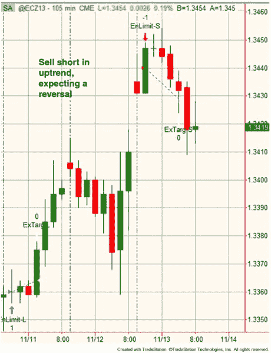
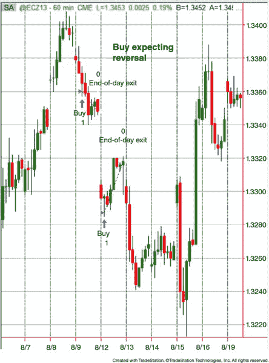
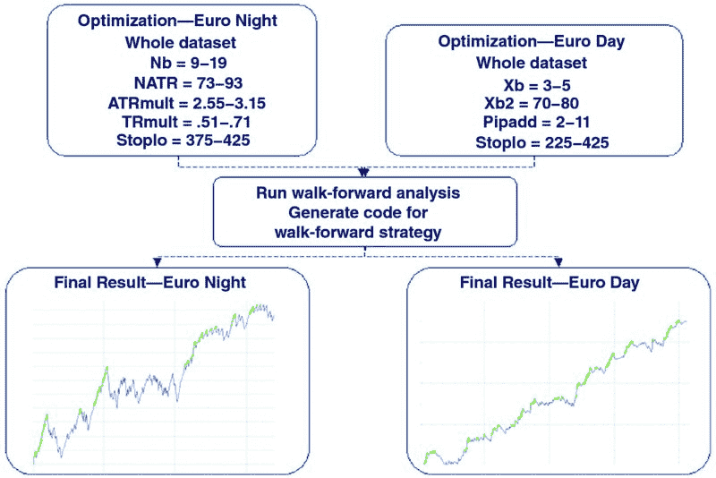
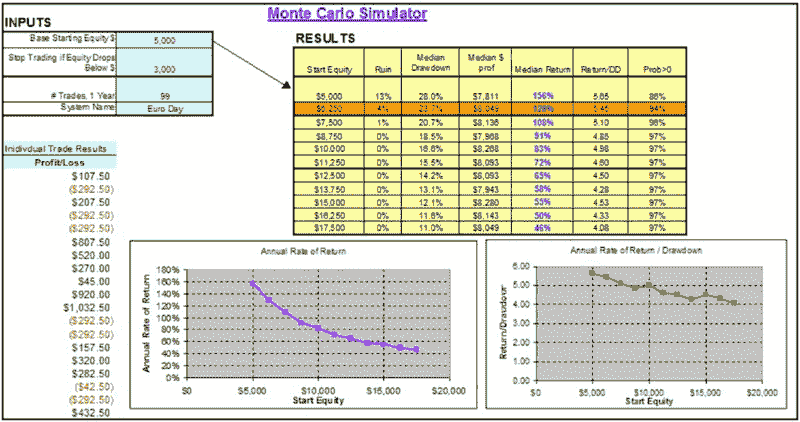
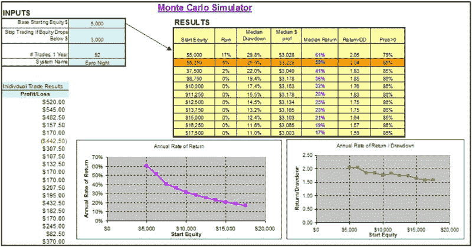
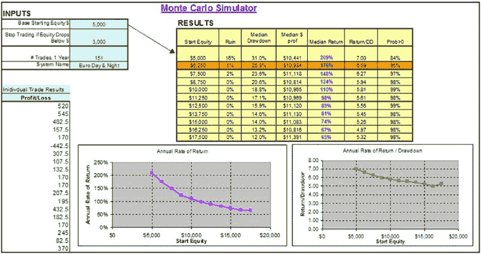
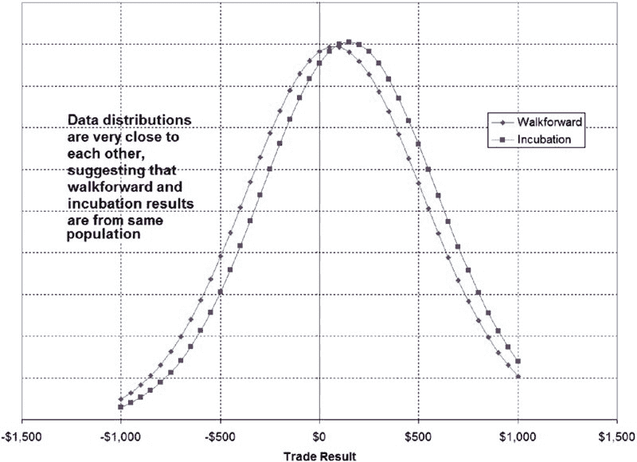
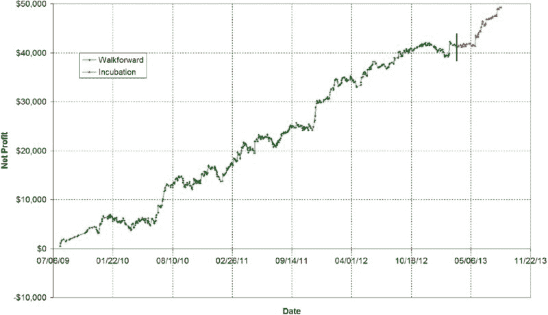

# 第四部分

创建系统

# 第十八章

目标、初始和前向测试

现在我已经向你介绍了我使用的策略开发过程，我认为为你详细说明我在 2013 年 3 月创建的两个策略的开发过程是有益的，并且我在 2013 年 8 月开始真实交易。如果你访问网站（[www.wiley.com/go/algotradingsystems](http://www.wiley.com/go/algotradingsystems)），你将看到这些策略的更新，假设我仍在交易它们，或者如果我决定停止交易，则会有事后分析。

接下来的章节将引导你完成这个过程，之后第二十四章将在我进行实时交易时提供运行评论和更新。

##  开发新策略

和所有新的交易策略一样，我首先设定一个 SMART 目标：

“我想为欧元货币创建一个日内策略，该策略能够获得 50%的年回报，且中位数最大回撤（通过蒙特卡洛模拟确定）为 25%或更少，回报与回撤比为 2.0 或更好。该系统（可能包含多个独立策略）应在其交易的 55%以上的日子里盈利。这个交易系统每天最多进行两次交易。我将给自己一个月的开发时间来完成这个任务（2013 年 3 月底），如果到那时我没有系统，我将继续下一个想法。”

这个目标是否足够成为一个 SMART 目标？让我们来看看：

+   ***特定性***。日内欧元策略，具有具体的绩效目标。是的，它是具体的。事实上，它可能过于具体——这是一个相当长的目标声明。

+   ***可测量性***。50%的年回报，最大回撤少于 25%，回报/回撤比大于 2.0，55%的胜率。是的，针对这些基准衡量绩效将非常容易。

+   ***可实现性***。50%的年回报，最大回撤少于 25%，回报/回撤比大于 2.0。当我刚开始开发系统时，这些目标非常雄心勃勃。事实证明，以*正确*的方式开发策略是相当困难的。许多人会嘲笑这些数字，因为与一个优化良好的策略相比，它们似乎很小。不过，记住，一个看起来很棒的回测并不总是意味着太多。因此，是的，这里的目标是可实现的。最难的部分将是使该系统成为一个日内策略。

+   ***相关性***。我的目标声明中的一切都与该系统的发展相关。是的，它是相关的。

+   ***时间限制***。由于我将开发时间限制为一个月，因此这是一个时间限制的目标。这个时间限制也将防止我对一个不错的策略进行太多更改，这将防止过拟合和其他不良开发习惯。

一旦我确定了 SMART 目标，我就可以继续开发我的交易想法。

根据以往的开发经验，我知道日内系统的开发比长期波段系统要困难得多。在我看来，最佳的日内系统是那些交易频率较低、尽可能长时间顺势而为的系统。这使我倾向于一种相对快速止损的策略，但保留盈利直到交易日结束。为了获得最大的收益，这个系统应该在美国的交易日内进行交易，因为许多大幅波动发生在这个流动性极强的时间段。这个方法的问题在于，拥有许多小亏损和少数大盈利的系统不可避免地会有较低的胜率。为了抵消这一点，我可能需要另一种策略，一种拥有小盈利、较大亏损且胜率较高的策略。

正如你所看到的，思考我想要的系统类型确实帮助我找到了最佳的推进方式。经过进一步思考，我得出了以下结论：

为欧元货币创建两种策略，使用连续合约 @EC：

+   *策略 1：夜间策略“欧元夜”。* 从东部时间下午 6 点到早上 7 点，基于 105 分钟的 K 线。所有交易在早上 7 点之前平仓，以免干扰策略 2。该策略将专注于小盈利和较大的亏损，并且只会在东部时间凌晨 1 点之前发起交易（我总得睡觉，除非我将这个策略自动化）。

+   *策略 2：日间策略“欧元日”。* 从东部时间早上 7 点到下午 3 点，基于 60 分钟的 K 线，所有交易在下午 3 点之前平仓。交易日结束于下午 5 点，但我将在下午 3 点关闭所有交易，因为从下午 3 点到下午 5 点的交易量要少得多。

在测试期间，由于我使用的是小 K 线，我将只回测至 2009 年 1 月 1 日。通常，对于波段系统，我会使用 5 到 10 年的历史数据，这意味着这是我稍微不同的方法。这也避免了我在 2008 年金融危机期间进行测试，这可能会使开发更加困难。因此，请注意，以某种方式，我在这个策略开发中采取了一些捷径，因为我（1）只使用了大约 4 年的历史数据，以及（2）避免了重大市场事件。我意识到这些捷径会导致一个不如可能的系统那么稳健，但这是我愿意接受的牺牲。策略开发充满了这些权衡，解决它们并不总是有正确的方法。有时你只需要尝试一下，看看会发生什么，而这正是我在这里所做的。

现在我已经建立了初步信息，可以继续制定进出场规则。我将从出场规则开始，因为与入场规则相比，它们相对固定。对于两种策略，我希望每笔交易的损失不超过 $450，考虑到每笔交易的滑点和 $17.50 的佣金。这相当于损失 34 个点。当我进行详细开发时，我会允许这个止损金额低于 34 个点，但绝不会超过。

在获利方面，对于两种策略，我将允许欧元夜间策略的利润目标进行优化，而欧元日策略固定为$5,000。由于欧元从未出现过$5,000 的日内波动，因此$5,000 的限额实际上是在说：“尽可能多获利，持有到交易结束。”

对于两种策略，最终的退出将是在交易结束时平掉所有未平仓交易。这将是一个严格的退出，不需要优化。

随着简单的退出方式得到牢固确立，使这些策略成功的关键在于入场。在经过一些初步检查和测试后，显然反转型入场将是两种策略的最佳选择。反转入场的一个示例见于图 18.1，其思想是在价格停止并反转之前捕捉到一次向上或向下的波动。这使得这些策略成为一种均值回归类型，因为你是在逆趋势入场，并寄希望于它在转变为相反方向的趋势之前反转。

**图 18.1** 反转入场示例

对于策略 1，即欧元夜间策略，多头入场是基于之前 X 根 K 线的平均高点，减去平均真实范围的一个倍数。当然，短入场的确切相反也适用。见图 18.1。

对于策略 2，即欧元日策略，当过去 Y 根 K 线的最高点被触及，且 X 根 K 线的动量向下时，将在当前高点上方 Z 个点设置卖空限价单。对于多头交易，逻辑正好相反。因此，为了成交，该策略计划在价格反转之前再进行一次价格推动。示例入场见于图 18.2。

**图 18.2** 欧元日策略入场示例

我认为我的优势到底是什么？基于我所采用的反转入场策略，我觉得我的优势在于识别非常短期（针对夜间策略 1）和中期（针对日间策略 2）价格可能反转的区域。通过在当前市场远离的地方设置限价单，我将我的优势比作橡皮筋。它不断拉伸，直到我获得限价成交，然后反弹回来，为我带来利润。当然，如果橡皮筋在我的订单成交后继续拉伸，那就意味着我的前提是错误的，我将以全额止损或在交易结束时损失的代价付出。

随着策略的基本结构以及入场和出场到位，我现在可以开始初步测试。

##  有限测试

对于有限测试，我选择只查看 2009 年的结果。由于我的全面测试将覆盖 2009 年至今，我使用大约 25%的数据进行初步测试。这将为我的策略是否可行提供一个良好的指示。请记住，通过这些测试，我在寻找我的入场、退出以及入场和退出组合是否运作良好的总体指示。

*入场测试—固定止损和目标.* 此测试的结果以及所有其他有限测试的结果见表 18.1。所有结果均可接受，这使我可以进入深入测试阶段。

**表 18.1** 有限测试总结，欧元日和夜系统

|  | 欧元夜 | 欧元日 |
| --- | --- | --- |
| **入场测试—固定止损和目标** | 82%的优化是盈利的 | 76%的优化是盈利的 |
| **入场测试—固定条形退出** | 一到五根条形后退出 >> 良好 | 一到五根条形后退出 >> 良好 |
| **退出测试—相似方法入场** | 一般的均值回归限价入场 >> 可接受 | 一般的均值回归限价入场 >> 可接受 |
| **核心系统测试** | 85%的优化是盈利的 | 81%的优化是盈利的 |
| **猴子测试** | 入场优于随机 | 入场优于随机 |
|  | 退出优于随机 | 退出优于随机 |

*入场测试—固定条形退出.* 结果看起来不错，让我认为我的入场可能在某种程度上有优势。

*退出测试—相似方法入场.* 为了测试退出，我创建了一个风格相似的入场条件（均值回归限价单）。如果结果良好，会让我对我选择的退出多一些信心。结果确实看起来不错。

*核心系统测试.* 此测试是对整个系统的温和优化，入场和退出条件协同工作。结果表明系统表现良好，适合进一步研究。

*猴子测试.* 这种随机测试在某些情况下非常有用。其他时候，它并没有提供任何额外信息。这里就是这种情况。

*有限测试总结.* 两种策略通过了我进行的所有测试，因此这些策略可以进一步推进。请注意，这是例外，而不是常规。大多数情况下，结果会差到不需要进一步测试，你可以直接进入下一个想法。在少数情况下，结果将是一般的，你可能会添加规则或过滤器以获得更好的结果。在非常少见的情况下，策略第一次通过时会是可接受的，这就是这里发生的情况。随着你在创建和测试想法方面积累经验，你会发现越来越多的策略会落入这个第三类。然而，在你发展旅程的开始，计划丢弃许多无用的策略，并对其余的大多数添加规则和条件。

##  向前测试

限定测试完成后，我现在可以进行详细的步进测试。这包括运行完整的优化，然后进行步进分析。图 18.3 展示了这个过程。

**图 18.3** 步进测试，欧洲日间和夜间策略

# 第十九章

蒙特卡洛测试和孵化

完成步进测试后，基于结果我确信我有一个可行的策略。步进测试的权益曲线看起来很好，但与此同时我意识到未来的权益曲线不可能与过去的权益曲线完全相同。我希望，以及此阶段所有开发者的希望，是权益曲线的组成部分（即，单个交易）与步进历史大致相同。想象这一点最简单的方法是考虑平均交易利润及其标准差（散布）。如果这两个值中的任何一个显著变化，系统在未来可能会失败。例如，如果平均交易变为负值，未来的表现显然会是负面的。同样，如果标准差增加，回撤可能会更加严重，系统在进行头寸管理时会更难操作， resulting equity curve 可能会让你感到更多焦虑。

假设步进交易表现将在未来持续，那么观察未来表现如何随时间变化将变得有用。对于这个分析，我通过蒙特卡洛分析模拟了一年的交易。

##  欧洲日间策略

如第七章所述，进行简单蒙特卡洛分析所需的唯一信息是：

+   起始权益

+   退出点权益

+   一年中的交易次数

+   单个交易结果

对于你进行的任何模拟，你可能希望模拟超过一年的交易，或者你可能希望包含头寸管理，甚至可能希望消除退出点权益——即你停止交易的点。这些细节将是你随着时间推移逐渐发展出来的，因为你会确定你在模拟中喜欢和不喜欢的东西。我使用的确切方法可能不适合你，这没关系。

一旦我获得了所有蒙特卡洛模拟的输入，我只需将它们输入电子表格并按下“计算”按钮。结果如图 19.1 所示。对于日间策略，如果我将破产风险保持在 10% 以下（这是我个人的破产阈值），我发现我需要 $6,250 来开始交易这个系统，并且在“平均”一年里，我可以期待：

+   23.7% 的最大回撤

+   129% 的收益率

+   5.45 的收益/回撤比

**图 19.1** 蒙特卡洛结果，欧洲日间策略

另一个值得关注的点是，我在第一年有 4%的破产风险，这时我的资产会低于$3,000。我在第一年也有 94%的赚钱概率（即年末超过$6,250）。

根据我的目标和目的，所有这些参数都是可接受的，我认为蒙特卡罗模拟结果是成功的。请注意，基于你的目标和目的，这个系统——以$6,250 的起始资本——可能对你来说不够好。例如，许多人希望破产风险接近 0%。其他人可能觉得 25.5%的最大回撤过高。关键在于，适合我的可能不适合你。这就是我认为制定自己目标和目的如此重要的原因。最终，你需要对自己制定的交易策略感到舒适，而交易不适合你的东西无疑是灾难的处方。

##  欧元夜间策略

现在，我将对欧元夜间策略执行完全相同的程序。结果如图 19.2 所示。对于夜间策略，如果我再次将破产风险保持在 10%以下，我发现我需要$6,250 来开始交易该系统，在“平均”年份中我可以预期：

+   25.0%的最大回撤

+   52%的回报率

+   2.0 的回报/回撤比

**图 19.2** 蒙特卡罗结果，欧元夜间策略

另一个值得关注的点是，我在第一年有 6%的破产风险，这时我的资产会低于$3,000。我在第一年也有 85%的赚钱概率（即年末超过$6,250）。

请注意，这一策略远不如欧元日间策略好。我预料到这一点是因为夜间策略的目标。如果你还记得，我在寻找更高获胜率的策略，而不是一定要盈利的策略。尽管如此，夜间策略本身达到了我的目标，尽管其回报/回撤比只有 2.0，处于可接受的低端。但由于它符合我的标准，我可以继续进行最后的蒙特卡罗步骤。

##  欧元日夜策略

虽然知道任一策略都满足我的绩效标准很不错，但对我而言，更重要的是日夜结合策略的表现。然而，在进行蒙特卡罗分析之前，我必须进行一些数据处理。在之前的模拟中，我使用了单个交易作为输入，这样工作得很好。但对于结合策略，我该如何确保正确的交易比例和分布，以反映当我同时交易这两种策略时实际发生的情况呢？有些日子，仅一种策略会交易，而在其他日子，两种策略都会交易。我希望在组合模拟中保留这一点。

将策略结合为一个策略的解决方案是使用每日结果，而不是单个交易结果。这样在特定日的净结果将视为一个系统的结果。关于这一点的示例见于表 19.1 的“结合”列。

**表 19.1** 将多个系统的每日结果结合成“一个”系统

| 日期 | 欧元白天 | 欧元夜间 | 结合 |
| --- | --- | --- | --- |
| 2013 年 9 月 9 日 | +$100 |  | +$100 |
| 2013 年 9 月 10 日 |  | +$600 | +$600 |
| 2013 年 9 月 11 日 | +$100 | +$250 | +$350 |
| 2013 年 9 月 12 日 | −$400 | −$50 | −$450 |
| 2013 年 9 月 13 日 |  | +$100 | +$100 |

通过利用这个技术，我们保留了每个策略交易的特征，并将它们结合成每日交易。类似的方法可以用于将任意两个或多个系统合并为一个策略。只需将结果整理为每日结果，并在模拟中使用即可。

一旦我将交易数据整理为每日结果，就可以对结合的欧元白天和夜间策略进行蒙特卡洛分析。结果如图 19.3 所示。对于结合的策略，如果我再次将破产风险控制在 10%以下，我发现我需要$6,250 来开始交易该系统，并且在一个“平均”的年份，我可以期待：

+   25.8%的最大回撤

+   176%的回报率

+   6.6 的回报/回撤比

**图 19.3** 蒙特卡洛结果，两种策略结合

其他有趣的点是，在第一年我有 5%的破产风险，届时我的权益会降到$3,000 以下。我在第一年还有 95%的概率盈利（即，年末的金额超过$6,250）。

此次综合分析中最有趣的方面是，结合系统的表现优于单独每个系统。我再说一遍：*结合系统的表现优于单独每个系统。* 这归因于多样化效应，我在第十五章中讨论过。回报与回撤比，我在蒙特卡洛分析中的主要指标，从 5.5 提高到 6.6，这是一个相当大的增长。这是因为通过同时交易两个系统，我获得了策略的综合回报，但在下行方面，回撤并不会合并。相反，当一个策略经历回撤时，另一个策略可能正在达到新的权益高点（或者至少没有达到新的最大回撤）。通过交易不相关的策略实现多样化正是使这一切成为可能的原因。

从整体上看蒙特卡洛分析，我的所有绩效目标和指标都在结合系统中得到了满足。因此，我将此分析视为“通过”，并可以继续下一步：孵化。

##  孵化

到目前为止，我大约有 3.5 年的走向前推回测历史。除此之外，我还有大约 5 个月的“孵化”结果，观察欧元白天和晚上的系统实时表现，且没有对原始代码做任何更改（除了定期重新优化）。

+   走向前推结果：2009 年 7 月–2013 年 3 月

+   孵化结果：2013 年 3 月–2013 年 8 月

如果过去 5 个月的孵化结果“看起来”与走向前推结果相似，我应该感到舒服地让策略上线。

##  结果相似吗？

这是我判断孵化和走向前推数据是否“匹配”的方法。请记住，我不是统计学家，所以我倾向于保持简单，冒着没有 100%数学和科学严谨的风险。不过，我所做的通过了常识测试。我使用三种方法检查匹配情况：

1.  *学生 t 分布检验。* 这个统计检验将告诉你两个数据组（走向前推结果和孵化结果）是否显著不同。

    你可以很轻松地在 Excel 中做到这一点（使用 TTest 函数），或者通过谷歌搜索找到在线 t 检验。

    当我进行这个测试时，它告诉我这些分布不不同的概率为 56%。这让我合理地相信这些策略在实时表现与历史表现相同。然而，如果策略不同的概率为 0 到 20%，我可能会认真怀疑自己是否犯了测试开发错误。

1.  *数据分布比较。* 我创建了两个数据的直方图。第一个是实际数据，我将走向前推和孵化结果叠加在一起。它们看起来重叠吗？第二个图表绘制了基于均值和标准差的理论正态曲线直方图。我在图 19.4 中看到了一定程度的重叠。

1.  *权益曲线比较。* 这是我最喜欢的方法，但并不是非常科学或数学。我只是绘制所有数据并创建一条权益曲线。当我这样做时，我能否看到走向前推结束和孵化开始的地方？如果能，这表明孵化开始时发生了某些事情，这通常是个坏事。如果你对这个方法感到疑惑，只需创建一个带有优化参数的策略，然后让它运行一段时间。大多数时候，你会注意到曲线的变化。我在图 19.5 中看到的孵化部分曲线没有剧烈变化，这是个好迹象！

**图 19.4** 孵化结果—数据分布比较

**图 19.5** 孵化结果—权益曲线比较

基于这项分析，我可以说该系统在孵化阶段的表现与其前向测试时相同。实际上，孵化阶段的表现优于前向测试，这让我有点担忧（通常情况正好相反）。但它的接近程度让我有信心在开发测试中没有出错。这并不保证当我上线时系统会盈利——这点很重要。

##  最终信息

一旦所有测试完成，我就可以决定是否继续交易该系统。即使策略通过了所有开发步骤，我仍然可能决定不交易它。头寸规模和与其他策略的相关性是我可能决定不交易特定策略的两个原因。

##  头寸规模

尽管我在第十六章中更详细地讨论了头寸规模，但我并没有为任何特定的头寸规模方法设计这个策略。当然，这是在我开始用真钱交易之前需要考虑的重要事项。一个策略可以很好，但如果无法合理应用头寸规模，可能就不值得用真钱交易。当单合约损失过大，而交易该策略所需的账户规模又极大时，这种情况就会发生。

一个例子是一个与我开发并交易多年非常相似的系统。这个系统在 50%的交易中每合约盈利$5,000，而在另外 50%的交易中每合约亏损$3,000。因此，每笔交易的平均盈亏为$1,000，Tharp 预期为 0.33，显示出这是一个相当不错的系统。但要交易这样的系统需要多少钱？假设该策略每年交易 20 次，退出权益点为$3,000，你需要一个$20,000 的账户才能仅有 6%的破产几率。此外，你的最大回撤可能会达到 33%。这对我们许多人来说太多了。为了将回撤降低到 25%以下，需要一个$35,000 的账户。这可能使这个系统超出大多数交易者的可及范围。请记住，这仅仅是交易一个合约。使用任何类型的头寸规模都会使这些回撤和破产数字变得更糟。因此，在你的开发过程中，你可能最终会得到一个盈利的系统，但你却无法交易。

##  与其他策略的相关性

在我开始实时交易策略之前，我总是会检查新系统的表现与我已经交易的系统。我进行每日收益的简单相关性分析。这将告诉我新策略是否与我现有的任何策略高度相关。显然，交易两个高度相关的策略并不是一个好主意，除非你将每个策略的仓位大小减半。否则，你可能会在特定市场或特定交易风格上面临过多的风险。对于独立开发的策略，这通常不是问题，但检查一下总是好的。

##  蒙特卡罗——一致性

进行蒙特卡罗分析的一个有趣的附带好处是你可以了解自己的盈利一致性。想象一下你是一个赌场的经理。在五分钟内，你的赌场可能在赌桌上赢或亏。结果存在一定的随机性，因此即使赌场在短时间内也可能会亏损。随着时间的增加，你的盈利机会会提高，最终接近于确定性。你的赌场每周可能都会赚钱，几乎可以肯定每个月都会赚钱——当然，前提是黑暗势力没有从你那里抽水！

赌场的概念让我思考，我真的希望我的交易系统在一周、一个月或一年内都是盈利的。显然，这取决于我的“轮盘赌”——我的交易系统以及它提供的优势。如果我假设我的历史结果将与未来结果相匹配，我可以使用蒙特卡罗分析来确定我的盈利机会。从这个数字中，我可以确定自己在任何给定时间段内的盈利一致性。

运用这个想法，我对我的欧元昼夜系统进行了分析。在我揭示结果之前，请记住，这个系统平均每年将产生$10,000 到$12,000 的利润。这个系统相当不错。但它能否提供稳定的回报流？以下是结果显示的内容：

+   *每周*——59.6%的周应该是盈利的。因此，在一年内，我应该有 31 周赚钱，21 周亏钱。这样可以，但并不是谋生的好方法。

+   *每月*——74.8%的月应该是盈利的。在一年中，有三个月会是亏损月。同样，这并不是非常稳定的回报——如果这三个月连续亏损怎么办？

+   *每季度*——86.2%的季度应该是盈利的。我喜欢这个。

+   *每年*——98.8%的年应该是盈利的。在 30 到 40 年的交易生涯中，只有一年亏损。这非常不错。分析表明，如果我能接受每周和每月的不确定性，那么几乎每年我都将获得至少一些利润。

显然，在我进行这项分析之前，我必须做一些简化假设。例如，我的交易系统平均每年有 151 笔交易。这相当于平均每周三笔交易。然而，任何一周的实际交易数量可能为零、五笔或介于两者之间。每周强制三笔交易会导致一些误差。但我认为这不会对结果产生太大影响。如果我希望 90%的周都是盈利的，那么显然我的策略就无法实现，无论我做了什么假设。

下一个显而易见的问题是：“我应该为每个时间段设定什么数字？”这将取决于交易者及其目标和目的。习惯于每月发工资的交易者可能需要 95%的盈利周，或者每年不超过三周亏损。他可能知道，超过这个亏损周数会导致被驱逐。而专业的商品交易顾问（CTA）通常按月进行评估，因此她可能希望 95%的月份是盈利的。不过，长期交易者可能只关心盈利的季度或盈利的年度。这一切都取决于交易者的具体情况。

为了更进一步分析，随着你在投资组合中增加良好系统，盈利周期的机会也会增加。就像赌场增加新的桌面游戏以补充轮盘赌一样。

##  消除大日子

从历史中消除异常交易对结果有很大影响。在历史中，共有 614 个交易日。盈利超过$1,000 的交易日有 20 天。在一年交易中，我预计会看到 5 个这样的“大”日子。如果没有这些，系统的平均盈利能力将仅略有盈利。我的结论是，如果没有这些大盈利日，我将陷入严重困境。问题是：我是否有理由不期待未来会出现这种日子？也许我的系统规则和变量基本上是为了寻找这些大交易而进行了曲线拟合。考虑到 10 到 20 笔大交易，我想这是一个明显的可能性。然而，这些交易并不是由于数据异常或某些回测问题造成的。策略 2（欧元日）是专门设定的，以让盈利持续，而不是进行限制。如果我只看到少量大盈利交易，我可能会怀疑存在某种数据或回测问题。

还有一个有趣的问题：既然我依赖这些“异常值”来产生大部分盈利，那么在特定年份我能看到很多这样的交易的可能性有多大？

##  异常日

既然我知道我的系统表现将由大盈利交易（异常值）驱动，那么看看在一个交易年中我可以期望看到多少这样的交易就很有趣。以下是我发现的：

+   一年内，我可能会看到四到六笔大盈利交易。这意味着每隔一个月只有一笔大盈利交易！

+   每年出现八笔或更多大盈利交易的机会不到 10%（实际上是 6.6%）。

+   在一年内，我只有零、一或两个大赢家的概率为 13.6%。

这个分析有点令人清醒，它明确了一件事：如果我想在这个系统中取得成功，我必须参与每一笔交易，因为我错过的那一笔可能就是一年中仅出现一次的大赢家。

基于这些数据，我对系统的期望是会有许多平稳或略微上升或下降的时期，偶尔会出现一个大赢家。知道这一点为什么重要？拥有正确的期望对长期成功至关重要。当我没有立即获利时，我不能感到沮丧或失去对系统的信心。知道该期待什么将对我大有帮助，尤其是在我看到每天发生的事情很少时。
