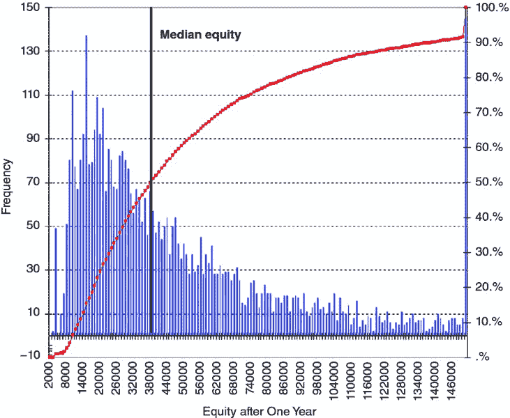
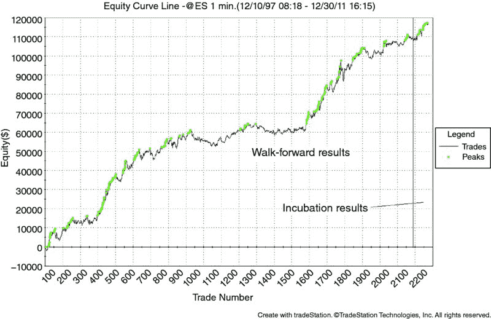

# 第五部分

上线前的注意事项

# 第二十章

账户和仓位规模

既然我已经开发了一个策略，并在实时中观察了一段时间，并决定用自己的资金进行交易，那么接下来该怎么做？我该如何确定账户的资金量？我该如何设定仓位？我应该从小开始还是从大开始？我有仓位规模方案吗？如果情况变坏，我什么时候停止交易这个系统？

在 2013 年 8 月中旬的孵化期结束时，我完全不知道这个系统在接下来的几个月会如何表现。我的希望一如既往，希望它能表现出色，但和任何策略一样，我总是准备好在必要时止损并停止交易。

为了避免后续混淆，以下是我的策略总结：

欧元交易系统中的两种交易策略：

+   *策略 1：欧元夜。* 交易过夜时段，胜率高，有很多小赢和偶尔的大亏损。使用 105 分钟 K 线。

+   *策略 2：欧元日。* 交易日间时段，胜率较低，主要盈利来源。使用 60 分钟 K 线。

    +   两种策略是独立的，我在任何给定时间只会使用一种。

    +   市场：欧元货币期货（6E）。

##  何时退出

既然我决定从 2013 年 8 月 20 日星期一开始实时交易我的欧元策略，我必须面对一个大家在开始交易新策略时喜欢回避的问题：如果情况变坏，我什么时候停止交易这个策略？

你可以使用的退出交易系统的条件可能有百万种。你可以设定一个美元金额，或可能等到收到保证金通知，或等到资金耗尽。你可以在连续 X 次亏损后停止，或在 X 个月亏损后停止。没有“一个”正确或错误的答案。

但设定退出点有三个关键：

1.  这应基于你所交易的系统。例如，如果历史上系统曾经历 25%的回撤，那么在 10%的回撤后退出就毫无意义。这看起来显而易见，但你会惊讶于有多少人做出这样的任意决定，而没有考虑实际系统的特征。

1.  写下来。经常参考。记住它。这可能在某一天拯救你免于灾难。

1.  遵循它。如果/当书面标准（不幸地）被满足时，*停止交易。* 这是一个简单但*非常*困难的步骤。

我并不总是使用相同的标准来找到我的退出点，但这是我对欧元系统的做法：

1.  查看前向历史，找到发生的最坏回撤（以日为基础）。将其乘以 1.5，因为最坏的回撤几乎总是发生在未来。对我的系统来说，这个最坏的回撤是$3,265。将其乘以 1.5 得到$4,898。

1.  使用蒙特卡洛模拟找到 95%的最大回撤水平。这意味着，在一年的交易中，95%的时间我的最大回撤将小于这个金额。结果是$5,082。（如果我想更保守一点，可以使用 99%的水平。那个回撤是$6,512。）

我应该指出，这些回撤数字假设在整个交易过程中只交易一份合约。然而，随着时间的推移，我希望能够交易多于一份合约。这可能会造成混淆——我的实际回撤（涉及多份合约）可能远大于基于一份合约的回撤限制。我只需要记住计算一份合约的回撤，并将其与$5,000 的限制进行比较。这在我建立监控系统时会更加清晰。

根据上述 A 点和 B 点的结果，我将取其平均值，并在单一合约回撤达到$5,000（略微调整）时停止交易。我已经遵循了上述的第 1 点和第 2 点。时间会证明我是否遵循第 3 点——如果需要的话，我会更好地去遵循！

对于这个特定系统，我考虑的唯一退出点是单一合约的回撤。这是简单且相当稳健的。如果我在几年后仍在交易该系统，并且交易多份合约（当然，这是我的希望），我仍将保持每份合约$5,000 的最大回撤限制。

在过去，我曾利用蒙特卡洛模拟的结果帮助我决定何时退出。我也考察过一个基于市场波动的临时退出点，但从未实施。当市场变得非常疯狂时，最好可能是休息一下。我认为没有错误的指标或指标组合可以用来决定何时停止交易。可能也没有“一个适合所有人”的最佳方案。在我看来，关键是选择一些你感到舒适的标准，将其写下来，然后严格遵循。如果你的系统失败，应该没有眼泪。你知道系统可能会崩溃，而你在预定的时点退出。

我认为人们遇到麻烦的地方在于没有“退出点”，或者他们的退出点是在资金耗尽时。以我在 1990 年代末的个人经历来说，交易到资金耗尽而被迫退出并不是一种愉快的方式。

当系统表现既不糟糕到达你的退出点，也不优秀，处于两者之间时，会发生什么？也许它正在赚钱，或者持平，并且在蒙特卡洛模拟所说的可能范围内。你什么时候退出，或者停止交易该系统？我的一般哲学是关注下行风险，让上行自然而然。在这种情况下，我关注最大回撤，只要没有触及，就让系统继续运作。我这样做是因为我无法预测每个月或每年我所交易的特定系统会表现良好、表现不佳，还是仅仅是持平。通常，我会让系统保持原样，而不是随意开关。

但是每年我会几次重新平衡我正在交易的系统——添加新的系统，淘汰表现不佳的系统，并可能调整头寸规模。如果资本成为一个问题，我可能会停止交易，并用一个我认为更有潜力的系统替换掉一个表现微薄但盈利的系统。分析的细节从来都不相同，我对此没有严格的规则。例如，我可能会因为某种原因不再喜欢某个系统而停止交易——也许它不再适合我。

我意识到我在这里有些矛盾。一方面我说：“最大回撤是我唯一的退出标准。”另一方面我说：“除非我有其他合理的理由停止交易。”我通过说最大回撤是一个严格、明确、最坏情况的标准来合理化这一点，并且不会被违反。然而，同时可能会出现其他情况，使得系统不再受欢迎。这些情况可能会导致我更早退出。这是一个很大的灰色地带，遗憾的是大多数交易的事情都是如此。

我可以说我在交易开始时的计划仅包括最大回撤作为退出的唯一标准。由于我使用的小规模和账户规模，我无法预见到需要更多资金来进行更好的系统交易。但我也足够灵活，意识到情况可能会导致我在某个时候调整退出点。

##  最低资金规模

在这一点上，我已经确定（1）我将开始日夜进行欧元系统的实盘交易，以及（2）如果我的单合约回撤达到$5,000，我将停止交易。现在我将确定账户规模。这一点相当重要。启动资金太少，我可能在达到退出点之前就用完资金。资金太多，我的回报率会降低，并且资本配置效率低。目前，欧元货币的交易初始保证金是$2,750。所以，将这加到我的“退出点”回撤上，我得到$7,750。这是我应该开始的最低账户规模。这将允许我交易直到达到最大回撤。

几个重要的考虑点：

+   我假设我的经纪人要求交易所保证金，即使是日内交易。如果我能接触到日内交易的利率，我可以用更少的资金进行交易。然而，这总是一个风险很大的提议，因为许多人只是因为较低的日内交易保证金而增加自己的规模。这通常不是个好主意。

+   保证金可以并且会改变。如果交易所要求的保证金上升，我可能会被迫在达到退出点之前停止交易。

+   我假设我一直在交易一个合约。

事实证明，我希望账户中有超过$7,750 的资金，因为考虑到头寸规模的原因。我将使用$8,500，原因将在后面揭示。

##  头寸规模

如果你有一个好的交易系统，最终你会想用多个合约进行交易。市面上有很多头寸规模方案（范·萨普写过一本关于这个主题的大书），所以没有绝对正确的方法。尽管如此，并不存在一种“圣杯”头寸规模技术，可以在不增加风险的情况下获得更多的回报。简单来说，如果你交易更多合约，你的回报会增加，但风险也会随之增加。

我现在的做法是这样的（至少暂时如此；希望等我的规模变大后，我会变得不那么激进）：

一如既往，我只从一个合约开始。为什么？实时交易几乎总是暴露出回测、模拟测试和孵化测试隐藏的问题。例如，如果我的策略是自动化的，如果我的代码中有一些小问题导致发送多个订单或其他错误呢？或者，如果我的滑点估计完全偏离，实际的滑点使我的策略变得无利可图呢？我的经验是，从一个合约开始是发现并纠正任何实时交易问题的最便宜的方法。

我喜欢从一个合约开始的第二个原因是，我希望尽可能与策略表现保持情感上的脱离。一个合约的盈亏波动不会影响我或我的情绪。立刻用十个合约交易会让我有点紧张——我会过于关注系统，投入太多情感。当利润（希望如此）积累时，我可以在一个舒适的水平上增加合约，而不会受到情感的困扰。如果事情进展顺利，六个月或一年甚至两年后，同时用这个经过验证的系统交易十个合约对我来说会变得自然。

有些人会说：“如果你有优势，就要迅速而猛烈地利用它，立刻进行最大规模的交易。优势会消失，所以要趁它存在时好好利用。”这是个不错的论点，我理解这个概念。但我也知道自己最佳的操作方式，刚开始就“全力以赴”对我心理上并不好。当然，你应该选择自己感到最舒适的方法。

我喜欢从一个合约开始的最后一个原因是，我希望这个策略是自我生成的——利润将增加账户，导致更多合约，进一步扩大，再引发更多合约，依此类推。没有利润就意味着规模不增长。这对我来说很有道理；为什么要将更多资金分配给一个没有产生利润的系统呢？

这种方法的一个缺点是添加第二个合同时可能需要很长时间。例如，如果你决定每有$10,000 在账户中就交易一个合约，你将需要 100%的回报才能添加一个合约。然后你还需要再获得 50%的收益才能添加第三个合约。这可能需要很长时间。一些头寸规模技术考虑到了这一点（固定比例规模浮现在脑海中），但这些方法有一些我不喜欢的负面特征。我通过将我的账户规模设置为大约 1.5 到 2 个合约来解决这个困境。这相当于我刚才给出的例子中以$15,000 开始。然后，我只需 50%的收益就能添加第二个合约。这仍然迫使系统表现良好，同时我能更早地获得合约增长。对我来说，这是一个很好的权衡。

考虑到所有这些，以下是详细信息：

对于我的欧元系统，我决定使用固定分数规模。

*N*[合约] = *X* * 权益/大亏损

+   其中

    +   *N*[合约] = 合约的整数数量，总是向下取整。

    +   *X* = 固定比例，我通过蒙特卡洛分析确定。对于这个系统，我使用 0.175（稍后我会解释我是如何得到这个数值的）。

    +   权益 = 当前权益价值。

    +   大亏损 = 最大日亏损，对于我的欧元系统为$885。

基于之前的内容，我可以创建表 20.1。

**表 20.1** 头寸规模表

| ff = | 0.175 |
| --- | --- |
| 权益 | *N*[合约] |
| < $10,114 | 1 |
| $10,114 | 2 |
| $15,171 | 3 |
| $20,229 | 4 |
| $25,286 | 5 |
| $30,343 | 6 |
| $35,400 | 7 |
| $40,457 | 8 |
| $45,514 | 9 |
| $50,571 | 10 |

请注意，我的固定比例 0.175 可能看起来非常高。对大多数人来说可能确实如此。我是根据破产风险、年回报和最大回撤来确定的。我使用我的蒙特卡洛电子表格计算所有这些。根据迄今为止的头寸规模分析，我确定使用固定分数规模，*X* = ff = 0.175 是我最好的选择。请理解，这是我的个人偏好，基于我的个人目标和宗旨，这个数值可能并不适合你。

问题是，我是如何得出这个数字的？为什么不总是交易一个合约，或者使用固定分数值 0.01、0.02、0.10 或 0.50？为了确定适合我的头寸规模方案，我使用了我的蒙特卡洛模拟器，您可以在网站上免费下载其基础（单合约）版本([www.wiley.com/go/algotradingsystems](http://www.wiley.com/go/algotradingsystems))。对于给定的交易系统，它将估计破产风险、中位数最大回撤和第一年的中位数年回报的概率。

这个计算器的基线版本假设一年内交易一个合约，但宏代码可以编辑以模拟不同的头寸规模技术，这正是我在这里所做的。

我关注四个绩效数字：

1.  *破产风险。* 我打到我设定的最低现金余额的可能性有多大。我希望这个数字低。

1.  *中位数最大回撤。* 我大约有 50%的机会在一年内达到这个最大回撤。这当然意味着我的最大回撤可能远高于这个值，也可能低于这个值。我希望它尽可能低，并且我根据多次进行此练习确定了个人的上限。

1.  *年回报率。* 与回撤一样，我有 50%的机会达到这个年回报率，它可能高得多或低得多。我希望它尽可能高，但没有可接受的下限阈值（尽管 40%是一个不错的值）。

1.  *回报/回撤比率。* 精明的读者会认出这是卡尔玛比率，尽管真正的卡尔玛比率是基于三年计算的，而不仅仅是一年。我希望这个值尽可能高，并且有一个可接受的下限。（仅供参考，对于专业商品交易顾问，卡尔玛比率超过 1 被认为相当不错。这意味着如果你想要 25%的年回报率，你必须愿意接受 25%的回撤）。

使用这些标准，我可以尝试几种不同的头寸规模方法，并使用一些不同的参数值。请注意，这并不是包罗万象的；我没有分析许多其他潜在的头寸规模方案。也许有一种方案会比我选择的方案更好。

在我揭示结果之前，我应该提到我对起始余额进行了一些调整，尽管我并没有展示那些中间结果。基本上，通过调整初始账户规模，我在账户中持有过多资金、能够相对快速地增加第二个合约（而不必先翻倍我的账户规模）以及保持低破产风险之间寻求平衡。我最终将起始余额定在$8,500，这在所有竞争指标中是一个不错的折衷。

这里是结果，我选择的方案被突出显示（“ff”是固定的分数金额）（见图 20.1）。

**图 20.1** 头寸规模结果

我的选择符合我所有的标准，我对此感到满意。这种头寸方案对我来说是正确的，正如现在的情况所示。*但是，* 根据情况的发展，我可能会在未来改变它，要么选择完全不同的方案，要么选择更小的 ff 值（即，随着账户的增长，我会变得不那么激进）。我会让系统的表现决定是否以及何时发生这种变化。

根据我选择的固定分数仓位，结果表明在一个“平均”年份（意味着 50%的年份会更糟，50%的年份会更好），我预计那一年获利 30,735 美元，并在一年内达到 38.1%的最大回撤。这个利润数字似乎有点过于美好……我的座右铭是“如果某事看起来太好以至于不真实，那它可能就是”。而且这个利润数字确实显得太好以至于不真实——第一年的 362%回报率看起来太高，这让我产生了怀疑。不过，请记住，实际的回报率可能在范围的任何地方。只是 362%是中位数值。

我现在查看可能的回报直方图，如图 20.2 所示。如果第一年的结果接近中位数结束权益（黑色垂直线），那将很有趣。如果达到 25%的标记，我也会很高兴，这相当于最终权益约$21,000，或 147%的年回报。几乎进入“太好以至于不真实”的区域，但这仍然是一个可能性。

**图 20.2** 可能的第一年回报直方图

##  不等仓位设置

我在我的欧元日夜系统中对两个策略使用相同的仓位设置，尽管策略 1 和 2 在很大程度上是不同的。它们唯一的共同点是止损点，每合约约$425（34 个点）。考虑到它们不同的交易分布，相同仓位大小的方法是否正确？也许这两个策略的仓位设置应该不同。可能这会改善整体绩效指标。

对于任何交易想法或突发的想法，我会保留判断，直到我进行测试和分析。数字会告诉我这是否值得做。我想，关键是没有情绪。我会省略一些分析的细节，但我主要关注“每交易两个合约的策略 1，换一个合约的策略 2”。

**结果**

+   当前方法（相同的仓位，两个策略）

+   账户规模：$8,500

+   最大回撤：38.1%

+   年回报：362%

+   2/1 仓位方法

+   账户规模：$12,500

+   最大回撤：38.3%（与当前方法相同）

+   年回报：255%

**结论：** 我需要更多资金在账户中来进行 2:1 的交易比例，而我的年回报会下降。所以这没有意义。

*注意：* 我进行了相当简单的分析得出这个结论。实际上，我应该让每个策略的固定分数仓位浮动，找到每个策略的最佳值。

# 第二十一章

交易心理

我经常听到来自自由裁量交易者的声音，谈话内容大致如下：

+   ** discretionary trader：** “我厌倦了亏损。我太情绪化，无法同时交易和做出交易决策。我想尝试算法交易。”

+   **我：** “你意识到需要改变你的亏损方式真是好事。你为什么认为算法交易会有效？”

+   **自主交易者：** “因为我可以像个无脑的按键者，只需跟随系统。就像《辛普森一家》中的那一集，霍默设定一个喝水的小鸟，持续敲击键盘上的“y”键，这样他就不必做任何实际工作。我想成为那个喝水的小鸟，只需跟随系统。”

+   **我：** “你知道那个喝水的小鸟最终停了下来，几乎导致了核泄漏，对吧？”

+   **自主交易者：** “哈？”

这大致总结了很多人认为机械交易中没有情感的观点。与自主交易不同，情感在算法交易中表现得不同，但在交易的许多不同方面都存在。算法交易的一个好处是，从理论上讲，你的情感不应该影响进出场信号。当然，关键字是理论上。实际上，情感可能在机械的、百分之百基于规则的交易的许多不同领域中潜入。在这一章中，我将指出一些主要领域，并提供如何最小化其影响的建议，因为就像自主交易一样，情感确实会严重影响算法交易者的表现。

##  何时开始交易

大多数人在决定启动算法策略时，往往不会考虑何时真正进入第一笔交易，直到他们实际操作。但正如我之前所说，在开放交易中间进入一个位置可能会带来情感上的波动。此外，如果你的系统有六个连续的赢家——你是在开始交易前等到出现一两个亏损交易吗？其实要解决的有两个问题：

1.  在查看其权益曲线后，你应该开始交易你的系统吗？

1.  你应该在一笔交易进行中开始交易你的系统，还是等待下一个新的入场信号？

就像交易中的大多数决策一样，没有绝对的对与错。但如果你在事前考虑问题并做出一致的决策，就可以在开始时消除很多情感因素。

假设你创建了一个交易系统，其权益曲线如图 21.1 所示（这是我用真钱交易的实际系统）。这是一个非常好的步进测试的权益曲线，并且它通过了你刚刚进行的几个月的孵化测试。系统处于权益高峰状态，你非常兴奋（这就是情感部分！）要开始交易。

**图 21.1** 示例步进权益曲线

乍一看，你看到新高，立即想到：“这是失控的火车，我必须现在上车！”这是可以理解的。然而，在某个时刻，那列火车会减速甚至反向。以股权高点开始交易新系统却立即遭遇亏损，真是一种糟糕的感觉。因此，也许最好等股权曲线稍微回调后再开始交易。当然，你也有可能面临没有显著回调的风险，想想你将错过多少利润！

从新高点开始交易或在回调后开始交易这两种方法各有情绪上的优缺点。在任何给定的系统中，没人真正知道最佳的方法是什么。在多个系统中，可能并不那么重要——一些策略在你开始交易后依然盈利，而其他策略则会立即出现亏损。对我个人而言，似乎大多数系统会立即出现亏损，但我觉得我忘记了那些股权曲线迅速上升的系统，只记得那些立刻亏损的系统。

鉴于这两种方法固有的情绪因素，最简单的做法是为所有未来开始交易的系统做出决策，并坚持下去。例如，你可以决定在四个月成功孵化后开始交易，而不管股权曲线是否处于高点、从亏损中恢复，还是介于两者之间。这样，有时你会对，有时会错，但开始交易应该是一个没有情绪的任务。

一旦你决定了开始交易的方法，你会意识到有一个现有的头寸需要考虑。你应该等待下一个新信号吗？还是应该进入当前的盈利或亏损头寸？情绪可能会影响这个决定。和股权曲线决策一样，最好提前决定，并让情绪远离。

进入现有交易的部分决定取决于你的软件和交易风格。一些自动化平台可能在识别手动输入的头寸时遇到困难。这可能导致你的退出信号无法触发。如果你的软件是这种情况，最好等下一个新入场信号。

你的交易风格在进入现有头寸时也起着作用。在一个快速的日内交易系统中，每天进行多次交易，答案很简单：只需等待下一个入场信号。由于信号出现频繁，几乎不会有太大的得失。然而，对于那些持仓数天、数周或数月的策略，情况则截然不同。这里的最佳方法是什么？如果头寸接近盈亏平衡，就手动进入。可能会让你多花几美元或赚到几美元，但从长远来看，这并不重要。

对于当前有很大收益或损失的未平仓头寸，决定变得更加复杂。这里哪种方法最好呢？有些人会想要进入一个正在盈利的交易，基于盈利交易会继续盈利的理论。这是有道理的，但进入一个盈利的交易可能会带来更大的风险。让我们来看一个例子。假设你的交易设置为盈利 500 美元或损失 250 美元，并且你从未改变利润目标或止损点。现在交易进行到一半，你有 300 美元的未实现利润。你应该进入吗？最初，你的风险收益比为 2:1，而进入交易中期后，你的风险收益比变为 200:550 或 0.36:1。尽管你在获得 200 美元收益之前遭受 550 美元损失的可能性比最初的 500 美元收益或 250 美元损失的可能性要高得多，但我会更关注下行风险。你可能会损失 550 美元，而不是 250 美元。问问自己是否愿意冒这个额外的损失。

同样的逻辑适用于亏损的未平仓交易。然而，在这种情况下，通过进入中途交易，你的损失会更少，潜在的收益可能会大得多。这是我在开始交易新系统时使用的方法：如果当前的未平仓交易是亏损的，我就会进入。如果它是盈利交易，我会等待下一个信号，或直到头寸回调至接近盈亏平衡。这种方法让我感到舒适。我对此没有情绪，不担心自己是否做出了正确的决定，我只是持续执行计划。对我来说，这才是关键点。

如你所见，使用算法系统“上线”会让你面临一些困惑和问题。多年来，我可能尝试过所有关于何时开始交易策略的选择组合。我经历过等待权益曲线回调的纯粹失望，却只看到系统持续上涨几个月。我也曾在开放头寸中立即遭受损失，而等待下一个入场信号会更好。同样，有时正好相反，我在这些决定中“获胜”。总体而言，我认为这并没有改善我的状况，反而导致了情感资本的损失。所以现在我有一个计划，提前确定，并且每个系统都是同样的开始。这消除了方程式中的所有情绪。

##  何时退出

一旦你确定了开始交易系统的方法，你就完成了一半的战斗。但是，你知道什么时候停止跟随这个新系统吗？情感在这里可能起着巨大的作用。无论你是跟随自己的交易系统，还是跟随顾问、通讯或其他服务，如果你没有停止跟随的退出计划，你真的需要制定一个。

为什么？研究表明，当人们处于压力之下时，他们往往会做出糟糕的决策。当然，如果你在系统中亏损，你会感到压力。因此，你可能会对亏损做出本能反应，或者选择逃避，完全避免做决定。这两种情况都是危险的。所以，在你亏损时，是决定何时停止交易策略的坏时机。

理想情况下，你在第一次决定交易系统时就应该确定何时停止交易。如果没有，现在也不算晚。只需确定对你最重要的指标即可。它们可以包括以下内容：

+   最大回撤。

+   连续的亏损。

+   在一周/月/年内的亏损金额。

+   X 个月后的整体利润。

+   整体胜率低于 XX 百分比。

+   个人资金趋势线或资金移动平均线的显著突破。

+   新高，或者突破另一个“良好”指标（是的，有些人试图在高点退出）。

+   任何可以被测量和监控的东西。

+   统计过程控制技术——仅限高级用户。

你选择的确切条件可能没有你把它写下来并坚持执行那么重要。这才是关键。它需要明确、确定并且写下来。理想情况下，你还应该告诉你的配偶或朋友，因为当你公开声明时，后退的可能性就会更小。

我听说某个资金管理公司的退出标准是最大回撤的 1.5 倍，以及 24 个月的承诺。这些标准并不差，但最重要的是你觉得舒适的那个——一个你能坚持的标准。

如果你把退出计划写下来并遵循它，你一定会对系统的表现担忧少一些。

一旦你决定开始用真实资金交易某个策略，并制定了在情况不佳时停止交易的方案，你所要做的就是启动系统并让它运行，对吗？你可以安然入睡，去上班，让系统自行运作，而不必投入任何情感，对吧？当然，这正是那些销售自动“机器人”或“顾问”的大师们所宣称的。他们以无情感交易的美好幻想吸引了许多人。不幸的是，就像古希腊的水手因倾听歌声而丧命，许多交易者也因所谓的无情感算法交易中的情感而失利。

在机械交易中，情绪以多种方式浮出水面。情绪介入的最常见时机是在决定是否进行每一笔交易时。显然，如果你已经测试过某个策略并得出结论认为它是有价值的，那么你需要严格按照测试结果进行操作。这听起来很简单，直到出现回撤或连续几笔亏损交易。那时，怀疑和恐惧就会悄然来临。“最后五笔交易都是亏损，而在走前回测的历史测试中，这种情况只发生过两次，”你脑海中的小声音说。“跳过这笔交易，先等一个赢家。”不幸的是，这就是我的思维方式。为了推翻你脑海中的声音，有时候需要钢铁般的意志。但是为了任何长远成功的机会，你必须毫无疑问地继续采取信号。否则，通过挑选和选择哪些交易进行，哪些拒绝，你就完全无效化了所有的测试和分析。因此，换句话说，你只是在赌博，而这几乎从来不会有好的结果。

一旦你对自己的策略有了良好的感觉，你就会提前知道何时信号可能会被触发。例如，在每根蜡烛图的收盘时，如果你期待在上升移动平均线交叉时买入，如果当前蜡烛图的趋势向上，你就会知道交叉将在当前蜡烛图的收盘时发生。贪婪在这里可能会占据上风——为什么不在蜡烛图收盘之前就进入呢？额外的利润可能是你的，而没有真正的额外风险。但就像“挑选”某些交易一样，这种“抢跑”的情况真的是个坏主意。会有一些时候它不会成功，也有一些时候会成功。你可能会浪费大量的情绪资本，焦虑于是否应该提前进场（或出场）。不过，请记住，当你没有完全按照系统的指示进行进出时，你根本不应该依赖历史结果。你所创建的实际上是一种新的策略，没有真实的历史基础。

在前面的两种情况下，当你做出与策略规则相悖的决定时，情绪可能会介入。因此，在这两种情况下，通过严格的纪律可以消除情绪——毫无疑问、毫不失误地遵循系统的规则。这种纪律需要时间来培养，尤其是当你只交易一种策略时。你的倾向是仔细观察该策略，频繁思考，并不可避免地考虑推翻该策略。在这种情况下，我的建议是，如果可以的话，交易多种策略。一旦你交易三种或更多策略，遵循规则就变得很难*不*去做。这就像一个连续撒谎者，他对许多人说了这么多谎话，最终真相就会浮出水面。你会对自己实际在做什么和应该做什么感到如此困惑，以至于仅仅遵循规则会变得简单得多。

在自动交易中，我偶尔需要在压力大的时候处理情绪——当出现问题时。可能是网络连接中断、错误下单、经纪商问题、忘记滚动，或者成千上万种突发的“小问题”。一旦你注意到问题或头寸不匹配，压力水平会急剧上升。至少我会如此。我该怎么办——退出所有，等待更好的价格再重新进入，什么都不做，还是在房间里像个傻瓜一样乱跑？这些都是面对不可预见问题时的可能反应；上天知道，我有时也做过 incoherent 的尖叫和咆哮。情绪可能占据上风，在紧张时刻会做出糟糕的决定。

在这种压力大的时刻消除情绪的解决方案出奇简单，但很多时候实施起来却很困难。只需尽快同步你现实世界中的头寸和策略的头寸。不要试图获取更好的价格、细化订单或任何无谓的事情。只需通过市价单重新进入。不要思考这个决定，不要对任何外部刺激做出反应——只需执行并使头寸匹配。这听起来简单，是的，但在现实中可能是无法做到的。只需保持冷静，从长远来看你会好得多。

我之前提到过，但值得重复：成功的算法交易的关键是纪律。你需要足够有纪律地遵循信号，绝不能失败。你必须避免提前进入或过早退出的诱惑。此外，当事情出错时，你必须尽快使系统恢复到规则之内。你能否做到这一点将取决于你的纪律程度。不过，请记住，当你的情绪占据上风时，如果不遵循规则，你基本上就是在赌博。市场中的赌徒通常会亏损。

# 第二十二章

上线前的其他考虑事项

除了从正确的账户规模开始、知道何时退出以及建立头寸大小方案之外，还有其他考虑事项需要在上线前思考。潜在事项的清单很长，这里我只是强调一些我认为在上线时最重要的问题。

##  会计，交易经纪商

我现在实时交易多个系统，并在不同的经纪商处使用各种账户。我这样做有几个原因。首先，当多个系统都集中在同一个账户时，做所有的簿记和会计会变得混乱。不止一次，我忘记关闭的“孤儿”头寸出现。每个交易账户拥有一个交易系统，从管理的角度来看会简单得多。

我使用多个经纪人的第二个原因是，有时经纪人会破产或卷走你的钱。当 PFG Best 在 2012 年倒闭时，我损失了一些钱，当时其创始人透露他多年来一直在伪造银行对账单。我到现在只拿回了大约三分之一的钱，我怀疑我会再看到全部。我对此不再生气，但当我回去看看我在丑闻爆发时在福克斯商业频道上进行的采访时，([`video.foxbusiness.com/v/1729212213001/pfgbest-victim-unable-to-trade-with-account-frozen`](http://video.foxbusiness.com/v/1729212213001/pfgbest-victim-unable-to-trade-with-account-frozen))，我很清楚我当时心情非常愤怒。我不想再经历这样的烦恼。对我来说，分散风险可以让我在一个经纪人失败时继续交易。

我的方法的缺点显而易见。如果我担心经纪人失败，拥有更多账户和更多经纪人只会增加我碰到糟糕经纪人的机会，对吧？我的方法可能并不比找到最好的经纪人并将所有资金集中在那个篮子里更好。第二个缺点是，使用多个经纪人导致资本（保证金）使用不够优化。这导致回报减少，因为我的更多资金没有得到有效利用。对我来说，这是一个可以接受的权衡。

因此，对于我的欧元日夜系统，我将开设一个新的交易账户。

在审视我的自动化需求以及我所有代码都是用 TradeStation Easy Language 编写的情况下，使用 TradeStation 作为经纪人或 NinjaTrader 经纪人是最合理的选择。对于 Ninja 选项，NinjaTrader 有一个很棒的小功能，可以将 TradeStation 生成的信号通过 NinjaTrader 处理，然后将信号发送给 Ninja Broker。我以前成功使用过，因此这是一个不错的选项。当然，TradeStation 选项是最干净和最简单的。

##  自动化，无人值守，VPS，订单存放在哪里？

这是我在实施我的欧元日夜策略时需要考虑的其他主题：

### 备份计划

在理想的世界里，计算机从不崩溃，互联网连接从不中断，你的经纪人总是在线，等等。在现实世界中，很多事情可能出错。一些需要考虑的事项——你是否需要这些？

+   备份电脑

+   备份数据存储（异地和本地）

+   备份互联网服务提供商

+   备份电源

+   备份电话线路

+   备份经纪人

+   备份交易桌

我知道还有更多，但为这个列表上的所有内容做好备份（甚至可能有备份的备份）会让你走得更远。

### 是自动化还是不自动化？

在孵化期间，我手动在模拟模式下交易我的策略了一段时间。我必须让 TradeStation 提醒我，之后我会在另一个平台上手动下单。随着时间的推移，我错过了一些交易，犯了一些错误，忘记取消未完成的订单，等等。总体来说，我认为这些错误并没有让我损失任何模拟“资金”。事实上，它们可能还为我省了几块钱。但这不是重点。重点是我想按照我开发的系统进行交易。因此，自动化对我来说最有意义。因此，我将进行自动化交易。

### 看管与无人看管？

TradeStation 总是提醒客户“自动化交易并不意味着无人看管的交易。”这是相当合理的建议，因为问题时不时会出现，互联网连接会中断，订单会被错过，等等。我计划在这个策略运行时通常待在电脑旁，所以我会说这算是“半看管”。如果我的账户增长且合约规模变得可观，我会重新考虑这种方法。

### VPS

很多人使用虚拟专用服务器（VPS）进行交易，以将停机时间和数据延迟降到最低，并提高其可靠性。我个人目前不使用任何 VPS 服务，但我始终在监控我的情况，以寻找使用它的理由。在过去一年中，我只丢失过两次互联网连接，其中一次是在周末。如果我的系统每天交易多于几次，或者我正在运行高频剥头皮策略，我肯定会使用 VPS。

### 订单存放在哪里

我提到这一点是因为很多人不知道他们的订单在哪里。当你的自动化策略发出订单时，它是保存在你的机器上？在经纪商的服务器上？还是在交易所？而且，不同类型的订单（限价单、止损单）可能有不同的路由。例如，限价单可能会直接发送到交易所，但止损单可能会保留在经纪商那里。

我提到这一点的目的是，你应该知道你的订单在哪里，并在出现问题时有相应的计划。你可能认为你的订单在交易所，但当你的互联网中断且错过了成交后，你可能会意识到它实际上是在你的电脑上。紧急情况下不是了解这些问题答案的好时机。

##  滚动考虑因素

许多交易者在计算滚动时遇到困难。他们错误地认为他们必须“吞下”旧月份和新月份之间的溢价，或者他们必须支付多次点差来完成滚动。如果你做得正确，你就不必支付溢价，但你可能需要支付两次买卖点差的费用，而你还需要支付相当于一次完整回转佣金的费用。很多人错误地认为他们在滚动期间总是会损失或获得溢价。虽然这对于像规模交易这样的策略可能是正确的，但对于具有简单滚动的算法系统来说并不一定成立。我会用一个现实世界的例子来解释这一切。

首先，值得解释*为什么*需要进行滚动。对于日内交易者而言，每个交易日结束时会平仓，滚动通常不成问题。在滚动日，这些交易者简单地开始交易新的前合约月份。然而，对于摆动交易者来说，情况就复杂一些。在首次通知日或最后交易日（以先到者为准）之前，交易者必须将其头寸“滚动”从旧合约月份到新合约月份。例如，如果你持有九月欧元的多头，你会想要卖出九月欧元，平掉该头寸，然后买入十二月欧元。不出所料，细节中往往藏着问题，实例是展示该过程的最佳方式。

假设我有一个交易欧元的系统。我使用反向调整的连续合约来计算策略的所有参数。我目前正在交易九月合约，但假设今天下午我将其滚动到十二月。

根据我连续合约图表的信号，几天前我在 1.3272 买入了九月合约。那时，九月是前一个月份；连续合约认为我以 1.3272 进入市场。

这个系统的止损为 625 美元，利润目标为 1,250 美元。因此我的止损位于 1.3222，利润目标位于 1.3372。这两个数值都是基于九月合约，这是我最初进入时的主要合约。

现在，几天后，我需要将头寸滚动到十二月。我们先来看一下数学，以及连续合约发生了什么，为什么在滚动时我不会失去两个合约之间的溢价（差异）。在滚动时，假设十二月的价格为 1.3303，而九月的价格为 1.3299。这是一个 0.0004 的差异，这就是反向调整的连续合约需要知道的内容。为了调整连续合约，使十二月成为前一个月份，你只需在现有的连续合约中的每个价格点上加上 0.0004。因此我们这样做，现在有一个以十二月为前一个月份的连续合约。

现在，如果你将交易策略应用于更新的连续合约，该策略将认为你在 1.3276 买入，止损在 1.3226，利润目标在 1.3376。“但等一下！”你说。“我不是在 1.3276 买入的。我在某种程度上被坑了！”这是数学，忽略买卖价差和佣金成本，仅为这个例子。

### 现实世界——你实际交易账户所看到的

+   你在 1.3272 买入了九月合约。你在 1.3299 卖出了九月合约。利润 = 337.50 美元。

+   你在 1.3303 买入了十二月合约。目前价格为 1.3303。利润 = 0 美元。

+   在现实世界中，你有一个已实现利润 337.50 美元，未实现利润 0 美元。

+   如果你的新止损被触及，你将损失(1.3226 - 1.3303) * 125,000 = -962.50。将其加上之前已实现的利润 337.50 美元，你的总损失为 625 美元。

+   如果你的新利润目标被触及，你将获得(1.3376 - 1.3303) * 125,000 = +912.50。加上之前已实现的利润$337.50，总收益为$1,250。

### 策略世界——你的策略在调整后的连续合约上认为正在发生什么

+   对于原始连续合约场景，连续合约认为我以 1.3272 入场。

+   该系统的止损为$625，利润目标为$1,250。因此我的止损位于 1.3222，利润目标位于 1.3372。

+   对于新的换仓连续合约场景，连续合约认为我以 1.3276 入场。

+   该系统的止损为$625，利润目标为$1,250。因此我的止损位于 1.3226，利润目标位于 1.3376。

+   如你所见，现实世界和策略世界的盈亏完全相同。

+   假设你在 1.3222 买入了 9 月欧元合约，现在是 9 月中旬，你必须转到 12 月合约。当你在算法策略中执行这个换仓时，实际上该怎么做？我通常有三种不同的方式。每种方式都有其优缺点。

### 方法 1：快速换仓（通常最贵）

在这种方法中，你以市场价卖出 9 月欧元，并以市场价买入 12 月欧元。由于两个订单都是市场单，它们将立即执行。根据上述价格，这里是计算：

以 1.3299（买入价）卖出 9 月合约

以 1.3304（卖出价）买入 12 月合约

已实现利润 = $962.50 - $5.00 佣金 = $957.50

未实现利润 = 从 1.3304 的多头

优点：保证成交，快速，简单

缺点：你支付两个买入/卖出差价，如果第二个订单不够快，市场可能会从你身边溜走，导致损失。

### 方法 2：逐步换仓（如果正确执行，通常最便宜的方法）

在这种方法中，你以市场价卖出 9 月欧元，并试图在 12 月欧元中以买入价下单。卖出立即执行，而买入则是限价单，希望能在你想要的价格成交。你也可以反向操作：先以限价单卖出，然后成交后立即以市场单买入。你可能应该在差价最大的那一边使用限价单，而在差价较小的那一边使用市场单。根据上述价格，这里是计算：

以 1.3299（买入价）卖出 9 月合约

以 1.3303（买入价）买入 12 月合约

已实现利润 = $962.50 - $5.00 佣金 = $957.50

未实现利润 = 从 1.3303 的多头

优点：通过以比方法 1 更好的一点进入 12 月合约，你可以节省$12.50。

缺点：更复杂，而且你可能需要追赶市场以获得 12 月的成交。试图过于贪婪地使用限价单，可能会轻易损失超过一个点。

### 方法 3：交易所支持的差价换仓（费用通常介于方法 1 和方法 2 之间）

交易所有一个很好的工具来帮助做差价交易者——专用报价馈送和可交易符号，用于执行差价订单，这就是展期。在这种情况下，你是在买入或卖出差价，而不是单个腿。你在两个腿上同时完成交易。根据上述价格，这里是计算：

在 4.5（卖出价）买入差价。注意，这并没有告诉你实际的执行价格。你将在对账单上看到这些，实际上它们是无关紧要的。因此，我们假设一些价格，保持差价填充价格正确：

在 1.3329 出售九月合约

在 1.3329 买入十二月合约 + .00045 = 1.33035

平仓利润 = $962.50 - $5.00 佣金 = $957.50

持有利润 = 从 1.33035 做多

优点：简单，没有单腿执行的风险，成本通常介于方法 1 和方法 2 之间。

缺点：一些经纪商不支持此操作。例如，TradeStation 的自动交易主平台不允许这样做。你可以在 TradeStation Futures 4.0 平台手动进行，但该平台并不适合算法策略。下单也容易出错，可能买入差价而不是卖出。你必须小心。此外，不要以为仅因为你在交易差价符号，就只需支付一次佣金。一些人认为这是正确的，我想那些人并没有仔细阅读他们的对账单。当经纪公司进行会计处理时，会将差价拆分为每一腿的单独买入和卖出。因此，佣金是为每个腿收取的。用这种方法没有免费的午餐！

从上述示例中可以看出，所有三种方法之间存在$12.50 的成本差异，方法 1 是最贵的，方法 2 是最便宜的，方法 3 介于两者之间。这并不总是如此，但一般是对的。

我没有提到的一种方法是对差价的两侧使用限价单。机智的读者可能已经想到这种方法，以及它如何在每次展期时节省两边的差价。我没有包括它的原因是因为这是一种*糟糕*的做法。从理论上讲，这种方法可以节省你两个差价，但实际上只有一个差价会被填满，而价格往往会远离你的第二个限价单，让你只剩下半个展期（换句话说，平仓）。因此，这种方法成功的次数被不成功的次数完全掩盖。最终，试图节省几美元的差价成本会让你花费更多。因此，我建议采用上述三种方法之一，迅速完成展期，然后继续其他交易活动。

这就是如何实际完成滚动的方式。每当有机会时，我都会使用交易所支持的价差来进行我的滚动。我可以在手动输入订单的系统中做到这一点。对于我完全自动化的系统，我通常使用方法 1，尽管这最昂贵。当我使用方法 2 时，有时会发现自己在追逐市场的订单，或者更糟的是，我会暂时忘记滚动，这让我短时间内处于双重风险之中，直到我修正它。
