# 第六部分

监控实时策略

# 第二十三章

监控实时策略的来龙去脉

在工厂中，当机器制造零件时，操作会受到严格监控，尺寸会被仔细检查。目的是确保零件制造过程顺利进行，并在情况开始恶化时发出早期警告信号。在评估实时交易系统时，同样的过程适用。我使用各种工具来监控我正在交易或孵化的策略。

我使用的第一个图表是我称之为“鸟瞰图”的图表，如图 23.1 所示。它让我一目了然地看到我的策略在历史和实时中的表现。为保持一致性，我对所有数据使用相同的数据源。在我的案例中，是 TradeStation 提供的交易列表。你几乎可以从每个交易平台获取类似的数据。*这**不是**实际的真实资金数据，*将在后面的图表和指标中讨论。

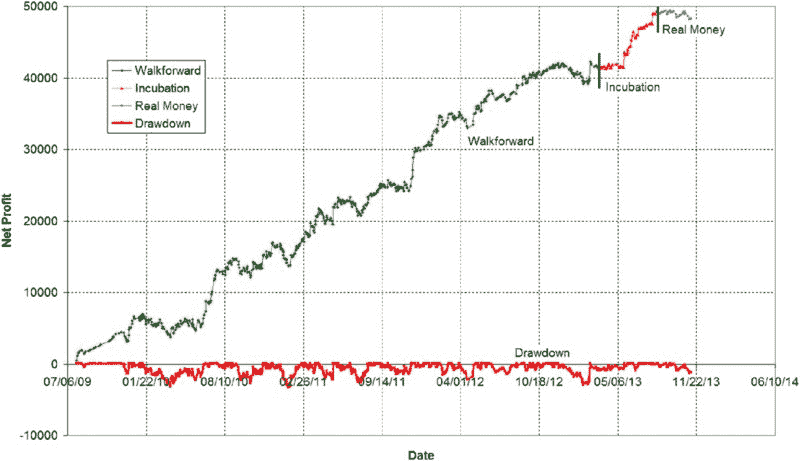

**图 23.1** 鸟瞰权益图

此图表的目的是评估实时表现的整体有效性（右侧曲线部分）。实时数据是否与历史测试和孵化期数据一致？如果不一致，可能存在问题。也许由于市场条件，策略已停止正常工作。或者策略中关于限价单成交的假设并不现实。这在剥头皮策略中特别常见，尽管你可能需要实际的真实资金结果来验证这一点。错误的假设或策略开发技术在历史或孵化测试中可能不会显现，但在真实资金投入时肯定会被揭露。

我每几周更新一次此图表，并迅速回顾。这让我大致了解我的策略是否按预期表现。如果是，我可以迅速转向下一个图表。

如果你不知道如何创建如图 23.1 所示的权益图，这里是创建方法。

##  如何构建权益曲线（以及回撤曲线！）

有时，在 20 多年交易之后，一些任务对我来说变得如此机械和常规，以至于我忘记了曾经需要学习它们。这就是创建权益和回撤曲线的情况。对我来说很简单，但对从未做过的人来说，这可能是一个艰巨的任务。因此，我将阐述创建权益曲线和回撤曲线的数学原理。

### 权益曲线

权益曲线可以在每笔交易的基础上构建，也可以根据你希望的任何时间尺度构建。我喜欢使用日权益图，部分原因是为了消除日内价格变化的噪音。你可以使用每日账户报表来获取当前的权益余额。

以下是基于日数据构建权益曲线的具体步骤：

+   第 0 天权益 = 初始起始余额

+   第 1 天股权 = 第 0 天股权 + 第 1 天期间股权变化

+   第 2 天股权 = 第 1 天股权 + 第 2 天期间股权变化

+   依此类推……

然后，你只需绘制当天的 X 股权值，你就得到了你的股权曲线。

### 回撤曲线

回撤曲线是某一天的股权与*最大*股权之间的差值。所以，假设一个账户在第 0 天开始时有$10,000。在第 1 天，它达到了新的股权高点$10,500。由于这是新的股权高点，第 1 天的回撤为$0。在第 2 天，假设股权下降到$9,700。现在，第 2 天的回撤为$10,500 - $9,700 = $800。接下来的日子也是如此。在达到新的股权时，回撤将简单地为$0。在所有其他日子，回撤将是该天股权与截至那时的最大股权之间的差值。

第 X 天回撤 = $0 或（第 X 天股权 - 从第 0 天到第 X 天的最大股权）中的最小值

创建股权和回撤曲线的电子表格已包含在网站上 ([www.wiley.com/go/algotradingsystems](http://www.wiley.com/go/algotradingsystems))，以及本书的资源网站。

##  月度总结图表

当我曾在航空航天公司工作时（有时我称之为“现实世界”），我们的小公司（年销售额 2.5 亿美元）会举行一个名为“How We Doin’”的每周销售和生产会议。尽管语法不正确，但这是公司经理快速了解当月和季度销售情况、质量和生产问题，以及公司当前状况的绝佳方式。

现在，快进几年。我全职交易，独自工作。但我仍然希望一目了然地查看“我做得怎么样”与我的策略和交易。显然，我的账户报表和股权曲线讲述了整体故事，但对我来说这还不够详细。哪些策略表现良好？哪些策略表现不佳？我正在孵化的策略情况如何？我应该对我正在交易的内容做出一些改变吗？这个“我做得怎么样”的报告可以帮助我回答所有这些问题。

我开发了一个电子表格来帮助我完成这个任务。它让我一目了然地看到我的策略表现如何，如果需要，我可以轻松深入查看细节。

首先，有一个总结页面，如图 23.2 所示。我在此页面上包含了我正在实时交易的每一个策略。我还在另一个部分中包括了我目前正在孵化的策略。这个总结表收集了我感兴趣的所有数据（当然，如果你自己做这件事，你可能会选择与我不同的指标）。这个总结表从各个单独的表格中获取数据，稍后我会详细描述。

**图 23.2** 月度总结图表

为了保持简单，我将所有内容基于一个合约进行交易，尽管这通常不是我实际交易的方式。为什么？我使用这个电子表格的目标是查看我的策略与我认为（计算）它们应该表现如何的对比。如果我包括头寸大小，这将使我的视图变得复杂。

在这张表中的所有数字中，我主要关注两列：

1.  *回报效率.* 我是如何与我的期望相比的？这就是我定义回报效率的方式，它仅仅是我的实际回报除以我的预期回报。如果我的策略表现完全符合我的计算，那么它将是 100%。显然，我希望这个数字接近或超过 100%。通常，当我将所有策略综合考虑时，我发现我的效率在 70%到 100%之间。因此，这意味着如果我的历史测试表明我应该每年赚取$10，我实际上赚取的在$7 到$10 之间。

1.  *回撤效率.* 这是我在回撤方面的表现。就像回报效率一样，我计算我的实际回撤除以我的预期回撤。然后我将结果减去 1，以使数字 100%成为理想值。这种做法有些反向，但我这样做是为了使两个效率数字都有 100%作为理想值。然后，效率越接近零，情况就越糟糕。

每个月，我会逐一更新每个系统表的表现数据，这会自动更新主表。

月度总结表揭示了我所有策略的当前表现。它从各个策略表中获取数据。我为每个我当前交易或孵化的策略都有一页电子表格。图 23.3 显示了各个策略的总结表。它相当简单，但效果显著。我可以快速查看某个策略的表现，与我的期望相比（当然，这些期望是基于历史表现的）。当你需要跟踪 30 到 50 个策略时，这样的快速总结确实非常宝贵。

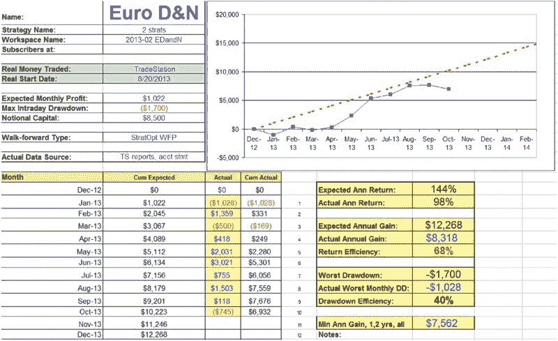

**图 23.3** 单个系统月度图表

对于我交易的许多策略，这就是我所需的所有信息——对表现的快速查看。如果有什么引起了我的注意，我总是可以进一步深入。

每月，我唯一需要更新的数字是在“实际”列中。这表示该策略在特定月份的实际利润或损失。可以根据交易报表进行调整后获得，或从策略表现报告中获取。我通常选择后者。预期的数字可以通过前期历史测试获得。

最大回撤来自策略报告。请注意，这是一个日内值，而电子表格计算的回撤是按月进行的。这显然不是完全正确的，因为理想情况下，你希望比较相同时间段内的回撤。但就我而言，这已经足够了。

单个每月表现图表的一个重要用途是识别表现过于优秀的策略。过于优秀？是的，表现过于优秀可能是坏事。

示例见图 23.4。我开始孵化这个策略有一段时间了，它开始起飞。

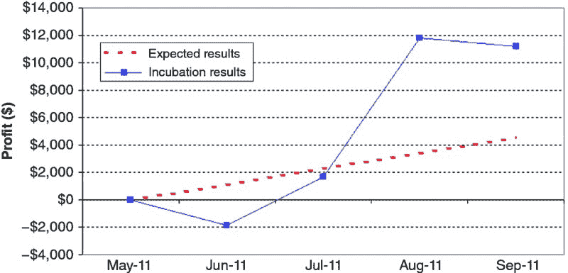

**图 23.4** 卓越的孵化表现

它“太好以至于不真实”——远高于历史标准。因此，我决定继续孵化它。接下来的几个月见于图 23.5。

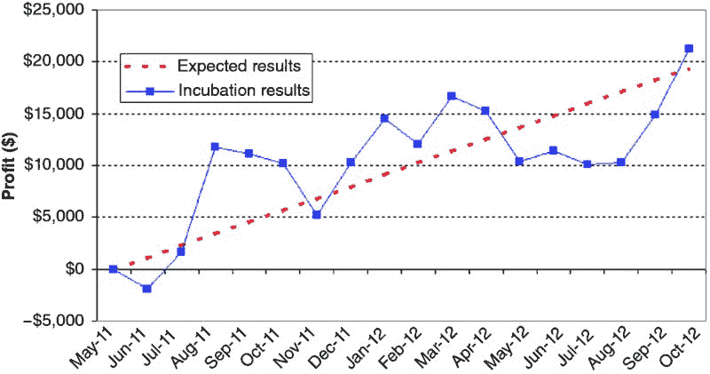

**图 23.5** 大多数策略最终会回归均值

现在这个策略与历史标准一致，但每月表现的标准差是个*致命*因素（看看下跌月份的表现）。我进一步调查发现系统并没有正常运行。因此，我决定继续孵化。图 23.6 显示了发生的情况。

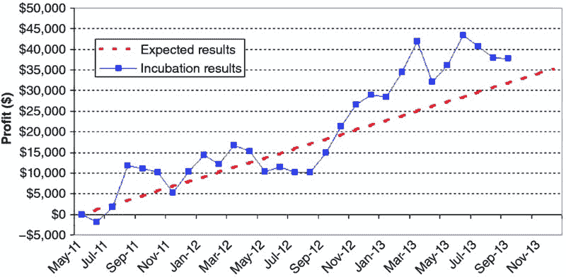

**图 23.6** 孵化时间更长

这是一个好的例子，说明（1）表现过于优秀是坏事，（2）结果的标准差（通过视觉检查发现的高变异性）是事情不太正常的早期警告信号，以及（3）每月表现报告以易于消化的格式显示所有这些信息。作为尾声：我仍在孵化这个特定策略，但尚未用真钱进行交易。

到目前为止，我讨论了一些跟踪策略表现的不同方法。这些工具对于评估系统的长期表现非常出色——在一段显著的时间内（几个月到几年），策略是否按预期表现？虽然这种“从 35000 英尺的视角”是有用的，但你还需要在每周或每日层面上进行测量。这有助于回答这个问题：我的新策略是否达到了预期？我使用几种不同的方法来审查短期表现。有简单的方法，也有复杂的方法。首先，我将看看简单的方法。

你所需的数据仅是平均交易或平均每日结果。如果你有这个值的标准差，那么你可以做更多。

你只需绘制结果，并使用公式“*n* * *avg*”，其中*n*是交易数量/天，“*avg*”是平均值。你会得到一个类似于图 23.7 所示的图表。

**图 23.7** 每日表现回顾

如果你高于平均线，你的策略表现比你想的要好。如果你低于平均线，你的策略就更糟糕。

这张图随着时间的推移变得非常有用。在超过 30 个周期中，你会期待策略接近平均线。这就是我的使用方式。然后，只需一瞥，我就能了解策略的一般状态。这张图与之前展示的每月跟踪图非常相似。它不错，但在活跃策略的早期并没有传达很多信息。为了获得更多见解，添加两条用于 +/- 标准差曲线的线：

上曲线：*n* * *avg* + *sqrt*(*n*) * (*std dev*) * *X*

平均曲线：*n* * *avg*

下曲线：*n* * *avg* - *sqrt*(*n*) * (*std dev*) * *X*

+   其中

    +   *n* = 交易数量

    +   *avg* = 每笔交易的平均利润

    +   *std dev* = 平均交易的标准差

    +   *X* = 标准差乘数

这告诉你，大约 68%（*X* = 1）或 95%（*X* = 2）的时间里，你的权益曲线应该在上下带之间。大多数表现良好的策略将其权益曲线保持在标准差带内。如果权益曲线超出这些带，可能你的策略存在问题。

图 23.8 显示了一个示例策略，其中 *X* = 2 个带。这里最有趣的一点是底部曲线，即 -2 标准差线。看看它是如何开始为负并保持为负的。想象一下！一个盈利（正期望）系统仍然可能在相当长一段时间内出现负结果。纯随机机会（交易结果的顺序）可能导致盈利系统看起来像一个亏损系统。

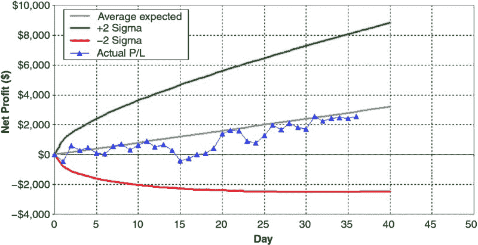

**图 23.8** 日常绩效审查与绩效带

当然，随着时间的推移，正的期望开始占主导地位，下曲线最终会变为正值。这对“微调”自己方法的交易者有*巨大*的影响，如果在五笔交易后没有显示盈利，他可能刚刚改变了一个盈利系统！这条下曲线真正表明，即使是盈利系统也需要时间才能显示出利润。

这里有一个很好的引用，解释得比我更清楚。它出自乔·佩塔的书《交易基础》（企鹅出版社，2013 年）：

> 好吧，如果你有机会投资于一个期望值为正的项目，比如拥有一个轮盘赌，你会选择拥有它一个小时还是九个半小时？在一个小时内可能发生有趣的事情；即使有庄家优势，也不能保证盈利。但在九个半小时内，游戏中固有的自然波动会平滑化，亏损的机会会非常小，随着时间的推移接近零。

精明的读者会注意到，图 23.8 中的图表使用了标准差，因此假设交易结果呈正态分布。实际上，大多数交易系统并不呈现正态分布。相反，分布可能在负值区域出现峰值，停损点可能位于此，而在利润方面则会有一个延长的尾部，或者在正值区域出现峰值，对应于利润目标。图 23.9 显示了一个真实交易系统的直方图与正态分布版本的对比。根据实际交易的具体情况，假设正态分布可能不是一个好主意。

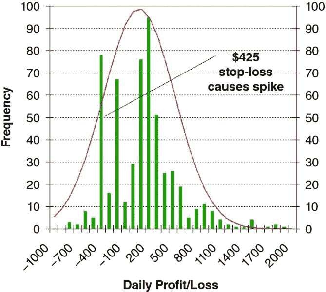

**图 23.9** 典型真实交易系统的直方图

为了缓解这个问题，我们可以简单地从多次运行中获取蒙特卡洛结果，并基于这些结果使用百分位数。这将提供交易系统预期边界的更准确表示。

在将这种方法应用于实际交易数据之前，一个简单的例子可以帮助解释这种方法。假设我们有一个交易系统，每天的平均交易额为$100，标准差为正负$50。通过两个标准差的带，我们预计大约 95%的值会落在上下曲线之间，或者在上端为 97.7 百分位数，在下端为 2.3 百分位数。如果我们对每笔交易逐日进行蒙特卡洛分析，那么在每个交易日，我们只需选择 2.3%和 97.7%的值。由于这些值使用了实际数据，而不是假设的正态分布，它们应该更加准确并且更能代表实际的交易系统。缺点是曲线不会平滑，并且如果重新运行模拟，曲线可能会发生变化。这就是使用蒙特卡洛分析的代价。

如果我们对欧元交易系统进行逐日的蒙特卡洛分析，曲线之间的比较如何？标准差与蒙特卡洛线之间有良好的但不是完美的匹配。对于跟踪目的来说，任一方法都可能是可以接受的。我个人更喜欢蒙特卡洛版本，因为它不对基础数据做出任何假设。

##  如何使用此图表

日常跟踪图可以帮助你决定是否停止交易某个系统。例如，如果你的策略的实时表现低于下方 10%的线，这可能意味着你的系统不再有效。毕竟，90%的概率表明你的策略应该表现得更好。一个真实系统的例子应该能清楚地说明这一点。

图 23.10 显示了我用自己资金进行交易的一个真实系统的样本案例。

**曲线 1：** 140 天后的系统表现。几乎是正的，并且接近-1 Sigma 线。这意味着，在那个时刻，基于历史回测交易随机生成的股权曲线中，只有 16%的表现会比这个更差。

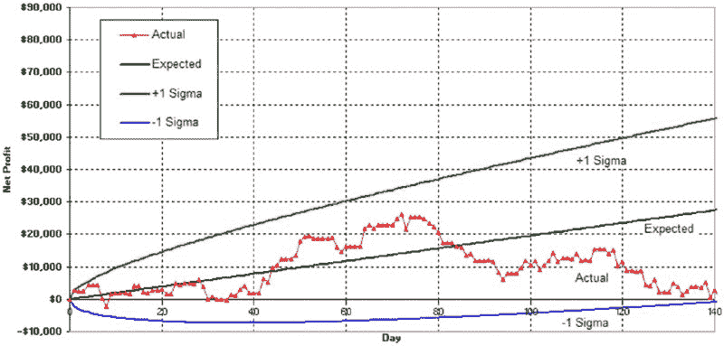

**图 23.10** 140 天每日表现

我相信大多数人到此时都会停止交易。但我没有，因为我知道即使在糟糕的表现下，这个系统也有可能并没有根本性的问题。

**曲线 2：** 接下来 200 多天的曲线（图 23.11）。我保持系统运行，现在它的表现更接近预期值。

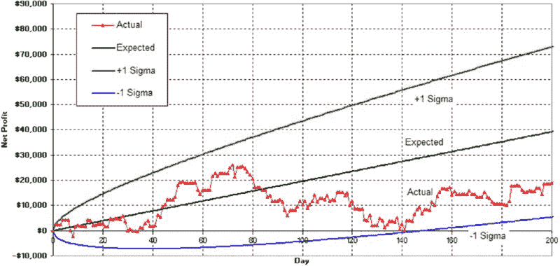

**图 23.11** 200 天每日表现

正如我之前所解释的，我使用蒙特卡洛模拟来确定策略是否符合预期。这基本上与使用均值和标准差得到的结果相同，只是蒙特卡洛模拟可以考虑“边界条件”效应（比如在达到一定百分比的回撤后退出，或在账户亏损时退出）。

##  追踪预期与实际表现

在本章中我展示的所有例子中，我使用的是由回测软件生成的表现数据，在我的案例中是 TradeStation。这些数据内置了一些假设：

+   每笔交易的滑点金额。

+   每笔交易的佣金金额。

+   限价单的成交逻辑。

+   “完美”交易与现实世界交易的对比。

根据你的交易系统和你在回测软件中输入的数值，你可能对系统在现实世界中的表现有一个不切实际的看法。我相信你一定有过这种经历——你看到一个看起来非常不错的股权曲线，却在后来发现创作者没有在表现数据中包括佣金或滑点。或者你发现了一个针对迷你标准普尔的无敌剥头皮系统，但在进一步审查后发现，你的回测引擎假设限价单在价格刚触及时就成交，而不是在限价单价格被突破时（这是一个非常常见的错误，尤其是在许多所谓的交易模拟器中）。最后，你还会遭遇互联网中断、数据延迟以及各种其他小故障。关键是，你期待的表现并不是你所能获得的表现。

如果你将交易视为一项业务，那么追踪实际表现并与预测表现进行比较是至关重要的。毕竟，当你的实际表现低于预期表现时，难道这不就像是什么东西或某个人在偷走你的利益吗？我确实有这种感觉——我完全期待能达到预测的表现或更好，当我没有做到时，我会寻找并纠正原因。

我在每日跟踪图上记录我的实际表现。我还保持一个实际与预测表现的对照表。大多数时候，实际表现略好于预测表现。这是件非常好的事情，因为它表明我对佣金、滑点等的假设有点保守。我宁愿在估算上保持保守，实际表现让我感到惊喜，而不是低估滑点后感到失望。

# 第二十四章

实时

当我开始一个新策略时，我喜欢持续审查其表现，以确保一切大致如预期进行。对于我在 2013 年 8 月底开始实时交易的欧元日夜策略，以下是我在前四个月每三到四周的实时更新，以及讨论一些过程中出现的有趣事件。

##  四周回顾—2013 年 9 月 13 日，结束日期

现在已完成使用真实资金交易欧元日夜系统的第四周。在前几个月的实时交易中，我每四周左右会审查一次系统的当前表现，如图 24.1 所示，并回答一些标准问题。如果系统的表现变得不稳定，这些信息可能会很有用——也许我之前可以看到什么，或者我根本错过了什么。

+   **总结：** 好吧，经过四周的实时交易，我的情况与起初相同——持平。

+   **我对这个结果感到惊讶吗？** 绝对不。它完全在预期之内。

+   **到目前为止，我对结果感到失望吗？** 是的。每当我开始一个新策略时，我希望一开始就能盈利。

+   **结果与预期一致吗？** 是的。目前的利润低于我期望的平均水平，但高于下方 10%的线。因此，虽然当前表现不佳，但我没有理由感到担忧。此外，我经历了两个盈利周和两个亏损周。随着时间推移，我预计约 60%的周会盈利，因此表现正如我所预期。

+   **实际成交和交易与 TradeStation 策略报告可比吗？** 是的，实际上，在大多数情况下，我的成交情况比我预期的要好。滑点通常少于我预期。

+   **我有理由停止交易这个系统吗？** 没有。

+   **我有理由改变我的仓位规划吗，即减少或增加我的风险？** 没有。

**图 24.1** 每日表现，经过四周的实时交易

##  第七周后的更新

在实时交易这个系统的七周里，本周情况变得糟糕，出现了几天大幅亏损。累计权益徘徊在 10%的水平，这通常是一个很好的警告信号，表明系统的表现与历史测试不同。如果情况不同，我可能会考虑停止交易这个系统。阻碍“现在退出”想法的因素有：

1.  只有 18 天的实时交易数据——在我看来，这太短了，无法做出退出的决定。

1.  最重要的是，当我制定停止实时交易的标准时，并没有考虑相对于每日表现的业绩（有时我会在“何时退出”的分析中考虑这个因素）。不过对于这个策略，我使用最大回撤作为我的停止标准。

我会继续交易，意识到情况需要改善。

在七周的实时交易之后，系统的表现是否如设计所预期？首先，让我们看看它进行的交易数量。与前进历史相比，交易数量的急剧增加或减少将表明市场行为与历史市场不同，导致进行的交易数量比正常情况多得多或少得多。在七周后，系统交易了 18 天，占可能交易天数的 53%。历史上，它每年大约交易 151 天，或占 60%的天数。因此，系统的交易数量低于平均水平。但有些年份它交易的天数少至 130 天（51%），多达 175 天（70%）。基于这些情况，我得出结论，交易数量大体符合预期，尽管处于低端。根据经验，我感觉波动性比往常低。有几天仅仅错过了几个点就未能入场（例如，9 月 18 日的美联储大幅波动就是一个例子）。如果在公告前的几个小时中波动性稍微大一点，系统就会抓住一个大赢家。

其次，我们来看一下平均表现与实际表现。该系统的历史平均表现是在 18 个交易日后获得$1,441 的利润。然而，实际表现却是-$746。这是一个*巨大的*差异，显然得出的结论是系统的表现不如预期。但这里就变得棘手了。拿一枚硬币翻转 100 次。如果你得到了 60 次正面，你是否会得出这枚硬币“坏了”，也就是说，有偏见的结论？如果你得到了 70 次、80 次或 90 次呢？即使你连续翻转 100 次正面，你能绝对得出这枚硬币有偏见的结论吗？不！有一种可能性，尽管非常非常小，公平的硬币也可能连续翻转 100 次正面。

对于交易系统来说也是一样。你可以问：“它坏了吗？”但答案总会有一定程度的不确定性。这种不确定性有时会对你的结论和决策产生重大影响。有些人把统计数据视为真理，但我会分享一个我学到的小秘密。在我之前的职业生涯中，我有一个统计师为我工作。我给他分配了一个需要大量数据分析并得出某种结论的项目。在他审查完项目细节后，在他甚至开始工作之前，他问我：“你希望得出什么结论？我可以让数据支持你的观点，无论是什么。”我感到震惊，但我从未忘记这个教训——统计数据可以很容易地被操纵，所以在基于它们做出任何结论时要小心。

现在，实际的系统表现处于预期的 10 百分位。50 百分位正好是平均水平，因此 10 百分位的表现相当糟糕。但它仍然在可能结果的范围内。如果低于 0 百分位——假设在前 18 天内系统亏损了$8,000——那么显然系统表现不会如预期那样。那将是一个简单的决定。正是在存在不确定性时，事情才变得棘手。

有一些统计测试可以用来显示当前的交易是否可能属于历史交易的分布，但即使这样的高级分析也不是绝对的。总有一个灰色区域。那么我该如何在这个灰色区域中导航呢？首先，我试图确定导致我停止交易某个系统的参数。我当然可以使用百分位数的方法，并制定一个退出规则，规定“如果在 X 天后，表现低于 Y 百分位数，我将停止交易。”X 和 Y 将根据个人偏好由我自行决定。只要我遵循我最初制定的规则，我就会很好。对我而言，对这个特定系统而言，我之前决定只有在出现$5,000 的回撤时才会退出。因此，我并没有使用跟踪图表中的数据来决定何时退出。不过，有时我确实会使用它。

总结一下：

+   **系统表现是否如预期？** 不，甚至远未达到预期。表现比预期糟糕得多。

+   **系统“坏了吗？”** 也许是，也许不是。这取决于你如何定义“坏”。无法明确说它是坏的，或不是坏的。

+   **我会退出吗？** 不会。我之前确立的退出点要求单合约回撤达到$5,000。这是一个经过深思熟虑的金额，我不能随意抛弃。我会坚持计划。不过，我意识到，坚持计划可能就像船长随船沉没一样。

##  第 8 周回顾

现在，欧元昼夜交易系统的第 8 周已完成。

**总结：** 首先，让我们看看全局。我喜欢定期这样做，因为一眼就能看出事情是否按计划进行。从图 24.2 来看，有几点很明显：

1.  在整个系统历史（步行验证、孵化、实盘）过程中，系统性能变化不大。我可以从步行验证开始画一条线到孵化开始，然后再从孵化开始画一条线到现在，这两条线的斜率大致相同。这让我对系统的表现有了一些保证，符合第 2 点的要求。

1.  在图 24.3 中，可以明显看到实时交易（带三角形的深灰色线）并没有达到预期。这过去两个月的表现下滑，虽然没有崩溃，但确实令人失望。

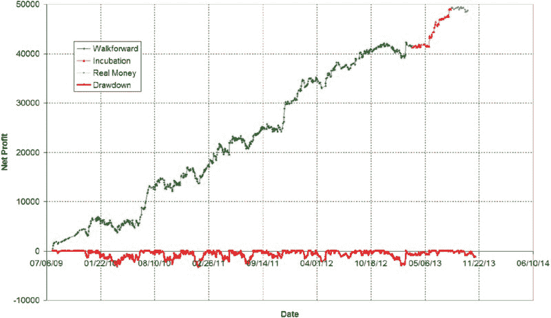

**图 24.2** 八周后的整体股权曲线

**图 24.3** 八周实盘交易后的每日表现

在八周的实盘交易后，我的损失大约为 5%。

+   **我对这个结果感到惊讶吗？** 绝对不。这完全在预期之内。

+   **我对目前的结果感到失望吗？** 是的。八周后，我希望能盈利。这八周的表现远远低于长期平均水平，所以非常失望。

+   **结果是否符合预期？** 是的。目前的利润低于我预期的平均水平，接近下方 10%的线。因此目前表现不佳，如果股权跌破 10%线，我会感到担忧。此外，我有四个盈利周和四个亏损周。随着时间推移，我预计大约 60%的周会盈利，因此在这方面表现稍显落后。而且，有一周的表现非常糟糕。

+   **填充和交易的实时数据与 TradeStation 策略报告可比吗？** 是的，实际上在大多数情况下，我的填充效果比我预期的要好。滑点通常低于我所期待的。

+   **我是否看到停止交易这个系统的理由？** 不。

+   **我是否看到改变我的仓位规划的理由，也就是减少或增加风险？** 不。

八周后，我将按照计划继续交易，但前方乌云密布。我需要一些阳光！

##  第 9 周——自动交易问题

你可能听过“自动交易并不意味着无人值守交易”这句话。你也可能阅读过经纪公司在允许你开启自动化之前提供的所有免责声明。例如，在 TradeStation 开户时，你必须签署大量的免责声明，如果你想自动化某个策略，还需要点击并接受另外两个免责声明。第一个免责声明有 397 个字，第二个则有惊人的 593 个字。为了自动化你的交易，确实需要花费很多时间来阅读这些法律条款。

但所有这些警告都是有原因的。忽略它们的风险自负其责。这就是我在实际交易第 9 周所经历的情况。让我来解释一下。

我的欧元日间和夜间策略是通过限价单进场的，这些单子应该只在当前蜡烛期间有效。在蜡烛关闭后，任何未成交的订单会被软件取消。根据策略逻辑，可能会为当前蜡烛下另一个限价单。

所以，在第 9 周的星期一晚上，我的欧元夜间策略下了一笔远低于市场的限价单。这笔订单在当根蜡烛期间没有成交，因此应该被取消。但出于某种原因，它没有被取消。这是我*第一次*见到这种情况。根据我的经验，软件自动取消订单的成功率应该超过 99%。这非常出色，但错误是可能发生的。以航空业为例，每天大约有 28,000 个商业航班，即便 99.99%的航班成功起飞和降落，每天也会有两到三架飞机坠毁*。*这就是声称 99%加的正常运行时间、准确性等的无意义之处。任何低于 100%的完美都存在让你损失金钱的风险。

该订单在交易所挂单直到周二早上 5 点才被成交。我是在周三早上发现这个错误的。当然，根据墨菲定律，我不是在这个头寸盈利时发现它，而是在它变为亏损后才注意到。更糟糕的是，在我调查这个问题时——在我退出头寸之前——我看到它又下跌了大约 125 美元。一旦我确认这个头寸是错误的，我以约 550 美元的损失退出了。

该责怪谁呢？好吧，软件没有履行其职责，因为它应该取消订单。但最终，我不能责怪任何人和任何事物（软件、互联网连接等），只能怪自己。我再重复一遍：我该负责！我是监护人，如果事情出错，偶尔会发生，那就得由我来意识到并修复。我对这次失误承担全部责任，并采取了一些步骤确保不再发生：

1.  每天检查报表。如果我在那天早上第一时间检查，可能会以 300 美元的利润退出，而不是 550 美元的损失。

1.  每隔几个小时检查平台上的未取消订单。

1.  改进仓位检查。我通常每隔几个小时检查一次我的仓位，但这一次却滑过了我。

1.  确保已填订单在图表上显示。出于某种原因，这个填充没有显示——它们通常会出现。

这不是致命的损失，但足以让我对这种情况感到相当沮丧！就这个账户而言，损失的百分比为 7%，所以这真的很糟糕。最终，我希望这个策略能达到 10 个合约，到那时将会是一笔可观的资金。

我在入场约 30 小时后注意到了这个糟糕的交易。然后我几乎在最坏的时机退出，损失了$550。现在，不到一个小时后，我本可以以不到$100 的损失退出。这只是我一个人的感觉，还是这种事情也会发生在你身上？如果我不太了解情况，我会发誓有人在操控价格，盯着我的仓位，并故意做一些事情来最大化我的损失！我完全可以理解人们为什么会有这样的感觉——有时，市场确实让我感觉是针对我的！

我对这种偶尔的偏执型感觉思考了很多。我知道其中一些发生的原因。我往往会忽视——并不真正注意或沉溺于——每一个发生在我身上的好事（对我有利的错误、入场后立刻的优秀新闻报道等）。赚钱的异常情况只是股权曲线中的一次闪烁。它们很不错，但我并不太记得它们。但我倾向于记住因错误而导致的损失，并将其保存在我的记忆库中。其中一些“亏损教训”可能值得记住——今天的自动化问题就是一个很好的例子——但大多数应该像赚钱错误一样容易被遗忘。对我来说，这种情况通常不会发生。

去年我实际上研究过这种心理现象。我把所有的盈利错误和亏损错误加起来。从货币的角度来看，净影响几乎为零。但从心理的角度来看，这绝对不是盈亏平衡。人们会认为这种感觉（“市场是针对我的”）在 20 多年交易后会消失。但并没有，我怀疑它永远不会消失！

到本周结束时，本应是一个不错的盈利周，却因前面提到的入场“故障”变成了亏损周，这让我损失了$550。我已采取一些立即措施以防止再次发生，我认为我暂时是安全的。我的实际表现现在落后于完美策略的表现，而上周的问题正是导致这种情况的原因。

问题归根结底在于：如果我依赖计算机来下单、取消和替换订单，除非有人始终监控，否则总会有一些意外情况发生。问题是，我的有限资源（毕竟只有我一个人）要投入多少精力来确保自动化不会出错？以往的努力并没有奏效——因为我刚损失了 550 美元——那么我什么时候才能确信这些问题不会再发生呢？而且，通常不是你已知的问题，而是你未知的问题。这一情况就是其中之一。经过多年的数千次自动交易，这个特定问题以前从未出现过！

先说到这里。表现仍然滞后，欧元日间策略在过去两周没有进行交易（我想我可以归咎于低波动性）。不管怎样，我会“继续交易！”

##  第 9 周—限价订单成交（2013 年 10 月 28 日）

一些不道德的系统供应商的把戏是认为所有限价订单在价格触及时就会立即成交。你可以通过查看他们交易的价格图表来识别这一点。如果方法显示交易在某根 K 线的最低点被买入，和/或在最高点被卖出，你可以肯定这个游戏正在进行中。

当然，现实是很难在最低点买入和在最高点卖出。我的经验是，具体取决于市场和下单时间，你可能有 5-20%的机会做到这一点。其余的 80-95%的时间，价格必须穿过你的价格才能以限价成交。

这可能是回测中的一个问题。如果你的回测引擎假设限价订单在触及时就会成交，结果将过于乐观。如果回测引擎假设必须穿透价格才能成交，那么回测结果会显得过于悲观。我总是选择悲观的方式。我的实际结果只能比回测更好。

在第 9 周的交易中，欧元日间策略在限价订单上买入了 K 线的确切最低点。当然，我被成交的部分原因是我只交易了 1 手；如果我交易了 10 手，我可能只会收到部分成交。有趣的是，当我刷新图表时，根据策略引擎，交易消失了。由于价格没有低于我的限价，策略引擎假设没有交易。但我的真实账户显示有交易，因为我确实被成交了。由于这笔交易是获利的，这次真是个意外的好消息！所以与回测引擎相比，这大约是一笔 400 美元的盈利。这弥补了上周让我损失 500 美元的订单问题。

##  第 12 周回顾

**总结：** 首先，让我们像往常一样看大局。从图 24.4 来看，有几点是明确的：

1.  在整个系统历史（走向前、孵化、实盘）中，系统表现变化不大。正如第 8 周之后，我可以从走向前的开始绘制一条线到孵化的开始，然后再从孵化的开始绘制到现在，这两条线的斜率大致相同——从孵化开始到现在的斜率稍微平缓一些。这让我对系统在长期基础上的表现感到一些安慰。

1.  很明显，实盘交易一直落后于长期表现。过去三个月的表现下降，尽管没有崩溃，但确实令人失望。

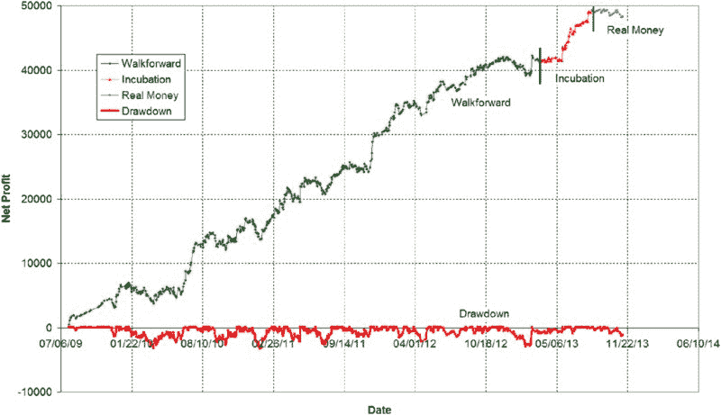

**图 24.4** 12 周后的大局股权曲线

在这个系统实盘交易 12 周后，我的策略计算表现比开始时下降了约 10%，实际表现下降了约 4.5%（图 24.5）。

+   **我对这个结果感到惊讶吗？** 是的。我原本期望更好，确实希望现在至少接近盈亏平衡——最糟糕的情况也是如此。

+   **我对目前的结果感到失望吗？** 非常失望。这过去 12 周的表现远低于长期平均水平，确实令人失望。

+   **结果是否符合预期？** 勉强算是。结果接近最低的 10%线，这意味着实时系统与走向前和孵化的系统几乎不同。还不完全不同，但越来越接近。

+   **实盘交易的成交和交易是否与 TradeStation 策略报告可比？** 不，但这是一件好事！我实盘的表现比策略预测好约 550 美元，因为（1）滑点少于预期，(2) 有几笔交易在价格刚触及但未超过限价时成交。

+   **我是否看到停止交易该系统的理由？** 没有。

+   **我是否看到改变我的仓位计划的理由，也就是说，减少或增加风险？** 没有。

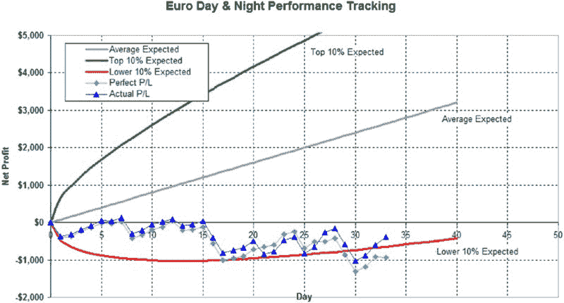

**图 24.5** 12 周实盘交易后的每日表现

经过 12 周，我将继续按计划交易，但该系统正在徘徊。需要几笔大赢家，这正是系统的基础。

##  第 13 周—时间限制回顾

随着我的策略在盈亏平衡附近徘徊，我开始想：我愿意冒多长时间的资本风险而没有任何回报？对我来说，答案涉及“下一个最佳选择”。

每六个月左右，我会查看我正在交易的每个系统，以及在待命状态的系统（准备进行实盘交易，但目前未进行）。如果我发现一个比我当前交易的系统更好的系统，并且我没有足够的资金同时交易两个（或者因为相关性问题我不想同时交易两个），我会将其替换。因此，即使欧元交易策略表现尚可（盈利而非目前的接近盈亏平衡状态），我仍可能用“下一个最佳替代品”替换它。

我每年仅进行两次此类分析，部分原因是它复杂（涉及复杂的相关性研究等），但主要是出于对新系统进行实盘交易给予一些时间以证明自己是公平的。大多数人没有耐心去做这件事，他们不断在系统之间跳跃，根本不给任何系统一个公平的机会。这就像在棒球比赛中，投手一旦被击出一支安打就立即被换下场。正如我之前所展示的，即使是盈利的系统，也可能在相当长的一段时间内表现不佳，直到长期的正期望真正显现出来。

当然，即使在这每年两次的分析中，我的原始退出点仍然有效。如果我触及那个点，我就会退出，无论下一个最佳替代品是什么（可能是现金）。

##  第 15 周回顾

**总结：** 在 15 周之后，欧元日夜交易策略终于表现得更好，如图 24.6 和 24.7 所示。通过大局来看，过去几周的表现使得实盘结果越来越接近历史回测。系统仍需改善表现，但情况显然正在好转。在进行 15 周的实盘交易后，我的策略计算表现上涨了约 1%，实际表现上涨了约 9.0%。

+   **我对这个结果感到惊讶吗？** 显然，我希望能更好，但我很感激系统在此时展现了盈利。

+   **结果是否符合预期？** 结果绝对更符合预期，尤其是在过去几周。但整体策略仍然表现不佳。如前所述，这种方法依赖于每年少数几笔大额盈利交易，而截至目前，在实盘交易中尚未出现任何。

+   **实盘成交和交易是否可与 TradeStation 策略报告相比？** 不可以，但这仍然很好！我在实盘中的表现比策略预测好约$700，因为（1）滑点比预期少，(2) 发生了多笔交易，在实际中成交但在回测引擎中未成交（限价穿透问题）。

+   **我是否有理由停止交易这个系统？** 没有。

+   **我是否有理由改变我的仓位配置计划，即减少或增加风险？** 没有。

**图 24.6** 12 周后的整体股权曲线

**图 24.7** 15 周实盘交易后的每日表现

在 15 周后，我将继续按照计划进行交易，但与最初的预期相比，这个系统仍然表现不佳。这是需要大额但不频繁获胜交易的交易方法的一个缺点。这个系统可能需要很长时间才能真正展现其能力。

##  未来评审

这个交易日记将无限期持续，或者直到我停止昼夜交易欧元系统，届时我会解释停止实盘交易的原因。更新可以在网站上找到（[www.wiley.com/go/algotradingsystems](http://www.wiley.com/go/algotradingsystems)）。
