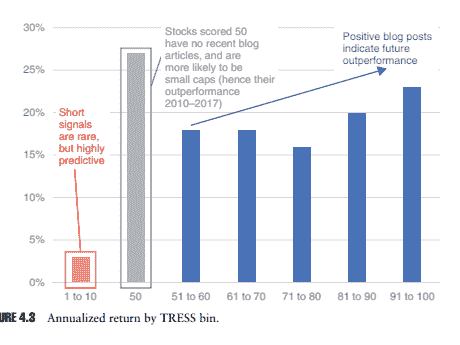
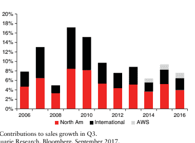
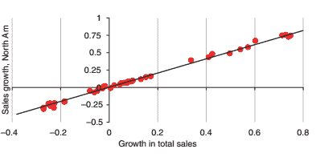
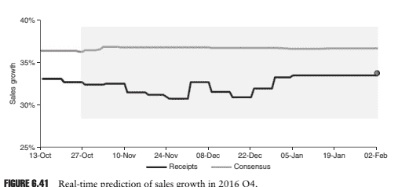
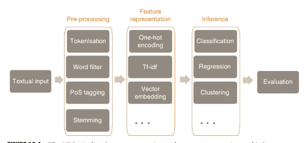
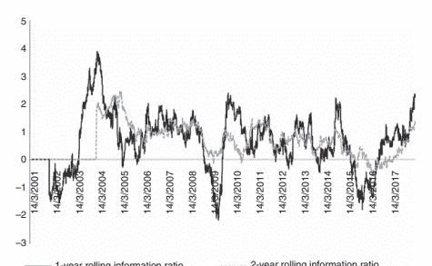

# 第一章：算法是否会梦见人工 Alpha？

迈克尔·科洛

## 1.1 介绍

大多数金融实践的核心，无论是来自均衡经济学、行为心理学还是代理模型，传统上都是通过优雅理论和一种“脏”经验证明的婚姻形成的。正如我在伦敦政治经济学院的博士课程中所学到的，优雅的理论是美丽智慧的标志，可以分辨出基于代理人的模型中微妙的权衡，形成复杂的均衡结构，并指出常规真理核心存在的有时冲突的悖论。然而，“脏”经验工作经常被怀疑地嘲笑，但不情愿地被承认为必要的，以赋予实质和真实世界的应用。我记得在风起的庭院和狭窄的通道里进行的许多对话，杰出的博士生们争论着“但我如何为我的假设找到一个测试？”。

在量化金融领域，许多伪数学框架已经出现并消失，通常是从附近的科学借用的：从物理学的热力学，Eto's Lemma，信息论，网络理论，各种来自数论的部分，偶尔还有从不太高科技但不情愿承认的社会科学，比如心理学。它们来了，又走了，被市场吸收（而不是被击败）。

机器学习和极端模式识别专注于大规模经验数据，以前所未见的规模转化和分析数据，揭示以前无法检测到的细节模式。有趣的是，机器学习在概念框架方面几乎没有提供任何东西。在某些圈子里，它以缺乏概念框架为傲，认为这是其优势，并且消除了否则会限制模型的人类偏见。无论你是否认为它是一个好工具，你都必须尊重这样一个观念，即过程速度只会变得更快更强大。

明天我们可以称之为神经网络或其他名称，最终我们将达到一个几乎可以在接近实时的情况下发现和检查大多数甚至所有模式排列组合的地步，此时焦点几乎完全集中在定义客观函数而不是框架结构上。

本章的其余部分是关于机器学习如何帮助我们更多地了解金融市场的一组观察和例子，以及正在这样做。它不仅来自我的经验，还来自与学者、从业者、计算机科学家的许多交流，以及大量关于这些主题的书籍、文章、播客和如今参与其中的广阔智慧海洋。

现在是一个让人着迷并且具有量化思维的不可思议的时代，我们至少可以成为未来几代人思考这些问题的有效媒介，以一种审慎和科学的方式思考，即使他们使用这些庞大的技术工具。

## 1.2 复制还是重塑

世界的量化再次成为人类的迷恋。这里的量化是指我们可以将我们作为人类观察到的模式分解为组成部分，并在更大的观察范围内以更快的方式复制它们的想法。量化金融的基础可以追溯到投资原则，或者说是几代敏锐的投资者所做的观察，他们识别出了这些想法，而无需大规模数据的帮助。

早期的因子投资和量化金融的想法是对这些见解的复制；它们并没有发明投资原则。价值投资的概念（对资产和公司进行组件估值）是许多代人研究和理解的概念。量化金融将这些想法拆解，取得可观察和可扩展的元素，并将它们扩展到大量（可比较的）公司之间。

实现规模的成本仍然是如何将特定的投资见解应用于特定公司的复杂性和细微差别，但是假定这些细微差别在较大规模的投资组合中被分散，而且仍然被大部分忽视。投资见解与未来回报之间的关系被复制为曝光和回报之间的线性关系，很少关注非线性动态或复杂性，而是专注于多样化和大规模应用，这被认为是现代投资组合的更好结果。

然而，从早期因子研究中出现了一种微妙的共同运动和相关性的认识，它现在是现代风险管理技术的核心。这个想法是具有共同特征（让我们称之为量化投资见解）的股票也可能在宏观风格因素上具有相关性和相互依赖。

在我看来，这个小小的观察实际上是对到那个时候，以及在许多圈子里仍然如此，孤立地思考股票的投资世界的一种重新发明，将焦点从单个股票移动到

连接许多个别没有直接业务关系但仍具有相似特征的股票的常见“线索”或因子，这可能意味着它们会一起买卖。这种“因子”链接成为投资过程的目标，并且其识别和改进成为许多投资过程的目标——现在（在 2010 年代后期）它正在再次引起兴趣。重要的是，我们开始将世界看作一系列因素，有些是暂时的，有些是长期存在的，有些是短期和长期的预测，有些提供风险并且需要消除，有些提供高风险回报。

因子代表了编织全球金融市场图景的看不见（但可检测到的）线索。当我们（量化研究者）努力发现和理解这些线索时，世界上很多人都专注于公司、产品和周期性收益的可见世界。我们将世界描绘成一个网络，其中连接和节点是最重要的，而其他人则将其描述为一系列投资理念和事件。

重塑发生在兴趣对象的转变上，从个别股票到一系列网络关系，以及它们随时间的起伏。这种转变既微妙又严重，可能仍然没有完全被理解。良好的因子时间模型很少见，关于如何思考时间的活跃辩论仍在进行中。情境因子模型更加罕见，对实证和理论工作提出了特别有趣的领域。

## 1.3 机器学习的重塑

使用机器学习进行重塑为我们提供了类似的机会，让我们重新思考金融市场的方式，我认为这种方式包括对投资对象的识别以及我们对金融网络的看法。

请允许我用一个简单的类比来进行思维练习。在手写或面部识别中，我们作为人类寻找某些模式来帮助我们理解世界。在意识、感知的层面上，我们寻找人的脸上的模式，鼻子、眼睛和嘴巴。在这个例子中，感知的对象是那些单元，我们评估它们与我们所知的其他对象的相似性。然后，我们的模式识别在组件方面的维度相当低。我们已经将问题分解为一组有限的分组信息（在这种情况下，是面部的特征）。

在现代机器学习技术中，人脸或手写数字被分解成更小、因此更多的组件，然后我们对这些类别进行评估。以手写数字为例，图片的像素被转换为数值表示，然后使用深度学习算法寻找像素中的模式。

我们拥有不可思议的工具来处理大规模数据，并在样本的亚原子水平上寻找模式。在人脸、数字和许多其他事物的情况下，我们可以通过复杂的模式找到这些模式，这些模式已经不再直观或可以被我们（有意识地）理解；它们不是识别鼻子或眼睛，而是在信息的深层折叠中寻找模式。有时，这些工具可以更加高效地找到模式，比我们更快，而我们的直觉无法跟上。

将这个类比运用到金融领域，大部分资产管理都涉及到财务（基本）数据，如收入表、资产负债表和收益。这些项目有效地表征了一家公司，就像一个人的主要特征可以表征一个人一样。如果我们拿这些项目来用，可能有几百个，并将它们用于像机器学习这样的大规模算法中，我们可能会发现我们在开始之前已经给自己造成了严重限制。

神经网络的“魔力”在于它们能够识别原子级别

（例如，像素级）信息，并通过向它们提供更高级的结构，我们可能已经在限制它们发现新模式的能力，即超出我们在线性框架中已经识别的模式。再创新在于我们找到新的构造和更“原子”的投资表示形式的能力，以使这些算法更好地发现模式。这可能意味着远离报告的季度或年度财务报表，也许使用销售和收入的更高频率指标（依赖于替代数据源），作为发现更高频率、潜在更连贯的模式的一种方式，以便预测价格波动。

通过机器学习进行再创新也可能意味着将我们的注意力转向将金融市场建模为一个复杂（或者只是庞大）的网络，其中问题的维度可能会爆炸性地高，难以让我们的思维来处理。要估算一个网络的单个维度，实际上就是要估算一个 n × n 的协方差矩阵。一旦我们将这个系统内生化，许多 2D 矩阵内的链接就会成为其他链接的函数，在这种情况下，模型是递归的，并且是迭代的。而且这只是在二维空间。将金融市场建模为神经网络已经尝试过，但应用有限，而最近更多的是供应链的想法正在流行，作为发现公司之间微妙联系的一种方式。替代数据可能会揭示公司之间的新的明显可观察的联系，就他们的商业往来而言，这些联系可以构成一个网络的基础，但更可能的是，价格会波动得太快、太多，以至于不能简单地由平均供应合同确定。

## 1.4 信任问题

现实情况是，逃脱我们注意力的模式要么太微妙，要么太多，要么在数据中太快了。我们无法直观地识别它们，或者围绕它们构建故事，这自然会使我们不信任它们。数据中的一些模式对于投资来说将是无用的（例如噪音、非流动性和/或不可投资），因此这些模式很快就会被剔除。但许多其他模式将是强大而有用的，但完全不直观，也许对我们来说是模糊的。我们的自然反应将是质疑自己，并确保它们是非常庞大的信号群体的一部分，以便在孤立地多样化问题特定信号。

只要我们的客户也是人类，我们就会面临沟通挑战，尤其是在表现较差时。当表现强劲时，不透明的投资流程很少受到质疑，复杂性甚至可能被视为积极的、有差异性的特征。然而，在大多数情况下，表现不佳的不透明投资流程很快就会受到怀疑。在许多现代投资历史的例子中，“量化分析师”们在表现不佳的时期往往难以解释他们的模型，并很快被投资者抛弃。赋予他们的智力优越性的同样优点很快就变成了弱点和被嘲笑的点。

叙事，即用舒适熟悉的轶事和类比包裹复杂性的艺术，感觉上就像是使用技术模型的一项必要成本。然而，在金融创新中，这可能是创新的一大障碍。投资信念以及我们产生舒适轶事的能力，通常是为了重新确认普遍存在的直觉投资真理，而这些真理又得到了数据中“合理”的模式的支持。

如果创新意味着转向金融中的“机器模式”，具有更高复杂性和动态特征，那么这将是一种信仰的飞跃，我们放弃了对投资洞察力的作者身份，和/或从某种混淆开始，例如捆绑，使得无法对单个信号进行审查。无论哪种方式，即使投资信号本身增加了价值，超出故事被接受的范围之外的移动也会存在一定的额外业务风险。

如果我们要创新信号，我们很可能也需要创新叙事。数据可视化是这个领域一个很有前景的领域，但如果我们要展示市场网络或完整因子结构的视觉亮点，我们可能会发现自己比金融界其他部分更快地接受虚拟和增强现实设备。

## 1.5 经济存在主义：伟大设计还是意外？

如果我告诉你，我建立了一个预测经济部门回报的模型，但是这个模型本身在很大程度上是不直观的，并且高度情境化的，这会让你感到担忧吗？ 如果我告诉你，一个核心组成部分是最近报纸上报道该行业产品的文章数量，但是这个组成部分不能保证在我下一次估计中 '构建' 模型。 我遇到的大多数研究人员都有一个选择潜在模型的概念框架。 通常，涉及一个思维练习，将给定的发现与宏观图片联系起来，并问： '这真的是世界运行的方式吗？ 这有意义吗？' 没有这一点，结果很容易因其经验上的脆弱性和样本内偏见而被挑剔。 我们在那里进行了微妙的飞跃，那就是假设经济体系有一个中央的 '秩序' 或设计。 经济力量通常是从一群得到信息和理性的人的集体行动中高效定价和交易风险和回报的。

（如果不是伪理性）代理。 即使我们认为代理人没有得到信息，或者不是完全理性的，他们的集体行动也可以带来有序的系统。

我们在经济学中的思考在很大程度上基于这样一个观念：有一个正在发挥作用的 '宏伟设计'，一个宏伟的系统，我们正在检测和估计，并偶尔利用。 我不是指的是有临时变化或进化的临时 '小均衡' 的想法，而是指的是根本没有任何均衡的观念。

达尔文的随机突变、进化和学习的概念挑战了这种世界观的核心。 Dennett5 巧妙地将这种世界观表达为一系列偶然事件，很少提及宏观层面的秩序或更大的目的。 "能力而无理解" 的概念被发展为一个框架，用来描述智能系统如何在一系列适应性反应中产生，而没有背后的更大秩序或 "设计"。 在他的书中，哈拉瑞 6 描述了人类从觅食转向有组织的农场的进化。 这样做，他们的数量增加了，他们现在无法再回到觅食。 路径依赖性是进化的重要部分，并限制了进化在未来方向上的发展。 例如，它无法 "进化" 觅食实践，因为它不再这样做，现在它正在进化农业。

机器学习，以及像随机森林这样的模型，很少表明有更大的图片或概念框架，但最容易解释为一系列（随机）数据进化，导致我们观察到的当前 '真相'。

一组经济力量共同作用以产生经济状态的想法，被一系列随机突变和进化路径所取代。 对于金融量化模型，这意味着有很强的路径依赖性。

这对于一个接受过经济训练的思考者来说是具有挑战性的，有时甚至是直接令人不安的。一个模型能够仅仅因为“就是这样”而产生一系列的相关性的想法令人担忧，特别是如果路径方向（突变）是随机的（对研究者而言）- 我们似乎已经勾勒出了水滴沿着玻璃滚动的路径，但几乎不知道是什么引导了这条路径本身。正如著名的投资者乔治·索罗斯 7 描述他的投资哲学和市场：一系列的输入和输出，就像一个“炼金术”实验，一系列的试验和失败。

## 1.6 这个系统究竟是什么？

重新发明需要重新审视回报的根本原因，可能还包括异常回报。在自然界、游戏中以及特征识别中，我们通常知道参与的规则（如果有的话），我们知道游戏，我们知道特征识别的挑战。金融市场中的一个中心要素，尚未得到解决的是它们的动态性质。随着元素的识别、相关性的估计、回报的计算，系统可能会非常迅速地移动和变化。

大多数（常见的）量化金融模型更注重横截面识别，而不太关注时间序列预测。在时间序列模型中，它们往往是连续的，或者具有状态依赖性，通常嵌入了一种切换模型。无论哪种方法，都没有对市场动态可能发生变化的原因有更深入的理解，事前的预测（根据我的经验）往往依赖于状态的串行相关性和偶尔的市场极端环境来“震荡”系统。8 在这个意义上，金融市场的真正复杂性可能被严重低估了。我们可以期待机器学习算法从细微的复杂性和市场关系中挖掘出更多吗？可能是的。然而，干净数据的缺乏，以及横截面信息分割的可能性，暗示着某种监督学习模型，其中研究者设定的事前结构与模型本身估计的参数一样可能成为成功或失败的根源。

一个希望是机器学习模型所暗示的关系结构可以启发并指导新一代理论家和基于代理的仿真模型，这些模型反过来可能产生更精细的事前结构，以理解市场的动态复杂性。我们可能无法学习到市场的潜在动态属性，而不使用某种事前模型，其潜在特性我们可能永远无法观察到，但可能可以推断。

一个用来演示这个想法的思维实验是一个简单的 2D 矩阵，有 5 × 5 个元素（或者足够多以阐明这一点）。每秒钟，有一粒沙子从上方落到一个单独的方块上。随着时间的推移，每个方块中沙子的数量增加。有一个规则，如果一个方块上的沙子塔比另一个方块上的沙子塔高得多，它就会倒塌到相邻的方块上，将沙子传递过去。最终，一些沙子会倒在平面的四条边之一上。系统本身是复杂的，它在各个区域积聚了“压力”，并偶尔释放出压力，当一个方块上的沙子从一个方块掉落到另一个方块，最终掉到边缘时。现在想象一个单独的研究者，站在方块平面的下方，对平面上发生的事情一无所知。他们只能观察到落到边缘的沙子粒子的数量，以及是哪个边缘。从他们的角度来看，他们只知道如果有一段时间没有沙子落下，他们应该更担心，但是他们对导致偶发雪崩的系统没有任何概念。基于价格的机器学习模型遭受类似的限制。它们只能推断出这么多，而且有一系列复杂系统可能导致给定市场特征的配置。在面对复杂性自然的遮蔽时，选择一个独特或“真实”的模型，特别是对于研究人员来说，是一项几乎不可能的任务。

## 1.7 动态预测与新方法论

现在我们回到更直接的问题：量化资产管理。资产定价（股票）广泛地始于通常依赖于你选择的视角的两种前提之一：

1. 市场由金融资产组成，价格是对拥有这些资产未来利益（通常是现金流）的公平估值。预测是对未来现金流/基本面/收益的预测。数据领域由公司组成，它们是未来现金流的捆绑包，其价格反映了相对（或绝对）对这些现金流的估值。

2. 市场由由带有不完美信息的代理人交易的金融资产组成，根据一系列考虑因素。因此，回报简单地是一场“交易游戏”；预测价格就是预测其他代理人未来的需求和供给。这可能需要或可能不需要（通常不需要）理解基本信息。实际上，对于高频策略，几乎不需要了解基础资产，只需要了解其在将来某个日期的预期价格。

典型地使用高频微结构，如成交量、买卖价差和日历（时间）效应，这些模型旨在预测未来需求/供给不平衡，并在从纳秒到通常的几天的时间段内获益。

没有太多的先前建模，因为权衡几乎是由设计，始终对经济信息做出反应的频率太高，这意味着它可能受到交易模式的驱动，并且重新平衡频率与正常经济信息并行运行。

## 1.8 基本因素、预测和机器学习

在基本投资过程的情况下，资产定价的‘语言’充满了对公司业务状况、财务报表、盈利能力、资产和一般业务前景的参考。绝大多数共同基金行业都是以这种观点运作的，分析公司与行业同行、全球同行以及整个市场相对于其未来业务成功的情况。试图定价超越 CAPM 的系统性风险的绝大多数金融文献，如多因子风险溢价和新的因子研究，通常将一些不可分散的业务风险作为潜在回报的情况。这些模型的过程相当简单：基于财务报表、分析和建模的组合提取基本特征，并应用于相对定价（横截面）或总（时间序列）收益。

对于横截面收益分析，特征（以非常常见的指标如盈利/价格为例）在广泛的横截面中被定义，并被转换为 z 分数，Z ∼ N(0,1)，或百分位等级（1–100），然后通过函数 f*与一些未来收益 rt+n 相关联，其中'n'通常为 1–12 个月的前瞻性收益。函数 f*在套利定价理论（APT）文献中找到其归属，并通过排序或线性回归导出，但也可以是与未来收益的简单线性相关（也称为信息系数，IC），一个简单的启发式桶排序练习，一个线性回归，一个逐步线性回归（用于多个 Z 特征，以及边际使用是否感兴趣），或它可以相当复杂，并且由于'Z'信号被植入到具有多种特征的现有均值方差优化投资组合中。

重要的是，“Z”的预测通常被定义为具有广泛横截面吸引力的（例如，所有股票应该在横截面中可测量）。一旦交给一个良好分散的应用程序（例如，有很多股票），任何围绕线性拟合的错误（希望）将被分散化。然而，通常不会花费太多时间定义不同的 f*功能形式。除了通常用于处理“大小”的二次形式（通常用于处理“大小”）或偶尔的交互（例如，*质量*大小*）之外，没有真正好的方法来考虑如何使用“Z”中的信息。这个领域在更好的股票特定测量的支持下很大程度上被忽视，但仍然是同样的标准化，同样的 f*。

因此，我们的目标是改善 f*。通常情况下，我们有几百个基本“Z”可以选择，每个都是横截面上的连续变量，横截面上最多大约有 3000 只股票。我们可以将 Z 转换为十分位成员资格的指示变量，但通常，我们想要使用极端十分位作为指示，而不是分布的中间部分。拥有基本变量“Z”和基于“Z”的一些指示 ZI 后，我们开始探索不同的非线性方法。我们开始感到兴奋，因为潜在的新的超级解决模型就在我们面前。

我们遇到的第一个问题是：“我想要预测什么？”

随机森林、神经网络通常寻找二元结果作为预测变量。回报是连续的，大多数基本结果也是如此

在我们选择对象之前，我们应该考虑我们正在寻找什么样的系统。

我想要预测公司的某项选择，例如选择更换首席执行官的公司，购买或出售资产的公司，收购竞争对手的公司。然后，我希望从这些行动中获益。但是公司是如何做出这些选择的呢？

他们是否与经济因素隔离开来制定决策，是否真的存在无条件的选择，还是这些公司已经受到某种潜在经济事件的影响？例如，公司很少会孤立地取消股利。通常情况下，取消的选择已经受到非常糟糕的市场条件的严重影响。因此，我们的模型很可能识别处于财务困境中的公司，而不是那些真正“选择”取消股利的公司。要深思熟虑什么是“选择”，什么是“状态”，在某些选择被认为是不可避免的情况下。

我想要预测公司的不当行为，然后通过做空/

避开那些公司。无论是有意还是无意，那些误报财务状况的公司，但最终被发现的（我们希望如此！），因此我们有了一个样本集。这对新兴经济体尤其有趣，因为这里的财务控制，例如国有企业，可能与简单的公开披露存在冲突的利益。这感觉像是法庭会计的一个激动人心的领域，其中“线索”被捡起并由算法匹配在不可能通过人类直觉单独跟踪的模式中。我认为我们必须重新审视这里的最初假设：这是无意的吗？因此我们正在建模组织内在的不确定性/复杂性，还是这是有意的，这在某种程度上是一种“选择”。

独立变量的选择应该理想地同时影响两者，但“选择”想法需要更多关于别有用心动机的信息。

我只想要预测回报。直截了当地，我们可以说：我们能否利用基本特征来预测股票回报？我们可以定义相对回报

（前十分位数、前五分位数？）在一定未来期间内超过一些同行群体，并将其标记为“1”，其他一切标记为“0”。如果我们可以整理好我们（少量的）基本数据，重新估计我们的模型（神经网络或其他什么）并设置一些回溯窗口，我们应该能够以蛮力解决这个问题。然而，这可能会导致一个极端动态的模型，因素之间的重要性极端变化，并且可能不清楚哪个模型是最佳的“局部极值”。或者，我们可以基于总回报目标定义我们的因变量，例如任何 +20%

在未来一段时间内，我们将专注于确定一个“极端波动者”模型。但是为什么公司会经历异常大的价格跳跃呢？上述任何一个模型（收购、超越预期、大幅惊喜等）。

可能是候选者，或者如果不是，我们实际上正在预测横截面波动率。例如，在 2008 年，实现正回报 +20% 可能几乎是不可能的，而在 2009 年后期，如果您是一家银行，则被期望是这样的。横截面波动率和市场方向必然是“状态”，以启用（或取消资格）股价出现 +x% 的概率。因此，总回报目标模型不太可能在不同的市场周期中表现良好。

（横截面波动率 regime），在此期间达到 +20% 的无条件概率明显不同。将这些嵌入其中有效地转换了 +20% 相对于横截面的标准偏差移动时，您现在又回到了相对回报的游戏中。

4. 如果您特别希望让方法论驱动您的模型决策，那么您必须接受价格是连续的这个观念，并且基本会计数据（至少报告的）是离散的并且通常是高度管理的。如果您的预测期间低于会计信息的报告频率，例如月度，那么您基本上是依赖于历史上声明的财务账目与今天的价格之间的分歧来驱动信息的变化，因此，在很大程度上是依赖于周转率。当您处理大型的“分组”分析时，例如分桶或回归分析时，这不太令人担忧。如果您使用非常细致的工具，如神经网络，它们将捕捉到微小的偏差并赋予其有意义的关系，这可能会成为一个更大的问题。

5. 使用条件模型，如动态嵌套逻辑（例如随机森林），可能会突出显示那些平均组别，它们比其他一些组别更有可能跑赢市场，但是它们的特征（在确定节点的方面）将是极其动态的。条件因子模型（情境模型）今天已经存在；事实上，大多数因子模型是在地理背景（例如任何商业可用的风险模型）和在某些情况下是在规模内确定的。这实际上意味着回报预测是基于你所处市场的哪个部分。从经济原理的角度来看，这很难合理化，因为这将需要在信息生成或强烈客户效应中进行某种程度的分割。例如，一组客户（针对美国小型市值）认为，增长率是推动回报，而另一组客户（日本大型市值）则寻求完全不同的东西。如果世界被划分得那么细，为资产定价辩护将是困难的（但不是不可能的），作为某种全球（不可分散）风险的补偿。无论采用何种经验方法，条件资产定价模型都应该努力说明为什么他们认为价格在财务报表之间的相对短时间内如此动态地受到如此不同的基本面驱动。

总之，像机器学习方法这样的大规模但敏感的工具与使用基本信息进行横截面回报预测的结合必须非常谨慎和专注。这一领域的许多定量工作都依赖于蛮力（近似）对像贝塔这样的敏感度的计算。研究人员会发现在 APT 回归或 IC 的主流计算中，很少强调错误修正方法，这些方法依赖于捕捉信号（Z）与未来回报之间的广泛、平均关系。偶尔（通常是在横截面波动较大的时期），会在会议上展示非线性因子回报的内容，听众会心领神会地点头，但实质上却无法进行调整。线性函数 f*的诱惑太大，太根深蒂固，不容易克服。

过去，我们进行了实验，以确定非线性估计器能为模拟回测增加多少额外价值。对于运动缓慢的信号而言（每月重新平衡，6-12 个月的时间跨度），很难最终击败一个没有过度拟合的线性模型（或者至少可以轻松辩护的模型）。同样，因子定时是一个吸引人的非线性建模领域。然而，因子回报本身是通过大量的噪声和围绕计算的固有假设计算的。这些假设使得定时本身非常主观。一个构建良好的（通常意味着经过良好回测的）因子将具有平稳的回报系列，除了历史上可能有一些潜在的灾难性的颠簸。使用时间序列神经网络尝试预测这些事件何时发生，将比线性框架更加强大地利用一些通常是不可重复的显著迹象。

具有讽刺意味的是，因子被构建为作为投资组合的长期持有补充因子。这意味着通过使用连续的定时机制，甚至是经过拟合的机制，很难改进长期持有收益。通过历史上错过一两个极端的收益事件，然后考虑交易成本，通常会看到稳健的线性因子胜出，这会令方法论上热切的研究人员感到沮丧。

最终，我们最好是生成一个构建不太完善但具有一些时间序列特征的因子，并尝试对其进行定时。

在这一点上，感觉我们已经来到了一个艰难的段落。对于基础研究人员来说，感兴趣的单位通常是某种基于会计的度量标准

（收入，收入等），所以在这个世界上使用机器学习似乎类似于让一辆法拉利在伦敦的高峰交通时间行驶。换句话说：这看起来很吸引人，但可能感觉像痛苦。我们还能做什么呢？

## 1.9 结论：寻找钉子

这是科学研究者们爱上一种新方法并花时间寻找要应用该方法的问题。就像挥舞你最喜欢的锤子，四处走动寻找钉子一样，机器学习看起来像是一种没有明显独特应用的激动人心的方法分支。我们越来越多地看到传统模型使用机器学习技术进行重新估计，而在某些情况下，这些模型可能会带来新的见解。往往情况是，如果模型受到限制，因为它们是为线性估计而构建和设计的，我们将需要重新发明原始问题，并重新设计实验，以期从数据中窥视出全新的东西。

在评估模型、设计新模型或在白板前探讨想法时，一个有用的指导原则是问问自己或同事：“我们在这里了解了什么？”最终，经验或轶事调查的目的是更多地了解我们周围这个复杂、神奇和鼓舞人心的世界的运作方式，从优雅的数学到混乱的复杂系统，以及最混乱的：数据。一个研究人员如果确信自己通过模型代表了对世界的某种‘真理’，无论采用什么样的方法和复杂度，都更有可能被人信任、记住，最终得到回报。我们不应该夸大或迷恋个别模型，而应该始终努力改善对世界的理解，以及我们客户的理解。

强大的模式识别方法，如机器学习，有能力为人类对复杂系统的理解增添力量，包括金融市场，也包括许多社会系统。我经常提醒那些使用和运用这些模型的人应该注意推理、谦卑和信任。世界会因量化而热恋，并因被承诺过多而冷淡。机器学习和人工智能（AI）几乎肯定会在某个时刻让我们失望，但这不应该阻止我们；相反，它应该鼓励我们寻求更好、更有趣的模型，以更多地了解这个世界。

# 第二章：驯服大数据

Rado Lipuš 和 Daryl Smith

## 2.1 引言：替代数据 - 概述

大约 20 年前，一小部分富有创新精神的对冲基金和资产管理者开始使用替代数据和机器学习技术。然而，近年来，使用替代数据的基金经理数量和新的商业可用数据源的供应量都大幅增加。

我们已经发现了 600 多种商业可用的替代数据集，这些数据集在过去几年内已经上市。目前，每月约有 40 种新的经过彻底审查的替代数据集被添加到 Neudata 平台上的替代数据总数中。我们预计在未来几年内，数据集的总数将稳步增加，原因如下：（i）更多的数据枯竭公司正在将其现有数据变现，（ii）新的和现有的初创公司加入这一领域，提供新鲜和额外的替代数据产品。

## 2.1.1 定义：为什么‘替代’？与传统的对立

对于初学者来说，“替代数据”一词指的是可用于量化和自主投资策略中的投资管理分析和决策目的的新颖数据源。基本上，替代数据指的是过去七年中主要创建的数据，直到最近才对投资界可用。在某些情况下，创建替代数据的最初目的是为了提供分析工具，供各行各业的非投资公司使用。在许多其他情况下，替代数据是经济活动的副产品，通常被称为“排放数据”。替代数据主要由买方和卖方以及在一定程度上由私募股权、风险投资和公司非投资客户使用。

## 2.1.2 替代并非总是大数据，大数据也不总是替代

“大数据”和“替代数据”这两个术语经常被互换使用，并且许多人将两者都用于非结构化数据的情境，并且在某些情况下用于指代大量数据。

“替代数据”一词最初是由美国的数据经纪人和顾问使用的，大约五年前开始广泛被接受。与其他地区相比，美国资产管理行业更广泛理解替代数据的含义：例如，在欧洲，这一术语直到 2017 年才开始得到更广泛的认可。

在 2016 年和 2017 年，卖方、传统数据供应商和其他类型的会议组织者举办的大量会议和活动无疑有助于推广替代数据的认知度。此外，在过去一年里，许多关于替代数据和人工智能的调查和报告，由卖方银行、数据供应商和顾问撰写，也有助于教育买方和更广泛的行业。

替代数据源究竟指的是什么，有多少来源可用，哪些来源最适用？

## 2.2 采用的驱动因素 

## 2.2.1 创新扩散：我们现在处于何种状态？

金融行业在替代数据方面仍处于早期采用阶段（图 2.1）。这一点可以从积极寻找和研究替代数据来源的买方公司数量来证明。然而，替代数据的采用正处于向早期多数阶段过渡的关键时刻，因为我们观察到越来越多的资产管理公司、对冲基金、养老基金和主权财富基金正在建立替代数据研究能力。

大多数创新者和早期采用者位于美国，而欧洲和亚洲基金的比例很小。大多数创新者和早期采用者具有系统化和量化的投资策略，并且在相当大程度上是以消费者为重点的自主基金。

2017 年，我们看到基于基本策略的基金兴起。

然而，尽管传统管理者对使用替代数据的兴趣增加，但量化策略的采用速度明显更快。

我们怀疑其中一个主要原因是运营知识。简而言之，对于以基本策略为驱动力的公司来说，整合和研究替代数据更具挑战性，因为通常所需的技术和数据基础设施不足，研究团队经常存在显著的技能缺口。

因此，评估、处理、确保合规性和获取大量数据集的任务需要对现有流程进行彻底改革，并可能代表一个重大的组织挑战。

对于大型、成熟的传统资产管理公司，一个重要的障碍是向研究团队提供测试数据的内部流程缓慢。这个过程通常需要对新数据提供商进行尽职调查，签署法律协议

（在大多数情况下是免费的）测试数据，以及（iii）合规团队的批准。资产管理公司内部这些流程的框架，以及因此需要为研究团队组织大量新数据集所需的时间，差异很大。在创新的对冲基金，这可能只需要几天/几周，而在不太注重数据和组织效率较低的资产管理公司，则可能需要数月时间。

投资界对替代数据的采用受到了金融科技的进步推动，并提高了分析不同数据集的技术能力。许多投资者、对冲基金和资产管理者都将这些发展视为传统投资方法的补充工具，可在未部署此类能力的投资经理身上获得优势。

今天，尽管许多投资专业人士声称替代数据是一种新的投资前沿，但可以说，这个前沿已经相当成熟，因为行业从业者现在已经相当普遍。正如 EY 2017 年全球对冲基金和投资者调查所指出的，当参与者被问及“您投资的对冲基金中有多少使用非传统或下一代数据和‘大数据’分析/人工智能来支持其投资流程？”时，平均答案为 24%。也许最有趣的是，当同一参与者被问及他们预计三年后这一比例将是多少时，答案增加到了 38%。

根据 Opimas Analysis 的数据，投资管理者在替代数据上的全球支出预计将以 21%的复合年增长率增长，预计到 2020 年将超过 70 亿美元（图 2.2）。

图 2.2 替代数据支出。

来源：Opimas 分析。来源：https://www.ft.com/content/0e29ec10-f925-11e79b32-d7d59aace167

## 2.3 另类数据类型、格式和范围

另类数据源的分类有几个挑战。首先，数据提供商提供的信息描述其产品的方式往往不一致且不完整，不足以满足投资管理目的。其次，另类数据的性质可能复杂且多方面，以及源数据通常无法轻松分类或描述为单一类型。传统来源，如 Tick 或价格数据、基本数据或参考数据，较不复杂，更容易定义。

我们将每个数据源归类为 20 种不同类型，对于大多数另类数据示例，多个类别都适用。例如，一个环境、社会和治理（ESG）数据集可能包含“众包”、“网络爬取”、“新闻”和“社交媒体”的组成部分（见图 2.3）。更进一步，数据集还可以是派生产品，并以不同格式提供：

1. 原始数据，占我们数据源的 28%。

2. 结构化或聚合，35%。

3. 信号（派生指标），22%。

4. 报告，15%。

## 2.3.1 另类数据分类和定义 

表 2.1 数据分类类型

| 数据集类别 | 定义 |
| --- | --- |
| 众包 | 数据是从大量的贡献者那里收集的，通常使用社交媒体或智能手机应用程序 |
| 经济 | 收集的数据与特定地区的经济相关。例如，贸易流量、通货膨胀、就业或消费者支出数据 |
| 环境、社会和治理（ESG） | 数据被收集以帮助投资者识别不同公司的环境、社会和治理风险 |
| 事件 | 任何能够告知用户股票价格敏感事件的数据集。例如，收购通知、催化剂日历或交易警报提供的例子 |
| 金融产品 | 与金融产品相关的任何数据集。例子包括期权定价、隐含波动率、ETF 或结构化产品数据 |
| 基金流向 | 与机构或零售投资活动相关的任何数据集 |
| 基本面 | 数据来源于专有的分析技术，与公司基本面相关 |
| 物联网 | 数据来自于相互连接的物理设备，例如 Wi-Fi 基础设施和带有嵌入式互联网连接的设备 |
| 位置 | 数据集通常来自于手机定位数据 |
| 新闻 | 数据来自于新闻来源，包括公开可用的新闻网站、新闻视频频道或特定公司的公告供应商 |
| 价格 | 定价数据来源于交易所内外 |
| 调查和投票 | 底层数据是通过调查、问卷或焦点小组收集的 |
| 卫星和航拍 | 底层数据是通过卫星、无人机或其他航拍设备收集的 |
| 搜索 | 数据集包含或来源于互联网搜索数据 |
| 情感分析 | 输出数据来源于自然语言处理（NLP）、文本分析、音频分析或视频分析等方法 |
| 社交媒体 | 底层数据是通过社交媒体来源收集的 |
| 交易型 | 数据集来源于收据、银行对账单、信用卡或其他数据交易等来源 |
| 天气 | 数据来源于收集天气相关数据的来源，如地面站和卫星 |
| 网络抓取 | 数据来源于定期从网站收集特定数据的自动化过程 |
| 网络和应用跟踪 | 数据来源于（i）从现有网站和应用程序中归档并跟踪每个网站的特定变化的自动化过程，或者（ii）监视网站访客行为 |
| 出处：Neudata。 |   |

## 2.3.2 有多少替代数据集？

我们估计今天买方使用的替代数据源超过 1000 个。其中大多数 - 21%（图 2.4） - 属于网络和应用相关数据类别，8%是宏观经济数据，包括就业、国内生产总值（GDP）、通货膨胀、生产、经济指标等多个子类别（图 2.4）。

网络和应用跟踪 经济新闻情绪 交易型位置事件 ESG

社交媒体调查和投票 基础众包金融产品资金流动卫星和航拍搜索

前六个数据类别占所有数据源的 50%。需要注意的是，一个数据集可以被归类到多个类别中。一个数据集可能包含多个来源，并且适用于不同的用例。

然而，投资管理中使用这些数据源的方式并不统一，并不反映数据源的供给方的情况。

## 2.4 如何知道哪些替代数据有用（哪些没有）

对许多基金经理来说，最终的问题是选择哪个数据源进行研究或回测。其中一个关键问题是，哪个数据集易于操作？

需要进行多少数据清理、映射和准备工作，才能准备好并集成一个研究数据库中的数据集？

我们试图回答这些问题的一种方式是根据表 2.2 中的八个因素为每个数据集评分。可以理解的是，每个基金经理对表 2.2 中哪些因素最重要会有不同的看法。许多人会有特定的“硬性停止”。例如，一个人可能只想回测一个具有至少五年历史、每年成本低于 50000 美元、至少每日更新一次，并且与至少 1000 个公开上市的股票相关的数据集。

当然，上述因素只是一个初步概述，以便机构投资者准确了解一个数据集与另一个数据集的差异。除此之外，还有许多定性因素需要考虑，以便评估一个数据集是否值得进一步调查。这通过一个彻底的调查过程来实现，该过程试图回答 80 到 100 个问题，这些问题反映了我们经常从投资界收到的查询。例如：

1. 数据的基本来源是什么？

2. 数据是如何收集和随后交付的？

3. 三年前的数据是否像今天一样完整？

4. 面板规模随时间的变化如何，存在哪些偏差？

5. 数据交付是否及时？

6. 数据是否是“点对点”的？

7. 数据是否映射到标识符或代码，如果是，是如何映射的？

8. 这个数据集与类似产品有何区别？

9. 到目前为止，哪些机构投资者对此提供感兴趣（如果有的话）？

10. 地理覆盖范围是什么，这可能会如何扩展？

11. 与该数据集相关的可投资公司具体清单是什么？

| 因素 | 描述 |
| --- | --- |
| 数据历史长度 | 可用历史数据的最早时间点 |
| 数据频率 | 数据可以交付的频率 |
| 宇宙覆盖 | 数据集涉及的可投资公司数量 |
| 市场的隐蔽性 | Neudata 对于机构投资者对该数据集的熟悉程度的评估 |
| 拥挤因素 | Neudata 对于使用此数据集的多少对冲基金和资产管理客户的估计 |
| 独特性 | Neudata 对于此特定数据集的独特性的评估 |
| 数据质量 | Neudata 对数据的完整性、结构、准确性和及时性的评估的一个函数 |
| 年度价格 | 数据提供商收取的年度订阅价格 |
| 来源：Neudata。 |   |

TABLE 2.2 评估替代数据有用性的关键标准

我们通过与数据提供商举行多次会议、审查样本数据（通常与感兴趣的客户共享）以及审查独立的相关来源（例如学术论文）来找到这些问题的答案。通过执行这些步骤，不仅创建了一个全面而独特的数据集概要，还可以提供建议的用例，这些用例可应用于回测过程。

## 2.5 替代数据的成本是多少？

对于数据提供商和替代数据的购买者来说，最具挑战性的问题之一是如何确定数据集的价格。

对于许多新进入金融服务行业的数据提供商来说，确定价格可能非常困难，原因有两个。首先，在许多情况下，新提供商对同行或可比数据订阅定价的理解和知识是不存在的或非常有限的。其次，数据提供商不知道买方将如何使用其数据，以及数据集对资产管理者提供的价值或 alpha 有多大。对于资产管理者来说，数据集的增值将取决于许多因素，例如投资策略、时间跨度、宇宙规模以及许多其他对基金经理策略独特的因素。如果新的替代数据源与资产管理者已经使用的数据集高度相关，那么新的替代数据源的边际 alpha 可能会太小。

对于开始研究替代数据的资产管理者来说，挑战在于为数据订阅制定预算。年度数据订阅价格将根据数据格式（如第 2.3 节所述）、数据质量和其他数据提供商特定因素而大幅变化。替代数据集的价格范围从免费到

年度订阅费用为 250 万美元。大约 70% 的数据集定价在每年 1 至 15 万美元的范围内。还有几个免费的替代数据集。然而，对于一些免费数据源，可能存在数据检索、清理、规范化、映射到标识符等间接成本，以使这些数据源对基金经理的研究和生产有用（图 2.5）。

## 2.6 案例研究

下面显示了过去一年由 Neudata 的数据搜索团队收集的五个例子。仅提供了全面报告的摘录，并且提供者名称已被混淆。

## 2.6.1 美国医疗记录

提供商：一家早期数据提供商，能够在处方后的三天内提供医疗保健品牌销售数据。

## 2.6.1.1 总结 

该组提供了从医疗记录中得出的对医疗保健行业的见解。在过去的七年里，该公司与美国各地的医疗转录公司合作，并使用自然语言处理（NLP）技术来处理数据。

该数据集提供约 2000 万份医学转录记录，涵盖了所有 50 个州，每月新增 125 万条记录（2016 年每月新增 25 万条记录），7000 名涵盖所有专业领域的医生，和 700 万名患者。数据在患者离开医生办公室后的 72 小时内就可以获得，并且可以以结构化或非结构化格式（CSV 文件）访问。

## 2.6.1.2 关键收获 

该团队声称是唯一商业化这些数据的公司。迄今为止，该产品已被用于(i)追踪药物上市后的情况，(ii)调查特定品牌被低估的原因，以及(iii)在 FDA 批准前发现涉及公司产品和标签扩展的不良事件。

## 2.6.1.3 状态 

公司在过去的六个月里曾与两家自营对冲基金合作，并现在正在寻求达成独家交易（图 2.6）。

## 2.6.2 印度发电数据

提供者：一家已经建立的数据提供商，但尚未推出涉及印度电力行业的每日数据交付。

## 2.6.2.1 摘要 

这家数据提供商的核心业务包括向对冲基金、经纪商和商业银行的客户提供数据分析和研究服务。

其中一个尚未推出的产品将提供印度电力行业的每日更新。具体来说，这包括电力供应的数量（以百万单位计的能量）和质量（以兆瓦计的峰值短缺），按地区和州划分。数据集还将包括电力发电在州和来源（即煤炭、太阳能、风能和水电能源）之间的分配。总共，每天将更新约 10000 个数据点。

## 2.6.2.2 关键收获 

我们相信这是一个独特的产品，因为数据的细粒度和交付频率。全面的细节，比如发电厂的发电量，可以从 2014 年开始提供。较少详细的数据集可以从 2012 年开始提供。一旦推出，数据集可以通过 API 提供。

## 2.6.2.3 状态 

到目前为止，尚无客户使用这个数据集，该团队正在积极寻找对这样一个数据集感兴趣的机构。一旦找到感兴趣的方，我们了解到设置 API 数据源需要大约四周的时间（图 2.7）。

## 2.6.3 美国收益表现预测

提供者：一家投资银行的数据服务部门，为 360 家美国公司提供收益表现预测，主要集中在零售部门。

## 2.6.3.1 摘要

这项产品于 2016 年 9 月推出，结合了（i）在线用户搜索数据，（ii）来自 6500 万设备组成的地理位置数据，以及（iii）销售点交易数据。输出是一个季度信号，旨在向客户提供有关给定公司相对于以前季度表现如何的想法。收益信号在给定公司财务季度结束后的 3 到 10 天通过 FTP 或该团队的网站交付。整个宇宙的历史数据从 2012 年末开始可用。

## 2.6.3.2 要点

潜在用户应注意（i）提供的不是绝对收益数字，而是相对于以前期间的任意比例为每家公司提供的相对收益措施，（ii）最近扩展的宇宙的外样本数据仅有四个月历史，（iii）直到最近，该产品仅涵盖大约 60 家美国股票； 2017 年 8 月，该宇宙扩大到 360 只股票，并超出零售领域，包括电影院、餐厅和酒店连锁店。

自那时起，该团队告诉我们，客户的兴趣显著增加了。

## 2.6.3.3 状态

大约有八个客户正在使用此数据集，其中一半是量化基金。尽管最近几个月来的兴趣增加了，但我们了解到该团队渴望限制访问（图 2.8）。

## 2.6.4 中国制造业数据

提供者：一家利用先进的卫星图像分析来协助用户跟踪中国经济活动的数据提供商。

## 2.6.4.1 摘要

这项产品是一个制造指数，其计算基于中国大陆约 6000 个工业区的图像，覆盖面积为 50 万平方公里。

用于构建指数的数据点每周以 CSV 文件的形式向客户交付，延迟两周。历史数据可追溯至 2004 年。

## 2.6.4.2 要点

该团队声称该产品是中国工业活动的最快和最可靠的指标。具体而言，该团队声称该指数比中国采购经理人指数（PMI）更准确，后者经常因缺乏准确性和可靠性而受到观察者的质疑。

## 2.6.4.3 状态

该团队于 2017 年初开始向一家大型跨国银行的定量部门出售基础数据。最近，其他定量分析师也对此表现出了兴趣，到目前为止，该团队有四个客户接收相同的基础数据。

由于客户需求，该团队正在使用 CUSIP 对特定工业区进行映射过程，预计将于 2018 年初完成（图 2.9）。

## 2.6.5 空头数据

提供者：这家公司收集、 consolida 和分析全球超过 600 家投资经理持有的上市证券的所有权数据。

## 2.6.5.1 概要 

该团队从 30 多个国家的监管机构收集披露，详细说明了大约 3200 家股票的多空头寸。 这些披露是

由投资经理整合并允许客户对聚合输出执行自己的分析。 例如，客户可以发现在特定时间段内有多少其他经理对给定股票进行了相同的空头持仓，以及他们的头寸有多大。 每天提供更新，并且可以从 2012 年起获得历史数据。

## 2.6.5.2 主要收获 

所有权数据以简单，标准化的格式呈现，易于分析。 相反，监管机构提出的数据通常没有标准化，并且有时可能会误导。 例如，许多资产管理人以不同的名称披露空头寸，这可能是试图低估其头寸。

然而，该提供的数据收集方法能够识别此活动，并相应地汇总披露，为给定证券提供全球，准确的经理级持有。

## 2.6.5.3 状态 

该团队在 2017 年扩张，无论是在覆盖范围上（在 2H17 添加了北欧和额外的亚洲国家，包括台湾，新加坡和韩国）还是在资产管理客户上（从 1H17 的零增加到 2H17 的 12）（图 2.10）。

## 2.6.6 Carillion 的倒闭 - 一种用例示例用于 Alt Data

哪些替代数据提供商可以识别 2018 年 1 月进入清算程序的英国建筑服务公司 Carillion 的倒闭？

以下我们描述了五种非常不同的替代性数据产品以及其数据与 Carillion 输出之间的关联。

## 2.6.6.1 一个采购数据提供商确定了 Carillion 日益增长的债务负担

如此广为人知的是，2017 年 Carillion 的最大问题之一是债务增加。

截至年底，平均净债务达到 9.25 亿英镑，同比增长 58％，如图 2.11 所示。

然而，我们发现最有趣的是，从 2017 年 7 月 Carillion 首次盈利警告到 2018 年 1 月清算之间，该集团（及其子公司）赢得了价值 13 亿英镑的 10 项公共部门奖项 - 进一步增加了集团的债务负担，并且可能揭示了政府没有意识到 Carillion 处于多么严重的财务困境中。

一个数据提供商不仅会发现这些合同奖项（因此，不断增长的债务负担），还会提供额外的分析。 该提供商的数据库涵盖了过去五年的公共采购通知，并提供了超过 62,000 个供应商的详细信息。 每日更新，其中包含价值超过 2 万亿英镑的招标通知和价值 7990 亿英镑的合同奖项。 通过搜索诸如 Carillion 之类的特定名称，用户可以获得指标，例如：

1. 未来到期合同的数量和价值。

2. 已赢得合同与任何时期到期合同的比率。

3. 市场份额趋势，平均合同规模，收入集中度和客户流失率。

## 2.6.6.2 这个贸易聚合器提供了详细的空头头寸分析

卡里利安的失败也受到了对冲基金的关注，这些基金做出了空头交易（例如 Marshall Wace 和 CapeView Capital），并且早在 2013 年就开始对该集团采取了空头头寸。在 2017 年 7 月 10 日该集团股价下跌了 39% 之前，卡里利安是富时 250 指数中空头头寸最多的股票之一。尽管这种显著的空头利益相对为人所知，但要从公开披露中准确确定（i）谁持有什么股份，（ii）持有时间多长，（iii）每个空头持有者在任何时候的盈亏仍然很困难和耗时。

在我们看来，一个特定的数据供应商将非常有用。该集团收集、整合并分析全球 600 多家投资经理持有的上市证券的所有权数据。此外，该公司通过投资经理整合这些披露，并允许客户对汇总输出进行自己的分析。就卡里利安而言，用户将会知道，例如，Marshall Wace 持有他们的仓位多长时间，这在时间上是如何变化的，以及所有未平仓交易的当前盈亏情况。数据每天更新，历史数据从 2012 年提供（图 2.12）。

## 2.6.6.3 另一家提供商可以帮助识别晚发票付款的历史。

卡里利安案例还凸显了延迟支付的问题，之后透露该集团向分包商支付了 120 天的延迟。正如富时文章《卡里利安倒闭加剧了分包商反对延迟付款的案例》所强调的那样，英国政府在 2017 年通过了法规，意味着大公司需要每年报告两次他们的支付条件（其中大多数公司将在 2018 年 4 月首次这样做）。然而，通过观察公司发票数据，比如另一家提供商提供的数据，可以找到更详细的分析和更新更频繁的数据。

尽管该集团无法向我们确认它是否具有与卡里利安特定的发票数据，但我们认为该集团，以及其他折价票据提供商，值得一提，因为它们是帮助识别处于财务困境初期的公司以及哪些公司正在经历的有用来源（图 2.13）。

## 2.6.6.4 这家薪酬基准数据提供商指出，在崩溃后，高管薪酬与同行相比较高的比率，

董事会学会代表英国老板的主要游说团体称颂 Carillion 的董事们获得的薪酬“极不合适”，指出“Carillion 缺乏有效的治理”，并补充说现在必须“考虑董事会和股东在崩溃前是否行使了适当的监督责任”。

实际上，回顾起来，2016 年 Carillion 对高管奖金的追索条件的放松似乎是相当不合适的。

我们询问了一家特定薪酬基准数据提供商的首席执行官，是否可以通过简单研究 Carillion 的薪酬数据找到任何警示信号。

根据该提供商的记录，尽管 Carillion 的平均员工工资大致符合其竞争对手的水平，但与同一行业高管薪酬相比，高管薪酬比例高于平均水平（图 2.14 和 2.15）。

与这家数据提供商进一步讨论后，明确了其基金经理客户可以得知从 2015 年开始，高管与平均薪酬比的比率呈上升趋势。此外，提到 2014 年首席执行官的加薪，几年前似乎就已经注意到了可疑的高管薪酬迹象：

看到过安然，凡萊特和其他管理灾难，当公司需要两页来披露首席执行官的加薪时，情况就不对了。

## 2.6.6.5 这家企业治理数据提供商指出了未解释的高管离职

在询问其对 Carillion 的看法时，一家企业治理数据提供商指出，对他们来说最大的红旗之一是几名高管无任何解释地离开了公司。

例如，2017 年 9 月，Carillion 财务总监扎法尔·汗在担任不到一年后突然辞职，没有对他突然离职的解释。Carillion 还进行了一系列管理重组，导致战略总监肖恩·卡特从他的职位上离职 - 同样在宣布中没有解释。

该数据提供商的首席执行官表示：“这些未解释的离职在我们看来引起了潜在的治理问题。”

以及董事会成员构成的不够多样化。

此外，同一提供商指出，人们可以质疑董事会成员的构成混合，以及是否有董事具备适当的技能/专业知识来管理公司，或者是否有健全的风险管理和公司治理实践（图 2.16）。

## 2.7 最大的替代数据趋势

在这一部分中，我们简要介绍了替代数据领域中我们正在看到的一些最大趋势。

## 2.7.1 替代数据仅适用于股票吗？

在分析替代数据时发现的一个令人惊讶的发现是，它适用于所有资产类别，而不仅仅是上市股票，这是最常见的假设。 二十

所有替代数据集的百分比适用于非上市股票或私营企业。

关于私营企业及其品牌和产品的数据正在被自由裁量管理人员和私募股权公司用于比较分析（图 2.4）。

## 2.7.2 供应端：数据集发布

2017 年，我们看到了位置、网络和应用跟踪来源大幅增加。2017 年所有新发布的商业可用数据来源中，有四成来自这三类数据。

值得一提的另一组数据是交易数据集，特别是涵盖非美国地区的（图 2.5）。

## 2.7.3 最常见的查询

关于需求，2017 年大多数月份所询问的热门类别包括 ESG、交易、情绪和经济数据。

## 2.8 总结

替代数据领域非常分散，新的数据提供者和现有提供者正在加速推出新数据集。最大比例的数据集适用于美国市场。然而，非美国数据提供者正在追赶替代数据的供应。我们认为，适用于公开股票的替代数据约占所有数据的近 50%，而对于非上市股票、固定收益、外汇和商品的数据可用性，远比买方社区意识到的要广泛。

替代数据的应用案例备受保护，而且很难找到 alpha 和数据集实用性的证据。

替代数据的采用仍处于早期阶段。然而，系统性和量化策略已经最积极地探索替代数据来源，并拥有显著的数据预算和研究团队。2017 年，我们观察到基本或自由裁量策略在替代数据研究项目和工作方面显著增加。总的来说，与买方使用传统数据源相比，替代源的使用仍然微不足道。除了买方对替代数据的有限使用外，还要指出，替代数据在大多数情况下被用作多因素方法的一部分。同一数据集可以用于不同的时间范围，此外，用例和方法也各不相同。

早期采用者有明显的优势和机会。此外，有强有力的证据表明，某些数据集将取代或替代现有广泛使用的来源，并成为未来的主流数据来源。

# 第三章：投资管理中机器学习应用的现状

叶卡捷琳娜·西洛特尤克

## 3.1 引言

通过每天通过智能手机应用程序，家用产品如 Alexa 和 Google Home 以及 Uber 和 Facebook 服务中使用的匹配算法等应用人工智能（AI）的应用，金融服务业以外的行业专业人士和学术界纷纷猜想为什么投资管理行业的大部分，如果不是绝大部分，不是由上述科技公司使用的算法原则管理的。我经常与专业人士和客户进行谈话，他们猜测如果 AlphaGo 能够如此快速地学会击败人类，那么在几年内，主导机构和零售投资者资金的很大程度上将是世界上的 AlphaGo。然而，除了交易成本、数据收集和处理以及执行基础设施等问题外，金融市场代表着一个更加复杂的生态系统，其中不断反馈的参与者不断地重写规则。

## 3.2 数据，无处不在的数据

在这种情况下，一个普遍的假设是，对专有数据或大数据的访问将先验地为投资策略创造长期的竞争优势。例如，在会议演示中，人们已经讨论过，具有客户数据访问权限的全球企业的企业财务和财务部门（如宜家）雇用量化分析师来理解公司的全球信息流并创建专有的交易信号。仅凭客户购买行为和电子商务/网站分析/社交媒体的“签到状态”信息就已经证明无法生成优秀的信号。为了获得更好的交易结果，需要具有宏观信息（利率、货币）、技术数据（交易模式）和基本来源（公司收益信息）必须被纳入考虑。全球企业养老金计划和苹果公司等公司金融部门对外部资产管理人的传统和替代指令搜索数量几乎证实了这一观点，即数据访问并不是投资策略成功的充分条件。

这些结果并不令人惊讶。金融数据与 99.9%的人工智能所使用的数据不同。此外，金融专业人士更广泛地获得大数据的机会是最近才开始的。越来越多的数据科学家一直在将新兴数据集转化为金融交易目的。大数据的处理和利用与金融数据有何不同？首先，让我们比较图像背后的数据（可以从 CIFAR（n.d.）的公共可用库中挑选一张图片，或者拍一张照片）和自成立以来的苹果股票每日股价数据（TechEmergence 2018）。

很明显的是，(CIFAR)图像数据集是静态和完整的 - 其元素之间的关系在所有时间内是固定的（或任何照片都是如此）。在 CIFAR 案例中，图像具有 100%的标记。相比之下，根据计算（TechEmergence 2018），苹果的每日股价有 >∼10k 个数据点 - 自 1980 年 12 月 12 日上市以来的每个交易日都有一个。即使以分钟为单位的分辨率（TechEmergence 2018），数据点的数量也会与单个低分辨率照片相似，并且与普通照片中的像素之间的关系基本不同。股票的金融数据系列并不是一个大数据。数据科学家可以通过从各种数据源（如电子原材料价格、汇率或者对苹果的 Twitter 情感）进行投影，从而创造出一个苹果的大数据分析问题。然而，人们必须意识到，在大数据中，会有许多变量的组合可能与苹果的价格巧合。因此，在金融领域成功应用人工智能方法将取决于数据科学家将有关苹果的数据转换为特征的工作。

特征工程是价值链的一个组成部分，其过程是将原始数据转换为更好地代表预测模型中潜在问题的特征，从而提高模型对未见数据的准确性。在人工智能领域取得成功归根结底归结为表征问题，科学家必须将输入转换为算法可以理解的东西。这需要大量的工作来定义数据集、清理数据集以及进行训练以及经济直觉。

尽管较少提到，人工智能一般多年来一直被一些资产管理公司使用（最初是高频交易公司）（Kearns 和 Nevmyvaka 2013），大多数情况下是在执行方面（以降低总体交易成本），而不是在投资信号生成和投资组合管理方面。处理能力速度的增加以及数据处理和存储成本的降低改变了金融公司应用人工智能技术于投资管理过程更广泛部分的经济学。然而，仍然存在差异，这些差异涉及对金融市场状态进行建模，这促使人们对将人工智能引入金融领域与其他行业采取谨慎态度（NVIDIA 深度学习博客无日期）：

(a) 不同于一些其他具有静态关系的环境（如照片的情况），游戏规则随时间而改变，因此问题是如何忘记过去有效但现在可能不再适用的策略。

(b) 市场状况只能部分可观察 - 因此，即使市场配置相当相似，也可能导致相反的发展趋势。

(c) 信号目标并不像猫狗分类问题那么简单，人们不能立即验证信号的有效性。

本章的后续部分将指导读者了解金融领域人工智能应用的光谱，阐述行业与 AI 促进因素的相互关系，并就未来行业发展的情景展开讨论。我们将为从业者、学生和年轻专业人士提出建议作出结论。

## 3.3 人工智能应用的光谱 

## 3.3.1 Ai 应用分类

为了更好地了解通过 AI 进行投资和利用大数据的潜在发展（Sirotyuk 和 Bennett 2017），瑞士信贷的 AI 专家将该行业分类如图 3.1 所示。当读者沿着 y 轴向上移动时，数据复杂度与大数据的四个 V（速度、多样性、容量、真实性）相一致增加。较低的列意味着利用标准价格数据（合同价格数据源），基本指标（P/E，P/B，**Div Yield（股息率）**和情绪数据。较高的列使用更复杂的数据（包括文本和语音等非结构化数据），并包括以专有方式收集或处理的数据（例如，市场影响，对手在短时间内的报价-询价）。y 轴上的顶级代表大数据，如通过卫星图像跟踪海洋流动和停车场占用情况。

在 x 轴上，作者逐渐引入更先进的数据处理技术，这些技术更适合解释和对这些复杂数据集做出反应 - 从传统工具（如分析统计学）到基于 AI 的研究系统（例如自然语言处理，NLP）到完全自主的 AI 交易系统。

引入了一个共同点 - 麦当劳股票交易 - 作为一个例子，说明了在每个框中算法设计和交易如何发展。

麦当劳案例之后是投资管理行业应用的一个例子。

在短期至中期内，通过 AI 应用提高 alpha 的预期发生在表格的中等列中，由“高级交易”表示，'竞争数据科学家'和'主数据科学家'。

## 3.3.1.1 高级交易 

被归类为'高级交易'的内容倾向于使用复杂的分析技术处理现有数据，并实现更快的反应时间。

那些交易员能够处理大量数据集或文本，并提取有价值的信息。一个很好的例子是你在公司报表中有不同的脚注时（资产负债表或利润表），AI 系统能够系统地进行捕捉（Allison 2017）。

## 3.3.1.2 竞争数据科学家 

竞争数据科学家代表利用公共和专有、结构化和非结构化数据集的投资组合 - 例如，一个投资组合经理会尝试使用 NLP 技术分析媒体对某个地区或国家的一组股票的态度是否积极或消极（Allison 2017）。

## 3.3.1.3 主数据科学家 

主数据科学家可能已经使用非常先进的卫星图像来了解海上或港口船只的位置，以了解市场中的流动情况。

随着系统获取更多数据，经过训练和测试，演变向右移动（Allison 2017）。展望未来，我们应该期待看到投资行业从结构化数据和有限的人工智能转向融合一些非结构化数据和更先进的数据处理技术。参与者的方式显然取决于他们的技能组合，以及某些数据的可用性或开发自己的专有数据集和/或大数据融合的经济学。

## 3.3.2 金融分析师还是竞争性数据科学家？

为了演示 AI 系统如何扮演金融分析师的角色（又称'竞争性数据科学家'，如图 3.1 所示），可以看到图形处理单元（GPUs）和翻译器促进了深度学习（一类基于学习数据表示的机器学习方法）的实施（NVIDIA 深度学习博客 n.d.）。多年来，金融分析师的工作是定期筛选新闻文章，听取公司电话会议，与投资者关系部门联系，从定性讨论中得出结论并向交易员提出建议。这个过程耗时且相当手动。它还需要专业化，因为分析师按部门和/或地理位置划分，并且需要具备本地语言知识或通过先前的工作凭证具有对‘家庭’行业的理解。现在想象一下，使用 GPU 和深度神经网络库，这个‘虚拟分析师’ - 机器 - 可以将来自公共和专有数据库的新闻输入到深度学习系统中（NVIDIA 深度学习博客 n.d.）。训练后，机器可以在每三毫秒解剖一篇文章（相比之下，金融分析师在 2-3 分钟内浏览一篇文章）；这样，机器每天处理数十万篇文章。该过程的工作方式如下。AI 系统在文章中识别数百个关键词。然后，‘一个无监督学习算法为每个关键词赋予一个数字值，然后系统的其他模型可以解释和处理。深度学习系统的结果包括：

（a）将文章链接到适当的股票和公司；

（b）为每篇文章辨别情绪得分，范围从积极到中性到消极；和

（c）访问新闻对市场影响的可能性。该系统还意识到‘假新闻’，因为有信誉的来源被赋予更高的权重以提高结果的可靠性（NVIDIA 深度学习博客 n.d.）。

## 3.3.3 投资流程变化：‘自主交易’案例

AI 处理的引入影响了投资团队的组织结构，随后影响了投资流程。以股票投资组合经理为例（基础股票选择者），负责投资组合中的股票的最终决定权。他过去依赖于研究团队、执行交易员以及他自己对他所交易市场的理解的输入。分析师往往在利基行业拥有多年的经验，在行业联系人中拥有广泛的网络，并多次与关键的 C 级高管交谈过。分析师的任务已逐渐转向建立和维护复杂模型、与高管交谈、记录、设置关键日期和通知警报等。基本上，已经建立了一个迭代的决策过程，例如：

- 第 1 步：分析师研究，然后

- 第 2 步：向投资组合经理提供输入，然后

- 第 3 步：投资组合经理构建投资组合，例如股票包含的权重/排除，然后

- 第 4 步：投资组合经理执行投资组合，重点是交易规模和交易结构，然后

- 第 5 步：返回第 1 步。

现在想象一下，我们可以将股票选择和投资组合构建过程交给一台机器，并要求机器就研究和投资组合构建做出联合决策。联合决策为我们提供了更多的数据，并进入了大数据/AI 问题领域。如果机器还开始交易证券来实施投资组合，我们就会按照图 3.1 移动到“自主交易”。这个问题设计结果就是一个深度学习框架的例子，如图 3.2 所示。

## 3.3.4 人工智能和策略开发

拥有大量模型库和交易历史记录的资产管理者处于利用自动化资本配置策略的有利位置。在投资者谈话中经常发生这种情况，当分配者与系统公司讨论多策略提供时，他们听到的销售宣传是，风格或模型簇之间的分配是 1/3、1/3、1/3，或者在投资组合背景下相关的任何 N。通常，对于天真的风格或模型簇分配策略，解释了分散化效益和进行模型定时的能力有限。公司正在日益在模型库上测试神经网络的部署，看看是否实际上可能有一些时机。因此，拥有更强大的基础设施和模型注册表的资产管理公司可能会提出自动化的资本配置策略。

更快的信息收集将进一步支持投资管理行业在人工智能-大数据轨道上的发展。观察一些著名的领先指标，投资经理在历史上已经考虑了采购经理指数（PMIs）、就业、干散货指数等因素进行决策。所谓的现在预测技术的到来有望使人们能够在（发布之前）更早地了解国内生产总值（GDP）和其他基准（Björnfot 2017）。现在预测背后的基本原则是，关于 GDP 变化方向的信号可以从大量和异构的信息来源（例如，工业订单和能源消耗）中提取出来，而 GDP 本身尚未发布。不仅 GDP，而且制造活动也可以以不同的方式进行衡量。

因此，美国公司 SpaceKnow 推出了一个专门的中国卫星制造指数，该指数利用了中国境内超过 500 000 平方公里的 2.2 十亿卫星观测数据和 6000 多个工业设施（Kensho Indices n.d.）。

## 3.4 行业的相互联系和人工智能的推动者 

## 3.4.1 人工智能开发的投资

金融市场中人工智能的使用的进步是由人工智能在服务行业更广泛的渗透以及行业发展的相互联系所推动的。

人工智能的概念，尤其是神经网络，并不新鲜；然而，巨大的计算能力最终使得对巨大数据库（图像、视频、音频和文本文件）进行复杂处理成为可能，这些数据库产生了足够的数据供人工智能操作（Parloff 2016）。对人工智能初创企业的风险投资也有所增加。据 CB Insights（CB Insights n.d.）称，2017 年，排名前 100 的人工智能初创企业筹集了 117 亿美元，共进行了 367 笔交易。相比之下，五年前，以人工智能作为其产品核心部分的初创企业的总融资额为 50 亿美元。自 2012 年以来，该行业的交易和资金投入一直在上升。

上述数字不包括科技巨头在其自身 AI 能力上的内部投资。在公司级别上，Google 在 2012 年进行了两个深度学习项目（Parloff 2016），而目前该公司正在所有主要产品领域开展 1000 多个项目，包括搜索、Android、Gmail、翻译、地图、YouTube 和自动驾驶汽车。对于一位自由主题投资者来说，寻找对外国市场的本地洞察力的明显途径是阅读外语的在线新闻或论坛（在当地分析师的帮助下），或者听取 C 级高管对投资的不同看法，正如我们之前讨论的那样。天真地说，一个人可以使用谷歌翻译进行翻译服务，再加上 1-2 位关键分析师，而不是当地的分析师。如今，谷歌翻译（Parloff 2016）能够将一种语言的口语句子转换为另一种语言的口语句子，同时为 103 种语言提供文本翻译。目前，这种语言转换的质量可能会受到质疑，但方向已经确定。

## 3.4.2 硬件和软件开发

NVIDIA 在 2000 年代推出了 GPU，并进行了硬件革命，这些芯片最初是为了给玩家提供丰富的视觉 3D 体验而设计的，这些芯片足够灵活，可以用于其他工作负载。对于它们适用的任务，GPU 比以前使用的传统中央处理单元（CPU）效率高出许多倍。

竞争对手也在追赶。例如，英特尔在 2016 年 8 月收购了一家深度学习初创公司 Nervana Systems，以及 2017 年 3 月收购了芯片制造商 Movidius 和视觉专家 Mobileye。这些收购使该公司能够创建一系列专门用于人工智能的芯片。这一发展肯定会支持大数据提供者行业。此外，2016 年，谷歌宣布在其数据中心内使用张量处理单元（TPU）（Google Cloud 2017）（该单元设计用于大量低精度计算，并且特别与谷歌的开源库 TensorFlow 一起使用）。基本上，这意味着谷歌服务，如 Google 搜索、街景、Google 照片、谷歌翻译都在幕后使用 TPU 加速其神经网络计算。谷歌现在正在推出第二代这些芯片，以提供更广泛的能力。

除了硬件开发外，软件开发，尤其是开源框架，已经帮助了大数据提供商（Financial Stability Board 2017）。在软件行业，开源的概念已经存在多年。基本上，这意味着特定技术或解决方案的源代码是开放的，任何人都可以添加和改进（Shujath 2017）。已经证明，这种方法通过一个开发者社区共同解决 bug，加速了产品创新并提高了产品质量。它使原始产品能够开发新功能。包括微软、谷歌和亚马逊在内的厂商已经将他们的人工智能解决方案开源（Shujath 2017）。

## 3.4.3 规章制度

尽管不常被强调，但美国和其他一些国家的市场监管机构允许公开交易的公司使用社交媒体发布公告，这促成了事件数据集的创建（Financial Stability Board 2017）。到目前为止，地理空间数据聚合商已经能够聚合并转售他们聚合的分析数据。随着计算能力和成本的降低，精度和及时性也随之而来——直到最近，卫星图像的挑战在于数据根本不够频繁，无法及时应对作物压力。每日图像正在成为一个改变者（Anon n.d.-a）。在过去几年中，大数据提供商已经蓬勃发展；但是，人们必须注意这些公司的年轻本质——它们只存在了几年。这方面的例子是 Terra Bella（以前是 Skybox），它提供了对零售商停车场内汽车数量或港口自然资源储量的分析，以及另一个卫星图像提供商 Orbital Insights（Anon n.d.-b）。

## 3.4.4 物联网

当涉及到特定行业，例如农业或能源时，大数据收集是通过无线传感器和其他监测设备的部署实现的（Financial Stability Board 2017; Anon n.d.-b）。作为物联网（IoT）的常见技术，被深入应用于许多行业，因为这些技术使我们能够（i）准确实时地了解现场出现的问题，（ii）快速有效地干预，从而及时解决问题。

物联网解决方案再次由微软和亚马逊等技术公司以及价格更便宜的芯片所推动。物联网在农业中的兴趣和适用性的增加可以通过在该领域运营的初创公司数量来证明（例如 Farmobile Device、OnFarm、CropX、FarmX、Farmlogs；机器人/物料处理 - Harvest AI），DroneSeed；乳制品 - Farmeron，Anemon，eCow；制图 - HoneyComb，AgDrone；端到端 - The Yield）。随着数字化的推进，以及更多的商品市场接近超级流动性，例如，了解作物状态的竞争优势来源正在发生变化。信息的规模和范围越来越广泛，并且同时更加普遍。如果人们看一下某些农业市场的历史图表，可以看到在过去的几年里，价格范围特别紧张。尽管有许多因素在起作用，但顺畅的数据收集使大公司能够更好地规划，从而平滑了曲线，最终表明未来，Alpha 投资可能总体上更多地受到短期限制。

## 3.4.5 无人机

谈到商品市场，人们不能忽视无人机行业的影响，因为它有助于在大距离上进行移动，比如观测和量化的领域（Goldman Sachs Equity Research 2016）。正如高盛在其《无人机行业报告》中所示，该行业近年来已经从军事用途跃升至消费者用途，并且预计无人车辆将从商业用途跃升至民用和政府应用的下一个增长阶段。在政府方面，NASA 宣布了未来五年内建立无人空域管理系统的计划（UAS），试飞已经开始。这构成了无人机更广泛的商业和消费用途的重要要求。 NASA 估计，美国的商用无人机机队将在 2016 年至 2021 年之间从 42,000 架增加到 420,000 架（适用于美国）。在公司方面，诸如诺斯罗普格鲁曼之类的公司正在开发一系列价格实惠的无人车辆；然而，功耗/高度/飞行成本存在约束。在这一领域，独立研究正在积极进行，科学家们正试图解决自主飞行器的成本和寿命问题。最近，麻省理工学院（MIT）的研究人员提出了一种成本大大降低的 UAS 设计，可以悬停更长时间 - 研究人员设计、制造和测试了一种类似于 24 英尺翼展的薄型滑翔机的 UAS。据报道，该车辆可携带 10-20 磅的通信设备，在 15,000 英尺的高度飞行，重量不到 150 磅，在这种情况下，车辆由一台 5 马力汽油发动机提供动力，并且可以自持飞行超过五天。这种车辆不仅可以用于灾难救援，还可以用于其他用途，例如环境监测（例如监测野火、河流流出等）。

无人机的重要性在于效率、成本降低和安全性。例如，在清洁能源行业，无人机可以减少风力涡轮机检查所需的时间、风险和劳动力，目前这需要工人被吊升到高空然后绕着风力涡轮机滑降并检查其叶片（高盛证券股票研究，2016 年）。

此外，最初作为消费者无人机（在某些情况下，甚至是玩具）正在变得越来越强大 - 参考像大疆（DJI）这样的制造商。

## 3.4.6 分步数字化转型 - 案例研究

为了展示商品数字化过程以及已建立公司和初创公司之间的迭代以及它们对市场结构的影响，我们可以从市场的“宏观”视角转向“微观”视角。让我们以玉米市场作为这个说明性研究的例子 - 这是一个有个别农民、已建立的本地公司和国际参与者的市场。大公司很可能已经安装了分析能力。因此，问题就变成了，全球小农民获取实时数据管理权限对其集体影响可能会是什么？对于价值链过程，我们还应考虑储存地点和电梯提供商以及与物流合作的加速器。

在播种/收获周期中，季节开始时，所有参与者都会查看土壤、天气条件以及前一年的库存（盈余或赤字）并开始预测播种和收获目标。在季节期间，所有参与者再次检查天气、疾病、干旱/降水和其他指标，并调整预测。收获开始往往是最繁忙的时期，因为这时所有市场参与者都在关注进展情况、收获周围的条件、天气、作物质量和产量。收获数据最终在一个月后出现，即收获结束后。之后，焦点转向消费方面 - 微观和宏观因素、消费者变化和模式。重新评估库存开始以及下个季节的规划。

政府机构和贸易协会收集商品市场信息并与农民分享。由于土地在全球范围内受到监管，以及食品安全问题，政府报告仍然是重要的一部分。历史上，小农民手工收集有关其业务的信息，并将这些信息传递给政府机构。卫星和无人机改进了企业监控和信息传输的过程（因此，使流程更快，可能导致更快的价格发现）。气象学的改进（参考 IBM Watson）为改进农场管理创造了条件。目前，进入田野的拖拉机是由人驾驶的。将来，随着拖拉机变得更加自动化，智能代理（无需人类指导），机器将自行监控土地。与拖拉机连接的无人机可以设置参数，并在田地不平整或作物受损时发出警报——就像谷歌汽车在商品上的运作方式。迄今为止，这类综合技术的价格一直是个障碍；然而，随着价格的下降，采用率可能会上升。在季节期间，农学家研究田地，取代表性样本，并决定土地需要哪些额外措施。如果代表性取样变得更便宜，那可能会导致更丰收，因为农民可以根据田地情况做出反应。对于远在东欧和中国等地的农业仍然沿用老方法的地区，人们对新技术的效果和给小农场企业带来的规模效应以及对市场的影响往往低估。我们可以进一步推测，随着数据收集实时化和商品价格更透明，波动性甚至会进一步降低，但短期波动性也可能增加。对投资组合管理的影响很多——从需要在分析中捕捉非常短期的时间框架到进行更短期交易。

## 3.5 行业发展的场景 

## 3.5.1 自动驾驶技术的启示

在概述了人工智能在金融市场中的应用可能情形后，让我们来看看一些投资行业发展的场景以及人工智能应用进展较为先进的行业案例。首先，自动驾驶技术提供了一个很好的比较基础，因为其研发已经持续了几十年——卡内基梅隆大学最近庆祝了其与自动驾驶技术教职员工合作的 30 周年纪念（卡内基梅隆大学 n.d.）。

将自动驾驶汽车技术过程应用于金融市场，可以看到严格的领域规则如何限制机会而不是扩大机会。 Artemis Capital Management 的专家引入了机器学习中的“影子风险”概念（Cole 2017）。他们描述了程序员使用人工智能开发自动驾驶汽车的过程。可以通过在沙漠中驾驶汽车数千英里来“训练”AI 算法。AI 快速学习路线，并能以高达每小时 120 英里的速度精确、安全地行驶。现在想象一下，你带着汽车在美国进行一次横跨全国的旅行，经过高速公路、森林曲线、山路、山丘、拥挤的小镇。结果显示，当汽车行驶到多山而弯曲的道路时，汽车无法再安全地处理路线——它会冲下悬崖或进行意想不到的机动。这个思想实验背后的关键假设是，驾驶算法从未见过多山的道路或山路。在这种情况下，基于 AI 的学习的局限性变得显而易见。当然，进一步的一步，算法将在其他环境中接受训练，最终将学会山路、山路或严重交通堵塞是什么样子（Soper 2017; Isidore 2015）。自动驾驶汽车技术的爱好者可能会指出，最近在美国完成了许多横跨全国的测试驾驶，但他们往往忽视了骑行 99%是自动驾驶的事实，这留下了 1%的自由裁量权。对于 2000-4000 英里的旅行来说，1%的自由裁量权是一个很大的数字，用于决策：对于你的 20-40 英里路程的自由裁量权，可能是关键的决定。

让我们来看一下 Google 自动驾驶汽车的经历。确切地说，早在 2009 年，Google 汽车无法通过四路停车，因为其传感器一直在等待其他（人类）驾驶员完全停下来，让它通过（Richtell 和 Dougherty 2015）。人类驾驶员一直在英寸英寸地向前移动，寻找优势，使得 Google 的算法陷入瘫痪。自动驾驶汽车领域的研究人员表示，自动驾驶汽车面临的最大挑战之一是将它们融入到人类不按照规则行事的世界中。为自动驾驶汽车制定规则手册也表明，通常情况下这会导致汽车行为更加谨慎（至少根据 Google 的例子来看）。研究人员指出，在自动驾驶汽车与前方车辆保持安全距离时，驾驶过程中的一个关键部分。

在相邻车道中通常有足够的空间供汽车挤进去。在谷歌的另一个测试中（Richtell and Dougherty 2015），无人驾驶汽车进行了一些回避动作，同时显示了汽车保持谨慎的一面。在一次动作中，汽车在住宅区急转弯以避开停放不当的汽车。在另一次动作中，谷歌汽车接近交通繁忙的红灯。安装在无人驾驶汽车顶部的激光系统感知到另一辆车正在以高于安全速度接近红灯。在这种情况下，谷歌汽车向右侧移动，以防必须避免碰撞。然而，有车辆以这种方式接近红灯并不罕见 - 其他车辆的驾驶员没有足够谨慎地接近红灯，但驾驶员及时停车了。

将金融市场与沙漠环境进行对比，显然市场要复杂得多，而且规则也在变化。到目前为止，自由裁量交易者与量化投资方法并存。然而，让我们假设越来越多的机器将会与机器进行交易，而不是与人类交易者进行交易。然后，正如阿尔忒弥斯专家所建议的，自我反思风险将会加剧（Cole 2017）。在经济学中，反思性指的是市场情绪的自我强化效应。例如，价格上涨吸引了买家，他们的行动推动价格上涨，直到这一过程变得不可持续并且泡沫破裂。这是正反馈循环的情况。然而，也存在负反馈循环的情景，当过程可能导致价格的灾难性下跌时。

有一句常说的话是，全球 90%的数据是在过去两年内产生的，这引发了关于生成数据的问题以及它可以被采取的行动的疑问。

如果一个 AI 交易系统的训练数据集仅追溯到 10 年，甚至更少，会怎么样呢？

在 2008 年金融危机后，作为投资专业人士知道的，从长期来看投资股票市场一直是最好的交易之一。很可能 AI 系统交易美国股票一直保持多头，并且在波动率制度转变方面没有太多经验。在这种情况下，这个隐含着做空波动率并且在股票上有显著多头暴露的 AI 交易系统最终会遇到开始卖出的信号，从而对价格施加下行压力。如果一些 AI 交易系统有类似的短期训练设置会怎样？一些怀疑论者会指出“闪崩”的先例，它们对市场的潜在链式效应以及系统性投资者加剧动态的可能性（BIS Markets Committee Working Group 2017；Condliffe 2016；Bullock 2017）。以一个更近期的例子为例，这个例子在新闻中被广泛报道，在 2016 年 10 月 7 日，英镑下跌了 6%。

在几分钟内，触及$1.18 的水平，这是 31 年来的最低点，然后恢复到 $1.24. 一些专家将这样突然的抛售归因于算法捕捉到弗朗索瓦·奥朗德对特蕾莎·梅的评论：‘如果特蕾莎·梅想要硬脱欧，他们将得到硬脱欧。’ 随着越来越多的算法根据新闻来源进行交易，甚至根据社交媒体的热点进行交易，一则负面的脱欧头条可能会导致算法的显著卖出信号（Bullock 2017）。然而，国际清算银行的官方报告（Condliffe 2016）得出的结论是，这次抛售不能单纯归因于算法交易，而是由一系列因素共同作用而导致的，包括一天中的时间以及像期权这样的机械放大器，作为促成因素之一的对冲流动性相关的时间。

## 3.5.2 新技术 - 新威胁

许多自动驾驶车辆技术的测试仍在解决假设风险，比如黑客/网络安全犯罪和现实世界的挑战（例如自动驾驶汽车在高速公路上发生故障时会发生什么）。这些操作性问题对于金融市场参与者来说非常重要。事实上，在与 ICE、Eurex NYSE 负责人进行的大量采访中，网络安全被提及为金融稳定的关键风险之一（Accenture on Cybersecurity 2017）。网络安全专家证实，他们已经看到了一些旨在获取对自动交易模型的访问权限的案例。

从小数据到大数据的转变也带来了各种关于隐私、数据所有权和使用的担忧（Sykuta 2016），不仅从金融参与者和交易角度来看购买数据，还从基础市场组织的角度来看。如果基础市场组织有利于一些提供者拥有极为优越的信息，这将对价格动态产生影响。再次以农业为例，精准农业实践已经存在一段时间，并利用了诸如 GPS 导航设备、可变速种植和喷洒设备、车载场地监视器和网格油样采集等技术。尽管多年来数据的数量、速度和种类都是可用的，但是聚合、分析和辨别重要信息工具的能力仍处于早期发展阶段。随着孟山都和农业技术提供商等现有公司进入市场，更多关注点放在了聚合个体农民数据上，并且对数据所有权的担忧变得更加明显。谁拥有数据？谁有权利获得数据的价值？数据将如何共享？我认为在某个时候，我们将会看到政府机构更加深入地审视这些实践。在商品市场的情况下，我们可以更加密切地关注杜邦和孟山都等公司，它们有兴趣销售自己的农艺产品，还提供数据服务。基于对当地农场操作知识的产品推荐会如何演变？由大数据分析驱动的自动农业设备的持续发展是否会从根本上改变生产农业的组织和管理？这是否意味着更加量身定制的生产？这是否意味着商品波动性将进一步减少？这些都是具有巨大影响的开放性问题，对金融市场和整个社会都有重大影响。

## 3.5.3 自主管理的位置

即使有越来越多的自动化流程，越来越多的机器将更多地与机器交易，也有一种倾向于保持合理的自主高信心投资的情况（Lazard Asset Management 2015）。按设计，集中策略有助于投资于最有信心的想法，因此限制了与指数的重叠 - 导致高主动份额，从而与潜在的超额表现联系在一起。理论和经验证据都支持这样一个观点，即集中投资组合有望产生α收益。在其论文中，Lazard Asset Management 总结了分散的股票投资组合（共同基金）与集中投资组合的经验结果。作者进行了这项研究，他们通过检查在 e-vestment 中的分离账户数据来确认了更集中的机构投资组合的超额表现。他们将在美国大型股票宇宙中进行的积极管理策略分为集中策略（他们定义为持有 30 个或更少持有的策略）和分散策略（他们定义为持有超过 30 个持有的策略）。

然后，他们测量了过去 15 年集中和分散管理者群体以及标准普尔 500 指数的平均三年和五年滚动回报率。他们发现，经过成本考虑后，集中管理者的表现优于分散管理者和相应的指数。最后，将专有数据源与人类直觉结合起来表明具有实质性的竞争优势（图 3.3）。

## 3.6 未来展望 

## 3.6.1 经济关系的变化

在大学里学习金融课程往往意味着学习著名的一套公式和论文（布莱克-舒尔斯期权定价，法马-法国因子，公司金融信号理论等）。虽然一些概念在构建金融产品方面仍然具有相关性，例如风险溢价，但一些其他概念已经发生了重大变化。因此，通货膨胀与失业之间的关系似乎部分因技术而部分因非正统经济政策而发生了变化。多年来，金融危机后的中央银行和经济学家们专注于增长及其与通货膨胀的联系，然而，在大规模量化宽松之后，美国、欧洲和日本的核心通货膨胀率都低于 2%。这一经验观察表明，中央银行不能再依赖传统模型来管理通货膨胀率，比如菲利普斯曲线（1958 年开发的一种衡量失业和通货膨胀之间反向关系的方法）。

金融公司的技术基础设施实现了更快的处理速度，使得旧的投资模型更快地衰败，并转变为不再适用的交易关系（即通货膨胀/失业）。在赞赏金融历史的同时，有必要对新的范式保持警惕。大多数普通大学课程可能仍然落后于金融行业的发展；然而，该行业需要具有对业务问题有新鲜眼光的人才。诸如谷歌、英伟达、微软和亚马逊等技术巨头的人工智能库为理解关键概念提供了良好的教育基础。

## 3.6.2 未来的教育重点

很明显，如图 3.1 所述，大数据和人工智能的使用将极大地增强自主投资组合管理。量化投资将经历类似的转变（图 3.4）。观察量化投资的演变，在 20 世纪 80 年代末期 CTA 开始受到重视，背后的模型生成了买入和卖出信号，这些信号通常不会比价格穿越移动平均线或退出通道复杂。然而，这些模型有时涵盖了 100 多个不同时间框架的市场，这表明了执行实践和合同分配策略的巨大差异。

早期的 CTA 倾向于只考虑价格数据。经典的中期 CTA 持有期为 80–120 天，因此可以归类为长期投资者。随着计算机速度的进步，出现了短期 CTA。随着统计套利策略的出现，该行业看到了统计套利策略的出现，该策略使用复杂的数学模型来识别存在的价格效率不足可能产生的潜在利润机会。

在两种或更多证券之间交叉。技术的进一步发展导致了高频交易的出现——一种以高速度和高周转率为特征的算法交易类型。高频交易商以高速度和高交易量进出短期头寸，旨在每笔交易中获利一分钱的零头。范式彼此影响，并随着技术的进一步发展，一种新的范式变得适用——人工智能。

当一个人看历史趋势跟踪程序的表现时，交易的早期阶段的特点是基础工具的显着波动。随着越来越多的行业专业人士继续交易，这些市场的波动性减少。此外，金融危机后中央银行的量化宽松实际上“杀死了”关键的外汇远期和利率期货市场以及股票指数期货市场的波动性，导致趋势跟踪程序的表现不佳。它是其他市场，如场外衍生品市场，继续在量化宽松时代提供回报。整体波动性水平的降低还减少了统计套利和高频交易公司的机会集。交易总量下降，促使一些参与者选择合并（高频交易商 Virtu Financial–KCG Holdings），完全关闭（Teza Technologies）或者联合资源池（例如 Go West 项目，其中包括 DRW、IMC、Jump Trading 和 XR Trading 等顶级交易者选择合作，共同建立芝加哥和东京金融中心之间的超快无线和电缆路由，而不是各自支付网络费用）。

## 3.7 结论

每一种新的范式都有一个 alpha 期，首创者优势占据主导地位。随着时间的推移，这种 alpha 可预见地会减弱。导致参与者增多并导致所有参与者的饼图减少不仅是参与者数量增加的问题，还有更广泛的货币和财政发展对金融市场的影响。上述观点和数据创建加速的加速显示了金融中人工智能的潜力，并且有必要深入研究个别算法。随着金融领域采用更多的人工智能，特征工程和提取将成为中心舞台，因为流程设计的差异将导致性能结果的差异。

## 参考文献

www.cmegroup.com/education/files/big-data-investment-management-the-potential-toquantify-traditionally-qualitative-factors.pdf Björnfot, F. (2017). GDP 增长率的现在预测和预测。https://www.diva-portal.org/

smash/get/diva2:1084527/FULLTEXT01.pdf Bullock, N. (2017). 高频交易者适应过度供应和艰难时期。https://www

.ft.com/content/ca98bd2c-80c6-11e7-94e2-c5b903247afd.

卡内基梅隆大学。 (2014). 从 0 到 70 在 30。https://www.cmu.edu/homepage/

环境/2014/秋季/从 0 到 70 在 30.shtml CB Insights. AI 100：重新定义行业的人工智能初创企业。https://www

.cbinsights.com/research/artificial-intelligence-top-startups CIFAR（无日期）。10 图像库。https://www.kaggle.com/c/cifar-10 Cole, C. (2017). Artemis Capital Management，波动性和风险炼金术，第 7 页。http://

www.artemiscm.com/welcome Condliffe, J. (2016). 算法可能导致英镑闪崩。https://www

.technologyreview.com/s/602586/algorithms-probably-caused-a-flash-crash-of-the-britishpound/

金融稳定委员会。 (2017). 金融服务中的人工智能和机器学习。http://www.fsb.org/2017/11/artificial-intelligence-and-machine-learning-in-financialservice/

高盛股权研究。 (2016). 无人机：飞入主流。高盛内部出版物。

Google Cloud (2017). 对 Google 的第一个 Tensor 处理单元 (TPU) 的深入了解。

https://cloud.google.com/blog/big-data/2017/05/an-in-depth-look-at-googles-first-tensorprocessing-unit-tpu 伊西多尔, C. (2015). 无人驾驶汽车完成 3400 英里的横穿全国之旅。http://money.cnn.com/

2015/04/03/autos/delphi-driverless-car-cross-country-trip/index.html 基恩斯, M. 和涅夫米瓦卡 Y. (2013). 市场微观结构和高频交易的机器学习。https://www.cis.upenn.edu/∼mkearns/papers/KearnsNevmyvakaHFTRisk Books.pdf Kensho Indices. https://indices.kensho.com 拉扎德资产管理。 (2015). 少即是多 - 集中投资组合的案例。https://www

.startupvalley.news/uk/jonathan-masci-quantenstein NVIDIA 深度学习博客。https://blogs.nvidia.com/blog/2017/08/30/qualitative-financialanalysis Parloff, R. (2016). 为什么深度学习突然改变你的生活。http://fortune.com/aiartificial-intelligence-deep-machine-learning Richtell, M. and Dougherty, C. (2015). 谷歌的无人驾驶汽车遇到问题：有驾驶员的汽车。https://www.nytimes.com/2015/09/02/technology/personaltech/google-says-itsnot-the-driverless-cars-fault-its-other-drivers.html Shujath, J. (2017). 为什么开源应该推动生命科学中的人工智能开发。https://blogs

.opentext.com/why-open-source-should-drive-ai-development-in-life-sciences 西罗秋克, 艾琳和班尼特, 瑞恩. (2017). 机器的崛起，技术启发的投资，IS&P

交替流动性。瑞士信贷，内部出版物。

Soper, T. (2017). 自动驾驶汽车在经过 2500 英里的自主横穿全国之后抵达西雅图。https://www.geekwire.com/2017/self-driving-car-arrives-washington-2500-mile-autono mous-cross-country-trip Sykuta, M.E. (2016). 农业大数据：农业数据服务中的产权、隐私和竞争。*国际食品和农业经营管理评论* A (特刊)。

TechEmergence. (2018). 适用于目的的过拟合 - 为什么众包人工智能可能不适用于对冲基金。 www.techemergence.com/overfit-purpose-crowdsourced-ai-may-not-work-hedgefunds/

第四章

# 实施替代数据在投资过程中

文雍贾

## 4.1 引言

2007 年 8 月，系统性投资中发生了一次警钟，许多街头的量化交易员在一个被称为“量化震荡”的三天时间内遭受了他们有史以来最严重的损失。这个事件在量化世界之外并没有广泛报道，但对那些度过了这一周的投资组合经理来说，这是一个改变世界观的周。从某种意义上说，对替代数据来源的搜索始于那几天。

在本章中，我们将探讨这个基础性事件是如何激发对替代数据集的搜索的，替代数据实际上被采用的程度以及采用的缓慢程度的解释，以及一些基金经理更广泛采用替代数据的建议。然后，我们将审视替代数据的一些重要问题，包括数据质量和数量；我们将审视替代数据如何实际上帮助传统的定量或基本过程；以及我们将研究在替代数据中寻找阿尔法的技术。最后，我们提供了四个替代数据示例以及回测结果。

## 4.2 震荡：激发替代数据搜索

在 2007 年 7 月表现不佳但并不是非常不寻常后，许多量化策略在 8 月 7、8 和 9 日连续三天经历了戏剧性的损失——根据一些说法，这是 12 个标准差事件或更多。在通常高度控制风险的市场中性量化投资世界中，这样一串回报是闻所未闻的。通常秘密的量化交易员甚至向他们的竞争对手寻求帮助，以便了解发生了什么，尽管当时没有立即得到明确的答案。

许多量化交易员认为，这些错位必须是暂时的，因为它们是模型认为公平价值的偏差。然而，在混乱期间，每个经理都必须决定是削减资本以止血——从而锁定损失——还是坚持下去，如果预期的反弹没有按时到来，就冒着关闭店铺的风险。而且决定有时不在他们手中，在他们没有稳定资本来源的情况下。每月流动性的对冲基金不会被投资者迫使清算，但是分开管理的账户的经理们和专有交易台不一定有这种奢侈。

分开管理的账户和专有交易台并不一定有这种奢侈。

8 月 10 日，这些策略强劲反弹，正如事件发生后不久发表的一篇事后分析报告所示 (Khandani and Lo 2008)。到周末结束时，那些坚持持有头寸的量化交易员几乎回到了他们开始的地方；他们的月度回报流几乎没有注册任何异常情况。不幸的是，许多人没有坚持，或者不能坚持；他们削减了资本或减少了杠杆——在某些情况下，直到今天。一些大型基金随后很快关闭了。

## 4.2.1 发生了什么？

渐渐地，人们形成了关于发生了什么事情的共识。最有可能的是，一个交易经典量化信号和一些流动性较低策略的多策略基金在那些流动性较低的账户中遭受了一些巨大的损失，他们迅速清算了他们的量化股票账户以满足保证金要求。他们清算的头寸恰好与世界各地许多其他量化驱动的投资组合所持有的头寸非常相似，而这种清算对这些特定股票施加了下行压力，从而对其他管理者产生了负面影响，其中一些管理者反过来又进行了清算，造成了连锁反应。与此同时，更广泛的投资界并未注意到——这些策略大多是市场中性的，当时市场上并没有大的方向性波动。

事后看来，我们可以回顾一些我们知道已经过度拥挤的因素和一些其他因素，看到在地震期间表现出的明显差异。在表 4.1 中，我们看到了三个简单的拥挤因素：盈利收益率、12 个月价格动量和 5 天价格反转。我们现在用来降低投资组合拥挤度的大部分数据集都是在 2007 年以后才出现的，但是对于其中的一些不那么拥挤的 alpha，我们可以回溯到那个时期进行回测。在这里，我们使用了一些 ExtractAlpha 模型的组件，即战术模型（TM1）的季节性组件，它衡量了股票在那个时间表现良好的历史倾向（Heston 和 Sadka 2008 年）；Cross-Asset 模型（CAM1）的成交量组件，它比较了看跌期权和看涨期权的成交量以及期权和股票的成交量（Fodor 等人

2011 年；Pan 和 Poteshman（2006 年））；以及 CAM1 的 Skew 组件，用于衡量虚值看跌期权的隐含波动率（Xing 等人 2010 年）。记录这些异常现象的学术研究大多发表于 2008 年至 2012 年之间，当时这些观点并不是很广为人知；可以说，与其“智能贝塔”对应的这些异常现象相比，这些异常现象在当时仍然相对较少被关注。

表 4.1 显示了这些单一因素构建的美国流动性股票的美元中性、等权组合的平均年均化收益率，并且每日重新平衡。在截至量化地震的七年期间，相对不拥挤的因素表现平平，而拥挤的因素表现相当不错——在费用之前，该期间的平均年均化收益率约为 10%，约为拥挤因素的一半。但在地震期间，它们的回撤与拥挤因素相比较小。因此，我们可以将其中一些因素视为多样化或对冲拥挤的工具。并且在某种程度上，如果确实想要清理头寸，那么在相对不拥挤的投资组合中应该更加流动。

TABLE 4.1 美国流动性资产的美元中性、等权组合的年均化收益率

股票

| 股票 | 更拥挤的因子 | 更不拥挤的因子 | | | | | | |
| --- | --- | --- | --- | --- | --- | --- | --- | --- |
| 盈利收益率 | 动量 | | | | | | |   |
| (%) | (%) | 简单反转 | 平均 | | | | |   |
| (%) | (%) | TM1 | | | | | | |
| 季节性 (%) | CAM1 成交量 (%) | CAM1 偏度 | 平均 | | | | |   |
| (%) | (%) | | | | | | |   |
| 2001–2007 年平均年 | 11.00 | 14.76 | 35.09 | 20.28 | 8.64 | 3.60 | 17.10 | 9.78 |
| 收益率 | | | | | | | | |
| 2007 年 8 月每日因子收益 7 日 | -1.06 | -0.11 | -0.34 | -0.50 | -0.06 | 0.33 | -0.85 | -0.19 |
| 2007 | | | | | | | | |
| 8 月 8 日 | -2.76 | -4.19 | 0.23 | -2.24 | -0.21 | -0.04 | 0.21 | -0.01 |
| 2007 | | | | | | | | |
| 8 月 9 日 | -1.66 | -3.36 | -3.41 | -2.81 | -0.29 | -1.27 | -0.23 | -0.60 |
| 2007 | | | | | | | | |
| 8 月 10 日 | 3.91 | 4.09 | 12.45 | 6.82 | 0.71 | -0.01 | 1.70 | 0.80 |
| 2007 | | | | | | | | |

我们现在知道的这些因素表现较差的原因是对一些经理人来说是一个震惊的发现，因为他们认为他们的方法是独特的，或者至少是不常见的。结果证明，他们都在进行非常相似的交易策略。大多数股票市场中性量化交易者在一个类似的宇宙内交易，控制着相似的风险模型，并且在很大程度上是根据相同的数据源构建相同的 Alpha。

## 4.2.2 下一场地震？

随后几年量化回报一般都很不错，但许多团队花了数年时间恢复他们的声誉和资产管理规模（AUM）。到 2016 年初，量化震荡似乎已经足够遥远，并且回报已经足够长时间良好，以至于可能已经产生了自满情绪。量化回报一直相对强劲，直到 2017 年中旬之前的 18 个月中最近的量化回撤，此时至少有一个规模可观的量化基金已经关闭，几家知名的多管理公司已经关闭了他们的量化账本。与此同时，许多替代 Alpha 都很好地预测了回报。最近的表现不佳可能是由于最近在常见量化因子中的拥挤情况，部分是由于量化基金的增加，他们在过去十年相对于自由裁量型经理的表现良好，以及智能贝塔产品的兴起。一个明显的处方似乎是让经理们多样化他们的 Alpha 来源。

今天有如此多的数据可用 - 其中大部分在 2007 年还不可用 - 顶级投资经理人明显倾向于采用替代数据，但许多经理人的投资组合仍然主要由经典的、可能是拥挤的因素主导。

最有前瞻性的量化基金经理人通过与系统性投资组合经理的广泛对话，积极地追求替代数据。

然而，大多数量化管理者仍然依赖于他们一直以来使用的相同因素，尽管他们可能更加关注风险、拥挤和流动性来进行交易。关于我们目前处于采用曲线的哪个点的可能解释有几种。其中最主要的是，弄清楚哪些数据集是有用的是困难的，将它们转化为 Alpha 也是困难的。

换句话说，截至撰写本文时，替代数据还没有“跨过鸿沟”。 Moore（1991）从创新技术供应商的角度详细描述了产品的生命周期 - 指出采用周期最困难的部分是从有远见的“早期采用者”转向更加务实的“早期主流”采用者，后者在采用新技术时更为风险规避（图 4.1）。

这个概念在科技初创公司中广为人知，但在机构投资领域并未广泛思考 - 但它同样适用。对于替代数据参与者来说，我们目前正处于采用的早期阶段，但可能已接近早期阶段的尾声 - 就在深渊的边缘。格林威治联合公司（McPartland 2017）的一项调查指出，80%的买方受访者希望将替代数据作为其流程的一部分。根据我们的经验，相对较少的公司取得了重大进展，尽管人数仍在增长。早期采用者往往是那些已经特别精通数据且拥有实验新数据集资源的量化基金管理公司。

关于替代数据的新闻报道可能会误导且充满炒作。仅有极少数资产管理规模达数万亿美元的基金所获收益可能受到先进的机器学习技术驱动（Willmer 2017）。真正基于人工智能的基金非常少，不足以判断这些技术是否导致超额表现（Eurekahedge 2017）。目前还不清楚，例如利用卫星图像统计沃尔玛停车场汽车数量等方法中是否存在可扩展的 alpha（Hope 2016）。

因此，尽管数据和量化技术目前比量化风暴时期更普遍，但采用情况仍然落后于炒作。一些基金经理对替代数据集的拥挤感表达了担忧，但至少根据截至目前的采用合理估计，这些担忧目前尚未成立。

也许还有些人对未采用替代数据的公司持观望态度，他们希望价值、动量和均值回归并没有受到很多关注，或者他们对这些因素的理解有足够的差异化 - 在没有关于竞争对手更好信息的情况下，这将是一种大胆的赌注。同样，2017 年市场上量化交易员和量化基金的数量比 2007 年多得多，跨越了更多地理位置和风格，因此某些机构记忆已经褪色。

可能存在一种行为解释：群体行为。与主要投资于最大基金的配置者一样，尽管相对于新兴基金，大基金的表现不佳，或者与群体一起调整预测以避免大胆但可能错误的判断的卖方研究分析师一样，也许基金经理更喜欢在同一时间证明他们的赌注与竞争对手的赌注一样错误。在所有上述情况中，利益相关者不能因为许多同行已经做出的决定而责怪群体行为者。对一些经理来说，这可能比采用一种创新但具有短期记录并且可能更难向配置者或内部官僚机构解释的替代数据策略更好。

无论出于何种理由，似乎很明显，2017 年比 2007 年更有可能发生另一次量化震荡。具体机制可能不同，但在这些竞争激烈的市场中，由拥挤性驱动的清算事件似乎非常可能发生。

## 4.3 利用替代数据爆炸

通过与基金经理的许多对话，我们观察到他们通常在与数据提供商联系和通过供应商管理评估过程方面变得更加擅长。越来越多的大型基金拥有数据采集团队。许多这些团队在评估数据集方面还不够高效，即在其中找到 alpha。

一些提高效率的可能处方包括：

1. 将*研究资源专门分配给新数据集*，为评估每个数据集设定明确的时间范围（比如 4-6 周），然后就数据集的附加价值有无做出明确决定。这需要保持新数据集的流水线，并坚持一个时间表和一个流程。

2. 建立一个*即插即用的回测环境*，可以高效评估新的 alpha 并确定它们对现有流程的潜在附加价值。在测试数据集时总会涉及创造力，但更乏味的数据处理、评估和报告方面可以自动化以加快（1）中的流程。

3. 指定一位*经验丰富的量化分析师*负责评估新数据集 - 一个曾经看过许多 alpha 因子的人，可以思考当前的因子可能与之前的因子有何相似或不同。替代数据评估应被视为任何系统基金的核心能力。

4. 增加对*创新数据供应商*的接触，而不是从大数据提供商那里获得的产品，后者更难被认为是真正的替代品。

5. 优先考虑*相对容易测试的数据集*，以加快对替代 Alpha 的接触。更复杂、原始或非结构化的数据集确实可以带来更多的分散化和更独特的实现，但这可能会延长已有因素的持有时间，因此如果对替代数据还不熟悉，最好从一些低 hanging fruit 开始。6. *更加熟悉我们经常在替代数据集中看到的有限历史长度*。对于许多新的数据集，人们是在短期历史的基础上进行决策的。我们不能像对传统因子进行 20 年回测那样来评判这些数据集，既因为早期数据根本不存在，又因为 20 年前的世界与今天拥挤的量化空间几乎没有关系。但是，不评估这些数据集可能被认为是更加冒险的。下面，我们将讨论一些用于考虑有限历史的技术。将替代数据转化为交易策略的过程并不简单。此外，它与投资组合经理的核心活动竞争，包括日常投资组合管理、资本筹集和不断增加的合规负担。但是通过仔细的规划，可以在用于评估传统数据集（如定价或基本面）的现有框架之上构建替代数据策略。这对量化基金经理尤为真实。

## 4.4 选择用于评估的数据源

在此，我们将在量化股票流程的背景下检查选择评估数据的一些问题。

首先，必须收集数据，或从数据提供者那里获取数据。除非拥有大量资源，否则大多数基金不会在直接数据收集上花费大量资本。即使与数据供应商合作也需要专门的资源，考虑到当今提供者数量的激增。

对于大多数经理来说，一开始不清楚哪些提供商的数据集具有投资价值。大多数数据提供商没有能力以与顶级从业者方法一致的方式严格回测自己的数据或信号。许多供应商回测忽略交易成本；在一个不切实际的宇宙中进行回测，其中非流动性资产推动收益；将等权重投资组合与资本化加权基准进行比较；仅使用当前指数成分股或当前上市的股票；不是时间点；或不考虑持仓的风险敞口。当然，供应商的回测很少显示出糟糕的表现，因此它们经常受到怀疑。因此，供应商评估通常是内部流程。

最少应该具有足够的历史和广度的数据集；应该可以将数据转换为类似时点的东西；并且应该标记或可标记到证券。传统的量化回测技术往往对资产覆盖范围窄于几百个资产，历史长度短于三年的数据集效果较差，特别是如果数据集用于预测季度基本面数据。

一旦选择了供应商进行评估，就需要仔细检查他们的数据集。因为其中许多数据是由在资本市场经验有限的供应商收集的，它们可能不是为了易于消费或回测而设计的。

例如，记录可能没有标记到安全标识符，或者它们可能仅标记到一个非唯一的标识符，比如一个股票代码。历史可能相对较短，特别是如果数据集基于移动或社交媒体活动，而且较旧的年份可能不代表当前技术使用的状态。它们可能表现出幸存者偏差，尤其是如果数据是回填的，供应商数据集很少真正是时点的。提供的时间戳可能不准确，可能需要进行验证。

这些数据集没有像彭博、FactSet 和汤姆逊路透等大型数据供应商提供的那样被彻底检查过。因此，数据错误和间隙更有可能发生。

典型情况下，对这类数据集的学术研究不多，因此必须自己提出假设，说明这些数据集可能具有预测性或有用性，而不是利用已发表的或工作论文。在某些情况下，卖方研究团队可能会研究更知名的数据提供者的数据集。

数据集可以处于“信号”形式，换句话说，处理到可以轻松纳入多因子量化过程的程度。信号通常更容易测试和解释，但它们的使用实际上涉及投资组合经理向供应商外包研究。因此，评估供应商的资历以及模型构建的严谨性至关重要。更多时候，数据以相对原始的形式提供，这样可以提供更大的灵活性，但显著增加了评估数据有效性所需的时间。许多较大的量化基金会更喜欢原始数据，而资源较少的量化人员或非量化管理者可能会满意信号产品，尽管这两个说法都有例外。

大多数另类数据集根本没有投资价值，或者它们的价值自然受到限制。这些数据集通常听起来直观吸引人，但可能缺乏广度；例如，最近出现了许多供应商，他们使用卫星图像来统计美国大型零售商停车场中的汽车数量，或者评估油箱的内容。然而，这些信息可能相关的资产总数自然有限。

作为另一个例子，捕捉在线活动情绪的数据集，也许是我们现在认为的另类数据的最早形式，已经爆炸式增长，有许多供应商，其中大多数从 Twitter 挖掘情绪。除了 Twitter 包含大量噪音的明显观察外，一些关于微博情绪的实证研究表明，这些信号的预测能力不会持续超过几天，因此很难纳入可扩展的投资策略中（Granholm 和 Gustafsson 2017）。

最后，应该至少制定一个关于为什么可能在数据集中找到价值的一般假设，无论这个价值来自于预测股价、波动性、基本面还是其他内容。

## 4.5 评估技术

对于量化经理，另类数据集的评估过程可能与评估基本面等非另类数据时使用的过程非常相似。

人们可以为数据中的某些内容预测回报 - 或者收益，或者投资者关心的其他内容 - 制定假设，并制定一组公式，以便对这些假设进行样本内测试。如果数据结构化并具有悠久历史，这一点尤为重要。然后可以在回测或事件研究中测试这些公式的预测能力，考虑到风险敞口和交易成本；在样本内环境中进行优化，或者简单选择，以生成尽可能强大的单变量预测；根据现有情况检查

（通常非另类）预测因子的独特性和对更广泛策略的贡献；然后，假设结果直观、稳健且独特，进行样本外验证。

前面段落中的内容与大多数量化股票组合经理在评估传统数据集时所做的事情并无不同。尽管机器学习和人工智能经常与另类数据一起提及，但在数据有一定结构的情况下往往不必使用这些技术，这样做可能会导致结果不如预期那样直观 - 尤其是在不太熟悉这些技术的研究人员手中。

但在某些情况下，替代数据集具有使该过程某些部分更加困难的特征。例如，非结构化数据或具有更有限历史的数据可能需要新的处理数据和创建公式的方法。最常见的例子是情感分析，其细节超出了本章的范围，但它涉及使用自然语言处理或其他机器学习技术将人类生成的文本或语音信息压缩为乐观或悲观的度量，然后相对容易将其汇总到资产级别。

一些替代数据集可能未经过良好的标记，如 CUSIP、SEDOL 和 ISIN 等强大的安全标识。许多数据供应商从股票代码开始标记，但股票代码可能会更改并且可以被重复使用。而一些更原始的数据集仅通过公司或实体名称进行标记。对于这些数据，需要构建一种健壮的公司名称匹配技术，以适当考虑缩写、拼写错误等因素。一旦构建完成，这些工具可以应用于多个数据集。

许多替代数据集没有清晰的时间戳，指示数据在历史上何时可用，因此使得回测困难。

常常唯一的解决方案是观察供应商收集数据的时间，并评估提供的日期

如前所述，任何使用替代数据集的人最终都会遇到一个否则具有吸引力的数据集，其历史数据可用性不及人们所希望的多。短期历史具有几个含义：

1. 历史可能不涵盖多种不同的宏观经济环境，例如高波动性和低波动性时期。

2. 数据较少时，回测结果自然会更嘈杂，并且无法像使用更长的历史数据那样以相同的健壮性进行细分（比如按部门）。

3. 传统的样本内和样本外技术，例如使用前 10 年进行样本内和剩余的 5 年进行样本外，可能不适用。对于第一个问题并没有太多的解决方案，但可以在一定程度上解决第二和第三个问题。

短期回测具有噪声，因为股票价格是嘈杂的。对于一天或更长时间的预测，这一点尤为真实，而这些时间长度是大型机构投资者最感兴趣的。解决这个问题的一个非常直观的方法 - 以及与特定行业数据集的交叉覆盖范围过窄的相关问题 - 是建立对股票价格或回报而非更基本的东西的预测，例如收入或收入，或这些值的简单衍生物，例如盈利惊喜或收入增长。由于资产波动性 - 可能受情绪和外生冲击驱动 - 在长期内超过收益波动性，基本预测往往比资产价格预测更稳定。

因此，一个潜在的可能性是，可以利用相对较短的历史建立对基本价值的稳健预测。

基本预测在学术文献中并不新鲜。例如，一篇着名的论文（Sloan 1996）表明，由应计驱动的收益比由现金流驱动的收益不那么持久，并且不同的持久性随后反映在股价中。 20 世纪 90 年代末和 21 世纪初的研究还表明，个别分析师有不同的能力进行盈利预测，这些差异可以转化为交易策略（Mozes and Jha 2001）。对盈利预测的这项工作最近已扩展到 Estimize 收集的众包盈利估计的替代数据集（Drogen and Jha 2013）。

当然，使基本预测在投资组合管理环境中有用的前提是，准确预测基本面会导致超越的投资组合，换句话说，市场关心基本面。尽管证据表明长期来看这是正确的，但并不时有市场条件，其中资产价格主要受其他效应驱动。在过去几年中我们已经多次看到这种情况，包括全球金融危机后的“风险偏好”行情以及 2016 年期间，股票价格受到关于宏观事件的预期变化的影响，如英国退欧和美国总统选举。识别这些环境正在发生时可以帮助使基本预测更加稳健。

资产波动本身倾向于相当稳定，因此，使用有限历史的替代数据集的一个相对不引人注目的应用是改善波动率预测。本章稍后将探讨一个这样的例子。

样本内和样本外的方法可能必须更改以考虑较短的历史和不断发展的量化景观。例如，可以在样本内和样本外月份之间交替，从而允许回测包含更近期的样本内日期，衡量因子在当前市场条件下的表现如何，并确保任何历史数据长度的样本内和样本外周期之间的类似分布。必须非常谨慎地处理这种方法，以避免从样本内泄漏到样本外，并避免季节性偏差。

另一个考虑因素是，许多源自替代数据的 alpha，特别是那些基于情绪的 alpha，与其拥挤的同行相比，其时间跨度相对较短；alpha 的时间跨度通常在一天到两个月的范围内。对于大量资产管理

不能太灵活地移动资本的资产管理人员，可以以非传统的方式使用这些更快速的新 alpha，例如确定更好的长期交易进出点（Jha 2016） - 或者将它们分开在更快的交易账簿中进行交易 - 可以让他们利用这些数据集改变策略。我们观察到，随着运行较低夏普比书籍的量化人员试图提高回报，对中期视野的收敛正在发生。

同时更高频率的量化人员寻找额外的容量，使得区分中期 alpha 的需求更加迫切。

在评估基于事件的替代数据时 - 例如，来自网络的众包预测集合，或者与通常的收益意外、合并等不同的公司事件数据集 - 事件研究可以是一种极其有用的技术。典型的事件研究涉及跟踪事件前后资产回报的情况。这些研究可以展示一个事件是否在大幅回报之前或之后发生，当然，但它们也可以告诉你这些回报实现的时间跨度，这将让研究人员了解事件是否可以在短期或长期 alpha 生成的背景下使用，以及在对新事件做出反应时需要多快行动。还可以沿着许多维度将事件分区：

对大盘和小盘股票的事件，或者在收益周期的不同时期，或者由不同类型的预测者产生的事件，例如，可能会产生不同的结果。最后，可以对资产回报进行残差化处理，即控制对共同风险因素的暴露，从而使研究人员能够确定其在事件发生后看到的任何超额表现是否是事件数据集内在投注的结果，例如小盘股或动量偏差。

上述可能的调整可以解释部分替代数据的特殊性，但基本的定量研究原则仍然相关：应该建立直观因素的时间点数据库，并在精心设计的样本内期间内进行严格测试，同时考虑风险和交易成本。

## 4.6 基金经理的替代数据

尽管量化基金，尤其是系统性对冲基金，一直是替代数据的早期采用者，但自由裁量和基本管理者也开始接受替代数据。这种转向“量化基本”投资反映了市场上其他一些趋势，包括资金流向量化策略，远离股票多空策略，以及机械“智能β”或风险溢价投资风格的更大接受度。

量化基本法采用多种形式，包括传统量化技术的使用增长，如回测、风险管理和基于基本分析的投资组合中的投资组合归因。在这里，我们将主要关注自由裁量分析师和投资组合经理对替代数据的采用。

量化基础的增加意味着以前在数据科学方面经验有限的基金将需要了解一些定量研究的基本原理。挑战在于将这些广泛的数据驱动方法与一直强调深度而不是广度的投资哲学相协调。格林奥尔德

（1989 年）在《主动管理的基本法则》中捕捉了这一区别：

$$IR=IC*{\sqrt{N}}$$

在这里，经理的信息比率（IR），即其风险调整后的主动回报的衡量标准，被显示为两个因素的函数：

- 信息系数（IC），即经理预测与随后实现回报之间的相关性；一种*技能*的度量。

- 独立下注的数量（N）；一种*广度*的度量。

简单地说，自由裁量管理者关注信息系数，而量化管理者关注广度；量化策略可以在许多资产上复制，但很少对任何特定交易提供高度信心，而基本分析师理论上可以通过深入研究提供高但不可扩展的信息系数。

因此，基本经理们使用替代数据的一种方式是，即使不增加总下注数量，也能更深入地了解一家公司。通常由个别分析师决定新数据是否有助于提供这样的见解。因为数据不需要在许多股票或自动摄入中广泛或非常高效地产生，所以通常以报告的形式提供，这些报告可能包含特定于行业的信息。

这可能是基本分析师使用替代数据的最简单方法，只能被宽松地视为量化基础。

数据采用曲线上进一步的一点，一些基本团队正在通过设计用于提供可视化、筛选和有关替代数据集的警报的用户界面（UI）摄取数据。例如，基本投资组合经理可以将其监视列表输入到这样的工具中，并寻找最近的消费者或社交媒体行为趋势表明即将出现的问题的股票，这将通知位置大小，或者分析师可能希望筛选由这些数据集驱动的交易想法。这些 UI 工具可以很好地融入基本投资组合经理或分析师的工作流程中，历来以彭博终端和 Excel 模型为主。

最后，一些基金团队最近引入了团队来管理供应商关系，并在内部提供数据科学工具。这些工具可以包括与上述类似的可视化，但它们也可以包括利用新数据集创建股票排名和评分的量化模型的开发。一些资产管理者多年来一直有量化团队担任这一角色，使用传统数据，但在股票多空对冲基金领域相对较新。

在这两种情况下的一个挑战是让投资组合经理和分析师关注数据科学团队生成的内部产品。基本用户可能不完全赞成量化方法，也可能不希望量化流程在很大程度上决定他们的决策。因此，经理可能更愿意与基本团队合作设计量化方法，考虑到他们的愿望、反馈和工作流程，保持数据科学团队与基本团队之间的持续协调。

另一个问题是，基本团队通常对样本大小、回测、鲁棒性等微妙问题不太熟悉。由于他们依赖 IC 而不是 N，基本投资组合经理和分析师寻求高信心的信息，但资本市场中的经验证据很少能提供这种程度的信心。量化赌注可能大部分时间都是错误的，但平均上仍然能赚钱，但一次错误的赌注可能会让基本分析师对量化技术产生厌恶。

在这里，没有什么比继续学习量化技术来增加熟悉度更好的替代品。

从实际角度来看，新的定量基本团队实际上也将不得不修改他们使用的工具。历史上，自主管理者的工作流程依赖于一些书面报告、Excel 模型和彭博终端的混合。传统的量化过程不使用这些工具之一；而是依赖数据源。新的定量和替代数据源将必须通过可视化、筛选和电子邮件警报等前述的工作流程工具交付给基本团队，这将促进更广泛的采用，而定量基本团队将需要将注意力从典型的工具转移到最佳利用新数据集的工具上。

## 4.7 一些例子

在这里，我们通过四个例子来使用替代数据生成信号，该信号可以用于投资组合管理过程。虽然在某些情况下，信号生成的细节可能有些专有，但我们希望提供足够的信息来激发对其他数据集的研究。

## 4.7.1 示例 1：博主情绪

我们从分析由 TipRanks 提供的金融博客数据集开始。TipRanks 收集来自各种来源的在线建议，包括新闻文章和几个金融博客网站。它的专有自然语言处理算法是通过对一组文章进行手动分类进行训练的，并用于为每篇文章生成情绪。特别是，该算法将文章分类为看涨 vs 看跌（或买入 vs 卖出）。无法以高度自信分类的文章将被发送回给人类读者进行分类，并在未来更好地训练算法。

新闻文章包括卖方分析师的看涨或看跌评论，这些评论通常与分析师的买入和卖出建议重复，而这些建议已经包含在数据供应商（如汤姆森路透和 FactSet）提供的广泛使用的结构化数据集中。因此，在这里，我们关注金融博客这一较不为人知的数据源。金融博客的内容（例如 Seeking Alpha 和 Motley Fool）与微博（例如 Twitter）不同，它们通常包含长篇文章，并对公司的业务和前景进行重要分析；因此，它们更像卖方研究报告，而不像微博帖子或新闻文章。

我们开始我们的研究，通过事件研究来了解在被分类为买入或卖出的博客文章发布之前和之后的股价行为。我们可以以多种方式划分我们的数据，但样本内最重要的发现似乎是某些博客网站包含具有预测价值的文章，而其他网站则没有。这可能是由于各个网站的编辑标准不同所致。在具有预测价值的网站中，我们看到类似于图 4.2 中的事件研究围绕发布日期。

请注意，在这里我们绘制的是平均累积*残差*收益，即控制行业和风险因素的收益，作为文章发布日期前后交易日的函数。从图表中可以看出，发布当天存在很大的影响，这可能是文章对

市场和文章发布可能与重大公司事件同时发生的事实。我们还看到了一个很大的上涨效应，即买入文章通常在价格上涨之前出现，而卖出文章通常在价格下跌之前出现。

我们还看到文章发布后几周预期方向的持续漂移，与文章作者继续推动市场和/或他们预测未来价格走势的能力一致。

我们可以将这些买入和卖出信号包装成一个简单的股票评分算法，自 2010 年末以来每天评分超过 2000 只美国股票。由 TipRanks 和 ExtractAlpha 合作构建的 TRESS 算法采取的方法是直接的，涉及对给定股票的最近文章级买入或卖出（+1 或−1）信号的总和进行加权，加权系数为自文章发布以来的天数。这样，得分最高的股票是最近有买入推荐的股票，得分最低的股票是最近有卖出推荐的股票。为了使具有许多推荐的股票（通常是较大或更受欢迎的股票）与推荐较少的股票具有可比性，我们按该股票的博客文章频率进行缩放。

金融博客通常针对个人投资者和交易者的观众，他们持有集中的长期投资组合，通常寻找买入建议而不是卖出建议。因此，约 85%的博客推荐最终被归类为买入。这意味着一旦我们按股票级别汇总，我们最终得到的净卖出情绪占多数博客的股票相对较少。

话虽如此，我们发现当大多数博客看跌时，股票往往表现不佳，如图 4.3 所示。该图绘制了得分较低（TRESS 值为 1–10）的股票与得分较高（TRESS 值为 91–100）的股票的平均年化收益率，因此，卖出或做空信号很少，但具有很强的影响力。

低 TRESS 分数和高 TRESS 分数之间的表现差异在时间上保持一致，包括样本内期间（至 2013 年中期结束），

go-live 日期（2014 年末）及随后三年的实时数据（图 4.4）。这表明，金融博客情绪是回报的一致预测因子。有许多方法来切分这种绩效以证明其鲁棒性，但是一个简单的长/空头投资组合，每天重新平衡一次，由得分为 91-100 的股票的多头部分和得分为 1-10 的股票的空头部分组成，是一个方便的视觉工具。

在这种情况下，我们绘制了考虑交易成本之前的回报，但受到市值最低要求（1 亿美元）、平均每日美元交易量（100 万美元）和名义价格（4 美元）的限制。每个投资组合的日换手率约为各自的 6%，因此这些结果应该能够经受住合理的交易成本假设。

## 4.7.2 示例 2：在线消费者需求

上述示例探讨了中介情绪的另一种来源的预测能力 - 在这种情况下是博客作者 - 他们可能对公司的基本面有所了解。一些替代数据集更直接地关注公司基本面的替代品，例如面板交易数据 - 我们在下面的第 3 项中展示了一个例子。在这两个极端之间，我们可以研究能够为我们提供消费者偏好洞察的数据。基于网络的需求数据可以帮助提供这些洞察。

随着越来越多的时间花在线上，消费者不仅仅在网上购买产品，他们还在做购买决策之前对这些产品进行研究。这对零售消费者和企业对企业（B2B）买家都是真实的。因此，公司产品的需求可以通过公司的网络存在所受到的关注度来近似。尽管关注度可能是一个负面的标志（如丑闻案例），但文献表明，总体上更多的关注对公司的前景是有好处的。

这种类型的关注数据在数字营销领域已经被使用了一段时间，但是对于股票选择模型来说还比较新颖。在这里，我们研究了 alpha-DNA 收集的一个数据集，他们是数字需求数据的专家。alpha-DNA 数据集包括三个类别的关注度测量：

- 网络搜索：消费者是否通过搜索引擎在线搜索公司的品牌和产品？

- 网站：消费者是否访问公司的各个网站？

- 社交媒体：消费者是否通过赞、关注等方式表达他们对公司的各种社交媒体页面的关注？为了将相关术语和属性映射到公司级别，alpha-DNA 维护一个数字局，这是一个每个公司的品牌和产品名称、网站和社交媒体句柄的不断发展的数据库。

(图 4.5)。这项分析所需的大部分前期工作都在生成这个数字局。

alpha-DNA 已开发出一套专有的评分系统，用于排名大约 2000 家公司在数字平台（网站、搜索、社交）和消费者效益（渗透率、参与度、受欢迎程度）上的整体表现强度。排名每天进行一次，历史数据始于 2012 年。使用“民意调查”的方法，将来自多个数据集的许多不同数字维度组合起来，以创建加权绩效评分。

使用这种民意调查的民意调查，针对每家公司建立相对于其同行的数字实力指标。alpha-DNA 的数字收入信号（DRS），与 ExtractAlpha 合作建立，将此数字实力量化为其预测收入能力的函数。

意外；当消费者需求增加时，公司更有可能超过其销售方一致的收入目标，当消费者需求减少时，公司更有可能未能达到目标。因此，得分较高的 DRS 股票往往表现出正面的收入意外以及正面的收入增长。在图 4.6 中，我们绘制了按 DRS 十分位划分的股票击败其收入目标的百分比，根据上述用于 TRESS 的相同宇宙约束（并且在撰写时，alpha-DNA 没有收集金融股票的数据）显示了 2012 年至 2015 年的组合内外样本期间，并显示自 DRS 推出以来的每个后续季度。

显然，人们可以定期使用嵌入在 DRS 中的数字需求数据来预测收入意外。正如人们所预期的那样，该预测也导致使用 DRS 构建的盈利组合。在图 4.7 中，我们绘制了基于 DRS 的投资组合的累积回报，使用了上面用于 TRESS 的相同技术。

收益率年化为 11.4%，夏普比率为 1.64。进一步观察发现，结果在资本化范围和大多数其他合理范围内保持一致。

宇宙的横截面切片，轻松应对交易成本和各种再平衡规则，鉴于每日成交量与 TRESS 相似，每天每边 6%。因此，似乎准确的收入意外预测，本例中基于在线另类数据集的组合，产生了一种潜在的盈利投资策略。

## 4.7.3 示例 3：交易数据

美国早期使用的另类数据的早期示例之一是信用卡交易数据。这些数据集用于提前了解行业的收入情况，而不是企业发布收入公告。随着中国消费者活动的增加，人们意识到，在世界人口最多的经济体中，无论这些公司的总部和上市地点在哪里，交易数据都可能对拥有大量中国客户群的公司的收入具有信息价值。

檀香顾问是第一个专注于中国消费者市场的替代数据平台。该公司已经收集了几个捕捉中国内地零售交易的独特高价值数据集。在这项研究中，我们关注其中一个数据集，来自中国最大的企业对消费者（B2C）电子商务网站天猫网，截至 2016 年占据了 57%的市场份额。中国和国际消费品生产商利用天猫来进入中国消费者市场。在天猫上有各种各样的产品可供销售，包括服装、鞋类、家电和电子产品。外国公司必须符合严格的要求——特别是年度收入的最低金额——才能够在天猫上列出其产品。

在这项研究中，我们对天猫数据中的公司级指标进行了检验，该数据每月收集一次，滞后五个工作日。基础数据包括每月人民币总销售额和销售的单位数量。我们能够将天猫数据映射到五个市场中交易的 250 只流动性证券上：中国、香港、日本、韩国和美国。天猫历史数据的长度有些有限，跨越了 2016 年 3 月至 2017 年 6 月。

我们检验了一个非常简单的α值，即逐月销售额的变化。这个指标允许我们对天猫数据集中的任何股票进行评分，但由于公司在平台上增加或减少销售努力、促销活动导致的跳跃、汇率波动对可能具有不同国际风险的股票的影响以及可能会影响每只股票销售的季节性效应，因此存在一些噪音。

另一种表述方式是查看市场份额的月度变化。

对于每个类别，我们可以计算特定品牌与其他所有公司的市场份额的比例，无论我们是否能够将这些公司映射到流动的公共股权（例如，私人公司）。然后，我们可以按照该类别对公司整体来自天猫的收入的贡献加权聚合市场份额。这可能是一个比月度销售变化更清晰的指标，但也有一些缺点。公司的收入分配可能不反映其在天猫上的收入分配，而且，也许最重要的是，我们尚未为所有公司映射到类别级别的数据，因此我们的样本量对于这一指标来说太低了，因此我们将市场份额分析留给未来的研究。

在我们早些时候关于查看短期历史数据以预测基本面的评论之后，我们首先观察到，月度天猫营收增长低于−10%的股票的实际报告季度增长率（1.8%）低于月度天猫营收增长率高于 10%的股票（6.1%）。这一分析表明，天猫数据集代表了公司的收入。

然后，我们按照之前的方法，从月销售增长构建做多-做空组合，这基本上导致了一种月度换手率策略（尽管我们是每日重新平衡的）。我们独立地看待每个地区：美国、中国和发达亚洲 - 在这种情况下，发达亚洲指的是香港、日本和韩国。我们使用每个市场的本地货币回报。由于与早期模型示例相比，每个地区内的数据相对稀疏，我们将数据分成了三等份（而不是十等份），简单地做多了地区内排名前三分之一的股票并做空了排名最后三分之一的股票。结果是每个地区的投资组合仍然相当集中。

在图 4.8 中，我们展示了每个地区内的累积回报，然后展示了一个简单的全球投资组合，该组合在三个地区均匀分配资金，并显示了这样做时风险调整后回报的分散效益。

这些结果的低成本性值得注意，因为交易成本 - 在美国和日本较低，并且中国 A 股的交易成本已经大幅下降 - 在香港和韩国仍然相对较高，原因是有印花税和证券交易税。此外，我们在这里假设了一个做多-做空的投资组合，尤其是在中国股市中，股票借贷可能受到限制或昂贵。但我们确实看到排名靠前的股票在整个股票市场中表现优异，这表明仅在做多方面有用。

尽管我们构建的度量标准的简单性质，但这些结果仍然非常令人鼓舞。虽然这些数据集的历史长度和横截面覆盖范围都有些有限，但它们背后的明确直觉以及中国的在线购物对全球零售业务日益重要，却很少受到投资者的关注，这意味着它们值得深思熟虑。

## 4.7.4 示例 4：ESG

尽管环境、社会和治理（ESG）投资正在增长，但大多数捕捉 ESG 的技术使用简单的指标，如剥离能源公司或关注董事会多样性。ESG 投资者通常不是数据驱动或系统化的，尽管有大量关于公司可持续性和负责任行为的数据。

一些最近的研究已经开始揭示一些 ESG

数据集和回报之间的关系仍然相当混乱。一个可能引人注目的替代方向是使用 ESG 因素进行风险管理。在这里，我们借鉴了 Dunn 等人（2017 年）的做法，并使用一种针对金融服务部门的新型数据集来衡量风险。

美国消费者金融保护局（CFPB）是在全球金融危机之后成立的，旨在加强对信用卡和抵押贷款发行商等金融服务提供商的监督。 CFPB 维护着一个每天更新的消费者投诉数据库，其中记录了与零售金融服务相关的消费者投诉，并为金融服务提供商提供了回应投诉的平台。 投诉数据可以从 CFPB 免费获取，但需要一些工作来使其在量化背景下可用。 与许多政府数据来源一样，数据格式随时间改变，数据没有标记为安全标识符。 因此，我们使用专有的模糊名称匹配算法，考虑拼写错误、缩写（如“Inc.”和“Corp.”）、公司名称随时间变化以及公司名称中单词的相对唯一性，将 CFPB 提供的公司名称映射到主公司名称数据集，然后再映射到常见的安全标识符，如 CUSIP。

然后，我们有一个数据库，其中包含约 100 家上市金融服务公司，每年有 48000 个投诉，数据始于 2011 年。

数据集非常丰富，包括收到投诉的日期、它所涉及的特定产品（例如借记卡、学生贷款）、公司是否及时回应投诉以及该回应是否被争议。 投诉的文本也包括在内。

我们的假设是，相对投诉较多的公司面临更大的业务风险，要么是因为他们疏远了客户，要么是因为他们更有可能受到惩罚性的监管行动。 在这些关乎生存的风险最终被投资者知晓时，它们应该也会影响股票的波动性。

为了简单起见，在这里我们仅计算了在给定时间段内与每个证券相关的投诉数量。 当然，金融产品的大型发行者通常会收到更多的投诉，因此我们仅仅取得前一年内的投诉数量 - 保持一个季度的滞后以确保历史数据的可用性 - 并按市值比例进行缩放。 然后我们取反，以便得分较高的股票是相对投诉较少的股票。

我们首先进行了一个快速测试，以查看我们的投诉计数是否预测了回报，使用与之前相同的方法论（表 4.2）。 这里我们使用五分位组合而不是十分位组合，因为 CFPB 的横截面覆盖范围较少。

与先前数据集相关的数据。 2014 年之前的数据太稀疏，无法使我们在我们的流动宇宙内创建健壮的五分位组合，因此我们在 2014 年初至 2017 年中建立了组合。

我们可以看到一些证据表明，投诉较少的公司确实表现优异，基于这些数据的策略在交易成本上不会受到重大影响，考虑到我们制定的慢速性质，但结果在时间上并不一致，并且在很大程度上受到 2016 年的日历影响。当评估既有有限横截面覆盖又有限历史的数据集时，此类非稳健结果很常见，因为评估参数（例如分位数数量、宇宙选择和交易参数）的轻微变化可能会导致由于样本量较小而导致结果发生较大变化。尽管回报效果值得进一步研究，但我们现在转而衡量投诉数据是否能告诉我们有关风险的信息，我们可能期望得到更稳健的结果。

我们通过查看五分位数的共同风险因素的平均暴露来检查我们的度量的一般风险特征（这些因素被缩放为均值 0 和标准差 1）（表 4.3）。

我们可以看到，投诉最多的公司往往更具波动性和更高的杠杆，并且它们的股息收益率较低。因此，我们需要

| 数量 | | | | |
| --- | --- | --- | --- | --- |
| 分组 | 公司 | 天数/事件数 | 年度收益率 (%) | 年度夏普比率 |
| 总体 | 71 | 903 | 6.20 | 0.5 |
| 2014 | 60 | 248 | −3.30 | −0.29 |
| 2015 | 72 | 252 | 2.00 | 0.15 |
| 2016 | 76 | 252 | 28.10 | 2.31 |
| 2017 | 79 | 151 | −7.60 | −0.53 |
| 收益率 | 波动性 | 动量 | 规模 | 价值 | 成长 | 杠杆 |   |
| 抱怨较少 | (0.09) | (0.55) | - | 0.53 | 0.19 | (0.05) | 0.11 |
| 2 | (0.05) | (0.40) | 0.02 | 0.67 | 0.38 | (0.10) | 0.18 |
| 3 | 0.04 | (0.33) | (0.13) | 0.75 | 0.48 | (0.17) | 0.43 |
| 4 | (0.10) | (0.27) | (0.03) | 1.77 | 0.59 | (0.03) | 0.24 |
| 抱怨较多 | (0.27) | (0.15) | 0.03 | 0.64 | 0.28 | 0.04 | 0.47 |

确定投诉是否解释了超出我们通过查看这些标准风险因素所知道的风险。

我们首先通过投诉量五分位数来检查股价波动性，该投诉量是在我们计算投诉后的一个月内衡量的。我们用两种方式衡量波动性：

- 每日股票收益的标准偏差。

- *残差化*每日股票收益的标准偏差，其中每天的收益在横截面上回归到行业和共同风险因素，仅留下特有的回报。残余收益波动性应该告诉我们，投诉数据告诉我们关于未来风险的程度，这些风险不能通过常见风险因素解释，包括股票自身的历史波动性。对于这两个指标，我们每个月将它们百分位化，以考虑市场整体波动性随时间的变化。

我们可以在图 4.9 中看到，相对于其市值而言，投诉较少的股票未来的波动性较低，即使在控制已知风险因素的情况下也是如此。这种效应比我们之前用基于回报的指标看到的更加一致。

最后，我们还可以使用回归方法来解释回报波动性的横截面，使用我们的基本风险因素，然后再添加我们的投诉因素。在这里，更高的值意味着更多的投诉，所以如果经历更多投诉的公司更加风险，我们期望在投诉变量上看到正的系数

(表 4.4)。

| 基线 | 有投诉 | | | | |   |
| --- | --- | --- | --- | --- | --- | --- |
| 参数 | 参数 | | | | |   |
| 估计 | t 值 | Pr > | t | | 估计 | t 值 | Pr > | t | | |
| 截距 | 0.020 | 101.81 | <0.0001 | 0.019 | 92.24 | <0.0001 |
| 波动性 | 0.008 | 34.38 | <0.0001 | 0.007 | 28.91 | <0.0001 |
| 规模 | (0.000) | (5.23) | <0.0001 | (0.000) | (5.15) | <0.0001 |
| 值 | 0.001 | 4.00 | <0.0001 | 0.001 | 5.40 | <0.0001 |
| 增长 | (0.000) | (0.03) | 0.98 | 0.000 | 0.10 | 0.92 |
| 杠杆 | (0.000) | (0.33) | 0.74 | (0.000) | (1.70) | 0.09 |
| 动量 | (0.000) | (2.70) | 0.01 | (0.000) | (0.75) | 0.45 |
| 收益率 | (0.000) | (1.69) | 0.09 | (0.000) | (1.90) | 0.06 |
| 投诉 | 0.003 | 8.86 | <0.0001 | | |   |
| 调整 R 平方 | 0.350 | 0.363 | | | | |

尽管在第二次回归中，历史波动率（未来波动率的最佳预测因子）与投诉之间的上述相关性表现为历史波动率的系数较低，但在第二次回归中，投诉因子非常显著，T 值为 8.86，并且回归展现出比基准回归更高的调整 R 平方。换句话说，投诉为未来风险提供了独特的、增量的解释力量，超越了传统基本风险模型。

我们可以按年份重复这个练习，我们看到每年投诉因子在 3%或更好水平上都是显著的，调整后的 R

在所有年份中的平方（表 4.5）。

ESG 增强型风险模型可以用多种方式。新因子可以作为优化过程中的约束条件，以在组合水平上减轻 ESG 风险；可以监测组合和股票水平的 ESG 风险；可以测量相对于 ESG 因子的残差回报，用于例如，均值回归股票选择模型。这些探索性结果表明，非传统 ESG 数据集可以帮助管理者构建更智能的模型，以衡量和减轻风险。

| 基准模型 | 加入投诉 | | |   |
| --- | --- | --- | --- | --- |
| 年份 | 调整 R 平方 | 调整 R 平方 | t 值 | Pr> | t |   |
| 2014 | 0.294 | 0.317 | 5.00 | <0.0001 |
| 2015 | 0.397 | 0.400 | 2.22 | 0.03 |
| 2016 | 0.386 | 0.409 | 6.06 | <0.0001 |
| 2017 | 0.349 | 0.364 | 3.47 | 0.00 |

## 4.8 结论

在量化风波之后的几年里，数据驱动的投资迅速增长。

在量化和自主分析领域，具有前瞻性的投资者已经开始在其决策过程中使用替代数据集，尽管主流市场还有很大的采用空间。资产管理者正在努力寻找最佳的替代数据采用方法，并找到合适的数据集来帮助他们的 alpha、基本面和波动率预测。我们发现经验数据表明，如果这些数据经过仔细审查和严格测试，替代数据可以帮助所有这些事情。随着越来越多有关物理世界和在线世界的数据被收集，研究人员将会发现在处理这些新兴数据集时会找到更多的价值。

## 参考文献

德罗根，L.A.和贾，V.（2013）。*利用集体智慧的盈利估计生成异常回报*。Estimize 白皮书。

邓恩，J.，菲茨吉本斯，S.和波莫尔斯基，L.（2017）。*通过环境、社会和治理暴露评估风险*。AQR 资本管理。

Eurekahedge。 (2017). 人工智能：对冲基金的新前沿。 eurekahedge.com Fodor, A., Krieger, K., 和 Doran, J. (2011). 期权未平仓量变化是否预示未来股票回报？《金融市场和投资组合管理》, 25 (3): 265。

Granholm, J. 和 Gustafsson, P. (2017). 寻找异常收益的探索：基于 Twitter 情绪的交易策略研究。 Umea 商学院。

Grinold, R.C. (1989). 主动管理的基本定律。《投资组合管理杂志》15 (3): 30–37。

Heston, S.L. 和 Sadka, R. (2008). 股票收益截面的季节性。《金融经济学》, 87 (2): 418–445。

Hope, B. (2016). 微型卫星：对冲基金正在利用的最新创新。《华尔街》杂志。

Jha, V. (2016). 利用短期阿尔法定时权益量化头寸。《交易杂志》11

(3): 53–59。

Khandani, A.E. 和 Lo, A.W. (2008). 2007 年 8 月量化交易员们发生了什么？：基于因子和交易数据的证据。 NBER 工作论文 No. 14465。

McPartland, K. (2017). 用于 alpha 的替代数据。 Greenwich 联合报告，Q1。

Moore, G.A. (1991). *越过鸿沟：向主流客户推广和销售高科技产品*。哈珀商业基础。

Mozes, H. 和 Jha, V. (2001). 通过 StarMine 专业版创建并从更准确的盈利预估中获利。 StarMine 白皮书。

Pan, J. 和 Poteshman, A. (2006). 期权交易量中的信息对未来股票价格的影响。

《金融研究评论》, 19 (3): 871–908。

Sloan, R. (1996). 股价是否充分反映了关于未来盈利的应计和现金流信息？《会计评论》71 (3): 289–315。

Willmer, S. (2017). *BlackRock 的机器人选股师创下历史记录的亏损*。彭博社。

Xing, Y., Zhang, X., 和 Zhao, R. (2010). 单个期权波动率微笑对未来股票回报的启示？《金融与量化分析杂志》, 45 (3): 641–662。

第五章

# 使用替代和大数据交易宏观资产

Saeed Amen 和 Iain Clark

## 5.1 引言

近年来，从个人和公司等各种来源产生的数据量迅速增加。传统上，对于交易员来说，最重要的数据集是描述价格变动的数据。对于宏观交易员来说，经济数据也是交易过程的关键部分。然而，通过将现有流程与这些新的替代数据集相结合，交易员可以更深入地了解市场。在本章中，我们深入探讨了替代数据和大数据的主题。我们将讨论分成三部分。在第一部分中，我们试图定义围绕大数据和替代数据的一般概念。我们解释为什么数据以迅速增加的速度生成以及“排气数据”的概念。我们讨论了描述市场的模型的各种方法，比较了传统方法和机器学习。我们详细介绍了各种形式的机器学习以及它们如何在金融环境中应用。

在下一节中，我们将更多地关注替代数据在宏观交易中的一般应用。我们指出它如何可以用于改进经济预测，例如，或者用于现在预测的构建。还列举了来自新闻和社交媒体等来源的大数据和替代数据的现实例子。

在最后一部分中，我们将更详细地介绍，提供几个使用替代数据集或不寻常技术来理解宏观市场的案例研究。我们展示了美联储沟通所产生的情绪与美国国债收益率的变动之间存在着密切关系。我们讨论了使用可机器读取的新闻来影响外汇市场价格行动以及新闻量与隐含波动率的关系。我们还研究了一个基于对金融网站 Investopedia 的网络流量表示的投资者焦虑指数。我们展示了如何使用它来在标准普尔 500 指数上创建主动交易规则，以优于仅多头和基于 VIX 的过滤器。

最后，在一个案例研究中，我们使用了一个更传统的数据集（外汇波动数据），但以一种新颖的方式进行分析，试图理解关于计划事件周围价格行动的风险，以 GBP/USD 在英国脱欧周围的例子为例。

## 5.2 理解大数据和替代数据中的一般概念 5.2.1 什么是大数据？5.2.2 结构化和非结构化数据 5.2.3 应该使用非结构化还是结构化数据集？

最近几年，"大数据"这个术语可能被过度使用了。有一些构成大数据的特征，这些特征被称为四大 V：volume（容量）、variety（多样性）、velocity（速度）和 veracity（真实性）。

5.2.1.1 容量 构成大数据的最著名特征之一是其庞大的容量。大数据的范围可以从几十 GB 到几 PB 甚至 EB。使用大数据的一个挑战就是尝试存储它。

5.2.1.2 多样性 大数据可以有许多种类。虽然传统上由交易员使用的数据通常是以时间序列格式包含数值的结构化数据，但大数据并不总是如此。例如，网络内容。网络的大量内容都是文本和其他媒体，而不仅仅是数字数据。

5.2.1.3 速度 大数据的另一个定义特征是其生成频率。与更典型的数据集不同，它可以以高频率和不规则的时间间隔生成。金融领域高速数据的一个例子是交易资产的 tick 数据。

5.2.1.4 真实性 大数据的真实性通常更加不确定。大数据往往可能来自未经验证的个人或组织。最明显的一个例子是 Twitter，账号可能会试图积极传播虚假信息。然而，即使是金融大数据，其来源可能是受监管的交易所，数据通常仍然需要清理以去除无效的观察结果。

结构化数据，顾名思义，是相对有组织的数据集。通常，它可能有足够的结构以被存储为数据库表。数据集通常相对干净。如果一个结构化数据集主要是文本数据，它也会有元数据来描述它。例如，它可能会伴随情感分数以及通常描述文本的一般主题的标签和表示收集时间的时间戳。

相比之下，非结构化数据则组织性要低得多。通常，它可能包括从网页或其他来源抓取的文本。网络抓取的数据通常以原始形式存在，包括所有的 HTML 标签或格式，需要在后期进行删除。它将具有最少的元数据来描述它。将非结构化数据转换为更可用的结构化数据往往是一个耗时的步骤。实际上，大多数大数据都以非结构化形式开始，并需要进行工作将其转换为结构化数据。

使用结构化数据集更容易且更快速。与花费大量时间清理非结构化数据和创建元数据相比，供应商已经为您完成了这项工作。然而，在某些情况下，您可能仍然更喜欢使用非结构化数据集，而不仅仅是因为成本的原因，特别是如果没有与数据供应商提供的结构化数据集相关联的数据。此外，可能存在这样的情况，即非结构化数据集是专有的，而现成的结构化数据集不可用。您可能也希望以不同的方式构建数据。一旦将数据集结构化为特定格式，它就可以减少您可以对其执行的分析类型，例如。为了做到这一点，您需要访问实际的原始数据。虽然大型量化基金通常热衷于访问原始数据并具有数字分析能力，但许多其他投资者可能更喜欢使用较小的结构化数据集。

在图 5.1 中，我们给出了一个示例，即由佛蒙特大学创建的结构化数据集——幸福指数，该指数旨在反映用户在 Twitter 上的幸福感。它占大约 10%的推文，并根据幸福程度对每个推文进行分类，使用一种词袋式技术。一个词典包含大量单词，这些单词根据人们使用亚马逊机械土耳其服务的相对幸福程度进行评分。诸如'joy'之类的词得分很高，而诸如'destruction'之类的词在词典中得分很低（见图 5.2）。

在图 5.3 中，我们对每周的每一天都进行了平均分数。也许并不令人惊讶的是，我们发现人们在星期一最不开心，而他们的幸福感在整个星期内上升。我们展示了这个例子，以说明尽管非结构化大数据（在本例中从 Twitter 提取）可能由非常大的数据集组成，但一旦结构化，就更容易对数据进行推断。

## 5.2.4 大数据也是替代数据吗？

让我们首先考虑金融市场背景下的替代数据是什么。最简单的是考虑那些在金融中不常用的数据集。诚然，在未来几年，我们目前认为是“替代”的数据集可能会变得更加主流，并且可能会出现替代数据领域的新数据集。

重要的是，替代数据不一定总是由大数据组成。与千兆字节相比，替代数据集实际上可能相对较小，以兆字节为单位。

与我们通常将与大数据相关联的千兆字节或拍字节不同，实际上甚至可以将整个原始替代数据集存储在 Excel 电子表格中，这在大数据的情况下显然不成立。

5.2.4.1 所有这些数据都来自哪里？ 根据 IDC（2017 年）的数据，2016 年全球产生了大约 16.3 ZB 的数据，相当于每人每天产生约 1.5 GB 的数据。IDC 预测到 2025 年这将上升至 163 ZB。这些数据是从哪里产生的？在其报告中，它将数据的来源分为三类：核心、边缘和终端。

核心涉及数据中心，包括云端和企业网络中的数据中心。边缘由位于其数据中心之外的服务器组成。终端包括网络边缘的所有内容，其中包括个人计算机以及其他设备，如手机、连接车辆、传感器等。边缘中的许多数据源当然是新设备。终端的许多设备是物联网设备。

（物联网）报告估计，实际上大多数数据是在终端生成的，其余部分分布在核心和边缘区域之间。其中大部分数据是非结构化的。

存储技术的发展速度跟不上我们生成数据的速度。因此，大量数据没有被存储。在许多情况下，我们可以避免将数据存储在多个地方。例如，考虑音乐或视频内容的流媒体 - 通常用户会直接消费它而不在本地存储，因为它可以随时从云端的副本中再次流媒体。也许还有其他情况，数据根本不存储在任何地方，一旦被消费就会丢失。

5.2.4.2 数据集的货币化和废气 我们已经广泛讨论了数据产生的领域。在本节中，我们举例说明了如何通过向交易员出售数据集来将数据集货币化。我们还讨论了“废气数据”的概念，这可以是交易员使用的替代数据集的来源。

数据通常具有主要用途。考虑一个金融交易所。作为其日常业务的一部分，它生成大量的市场数据，这些数据由使用交易所的市场参与者生成。这既可以来自发布的报价，也可以来自市场参与者之间的实际执行。显然，这些市场数据对于交易所的正常运行非常重要。

尽管交易费用可能占交易所收入的很大一部分，但它们可以通过出售数据源来产生额外的收入。如果市场参与者想要一个非常细粒度的数据源，其中包括市场深度数据，他们将支付比那些仅想要收到每日收盘报价的人更多的费用。交易所还可以存储生成的所有数据，并出售历史数据供量化分析师在其模型的回测中使用。

关于金融之外的示例呢？让我们回到我们的媒体内容示例。如果我们考虑视频数据，比如电影或电视，它主要是为了消费者观看而生成的娱乐内容。音乐内容也是如此。这些可能看起来是显而易见的陈述。然而，我们可能能够将这些数据集用于其他用途。例如，他们可能能够对电影进行语音识别以生成字幕，然后也许可以进行自然语言处理来识别电影的情感，以帮助对其进行分类。

媒体流媒体公司也很可能收集到二次数据，这是用户收听音乐或观看电视的副产品。他们正在播放什么歌曲和视频，什么时间以及从哪个位置播放？我们可以收集无数的数据点。一旦所有数据集都被正确对齐，这本身可能是一个耗时的过程，媒体流媒体公司就可以回答很多问题，帮助个性化用户的体验。关于观看什么的推荐显然会因用户而异。然而，这种所谓的“废气数据”还有其他用途，这些数据是公司在日常业务中生成的。在实践中，数据在其完整效用被理解之前往往被收集起来。这在多个领域可能是这种情况，而不仅仅是在金融领域。

在我们早期的金融示例中，我们注意到交易所通过将其数据集出售给金融市场参与者来实现数据的商业化，这似乎是一个非常直接的用例。企业也可以通过将数据集出售给交易者来实现数据的商业化，以帮助他们做出更好的交易决策。然而，在这样做之前，他们需要意识到与此相关的法律问题。

## 5.2.5 分发替代数据涉及的法律问题

5.2.5.1 个人数据在我们关于媒体流媒体公司的示例中，我们注意到“废气数据”的一个用途是帮助个别用户个性化体验。然而，如果公司希望将这些数据分发给交易者，它需要考虑几个法律问题，特别是其是否遵守各种数据保护条款。它与用户的协议中的法律条款允许这样做吗，以及数据可以以什么格式分发？例如，公司往往需要对数据集进行匿名化处理。有时仅仅遮挡个人细节可能不足以。考虑一个社交网络。即使用户的真实姓名不可用，也可以通过他们连接的人推断出关于个人的许多细节。还可以结合语言分析来识别个人。

在实践中，交易者不需要或不需要从数据中使用个人身份来使用其交易策略。公司也可以将原始数据聚合成更结构化的形式，然后再进行分发。

5.2.5.2 替代数据集与非公开信息 替代数据集之所以被称为“替代”，是因为它们在金融领域不像传统数据集那样被广泛使用，例如价格数据。我们可以推测，如果某些替代数据集具有特定的可交易价值，如果使用它们的市场参与者较少，那么可能会更具优势。特别是在策略的容量可能有限的情况下。从宏观角度来看，一个例子可能是一个数据集，它可以帮助我们更好地预测经济数据发布，并使我们能够围绕这些实际数据发布进行交易。出于流动性原因，这类交易策略的容量相对较小。

如果一家公司将关于自身的数据专门分发给单一客户，其他人无法购买，那么是否存在向外界提供“重大的非公开信息”的风险？这显然取决于数据集的性质。缓解这种情况的一种方式是，如果数据以某种形式聚合，并且以使任何敏感信息都无法从中进行逆向工程设计的方式进行。Fortado 等人（2017 年）指出，由于这个原因，某些基金更喜欢不处理独家数据集。

我们可以主张，如果第三方正在收集关于特定公司的信息，其他人也有可能复制的过程，那么这种风险就要小得多，特别是如果来源是公共信息，可在网上获取。宏观资产交易者通常对基于更广泛的宏观建模感兴趣，而不是特定公司的数据。当然，在宏观市场中仍然存在潜在的“重大的非公开信息”，例如经济数据发布的泄密或央行的决策。

## 5.2.6 替代数据集价值多少？

数据市场并不新鲜。关于金融市场的数据已经以多种形式出售和分发了几个世纪，即使它的分发方式从纸质媒介（如报纸）到电子方式发生了变化，覆盖了各种公共和私人网络。在许多情况下，可能有多个供应商分发类似的价格数据集，这有助于价格发现。

然而，正如我们之前提到的，替代数据集的商品化程度远远低于大多数价格数据集。甚至最“常见”的替代数据集，例如机器可读新闻，即使由多个供应商分发，也远不及价格数据集那样普遍。此外，即使在这里，机器可读新闻数据集的结构以及使用的原始数据来源也存在差异。

对于一些替代数据集，可能只有一个供应商出售该特定数据。正如前面讨论的，基金也有可能是特定替代数据集的独家用户，这可能会提高数据集的价格。

任何交易者，无论是宏观还是其他类型的交易者，都需要考虑另类数据集的价值。同样，对于这些数据集的销售者来说，他们应该定价多少？对于双方来说都很困难。出于明显的原因，交易者没有义务向供应商明确说明他们如何使用数据集。然而，没有这样的信息，供应商很难知道数据集对交易者有多有价值（因此应该收取多少费用）。

显然，交易者需要考虑数据集的实用性，以了解他们愿意为其支付多少。仅因为一个数据集被

在考虑另类数据集的价值时，我们还需要能够量化它可能提高我们策略的程度。如果另类数据集在回测中的影响边际，那么可能不值得购买，特别是如果我们无法弥补购买它的初始成本。

使用数据时也存在规模经济的问题。一个更大的基金可能会更容易承担数据成本。虽然数据集成本通常与用户数量有关，但额外成本可能比较小，相对于一个更大公司可以依赖该数据集运行相关策略的资金量而言。

我们需要问一下，数据集是否仅用于非常具体且容量很低的策略，还是它可以用于多种交易策略。与小规模交易操作相比，一个更大的基金可能对仅对低容量策略有用的数据不太感兴趣。实际上，在这里成为一个较小的交易者是有利的。更广泛地说，数据的价值不太可能对不同的交易者相同。根据我的经验，我发现来自多个基金对完全相同的另类数据集的使用反馈非常不同。这可能有很多原因，涉及交易的资产类别以及实际上用于对比交易策略的不同方法。

替代数据集的成本不应仅以购买许可证的金融术语来衡量，还包括评估数据集和围绕其开发策略的成本。一个数据集没有资源来使用就是毫无价值的。因此，我们需要考虑这个替代数据集是否值得调查，而不是其他优先事项。非常多的量化对冲基金经常受到数据供应商提供新数据集的联系。即使对于非常大的基金，也很难充分评估每个提供的数据集。 

## 5.3 传统模型构建方法与机器学习的区别

传统上，在开发交易策略或者任何预测时，我们首先尝试找到一个假设。然后我们可以使用统计分析来验证（或者无效化）我们的假设。其基本原理是这个练习有助于减少数据挖掘的可能性。我们本质上是在修剪我们的搜索空间，（希望）只留下我们认为相关的领域。

## 5.3.1 什么是机器学习？

机器学习技术的思想是我们不需要事先知道变量之间的关系形式。这与线性回归形成对比，例如，我们已经假设变量（或特征，使用机器学习术语）之间存在一定类型的关系。相反，我们的机器学习算法可以帮助我们建模函数，即使它是高度非线性的。这将使我们能够找到我们之前没有想到的变量之间的关系，特别是如果我们使用机器学习的技术。

## 5.3.2 传统机器学习与深度学习的区别

使用传统的机器学习方法，我们首先定义一组特征，然后让算法找到合适的函数。然而，在某些情况下，手工制作可能相关的特征非常困难。以试图识别图像中的对象为例。易于定义的特征，如取图像中所有像素的平均亮度或颜色，不太可能为我们提供关于图像中的对象的有用信息。深度学习技术尝试在不必定义特征的情况下提取特征。对于某些领域，如图像分类，深度学习技术已经取得了非常成功的成就。为了使深度学习有效，需要大量的训练数据可用。

5.3.2.1 监督学习、无监督学习和强化学习 机器学习依赖于训练来识别模式。这通常需要一个训练集。在监督学习中，我们提供了一个成对标记的训练集。手动标记数据可能很耗时，这可能会限制我们使用的训练集的大小。在无监督学习中，我们有未标记的训练数据，算法被设计为从训练数据中推断出模式而不带有“提示”。因此，使用非常大的数据集可能会更容易，因为我们没有标记数据所带来的限制。深度学习通常使用无监督学习。强化学习是一种不同的方法。在这里，我们创建一组简单的规则，我们的算法可以遵循，这些规则旨在最大化奖励函数。这在游戏领域已经取得了成功。在这种情况下，奖励函数可以被定义为在对手手上赢得一局比赛。强化学习让计算机自己教会自己解决问题的最佳方法。在游戏的例子中，它可能最终会以一种与人类玩家非常不同的方式进行游戏。DeepMind 在游戏领域广泛使用了强化学习。DeepMind 的 AlphaZero 通过强化学习学会了下棋，并设法击败了世界上最好的下棋电脑 Stockfish 8（Gibbs 2017）。

## 5.3.2.2 我们应该使用机器学习来制定交易策略吗？可以这样认为

面对非常庞大的数据集时，我们可能会尝试使用机器学习技术让数据自己“说话”。然而，困难在于我们可能最终会在本质上是噪声的数据中找到模式。此外，金融问题的性质并不稳定。金融时间序列是非平稳的。市场经历着不断变化的制度。例如，2008 年的市场与 2016 年的市场截然不同。这与机器学习取得成功的其他领域的情况形成对比，那些领域的问题随时间不变，比如图像分类或玩游戏。

实际上，识别和构建重要因素（或特征，使用机器学习术语）仍然是制定交易策略的关键部分。然而，我们认为机器学习技术在交易中仍然有用，只是在使用机器学习技术制定交易策略时必须采取谨慎的方法。

还有一种情况是，如果我们运行的是黑盒交易模型，当模型开始亏钱时，我们可能只能关闭模型，如果我们无法理解模型的运作方式。我们可以尝试缓解模型可解释性的问题。一种方法是创建一个更简单的线性模型来代理机器学习交易规则，这可能会更容易理解如何改变输入会影响我们的交易。

为了避免围绕非平稳金融时间序列的问题，我们可以将机器学习应用于我们的交易问题，而不仅仅是专注于预测资产本身的时间序列。毕竟，制定交易策略不仅仅是关于定义信号；我们还需要在构建任何实际交易规则之前对数据集进行预处理和清理。在我们讨论机器学习在交易中的有效性时，我们将区分不同的领域。诸如高频交易之类的领域具有非常庞大的数据集，因此更容易接受机器学习技术（Dixon 等人，2017 年）。机器学习，特别是深度学习，也被用来改善长期股票因子模型的表现（Alberg 和 Lipton，2017 年）。

预处理还可以涉及对数据集的部分分类，应用诸如情感分析或文本主题识别之类的技术。在这些情况下，我们建议机器学习可能是一种有用的技术。

## 5.4 大数据和替代数据：在基于宏观的交易中广泛使用 5.4.1 我们如何在宏观背景下使用大数据和替代数据？

我们如何更广泛地为宏观交易员理解大数据和替代数据的一般方法？在这里，我们给出了一些开始的想法。

5.4.1.1 改善现在的预测/经济预测有许多不同的非典型数据集，我们可能希望使用这些数据集来改善我们对非农就业人数月度变化的预测。如果我们有一个足够好的这个数字的预测，我们可以在一天之内围绕这个数字进行交易。我们还可能寻求获得一个可以在整个月内生成的实时估计，以帮助我们的交易策略。显然，这种方法也可以用于其他经济发布，除了非农就业人数之外。我们还可能寻求使用替代数据集来改善较长期的经济预测，或者可以直接为我们提供预测的替代数据集，这可能对更广泛的投资有用。如果我们能够生成合理的预测，我们也可以围绕经济数据发布进行短期交易。

## 5.4.1.2 市场定位和资产情绪对交易的关键部分是理解

市场其余部分的想法，特别是他们的定位。如果市场非常看涨，有时可能会增加空头挤压的机会，例如。利用替代数据集来帮助建模这些因素是有潜力的。

我们可以使用我们稍后讨论的 alpha 捕获数据来衡量市场定位，并结合来自市场制造商的专有流量指标。

5.4.1.3 改善波动率估计 可以证明市场波动率与新闻的数量存在合理的关系，无论是来自传统新闻源（如新闻线）还是新的新闻源（如社交媒体）。因此，我们可以通过与新闻和社交媒体相关的数量数据增强波动率预测。

## 5.4.2 大数据和替代数据的现实案例

在本节中，我们建立在前面描述的泛化案例之上。我们列举了一些大数据和替代数据的示例，这些数据对交易员可能很重要。随后，我们描述了适用于金融应用的结构化数据集，这些数据集可以被视为替代数据。这些数据集通常对人类交易员和机器可读形式都可用。通常，这种机器可读数据可以通过 API 实时分发给计算机进行摄取，或者以较低频率（例如日末）以扁平文件的形式分发，这更适合长期投资者。

5.4.2.1 大数据 5.4.2.1.1 高频市场数据 市场数据来自交易所、交易平台和市场制造商。除了顶部数据，该数据还提供了较小交易规模的报价以及执行交易数据，还可以提供更细粒度的数据，例如市场深度。交易员可以使用市场深度数据计算指标，如市场失衡及其偏斜，这可以用来洞察高频价格行为。 5.4.2.1.2 网络内容 从宏观上看，网络内容是非结构化的。如果我们从网络中爬取数据，通常会以非结构化形式出现。然后需要清理数据集，并对其进行分类，创建额外的元数据来描述它。

网络内容可以由许多不同形式组成，包括文本、视频和音频。

我们还可以从网络内容中衍生出排放数据，例如页面浏览量。

5.4.2.1.3 社交媒体 许多形式的社交媒体可供机器读取解析，例如 Twitter，可通过 Twitter 的 Gnip 订阅获得。然而，该文本的格式对计算机来说可能特别难以理解。这种文本不仅通常比新闻文章要短得多，而且很难理解文本的真实性。解释此类文本的情感可能会有些棘手，因为其中使用了缩写词和讽刺。还存在理解推文上下文的问题。帮助理解上下文的一种方法是与其他类似来源结合，例如可机器读取的新闻。

有时，突发新闻在传统新闻通讯社报导之前，甚至在市场上产生影响之前，就会出现在 Twitter 上。因此，它已经成为一种重要的新闻来源。一个特别的例子是在特朗普总统任职的早期，他经常会在 Twitter 上发推文谈论公司。事实上，还专门创建了应用程序，用于标记他发送的这类推文（Turner 2017）。由于 Twitter 在突发新闻中的重要性，一些新闻通讯社，如彭博新闻（BN），也直接在其信息流中报导重要的推文。

移动电话数据追踪与移动电话相关的数据可从各种供应商处获得。在聚合级别上，这些数据可以用于绘制人员流动。例如，我们可以使用这些数据来模拟人们在商店中的脚步流动，以帮助估计零售销售数据。我们还可以利用这样的数据来了解就业水平，如果考虑到高峰小时内铁路站出入口的整体人流量，或者在这些时段道路上汽车的数量。

## 更具体的数据集

新闻线新闻线产生的新闻文章主要是为人类读者编写的。BN 的文章通常设计为供彭博终端用户使用。但是，彭博也以机器可读的形式提供这些新闻，其中包括大量的附加元数据，包括主题分类。其他新闻通讯社，如汤姆逊路透和道琼斯（通过 RavenPack），提供机器可读的新闻。新闻数据集可以用于评估市场情绪，包括更广泛的经济情绪以及特定资产周围的情绪。最著名的 alpha 捕获数据集之一是由独立的交易想法网络 TIM Group 汇总的。基本上，这涉及以系统化的方式收集经纪人的交易建议。许多对冲基金还在其投资组合中使用基于 alpha 捕获的策略，特别是对于单只股票。它们在宏观资产类别中的使用程度也较少。投资者可以系统地跟踪 Alpha 捕获数据集。它们还可用于提供市场定位的指示。例如，如果许多经纪人推荐购买特定债券，则表明该资产的定位相当重要。

预测和即时预测长期以来一直可供市场参与者使用。在历史上，这些预测的来源通常是卖方经纪公司的研究团队，然后由彭博等数据供应商进行汇总。

然而，目前许多可用的预测是由卖方和个人投资者共同提供的。

彭博社根据 Twitter 上个人提供的估计发布了一个预测（见图 5.4），用于美国非农就业人数的月度变化，这是一个月中最重要的经济数据发布之一。随后，在一个案例研究中，我们基于包括从推文中派生的一个变量在内的几个变量为工资提供了一个预测。

Estimize 众包预测股票收益数字和经济发布数据。Alpha 捕获数据集涉及将销售方经纪人的交易建议汇总到一个易于导航的数据集中。

提供卫星摄影服务的供应商很多，比如 Orbital Insights。

这可以被商品交易者用来估计当前储存在筒仓中的石油水平或作物产量，例如。

5.4.2.2.4 网页内容虽然直接从网络上抓取内容是可能的，但有几个特定网页内容的数据集可以以更易于使用的格式下载。其中最著名的之一是维基百科语料库。

整个数据集可供下载和分析。此外，读者统计数据也可供使用，可以揭示热门话题。查看话题受欢迎程度的另一种方式是通过 Google Trends。它提供了特定搜索词随时间变化的相对搜索量统计数据。

5.4.2.2.5 社交媒体我们注意到，广泛而言，社交媒体可能会面临挑战，特别是由于消息的长度。有许多金融数据供应商提供自己的来自 Twitter 的结构化数据集，为其主题标记消息，有时还附带情感。这些供应商包括 Dataminr、Knowsis、彭博社和汤森路透等。

也有专门用于金融应用的社交媒体网络，如 StockTwits，拥有约 150 万活跃用户（Roof 2016），并且以机器可读形式提供。

## 5.5 案例研究：通过大数据和替代数据深入挖掘宏观交易

我们已经给出了许多关于各种数据集的广泛例子以及如何被宏观交易者使用的快速总结。在本节中，我们将更深入地探讨这个主题，对其中每一个进行简要的案例研究。

## 5.5.1 联邦储备：Cuemacro 联邦储备外汇和债券情绪指数

从直观的角度来看，预计联邦储备的通信会影响宏观经济。特别是，我们注意到在联邦公开市场委员会（FOMC）会议周围存在显著的波动。然而，量化对市场的影响则更为困难。Cuemacro 的联邦储备情绪指数试图以系统化的方式量化这些通信。

原始输入数据包括从联邦储备通信中提取的文本，规模相对较小。然后将其结构化为表格数据格式。这包括联邦储备发布的演讲、声明和会议记录。

元数据是从这段文字中提取的，比如情感分数，这些分数是使用自然语言处理生成的。

这些情感分数被聚合成一个时间序列，代表了随时间推移联邦储备局的整体情绪指数。这个想法并不是创建一个高频交易的指数 - 例如，仅在 FOMC 周围

公告 - 相反，它旨在提供近几周联邦的代表性观点。

然后，这个时间序列就可以更容易地被交易员使用，特别是用于理解外汇或债券市场的变动。在图 5.5 中，我们绘制了美国国债 1M 变化。

10Y 收益率对情绪指数。我们注意到，在这两个时间序列之间存在着很强的关系。此外，如果我们对它们进行回归，T 统计量约为 2，这表明这种关系是显著的。我们注意到，当然存在指数的一些分歧，这是直观的，鉴于联邦并不总是美国国债曲线的主要驱动因素。一个例子可以在 2017 年 11 月看到，当时收益率上升是由唐纳德·特朗普的当选而不是联邦政策的任何具体变化引起的。

## 5.5.2 机器可读新闻：彭博新闻了解外汇价格行动

各种新闻线每天都会产生大量新闻。新闻是推动市场变动的重要因素这一概念并不新鲜。毕竟，人类交易员在决策过程中会关注新闻，试图从新闻中提取信号。然而，每天阅读所有这些新闻对于一个人来说是非常困难的；实际上，一个人只能阅读到一个小快照。因此，合理地问一下，是否可以以某种方式自动化这个新闻阅读过程，以帮助洞察市场。

在我们的案例研究中，我们基于 Amen (2018)的结果，研究了 2009 年至 2017 年间 BN 新闻线的文章。尽管 BN 通常是 Bloomberg 终端用户使用的，但它也以可机器读取的形式提供，使其适用于作为系统交易策略的输入。

我们案例研究的重点是理解这个新闻数据集是否可以用于交易发达市场的外汇交叉盘。特别是，想法是制定一个日常交易规则，而不是一个高频交易规则，在一篇新闻文章之后做出交易决策。

数据集已经被结构化，这有助于使分析工作变得更容易一些。

然而，我们仍然需要对每篇新闻文章的正文进行少量清理，删除每篇文章的开头和结尾，其中包含撰写文章的记者的姓名和联系方式。此外，我们通过删除后续不会使用的字段来减小数据集的大小。

为了使数据集更易于使用，我们需要剪切要检查的新闻文章，并专注于我们认为对我们的资产类别最有影响力的那些文章。

（在我们的案例中，外汇）。因此，下一步是过滤引用特定货币的文章的数据集。这样做的附加好处是再次减少数据集的大小。

虽然筛选我们正在交易的资产是最明显的方法，但同样有效的筛选新闻文章的方法也有很多。另一种方法可能是筛选我们认为对货币重要的新闻主题，比如每个国家的经济新闻。在这些情况下，这些文章中可能完全没有提到货币。然而，经济新闻对货币政策预期有影响，这是货币行为的关键部分。我们也可能选择阅读与影响货币的其他因素相关的新闻，比如地缘政治新闻。

然后，自然语言处理被应用于这些经过筛选的文章，为每篇筛选的新闻文章创建情绪分数。正如之前所指出的，我们分析的目标是评估大量新闻文章的情绪，而不是在每篇文章之后立即尝试进行高频交易。因此，这些情绪分数随后被聚合成每种货币的每日标准化分数。使用个别

新闻情绪分数回报

货币分数后，我们可以为货币对生成每日分数。例如，USD/JPY 的分数简单地是 USD 分数-JPY 分数（见图 5.6）。

我们的交易规则基于短期动量。它基于这样的前提：在短期内，关于某项资产的“好”新闻很可能会以积极的方式影响该资产。因此，如果货币对的新闻分数为正，则我们买入该货币对。相反，如果它具有负分数，则我们卖出该货币对。从新闻中获取信号还有其他可能的方法。特别地，我们可以尝试应用更长期的窗口来评估新闻，然后使用基于均值回归的交易规则。其理论是，在很长的时间段内，如果新闻持续“好”，市场将会调整对其的预期。我们可能会期待类似的效果，即持续的负面新闻。

在图 5.7 中，我们展示了一篮子发达市场货币相对于美元的历史回报。包括交易成本和持有成本。我们将回报与外汇中的通用趋势跟随模型相对比。我们选择了趋势，因为它通常是交易员用来交易外汇的策略之一。阿门（2013）讨论了如何利用趋势和持有为基础的策略来解释大量的外汇基金回报。因此，通用的趋势和持有策略可以被视为外汇中的贝塔的代理。

图 5.7 新闻篮子交易回报。

我们发现，基于新闻的策略在这段时期内在风险调整的基础上优于趋势。此外，这两种策略之间几乎没有相关性。这表明新闻基础策略可以用来使典型的外汇基金经理的回报多样化。

尽管可以从对可机读新闻的情感进行判断来提取方向信号，但新闻的数量本身也可能出于其他原因而有用。在图 5.8 中，我们绘制了各种货币的隐含波动率与与这些货币相关的新闻量之间的线性回归的 T 统计图。我们发现，隐含波动率和新闻量之间往往存在显著正相关。这表明我们可以将新闻量用作隐含波动率模型的输入。

Amen（2018）中还有许多其他结果。该论文还讨论了如何利用欧洲央行（ECB）和 FOMC 会议之前的新闻来估计围绕这些数据点的外汇波动性的行为。与 FOMC 和 ECB 声明相关的新闻量对短期外汇具有强烈影响

波动性。

## 5.5.3 网站流量数据：利用 Investopedia 的焦虑指数了解市场情绪

Investopedia 是一个金融教育网站。我们能从 Investopedia 用户搜索的主题中得到什么信息吗？其焦虑指数背后的原理是跟踪用户进行的搜索，从而产生 Investopedia 的页面浏览量。它专注于与投资者焦虑有关的搜索词，例如“空头卖出”。总共有 12 个不同的 URL 在最终指数中被引用，这些 URL 通常具有较高的页面浏览量。

（Kenton 2017）。在图 5.9 中，我们将 Investopedia 焦虑指数（IAI）与 VIX 进行了绘制比较，

通常被称为“华尔街恐慌指数”。我们注意到，当 VIX 上升时，表示期权变得更加昂贵时，我们看到投资者焦虑上升，如 IAI 所示。相反，VIX 下降通常也伴随着投资者焦虑的下降。这些观察似乎很直观，即期权价格与投资者焦虑相关。

Amen（2016）讨论了如何利用 IAI 在标普 500 上创建主动交易规则。在图 5.10 中，我们呈现了该论文的这一主动交易规则的回报，并将其与使用 VIX 的回报以及仅做多标普 500 的回报进行比较。基本上，当 IAI 高时，我们持平标普 500，否则做多。我们对 VIX 应用类似的规则。我们发现，在我们的样本中，经过风险调整的回报对于 IAI 过滤策略来说是最高的，超过了来自 VIX 的回报。

过滤策略。最低风险调整回报来自于仅做多策略。

## 5.5.4 波动性数据：围绕英国脱欧计划安排事件的 Fx 现货行为预测

作为数据集，波动率数据并不特别不寻常；毕竟，外汇期权已经交易了几十年。然而，也许较少见的是利用波动率数据来指导围绕计划数据事件的现货行为。特别是，我们可以从事件前的波动率面推断出现货的隐含分布。Clark 和 Amen（2017）讨论了英镑/美元波动率面如何用于推断 2016 年 6 月 23 日英国脱欧公投后的现货分布。

他们最初根据他们在 2016 年 6 月 13 日之前可用的隐含概率密度的视觉观察，从 GBP/USD 隐含波动率中提取

表面，市场预期投票离开可能导致 GBP/USD 汇率从 1.4390（2016 年 6 月 10 日现货参考）下降到 1.10-1.30 范围，即 10-25％的下降 - 很可能伴随着高度波动的价格行动。在图 5.11 中，我们展示了英镑/美元在脱欧公投前几个日期的隐含概率分布。

他们还构建了与 GBP/USD 相关的两种情景的混合模型

公投后的汇率，一个是“留下”的情景，一个是“离开”的情景。根据 2016 年 2 月 24 日至 6 月 22 日的四个月市场数据对此模型进行校准，我们发现，“离开”票与预期的英镑贬值大约到每 GBP 1.37 美元，贬值 4.5％，与观察到的公投后汇率下跌从 1.4877 到 1.3622 非常一致。

## 5.6 结论

我们已经讨论了大数据的一般特征，即 4V。此外，我们还谈到了结构化数据和非结构化数据之间的区别，以及大多数生成的数据是以非结构化形式存在的。

我们注意到正在生成的数据正在迅速增长，并预计进一步增加。公司作为日常业务的一部分收集大量数据，所谓的“废气数据”。这些数据集可以通过出售给交易员来实现货币化。

机器学习可以用于发现大型数据集中的模式。我们写了关于各种形式的机器学习以及它们在交易过程中的应用的文章。然后，我们花时间讨论了各种类型的大数据和替代数据，这对于金融市场参与者可能相关。

最后，我们更深入地挖掘了一些细节，提出了几个基于宏观的交易员使用替代数据集的案例研究，包括利用机器可读新闻和网络流量数据以及一种新颖的技术，用于推断现货价格行动的随后分布在外汇期权数据中。

## 参考资料

Alberg，J.和 Lipton，Z.C.（2017）。*通过预测公司基本面改进基于因子的量化投资*。摘自 arxiv.org：https://arxiv.org/abs/1711.04837 Amen，S.（2013）。*Beta'em Up：外汇市场中的市场β是什么？*摘自 SSRN：https://papers

.ssrn.com/sol3/papers.cfm?abstract_id=2439854 Amen, S. (2016). *交易焦虑 - 使用 Investopedia 的专有数据集进行风险交易*。

伦敦：Cuemacro。

Amen, S. (2018). *Robo-News Reader*. 伦敦：Cuemacro。

Clark, I. and Amen, S. (2017). 从 GBPUSD 风险逆转中推断分布及对英国脱欧情景的影响。Retrieved from MDPI: http://www.mdpi.com/2227-9091/5/3/35/

pdf Dixon, M.F., Polson, N.G. and Sokolov, V.O. (2017). 用于时空建模的深度学习：动态交通流量和高频交易。Retrieved from arxiv.org: https://

arxiv.org/abs/1705.09851 Fortado, L., Wigglesworth, R. and Scannell, K. (2017). 对数据挖掘的对冲基金的黄金时代。Retrieved from FT: https://www.ft.com/content/d86ad460-8802-11e7-bf50-e1c239b45787 Gibbs, S. (2017). AlphaZero AI beats champion chess program after teaching itself in four hours.

Retrieved from Guardian: https://www.theguardian.com/technology/2017/dec/07/alphazerogoogle-deepmind-ai-beats-champion-program-teaching-itself-to-play-four-hours IDC. (2017). 数据时代 2025。Retrieved from Seagate: https://www.seagate.com/files/wwwcontent/our-story/trends/files/Seagate-WP-DataAge2025-March-2017.pdf Kenton, W. (2017). Investopedia 焦虑指数。 Retrieved from Investopedia: https://www

.investopedia.com/anxiety-index-explained Roof, K. (2016). StockTwits raises funding, gets new CEO. Retrieved from Techcrunch: https://

techcrunch.com/2016/07/06/stocktwits-raises-funding-gets-new-ceo [Turner, K. (2017). 这款应用会通知你特朗普是否在推特上提及你投资的公司。](https://techcrunch.com/2016/07/06/stocktwits-raises-funding-gets-new-ceo)

Retrieved from Washington Post: https://www.washingtonpost.com/news/the-switch/wp/

2017/01/07/this-app-will-notify-you-if-trump-tweets-about-a-company-youre-investedin/?utm_term=.2c6d2a89d135

第六章

# 大即美好：电子收据数据如何帮助预测公司销售额

Giuliano De Rossi，Jakub Kolodziej 和 Gurvinder Brar

## 6.1 介绍

本章描述了我们在一个大数据项目上的经验。在本章中，我们的目标是双重的：1. 评估电子收据数据作为信息来源的潜力，特别是实时预测公司销售额。2. 记录处理如此大型数据集所面临的挑战以及我们采取的解决方案。

我们在分析中使用的数据集包括一张庞大的表格，详细列出了美国大样本消费者在一些公司的在线平台上的购买情况，包括亚马逊、Expedia 和 Domino's Pizza 等。

在经济学和金融领域，大规模组织的消费者数据并不是新现象。例如，密歇根大学的收入动态面板研究

（PSID）自 1968 年以来一直追踪着 18000 名个体（及其后裔），定期收集问卷调查的回答。然而，Quandl 数据库与'纵向面板'在两个方面有很大不同。

首先，数据收集并非旨在构建代表性样本。

与 Quandl 签署数据共享协议的个人通常在注册使用他们从 Quandl 合作伙伴那里获得的电子邮件生产工具时这样做。因此，我们对样本的人口统计学、收入和其他特征知之甚少。如果使用样本来推断总体人口，这可能会引入偏差。

其次，我们样本的规模和捕获的细节水平完全不同。

而最大的纵向面板可以依赖约 25,000 个个体和两年更新，我们的大数据样本目前有超过 3 百万活跃用户，以每周频率进行抽样。纵向面板通常询问每个家庭在食品、休闲和其他支出类别上的支出金额。通过大数据，可以获得每个用户购买的产品和服务的产品细节。由于数据基于实际交易，因此不受通常在自我报告数据中观察到的潜在不准确性和扭曲的影响。

交易，它不受通常观察到的自我报告数据的潜在不准确性和扭曲的影响。然而，值得指出的是，历史非常有限，即与横向维度不同，时间序列的长度目前很有限。

我们统计分析的主要目标之一将是在利用样本的规模优势的同时，减轻潜在的偏见。

从 Quandl 数据库中生成的分析类型的示例在图 6.1 至 6.5 中给出。图 6.1 显示了我们样本中 Domino's Pizza 订单按星期几的分布。周末显然是比萨爱好者最热门的时间。图 6.2 关注下订单的时间，显示了在午餐时间（中午 12 点至下午 2 点之间）有明显的高峰，晚上预订活动明显减少。图片还显示，我们能够按比萨大小细分销售，表明中等大小始终占主导地位。

图 6.3 绘制了我们从样本订单中识别的前 30 种食材的频率。令人惊讶的是，我们发现迄今为止最受欢迎的食材（除了奶酪和番茄）是意大利辣香肠。在数据中，培根也被发现是意外受欢迎的。

与亚马逊等电子商务公司的时间模式完全不同。

图 6.4 显示，在我们样本中，用户在周一至周六的亚马逊订单数量呈稳定下降趋势。如果我们为每个工作日绘制一天中的时间模式（图 6.5），我们可以看到周日一直是亚马逊电子商务中一周中最安静的一天，直到上午 10 点左右。在一天的后期，周日的订单增长速度比工作日的订单快，甚至在其他工作日下降时仍然增长。

下午，其他日子显示下降。到周日晚上 10 点，周日排名为一周中第三繁忙的一天。

这些例子说明了 Quandl 数据库的一些重要特征。

信息的粒度，甚至到个别产品的水平，是非常显著的。此外，订单被收集并附有时间戳，确保数据趋势可以以比以前更高的频率和实时捕获。值得一提的是，尽管我们在这里不追求这个想法，但是

可以使用数据推断出不同公司之间的数据模式。一个例子是检查顾客是否倾向于用竞争对手的产品替代 Domino 的产品，或者是否倾向于将他们的消费在餐厅上以大致相同的比例分配给其他提供者。也可以基于他们的购买（例如大笔支出者与小笔支出者）对样本参与者进行聚类，并分析在集群之间数据模式的任何差异，这可能会识别出早期采用者。

## 6.2 Quandl 的电子邮件收据数据库 6.2.1 处理电子收据

我们首先描述将在报告中分析的 Quandl 数据集的结构。该数据集依赖于一大批同意与 Quandl 的合作伙伴分享他们的在线购买信息的美国消费者样本。通常，当安装电子邮件生产力增强应用程序时，他们选择参与此数据共享协议。

我们的数据提供商因此能够每周扫描所有活跃示例参与者的收件箱，以确定他们可能已从许多参与的在线商户（例如亚马逊、沃尔玛、H&M）收到的任何电子收据。

图 6.6 说明了这个过程：电子收据（显示在左侧）

被扫描并转换成一系列记录，每个记录代表购买的每个单独产品。在我们的示例中，购买了三种不同的产品，但总物品数量等于四，因为订单包括两个单位的线路跟踪传感器。在数据库中，这由图 6.6 右侧显示的三行表示。数据在周二交付，延迟八天。

（即覆盖到上一个星期一为止）。

不用说，每个用户都是匿名的，因为我们只观察到一个永久 id，所有关于姓名、电子邮件地址和支付方式的信息都被丢弃了。用户 id 可以用来查询一个单独的表，其中包含额外的信息，比如邮政编码、用户进入和退出样本的日期，以及

他或她最后一次购买的日期等等。值得强调的是，用户 id 是唯一的和永久的，因此可以在不同平台（例如在亚马逊、蒂芙尼和沃尔玛订购的商品）和时间上重建每个个体用户的购买历史。

图 6.6 中的表显示了 Quandl 实际提供的一小部分字段。这些字段包括每个记录所指的订单、产品和用户的永久标识符。我们还得到了每个产品的描述、数量、价格以及许多可能有用的其他字段，如税费、送货成本、折扣等等。一些字段是指特定产品（例如价格、描述），而另一些字段如运费和时间戳则是指整个订单。

我们用于分析的电子商务收据数据库是 Quandl 提供的替代数据产品之一（图 6.7）。产品范围涵盖了消费者数据之外，还有来自物联网设备、农田传感器中的农业数据、物流和建筑活动数据。

每次新用户加入样本时，Quandl 的合作伙伴都会扫描他们的收件箱，寻找仍然在保存的电子邮件中可用的收据。例如，如果一个用户在 2017 年 9 月加入，但她的电子邮件帐户仍然保留着自 2007 年 9 月以来的 Expedia 收据，那么这 10 年的 Expedia 预订将立即添加到数据库中。因此，数据库确实包含一小部分在数据收集开始之前发生的交易。虽然没有明显的理由认为这种回填方法会引入偏见，但事实上，如果我们实时使用数据，回填的观察结果将不可用。正如我们下面详细说明的那样，出于这个原因，我们决定集中在用户实际上是样本的一部分时记录的交易。

## 6.2.2 样本

图 6.8 显示了随时间活跃在样本中的用户总数，即那些可以通过 Quandl 合作伙伴部署的工具访问其收件箱的用户。

如上所述，新用户加入样本时是在个人选择数据共享协议时选择的，而一些现有用户则在其收件箱不再可访问时退出。数据显示，当 Quandl 的一个合作伙伴撤回时，样本大小在 2015 年底急剧下降。在样本期间的其余时间里，大小一直稳步增长，特别是在 2016 年中期有明显加速。构成数据库的独特用户总数接近 470 万。

对于我们的分析，我们可以访问三家公司发布的收据数据：

亚马逊、Domino's Pizza 和 Expedia。此外，我们可获得的数据集截止到 2017 年 4 月。

我们提到我们样本中的所有用户都位于美国。图 6.9 是他们在 2017 年 4 月时在美国领土上的分布的图形示例（使用送货邮政编码，如果可用，否则使用账单邮政编码）。深色表示用户较多的邮政编码区域。该地图显示了围绕洛杉矶、旧金山、休斯顿和纽约等城市的大型城市地区的强烈集中。

为了将这些数字置于上下文中，我们在图 6.10 中显示了每个美国州人口的用户数量占总人口的百分比（不包括阿拉斯加和夏威夷）

截至 2017 年 4 月。 总的来说，数据库跟踪了大约 250 万用户，而美国

人口约为 3.25 亿（比例为 0.77％）。 大多数州的覆盖率约为该值，这表明我们的覆盖范围不集中在几个地理区域。 极端值是特拉华州（覆盖率最高）和新墨西哥州

（覆盖率最低）。

通过检查一些亚马逊交易，我们得出结论，大多数*用户*似乎是个人或家庭。 然而，在一些情况下，一个用户似乎代表一个更大的群体下订单。 在一个案例中，我们同时处理了 500 个微控制器（带有同样数量的箱子和电适配器）的购买，这表明该订单是代表学校下的。

单个用户多频繁地进入和退出样本？ 图 6.11 是 4.7 百万独特用户中每个用户在样本中花费的时间的直方图。 我们包括了当前活跃的用户（例如，加入日期为 2017 年 1 月 1 日的用户在 4 月 1 日之前显示为具有三个月的持续时间，无论他在 4 月 1 日之后是否离开了样本）。 图表显示，大多数用户在样本中的停留时间不到 12 个月。 这并不奇怪，考虑到过去 18 个月参与者人数激增。 在正好 12 个月处似乎有一个峰值，这可能与试用期的长度或 Quandl 合作伙伴提供的应用程序的初始订阅有关。 加入样本三年前或更早的用户中有相当大比例仍然活跃，而已经超过五年的用户很少。

为了评估数据质量，我们查询了数据库，以确定在样本期间发生的亚马逊电商平台上的最大交易（图 6.12）。 大多数物品是由第三方销售而不是直接由亚马逊销售。 在表中的六个项目中，有三个似乎是真实的数据点：一张从未发布过的电影的稀有海报，一块豪华手表和一枚稀有硬币。 剩下的产品似乎有些可疑。 尽管如此，总体上声称价格超过 10 万美元的物品很少，这表明由于对电子邮件收据的解析不佳而导致的数据错误不太可能成为问题。

另一个简单的检查方法是对数据进行汇总，并检查 Quandl 样本参与者所作的总购买与我们在零售电子商务中所期望看到的模式是否一致。众所周知，亚马逊销售显示出强烈的季节性模式。通过使用会计数据，我们可以检测到 Q4 的高峰，随后是 Q2 的低谷（图 6.13）。利用我们的大数据样本，我们可以以更高的频率聚合在亚马逊上的购买行为。在图 6.14 中，我们计算了每年 52 周的平均*每周*销售额，并对其进行了重新调整，使得平均值

| 描述 | 类别 | 价格，美元 |
| --- | --- | --- |
| 1907 年圣高登斯二十美元 PR69 PCGS | 稀有硬币 | 4,194,800.00 |
| 圣灵办公室：由乌尔里希·里舍·比松撰写的所有教堂必备的研究 | 书 | 4,000,003.99 |
| 怪物 1932 年 TOD BROWNING 27 x 41 ONE SHEET  经典恐怖极其罕见！ | 电影海报 | 850,000.00 |
| 一块非常昂贵的石头 | ? | 500,004.99 |
| 三星 SmartCam HD Pro 1080p 全高清 Wi-Fi 摄像头 | Wi-Fi 摄像头 | 360,006.24 |
| 沛纳海 Jules Grande Complication | 手表 | 275,504.49 |
| FIGURE 6.12 | 亚马逊上六笔最昂贵的购买。 |   |

FIGURE 6.12 亚马逊上六笔最昂贵的购买。

来源：Macquarie Research，Quandl，2017 年 9 月。

FIGURE 6.13 基本数据的季节性模式：亚马逊的季度销售。

来源：Macquarie Research，Factset，2017 年 9 月。图表以对数刻度绘制。

销售指数的一个单位。数据清楚地显示了与亚马逊的*Prime Days*和黑色星期五相对应的显著高峰，传统上被认为是圣诞购物季的开始。表明了 Q4 销售增长的高峰（图 6.13）集中在黑色星期五到 12 月底的几周之间。

我们在介绍中提到，从大数据中推导出财务预测并不总是直接的。Expedia 是 Quandl 电子收据数据库涵盖的公司之一的一个很好的例子。正如 Expedia 收入表附注中所解释的那样，该公司不会将用户在其平台上预订的服务的总价值视为收入。相反，收入来源于 Expedia 收取的预订费，这不能直接从发送给其客户的收据中推断出。

即使费用是通过对预订成本应用固定百分比计算的，我们也无法从我们的数据中推导出总销售额的估算。每个业务线可能会收取不同的费用，销售按业务部门分解的情况随时间显著变化，正如 Expedia 的收据数据清楚显示的那样。

（图 6.15）。例如，与住宿相比，航班往往具有较低的利润率。

因此，在分析中融入深刻的基本见解对于充分利用大数据的潜力至关重要。在这种情况下，我们将不得不从公司为每个业务线（航班、住宿、汽车租赁）收取的典型费用的估算开始。然后，我们将能够使用我们的大数据样本进行预测

按段落累积总销售额的总数，并合计以获得头条销售额的估算。

## 6.3 处理大数据的挑战

我们在分析中使用的数据，在存储为平面文件时占用了超过 80 GB。它包括 4.7 百万个独特用户的 144.1 百万次购买（行）。因此，我们数据集的庞大规模（即使我们只能访问 Quandl 数据库涵盖的三个名称之一）使得使用标准数据库工具运行甚至最简单的查询变得困难。面对这一技术挑战，我们尝试了其他解决方案来在合理的时间范围内处理数据。

Amazon Redshift 被证明是我们首选的解决方案，因为它经过优化，可以使用简单的语法进行分析处理（只需要对我们的标准 SQL 查询进行少量修改），并且在我们的设置中，与 MySQL 相比速度显著提升（约为 10 倍）。Redshift 通过列而不是行的方式以压缩形式存储数据库表信息，从而减少了磁盘输入/输出请求的数量和从磁盘加载的数据量，特别是在处理像我们这样大量列的情况下。

将更少的数据加载到内存中，使得 Redshift 在执行查询时可以执行更多内存处理。此外，Redshift 查询引擎经过优化，可以在多个计算节点上并行运行查询，并且为了进一步提高速度，完全优化的代码以编译格式发送到计算节点。

## 6.4 预测公司销售额

股票投资者和分析师关注的最重要的指标之一是公司营收的增长。因此，销售额的意外变化已知会引发股价波动，并且分析师动量信号（即销售预测的修订）已被发现可以预测股票回报。

## 6.4.1 我们方法的总结

本节的目的是传达我们预测方法的基本原理。设置如图 6.16 所示：我们的任务是根据管理层发布的指导方针和我们电子邮件收据数据集中的信息来预测第 t 季度的销售额。

如图 6.16 所示，财政第 t 季度的实际收入数据在该季度结束后才可用，通常是在 t+1 季度的中期。使用收据数据集的一个优点是，我们可以在季度结束后立即生成预测，因为所有样本信息都每周更新。换句话说，我们样本中的用户在第 t 季度购买的所有信息在季度结束几天后就可用。

另外，我们可以利用频繁的更新，在第 t 季度的数据可用后进行实时预测，因为随着每周购买数据的更新，新的数据变得可用。我们将在本节末尾更详细地解释我们的方法论。

我们利用了两个信息来源：管理指导和电子邮件收据。

前者由一系列值（预测收入）组成，可以转换为最新报告的季度的增长率范围。我们可以从测量一组用户在两个季度内增长的购买额开始。然后，可以将这一增长率与指导范围进行比较，以预测销售是否会在管理层指示的范围的下限或上限。如果样本内的增长率超出了指导范围，那么我们可以简单地假设销售额将位于范围的下限或上限。

例如，在 2016 年第三季度，亚马逊对销售的指导范围在 310 亿美元至 335 亿美元之间。这对应于第二季度的增长率在 2% 到 10.2% 之间，当时收入总额为 304 亿美元。如果 Quandl 监测的用户样本在 Q3 比 Q2 花费增加了 3.6%，那么我们将以 3.6% 作为我们的估计值，接近范围的下限。然而，如果我们样本的增长率为 12.5%（超出指导范围），那么我们将认为这一结果表明销售可能位于管理层指示的范围的顶端。因此我们将使用 10.2% 作为我们的估计值。

本节的其余部分表明，这种简单方法可以在正式的统计框架中得到证明。特别地，我们认为将两种信息源结合的一种自然方式是采用贝叶斯方法，并将指导视为*先验*信息。然后，我们处理数据以描述销售增长的*后验分布*（图 6.17），即在给定数据的情况下增长率的分布。

如图 6.17 所示，先验分布仅仅利用了指导中隐含的范围，例如增长率在 2%至 10.2%之间。后验的众数是先验分布中的假设样本增长率 3.6%。

## 6.4.2 贝叶斯方法

目标是根据两个样本估计在期间 1 和期间 2 之间的销售变化。形式上，我们假设有两组观察值可用：{y11, ..., y1n}

和{y21, ..., y2n}。让我们暂时忽略本节稍后将处理的两个复杂因素：

1. 我们的样本可能引入了一些选择偏差，因为'Quandl 总体'与整体总体不同。

2. 总体随时间增长。

我们假设每个样本是从两个时间点的大总体中抽取的。总体中的个体保持不变：一些个体花费为零，但没有新用户加入，也没有用户退出。我们还假设，在每个时间点给定分布的参数后，两个期间的支出是独立的，即分布的形状总结了关于消费增长的所有相关信息。

每个样本被假定从具有参数 i 的负指数分布中抽取：

$$p(y\mid\lambda_{i})=\lambda_{i}e^{-\lambda_{i}y}$$

$$(6.1)$$

p(y ∣ i) = ie−iy (6.1)

指数分布（图 6.18）是一个简单的设备，用于模拟具有严重偏斜分布的正随机变量。实际上，消费者购买的样本将被长尾右侧特征化，这反映了在期间内有少数用户支出非常大的金额。2 在给定参数 1 和 2 的情况下，假设这两个样本是独立抽取的。这相当于假设均值参数的变化总结了在期间 1 和期间 2 之间的总体变化的所有信息。

每个总体的均值是 1/i，这是指数分布的一个特性。

6.4.2.1 先验分布 感兴趣的主要数量是均值的比率 1 2

，其中捕捉了从期间 1 到期间 2 购买的平均金额的增长。我们定义 1 = 1/2，并设置如下的均匀先验：3

$$\phi_{1}\sim U(\underline{{{\mu}}},\overline{{{\mu}}})$$

$$(6.2)$$

1 ∼ U(, ) (6.2)

其中 和 为存货指导范围的上下界，以季度基础的增长率（加一）表示。我们强调，先验是不确定的，即我们不在管理范围内的任何其他值内强加任何其他结构。这在图 6.17 中有所说明。

该推导可向作者索取，首先选择了参数 的先验分布，即 Gamma 分布。这是我们对 1 的假设： 1∼*Gamma*(, )。然后，我们对第 2 时期人口的平均值施加了先验，以考虑存货指导所隐含的增长率范围：

$$\lambda_{2}^{-1}\mid\lambda_{1}\sim U\left(\frac{\mu}{\lambda_{1}},\frac{\overline{{{\mu}}}}{\lambda_{1}}\right)$$

其中量 ∕1 可视为时期 1 的平均值乘以增长率，该增长率等于指导范围的下限。

作为替代，我们还考虑了高斯先验和 Datta 和 Ghosh（1996 年）对 1 的不恰当先验。详情可向作者索取。

6.4.2.2 后验分布 本节描述了我们的收据数据集中参数的分布特征，即平均支出增长率。在推导后验分布时，我们使用了对先验的假设。

（方程（6.2））（Gamma 和均匀）以及似然（方程（6.1））（指数）来推断出给定数据的参数 1 的分布。

可以证明

$$p(\phi_{1}\mid d a t a)\propto\begin{cases}\left(\frac{\phi_{1}}{s}\right)^{\alpha+n}\left(1+\frac{\phi_{1}}{s}\right)^{-(\alpha+2n)}&\text{if}\underline{{{\mu}}}\leq\phi_{1}\leq\overline{{{\mu}}}\\ 0&\text{otherwise}\end{cases}$$

其中 s = ∑iy2i/( + ∑iy1i)。后验分布在 ≤ 区间内具有

1 ≤ ，一个属于 Pearson 分布家族的众所周知的表达式，并且可以重写为 F 分布的转换。因此，其众数可以明确计算，而其均值和中位数可以通过数值积分计算。后验分布如图 6.17 右侧所示。

在实践中，我们可以使用后验分布的众数作为销售增长的估计值。我们首先建立每个时期平均支出的估计器：

$${\widehat{\lambda}}_{1}={\frac{\alpha+n}{\beta+\sum_{i}y_{1i}}},\quad{\widehat{\lambda}}_{2}={\frac{n}{\sum_{i}y_{2i}}}$$

值得注意的是

̂1 只是 1 的后验分布的均值，而

̂2 是第 2 时期样本均值的倒数。然后，增长率的最大*后验概率*（MAP）估计值为

$$\widehat{\phi}_{1\,\mathrm{MAP}}=\begin{cases}\frac{\mu}{\widehat{\lambda}_{1}/\widehat{\lambda}_{2}}&\text{if}\,\widehat{\lambda}_{1}/\widehat{\lambda}_{2}<\mu\\ \widehat{\lambda}_{1}/\widehat{\lambda}_{2}&\text{if}\,\mu\leq\widehat{\lambda}_{1}/\widehat{\lambda}_{2}\leq\overline{\mu}\\ \overline{\mu}&\text{if}\,\widehat{\lambda}_{1}/\widehat{\lambda}_{2}>\overline{\mu}\end{cases}\tag{6.3}$$

因此，我们可以通过在两个时期的参数估计之比来估计增长率。如果估计值超出了指导中隐含的范围，则我们将取较低或较高边界作为我们的估计。值得注意的是，随着样本量的增加，先验分布对估计的影响往往会消失，即参数和变得无关。

6.4.2.3 我们的样本具有代表性吗？ 在本节中，我们介绍了一种简单的调整方法，处理由于抽样误差可能产生的潜在失真。Quandl 数据集相关的人口可能与全球客户和潜在客户的更广泛人口性质不同。此外，正如下一节为亚马逊案例研究所详述的，企业的电子商务部分可能不允许我们就整个业务的销售增长得出结论。

季度季节性效应可能是一个问题，因为企业的不同部分可能有非常不同的模式。特别是电子商务可能会在 12 月和季节性销售期间显示出更明显的高峰，这将导致我们高估这些效应的影响。此外，我们很可能捕捉到的是倾向于年轻化并且更广泛使用电子商务平台的客户子集，而这些客户不代表整个人口。

一个简单而实用的方法是将从我们的样本中测得的增长率视为与实际感兴趣的变量相关的信号，即全体人口的增长率。形式上，我们可以将其写为

$$g_{t}=f(\phi_{t})+\varepsilon_{t}$$

其中，gt 是销售季度环比增长率。然后我们可以利用数据拟合一个适当的函数 f，例如通过使用诸如核回归之类的非参数方法。然而，在我们的案例中，由于我们历史样本的长度极短，我们更倾向于专注于一个考虑到季节性因素的线性模型：

$$g_{t}=\beta^{\prime}f_{t}\,\phi_{t}+\varepsilon_{t}$$

其中是一个 4 × 1 的季度斜率向量，ft 是一个 4 × 1 的向量，根据时间索引 t 指示的季度选择正确的斜率，即 ft = (f1t, f2t, f3t, f4t)

′

和

$$f_{q t}=\left\{\begin{array}{l}{{1}}\\ {{0}}\end{array}\right.$$

$$\begin{array}{l}{{i f t=4k+q\,\,\,f o r\,s o m e\,k\in\mathbb{N}}}\\ {{o t h e r w i s e}}\end{array}$$

产品

′ft 是一个随着时间变化的缩放因子，因为受到季节效应的影响。可以通过回归从数据中估计系数向量。在经验分析中，我们还考虑了一个简单的变体，其中所有  的分量相等。

一旦模型被估计，就可以生成一个经过偏差校正的大数据预测版本

̂1MAP:

$$\widetilde{\phi}_{1t M A P}=\widehat{\beta^{\prime}}f_{t}\,\widehat{\phi}_{1t M A P}$$

$$(6.4)$$

然而，似乎很重要允许季节性组分本身的时间变化。例如，如果公司不同业务的相对重要性发生变化，那么我们可以预期最佳缩放系数也会相应变化。处理这个潜在问题的一种简单方法是将斜率向量  视为（缓慢）变化的系数。在这种情况下可以使用的流行模型之一是状态空间模型，将系数向量视为随机游走：

$$g_{t}=\beta_{t}^{\prime}f_{t}\,\phi_{t}+\varepsilon_{t}$$

$$\beta_{t}=\beta_{t-1}+\eta_{t}$$

其中 t 和 t 是均值为零、方差为 2 , 方差为 2 的扰动项。该模型可以用先验 0∼N(1, I) 初始化，并通过卡尔曼滤波器和平滑器（KFS）进行估计。参数 2 , 2 和  可以根据数据进行校准。由于我们样本的持续时间有限，我们不再深入探讨这个想法。

另一个潜在的偏倚来源是人口增长。我们的样本不包括任何活跃用户（即已选择加入 Quandl 数据库并可联系到的用户），但选择不在电子商务平台上购买任何产品。这应该捕捉到一般人口水平上用户增长的一个方面，即开始使用该平台的新客户。然而，由出生、死亡和移民引起的美国人口规模和人口构成的变化也可能影响电子商务销售的增长。例如，大量移民可能会增加销售额。同样，年轻的人口可能更倾向于在线购物。

在我们的分析中，当计算增长率时故意保持人口恒定，这样我们的结果就不会误以为是应用程序用户的增长导致的。鉴于大部分收入来自人口增长较低的发达国家，这种影响似乎可以忽略不计，我们决定忽略它。另一种方法是明确建模用户增长，并将其添加到从样本中获得的销售增长的预测中。

## 6.5 实时预测 6.5.1 我们的结构时间序列模型

本节处理实时生成季度销售额预测的问题，即在季度期间有新的每周更新可用时更新当前预测。为了避免不必要地复杂化符号，我们将每个季度人为地划分为 13 个期间，将其称为“周”。在实践中，当季度的天数不完全是 91 天时，我们允许较长或较短的第 13 个“周”。在闰年中，我们总是假设第一季度的第 9 周有八天。我们的命名约定的完整描述见图 6.19。

以亚马逊为例，图 6.20 显示了我们数据集中捕获到的购买在每个季度内显示出强烈的季节性模式。我们绘制了一个周销售的指数，该指数在每个季度内归一化为单位平均值（与图 6.14 不同，在图 6.14 中，我们强加了整个日历年的单位平均值）。因此，需要对季节性进行建模，以便基于每周数据生成有用的预测。例如，如果我们仅查看了 Q4 上半年的累计销售额，我们可能会低估增长，因为大多数购买通常在 12 月份进行。

为了简化符号，我们将区分季度销售额 Yt 和季度 t 期间观察到的周销售额 Yt, n，其中 n 标识特定的周，因此 1≤n≤13。按照∑13 n=1 Yt,n = Yt 构建。

我们的周时间序列模型可以写成

Yt,n = Yt(It,n + ΛnMt,n) + ut,n, n = 1*, ...,* 13

| 10 月 01 日 10 月 08 日 10 月 15 日 10 月 22 日 10 月 29 日 11 月 05 日 11 月 12 日 11 月 19 日 11 月 26 日 12 月 03 日 | 10 月 07 日 10 月 14 日 10 月 21 日 10 月 28 日 11 月 04 日 11 月 11 日 11 月 18 日 11 月 25 日 12 月 02 日 12 月 09 日 |
| --- | --- |

 7 7 7 7 7 7 7 7 7 7 7 8

其中*It,n*是一个不规则成分，捕捉例如亚马逊的*prime*日对销售的影响，Λn 是季节性成分，而*Mt,n*是捕捉周具有不规则持续时间效应的乘数（例如，在 Q1 结束时的六天星期）。 期望误差。系数随我们建模的季度而变化（即，Q1 的第一周与 Q4 的第一周不同），但我们只使用下标 t 来保持符号简单。

需要注意的是，假定季节性成分Λn 在不同年份间是恒定的，而*prime day*的日期和乘数 M

随时间变化（后者是因为闰年）。为了关闭模型，我们施加了限制。

t=1

$$(I_{t,n}+\Lambda_{n}M_{t,n})=1$$

以便

E(Y)可以被视为季度销售额的预期总和。

## 6.5.2 估计与预测

由于模型的乘性特性，我们可以直接从图 6.20 中所示的规范化销售系列估计参数，即我们可以使用比率 Yt,n/Yt 进行计算。 *Prime Day* 的效应 It 可以通过对平均值进行估算来估计

*Prime Day* 周的规范化销售与没有举行 *Prime Day* 的同一周的规范化销售之间的差异。

由于一年中的天数已知，因此乘数 Mt 是已知的。为了估计季节性组件 Λn，我们使用 KFS 对比率 Yt,n/Yt（在减去不规则组件之后）拟合了一个三次样条曲线。7 亚马逊的估计结果绘制在图 6.21–6.24 中。从图中可以清楚地看出，季节效应在最后一个季度中更加明显。

假设我们已经观察到新季度前 s < 13 周一组客户的每周购买情况，那么我们可以预测整个季度的总数为

$$\hat{Y}_{t|s}=\sum_{n=1}^{s}Y_{t,n}\left(\sum_{n=1}^{s}(I_{t,n}+\hat{\Lambda}_{n}M_{t,n})\right)^{-1}$$

季度增长率随后可以使用前一节介绍的方法进行预测。

## 6.6 案例研究：Http://Amazon.Com 销售 6.6.1 背景

在本节中，我们将上面讨论的方法应用于预测亚马逊的季度收入问题。在 Quandl 数据库中，亚马逊是观察次数最多的公司。此外，它是一个需要结合定量和基本洞察的复杂结构的公司的很好的例子。

亚马逊报告业务部门的季度销售额分拆，这在一段时间内发生了变化。在图 6.25 中，我们绘制了两个广泛类别的相对重要性：电子商务和其他销售（其中包括亚马逊网络服务，AWS）。由于我们数据集的特性，通过集中研究电子邮件收据，我们只能调查美国电子商务销售的趋势。图 6.25 表明，尽管由于快速增长，来自电子商务的收入占总收入的比例很大，但占比正在下降。

AWS 的增长。8 同样，我们可以从图 6.26 看出，向北美客户（我们可以接近美国销售的客户）的销售额占总销售额的一半以上。

然而，我们无法得出结论，专注于美国电子商务将产生无偏的预测。首先，正如我们在前一节中所论述的，我们的样本仍可能具有显著的选择偏差，因为我们无法确定 Quandl 样本是否代表美国人口。

其次，即使非通过电子商务平台预订的销售比例和发生在美国以外的销售比例都很小，这些部分的增长率可能完全不同，最终导致我们的预测出现偏差。

为了解决这个潜在的问题，我们将销售增长（按季度计）分解为各地区的贡献加上 AWS（图 6.27–6.30）。在每个图中，柱的总高度代表了亚马逊相应季度营收的增长率。通过将每个部分的相对权重与其季度增长率相乘来获得各个组成部分。

结果表明，AWS 对总体销售增长的贡献仍然较小，特别是在 Q1 和 Q4。然而，在 Q2 和 Q3 的预测中，它变得越来越重要。北美和世界其他地区对总体增长率都有显著贡献，但在大多数情况下，前者占据较大份额。

结论是，专注于美国不太可能导致显著偏差，但忽视 AWS 部门（最近增长速度远远快于电子商务）似乎越来越危险。通过业务部门的分解（这里省略以节省空间）得出类似的结果。

## 6.6.2 结果

现在我们转向预测头条销售数字的问题。但在这样做之前，我们通过散点图（图 6.31）检查了总销售增长与电子商务收入增长之间的差异。黑色实线上方的点表示电子商务增长速度超过总体增长速度的季度。

如预期的那样，这往往发生在 Q4（当季度增长率时

超过 30％）因为圣诞节销售高峰期。图 6.32 显示，专注于美国

销售本身不太可能导致显著的偏差。

我们实施了上一节中讨论的估计器，以预测亚马逊季度销售增长。图 6.33 呈现了我们对预测的替代版本的结果，并将其与共识进行了比较，即从 I/B/E/S 在日历季度结束后一周获取的平均分析师估计值。到那时，所有季度的客户交易都已经处理并由 Quandl 添加到数据库中，因此两个预测都是可用的。

表格的中间部分显示，与共识相比，大数据估算表现出了良好的比较：预测的两个版本都显示出了较低的平均绝对误差（MAE）。

与平均分析师预测相比。由于样本期间早期出现了一些导致大误差的离群值，根均方误差（RMSE）将倾向于共识。在第三列中，我们显示命中率，即我们的预测改善共识的次数，作为总样本量的百分比。

| 预测器 | MAE | RMSE | 击中率 |
| --- | --- | --- | --- |
| 共识（1） | 1.76% | 2.11% |   |
| 收据和指导（2）无偏差校正 偏差校正 | 1.64% 1.51% | 2.34% 2.40% | 66.7% 66.7% |
| 结合（1）-（2）无偏差校正 偏差校正 | 1.21% 1.32% | 1.47% 2.15% | 75.0% 75.0% |

我们在三分之二的时间内取得了改善。尽管时间序列中的观察次数确实有限，但我们的分析似乎表明，大数据估计至少与共识一样准确。

通过偏差校正进一步改善了估计（以 MAE 为指标），这再次表明 Quandl 样本不是不受选择偏差影响的。然而，我们的结果表明，通过使用上一节详细介绍的简单解决方案，即方程（6.4），可以准确建模偏差。随着更长的时间序列的可用性，如果表征我们样本偏差的季节模式随时间变化，则可能需要使用先前建议的自适应估计。

在图 6.33 底部，我们提供了分析师估计和大数据相结合的结果。在这里，两个预测值简单地通过取两个值的平均值来结合。这导致准确性的提高，无论是以 MAE 还是命中率来衡量，后者达到了 75%。尽管就 RMSE 而言，证据不如预期（校正偏差版本与共识相比略高），但总体而言，结果突显了通过结合大数据和分析师的基本见解所能获得的预测能力的改善。

图 6.34 给出了大数据预测与实际值之间距离的图形印象（图表中未使用分析师输入）。预测似乎紧随销售实际增长，估计误差似乎随着时间序列观测次数的增加而减小。再次，这一结果可以归因于，随着用于估计的扩展窗口增加，偏差校正机制变得越来越准确。

## 6.6.3 综合考虑

对比我们的大数据估计与时间的共识也很有用（图 6.35 和 6.36）。在图 6.35 中，我们绘制了两个估计器的预测误差。

在样本期间早期（特别是 2014 年第四季度）发生的相对较大的误差导致我们的预测显示较高的 RMSE。有趣的是，共识显示

季节模式：分析师往往低估 Q1 销售额，并高估 Q4 销售额。在大数据预测中找不到这样的模式。

图 6.36 以稍微不同的方式呈现相同的信息，通过绘制预测和实际销售意外。实际数字计算为报告数字与共识之间的差异（在形成预测时不可访问的）。预测意外是我们的大数据估计和共识之间的差异，即如果我们的估计器被证明是 100% 准确的，会发生的意外。从图中明显可见第 4 季度的强烈负面意外的模式。除了两次例外（2014 年第 3 季度和 2015 年第 4 季度），我们将能够在每个季度中正确预测意外的符号。

图 6.33 中一个令人惊讶的结果是，使用偏差校正（表格的最后一行）的预测组合表现不佳，与不使用偏差校正的情况相反。这与使用大数据估计器时，当单独使用时受益于偏差校正的证据不符。为什么当我们的估计器与共识结合时，结论会发生变化呢？事实证明，如果我们依赖 Quandl 数据而不试图校正偏差，我们在第 4 季度往往比共识更不乐观，在第 1 季度至第 3 季度更乐观。正如图 6.37 明确显示的那样，我们样本中的增长率往往低于第 4 季度的报告数字，而在其余时间，特别是第 1 季度，则高于年度报告数字。这正好与共识显示的错误模式相反（图 6.35）。因此，与“两个错误不构成一个正确”的古话相反，当我们结合两个估计时，错误会相互抵消，从而提高了 MAE

| 模型 | 输入 | MAE | RMSE | 命中率 |
| --- | --- | --- | --- | --- |
| 不当的先验 | 收入数据 | | |   |
| 指数 | 收入，指导 | | |   |
| 高斯 | 收入，指导 | 5.14% 1.64% 1.64% | 6.52% 2.34% 2.34% | 33.3% 66.7% 66.7% |
| 指导中值 | 指导 | 2.73% | 3.23% | 16.7% |
| 季度平均增长率 | 历史增长率 | 7.86% | 12.94% | 25.0% |

图 6.38 结果稳健。数据覆盖了 2014 年第 2 季度至 2017 年第 1 季度的时间段。

出处：Macquarie Research、Quandl、Fact Set、I/B/E/S，2017 年 9 月。

特别是 RMSE。然而，我们不解释我们的结果表明应该在将大数据与分析师预测结合使用时使用原始估计器

̂1MAP。

为了得出强有力的结论，需要更好地理解偏差的驱动因素。

图 6.38 的上半部分评估了我们的大数据估计器的表现在多大程度上受到两个输入的影响，即指导和收据数据。我们首先检查结果对我们选择的先验分布的敏感性。有两种方法：

通过仅依赖于 Quandl 数据得出一个预测的方法。这相当于对增长率的不当先验，就像 Datta 和 Ghosh（1996）所提倡的那样。

2. 使用基于正态先验而不是我们的 Gamma-指数模型的模型。9

我们的基准模型在表中被称为*指数*。

忽略来自管理指导的信息会导致估计器质量显著恶化，例如，MAE 从 1.64%上升到 5.14%。命中率仅为 33.3%。然而，单独的指导并不足以匹配我们的大数据估计器的预测准确性。在图 6.38 中，我们展示了指导中点（即指导范围中间的点）作为未来季度增长的估计的性能指标。得到的 MAE（2.73%）和 RMSE（3.23%）明显高于图 6.33 中的任何预测因子。命中率低于 20%。总之，我们方法中的两个要素（指导和大数据）

在提供极其准确的销售估计方面发挥着重要作用。我们的结果表明，指导在减少可能结果范围方面很重要，而 Quandl 数据集则提供了关于范围内增长率可能性的宝贵信息。

图 6.38 还包含了一个天真的预测结果，即历史平均增长。

鉴于强烈的季节效应，我们计算了每个季度（Q1-Q4）的历史季节平均值，从扩展窗口中获得。其性能明显比迄今考虑的其他方法差得多。

## 6.6.4 实时预测

在本节中，我们实施前一节讨论的方法，以模拟随着 Quandl 数据库的每周更新而实时估计销售增长。

我们根据前 t<13 周的数据推断整个季度的增长率，然后应用上述纠正潜在偏差并整合来自管理指导的信息的估计程序。

可用数据库对系统分析来说太短了。因此，我们将重点放在样本期间的最后四个季度（2016 年第二季度至 2017 年第一季度），并展示了一个样本外分析的结果。唯一使用完整样本估计的参数是影响周销售的季节性组件（如图 6.21-6.24 所示），

这些估计是使用 2014 年至 2016 年的数据进行估计的，并用于推断每周销售趋势。我们承认这可能会产生轻微的前瞻性偏差。但是，这种偏差不会影响 Q1 2017 的样本外分析。此外，任何前瞻性偏差仅在每个季度的前期才相关，因为随着更多周的数据变得可用，我们的推断过程对结果的影响变得不那么重要。一旦日历季度结束，估计值就不再变化，我们对每周季节性影响的估计也不再需要。

图 6.39-6.42 显示了结果的时间序列图。灰线代表共识估计，而黑线显示了我们实时大数据预测的演变。此外，我们以灰色阴影区域的形式图形化地表示了管理指导所暗示的增长率范围，该区域始于发布指导的日期。最后，每张图片中的红点代表实际报告值。

在所有四种情况下，当亚马逊发布其结果时，大数据估计都比共识更准确。我们在这里评估了 Quandl 数据库中的信息需要多长时间才能产生足够准确的估计。

有趣的是，共识在发布指导后往往会有较大幅度的变动（图 6.39 是一个明显的例子），然后保持在范围内。

出处：Macquarie Research、Quandl、Factset、I/B/E/S，2017 年 9 月。

管理层指示的指导范围内。与指导范围相比，共识值在此后往往变动很小，并且通常保持在上半部分。

我们的大数据估计在日历季度结束后保持不变（例如，在 6 月 30 日，在图 6.39 中有一周的滞后）因为在那之后没有新信息可用。在这个分析考虑的期间内，只有在一个案例中，Quandl 样本产生的增长率超过了指导范围（图 6.42）。图中的虚线代表原始估计值。在 2016 年 Q3（图 6.40）中，估计值开始高于上限（并向中间收缩），但随着更多周的数据变得可用，它逐渐减小直到进入指导范围。

我们的大数据预测通常比共识更不稳定，特别是在季度初期甚至在发布指导之前更加明显。尽管如此，值得注意的是，这两种预测——分析师预测和大数据预测——很少交叉（图 6.42 中仅一次），这表明即使在季度初期也能预测到销售意外的方向。

## 参考文献

Adrian, T. and Franzoni, F. (2009). 学习有关 Beta 的知识：时间变化的因子负载、预期收益和条件性 CAPM。*J. Empir. Financ.* 16：537–556。

Ben-Rephael, A., Da, Z., 和 Israelsen, R.D. (2017). 这取决于你在哪里搜索：机构投资者的关注度和对新闻的反应不足。 *Rev. Financ. Stud.,* 30: 3009–3047。

Brar, G., De Rossi, G., 和 Kalamkar, N. (2016). 使用文本挖掘工具预测股票回报。

在：*金融情感分析手册*（ed. G. Mitra and X. Yu）。伦敦：OptiRisk。

Das, S.R. 和 Chen, M.Y. (2007). 从网络上的闲聊中提取情感：Yahoo！适用于亚马逊。 *Manag. Sci.,* 53: 1375–1388.

Datta, G.S. 和 Ghosh, M. (1996). 关于非信息先验的不变性。*Ann. Stat.,* 24:

141–159。

Donaldson, D. 和 Storeygard, A. (2016). 俯瞰全局：在经济学中应用卫星数据。 *J. Econ. Perspect.,* 30: 171–198.

Dragulescu, A. 和 Yakovenko, V.M. (2001). 指数和幂律概率分布。

财富和收入的分布。 *Phys. A.,* 299:

213–221。

Gholampour, V. 和 van Wincoop, E. (2017). 我们可以从欧元美元推文中学到什么？

NBER 工作论文编号 23293。

Green, T.C., Huang, R., Wen, Q. 和 Zhou, D. (2017). 员工群体的智慧：

雇主评论和股票回报，工作论文。可在 SSRN 上获取：https://ssrn.com/

abstract=3002707.

Johnson, N.L., Kotz, S., 和 Balakrishnan, N. (1995). *连续单变量分布*，

vol. 2. 纽约：Wiley。

Madi, M.T. 和 Raqab, M.Z. (2007). 使用广义指数分布的贝叶斯降雨记录预测。 *Environmetrics,* 18: 541–549。

Perlin, M.S., Caldeira, J.F., Santos, A.A.P., 和 Pontuschka, M. (2017). 我们可以根据 Google 的搜索查询预测金融市场吗？ *J. Forecast.,* 36: 454–467。

Rajgopal, S., Venkatachalam, M., 和 Kotha, S. (2003). 网络优势的价值相关性：电子商务公司的案例。 *J. Account. Res.,* 41: 135–162。

Trueman, B., Wong, M.H.F., 和 Zhang, X.J. (2001). 回归基础：预测互联网公司的收入。 *Rev. Acc. Stud.,* 6: 305–329.

Wahba, G. (1978). 不恰当的先验、样条平滑和回归中防止模型错误的问题。 *J. R. Stat. Soc. Ser. B* 40: 364–372.

"本文最初由麦格理研究于 2017 年 9 月 11 日向其客户发布的报告中发表。本文中的观点反映了所列作者的观点。本文中的任何内容不应被视为投资建议或投资建议。

本文基于据信为可靠的信息获得，不作准确性、完整性或最新性的声明或保证。麦格理对因使用本文而导致的任何直接、间接、后果性或其他损失概不负责。版权所有。©麦格理集团 2017 年"第七章

# 应用于量化股票：梯度提升在多因子框架中的集成学习

Tony Guida 和 Guillaume Coqueret

## 7.1 引言

一个既直观又有充分文献支持的事实是，公司在股票市场上的表现受到它们某些核心特征的驱动。在他们的开创性文章中，法玛和法伦奇（1992）表明，具有较高账面市值比的公司明显优于那些具有较低账面市值比的公司。他们还报告说，小公司的回报往往高于大公司的回报。后来，杰格迪什和提特曼

(1993, 2001) 构建了异常盈利的（动量）投资组合，通过购买表现优异的股票和做空表现不佳的股票。

此类发现导致了所谓的因子指数的构建，投资者购买表现高于平均水平的股票并卖出低于平均水平的股票。关于这些*异常*的文献非常庞大，并且有自己的元研究（例如见 Subrahmanyam 2010; Green et al. 2013; Harvey et al. 2016）。

2016）。2 这是否源于真正普遍（和定价）的影响股票回报横截面的因素（这是法玛和法伦奇 1993 年启动的文献流）或者直接来自公司特征，正如丹尼尔和提特曼（1997）提出的那样，这个问题是有争议的。

无论如何，有很大的共识认为，投资者应该能够从引入公司特征到其资产配置过程中受益。

这些貌似显而易见的建议更为重要，因为智能贝塔指数正在重塑资产管理行业（Kahn and Lemmon 2016）。除了简单的投资组合构建过程外，3 出现了更复杂的方法，例如 Brandt et al. (2009) 和 Ammann et al. (2016) 中所述。

人工智能（AI）的崛起，特别是机器学习（ML）在无关领域（计算机视觉、翻译等）的应用，已经影响了量化管理者如何处理手头所有数据的方式。最近的贡献包括贝叶斯推理（Bodnar et al. 2017）、旗形图案识别（Arévalo et al. 2017）、聚类（Nair et al. 2017）、随机森林、提升树和神经网络（Ballings et al. 2015; Patel et al. 2015; Krauss et al. 2017）甚至是循环神经网络（Fischer and Krauss 2018）等技术。

这些文章的限制在于预测变量通常仅限于价格数据或可能是技术数据。这是次优的，因为正如资产定价文献已经证明的那样，还有许多其他可作为解释变量的候选因素。

在本章中，我们建议充分利用 ML 总体和提升树特别是其优势，例如非线性，正则化和良好的泛化结果，以及随着大量数据的增加而良好的扩展性。本文的贡献与 Ballings 等人的工作（2015 年）精神上最接近。两者之间的主要区别在于标签过程的复杂性：Ballings 等人（2015 年）只考虑价格方向，而我们采用更结构化的方法。

本章的组织如下。在第 7.2 节中，我们对提升树进行了略微技术性的介绍。第 7.3 节专门介绍数据和协议，将介绍数据集的构建，包括特征和标签工程，我们将在随后的章节中使用的协议以及通过计算机科学界建立的严格协议进行 ML 的校准。

## 7.2 提升树初探

本节专门介绍决策树和提升树的自包含且合理技术性的介绍。有关更多详细信息，请参阅 Friedman 等人（2009 年）的第九章和第十章。

我们考虑一个被分成两部分的数据库：解释变量，聚集在矩阵 x 中，以及我们的目标变量，为简单起见，我们假设它是一个向量，y。设 T 为数据中的出现次数，K 为解释变量的数量：矩阵 x = xt,k 的维度为（T× K）。因此，我们将 xt 记为包含出现 t 的所有字段的 K 值向量。

树的目的是将数据（即（x，y）的集合）分割成尽可能相似的簇。如果 y 是一个数值变量，这意味着减少簇内的方差；如果是一个分类变量，则意味着减少簇的'不纯度'（我们寻求一个明显占优势的类）。

为了简化演示，我们首先处理回归树。在树的根部，变量 j 的最佳分割 s 是这样的，即根据该变量形成的两个簇的 y 的总方差最小：

$$V_{j}^{s}=\sum_{t=1}^{T}{\bf1}_{\{x_{t,k}>s\}}(y_{t}-\mu_{j}^{+})^{2}+\sum_{t=1}^{T}{\bf1}_{\{x_{t,k}\leq s\}}(y_{t}-\mu_{j}^{-})^{2},$$

其中$\mu_{j}^{+}$和$\mu_{j}^{-}$是

其中+j 和−j 是簇内平均值：

符号 1{.}表示指示运算符：如果 x 为真，则 1{x}等于 1，否则等于零。对于所有解释变量 j，该算法在所有可能的值 s 上最小化 Vsj，并保留使得总方差最小的那个值。然后进行第一次分割，然后在生成的两个簇上重复该过程。

注意在 Vsj 的定义中

，术语(yt − ±j)

2 仅仅是缩放的方差，因为我们构建了一个回归树。与线性回归的类比很明显：经典的最小二乘估计器也试图最小化实际数据与预测值之间的方差。在分类树的情况下，方差的计算被一个捕捉群集不纯度的度量所替代。这样的度量的一个流行选择是交叉熵。如果 s±k 是由排序 s 产生的两个聚类中 y 的 K± 类别的比例，交叉熵是不纯度的常用度量：− ∑k±

k=1 s±k log(s±k ). 最小化交叉熵通常会导致一个主导类的出现（至少，这是其目的）。

当节点分裂成两个时，树会逐步增长，而拟合度会随着叶子节点数量的增加而自然增加。显然，叶子节点数为数百个的树很可能会过拟合数据。确定节点数量的标准通常是一个线性组合：拟合度减去一个惩罚项，该惩罚项由叶子节点数量的倍数组成。

一旦建立了一棵树，增强的背后思想是将其与一棵或多棵其他树组合起来，以增加拟合度（这是集成学习的一个特例）。一种直观的解决方案是训练多个分类器，并将它们的预测组合成一个输出信号。在他的开创性贡献中，Schapire（1990）建议拟合三棵树，然后对二元分类进行多数投票。这一思想的改进导致了 AdaBoost 分类器族的发展（Freund 和 Schapire 1997）。有关此主题的综述，请参阅 Friedman 等人的文章（2000）。在后两篇文章中，作者们表明 AdaBoost 原理具有简单的加法表示。

为了图形化地说明这些观点，我们在图 7.1 中绘制了两棵简单的树。我们只对决定性特征感兴趣，即 y。后者的值通过颜色编码，并且树的目的是建立具有相似颜色的聚类。两棵树最终都形成了一个“热”聚类（左侧/叶子 1/第一棵树），但它们在确定第二个实例 y2 的位置上有所不同。现在，如果我们要预测具有类似于 y2 的特征的新事件的颜色，我们的预测将混合两个相应聚类的结果。

现在我们更深入地指定加法方法。让我们从一个拟合的树开始，然后让我们在其上“叠加”另一棵树，以减小第一棵树的误差（例如，通过将新树拟合到残差）。让我们称第一棵树为 T1。

第二棵树 T2 是按以下方式构建的：T2(xt) = T1(xt)+2f2(xt)，其中 2 和 f2 被选择为使 T2 最小化损失函数（例如总方差或加权交叉熵的加权和）。该过程可以任意次迭代，当然：

$$T_{m}(x_{t})=T_{m-1}(x_{t})+\gamma_{m}f_{m}(x_{t}).$$

真正的挑战显然是找到最优的 m 和 fm。 最近的方法 4 使用基于梯度的技术解决了这个问题。 下面，我们描述了 XGBoost 背后的算法（Chen 和 Guestrin 2016）。 对于每个发生的情况，该方法归结为计算来自不同树的预测的加权和。

我们从一些符号开始。 我们将 ̂ym 写成过程的第 m 次迭代的预测。 L 是损失函数，例如回归树的加权方差或多类分类的加权交叉熵。 我们希望最小化的目标是以下内容：

$$\Lambda^{m}=\sum_{t=1}^{T}L(y_{t},\hat{y}_{t}^{m}+f^{m}(x_{t}))+\Omega(f^{m}),$$

其中 f m 是我们正在寻找的函数（在这里，是树）。 (f m) 是一个正则化项，用于惩罚树的复杂性。 我们用 q 抽象地表示 f m 的结构

(节点/分裂)。 另外，我们将叶子的数量设置为 J，没有损失一般性。

和它们的权重（在最终加权和中）为 wj。 假设对于 (f m) 采用 L2 形式，并使用关于 ̂ymt 的 L 的二阶泰勒展开，目标简化为近似形式

$$\widetilde{\Lambda}^{m}=\sum_{t=1}^{T}\left[g_{i}f^{m}(x_{t})+\frac{1}{2}h_{i}f^{m}(x_{t})^{2}\right]+\frac{\lambda}{2}\sum_{j=1}^{J}w_{j}^{2},$$

其中 gi 和 hi 对应于泰勒展开中的前两个导数。 如果我们定义叶子号 j 的实例集：Ij = {i ∣ q(xt) = j}，那么

$$\widetilde{\Lambda}^{m}=\sum_{j=1}^{J}\left[w_{j}\sum_{k\in I_{j}}g_{k}+\frac{w_{j}^{2}}{2}\left(\sum_{k\in I_{j}}b_{k}+\lambda\right)\right],$$

并且对于每个给定的叶子，最小化的权重是：

$$w_{j}^{*}=-\frac{\sum_{k\in I_{j}}g_{k}}{\sum_{k\in I_{j}}b_{k}+\lambda}.$$

然后的问题是找到一个合适的树结构，这通常通过一些贪婪算法来执行。 注意，在上述权重中，梯度位于分子上，这在给定负号时似乎很直观：按照惯例，算法朝相反的方向前进。 最后，可以加入改进以进一步增强算法。 其中一种可能性是收缩。 其背后的想法是全面学习可能会使优化朝着正确的方向，但是*太远*了。

因此，新增加的树可以稍微被因子稀释，这为未来的树留下了更多的空间：

$$\mathbf{\Phi}_{m}(\mathbf{x}_{t})=T_{m-1}$$

Tm(xt) = Tm−1(xt) +  mfm(xt).

另一种可能性是子采样，我们参考原始贡献以了解有关此主题的更多详细信息。

## 7.3 数据和协议

本节描述了我们的 ML 模型使用的数据和实证协议。 我们专注于美国股票，以避免处理欧洲或全球股票中可能出现的不同货币和国家。 我们还选择了美国股票的宇宙，因为其财务指标的覆盖范围更广，相对效率更高。

因此，我们将术语“特征”或因变量互换使用，以表达股票特征。在本节中，我们将解释已执行的特征转换，以使每个特征线性化，并以相同的单位表达它们（即使 XGBoost 和树回归设计用于处理非归一化变量）。

## 数据

我们按市值调整的自由流通股本收集了前 3000 只美国股票的月回报率和月股票特征。完整数据集从 1999 年 12 月至 2017 年 12 月。股票的股票宇宙包括使用 Quandl 高级股票套餐的所有普通股权。数据集是时点数据，因此不会受到幸存偏差的影响。价格是每月离散总回报，考虑了股票拆分和股利调整。价格以美元表示，与其他金额一样。

此数据集代表大约 620,000 个实例，其中实例由股票和日期的组合组成。我们要预测的变量 y 是一年后的板块中性超额表现的概率。我们模型中的解释变量包括基于传统、金融、价格和基于成交量的指标的一大套 200 个特征。

为了避免前瞻性偏差，我们将使用一个为期 24 个月的滚动窗口来训练模型。因此，预测仅在 t+12 个月时才可能进行，并且我们将预测日期向前推移，以适应用于训练的正向时间段。我们将每个月重复一次训练，因此每个月更新每只股票在 12 个月后表现优异的概率。每个滚动分析周期将根据 80% 划分。

训练数据和 20% 的测试数据，保持测试数据在滚动窗口的最近部分，以避免“测试过去”的情况。测试部分用于调整超参数，因为避免过拟合是至关重要的，以便在样本外实现优越表现。

## 特征与标签工程

在基于 ML 的金融应用的大部分研究中，由于缺乏经济框架和不切实际或不明确的目标，例如寻找“最佳股票”，而失败。相反，我们的目的更为合理，因为我们寻求预测极端行为，并在每个板块中挑选出优质股票和最差股票，并将其表示为概率，以便对全面的股票横截面进行排序。

我们“工程化”了标签（未来回报）和特征，以便为算法提供更具因果关系的股票市场表示结构。

再次，我们摆脱了传统方法，该方法试图从过去的价格或短期回报推断未来的表现。我们将基本、风险、成交量和动量等基于信号的特征设为我们的特征。每个特征和标签都以 z 分数表示，然后转换为百分位数，以便在结果分析部分进行比较。

遵循古老的量化格言“垃圾进，垃圾出”，我们尽可能地对特征施加一些结构。

以同样的方式，我们通过顺序进行一些结构：

1. 回到一年（1Y）的表现，这足以在数据集的特征性质和标签的趋势之间建立一定程度的因果关系。

2. 根据每支股票的部门进行归一化。另一种方法是在特征中使用虚拟部门变量，但通过将正确的结构放在标签上，目的更加明确。

3. 摆脱标签中的异常值：超出其部门中性表现（第 5；95）百分位数的股票被排除在培训之外。我们在这里的目标是尽可能地将特征与标签联系起来。例如，我们摆脱了被并购的股票或被涉及欺诈会计丑闻的股票，因为我们希望标签真正与特征相关联。

4. 仅处理筛选后股票的剩余顶部和底部五分位数。

我们希望对横截面的顶部和底部部分的函数进行近似。通过这样做，我们希望对表现良好/不良好的股票有一个清晰的分层表示。

我们定义 Yi1 为股票 i 在一年后的一段时间内表现优于其部门 S 的概率。因此，Yi0 = 1 − Yi1 将是股票 i 在一年后表现不及其部门的概率。Yi1 作为我们分类任务的主要输入。我们在算法中处理的标签如下：

$$y^{i}=\left\{\begin{array}{l l}{{1\ i f\ Y_{0}^{i}\geq0.5}}\\ {{0\ i f\ Y_{0}^{i}<0.5}}\end{array}\right.$$

因此，这个变量跟踪相应的股票是否有可能

表现良好。在下一小节中，我们将重点关注我们依赖于来预测 yi 的解释变量。

## 7.3.3 使用的变量/特征

在我们的模型中，我们旨在使用极端梯度增强树每个月预测一只股票在其部门表现优于的概率。由于我们想要顺序地创建弱学习器（单独的树），并且使用残差（错误分类的标签）进行下一轮，我们将使用数据集中的所有特征。在使用树进行 ML 预测的情况下，高度相关的变量不会干扰模型。大量高度相关的变量将为算法提供更多自由度，以确定每个单一变量的增值。

为了评估特征数据集之间的潜在相关性水平，我们计算了特征的等级相关性的分层聚类。如图 7.2 所示，我们可以确定代表信号族的不同指标组。

例如，图 7.2 中的左矩形显示了基于估值比率的指标，从简单的收益率和账面价值比指标到更基于规则的复合指标，根据公司性质施加更多的条件性。

中间的矩形代表基于价格的风险信号的聚类，例如价格波动信号的不同期限，或者波动率中的相关性加速。总共，这 200 个特征可以被聚类成六类指标，我们在表 7.1 中列出了它们。

在本章中，我们保留数据集中的所有特征。换句话说，在第一阶段我们不求助于重要特征发现，而是留下了树提升模型。

| 成交量/ | | | | |   |
| --- | --- | --- | --- | --- | --- |
| 估值 | 职称/资格 | 月度经营/技术 | 风险 | 估算 | 流动性 |
| 收益率 | ROE | 12-1 月度 | 5 年熊市 | 每股收益修订 | 市值 |
| | 回报 | 成交量 | | |   |
| 账面收益率 | 自由现金流/资产 | 6 个月 RSI | 3 年 | FY1 收益 | 成交量 |
| 相关性 | | | | |   |
| 销售收益率 | 毛利润/资本投入 | 12–1 个月回报/ | 特定风险 | | |
| 成交量 | 来自 PCA 的残差 | 每股收益增长 | 流动性 | | |
| FY1 | 风险 | | | | |

通过训练部分的正则化参数来确定哪些特征在训练中起作用。此外，我们在训练的每个步骤中都使用了非常短的时间段。

（两年），因此在适应市场变化条件（例如部门和风格轮换、风险打开-风险关闭期间等）时，保留高数量的特征是获得更多自由度的好方法。

## 7.4 模型构建

在前一节中，我们介绍并解释了方法的目标、数据集和变量以及它们的结构。现在，我们将深入探讨 XGBoost6 模型中使用的常规参数和超参数的细节。在本节中，我们介绍了 ML 模型，以及我们使用我们的数据找到的感兴趣的超参数。此外，我们将介绍如何调整它们，以便给读者提供更实用的操作指南。

XGBoost 是一种开源模型，可用于不同的语言（C++、R、Python、Julia、Scala），由于其在超参数调整方面的灵活性和快速的代码执行，在计算机科学界非常受欢迎。

我们在第 7.2 节中讨论了树提升的数学方面，因此我们将把本节的范围限制在实际方面。我们在这个练习中的目标是预测一只股票的行业中性超额表现的概率，我们依靠分类方法进行（我们回顾一下，我们的标签 yi 只能取一个或零作为值）。

为了获得行业中性超额收益的概率，我们采用基于逻辑的分类：发生的得分将通过 sigmoid 函数进行处理，这将导致一个介于零和一之间的数字。

目标函数将是通常的 logistic 损失函数，补充了一个正则化项，我们用它来控制模型的复杂性。控制模型复杂性是提升树的一级重点，因为它们往往会对数据过拟合，并可能在样本外表现出较差的泛化行为。

## 7.4.1 超参数

提升树中有许多不同的超参数；覆盖它们超出了本章的范围（它们通常取决于树聚合方法和实现方式）。我们将把介绍限制在我们测试或在本练习中使用的参数上。列表如下：

- 学习率：它是用于防止过拟合的步长缩减。在每次提升步骤之后，我们可以直接得到新特征的权重，并实际上缩小特征权重，使提升过程更保守。

- 最小分割损失：它是使叶节点的树进一步分割所需的最小损失减少。算法越大，就越保守（树将更小）。

- 最大深度：它是树的从根到叶子的最长路径（以节点计）。增加这个值会使模型更复杂，更容易过拟合。

- 正权重的比例控制正权重和负权重的平衡：

对于不平衡的类别很有用。考虑的典型值：sum(负案例)/sum(正案例)。

- 回归：它是权重上的 L2 正则化项（在技术部分中提到），增加这个值会使模型更保守。

## 7.4.2 交叉验证

在图 7.3 中，我们对三个不同的参数进行了交叉验证。为了给读者一个一步一步的方法，我们计算了一个图表，保留了在对 1000 个树的聚合上测试的每对参数的训练和测试预测错误。这个交叉验证练习使用的评估指标是简单的平均误差，由概率阈值 0.5 定义，给出二元分类错误率。

从左到右我们增加了树的深度，使它们更加复杂，遵循（3,5,7）的顺序。从上到下我们增加

更高的学习速率意味着模型将学习得更快，有可能过拟合，并且在预测未见实例时泛化效果不佳。

偏差/方差折衷是机器学习算法的核心，并呼应了 XGBoost 中惩罚目标函数的核心原则：最小化损失并控制复杂性。与简单模型相关的较高误差率更有可能在样本外进行良好的泛化。例如，使用低收缩率（eta = 0.01）和非常浅的树（深度 = 3）测试的模型即使经过 1000 次迭代后仍然学习得非常缓慢。这个模型位于图 7.3 的左上部分，明显地对数据拟合不足：学习速度不够快。相反，图 7.3 右下部分的模型（深度 = 7; eta = 0.3）学习速度很快（从 0.01 到 0.1 最终到 0.3 的学习率达到 20%。

100 轮测试集后的误差率）之后就趋于平稳。在这个例子中，模型更可能过拟合：这个模型在训练集中几乎达到了 99%的准确率。

一般来说，可以看出增加树的深度有助于降低收缩的误差水平。可以注意到，对于 eta 为 0.3，深度为 5 或 7 之间的测试误差差异非常小，这表明这两个模型存在一些偏差（它们在 1000 轮后在训练集上达到了 99%的准确率）。

我们进行了网格搜索，以确认我们从图 7.3 中得出的结论。我们预测增强树模型的选定参数是：

- 1000 轮，早停在 100 以防止过拟合

- 设置为 0.1 以确保合理的学习速度 - 设置为 0：在我们的测试中，与其他参数相比似乎不太重要

- 深度为 5：我们需要一些（但不要太多）复杂性来从 200 个特征的完整集合中获益

- L2 正则化参数固定为 1，在 XGBoost 模型中是默认值。

## 7.4.3 评估模型质量

在评估模型质量的过程中，有许多不同的评估指标可用。在交叉验证部分，我们故意只披露了训练集和测试集的平均误差。在这个子部分中，我们想介绍混淆矩阵的概念及所有相关指标，以便精确评估 ML 模型的质量。

图 7.4 的每个部分都可以解释为：

- Fp：假阳性。预测为表现优异的股票，但样本外实际上并不优秀。

- Fn：假阴性。预测为表现不佳的股票，而样本外实际表现优异。

- Tp：真阳性。预测为表现优异的股票，在样本外实际上表现优异。

- Tn：真阴性。预测为表现不佳的股票，在样本外实际上表现不佳。

从这四种情况中，我们可以得出评估模型质量的几个经典指标。

精度：Tp /（Tp + Fp）

精度可以定义为中性部门的超额股票成功预测率。

召回率：Tp /（Tp + Fn）

召回率可以定义为真实率，因为我们包括了被错误分类为负的实例。

准确性：（Tp + Tn）/（Tp + Tn + Fp + Fn）

这是交叉验证部分使用的准确性水平。这些措施可以帮助检测类别的不平衡，这可能导致“懒惰”的分类器问题，即全局准确性结果很好，但一个类别的表示较少，并且显示较低水平的准确性。在我们的练习中，我们将对发现真正的负面而不是真正的正面的准确性不太感兴趣。

在我们选定的模型中，不同评估指标的结果如下：

- 准确性：0.80 - 精度：0.797

- 召回率：0.795。

在早期阶段，我们决定对横截面分布的尾部进行训练，因此类别中几乎没有不平衡：因此召回率、精度和准确率非常接近。

## 7.4.4 变量重要性

对于 ML 的一个常见批评是所谓的“黑箱”性质的预测，好像不可能理解或追踪哪个特征或特征组合负责预测。使用树进行集成学习确实具有一个非常好的特性，可以排除这一批评：变量重要性。

在图 7.5 中，我们展示了从 2002 年 12 月到 2017 年 12 月，我们每个月训练并用于预测的模型的平均变量重要性。每个月，我们保留来自训练模型的变量重要性。有很多不同的变量重要性指标。树集成中的一种流行指标是用于选择分割点的基尼不纯度指数。

在我们的练习中，我们使用增益度量，它等于相对贡献

（在准确性方面）与模型相对应的特征。要计算增益度量，必须对每个月的每个特征的贡献进行平均。可以将增益度量总结为预测有用性指标。

所有特征的增益度量总和为 1。

首先，我们可以看到，平均而言，没有一项特征是占主导地位并解释大多数预测重要性的。然后，看看特征的类型，可以注意到：

- 我们有来自表 7.1 中收集的六个不同指标家族的特征。

- 在前 20 个特征中，价格风险指标似乎比估值、流动性指标等排名更靠前。

- 我们发现了一些常见的、众所周知的并且在资产定价文献中反复研究过的特征（价值的书籍收益、规模的市值、质量的资产盈利能力、低波动性异常的价格波动率和 12-1 个月的动量）。

## 7.5 结果与讨论

现在我们进行一个用例。我们的用例将测试我们基于 ML 的信号作为构建等权重投资组合的基础。我们处理我们的部门胜率概率就像处理任何其他信号一样。我们对其进行归一化处理，用百分位数表示，并评估月度重新平衡的十分位组合的表现。作为基准，我们构建了两个信号，并遵循上述相同的协议。这两个信号是：

1. 使用常用的综合指标进行简单的多因子信号混合，以反映“因子投资”的定义。

2. 根据我们的提升树模型中最重要的 20 个特征挑选的排名前 20 个指标的线性组合。

在本节中，我们提供了实施为天真策略的信号的统计评估。我们将使用常用的股票特征制成的等权重（EW）投资组合作为基准，这些特征包括：

1. 价值：收益率，账面收益率，企业价值/EBITDA。

2. 质量：净资产收益率，债务/股权比。3. 动量：12-1 总回报表现。

4. 低波动性：三年和一年的价格波动率。5. 大小：市值。

第二个基准将是一个等权重投资组合，使用由排名前 20 个最重要特征的线性组合构成的信号。

## 7.5.1 等权重十分位投资组合的时间序列分析

我们在这次回测中的目的是评估在多因子框架中使用 ML 信号相较于现有方法的附加价值。为了比较不同的

信号，我们根据每个信号的排名 z 得分创建等权重十分位投资组合。然后，我们使用月度回报分析这些信号的计算时间序列。最后，我们将重点放在前十分位（D10，最倾斜）上，以提供更多的分析结果。

图 7.6–7.8 是两个基准的以美元表示的财富曲线

（多因子信号和排名前 20 个特征的线性组合）以及使用提升树分类的 ML 模型。

可以注意到三个模型在十分位之间显示出累积的单调性能模式，即第一分位的性能低于第二分位的性能，低于第三分位的性能，等等。

三张图的比例故意相同，使得视觉比较更加容易。可以看到，使用 ML 模型的性能分散在不同十分位之间的差异要比使用排名前 20 个特征的线性组合更加清晰，后者也展现出更好的累积性能单调性模式。

## 7.5.2 经济收益的进一步证据

为了进一步简化我们模型与两个基准之间的比较，我们在一个图表中绘制了每个模型每个分位的年化收益率。在图 7.9 中，可以看到 ML 模型的平均收益率之间的差距（9.8%）比前 20 个特征的线性组合模型（6%）更大。

和简单的多因子组合投资组合 (5.1%)。

在这里，ML 模型受益于尾部训练，我们根据一年后的表现将重点放在了前五分之一和后五分之一上来训练模型。因此，正如预期的那样，ML 模型对于最低十分位数（D1）的表现最差，而对于第十分位数（D10）的表现最好。

到目前为止，我们的分析集中在纯粹的绩效上，表格 7.2 为我们提供了一些关于替代和互补感兴趣的指标的光。这更深入地评估了 ML 模型的稳健性。

分析风险指标显示，与线性组合 (19%) 和 ML 方法 (17.6%) 相比，多因子组合投资组合的波动率最低 (14.7%)。这个结果并不令人意外: 多因子组合投资组合有五分之一的最终混合信号来自低波动性的投资。此外，它也很好。

MFactor-Signal linear_var_imp-Signal ML-Signal

表格 7.2 分析

| MFactor | lin_var_imp | ML |   |
| --- | --- | --- | --- |
| 观测次数 | 180 | 180 | 180 |
| 中位数月收益率 (%) | 1.2 | 1.5 | 1.9 |
| 年化收益率 (%) | 11.2 | 12.4 | 14.3 |
| 年化波动率 (%) | 14.7 | 19.0 | 17.6 |
| 平均秩 IC (12 M) | 0.05 | 0.06 | 0.11 |
| 平均秩 IC (12M forward vol) | −0.46 | 0.02 | −0.05 |
| 收益/风险 | 0.76 | 0.65 | 0.81 |
| t-stats | 2.87 | 2.39 | 2.95 |
| 平均年换手率 (两种方式) (%) | 155 | 203 | 189 |
| 我们正在比较每个模型的前十分位（第十分位）投资组合的分析 - | | |   |

我们正在比较每个模型的前十分位数（第十分位数）投资组合的分析 - 左侧的两个基准和右侧的机器学习模型。

已知，某些简单的质量关联度量，如债务与权益重叠，与低波动性轮廓重叠。

关于风险调整后的绩效，与多因子的 0.76 和前 20 个特征的线性组合的 0.65 相比，ML 模型产生了 0.81 的夏普比率。

查看平均等级信息系数（IC）显示，ML 信号更适合预测未来 12 个月的表现。ML 信号显示平均 IC

相比之下，多因子为 5%，线性组合为前 20 个变量的 6%。

最有趣的是，预测前实现波动性的平均 IC 数字显示，多因子信号的结果为 -46%。这一数字应该解释为：多因子信号水平高意味着与波动率呈负相关。换句话说，高水平的多因子得分意味着更高的低波动性股票曝光。这一结果对于 ML 模型和其他基准不成立。

最后，我们模型的三个 t 统计量都是显著的，ML 为最高

分别为 2.95，多因子和线性组合分别为 2.87 和 2.39。

由于其更动态的方法，与多因子信号（155%）相比，ML 信号产生了更高水平的周转率（189%）。然而，资产轮换低于前 20 个特征的线性组合。

本节结果显示，基于 ML 信号的投资组合在风险调整的基础上表现优于两个基准。ML 信号显示出更好的 IC

对于一年期前向表现和波动性的中立 IC。基于 ML 信号的多空策略（多头持有前十分位数，空头持有底部）在美元中性基础上表现优于两个基准。

基于我们的 ML 模型的非线性和动态方法在所有指标上都被证明更具回报和更高效（除了周转率）。这凸显了提升树算法、正则化以及用于训练模型的大型特征数据集的附加价值。

## 7.6 结论

在本章中，我们介绍了应用于系统性股票投资的提升树算法。我们展示了使用特征和标签工程的效率。应用更多条件性并施加更多因果结构使得现代量化方法能够进行准确的长期预测。这一有见地的发现与最近的批评相矛盾，即基于机器学习的方法仅适用于预测非常短期的价格波动。

我们提供了如何使用传统的财务特征（如估值和盈利能力指标）、价格动量、风险估计、成交量和流动性特征调整、训练和测试基于机器学习的模型的指导。我们表明，界定问题是首要任务，我们通过工程化特征和根据投资目标转换标签来解决这个问题。

我们发现，使用一个具有 200 个特征的提升树算法的天真的等权组合，与简单信号混合的多因素组合相比，平均表现优于 3.1%。我们的结果还表明，基于机器学习的信号对简单多因素信号是互补的。在股票多因素组合可能面临被大量涌入的风险、可能导致风格股票风险溢价套利的商品化风险的背景下，基于机器学习的信号可以构成智能贝塔过度消费时代的有效疗法。即使在最简单的加权方案和实施过程中，信号的动态特性也可能构成一个真正的优势。

## 参考文献

Ammann, M.，Coqueret, G.，Schade, J.P.（2016）。具有杠杆约束的基于特征的投资组合选择。《银行与金融杂志》70：23–37。

Ang, A.（2014）。《资产管理：因子投资的系统方法》。牛津大学出版社。

Arévalo, R.，García, J.，Guijarro, F.，Peris, A.（2017）。一种基于滤波标志模式识别的动态交易规则，用于股票市场价格预测。《应用专家系统》81：177–192。

Ballings, M.，Van den Poel, D.，Hespeels, N.，Gryp, R.（2015）。评估多个分类器对股价方向预测的效果。《应用专家系统》42（20）：7046–7056。

Banz, R.W.（1981）。普通股的回报与市值的关系。金融经济学杂志 9（1）：3–18。

Bodnar, T.，Mazur, S.，Okhrin, Y.（2017）。全球最小方差组合的贝叶斯估计。《欧洲运筹学杂志》256（1）：292–307。

Brandt, M.W.，Santa-Clara, P.，Valkanov, R.（2009）。参数化组合策略：利用股票收益横截面中的特征。《金融研究评论》22（9）：

3411–3447。

Chen, T.，Guestrin, C.（2016）。XGBoost：一种可扩展的树提升系统。在：《第 22 届 ACM SIGKDD 国际知识发现与数据挖掘会议论文集》785––794。ACM。

Daniel, K.，Titman, S.（1997）。有关股票回报横截面变化特征的证据。《金融学杂志》52（1）：1–33。

Fama, E.F.和 French, K.R.（1992）。股票预期收益的横截面。《金融杂志》47（2）：427–465。

Fama, E.F.和 French, K.R.（1993）。股票和债券回报的共同风险因素。

金融经济学杂志 33（1）：3–56。

费舍尔（Fischer, T.）和克劳斯（Krauss, C.）（2018）。利用长短期记忆网络进行金融市场预测的深度学习。*欧洲运营研究杂志* 270：654––669。

弗洛因德（Freund, Y.）和施皮尔（Schapire, R.E.）（1997）。在线学习的决策理论概括及其在增强中的应用。*计算机与系统科学杂志* 55（1）：119–139。

弗里德曼（Friedman, J.）、哈斯蒂（Hastie, T.）、蒂布什拉尼（Tibshirani, R.）（2000）。加法逻辑回归：对提升的统计视角（附讨论和作者的答辩）。*统计年鉴* 28（2）：

337–407。

弗里德曼（Friedman, J.）（2001）。贪婪函数近似：梯度提升机。*统计年鉴* 1189–1232。

弗里德曼（Friedman, J.）、哈斯蒂（Hastie, T.）、蒂布什拉尼（Tibshirani, R.）（2009）。*统计学习的要素*，第 2 版。

斯普林格。

格林（Green, J.）、汉德（Hand, J.R.）和张（Zhang, X.F.）（2013）。收益预测信号的超级视图。*会计研究评论* 18（3）：692–730。

哈维（Harvey, C.R.）、刘（Liu, Y.）、朱（Zhu, H.）（2016）。 . . . 以及预期收益的横截面。*金融研究评论* 29（1）：5–68。

伊尔曼（Ilmanen, A.）（2011）。*预期收益：投资者收获市场回报的指南*。

约翰·威利。

杰加迪什（Jegadeesh, N.）和提特曼（Titman, S.）（1993）。买赢家和卖输家的回报：对股票市场效率的影响。*金融杂志* 48（1）：65–91。

杰加迪什（Jegadeesh, N.）和提特曼（Titman, S.）（2001）。动量策略的盈利能力：替代解释的评估。*金融杂志* 56（2）：699–720。

卡恩（Kahn, R.N.）和莱蒙（Lemmon, M.）（2016）。资产管理者的困境：智能贝塔如何颠覆投资管理行业。*金融分析师杂志* 72（1）：15–20。

克劳斯（Krauss, C.）、多（Do, X.A.）和赫克（Huck, N.）（2017）。深度神经网络、梯度提升树、随机森林：标准普尔 500 指数上的统计套利。*欧洲运营研究杂志* 259（2）：689–702。

麦克莱恩（McLean, R.D.）和庞蒂夫（Pontiff, J.）（2016）。学术研究是否破坏了股票回报的可预测性？

金融杂志 71（1）：5–32。

尼尔（Nair, B.B.）、库马尔（Kumar, P.S.）、萨克西维尔（Sakthivel, N.R.）和维平（Vipin, U.）（2017）。聚类股价时间序列数据以生成股票交易建议：一项实证研究。专家系统与应用 70：20–36。

帕特尔（Patel, J.）、沙阿（Shah, S.）、萨卡尔（Thakkar, P.）和科特查（Kotecha, K.）（2015）。利用趋势确定性数据准备和机器学习技术预测股票和股价指数的运动。专家系统与应用 42（1）：259–268。

施皮尔（Schapire, R.E.）（1990）。弱可学习性的强度。*机器学习* 5（2）：197–227。史巴拉曼扬（Subrahmanyam, A.）（2010）。预期股票收益的横截面：我们从过去二十五年的研究中学到了什么？*欧洲金融管理* 16（1）：27–42。

范·迪克（Van Dijk, M.A.）（2011）。尺寸已经过时了吗？对股票回报尺寸效应的审视。*银行与金融杂志* 35（12）：3263–3274。

第八章

# 企业文化的社交媒体分析

安迪·莫尼兹（Andy Moniz）

## 8.1 导言

在今天的全球化、服务型经济中，许多公司从其无形资产中获得了可观的价值。例子包括企业声誉、品牌价值、创新效率（Chan 等，2001 年）、人力资本（Edmans，2011 年）和组织资本。与无形资产相关联的缺乏实质性物质、不透明的所有权权利和不存在的市场价格限制了公司对其财务报表中大多数类型的无形资产进行价值评估和记录。在会计准则改变之前，寻求解决这一“价值悖论”并将无形资产估值整合到其决策过程中的投资者必须寻求超出公司自身财务报表之外的替代信息来源。在我们看来，信息的另一个替代来源是公开发布在网络上的文本，特别是社交媒体。

术语“社交媒体”描述了各种“新兴的在线信息来源，这些信息来源由消费者创造、发起、传播和使用，旨在相互教育有关产品、品牌、服务、个性和问题的信息”（Blackshaw 和 Nazzaro，2006 年；Gaines-Ross，2010 年）。社交媒体使个人能够公开分享他们的意见、批评和建议。据我们所知，以前对社交媒体数据集的文本分析研究主要捕捉了消费者的观点（例如，亚马逊产品评论）。相比之下，这项研究旨在检查一个可能被忽视的利益相关者群体，即公司的员工。本研究的目标是描述挖掘社交媒体数据集如何帮助投资者了解公司的企业文化。这个多维概念通常被定义为“公司成员共享的一组价值观、信念和行为规范，影响着个体员工的偏好和行为”。

为了本研究的目的，我们从职业社区网站 Glassdoor.com 检索了 2237 家美国公司的 417 645 篇帖子，并采用计算语言学技术来分析员工对公司的讨论。该网站充当员工就他们公司的“优点”和“缺点”文化向潜在求职者提供评论的论坛。员工讨论涵盖了各种各样的话题，从对食堂食物、工作与生活的平衡、薪水和福利的看法，到对公司战略和管理的看法。

一系列主题，从对食堂食物的感知、工作与生活的平衡、薪水和福利，到对公司战略和管理的看法。

我们对学术文献做出了两个重要的贡献。首先，我们提供了一种从社交媒体推断企业文化的方法。企业文化的无形特性引发了关于建立有效构造的争议（Cooper 等人，2001 年；Pinder，1998 年；Ambrose 和 Kulik，1999 年；O'Reilly 等人）。

1991 年）。之前的组织文献要么依赖于缺乏足够深度的度量，要么包含大量的测量误差（Waddock and Graves 1997; Daines et al. 2010）。近年来，计算语言学技术的发展使研究人员能够自动组织、总结和概括非结构化文本数据，并从大量数据中提取关键主题。我们的方法提供了一种推断员工感知的手段，其频率更高，并且涵盖的公司横跨面更广，而这是使用传统的基于调查的度量无法实现的。

其次，我们为投资者对无形信息的低估的文献做出了贡献。越来越多的研究发现，股票市场未能充分吸收关于公司无形资产的信息（例如，Edmans 2011; Chan et al. 2001）。在一个错误定价的渠道下，无形资产只有当它随后表现为股市看重的实际结果时，才会影响股价。

这一发现归因于“缺乏信息”假设（Edmans 2011）。在这项研究中，我们提供了员工对绩效导向文化的感知（定义为员工经常讨论满足目标和截止日期的需要的公司）与随后的盈利惊喜之间关系的统计证据。我们的发现与财务分析师低估企业文化实实在在的好处的观点一致。

本章的其余部分组织如下。第 8.2 节概述了与企业文化测量相关的文献。

第 8.3 节描述了社交媒体数据集。第 8.4 节描述了用于推断员工对企业文化感知的计算语言学技术。

第 8.5 节评估了企业文化与公司盈利惊喜之间的关系。第 8.6 节总结了。

## 8.2 文献综述

传统上，投资者解读公司无形资产的“价值相关性”的能力受到数据不足的阻碍。通常情况下，公司的人力资本管理政策可以从企业社会责任（CSR）报告（Kolk 2008）或像《财富》“美国最佳工作公司 100 强”名单（Edmans 2011；Levering 等人 1984）这样的外部调查中推断出来。这些来源存在一些缺点。首先，CSR 披露是自愿性的，公司发布此类披露的动机通常不明确。最近的证据表明，公司仅仅出于象征目的发布 CSR 报告，以提升其在消费者中的社会形象（Marquis 和 Toffel 2012；McDonnell 和 King 2013），而不是为了增加对投资者的透明度和问责制。第二，CSR 可能与公司的财务表现内生相关 - 只有当公司更具盈利能力或者预期未来的盈利能力更高时，才会发布 CSR 报告。这种关系可能会阻碍投资者对非财务信息的相关价值的细分能力（Flammer 2013）。第三，CSR 报告通常被视为公司的“相对低优先级”（Gray 等人 1995）。公司通常在与会计相关的信息相比，延迟发布 CSR 披露，限制了这些披露对投资决策的相关性。基于调查的公司文化衡量方法旨在解决一些与公司自身披露相关的限制，但也存在一些缺点。调查通常是手工构建的，因此受到问题数量和调查范围的限制，以及收集和处理响应的及时性的影响。

在《财富》调查中，结果发布不够频繁（每年一次），仅限于 100 家公司，其中只有大约一半是上市公司，而且仅发布综合得分，可能掩盖了有用的信息（另见 Daines 等人 2010 年）。

最重要的是，公司为参与调查支付费用，从而产生了使公司操纵调查结果的逆向激励（Popadak 2013）。

相比之下，社交媒体描述了各种“由消费者创建、发起、传播和使用的在线信息源”，这些消费者意在相互教育关于产品、品牌、服务、个性和问题（Blackshaw 和 Nazzaro 2006；Gaines-Ross 2010；Elahi 和 Monachesi 2012）。社交媒体数据集的文本分析旨在克服与公司自身披露和调查相关的许多缺点，为跨许多公司的及时企业文化分析提供了重大进展（Popadak 2013）。尽管存在这些潜在的好处，但与收集、处理和将文本结构化为标准格式以供分析相关的高成本表明，与传统会计信息相关的结构化数据集相比，投资者可能会忽视无形信息。因此，即使无形信息是公开可用的，如果它不是显著的话，投资者可能会忽视它（Edmans 2011）。

## 8.3 数据和样本构造

在本节中，我们描述了我们的社交媒体数据集，并讨论了与自动文化分析相关的挑战。

## 8.3.1 在线职业社区网站的描述

我们检索发布在 Glassdoor.com 上的员工评论。虽然有许多职业社区网站，但先前的研究表明 Glassdoor.com 吸引了最多样化的用户（请参阅 Popadak (2013)进行审查）。例如，另一个替代网站提供商指出，其平均用户年龄为 43 岁，年收入为

$106 000。第二个网站指出，其利基市场是大学生和年轻专业人士。相比之下，Glassdoor.com 每月估计有 1900 万独立用户，并且似乎受益于最多样化的观众，如 Quantcast.com 的网页流量统计所示。该网站专门从事受众测量，并使用跟踪软件构建网络受众的画像。

表 8.1 报告了 Glassdoor 网站用户平均档案的描述性统计信息。用户的档案在年龄、收入、教育和种族等方面似乎在社会不同部分相当分布均匀，这表明 Glassdoor 的评论应该代表了普通员工对公司的看法。

| 表 8.1 | Glassdoor.com 用户档案的描述性统计信息 |   |
| --- | --- | --- |
| 特征 | 类别 | 网页流量的百分比 |
| 性别 | 男性 | 50% |
| 女性 | 50% |   |
| 年龄 | <18 | 11% |
| 18–24 | 18% |   |
| 25–34 | 25% |   |
| 35–44 | 20% |   |
| 45–54 | 17% |   |
| 55–64 | 7% |   |
| 家庭收入 | 65+ | 2% |
| $0–50 k | 47% |   |
| $50–100 k | 30% |   |
| $l00–150 k | 13% |   |
| $150 k+ | 10% |   |
| 教育水平 | 未上大学 | 27% |
| 大学 | 51% |   |
| 研究生院 | 22% |   |
| 种族 | 白人 | 65% |
| 非裔美国人 | 13% |   |
| 亚裔 | 10% |   |
| 西班牙裔 | 10% |   |
| 其他 | 2% |   |
| | |   |
| 这个表格报告了从网络分析门户网站 Glassdoor.com 获取的用户档案的描述统计数据 | | |

这个表格报告了截至 2015 年 6 月从网络分析门户网站 quantcast.com 获取的 Glassdoor.com 用户档案的描述统计数据。该网站通过在网页上安装跟踪像素来测量受众数据并编制访客档案。用户档案包括性别、年龄、家庭收入、教育水平和种族数据。

Glassdoor 表示，其网站编辑力求确保发布诚实、真实和平衡的评论。每篇评论在发布之前必须符合严格的社区准则。评论者需要就公司的“优点”和“缺点”提供评论，以确保一个平衡的概况（见图 8.1）。这个图表展示了一篇发布在 IBM 公司上的评论示例。每篇评论都包含元数据，用于确定评论者是当前员工还是前员工，员工的职务、地点和在公司的服务年限。每篇评论在发布之前必须符合严格的社区准则。

评论由网站编辑审核，以防止评论者发布诽谤性攻击、重复评论或虚假评论，同时匿名化身份以缓解员工在负面评论的情况下对公司报复的担忧。

（Popadak 2013）。大约有 15%的评论被网站编辑拒绝，因为它们不符合他们的指南。数据集的另一个优点是丰富的元数据集，其中包括每条评论的发布日期时间戳、评论者在公司工作的年限、职位、雇佣状态（兼职/全职）和工作地点。此外，评论者还以“星级评价”的形式总结对公司的看法（在 1-5 分的评分标准上）。公司被评分在六个维度上 - 文化与价值观、工作/生活平衡、高级管理层、薪酬和福利、职业机会和整体评分。为了这个目的

## 8.3.2 向员工评论添加安全标识符

图 8.1 Glassdoor 评论的示例。

在这项研究中，我们主要依赖评论者的文本，这些文本可从 2008 年起获得，而星级评价则仅从 2012 年始可持续获得。

与非结构化数据检索相关的主要挑战之一是将评论者的文本与传统财务数据库中存储的结构化数据匹配的需求（例如

我们设计了一个算法，将 Glassdoor 评论中的公司名称与 CRSP 数据库中的公司名称匹配。该方法考虑了在文本中匹配公司名称时通常遇到的“同义词检测问题”（参见 Engelberg 2008）。例如，CRSP 数据库中的官方公司名称国际商业机器公司在 Glassdoor 评论中更常被称为 IBM。我们的算法首先从公司网站和维基百科中检测出公司的常用名称，然后使用这些名称列表来搜索 Glassdoor.com 的子域以检索相关评论。总共，我们检索了 2008 年至 2015 年期间，2237 家美国公司的 417,645 条评论。

表 8.2 显示了样本数据集的描述性统计。A 面板显示随时间推移评论数量稳步增加。大多数评论由北美员工发布。这一观察结果减轻了跨文化分析的一个潜在担忧，即地区差异可能解释

| A 面板：按就业地点分析数据集的概览 | % | | | | | | | | |   |
| --- | --- | --- | --- | --- | --- | --- | --- | --- | --- | --- |
| 区域 | 2008 | 2009 | 2010 | 2011 | 2012 | 2013 | 2014 | 2015 | 总计 | 总计 |
| 亚洲 | 189 | 285 | 926 | 1330 | 6311 | 6264 | 7798 | 2551 | 25.654 | 6% |
| 欧洲 | 307 | 257 | 796 | 435 | 1196 | 1849 | 2949 | 1619 | 9,40 K | 2% |
| 北部 | 13 139 | 10 136 | 15 637 | 18 068 | 30 100 | 45 821 | 71 444 | 25.698 | 230 043 | 55% |
| 美洲 | | | | | | | | | | |
| 其他 | 40 | 53 | 97 | 130 | 632 | 751 | 967 | 429 | 3099 | 1% |
| 匿名 | 1537 | 5001 | 11 760 | 13 798 | 20 931 | 25 552 | 46 429 | 24 433 | 149.441 | 36% |
| 总计 | 15 212 | 15 732 | 29 216 | 33 761 | 59 170 | 80 237 | 129 587 | 54 730 | 417 645 |   |
| 总计的百分比 | 3.6% | 3.8% | 7.0% | 8.1% | 14.2% | 19.2% | 31.0% | 13.1% | 100.0% | 100.0% |
| 面板 B：按就业状态 b 对数据集的概览 | | | | | | | | | | |
| 全职 | 兼职 | 现任 | 前任 | 总计 | | | | | | |
| 区域 | 员工 | 员工 | 匿名 | 总计 | 员工 | 员工 | 评论 | | |   |
| 亚洲（不包括日本） | 18 954 | 224 | 6276 | 25 454 | 17.228 | 8.226 | 25.454 | | |   |
| 欧洲、中东和非洲 | 1.121 | 49 | 388 | 1558 | 956 | 602 | 1.558 | | |   |
| 欧洲 | 5787 | 296 | 1125 | 9408 | 6038 | 3370 | 9408 | | |   |
| 日本 | 118 | 9 | 73 | 200 | 109 | 91 | 200 | | |   |
| 拉丁美洲 | 1124 | 18 | 399 | 1.541 | 987 | 554 | 1541 | | |   |
| 北美地区 | 119 506 | 21 290 | 89 247 | 230 043 | 133 114 | 96 929 | 230 043 | | |   |
| 匿名 | 56 464 | 6798 | 86 179 | 149 441 | 93 480 | 55 961 | 149 441 | | |   |
| 总计 | 203 074 | 28 684 | 185 887 | 417 645 | 251 912 | 165 733 | 417 645 | | |   |
| 总占比 | 48.6% | 6.9% | 44.5% | 100.0% | 60.3% | 39.7% | 100.0% | | |   |
| | | | | | | | | | |   |
| 面板 C：按员工服务年限的数据集概览 c | | | | | | | | | | |
| 小于 1 年 | 1-3 年 | 5 年以上 | 10 年以上 | | | | | | |   |
| 区域 | 经验 | 经验 | 经验 | 经验 | 匿名 | 总计 | 总占比 | | |   |
| 亚洲 | 3675 | 12 800 | 3591 | 591 | 4997 | 25 654 | 6% | | |   |
| 欧洲 | 1254 | 3422 | 1348 | 628 | 2756 | 9408 | 2% | | |   |
| 北美洲 | 33 242 | 69 275 | 30 072 | 17 326 | 80 128 | 230 043 | 55% | | |   |
| 其他 | 330 | 1384 | 616 | 185 | 584 | 3099 | 1% | | |   |
| 匿名 | 7829 | 24 252 | 13 282 | 7.383 | 96 695 | 149 441 | 36% | | |   |
| 总数 | 46 330 | 111 133 | 48 909 | 26 113 | 185 160 | 417 645 | | | | |
| 总体百分比 | 11.1% | 26.6% | 11.7% | 6.3% | 44.3% | 100.0% | 100.0% | | |   |
| a 该表提供了按员工所在地区（地区）和年份进行描述性统计 | | | | | | | | | | |

表 8.2 Glassdoor.com 数据集的汇总统计信息 a 该表提供了按员工所在地区（地区）和评审发表年份进行描述性统计的 Glassdoor 评论。此信息来自评审员的元数据。

b 该表提供了按员工所在地点和雇佣状况对 Glassdoor 评论进行描述性统计

（全职/兼职，现任/前任员工）。匿名类别是指未提供就业状况的评论。

c 该表提供了按地点和员工服务年限对 Glassdoor 评论进行描述性统计。匿名类别是指没有年限服务的帖子。

员工感知的差异（请参阅 Hofstede 1980；Triandis 等人 1988）。面板 B

表明，样本中 60% 的评论来自声明自己是现任员工而不是前任员工的个人。只有少数（6.9%）的评论者声明自己是兼职员工。面板 C 表明，评论者在公司工作的平均时间为 1-3 年。最后，面板 D 报告了使用从 Compustat 数据库检索的全球行业分类标准（GICS）分类的评论覆盖率。虽然 Glassdoor 数据集包括所有行业的评论，但超过一半的评论来自信息技术和消费自由裁量领域。我们认为这种覆盖是数据集的一个潜在优势，因为服务型行业通常与知识资产（如研发、人力资源和组织资本）相关联（Lev 2001 年）。

## 8.3.3 验证员工评论的完整性

社交媒体分析经常受到的批评是可能存在样本偏差。偏差指的是可能选择了一组不恰当的评论样本，这可能会妨碍统计推断。特别是，在推断情感时，评论者母语、文化和人类情感经历的差异可能导致意想不到的后果（参见 Hogenboom 等人。2012 年；Pang 和 Lee 2004 年；Wierzbicka 1995 年）。

例如，不满意的前员工可能更有动力在他们以前的公司发布负面评论。为了评估抽样偏差的可能性，我们比较员工星级评分与其文字表达的信息。

（Hogenboom 等人，2012 年，2014 年）。这种方法基于这样一个假设，即无论评论者的背景如何，我们都希望观察到一个评论者的星级评分和从文本中推断的情感表达之间的单调增加关系。

这是因为星级评分是评论者意图情感的通用分类，独立于潜在的语言、文化或情感差异（Hogenboom 等人，2012 年，2014 年）。

我们估计一个面板回归，其中因变量是公司的整体星级评分，自变量是从评论者的文字中提取的特征。

公司基本数据来自标准财务数据库。价格相关变量来自 CRSP，会计数据来自 COMPUSTAT，分析师信息来自 I/B/E/S。作为控制变量，我们包括星级评分：COMP 是“薪酬与福利”星级评分，WORKLIFE 是“工作/生活平衡”评分，MGT 是评论者的“高级管理”评分，CULTURE 是“文化与价值观”星级评分，CAREER 是“职业机会”评分。我们用两个指示变量补充星级评分。变量 Part-time，如果评论者是兼职工作者则为 1，否则为零。变量 Former，如果评论者是前员工则为 1，否则为零。这些特征是使用每个评论提供的元数据来识别的。

我们包括账面价值比（Log(Book/Market)）、分析师修订

（分析师修订），价格动量（Pmom）和一年历史销售增长（SG）。

自然对数（Log(Book/Market)）是根据 Fama 和 French（1992）的方法，以前一年年底的股权价值与账面价值的比率的自然对数计算而得。分析师修订是指分析师预测的中位数变化的三个月总和，除以上个月的公司股价（Chan 等人，1996）。Pmom 是（有符号的）

过去 12 个月内测量的股票回报率。最后，我们包括公司规模

| 表 8.3 | 评审员整体星级评分的回归（1） | （2） |
| --- | --- | --- |
| 截距 | 0.000 | 0.040 |
| (2.320) | (1.657) |   |
| 前员工 | −0.058 | −0.059 |
| (−4.863) | (−4.754) |   |
| 兼职 | 0.053 | 0.053 |
| (5.296) | (5.875) |   |
| 自然对数（Book Market） | 0.004 (1.663) |   |
| 自然对数（Market Equity） | 0.000 (2.095) |   |
| 分析师修订 | 0.632（2.312） |   |
| SG | 0.006（0.170） |   |
| Pmom | 0.009（1.417） |   |
| R2 | 0.734 | 0.744 |
| 该表格报告了评论者的整体评分、员工元数据和公司特征之间的关系的回归结果。因变量是整体星级 | | |

该表格报告了评论者的整体评分、员工元数据和公司特征之间的关系的回归结果。因变量是由 Glassdoor 评论者提供的整体星级评分（范围为 1-5）。Former 是一个指示变量，如果评论者是该公司的前雇员，则为 1，否则为零。

Part-time 是一个指示变量，如果评论者是兼职工作者，则为 1，否则为零。请参阅文本以了解控制变量的描述。出于展示目的，表格中包含的星级评分'Comp & Benefits'、'Work/Life Balance'、'Senior Management'、'Culture & Values'和'Career Opportunities'，作为控制变量，被隐藏起来。标准误差通过 Petersen 公司进行聚类。  

（2009 年）。对于每个变量，我们报告相应的健壮 t 统计量（括号内）。

样本期间：2008 年至 2015 年。

（对数（市场股权））在上一个日历年末测量。这些控制变量旨在解释如果评论者隐含地使用公开可用信息形成对公司的看法而产生的可能的“光环”效应（Fryxell 和 Wang 1994 年；Brown 和 Perry 1994 年）。表 8.3 显示了回归结果。

回归分析表明，评论者的星级评分平均显著低于前雇员的平均水平，而显著高于兼职员工的平均水平。为了减少抽样偏差，我们选择排除由前雇员和兼职员工发布的评论。尽管这种方法减少了我们数据集中的观测数量，但我们认为这样做可以更有意义地基于对公司当前全职员工的分析来进行企业文化分析，并提出更有意义的建议。

## 8.4 推断企业文化

在本节中，我们描述了推断企业文化感知的技术。

用于浏览大型未注释文档集合的一种流行技术是主题建模。主题模型在获得大型数据集的低维表示方面很有用，并且在计算机科学（Blei 等人，2003 年）、社会科学和政治科学以及数字人文学领域的文本分类和摘要任务中发挥了重要作用。其直觉是文档被表示为隐藏主题的随机混合物，其中每个主题由单词分布来表征。对于每个文档，我们假设单词是通过两阶段过程生成的：

1. 从主题分布中随机选择一个分布。

2. 对文档中的每个单词：

a. 从步骤\#1 中的主题分布中随机选择一个主题。

b. 从相应的词汇分布中随机选择一个单词。

每个文档展示了不同比例的主题（步骤\#1）；每个文档中的每个单词都是从这些主题中抽取的一个（步骤\#2b），其中所选的主题是从文档级主题分布中选择的（步骤\#2a）。主题建模的目标是自动从文档集合中发现主题。文档本身是可见的，而主题结构（主题、每个文档的主题分布以及每个文档的每个单词的主题分配）是隐藏的结构。

要说明这一点，图 8.2 提供了一个员工在社交媒体网站上发布的评论摘录。潜在不同主题的词已经手动在文本中进行了颜色标记。在同一评论中经常共现的词更可能表征相同的主题。相反，很少共现的词可能描述不同的主题。例如，关于员工工作环境的讨论可能包括对'同事'、'合作伙伴'和'团队'的引用，

尽管关于员工绩效的讨论可能包括“认可”和“晋升”等术语。

通过反转生成过程，可以通过后验分布获得一个预测模型。主题模型的总概率由以下给出：

$$P(\mathbf{W},\mathbf{Z},\mathbf{\theta},\mathbf{\varnothing};\alpha,\beta)=\prod_{k=1}^{K}P(\mathbf{\varnothing}_{k};\beta)\prod_{j=1}^{M}P(\mathbf{\theta}_{j};\alpha)\prod_{t=1}^{N_{j}}P(Z_{j,t}\mid\theta_{j})P(\mathbf{W}_{j,t}\mid\mathbf{\varnothing}_{Z_{j,t}})\tag{8.1}$$

$$(8.2)$$

其中，K 是主题数量，M 是文档数量，而 Nj 是文档 j 中的单词数量。主题 k 中的单词分布由 P(∅k;)给出；这是一个具有均匀参数β的 Dirichlet 先验的多项式分布。文档 j 的主题分布由 P(j;)给出；这是一个具有均匀参数α的 Dirichlet 先验的多项式分布。标准方法是设置α = 50/K 和β = 0。文档 j 中第 t 个单词的主题分配由*P(Zj,t| * j)表示。最后，P(Wj,t |∅*Zj,t)*表示给定文档中第 t 个单词的主题*Zj,t*的单词 t 的概率。参数估计的任务是学习主题是什么以及哪些文档以什么比例使用它们。我们需要解决的关键推断问题是在使用模型的情况下给定文档的隐藏变量的后验分布：

$$P(\theta,\varnothing,z\mid w,\alpha,\beta)={\frac{P(\theta,\varnothing,z,w\mid\alpha,\beta)}{P(w\mid\alpha,\beta)}}$$

P(w ∣ , ) (8.2)

为解决最大似然估计，应用 Gibbs 采样构建一个收敛到主题 Z 的后验分布的马尔可夫链。然后利用结果间接推断 和 变量。该模型对噪声数据很有吸引力，因为它不需要注释，并且仅从学习数据中发现语料库中的主题，而不需要任何监督。

算法的输出是一个 K 主题×N 文档的矩阵，其中主题数量是通过最大化在语料库上拟合模型的可能性来推断的。表 8.4 呈现了模型推断的六个集群的结果。

每个集群都表示为由形成语义相似概念的单词分布。为了帮助读者解释推断的集群，每个集群的最高概率文档术语都会按照它们在文本中出现的大约频率降序报告和排名。

鉴于本研究的重点是识别以绩效为导向的文化，我们将分析限制在与“目标设定”主题集群相关的词汇上（即

员工讨论“规划”、“目标”和“绩效”的比例）。我们将 Glassdoor 评论中来自该集群的单词比例标记为 GOAL。

为了推断员工评论中表达的情感，我们使用 General Inquirer 词汇表计算 TONE，即每个评论中正面术语与负面术语的比例。

(Stone et al. 1966)。这种方法在金融文献中很常见(参见 Tetlock 等人，2008 年)。我们采用了略微不同于传统的“计数术语”的方法，以考虑可以改变文本语义含义的否定术语。

'尽管'、'但是'、'没有'、'不'、'尚未'等否定词在社交媒体文本中经常出现，这是由于口语化的使用频率较高（Hu and Liu 2004）。具体来说，如果评论者的文本中的情感词与否定词在五个词内匹配，则我们将通用查询词汇表中列出的词的符号反转。

表 8.5 突出显示了在 GOAL 得分前五分之一的公司中选择的员工评论的随机示例。

| '社会价值' | '发展价值' | '经济价值' | | |   |
| --- | --- | --- | --- | --- | --- |
| 词 | 概率 | 词 | 概率 | 词 | 概率 |
| 朋友 | 0.18 | 机会 | 0.24 | 工作生活 | 0.18 |
| 团队建设 | 0.14 | 职业机会 | 0.22 | 条件 | 0.07 |
| 同事 | 0.12 | 推进 | 0.13 | 福利 | 0.05 |
| 团队 | 0.09 | 专业发展 | 0.07 | 多样性 | 0.04 |
| 工作环境 | 0.07 | 计划 | 0.07 | 地点 | 0.03 |
| '应用价值' | '组织结构' | '目标设定' | | |   |
| 词 | 概率 | 词 | 概率 | 词 | 概率 |
| 鼓励 | 0.28 | 管理者 | 0.27 | 计划 | 0.16 |
| 责任 | 0.10 | 变化 | 0.17 | 目标 | 0.14 |
| 有才华的 | 0.07 | 进程 | 0.12 | 激励 | 0.13 |
| 晋升 | 0.07 | 高级管理层 | 0.10 | 绩效 | 0.13 |
| 有益的 | 0.05 | 沟通 | 0.08 | 方向 | 0.01 |

表 8.4 话题模型推断出的话题集 这张表报告了每个话题集的前几个词和使用话题模型推断出的它们的相关概率。

## 表 8.5 评论者评论的示例说明

面板 A：正面情绪评论示例 已经建立了良好的基础，大家都有一个共同的目标，如果你工作努力，这是一个很好的工作地方，它淘汰了懒惰的人和不想工作的人。

人都很好，有着相同的目标。如果你不懒惰，那是一个很棒的工作地方。

工作习惯良好，公司文化良好。

面板 B：负面情绪评论示例 这里最难的是达到你的目标。如果你没有达到公司的目标，他们会解雇你。

工作生活平衡不是很好，而且有很多紧迫的截止日期。

JPM 的最终目标始终是底线，工作负荷和工作时间非常大，但工作令人兴奋且值得。

快节奏和高压力的目标是为了实现成就和成功。

长时间工作，有时压力很大，不得不在周末工作以满足截止日期。这个图例提供了与以绩效为导向的文化相关的员工评论的说明性示例。为了帮助读者解释，我们随机选择了五条带有正面和负面情绪的评论。拼写错误和语法错误与在线评论中发布的一样。

## 8.4.1 数据和摘要统计

表 8.6 的 A 面报告了按照他们的 GOAL 得分分为四分位数时公司的中位基本特征。我们将公司特征截断到 1% 的水平，以消除异常值的影响。最后一列说明了上下四分位数公司在每个基本特征上的平均差异的 t 检验的统计显着性。在资产增长、员工增长和销售增长方面，评论在最高 GOAL 四分位数的公司表现出的增长明显高于最低四分位数的公司。这一发现在各项指标上是一致的。

表 8.6 的 B 面报告了 Glassdoor 平均星级评价和 GOAL 之间的斯皮尔曼等级相关性。GOAL 和总体复合星级评价之间的相关性似乎相对较低，表明从 GOAL 推断的感知与评论者星级评价提供的信息不同。

## 8.4.2 验证目标度量

我们将公司的 GOAL 得分回归到 Glassdoor 的“星级评分”上，以检验评审人员文本中推断出的信息是否增量提供了星级评分和 TONE 提供的信息。我们包括对账面市值（Log(Book/Market)）、分析师修订（Analyst Revisions）、价格动量（Pmom）和一年历史销售增长（SG）的控制。Log(Book/Market))是上一个日历年末计算的股票价值的自然对数，参考 Fama 和 French（1992）。分析师修订是中位分析师预测的变化的三个月总和，除以前一个月的公司股价（Chan 等人，1996 年）。Pmom 是（签名的）股票的回报率，以前 12 个月为周期，而公司规模（Log(Market Equity)）则是上一个日历年末计算的。我们包括公司的 CSR 属性来解释传统的人力资本指标。按照标准做法，我们从 KLD 社会研究和分析数据库中获得员工关系指标（Waddock 和 Graves，1997 年；Hillman 和 Keim，2001 年；Statman 和 Glushkov，2009 年）。我们通过总结在给定年份内所有确定的优势并减去所有确定的弱势来计算净员工优势（Verwijmeren 和 Derwall，2010 年）。我们将此指标标记为 KLD。最后，我们包括一个员工满意度指标，以评估 GOAL 是否与《财富》杂志发布的“美国最佳工作公司 100 强”列表中的信息有所不同（Edmans，2011 年）。我们创建一个指示变量 BC，如果公司列在《财富》的列表中，则为 1，否则为零。根据 Petersen（2009），标准误差通过公司集群以纠正标准误差的时间序列依赖性。表 8.7 报告了回归结果。

第二列表明，GOAL 和 Glassdoor 的管理质量和机会星级评分之间存在正相关，而 GOAL 和公司的薪酬星级评分之间存在负相关关系。后者的关系与性能导向型公司试图通过提供比固定工资更大比例的变动工资来激励个人的观点一致（Gneezy 等人，2011 年；Kamenica，2012 年；Gerhart 和 Rynes，2003 年；Adams，1963 年）。第二列表明，GOAL、一年历史销售增长和 Pmom 之间存在正相关，表明性能导向型公司通常具有增长特征。最后，第三列控制传统 CSR 指标，并表明 GOAL 不是

| 表 8.6 | 公司特征描述性统计面板 A：基本特征 a 1st 2nd 3rd 4th | 平均差异 | | | | |
| --- | --- | --- | --- | --- | --- | --- |
| 特征 | 四分位数 | 四分位数 | 四分位数 | 四分位数 | T 检验（Q1 vs. Q4） | | |
| 应计项目 | −0.044 | −0.035 | −0.043 | −0.042 | | |   |
| 0.037 | 0.051 | 0.086 | 0.087 | *** | | |   |
| 资产增长（同比增长率）员工增长 | 0.021 | 0.028 | 0.046 | 0.052 | *** | | |
| （同比增长率） | | | | | | |   |
| 金融杠杆 | 0.429 | 0.510 | 0.318 | 0.307 | | |   |
| 市值（亿美元） | 13 329 | 17 178 | 22 289 | 28 408 | *** | | |
| 先前价格 | 0.148 | 0.164 | 0.150 | 0.198 | * | | |
| 动量 | | | | | | |   |
| ROA | 0.146 | 0.149 | 0.149 | 0.162 | *** | | |
| 销售增长率（年同比） | 0.038 | 0.045 | 0.057 | 0.069 | *** | | |
| Tobin's Q | 1.329 | 1.474 | 1.620 | 1.837 | *** | | |
| 目标 | 0.040 | 0.072 | 0.099 | 0.145 | | |   |
| 总体 | 3.231 | 3.308 | 3.505 | 3.500 | *** | | |
| 面板 B：Glassdoor.com 星级评分得分相关性 | | | | | | |   |
| | | | | | | | |
| 目标 | 总体 | COMP | WORKLIFE | MGT | CULTURE | CAREER |   |
| 目标 | 1.00 | | | | | | |
| 总体 | 0.04 | 1.00 | | | | |   |
| 公司 | 0.12 | 0.58 | 1.00 | | | | |
| 工作生活 | 0.05 | 0.76 | 0.56 | 1.00 | | |   |
| 管理 | 0.01 | 0.74 | 0.44 | 0.63 | 1.00 | | |
| 文化 | 0.00 | 0.60 | 0.41 | 0.49 | 0.54 | 1.00 |   |
| 职业 | 0.03 | 0.76 | 0.54 | 0.74 | 0.65 | 0.49 | 1.00 |
| a 此表报告了按其 GOAL 排序成四分位的公司的中位基本特征 | | | | | | |   |

a 此表报告了按其 GOAL 排序成四分位的公司的中位基本特征

评分。GOAL 是通过主题模型推断出的涉及绩效导向文化的评论比例。我们对所有公司特征进行了 1% 水平的 winsorize 处理，以消除异常值的影响。OVERALL 是 Glassdoor 评论者提供的整体星级评分，按公司每次收益公告日期平均计算。所有基本数据来自 COMPUSTAT 基本年度数据库。表格的最后一列指示了顶部和底部四分位公司在每个基本特征上的平均差异的 t 检验的统计显著性，其中 *** 表示统计显著性为 1% 水平，** 为 5% 水平，* 为 10% 水平。样本期间：2008–2015。

b 这张表格报告了 Glassdoor 评论提供的星级评价与 GOAL 之间的 Spearman 秩相关系数。OVERALL 是 Glassdoor 评论者提供的整体星级评分。COMP 是 Glassdoor 评论者对“薪酬与福利”的星级评分。WORKLIFE 是 Glassdoor 的“工作/生活平衡”评分。MGT 是评论者对“高级管理”评价。CULTURE 指的是“文化与价值观”的星级评分，CAREER 是 Glassdoor 的“职业机会”评分。样本期间：2008 年至 2015 年。

| (1) | (2) | (3) |   |
| --- | --- | --- | --- |
| OVERALL | 0.012 | 0.078 | 0.011 |
| (2.867) | (5.663) | (2.63) |   |
| TONE | 0.023 | 0.026 | 0.009 |
| (0.798) | (0.986) | (0.312) |   |
| COUP | −0.047 (−3.505) | | |
| WORKLIFE | −0.002 (−1.92) | | |
| MOT | 0.032 (2.581) | | |
| CULTURE | 0.001 (0.305) | | |
| OPPORTUNITIES | 0.022 (3.853) | | |
| Log(Book/Market) | −0.003 | 0.001 | −0.002 |
| (−1.078) | (0.463) | (−0.786) |   |
| ROA | 0.027 | −0.004 | 0.028 |
| (1.117) | (−0.175) | (1.19) |   |
| SG | 0.056 | 0.030 | 0.055 |
| (4.213) | (2.39) | (3.986) |   |
| 分析师调整 | 0.147 | 0.070 | 0.095 |
| (0.21) | (0.634) | (0.721) |   |
| Pmom | 0.009 | 0.009 | 0.007 |
| (2.288) | (2.724) | (1.874) |   |
| KLD | −0.003 (−2.754) | | |
| BC | −0.018 (0.885) | | |
| | | | |
| 本表报告了 GOAL 与公司特征之间的关系。因变量为 | | |   |

表 8.7 绩效导向型公司的公司特征回归 本表报告了 GOAL 与公司特征之间的关系。因变量为由主题模型推断的 GOAL 分数。OVERALL 是由 Glassdoor 评论者提供的 Glassdoor 总体星级评分，COMP 是“Comp & Benefits”星级评分。WORKLIFE 是 Glassdoor 的“工作/生活平衡”评分。MGT 是评论者的“高级管理”评分，CULTURE 指的是“文化与价值”星级评分，CAREER 是 Glassdoor 的“职业机会”评分。TONE 是通过使用 General Inquirer 字典（Stone 等人，1966 年）计算正（P）与负（N）词条数量来计算的文档极性度量。Log（Book/Market）是截至前一年底的权益账面价值的自然对数。 标准误差通过 Petersen（2009）按公司聚类。对于每个变量，我们报告相应的稳健 t 统计量（括号中）。样本期间：2008 年至 2015 年。

KLD 的净员工关系指标或《财富》的员工满意度指标。综合起来，我们的研究结果表明，GOAL 是公司文化的一个独特维度。

## 8.5 实证结果

本节探讨了绩效导向型文化、公司价值和公司未来收益之间的关系。我们将 Tobin's Q 计算为衡量公司价值的指标，

| 表 8.8 | 绩效导向型公司与公司价值（1）(2) | (3) |   |
| --- | --- | --- | --- |
| 目标 | 1.624 | 1.400 | 1.720 |
| (2.691) | (2.023) | (2.823) |   |
| 语气 | −0.374 | −0.034 | −0.166 |
| (−0.701) | (−0.046) | (−0.311) |   |
| 总体评价 | 0.328 | 0.322 |   |
| (4.472) | (4.393) | | |
| 竞争 | −0.211 (−1.848) | | |
| 工作与生活 | 0.143 (1.181) | | |
| 管理 | 0.261 (1.679) | | |
| 文化 | −0.102 (−1.007) | | |
| 机遇 | 0.300 (1.738) | | |
| 记录(账面价值/市场价值) | −0.762 | −0.744 | −0.699 |
| (−2.634) | (−2.488) | (−2.69) |   |
| 资产回报率 | 4.348 | 4.057 | 4.725 |
| (3.364) | (3.282) | (3.192) |   |
| SG | 2.846 | 2.635 | 2.736 |
| (2.941) | (2.921) | (2.255) |   |
| KLD | −0.073 (−3.727) | | |
| BC | 1.130 (2.978) | | |
| | | | |
| 此表报告了对一组独立变量进行季度回归的公司价值的结果。 | | |   |

此表报告了对一组独立变量进行季度回归的公司价值的结果。

因变量为 Tobin's Q，定义为公司市值除以公司资产的替代价。基本变量的定义见文本，来自 COMPUSTAT 基本年度数据库，标准误差按照 Petersen (2009)的方法按公司聚类。对于每个变量，我们报告对应的鲁棒 t 统计量（括号内）。样本期间：2008–2015。

公司市值除以公司资产的替代价所得到的市值。资产的市场价值被测量为资产账面价值和普通股票市场价值之和减去普通股票和资产负债表递延税款之和。替代价由资产账面价值代表（Kaplan and Zingales 1997）。我们控制了行业、地区和年份效应，并运行了基于样本的普通最小二乘回归（OLS）来估计 Tobin's Q 模型。我们使用对异方差性鲁棒的标准误差以及基于公司聚类的检验回归系数的显著性（Petersen 2009）。汇总回归结果见表 8.8。

列 1 显示了 GOAL 的正值和高度统计学意义上的系数，表明以绩效为导向的公司更有可能盈利。

第 2 列表明底层星级评分与公司价值之间没有统计关系的证据。第 3 列表明 GOAL 相对于员工满意度和员工关系指标是增量的。

我们假设，如果财务分析师忽视无形信息，可能是由于收集、处理和分析非结构化数据所带来的成本，那么我们预期企业文化的积极益处只有在盈利公告后转化为实际成果时才会被认可。

（见 Easterwood 和 Nutt 1999；Edmans 2011）。我们的主要测试使用季节性随机行走与趋势模型计算每家公司的标准化意外收入（SUEs）（Bernard 和 Thomas 1989）：

$$\mathrm{UE}_{\mathrm{t}}=\mathrm{E}_{\mathrm{t}}-\mathrm{E}_{\mathrm{t-4}}$$ $$\mathrm{SUE}_{\mathrm{t}}={\frac{\mathrm{UE}_{\mathrm{t}}-\mu_{\mathrm{UEt}}}{\sigma\mathrm{UE}_{\mathrm{t}}}}$$

$$(8.3)$$

其中，Et 代表第 t 季度公司的收入，意外收入（UEs）的趋势和波动率等于公司前 20 个季度意外收入数据的均值（μ）和标准差（σ）。根据 Tetlock 等人。

（2008 年），我们要求每家公司在最近的 10 个季度内都有非缺失的收入数据，并假设对于所有收入数据不足四年的公司趋势为零。我们使用 I/B/E/S 摘要文件中盈利公告前最近的统计周期的中位数分析师预测。我们将 SUE 和所有分析师预测变量在 1%水平进行修剪，以减少估计误差和极端离群值的影响。我们为每家公司创建一个综合文档，通过在连续的盈利公告日期之间聚合 Glassdoor 评论来调整不同频率的数据。我们要求在季度盈利公告之间的每家公司至少有 30 条评论，以避免使用有限且可能不具代表性的员工评论进行统计推断。回归控制公司的滞后收入、规模、账面市值比、分析师的盈利预测修订和分析师的预测分散。我们使用上一季度的 SUE 来衡量公司的滞后收入。我们将分析师的预测分散（Forecast Dispersion）定义为在盈利公告前最近时期内分析师盈利预测的标准偏差，按收益波动（σ）进行缩放。表 8.9 报告了回归结果。标准误差按日历季度进行聚类（参见 Petersen 2009）。

列 2 标识了对 GOAL 的积极且高度统计显著的系数，表明这一指标包含了超出公司基本面或语调之外的预测盈利惊喜的增量信息。列 3 控制了员工关系和满意度，表明 GOAL 中包含的信息不被这些指标所包含。

## 8.6 结论

到目前为止，投资者对于“窥视”一家公司内部的努力受到了数据的不足的限制。传统的基于调查的测量方法是手工和耗时的，限制了它们能提出的问题数量、能覆盖的公司数量以及收集和处理回应的及时性。这项研究旨在通过推断员工的表达的感知来克服这些限制

| 表 8.9 | 绩效导向型公司和盈利惊喜的回归（1）（2） | （3） |   |
| --- | --- | --- | --- |
| 滞后依赖 | −0.012 | −0.015 | −0.012 |
| (−0.358) | (−0.423) | (−0.351) |   |
| 预测分散度 | −2.700 | −2.806 | −2.581 |
| (−3.196) | (−3.318) | (−2.916) |   |
| 总体 | 0.067 | 0.053 | 0.079 |
| (0.761) | (0.505) | (0.755) |   |
| GOAL | 1.770 | 4.477 |   |
| (2.536) | (3.751) | | |
| 语气 | 0.054 | 1.714 |   |
| (2.071) | (1.796) | | |
| 高期望值 | 14.180 (2.892) | | |
| 分析师预测修正 | 15.130 | 14.730 | 18.050 |
| (4.749) | (4.622) | (5.173) |   |
| 对数(市场权益) | 0.000 | 0.000 | 0.000 |
| (−1.078) | (−1.021) | (−1.552) |   |
| 对数(账面市值比) | −0.006 | −0.018 | −0.053 |
| (−0.096) | (−0.294) | (−0.857) |   |
| Pmom | 0.716 | 0.738 | 0.774 |
| (7.411) | (7.612) | (8.007) |   |
| KLD | 0.055 (1.904) | | |
| BC | −0.974 (−1.699) | | |
| | | | |
| 该表格提供了 GOAL 与公司未来一个季度的关系的 OLS 回归估计值 | | |   |

该表格提供了 GOAL 与公司未来一个季度的盈利惊喜（SUE）之间关系的 OLS 回归估计值。被解释变量 SUE 是公司标准化的意外季度盈利。

对于每家公司，通过聚合每家公司连续财报公布日期之间的 Glassdoor 评论，计算出一个复合文档。财报公布日期的来源是 I/B/E/S。每家公司至少需要 30 条评论才能创建一个复合文档。OVERALL 是 Glassdoor 综合评分，按照复合文档中的评分平均值进行计算。回归包括对滞后公司收益、公司规模、账面市值比、交易量、过去的股票回报率以及分析师的季度预测修订和分散性进行控制变量（有关详细信息，请参阅文本）。标准误差按照 Petersen (2009) 进行公司集群处理。

对于每个变量，我们报告相应的健壮 t 统计量（括号中）。样本期间：2008 年至 2015 年。

在社交媒体上。我们展示了计算语言学技术的优点，以推断文本中讨论的潜在维度。我们的方法提供了一个客观的框架，以推断被认为最相关于公司主要利益相关者的主题。

（即其员工）。我们发现绩效导向型公司与公司未来盈利惊喜之间存在统计显著的关系，这表明了企业文化对于财务分析的实际益处。

## 参考文献

Adams, J.S. (1963). 朝向不平等理解。异常与社会心理学杂志 67: 422–436。

Ambrose, M.L. 和 Kulik, C.T. (1999). 旧友，新面孔：20 世纪 90 年代的动机。*管理杂志* 25: 231–292。

Bernard, V. 和 Thomas, J. (1989). 财报公布后的价格漂移：延迟的价格反应还是风险溢价？*会计研究杂志,* 27: 1–36。

Blackshaw, P. 和 Nazzaro, M. (2006). 消费者生成的媒体 (CGM) 101：网络强化消费者时代的口碑。纽约：尼尔森 BuzzMetrics。

Blei, D.M., Ng, A., 和 Jordan, M.I. (2003). 潜在狄利克雷分配。机器学习研究杂志, 3: 993–1022。

Brown, B. 和 Perry, S. (1994). 从《财富》最受钦佩的公司中去除财务表现光环。*管理学杂志* 37: 1347–1359。

Chan, L., Jegadeesh, N., 和 Lakonishok, J. (1996). 动量策略。*金融杂志,*

51: 1681–1713。

Chan, L., Lakonishok, J., 和 Sougiannis, T. (2001). 股市对研发支出的估值。*金融学杂志,* 56: 2431–2456。

Cooper, C.L., Cartwright, S., Cartright, S., 和 Earley, C.P. (2001). 组织文化和气候的国际手册。Wiley。

Daines，R.M.，Gow，I.D.和 Larcker，D.F.（2010）。如何评估评级：商业治理评级有多好？ *金融经济学杂志*，98（3）：439–461。

Easterwood，J.和 Nutt，S.（1999）。分析师盈利预测的低效：系统性反应还是系统性乐观？ *金融学杂志*，54：1777–1797。

Edmans，A.（2011）。股市是否充分评估无形资产？员工满意度和股票价格。 *JFE*，101：621–640。

Elahi，M.F.和 Monachesi，P.（2012）。从社交媒体数据中检查跨文化相似性和差异性，关于语言使用。第八届语言资源和评估国际会议论文集。

Engelberg，J.（2008）。*昂贵的信息处理：来自盈利公告的证据*。

工作论文。西北大学。

Fama，E.F.和 French，K.R.（1992）。预期股票收益的横截面。 *金融杂志*，47：427–465。

Flammer，C.（2013）。*企业社会责任是否导致优越的财务绩效？一种回归断点方法*。工作论文。西安大略大学。

Fryxell，G.E.和 Wang，J.（1994）。财富企业声誉指数：什么方面的声誉？

管理杂志 20：1–14。

Gaines-Ross, L.（2010）。声誉战争。*哈佛商业评论* 88（12）：70–76。 Gerhart，B.和 Rynes，S.L.（2003）。*薪酬：理论，证据和战略影响*。

千橡树，加利福尼亚州：贤者。

Gneezy，U.，Meier，S.和 Rey-Biel，P.（2011）。什么时候以及为什么激励（不）能够改变行为。 *经济学展望杂志*25（4）：191–210。

Gray，R.，Kouhy，R.和 Lavers，S.（1995）。公司社会和环境报告：英国披露文献的综述和纵向研究，会计。*审计和*责任 8（2）：47–77。

Hillman，A.J.和 Keim，G.D.（2001）。股东价值，利益相关者管理和社会问题：底线是什么？ *战略管理杂志*，22：125–139。

Hofstede，G.（1980）。*文化的后果*。加利福尼亚州比佛利山：贤者。 Hogenboom，A.，Bal，M.，Frasincar，F.和 Bal，D.（2012）。通过通用星级评分进行跨语言情感分析。 *KMO,* 69–79。

Hogenboom，A.，Bal，M.，Frasincar，F.等（2014）。基于词典的情感分析，通过将传达的情感映射到预期的情感。 *Web 工程技术国际杂志*，9（2）：125–147。

Hu，M.和 Liu，B.（2004）。挖掘和总结客户评论。在第十届 ACM 国际知识发现与数据挖掘会议上。

Kamenica，E.（2012）。行为经济学和激励心理学。经济学年度回顾 4：427–452.21。

Kaplan，S.N.和 Zingales，L.（1997）。投资现金流灵敏度是否提供有用的融资限制度量？ *季度经济期刊*112：169–215。

Levering，R.，Moskowitz，M.和 Katz，M.（1984）。美国最佳工作公司 100 强。Reading, MA：Addison-Wesley。

Marquis, C. and Toffel, M. (2012). 企业何时在绿色环保中洗白？企业能见度、公民社会审查和环境披露。《哈佛商学院讨论文件》，12–43，22 页。

McDonnell, M.H. and King, B. (2013). 维持表面形象：社会运动抵制后的声誉威胁和形象管理。《管理科学季刊》，58（3）：

387–419。

O'Reilly, C., Chatman, J., and Caldwell, D. (1991). 人与组织文化：评估人-组织适应性的个人档案比较方法。《管理学院学报》，34：487–516。

Pang, B. and Lee, L. (2004). 一种感性教育：基于最小割的主观性摘要的情感分析，第 42 届计算语言学协会年会（ACL 2004），271–280，计算语言学协会。

Petersen, M. (2009). 估计金融面板数据集的标准误差：比较方法。

金融研究评论，22：435–480。

Pinder, C.C. (1998). *组织行为中的工作动机*。新泽西州上塞德尔河：

普林斯顿大学出版社。

Popadak, J. (2013). 企业文化频道：增加股东治理如何降低公司价值。杜克大学工作文件。

Statman, M. and Glushkov, D. (2009). 社会责任的报酬。《金融分析师杂志》，65：33–46。

Stone, P., Dumphy, D.C., Smith, M.S., and Ogilvie, D.M. (1966). 普通探究者：

内容分析的计算机方法。麻省理工学院出版社。

Tetlock, P.C., Saar-Tsechansky, M., and Macskassy, S. (2008). 不只是言辞：量化语言以衡量公司的基本面。《金融学杂志》，63：1437–1467。

Triandis, H.C., Bontempo, R., Villareal, M.J.等（1988）。 个人主义和集体主义：

跨文化视角下的自我-内群关系。*个性与社会*心理学 54：323–338。

Verwijmeren, P. and Derwall, J. (2010). 员工幸福感、公司杠杆率和破产风险。

《银行与金融学杂志》，34（5），956–964。

Waddock, S.A. and Graves, S.B. (1997). 企业社会绩效与财务绩效的关联。*战略管理期刊* 18（4）：303–319。

Wierzbicka, A. (1995). 情感与面部表情：语义视角。*文化*心理学，1（2）：227–258。

第九章

# 机器学习与交易能源期货的事件检测

彼得·哈菲兹和弗朗切斯科·劳蒂齐

## 9.1 简介

商品期货谱系是当今金融市场的一个组成部分。特别是像原油、汽油和天然气等能源相关的期货，在供求的起伏中都有所反应。这些商品在日常生活中发挥着至关重要的作用，因为它们为大部分世界的交通系统提供动力，并且它们是所有工业部门的企业的输入，因此它们与经济周期密切相关。从国内生产总值和失业率到政治动荡和自然灾害，更不用说像石油和天然气管道中断或禁运等特定于商品的问题，都对商品期货的定价产生影响（见表 9.1）。

在之前的研究中，Brandt 和 Gao（2016）采用了一种新颖的方法，通过构建供求情绪指数，利用 RavenPack 数据，对地缘政治和宏观经济事件以及情绪对原油价格的影响进行建模。特别是，他们发现宏观经济基本面的新闻在月度视野内具有预测能力，而地缘政治事件显著影响价格，但短期内没有预测性。

我们不是依靠单一的商品策略，而是通过 RPA 的事件检测能力来建立一组商品的预测模型。通过利用 RPA 1.0,1，投资者可以从自然语言处理（NLP）技术的最新创新中受益，以识别对商品至关重要的信息。随着最新版本的发布，RavenPack 事件分类体系已经发展到超过 6800 个事件类别，允许快速而准确地识别多种资产类别和商品的市场推动事件。事件包括供应增加、进口/出口指导、库存变化等。

我们选择了与能源相关的四种商品期货。我们继续使用一系列机器学习技术对能源篮子的一日前波动率调整回报进行建模。我们的结果表明，我们的线性模型组合在风险调整回报方面表现良好。然而，包括更广泛的非线性模型，例如人工神经网络（ANN）或梯度增强树

| 表 9.1 | 绩效统计 | | |
| --- | --- | --- | --- |
| 统计 | 样本外 | | |
| 集合 | 高波动 | 低波动 |   |
| 年化 | 9.8% | 21.3% | −3.0% |
| 回报 | 15.0% | 16.9% | 15.3% |
| 年化波动率信息 | 0.65 | 1.27 | −0.20 |
| 比率 | | |   |
| 命中率 | 51.1% | 53.9% | 47.5% |
| 38.3% | 18.0% | 62.2% |   |
| 最大单笔回撤 | 3.88 | 8.82 | −1.97 |
| 回报（基点） | | |   |
| 数量 | 2740 | 1929 | 811 |
| 交易次数 | | |   |

*高波动率*和*低波动率*策略仅在这些情况下进行交易，而*整合*策略则不考虑情况而进行交易。 验证期间是 2015 年 1 月至 2017 年 12 月。

来源：RavenPack，2018 年 1 月。

回归提供了一种提高性能并同时降低模型选择相关风险的方法。此外，我们还演示了如何通过对波动率情况进行条件处理来增强篮子水平的回报可预测性。

该研究组织如下。第 9.2 节披露了所使用的不同数据源，特别是如何构建来自 RPA 1.0 的输入变量。第 9.3 节描述了建模框架，该框架基于五种机器学习算法。

第 9.4 节比较了第 9.3 节介绍的各种模型的性能。

第 9.5 节提出了一般结论。

## 9.2 数据描述

通过使用 NLP 技术，RavenPack 将大型非结构化数据集，如传统新闻和社交媒体，转化为结构化和机器可读的细粒度数据和指标，这些数据和指标可以包含在定量模型中，允许投资者识别新闻中的实体，并将这些实体链接到最有可能影响资产价格的可行事件。每个事件还得到各种分析指标的支持，包括情绪、新颖性（事件相似度天数 2）和相关性（事件相关性 3）。

2 事件相似度天数：一个精确到五位小数的粒度数字，指示自上次在过去 365 天内检测到类似事件以来的天数。值范围在 0.00 000 和 365 之间，包括 365。值 365 表示最近的类似故事可能发生在 365 天或更早之前。值 0.00 000 表示发生了具有完全相同时间戳的相似故事。

事件相关性：反映故事中事件相关性的介于 0 和 100 之间的整数。

为与事件相关的记录分配事件相关性分数，其中可以通过在故事中具有相同的事件相似性键来识别相关记录。分数基于事件匹配的最早提及和频率。在同一段落中对事件的额外提及会增加分数，直到该段落的最大分数。

为了创建策略，我们考虑来自 RPA 的所有与商品相关的新闻报道

横跨近 13 年的时间，从 2005 年 1 月到 2017 年 12 月。

对数据集施加了一些与事件检测和新颖性相关的温和限制。特别是，需要将新闻报道与 RavenPack 事件分类法中的事件相匹配。此外，只允许事件相似性天数（ESD）≥1 的事件，以便在日内基础上移除重复的新闻事件。与最近有关股票的内部研究相反（Hafez and Koefoed 2017a,b; Hafez and Guerrero-Colón 2016; Hafez and Lautizi 2016），我们没有将事件相关性信号（ERS）作为条件，因为在这种情况下，更强的每事件可预测性与较低的事件频率之间的权衡不利于我们。相反，我们直接在特征构建中使用它，如下文第 9.3.1.4 节所详述。通过施加这些限制，我们只能使用 RPA 中的部分可用事件类别。特别是，在我们的回测期间，我们发现了 110 个具有至少一个记录事件的独特事件类别 5，涵盖了我们的商品范围内所有的事件类别。原油是我们所有商品中最普遍的，有 103 个独特的事件类别，而平均商品只有 34 个类别。

在 RavenPack 涵盖的 89 种大宗商品中，我们选择了一些与能源相关的最常交易的商品。该篮子包含四种商品，原油和天然气是最突出的。表 9.2 提供了我们研究中商品的概览。

鉴于 RPAs 中提供的事件类别数量庞大，即使有上述限制，独立变量矩阵的维度也会变得很大。换句话说，我们面临着维度诅咒（Donoho 2000），这使得在没有特征选择的情况下，传统的 OLS 回归因过度拟合而变得不切实际。在之前的研究中（Hafez and Koefoed 2017a,b），我们曾依赖 OLS 来使用 RavenPack 的事件情感评分模拟股票回报，但鉴于我们面临的维度以及各种事件类别之间可能存在的非线性关系，我们转而...

| 有事件发生的天数 | 第 25 位 | 第 75 位 | | | | | | |
| --- | --- | --- | --- | --- | --- | --- | --- | --- |
| （%） | 平均值 | 百分位数 | 中位数 | 百分位数 | 最大值 | | |   |
| 每日事件数 | | | | | | | | |
| 有事件发生的天数 | | | | | | | | |
| 大宗商品 | 事件数 | | | | | | |   |
| 原油 | 316 959 | 4 721 | 99.4 | 67 | 22 | 53 | 94 | 480 |
| 汽油 | 48 838 | 4 407 | 92.8 | 11 | 3 | 7 | 15 | 147 |
| 供暖油 | 6 865 | 3 085 | 65 | 2 | 1 | 2 | 3 | 46 |
| 天然气 | 64 932 | 4 594 | 96.8 | 14 | 6 | 12 | 19 | 99 |

从 2005 年 1 月到 2017 年 12 月四种能源商品的汇总统计数据。这些数字基于时间偏移的数据，见第 9.2.1 节。

超出 OLS，而是根据第 9.3 节详细介绍的一系列机器学习技术来实现。

## 9.2.1 价格数据

作为研究的一部分，我们使用由 Stevens Analytics 提供的每日*收盘到收盘*商品期货回报。此外，为了对下一日的（对数）回报进行建模，我们使用了与每种商品具体相关的 RavenPack 数据，直到给定商品期货的结算价之前的 15 分钟。例如，原油期货的结算价在东部时间下午 2:28 至 2:30 在 CME Globex 上计算，意味着我们使用了在东部时间下午 2:15 之前的 24 小时内可用的 RavenPack 数据作为我们模型的输入。

鉴于我们处理的是一篮子具有巨大波动性的商品期货 - 跨越和时间上都有所变化 - 我们寻求通过滞后滚动标准差来调整回报的波动性。我们这样做是为了在估计模型时避免过分强调每个篮子中波动性最高的商品期货。

我们定义对数收益率、标准差和波动率调整后的对数收益率如下：

$r_{t,n}=\ln\left(\mathit{price}_{t,n}/\mathit{price}_{t-1,n}\right)$  $\sigma_{t,n}=m^{-1}\sum_{j=1}^{m}\left(r_{t-j+1,n}-m^{-1}\sum_{j=1}^{m}r_{t-j+1,n}\right)^{2}$  $y_{t,n}=r_{t,n}/\sigma_{t-1,n}\times target$  $\sigma_{t,n}=r_{t,n}/\sigma_{t-1,n}\times target$

$$\left(\begin{matrix}9.1\\ 1\\ 2\\ 3\end{matrix}\right)$$  $$\left(\begin{matrix}9.2\\ 1\\ 2\\ 3\end{matrix}\right)$$  $$\left(\begin{matrix}9.3\\ 1\\ 2\\ 3\end{matrix}\right)$$  $$\left(\begin{matrix}9.3\\ 1\\ 2\\ 3\end{matrix}\right)$$  $$\left(\begin{matrix}9.3\\ 1\\ 2\\ 3\end{matrix}\right)$$  $$\left(\begin{matrix}9.3\\ 1\\ 2\\ 3\end{matrix}\right)$$  $$\left(\begin{matrix}9.3\\ 1\\ 2\\ 3\end{matrix}\right)$$  $$\left(\begin{matrix}9.3\\ 1\\ 2\\ 3\end{matrix}\right)$$

其中 n = 1, . . . , N 代表四种商品期货，t = 1, . . . , T 是时间索引，表示观察到价格或收益的日期，可能在特定商品的非交易工作日缺失。参数 m 定义了计算标准差的窗口长度，而*target*定义了目标波动率。在本研究中，我们使用 21 个交易日来计算标准差（m = 21），目标波动率为 20% (*target* = 20∕

√252)。

我们尚未优化参数 m，但我们发现它在稳定性和可变性之间提供了一个良好的折衷。

## 9.3 模型框架

为了评估 RPAs 套件，我们利用一系列机器学习技术，从弹性网络回归的线性模型到神经网络和基于树的模型不等。总共，我们测试了五种不同的模型。为了优化模型的各种超参数，我们使用十折交叉验证（CV）并重新计算结果十次，以考虑某些模型和 CV 过程中固有的随机性。这五个模型分别是：

- 弹性网络回归（ELNET）（Zou 和 Hastie，2005 年）- k 最近邻回归（KNN）（Altman，1992 年）

- 人工神经网络（ANN）（Hastie 等人，2009 年）- 随机森林（RF）（Breiman，2001 年）- 具有高斯损失函数的梯度提升树（GBN）（Friedman 等人，2000 年）。

所有五个模型都使用一个加法误差项 e，该项在时间和商品上独立，但我们不对其数据生成过程做任何假设：

$$y_{t,n}=f(x_{t-1,n})+e_{t,n}$$

$$(9.4)$$

yt,n = f(xt−1,n) + et,n（9.4）

$$(9.5)$$

$$(9.6)$$

在这里，函数形式 f 取决于模型，而 xt,n 是一个独立变量的向量。注意，xt,n 的大小随时间变化而变化，具体取决于具有足够新闻报道被纳入的事件类别的数量。我们在第 9.3.1 节中更详细地描述了独立变量。

我们使用一种前向逐步方法，在每年的第一个交易日，我们使用前十年的数据找到五个模型的最佳超参数设置。然后，我们为每个模型预测年度的每日波动率调整对数收益率（方程（9.3））。换句话说，我们估计了 2005 年至 2014 年的模型，并对 2015 年进行了每日预测。然后，我们向前推进一年的时间，并再次执行估计和每日预测步骤。

为了克服随机性问题，我们重复这个过程十次 - 这将导致每个模型产生十组预测结果。在我们的策略中，我们将使用每个模型的十次运行的平均预测值。

此过程始于 2015 年 1 月 1 日，结束于 2017 年 12 月 31 日，代表我们的 *样本外期间*。

## 9.3.1 特征创建

所有在此处呈现的模型都使用相同的输入：作为目标变量的波动率标度的对数收益率，以及作为特征的连续变量矩阵。这些特征旨在捕捉在时间 t 发生的事件类别对商品 n 的影响以及其相关性，并构造如下：

$$x_{t,n}^{j}=\left\{\begin{array}{l l}{{\overline{{{E R S}}}_{t,n}^{j}\;\;i f e v e n t\;c a t e g o r y\,i s\;t r e c o r d e l\;a t\;t i m e\;t\;f o r\;c o m m m o d i y\;n}}\\ {{0}}&{{e l s e}}\end{array}\right.$$  $$\overline{{{E R S}}}_{t,n}^{j}=I^{-1}\sum_{i=1}^{I}E R S_{t,n,i}^{j}$$

其中 $i=1$,..., $I$ 是类别 $j$ 的事件数量。

换句话说，如果我们在日期 t 和商品 n 的给定事件类别中至少检测到一个新闻故事，则该变量将从 0 转换为 ERS。这意味着新闻故事的权重是基于它们的 ERS 进行加权 - 因此给予事件显著特征的新闻故事更高的重要性，例如在标题中突出显示的事件。

为了使给定事件类别包含在商品篮子的建模中，我们需要在样本内数据集中至少有 50 天存在一个或多个事件。此要求没有经过优化，只是为了从考虑中移除非常不频繁的事件类别。此外，我们根据需要删除完全相关的独立变量。

最后，我们根据样本内数据执行特征选择，要求每个特征与目标变量之间的绝对相关性至少为 0.5%。这导致特征数量的减少在样本外年份之间为 37% 到 45%，意味着我们剩下了 34–37 个预测因子。

在初步研究中，我们发现对特征施加这一限制提高了五种机器学习算法的速度，并且在样本内鲁棒性方面也很重要。

## 性能

我们研究中的所有策略都使用从第 9.3 节呈现的模型的预测收益率派生的组合权重。预测收益的符号确定交易方向，而预测收益的相对大小确定组合权重。给定日的预测收益向量被归一化以确保总暴露为 1。而净暴露则可以在 -1 到 1 之间变化。所有报告的结果均不包括交易成本。

## 模型投资组合

表 9.3 显示了我们五个 ML 模型在商品篮子中的样本内表现统计数据，从而产生了五个不同的投资组合。总体而言，我们发现有积极的表现，而各模型之间存在相当大的差异。特别是，我们注意到线性模型在所有指标上的表现都不如所有非线性模型，唯一的例外是随机森林（RF）。特别是，梯度增强树（GBN）和人工神经网络（ANN）是样本内表现最佳的模型，其 IR 分别为 2.40 和 2.39。

在展示了样本内表现之后，在表 9.4 中我们呈现了样本外结果。我们发现 RF 模型是最佳表现者，因为它提供了 0.85 的 IR。

## 变量重要性

统计数据 ELNET KNN ANN RF GBN

年度收益率 17.6% 19.9% 34.6% 7.3% **37.3%** 年度波动率 15.6% **14.3%** 14.5% 15.1% 15.5%

IR 1.13 1.39 2.39 0.48 **2.40**

命中率 53.5% 54.5% **57.8%** 51.7% 56.0%

最大回撤 22.4% 17.2% **16.34%** 35.9% 17.9%

统计数据 ELNET KNN ANN RF GBN

年度收益率 8.5% 11.7% 4.0% **13.1%** 12.3%

年度波动率 15.8% **14.1%** 14.7% 15.4% 16.2%

IR 0.54 0.83 0.27 **0.85** 0.76 命中率 51.4% 51.7% 50.6% **52.6%** 51.3%

最大回撤 36.2% **19.1%** 45.1% 30.7% 23.6%

对于每个统计量，粗体数字是五个模型中最好的。来源：RavenPack，2018 年 1 月。对于每个统计量，粗体数字是五个模型中最好的。

来源：RavenPack，2018 年 1 月。

在年化收益率为 13.1%的情况下。第二好的模型是 KNN，其 IR 为 0.83，波动率最低（14.1%），其次是 GBN，其提供了 0.76 的 IR 和 12.3%的年化收益率。线性模型（ELNET）是倒数第二个模型，表明在我们的解释变量和商品收益之间建模非线性关系确实提供了一种优势，从而允许获得卓越的性能。

此外，值得注意的是，如果我们选择了一个基于样本内证据的模型，这将导致次优的样本外表现，因为样本内最好的两个模型分别是第三个和最后一个样本外，这是一个警告模型选择风险的证据。

考虑到 RF 预测回报与大多数表现更好的模型（例如 KNN，0.55）之间仅存在适度的正相关性，我们可能会从组合各种模型的预测中受益，从而控制与模型选择相关的风险，这是我们将在第 9.4.3 节中探讨的事项。

到目前为止，我们只回答了我们的框架是否能够产生 Alpha 的问题，而不是哪些变量以及依次哪些事件类别推动了这种产生 Alpha 的性能。我们选择 RF 来回答这个问题，因为它（i）是表现最佳的模型，具有 0.85 的样本外 IR，（ii）提供了一种计算和分析变量重要性的简洁方法。

表 9.3 样本内表现统计。表 9.4 样本外表现统计

图 9.1 使用 ELNET 的相对变量重要性。特征被缩放为每年所有变量的变量重要性总和，从而为每个样本外年份提供了相对重要性解释。对于 2015 年的样本外年份，估计窗口是 2005 年至 2014 年，对于 2016 年的样本外年份，估计窗口是 2006 年至 2015 年，对于 2017 年的样本外年份，估计窗口是 2007 年至 2016 年。

来源：RavenPack，2018 年 1 月。

为了检测最重要的类别，我们依赖于一个基于残差平方和的度量，即基于变量分割而产生的节点杂质的总减少量。

在图 9.1 中，我们展示了前十个类别。为了获得每年的相对重要性度量，我们首先计算了每年节点杂质的总减少量。然后，我们将这个重要性度量按这个量进行了重新缩放，以便提供每个类别在每个样本外年份中的相对重要性度量。

对最重要变量的分析提供了一个合理的图景。特别是，我们发现与库存相关的类别是最重要的之一，例如库存下降-商品。库存相关的新闻似乎在推动价格方面发挥着重要作用，因为前十大变量中有三个属于这种事件类型。

此外，我们还发现与供应相关的新闻在价格动态中发挥着重要作用，例如与资源发现相关的新闻，指向未来某种商品的供应量增加，或者泄漏事件，指向供应减少，也被证明是未来价格的前十大预测因素之一。

## 9.4.3 集合投资组合

在第 9.4.1 节中，我们证明了能源篮子提供了总体上的正收益 - 无论是绝对收益还是风险调整后的收益。然而，有了五个模型可供选择，问题就变成了，选择哪一个？一个有效的方法是每年选择前一年表现最好的模型。然而，我们已经表明，依靠模型选择的样本内证据可能导致样本外表现不佳：ANN 模型在样本内

| 统计 | ELNET | KNN | ANN | RF | GBN | 集合 |
| --- | --- | --- | --- | --- | --- | --- |
| 公告收益率 | 8.5% | 11.7% | 4.0% | 13.1% | 12.3% | 9.8% |
| 公告波动率 | 15.8% | 14.1% | 14.7% | 15.4% | 16.2% | 15.0% |
| 信息比率 | 0.54 | 0.83 | 0.27 | 0.85 | 0.76 | 0.65 |
| 命中率 | 51.4% | 51.7% | 50.6% | 52.6% | 51.3% | 51.1% |
| 最大回撤 | 36.2% | 19.1% | 45.1% | 30.7% | 23.6% | 38.3% |

出处：RavenPack，2018 年 1 月。

与最佳模型相当的信息比率 - 如果我们选择了这个模型，这将导致最差的样本外表现。另一种方法是实施一个*集合*（Breiman 1994; Mendes-Moreira 等，2012）策略，通过均等权重组合所有五个模型的预测收益 - 从而对哪个模型最好持中立态度。在表 9.5 中，我们重复了我们的能源篮子的绩效统计数据，并为*集合*策略添加了一个额外的列。 

通过将五个模型结合起来，我们产生了一个信息比率为 0.65，年化收益率为 9.8%。在没有任何关于这五个模型哪个表现最好的先验知识的情况下，我们能够构建一个竞争力强的*集合*，无论是在绝对收益还是风险调整后的收益方面，都是竞争力强的，并且允许通过模型选择大大降低与模型选择相关的风险，从而降低潜在的过度拟合风险。这突显了为什么*集合*方法尽管依赖于混合模型篮子，但也可以是强大的表现者；在这个特定案例中，我们实现了一个信息比率为 0.65，尽管给出了 40%

对相对表现较差的模型（ELNET 和 ANN）进行加权。

自 2015 年以来，*集合*篮子的累计总收益率为 29.3%。

相比之下，等价的每日重新平衡的多头投资基准组合产生了−9.0%的总回报，IR 为−0.11。

分析回报的时间序列，我们注意到我们最佳模型（RF 和 KNN）与*集合*之间的高相关性，再次强调了与模型无关的*集合*方法的竞争力。同时，*集合*与仅多头篮子之间的相关性为负。在图 9.2 中，我们绘制了*集合*策略相对于仅多头篮子的累积回报曲线。总的来说，*集合*策略在样本外表现得相当不错，尽管清楚地表明在期间的前半段表现更好，当时全球能源商品普遍暴跌。这表明自 2016 年中以来可能发生了制度转变 - 自那时以来，商品的交易一直波澜不惊 - *集合*模型很难完全捕捉到这一点。在第 9.4.5 节中，我们将更详细地研究这一点。

## 9.4.4 集合投资组合 - 边际贡献

确定了我们的*集合*方法提供了一种简单而性能良好的方法来组合我们的模型之后，在本节中，我们评估了每种商品对整体投资组合的绩效贡献。在图 9.3 中，我们展示了投资组合对任何单一商品的依赖性，逐个地排除一个商品以捕捉每种商品的边际贡献时的 IR。x 轴上的标签参考了从篮子中排除的商品。  

通过逐个从篮子中系统地移除一个资产，我们实现了 0.16–0.69 的 IR 和 2.9–10.9%的年化回报率。值得注意的是，天然气的移除对投资组合的影响最大，IR 下降到 0.16，这种商品对投资组合绩效的贡献最大。

这些结果还表明，通过单独对每种商品建模，可能还可以获得额外的绩效，但是这样一步会大大减少解释变量中的非零条目数量，导致特征更少，可能也会导致更多的偏倚估计。出于这个原因，我们选择了一起对所有四种商品进行建模，这意味着我们假设新闻类别对整个篮子具有相同的影响。

## 9.4.5 集合投资组合中的制度检测

到目前为止，我们已经交易了我们的模型生成的所有信号。虽然从信号多样化的角度来看，这种方法很有吸引力，但可能仍然存在

有趣的是评估我们的信号在某些时间段表现特别好。例如，波动性较大的市场制度可能通过更强的信号提供更多的交易机会。相反，安静的市场可能使基本消息对日常回报产生更明显的影响，而不会被嘈杂的波动所掩盖。通过跨越所有制度进行交易，就像在第 9.4.3 节中的*合集*方法一样，我们可能无法利用任何制度依赖性。换句话说，通过限制我们自己的交易子集，我们可能能够提高每笔交易回报，同时减少总体交易和与之相关的成本。

我们试图确定是否存在某些制度，使得投资组合表现特别强劲。具体地，我们通过创建仅在满足与实现波动率相关的特定要求时交易基础商品的各种投资组合来说明这种方法。

我们通过测试基于以下条件的波动率过滤器来实现这一点：(i) 1 日滞后的 21 日波动率是否高于其年度平均水平，或(ii) 1 日滞后的 10 日波动率是否高于其 21 日等价水平。换句话说，波动率相对于过去 12 个月是高的还是上升的？当至少满足其中一个条件时，我们处于*高*波动率环境中，否则我们处于低波动率环境中。

在表格 9.6 中，我们呈现了对表格 9.5 中的*合集*组合进行条件化的结果，条件是两个波动率制度(*高波动率/低波动率*)。正如所观察到的那样，通过

| 统计 | 样本内 | 样本外 | | |
| --- | --- | --- | --- | --- |
| 高波动率 | 低波动率 | 高波动率 | 低波动率 |   |
| 年度回报 | 20.12% | 14.05% | 21.3% | −3.0% |
| 年度波动率 | 16.3% | 15.5% | 16.9% | 15.3% |
| 信息比率 | 1.23 | 0.91 | 1.27 | −0.20 |
| 命中率 | 55.3% | 54.6% | 53.9% | 47.5% |
| 最大回撤 | 35.2% | 25.1% | 18.0% | 62.2% |
| 每笔交易回报（基点） | 8.59 | 8.74 | 8.82 | −1.97 |
| 交易次数 | 6262 | 3043 | 1929 | 811 |

*高波动率*和*低波动率*策略仅在高/低波动率期间进行交易。*合集*策略则不考虑波动率制度。

来源：RavenPack，2018 年 1 月。

在波动性制度上进行条件化，我们能够发现性能上的差异。特别是，我们注意到在样本内期间，*高波动率*信号优于低波动率信号。尽管两个制度都提供正回报，但在训练期内，这一观察引发了一个问题，即在交易信号时是否能够通过避免在*低波动率*制度下获得更好的样本外表现。

查看样本外表现可以证实这种直觉，我们发现高波动率期间的回报要高得多，无论是绝对还是风险调整后的。特别是，样本外期间与低波动率制度相比，高波动率制度的 IR 为 1.27，年化回报率为 21.3%，而低波动率制度的 IR 为 -0.20，年化回报率为 -3.0%。图 9.4 进一步支持了这一差异，我们在图中显示，高波动率策略在整个样本期间内一贯产生优异的回报，特别是在样本外期间的下半段，低波动率策略表现出负面回报。

在图 9.5 中，我们比较了 *集成* 和 *高波动率* 策略的样本外累积回报的曲线。特别是，我们展示了 *高波动率* 策略不仅产生了更高的回报，而且还具有更为稳健的优势，在样本外期间的大部分时间内都经历了正向趋势。具体来说，高波动率策略提供了更一致的表现，避免了大部分负向趋势，这主要是由于 *集成* 在 2017 年大部分时间内所显示的低波动率信号导致的。此外，尽管 *高波动率* 策略的交易次数比 *集成* 少（1929 vs 2740），但通过观察到的每笔交易回报的提升，这一点得到了更好的补偿。通过只交易高波动率信号，我们能够将每笔交易回报与 *集成* 相比翻了一番，从 3.38 个基点增加到 8.82 个基点。

*集成* 方法是开发交易投资组合的一个很好的起点，但是表 9.5 和图 9.4 和 9.5 中的结果强调了它未能充分考虑到市场中可能出现的潜在制度转变。这并不奇怪，因为我们的 *集成* 模型仅包括基于是否触发了雷文帕克事件类别的事件相关性调整的虚拟变量 - 而且仅为一天。更复杂的模型可以包括诸如滞后类别触发、新闻量、情绪或新颖性过滤器，甚至市场数据，例如资产波动性和回报等信息。

(Hafez 和 Lautizi 2017)。

来源：RavenPack，2018 年 1 月。

此外，通过观察整个样本期间的累积回报动态，我们注意到它们似乎受季节性影响。基于将信号分为春季 - 夏季 vs 秋季 - 冬季的初步研究显示，后者产生了显著更高的回报，这证实了我们关于季节性的直觉。这样的证据与我们的预测模型在寒冷月份预期和实际商品需求的激增时运作更好的假设一致。

试图利用季节性进一步提高绩效是未来研究中值得探索的另一个有趣方向。

## 9.5 结论

在这项研究中，我们旨在评估使用 RPAs 捕获的与商品相关的新闻故事以及五种知名机器学习模型的绩效。我们创建了一个能源商品篮子，其中包含四种商品期货，包括原油和天然气。

我们说明了五种机器学习模型如何相互比较。RF 模型是表现最佳的模型，IR 为 0.85，其次是 KNN 和 GBN。由于我们的线性模型（ELNET）是表现最差的模型之一，我们的结果表明，其他模型带来的增加的复杂性 - 从能够检测到非线性包括交互项 - 明显增加了下一天收益的预测能力。

然而，通过包含所有这些机器学习技术，我们继续展示如何实施一种简单的*整合*策略，即我们平等权衡篮子中所有模型的预测，产生稳健的结果。采取*整合*方法的好处是通过对个别模型的聚合降低偏差和方差 - 并且在于不关心什么是最佳个别模型。*整合*方法产生了 0.65 的 IR，年化回报率为 9.8%，每笔交易回报率为 3.88 个基点。我们还说明了如何随着商品组合进入投资组合的比例而变化的集合篮子。具体而言，我们展示了当我们系统地逐一从每个篮子中删除一个商品时，IR 如何变化。

最后，我们演示了波动率制度如何影响我们篮子的表现。特别是，通过对我们的*整合*篮子施加交易限制，我们展示了如何在降低交易次数和成本的同时提高风险调整和每笔交易回报，通过整合未在*整合*策略中使用的信息。特别是，我们强调了仅在高波动率制度下进行交易的策略如何导致 IR 为 1.27，同时将每笔交易回报翻了一番。

探索性分析表明，我们的预测信号在秋季至冬季月份可能更具盈利潜力，这表明在如何对这种季节性进行建模和利用方面进行进一步研究，是进一步增强这些策略的一个有趣方向。

RPAs 中的事件分类法在商品交易方面具有远远超出本研究调查范围的能力。虽然我们已经利用了 RPA 在事件类别水平上检测与商品相关的新闻故事的能力，我们

忽视了其他类型的潜在有影响力的新闻，比如全球经济，以及我们在股票研究中广泛使用的事件情绪评分等指标。最后，这里提出的框架可以很容易地修改或扩展，以包括其他主要受宏观经济影响的资产类别，例如股票指数期货、债券期货和货币。16

## 参考文献

Altman, N.S. (1992)。核心和最近邻非参数回归简介。

《美国统计学家》46(3)：175–185。

Brandt, M.W. 和 Gao, L. (2016)。*宏观基本面还是地缘政治事件？原油新闻事件的文本分析*。杜克大学/卢森堡大学。

Breiman, L. (1994)。叠加回归。《机器学习》24(1)：49–64。

Breiman, L. (2001)。随机森林。《机器学习》45(1)：5–32。

Donoho, D.L. (2000)。*高维数据分析：维度的诅咒与祝福*。斯坦福大学，统计系。

Friedman, J.、Hastie, T. 和 Tibshirani, R. (2000)。加法逻辑回归：提升的统计视角。《统计学年鉴》28(2)：337–407。

Hafez, P. 和 Guerrero-Colón, J.A. (2016)。*收益情绪一直优于共识*。RavenPack 量化研究。

Hafez, P. 和 Koefoed, M. (2017a)。*介绍 RavenPack 股票分析*。RavenPack 量化研究。

Hafez, P. 和 Koefoed, M. (2017b)。*建立量化模型的多主题方法*。RavenPack 量化研究。

Hafez, P. 和 Lautizi, F. (2016)。实现高容量策略交易经济联系公司。RavenPack 量化研究。

Hafez, P. 和 Lautizi, F. (2017)。*异常的媒体关注影响股票回报*。RavenPack 量化研究。

Hastie, T.、Tibshirani, R. 和 Friedman, J. (2009)。《统计学习的要素》，第二版。

统计学系列，第十一章。

Mendes-Moreira, J.、Soares, C.、Jorge, A.M. 和 de Sousa, J.F. (2012)。回归的集成方法：一项调查。《ACM 计算调查》45(1)：Article 10。

Zou, H. 和 Hastie, T. (2005)。通过弹性网络进行正则化和变量选择。《皇家统计学会杂志》，67(2)，*301–320*。

第十章

# 金融新闻的自然语言处理

M. Berkan Sesen, Yazann Romahi 和 Victor Li

## 10.1 引言

新闻一直是投资决策的关键因素。众所周知，公司特定、宏观经济和政治新闻都会对金融市场产生强烈影响。随着技术的进步和市场参与者之间联系的加强，新闻的数量和频率正在迅速增长。事实上，过去两年创造的数据量比人类历史上前 5000 年还要多。据估计，仅在 2017 年，我们创造的数据量就超过了整个人类历史上的数量（Landro 2016）。其中相当大的一部分来自新闻来源，使得人工处理所有与新闻相关的信息几乎不可能。

新闻数据的激增，加上机器学习（ML）的重大发展，使自然语言处理（NLP）在金融领域得到了应用。NLP 是人工智能的一个子领域，涉及编程计算机以处理自然语言语料库以获得有用的见解。NLP 在许多学科中以各种形式呈现，具有各种别名，包括（但不限于）文本分析、文本挖掘、计算语言学和内容分析（Loughran 和 McDonald 2016）。

在金融中有效利用新闻数据需要及时高效地识别相关新闻。主要新闻可能会对市场和投资者情绪产生重大影响，导致投资宇宙的风险特性动态变化（Mitra 和 Mitra 2011）。为了做出明智及时的决策，投资者越来越依赖于程序化解决方案，帮助他们实时提取、处理和解释大量新闻数据。

对新闻数据做出反应的有效 NLP 模型非常受欢迎，不仅用于资产管理和交易，还用于风险控制。在金融领域，NLP 通常用于新闻文章的监控、过滤和情感分析。在资产管理的背景下，这些技术可以作为知识提炼工具，使投资组合经理不再被阅读所有已发表的材料的负担所拖累，并允许他们更有选择地关注注意力。

在本章中，我们将讨论金融新闻数据的各个方面，以及现代学术研究中应用于金融的自然语言处理，并介绍行业如何利用这些方法获得竞争优势。我们将从第 10.2 节介绍新闻数据的不同来源开始我们的讨论。接着，在第 10.3 节，我们将回顾现有文献和实际应用中自然语言处理解决金融中不同问题的情况。

在第 10.4 节中，我们简要总结了自然语言处理分析中涉及的常见分析步骤，如预处理文本数据、词语的特征表示技术，最后从模型中获取所需的推理并评估其预测性能。在第 10.5 节中，我们介绍了一个实际的自然语言处理解决方案，用于从其余部分过滤并购相关新闻文章。在第 10.6 节中，我们通过总结提出的要点，并讨论金融领域自然语言处理面临的挑战和未来的研究方向来总结。

## 10.2 新闻数据的来源

过去十年中金融新闻数据量的激增主要是由传统媒体机构的电子化、监管机构以及交易所采用基于网络的传播方式，以及网络社交媒体和内容分享服务的兴起所推动的。因此，将新闻数据的来源分为三类是明智的，这三类提供了丰富的文本数据集，以测试不同的金融假设。

## 10.2.1 主流新闻

由汤姆森路透社、彭博社和 Factset 等主流新闻提供商生产的新闻文章通常是通过供应商提供的新闻订阅服务访问的。新闻项目通常包含时间戳、简短的标题，有时还有标签和其他元数据。在过去的十年中，大多数数据供应商已经大量投资于基础设施和人力资源，以处理和丰富他们发布的文章，通过提供来自新闻文本内容的见解。目前，彭博社、汤姆森路透社、RavenPack 等公司都提供自己的低延迟情绪分析和主题分类服务。

## 10.2.2 一手资讯新闻

记者在写文章之前调查的一手信息来源包括证券交易委员会（SEC）的申报文件、产品说明书、法庭文件和并购交易。特别是，SEC 的电子数据收集、分析和检索（EDGAR）系统免费提供了对美国超过 2100 万家公司申报文件的访问权限，包括注册声明、定期报告和其他表格。因此，它一直是许多自然语言处理研究项目的重点（Li 2010；Bodnaruk 等 2015；Hadlock 和 Pierce 2010；Gerde 2003；Grant 和 Conlon 2006）。

对 EDGAR 中的大多数报告的分析相当简单，因为它们具有一致的结构，通过使用 HTML 解析器可以轻松地识别部分并提取相关文本。与 EDGAR 相比，在英国公司申报文件的内容和结构方面标准化程度较低，因为公司管理层在公开不同主题的哪些信息以及多少方面有更大的自由裁量权。在没有一致的模板的情况下，从这些文件中提取文本数据对研究人员来说变得更加困难。

我们还可以进一步将一手资讯新闻分为计划和非计划两类。

预定的新闻事件示例包括货币政策委员会公告或公司盈利公告。未预定的，即事件驱动的新闻可以是并购公告或业务重组。预定新闻发布的优点是市场参与者准备及时消化和对这些新闻做出反应。由于消费者需求，预定的新闻项目通常以结构化或半结构化格式提供。相比之下，事件驱动的新闻嘈杂，需要对通常是非结构化的文本数据进行持续监控和处理。

## 10.2.3 社交媒体

通过社交媒体服务获得的新闻，进入门槛以及因此产生的信号噪声比率都很低。社交媒体来源可以包括推文、博客和个人帖子。尽管噪声水平高，缺乏验证和编辑，但由于新闻在网上提供的速度非常快，社交媒体仍然可以作为宝贵的信息来源。事实上，最值得注意的信息传播范式转变发生在社交媒体平台的到来，这些平台使个人以及企业能够即时发布他们对（市场）事件的反应。

有很多支持和反对使用社交媒体的论点。其中一项支持的论点是，博客文章或推文可以让人们利用“群体智慧”，这是指许多个体提供的信息的聚合往往会产生比任何单个群体成员所做出的预测更好的现象（Bartov 等人 2017 年）。然而，社交媒体帖子可能缺乏可信度，因为大多数提供者没有机制来核实所分享的信息或激励高质量的信息。来自发达国家同期政治选举的轶事证据表明，社交媒体帖子中的信息可能是有意误导的，以服务于发布者自己的议程。

使用社交媒体作为替代主要信息提供者传播公司信息的做法也越来越受欢迎。2013 年 4 月，证监会批准了使用帖子和推文来传达公司盈利等企业公告。Jung 等人（2015 年）发现，截至 2015 年，大约有一半的标准普尔公司

1500 家公司要么有公司 Twitter 账号，要么有 Facebook 页面。后来有报道称，公司利用 Twitter 等社交媒体渠道与投资者互动，以减弱消费产品召回所引起的负面价格反应（Lee 等人 2015 年）。

用于处理新闻并从中提取模式的 NLP 模型都是使用历史数据训练的。新闻数据通常可以通过订阅新闻流和/或像彭博、汤姆森路透或 RavenPack 这样的第三方供应商的数据库来访问。另一种常见的方法，更多地被个人投资者使用，是通过网络爬虫来提取有关历史新闻的文本以及元数据，例如来自 Rich Site Summary（RSS）源或新闻提供者或监管机构公开的存档。

无论如何分类，所有新闻项目都需要通过一系列转换转换为机器可读格式。新闻文章始终带有时间戳，并且在大多数情况下，由发布者标记为相关主题、标记甚至有时甚至是情绪得分。这种元数据有助于处理信息。在讨论自然语言处理（NLP）和对原始文本输入数据应用的常见顺序步骤之前，下一节我们将重点关注 NLP 在金融中的实际应用。

## 10.3 实际应用

在本节中，我们将回顾 NLP 在金融领域的当代学术研究和工业应用。Niederhoffer（1971 年）进行的一项关于应用 NLP 于金融新闻数据的开创性研究之一。作者调查了《纽约时报》的头条新闻与股价走势的广泛关系，其中头条新闻是从报纸的专栏中手动提取出来的。研究报告称，股价的大幅波动更有可能跟随宏观经济新闻。

然而，新闻项目的特定类别并未增加有关未来价格变动的信息。此后，计算机和统计推断在该领域的作用逐渐变得更加突出。

今天，金融领域的 NLP 研究涵盖了广泛的主题，从涉及交易和投资决策到市场制造和风险系统的主题。有越来越多的工业应用和学术研究在金融新闻分析中应用 NLP。然而，由于明显的知识产权和商业秘密问题，相对较少的工业报告描述了这些技术在金融公司中的专有用途，因此很少公开。

## 10.3.1 交易和投资

NLP 在金融领域最常见的应用领域之一是系统性交易和投资，在过去的十年中，这些领域取得了显著增长，并在许多股票、期货、期权和外汇交易的场所继续快速增长。市场参与者将 NLP 视为通过分析新闻数据来利用预测模式获得竞争优势的众多方法之一。基本原理与投资者可能如何暗示地应用他们对过去市场在类似条件下的行为的知识来预测在当前环境下接下来可能发生的事情高度类似。

新闻被认为是影响市场微观结构的“信息事件”，影响价格形成、波动性和特定证券或市场的流动性（Mitra 等人，2015 年）。虽然理论上应用的方法是与领域无关的，但在交易和投资中的自然语言处理分析在股票领域最为发展。

研究人员为此目的而利用的信息来源因应用而异。由于从 EDGAR 数据库中提取数据相对容易，因此处理 SEC 文件是非常流行的，正如我们在 10.2 节中讨论的那样。在 2011 年的文献调查中，Li（2010）报告称，对公司文件的大多数研究集中在披露的语气或复杂性以及其对收益或股价的影响方面。在 Bodnaruk 等人（2015）的一项示例研究中，作者们试图通过评估 10-K 披露中的语气来预测流动性事件，以向股东传达他们的担忧。作者们计算了专有一组限制性词语的频率，例如“义务”、“减值”、“施加”，以衡量 10-K 文件的语气。他们报告称，“限制性词语的百分比具有非常重要的经济影响。例如，限制性词语数量的一个标准差增加将使股利遗漏的可能性增加 10.32%，并将使股利增加的概率减少 6.46%”（Bodnaruk 等人，2015 年）。

产品说明书可能用于预测收益。汉利和霍伯格（2010）利用 1996 年至 2005 年期间大量首次公开发行（IPO）的样本，研究了 IPO 说明书语气对定价和首日回报的影响。作者将说明书文本分解为标准和信息组件，并发现信息含量较低的说明书会降低定价准确性，因为它暗示了更多依赖投资者在配售书建立期间定价的情况，并导致报价的变化增加以及更高的初始回报。与此相关的一系列研究是情感分析，在流行度不断增长的情况下，值得我们在报道中单独设置一个子部分。

## 10.3.2 情感分析

情感分析旨在分析一段文本传达对特定主题或实体的观点。在金融领域，大多数情感分析任务背后的主要动机是将这些观点与未来证券收益的方向联系起来。这与监测新闻报道程度以预测交易量和价格波动的自然语言处理应用形成了对比，后者可以说是更简单的任务。

尽管情绪分析在金融领域目前很受欢迎，但情绪分析的开创性研究实际上集中在电影评论上，以训练一个能够检测文本情感的算法（Lee et al. 2002）。与电影评论相比，金融新闻的情感提取是一项更加困难的任务，因为增加了噪音和涉及的上下文信息的不确定性。

通常情况下，情绪可以被建模为二元分类的“积极”对比

'negative' 或作为指定文章积极或消极程度的序数得分。作为一项监督学习练习，情绪分析可能涉及手动将训练数据集标记为不同的情绪类别/分数，然后将这些数据输入到分类或回归算法中。这是一项劳动密集型的工作，可能会受到标记者主观性的负面影响，并且在存在多个注释者的情况下容易出现标记者之间的不一致。事实上，Loughran 和 McDonald (2016) 表明金融新闻很容易被错误分类。

一个手动标记的替代方法是编制一个将单词与不同情绪相关联的“单词列表”。使用这样的列表，研究人员可以计算与特定情绪相关联的单词的数量，其中新闻文章中悲观词汇比例较高表明负面情绪。虽然 NLP 从业者可以选择编制和使用他们自己的专有单词列表，但也存在一些公开可用的列表，如亨利单词列表（Henry 2008），该列表是为金融文本编制的。有了这样的公开可用的单词列表，更容易复制其他研究人员的分析。

最后，一种更有原则的方法是将研究人员的主观性从情绪标记中删除，即将新闻文章与从新闻发布时间开始的预测时段内的回报相关联。一个例子是路透社新闻范围事件指数（NEIs）(Lo 2008)，它们被构造为对资产回报和（实现的）波动率具有“预测”能力。NEI 的最佳权重是通过将单词（主题）频率对抗一天中的资产回报进行回归来确定的。

情绪分析在金融领域最突出的应用之一是路透社新闻范围情感引擎（Reuters 2015），该引擎根据正面、中性或负面情感对公司特定新闻进行分类。Groß-Klußman 和 Hautsch

(2011) 调查了高频率的回报、波动率和流动性在多大程度上可以通过路透社新闻报道的一天中未安排的新闻到达来解释。作者得出的结论是，尽管情绪标签对未来价格趋势有一定的可预测性，但新闻到达周围波动率和买卖价差的显著增加使简单基于情绪的交易策略无利可图。

在一项独立研究中，Heston 和 Sinha (2017) 探索了使用 Thomson Reuters NewsScope 从 2003 年到 2010 年提取的情感数据预测个别股票回报率的可预测性。他们报告称，特定交易日的新闻情感与随后 1-2 天的股票回报率呈正相关。他们指出，这种预测时间范围的长度严重依赖于投资组合形成程序。同样，Das 和 Chen (2007) 得出结论，情感分析在摩根斯坦利高科技 (MSH) 指数水平上提供了一定的解释能力。然而，自相关使得难以确定关系的经验性质。

除了使用主流新闻外，越来越多的研究关注社交媒体的情感分析。Bollen 等人 (2011) 的一个例子，他们调查了是否从大规模 Twitter 资料中派生的集体情绪状态测量与随时间变化的道琼斯工业平均指数 (DJIA) 的值相关。为了捕捉情绪状态，他们使用 Opinion Finder 和 Google-Profile of Mood States (GPOMS)，前者衡量正面 vs 负面情绪，后者以六个维度 (冷静、警觉、确信、活力、友善和快乐) 对情绪进行分类。作者报告称，一些 GPOMS 情绪状态与 DJIA 的变化相匹配。

出现在 3-4 天后的值，而 Opinion Finder 情绪状态似乎不具有预测信息。值得一提的是，尽管一些 GPOMS 情绪状态与 DJIA 值具有滞后相关性，但作者警告称这并不保证公众情绪状态与 DJIA 值之间存在因果关系。

从一手资料中提取情感的研究也很常见。Huang 等人 (2014) 使用朴素贝叶斯 (NB) 方法预测了 S&P 500 公司在 1995 年至 2008 年期间发布的 35 万份分析师报告中包含的情感。他们将超过 2700 万个句子从分析师报告中归类为正面、负面或中性情感，并聚合句子级别的意见来确定整体报告情感。他们报告称，投资者对负面文本的反应比对正面文本更强烈，这表明分析师在传播坏消息方面尤为重要。

在金融领域进行情感分析所面临的常见挑战包括提取一致情感的困难、确定特定新闻涉及的证券（以及程度）以及过滤新颖的文章。

已经被回收利用的那些。 值得一提的是，情感分析充斥着数据可用性和偏见问题。 Moniz 等人（2009 年）报告称，公司可获得的新闻数据量严重依赖于其规模，以至于标普大型欧洲股票指数中规模最大的五分之一的公司占据了所有新闻报道的 40％，而规模最小的五分之一仅占 5％。 除了缺乏市值较小的公司的数据外，一些研究发现，所谓的积极新闻的数量要比消极新闻的数量更多（Das 和 Chen，2007 年）。 相比之下，个别股票价格对负面新闻的反应要比对积极新闻的反应更强烈（Tetlock，2007 年）。 因此，了解伴随情感分析的常见陷阱是明智的。

情感分析面临的另一个方法论挑战是 NLP 从业者无意中通过诱人的改善结果并不断调整模型参数化而过度拟合推理算法。 这表现在模型过于专门针对训练期间的特殊情况，从而无法很好地推广到新数据。 虽然可以认为这是关于应用于金融时间序列的机器学习的更一般性缺陷，但在情感分析中更加突出，因为情感评分和标记涉及的复杂性和自由度更多。

最后，作为经验法则，在进行情感分析练习之后，应该检查结果，以验证所捕获的信息“优势”是否确实是由新闻来源产生的，而不是由自相关或其他市场信号的同时信息驱动的。 换句话说，应该确认基于情感的预测（例如价格）是否增加了预测市场信号本身的过去价值中不包含的信息。 我们在第 10.4.4 节中讨论了一些常用的评估指标，以达到这个目的。

## 10.3.3 做市商

做市商是金融工具中的流动性提供者，旨在通过差价获利。 在报价驱动的市场中，做市商提供买入和卖出价格。 在订单驱动的市场中，限价订单提供流动性。 在做市商的背景下，新闻数据可以用来更新经纪商对交易量、市场深度和波动性的估计，以便扭曲价格并调整买卖价差。 做市商希望通过扩大其买卖价差来补偿在重大市场事件发生时暴露于市场的风险。 正如前一节中讨论的，这些事件可以是预定的货币政策公告或未预定的新闻发布，这些事件可能引发相关工具的波动或交易量的激增。

正如我们所提到的，不可预期的新闻项目通常需要更多时间来处理公告的含义并制定适当的行动。在这种沉思的时期，市场制造商通常更加谨慎地交易，流动性枯竭。Groß-Klußman 和 Hautsch（2011）报告称，新闻发布会对买卖价差产生显著影响，但不一定影响市场深度。市场制造商主要通过修订报价而不是订单量来对新闻做出反应。

这与基于不对称信息的市场微观结构理论非常一致，专家旨在过度弥补可能存在的信息不对称性

(Mitra 等人 2015)。

Von Beschwitz 等人（2013）研究了媒体分析提供商如何影响市场微观结构，特别是它们的存在如何影响股票市场对新闻的反应。他们发现，如果一篇文章在 RavenPack 中得到一致的报道，那么股价和交易量对新闻的调整速度更快。市场暂时对错误的信息作出反应，但随后很快恢复。因此，对市场制造商来说，消化这种类型的信息并根据财经新闻发布情况进行相应定位非常重要。

## 10.3.4 风险系统

金融中的 NLP 应用也用于风险管理。随着市场的成长和变得更加复杂，风险管理工具不断发展以满足更具挑战性的需求。重大新闻事件可能对市场环境和投资者情绪产生重大影响，从而导致交易证券的风险结构和风险特征发生快速变化。NLP 在风险管理中以各种方式使用，从检测和管理事件风险到增强欺诈和内幕交易检测。

事件风险可以描述为由不可预期的新闻引起的在短时间间隔内导致主要市场波动的不确定性。尽管经常被引用但很少被管理，由于难以量化文本新闻（Healy 和 Lo 2011），事件风险在很大程度上被归类为定性判断和经理自由裁量权。金融风险中 NLP 的常见用途之一是作为交易执行算法的熔断器。我们已经讨论过，主要市场事件通常会导致市场制造商提高买卖价差。作为交易的交易对手，资产管理公司和专有交易商可以通过在交易证券上发布“实质性”和“新颖”的新闻时暂时停止当前行动来做出反应。Brown（2011）报告称，将新闻分析用作自动交易策略中的“熔断器”和“狼检测”系统可以帮助增强此类策略的稳健性和可靠性。

类似地，有时排除与投资宇宙相关的投机市场新闻的证券可能是明智的。这类投机性新闻事件通常会引发价格波动和波动性飙升，构成不可分散的，即特异性的风险。在第 10.5 节中，我们提供了一个真实的 NLP 应用，旨在准确区分与并购相关的新闻文章标题和不相关的标题，以减少并购公告造成的特异性风险。

NLP 在金融风险管理中的另一个应用领域是异常检测，以识别异常活动和欺诈性报告。Purda 和 Skillicorn（2015）分析 10-K 报告，以区分基于报告中管理层讨论和分析部分所使用的语言的欺诈性和真实性报告。他们的方法论在于识别一些报告与同一公司发布的报告之间的显著偏差，突出了使用公司自身作为控制对象的效力。在异常检测方面的类似研究也可能在检测不规律模式时受到欢迎。除了讨论的用例外，NLP 还可以用于改进内部财务报告，并及时更新关键事项，特别是合规方面。对元数据进行文本分析和内容的‘理解’使人能够高效地跟踪

法规要求的变化和确定与合规相关的成本（LaPlanter 和 Coleman，2017）。因此，NLP 可以显著减少确保法规和法律合规所需的手动处理，并且可以通过从不同业务线聚合相关数据来促进与监管机构的沟通。

需要注意的是，对财经新闻进行文本分析也可能带来意想不到的后果。NLP 带来的提速也增加了对正确回应新闻的要求。快速但错误地回应可能会带来危险。例如，2013 年 4 月，一条关于白宫爆炸的误导性推文引发了一次微型闪崩，结果有些人迅速将责任归咎于算法。同年晚些时候，汤姆逊路透因为将经济数据发布的几秒钟提前出售给高频交易公司而受到指责（von Beschwitz 等，2013）。在接下来的部分中，我们将专注于 NLP 的技术方面。

## 10.4 自然语言处理

正如我们已经确定的，NLP 是人工智能的一个子领域，关注于编程计算机以处理文本数据以获得有用的见解。它以多种形式和名称跨越许多学科，如文本分析，文本挖掘，计算语言学和内容分析。前一节涵盖的所有 NLP 应用都需要经过一些共同的顺序步骤，例如对文本数据进行预处理以及在将其输入统计推断算法之前将单词表示为预测特征。在本节中，我们将更详细地看一下所有 NLP 任务中都需要的这些常见步骤。

自然地，任何统计分析都始于数据收集。对于金融中的 NLP 应用，用于收集数据的不同方法包括订阅主要信息提供者的新闻源，如路透社或彭博社，或使用自定义脚本进行 Web 爬取以提取文本数据以及有关历史新闻的元数据，例如从 RSS 源，或从新闻提供者或监管机构的公开可用档案中提取。

一旦数据被收集，NLP 从业者将需要首先对数据进行预处理和清理，并尽可能减少噪音。预处理后，选择适合数据和手头任务的特征表示方法非常重要。一旦单词被转换为预测特征，它们就可以被馈送到统计推断算法中以提取有用的见解。图 10.1 说明了这种常见的 NLP 流水线，这在很大程度上与包括在一般机器学习分析中的步骤重叠。

在接下来的四节中，我们将稍微详细地讨论图 10.1 中描绘的顺序步骤。我们有意保持我们的覆盖范围概念化，并旨在给出这些常用步骤的风格而不是提供彻底的技术讨论。

## 10.4.1 文本数据预处理

金融新闻数据最显著的特点是其不精确性。为了将新闻数据输入计算机，我们需要将一系列字符转换为以捕捉传达的信息为特征的格式

以一种明确和精确的方式。下面我们介绍一些应用于文本数据的最常见的预处理和转换步骤。有关本节讨论的预处理步骤的更全面覆盖，读者可以参考 Manning 等人（2009）。

10.4.1.1 分词 在大多数 NLP 应用中，通常首先对原始文本数据进行分词处理，这将通过定位单词边界来将其分解为称为标记的单位。然而，标记不必只是单词；它们可以是数字或标点符号。事实上，分词可能会与去除标点和停用词（极为常见的对 NLP 任务可能毫无价值的词）捆绑在一起。确定这些停用词显然是一项特定于语言的练习，并且可能涉及不同的子阶段，具体取决于语料库的语言。

10.4.1.2 词汇表 虽然将文本建模为字母集合是完全可能的，但大多数 NLP 方法将单词视为作为预测特征的原子单位。在 NLP 的背景下，词汇表是指出现在待处理语料库中的不同单词集合。限制词汇表的一种常见方式是通过词频，只保留出现频率较高的单词。这导致较不频繁出现的单词被捆绑到一个通用的单词索引中，也可以视为应用特定的停用词移除过程。

NLP（自然语言处理）中最简单但又强大的方法之一是通过针对给定文本中的少数特定词语或短语进行处理。由于歧义性，过大的词汇量通常比专注于较少明确的词语或短语的测试更容易出错。一种可能的解决方案是在我们的词汇表中省略或捆绑货币金额、数字和 URL 等标记，因为它们的个体表示会大大扩展词汇表的大小。

较少遇到的单词通常包括专有名词，如个人或组织名称，限制词汇表的大小可能有助于正则化，其中任何公司或国家名称都被捆绑到一个通用的索引中，从而可能消除偏见。减少词汇表大小类似于机器学习术语中的特征选择。这是机器学习中非常活跃的研究领域，存在比频率更加有原则的技术，如互信息和增益比，用于评分所捕获的不同特征的类别判别信息。

10.4.1.3 词性标注 词性标注是将标记分配给其语法类别（例如动词、名词等）的过程，以便了解其在句子中的角色。词性标注器是专门的计算机程序，其接受一个单词序列（即一个句子）作为输入，并提供一个元组列表作为输出，其中每个单词与相关标签相关联。词性标注的一个示例实用性是，如果我们想要根据它们的标签为单词指定不同的权重，重点放在具有高强调的文本段落上，例如在形容词和副词周围的区域。例如，作为情感分析五分类器集成框架的一部分，Das 和 Chen

（2007）使用了一个基于形容词和副词的分类器，假设使用形容词或副词的短语包含了大部分情感，因此在基于单词计数的特征表示中‘应该’给予更大的权重。

10.4.1.4 词干提取和词形还原 词干提取和词形还原都用于将单词从其派生的语法形式减少到其基本形式。虽然对于大多数英语单词，词干提取和词形还原会生成相同的单词，但两者并不相同。词干提取通常在不了解上下文的情况下操作单个单词，并使用一个粗糙的启发式过程，删除派生词缀，希望将单词简化为其词干。相比之下，词形还原旨在以更有原则的方式实现这一点，使用词汇表和单词的形态分析来返回单词的基本形式或字典形式，也称为其词形（Manning 等人，2009 年）。与词干提取不同，词形还原不仅处理基本的词变化，如单数与复数，还处理诸如将'car'与'automobile'匹配等同义词。

'automobile'。此外，词形还通常需要先使用词性标注器来提供上下文信息，以便将单词映射到适当的词形。

## 10.4.2 单词的特征表示

绝大多数新闻数据是为人类消费而创建的，因此以无结构的格式存储，例如新闻订阅文章、PDF 报告、社交媒体帖子和音频文件，计算机无法直接处理这些数据。在前一节讨论的预处理步骤之后，为了将信息内容传达给统计推理算法，预处理的标记需要转换为预测特征。

在自然语言处理中最常用的特征表示技术是词袋模型，根据这个模型，一个文档被编码为其单词的（无序的）集合，忽略语法和单词顺序，但保留了多重性。文本转换为‘词袋’之后，可以计算各种度量来生成预测特征。由词袋模型生成的最常见度量是词项频率，在前一节中已经讨论过。

在词项频率表示中，所有单词都被假定为相互独立的，文本被折叠成一个术语-文档矩阵，其中行表示单个单词，列提供每个文档的单词计数。

这种方法存在各种缺点。首先，它不保留单词出现的顺序，因此失去了上下文。考虑可口可乐公司 2017 年第三季度财报的标题为“净收入下降 15％，由于 18 点重组的阻力下滑；有机收入（非 GAAP）增长 4％，由价格/混合影响驱动”（可口可乐公司，2017 年）。即使在像这样的小文本中，词项频率表示也无法确定什么是‘下降’，什么‘增长’以及由哪个因素驱动。

基于相邻单词的词义表示是简单词袋方法之外最常见的扩展之一。N-gram 模型属于这一类，部分解决了上下文缺失的问题，通过存储相邻出现的单词序列。因此，例如，一个两个词的 n-gram 模型，即 bigram 模型，将文本解析为一组连续的对。这显然有助于捕获单词的共现情况。理论上，通过更大的 n，模型可以存储更多的上下文信息。然而，实际上大多数 NLP 应用程序仅限于 bigrams 或最好的 trigrams，因为全面的 n-gram 方法可能由于计算和时间限制而具有挑战性。

词频的另一个缺点是常见词，如代词或介词，几乎总是文本中频率最高的词，这并不一定意味着相应的词更重要。为了解决这个问题，最流行的一种方式是通过文档频率的倒数对词进行加权，即词频-逆文档频率（tf-idf）。Tf-idf 是 NLP 中最流行的词加权方案之一，旨在反映一个词对语料库中文档的重要性（Aizawa 2003）。

在 NLP 中，我们应该跨越另一个维度来看待特征表示的方式，即特征是如何编码的。较早的 NLP 工作大部分将单词编码为离散的原子符号，即如果我们的词汇表中包含'buy'和'acquire'作为不同的词，'acquire'可能被表示为 ID-102，'buy'为 ID-052。这种编号完全是任意的，并不提供关于这些单个符号之间明显存在的关系的有用信息给学习算法。这意味着模型无法利用其所学到的知识。

在处理包含'acquire'的新闻文章时，'buy'会被识别为购买。在机器学习中，这种特征表示方式，即将分类特征编码为唯一的 ID，被称为'one-hot-encoding'，导致数据稀疏性。这意味着我们可能需要更多的数据才能成功训练统计模型。

使用分布式表示可以克服一些这些障碍。分布式表示，也称为向量空间模型或向量嵌入，将单词表示为连续的向量空间，其中语义上相似的单词被聚集在一起。回到我们的'acquire'和'buy'的例子，在分布式表示设置中，这两个词在训练后会被映射到向量空间中的附近坐标。因此，遇到这两个看似不同的预测特征的算法可以感知到它们确实密切相关。

利用分布式表示的不同方法可以分为两类。第一类被称为基于计数的方法（例如潜在语义分析（LSA）），它量化了大文本中单词与其他单词的共现频率，并将这些统计映射到每个不同单词的密集向量。第二类是所谓的预测方法，通过迭代更新单词的向量坐标，以更准确地预测单词来训练。

邻居们。两个模型的最终结果与基于计数的模型相同，即词汇表中每个不同单词的一组密集嵌入向量（Tensorflow 2017）。使用这些预测模型计算得到的分布式表示特别有趣，因为向量空间明确地编码了许多语言规律和模式。令人惊讶的是，许多这些模式可以被表示为线性翻译（Mikolov 等人 2013 年）。

迁移学习是近年来与 NLP 中的分布式表示紧密相关的另一个热门话题。这个概念已经存在了几十年，指的是通过从已经学习过的类似领域中的相关任务转移知识，改进在新任务中的学习。在 NLP 中，知识的转移通常是指重复使用在非常大的语料库上训练过的单词的分布式表示，以应用于更小的、小众的领域。这允许 NLP

实践者可以利用大规模研究捕获的语义信息和语言模式，应用于自己领域特定的应用，而不必依赖于通常更为小众和有限的数据集来重新学习相同的信息。

在第 10.5 节中，我们将提供一个由一家领先的资产管理公司使用的真实 NLP 应用示例，该公司使用在数百万篇新闻文章上训练的向量嵌入，并将其应用于 M&A 的特定领域。其中较常用的预训练向量表示包括 Google 的 Word2Vec（Tensorflow 2017）和斯坦福大学的 GloVe（Pennington 等人 2014）。

虽然无法量化一组词的整个信息内容，但特征表示的总体目标是最大化这个量。

语言本质上是复杂的，不仅依赖于构成文本的字母和符号，还依赖于人类大脑理解内涵和上下文的能力。因此，随着我们从基于语法的方法转向考虑上下文和语义关联的方法，开发能够捕捉人类交流所有复杂性的自然语言处理工具变得越来越困难。重要的是要意识到，例如，假设单词是独立单元的方法会损失多少上下文。

## 推理

像所有其他人工智能任务一样，NLP 应用生成的推理通常需要被转化为决策，以便被执行。从推理到决策和行动的自然流程如图 10.2 所示。NLP 应用程序的推理可以用于辅助人类的决策，其中使用效用函数将推理转换为决策。这个效用函数可以简单到一个概率阈值，或者是领域专家大脑中利弊权衡的隐含。另外，推理也可以直接作为自动化定量策略的一部分由计算机转换成行动。

推理一直是机器学习中的一个核心主题，在过去的二十年里，NLP 从业者使用的推理工具取得了前所未有的进步。

机器学习中的推理分为三个广泛的类别，即监督、无监督和强化学习。虽然所需的推理类型取决于业务问题和训练数据的类型，在 NLP 中最常用的算法是监督或无监督。简而言之，监督学习需要标记的训练数据，旨在将一组预测性特征映射到它们记录的或期望的输出。

相比之下，无监督算法可以从未标记的数据中学习模式。还有一个介于两者之间的混合类别，被称为半监督学习。半监督学习通常使用少量标记数据和更多的未标记数据来解决监督问题。

NLP 中最常用的监督方法之一是朴素贝叶斯模型，该模型假设所有的单词特征在给定类别标签的情况下都是独立的。由于这个简化但很大程度上是错误的假设，朴素贝叶斯与词袋(word bag)表示法非常兼容。朴素贝叶斯通常被描述为 ML 中更复杂算法的“沙包”。然而，尽管它的简化假设，它经常与更复杂的分类器正面交锋，甚至在某些情况下表现更好。Friedman 等人（1997 年）将这个悖论归因于分类估计仅仅是函数估计的符号（在二元情况下）; 即使函数近似仍然很差，分类准确度仍然很高。这指的是分类器的校准不良，我们将在下一节中讨论这一点。

在监督方法的复杂性光谱的另一端是现代神经网络架构。在过去的五年中，诸如循环神经网络（RNNs）和卷积神经网络

（CNNs）已经主导了基于自然语言处理的推理，将以前的技术水平远远甩在了身后。与朴素贝叶斯模型相比，这些架构能够学习复杂和相关的特征，可以识别输入数据中的模式，并将其映射到期望的输出。在自然语言处理领域，这些架构性能提升的催化剂之一是我们在前一节中讨论的分布式表示的崛起。

自然语言处理领域的大部分现有文献都集中在监督学习上；因此，无监督学习应用构成了一个相对较不发达的子领域，其中测量文档相似性是最常见的任务之一。通常通过计算两个新闻项目之间的余弦相似度来实现这一点，其中文档被表示为术语频率或术语加权的向量。该领域的最新研究包括 Hoberg 和 Phillips（2016）的分析，重点关注 10-K 产品描述以创建基于文本的行业分类，以及 Lang 和 Stice-Lawrence（2015），他们比较年度报告的相似性。

在自然语言处理中应用的另一种流行的无监督技术是 LSA，也被称为潜在语义索引（LSI）。LSA 通过生成一组与文档和它们包含的单词相关的潜在概念来查看文档之间以及它们包含的单词之间的关系。从技术上讲，这些潜在概念是通过应用奇异值分解（SVD）来提取的，以减少术语-文档矩阵的维度，同时保留矩阵内的相似性结构。简单来说，我们可以将这些技术看作是单词的因子分析。LSA 通常用于衡量文档之间的相似性，并揭示不同领域之间的文本关联模式。

将 LSA 应用于金融新闻是一个未充分开发的研究领域。在这个领域的少数研究之一中，Mazis 和 Tsekrekos（2017）分析了美国联邦公开市场委员会（FOMC）发布的声明对美国国库市场的影响。

国库市场。作者利用 LSA 识别了委员会使用的重复文本“主题”，这些主题能够描述作者样本期间大部分传达的货币政策。即使在控制货币政策不确定性和同时经济前景之后，这些主题在解释三个月、两年、五年和十年国库券收益率的变化方面具有统计显著性。

LSA 还有一种基于概率的变体，称为概率隐含语义分析（pLSA），基于潜在类模型（Hofmann 2001）。pLSA 为一种更复杂的方法铺平了道路，该方法称为潜在狄利克雷分配（LDA），其使用了基于狄利克雷的先验（Blei et al. 2003）。LDA 允许研究人员使用术语-文档矩阵识别语料库中的潜在主题结构。LDA 是一种生成模型，更具体地说是一种分层贝叶斯模型，在该模型下，文档被建模为主题的有限混合物，而主题反过来被建模为词汇表中的词的有限混合物。主题建模是一个不断发展的研究领域，在这个领域，自然语言处理从业者构建文本语料库的概率生成模型，以推断文档组中的潜在统计结构，以揭示单词的可能主题归因。

## 10.4.4 评估

通常情况下，自然语言处理任务中的推断与任何其他机器学习分析类似。对于试图预测连续因变量（如回报或波动性）的回归模型，评估指标通常是各种误差项，包括但不限于均方根误差（RMSE）、平均绝对误差（MEA）和均方误差（MSE）。对于分类练习，其中输出是分类的情况，存在许多基于混淆矩阵的指标，例如准确率、精确度和召回率。混淆矩阵是一个列联表，比较分类器预测的类标签与真实标签，也称为地面真相。因此，对于二元分类任务，混淆矩阵是一个 2 × 2 矩阵，提供了比较预测标签与真实标签的汇总统计信息。最直观的基于混淆矩阵的指标是准确率，它指示分类器成功分类了数据集的哪一部分。

值得一提的是，对于分类任务，基于混淆矩阵的指标只提供了对整体性能的部分视图。这是因为为了形成混淆矩阵，分类器输出的后验类概率，例如 P('Related') = 0.78，需要通过应用概率截断值转换为类标签。对于二元分类问题，最常见的做法是将此概率阈值选为 0.5，其中超过此值的任何预测都被标记为“正”预测，以用于混淆矩阵。正如敏锐的读者可能注意到的那样，将概率输出二元化会导致信息损失，并且理论上可以通过在 0 到 1 之间变化概率阈值来简单地建立使用相同分类输出的多种混淆矩阵。

为了克服这些缺点，存在一些评估分类器在可能阈值范围内的预测性能的方法。这种“系统性”指标的常见示例是接收者操作特征曲线下的面积（AUROC）。ROC 曲线绘制了分类器在不同概率阈值下的召回率，即真正例率，与假正例率。图 10.3(a)展示了一个示例 ROC 曲线。AUROC 的值在 0.5 和 1 之间变化，其中 1 表示完美的分类器，0.5 表示完全随机的分类器。另一个与 AUROC 类似但在处理高度不平衡数据集时确实适用的“系统性”指标是精度-召回率曲线下的面积（AUPRC）。精度-召回率曲线旨在捕获分类器精度与召回率（正类别）之间的折衷，随着正类别标签的概率阈值变化。图 10.3(b)展示了一个示例精度-召回率曲线。关于 AUROC 和 AUPRC 的全面覆盖，读者可参考 Davis 和 Goadrich（2006）。

评估后验类概率（分类器输出）而不是最大后验（MAP）类标签对于 NLP 从业者了解分类器的“校准”非常有用。校准良好的分类器是概率分类器，其后验概率可以直接解释为置信水平。例如，预期具有良好校准的（二元）分类器将对样本进行分类，以便在输出为正类别的概率为 0.8 的样本中，大约有 80%实际属于正类别。一些模型，例如我们在前一节中讨论的朴素贝叶斯，可能会给出可接受的准确性结果，但实际上校准不佳，输出可能过于自信或不足。

Mittermayer 和 Knolmayer（2006）审查了八种不同的基于新闻的交易应用程序，指出大多数应用程序中没有报告技术性能指标，如基于混淆矩阵的指标。然而，随着

在过去的十年中，机器学习的发展，最近的 NLP 研究更加注重用原则性能指标评估结果。

在时间维度上评估结果的有效性也是至关重要的。当将新闻项目建模为时间序列时，推断的形式是点事件。在回归应用中，在宣布诸如价格、运行波动率等市场数据与这些点事件之间的因果关系之前，验证这种关系的 Granger 因果性是很重要的。Granger 因果性是一种假设检验，用于确定一个时间序列是否有助于预测另一个。根据 Granger 因果性，如果时间序列 x1 中的信号“Granger 导致”时间序列 x2 中的信号，那么 x1 的过去值应该包含有助于预测 x2 的信息，这些信息超出了仅包含 x2 的过去值的信息。

对于无监督学习，不同算法的变化意味着每种技术都需要不同的性能评估方法。即使是不同的聚类技术之间也没有建立起常见的性能指标。对于 k-means 聚类任务，一种常用的指标是“簇内平方残差和”（也称为惯性），而对于层次聚类，更常用的是“轮廓系数”。对于我们在前一节中讨论过的诸如 LSA 和 LDA 之类的主题模型，存在着评估潜在空间的各种指标，如单词插入和主题插入。

## 10.4.5 示例用例：过滤合并套利新闻

在本节中，我们将看一个 NLP 应用于对金融新闻进行分类的实际例子，具体来说是确定一篇新闻文章是否与 M&A 活动相关。

合并套利是一种成熟的投资策略。简单来说，这是一种在合并公告日期由投资者发起的风险赌注，他们选择打赌合并将完成。尽管 M&A 策略的盈利能力随着时间的推移而降低，但即使仅基于公开信息（Jetley 和 Ji 2010）也仍然可以从这些策略中捕获相当大的风险溢价。传统上，M&A 策略被机构投资者如对冲基金所使用，但随着交易所交易基金（ETF）和共同基金的兴起，它们也越来越受到零售投资者的青睐。

我们已经讨论过，在金融领域高效利用新闻数据需要及时而有效地识别相关新闻。在这种情况下，相关性可以是针对特定主题的，比如合并、重组、要约收购、股东回购或其他资本结构调整。媒体在 M&A 交易中的作用已经得到了深入研究。媒体报道可能会影响潜在的有声誉风险的收购公司放弃正在进行中的交易（Liu 和 McConnell 2013）。媒体可能会发布关于吸引报纸读者的公司的投机性并购传闻，这些传闻可能会扭曲价格并导致回报波动。

（Ahern 和 Sosyura 2015）。

尽管其受欢迎程度，但在并购套利中，新闻流的特征化在文献中受到了相对较少的关注。在专注于并购套利的自然语言处理研究中，有几篇研究了预测媒体暗示的完成概率。

Buehlmaier 和 Zechner（2014）使用简单的朴素贝叶斯方法分析了大量并购公告的完成决定因素。

他们发现与并购相关的财经新闻传播速度较慢，需要数天的时间才能够

充分定价了。一种简单的并购策略，通过财经新闻内容的支持，将风险调整后的回报率提高了超过 12 个百分点。最近，同一作者发现，如果使用财经新闻来过滤掉完成概率低的交易，那么并购套利的盈利能力将显著提高

（Buehlmaier 和 Zechner 2017）。

正如现有研究所示范的那样，投资经理随时关注不仅关于新的而且关于现有并购交易的媒体报道对其有利。为此，我们调查了一种系统的自然语言处理方法的有效性，该方法旨在准确区分与并购相关的新闻文章标题

从那些不相关的新闻中分离出来。这是通过训练一个监督学习算法实现的，该算法能够捕捉到新闻文章中的类别区分模式，这些文章是手动标记为与并购相关或不相关的。我们的最终目标是利用这个自然语言处理模型，即 NewsFilter，来推断之前未见的文章是否属于前者还是后者。这被用来及时对官方的并购公告进行行动，以提交套利交易，并从其他股票策略中过滤出与并购交易相关的股票，以减少特异风险。

## 10.5 数据与方法

我们的数据集包括从 2017 年 1 月至 2017 年 6 月之间从正式新闻来源（如彭博社）检索到的 13,000 条新闻标题。这些标题由一家领先资产管理公司的投资组合经理手动标记为与并购套利相关或不相关。在手动标记结束时，约 31% 的数据集被标记为与并购套利相关，其余的被标记为与并购套利不相关。

我们使用日期供应商提供的相关标签来确定特定新闻标题涉及哪些股票代码。一般来说，一篇新闻文章可能提及多家公司，其强调程度不同，并且大多数新闻提供商为新闻项目指定相关度分数，量化一篇特定文章关于某个特定公司的程度。在并购领域，由于提到的代码主要是目标公司和收购方，因此相对较少存在歧义。

我们的自然语言处理分析流程包括在第 10.4 节已经讨论过的常见步骤。我们首先对手动标记的数据进行预处理，以减少噪音并将输入转换为机器可读形式。为此，文本新闻标题首先被标记化。在标记化之后，我们删除了标点符号和英文停用词，并且还应用了词干提取以减少一个词的派生形式到一个公共基本形式，例如将 'acquiring' 转换为 'acquire'。这些步骤有助于巩固数据集中的唯一术语。此外，我们还通过词频减少了我们的词汇量，只包括最常见的 5000 个词作为不同的术语，并将其余的表示为 '其他' 类别下的总体类别。

对于推断，我们使用了一系列二元分类器，从传统的稀疏朴素贝叶斯、岭回归和随机森林到各种神经网络架构。随着过去五年中神经网络的复苏，自然语言处理是受益最多的领域之一。在我们的分析中，我们使用了下面列出的以下网络架构。对于彻底的

关于该主题的详细介绍，请参阅 Goodfellow 等人的*Deep Learning*（2016）一书。

1. 前馈神经网络（FNN）：FNN 包含（可能是大量的）简单类似神经元的节点，组织在层中。与所有神经网络架构一样，数据进入网络的输入层，随着名称暗示，通过网络向前馈送，逐层进行，直到到达输出层。层中的节点本身从不连接，通常相邻的两个层是完全连接的（从一层的每个神经元到另一层的每个神经元）。随着信息的向前传播，层之间没有循环或反馈循环。FNN 是被设计出来的第一个和最简单的网络结构。

2. RNN：与前馈结构相比，RNN 包含递归循环，使其能够展示动态时间行为并捕捉序列输入中的长期依赖关系。因此，RNN 适用于自然语言处理，因为它们可以在上下文中评估每个单词/标记输入与之前出现的单词。然而，由于信息的递归性质和梯度流的递归性质，这种架构的训练可能存在问题。为了缓解这些问题，提出了不同的门控机制，导致了各种 RNN

架构。在我们的研究中，我们使用了一种流行的递归架构，称为长短期记忆（LSTM）（Hochreiter 和 Schmidhuber，1997）。

3. CNN：这些由输入层和输出层之间的一系列卷积块组成。对于自然语言处理应用，单个卷积块通常包括一个卷积核，该核将上一层的输入沿着一个空间维度进行卷积，然后是一个最大池化层，用于对卷积输出进行下采样以生成输出张量。卷积核用于生成具有位置不变性的特征，这些特征具有组合性。换句话说，CNN 可以将基本特征（例如图像中的边缘）组合成更复杂的特征，如物体的轮廓等。因此，CNN 通常被应用于计算机视觉应用中，以自动训练能够检测图像中对象等位置不变和组合特征。现在，很明显，文本输入具有类似于图像的属性，其中字符组合形成单词；单词形成 n-gram，短语和句子。

因此，近年来在 NLP 任务中使用 CNN 的趋势逐渐变得更加突出（Conneau 等人 2016 年；Yin 等人 2017 年）。在我们这样的实际实现中，通常会将卷积块序列的输出与一个浅层 FNN 连接起来，以在产生输出之前进一步处理卷积特征。在我们的分析中，我们使用具有不同卷积窗口大小的 CNN，旨在提取不同长度的语言特征 - 我们将其称为多尺寸 CNN。

就特征表示而言，对于神经网络分类器，我们选择使用分布式表示，使用预先训练的 GloVe（Pennington 等人 2014 年）。

嵌入。我们使用了在 2014 年维基百科的快照和 Gigaword 5 数据集上训练的 GloVe 版本，后者是包含近 1000 万篇文章的新闻文本数据的综合存档。以这种方式应用迁移学习使我们能够利用 GloVe 在大规模新闻和维基百科文章语料库中捕获的丰富语义信息和语言模式。

对于所有其他'常规'分类器，我们使用了术语频率-逆文档频率（tf-idf）表示法，这在第 10.2 节中已经讨论过了。所有与自然语言处理相关的预处理步骤都由 spaCy 包完成（参见 s. d. 团队 2017 年）。

在 Python 中。对于推理，我们使用了由 scikitlearn 实现的常规分类器（Pedregosa 等人 2011 年），并使用了 tensorflow（Abadi 等人 2016 年）和 keras。

（Chollet 2015）用于构建上述神经网络架构。

## 10.5.1 结果

我们通过将手动标记的数据集分成五个大小相等的部分，其中大约具有相等的先验结果概率，即“相关”的概率约为 0.69，进行了多次实验。对于每个实验，分类器在四个分区上进行训练，并在剩余的一个分区上进行测试。通过在所有五个分区上迭代此过程，我们确保了在实验中包含了所有新闻标题。所有预测模型的性能都基于 AUROC，AUPRC 的评估结果

这些分层五倍交叉验证的值和预测准确率。

表格 10.1 为我们的二元分类任务提供了五倍交叉验证的预测性能结果。作为基准，第一行和第二行分别代表了两个基本分类器的预测结果。正如其名称所示，随机预测器随机将一半的新闻标题分配为“相关”，其余的分配为“不相关”，与并购套利的先验分类分布相比，先验预测器非常相似，除了事实上它是按照先验类分布而不是等概率进行随机标记分配的。预期地，随机和先验预测器在预测正确的类标签方面表现不佳。

表格 10.1 中的第三行和第四行给出了两个基于实例的分类器的结果，分别是 k-最近邻（k-NN）和最近质心。这些分类器基于它们与新闻文章最相似的训练样本的类标签来为新的新闻文章产生类标签。虽然远远优于随机分类器，但基于实例的分类器表现并不特别好。有趣的观察是，虽然基于实例的分类器的平均准确率几乎相同，为 0.793，但 AUPRC 和 AUROC 指标表明，最近质心在将文章分类为与并购套利“相关”与“不相关”方面做得更好。

第五行和第六行给出了两个朴素贝叶斯变体的结果，分别是多项式和伯努利朴素贝叶斯。多项式朴素贝叶斯通常需要文档-词项矩阵中的整数词频。然而，在实践中，tf-idf 等分数计数也是常用的。相反，伯努利朴素贝叶斯使用二元特征，其中 tf-idf 频率被减少为 0 和 1。因此，有趣的是，更丰富的多项式表示仅在很小程度上优于伯努利朴素贝叶斯。

第八行到第十四行展示了其他常用的分类器，从感知器到随机森林和具有不同（L1 和 L2）正则化惩罚的支持向量机的变体。这些可以归类为传统但相对复杂的分类器，正如它们的性能所反映的那样，它们在准确分类新闻项目方面做得相当不错。

第 xv 行提供了一个集成分类器的预测结果，该分类器对测试集中每篇新闻文章所列行 iii 和 xiv 之间的所有传统分类器进行多数表决。 如文献中常报告的那样，集成分类器

TABLE 10.1 五折交叉验证的新闻样本预测性能结果

数据集

| 数据集 | 准确率 | AUPRC | AUROC |   |
| --- | --- | --- | --- | --- |
| i | 随机预测器 | 0.498±0.005 | 0.488±0.006 | 0.497±0.005 |
| ii | 先验预测器 | 0.56±0.01 | 0.421±0.014 | 0.493±0.012 |
| iii | k-NN | 0.793±0.005 | 0.707±0.01 | 0.724±0.003 |
| iv | 最近的质心 | 0.793±0.005 | 0.74±0.011 | 0.785±0.007 |
| v | 稀疏伯努利朴素贝叶斯 | 0.808±0.011 | 0.733±0.008 | 0.756±0.012 |
| vi | 稀疏多项式朴素贝叶斯 | 0.812±0.01 | 0.746±0.01 | 0.779±0.012 |
| vii | 被动式学习 | 0.833±0.009 | 0.778±0.007 | 0.812±0.008 |
| viii | 感知器 | 0.829±0.009 | 0.774±0.009 | 0.81±0.01 |
| ix | 随机森林 | 0.851±0.005 | 0.797±0.009 | 0.812±0.007 |
| x | SVM L1 | 0.854±0.005 | 0.803±0.008 | 0.83±0.004 |
| xi | SVM L2 | 0.858±0.006 | 0.808±0.006 | 0.832±0.006 |
| xii | 使用 L-1 特征的线性 SVM | 0.855±0.006 | 0.804±0.009 | 0.829±0.007 |
| selection | | | | |
| xiii | 岭回归分类器 | 0.858±0.004 | 0.808±0.005 | 0.827±0.005 |
| xiv | 弹性网络 | 0.86±0.003 | 0.809±0.009 | 0.827±0.005 |
| xv | 集成 [iii–xiv] | 0.863±0.004 | 0.814±0.003 | 0.83±0.003 |
| xvi | 神经网络 - FNN | 0.849±0.005 | 0.802±0.007 | 0.906±0.003 |
| xvii | 神经网络 - LSTM | 0.869±0.006 | 0.805±0.006 | 0.908±0.003 |
| xviii | 神经网络 - 多尺寸 CNN | 0.875±0.005 | 0.817±0.006 | 0.912±0.004 |
| 列表示预测性能增加。单元格包含期望值和标准 | | | | |

列表示预测性能增加。单元格包含期望值和标准

交叉验证结果的偏差。

毫不奇怪地胜过了所有其成分，提供了略优于其最佳成分（即第 xiv 行的弹性网络）的预测性能。

最后，我们可以看到在 xvi 至 xviii 行中三种神经网络架构的表现。FNN 的预测性能优于感知机。这可以解释为 FNN 中隐藏层数量更多，使其具有更高的表示能力，我们用于神经网络架构的 GloVe 向量嵌入可能给出了更丰富的单词表示。将 FNN 与循环和卷积架构进行比较，显然 LSTM 和多尺寸卷积网络明显优于更简单的 FNN 架构。

将 LSTM 与多尺寸 CNN 进行比较，我们发现后者略微优于前者。目前文献中对于循环还是卷积架构更适合于自然语言处理任务尚无定论（Yin 等人，2017）。

## 10.5.2 讨论

如本节所述，NewsFilter 可以归类为一种风险导向的自然语言处理（NLP）技术。

应用程序有助于将与 M&A 相关的证券引起投资经理的注意，以从投资组合中排除特有风险。对于每一个机器学习应用程序，都要意识到模型的不准确性可能带来的经济影响，例如误报和漏报。鉴于应用背景，NewsFilter 的误分类后果仅限于错误地排除/包含某些证券，与一些自动交易或市场做市应用程序（在第 10.3 节中介绍）出现故障所导致的即时财务后果相比，这种最坏情况可能较轻。

更重要的是，与自动交易应用程序相反 - 例如，基于情绪分析导出的交易信号 - 模型生成的推理用于辅助投资经理的决策，留出了专家自由裁量的空间，以发现和缓解模型的潜在缺陷。

尽管本文所列的更复杂和更强大的神经网络方法引起了热议，但重要的是通过分析与更简单的分类器相比获得的性能优势来证明使用这些工具的合理性。这是因为具有更大自由度的复杂模型容易出现实现错误和过拟合，在未经通知的用户手中，意外后果可能会超过所感知的好处。此外，正如机器学习中经常引用的那样，“没有免费的午餐”。换句话说，在任何机器学习问题中都没有完美的一刀切方法，应该在最终确定方法之前尽可能探索尽可能多的替代方案。

尽管 NewsFilter 实现了相当令人满意的预测性能水平，但它依赖于新闻提要元数据进行实体提取，换句话说，确定特定文章所涉及的证券/股票。我们目前正在努力丰富模型的实体提取能力，以补充元数据中报告的标签。除了实体提取之外，另一个研究的活跃领域是文章的新颖性检测，以区分新信息和已经被回收的信息。没有这种过滤，可能会陷入重复报道的泥沼，这可能会不合理地放大新闻相关信号的强度/重要性。

## 10.6 结论

与详尽的审查不同，本章旨在为未曾涉足的人提供进入日益流行的金融领域中 NLP 应用的入口。过去 30 年内，由于计算能力的指数增长以及处理不断增长的新闻数据量需求驱动的文本方法的增加，NLP 在金融中的应用变得更加突出。MarketsandMarkets 在 2016 年的一份报告估计，NLP 市场价值为 2016 年的 76 亿美元，并预计到 2021 年将增长到 160 亿美元。

（Marketsandmarkets 2016）。

过去十年金融新闻数据的爆炸性增长主要是由主流媒体的电子化、监管机构以及交易所采用基于网络的传播方式，以及网络社交媒体的兴起所推动的。在金融领域，新闻被视为影响市场微观结构的“信息事件”。利用 NLP 技术，现代计算机的庞大计算能力能够识别并利用嵌入在文本数据中的模式，用于从系统投资到市场做市和风险控制等金融应用。在所有这些领域中，NLP 技术的推理作为传统市场数据的补充信息来源，并有潜力发现技术或基本分析未捕捉到的模式。

与传统的市场时间序列数据相比，绝大部分新闻数据是为人类消费而创造的，因此以非结构化格式存储。这种非结构化格式，即人类语言，本质上是复杂的，并且不仅依赖于构成文本的字母和符号，还依赖于人类大脑理解内涵和上下文的能力。尽管尚未达到计算机完全理解语言的程度，但 NLP 的持续研究使我们离这一现实越来越近。在文本分析中剩下的挑战之一是超越假设词语作为独立单元出现的阶段，这是我们在第 10.4 节中简要讨论过的特征表示和推断的上下文中提到的话题。

一般来说，无监督学习和半监督学习在应用于金融新闻的自然语言处理中是较为不发达的研究领域。然而，随着数据生成速度的前所未有的激增，其中大部分是未标记且非结构化的形式，它们的重要性日益增加。监督学习依赖于标记数据，而新闻项目的手动标记是一个劳动密集型的步骤。在多个人类标记者的情况下，标记的一致性是机器提取的任何推断可用的重要先决条件。特别是在情感分析中，不同市场参与者受相同事件影响的方式不同，可能导致对相同事件的多种解释。即使在第 10.5 节讨论的应用中，标记方面的不一致性也可能出现在哪些新闻项目应视为与并购活动相关还是无关的问题上。在多位专家共同对数据集进行标记的情况下，这些人为标记的不一致性自然会更加突出。

NLP 分析应用于金融新闻的另一个潜在关注点是，大多数这些分析是由数据供应商提供的共同数据集或公开访问的数据驱动的，例如 SEC 文件。有人认为，这可能会使人们更难以通过类似的算法获得与其他市场参与者的竞争优势。虽然这是一个合理的担忧，但同样的论点也适用于传统的市场数据，在这些数据源的变异性缺乏同样普遍。此外，不同的应用程序在我们在第 10.4 节中涵盖的 NLP 步骤、它们标记数据的方式以及为实现不同目标而使用的一些专有手工特征上有所不同（Mittermayer 和 Knolmayer 2006）。因此，通过谨慎的实施和定制的用例脱颖而出不仅是可能的，而且是高度可预期的。

尽管我们仍然没有接近实现对金融新闻的完全语义和上下文理解，但自然语言处理领域已经取得了显著进展，使得能够产生并将继续革命化金融机构的技术成为可能。在金融领域采用 NLP 技术可以提高性能，但也可能产生意想不到的后果。NLP 为我们提供了更快速地对新闻做出反应的能力，但这也增加了响应必须是正确的要求。快速但错误地做出反应可能会导致市场不稳定性增加。未来，监管机构的挑战是了解这些技术的综合影响，并提出可以控制波动性、改善提供流动性并在总体上稳定市场行为的监管规定。

## 参考文献

M. Abadi, A. Agarwal 和 P. Barham (2016)。'TensorFlow：异构分布式系统上的大规模机器学习'，*arXiv:1603.04467v2*。

Ahern, K.R. 和 Sosyura, D. (2015). 传言四起：金融媒体的轰动效应。《金融研究评论》 28 (7): 2050–2093。

Aizawa, A. (2003). 从信息论的角度看 tf-idf 测量。《信息处理与管理》 39: 45–65。

E. Bartov, L. Faurel 和 P. S. Mohanram，'Twitter 能帮助预测公司级别的收益和股票回报吗？'，罗特曼管理学院工作论文编号 2631421，2017 年。

B. von Beschwitz, D. B. Keim 和 M. Massa，'基于媒体的高频交易：来自新闻分析的证据'，工作论文，2013 年。

Blei, D., Ng, A. 和 Jordan, M. (2003). 潜在狄利克雷分配。《机器学习》研究 993–1022。

Bodnaruk, A., Loughran, T. 和 McDonald, B. (2015). 利用 10-K 文本评估财务约束。《金融与数量分析杂志》 50: 623–646。J. Bollen, H. Mao 和 X.-J. Zeng，Twitter 情绪预测股市。《计算科学杂志》，2011 年。

Brown, R. (2011). 将新闻纳入算法交易策略：增加信号与噪声比。在：*金融新闻分析手册*，307–310。

Buehlmaier, M. 和 Zechner, J. (2014). *并购套利中的缓慢实时信息*。欧洲金融协会。

Buehlmaier, M. 和 Zechner, J. (2017). 金融媒体、价格发现和并购套利。

CFS WP 551。

Chollet, F. (2015). keras。*GitHub*。

Conneau, A., Schwenk, H. 和 Cun, Y. L.，'用于文本分类的非常深的卷积网络'，*arXiv:1606.01781,* 2016 年。

Das, S. 和 Chen, M. (2007). 为亚马逊搜寻雅虎：从网络上的闲聊中提取情绪。《管理科学杂志》 53 (9): 1375–1388。

Davis, J. 和 Goadrich, M. (2006). 精确度-召回率和 ROC 曲线之间的关系。

机器学习会议论文集 233–240。

Friedman, N., Geiger, D. 和 Goldszmidt, M. (1997). 贝叶斯网络分类器。《机器学习》 29: 131–163。

Gerde, J. (2003). EDGAR-Analyzer: 自动化分析美国证券交易委员会 EDGAR 数据库中的公司数据。《决策支持系统》 35 (1): 7–29。

Goodfellow, I., Bengio, Y. 和 Courville, A. (2016). *深度学习*。麻省理工学院出版社。

Grant, G.H. 和 Conlon, S.J. (2006). EDGAR 提取系统：分析员工股票期权披露的一种方法。《信息系统杂志》 20 (2): 119–142。

Groß-Klußmann, A. 和 Hautsch, N. (2011). 当机器读取新闻：利用自动化文本分析来量化高频新闻所引起的市场反应。《实证金融学杂志》 18: 321–340。

Hadlock, C. 和 Pierce, J. (2010). 关于测量金融约束的新证据：超越 KZ 指数。《金融研究评论》 23: 1909–1940。

Hanley, K.W. 和 Hoberg, G. (2010). IPO 招股说明书的信息内容。《金融研究评论》 23 (7): 2821–2864。

Healy, A.D. 和 Lo, A.W. (2011). 管理实时风险和回报：汤森路透新闻范围事件指数。在：*金融新闻分析手册*，73–109。

Henry, E. (2008). 投资者受益于盈余新闻稿的撰写方式吗？ 商业沟通杂志 45: 363–407。

Heston, S.L. 和 Sinha, N.R. (2017). 新闻与情绪：从新闻报道预测股票收益。 *金融分析师杂志* 73 (3): 67–83。

Hoberg, G. 和 Phillips, G. (2016). 基于文本的网络产业和内生产品差异化。 *政治经济学杂志* 124: 1423–1465。

Hochreiter, S. 和 Schmidhuber, J. (1997). 长短期记忆。 *神经计算* 9 (8)：

1735–1780。

Hofmann, T. (2001). 通过概率潜在语义分析进行无监督学习。 机器学习 42: 177–196。

Huang, A., Zang, A., 和 Zheng, R. (2014). 分析师报告文本信息内容的证据。 *会计审阅* 89: 2151–2180。

Jetley, G. 和 Ji, X. (2010). 合并套利价差的缩小：原因和影响。

金融分析师杂志 66 (2): 54–68。

Jung, M., Naughton, J., Tahoun, A., 和 Wang, C. (2015). *企业对社交媒体的利用*。纽约大学。

A. Landro, '2017 年的 5 个网络技术预测'，Sencha，2016 年 12 月 13 日。 [在线]. 可用：https://www.sencha.com/blog/5-web-technology-predictions-for-2017。[访问于 2017 年 12 月 12 日]。

Lang, M. 和 Stice-Lawrence, L. (2015). 文本分析与国际财务报告：

大样本证据。 *会计与经济学杂志* 60: 110–135。

LaPlanter, A. 和 Coleman, T.F. (2017). *教会计算机理解人类语言*：

自然语言处理如何重塑金融世界。 全球风险研究所。

L. Lee, B. Pang 和 S. Vaithyanathan，'点赞？使用机器学习技术进行情感分类'，2002 年经验方法国际自然语言处理会议论文集，2002 年。

Lee, F., Hutton, A., 和 Shu, S. (2015). 社交媒体在资本市场中的作用：来自消费品召回的证据。 *会计研究杂志* 53 (2): 367–404。

Li, F. (2010). 公司披露的文本分析：文献综述。 *会计文献杂志* 29: 143–165。

Liu, B. 和 McConnell, J. (2013). 媒体在公司治理中的作用：媒体影响管理者的资本配置决策吗？ *金融经济学杂志* 110 (1): 1–17。

Lo, A，'路透社新闻范围事件指数'，AlphaSimplex 研究报告，汤姆逊·路透社，2008 年。

Loughran, T. 和 Mcdonald, B. (2016). 会计和金融中的文本分析：一项调查。

会计研究杂志。

Manning, C.D., Raghavan, P., 和 Schütze, H. (2009). *信息检索简介*。

剑桥大学出版社。

Marketsandmarkets '按市场类型、技术、发展、垂直和地区进行的自然语言处理'，2016 年 7 月。[在线]. 可用：https://www.marketsandmarkets.com/ Market-Reports/natural-language-processing-nlp-825.html。[访问于 2017 年 12 月 12 日]。

马兹，P. 和 Tsekrekos，A.（2017 年）。FOMC 声明的潜在语义分析。会计与金融评论 16（2）：179–217。

Mikolov，T.，Sutskever，I.，Chen，K. 等（2013 年）。词和短语的分布式表示及其组合性。*神经信息处理系统进展* 26。

米特拉，L. 和 米特拉，G.（2011 年）。新闻分析在金融中的应用：综述。在：《金融新闻分析手册》，1–39。Wiley Finance。

G. 米特拉，D. 迪·巴托洛梅奥，A. 巴内尔吉和 X. 余，'自动分析新闻以计算市场情绪：对流动性和交易的影响'，英国政府科学办公室，2015 年。

米特迈尔，M.-A. 和 克诺尔迈尔，G.F.（2006 年）。用于市场对新闻反应的文本挖掘系统：一项调查。伯尔尼大学。

莫尼兹，A.，布拉尔，G.，戴维斯，C.，和斯特拉德维克，A.（2009 年）。新闻流对资产回报的影响：一项实证研究。在：*金融新闻分析手册*，211–231。

尼德霍夫，V.（1971 年）。世界事件和股价的分析。*商业杂志* 44：193–219。

Pedregosa，F.，Varoquaux，G.，和 Gramfort，A.（2011 年）。Scikit-learn：Python 中的机器学习。

机器学习研究杂志 12：2825–2830。

Pennington，J.，Socher，R.，和 Manning，C.D.（2014 年）。[在线]. 可访问：https://nlp.stanford

.edu/projects/glove）。*GloVe：全局词向量表示*。斯坦福大学

[2017 年 7 月访问]。

Purda，L. 和 Skillicorn，D.（2015 年）。会计变量，欺诈和一袋词语：评估欺诈检测工具。*当代会计研究* 32：1193–1223。

路透社，T.（2015 年）。*利用新闻中的信号进行量化策略和系统交易*。

汤姆逊路透社。

s. d. 团队，'工业级自然语言处理'，spaCy，2017 年。[在线]. 可访问：https://spacy.io。Tensorflow，'词的向量表示'，Google，2017 年 11 月。[在线]. 可访问：

https://www.tensorflow.org/tutorials/word2vec。[2017 年 12 月访问]。

特特洛克，P.（2007 年）。赋予投资者情绪内容：媒体在股市中的作用。

金融学杂志 62：1139–1168。

可口可乐公司。'可口可乐公司 2017 年第三季度报告稳健的运营业绩'，可口可乐公司，2017 年 10 月。[在线]. 可访问：http://www

.coca-colacompany.com/press-center/press-releases/the-coca-cola-company-reports-thirdquarter-2017-results。[2017 年 12 月访问]。

W. 尹，K. 康，M. 尤兹和 H. 舒兹，'CNN 和 RNN 在自然语言处理中的比较研究'，*arXiv:1702.01923v1*，2017 年。

第十一章

# 基于支持向量机的全球战术资产配置

乔尔·古格利塔

## 11.1 引言

在本章中，我们将展示机器学习，更具体地说是支持向量机/回归（SVM/R）如何帮助构建全球战术资产配置（GTAA）组合。首先，我们将对 GTAA 进行快速文献回顾，解释资产配置的不同家族。然后，我们将通过过去 50 年战术资产配置的历史视角，介绍其背后的重要概念。

第 11.3 节将解释支持向量机（SVM）和支持向量相关性（SVR）的定义。第 11.4 节将介绍用于战术资产配置的机器学习模型，并讨论结果。

## 11.2 五十年全球战术资产配置

冒着陈词滥调的风险，资产配置的目标是获得最佳预期回报与风险的组合（Dahlquist and Harvey, 2001）。作者区分了三类资产配置：(i)基准资产配置，(ii)战略资产配置，(iii)GTAA（见图 11.1）。本章中构建的投资组合策略属于第三类模型，在该模型中，预测模型使用当天的信息集来预测资产回报。

从实践者的角度来看，GTAA 策略的管理已经有近 50 年的历史。GTAA

广义上指的是通过“根据收益和风险变化的模式，灵活调整组合中的资产配置，以提升组合绩效”的主动管理组合（Martellini and Sfeir, 2003）。雷·达里奥，Bridgewater 首席执行官，在 20 世纪 90 年代通过他的“全天候”投资组合使这种方法流行起来。

支持这种投资方法的理论已有充分的文献支持。W. Sharpe 在 1963 年表明资产的回报可以分解为系统和特定组成部分。掌握了这一历史悠久的框架后，投资组合经理采用两种形式的主动策略：(i)市场定时，旨在利用系统回报的可预测性，(ii)选股，旨在利用特定回报的可预测性。学术文献表明，有充分的证据

信息索引

在系统组成中可预测性的历史(Keim and Stambaugh 1986; Campbell 1987; Campbell and Shiller 1988; Fama and French 1989; Ferson and Harvey 1991; Bekaert and Hodrick 1992; Harasty and Roulet 2000)得到证明，而这对于具体组成则不太适用。

在 Samuelson (1969) 和 Merton (1969, 1971, 1973) 之后，他们表明最佳投资组合策略受到随机机会集存在的显著影响之后，最佳投资组合决策规则已被丰富，以考虑可预测收益的存在 (Barberis 2000; Campbell 和 Viceira 1998; Campbell 等人 2000; Brennan 等人 1997; Lynch 和 Balduzzi 1999, 2000; Ait-Sahalia 和 Brandt 2001)。简而言之，所有这些模型都表明投资者应在预期收益高的时期增加对风险资产的配置 (市场时机) 并在波动率高的时期减少对其配置 (波动率时机)。有趣的是，Kandel 和 Stambaugh (1996) 认为，即使有低水平的统计可预测性，也可以产生经济意义，即使市场成功时机只有 100 次中的 1 次，也可能获得异常收益。

本质上，GTAA 是一个两步流程，首先从业者通过资产类别预测资产收益，然后根据这一预测构建投资组合。与 GTAA 接近但没有预测部分的风险平价投资组合 (Hurst 等人 2010) 如今已经成为一种正在崛起的庞然大物，根据此方法管理的资金几乎达到了 3 万亿美元。风险平价通常被称为是 Bridgewater 的“廉价”版本。

“全天候”投资组合。我们同意。GTAA 和风险平价具有某些相似之处，因为它们都试图利用唯一的免费午餐：分散化。然而，风险平价只是投资组合构建的一个“技术细节”（所谓的

“一对西格玛”方法中，给定工具的权重与其实现的波动性（有时是预期的）成反比）。GTAA 试图根据当前信息集调整资产组合，以构建一个“更好”的（即希望提供更高回报风险比）适合当前（或预期的）经济周期的投资组合。例如，Chong 和 Phillips (2014) 利用他们的“Eta 定价模型”构建了基于 18 个经济因素的 GTAA。其中一个是均值-方差优化 (ECR-MVO)，另一个是构建为减少其经济敞口的 (MIN)。两者都是仅多头投资组合，每半年重新平衡一次。

总之，GTAA 的圣杯仍然是构建一个在任何类型的经济环境下都表现出色的投资组合。为了实现这一点，投资组合经理必须找到最佳的资产配置。资产配置通常由固定收入构成

（长期和中介），股票和商品（其他人有时还会添加房地产）。

影响此资产配置的经济周期可以用不同的细度进行建模。

我们跟随 R. Dalio 的做法，试图不要过于复杂化事物，并选择经济周期的稀疏模型，仅使用软数据 (调查) 来进行实际商业周期 (RBC) 指标和实现通胀的预测。

## 11.3 经济文献中的支持向量机

对 SVM 和支持向量回归的全面介绍超出了本章的范围。然而，我们认为简要解释 SVM 和支持向量回归对于不熟悉它的金融从业者（并且花时间定义一些有用的数学概念）以及为什么我们选择这种方法而不是选择替代的机器学习算法是合适的。我们在这里解释 SVM 的基本技术细节。

正如 Y. Abu-Mostafa（加州理工学院）所说，SVM 可能是机器学习中最成功的分类方法，具有非常直观的解释。受统计学习理论的启发，SVM 是由 Boser、Guyon 和 Vapnik 于 1992 年引入的一种“学习机器”，属于监督估计算法的类别（一种分析训练数据并生成推断函数的学习算法，该函数可用于映射新数据点）。它由三个步骤组成：

(i) 参数估计，即从数据集中训练。

(ii) 计算函数值，即测试。

(iii) 泛化精度，即性能。

正如 M. Sewell（2008，2010）所指出的，“人工神经网络的发展

（人工神经网络）遵循一条启发式路径，在理论之前有应用和广泛的实验。相比之下，SVM 的发展首先涉及扎实的理论，然后是实现和实验。

就参数估计而言，“SVM 的一个显著优势在于，虽然人工神经网络可能受到多个局部最小值的影响，但 SVM 的解决方案是全局且唯一的”。这是因为训练涉及优化凸代价函数，这解释了为什么没有局部最小值来复杂化学习过程。测试是基于使用数据中最具信息的模式来评估模型，即支持向量（分隔超平面所在的点）。性能是基于错误率确定的，随着测试集大小趋于无穷大。

SVM 相对于人工神经网络有更多优势。首先，它们具有简单的几何解释，并提供稀疏解。与人工神经网络不同，SVM 的计算复杂性不取决于输入空间的维度。其次，虽然人工神经网络使用经验风险最小化（在实践中效果不佳，因为界限太松），SVM 使用结构风险最小化（SRM）。在他们 1974 年的开创性论文中，V. Vapnik 和 A. Chervonenkis 阐明了使用 VC

（对于 Vapnik–Chervonenkis）维度。VC 维度是容量的度量

通过统计分类算法可以学习的函数空间的（复杂性）。SRM 是用于从有限训练数据集中学习的模型选择的归纳原则。它描述了一般的容量控制模型，并提供了假设空间复杂度和拟合训练数据质量（经验误差）之间的权衡。Sewell（见上文）定义了以下过程。

（i）使用领域的先验知识，选择一个函数类，例如 n 次多项式、具有 n 个隐藏层神经元的神经网络、具有 n 个节点的样条集或模糊逻辑（一种多值逻辑，其中变量的真值可以是介于 0 和 1 之间的任意实数）模型。

（ii）按照递增复杂性的顺序，将函数类划分为嵌套子集的层次结构。 例如，递增次数的多项式。

（iii）对每个子集执行经验风险最小化（这本质上是参数选择）。

（iv）选择其经验风险和 VC 置信度之和最小的系列模型。

在实践中，SVM 通常比人工神经网络（ANNs）表现更好，因为它们处理了人工神经网络面临的最大问题，即过度拟合。 由于它们不太容易受到这种主要疾病的影响，它们以更好的方式“泛化”。 但是，我们应该注意，尽管使用核函数可以解决维度的诅咒，但某些问题的适当核函数取决于特定的数据集，因此在选择核函数方面没有好的方法（Chaudhuri 2014）。 从实际的角度来看，支持向量方法的最大局限性在于核的选择（Burges 1998；Horváth 2003）。

SVM 可用于分类和回归。 当将 SVM 应用于回归问题时，称为支持向量回归。 SVM 和 SVR 有什么区别？ SVR 是基于在高维特征空间中计算线性回归函数的，其中输入数据通过非线性函数映射。 为了直观地了解 SVR 的工作原理，假设我们给定了一个线性可分的两个不同类别的点集 yi ∈{−1,+1}。 SVM 的目标是找到一个特定的超平面，分隔这两个类别 yi，使得最小误差，同时确保这两个类别中距离最近的两个点之间的垂直距离被最大化。 为了确定这个超平面，我们设置了这样的约束：

→−w。

→−xi − b = 1，*如果 yi* = 1 和 →−w。

→−xi − b = −1，*如果 yi* = −1 将此分类问题直接转化为回归问题是直接的。 让我们写：yi − w. xi −b≤ 和 −(yi − w. xi −b)≤。

上述两个方程说明超平面有点位于其两侧，使得这些点与超平面之间的距离不应超过ε。在二维平面上，这意味着试图在点集的中间某处画一条线，使得这条线尽可能靠近这些点。这正是支持向量回归（SVR）所做的。SVR 不是试图最小化观察到的训练误差，而是试图最小化泛化误差界限，以实现泛化性能。

支持向量机提供了一种新颖的方法来解决两类分类问题，例如危机或非危机（Burges 1998）。该方法已成功应用于许多应用程序，从粒子识别、人脸识别和文本分类到引擎检测、生物信息学和数据库营销。例如，A. Chaudhuri 使用支持向量机进行货币危机检测。Lai 和 Liu（2010）

比较人工神经网络方法和支持向量机回归特征在金融市场预测中的表现。使用的历史数值是恒生指数的数值。

（HSI）从 2002 年到 2007 年以及 2007 年 1 月和 2008 年 1 月的数据。支持向量机在短期预测中表现良好。其他作者，如 Shafiee 等人（2013），在伊朗股票回报预测中获得高达 92.16%的准确率。使用 34 只科技股票的每日收盘价来计算个别股票和整个部门的价格波动率和动量，Mage（2015）使用支持向量机预测未来某个时刻股价是高于还是低于给定日的股价。尽管作者发现短期内几乎没有预测能力，但他发现长期内确实有预测能力。

Bajari 等人（2015）指出，应用计量经济学家对机器学习模型表示怀疑，因为它们没有明确的解释，并且不明显如何应用它们来估计因果效应。然而，一些最近的研究表明，这些机器学习方法产生了有趣的结果。例如，McNelis 和 McAdam（2004）应用线性和基于神经网络的“厚”模型，根据美国、日本和欧元区的菲利普斯曲线公式预测通货膨胀。厚模型代表来自几个神经网络模型的“修剪均值”预测。它们在欧元区服务指数的“实时”和“自举”预测中胜过表现最佳的线性模型，并且在各种国家的更一般的消费者和生产者价格指数方面表现良好，有时甚至更好。回到支持向量机，Bajari 和 Ali 解决需求估计问题，专注于三类模型：（i）线性回归作为基准模型，（ii）逻辑回归作为计量模型，（iii）逐步、前向逐步、LASSO、随机森林、支持向量机。

并将装袋作为机器学习模型。有趣的是，他们表明，机器学习模型在持有样本内预测误差可比的情况下，始终提供更好的样本外预测精度以估计。SVR 已经应用于时间序列和金融预测。例如，张和李（2013）

使用 SVR 来建模预测 CPI。货币差距和 CPI 历史数据被利用来进行预测。此外，应用网格搜索方法来选择 SVR 的参数。此外，本研究通过与反向传播神经网络和线性回归进行比较，检验了将 SVR 应用于通胀预测的可行性。结果表明，SVR 为通胀预测提供了一个有希望的替代方案。

## 11.3.1 理解 SVM

SVM 本质上是一种用于解决分类问题的算法，例如决定买入和卖出哪些股票。其主要概念归结为最大化这两组股票之间的“边缘”。所谓的“核技巧”（下文定义）用于处理非线性。所涉及的主要数学是一些大学几何和二次优化（导数微积分）。

我们首先假设有一个线性可分的数据集，例如四支股票。

为了更好地可视化我们的问题，让我们假设我们测量两个属性 xi。

在输入空间 X 中，关于这四支股票的（例如收益质量和价格动量等）这两个属性形成了一个二维空间。在任意给定的时间，可以将这四支股票绘制在这个平面上（如图 11.2 的散点图所示）。假设有两个类别 yi ∈{−1,+1}，长期持有股票（+1，绿点）和短期持有股票（−1，红点）。我们试图解决的问题是是否选择一条分离线而不是其他线有任何优势。首先应该注意到这样一条线是一个超平面。

（维度为 1，线）方程为 w′. x = 0，其中 w 是权重向量（w′

作为转置）。

让我们检查以上三个例子，并问自己哪个是分离点的最佳线。在情况（a）中，边缘低于情况（b）中的边缘，情况（c）中的边缘低于情况（b）。在这三种情况下，样本内误差为零。就泛化而言，由于我们处理处于线性可分状态的四个点，所以泛化作为估计将是相同的。然而，直观地说，人们应该感觉到一个粗边缘（情况 c）更好。这带来了两个问题：（i）为什么粗边缘更好？（ii）我们如何解决最大化此边缘的权重 w 的问题？

很可能，生成数据的过程是嘈杂的。因此，当边缘较窄时，误分类点的机会比较大于边缘较粗的情况。这解释了为什么粗边缘更好的直觉。

证明基于所谓的 Vapnik-Chervonenkis 分析，其中可以证明更宽的边距导致更低的 Vapnik-Chervonenkis 维度（VC 维度是算法可以破坏的最大点集的基数）。

实际上，更宽的边距意味着更好的样本外表现。

现在，让我们找到最大化边距的权重 w。边距简单地是从平面到点的距离 D，这让我们回到了大学几何学。让我们定义 xn 为距离分隔线（超平面）w′最近的数据点。x = 0。这个点距离超平面有多远？在做这个之前，让我们解决两个技术问题。

首先，我们对 w 进行归一化。让我们注意到对于每个点，我们有| w′. xn | >0。目标是将 w 与边距联系起来。请注意，我们可以将 w 放大或缩小，因为超平面方程(w′. x = 0)是尺度不变的。不失一般性，我们考虑同一超平面的所有表示，并选择对于最小点有 | w′. xn | = 1 的表示。这将简化后续的分析。

其次，我们引入一个人工坐标 x0。将其视为一个常数，我们为其分配一个权重 w0。为了避免混淆，我们将这个权重 w0 重命名为

偏差 b。现在我们有一个新的（与用于 w′的向量 w 相比较的'新'向量，x = 0）权重向量 w = (w1, ..., wp)，其中 p 是属性的数量（如收益质量、价格动量、默顿距离到违约、流动性）。我们将看到当我们解决最大边距时，这个新向量 w 和 b 有不同的作用，将它们混合在同一个向量中不再方便。现在超平面的方程是：w′. x+b = 0 和 w = (w1, ..., wp)。

现在我们可以计算 xn 和方程 w′. x+b = 0 的超平面之间的距离 D，其中∣ w′. xn +b ∣ = 1。

首先，向量 w 垂直于输入空间 X 中的平面。这很容易证明。让我们考虑平面上的任意两点 x1 和 x2。我们有 w′. x1 +b = 0 和 w′. x2 +b = 0。这两点之间的差异是 w′. (x1 −x2) = 0，这表明 w′对平面上的每个向量(x1 −x2)都是正交的，因此是平面的正交向量。

其次，我们取平面上的任意点 x。从点 x 到点 xn（即向量 xn −x）在垂直于平面的向量 w 上的投影是到平面的距离。为此，我们首先计算单位向量 ŵ，即由其范数| |w | |归一化的向量，使得 ŵ = w∕‖w‖。距离是内积，即 D = | ŵ′.(xn − x) | 。因此，D =1/ | |w | | * | w′. (xn −x) | = 1/ | |w | | * |w′.

xn +b− w′. x−b| = 1/ | |w | |，因为 | w′. xn +b | = 1 且 | w′. x−b | = 0。可以看出，最接近超平面的点与这个超平面之间的距离只是 w 的范数 | |w ||的倒数。

现在我们可以制定我们的优化问题。我们的目标是

最大化 1∕‖w‖

限制为*minn* = 1,2, . . . ,N| w′. xn +b | = 1（表示对数据集的所有点 1, 2, . . . , N 进行最小化）。

这不是一个友好的优化问题，因为约束有一个最小值（其中有一个绝对值，但这个很容易解决）。因此，我们试图找到一个更容易解决的等价问题，即摆脱约束中的最小化，主要是摆脱约束中的最小化。

首先，我们仅考虑正确分离数据集的点，即标签 yn（长或短）与信号（w′. xn +b）一致的点，使得我们有| w′. xn +b | = yn(w′. xn +b)，这样我们就可以去掉绝对值。

其次，我们不是在最大化 1/| |w ||，而是在最小化以下二次量

（目标函数）1/2* w′. w，约束条件是对于所有点 n = 1, 2, . . . , N，都有 yn(w′. xn +b)≥1。

从形式上讲，我们面临一个受约束的优化问题，其中目标函数是最小化 1/2* w′. w。通常情况下，这是通过编写拉格朗日表达式来解决的。这里的一个较小的问题是我们在约束条件中有一个不等式。解决这样的拉格朗日不等式约束被称为 Karush-Kuhn-Tucker 方法（KKT）。

第一步是将不等式约束 yn(w′. xn +b)≥1 重写为零形式，即写成“松弛”yn(w′. xn +b)−1≥0，然后将其乘以拉格朗日乘子 n，这样我们就得到了表达式 n(yn(w′. xn +b)−1)，我们将其加到目标函数中。

我们的优化问题的拉格朗日形式变为：

$$m i n i m i n s i e\,L(w,b,\alpha)=1/2w^{\prime}w-\sum_{n=1}^{N}\alpha_{n}(y_{n}(w^{\prime}.x_{n}+b)-1),$$

关于 w 和 b，n≥0（我们对域施加了限制），n 是拉格朗日乘子，数据集中的每个点都有这样的拉格朗日乘子。

将 L(w, b, )关于向量 w 的梯度∇wL 写成另一个条件：

∇wL = w − ∑Nn=1 *nynxn* = 0（我们希望梯度是向量 0，这是我们为了得到最小值而提出的条件）。

将 L(w,b,)对标量 b 的偏导数写成另一个条件：

$$\partial L/\partial b=-\sum_{n=1}^{N}\alpha_{n}y_{n}=0.$$

在这一关键时刻，为了使问题易于解决，我们将这两个条件代入原始的拉格朗日函数，并将这个最小化问题转化为一个最大化问题，这样对（这是棘手的，因为 有一个范围）的最大化就不再受 w 和 b 的限制了。这称为问题的对偶形式。

从上述条件我们得到：

$$w=\sum_{n=1}^{N}\alpha_{n}y_{n}x_{n}\qquad{\mathrm{and}}\qquad\sum_{n=1}^{N}\alpha_{n}y_{n}=0.$$

如果我们将这些表达式代入拉格朗日函数 L(w,b,)中，在一些操作之后，我们得到以下次要约束优化问题：

$$L(w,b,\alpha)=L(\,\alpha)=\sum_{n=1}^{N}\alpha_{n}-0.5\,*\sum_{n=1}^{N}\sum_{m=1}^{N}y_{n}y_{m}\alpha_{n}\alpha_{m}x_{n}^{\prime}x_{m}$$

人们会看到 w 和 b 从优化问题中消失。

我们最大化上述表达式 L( ) w.r.t. 服从（讨厌的约束）

n ≥0 for n = 1,2, . . . ,N and ∑Nn=1 nyn = 0.

解决上述问题需要二次规划（二次规划包通常使用最小化）。因此，我们最小化：

$$\operatorname*{min}_{\alpha}$$

$$\left(0.5^{*}\sum_{n=1}^{N}\sum_{m=1}^{N}y_{n}y_{m}\alpha_{n}\alpha_{m}x_{n}^{\prime}x_{m}-\sum_{n=1}^{N}\alpha_{n}\right)$$

二次规划包给出了一个向量= 1, 2, ..., n，我们从中推断出 w。

$$w=\sum_{n=1}^{N}\alpha_{n}y_{n}x_{n}$$

决定最终支持向量的关键条件是满足于最小值的 KKT 条件。这个条件的零形式是 n(yn(w'. xn +b)−1) = 0，其中 n = 1, 2, . . . , N。这意味着拉格朗日乘子 n 要么是 0，要么是松弛

(yn(w′. xn +b)−1)为零。对于所有内部点，松弛都是严格正的，这意味着拉格朗日乘子 n 为 0。

数据集中最重要的点是定义超平面和间隔的点。这些点 xn 被称为支持向量 - 它们支持超平面，并且对于 n >0 的点。所有其他点都是内部点。

一旦我们找到了 w，我们从方程式 yn(w′. xn +b) = 1 中挑选任意支持向量并轻松推断出 b。

到目前为止，我们已经讨论了线性可分的情况。但是对于不可分的情况呢？我们可以通过一个非线性函数将 x 转换为新变量 z 来处理这种情况。优化问题变成了 L( ) =

∑N

n=1 n − 0.5∗ ∑Nn=1

∑N

m=1 ynymn*mznzm*. 这就是使 SVM

处理非线性问题非常强大。我们不是在高维特征空间 X 中使用标量积，而是使用一个核函数 Z，例如 z = Z(x)在 Rk 中，它在 X 中起着标量积的作用。举个例子，假设我们有一条有 30 颗珍珠的项链 - 中间有 10 颗黑珍珠，然后两边各有 10 颗红珍珠。我们被要求只画一条线来区分黑珍珠和红珍珠。假设珍珠首先在一维空间（线性，情况 a）。只用一条线分开珍珠是不可能的。但是，在二维空间中，借助简单的核函数（Z(x) = z = xa），这变得很容易，正如图 11.3 在情况(b)中所示。

## 11.4 基于 Svr 的 Gtaa

我们的 GTAA 是使用交易所交易基金（ETF）部署的，涵盖了通常在这类投资组合中找到的所有资产类别（14 个工具）（表 11.1）。

表 11.1 交易的宇宙

| 领域 | 彭博代码 | 证券名称 | 费用比率 |
| --- | --- | --- | --- |
| SPY 美国股票 | 标普 500 ETF 信托 | 0.09% |   |
| QQQ 美国股票 | PowerShares QQQ 信托一系列 1 | 0.20% |   |
| 股票 | VGK 美国股票 | 先锋富时欧洲 ETF | 0.10% |
| EWJ 美国股票 | 爱智擎日本 MSCI ETF | 0.48% |   |
| VWO 美国股票 | 先锋富时新兴市场 ETF | 0.14% |   |
| 房地产投资信托 | VNQ 美国股票 | 先锋地产投资信托 ETF | 0.12% |
| AGG 美国股票 | 爱智擎美国核心综合债券 | 0.05% |   |
| LQD 美国股票 | 爱智擎 iBoxx 美元投资级公司债 | 0.15% |   |
| 固定收益 | 美国 TIP 股票 | 爱智擎美国国债指数 ETF | 0.20% |
| MUB 美国股票 | 爱智擎国家市政债券 ETF | 0.25% |   |
| HYG 美国股票 | 爱智擎 iBoxx 美元高收益公司债 | 0.50% |   |
| EMB 美国股票 | 爱智擎摩根大通美元新兴市场债券 | 0.40% |   |
| GLD 美国股票 | 费城黄金股份 | 0.40% |   |
| DBC 美国股票 | PowerShares DB 商品指数 | 0.89% |   |
| 来源：J. Guglietta。 | | |   |

## 11.4.1 数据

我们使用 ETF 是因为它们具有一些特点，使它们成为理想的投资工具。 最吸引人的特点是多样性，因为可用的 ETF 范围几乎涵盖了每个资产类别。 多种 ETF 的广泛范围使我们能够使用较少的投资构建多样化的投资组合，从而使用较少的资金。 ETF 现在是一个 3 万亿美元的全球市场，比共同基金更具流动性，并且可以在全天交易。 最后，ETF 的运行成本比共同基金更低。 这种较低的成本往往会传递给投资者。

## 11.4.2 模型描述

正如上文所述，我们使用今天的信息建立预测模型以预测资产回报。 每周 t，对于每一个工具 i，我们都会预测回报 R

̃i t+k 提前一周（由于我们的数据库是每日的，所以 k = 5）使用具有线性内核的 SVR（使用高斯、径向基函数或多项式内核都没有帮助），并且有三种不同类别的因素作为“预测”变量。 从形式上来说，我们有：

R

̃i t+k = SVRT(MacroFactorst, GreedFearIndext, Momentat)，其中 i = 1, 2*，...* N

以及 T，用于校准 SVR 的滚动期。

第一个区块由宏观因素组成。 遵循 R. Dalio/Bridgewater 的做法，我们避免过于复杂化，并选择了有限数量的经济时间序列，以建模经济周期。 虽然 Bridgewater 使用（季度）国内生产总值

(GDP)模型 RBC，我们使用四个月的软数据（调查）。我们对所有资产使用相同的宏观经济因素。这些宏观因素在一周内不会改变。然而，我们的经验表明，认为金融市场会迅速因应宏观经济信息并基于月度数据更新每周预测是错误的，这样做能增加价值。由于该模型仍在生产中，我们不会透露使用哪些时间序列。第五个时间序列捕捉通货膨胀。

第二类因素是系统风险的衡量。我们使用我们首选的贪婪和恐惧指数，该指数基于美国股票的隐含波动率和实现波动率之间的方差风险溢价。

第三组也是最后一组因素是内生的，具有不同的价格动量，回溯期从一周到一年不等。

我们选择每周重新平衡我们的 GTAA。请注意，每月或每季度重新平衡也会产生良好的结果。

每周结束时，SVR 向我们交出 14 个（仪器数量）

预测收益 R

̃i t+1。我们将投资组合限制为仅做多。由于可能出现 R

̃i t+1 < 0，我们使用一个变换（函数）来限制预测收益严格为正，使得对所有 i 都有 (R

̃i t+1 > 0) > (R

̃j t+1 < 0) 和 (R

̃i t+1) > 0。最后，我们通过仪器日收益的实现波动率对这些预测收益进行缩放，以获得信噪比，例如：

$$S N_{t}^{i}=\phi(\widetilde{R_{t+1}^{i}})/\sigma_{t-d,t}^{i}.$$

最后一步归结为将这些信噪比插入投资组合优化算法中，以构建投资组合。投资组合构建，即找到最优权重，是一个丰富的研究领域，详细讨论超出了本章的范围。

可能有许多投资组合构建方法。风险平价（所谓的一对 sigma）

组合是最简单的一个。还有其他选择，从均值–方差优化到等风险贡献或最大分散的组合（产生有趣的结果）。

我们相信投资组合经理更担心左侧风险而不是波动率本身。这就是为什么我们最喜欢的投资组合构建方法是条件风险价值（CVaR）投资组合，这是我们目前生产的许多模型中使用的方法。

CVaR 被定义为超过风险值（VaR）的预期损失。优先最小化 CVaR 而不是 VaR，因为 VaR 不是一种一致的风险度量。然而，CVaR 较低的投资组合必然也具有较低的 VaR。我们意识到 CVaR 投资组合的局限性可能会导致一些不稳定的解决方案。然而，我们要注意这种批评适用于所有投资组合构建方法。

因此，我们的 GTAA 是一个两步过程，每周我们根据 SVR、宏观因素、我们的贪婪和恐惧指数以及工具价格动量预测下周回报。这些预期回报被转化为信号，随后被插入到条件 CVaR 组合中。根据收盘价给出投资组合权重，并在下一个交易日开盘时执行（回报按费用费用和交易成本净计算）。

## 11.4.3 模型结果

图 11.4 显示了我们的流程相对于常用流程的相对性能

（Hurst 等人 2010 年）基准策略投资 60%债券和 40%股票。

在此期间（2001 年 3 月至 2017 年 3 月），总复合几何回报率为 189%，而基准策略为 102%。我们的策略表现优于基准策略 87%，并且在全球金融危机期间尤其表现出较小的回撤。一年和两年滚动信息比率（收益单位风险单位）在最近过去并不是恒定的，但一直在 2 左右。总期间信息比率为 0.77，比基准策略高 52.6%（0.50）。策略的年化实现波动率为 8.9%，比所选基准的低 0.44%。策略的稳定性，以累积对数回报的线性拟合的 R²值来衡量，为 91.7%，比基准高 40%（65.4%）（图 11.4 和 11.5）。

## 11.5 结论

我们提出了一个基于透明“量化基本面”框架的 GTAA 组合。我们认为，分散仍然是唯一（几乎）免费的午餐，因此能够构建强大的分散投资组合应该受到所有投资者的追捧。

由于其机器学习特性，我们基于 SVR 的 GTAA 组合可以适应（修改资产组合）不同的经济环境，并为这些投资者提供一个强大的解决方案，改善我们描述的资产配置的主要目标：获得最佳的预期收益风险配置。

一年滚动信息比率 二年滚动信息比率

图 11.5 SVR GTAA 与 60%债券、40%股票（非复合算术回报）的比较。

## 参考文献

Ait-Sahalia, Y.和 Brandt, M.W.（2001）。投资组合选择的变量选择。《金融学杂志》56：1297–1351。

Barberis, N.（2000）。当回报可预测时长期投资。《金融学杂志》55：225–264。

Bekaert, G.和 Hodrick, R.J.（1992）。描述股票和外汇市场超额回报中可预测的组成部分。《金融学杂志》47（2）：467–509。

Burges, C.J.C.（1998）。支持向量机模式识别教程。《数据挖掘与知识发现》2：121–167。

Campbell, J.Y.（1987）。股票回报和期限结构。《金融经济学杂志》18：

373–399。

Campbell, J.Y. and Shiller, R.J. (1998). 估值比率和长期股市展望。

投资组合管理杂志 24 (2): 11–26.

Campbell, J.Y. and Viceira, L. (1998). 谁应该购买长期债券？NBER。工作论文 6801。

Campbell, J., Chan, Y., and Viceira, L. (2000). *战略资产配置的多变量模型*。

工作论文。哈佛大学。

Chaudhuri, A. (2014). *用于货币危机鉴别的支持向量机模型*。比尔拉工学院。

Chong, J. and Phillips, M. (2014). 利用宏观经济因素的战术资产配置。*财富管理杂志* 17 (1): 58–69.

Dahlquist, M. and Harvey, C.R. (2001). *全球战术资产配置*。杜克大学。

Fama, E.F. and French, K.R. (1989). 商业状况和股票和债券的预期回报。*金融经济学杂志* 25: 2349。

Ferson, W.E. and Harvey, C.R. (1991). 经济风险溢价的变化。*政治经济学杂志* 99 (2): 385–341.

Harasty, H. and Roulet, J. (2000). 建模股票市场回报。*投资组合管理杂志* 26 (2): 33–46。

Horváth, G. (2003). 学习理论的进展：方法，模型和应用。

在：*NATO-ASI Series III: 计算机与系统科学*，卷 190 (编辑 J.A.K. Suykens, G. Horvath, S. Basu, 等)。阿姆斯特丹：IOS Press。

Hurst, B., Johnson, B.W., and Ooi, Y.H. (2010). *理解风险平价*。AQR。

Kandel, S. and Stambaugh, R.F. (1996). 关于股票回报可预测性的资产配置视角。*金融学杂志* 51 (2): 385–424。

Keim, D.B. and Stambauh, R.F. (1986). 预测股票和债券市场回报。金融经济学杂志 17 (2): 357–390。

Lai, L.K.C. and Liu, J.N.K. (2010). 利用支持向量机进行股票预测。国际机器学习和网络技术会议（ICMLC）。Lynch, A.W. and Balduzzi, P. (1999). 交易成本和可预测性：一些实用成本计算。*金融经济学杂志* 52 (1): 47–78。

Lynch, A.W. and Balduzzi, P. (2000). 可预测性和交易成本：再平衡规则和行为的影响。*金融杂志* 55: 2285–2310。

Madge, S. (2015). 利用支持向量机预测股票价格走向。独立工作报告。2015 年春季。

Martellini, L. and Sfeir, D. (2003). *战术资产配置*。EDHEC。

McNelis, P. and McAdam, P. (2004). 利用厚模型和神经网络预测通货膨胀。欧洲央行，工作论文系列 n352，四月。

Merton, R.C. (1969). 不确定性下的终身投资组合选择：连续时间情况。

经济与统计评论 51: 247–257。

Merton, R.C. (1971). 连续时间模型中的最佳消费和投资规则。

经济理论杂志 3: 373–413。

Merton, R.C. (1973). 一个跨时间的资本资产定价模型。*计量经济学* 41: 867–888.

Samuelson，P.（1969）。动态随机生命周期投资组合选择。*经济与统计评论* 51（3）：239-246。

Sewell，M.（2008）。*结构风险最小化*。计算机科学系：伦敦大学学院。

Sewell，M.（2010）。智能系统应用于金融时间序列分析。博士

论文，计算机科学系，伦敦大学学院，博士论文。

张，L. 和李，J.（2013）。使用支持向量回归进行通货膨胀预测。2012 年第四届信息科学与工程国际研讨会。

第十二章

# 金融中的强化学习

戈登·里特

## 12.1 引言

我们生活在人工智能（AI）和机器学习迅速发展的时期，这些技术以惊人的方式改变了日常生活。AlphaGo Zero

（Silver 等人，2017 年）表明，纯粹的强化学习可以实现超人类的表现，只需要非常少的领域知识和（令人惊讶地！）不依赖于人类数据或指导。AlphaGo Zero 仅在被告知游戏规则后学会了玩，并且对抗了模拟器（在那种情况下是自己）。

围棋与交易有许多共同之处。优秀的交易员经常使用复杂的策略并计划几个时期的发展。他们有时会做出‘长期贪婪’的决策，并为了实施他们的长期计划而付出短期暂时损失的代价。在每一时刻，代理人可以采取的行动是相对较少的、离散的。在围棋和国际象棋等游戏中，可用的动作是由游戏规则决定的。

在交易中，也有游戏规则。目前在金融市场中最广泛使用的交易机制是‘具有时间优先权的连续双边竞价电子订单簿’。通过这种机制，报价到达和交易是连续进行的，执行优先级是根据报价的价格和它们的到达顺序来分配的。当提交买入（分别，卖出）订单 x 时，交易所的匹配引擎会检查是否可能将 x 与之前提交的某些其他卖出（分别，买入）订单匹配。如果是，则立即进行匹配。如果不是，则 x 变为活动状态，直到它与另一个新的卖出订单匹配为止

（分别，购买）订单或被取消。在给定价格水平上的所有活跃订单构成一个先进先出（FIFO）队列。关于微观结构理论还有很多要说的，我们参考 Hasbrouck（2007）的书，但简言之，这些是‘游戏规则’。

这些观察结果表明了量化金融的一个新的子领域的开始：

里特（2017 年）的交易强化学习。这个新兴领域中最基本的问题也许是以下问题。

## 基本问题 1

一个人工智能能否在不被告知要寻找什么样的策略的情况下发现一个*最优*的动态交易策略（带有交易成本）？

如果存在的话，这将是 AlphaGo Zero 的金融类比。在本说明中，我们将处理此问题的各个要素：

1. 什么是最优动态交易策略？我们如何计算其成本？2. 哪些学习方法甚至有可能攻击这样一个困难的问题？3. 我们如何设计奖励函数，以便人工智能有可能学习优化正确的事物？

这些子问题中的第一个也许是最简单的。在金融领域，*最优*意味着该策略优化了最终财富的预期效用（效用是一个微妙的概念，将在下文中解释）。最终财富是初始财富与较短时间段内的一系列财富增量之和：

最大化：$\mathbb{E}[u(w_{T})]=\mathbb{E}\left[u\left(w_{0}+\sum_{t=1}^{T}\delta w_{t}\right)\right]$（12.1）

其中 $w_t = w_t - w_{t−1}$。成本包括市场影响、交易价差、佣金、借入成本等。这些成本通常会对 $w_T$ 产生负面影响。

因为每个 $w_t$ 在该期间支付的成本而减少。

我们现在讨论第二个问题：哪些学习方法有可能奏效？当一个孩子第一次尝试骑自行车（没有平衡轮）时，孩子无法完美地知道确保自行车保持平衡并向前的确切行动顺序（踩踏板、转动把手、向左或向右倾斜等）。这是一个试错过程，正确的行动会受到奖励；错误的行动会受到惩罚。我们需要一个连贯的数学框架，承诺模拟或捕捉这个有关生物如何学习的方面。

此外，复杂的代理/行为者/存在能够进行复杂的战略规划。这通常涉及到向前思考几个时期，并可能为了在后续时期取得更大的预期收益而承受小损失。一个明显的例子是在象棋中失去一个兵作为捕获对手皇后的多部分策略的一部分。我们如何教会机器'战略性地思考'？

许多智能行为之所以被认为是'智能'，恰恰是因为它们是与环境的最优交互。如果算法能够优化分数，则它在计算机游戏中的表现是智能的。如果机器人能够找到没有碰撞的最短路径，则它的导航是智能的：最小化包含路径长度和碰撞的负惩罚的函数。

在这种情况下，学习是指学会如何明智地选择行动，以优化与环境的交互，并最大化随时间接收到的奖励。在人工智能领域，致力于研究这种学习方式的子领域称为*强化学习*。其中大部分关键发展内容总结在 Sutton 和 Barto (2018) 中。

一个经常引用的格言是，机器学习基本上分为三种类型：

监督，无监督和强化。故事如下，*监督学习*

从称为“训练集”的标记集中学习，而*无监督学习*是在未标记数据集中查找隐藏的结构，而强化学习则是完全不同的。现实情况是，这些形式的学习都是相互关联的。大多数生产质量的强化学习系统在价值函数的表示中使用了监督和无监督学习的元素。强化学习是关于随着时间的推移最大化累积奖励，而不是找到隐藏的结构，但通常情况下，最大化奖励信号的最佳方法是找到隐藏的结构。

## 12.2 马尔可夫决策过程：决策制定的通用框架

桑顿和巴托（1998）说：

强化学习的关键思想通常是使用价值函数来组织和结构化对好策略的搜索。

关于价值函数的基础论著是由贝尔曼（1957）撰写的，当时“机器学习”这个短语并不常见。然而，强化学习的存在部分归功于理查德·贝尔曼。

*价值函数*是在某种概率空间中的数学期望。潜在的概率度量是与经典训练有素的统计学家非常熟悉的系统相关联的。马尔可夫过程。当马尔可夫过程描述系统的状态时，有时称为*状态空间模型*。当在马尔可夫过程之上，你有可能从一系列可用选择中选择一个*决策*（或行动），并且有一些奖励度量告诉你你的选择有多好时，它被称为*马尔可夫决策过程*（MDP）。

在马尔可夫决策过程中，一旦我们观察到系统的当前状态，我们就拥有了做出决策所需的信息。换句话说（假设我们知道当前状态），那么也不会帮助我们（即我们无法做出更好的决策）了解导致当前状态的过去状态的完整历史。这种历史依赖性与贝尔曼原理密切相关。

贝尔曼（1957）写道：“在每个过程中，规定过程的泛函方程是通过以下直观应用得到的。”

最优策略具有这样的属性，即无论初始状态和初始决策是什么，其余的决策都必须构成对于由第一次决策产生的状态而言的最优策略。

贝尔曼（1957）

贝尔曼所谈论的“泛函方程”本质上是（12.7）和

（12.8），正如我们在下一节中解释的那样。考虑一个交互系统：代理与环境交互。 '环境' 是代理直接控制之外的系统部分。在每个时间步骤 t，代理观察环境的当前状态 St ∈ S 并选择行动 At ∈ A。这个选择影响到下一个状态的转换以及代理接收到的奖励（图 12.1）。

一切的基础是假设存在一个分布

$$(12.2)$$

p

（s 0,r ∣ s, a

）

对于过渡到状态 s0 ∈ S 并接收奖励 r 的联合概率，条件是前一状态是 s 并且代理采取行动 a。代理通常不知道这个分布，但其存在给出了诸如'期望奖励'之类的概念的数学意义。

代理的目标是最大化预期的累积奖励，表示为

$$G t=R_{t+1}+\gamma R_{t+2}+\gamma^{2}R_{t+3}\cdots$$

Gt = Rt+1 + Rt+2 + 2Rt+3 ...（12.2）

其中 0 << 1 是无限和被定义的必要条件。

*策略* 是大致上基于所处状态选择下一个动作的算法。更正式地，策略是从状态到动作空间的概率分布的映射。如果代理遵循策略 ，那么在状态 s 中，代理将以概率选择行动 a（a|s）。

强化学习是寻找最大化

$$\mathbb{E}[G_{t}]=\mathbb{E}\left[R_{t+1}+\gamma R_{t+2}+\gamma^{2}R_{t+3}+\dots\right]$$

通常，策略空间太大，不允许暴力搜索，因此寻找具有良好性质的策略必须通过值函数的使用来进行。

*状态值函数* 为策略  定义为

$$v_{\pi}(s)=\mathbb{E}_{\pi}[G_{t}\mid S_{t}=s]$$

其中 E 表示在假设策略  被遵循的情况下的期望。对于任何策略  和任何状态 s，以下一致性条件成立：

$v_{\pi}(s)=\mathbb{E}_{\pi}[G_{t}\mid S_{t}=s]$  $$=\mathbb{E}_{\pi}[\mathbb{R}_{t+1}+\gamma\,G_{t+1}\,\}S_{t}=s]$$ $$=\sum_{a}\pi(a\mid s)\sum_{s^{\prime},\pi}p(s^{\prime},r\mid s,a)[r+\gamma E_{\pi}[G_{t+1}\mid S_{t+1}-s^{\prime}]]$$ $$=\sum_{a}\pi(a\mid s)\sum_{s^{\prime},\pi}p(s^{\prime},r\mid s,a)[r+\gamma v_{\pi}(s^{\prime})]$$

$$(12.3)$$

$$(12.4)$$

$$(12.5)$$  $$(12.6)$$

′]]（12.5）

上述计算的最终结果，

$$v_{\pi}(s)=\sum_{a,s^{\prime},r}\pi(a\mid s)p(s^{\prime},r\mid s,a)[r+\gamma v_{\pi}(s^{\prime})]$$

被称为*贝尔曼方程*。值函数 v 是其贝尔曼方程的唯一解。类似地，*动作值函数* 表达了从状态 s 开始，采取行动 a，然后随后遵循策略  的价值：

$$q_{\pi}(s,a):=\mathrm{E}\pi[G_{t}\mid S_{t}=s,A_{t}=a]$$

策略  被定义为至少与 0 同样好，如果

$$\mathrm{{\dot{\boldsymbol{\theta}}}}\ \mathrm{{as}}\ \pi^{0}\ \mathrm{{if}}$$

$$v_{\pi}(s)\geq v_{\pi}0(s)$$

对于所有的状态 s。

*最优策略* 被定义为至少与任何其他策略一样好的策略。最优策略不一定是唯一的，但所有最优策略共享相同的最优状态值函数 v∗(s) = max v(s)

和最优动作值函数

$\star\cup\star$

$$d_{\pi}(s,a).$$

$$(*\backslash({\mathcal{S}},\mathbf{a})$$

q∗(s, a) = max q(s, a)。

注意到 v*(s) = maxa q*(s,a)，因此动作值函数比状态值函数更一般。

最优状态值函数和动作值函数满足贝尔曼方程

$$\nu_{\rm s}(s)=\max_{a}\sum_{s^{\prime},r}p(s^{\prime},r\mid s,a)[r+\gamma\nu_{\rm s}(s^{\prime})]\tag{12.7}$$ $$q_{\rm s}(s,a)=\sum_{s^{\prime},r}p(s^{\prime},r\mid s,a)[r+\gamma\max_{a^{\prime}}q_{\rm s}(s^{\prime},a)]\tag{12.8}$$

其中对 s0,r 的求和表示对所有状态 s0 和所有奖励 r 的求和。

如果我们拥有一个函数 q(s,a)，它是对 q*(s,a) 的估计，则 *贪婪策略*

(与函数 q 相关联)，在时间 t 选择动作 a∗t，它最大化了所有可能的 a 上的 q(*st,a*)，其中 st 是时间 t 的状态。给定函数 q*，

相关的贪婪策略是最优策略。因此我们可以将问题简化为寻找 q*，或者产生一系列收敛到 q* 的迭代。

值得注意的是，现代多期交易成本组合优化方法（Gârleanu 和 Pedersen 2013; Kolm 和 Ritter 2015; Benveniste 和 Ritter 2017）也被组织成了最优控制问题，原则上可以通过找到（12.7）的解来解决，尽管这些方程很难在约束和不可微成本下求解。

有一个简单的算法可以产生一系列收敛到 q* 的函数，称为 Q 学习（Watkins 1989）。许多后续的进展都建立在 Watkins 的开创性工作之上，最初形式的 Q 学习可能已经不再是最先进的。它的缺点包括可能需要大量的时间步骤才能收敛。

Watkins 算法包括以下步骤。首先初始化一个矩阵 Q

每个状态一行，每个动作一列的矩阵。这个矩阵可以最初是零矩阵，或者如果有的话，用一些先前的信息初始化。让 S 表示当前状态。

重复以下步骤，直到达到预先选择的收敛准则为止：

1. 使用从 Q 派生的既探索又利用的策略选择动作 A ∈ A。

2. 执行动作 A，之后环境的新状态是 S0，我们观察到奖励 R。

3. 更新 Q(S,A) 的值：设。

$$\operatorname*{max}_{a}Q(S^{\prime},a)$$

Target = R +  maxa Q(S′, a)

和

$$Q(S,A)+=\alpha[\mathrm{Target}-Q(S,A)]$$

$${\mathrm{TD-error}}$$

$$(12.9)$$

其中 ∈ (0,1) 被称为步长参数。步长参数不必是常数，事实上可以随着每个时间步长而变化。收敛证明通常需要这样做；据推测，生成奖励的 MDP 具有一些无法通过更好的学习来消除的不可避免的过程噪声，因此 TD 误差的方差永远不会趋于零。因此，t 必须对于大时间步长 t 趋于零。

假设所有状态-动作对都继续更新，并假设在一系列步长参数的变体上满足通常的随机逼近条件（见下文的（12.10）），已经证明 Q 学习算法以概率 1 收敛到 q*。

在许多感兴趣的问题中，状态空间、行动空间或两者都最自然地建模为连续空间（即适当维度 d 的 Rd 的子空间）。在这种情况下，无法直接使用上述算法。此外，上述收敛结果没有以任何明显的方式泛化。

许多最近的研究（例如，Mnih 等人（2015））提出用深度神经网络替换上述算法中的 Q 矩阵。与查找表不同，神经网络具有一组关联参数，有时称为*权重*。然后我们可以将 Q 函数写成 Q(s,a;)，强调其参数依赖性。

我们将不再在表中迭代更新值，而是迭代更新参数，，使得网络学会计算状态-动作值的更好估计。

虽然神经网络是一般的函数逼近器，但根据真正的最优 Q 函数 q*的结构，可能是神经网络学习速度非常慢，无论是在训练所需的 CPU 时间方面，还是在有效样本使用方面（定义为需要达到可接受结果所需的较低样本数）。网络拓扑结构和各种选择（如激活函数和优化器（Kingma 和 Ba 2014））在训练时间和有效样本使用方面都非常重要。

在某些问题中，使用更简单的函数逼近器（例如回归树集合）来表示未知函数 Q(s,a;)可能会导致更快的训练时间和更有效的样本使用。当 q*可以被简单的函数形式（如局部线性形式）很好地逼近时，尤其如此。

机敏的读者会注意到 Q 学习更新过程与随机梯度下降的相似性。这种有益的联系是由 Baird III 和 Moore（1999）注意到并利用的，他们将几种不同的学习过程重新阐述为随机梯度下降的特例。

随机梯度下降的收敛性在随机逼近文献中已经得到了广泛的研究（Bottou 2012）。收敛结果通常要求满足条件的学习率

$$\sum_{t}\alpha_{t}^{2}<\infty\,\mathrm{and}\,\,\sum_{t}\alpha_{t}=\infty$$

$$(12.10)$$

t = ∞ (12.10)

罗宾斯和西格蒙德（1985）的定理提供了一种方法来建立随机梯度下降的几乎确定收敛性，这在包括损失函数是非光滑的情况下都是出乎意料的温和条件。

## 12.3 理性与不确定条件下的决策制定

给定一些相互排斥的结果（每个结果可能都以某种方式影响财富或消费），一个*彩票*是这些事件上的概率分布，使得总概率为 1。通常，但不总是，这些结果涉及财富的增加或减少。例如，“支付 1000 以获得 10000 的 20%的机会”就是一个彩票。

尼古拉斯·伯努利在 1713 年 9 月 9 日给皮埃尔·雷蒙·德·蒙莫尔写信，描述了圣彼得堡彩票/悖论。一家赌场为单个玩家提供了一场只有一个公平硬币被投掷的机会游戏。奖池从$2 开始，并且每次出现正面时都会加倍。第一次出现反面时，游戏结束，玩家赢得奖池中的任何金额。数学期望值是

$${\frac{1}{2}}\cdot2+{\frac{1}{4}}\cdot4+\cdots=+\infty$$

这个悖论导致了大量新的发展，因为数学家和经济学家们努力理解解决它的所有方法。

丹尼尔·伯努利（尼古拉斯的堂兄）于 1738 年在圣彼得堡帝国科学院的评论中发表了一篇开创性的论文；事实上，这正是这个悖论的现代名称的来源。伯努利的作品有现代翻译（伯努利 1954 年），因此可以受到英语世界的欣赏。

对一个物品价值的确定不应该基于价格，而是基于它产生的效用……毫无疑问，对于乞丐而言，一千杜卡的收益比对于富人更重要，尽管两者都获得了相同的数量。

伯努利（1954）

除其他事项外，伯努利的论文中还提出了解决这个悖论的一个方案：如果投资者具有对数效用，则他们通过玩这个游戏的预期财富效用的变化是有限的。

当然，如果我们唯一的目标是研究圣彼得堡悖论，那么还有其他更实际的解决方案。在圣彼得堡彩票中，只有非常不太可能发生的事件才能产生导致无穷期望值的高奖金，因此，如果我们愿意，在实际上，忽略预计在宇宙整个寿命中不到一次发生的事件，那么期望值就变得有限。

此外，即使与最大资源实际上可想象的赌场进行游戏，彩票的期望值也相当适度。如果总资源

（或者赌场的总最大奖金）是 W 美元，那么 L = blog2(W)c 是赌场可以进行的最大次数，直到它不再完全覆盖下一笔赌注，即 2L ≤W 但 2L+1 > W。互斥事件是你翻转一次、两次、三次...直到 L 次，赢得 21,22,23...2L 或最后，你翻转 2L+1 次并赢得 W。然后彩票的预期值变为：

$$\sum_{k=1}^{L}{\frac{1}{2^{k}}}\cdot2^{k}+\left(1-\sum_{k=1}^{L}{\frac{1}{2^{k}}}\right)W=L+W2^{-L}$$

如果赌场有 W = 10 亿美元，那么'现实圣彼得堡彩票'的预期值只约为 30.86 美元。

如果彩票 M 优先于彩票 L，我们写 L≺ M。如果 M 优先于或相对于 L 视为无关，则写 L ≺ M。如果代理人对 L 和 M 持中立态度，则写 L∼ M。冯·诺伊曼和莫根斯滕（1945 年）提供了当偏好关系是合理的时的定义，并证明了任何合理的偏好关系都可以用效用函数的术语来表达。

定义 1（冯·诺伊曼和莫根斯滕 1945）。如果所有四个公理都成立，则偏好关系称为*合理*。

1. 对于任何彩票 L,M，以下情况确切成立：

$$L\prec M,M\prec L,o r\,L\sim M$$

2. 如果 L ≺ M，且 M ≺ N，则 L ≺ N 3. 如果 L ≺ M ≺ N，则存在 p ∈ [0,1]，使得

$$p L+(1-p)N\sim M$$

4. 如果 L≺ M，则对于任何 N 和 p ∈（0,1]，有

$$p L+(1-p)$$

pL + (1 − p)N ≺ pM + (1 − p)N。

最后一个公理称为'无关替代品的独立性'。满足 VNM 公理的偏好的代理人称为'VNM-理性'。我将进一步讨论'什么是合理'的问题留给哲学家，但是那些偏好不符合这些公理的人可能不应该被允许靠近赛车场

（或者股票市场）。定理 1（冯·诺伊曼和莫根斯滕 1945 年）。对于任何 VNM-理性的代理人（即

满足 1–4)，存在一个函数 u，将每个结果 A 分配给一个实数 u(A)

对于任何两个彩票，都有

$$L\prec M\operatorname{iff}\operatorname{E}(u(L))<\operatorname{E}(u(M)).$$

相反，任何试图最大化函数 u 的期望的代理人都将遵守公理 1–4。

由于

$\mbox{E}u(p_{1}A_{1}+\ldots+p_{r}A_{n})=p_{1}u(A_{1})+\ldots+p_{n}u(A_{n})$。

根据对*简单彩票*的偏好，u 是唯一确定的（除了加上一个常数和乘以正标量之外）。

（1−p）B 只有两个结果。

我们现在通过一个关于在面临风险的决策中实际情况下使用效用函数的直观理解和正确使用来说明。我们通过一个有趣的海上历险故事来做到这一点。现在是 1776 年，你拥有位于国外的商品，价值相当于一个标准尺寸的金条。这些商品在经过海上航行的船只将它们送回你之前，无法增加你的财富，但这是一段危险的旅程；船只在海上丢失的概率为 1/2。

你原计划将整个货物发送到一艘船上。库克船长建议你这样做是不明智的，并慷慨地提出将货物分成两半，并分别在两艘船上免费送货。你应该接受库克的提议吗？

一艘船： $\mathbb{E}[w_{T}]=\frac{1}{2}\times1=0.5$ 金条  两艘船： $\mathbb{E}[w_{T}]=\frac{1}{2}\times\frac{1}{2}+\frac{1}{2}\times\frac{1}{2}=0.5$ 金条

你正准备建议库克船长，由于极其巧妙地使用概率论，你已经证明这并不重要——他可以简单地使用一艘船。就在这时，丹尼尔·伯努利教授赶来建议你计算 E[u(wT)]

其中 u(w) = 1−e−w，导致：

$\nu$) = 1 - $e^{-\nu_{T}}$, 导致。 $$\mbox{一艘船}:\mathbb{E}[1-e^{-\nu_{T}}]=\frac{1}{2}\times(1-e^{-1})\approx0.32$$  两艘船： $\mathbb{E}[1-e^{-\nu_{T}}]=\frac{1}{4}(1-e^{-0})+\frac{1}{2}(1-e^{-1/2})+\frac{1}{4}(1-e^{-1})$  $$\approx0.35$$

使用伯努利方法，似乎更倾向于选择两艘船，尽管方法有效的原因可能仍然不明确。伯努利问你是否在比较两种情况时考虑了*风险*。你愤怒地回答说你更喜欢先行动，再考虑风险。但为了让伯努利满意，你计算了：

一艘船： $\mathbb{V}[w_{T}]=\frac{1}{2}(0-0.5)^{2}+\frac{1}{2}(1-0.5)^{2}$  $=0.25$

$$=0.25$$  两艘船： $\mathbb{V}[w_{T}]=\frac{1}{4}(0-0.5)^{2}+\frac{1}{2}(0.5-0.5)^{2}+\frac{1}{4}(1-0.5)^{2}$  $$=0.125$$

伯努利说如果 $\theta$

$$u(w)={\frac{1-\exp(-\kappa w)}{\kappa}}$$

$${\mathrm{is~normal}},$$

其中  > 0 是任意正标量，然后假设 wT 是正态分布的，

$$\mathbb{E}[u(w_{T})]=u\left(\mathbb{E}[w_{T}]-{\frac{\kappa}{2}}\mathbb{V}[w_{T}]\right)$$

)(12.11)

这意味着最大化 E[u(wT)] 相当于最大化

$$(12.11)$$

$$\mathbb{E}[w_{T}]-{\frac{\kappa}{2}}\mathbb{V}[w_{\mathrm{T}}]$$

$$(12.12)$$

[wT] (12.12)

因为 u 是单调的。事实证明，对于许多长尾分布，这也是成立的，正如我们在下一节中所展示的那样。

## 12.4 平均方差等价

在前一节中，我们回顾了一个众所周知的结果，即对于指数效用函数和正态分布的财富增量，可以放弃最大化 E[u(wT)]，并等价地解决数学上更简单的问题，即最大化 E[wT]−(/2)V[wT]。由于这实际上是我们的强化学习系统将要解决的问题，自然我们想知道它适用于哪类问题。结果发现，正态性或指数效用的条件都不是必要的；两者都可以大幅放宽。定义 2 如果一个效用函数 u：R → R 是增加的、凹的和连续可微的，则称其为*标准*。。

定义一个"标准"效用函数的特性具有经济意义。

即使是伟大的慈善家在其投资组合中也具有增加的财富效用——他们更愿意能够做更多来结束饥饿、疾病等。因此，一个不是线性的二次函数永远不能是一个标准效用函数。一个严格凹的二次函数必须上升然后下降，好像在某个点之后，更多的财富就变得更糟糕了。特别是（12.12）不是一个效用函数。

凹凸性对应于风险规避。最后，如果效用函数不是连续可微的，则意味着存在某个特定的财富水平，使得比该水平高一分与比该水平低一分相比大不相同。

定义 3 让'表示一场抽签，让 w'表示与抽签'相关联的（随机的）最终财富。对于两个标量 m ∈ R 和 s> 0，让 L(,)表示使得 E[w′] = 且 V[w′] = 2 的抽签'的空间。我们说*期望效用是均值*和方差的函数，如果对于所有'∈ L(,)，E[u(w′)]都是相同的。这意味着函数 Û

由 Û(, )定义：={E[u(w′)] ∶′ ∈ L(, )}

是单值的；右侧始终是一个单一的数字。

让 r ∈ Rn 表示[t,t+1]区间内的收益。因此，r ∈ Rn 是一个 n 维向量，其第 i 个分量是

$$1:^{\prime}\in L(\mu,\omega)\}$$

$$r_{i}=p_{i}(t+1)/p_{i}(t)-1$$

其中 pi(t)是第 i 个资产在时间 t 的价格（根据需要调整拆分或资本行动）。

让 h ∈ Rn 表示未来某个时间 t 的投资组合持有量，以美元或适当的计价货币计量。让 h0 表示当前的投资组合。

因此（一期）财富随机变量是

$${\widetilde{w}}=\mathrm{h}^{\prime}\mathrm{r}$$

$\left(12.13\right)^{2}$

$$(12.14)^{\frac{1}{2}}$$

期望效用最大化者选择由以下定义的最优组合 h*：

$$\mathbf{h}^{*}:={\mathrm{argmax}}[u(w^{\sim})]$$

h∗ := argmaxE[u(w∼)] (12.13)

定义 4 底层资产回报分布 p(r)被称为均值方差等价，如果分布的第一和第二矩存在，并且对于任何标准效用函数 u，存在某个常数> 0（其中取决于 u），使得

$$\mathbf{\dot{n}}^{*}=\operatorname{argn}$$

$$\mathbf{h}^{*}=\operatorname{argmax}\{\operatorname{E}[{\tilde{w}}]-(\kappa/2)\mathrm{V}[{\tilde{w}}]\}$$

h∗ = argmax{E[w*̃]−(*∕2)V[w̃]} (12.14)

其中 h* = argmaxE[u(w̃)] 如（12.13）所定义。

多变量柯西分布是椭圆形的，但其一阶及更高阶矩都是无限的/未定义的。因此，它不是均值-方差等价的，因为所需的均值和方差将是未定义的。

那么，哪些分布是均值-方差等价的？我们之前证明了正态分布是的；这很容易。许多分布，包括多元学生 t 分布等重尾分布，也是均值-方差等价的。

假设所有的抽签都对应于持有风险资产的投资组合，那么定义 3，就像定义 4 一样，是资产回报分布 p(r)的一个属性；有些分布具有这个属性，而有些分布则没有。

如果给定分布不满足定义 3，则希望均值-方差等价也不成立。直觉上，如果定义 3 不成立，那么 E[u(w′ )]必须依赖于除 E[w′ ]和 V[w′]之外的其他东西，因此很容易构造一个由于这个“额外项”而使右边项(12.14)不是最优的反例。

定义 5 一条*无差别曲线*是表面 Û的等高线，或者等价地，是形式为 Û−1(c)的集合。

定义 5 术语背后的直觉是，投资者对曲线上描述的各个点的结果都持无差别态度。

Tobin (1958) 假设期望效用是均值和方差的函数，并显示均值-方差等价是其结果。不幸的是，Tobin 的证明是有缺陷的 - 它包含了一个仅对椭圆形分布有效的推导。Feldstein (1969) 指出了 Tobin 证明中的缺陷和一个反例。在提出正确证明后，我们将讨论这个缺陷。

回顾一下，对于标量随机变量 X，*特征函数*由 X(t) = [*eitX*]定义，

如果变量有密度，那么特征函数是密度的傅里叶变换。实值随机变量的特征函数总是存在的，因为它是有界连续函数在有限测度空间上的积分。

一般来说，特征函数在分析随机变量的矩和随机变量的线性组合时特别有用。特征函数已经被用来提供概率论中一些关键结果的特别优雅的证明，如中心极限定理。

如果随机变量 X 的矩直到 k 阶，那么 X 的特征函数在 R 上连续可微 k 次。在这种情况下，

$$\mathbb{E}[X^{k}]=(-i)^{k}\phi_{X}^{(k)}(0).$$

如果 X 在零点具有 k 阶导数，则如果 k 为偶数，则 X 具有直到 k 的所有矩，但如果 k 为奇数，则只有直到 k-1 的所有矩，并且

$$\phi_{X}^{(k)}(0)=i^{k}\mathbb{E}[X^{k}]$$

如果 X1*，...，Xn*是独立随机变量，则

$$1+\ldots+X_{n}(t)=\phi$$

X1 + ... + Xn(t) = X1(t)··· Xn(t)。

定义 6 如果 Rn 值随机变量 x 的特征函数，由(t) = E[exp(it 0x)]定义，采用以下形式，则称其为*椭圆*的

$$(12.15)$$

$$\varphi(\mathbf{t})=\exp(i\mathbf{t}^{0}\mu)\psi(\mathbf{t}^{0}\mathbf{\Omega}\mathbf{t})$$

0Ωt) (12.15)

其中 ∈ Rn 是中位数向量，Ω是矩阵，假定为正定，称为*离散矩阵*。函数 不依赖于 n。

我们用特征函数(12.15)来表示分布 E(,Ω)。

名称“   名称“椭圆”源于等概率轮廓是椭球形的。如果存在方差，则协方差矩阵与Ω成比例，如果存在均值，则也是均值向量。

方程(12.15)并不意味着随机向量 x 具有密度，但如果有，则密度必须为形式

$$f_{n}(\mathbf{x})=| \Omega |^{-1/2}g_{n}[(\mathbf{x}-\mu)^{\prime}\Omega^{-1}(\mathbf{x}-\mu)]$$

′Ω−1(x − )] (12.16)

当假定存在密度时，方程(12.16)有时被用作椭圆分布的定义。特别地，(12.16)显示，如果 n = 1，则

$$(12.16)^{\frac{1}{2}}$$

$\mathsf{V}_{\mathrm{f}}$

$$(12.17)$$

√_

变换后的变量 z = (x−)/

√Ω满足 z∼E(0,1)。

多元正态分布是最知名的椭圆家族；对于正态分布，有 gn(s) = cn exp(−s/2)（其中 cn 是归一化常数），并且

(T) = exp(−T/2)。注意 gn 取决于 n，而 不取决于 n。椭圆类还包括许多非正态分布，包括显示重尾的例子，因此更适合建模资产回报。例如，具有 自由度的多元学生 t 分布具有形式的密度(12.16)

$$g n(s)\propto(v+s)-(n+v)/2$$

$$(12.18)$$

gn(s)∝(v + s)−(n + v)∕2 (12.17)

对于 = 1，可以恢复多元柯西分布。

人们可以选择对于足够大的 s，gn(s)为恒定的零，这将使得资产回报的分布在上限和下限上都有界。因此，对 CAPM 的一项批评 - 即它要求资产具有无限责任 - 不是一个有效的批评。

让 v = Tx 表示随机向量 x 的固定（非随机）线性变换。将 v 的特征函数与 x 的特征函数联系起来是很有意义的。

$\phi_{\rm v}(t)=\mathbb{E}[e^{it^{\prime}{\rm v}}]=\mathbb{E}[e^{it^{\prime}{\rm Tx}}]=\phi_{\rm x}(\Gamma^{\prime}t)=e^{it^{\prime}{\rm T}\mu}\psi(t^{\prime}{\rm T}\Omega{\rm T}^{\prime}t)$  $=e^{it^{\primei(t^{\prime}\Delta t)$

为了方便起见，我们定义 m = T，Δ = TΩT0。

即使是相同的函数，函数 *fn,gn* 出现在密度中(12.16)

对于不同的 n（=Rn 的维度），可能具有相当不同的形状，我们在中看到

(12.17)。然而，函数 与 n 无关。 因此，人们有时称椭圆的 'family' 与单个函数等同，但可能具有不同的值 ,Ω 和一组确定密度的函数 gn - 欧几里德空间的每个维度的一个这样的函数。 椭圆家族的边际化导致新的椭圆属于同一家族（即相同的 -函数）。

定理 2 如果 r 的分布是椭圆的，并且 u 是标准效用函数，则预期效用是均值和方差的函数，而且还有

$$\partial_{\mu}\widehat{U}(\mu,\omega)\geq0\;\mathrm{and}\;\partial_{\omega}\widehat{U}(\mu,\omega)\leq0$$

Û(, ) ≥ 0，而 U*̂(,* ) ≤ 0 (12.19)

证明。在此证明的持续时间内，固定一个持有向量 h ∈ Rn 的投资组合，令 x = h0r 表示财富增量。 让  = h0E[r] 和 2 = h0Ωh 表示 x 的时刻。 使用边际化性质 (12.18) 和 1 × n 矩阵 T = h0，我们有

$$(12.19)$$

x 的第 k 中心时刻将是

$$i^{-k}\frac{d^{k}}{d t^{k}}\psi(t^{2}\omega^{2})\Bigg|_{t=0}$$

从这里可以清楚地看出，所有奇数时刻都将为零，而第 2k 时刻将与 2k 成比例。因此，x 的完整分布完全由,,决定，因此预期效用是的函数，。

我们现在证明不等式 (12.19)。 写成

$$\widehat{U}(\mu,\omega)=\mathbb{E}[u(x)]=\int_{-\infty}^{\infty}u(x)f(x)dx.\tag{12.20}$$

请注意，积分是关于一个一维变量的。 使用 n = 1 的 Eq. (12.16) 的特例，我们有

$f_{1}(x)=\omega^{-1}g_{1}[(x-\mu)^{2}/\omega^{2}]$. (12.21)

使用 $(12.21)$ 来更新。

使用 (12.21) 更新 (12.20)，我们有

$${\hat{U}}(\mu,\omega)=\mathbb{E}[u(x)]=\int_{-\infty}^{\infty}(x)\omega^{-1}g_{1}[(x-\mu)^{2}/\omega^{2}]d x.$$

现在做变量变换 z = (x−)/ 和 dx =  dz，得到

$$\hat{U}(\mu,\omega)=\int_{-\infty}^{\infty}u(\mu+\omega z)g_{1}(z^{2})d z.$$

期望的性质 U*̂(,* ) ≥ 0 立即根据定义 2 中的条件得到，该条件是 u 递增的。

对于 Û的情况如下：

$$\partial_{\omega}\widehat{U}(\mu,\omega)=\int_{-\infty}^{\infty}\tau s^{\prime}(\mu+\omega z)zg_{1}(z^{2})dz$$ $$=\left[\int_{-\infty}^{0}+\int_{0}^{\infty}\right]u^{\prime}(\mu+\omega z)zg_{1}(z^{2})dz$$ $$=-\int_{0}^{\infty}u^{\prime}(\mu-\omega z)zg_{1}(z^{2})dz+\int_{0}^{\infty}u^{\prime}(\mu+\omega z)zg_{1}(z^{2})dz$$ $$=\int_{0}^{\infty}zg_{1}(z^{2})[u^{\prime}(\mu+\omega z)-u^{\prime}(\mu-\omega z)]dz$$

如果在一个区间上一个可微函数是凹的，当且仅当它的导数在该区间上单调递减，因此 u0( + z) − u0( − z) < 0 而 g1(z2) > 0，因为它是一个概率密度函数。因此在积分域内，∫ ∞0 zg1(z2)[u′( + z) − u′( − z)]dz 的被积函数是非正的，因此 U*̂(,* ) ≤ 0，完成定理 2 的证明。

回顾上面关于无差别曲线的定义 5。想象一下在 , 平面上写出的无差别曲线，其中在水平轴上。如果曲线有两个分支，那么只取上半部分。在定理 2 的条件下，关于无差别曲线可以做出两个陈述：

当 d/d > 0 时，或者投资者对于具有不同方差的两个投资组合不加区分，只有当具有更大的投资组合也具有更大的方差时，

d2/d2 > 0，或者一个人必须得到补偿才能接受更大的（这个速率是 d/d），这个速率随着的增加而增加。这两个属性表明无差别曲线是凸的。

如果想知道如何沿着无差别曲线计算 d/d，我们可以假设无差别曲线是由参数化的

$$\lambda\rightarrow(\mu(\lambda),\sigma(\lambda))$$

$$[z^{2}]d z.$$

并且将 E[u(x)] = u( + z)g1[z2]两边求导。

关于求导。根据假设，左侧在无差别曲线上是常数（导数为零）。因此

$$0=\int u^{\prime}(\mu+\sigma z)(\mu^{\prime}(\lambda)+z\sigma^{\prime}(\lambda))g_{1}(z^{2})d z$$  $$\frac{d\mu}{d\sigma}=\frac{\mu^{\prime}(\lambda)}{\sigma^{\prime}(\lambda)}=-\frac{\int_{\mathbb{R}}z u^{\prime}(\mu+\sigma z)g_{1}(z^{2})d z}{\int_{\mathbb{R}}u^{\prime}(\mu+\sigma z)g_{1}(z^{2})\,d z}$$

如果 u0 > 0 且 u00 < 0 对所有点都成立，则分子 RR z u0( +z)g1(z2)dz 为负，因此 d/d > 0。

证明 d2/d2 > 0 类似（练习）。

如果分布 p(r)不是椭圆形的话，具体是什么导致失败呢？这个证明的关键步骤假设可以通过变量变换 z = (x−)/将两参数分布 f(x;,)放入“标准形式”f(z;0,1)。这不是所有两参数概率分布的性质；例如，对数正态分布就不是。

可以通过直接计算来看到，对于对数效用函数，u(x) = logx，对于财富的对数正态分布，

$$f(x;m,s)={\frac{1}{s x{\sqrt{2\pi}}}}\exp(-(\log\,x-m)^{2}/2s^{2})$$

那么无差别曲线不是凸的。x 的矩是

$$\mu=e m+s^{2}/2,\quad\mathrm{and}$$

2∕2，且 2 = (em + s

$$\sigma2=(e m+s^{2}/2)2(e s^{2}-1)$$

通过一点代数运算得到

$$\mathbb{E}u=\log\,\mu-{\frac{1}{2}}\log(\sigma^{2}/\mu^{2}+1)$$

然后可以计算沿着 Eu = 常数的参数曲线的 d/d 和 d2/d2，并且看到在曲线的每个点处 d/d > 0，但是 d2/d2 的符号变化。因此，这个例子不能是均值-方差等价的。

定理 2 意味着对于给定水平的中位回报，正确类型的投资者总是不喜欢离散度。我们因此假设，除非另有说明，分布的前两个时刻存在。在这种情况下（对于椭圆分布），中位数是平均值，离散度是方差，因此根据定义 4 的意义上，基础资产回报分布是均值方差等价的。我们强调，这适用于任何光滑的、凹的效用。

## 12.5 奖励

在某些情况下，奖励函数的形状并不明显。这是问题和模型制定的艺术的一部分。我在制定奖励函数时的建议是，非常仔细地思考问题的“成功”是什么，并且以一种非常完整的方式思考。强化学习代理只能学会最大化它所知道的奖励。如果奖励函数中缺少了定义成功的某些部分，那么你正在训练的代理在成功的这一方面很可能会落后。

## 12.5.1 交易奖励函数的形式

在金融领域，与某些其他领域一样，奖励函数的问题也是微妙的，但令人高兴的是，这个微妙的问题已经被伯努利（1954）、冯·诺伊曼和莫根斯坦（1945）、阿罗（1971）和普拉特（1964）解决了。在不确定性下的决策理论足够一般，以包括非常多，如果不是所有的，组合选择和最优交易问题；如果你选择忽略它，你就会自食其果。

再次考虑最大化（12.12）：

$${\mathrm{maximize}}\colon\left\{\mathbb{E}[\omega_{T}]-{\frac{k}{2}}\mathbb{V}[\omega_{T}]\right\}$$

$$(12.22)$$

假设我们可以发明一些定义 'reward' Rt 的定义，以便

$$\mathbb{E}[\omega_{T}]-{\frac{k}{2}}\mathbb{V}[\omega_{T}]\approx\sum_{t=1}^{T}R_{t}$$

为了使得。

$$(12.23)$$

Rt (12.23)

这里（12.22）看起来像是一个随时间累积的奖励问题。

强化学习是寻找最大化期望 Gt = E[Rt + 1 + Rt + 2 + 2Rt + 3 + ...] 的策略。

根据（12.23），只要  ≈1，那么最大化预期效用。

考虑奖励函数

$R_{t}:=\delta\omega_{t}-\frac{k}{2}(\delta\omega_{t}-\widehat{\mu})^{2}$ (12.24)

其中 ̂ 是一个参数的估计，代表一个期间的平均财富增量， = E[wt]。

$${\frac{1}{T}}\sum_{t=1}^{T}R_{t}=\underbrace{{\frac{1}{T}}\sum_{t=1}^{T}\delta\omega_{t}}_{\rightarrow\mathbb{E}[\delta\omega_{t}]}-{\frac{k}{2}}\underbrace{{\frac{1}{T}}\sum_{t=1}^{T}(\delta\omega_{t}-{\widehat{\mu}})^{2}}_{\rightarrow\mathbb{V}[\delta\omega_{t}]}$$

那么，对于大的 T，右侧的两项逼近样本均值和样本方差，分别。

因此，通过这种特殊选择的奖励函数（12.24），如果代理学会最大化累积奖励，它也应该近似最大化均值方差形式的效用。

## 12.5.2  利润和损失的会计

假设在时刻 t=0,1,2*, . . . ,T* 的离散时间内发生 N 个资产的市场交易。

让 nt ∈ ZN 表示 t 时刻的 *股份数量* 向量，以便

$$\mathbf{\partial}\cdot\mathbf{\partial}p_{t}$$

ht := *ntpt* ∈ RN

表示了以美元计的持仓向量，其中 pt 表示 t 时刻的中点价格向量。

假设对于每个 t，数量 nt 的股票在 t 之前的瞬间交易，并且在 t+1 之前的瞬间没有进一步的交易发生。 让 vt = navt + casht，其中 navt = nt ⋅ pt 表示“投资组合价值”，我们将其定义为风险资产的净资产价值，加上现金。 在 [t,t+1) 区间内的*利润和损失*(PL) 在佣金和融资之前

是由组合价值 vt+1 的变化给出的。

例如，假设我们在 t 之前购买了 nt = 100 股股票，每股价格为 pt = 100 美元。 然后，尽管参考价格 pt 没有变化，但 navt 增加了 10 000，而 casht 减少了 10 000，导致 vt 保持不变。 假设在 t+1 之前没有进一步的交易发生，pt+1 = 105；那么 vt+1 = 500，尽管这个 PL 被称为*未实现*，直到我们再次交易并将利润转入现金项时，它才*实现*。

现在假设 pt = 100，但由于买卖价差、临时冲击或其他相关摩擦，我们的有效购买价格为 ̃pt = 101。 进一步假设我们继续使用中点价格 pt 进行“按市场标记”，或计算净资产价值。

然后，由于交易，navt 增加了 (nt)pt = 10 000，而 casht 减少了 10 100，这意味着即使参考价格 pt 没有变化，vt 也减少了 100。 这种差异称为*滑点*；它显示为 vt 的现金部分的成本项。

执行交易列表导致现金余额变化，给出

$$\delta(\mathrm{cash})_{t}=-\delta n_{t}\cdot\widetilde{p}_{t}$$

$$(12.25)$$ $$(12.26)$$ $$(12.27)$$

其中 ̃pt 是我们的有效交易价格，包括滑点。 如果 nt 的分量全部为正，则表示支付正金额的现金，而如果 nt 的分量为负，则我们收到现金收益。

因此，在融资和借款成本之前，一个人有 vt:=vt − vt−1 = (nav)t + (cash)t

$\mu_{0}\cdot\rho_{t-1}=\delta(\mu t)_{t}\cdot\delta(\mu t)_{t}$  $=n_{t}\cdot p_{t}-n_{t-1}\cdot p_{t-1}-\delta n_{t}\cdot\widetilde{p}_{t}$  $=nt\cdot pt-nt-1\cdot pt+nt-1\cdot pt-1\cdot pt-1-\delta nt\cdot\widetilde{pt}$  $=\delta nt\cdot(pt-\widetilde{pt})+nt-1\cdot(pt-pt-1)$  $=\delta n_{t}\cdot(p_{t}-\widetilde{p}_{t})+b_{t-1}\cdot r_{t}$

其中资产回报率为 rt = *pt/pt*−1 −1。 让我们将包括滑点和借款/融资成本在内的*总成本 ct* 定义如下：

$$(12.28)$$

$$(12.29)$$

$$c_{t}:=\mathrm{slip}_{t}+f\!n_{t},\quad\mathrm{where}$$

$$(12.30)$$

ct := slipt + *fint*, where (12.29)

$$\mathrm{slip}_{t}:=\delta n_{t}\cdot(\widetilde{p}_{t}-p_{t})$$

slipt := nt ⋅ (̃pt − pt) (12.30)

其中 fint 表示期间发生的佣金和融资成本，佣金与 nt 成正比，融资成本是 nt 组件的凸函数。slipt 组件被称为 *滑点成本*。我们的约定是 fint 总是大于 0，并且由于市场冲击和买卖价差，slipt 大概率大于 0。

## 12.6 投资组合价值与财富

结合 (12.29),(12.30) 与 (12.28)，我们最终得到

$$(12.31)$$

$$\delta v_{t}=h_{t-1}\cdot r_{t}-c_{t}$$

vt = ht−1 ⋅ rt − ct (12.31)

如果我们可以以中间价格矢量 pt 清算投资组合，那么 vt 将代表考虑中的交易策略在时间 t 关联的总财富。由于滑点，期望以 pt 价格清算投资组合是不合理的，这导致了形式为 (12.30) 的成本。

具体而言，vt = navt + casht 有现金部分和非现金部分。现金部分已经以财富单位存在，而非现金部分 navt = nt ⋅ pt 如果支付成本则可以转换为现金；该成本被称为 *清算滑点*：

liqslipt := − nt ⋅ (̃pt − pt)

因此，这是滑点的公式，但带有 nt = −nt。注意，清算在每个周期最多一次是相关的，这意味着清算滑点应该在最终时间 T 之后最多收费一次。

总之，只要我们愿意添加一个形式为 E[liqslipT] 的单个项，我们就可以将 vt 与财富过程 wt 互相对应（12.32）

对于多期目标。如果 T 很大且策略盈利，或者如果投资组合与典型的日交易量相比较小，则 liqslip T ≪ vT，并且 (12.32)

可以忽略而对最终策略的影响不大。在接下来的内容中，为简单起见，我们将 vt 与总财富 wt 都视为相同。

## 12.7 详细例子

将智能行为制定为强化学习问题始于对状态空间 S 和行动空间 A 的识别。状态变量 st 是一个数据结构，简单地说，必须包含代理需要做出交易决策所需的一切，而不包含其他内容。任何 alpha 预测或交易信号的值必须是状态的一部分，因为如果它们不是，代理将无法使用它们。

适合包含在状态中的变量：

1. 当前仓位或持有量。

2. 任何被认为具有预测性的信号的值。

3. 市场微观结构的当前状态（即限价订单簿），以便代理商可以决定最佳执行方式。

在交易问题中，行动的最明显选择是要交易的股票数量 nt，卖单对应于 nt < 0。在一些市场上，交易轮数有利可图，这限制了可能的行动到一个更粗的网格。如果代理与市场微观结构的互动很重要，通常会有更多选择要做，因此行动空间会更大。例如，代理可以决定使用哪种执行算法，是否跨越价差或被动，目标参与率等。

我们现在讨论如何在交易过程中观察奖励。在时刻 t 之前立即，代理观察到状态 pt 并决定一个行动，即以股票单位为单位的交易列表 nt。代理将此交易列表提交给执行系统，然后在 t+1 之前几乎什么都不能做。

代理等待一个周期并观察奖励

$$R_{t+1}\approx\delta v_{t+1}-\frac{k}{2}(\delta v_{t+1})^{2}.$$

2. (12.33)

$$(12.33)$$

在这种情况下，强化学习的目标是，代理将学会如何最大化累积奖励，即近似于均值方差形式 E[v]−(/2)V[v]的(12.33)的总和。

对于本例，假设存在一种可交易的证券，其严格正价格过程 pt > 0。（这个“证券”本身可以是其他证券的投资组合，如 ETF 或套期保值相对价值交易。）

进一步假设存在某个“均衡价格”pe，使得 xt = log(*pt/pe*)

具有动态 dxt = −xt +  t (12.34)

$$\mathbf{\omega}_{t}=-\lambda\mathbf{x}_{t}+\mathbf{\omega}$$

其中 t ∼ N(0,1)，并且当 t 6 = s 时 t,s 是独立的。这意味着 pt 倾向于以均值回归速率回归到其长期均衡水平 pe。这些假设暗示着类似套利的东西！在非常远离均衡的情况下采取的头寸几乎没有损失的可能性，并且具有极端不对称的损失-收益配置文件。

对于此练习，动态（12.34）的参数被取为

= log(2)/H，其中 H = 5 是半衰期， = 0.1，均衡价格为 pe = 50。

所有现实的交易系统都有限制来界定它们的行为。对于这个例子，我们使用一个减少了行动空间的空间，其中单个间隔内的交易量 nt 最多限制为 K 轮数，其中一个“轮数”通常是 100 股

大多数机构股票交易都是整数倍的轮数。此外，我们假设最大持仓量为 M 轮。因此，可能的交易空间，以及行动空间，是

$=\;\;\pi r$ .

$$\mathrm{A}=\mathrm{LotSize}\cdot\{-K,-K+1,\,\ldots,K\}$$

让 H 表示持有量 nt 的可能值，则类似地

$$H=\{-M,-M+1,\,\ldots,M\}.$$

对于以下示例，我们取 K = 5 和 M = 10。

真实市场的另一个特征是*价格跳动*，定义为小的价格增量

（例如美元 0.01 美元），以便所有报价价格（即所有买价和卖价）都是跳动尺寸的整数倍数。存在跳动尺寸，以平衡价格优先和时间优先。

这对我们来说很方便，因为我们无论如何都想构建一个离散模型。我们在这个例子中使用 TickSize = 0.1。

我们选择可能价格空间的（有限）边界，使得过程（12.34）的样本路径以极小的概率离开空间。使用上述参数，价格路径离开区间[0.1, 100]的概率足够小，以至于问题的任何方面都不依赖于这些边界。

具体来说，可能价格空间是：

P = TickSize - {1,2,..., 1000} C R+

最初，我们不允许代理知道任何关于动态的信息。因此，代理不知道，，甚至不知道（12.34）形式的某些动态是有效的。

代理也不知道交易成本。我们为任何交易收取一个 tick 大小的差价成本。如果买卖价差等于两个 ticks，那么这个固定成本就对应于穿过价差执行的积极成交所产生的滑点。如果价差仅为一个 tick，那么我们的选择过于保守。因此

$$\mathrm{SpreadCost}(\delta n)=\mathrm{TickSize}\cdot| \delta n |$$

$$(12.35)$$

$$(12.36)$$

SpreadCost(n) = TickSize ⋅ | n | (12.35)

我们还假设存在永久性价格影响，其具有线性的函数形式：假定每轮交易一手，价格就会移动一个 tick，因此每交易一股的美元成本为| nt | × TickSize/LotSize，因此所有股票的总美元成本为 ImpactCost(n)=(n)

2 × TickSize∕LotSize. (12.36)

总成本是 SpreadCost(n) + ImpactCost(n)的总和

= TickSize ⋅ | n | + (n)

2 × TickSize∕LotSize.

我们的主张不是这些是我们生活中的确切成本函数，尽管函数形式有些讲得通。

环境状态 st = (*pt,nt*−1)将包含安全价格 pt，以及代理进入期间的持仓（以股票计）：nt−1。因此，状态空间是笛卡尔积 S = H × P。然后代理选择一个动作

$$a_{t}=\delta n_{t}\in A$$

这改变了位置为 nt = nt−1 +nt，并观察到的利润/损失等于 vt = nt(pt + 1 − pt) − ct

并且奖励

$$R_{t+1}=\delta v_{t+1}-\frac{1}{2}k(\delta v_{t+1})^{2}$$

如式（12.33）中所示。

我们通过反复应用涉及的更新过程来训练 Q-学习者

（12.9）。该系统具有控制学习速率、折现率、风险厌恶等的各种参数。为了完整起见，以下示例中使用的参数值为：k = 10−4，= 0.999，= 0.001，= 0.1。我们使用 *ntrain* = 107 训练步骤（每个“训练步骤”包括根据（12.9）进行一次动作值更新），然后在 5000 个随机过程新样本上评估系统（见图 12.2）。

出乎意料的是，对样本外的优异表现或许是可以预料的；假设奥恩斯坦-乌伦贝克过程意味着系统中几乎存在套利机会。当价格偏离均衡太远时，打赌价格回归到均衡的交易几乎没有损失的可能性。即使考虑了成本，根据我们的参数设置，这仍然是。

正确。因此，在这个理想化的世界中存在类似套利的交易策略并不令人惊讶，而完美的均值回归过程，如（12.34），在真实市场中可能不存在。

相反，令人惊讶的是，Q-学习者最初并不知道资产价格存在均值回归，也不知道交易成本。它从不计算参数的估计值，。它学会在无模型的情境下最大化期望效用，即直接从奖励中而不是间接地（使用模型）。

我们还验证了期望效用最大化比期望利润最大化具有更高的样本外夏普比率。对这个原理的理解可以追溯到至少 1713 年，当时贝努利指出，基于马丁格尔赌博的财富最大化投资者在面对时表现得毫无道理（参见贝努利（1954）的最新翻译）。

## 12.7.1 基于模拟的方法

我们在这里提出的程序的一个主要缺点是它需要大量的训练步骤（在我们提出的问题上是几百万个）。当然，有数百万个时间步的金融数据集（例如，每秒采样一次的高频数据，持续几年），但在其他情况下，需要采用不同的方法。

即使在高频率的例子中，也可能不希望使用几年的数据来训练模型。

幸运的是，基于模拟的方法为这些问题提供了一种有吸引力的解决方案。我们提出了一个多步训练程序：

2. 从市场数据中估计模型的参数，确保参数估计的置信区间相对较小。

3. 使用模型模拟比实际世界呈现的数据集大得多的数据集。

4. 在模拟数据上训练强化学习系统。

对于模型 dxt = −xt + t，这相当于从市场数据中估计，符合简洁模型的标准。

“圣杯”将是市场微观结构如何对各种下单策略作出响应的完全真实的模拟器。 为了最大限度地有用，这样的模拟器应该能够准确地表示由过度激进交易引起的市场影响。

有了这两个组成部分 - 资产回报的随机过程模型和良好的微观结构模拟器 - 就可以生成任意大小的训练数据集。

然后学习过程仅部分是无模型的：它需要一个资产回报模型，但不需要明确的功能形式来模拟交易成本。 在这种情况下，“交易成本模型”将由市场微观结构模拟器提供，这可以说提供了比试图将交易成本简化为单一函数更详细的图像。

我们注意到，训练数据的自动生成是 AlphaGo Zero（Silver 等人 2017）的关键组成部分，该模型主要通过自我对弈进行训练 - 有效地使用其之前版本作为模拟器。 无论是否使用模拟器进行训练，都在寻找在较少时间步骤内收敛到所需性能水平的训练方法。 在所有训练数据都是真实市场数据的情况下，时间步骤的数量是固定的，毕竟。

## 12.8 结论与进一步工作

在本章中，我们看到强化学习关注寻找良好的价值函数（因此也是良好的策略）。 在金融的几乎每个子领域中，这种对最佳行为的模型都是基础性的。 例如，市场微观结构理论的大部分经典著作（Glosten 和 Milgrom 1985; Copeland 和 Galai 1983; Kyle 1985）都将经销商和知情交易者都建模为随着时间优化其累积货币奖励。 在许多情况下，被引用的作者假设经销商简单地交易以最大化预期利润（即风险中性）。 实际上，没有交易者是风险中性的，但是如果以某种其他方式控制了风险（例如，严格的库存控制），并且与经销商从事市场制造活动所赚取的溢价相比，风险非常小，则风险中性可能是一个很好的近似值。

最近的多期优化方法（Gârleanu 和 Pedersen 2013; Kolm 和 Ritter 2015; Benveniste 和 Ritter 2017; Boyd 等人 2017）都围绕贝尔曼最优性的价值函数方法展开。

期权定价是基于动态对冲，其目的是在期权的生命周期内最小化方差：在其中期权与复制组合进行对冲的组合的方差。 而带有交易成本时，实际上需要解决这种多期优化问题，而不仅仅是查看当前期权希腊字母。 有关一些相关工作，请参阅 Halperin（2017）。

因此，我们认为寻找和使用良好的价值函数可能是金融中最基本的问题之一，跨越从微观结构到衍生品定价和套期保值等各个领域。 强化学习，广义地定义，是研究如何在计算机上解决这些问题的学科； 因此，它也是基本的。

一个有趣的进一步研究领域受到古典物理学的启发。

牛顿动力学代表了相对于一个称为哈密尔顿'*的主要函数的动作价值函数的贪婪策略。 对于拥有大量（数千）资产的投资组合的最优执行问题，最好将其视为哈密尔顿动力学的特例，就像 Benveniste 和 Ritter 所展示的那样

（2017 年）。Benveniste 和 Ritter（2017）中的方法也可以看作是上述框架的特例； 那里的一个关键思想是使用与值函数相关的梯度下降的函数方法。 令人惊讶的是，即使它从连续路径开始，Benveniste 和 Ritter 的方法

（2017 年）将一般化为处理市场微观结构，其中行动空间总是有限的。

传闻中，一些大型投资银行的更为复杂的算法执行部门开始使用强化学习来优化他们在短期时间内的决策。 这看起来非常自然； 毕竟，强化学习提供了一种处理由结构丰富、微妙且非常离散的限价订单簿提出的离散行动空间的自然方法。 《最佳执行》（Almgren and Chriss, 1999）这本经典著作实际上并没有指定如何与订单簿交互。

如果将交易科学分为（1）涉及数千资产的大规模投资组合分配决策和（2）市场微观结构和最优执行理论，那么这两种问题都可以统一到最优控制理论（也许是随机的）的框架下。 主要区别在于，在问题（2）中，交易的离散性至关重要：在双向拍卖电子限价订单簿中，一般只有少数几个价格水平可以在任何时刻进行交易（例如，出价和要约，或者可能是附近的报价）

一次只有有限数量的股份会进行交易。 在大规模投资组合分配决策中，将投资组合持有建模为连续的（例如，Rn 中的向量）通常是足够的。

强化学习很好地处理离散性。相对较小的、有限的动作空间，如围棋、国际象棋和雅达利游戏中的空间，是强化学习实现超人类表现的领域。展望未来的 10 年，我们预测，在上述两个研究领域中，虽然像（12.24）这样的奖励函数同样适用，但在市场微观结构和最优执行领域，强化学习将最为有用。

## 参考文献

Almgren, R. 和 Chriss, N. (1999)。清算价值。*Risk* 12 (12): 61–63。

Arrow, K.J. (1971)。*风险承担理论论文集*。North-Holland，阿姆斯特丹。

Baird, L.C. III 和 Moore, A.W. (1999)。一般强化学习的梯度下降。

Advances in Neural Information Processing Systems 968–974。

Bellman, R. (1957)。*动态规划*。普林斯顿大学出版社。

Benveniste, E.J. 和 Ritter, G. (2017)。带有长期效用函数的最优微观结构交易。[链接](https://ssrn.com/abstract=3057570)。

Bernoulli, D. (1954)。对风险度量的新理论的阐述。*经济计量学*:

经济计量学会杂志 22 (1): 23–36。

Bottou, L. (2012)。随机梯度下降技巧。在：*神经网络：行业的技巧*，

421–436。Springer。

Boyd, S. 等人 (2017)。通过凸优化进行多期交易。arXiv 预印本 arXiv:1705.00109。

Copeland, T.E. 和 Galai, D. (1983)。信息对买卖差价的影响。*金融学杂志* 38 (5): 1457–1469。

Feldstein, M.S. (1969)。流动性偏好理论和投资组合选择中的均值-方差分析。*经济研究评论* 36 (1): 5–12。

Gârleanu, N. 和 Pedersen, L.H. (2013)。可预测收益和交易成本下的动态交易。*金融学杂志* 68 (6): 2309–2340。

Glosten, L.R. 和 Milgrom, P.R. (1985)。在具有异质信息交易者的专家市场中的报价、询价和交易价格。*金融经济学杂志* 14 (1): 71–100。

Halperin, I. (2017)。QLBS：黑-肖尔斯（-默顿）世界中的 Q 学习者。arXiv 预印本 arXiv:1712.04609。

Hasbrouck, J. (2007)。*经验市场微观结构*，第 250 卷。纽约：牛津大学出版社。

Kingma, D. 和 Ba, J. (2014)。Adam：一种随机优化方法。*arXiv 预印本* arXiv:1412.6980。

Kolm, P.N. 和 Ritter, G. (2015)。多期组合选择和贝叶斯动态模型。

风险 28 (3): 50–54。

Kyle, A.S. (1985)。连续拍卖和内幕交易。*经济计量学会的经济计量学* 53 (6): 1315–1335。

Mnih, V. 等人 (2015)。通过深度强化学习实现人类水平的控制。*自然* 518

(7540): 529。

Pratt, J.W. (1964)。小规模和大规模中的风险规避。*经济计量学会的经济计量学* 32 (1–2): 122–136。

Ritter, G. (2017)。用于交易的机器学习。*Risk* 30 (10): 84–89。[链接](https://ssrn.com/)

abstract=3015609。

Robbins, H. 和 Siegmund, D. (1985)。非负几乎超级马丁格尔的收敛定理及其一些应用。在： *赫伯特·罗宾斯精选论文*，111–135。

Springer.

Silver, D. 等人 (2017)。在没有人类知识的情况下掌握围棋。 *自然* 550 (7676)：

354–359。

Sutton, R.S. 和 Barto, A.G. (1998)。 *强化学习：导论*。剑桥：MIT

出版社。

Sutton, R.S. 和 Barto, A.G. (2018)。 *强化学习：导论*。第二版，正在进行中。剑桥：MIT 出版社 http://incompleteideas.net/book/bookdraft2018jan1.pdf。

Tobin, J. (1958)。流动性偏好作为对风险的行为。 *经济研究评论* 25 (2)：65–86。

Von Neumann, J. 和 Morgenstern, O. (1945)。 *博弈论与经济行为理论*。普林斯顿，NJ：普林斯顿大学出版社。

Watkins, C.J.C.H. (1989)。Q-learning. 博士论文。

第十三章

# 金融中的深度学习：使用长短期记忆网络预测股票收益

Miquel N. Alonso, Gilberto Batres-Estrada 和 Aymeric Moulin

## 13.1 介绍

循环神经网络是捕捉序列顺序的模型，因此经常用于处理序列数据。RNN 是强大的模型，因为它们能够扩展到比常规神经网络更长的序列。它们遇到两个严重的问题：第一个与梯度消失有关，第二个与梯度爆炸有关 (Graves 2012; Hochreiter 和 Schmidhuber 1997; Sutskever 2013)。这两个问题都被 LSTM 解决了。近年来，LSTM 在语音识别和机器翻译等领域解决了许多问题，其中目标通常是将输入序列匹配到输出序列。LSTM 网络可用于解决分类和回归问题。在机器学习中，有两个重要的事情区分了这两个领域。第一个是输出的类型，在回归中，它取实数值，而在分类中，它取离散集合中的值。第二个是在训练期间使用的成本函数的类型。

本章内容安排如下。第 13.2 节介绍了与金融和深度学习相关的相关工作，第 13.3 节讨论了金融中的时间序列分析。

第 13.4 节介绍了一般的深度学习，第 13.5 节涵盖了 RNN，它的构建模块和训练方法。第 13.6 节描述了 LSTM 网络，第 13.7 节涵盖了我们试图用 LSTM 解决的金融问题，使用的数据和方法。在同一节中，我们呈现了结果。第 13.8 节总结。

## 13.2 相关工作

多年来，金融和神经网络之间的研究很少，特别是使用 RNN。 最近，有一些非常有趣的论文发表在这个主题上，例如 Lee 和 Yoo (2017) 研究了投资组合的构建，并专注于交易的 10 只股票。 他们构建的投资组合在各种阈值水平上展现出一致的风险-收益特征。 他们的 LSTM 具有 100 个隐藏单元的隐藏层。 Fischer 和 Krauss (n.d.) 进行了一项详尽的研究，比较了许多机器学习算法，并表明 LSTMs 在研究中的其他模型中表现更好。 他们审视了整个 S&P 500 列表。 根据他们的结果，他们在交易成本之前实现了每天 0.23%的回报。

## 13.3 金融中的时间序列分析

资产收益（例如股票的对数收益率）可以被视为随时间变化的随机变量的集合。 然后，这个随机变量 rt 是一个时间序列。 线性时间序列分析提供了研究这种系列动态结构的自然框架。 线性时间序列的理论包括平稳性、动态依赖性、自相关函数、建模和预测。

标准计量经济模型包括自回归（AR）模型、移动平均（MA）模型、混合自回归移动平均（ARMA）模型、季节性模型、单位根非平稳性、具有时间序列误差的回归模型，以及长程依赖的分数差分模型。

对于资产收益率 rt，简单模型试图捕捉 rt 与时间 t 之前可用信息之间的线性关系。 信息可能包含 rt 的历史值和随机向量 Y，描述了决定资产价格的经济环境。 因此，相关性在理解这些模型中起着重要作用。 特别是，感兴趣变量与其过去值之间的相关性成为线性时间序列分析的焦点。

这些相关性被称为串行相关性或自相关性。 它们是研究平稳时间序列的基本工具。 例如，Box–Jenkins ARIMA

利用过去的滞后变量本身和错误；GARCH 可以捕捉股票收益的波动率聚类。 另外，还有许多其他的衍生模型，如非线性 GARCH (NGARCH)，积分 GARCH

(IGARCH)，指数 GARCH (EGARCH) 在具有不同设置的情况下表现良好（Qian n.d.）。

## 13.3.1 多元时间序列分析

金融建模中最重要的领域之一是多元时间序列分析的建模。 我们有几个建模选择：

- 多元分布。

- Copulas：主要用于风险管理和监管目的。

- 因子模型：广泛用于预测、解释、降维、估计、风险和绩效归因。

- 多元时间序列模型。

向量自回归 (VAR) 模型是最广泛使用的多元时间序列统计方法之一。这些模型已被应用于各种应用程序，从描述经济和金融时间序列的行为到建模动态系统和估计脑功能连接。

VAR 模型在建模金融数据和检测各种类型异常方面表现良好，优于现有的最先进方法。基于线性自回归、移动平均模型的基本多元时间序列模型有：

向量自回归 VAR(p)

$$y^{t}=c+\sum_{i=1}^{p}\Phi_{i}y_{t-i}+e_{t}$$

向量移动平均 VMA(q)

$$y^{t}=c+\sum_{j=1}^{q}\Theta_{j}\varepsilon_{t-j}+\varepsilon_{t}$$

向量自回归移动平均 VARMA (p, q)

$$y^{t}=c+\sum_{i=1}^{p}\Phi_{i}y_{t-i}+\sum_{j=1}^{q}\Theta_{j}e_{t-j}+e_{t}$$

具有线性时间趋势的向量自回归移动平均 VARMAL(p, q)

$$y^{t}=c+\delta t+\sum_{i=1}^{p}\Phi_{i}y_{t-i}+\sum_{j=1}^{q}\Theta_{j}\varepsilon_{t-j}+\varepsilon_{t}$$

具有外生输入的向量自回归移动平均 VARMAX(p, q)

$$y^{t}=c+\beta x_{t}+\sum_{i=1}^{p}\Phi_{i}y_{t-i}+\sum_{j=1}^{q}\Theta_{j}e_{t-j}+e_{t}$$

结构向量自回归移动平均 SVARMA(p, q)

$$\Phi_{0}y_{t}=c+\beta x_{t}+\sum_{i=1}^{p}\Phi_{i}y_{t-i}+\sum_{j=1}^{q}\Theta_{j}\varepsilon_{t-j}+\Theta_{0}\varepsilon_{t}$$

方程中出现以下变量：

- yt 是时间 t 的响应时间序列变量向量。 yt 有 n 个元素。

- c 是偏移的恒定向量，有 n 个元素。

- i 为每个 i 都是 n×n 矩阵，其中 i 是自回归矩阵。有 p 个自回归矩阵，其中一些可能完全由零组成。

- t 是序列不相关的创新向量，长度为 n 的向量。 t 是具有协方差矩阵的多元正态随机向量。

- j 为每个 j 都是 n×n 矩阵，其中 j 是移动平均矩阵。有 q 个移动平均矩阵，其中一些可能完全由零组成。

-  是线性时间趋势系数的恒定向量，有 n 个元素。

- xt 是表示每个时间 t 的外生项的 r×1 向量，r 是外生系列的数量。外生项是响应时间序列 yt 之外的数据（或其他未建模的输入）。每个外生系列都出现在所有响应方程中。

-  是大小为 r 的回归系数的 n×r 恒定矩阵。因此，乘积 xt 是大小为 n 的向量。

LSTMs 提供了这些标准模型的非线性版本。该论文在实验 2 中使用具有外生变量的多元 LSTMs 进行股票选择预测。

## 机器学习模型在金融领域

在过去五年中，机器学习模型在金融应用领域获得了势头，这主要得益于在诸如图像识别和自然语言处理等领域取得了巨大成功。这些模型已被证明在建模非结构化数据方面非常有用。除此之外，机器学习模型能够灵活地对分类和回归问题中的非线性进行建模，并发现监督学习中的隐藏结构。像 XGBoost 和 AdaBoost 这样的弱学习器的组合尤其受欢迎。无监督学习是机器学习的一个分支，用于从由没有标签的响应组成的数据集中推断出结论——主成分分析就是一个例子。在金融中使用机器学习的挑战是重要的，因为与其他模型一样，它需要应对估计风险、潜在的非稳态、过度拟合以及在某些情况下的可解释性问题。

## 13.4 深度学习

深度学习是机器学习领域的一个热门研究领域，部分原因是它在人工智能领域取得了巨大成功，尤其是在计算机视觉、自然语言处理、机器翻译和语音识别等领域，另一部分原因是现在可以基于深度学习构建应用程序。基于深度学习的日常应用包括推荐系统、语音助手以及基于计算机视觉的搜索引擎技术，仅举几例。这一成功得益于现在可用的大量数据，今天通常被称为大数据，以及执行计算比以往任何时候都要快得多的可能性。今天，可以将计算从计算机的中央处理单元（CPU）移植到其图形处理单元（GPU）。另一种方法是将计算移植到本地网络或云中的计算机集群中。

“深度学习”一词用于描述训练深度神经网络的活动。有许多不同类型的架构和训练这些模型的不同方法。最常见的网络是前馈神经网络。

(FNN) 用于假定为独立同分布（i.i.d.）的数据。

与此同时，循环神经网络（RNNs）更适用于序列数据，如时间序列、语音数据、自然语言数据（Bengio et al. n.d.）和其他数据，其中独立同分布的假设不成立。在深度学习中，主要任务是学习或近似一些将输入 x 映射到输出 y 的函数 f。深度学习试图解决以下学习问题 yˆ = f(;x)，其中 x 是神经网络的输入，yˆ是其输出，而  是给出 f 的最佳拟合的一组参数。在回归中，yˆ将由实数组成，而在分类中，它将由分配给离散值集中的每个类的概率表示。

## 13.4.1 深度学习和时间序列

金融中的时间序列模型需要处理自相关性、波动率聚类、非高斯性以及可能的周期和制度。深度学习特别是 RNN 可以帮助建模这些风格化事实。因此，RNN 是一种更灵活的模型，因为它在其反馈连接中编码了时间上下文，这些连接能够捕捉基础系统的时间变化动态（Bianchi 等

n.d.；Schäfer 和 Zimmermann 2007）。 RNN 是一种特殊类别的神经网络，其特点是内部自连接，在原理上可以近似或模拟任何非线性动态系统，达到一定的准确度。

## 13.5 递归神经网络 13.5.1 介绍

RNN 适用于处理序列，其中输入可能是序列

（x1，x2，...，xT），其中每个数据点 xt 都是实值向量或标量值。

目标信号（y1，y2，...，yT）也可以是一个序列或标量值。RNN

架构与传统神经网络的架构不同。它具有递归连接或带有时间延迟的反馈。递归连接代表了 RNN 处理的序列历史的内部状态（Yu 和 Deng，2015 年）。反馈可以以许多方式实现。 RNN 架构的一些常见示例是从隐藏层中取出输出并将其与新到达的输入一起反馈到隐藏层。另一种形式的递归反馈是取出 t−1 时间步网络的输出信号，并将其作为新输入与 t 时间步的新输入一起反馈（Goodfellow 等人，2016 年）。

当在时间上展开 RNN（图 13.1）时，RNN 具有深层结构，其深度与网络的时间输入一样长。这种深度与常规深度神经网络不同，常规深度神经网络通过将隐藏单元层堆叠在一起来实现深度。在某种意义上，RNN 可以被认为在时间和特征空间中都具有深度，特征空间中的深度通过将隐藏单元层堆叠在一起来实现。甚至存在适用于视频处理、医学成像和其他多维序列数据的多维 RNN（Graves 2012）。

RNN 已成功地用于建模可变长度序列，如语言建模（Graves 2012；Sutskever 2013）、学习词嵌入（Mokolov 等，2013 年）和语音识别（Graves 2012）。

## 13.5.2 Elman 递归神经网络

Elman 递归神经网络（ERNN），也称为简单 RNN 或原始 RNN，被认为是 RNN 最基本的版本。大多数更复杂

$$(13.1)$$

RNN 架构，如 LSTM 和门控循环单元（GRUs），可以解释为 ERNN 的一种变体或扩展。 ERNN 已被应用于许多不同的上下文中。 在自然语言处理应用中，ERNN 表现出能够使用一组未注释的句子进行语法学习，以预测句子中的连续单词（Elman 1995; Ogata et al. 2007）。 Mori 和小笠原

(1993) 研究了 ERNN 在短期负载预测中的性能，并提出了一种学习方法，称为 '扩散学习'（一种基于动量的梯度下降），以避免在优化过程中出现局部最小值。 蔡等人（2007 年）使用混合算法训练了一个 ERNN，该算法结合了粒子群优化和进化计算，以克服基于梯度的方法的局部最小值问题。

RNN 中的层可以分为输入层、一个或多个隐藏层和一个输出层。 虽然输入和输出层以前馈连接为特征，但隐藏层包含循环连接。 在每个时间步 t，输入层处理串行输入 x 的组件 x[t] ∈ RNi。 时间序列 x 的长度为 T，可以包含实值、离散值、独热向量等。 在输入层中，每个组件 x[t] 与偏置向量 b[i] ∈ RNh 相加，其中 Nh 是隐藏层中的节点数，然后与输入权重矩阵 Wi h ∈ RNh×Nh 相乘。

网络的内部状态 h[t − ] ∈ RNh 从上一个时间间隔开始首先与偏置向量 b ∈ RNh 相加，然后乘以循环连接的权重矩阵 Wh h ∈ RNh×Nh。 然后，转换后的当前输入和过去的网络状态被组合并由隐藏层中的神经元处理，这些神经元应用非线性变换。 在时间步 t 的网络内部状态更新和网络输出的差分方程为：

$$\begin{array}{l}{{h(t)=f(W_{i}^{b}(x(t)+b_{i})+W_{i}^{b}(b(t-1)+b_{b}))}}\\ {{y(t)=g(W_{i}^{o}b(t)+b_{o})}}\end{array}$$

其中 f(⋅) 是神经元的激活函数，通常由 sigmoid 或双曲正切实现。 隐藏状态 h[t]，它在时间步 t 传递网络的记忆内容，通常用零向量初始化，并且依赖于过去的网络状态和输入。 输出 y[t] ∈ RNo 通过转换 g(⋅) 计算，通常在回归设置中是线性的，对于使用当前状态 h[t] 和偏置向量 bo ∈ RNo 应用于输出权重矩阵 Wh o ∈ RNT×No 的分类问题，则为非线性。 所有的权重矩阵和偏置都可以通过梯度下降进行训练，使用时间的反向传播（BPPT）过程。

除非另有说明，在以下内容中，为了简化表示，我们通过假设 x = [x;1]，h = [h;1]，y = [y;1] 并通过扩充 Whi，Whh，Wh o 来忽略偏置项附加一列。

## 13.5.3 激活函数

激活函数用于将神经网络的输入转换为特征空间中的输出，表达为权重和偏差的线性组合

## H = G(Wtx + B)

其中 T 表示权重矩阵的转置。在正向传播中，这些变换被传播并最终到达网络的最后一层，并成为整个网络的输出。这种转换是使神经网络学习非线性函数的关键。修正线性单元（ReLu）（图 13.2）是现代神经网络中使用的最常见的隐藏单元类型（Goodfellow 等人。

2016)。它定义为 g(z) = max{0,z}。

另一个激活函数是逻辑 Sigmoid，(x) = (1+exp.(−x))−1，它是一个可微的压缩函数（见图 13.2）。它的缺点之一是

当其参数变得太负或者变得太大时，学习变慢。如今，特别是在前馈神经网络中，不建议使用它。在 RNN 中，逻辑 Sigmoid 可用作隐藏单元和输出单元。tanh(x) 与 Sigmoid 非常相似，但其范围在区间 (−1,1) 内。它被用作所有类型的神经网络：FNN、RNN、LSTM 的激活函数。

## 13.5.4 训练循环神经网络

我们从对 RNN 训练过程的简短介绍开始这一节。

为了训练 RNN，我们需要在正向传播中计算成本函数。然后，我们反向传播网络产生的误差，并利用这些误差来优化模型的参数，使用梯度下降。

在 RNN 的背景下，用于计算梯度的算法称为时间反向传播（BPTT）。我们介绍损失和成本函数，然后展示模型参数是如何更新的，最后介绍 BPTT

算法。

## 13.5.5 损失函数

损失函数衡量了神经网络对训练数据中目标信号的预测与实际情况的差异。为了评估我们的模型是否在学习，我们在训练过程中计算成本（见下文），并在模型未见过的测试集上测试其泛化能力。根据我们希望应用 RNN 的预测任务，有几种损失函数可供选择。接下来我们将使用以下定义。令 y 为目标信号，f(x,) 为网络输出。对于二分类任务，目标属于集合 y = {0,1}。在这种情况下，损失函数为

(Bishop 2006)：

$$L(y,f(x,\theta))=-\sum_{i=1}^{n}y n\log f n+(1-y n)\log(1-f n).$$

其导出如下。来自二元分类问题的结果由伯努利分布描述 p(y ∣ x, ) = f(x, )

y(1−f(x, ))1−y。对伯努利分布取自然对数得到似然函数，在这种情况下等于成本函数，给出了所述结果。在这种情况下，输出由 f = (a) = (1+exp(−a))−1 给出，满足 0≤f(x,)≤1。对于多类分类，我们经常使用损失函数

$$L(y f(x,\theta))=\sum_{n=1}^{N}\sum_{k=1}^{K}-y_{kn}\,\log\,f_{k}(x_{n},\theta)$$

我们模型的输出由 softmax 函数给出

$$f_{k}(x,\theta)={\frac{\exp(a_{k}(x,\theta))}{\sum_{j}\exp(a_{j}(x,\theta))}}$$

满足条件 0≤fk ≤1 和 Pk fk = 1。在回归估计任务中，我们使用均方误差作为损失函数（Bishop 2006）

$$L(y,f(x,\theta))={\frac{1}{2}}\sum_{n=1}^{N}\| f_{n}\left(x_{n},\theta\right)-y_{n}\ |^{2}$$

$$0=-\log$$

其中 fn 是网络的输出，xn 是输入向量，n = 1, ... ,N，并且 yn 是相应的目标向量。在无监督学习中，主要任务之一是从一组密度中找到密度 p(x,)，以便最小化损失函数（Vapnik 2000）

L(p(x, )) = −log p(x*, )。

## 13.5.6 成本函数

通过最小化经验风险来实现学习。风险最小化原则可以定义如下（Vapnik 2000）。将损失函数 L(y,(x,)) 定义为学习机输出与目标信号 y 之间的差异。然后定义风险函数或成本函数为

$$J(\theta)=\int L(y,f(x,\theta))\mathrm{d}F(x,y)$$

其中 F(x,y) 是联合概率分布。机器学习算法然后必须找到最小化成本函数的最佳函数 f。实际上，我们必须依靠最小化经验风险，因为联合分布对于数据生成过程是未知的（Goodfellow 等人 2016）。经验成本函数由下式给出

$$\mathbb{E}_{x,y\sim{\hat{p}}(x,y)}[L(f(x,\theta),y)]={\frac{1}{m}}\sum_{i=1}^{m}L(f(x^{(i)},\theta),y^{(i)})$$

其中期望值 E 取自经验数据分布 ∧p(x,y)。

## 13.5.7 梯度下降

为了训练 RNN，我们利用梯度下降，一种用于找到成本函数或目标函数的最优点的算法，也称为目标函数。目标函数是衡量模型与真实目标的比较的一种方法。对于计算梯度下降，我们需要计算参数的成本函数的导数。对于训练 RNN，这可以通过后向传播通过时间（BPTT）来实现，稍后在本节中展示。如前所述，我们将忽略偏置项的推导。类似的恒等式可以从权重的恒等式中获得。

*梯度下降*的名字指的是权重的更新规则选择在权重空间中梯度最陡峭的方向进行下一步。要理解这意味着什么，让我们将损失函数 J(w)想象成由权重 w 张成的表面。当我们从 w 处向小步长 w +w 走时，损失函数的变化为 J 'wT ΔJ(w)。然后向量ΔJ(w)指向变化率最大的方向（Bishop 2006）。优化是找到满足以下条件的最优点：

$$\Delta J(w)=0.$$

若在第 n 次迭代中未找到最优点，我们可以沿着由 w 张成的表面继续向下走向−ΔJ(w)的方向，减少损失函数，直到最终找到最优点。在深度学习的背景下，很难找到唯一的全局最优点。原因在于深度学习中使用的深度神经网络是输入、权重和偏差的函数组合。这个函数组合跨越了许多隐藏单元层，使得成本函数成为权重和偏差的非线性函数，因此我们面临一个非凸优化问题。梯度下降由以下公式给出

$$w(t+1)=w(t)-\eta\Delta J(w(t))$$

其中 是学习率。在这种形式下，梯度下降一次处理所有数据以更新权重。这种学习形式称为*批量学习*，指的是在每次迭代中使用整个训练集来更新参数（Bishop 2006; Haykin 2009）。梯度下降不鼓励使用批量学习（Bishop 2006, p. 240），因为有更好的批量优化方法，如共轭梯度或拟牛顿方法（Bishop 2006）。更适合使用梯度下降的是它的*在线学习*版本（Bishop 2006; Haykin 2009）。这意味着在每次迭代后，使用部分数据或单个数据点更新参数。成本函数的形式为

$$J(w)=\sum_{n=1}^{N}J_{n}(w)$$

其中求和对每个数据点进行。这导致了在线或随机梯度下降算法

$$w(t+1)=w(t)-\eta\Delta J_{n}(w(t)).$$

它的名字，即随机梯度下降，源自于参数的更新是逐个训练样本进行或者随机选择点进行（Bishop 2006）。

13.5.7.1 时域反向传播算法 用于计算梯度的梯度下降算法，在 RNN 的情况下，称为 BPTT。它类似于用于训练常规 FNN 的常规反向传播算法。通过在时间上展开 RNN，我们可以通过向后传播错误来计算梯度。让我们将成本函数定义为平方误差的和（Yu and Deng 2015）：

$$J={\frac{1}{2}}\sum_{t=1}^{T}\| \tau_{t}-y_{t}\ |^{2}={\frac{1}{2}}\sum_{t=1}^{T}\sum_{j=1}^{L}\left(\tau_{t}(j)-y_{t}(j)\right)^{2}$$

其中 t 表示目标信号，y_t 表示 RNN 的输出。变量 t 的总和在时间步 t = 1, t, ... , T 上运行，变量 j 的总和在单元 j 上运行。为了进一步简化表示，让我们重新定义 RNN 的方程为：

$$\begin{array}{l}{{h_{t}=f(W^{T}h_{t-1}+U^{T}x_{t}+b)}}\\ {{y_{t}=g(V^{T}h_{t}).}}\end{array}$$

h_t = f(W^T h_{t-1} + *U^T x_t* + b) (13.3)

y_t = g(*V_T h_t*). (13.4)

通过方程 (13.3) 和 (13.4) 以及使用局部势或激活势 u_t = W^T h_{t-1} + U^T x_t 和 v_t = V^T h_t，我们可以定义误差 (Yu 和 Deng 2015)

$$(13.3)$$

$$(13.4)$$

$$\delta_{t}^{y}(j)=-\frac{\partial J(\theta)}{\partial v_{t}(j)}$$  $$\delta_{t}^{b}(j)=-\frac{\partial J(\theta)}{\partial u_{t}(j)}$$

$$(13.5)$$  $$(13.6)$$

作为成本函数相对于单元势的梯度。BPTT

逐步迭代地计算时间步 t = T 到 t = 1 上的梯度。

对于最终时间步，我们计算

$$\delta_{T}^{y}(j)=\frac{\partial J(\theta)}{\partial y_{T}(j)}\frac{\partial y_{T}(j)}{\partial v_{T}(j)}=(\tau_{T}(j)-y_{T}(j))g_{0}^{\prime}(v_{T}(j))$$

对于单元组 j = 1,2, ... ,L。这个误差项可以用向量表示如下：

$$\delta_{T}^{y}=(\tau_{T}-y_{T})\odot g_{0}^{\prime}(v_{T}),$$

其中是矩阵之间的逐元素哈达玛积。对于隐藏层，我们有：

$$\delta_{T}^{b}=-\sum_{i=1}^{L}\frac{\partial J}{\partial v_{T}(i)}\frac{\partial v_{T}(i)}{\partial b_{T}(i)}\frac{\partial b_{T}(j)}{\partial u_{T}(j)}=\sum_{i=1}^{L}\tilde{\sigma}_{T}^{y}(i)v_{b y}(i,j)f^{\prime}(u_{T}(j))$$

对于 j = 1,2, ... ,N。这个表达式也可以写成向量形式 h_T = V_T

y_T ⊙ f ′(u_T).

对于所有其他时间步 t = T−1,T−2, ... ,1，我们可以总结输出的误差为：

y_t = (t - y_t) ⊙ g′(v_t),

对于所有单元 j = 1,2, ... ,L。同样，对于隐藏单元，我们可以总结结果为

$$\delta_{t}^{b}=(\mathrm{W}^{T}\delta_{t+1}^{b}+V^{T}\delta_{t}^{y})\odot f^{\prime}(u_{t})$$

其中 t y 是时间 t 的输出层传播的，h_{t+1} 是时间步 t+1 的隐藏层传播的。

13.5.7.2 正则化理论 对于病态问题，正则化理论试图解决我们是否可以防止机器学习模型过拟合的问题，因此在深度学习中起着重要作用。

在 20 世纪初期，发现了线性算子方程形式的解 (Vapnik 2000)

Af = F

对于线性算子 A 和一组函数 f ∈ Γ，在任意函数空间 Γ 中

是不适定的。上述方程不适定意味着像将 F 更改为满足 kF−Fk <  的小偏差会导致 kf −f k 变大。在函数 R(f) = kAf−Fk2 的表达式中，如果函数 f 最小化函数 R(f)，则无法保证我们找到的是正确解的好近似，即使  → 0。

许多现实生活中的问题是不适定的，例如试图颠倒因果关系，一个很好的例子是从已知结果中找出未知原因。

即使这个问题是一对一映射（Vapnik 2000），它也是不适定的。

另一个例子是从数据中估计密度函数（Vapnik 2000）。在 20 世纪 60 年代，人们意识到，如果改为最小化正则化函数（Vapnik 2000）

$$R^{*}(f)=\| A f-F_{\delta}\ |^{2}+\gamma(\delta)\Omega(f)，$$

$$(13.8)$$

其中 (f) 是一个泛函，() 是一个常数，然后我们获得一系列解，这些解随着  → 0 收敛于正确解。在深度学习中，泛函中的第一项，R*(f)，将被成本函数替换，而正则化项取决于要优化的参数集。对于 L1 正则化

()(f) =

∑n i ∣ Wi ∣而对于 L2 正则化，这个项等于 2 ‖W‖2 (参见 Bishop 2006; Friedman 等人 n.d.)。

13.5.7.3 Dropout Dropout 是一种防止神经网络过拟合的正则化方法（Srivastava 等人，2014）。这种类型的正则化也是廉价的

(Goodfellow 等人，2016)，特别是在训练神经网络时。在训练过程中，dropout 从不同稀疏网络中抽取样本

(Srivastava 等人，2014)。在测试时，模型是所有稀疏网络所有预测的平均值的近似值，只是它是一个比训练期间使用的网络少得多的模型。如果我们有一个具有 L 个隐藏层的网络，则 l ∈ {1，...，L} 是每个层的索引。如果 z(l) 是第 l 层的输入，则 y(l) 是该层的输出，其中 y(0) = x 表示网络的输入。

让 W(l) 表示权重，b(l) 表示偏差，那么网络方程为：

$$\begin{array}{l}{{z_{i}^{(l+1)}=w_{i}^{(i+1)}y^{l}+b_{i}^{(l+1)}}}\\ {{y_{i}^{(l+1)}=f(z_{i}^{(l+1)}),}}\end{array}$$

$$(13.7)$$

i (13.7)

其中 f 是激活函数。Dropout 是一个因素，通过执行以下操作随机地摆脱每个层的一些输出 (Srivastava 等人，2014)：

r

(l)

j ∼ 伯努利分布(p)，

其中 * 表示逐元素相乘。

## 13.6 长短期记忆网络

LSTM 架构最初由 Hochreiter 和 Schmidhuber（1997）提出

如今广泛应用于由于其在准确建模数据中的短期和长期依赖性方面的优越性能。因此，我们选择了 LSTM

架构比普通的 RNN 网络更高级。

当使用 BPTT 计算梯度时，错误向后流动。

因为在 RNN 中每个时间步使用相同的权重，所以它的梯度依赖于相同的权重集，这会导致梯度要么无限增长，要么消失（Goodfellow 等人 2016；Hochreiter 和 Schmidhuber 1997；Pascanu 等人 2013）。在第一种情况下，权重会振荡；在第二种情况下，学习长时间滞后需要花费很长时间（Hochreiter 和 Schmidhuber 1997）。在梯度爆炸的情况下，有一种被称为裁剪梯度的解决方案（Pascanu 等人。

2013），由以下过程给出，其中 ∧g 是梯度， 是阈值，而 L 是损失函数。但是消失梯度问题似乎没有解决方案。

为了解决这个问题，Hochreiter 和 Schmidhuber（1997）引入了 LSTM 网络，类似于 RNN，但其中隐藏单元被记忆单元替换。LSTM 是对 RNN 中遇到的梯度消失和爆炸的优雅解决方案。LSTM 中的隐藏单元（图 13.3）是一个结构，它保存一个内部状态，并且有一个恒定权重的递归连接，使得梯度可以多次传递而不会爆炸或消失（Lipton 等人 n.d.）。

算法 1 梯度裁剪

̂g ← L

if | |̂g || ≥  then

̂g ←

| |̂g ||

̂g end if

LSTM 网络是一组具有递归连接的子网，称为内存块。每个块包含一个或多个自连接内存单元和三个乘法单元，称为输入、输出和遗忘门，它们分别支持单元的读取、写入和重置操作（Graves 2012）。门控单元控制梯度通过内存单元的流动，当关闭它们时，允许梯度在不变化的情况下无限传递，使得 LSTM 适用于学习长时间依赖性，从而克服了 RNN 遇到的梯度消失问题。我们更详细地描述 LSTM 单元的内部工作。内存单元由输入节点、输入门、内部状态、遗忘门和输出门组成。内存单元中的组件如下：

- 输入节点从输入层 xt 和时间 t−1 处的隐藏状态 ht−1 中获取激活。然后将输入馈送到激活函数中，可以是 tanh 或 sigmoid。

- 输入门使用一个 sigmoid 单元，它从当前数据 xt 和时间步 t−1 处的隐藏单元获取输入。输入门将输入节点的值相乘，并且因为它是一个范围在零和一之间的 sigmoid 单元，它可以控制它所乘的信号的流动。

- 内部状态与单位权重具有自回归连接，也称为 Hochreiter 和 Schmidhuber（1997）中的常量错误旋转木马，并且由 s t = gt ⊙ it +ft ⊙ st−1 给出。Hadamard 乘积表示逐元素乘积，ft 是遗忘门（见下文）。

- 遗忘门 ft 并不是 LSTM 模型的原始部分，而是由 Gers 等人在 2000 年引入的。遗忘门将时间步 t−1 的内部状态乘以，以此方式可以清除过去的所有内容，如上述列表项中的方程所示。

- 内存单元的输出由内部状态 sc 乘以输出门 oc 得到。通常，内部状态会通过 tanh 激活函数运行。

LSTM 网络的方程可以总结如下。与之前一样，让 g 表示内存单元的输入，i 表示输入门，f 表示遗忘门，o 表示输出门，(参见图 13.4)

$$g_{t}=\varphi(W^{g X}x_{t}+W^{g b}h_{t-1}+b_{g})$$

$$(13.13)$$

gt = (WgXxt + *Wghht*−1 + bg) (13.13)

$\delta_{t}=\varphi(\,W^{i\!X}\,x_{t}+\,W^{i\!b}\,h_{t-1}+\,b_{i})$  $i_{t}=\sigma(\,W^{i\!X}x_{t}+\,W^{i\!b}h_{t-1}+\,b_{i})$  $i_{t}=\varphi(\,W^{i\!X}\,x_{t}+\,W^{i\!b}h_{t-1}+\,b_{i})$

$$(13.14)$$

$$f_{t}=\sigma(W^{f X}x_{t}+W^{f h}b_{t-1}+b_{f})$$ $$o_{t}=\sigma(W^{o X}x_{t}+W^{o b}b_{t-1}+b_{o})$$

$$(13.1S)$$

ft = (WfXxt + *Wfhht*−1 + bf ) (13.15)

$$(13.16)$$

ot = (WoXxt + *Wohht*−1 + bo) (13.16)

$s_{t}=g_{t}\odot i_{t}+s_{t-1}\odot f_{t}$  $h_{t}=\phi(s_{t})\odot o_{t}$.

$$(13.17)$$

$$(13.18)$$

其中哈达玛积表示逐元素相乘。在方程中，ht 是时间 t 的隐藏层的值，而 ht−1 是时间 t−1 时隐藏层中每个记忆单元的输出。权重 {*WgX,WiX,WfX,WoX*} 分别表示输入 xt 与输入节点、输入门、遗忘门和输出门之间的连接。同样地，{*Wgh,Wih,Wfh,Woh*} 表示隐藏层与输入节点、输入门、遗忘门和输出门之间的连接。每个单元组件的偏置项由下式给出

{*bg,bi,bf,bo*}.

## 13.7 Financial Model

本工作的目标是预测标普 500 指数中 50 支股票的收益。作为模型的输入，我们使用了直到时间 t 的股票收益和模型的预测，即一个 LSTM，其输出是时间 t+1 的股票收益。模型的预测帮助我们在时间 t 决定买入、持有或卖出哪些股票。这样，我们就有了一个自动化的交易策略。对于股票 i，我们使用直到时间 t 的历史收益来预测时间 t+1 的收益。

## 13.7.1 Return Series Construction

The returns are computed as:

$$R_{t+1}^{i}={\frac{P_{t+1}^{i}}{P_{t}^{i}}}-1$$

其中 Pt i 表示时间 t 的股票或商品 i 的价格，而 Rt i+1 表示其在时间 t+1 的收益。我们的深度学习模型然后尝试学习一个函数 G(⋅)，以预测参数集合 t+1 时的收益：

Rti+1 = G(Rt, Rt−1*, ...,* Rt−k)

其中 k 是历史收益向后推移的时间步数。

我们使用 30 个每日收益的滚动窗口来预测第 31 天的收益。 这个过程生成了 30 个连续一天收益的序列

{Rit−29, Rit−28*, ...,* Rit

},其中对于所有股票 i，t≥30。

## 13.7.2 模型评估

通过使用深度学习进行投资的一个解决方案是构建一个分类器，其中类 0 表示负收益，类 1 表示正收益。 但是，在我们的实验中，我们观察到，使用回归比使用纯分类给出了更好的结果。 在学习我们的模型时，我们使用均方误差（MSE）损失作为目标函数。 首先，在模型用验证集进行训练和验证后，我们对一个独立的测试集进行了预测，或者在这里我们称之为实时数据集。 这些预测是针对我们的股票收益的目标系列进行测试的（请参见实验 1 和 2），使用了称为命中率的正确性度量。 与李和尤（2017 年）一致，我们选择 HR 作为度量模型与实际股票收益结果相比预测结果的准确性的度量标准。 HR 定义为：

$$H R={\frac{1}{N}}\sum_{t=1}^{N}U_{t}$$

其中 N 是交易日的总数，Ut 定义为：

$$U_{t}=\left\{\begin{array}{l l}{{1\,如果\,R_{t}{\widehat{R}}_{t}}}\\ {{0\,否则}}\end{array}\right.$$

其中 Rt 是实现的股票收益，R

̂t 是第 t 个交易日的预测股票收益。 因此，HR 是根据实际目标系列测量的正确预测率。 通过使用 HR 作为差异的度量，我们可以得出结论，预测要么与实时目标收益移动在同一方向，要么与相反方向移动。 如果 HR 等于 1，则表示完全相关性，而值为零表示预测和实际系列移动在相反方向。 HR > 0.50 的值表示模型正确的概率超过 50％，而 HR ≤ 0.50 的值表示模型猜测结果。

我们使用 Python 进行计算，以及 Keras 和 PyTorch 深度学习库。 Keras 和 PyTorch 使用具有强大 GPU 加速的张量。 GPU 计算既在 NVIDIA GeForce GTX 1080 Ti 上进行，也在 NVIDIA GeForce GTX 1070 GDDR5 卡上进行。

在两台单独的机器上使用了 GeForce GTX 1070 GDDR5 卡。

## 13.7.3 数据和结果

我们进行了两种类型的实验。 第一种旨在演示 LSTM 使用一次一个股票作为输入直到时间 t，以及目标相同股票在时间 t+1 的预测能力。 从现在开始我们将其称为实验 1。

第二个实验旨在同时预测所有股票的收益。

这意味着我们所有 50 个股票的收益直到时间 t 都被输入到 LSTM 中

这个模型是训练来预测 t+1 时刻的 50 只股票回报率。除了这 50 只股票外，我们还向模型提供了原油期货、白银和黄金的回报率。

我们称之为实验 2。本章中使用的所有股票都来自标准普尔 500 指数，而商品价格则来自数据提供商 Quandl（Quandl n.d.）。

## 13.7.3.1 实验 1

13.7.3.1.1 主要实验 对于实验 1，我们的模型将时间 t 之前的股票回报率作为输入，一个接一个地预测时间 t+1 的相同回报率 - 请参阅上面关于回报序列构建的讨论。为每支股票训练了一个新模型。大多数参数在每支股票的训练过程中都保持不变。学习率设置为 0.001，我们使用了 0.01 的 dropout 率，唯一的例外是隐藏单元的数量。对于不同的股票，隐藏单元的数量是不同的。对于每支股票，我们从具有 100 个隐藏单元的 LSTM 开始，并增加该数量，直到满足条件 HR > 0.70，每次迭代增加 50 个单位，直到 200 个隐藏单元。

请注意，条件 HR > 0.70 从未满足，但这个值仅仅是为了保持计算的运行直到找到最佳值而选择的。在大多数情况下，我们运行了最多 400 个时期的实验，但如果测试误差没有改善或者测试误差增加，我们就会停止。这种技术称为提前停止。对于提前停止，我们在停止训练之前最多使用 50 个时期。训练是以 512 个样本的批次进行的。

由于我们为不同的股票训练了不同的 LSTM，因此我们获得了不同数量的数据用于训练、测试和验证模型。有时我们将测试数据称为实时数据。首先将数据分为 90%和 10%，其中 10%用于测试（实时数据），对应于最近的股票价格。然后将 90%的部分再次分为 85%和 15%，分别用于训练和验证。数据集的数据点和周期数在附录中的表 13.A.1 中给出。为了优化，我们测试了 RMSProp 和 Adam 两种算法，但发现最佳结果是使用随机梯度下降和动量。这仅在一次处理一个时间序列时才成立。对于实验 2，我们使用了 Adam 优化算法。实验 1 的结果如表 13.1 所示。

13.7.3.1.2 基准实验 LSTM 模型与另外两个模型进行了比较。基准模型是支持向量机（SVM）（Friedman et al. n.d.）

和一个神经网络（NN）。 NN 由一个隐藏层组成，隐藏单元的数量是使用与 LSTM 相同的过程选择的，唯一的区别是选择隐藏单元的范围在 50-150 之间。此外，我们使用了与 LSTM 相同的学习率、迭代次数、批量大小和丢失率。对于 NN，我们在回归设置中使用 MSE 训练模型。对于 NN 产生的预测，我们在实时数据集上计算了 HR。结果与 LSTM 的结果一起呈现在表 13.1 中。

通过检查表 13.1，我们可以得到以下数据。 LSTM 在 50 只股票中有 43 只股票的 HR > 0.50，而对于剩下的 7 只股票，它的表现不如随机（HR ≤0.50）。 SVM 对 21 只股票做出了“正确”的预测（HR >0.50），而 NN

只有 27 只股票的表现与真实序列的方向相同。如果我们假设通过四舍五入可以实现 HR = 0.51，那么这些值也可能是由于偶然性而实现的。 LSTM 对 10 只股票的 HR 值为 0.51，SVM 对 3 只股票，而 NN 对 8 只股票。即使 LSTM 似乎优于其他模型，但在性能上的差异并不大，除了一些情况。在某些股票上，SVM 和 NN 都可以与 LSTM 一样好甚至更好。但这个实验表明，LSTM 在预测其预测结果与真实序列的方向一致方面是一致的。

13.7.3.2 实验 2 在这个实验中，我们使用了所有 50 只股票的回报率。此外，我们使用了过去 30 天的石油、黄金和标普 500 指数的回报率作为输入。

我们模型的输出是对 50 只股票回报率的预测。为了测试 LSTM 的稳健性，我们还针对一个基准模型进行了实验，该模型由一种适用于回归的 SVM（Friedman 等人，无日期）组成。为了测试 LSTM 的盈利能力，我们在一个由我们最初的股票（见表 13.4）和标普 500 指数、石油和黄金的回报序列组成的较小投资组合上进行了实验。这部分实验旨在表明 LSTM 在其预测独立于时间段时是一致的。特别是我们对看到模型是否对次级房贷危机具有稳健性感兴趣。这些结果显示在表 13.5 中。

由于这一部分包含许多实验，我们在主要实验子部分中展示了对 50 只股票加商品进行的实验。基准实验在上面的子部分中呈现，最后一个实验针对不同市场环境的时间段在下面的“不同市场环境中的结果”子部分中呈现。

13.7.3.2.1 主要实验 在这个实验中，所有特征都使用最小-最大公式进行了缩放：

x0 = Δ x ⋅ (b − a) + a，

| 和 NN 股票 | 隐藏单元 | HR LSTM | HR SVM | HR NN |
| --- | --- | --- | --- | --- |
| AAPL | 150 | 0.53 | 0.52 | 0.52 (130) |
| MSFT | 100 | 0.51 | 0.49 | 0.49 (150) |
| FB | 100 | 0.58 | 0.58 | 0.56 (90) |
| AMZN | 100 | 0.55 | 0.56 | 0.53 (90) |
| JNJ | 100 | 0.52 | 0.47 | 0.50 (50) |
| BRK/B | 150 | 0.51 | 0.51 | 0.51 (50) |
| JPM | 100 | 0.52 | 0.51 | 0.50 (90) |
| XOM | 100 | 0.52 | 0.52 | 0.49 (50) |
| GOOGL | 100 | 0.54 | 0.53 | 0.53 (70) |
| GOOG | 100 | 0.55 | 0.55 | 0.55 (50) |
| BAC | 100 | 0.47 | 0.50 | 0.59 (50) |
| PG | 100 | 0.50 | 0.50 | 0.50 (110) |
| T | 150 | 0.52 | 0.48 | 0.50 (70) |
| WFC | 150 | 0.51 | 0.47 | 0.50 (70) |
| GE | 100 | 0.51 | 0.50 | 0.50 (110) |
| CVX | 150 | 0.50 | 0.53 | 0.50 (70) |
| PFE | 100 | 0.49 | 0.49 | 0.49 (50) |
| VZ | 150 | 0.51 | 0.53 | 0.50 (50) |
| CMCSA | 150 | 0.54 | 0.49 | 0.50 (110) |
| UNH | 100 | 0.52 | 0.48 | 0.52 (130) |
| V | 100 | 0.59 | 0.51 | 0.55 (70) |
| C | 150 | 0.52 | 0.50 | 0.51 (50) |
| PM | 100 | 0.56 | 0.56 | 0.52 (110) |
| HD | 100 | 0.53 | 0.50 | 0.53 (70) |
| KO | 150 | 0.51 | 0.48 | 0.50 (70) |
| MRK | 200 | 0.54 | 0.49 | 0.50 (110) |
| PEP | 100 | 0.55 | 0.52 | 0.51 (50) |
| INTC | 150 | 0.53 | 0.45 | 0.51 (110) |
| CSCO | 100 | 0.51 | 0.48 | 0.50 (90) |
| ORCL | 150 | 0.52 | 0.48 | 0.50 (130) |
| DWDP | 150 | 0.51 | 0.48 | 0.50 (90) |
| DIS | 150 | 0.53 | 0.49 | 0.52 (130) |
| BA | 100 | 0.54 | 0.53 | 0.51 (50) |
| AMGN | 100 | 0.51 | 0.52 | 0.53 (90) |
| MCD | 150 | 0.55 | 0.48 | 0.52 (130) |
| MA | 100 | 0.57 | 0.57 | 0.55 (130) |
| IBM | 100 | 0.49 | 0.49 | 0.50 (50) |
| MO | 150 | 0.55 | 0.47 | 0.52 (50) |
| MMM | 100 | 0.53 | 0.46 | 0.52 (90) |
| ABBV | 100 | 0.60 | 0.38 | 0.41 (110) |
| WMT | 100 | 0.52 | 0.50 | 0.51 (50) |
| MDT | 150 | 0.52 | 0.49 | 0.50 (50) |
| GILD | 100 | 0.50 | 0.52 | 0.51 (70) |
| CELG | 100 | 0.51 | 0.52 | 0.50 (90) |
| HON | 150 | 0.55 | 0.46 | 0.52 (130) |
| NVDA | 100 | 0.56 | 0.55 | 0.54 (90) |
| AVGO | 100 | 0.57 | 0.57 | 0.51 (130) |
| BMY | 200 | 0.52 | 0.49 | 0.50 (50) |
| PCLN | 200 | 0.54 | 0.54 | 0.53 (70) |
| ABT | 150 | 0.50 | 0.47 | 0.50 (70) |
| | | | |   |
| 结果是根据独立的实时数据集计算的。NN 列中括号中的数字代表隐藏单元的数量。 | | | | |

Δx = x − min(x)

max(x) − min(x)

, 而 a, b 是特征的范围 (a,b)。通常将 a 设为 0，b 设为 1。训练数据包括从 2014-05-13 到 2016-08-01 的 560 天。我们使用了一个验证集，由从 2016-08-02 到 2016-11-25 的 83 天组成，用于选择元参数，以及一个测试集，由从 2016-11-28 到 2017-03-28 的 83 天组成。最后，我们使用了一个实时数据集，涵盖了从 2017-03-29 到 2017-09-05 的 111 天。

我们使用了一个具有一个隐藏层 LSTM 和 50 个隐藏单元的 LSTM。作为激活函数，我们使用了 ReLu；我们还使用了一个 dropout 率为 0.01 和一个批量大小为 32。

模型经过了 400 个周期的训练。Adam 优化器的参数为学习率为 0.001，1 = 0.9，2 = 0.999， = 10−9，并且衰减参数设置为 0.0。我们使用了 MSE 作为损失函数。

为了评估我们模型的质量，并尝试确定它是否具有投资价值，我们查看了“实时数据集”，这是最新的数据集。 这个数据集在训练过程中没有使用，可以被认为是一个独立的数据集。 我们使用实时数据进行预测，以评估我们的模型与真实目标回报相比有多少次是正确的。 命中率告诉我们，如果模型的预测与真实回报的方向相同。 为了评估模型的盈利能力，我们使用模型的预测构建了每日更新的投资组合，并计算了它们的平均每日回报。 一个典型的情景是我们在市场开盘前使用我们的 LSTM 模型为所有 50 支股票的每日回报进行预测。 根据预测的方向，正或负，如果 Rt i > 0，我们就对股票 i 开仓； 如果 Rt i < 0，我们可以选择对股票 i 开空仓（在这种情况下，我们称之为长-短期投资组合），或者不采取任何行动，如果我们拥有这些股票，我们可以选择保留它们（我们称之为长期投资组合）。 在市场收盘时，我们关闭所有仓位。 因此，对于长-短期投资组合，第 t 天的投资组合的每日回报为∑50 i=1 sign(R̂t) ⋅ Rt。

关于投资组合权重的绝对值，我们尝试了两种类似的、等权重的投资组合。 投资组合 1：在开始时，我们将相同比例的资金分配给每支股票进行投资，然后每支股票的回报独立累积，因此一个时期的投资组合回报是该时期每支股票的回报的平均值。 投资组合 2：投资组合每天重新平衡，即每天我们将相同比例的资金分配给每支股票进行投资，因此投资组合的每日回报是每支股票的每日回报的平均值。 每个投资组合都有一个长期和一个长-短期版本。 我们意识到不优化权重可能会导致我们的策略具有非常保守的回报特征。 实验 2 的结果在表 13.2 中呈现。

13.7.3.2.2 基线实验 这个实验首先旨在将 LSTM 与一个基线（在本例中是 SVM）进行比较，并且第二个目的是测试模型之间在用作 LSTM 输入的回望期方面的泛化能力。

对于 SVM 和 LSTM，我们注意到使用更长的历史回报序列作为输入时，LSTM 仍然保持稳健，并且我们没有看到过拟合现象，而 SVM 则不同。 SVM 在训练集上表现非常好，但在验证集和测试集上表现较差。 LSTM 和 SVM 都使用了滚动窗口的天数进行测试，窗口集合为：{1,2,5,10}。

| 表格 13.2 | 实验 2（主要实验） | | |
| --- | --- | --- | --- |
| 股票 | HR | Avg Ret %(L) | Avg Ret %(L/S) |
| 投资组合 1 | 0.63 | 0.18 | 0.27 |
| 投资组合 2 | 0.63 | 0.18 | 0.27 |
| AAPL | 0.63 | 0.24 | 0.32 |
| MSFT | 0.71 | 0.29 | 0.45 |
| FB | 0.71 | 0.31 | 0.42 |
| AMZN | 0.69 | 0.27 | 0.41 |
| JNJ | 0.65 | 0.12 | 0.19 |
| BRK/B | 0.70 | 0.19 | 0.31 |
| JPM | 0.62 | 0.22 | 0.38 |
| XOM | 0.70 | 0.11 | 0.25 |
| GOOGL | 0.72 | 0.31 | 0.50 |
| GOOG | 0.75 | 0.32 | 0.52 |
| BAC | 0.70 | 0.30 | 0.55 |
| PG | 0.60 | 0.60 | 0.90 |
| T | 0.61 | 0.80 | 0.22 |
| WFC | 0.67 | 0.16 | 0.38 |
| GE | 0.64 | 0.50 | 0.24 |
| CVX | 0.71 | 0.18 | 0.31 |
| PFE | 0.66 | 0.70 | 0.14 |
| VZ | 0.50 | 0.10 | 0.10 |
| CMCSA | 0.63 | 0.23 | 0.36 |
| UNH | 0.59 | 0.20 | 0.22 |
| V | 0.65 | 0.23 | 0.31 |
| C | 0.69 | 0.28 | 0.39 |
| PM | 0.64 | 0.17 | 0.28 |
| HD | 0.61 | 0.10 | 0.17 |
| KO | 0.61 | 0.80 | 0.90 |
| MRK | 0.61 | 0.90 | 0.16 |
| PEP | 0.60 | 0.80 | 0.11 |
| INTC | 0.63 | 0.16 | 0.31 |
| CSCO | 0.68 | 0.14 | 0.31 |
| ORCL | 0.52 | 0.80 | 0.40 |
| DWDP | 0.60 | 0.21 | 0.35 |
| DIS | 0.59 | 0 | 0.90 |
| BA | 0.57 | 0.23 | 0.16 |
| AMGN | 0.65 | 0.21 | 0.36 |
| MCD | 0.58 | 0.16 | 0.12 |
| MA | 0.66 | 0.25 | 0.34 |
| IBM | 0.54 | −0.40 | 0.60 |
| MO | 0.59 | 0.10 | 0.13 |
| MMM | 0.63 | 0.16 | 0.24 |
| ABBV | 0.61 | 0.18 | 0.22 |
| WMT | 0.50 | 0.14 | 0.16 |
| MDT | 0.59 | 0.90 | 0.17 |
| GILD | 0.50 | 0.16 | 0.11 |
| CELG | 0.64 | 0.28 | 0.45 |
| HON | 0.66 | 0.15 | 0.20 |
| NVDA | 0.68 | 0.54 | 0.68 |
| AVGO | 0.65 | 0.37 | 0.59 |
| BMY | 0.57 | 0.13 | 0.19 |
| PCLN | 0.61 | 0.14 | 0.24 |
| ABT | 0.63 | 0.21 | 0.28 |
| | | | |
| HR，长期投资组合（L）和多空投资组合（L/S）的平均每日收益率（以百分比表示）。结果是 | | |   |

HR，长期投资组合（L）和多空投资组合（L/S）的平均每日收益率（以百分比表示）。结果是

计算得出的独立实时数据集。

| Model | HR | Avg Ret %(L) | Avg Ret %(L/S) |
| --- | --- | --- | --- |
| LSTM (1) | 0.59 | 0.14 | 0.21 |
| LSTM (2) | 0.61 | 0.17 | 0.26 |
| LSTM (5) | 0.62 | 0.17 | 0.26 |
| LSTM (10) | 0.62 | 0.17 | 0.26 |
| SVM (1) | 0.59 | 0.14 | 0.21 |
| SVM (2) | 0.58 | 0.13 | 0.18 |
| SVM (5) | 0.57 | 0.12 | 0.16 |
| SVM (10) | 0.55 | 0.11 | 0.14 |
| 表格显示了每个模型的 HR 和每日平均回报；所有计算都是在 | | |   |

表格显示了每个模型的 HR 和每日平均回报；所有计算都是在样本外的实时数据集上进行的。模型名称中括号中的数字表示回报序列的回顾长度，即交易日数。

基准实验的结果如表 13.3 所示。从结果可以看出，LSTM 在 HR 和每日平均回报上的表现都有所提升，无论是长期还是长短期投资组合。对于 SVM 来说，情况正好相反，即只有考虑最近的历史数据时，SVM 与 LSTM 相比才可比拟。我们使用的历史数据越多，SVM 在所有指标中的表现就越差，无论是长期还是长短期投资组合的 HR 和每日平均回报。这表明，随着我们向后看的时间窗口变长，SVM 对训练数据的过度拟合程度越来越严重，而 LSTM 保持稳健。

13.7.3.2.3 不同市场环境下的结果为了验证此实验的结果，我们在投资组合 1 上进行了另一个实验。这一次，我们不是使用全部 50 只股票作为模型的输入和输出，而是挑选了 40 只股票。与之前一样，在此投资组合中加入了标准普尔 500、石油和黄金的回报序列。数据分为训练集 66%、验证集（1）11%、验证集（2）11%、实时数据集 11%。用于此投资组合的股票列在表 13.4 中，结果显示在表 13.5 中。请注意，投资组合的表现（夏普比率）在金融危机前期（2005-2008 年）达到了顶峰，但在危机期间出现下滑，尽管仍有

| AAPL | MSFT US | AMZN US Equity | JNJ US |
| --- | --- | --- | --- |
| BRK/B | JPM | XOM | BAC |
| PG | T | WFC | GE |
| CVX | PFE | VZ | CMCSA |
| UNH | C | HD | KO |
| MRK | PEP | INTC | CSCO |
| ORCL | DWDP | DIS | BA |
| AMGN | MCD | IBM | MO |
| MMM | WMT | MDT | GILD |
| CELG | HON | BMY | ABT |
| 用于第二部分实验的 40 只股票。 | | |   |
| 平均回报 | 平均回报 | 夏普比率 | 夏普比率 | | | | 训练期 | HR % | % (L) | % (L/S) | ratio (L) | ratio (L/S) |
| 2000–2003 | 49.7 | −0.05 | −0.12 | −0.84 | −1.60 |
| 2001–2004 | 48.1 | 0.05 | −0.02 | 2.06 | −0.73 |
| 2002–2005 | 52.5 | 0.11 | 0.10 | 6.05 | 3.21 |
| 2003–2006 | 55.9 | 0.10 | 0.16 | 5.01 | 5.85 |
| 2004–2007 | 54.0 | 0.14 | 0.12 | 9.07 | 5.11 |
| 2005–2008 | 61.7 | 0.26 | 0.45 | 7.00 | 9.14 |
| 2006–2009 | 59.7 | 0.44 | 1.06 | 3.10 | 6.22 |
| 2007–2010 | 53.8 | 0.12 | 0.12 | 5.25 | 2.70 |
| 2008–2011 | 56.5 | 0.20 | 0.26 | 6.12 | 6.81 |
| 2009–2012 | 62.8 | 0.40 | 0.68 | 6.31 | 9.18 |
| 2010–2013 | 55.4 | 0.09 | 0.14 | 3.57 | 3.73 |
| 2011–2014 | 58.1 | 0.16 | 0.21 | 5.59 | 6.22 |
| 2012–2015 | 56.0 | 0.15 | 0.21 | 5.61 | 5.84 |
| 这个表格显示了长（L）投资组合的 HR，平均每日收益，以及长-空（L/S）投资组合的平均每日收益 | | | | |   |

表格 13.5 实验 2（不同市场制度的结果）

这个表格显示了长（L）投资组合的 HR，平均每日收益，以及长-空（L/S）投资组合的平均每日收益。

以及它们各自的夏普比率（L）和（L/S）。结果是针对独立的实时数据集计算的。

每个三年周期分为 66% 的训练集，11% 的验证集（1），11% 的验证集（2）和 11% 的实时集。

这是一个相当高的表现。这些实验是在没有交易成本的情况下进行的，我们仍然假设我们可以在没有任何市场摩擦的情况下买卖，而在现实中，在金融危机期间可能是不可能的。

LSTM 网络训练周期为三年，对实时数据的测试是在训练和验证期之后进行的。这个实验意图展示的是，LSTM 网络能够帮助我们选择具有非常高夏普比率的投资组合，而不受回测中选择的时间段的影响。这意味着 LSTM 的良好性能不仅仅是在股市处于繁荣时期的一时运气。

## 13.8 结论

深度学习已经被证明是在多个领域（如计算机视觉和自然语言处理）中建模非结构化数据的最成功的机器学习模型之一。深度学习通过引入用其他更简单的表示来表达的表示来解决表示学习中的核心问题。深度学习允许计算机通过组合更简单的概念来构建复杂的概念。深度学习系统可以通过结合诸如角和轮廓之类的更简单的概念来表示一个人的图像的概念，这些概念又是通过边缘来定义的。

学习为数据找到正确的表示提供了对深度学习的一种视角。你可以将其看作是第一层次“发现”了允许高效降维和进行非线性建模的特征。

深度学习的另一个视角是，深度使计算机能够学习多步计算机程序。表示的每一层可以被认为是在并行执行另一组指令后计算机内存的状态。

深度更大的网络可以按顺序执行更多的指令。顺序指令提供了很大的力量，因为后续指令可以参考先前指令的结果。

卷积神经网络用于图像处理，循环神经网络用于自然语言处理在金融领域以及其他科学领域中的应用越来越多。

为这些深度模型付出的代价是需要学习的大量参数、进行非凸优化和可解释性。研究人员在不同的背景下找到了执行任务的正确模型，这些模型具有很高的准确性、达到稳定性、避免过度拟合并改善这些模型的可解释性。

金融是一个领域，在这个领域中，由于金融从业者和研究人员可以利用大量的结构化和非结构化数据，这些好处可以得到利用。

在本章中，我们探讨了时间序列的一个应用。鉴于时间序列中存在自相关、周期性和非线性，LSTM 网络是金融时间序列建模的一个合适选择。Elman 神经网络也是这个任务的一个很好的选择，但是 LSTMs 在其他非金融应用中已被证明更好。时间序列还表现出其他具有挑战性的特征，如估计和非平稳性。

我们已经在单变量环境中测试了 LSTM。LSTM 网络的表现优于 SVM 和 NN - 见实验 1。尽管性能差异不是很重要，但 LSTM 在其预测中表现一致。

我们具有外生变量的多变量 LSTM 网络实验显示，在不同市场环境中，与 AR 模型相比，与 VAR 模型相比，其线性对应物，表现良好的性能。在我们的实验中，LSTMs 在我们的等权重长仓组合和无约束组合中显示出更好的准确率、命中率和高夏普比率。

这些比率在样本内和样本外都表现良好。我们组合实验的夏普比率为长仓组合为 8，多头-空头版本为 10，使用 2014 年至 2017 年的模型的等权重组合提供了 2.7 的夏普比率。结果显示，在不同市场环境中使用相同的建模方法时具有一致性。未考虑交易成本。

我们可以得出结论，LSTM 网络是金融时间序列中一种有前景的建模工具，特别是具有外生变量的多变量 LSTM 网络。这些网络可以使金融工程师建模时间依赖性、非线性、具有非常灵活的模型的特征发现，这些模型可能能够抵消金融中具有挑战性的估计和非平稳性以及过度拟合的潜力。在金融领域，这些问题永远不容忽视，尤其是在具有大量参数、非线性和难以解释的模型，如 LSTM 网络中。

我们认为金融工程师应该纳入深度学习，不仅用于对非结构化数据进行建模，还用于对结构化数据进行建模。我们面前有着有趣的建模时代。

## 附录 A

表 13.A.1 实验 1 中训练集、测试集和实时数据集的时期

| 股票 | 训练期 | 测试期 | 实时期 |
| --- | --- | --- | --- |
| AAPL | 1982-11-15 2009-07-08 (6692) | 2009-07-09 2014-03-18 (1181) | 2014-03-19 2017-09-05 (875) |
| MSFT | 1986-03-17 2010-04-21 (6047) | 2010-04-22 2014-07-17 (1067) | 2014-07-18 2017-09-05 (791) |
| FB | 2012-05-21 2016-06-20 (996) | 2016-06-21 2017-03-02 (176) | 2017-03-03 2017-09-05 (130) |
| AMZN | 1997-05-16 2012-12-07 (3887) | 2012-12-10 2015-08-31 (686) | 2015-09-01 2017-09-05 (508) |
| JNJ | 1977-01-05 2008-02-20 (7824) | 2008-02-21 2013-08-14 (1381) | 2013-08-15 2017-09-05 (1023) |
| BRK/B | 1996-05-13 2012-09-11 (4082) | 2012-09-12 2015-07-24 (720) | 2015-07-27 2017-09-05 (534) |
| JPM | 1980-07-30 2008-12-19 (7135) | 2008-12-22 2013-12-20 (1259) | 2013-12-23 2017-09-05 (933) |
| XOM | 1980-07-30 2008-12-19 (7136) | 2008-12-22 2013-12-20 (1259) | 2013-12-23 2017-09-05 (933) |
| GOOGL | 2004-08-20 2014-08-25 (2490) | 2014-08-26 2016-05-23 (439) | 2016-05-24 2017-09-05 (325) |
| GOOG | 2014-03-31 2016-11-22 (639) | 2016-11-23 2017-05-08 (113) | 2017-05-09 2017-09-05 (84) |
| BAC | 1980-07-30 2008-12-19 (7134) | 2008-12-22 2013-12-20 (1259) | 2013-12-23 2017-09-05 (933) |
| PG | 1980-07-30 2008-12-19 (7136) | 2008-12-22 2013-12-20 (1259) | 2013-12-23 2017-09-05 (933) |
| T | 1983-11-23 2009-10-02 (6492) | 2009-10-05 2014-04-24 (1146) | 2014-04-25 2017-09-05 (849) |
| WFC | 1980-07-30 2008-12-19 (7135) | 2008-12-22 2013-12-20 (1259) | 2013-12-23 2017-09-05 (933) |
| GE | 1971-07-08 2006-11-06 (8873) | 2006-11-07 2013-01-29 (1566) | 2013-01-30 2017-09-05 (1160) |
| CVX | 1980-07-30 2008-12-19 (7136) | 2008-12-22 2013-12-20 (1259) | 2013-12-23 2017-09-05 (933) |
| PFE | 1980-07-30 2008-12-19 (7135) | 2008-12-22 2013-12-20 (1259) | 2013-12-23 2017-09-05 (933) |
| VZ | 1983-11-23 2009-10-02 (6492) | 2009-10-05 2014-04-24 (1146) | 2014-04-25 2017-09-05 (849) |
| CMCSA | 1983-08-10 2009-09-09 (6549) | 2009-09-10 2014-04-14 (1156) | 2014-04-15 2017-09-05 (856) |
| UNH | 1985-09-04 2010-03-08 (6150) | 2010-03-09 2014-06-27 (1085) | 2014-06-30 2017-09-05 (804) |
| V | 2008-03-20 2015-06-26 (1800) | 2015-06-29 2016-09-29 (318) | 2016-09-30 2017-09-05 (235) |
| C | 1986-10-31 2010-06-14 (5924) | 2010-06-15 2014-08-08 (1046) | 2014-08-11 2017-09-05 (775) |
| PM | 2008-03-19 2015-06-26 (1801) | 2015-06-29 2016-09-29 (318) | 2016-09-30 2017-09-05 (235) |
| HD | 1981-09-24 2009-03-31 (6913) | 2009-04-01 2014-02-04 (1220) | 2014-02-05 2017-09-05 (904) |
| KO | 1968-01-04 2006-01-13 (9542) | 2006-01-17 2012-09-20 (1684) | 2012-09-21 2017-09-05 (1247) |
| MRK | 1980-07-30 2008-12-19 (7135) | 2008-12-22 2013-12-20 (1259) | 2013-12-23 2017-09-05 (933) |
| PEP | 1980-07-30 2008-12-19 (7135) | 2008-12-22 2013-12-20 (1259) | 2013-12-23 2017-09-05 (933) |
| INTC | 1982-11-15 2009-07-08 (6692) | 2009-07-09 2014-03-18 (1181) | 2014-03-19 2017-09-05 (875) |
| CSCO | 1990-02-20 2011-03-24 (5287) | 2011-03-25 2014-12-08 (933) | 2014-12-09 2017-09-05 (691) |
| ORCL | 1986-04-16 2010-04-29 (6032) | 2010-04-30 2014-07-22 (1064) | 2014-07-23 2017-09-05 (788) |
| DWDP | 1980-07-30 2008-12-19 (7135) | 2008-12-22 2013-12-20 (1259) | 2013-12-23 2017-09-05 (933) |
| DIS | 1974-01-07 2007-06-06 (8404) | 2007-06-07 2013-04-26 (1483) | 2013-04-29 2017-09-05 (1099) |
| BA | 1980-07-30 2008-12-19 (7136) | 2008-12-22 2013-12-20 (1259) | 2013-12-23 2017-09-05 (933) |
| AMGN | 1984-01-04 2009-10-13 (6473) | 2009-10-14 2014-04-29 (1142) | 2014-04-30 2017-09-05 (846) |
| MCD | 1980-07-30 2008-12-19 (7135) | 2008-12-22 2013-12-20 (1259) | 2013-12-23 2017-09-05 (933) |
| MA | 2006-05-26 2015-01-23 (2149) | 2015-01-26 2016-07-26 (379) | 2016-07-27 2017-09-05 (281) |
| IBM | 1968-01-04 2006-01-13 (9541) | 2006-01-17 2012-09-20 (1684) | 2012-09-21 2017-09-05 (1247) |
| MO | 1980-07-30 2008-12-19 (7134) | 2008-12-22 2013-12-20 (1259) | 2013-12-23 2017-09-05 (933) |
| MMM | 1980-07-30 2008-12-19 (7135) | 2008-12-22 2013-12-20 (1259) | 2013-12-23 2017-09-05 (933) |
| ABBV | 2012-12-12 2016-08-05 (888) | 2016-08-08 2017-03-22 (157) | 2017-03-23 2017-09-05 (116) |
| WMT | 1972-08-29 2007-02-09 (8664) | 2007-02-12 2013-03-08 (1529) | 2013-03-11 2017-09-05 (1133) |
| MDT | 1980-07-30 2008-12-19 (7135) | 2008-12-22 2013-12-20 (1259) | 2013-12-23 2017-09-05 (933) |
| GILD | 1992-01-24 2011-09-07 (4912) | 2011-09-08 2015-02-19 (867) | 2015-02-20 2017-09-05 (642) |
| CELG | 1987-09-02 2010-08-27 (5755) | 2010-08-30 2014-09-11 (1016) | 2014-09-12 2017-09-05 (752) |
| HON | 1985-09-23 2010-03-11 (6139) | 2010-03-122014-06-30 (1083) | 2014-07-01 2017-09-05 (803) |
| NVDA | 1999-01-25 2013-05-03 (3562) | 2013-05-06 2015-10-29 0(466) | 2015-10-30 2017-09-05 (466) |
| AVGO | 2009-08-07 2015-10-22 (1533) | 2015-10-23 2016-11-17 (271) | 2016-11-18 2017-09-05 (200) |
| BMY | 1980-07-30 2008-12-18 (7135) | 2008-12-19 2013-12-19 (1259) | 2013-12-20 2017-09-01 (933) |
| PCLN | 1999-03-31 2013-05-20 (3527) | 2013-05-21 2015-11-05 (622) | 015-11-06 2017-09-05 (461) |
| ABT | 1980-07-30 2008-12-19 (7135) | 2008-12-22 2013-12-20 (1259) | 2013-12-23 2017-09-05 (933) |
| | | | |

括号内显示了每个数据集中的交易日数。

## 参考资料

Bengio, S., Vinyals, O., Jaitly, N., Shazeer, N. n.d. *Scheduled Sampling for Sequence Prediction with Recurrent Neural Networks*. Google Research, Mountain View, CA, USA

bengio,vinyals,ndjaitly,noam@google.com.

Bianchi, F. M., Kampffmeyer, M., Maiorino, E., Jenssen, R. (未来日期). Temporal Overdrive Recurrent Neural Network, arXiv preprint arXiv:1701.05159.

Bishop, C.M. (2006). *模式识别和机器学习*。Springer Science, Business Media, LLC。ISBN: 10: 0-387-31073-8，13: 978-0387-31073-2。

Cai, X., Zhang, N., Venayagamoorthy, G.K., and Wunsch, D.C. (2007). 用混合 PSO-EA 算法训练的递归神经网络进行时间序列预测。 *神经计算* 70 (13–15): 2342–2353。ISSN 09252312。https://doi.org/10.1016/j.neucom.2005.12.138。

Elman, J.L. (1995). 语言作为动态系统。在：Mind as motion: Explorations in the dynamics of cognition (ed. T. van Gelder and R. Port)，195–223 页。MIT Press。

Fischer, T. and Krauss, C. *用于金融市场预测的长短期记忆网络的深度学习*。Friedrich-Alexander-Universität Erlangen-Nürnberg, 经济学研究所。ISSN: 1867-6767。www.iwf.rw.fau.de/research/iwf-discussion-paper-series/。

Friedman, J.; Hastie, T.; Tibshirani, R.. *统计学习的要素，数据挖掘，推理和预测*。2008 年 9 月 30 日。

Gers, F.A., Schmidhuber, J., and Cummins, F. (2000). 学习遗忘：LSTM 的持续预测。 *神经计算* 12 (10): 2451–2471.

Goodfellow, I., Bengio, Y., and Courville, A. (2016). *深度学习*。MIT Press，www.deep learningbook.org。

Graves, A. (2012). *使用递归神经网络进行监督序列标记*。

Springer-Verlag Berlin Heidelberg。ISBN: 978-3642-24797-2。

Haykin, S. (2009). *神经网络和学习机器*，第 3 版。Pearson, Prentice Hall。ISBN:

13 : 978-0-13-147139-9, 10 : 0-13-147139-2.

Hochreiter, S. and Schmidhuber, J. (1997). 长短期记忆。 *神经计算* 9:

1735–1780. ©1997 麻省理工学院.

Lee, S.I. and Yoo, S.J. (2017). 用于最佳投资的深度高效前沿方法。 *应用专家系统*.

Lipton, Z.C., Berkowitz, J.; Elkan, C.. *序列学习的递归神经网络的关键评论*。arXiv:1506.00019v4 [cs.LG] 2015 年 10 月 17 日。

Mokolov, T., Sutskever, I., Chen, K., Corrado, G., Dean, J.. Google Inc. Mountain View. *单词和短语及其组合性的分布表示* ArXiv;1310.4546v1 [cs.CL] 2013 年 10 月 16 日。

Mori, H.M.H. and Ogasawara, T.O.T. (1993). 用于短期负荷预测的递归神经网络。在：*1993 年国际应用神经网络论坛论文集*，第 31 卷，276–281 页。https://doi.org/10.1109/ANN.1993

.264315.

Ogata, T., Murase, M., Tani, J. 等人。 (2007). 递归神经网络实现复合句子和手臂运动的双向翻译。在：IROS 2007. IEEE/RSJ 国际智能机器人与系统会议，1858–1863 页。IEEE。

Pascanu, R., Mikolov, T.; Bengio, Y.. *训练递归神经网络的困难*。

第 30 届国际机器学习会议论文集，美国乔治亚州亚特兰大，2013 年。JMLR WandCP 卷 28。版权归作者所有，2013 年。

Qian，X。*金融系列预测：时间序列模型和*机器学习方法的精度比较。ArXiv：1706.00948v4 [cs.LG] 2017 年 12 月 25 日。

Quandl（无日期）。https://www.quandl.com

Schäfer，A.M.和 Zimmermann，H.-G.（2007 年）。循环神经网络是通用逼近器。*国际神经系统杂志*17（4）：253–263。https://doi.org/10.1142/

S0129065707001111。

Srivastava，N.，Hinton，G.，Krizhevsky，A.等（2014 年）。Dropout：防止神经网络过度拟合的简单方法。*机器学习研究杂志*15：1929–1958。

Sutskever，I。*训练循环神经网络：数据挖掘，推理和预测*。博士

论文，多伦多大学计算机科学系，2013 年。

Vapnik，V.N.（2000 年）。*统计学习理论的本质*，第二版。斯普林格科学，商业媒体纽约，公司。ISBN：978-1-4419-3160-3。

Yu，D.和 Deng，L.（2015 年）。*自动语音识别，深度学习方法*。伦敦：

斯普林格出版社。ISBN：978-1-4471-5778-6。ISSN 1860-4862。https://doi.org/10.1007/9781-4471-5779-3。

## 第一章

Michael Kollo 是 Rosenberg Equities 的副全球研究主管，专注于机器学习和大数据应用、因子研究和股票组合的定量策略。在加入 Rosenberg Equities 之前，Michael 曾担任 Renaissance Asset Management 的风险负责人，负责专门的新兴市场股票策略。在 Renaissance 之前，Michael 在 Fidelity 和 BlackRock 担任高级研究和投资组合管理职位。Michael 的经验涵盖了从风险建模到信号生成、投资组合管理和产品设计的因子投资。Michael 在伦敦的伦敦经济学院获得金融博士学位，并在澳大利亚新南威尔士大学获得学士和硕士学位。他在帝国理工学院讲课，并且是伦敦金融科技公司的积极导师。

## 第二章

Rado Lipuš，CFA，是 Neudata 创始人兼首席执行官，该公司是一家提供替代数据智能的提供商。在创立 Neudata 之前，Rado 的职业经验涵盖了 20 年的金融科技领导、销售管理和为买方提供数据创新。他曾在 MSCI（Barra）和 S&P Capital IQ 从事数年量化组合构建和风险管理工作，并为 CITE Investments 筹集资金。Rado 最近在伦敦的 PerTrac 担任董事总经理，该公司是欧洲、中东和亚洲对冲基金分配商和机构投资者的领先金融科技和数据分析解决方案提供商。他还在金融数据公司如 eVestment、2iQ Research、I/B/E/S 和 TIM Group 有经验。作为替代数据方面的承认专家，Rado 经常受邀在会议和行业活动上演讲。Rado 毕业于奥地利格拉茨大学获得工商管理硕士学位，并拥有 CFA 特许资格。

Daryl Smith，CFA，是 Neudata 的研究主管。他和他的团队负责为全球范围内的各种资产管理公司研究和发现替代数据集。在加入 Neudata 之前，Daryl 在精品投资公司 Liberum Capital 担任股票研究分析师，涉及农业、化工和多元金融等多个领域。在 Liberum 之前，他在高盛担任股票衍生品分析师和监管报告战略师。Daryl 拥有巴斯大学的机械工程硕士学位，并且是 CFA 牌照持有者。

## 第三章

Ekaterina Sirotyuk 是瑞士信贷的投资解决方案与产品投资组合经理，也是《技术驱动的投资》的首席作者，这是关于人工智能/大数据在投资管理中应用的部门报告。在 2014 年加入瑞士信贷之前，Ekaterina 曾是一家德国投资公司的经理，负责能源相关投资的获取和评估以及交易结构。在此之前，她在伦敦的美国银行美林担任过一名副手，从事固定收益、货币和商品部门的跨资产类结构，为欧洲的养老金基金和保险公司提供服务。Ekaterina 的职业生涯始于位于纽约和苏黎世的瑞银替代与量化投资部门的投资分析师。

她获得了伦敦大学（主校区 - 伦敦政治经济学院）的经济与管理学士学位（一等荣誉）和欧洲工商管理学院的工商管理硕士学位，她还在那里完成了金融学的博士课程。此外，Ekaterina 还是瑞士金融科技协会的领导者。

## 第四章

Vinesh Jha 是 ExtractAlpha 的首席执行官和创始人，该公司于 2013 年在香港成立，旨在为资本市场的新数据分析和营销带来严谨的分析能力。从 1999 年到 2005 年，Vinesh 在旧金山的 StarMine 担任量化研究总监，在那里他开发了行业领先的卖方分析师绩效指标，以及基于分析师、基本面和其他数据来源的成功商业 alpha 信号和产品。随后，他为纽约的美林和摩根士丹利的专有交易台开发了系统交易策略。最近，他在 PDT 担任执行董事。

Partners 是摩根士丹利旗下首个量化专有交易团队的子公司，Vinesh 在这里除了研究外，还将他在传达复杂量化概念方面的经验应用到投资者关系中。Vinesh 持有芝加哥大学的本科学位和剑桥大学的研究生学位，两者都是数学专业。

## 第五章

Saeed Amen 是 Cuemacro 的创始人。在过去的十年里，Saeed 在雷曼兄弟（Lehman Brothers）和野村证券（Nomura）等主要投资银行开发了系统化交易策略。此外，他还是一名独立的系统化外汇交易员，自 2013 年以来一直在交易流动性较强的 G10 外汇。他是《Trading Thalesians: What the Ancient World Can Teach Us About Trading Today》（Palgrave Macmillan, 2014）的作者。通过 Cuemacro，他现在为系统化交易领域的客户提供咨询和研究服务。Saeed 的客户包括主要的量化基金和数据公司，如 RavenPack 和 TIM Group。他还是 Thalesians 的联合创始人。Saeed 拥有伦敦帝国学院（Imperial College London）的数学与计算机科学硕士学位。

Iain J. Clark 是 Efficient Frontier Consulting Ltd 的董事总经理和创始人，这是一家独立的量化咨询公司，为银行、对冲基金、交易所和金融服务行业的其他参与者提供咨询和培训服务。

他专注于外汇（FX）、外汇/利率（FX/IR）和大宗商品，并且是波动率建模和将数值方法应用于金融领域的行业专家。Iain 在金融领域有着 14 年的经验，包括担任标准银行（Standard Bank）外汇和大宗商品量化分析主管、联合信用（UniCredit）和德累斯顿克莱因沃特（Dresdner Kleinwort）外汇量化分析主管；他还曾在雷曼兄弟（Lehman Brothers）、巴黎银行（BNP Paribas）和摩根大通（JP Morgan）工作过。他是《外汇期权定价：从业者指南》（Wiley, 2011）和《大宗商品期权定价：从业者指南》（Wiley, 2014）的作者。Iain 不仅是一位实战型量化技术专家，还是一位专业的量化模型师和策略顾问，具有丰富的 C++等语言实践经验。

（多线程、Boost、STL）、C\#、Java、Matlab、Python 和 R。

## 第六章

Giuliano De Rossi 是麦格理（Macquarie）欧洲量化研究团队的负责人，驻地伦敦。他从 PIMCO 加入，曾在信用和权益分析与资产配置团队担任分析师。在此之前，他在瑞银（UBS）的量化研究团队工作了六年。他拥有剑桥大学的经济学博士学位，并在加入金融行业全职工作前在剑桥担任经济学学院讲师三年。Giuliano 的硕士学位是来自伦敦政治经济学院（London School of Economics），他的本科学位是来自米兰的博科尼大学（Bocconi University）。

他曾就多个主题进行研究，包括配对交易、低波动率、全球 ETF 的跟踪误差、跨资产策略、下行风险和文本挖掘。他的学术研究发表在《计量经济学杂志》和《实证金融杂志》上。

Jakub Kolodziej 于 2014 年加入伦敦的欧洲量化研究团队，在此之前，他曾在一家量化对冲基金担任投资分析师。

他拥有伦敦政治经济学院的金融和私募股权硕士学位，以及华沙经济学院的金融和会计学学士学位。

Gurvinder Brar 是麦格理全球量化研究团队的全球负责人。全球量化研究团队包括 13 名分析师，团队在所有主要的股票市场地区运作。他们的目标是提供关于阿尔法、风险和组合构建问题的前沿、有针对性和可行性研究，并愿意与客户建立深度合作伙伴关系。地区团队密切合作，旨在建立一个共同的全球知识库，备有特定的本地专业知识。此外，该团队还为客户承担定制项目，协助投资过程的各个方面。

## 第七章

Tony Guida 是一名高级定量投资组合经理，在伦敦一家英国养老基金资产管理公司管理多因子股票组合。在此之前，Tony 曾担任 EDHEC RISK 的智能β和风险配置高级研究顾问。

Scientific Beta，为资产所有者提供构建和配置风险溢价的建议。在加入 EDHEC 之前，Tony 在 UNIGESTION 工作了八年，担任高级研究分析师。Tony 曾是最小方差策略研究和投资委员会的成员，并领导机构客户的因子投资研究小组。Tony 是《量化投资中的大数据和机器学习》（Wiley，2018）的编辑和合著者。他在法国萨瓦大学获得了经济计量学和金融学的学士和硕士学位。Tony 是关于量化投资现代方法的演讲者，并举办了几场关于“量化投资中的机器学习应用”的研讨会。

Guillaume Coqueret 自 2015 年起担任蒙彼利埃商学院金融助理教授。他拥有 ESSEC 的工商管理博士学位。

商学院。在担任 MBS 教授之前，他曾在 EDHEC 风险研究所担任高级定量研究分析师，从 2013 年到 2015 年。他在定量金融领域拥有两个硕士学位。他的工作已经发表在《银行与金融杂志》、《投资组合管理杂志》和《专家系统与应用》等期刊上。

## 第八章

Andy Moniz 是德意志银行的全球市场首席数据科学家。Andy 是自然语言处理方面的专家，此前曾在瑞士银行担任定量投资组合经理，负责瑞士银行的多空股票选择和宏观策略。

在瑞士银行担任 O'Connor 和系统性环境社会治理（ESG）策略的环境社会治理（ESG）策略。

利用会计信号和非结构化数据进行资产管理。在加入 UBS 之前，Andy 是荷兰国际退休金基金管理公司的高级量化投资组合经理，负责因子溢价、文本挖掘和 ESG 股票选择策略。Andy 于 2000 年在英格兰银行担任宏观经济学家开始他的职业生涯。2003 年至 2011 年期间，他在各投资银行从事量化股票交易。Andy 拥有剑桥大学经济学学士和硕士学位、伦敦大学统计学硕士学位以及荷兰鹿特丹伊拉斯姆斯大学的信息检索和自然语言处理博士学位。

## 第九章

Peter Hafez 是 RavenPack 的数据科学负责人。自 2008 年加入 RavenPack 以来，他一直是应用新闻分析领域的先驱，为世界顶级银行和对冲基金带来了另类数据见解。Peter 在量化金融方面拥有超过 15 年的经验，曾在标准普尔、瑞士信贷第一波士顿和萨克索银行等公司工作。他持有伦敦卡斯商学院的量化金融硕士学位以及哥本哈根大学的经济学本科学位。Peter 是量化金融会议上另类数据和人工智能方面的知名演讲者，并在一些世界顶级学术机构，包括伦敦商学院、纽约大学库兰数学研究所和伦敦帝国学院，发表演讲。

Francesco Lautizi 是 RavenPack 的高级数据科学家，他研究大数据和新闻分析如何重塑金融市场，并提供这些新信息来源如何被金融机构用于投资组合和风险管理目的的见解。他持有罗马托尔维加塔大学的经济学和金融学博士学位，他在那里研究了估计误差对大规模投资组合表现的影响。他曾在 EIEF 作为访问学生，并在罗马托尔维加塔大学获得了金融学硕士学位。

## 第十章

M. Berkan Sesen，博士，是美国一家重要资产管理公司的量化研究员和投资组合经理。在此之前，他曾在花旗集团担任量化分析师，负责监督一个小团队，负责构建/维护用于辅助算法交易和电子市场做市的统计模型。他还共同领导了花旗集团量化分析部门的全球数据分析工作组。

Berkan 拥有牛津大学人工智能博士学位，专攻机器学习和统计学。他还在牛津大学获得了生物医学工程学硕士学位，成绩优异。

Yazann Romahi，博士，特许金融分析师（CFA），董事总经理，是一家美国大型资产管理公司的首席投资官，专注于发展公司的因子式特许经营业务，涵盖替代贝塔和战略性贝塔。 在此之前，他是研究和量化策略主管，负责建立反映全球多资产解决方案投资组合的广泛资产配置的量化模型。 Yazann 曾在剑桥大学金融研究中心担任研究分析师，并为多家金融机构提供咨询服务，包括先锋资产管理、普华永道和汇丰银行。 Yazann 在剑桥大学获得计算金融/人工智能博士学位，并持有特许金融分析师资格。

Victor Li，博士，特许金融分析师（CFA），执行董事，是一家美国大型资产管理公司的股权和替代性贝塔研究负责人兼投资组合经理。 Victor 的主要职责包括管理研究议程，以及为量化贝塔产品套件开发模型和投资组合管理。 Victor 毕业于伦敦帝国理工学院，获得通信与信号处理博士学位，并曾担任全职研究助理。 Victor 在曼彻斯特大学获得了通信工程硕士学位，并且是特许金融分析师。

特许持有人。

## 第十一章

Joel Guglietta 是 Graticule Asset Management 在香港的宏观量化投资组合经理，使用机器学习算法管理多元资产对冲基金。 在此之前，Joel 是亚洲和澳大利亚的对冲基金和投资银行的宏观量化策略师和投资组合经理（Brevan Howard、BTIM、汇丰银行）。

超过 12 年的工作经验。 他的专长是使用各种技术进行资产配置、投资组合构建和管理的量化模型，包括机器学习技术和遗传算法。 Joel 目前是 GREQAM（由法国国家科学研究中心、巴黎高等社会科学研究院和中央理工学院共同管理的研究单位）的博士候选人。 他曾是亚洲许多深度学习和机器学习活动的演讲者。

## 第十二章

Gordon Ritter 于 2007 年在哈佛大学完成了他的数学物理博士学位，他的发表作品涵盖了量子计算、量子场论、微分几何和抽象代数等领域。在哈佛之前，他在芝加哥大学获得了数学荣誉学士学位。Gordon 是 GSA Capital 的高级投资组合经理，领导着一个团队在不同地理区域和资产类别上交易一系列系统的绝对回报策略。GSA Capital 四次赢得了 EuroHedge 奖项中的股票市场中性和定量策略类别，还获得了众多其他奖项，包括长期表现类别。在加入 GSA 之前，Gordon 曾是 Highbridge Capital 的副总裁，是该公司统计套利团队的核心成员，尽管该团队不到 20 人，但负责的交易额度数十亿美元，涉及股票、期货和期权，与传统资产类别的相关性很低。除了在工业界的职位外，Gordon 还在罗格斯大学统计系教授包括投资组合管理、计量经济学、连续时间金融和市场微观结构等课程，还在巴鲁克学院（CUNY）和纽约大学的 MFE 项目中教授课程（这两所学校的 MFE 项目均排名前五）。Gordon 在*Risk*等顶级从业者期刊和*European Journal of Operational Research*等学术期刊上发表了原创作品。他是主要行业会议上备受追捧的演讲嘉宾。

## 第十三章

Miquel Noguer Alonso 是一位金融市场从业者，在资产管理领域拥有超过 20 年的经验。他目前是全球 AI 开发部门的主管。

（大数据人工智能在金融公司）以及 IEF 的创新和技术主管。他曾担任瑞士联合银行 AG（UBS AG）的执行董事。他已经是欧洲投资委员会的成员已有 10 年。他曾在 Andbank 担任首席投资官和 CIO，从 2000 年到 2006 年。他在 KPMG 开始了他的职业生涯。Miquel 是哥伦比亚大学的兼职教授，教授资产配置、金融中的大数据和金融科技。他还是 ESADE 的教授，教授对冲基金、金融中的大数据和金融科技。他于 2017 年在伦敦商学院教授了第一门金融科技和大数据课程。Miquel 于 1993 年在 ESADE 获得 MBA 学位和工商管理学位。2010 年，他以优异成绩（UNED - 西班牙马德里）获得量化金融博士学位。2012 年，他在哥伦比亚商学院完成了博士后研究。在博士期间，他与瑞士弗里堡大学的数学系合作。他还拥有 2000 年的欧洲金融分析师（CEFA）资格。

他的学术合作包括 2013 年在哥伦比亚大学金融与经济学系的访问学者，2010 年在弗里堡大学数学系，以及在印第安纳大学、ESADE 和 CAIA 的演讲，还有包括 2017 年和 2010 年的 Quant Summit USA 等行业研讨会。

Gilberto Batres-Estrada 是瑞典斯德哥尔摩 Webstep 公司的高级数据科学家，他在那里担任顾问，为 Webstep 的客户开发机器学习和深度学习算法。他在计算机视觉、目标检测、自然语言处理和金融领域开发算法，为金融、电信、交通等行业的客户提供服务。在此之前，Gilberto 曾在瑞典哥德堡的 Assa Bay Capital 公司开发交易算法。他有超过

在瑞典半官方机构工作的 IT 经验已达九年。

Gilberto 拥有瑞典斯德哥尔摩大学理论物理学硕士学位和瑞典皇家理工学院工程学硕士学位，专攻应用数学和统计学。

Aymeric Moulin 是哥伦比亚大学 IEOR 系的研究生，在那里主修运筹学。他在法国的预备班学习理论数学和物理，并在 CentraleSupélec 工程学院获得理学学士学位，即将获得硕士学位。

过去几年，他一直专注于将深度学习和强化学习应用于金融市场。他目前在 JP Morgan 全球股票部门担任实习生。
