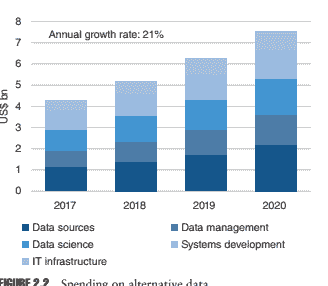
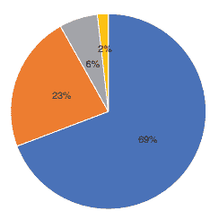
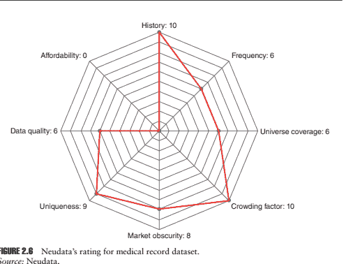
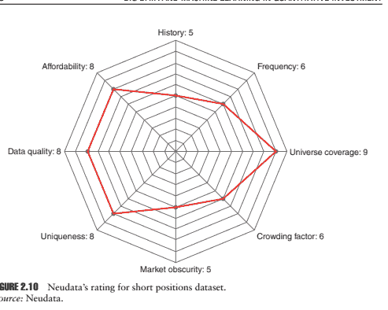
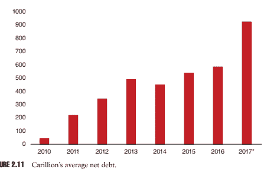

# 第二章：驯服大数据

Rado Lipuš 和 Daryl Smith

## 2.1 引言：替代数据 - 概述

大约 20 年前，一小部分富有创新精神的对冲基金和资产管理者开始使用替代数据和机器学习技术。然而，近年来，使用替代数据的基金经理数量和新的商业可用数据源的供应量都大幅增加。

我们已经发现了 600 多种商业可用的替代数据集，这些数据集在过去几年内已经上市。目前，每月约有 40 种新的经过彻底审查的替代数据集被添加到 Neudata 平台上的替代数据总数中。我们预计在未来几年内，数据集的总数将稳步增加，原因如下：（i）更多的数据枯竭公司正在将其现有数据变现，（ii）新的和现有的初创公司加入这一领域，提供新鲜和额外的替代数据产品。

## 2.1.1 定义：为什么‘替代’？与传统的对立

对于初学者来说，“替代数据”一词指的是可用于量化和自主投资策略中的投资管理分析和决策目的的新颖数据源。基本上，替代数据指的是过去七年中主要创建的数据，直到最近才对投资界可用。在某些情况下，创建替代数据的最初目的是为了提供分析工具，供各行各业的非投资公司使用。在许多其他情况下，替代数据是经济活动的副产品，通常被称为“排放数据”。替代数据主要由买方和卖方以及在一定程度上由私募股权、风险投资和公司非投资客户使用。

## 2.1.2 替代并非总是大数据，大数据也不总是替代

“大数据”和“替代数据”这两个术语经常被互换使用，并且许多人将两者都用于非结构化数据的情境，并且在某些情况下用于指代大量数据。

“替代数据”一词最初是由美国的数据经纪人和顾问使用的，大约五年前开始广泛被接受。与其他地区相比，美国资产管理行业更广泛理解替代数据的含义：例如，在欧洲，这一术语直到 2017 年才开始得到更广泛的认可。

在 2016 年和 2017 年，卖方、传统数据供应商和其他类型的会议组织者举办的大量会议和活动无疑有助于推广替代数据的认知度。此外，在过去一年里，许多关于替代数据和人工智能的调查和报告，由卖方银行、数据供应商和顾问撰写，也有助于教育买方和更广泛的行业。

替代数据源究竟指的是什么，有多少来源可用，哪些来源最适用？

## 2.2 采用的驱动因素 

## 2.2.1 创新扩散：我们现在处于何种状态？

金融行业在替代数据方面仍处于早期采用阶段（图 2.1）。这一点可以从积极寻找和研究替代数据来源的买方公司数量来证明。然而，替代数据的采用正处于向早期多数阶段过渡的关键时刻，因为我们观察到越来越多的资产管理公司、对冲基金、养老基金和主权财富基金正在建立替代数据研究能力。

大多数创新者和早期采用者位于美国，而欧洲和亚洲基金的比例很小。大多数创新者和早期采用者具有系统化和量化的投资策略，并且在相当大程度上是以消费者为重点的自主基金。

2017 年，我们看到基于基本策略的基金兴起。

然而，尽管传统管理者对使用替代数据的兴趣增加，但量化策略的采用速度明显更快。

我们怀疑其中一个主要原因是运营知识。简而言之，对于以基本策略为驱动力的公司来说，整合和研究替代数据更具挑战性，因为通常所需的技术和数据基础设施不足，研究团队经常存在显著的技能缺口。

因此，评估、处理、确保合规性和获取大量数据集的任务需要对现有流程进行彻底改革，并可能代表一个重大的组织挑战。

对于大型、成熟的传统资产管理公司，一个重要的障碍是向研究团队提供测试数据的内部流程缓慢。这个过程通常需要对新数据提供商进行尽职调查，为测试数据签署法律协议（在大多数情况下是免费的），以及（iii）合规团队的批准。资产管理公司内部这些流程的框架，以及因此需要为研究团队组织大量新数据集所需的时间，差异很大。在创新的对冲基金，这可能只需要几天/几周，而在不太注重数据和组织效率较低的资产管理公司，则可能需要数月时间。

投资界对替代数据的采用受到了金融科技的进步推动，并提高了分析不同数据集的技术能力。许多投资者、对冲基金和资产管理者都将这些发展视为传统投资方法的补充工具，可在未部署此类能力的投资经理身上获得优势。

今天，尽管许多投资专业人士声称替代数据是一种新的投资前沿，但可以说，这个前沿已经相当成熟，因为行业从业者现在已经相当普遍。正如 EY 2017 年全球对冲基金和投资者调查所指出的，当参与者被问及“您投资的对冲基金中有多少使用非传统或下一代数据和‘大数据’分析/人工智能来支持其投资流程？”时，平均答案为 24%。也许最有趣的是，当同一参与者被问及他们预计三年后这一比例将是多少时，答案增加到了 38%。

根据 Opimas Analysis 的数据，投资管理者在替代数据上的全球支出预计将以 21%的复合年增长率增长，预计到 2020 年将超过 70 亿美元（图 2.2）。

图 2.2 替代数据支出。

来源：Opimas 分析。来源：https://www.ft.com/content/0e29ec10-f925-11e79b32-d7d59aace167

## 2.3 另类数据类型、格式和范围

另类数据源的分类有几个挑战。首先，数据提供商提供的信息描述其产品的方式往往不一致且不完整，不足以满足投资管理目的。其次，另类数据的性质可能复杂且多方面，以及源数据通常无法轻松分类或描述为单一类型。传统来源，如 Tick 或价格数据、基本数据或参考数据，较不复杂，更容易定义。

我们将每个数据源归类为 20 种不同类型，对于大多数另类数据示例，多个类别都适用。例如，一个环境、社会和治理（ESG）数据集可能包含“众包”、“网络爬取”、“新闻”和“社交媒体”的组成部分（见图 2.3）。更进一步，数据集还可以是派生产品，并以不同格式提供：

1. 原始数据，占我们数据源的 28%。

2. 结构化或聚合，35%。

3. 信号（派生指标），22%。

4. 报告，15%。

## 2.3.1 另类数据分类和定义 

表 2.1 数据分类类型

| 数据集类别 | 定义 |
| --- | --- |
| 众包 | 数据是从大量的贡献者那里收集的，通常使用社交媒体或智能手机应用程序 |
| 经济 | 收集的数据与特定地区的经济相关。例如，贸易流量、通货膨胀、就业或消费者支出数据 |
| 环境、社会和治理（ESG） | 数据被收集以帮助投资者识别不同公司的环境、社会和治理风险 |
| 事件 | 任何能够告知用户股票价格敏感事件的数据集。例如，收购通知、催化剂日历或交易警报提供的例子 |
| 金融产品 | 与金融产品相关的任何数据集。例子包括期权定价、隐含波动率、ETF 或结构化产品数据 |
| 基金流向 | 与机构或零售投资活动相关的任何数据集 |
| 基本面 | 数据来源于专有的分析技术，与公司基本面相关 |
| 物联网 | 数据来自于相互连接的物理设备，例如 Wi-Fi 基础设施和带有嵌入式互联网连接的设备 |
| 位置 | 数据集通常来自于手机定位数据 |
| 新闻 | 数据来自于新闻来源，包括公开可用的新闻网站、新闻视频频道或特定公司的公告供应商 |
| 价格 | 定价数据来源于交易所内外 |
| 调查和投票 | 底层数据是通过调查、问卷或焦点小组收集的 |
| 卫星和航拍 | 底层数据是通过卫星、无人机或其他航拍设备收集的 |
| 搜索 | 数据集包含或来源于互联网搜索数据 |
| 情感分析 | 输出数据来源于自然语言处理（NLP）、文本分析、音频分析或视频分析等方法 |
| 社交媒体 | 底层数据是通过社交媒体来源收集的 |
| 交易型 | 数据集来源于收据、银行对账单、信用卡或其他数据交易等来源 |
| 天气 | 数据来源于收集天气相关数据的来源，如地面站和卫星 |
| 网络抓取 | 数据来源于定期从网站收集特定数据的自动化过程 |
| 网络和应用跟踪 | 数据来源于（i）从现有网站和应用程序中归档并跟踪每个网站的特定变化的自动化过程，或者（ii）监视网站访客行为 |
| 出处：Neudata。 |   |

## 2.3.2 有多少替代数据集？

我们估计今天买方使用的替代数据源超过 1000 个。其中大多数 - 21%（图 2.4） - 属于网络和应用相关数据类别，8%是宏观经济数据，包括就业、国内生产总值（GDP）、通货膨胀、生产、经济指标等多个子类别（图 2.4）。

前六个数据类别占所有数据源的 50%。需要注意的是，一个数据集可以被归类到多个类别中。一个数据集可能包含多个来源，并且适用于不同的用例。

然而，投资管理中使用这些数据源的方式并不统一，并不反映数据源的供给方的情况。

## 2.4 如何知道哪些替代数据有用（哪些没有）

对许多基金经理来说，最终的问题是选择哪个数据源进行研究或回测。其中一个关键问题是，哪个数据集易于操作？

需要进行多少数据清理、映射和准备工作，才能准备好并集成一个研究数据库中的数据集？

我们试图回答这些问题的一种方式是根据表 2.2 中的八个因素为每个数据集评分。可以理解的是，每个基金经理对表 2.2 中哪些因素最重要会有不同的看法。许多人会有特定的“硬性停止”。例如，一个人可能只想回测一个具有至少五年历史、每年成本低于 50000 美元、至少每日更新一次，并且与至少 1000 个公开上市的股票相关的数据集。

当然，上述因素只是一个初步概述，以便机构投资者准确了解一个数据集与另一个数据集的差异。除此之外，还有许多定性因素需要考虑，以便评估一个数据集是否值得进一步调查。这通过一个彻底的调查过程来实现，该过程试图回答 80 到 100 个问题，这些问题反映了我们经常从投资界收到的查询。例如：

1. 数据的基本来源是什么？

2. 数据是如何收集和随后交付的？

3. 三年前的数据是否像今天一样完整？

4. 面板规模随时间的变化如何，存在哪些偏差？

5. 数据交付是否及时？

6. 数据是否是“点对点”的？

7. 数据是否映射到标识符或代码，如果是，是如何映射的？

8. 这个数据集与类似产品有何区别？

9. 到目前为止，哪些机构投资者对此提供感兴趣（如果有的话）？

10. 地理覆盖范围是什么，这可能会如何扩展？

11. 与该数据集相关的可投资公司具体清单是什么？

| 因素 | 描述 |
| --- | --- |
| 数据历史长度 | 可用历史数据的最早时间点 |
| 数据频率 | 数据可以交付的频率 |
| 宇宙覆盖 | 数据集涉及的可投资公司数量 |
| 市场的隐蔽性 | Neudata 对于机构投资者对该数据集的熟悉程度的评估 |
| 拥挤因素 | Neudata 对于使用此数据集的多少对冲基金和资产管理客户的估计 |
| 独特性 | Neudata 对于此特定数据集的独特性的评估 |
| 数据质量 | Neudata 对数据的完整性、结构、准确性和及时性的评估的一个函数 |
| 年度价格 | 数据提供商收取的年度订阅价格 |
| 来源：Neudata。 |   |

TABLE 2.2 评估替代数据有用性的关键标准

我们通过与数据提供商举行多次会议、审查样本数据（通常与感兴趣的客户共享）以及审查独立的相关来源（例如学术论文）来找到这些问题的答案。通过执行这些步骤，不仅创建了一个全面而独特的数据集概要，还可以提供建议的用例，这些用例可应用于回测过程。

## 2.5 替代数据的成本是多少？

对于数据提供商和替代数据的购买者来说，最具挑战性的问题之一是如何确定数据集的价格。

对于许多新进入金融服务行业的数据提供商来说，确定价格可能非常困难，原因有两个。首先，在许多情况下，新提供商对同行或可比数据订阅定价的理解和知识是不存在的或非常有限的。其次，数据提供商不知道买方将如何使用其数据，以及数据集对资产管理者提供的价值或 alpha 有多大。对于资产管理者来说，数据集的增值将取决于许多因素，例如投资策略、时间跨度、宇宙规模以及许多其他对基金经理策略独特的因素。如果新的替代数据源与资产管理者已经使用的数据集高度相关，那么新的替代数据源的边际 alpha 可能会太小。

对于开始研究替代数据的资产管理者来说，挑战在于为数据订阅制定预算。年度数据订阅价格将根据数据格式（如第 2.3 节所述）、数据质量和其他数据提供商特定因素而大幅变化。替代数据集的价格范围从免费到 250 万美元年度订阅费用。大约 70% 的数据集定价在每年 1 至 15 万美元的范围内。还有几个免费的替代数据集。然而，对于一些免费数据源，可能存在数据检索、清理、规范化、映射到标识符等间接成本，以使这些数据源对基金经理的研究和生产有用（图 2.5）。

## 2.6 案例研究

下面显示了过去一年由 Neudata 的数据搜索团队收集的五个例子。仅提供了全面报告的摘录，并且提供者名称已被混淆。

## 2.6.1 美国医疗记录

提供商：一家早期数据提供商，能够在处方后的三天内提供医疗保健品牌销售数据。

## 2.6.1.1 总结 

该组提供了从医疗记录中得出的对医疗保健行业的见解。在过去的七年里，该公司与美国各地的医疗转录公司合作，并使用自然语言处理（NLP）技术来处理数据。

该数据集提供约 2000 万份医学转录记录，涵盖了所有 50 个州，每月新增 125 万条记录（2016 年每月新增 25 万条记录），7000 名涵盖所有专业领域的医生，和 700 万名患者。数据在患者离开医生办公室后的 72 小时内就可以获得，并且可以以结构化或非结构化格式（CSV 文件）访问。

## 2.6.1.2 关键收获 

该团队声称是唯一商业化这些数据的公司。迄今为止，该产品已被用于(i)追踪药物上市后的情况，(ii)调查特定品牌被低估的原因，以及(iii)在 FDA 批准前发现涉及公司产品和标签扩展的不良事件。

## 2.6.1.3 状态 

公司在过去的六个月里曾与两家自营对冲基金合作，并现在正在寻求达成独家交易（图 2.6）。

## 2.6.2 印度发电数据

提供者：一家已经建立的数据提供商，但尚未推出涉及印度电力行业的每日数据交付。

## 2.6.2.1 摘要 

这家数据提供商的核心业务包括向对冲基金、经纪商和商业银行的客户提供数据分析和研究服务。

其中一个尚未推出的产品将提供印度电力行业的每日更新。具体来说，这包括电力供应的数量（以百万单位计的能量）和质量（以兆瓦计的峰值短缺），按地区和州划分。数据集还将包括电力发电在州和来源（即煤炭、太阳能、风能和水电能源）之间的分配。总共，每天将更新约 10000 个数据点。

## 2.6.2.2 关键收获 

我们相信这是一个独特的产品，因为数据的细粒度和交付频率。全面的细节，比如发电厂的发电量，可以从 2014 年开始提供。较少详细的数据集可以从 2012 年开始提供。一旦推出，数据集可以通过 API 提供。

## 2.6.2.3 状态 

到目前为止，尚无客户使用这个数据集，该团队正在积极寻找对这样一个数据集感兴趣的机构。一旦找到感兴趣的方，我们了解到设置 API 数据源需要大约四周的时间（图 2.7）。

## 2.6.3 美国收益表现预测

提供者：一家投资银行的数据服务部门，为 360 家美国公司提供收益表现预测，主要集中在零售部门。

## 2.6.3.1 摘要

这项产品于 2016 年 9 月推出，结合了（i）在线用户搜索数据，（ii）来自 6500 万设备组成的地理位置数据，以及（iii）销售点交易数据。输出是一个季度信号，旨在向客户提供有关给定公司相对于以前季度表现如何的想法。收益信号在给定公司财务季度结束后的 3 到 10 天通过 FTP 或该团队的网站交付。整个宇宙的历史数据从 2012 年末开始可用。

## 2.6.3.2 要点

潜在用户应注意（i）提供的不是绝对收益数字，而是相对于以前期间的任意比例为每家公司提供的相对收益措施，（ii）最近扩展的宇宙的外样本数据仅有四个月历史，（iii）直到最近，该产品仅涵盖大约 60 家美国股票； 2017 年 8 月，该宇宙扩大到 360 只股票，并超出零售领域，包括电影院、餐厅和酒店连锁店。

自那时起，该团队告诉我们，客户的兴趣显著增加了。

## 2.6.3.3 状态

大约有八个客户正在使用此数据集，其中一半是量化基金。尽管最近几个月来的兴趣增加了，但我们了解到该团队渴望限制访问（图 2.8）。

## 2.6.4 中国制造业数据

提供者：一家利用先进的卫星图像分析来协助用户跟踪中国经济活动的数据提供商。

## 2.6.4.1 摘要

这项产品是一个制造指数，其计算基于中国大陆约 6000 个工业区的图像，覆盖面积为 50 万平方公里。

用于构建指数的数据点每周以 CSV 文件的形式向客户交付，延迟两周。历史数据可追溯至 2004 年。

## 2.6.4.2 要点

该团队声称该产品是中国工业活动的最快和最可靠的指标。具体而言，该团队声称该指数比中国采购经理人指数（PMI）更准确，后者经常因缺乏准确性和可靠性而受到观察者的质疑。

## 2.6.4.3 状态

该团队于 2017 年初开始向一家大型跨国银行的定量部门出售基础数据。最近，其他定量分析师也对此表现出了兴趣，到目前为止，该团队有四个客户接收相同的基础数据。

由于客户需求，该团队正在使用 CUSIP 对特定工业区进行映射过程，预计将于 2018 年初完成（图 2.9）。

## 2.6.5 空头数据

提供者：这家公司收集、 consolida 和分析全球超过 600 家投资经理持有的上市证券的所有权数据。

## 2.6.5.1 概要 

该团队从 30 多个国家的监管机构收集披露，详细说明了大约 3200 家股票的多空头寸。 这些披露是

由投资经理整合并允许客户对聚合输出执行自己的分析。 例如，客户可以发现在特定时间段内有多少其他经理对给定股票进行了相同的空头持仓，以及他们的头寸有多大。 每天提供更新，并且可以从 2012 年起获得历史数据。

## 2.6.5.2 主要收获 

所有权数据以简单，标准化的格式呈现，易于分析。 相反，监管机构提出的数据通常没有标准化，并且有时可能会误导。 例如，许多资产管理人以不同的名称披露空头寸，这可能是试图低估其头寸。

然而，该提供的数据收集方法能够识别此活动，并相应地汇总披露，为给定证券提供全球，准确的经理级持有。

## 2.6.5.3 状态 

该团队在 2017 年扩张，无论是在覆盖范围上（在 2H17 添加了北欧和额外的亚洲国家，包括台湾，新加坡和韩国）还是在资产管理客户上（从 1H17 的零增加到 2H17 的 12）（图 2.10）。

## 2.6.6 Carillion 的倒闭 - 一种用例示例用于 Alt Data

哪些替代数据提供商可以识别 2018 年 1 月进入清算程序的英国建筑服务公司 Carillion 的倒闭？

以下我们描述了五种非常不同的替代性数据产品以及其数据与 Carillion 输出之间的关联。

## 2.6.6.1 一个采购数据提供商确定了 Carillion 日益增长的债务负担

如此广为人知的是，2017 年 Carillion 的最大问题之一是债务增加。

截至年底，平均净债务达到 9.25 亿英镑，同比增长 58％，如图 2.11 所示。

然而，我们发现最有趣的是，从 2017 年 7 月 Carillion 首次盈利警告到 2018 年 1 月清算之间，该集团（及其子公司）赢得了价值 13 亿英镑的 10 项公共部门奖项 - 进一步增加了集团的债务负担，并且可能揭示了政府没有意识到 Carillion 处于多么严重的财务困境中。

一个数据提供商不仅会发现这些合同奖项（因此，不断增长的债务负担），还会提供额外的分析。 该提供商的数据库涵盖了过去五年的公共采购通知，并提供了超过 62,000 个供应商的详细信息。 每日更新，其中包含价值超过 2 万亿英镑的招标通知和价值 7990 亿英镑的合同奖项。 通过搜索诸如 Carillion 之类的特定名称，用户可以获得指标，例如：

1. 未来到期合同的数量和价值。

2. 已赢得合同与任何时期到期合同的比率。

3. 市场份额趋势，平均合同规模，收入集中度和客户流失率。

## 2.6.6.2 这个贸易聚合器提供了详细的空头头寸分析

卡里利安的失败也受到了对冲基金的关注，这些基金做出了空头交易（例如 Marshall Wace 和 CapeView Capital），并且早在 2013 年就开始对该集团采取了空头头寸。在 2017 年 7 月 10 日该集团股价下跌了 39% 之前，卡里利安是富时 250 指数中空头头寸最多的股票之一。尽管这种显著的空头利益相对为人所知，但要从公开披露中准确确定（i）谁持有什么股份，（ii）持有时间多长，（iii）每个空头持有者在任何时候的盈亏仍然很困难和耗时。

在我们看来，一个特定的数据供应商将非常有用。该集团收集、整合并分析全球 600 多家投资经理持有的上市证券的所有权数据。此外，该公司通过投资经理整合这些披露，并允许客户对汇总输出进行自己的分析。就卡里利安而言，用户将会知道，例如，Marshall Wace 持有他们的仓位多长时间，这在时间上是如何变化的，以及所有未平仓交易的当前盈亏情况。数据每天更新，历史数据从 2012 年提供（图 2.12）。

## 2.6.6.3 另一家提供商可以帮助识别晚发票付款的历史。

卡里利安案例还凸显了延迟支付的问题，之后透露该集团向分包商支付了 120 天的延迟。正如富时文章《卡里利安倒闭加剧了分包商反对延迟付款的案例》所强调的那样，英国政府在 2017 年通过了法规，意味着大公司需要每年报告两次他们的支付条件（其中大多数公司将在 2018 年 4 月首次这样做）。然而，通过观察公司发票数据，比如另一家提供商提供的数据，可以找到更详细的分析和更新更频繁的数据。

尽管该集团无法向我们确认它是否具有与卡里利安特定的发票数据，但我们认为该集团，以及其他折价票据提供商，值得一提，因为它们是帮助识别处于财务困境初期的公司以及哪些公司正在经历的有用来源（图 2.13）。

## 2.6.6.4 这家薪酬基准数据提供商指出，在崩溃后，高管薪酬与同行相比较高的比率，

董事会学会代表英国老板的主要游说团体称颂 Carillion 的董事们获得的薪酬“极不合适”，指出“Carillion 缺乏有效的治理”，并补充说现在必须“考虑董事会和股东在崩溃前是否行使了适当的监督责任”。

实际上，回顾起来，2016 年 Carillion 对高管奖金的追索条件的放松似乎是相当不合适的。

我们询问了一家特定薪酬基准数据提供商的首席执行官，是否可以通过简单研究 Carillion 的薪酬数据找到任何警示信号。

根据该提供商的记录，尽管 Carillion 的平均员工工资大致符合其竞争对手的水平，但与同一行业高管薪酬相比，高管薪酬比例高于平均水平（图 2.14 和 2.15）。

与这家数据提供商进一步讨论后，明确了其基金经理客户可以得知从 2015 年开始，高管与平均薪酬比的比率呈上升趋势。此外，提到 2014 年首席执行官的加薪，几年前似乎就已经注意到了可疑的高管薪酬迹象：

看到过安然，凡萊特和其他管理灾难，当公司需要两页来披露首席执行官的加薪时，情况就不对了。

## 2.6.6.5 这家企业治理数据提供商指出了未解释的高管离职

在询问其对 Carillion 的看法时，一家企业治理数据提供商指出，对他们来说最大的红旗之一是几名高管无任何解释地离开了公司。

例如，2017 年 9 月，Carillion 财务总监扎法尔·汗在担任不到一年后突然辞职，没有对他突然离职的解释。Carillion 还进行了一系列管理重组，导致战略总监肖恩·卡特从他的职位上离职 - 同样在宣布中没有解释。

该数据提供商的首席执行官表示：“这些未解释的离职在我们看来引起了潜在的治理问题。”

以及董事会成员构成的不够多样化。

此外，同一提供商指出，人们可以质疑董事会成员的构成混合，以及是否有董事具备适当的技能/专业知识来管理公司，或者是否有健全的风险管理和公司治理实践（图 2.16）。

## 2.7 最大的替代数据趋势

在这一部分中，我们简要介绍了替代数据领域中我们正在看到的一些最大趋势。

## 2.7.1 替代数据仅适用于股票吗？

在分析替代数据时发现的一个令人惊讶的发现是，它适用于所有资产类别，而不仅仅是上市股票，这是最常见的假设。

所有替代数据集的百分比适用于非上市股票或私营企业。

关于私营企业及其品牌和产品的数据正在被自由裁量管理人员和私募股权公司用于比较分析（图 2.4）。

## 2.7.2 供应端：数据集发布

2017 年，我们看到了位置、网络和应用跟踪来源大幅增加。2017 年所有新发布的商业可用数据来源中，有四成来自这三类数据。

值得一提的另一组数据是交易数据集，特别是涵盖非美国地区的（图 2.5）。

## 2.7.3 最常见的查询

关于需求，2017 年大多数月份所询问的热门类别包括 ESG、交易、情绪和经济数据。

## 2.8 总结

替代数据领域非常分散，新的数据提供者和现有提供者正在加速推出新数据集。最大比例的数据集适用于美国市场。然而，非美国数据提供者正在追赶替代数据的供应。我们认为，适用于公开股票的替代数据约占所有数据的近 50%，而对于非上市股票、固定收益、外汇和商品的数据可用性，远比买方社区意识到的要广泛。

替代数据的应用案例备受保护，而且很难找到 alpha 和数据集实用性的证据。

替代数据的采用仍处于早期阶段。然而，系统性和量化策略已经最积极地探索替代数据来源，并拥有显著的数据预算和研究团队。2017 年，我们观察到基本或自由裁量策略在替代数据研究项目和工作方面显著增加。总的来说，与买方使用传统数据源相比，替代源的使用仍然微不足道。除了买方对替代数据的有限使用外，还要指出，替代数据在大多数情况下被用作多因素方法的一部分。同一数据集可以用于不同的时间范围，此外，用例和方法也各不相同。

早期采用者有明显的优势和机会。此外，有强有力的证据表明，某些数据集将取代或替代现有广泛使用的来源，并成为未来的主流数据来源。

