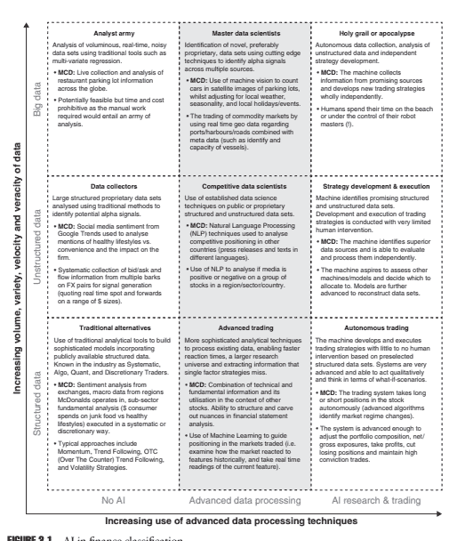
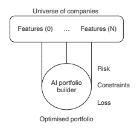
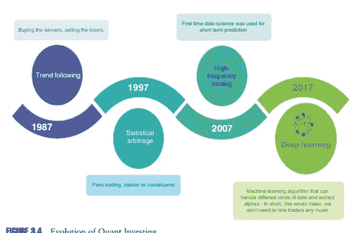

# 第三章：投资管理中机器学习应用的现状

叶卡捷琳娜·西洛特尤克

## 3.1 引言

通过每天通过智能手机应用程序，家用产品如 Alexa 和 Google Home 以及 Uber 和 Facebook 服务中使用的匹配算法等应用人工智能（AI）的应用，金融服务业以外的行业专业人士和学术界纷纷猜想为什么投资管理行业的大部分，如果不是绝大部分，不是由上述科技公司使用的算法原则管理的。我经常与专业人士和客户进行谈话，他们猜测如果 AlphaGo 能够如此快速地学会击败人类，那么在几年内，主导机构和零售投资者资金的很大程度上将是世界上的 AlphaGo。然而，除了交易成本、数据收集和处理以及执行基础设施等问题外，金融市场代表着一个更加复杂的生态系统，其中不断反馈的参与者不断地重写规则。

## 3.2 数据，无处不在的数据

在这种情况下，一个普遍的假设是，对专有数据或大数据的访问将先验地为投资策略创造长期的竞争优势。例如，在会议演示中，人们已经讨论过，具有客户数据访问权限的全球企业的企业财务和财务部门（如宜家）雇用量化分析师来理解公司的全球信息流并创建专有的交易信号。仅凭客户购买行为和电子商务/网站分析/社交媒体的“签到状态”信息就已经证明无法生成优秀的信号。为了获得更好的交易结果，需要具有宏观信息（利率、货币）、技术数据（交易模式）和基本来源（公司收益信息）必须被纳入考虑。全球企业养老金计划和苹果公司等公司金融部门对外部资产管理人的传统和替代指令搜索数量几乎证实了这一观点，即数据访问并不是投资策略成功的充分条件。

这些结果并不令人惊讶。金融数据与 99.9%的人工智能所使用的数据不同。此外，金融专业人士更广泛地获得大数据的机会是最近才开始的。越来越多的数据科学家一直在将新兴数据集转化为金融交易目的。大数据的处理和利用与金融数据有何不同？首先，让我们比较图像背后的数据（可以从 CIFAR（n.d.）的公共可用库中挑选一张图片，或者拍一张照片）和自成立以来的苹果股票每日股价数据（TechEmergence 2018）。

很明显的是，(CIFAR)图像数据集是静态和完整的 - 其元素之间的关系在所有时间内是固定的（或任何照片都是如此）。在 CIFAR 案例中，图像具有 100%的标记。相比之下，根据计算（TechEmergence 2018），苹果的每日股价有 >∼10k 个数据点 - 自 1980 年 12 月 12 日上市以来的每个交易日都有一个。即使以分钟为单位的分辨率（TechEmergence 2018），数据点的数量也会与单个低分辨率照片相似，并且与普通照片中的像素之间的关系基本不同。股票的金融数据系列并不是一个大数据。数据科学家可以通过从各种数据源（如电子原材料价格、汇率或者对苹果的 Twitter 情感）进行投影，从而创造出一个苹果的大数据分析问题。然而，人们必须意识到，在大数据中，会有许多变量的组合可能与苹果的价格巧合。因此，在金融领域成功应用人工智能方法将取决于数据科学家将有关苹果的数据转换为特征的工作。

特征工程是价值链的一个组成部分，其过程是将原始数据转换为更好地代表预测模型中潜在问题的特征，从而提高模型对未见数据的准确性。在人工智能领域取得成功归根结底归结为表征问题，科学家必须将输入转换为算法可以理解的东西。这需要大量的工作来定义数据集、清理数据集以及进行训练以及经济直觉。

尽管较少提到，人工智能一般多年来一直被一些资产管理公司使用（最初是高频交易公司）（Kearns 和 Nevmyvaka 2013），大多数情况下是在执行方面（以降低总体交易成本），而不是在投资信号生成和投资组合管理方面。处理能力速度的增加以及数据处理和存储成本的降低改变了金融公司应用人工智能技术于投资管理过程更广泛部分的经济学。然而，仍然存在差异，这些差异涉及对金融市场状态进行建模，这促使人们对将人工智能引入金融领域与其他行业采取谨慎态度（NVIDIA 深度学习博客无日期）：

(a) 不同于一些其他具有静态关系的环境（如照片的情况），游戏规则随时间而改变，因此问题是如何忘记过去有效但现在可能不再适用的策略。

(b) 市场状况只能部分可观察 - 因此，即使市场配置相当相似，也可能导致相反的发展趋势。

(c) 信号目标并不像猫狗分类问题那么简单，人们不能立即验证信号的有效性。

本章的后续部分将指导读者了解金融领域人工智能应用的光谱，阐述行业与 AI 促进因素的相互关系，并就未来行业发展的情景展开讨论。我们将为从业者、学生和年轻专业人士提出建议作出结论。

## 3.3 人工智能应用的光谱 

## 3.3.1 Ai 应用分类

为了更好地了解通过 AI 进行投资和利用大数据的潜在发展（Sirotyuk 和 Bennett 2017），瑞士信贷的 AI 专家将该行业分类如图 3.1 所示。当读者沿着 y 轴向上移动时，数据复杂度与大数据的四个 V（速度、多样性、容量、真实性）相一致增加。较低的列意味着利用标准价格数据（合同价格数据源），基本指标（P/E，P/B，**Div Yield（股息率）**和情绪数据。较高的列使用更复杂的数据（包括文本和语音等非结构化数据），并包括以专有方式收集或处理的数据（例如，市场影响，对手在短时间内的报价-询价）。y 轴上的顶级代表大数据，如通过卫星图像跟踪海洋流动和停车场占用情况。

在 x 轴上，作者逐渐引入更先进的数据处理技术，这些技术更适合解释和对这些复杂数据集做出反应 - 从传统工具（如分析统计学）到基于 AI 的研究系统（例如自然语言处理，NLP）到完全自主的 AI 交易系统。

引入了一个共同点 - 麦当劳股票交易 - 作为一个例子，说明了在每个框中算法设计和交易如何发展。

麦当劳案例之后是投资管理行业应用的一个例子。

在短期至中期内，通过 AI 应用提高 alpha 的预期发生在表格的中等列中，由“高级交易”表示，'竞争数据科学家'和'主数据科学家'。

## 3.3.1.1 高级交易 

被归类为'高级交易'的内容倾向于使用复杂的分析技术处理现有数据，并实现更快的反应时间。

那些交易员能够处理大量数据集或文本，并提取有价值的信息。一个很好的例子是你在公司报表中有不同的脚注时（资产负债表或利润表），AI 系统能够系统地进行捕捉（Allison 2017）。

## 3.3.1.2 竞争数据科学家 

竞争数据科学家代表利用公共和专有、结构化和非结构化数据集的投资组合 - 例如，一个投资组合经理会尝试使用 NLP 技术分析媒体对某个地区或国家的一组股票的态度是否积极或消极（Allison 2017）。

## 3.3.1.3 主数据科学家 

主数据科学家可能已经使用非常先进的卫星图像来了解海上或港口船只的位置，以了解市场中的流动情况。

随着系统获取更多数据，经过训练和测试，演变向右移动（Allison 2017）。展望未来，我们应该期待看到投资行业从结构化数据和有限的人工智能转向融合一些非结构化数据和更先进的数据处理技术。参与者的方式显然取决于他们的技能组合，以及某些数据的可用性或开发自己的专有数据集和/或大数据融合的经济学。

## 3.3.2 金融分析师还是竞争性数据科学家？

为了演示 AI 系统如何扮演金融分析师的角色（又称'竞争性数据科学家'，如图 3.1 所示），可以看到图形处理单元（GPUs）和翻译器促进了深度学习（一类基于学习数据表示的机器学习方法）的实施（NVIDIA 深度学习博客 n.d.）。多年来，金融分析师的工作是定期筛选新闻文章，听取公司电话会议，与投资者关系部门联系，从定性讨论中得出结论并向交易员提出建议。这个过程耗时且相当手动。它还需要专业化，因为分析师按部门和/或地理位置划分，并且需要具备本地语言知识或通过先前的工作凭证具有对‘家庭’行业的理解。现在想象一下，使用 GPU 和深度神经网络库，这个‘虚拟分析师’ - 机器 - 可以将来自公共和专有数据库的新闻输入到深度学习系统中（NVIDIA 深度学习博客 n.d.）。训练后，机器可以在每三毫秒解剖一篇文章（相比之下，金融分析师在 2-3 分钟内浏览一篇文章）；这样，机器每天处理数十万篇文章。该过程的工作方式如下。AI 系统在文章中识别数百个关键词。然后，‘一个无监督学习算法为每个关键词赋予一个数字值，然后系统的其他模型可以解释和处理。深度学习系统的结果包括：

（a）将文章链接到适当的股票和公司；

（b）为每篇文章辨别情绪得分，范围从积极到中性到消极；和：

（c）访问新闻对市场影响的可能性。该系统还意识到‘假新闻’，因为有信誉的来源被赋予更高的权重以提高结果的可靠性（NVIDIA 深度学习博客 n.d.）。

## 3.3.3 投资流程变化：‘自主交易’案例

AI 处理的引入影响了投资团队的组织结构，随后影响了投资流程。以股票投资组合经理为例（基础股票选择者），负责投资组合中的股票的最终决定权。他过去依赖于研究团队、执行交易员以及他自己对他所交易市场的理解的输入。分析师往往在利基行业拥有多年的经验，在行业联系人中拥有广泛的网络，并多次与关键的 C 级高管交谈过。分析师的任务已逐渐转向建立和维护复杂模型、与高管交谈、记录、设置关键日期和通知警报等。基本上，已经建立了一个迭代的决策过程，例如：

- 第 1 步：分析师研究，然后

- 第 2 步：向投资组合经理提供输入，然后

- 第 3 步：投资组合经理构建投资组合，例如股票包含的权重/排除，然后

- 第 4 步：投资组合经理执行投资组合，重点是交易规模和交易结构，然后

- 第 5 步：返回第 1 步。

现在想象一下，我们可以将股票选择和投资组合构建过程交给一台机器，并要求机器就研究和投资组合构建做出联合决策。联合决策为我们提供了更多的数据，并进入了大数据/AI 问题领域。如果机器还开始交易证券来实施投资组合，我们就会按照图 3.1 移动到“自主交易”。这个问题设计结果就是一个深度学习框架的例子，如图 3.2 所示。

## 3.3.4 人工智能和策略开发

拥有大量模型库和交易历史记录的资产管理者处于利用自动化资本配置策略的有利位置。在投资者谈话中经常发生这种情况，当分配者与系统公司讨论多策略提供时，他们听到的销售宣传是，风格或模型簇之间的分配是 1/3、1/3、1/3，或者在投资组合背景下相关的任何 N。通常，对于天真的风格或模型簇分配策略，解释了分散化效益和进行模型定时的能力有限。公司正在日益在模型库上测试神经网络的部署，看看是否实际上可能有一些时机。因此，拥有更强大的基础设施和模型注册表的资产管理公司可能会提出自动化的资本配置策略。

更快的信息收集将进一步支持投资管理行业在人工智能-大数据轨道上的发展。观察一些著名的领先指标，投资经理在历史上已经考虑了采购经理指数（PMIs）、就业、干散货指数等因素进行决策。所谓的现在预测技术的到来有望使人们能够在（发布之前）更早地了解国内生产总值（GDP）和其他基准（Björnfot 2017）。现在预测背后的基本原则是，关于 GDP 变化方向的信号可以从大量和异构的信息来源（例如，工业订单和能源消耗）中提取出来，而 GDP 本身尚未发布。不仅 GDP，而且制造活动也可以以不同的方式进行衡量。

因此，美国公司 SpaceKnow 推出了一个专门的中国卫星制造指数，该指数利用了中国境内超过 500 000 平方公里的 2.2 十亿卫星观测数据和 6000 多个工业设施（Kensho Indices n.d.）。

## 3.4 行业的相互联系和人工智能的推动者 

## 3.4.1 人工智能开发的投资

金融市场中人工智能的使用的进步是由人工智能在服务行业更广泛的渗透以及行业发展的相互联系所推动的。

人工智能的概念，尤其是神经网络，并不新鲜；然而，巨大的计算能力最终使得对巨大数据库（图像、视频、音频和文本文件）进行复杂处理成为可能，这些数据库产生了足够的数据供人工智能操作（Parloff 2016）。对人工智能初创企业的风险投资也有所增加。据 CB Insights（CB Insights n.d.）称，2017 年，排名前 100 的人工智能初创企业筹集了 117 亿美元，共进行了 367 笔交易。相比之下，五年前，以人工智能作为其产品核心部分的初创企业的总融资额为 50 亿美元。自 2012 年以来，该行业的交易和资金投入一直在上升。

上述数字不包括科技巨头在其自身 AI 能力上的内部投资。在公司级别上，Google 在 2012 年进行了两个深度学习项目（Parloff 2016），而目前该公司正在所有主要产品领域开展 1000 多个项目，包括搜索、Android、Gmail、翻译、地图、YouTube 和自动驾驶汽车。对于一位自由主题投资者来说，寻找对外国市场的本地洞察力的明显途径是阅读外语的在线新闻或论坛（在当地分析师的帮助下），或者听取 C 级高管对投资的不同看法，正如我们之前讨论的那样。天真地说，一个人可以使用谷歌翻译进行翻译服务，再加上 1-2 位关键分析师，而不是当地的分析师。如今，谷歌翻译（Parloff 2016）能够将一种语言的口语句子转换为另一种语言的口语句子，同时为 103 种语言提供文本翻译。目前，这种语言转换的质量可能会受到质疑，但方向已经确定。

## 3.4.2 硬件和软件开发

NVIDIA 在 2000 年代推出了 GPU，并进行了硬件革命，这些芯片最初是为了给玩家提供丰富的视觉 3D 体验而设计的，这些芯片足够灵活，可以用于其他工作负载。对于它们适用的任务，GPU 比以前使用的传统中央处理单元（CPU）效率高出许多倍。

竞争对手也在追赶。例如，英特尔在 2016 年 8 月收购了一家深度学习初创公司 Nervana Systems，以及 2017 年 3 月收购了芯片制造商 Movidius 和视觉专家 Mobileye。这些收购使该公司能够创建一系列专门用于人工智能的芯片。这一发展肯定会支持大数据提供者行业。此外，2016 年，谷歌宣布在其数据中心内使用张量处理单元（TPU）（Google Cloud 2017）（该单元设计用于大量低精度计算，并且特别与谷歌的开源库 TensorFlow 一起使用）。基本上，这意味着谷歌服务，如 Google 搜索、街景、Google 照片、谷歌翻译都在幕后使用 TPU 加速其神经网络计算。谷歌现在正在推出第二代这些芯片，以提供更广泛的能力。

除了硬件开发外，软件开发，尤其是开源框架，已经帮助了大数据提供商（Financial Stability Board 2017）。在软件行业，开源的概念已经存在多年。基本上，这意味着特定技术或解决方案的源代码是开放的，任何人都可以添加和改进（Shujath 2017）。已经证明，这种方法通过一个开发者社区共同解决 bug，加速了产品创新并提高了产品质量。它使原始产品能够开发新功能。包括微软、谷歌和亚马逊在内的厂商已经将他们的人工智能解决方案开源（Shujath 2017）。

## 3.4.3 规章制度

尽管不常被强调，但美国和其他一些国家的市场监管机构允许公开交易的公司使用社交媒体发布公告，这促成了事件数据集的创建（Financial Stability Board 2017）。到目前为止，地理空间数据聚合商已经能够聚合并转售他们聚合的分析数据。随着计算能力和成本的降低，精度和及时性也随之而来——直到最近，卫星图像的挑战在于数据根本不够频繁，无法及时应对作物压力。每日图像正在成为一个改变者（Anon n.d.-a）。在过去几年中，大数据提供商已经蓬勃发展；但是，人们必须注意这些公司的年轻本质——它们只存在了几年。这方面的例子是 Terra Bella（以前是 Skybox），它提供了对零售商停车场内汽车数量或港口自然资源储量的分析，以及另一个卫星图像提供商 Orbital Insights（Anon n.d.-b）。

## 3.4.4 物联网

当涉及到特定行业，例如农业或能源时，大数据收集是通过无线传感器和其他监测设备的部署实现的（Financial Stability Board 2017; Anon n.d.-b）。作为物联网（IoT）的常见技术，被深入应用于许多行业，因为这些技术使我们能够（i）准确实时地了解现场出现的问题，（ii）快速有效地干预，从而及时解决问题。

物联网解决方案再次由微软和亚马逊等技术公司以及价格更便宜的芯片所推动。物联网在农业中的兴趣和适用性的增加可以通过在该领域运营的初创公司数量来证明（例如 Farmobile Device、OnFarm、CropX、FarmX、Farmlogs；机器人/物料处理 - Harvest AI），DroneSeed；乳制品 - Farmeron，Anemon，eCow；制图 - HoneyComb，AgDrone；端到端 - The Yield）。随着数字化的推进，以及更多的商品市场接近超级流动性，例如，了解作物状态的竞争优势来源正在发生变化。信息的规模和范围越来越广泛，并且同时更加普遍。如果人们看一下某些农业市场的历史图表，可以看到在过去的几年里，价格范围特别紧张。尽管有许多因素在起作用，但顺畅的数据收集使大公司能够更好地规划，从而平滑了曲线，最终表明未来，Alpha 投资可能总体上更多地受到短期限制。

## 3.4.5 无人机

谈到商品市场，人们不能忽视无人机行业的影响，因为它有助于在大距离上进行移动，比如观测和量化的领域（Goldman Sachs Equity Research 2016）。正如高盛在其《无人机行业报告》中所示，该行业近年来已经从军事用途跃升至消费者用途，并且预计无人车辆将从商业用途跃升至民用和政府应用的下一个增长阶段。在政府方面，NASA 宣布了未来五年内建立无人空域管理系统的计划（UAS），试飞已经开始。这构成了无人机更广泛的商业和消费用途的重要要求。 NASA 估计，美国的商用无人机机队将在 2016 年至 2021 年之间从 42,000 架增加到 420,000 架（适用于美国）。在公司方面，诸如诺斯罗普格鲁曼之类的公司正在开发一系列价格实惠的无人车辆；然而，功耗/高度/飞行成本存在约束。在这一领域，独立研究正在积极进行，科学家们正试图解决自主飞行器的成本和寿命问题。最近，麻省理工学院（MIT）的研究人员提出了一种成本大大降低的 UAS 设计，可以悬停更长时间 - 研究人员设计、制造和测试了一种类似于 24 英尺翼展的薄型滑翔机的 UAS。据报道，该车辆可携带 10-20 磅的通信设备，在 15,000 英尺的高度飞行，重量不到 150 磅，在这种情况下，车辆由一台 5 马力汽油发动机提供动力，并且可以自持飞行超过五天。这种车辆不仅可以用于灾难救援，还可以用于其他用途，例如环境监测（例如监测野火、河流流出等）。

无人机的重要性在于效率、成本降低和安全性。例如，在清洁能源行业，无人机可以减少风力涡轮机检查所需的时间、风险和劳动力，目前这需要工人被吊升到高空然后绕着风力涡轮机滑降并检查其叶片（高盛证券股票研究，2016 年）。

此外，最初作为消费者无人机（在某些情况下，甚至是玩具）正在变得越来越强大 - 参考像大疆（DJI）这样的制造商。

## 3.4.6 分步数字化转型 - 案例研究

为了展示商品数字化过程以及已建立公司和初创公司之间的迭代以及它们对市场结构的影响，我们可以从市场的“宏观”视角转向“微观”视角。让我们以玉米市场作为这个说明性研究的例子 - 这是一个有个别农民、已建立的本地公司和国际参与者的市场。大公司很可能已经安装了分析能力。因此，问题就变成了，全球小农民获取实时数据管理权限对其集体影响可能会是什么？对于价值链过程，我们还应考虑储存地点和电梯提供商以及与物流合作的加速器。

在播种/收获周期中，季节开始时，所有参与者都会查看土壤、天气条件以及前一年的库存（盈余或赤字）并开始预测播种和收获目标。在季节期间，所有参与者再次检查天气、疾病、干旱/降水和其他指标，并调整预测。收获开始往往是最繁忙的时期，因为这时所有市场参与者都在关注进展情况、收获周围的条件、天气、作物质量和产量。收获数据最终在一个月后出现，即收获结束后。之后，焦点转向消费方面 - 微观和宏观因素、消费者变化和模式。重新评估库存开始以及下个季节的规划。

政府机构和贸易协会收集商品市场信息并与农民分享。由于土地在全球范围内受到监管，以及食品安全问题，政府报告仍然是重要的一部分。历史上，小农民手工收集有关其业务的信息，并将这些信息传递给政府机构。卫星和无人机改进了企业监控和信息传输的过程（因此，使流程更快，可能导致更快的价格发现）。气象学的改进（参考 IBM Watson）为改进农场管理创造了条件。目前，进入田野的拖拉机是由人驾驶的。将来，随着拖拉机变得更加自动化，智能代理（无需人类指导），机器将自行监控土地。与拖拉机连接的无人机可以设置参数，并在田地不平整或作物受损时发出警报——就像谷歌汽车在商品上的运作方式。迄今为止，这类综合技术的价格一直是个障碍；然而，随着价格的下降，采用率可能会上升。在季节期间，农学家研究田地，取代表性样本，并决定土地需要哪些额外措施。如果代表性取样变得更便宜，那可能会导致更丰收，因为农民可以根据田地情况做出反应。对于远在东欧和中国等地的农业仍然沿用老方法的地区，人们对新技术的效果和给小农场企业带来的规模效应以及对市场的影响往往低估。我们可以进一步推测，随着数据收集实时化和商品价格更透明，波动性甚至会进一步降低，但短期波动性也可能增加。对投资组合管理的影响很多——从需要在分析中捕捉非常短期的时间框架到进行更短期交易。

## 3.5 行业发展的场景 

## 3.5.1 自动驾驶技术的启示

在概述了人工智能在金融市场中的应用可能情形后，让我们来看看一些投资行业发展的场景以及人工智能应用进展较为先进的行业案例。首先，自动驾驶技术提供了一个很好的比较基础，因为其研发已经持续了几十年——卡内基梅隆大学最近庆祝了其与自动驾驶技术教职员工合作的 30 周年纪念（卡内基梅隆大学 n.d.）。

将自动驾驶汽车技术过程应用于金融市场，可以看到严格的领域规则如何限制机会而不是扩大机会。 Artemis Capital Management 的专家引入了机器学习中的“影子风险”概念（Cole 2017）。他们描述了程序员使用人工智能开发自动驾驶汽车的过程。可以通过在沙漠中驾驶汽车数千英里来“训练”AI 算法。AI 快速学习路线，并能以高达每小时 120 英里的速度精确、安全地行驶。现在想象一下，你带着汽车在美国进行一次横跨全国的旅行，经过高速公路、森林曲线、山路、山丘、拥挤的小镇。结果显示，当汽车行驶到多山而弯曲的道路时，汽车无法再安全地处理路线——它会冲下悬崖或进行意想不到的机动。这个思想实验背后的关键假设是，驾驶算法从未见过多山的道路或山路。在这种情况下，基于 AI 的学习的局限性变得显而易见。当然，进一步的一步，算法将在其他环境中接受训练，最终将学会山路、山路或严重交通堵塞是什么样子（Soper 2017; Isidore 2015）。自动驾驶汽车技术的爱好者可能会指出，最近在美国完成了许多横跨全国的测试驾驶，但他们往往忽视了骑行 99%是自动驾驶的事实，这留下了 1%的自由裁量权。对于 2000-4000 英里的旅行来说，1%的自由裁量权是一个很大的数字，用于决策：对于你的 20-40 英里路程的自由裁量权，可能是关键的决定。

让我们来看一下 Google 自动驾驶汽车的经历。确切地说，早在 2009 年，Google 汽车无法通过四路停车，因为其传感器一直在等待其他（人类）驾驶员完全停下来，让它通过（Richtell 和 Dougherty 2015）。人类驾驶员一直在英寸英寸地向前移动，寻找优势，使得 Google 的算法陷入瘫痪。自动驾驶汽车领域的研究人员表示，自动驾驶汽车面临的最大挑战之一是将它们融入到人类不按照规则行事的世界中。为自动驾驶汽车制定规则手册也表明，通常情况下这会导致汽车行为更加谨慎（至少根据 Google 的例子来看）。研究人员指出，在自动驾驶汽车与前方车辆保持安全距离时，驾驶过程中的一个关键部分。

在相邻车道中通常有足够的空间供汽车挤进去。在谷歌的另一个测试中（Richtell and Dougherty 2015），无人驾驶汽车进行了一些回避动作，同时显示了汽车保持谨慎的一面。在一次动作中，汽车在住宅区急转弯以避开停放不当的汽车。在另一次动作中，谷歌汽车接近交通繁忙的红灯。安装在无人驾驶汽车顶部的激光系统感知到另一辆车正在以高于安全速度接近红灯。在这种情况下，谷歌汽车向右侧移动，以防必须避免碰撞。然而，有车辆以这种方式接近红灯并不罕见 - 其他车辆的驾驶员没有足够谨慎地接近红灯，但驾驶员及时停车了。

将金融市场与沙漠环境进行对比，显然市场要复杂得多，而且规则也在变化。到目前为止，自由裁量交易者与量化投资方法并存。然而，让我们假设越来越多的机器将会与机器进行交易，而不是与人类交易者进行交易。然后，正如阿尔忒弥斯专家所建议的，自我反思风险将会加剧（Cole 2017）。在经济学中，反思性指的是市场情绪的自我强化效应。例如，价格上涨吸引了买家，他们的行动推动价格上涨，直到这一过程变得不可持续并且泡沫破裂。这是正反馈循环的情况。然而，也存在负反馈循环的情景，当过程可能导致价格的灾难性下跌时。

有一句常说的话是，全球 90%的数据是在过去两年内产生的，这引发了关于生成数据的问题以及它可以被采取的行动的疑问。

如果一个 AI 交易系统的训练数据集仅追溯到 10 年，甚至更少，会怎么样呢？

在 2008 年金融危机后，作为投资专业人士知道的，从长期来看投资股票市场一直是最好的交易之一。很可能 AI 系统交易美国股票一直保持多头，并且在波动率制度转变方面没有太多经验。在这种情况下，这个隐含着做空波动率并且在股票上有显著多头暴露的 AI 交易系统最终会遇到开始卖出的信号，从而对价格施加下行压力。如果一些 AI 交易系统有类似的短期训练设置会怎样？一些怀疑论者会指出“闪崩”的先例，它们对市场的潜在链式效应以及系统性投资者加剧动态的可能性（BIS Markets Committee Working Group 2017；Condliffe 2016；Bullock 2017）。以一个更近期的例子为例，这个例子在新闻中被广泛报道，在 2016 年 10 月 7 日，英镑下跌了 6%。

在几分钟内，触及$1.18 的水平，这是 31 年来的最低点，然后恢复到 $1.24. 一些专家将这样突然的抛售归因于算法捕捉到弗朗索瓦·奥朗德对特蕾莎·梅的评论：‘如果特蕾莎·梅想要硬脱欧，他们将得到硬脱欧。’ 随着越来越多的算法根据新闻来源进行交易，甚至根据社交媒体的热点进行交易，一则负面的脱欧头条可能会导致算法的显著卖出信号（Bullock 2017）。然而，国际清算银行的官方报告（Condliffe 2016）得出的结论是，这次抛售不能单纯归因于算法交易，而是由一系列因素共同作用而导致的，包括一天中的时间以及像期权这样的机械放大器，作为促成因素之一的对冲流动性相关的时间。

## 3.5.2 新技术 - 新威胁

许多自动驾驶车辆技术的测试仍在解决假设风险，比如黑客/网络安全犯罪和现实世界的挑战（例如自动驾驶汽车在高速公路上发生故障时会发生什么）。这些操作性问题对于金融市场参与者来说非常重要。事实上，在与 ICE、Eurex NYSE 负责人进行的大量采访中，网络安全被提及为金融稳定的关键风险之一（Accenture on Cybersecurity 2017）。网络安全专家证实，他们已经看到了一些旨在获取对自动交易模型的访问权限的案例。

从小数据到大数据的转变也带来了各种关于隐私、数据所有权和使用的担忧（Sykuta 2016），不仅从金融参与者和交易角度来看购买数据，还从基础市场组织的角度来看。如果基础市场组织有利于一些提供者拥有极为优越的信息，这将对价格动态产生影响。再次以农业为例，精准农业实践已经存在一段时间，并利用了诸如 GPS 导航设备、可变速种植和喷洒设备、车载场地监视器和网格油样采集等技术。尽管多年来数据的数量、速度和种类都是可用的，但是聚合、分析和辨别重要信息工具的能力仍处于早期发展阶段。随着孟山都和农业技术提供商等现有公司进入市场，更多关注点放在了聚合个体农民数据上，并且对数据所有权的担忧变得更加明显。谁拥有数据？谁有权利获得数据的价值？数据将如何共享？我认为在某个时候，我们将会看到政府机构更加深入地审视这些实践。在商品市场的情况下，我们可以更加密切地关注杜邦和孟山都等公司，它们有兴趣销售自己的农艺产品，还提供数据服务。基于对当地农场操作知识的产品推荐会如何演变？由大数据分析驱动的自动农业设备的持续发展是否会从根本上改变生产农业的组织和管理？这是否意味着更加量身定制的生产？这是否意味着商品波动性将进一步减少？这些都是具有巨大影响的开放性问题，对金融市场和整个社会都有重大影响。

## 3.5.3 自主管理的位置

即使有越来越多的自动化流程，越来越多的机器将更多地与机器交易，也有一种倾向于保持合理的自主高信心投资的情况（Lazard Asset Management 2015）。按设计，集中策略有助于投资于最有信心的想法，因此限制了与指数的重叠 - 导致高主动份额，从而与潜在的超额表现联系在一起。理论和经验证据都支持这样一个观点，即集中投资组合有望产生α收益。在其论文中，Lazard Asset Management 总结了分散的股票投资组合（共同基金）与集中投资组合的经验结果。作者进行了这项研究，他们通过检查在 e-vestment 中的分离账户数据来确认了更集中的机构投资组合的超额表现。他们将在美国大型股票宇宙中进行的积极管理策略分为集中策略（他们定义为持有 30 个或更少持有的策略）和分散策略（他们定义为持有超过 30 个持有的策略）。

然后，他们测量了过去 15 年集中和分散管理者群体以及标准普尔 500 指数的平均三年和五年滚动回报率。他们发现，经过成本考虑后，集中管理者的表现优于分散管理者和相应的指数。最后，将专有数据源与人类直觉结合起来表明具有实质性的竞争优势（图 3.3）。

## 3.6 未来展望 

## 3.6.1 经济关系的变化

在大学里学习金融课程往往意味着学习著名的一套公式和论文（布莱克-舒尔斯期权定价，法马-法国因子，公司金融信号理论等）。虽然一些概念在构建金融产品方面仍然具有相关性，例如风险溢价，但一些其他概念已经发生了重大变化。因此，通货膨胀与失业之间的关系似乎部分因技术而部分因非正统经济政策而发生了变化。多年来，金融危机后的中央银行和经济学家们专注于增长及其与通货膨胀的联系，然而，在大规模量化宽松之后，美国、欧洲和日本的核心通货膨胀率都低于 2%。这一经验观察表明，中央银行不能再依赖传统模型来管理通货膨胀率，比如菲利普斯曲线（1958 年开发的一种衡量失业和通货膨胀之间反向关系的方法）。

金融公司的技术基础设施实现了更快的处理速度，使得旧的投资模型更快地衰败，并转变为不再适用的交易关系（即通货膨胀/失业）。在赞赏金融历史的同时，有必要对新的范式保持警惕。大多数普通大学课程可能仍然落后于金融行业的发展；然而，该行业需要具有对业务问题有新鲜眼光的人才。诸如谷歌、英伟达、微软和亚马逊等技术巨头的人工智能库为理解关键概念提供了良好的教育基础。

## 3.6.2 未来的教育重点

很明显，如图 3.1 所述，大数据和人工智能的使用将极大地增强自主投资组合管理。量化投资将经历类似的转变（图 3.4）。观察量化投资的演变，在 20 世纪 80 年代末期 CTA 开始受到重视，背后的模型生成了买入和卖出信号，这些信号通常不会比价格穿越移动平均线或退出通道复杂。然而，这些模型有时涵盖了 100 多个不同时间框架的市场，这表明了执行实践和合同分配策略的巨大差异。

早期的 CTA 倾向于只考虑价格数据。经典的中期 CTA 持有期为 80–120 天，因此可以归类为长期投资者。随着计算机速度的进步，出现了短期 CTA。随着统计套利策略的出现，该行业看到了统计套利策略的出现，该策略使用复杂的数学模型来识别存在的价格效率不足可能产生的潜在利润机会。

在两种或更多证券之间交叉。技术的进一步发展导致了高频交易的出现——一种以高速度和高周转率为特征的算法交易类型。高频交易商以高速度和高交易量进出短期头寸，旨在每笔交易中获利一分钱的零头。范式彼此影响，并随着技术的进一步发展，一种新的范式变得适用——人工智能。

当一个人看历史趋势跟踪程序的表现时，交易的早期阶段的特点是基础工具的显着波动。随着越来越多的行业专业人士继续交易，这些市场的波动性减少。此外，金融危机后中央银行的量化宽松实际上“杀死了”关键的外汇远期和利率期货市场以及股票指数期货市场的波动性，导致趋势跟踪程序的表现不佳。它是其他市场，如场外衍生品市场，继续在量化宽松时代提供回报。整体波动性水平的降低还减少了统计套利和高频交易公司的机会集。交易总量下降，促使一些参与者选择合并（高频交易商 Virtu Financial–KCG Holdings），完全关闭（Teza Technologies）或者联合资源池（例如 Go West 项目，其中包括 DRW、IMC、Jump Trading 和 XR Trading 等顶级交易者选择合作，共同建立芝加哥和东京金融中心之间的超快无线和电缆路由，而不是各自支付网络费用）。

## 3.7 结论

每一种新的范式都有一个 alpha 期，首创者优势占据主导地位。随着时间的推移，这种 alpha 可预见地会减弱。导致参与者增多并导致所有参与者的饼图减少不仅是参与者数量增加的问题，还有更广泛的货币和财政发展对金融市场的影响。上述观点和数据创建加速的加速显示了金融中人工智能的潜力，并且有必要深入研究个别算法。随着金融领域采用更多的人工智能，特征工程和提取将成为中心舞台，因为流程设计的差异将导致性能结果的差异。

## 参考文献

www.cmegroup.com/education/files/big-data-investment-management-the-potential-toquantify-traditionally-qualitative-factors.pdf Björnfot, F. (2017). GDP 增长率的现在预测和预测。https://www.diva-portal.org/

smash/get/diva2:1084527/FULLTEXT01.pdf Bullock, N. (2017). 高频交易者适应过度供应和艰难时期。https://www

.ft.com/content/ca98bd2c-80c6-11e7-94e2-c5b903247afd.

卡内基梅隆大学。 (2014). 从 0 到 70 在 30。https://www.cmu.edu/homepage/

环境/2014/秋季/从 0 到 70 在 30.shtml CB Insights. AI 100：重新定义行业的人工智能初创企业。https://www

.cbinsights.com/research/artificial-intelligence-top-startups CIFAR（无日期）。10 图像库。https://www.kaggle.com/c/cifar-10 Cole, C. (2017). Artemis Capital Management，波动性和风险炼金术，第 7 页。http://

www.artemiscm.com/welcome Condliffe, J. (2016). 算法可能导致英镑闪崩。https://www

.technologyreview.com/s/602586/algorithms-probably-caused-a-flash-crash-of-the-britishpound/

金融稳定委员会。 (2017). 金融服务中的人工智能和机器学习。http://www.fsb.org/2017/11/artificial-intelligence-and-machine-learning-in-financialservice/

高盛股权研究。 (2016). 无人机：飞入主流。高盛内部出版物。

Google Cloud (2017). 对 Google 的第一个 Tensor 处理单元 (TPU) 的深入了解。

https://cloud.google.com/blog/big-data/2017/05/an-in-depth-look-at-googles-first-tensorprocessing-unit-tpu 伊西多尔, C. (2015). 无人驾驶汽车完成 3400 英里的横穿全国之旅。http://money.cnn.com/

2015/04/03/autos/delphi-driverless-car-cross-country-trip/index.html 基恩斯, M. 和涅夫米瓦卡 Y. (2013). 市场微观结构和高频交易的机器学习。https://www.cis.upenn.edu/∼mkearns/papers/KearnsNevmyvakaHFTRisk Books.pdf Kensho Indices. https://indices.kensho.com 拉扎德资产管理。 (2015). 少即是多 - 集中投资组合的案例。https://www

.startupvalley.news/uk/jonathan-masci-quantenstein NVIDIA 深度学习博客。https://blogs.nvidia.com/blog/2017/08/30/qualitative-financialanalysis Parloff, R. (2016). 为什么深度学习突然改变你的生活。http://fortune.com/aiartificial-intelligence-deep-machine-learning Richtell, M. and Dougherty, C. (2015). 谷歌的无人驾驶汽车遇到问题：有驾驶员的汽车。https://www.nytimes.com/2015/09/02/technology/personaltech/google-says-itsnot-the-driverless-cars-fault-its-other-drivers.html Shujath, J. (2017). 为什么开源应该推动生命科学中的人工智能开发。https://blogs

.opentext.com/why-open-source-should-drive-ai-development-in-life-sciences 西罗秋克, 艾琳和班尼特, 瑞恩. (2017). 机器的崛起，技术启发的投资，IS&P

交替流动性。瑞士信贷，内部出版物。

Soper, T. (2017). 自动驾驶汽车在经过 2500 英里的自主横穿全国之后抵达西雅图。https://www.geekwire.com/2017/self-driving-car-arrives-washington-2500-mile-autono mous-cross-country-trip Sykuta, M.E. (2016). 农业大数据：农业数据服务中的产权、隐私和竞争。*国际食品和农业经营管理评论* A (特刊)。

TechEmergence. (2018). 适用于目的的过拟合 - 为什么众包人工智能可能不适用于对冲基金。 www.techemergence.com/overfit-purpose-crowdsourced-ai-may-not-work-hedgefunds/

