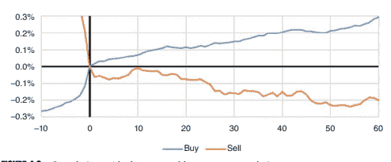
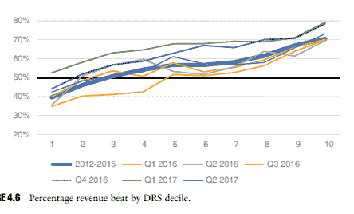
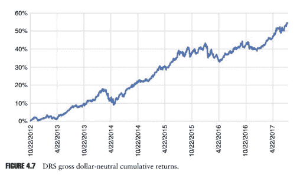
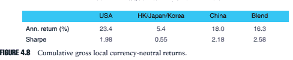
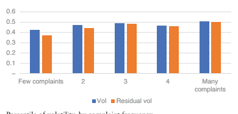

# 第四章：实施替代数据在投资过程中

文雍贾

## 4.1 引言

2007 年 8 月，系统性投资中发生了一次警钟，许多街头的量化交易员在一个被称为“量化震荡”的三天时间内遭受了他们有史以来最严重的损失。这个事件在量化世界之外并没有广泛报道，但对那些度过了这一周的投资组合经理来说，这是一个改变世界观的周。从某种意义上说，对替代数据来源的搜索始于那几天。

在本章中，我们将探讨这个基础性事件是如何激发对替代数据集的搜索的，替代数据实际上被采用的程度以及采用的缓慢程度的解释，以及一些基金经理更广泛采用替代数据的建议。然后，我们将审视替代数据的一些重要问题，包括数据质量和数量；我们将审视替代数据如何实际上帮助传统的定量或基本过程；以及我们将研究在替代数据中寻找阿尔法的技术。最后，我们提供了四个替代数据示例以及回测结果。

## 4.2 震荡：激发替代数据搜索

在 2007 年 7 月表现不佳但并不是非常不寻常后，许多量化策略在 8 月 7、8 和 9 日连续三天经历了戏剧性的损失——根据一些说法，这是 12 个标准差事件或更多。在通常高度控制风险的市场中性量化投资世界中，这样一串回报是闻所未闻的。通常秘密的量化交易员甚至向他们的竞争对手寻求帮助，以便了解发生了什么，尽管当时没有立即得到明确的答案。

许多量化交易员认为，这些错位必须是暂时的，因为它们是模型认为公平价值的偏差。然而，在混乱期间，每个经理都必须决定是削减资本以止血——从而锁定损失——还是坚持下去，如果预期的反弹没有按时到来，就冒着关闭店铺的风险。而且决定有时不在他们手中，在他们没有稳定资本来源的情况下。每月流动性的对冲基金不会被投资者迫使清算，但是分开管理的账户的经理们和专有交易台不一定有这种奢侈。

分开管理的账户和专有交易台并不一定有这种奢侈。

8 月 10 日，这些策略强劲反弹，正如事件发生后不久发表的一篇事后分析报告所示 (Khandani and Lo 2008)。到周末结束时，那些坚持持有头寸的量化交易员几乎回到了他们开始的地方；他们的月度回报流几乎没有注册任何异常情况。不幸的是，许多人没有坚持，或者不能坚持；他们削减了资本或减少了杠杆——在某些情况下，直到今天。一些大型基金随后很快关闭了。

## 4.2.1 发生了什么？

渐渐地，人们形成了关于发生了什么事情的共识。最有可能的是，一个交易经典量化信号和一些流动性较低策略的多策略基金在那些流动性较低的账户中遭受了一些巨大的损失，他们迅速清算了他们的量化股票账户以满足保证金要求。他们清算的头寸恰好与世界各地许多其他量化驱动的投资组合所持有的头寸非常相似，而这种清算对这些特定股票施加了下行压力，从而对其他管理者产生了负面影响，其中一些管理者反过来又进行了清算，造成了连锁反应。与此同时，更广泛的投资界并未注意到——这些策略大多是市场中性的，当时市场上并没有大的方向性波动。

事后看来，我们可以回顾一些我们知道已经过度拥挤的因素和一些其他因素，看到在地震期间表现出的明显差异。在表 4.1 中，我们看到了三个简单的拥挤因素：盈利收益率、12 个月价格动量和 5 天价格反转。我们现在用来降低投资组合拥挤度的大部分数据集都是在 2007 年以后才出现的，但是对于其中的一些不那么拥挤的 alpha，我们可以回溯到那个时期进行回测。在这里，我们使用了一些 ExtractAlpha 模型的组件，即战术模型（TM1）的季节性组件，它衡量了股票在那个时间表现良好的历史倾向（Heston 和 Sadka 2008 年）；Cross-Asset 模型（CAM1）的成交量组件，它比较了看跌期权和看涨期权的成交量以及期权和股票的成交量（Fodor 等人 2011 年；Pan 和 Poteshman（2006 年））；以及 CAM1 的 Skew 组件，用于衡量虚值看跌期权的隐含波动率（Xing 等人 2010 年）。记录这些异常现象的学术研究大多发表于 2008 年至 2012 年之间，当时这些观点并不是很广为人知；可以说，与其“智能贝塔”对应的这些异常现象相比，这些异常现象在当时仍然相对较少被关注。

表 4.1 显示了这些单一因素构建的美国流动性股票的美元中性、等权组合的平均年均化收益率，并且每日重新平衡。在截至量化地震的七年期间，相对不拥挤的因素表现平平，而拥挤的因素表现相当不错——在费用之前，该期间的平均年均化收益率约为 10%，约为拥挤因素的一半。但在地震期间，它们的回撤与拥挤因素相比较小。因此，我们可以将其中一些因素视为多样化或对冲拥挤的工具。并且在某种程度上，如果确实想要清理头寸，那么在相对不拥挤的投资组合中应该更加流动。

TABLE 4.1 美国流动性资产的美元中性、等权组合的年均化收益率

| 股票 | 更拥挤的因子 | 更不拥挤的因子 | | | | | | |
| --- | --- | --- | --- | --- | --- | --- | --- | --- |
| 盈利收益率 | 动量 | | | | | | |   |
| (%) | (%) | 简单反转 | 平均 | | | | |   |
| (%) | (%) | TM1 | | | | | | |
| 季节性 (%) | CAM1 成交量 (%) | CAM1 偏度 | 平均 | | | | |   |
| (%) | (%) | | | | | | |   |
| 2001–2007 年平均年 | 11.00 | 14.76 | 35.09 | 20.28 | 8.64 | 3.60 | 17.10 | 9.78 |
| 收益率 | | | | | | | | |
| 2007 年 8 月每日因子收益 7 日 | -1.06 | -0.11 | -0.34 | -0.50 | -0.06 | 0.33 | -0.85 | -0.19 |
| 2007 | | | | | | | | |
| 8 月 8 日 | -2.76 | -4.19 | 0.23 | -2.24 | -0.21 | -0.04 | 0.21 | -0.01 |
| 2007 | | | | | | | | |
| 8 月 9 日 | -1.66 | -3.36 | -3.41 | -2.81 | -0.29 | -1.27 | -0.23 | -0.60 |
| 2007 | | | | | | | | |
| 8 月 10 日 | 3.91 | 4.09 | 12.45 | 6.82 | 0.71 | -0.01 | 1.70 | 0.80 |
| 2007 | | | | | | | | |

我们现在知道的这些因素表现较差的原因是对一些经理人来说是一个震惊的发现，因为他们认为他们的方法是独特的，或者至少是不常见的。结果证明，他们都在进行非常相似的交易策略。大多数股票市场中性量化交易者在一个类似的宇宙内交易，控制着相似的风险模型，并且在很大程度上是根据相同的数据源构建相同的 Alpha。

## 4.2.2 下一场地震？

随后几年量化回报一般都很不错，但许多团队花了数年时间恢复他们的声誉和资产管理规模（AUM）。到 2016 年初，量化震荡似乎已经足够遥远，并且回报已经足够长时间良好，以至于可能已经产生了自满情绪。量化回报一直相对强劲，直到 2017 年中旬之前的 18 个月中最近的量化回撤，此时至少有一个规模可观的量化基金已经关闭，几家知名的多管理公司已经关闭了他们的量化账本。与此同时，许多替代 Alpha 都很好地预测了回报。最近的表现不佳可能是由于最近在常见量化因子中的拥挤情况，部分是由于量化基金的增加，他们在过去十年相对于自由裁量型经理的表现良好，以及智能贝塔产品的兴起。一个明显的处方似乎是让经理们多样化他们的 Alpha 来源。

今天有如此多的数据可用 - 其中大部分在 2007 年还不可用 - 顶级投资经理人明显倾向于采用替代数据，但许多经理人的投资组合仍然主要由经典的、可能是拥挤的因素主导。

最有前瞻性的量化基金经理人通过与系统性投资组合经理的广泛对话，积极地追求替代数据。

然而，大多数量化管理者仍然依赖于他们一直以来使用的相同因素，尽管他们可能更加关注风险、拥挤和流动性来进行交易。关于我们目前处于采用曲线的哪个点的可能解释有几种。其中最主要的是，弄清楚哪些数据集是有用的是困难的，将它们转化为 Alpha 也是困难的。

换句话说，截至撰写本文时，替代数据还没有“跨过鸿沟”。 Moore（1991）从创新技术供应商的角度详细描述了产品的生命周期 - 指出采用周期最困难的部分是从有远见的“早期采用者”转向更加务实的“早期主流”采用者，后者在采用新技术时更为风险规避（图 4.1）。

这个概念在科技初创公司中广为人知，但在机构投资领域并未广泛思考 - 但它同样适用。对于替代数据参与者来说，我们目前正处于采用的早期阶段，但可能已接近早期阶段的尾声 - 就在深渊的边缘。格林威治联合公司（McPartland 2017）的一项调查指出，80%的买方受访者希望将替代数据作为其流程的一部分。根据我们的经验，相对较少的公司取得了重大进展，尽管人数仍在增长。早期采用者往往是那些已经特别精通数据且拥有实验新数据集资源的量化基金管理公司。

关于替代数据的新闻报道可能会误导且充满炒作。仅有极少数资产管理规模达数万亿美元的基金所获收益可能受到先进的机器学习技术驱动（Willmer 2017）。真正基于人工智能的基金非常少，不足以判断这些技术是否导致超额表现（Eurekahedge 2017）。目前还不清楚，例如利用卫星图像统计沃尔玛停车场汽车数量等方法中是否存在可扩展的 alpha（Hope 2016）。

因此，尽管数据和量化技术目前比量化风暴时期更普遍，但采用情况仍然落后于炒作。一些基金经理对替代数据集的拥挤感表达了担忧，但至少根据截至目前的采用合理估计，这些担忧目前尚未成立。

也许还有些人对未采用替代数据的公司持观望态度，他们希望价值、动量和均值回归并没有受到很多关注，或者他们对这些因素的理解有足够的差异化 - 在没有关于竞争对手更好信息的情况下，这将是一种大胆的赌注。同样，2017 年市场上量化交易员和量化基金的数量比 2007 年多得多，跨越了更多地理位置和风格，因此某些机构记忆已经褪色。

可能存在一种行为解释：群体行为。与主要投资于最大基金的配置者一样，尽管相对于新兴基金，大基金的表现不佳，或者与群体一起调整预测以避免大胆但可能错误的判断的卖方研究分析师一样，也许基金经理更喜欢在同一时间证明他们的赌注与竞争对手的赌注一样错误。在所有上述情况中，利益相关者不能因为许多同行已经做出的决定而责怪群体行为者。对一些经理来说，这可能比采用一种创新但具有短期记录并且可能更难向配置者或内部官僚机构解释的替代数据策略更好。

无论出于何种理由，似乎很明显，2017 年比 2007 年更有可能发生另一次量化震荡。具体机制可能不同，但在这些竞争激烈的市场中，由拥挤性驱动的清算事件似乎非常可能发生。

## 4.3 利用替代数据爆炸

通过与基金经理的许多对话，我们观察到他们通常在与数据提供商联系和通过供应商管理评估过程方面变得更加擅长。越来越多的大型基金拥有数据采集团队。许多这些团队在评估数据集方面还不够高效，即在其中找到 alpha。

一些提高效率的可能处方包括：

1. 将*研究资源专门分配给新数据集*，为评估每个数据集设定明确的时间范围（比如 4-6 周），然后就数据集的附加价值有无做出明确决定。这需要保持新数据集的流水线，并坚持一个时间表和一个流程。

2. 建立一个*即插即用的回测环境*，可以高效评估新的 alpha 并确定它们对现有流程的潜在附加价值。在测试数据集时总会涉及创造力，但更乏味的数据处理、评估和报告方面可以自动化以加快（1）中的流程。

3. 指定一位*经验丰富的量化分析师*负责评估新数据集 - 一个曾经看过许多 alpha 因子的人，可以思考当前的因子可能与之前的因子有何相似或不同。替代数据评估应被视为任何系统基金的核心能力。

4. 增加对*创新数据供应商*的接触，而不是从大数据提供商那里获得的产品，后者更难被认为是真正的替代品。

5. 优先考虑*相对容易测试的数据集*，以加快对替代 Alpha 的接触。更复杂、原始或非结构化的数据集确实可以带来更多的分散化和更独特的实现，但这可能会延长已有因素的持有时间，因此如果对替代数据还不熟悉，最好从一些低 hanging fruit 开始。

6. *更加熟悉我们经常在替代数据集中看到的有限历史长度*。对于许多新的数据集，人们是在短期历史的基础上进行决策的。我们不能像对传统因子进行 20 年回测那样来评判这些数据集，既因为早期数据根本不存在，又因为 20 年前的世界与今天拥挤的量化空间几乎没有关系。但是，不评估这些数据集可能被认为是更加冒险的。

下面，我们将讨论一些用于考虑有限历史的技术。将替代数据转化为交易策略的过程并不简单。此外，它与投资组合经理的核心活动竞争，包括日常投资组合管理、资本筹集和不断增加的合规负担。但是通过仔细的规划，可以在用于评估传统数据集（如定价或基本面）的现有框架之上构建替代数据策略。这对量化基金经理尤为真实。

## 4.4 选择用于评估的数据源

在此，我们将在量化股票流程的背景下检查选择评估数据的一些问题。

首先，必须收集数据，或从数据提供者那里获取数据。除非拥有大量资源，否则大多数基金不会在直接数据收集上花费大量资本。即使与数据供应商合作也需要专门的资源，考虑到当今提供者数量的激增。

对于大多数经理来说，一开始不清楚哪些提供商的数据集具有投资价值。大多数数据提供商没有能力以与顶级从业者方法一致的方式严格回测自己的数据或信号。许多供应商回测忽略交易成本；在一个不切实际的宇宙中进行回测，其中非流动性资产推动收益；将等权重投资组合与资本化加权基准进行比较；仅使用当前指数成分股或当前上市的股票；不是时间点；或不考虑持仓的风险敞口。当然，供应商的回测很少显示出糟糕的表现，因此它们经常受到怀疑。因此，供应商评估通常是内部流程。

最少应该具有足够的历史和广度的数据集；应该可以将数据转换为类似时点的东西；并且应该标记或可标记到证券。传统的量化回测技术往往对资产覆盖范围窄于几百个资产，历史长度短于三年的数据集效果较差，特别是如果数据集用于预测季度基本面数据。

一旦选择了供应商进行评估，就需要仔细检查他们的数据集。因为其中许多数据是由在资本市场经验有限的供应商收集的，它们可能不是为了易于消费或回测而设计的。

例如，记录可能没有标记到安全标识符，或者它们可能仅标记到一个非唯一的标识符，比如一个股票代码。历史可能相对较短，特别是如果数据集基于移动或社交媒体活动，而且较旧的年份可能不代表当前技术使用的状态。它们可能表现出幸存者偏差，尤其是如果数据是回填的，供应商数据集很少真正是时点的。提供的时间戳可能不准确，可能需要进行验证。

这些数据集没有像彭博、FactSet 和汤姆逊路透等大型数据供应商提供的那样被彻底检查过。因此，数据错误和间隙更有可能发生。

典型情况下，对这类数据集的学术研究不多，因此必须自己提出假设，说明这些数据集可能具有预测性或有用性，而不是利用已发表的或工作论文。在某些情况下，卖方研究团队可能会研究更知名的数据提供者的数据集。

数据集可以处于“信号”形式，换句话说，处理到可以轻松纳入多因子量化过程的程度。信号通常更容易测试和解释，但它们的使用实际上涉及投资组合经理向供应商外包研究。因此，评估供应商的资历以及模型构建的严谨性至关重要。更多时候，数据以相对原始的形式提供，这样可以提供更大的灵活性，但显著增加了评估数据有效性所需的时间。许多较大的量化基金会更喜欢原始数据，而资源较少的量化人员或非量化管理者可能会满意信号产品，尽管这两个说法都有例外。

大多数另类数据集根本没有投资价值，或者它们的价值自然受到限制。这些数据集通常听起来直观吸引人，但可能缺乏广度；例如，最近出现了许多供应商，他们使用卫星图像来统计美国大型零售商停车场中的汽车数量，或者评估油箱的内容。然而，这些信息可能相关的资产总数自然有限。

作为另一个例子，捕捉在线活动情绪的数据集，也许是我们现在认为的另类数据的最早形式，已经爆炸式增长，有许多供应商，其中大多数从 Twitter 挖掘情绪。除了 Twitter 包含大量噪音的明显观察外，一些关于微博情绪的实证研究表明，这些信号的预测能力不会持续超过几天，因此很难纳入可扩展的投资策略中（Granholm 和 Gustafsson 2017）。

最后，应该至少制定一个关于为什么可能在数据集中找到价值的一般假设，无论这个价值来自于预测股价、波动性、基本面还是其他内容。

## 4.5 评估技术

对于量化经理，另类数据集的评估过程可能与评估基本面等非另类数据时使用的过程非常相似。

人们可以为数据中的某些内容预测回报 - 或者收益，或者投资者关心的其他内容 - 制定假设，并制定一组公式，以便对这些假设进行样本内测试。如果数据结构化并具有悠久历史，这一点尤为重要。然后可以在回测或事件研究中测试这些公式的预测能力，考虑到风险敞口和交易成本；在样本内环境中进行优化，或者简单选择，以生成尽可能强大的单变量预测；根据现有情况检查（通常非另类）预测因子的独特性和对更广泛策略的贡献；然后，假设结果直观、稳健且独特，进行样本外验证。

前面段落中的内容与大多数量化股票组合经理在评估传统数据集时所做的事情并无不同。尽管机器学习和人工智能经常与另类数据一起提及，但在数据有一定结构的情况下往往不必使用这些技术，这样做可能会导致结果不如预期那样直观 - 尤其是在不太熟悉这些技术的研究人员手中。

但在某些情况下，替代数据集具有使该过程某些部分更加困难的特征。例如，非结构化数据或具有更有限历史的数据可能需要新的处理数据和创建公式的方法。最常见的例子是情感分析，其细节超出了本章的范围，但它涉及使用自然语言处理或其他机器学习技术将人类生成的文本或语音信息压缩为乐观或悲观的度量，然后相对容易将其汇总到资产级别。

一些替代数据集可能未经过良好的标记，如 CUSIP、SEDOL 和 ISIN 等强大的安全标识。许多数据供应商从股票代码开始标记，但股票代码可能会更改并且可以被重复使用。而一些更原始的数据集仅通过公司或实体名称进行标记。对于这些数据，需要构建一种健壮的公司名称匹配技术，以适当考虑缩写、拼写错误等因素。一旦构建完成，这些工具可以应用于多个数据集。

许多替代数据集没有清晰的时间戳，指示数据在历史上何时可用，因此使得回测困难。

常常唯一的解决方案是观察供应商收集数据的时间，并评估提供的日期。

如前所述，任何使用替代数据集的人最终都会遇到一个否则具有吸引力的数据集，其历史数据可用性不及人们所希望的多。短期历史具有几个含义：

1. 历史可能不涵盖多种不同的宏观经济环境，例如高波动性和低波动性时期。

2. 数据较少时，回测结果自然会更嘈杂，并且无法像使用更长的历史数据那样以相同的健壮性进行细分（比如按部门）。

3. 传统的样本内和样本外技术，例如使用前 10 年进行样本内和剩余的 5 年进行样本外，可能不适用。对于第一个问题并没有太多的解决方案，但可以在一定程度上解决第二和第三个问题。

短期回测具有噪声，因为股票价格是嘈杂的。对于一天或更长时间的预测，这一点尤为真实，而这些时间长度是大型机构投资者最感兴趣的。解决这个问题的一个非常直观的方法 - 以及与特定行业数据集的交叉覆盖范围过窄的相关问题 - 是建立对股票价格或回报而非更基本的东西的预测，例如收入或收入，或这些值的简单衍生物，例如盈利惊喜或收入增长。由于资产波动性 - 可能受情绪和外生冲击驱动 - 在长期内超过收益波动性，基本预测往往比资产价格预测更稳定。

因此，一个潜在的可能性是，可以利用相对较短的历史建立对基本价值的稳健预测。

基本预测在学术文献中并不新鲜。例如，一篇着名的论文（Sloan 1996）表明，由应计驱动的收益比由现金流驱动的收益不那么持久，并且不同的持久性随后反映在股价中。 20 世纪 90 年代末和 21 世纪初的研究还表明，个别分析师有不同的能力进行盈利预测，这些差异可以转化为交易策略（Mozes and Jha 2001）。对盈利预测的这项工作最近已扩展到 Estimize 收集的众包盈利估计的替代数据集（Drogen and Jha 2013）。

当然，使基本预测在投资组合管理环境中有用的前提是，准确预测基本面会导致超越的投资组合，换句话说，市场关心基本面。尽管证据表明长期来看这是正确的，但并不时有市场条件，其中资产价格主要受其他效应驱动。在过去几年中我们已经多次看到这种情况，包括全球金融危机后的“风险偏好”行情以及 2016 年期间，股票价格受到关于宏观事件的预期变化的影响，如英国退欧和美国总统选举。识别这些环境正在发生时可以帮助使基本预测更加稳健。

资产波动本身倾向于相当稳定，因此，使用有限历史的替代数据集的一个相对不引人注目的应用是改善波动率预测。本章稍后将探讨一个这样的例子。

样本内和样本外的方法可能必须更改以考虑较短的历史和不断发展的量化景观。例如，可以在样本内和样本外月份之间交替，从而允许回测包含更近期的样本内日期，衡量因子在当前市场条件下的表现如何，并确保任何历史数据长度的样本内和样本外周期之间的类似分布。必须非常谨慎地处理这种方法，以避免从样本内泄漏到样本外，并避免季节性偏差。

另一个考虑因素是，许多源自替代数据的 alpha，特别是那些基于情绪的 alpha，与其拥挤的同行相比，其时间跨度相对较短；alpha 的时间跨度通常在一天到两个月的范围内。对于管理大量资产的，不能太灵活地移动资本的资产管理人员，可以以非传统的方式使用这些更快速的新 alpha，例如确定更好的长期交易进出点（Jha 2016） - 或者将它们分开在更快的交易账簿中进行交易 - 可以让他们利用这些数据集改变策略。我们观察到，随着运行较低夏普比书籍的量化人员试图提高回报，对中期视野的收敛正在发生。

同时更高频率的量化人员寻找额外的容量，使得区分中期 alpha 的需求更加迫切。

在评估基于事件的替代数据时 - 例如，来自网络的众包预测集合，或者与通常的收益意外、合并等不同的公司事件数据集 - 事件研究可以是一种极其有用的技术。典型的事件研究涉及跟踪事件前后资产回报的情况。这些研究可以展示一个事件是否在大幅回报之前或之后发生，当然，但它们也可以告诉你这些回报实现的时间跨度，这将让研究人员了解事件是否可以在短期或长期 alpha 生成的背景下使用，以及在对新事件做出反应时需要多快行动。还可以沿着许多维度将事件分区：

对大盘和小盘股票的事件，或者在收益周期的不同时期，或者由不同类型的预测者产生的事件，例如，可能会产生不同的结果。最后，可以对资产回报进行残差化处理，即控制对共同风险因素的暴露，从而使研究人员能够确定其在事件发生后看到的任何超额表现是否是事件数据集内在投注的结果，例如小盘股或动量偏差。

上述可能的调整可以解释部分替代数据的特殊性，但基本的定量研究原则仍然相关：应该建立直观因素的时间点数据库，并在精心设计的样本内期间内进行严格测试，同时考虑风险和交易成本。

## 4.6 基金经理的替代数据

尽管量化基金，尤其是系统性对冲基金，一直是替代数据的早期采用者，但自由裁量和基本管理者也开始接受替代数据。这种转向“量化基本”投资反映了市场上其他一些趋势，包括资金流向量化策略，远离股票多空策略，以及机械“智能β”或风险溢价投资风格的更大接受度。

量化基本法采用多种形式，包括传统量化技术的使用增长，如回测、风险管理和基于基本分析的投资组合中的投资组合归因。在这里，我们将主要关注自由裁量分析师和投资组合经理对替代数据的采用。

量化基础的增加意味着以前在数据科学方面经验有限的基金将需要了解一些定量研究的基本原理。挑战在于将这些广泛的数据驱动方法与一直强调深度而不是广度的投资哲学相协调。格林奥尔德（1989 年）在《主动管理的基本法则》中捕捉了这一区别：

$$IR=IC*{\sqrt{N}}$$

在这里，经理的信息比率（IR），即其风险调整后的主动回报的衡量标准，被显示为两个因素的函数：

- 信息系数（IC），即经理预测与随后实现回报之间的相关性；一种*技能*的度量。

- 独立下注的数量（N）；一种*广度*的度量。

简单地说，自由裁量管理者关注信息系数，而量化管理者关注广度；量化策略可以在许多资产上复制，但很少对任何特定交易提供高度信心，而基本分析师理论上可以通过深入研究提供高但不可扩展的信息系数。

因此，基本经理们使用替代数据的一种方式是，即使不增加总下注数量，也能更深入地了解一家公司。通常由个别分析师决定新数据是否有助于提供这样的见解。因为数据不需要在许多股票或自动摄入中广泛或非常高效地产生，所以通常以报告的形式提供，这些报告可能包含特定于行业的信息。

这可能是基本分析师使用替代数据的最简单方法，只能被宽松地视为量化基础。

数据采用曲线上进一步的一点，一些基本团队正在通过设计用于提供可视化、筛选和有关替代数据集的警报的用户界面（UI）摄取数据。例如，基本投资组合经理可以将其监视列表输入到这样的工具中，并寻找最近的消费者或社交媒体行为趋势表明即将出现的问题的股票，这将通知位置大小，或者分析师可能希望筛选由这些数据集驱动的交易想法。这些 UI 工具可以很好地融入基本投资组合经理或分析师的工作流程中，历来以彭博终端和 Excel 模型为主。

最后，一些基金团队最近引入了团队来管理供应商关系，并在内部提供数据科学工具。这些工具可以包括与上述类似的可视化，但它们也可以包括利用新数据集创建股票排名和评分的量化模型的开发。一些资产管理者多年来一直有量化团队担任这一角色，使用传统数据，但在股票多空对冲基金领域相对较新。

在这两种情况下的一个挑战是让投资组合经理和分析师关注数据科学团队生成的内部产品。基本用户可能不完全赞成量化方法，也可能不希望量化流程在很大程度上决定他们的决策。因此，经理可能更愿意与基本团队合作设计量化方法，考虑到他们的愿望、反馈和工作流程，保持数据科学团队与基本团队之间的持续协调。

另一个问题是，基本团队通常对样本大小、回测、鲁棒性等微妙问题不太熟悉。由于他们依赖 IC 而不是 N，基本投资组合经理和分析师寻求高信心的信息，但资本市场中的经验证据很少能提供这种程度的信心。量化赌注可能大部分时间都是错误的，但平均上仍然能赚钱，但一次错误的赌注可能会让基本分析师对量化技术产生厌恶。

在这里，没有什么比继续学习量化技术来增加熟悉度更好的替代品。

从实际角度来看，新的定量基本团队实际上也将不得不修改他们使用的工具。历史上，自主管理者的工作流程依赖于一些书面报告、Excel 模型和彭博终端的混合。传统的量化过程不使用这些工具之一；而是依赖数据源。新的定量和替代数据源将必须通过可视化、筛选和电子邮件警报等前述的工作流程工具交付给基本团队，这将促进更广泛的采用，而定量基本团队将需要将注意力从典型的工具转移到最佳利用新数据集的工具上。

## 4.7 一些例子

在这里，我们通过四个例子来使用替代数据生成信号，该信号可以用于投资组合管理过程。虽然在某些情况下，信号生成的细节可能有些专有，但我们希望提供足够的信息来激发对其他数据集的研究。

## 4.7.1 示例 1：博主情绪

我们从分析由 TipRanks 提供的金融博客数据集开始。TipRanks 收集来自各种来源的在线建议，包括新闻文章和几个金融博客网站。它的专有自然语言处理算法是通过对一组文章进行手动分类进行训练的，并用于为每篇文章生成情绪。特别是，该算法将文章分类为看涨 vs 看跌（或买入 vs 卖出）。无法以高度自信分类的文章将被发送回给人类读者进行分类，并在未来更好地训练算法。

新闻文章包括卖方分析师的看涨或看跌评论，这些评论通常与分析师的买入和卖出建议重复，而这些建议已经包含在数据供应商（如汤姆森路透和 FactSet）提供的广泛使用的结构化数据集中。因此，在这里，我们关注金融博客这一较不为人知的数据源。金融博客的内容（例如 Seeking Alpha 和 Motley Fool）与微博（例如 Twitter）不同，它们通常包含长篇文章，并对公司的业务和前景进行重要分析；因此，它们更像卖方研究报告，而不像微博帖子或新闻文章。

我们开始我们的研究，通过事件研究来了解在被分类为买入或卖出的博客文章发布之前和之后的股价行为。我们可以以多种方式划分我们的数据，但样本内最重要的发现似乎是某些博客网站包含具有预测价值的文章，而其他网站则没有。这可能是由于各个网站的编辑标准不同所致。在具有预测价值的网站中，我们看到类似于图 4.2 中的事件研究围绕发布日期。

请注意，在这里我们绘制的是平均累积*残差*收益，即控制行业和风险因素的收益，作为文章发布日期前后交易日的函数。从图表中可以看出，发布当天存在很大的影响，这可能是文章对市场和文章发布可能与重大公司事件同时发生的事实。我们还看到了一个很大的上涨效应，即买入文章通常在价格上涨之前出现，而卖出文章通常在价格下跌之前出现。

我们还看到文章发布后几周预期方向的持续漂移，与文章作者继续推动市场和/或他们预测未来价格走势的能力一致。

我们可以将这些买入和卖出信号包装成一个简单的股票评分算法，自 2010 年末以来每天评分超过 2000 只美国股票。由 TipRanks 和 ExtractAlpha 合作构建的 TRESS 算法采取的方法是直接的，涉及对给定股票的最近文章级买入或卖出（+1 或−1）信号的总和进行加权，加权系数为自文章发布以来的天数。这样，得分最高的股票是最近有买入推荐的股票，得分最低的股票是最近有卖出推荐的股票。为了使具有许多推荐的股票（通常是较大或更受欢迎的股票）与推荐较少的股票具有可比性，我们按该股票的博客文章频率进行缩放。

金融博客通常针对个人投资者和交易者的观众，他们持有集中的长期投资组合，通常寻找买入建议而不是卖出建议。因此，约 85%的博客推荐最终被归类为买入。这意味着一旦我们按股票级别汇总，我们最终得到的净卖出情绪占多数博客的股票相对较少。

话虽如此，我们发现当大多数博客看跌时，股票往往表现不佳，如图 4.3 所示。该图绘制了得分较低（TRESS 值为 1–10）的股票与得分较高（TRESS 值为 91–100）的股票的平均年化收益率，因此，卖出或做空信号很少，但具有很强的影响力。

低 TRESS 分数和高 TRESS 分数之间的表现差异在时间上保持一致，包括样本内期间（至 2013 年中期结束），go-live 日期（2014 年末）及随后三年的实时数据（图 4.4）。这表明，金融博客情绪是回报的一致预测因子。有许多方法来切分这种绩效以证明其鲁棒性，但是一个简单的长/空头投资组合，每天重新平衡一次，由得分为 91-100 的股票的多头部分和得分为 1-10 的股票的空头部分组成，是一个方便的视觉工具。

在这种情况下，我们绘制了考虑交易成本之前的回报，但受到市值最低要求（1 亿美元）、平均每日美元交易量（100 万美元）和名义价格（4 美元）的限制。每个投资组合的日换手率约为各自的 6%，因此这些结果应该能够经受住合理的交易成本假设。

## 4.7.2 示例 2：在线消费者需求

上述示例探讨了中介情绪的另一种来源的预测能力：

- 在这种情况下是博客作者。

- 他们可能对公司的基本面有所了解。一些替代数据集更直接地关注公司基本面的替代品，例如面板交易数据。

- 我们在下面的第 3 项中展示了一个例子。在这两个极端之间，我们可以研究能够为我们提供消费者偏好洞察的数据。基于网络的需求数据可以帮助提供这些洞察。

随着越来越多的时间花在线上，消费者不仅仅在网上购买产品，他们还在做购买决策之前对这些产品进行研究。这对零售消费者和企业对企业（B2B）买家都是真实的。因此，公司产品的需求可以通过公司的网络存在所受到的关注度来近似。尽管关注度可能是一个负面的标志（如丑闻案例），但文献表明，总体上更多的关注对公司的前景是有好处的。

这种类型的关注数据在数字营销领域已经被使用了一段时间，但是对于股票选择模型来说还比较新颖。在这里，我们研究了 alpha-DNA 收集的一个数据集，他们是数字需求数据的专家。alpha-DNA 数据集包括三个类别的关注度测量：

- 网络搜索：消费者是否通过搜索引擎在线搜索公司的品牌和产品？

- 网站：消费者是否访问公司的各个网站？

- 社交媒体：消费者是否通过赞、关注等方式表达他们对公司的各种社交媒体页面的关注？

为了将相关术语和属性映射到公司级别，alpha-DNA 维护一个数字局，这是一个每个公司的品牌和产品名称、网站和社交媒体句柄的不断发展的数据库。(图 4.5)。这项分析所需的大部分前期工作都在生成这个数字局。

alpha-DNA 已开发出一套专有的评分系统，用于排名大约 2000 家公司在数字平台（网站、搜索、社交）和消费者效益（渗透率、参与度、受欢迎程度）上的整体表现强度。排名每天进行一次，历史数据始于 2012 年。使用“民意调查”的方法，将来自多个数据集的许多不同数字维度组合起来，以创建加权绩效评分。

使用这种民意调查的民意调查，针对每家公司建立相对于其同行的数字实力指标。alpha-DNA 的数字收入信号（DRS），与 ExtractAlpha 合作建立，衡量这种数字实力，将其作为预测收入意外的函数；当消费者需求增加时，公司更有可能超过其销售方一致的收入目标，当消费者需求减少时，公司更有可能未能达到目标。因此，得分较高的 DRS 股票往往表现出正面的收入意外以及正面的收入增长。在图 4.6 中，我们绘制了按 DRS 十分位划分的股票击败其收入目标的百分比，根据上述用于 TRESS 的相同宇宙约束（并且在撰写时，alpha-DNA 没有收集金融股票的数据）显示了 2012 年至 2015 年的组合内外样本期间，并显示自 DRS 推出以来的每个后续季度。

显然，人们可以定期使用嵌入在 DRS 中的数字需求数据来预测收入意外。正如人们所预期的那样，该预测也导致使用 DRS 构建的盈利组合。在图 4.7 中，我们绘制了基于 DRS 的投资组合的累积回报，使用了上面用于 TRESS 的相同技术。

收益率年化为 11.4%，夏普比率为 1.64。进一步观察发现，结果在宇宙的资本范围和大多数其他合理的横截面切片中保持一致。

，轻松应对交易成本和各种再平衡规则，鉴于每日成交量与 TRESS 相似，每天每边 6%。因此，似乎准确的收入意外预测，本例中基于在线另类数据集的组合，产生了一种潜在的盈利投资策略。

## 4.7.3 示例 3：交易数据

美国早期使用的另类数据的早期示例之一是信用卡交易数据。这些数据集用于提前了解行业的收入情况，而不是企业发布收入公告。随着中国消费者活动的增加，人们意识到，在世界人口最多的经济体中，无论这些公司的总部和上市地点在哪里，交易数据都可能对拥有大量中国客户群的公司的收入具有信息价值。

檀香顾问是第一个专注于中国消费者市场的替代数据平台。该公司已经收集了几个捕捉中国内地零售交易的独特高价值数据集。在这项研究中，我们关注其中一个数据集，来自中国最大的企业对消费者（B2C）电子商务网站天猫网，截至 2016 年占据了 57%的市场份额。中国和国际消费品生产商利用天猫来进入中国消费者市场。在天猫上有各种各样的产品可供销售，包括服装、鞋类、家电和电子产品。外国公司必须符合严格的要求——特别是年度收入的最低金额——才能够在天猫上列出其产品。

在这项研究中，我们对天猫数据中的公司级指标进行了检验，该数据每月收集一次，滞后五个工作日。基础数据包括每月人民币总销售额和销售的单位数量。我们能够将天猫数据映射到五个市场中交易的 250 只流动性证券上：中国、香港、日本、韩国和美国。天猫历史数据的长度有些有限，跨越了 2016 年 3 月至 2017 年 6 月。

我们检验了一个非常简单的α值，即逐月销售额的变化。这个指标允许我们对天猫数据集中的任何股票进行评分，但由于公司在平台上增加或减少销售努力、促销活动导致的跳跃、汇率波动对可能具有不同国际风险的股票的影响以及可能会影响每只股票销售的季节性效应，因此存在一些噪音。

另一种表述方式是查看市场份额的月度变化。

对于每个类别，我们可以计算特定品牌与其他所有公司的市场份额的比例，无论我们是否能够将这些公司映射到流动的公共股权（例如，私人公司）。然后，我们可以按照该类别对公司整体来自天猫的收入的贡献加权聚合市场份额。这可能是一个比月度销售变化更清晰的指标，但也有一些缺点。公司的收入分配可能不反映其在天猫上的收入分配，而且，也许最重要的是，我们尚未为所有公司映射到类别级别的数据，因此我们的样本量对于这一指标来说太低了，因此我们将市场份额分析留给未来的研究。

在我们早些时候关于查看短期历史数据以预测基本面的评论之后，我们首先观察到，月度天猫营收增长低于−10%的股票的实际报告季度增长率（1.8%）低于月度天猫营收增长率高于 10%的股票（6.1%）。这一分析表明，天猫数据集代表了公司的收入。

然后，我们按照之前的方法，从月销售增长构建做多-做空组合，这基本上导致了一种月度换手率策略（尽管我们是每日重新平衡的）。我们独立地看待每个地区：美国、中国和发达亚洲 - 在这种情况下，发达亚洲指的是香港、日本和韩国。我们使用每个市场的本地货币回报。由于与早期模型示例相比，每个地区内的数据相对稀疏，我们将数据分成了三等份（而不是十等份），简单地做多了地区内排名前三分之一的股票并做空了排名最后三分之一的股票。结果是每个地区的投资组合仍然相当集中。

在图 4.8 中，我们展示了每个地区内的累积回报，然后展示了一个简单的全球投资组合，该组合在三个地区均匀分配资金，并显示了这样做时风险调整后回报的分散效益。

这些结果的低成本性值得注意，因为交易成本 - 在美国和日本较低，并且中国 A 股的交易成本已经大幅下降 - 在香港和韩国仍然相对较高，原因是有印花税和证券交易税。此外，我们在这里假设了一个做多-做空的投资组合，尤其是在中国股市中，股票借贷可能受到限制或昂贵。但我们确实看到排名靠前的股票在整个股票市场中表现优异，这表明仅在做多方面有用。

尽管我们构建的度量标准的简单性质，但这些结果仍然非常令人鼓舞。虽然这些数据集的历史长度和横截面覆盖范围都有些有限，但它们背后的明确直觉以及中国的在线购物对全球零售业务日益重要，却很少受到投资者的关注，这意味着它们值得深思熟虑。

## 4.7.4 示例 4：ESG

尽管环境、社会和治理（ESG）投资正在增长，但大多数捕捉 ESG 的技术使用简单的指标，如剥离能源公司或关注董事会多样性。ESG 投资者通常不是数据驱动或系统化的，尽管有大量关于公司可持续性和负责任行为的数据。

一些最近的研究已经开始揭示一些 ESG 数据集和回报之间的关系仍然相当混乱。一个可能引人注目的替代方向是使用 ESG 因素进行风险管理。在这里，我们借鉴了 Dunn 等人（2017 年）的做法，并使用一种针对金融服务部门的新型数据集来衡量风险。

美国消费者金融保护局（CFPB）是在全球金融危机之后成立的，旨在加强对信用卡和抵押贷款发行商等金融服务提供商的监督。 CFPB 维护着一个每天更新的消费者投诉数据库，其中记录了与零售金融服务相关的消费者投诉，并为金融服务提供商提供了回应投诉的平台。 投诉数据可以从 CFPB 免费获取，但需要一些工作来使其在量化背景下可用。 与许多政府数据来源一样，数据格式随时间改变，数据没有标记为安全标识符。 因此，我们使用专有的模糊名称匹配算法，考虑拼写错误、缩写（如“Inc.”和“Corp.”）、公司名称随时间变化以及公司名称中单词的相对唯一性，将 CFPB 提供的公司名称映射到主公司名称数据集，然后再映射到常见的安全标识符，如 CUSIP。

然后，我们有一个数据库，其中包含约 100 家上市金融服务公司，每年有 48000 个投诉，数据始于 2011 年。

数据集非常丰富，包括收到投诉的日期、它所涉及的特定产品（例如借记卡、学生贷款）、公司是否及时回应投诉以及该回应是否被争议。 投诉的文本也包括在内。

我们的假设是，相对投诉较多的公司面临更大的业务风险，要么是因为他们疏远了客户，要么是因为他们更有可能受到惩罚性的监管行动。 在这些关乎生存的风险最终被投资者知晓时，它们应该也会影响股票的波动性。

为了简单起见，在这里我们仅计算了在给定时间段内与每个证券相关的投诉数量。 当然，金融产品的大型发行者通常会收到更多的投诉，因此我们仅仅取得前一年内的投诉数量 - 保持一个季度的滞后以确保历史数据的可用性 - 并按市值比例进行缩放。 然后我们取反，以便得分较高的股票是相对投诉较少的股票。

我们首先进行了一个快速测试，以查看我们的投诉计数是否预测了回报，使用与之前相同的方法论（表 4.2）。 这里我们使用五分位组合而不是十分位组合，因为 CFPB 的横截面覆盖范围较少。

与先前数据集相关的数据。 2014 年之前的数据太稀疏，无法使我们在我们的流动宇宙内创建健壮的五分位组合，因此我们在 2014 年初至 2017 年中建立了组合。

我们可以看到一些证据表明，投诉较少的公司确实表现优异，基于这些数据的策略在交易成本上不会受到重大影响，考虑到我们制定的慢速性质，但结果在时间上并不一致，并且在很大程度上受到 2016 年的日历影响。当评估既有有限横截面覆盖又有限历史的数据集时，此类非稳健结果很常见，因为评估参数（例如分位数数量、宇宙选择和交易参数）的轻微变化可能会导致由于样本量较小而导致结果发生较大变化。尽管回报效果值得进一步研究，但我们现在转而衡量投诉数据是否能告诉我们有关风险的信息，我们可能期望得到更稳健的结果。

我们通过查看五分位数的共同风险因素的平均暴露来检查我们的度量的一般风险特征（这些因素被缩放为均值 0 和标准差 1）（表 4.3）。

我们可以看到，投诉最多的公司往往更具波动性和更高的杠杆，并且它们的股息收益率较低。因此，我们需要确定投诉是否解释了超出我们通过查看这些标准风险因素所知道的风险。

| 数量 | | | | |
| --- | --- | --- | --- | --- |
| 分组 | 公司 | 天数/事件数 | 年度收益率 (%) | 年度夏普比率 |
| 总体 | 71 | 903 | 6.20 | 0.5 |
| 2014 | 60 | 248 | −3.30 | −0.29 |
| 2015 | 72 | 252 | 2.00 | 0.15 |
| 2016 | 76 | 252 | 28.10 | 2.31 |
| 2017 | 79 | 151 | −7.60 | −0.53 |
| 收益率 | 波动性 | 动量 | 规模 | 价值 | 成长 | 杠杆 |   |
| 抱怨较少 | (0.09) | (0.55) | - | 0.53 | 0.19 | (0.05) | 0.11 |
| 2 | (0.05) | (0.40) | 0.02 | 0.67 | 0.38 | (0.10) | 0.18 |
| 3 | 0.04 | (0.33) | (0.13) | 0.75 | 0.48 | (0.17) | 0.43 |
| 4 | (0.10) | (0.27) | (0.03) | 1.77 | 0.59 | (0.03) | 0.24 |
| 抱怨较多 | (0.27) | (0.15) | 0.03 | 0.64 | 0.28 | 0.04 | 0.47 |

我们首先通过投诉量五分位数来检查股价波动性，该投诉量是在我们计算投诉后的一个月内衡量的。我们用两种方式衡量波动性：

- 每日股票收益的标准偏差。

- *残差化*每日股票收益的标准偏差，其中每天的收益在横截面上回归到行业和共同风险因素，仅留下特有的回报。

残余收益波动性应该告诉我们，投诉数据告诉我们关于未来风险的程度，这些风险不能通过常见风险因素解释，包括股票自身的历史波动性。对于这两个指标，我们每个月将它们百分位化，以考虑市场整体波动性随时间的变化。

我们可以在图 4.9 中看到，相对于其市值而言，投诉较少的股票未来的波动性较低，即使在控制已知风险因素的情况下也是如此。这种效应比我们之前用基于回报的指标看到的更加一致。

最后，我们还可以使用回归方法来解释回报波动性的横截面，使用我们的基本风险因素，然后再添加我们的投诉因素。在这里，更高的值意味着更多的投诉，所以如果经历更多投诉的公司更加风险，我们期望在投诉变量上看到正的系数(表 4.4)。

| 基线 | 有投诉 | | | | |   |
| --- | --- | --- | --- | --- | --- | --- |
| 参数 | 参数 | | | | |   |
| 估计 | t 值 | Pr > | t | | 估计 | t 值 | Pr > | t | | |
| 截距 | 0.020 | 101.81 | <0.0001 | 0.019 | 92.24 | <0.0001 |
| 波动性 | 0.008 | 34.38 | <0.0001 | 0.007 | 28.91 | <0.0001 |
| 规模 | (0.000) | (5.23) | <0.0001 | (0.000) | (5.15) | <0.0001 |
| 值 | 0.001 | 4.00 | <0.0001 | 0.001 | 5.40 | <0.0001 |
| 增长 | (0.000) | (0.03) | 0.98 | 0.000 | 0.10 | 0.92 |
| 杠杆 | (0.000) | (0.33) | 0.74 | (0.000) | (1.70) | 0.09 |
| 动量 | (0.000) | (2.70) | 0.01 | (0.000) | (0.75) | 0.45 |
| 收益率 | (0.000) | (1.69) | 0.09 | (0.000) | (1.90) | 0.06 |
| 投诉 | 0.003 | 8.86 | <0.0001 | | |   |
| 调整 R 平方 | 0.350 | 0.363 | | | | |

尽管在第二次回归中，历史波动率（未来波动率的最佳预测因子）与投诉之间的上述相关性表现为历史波动率的系数较低，但在第二次回归中，投诉因子非常显著，T 值为 8.86，并且回归展现出比基准回归更高的调整 R 平方。换句话说，投诉为未来风险提供了独特的、增量的解释力量，超越了传统基本风险模型。

我们可以按年份重复这个练习，我们看到每年投诉因子在 3%或更好水平上都是显著的，所有年份中的调整后的 R 平方有所增加（表 4.5）。

ESG 增强型风险模型可以用多种方式。新因子可以作为优化过程中的约束条件，以在组合水平上减轻 ESG 风险；可以监测组合和股票水平的 ESG 风险；可以测量相对于 ESG 因子的残差回报，用于例如，均值回归股票选择模型。这些探索性结果表明，非传统 ESG 数据集可以帮助管理者构建更智能的模型，以衡量和减轻风险。

| 基准模型 | 加入投诉 | | |   |
| --- | --- | --- | --- | --- |
| 年份 | 调整 R 平方 | 调整 R 平方 | t 值 | Pr> | t |   |
| 2014 | 0.294 | 0.317 | 5.00 | <0.0001 |
| 2015 | 0.397 | 0.400 | 2.22 | 0.03 |
| 2016 | 0.386 | 0.409 | 6.06 | <0.0001 |
| 2017 | 0.349 | 0.364 | 3.47 | 0.00 |

## 4.8 结论

在量化风波之后的几年里，数据驱动的投资迅速增长。

在量化和自主分析领域，具有前瞻性的投资者已经开始在其决策过程中使用替代数据集，尽管主流市场还有很大的采用空间。资产管理者正在努力寻找最佳的替代数据采用方法，并找到合适的数据集来帮助他们的 alpha、基本面和波动率预测。我们发现经验数据表明，如果这些数据经过仔细审查和严格测试，替代数据可以帮助所有这些事情。随着越来越多有关物理世界和在线世界的数据被收集，研究人员将会发现在处理这些新兴数据集时会找到更多的价值。

## 参考文献

德罗根，L.A.和贾，V.（2013）。*利用集体智慧的盈利估计生成异常回报*。Estimize 白皮书。

邓恩，J.，菲茨吉本斯，S.和波莫尔斯基，L.（2017）。*通过环境、社会和治理暴露评估风险*。AQR 资本管理。

Eurekahedge。 (2017). 人工智能：对冲基金的新前沿。 eurekahedge.com Fodor, A., Krieger, K., 和 Doran, J. (2011). 期权未平仓量变化是否预示未来股票回报？《金融市场和投资组合管理》, 25 (3): 265。

Granholm, J. 和 Gustafsson, P. (2017). 寻找异常收益的探索：基于 Twitter 情绪的交易策略研究。 Umea 商学院。

Grinold, R.C. (1989). 主动管理的基本定律。《投资组合管理杂志》15 (3): 30–37。

Heston, S.L. 和 Sadka, R. (2008). 股票收益截面的季节性。《金融经济学》, 87 (2): 418–445。

Hope, B. (2016). 微型卫星：对冲基金正在利用的最新创新。《华尔街》杂志。

Jha, V. (2016). 利用短期阿尔法定时权益量化头寸。《交易杂志》11

(3): 53–59。

Khandani, A.E. 和 Lo, A.W. (2008). 2007 年 8 月量化交易员们发生了什么？：基于因子和交易数据的证据。 NBER 工作论文 No. 14465。

McPartland, K. (2017). 用于 alpha 的替代数据。 Greenwich 联合报告，Q1。

Moore, G.A. (1991). *越过鸿沟：向主流客户推广和销售高科技产品*。哈珀商业基础。

Mozes, H. 和 Jha, V. (2001). 通过 StarMine 专业版创建并从更准确的盈利预估中获利。 StarMine 白皮书。

Pan, J. 和 Poteshman, A. (2006). 期权交易量中的信息对未来股票价格的影响。

《金融研究评论》, 19 (3): 871–908。

Sloan, R. (1996). 股价是否充分反映了关于未来盈利的应计和现金流信息？《会计评论》71 (3): 289–315。

Willmer, S. (2017). *BlackRock 的机器人选股师创下历史记录的亏损*。彭博社。

Xing, Y., Zhang, X., 和 Zhao, R. (2010). 单个期权波动率微笑对未来股票回报的启示？《金融与量化分析杂志》, 45 (3): 641–662。

