# 第六章：大即美好：电子收据数据如何帮助预测公司销售额

Giuliano De Rossi，Jakub Kolodziej 和 Gurvinder Brar

## 6.1 介绍

本章描述了我们在一个大数据项目上的经验。在本章中，我们的目标是双重的：1. 评估电子收据数据作为信息来源的潜力，特别是实时预测公司销售额。2. 记录处理如此大型数据集所面临的挑战以及我们采取的解决方案。

我们在分析中使用的数据集包括一张庞大的表格，详细列出了美国大样本消费者在一些公司的在线平台上的购买情况，包括亚马逊、Expedia 和 Domino's Pizza 等。

在经济学和金融领域，大规模组织的消费者数据并不是新现象。例如，密歇根大学的收入动态面板研究

（PSID）自 1968 年以来一直追踪着 18000 名个体（及其后裔），定期收集问卷调查的回答。然而，Quandl 数据库与'纵向面板'在两个方面有很大不同。

首先，数据收集并非旨在构建代表性样本。

与 Quandl 签署数据共享协议的个人通常在注册使用他们从 Quandl 合作伙伴那里获得的电子邮件生产工具时这样做。因此，我们对样本的人口统计学、收入和其他特征知之甚少。如果使用样本来推断总体人口，这可能会引入偏差。

其次，我们样本的规模和捕获的细节水平完全不同。

而最大的纵向面板可以依赖约 25,000 个个体和两年更新，我们的大数据样本目前有超过 3 百万活跃用户，以每周频率进行抽样。纵向面板通常询问每个家庭在食品、休闲和其他支出类别上的支出金额。通过大数据，可以获得每个用户购买的产品和服务的产品细节。由于数据基于实际交易，因此不受通常在自我报告数据中观察到的潜在不准确性和扭曲的影响。

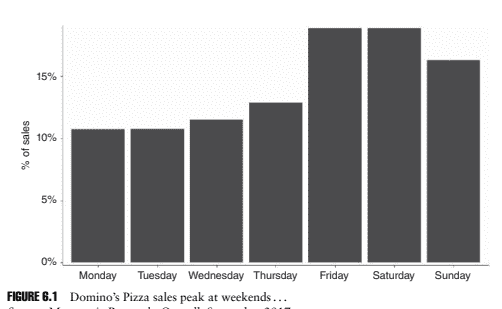

交易，它不受通常观察到的自我报告数据的潜在不准确性和扭曲的影响。然而，值得指出的是，历史非常有限，即与横向维度不同，时间序列的长度目前很有限。

我们统计分析的主要目标之一将是在利用样本的规模优势的同时，减轻潜在的偏见。

从 Quandl 数据库中生成的分析类型的示例在图 6.1 至 6.5 中给出。图 6.1 显示了我们样本中 Domino's Pizza 订单按星期几的分布。周末显然是比萨爱好者最热门的时间。图 6.2 关注下订单的时间，显示了在午餐时间（中午 12 点至下午 2 点之间）有明显的高峰，晚上预订活动明显减少。图片还显示，我们能够按比萨大小细分销售，表明中等大小始终占主导地位。

图 6.3 绘制了我们从样本订单中识别的前 30 种食材的频率。令人惊讶的是，我们发现迄今为止最受欢迎的食材（除了奶酪和番茄）是意大利辣香肠。在数据中，培根也被发现是意外受欢迎的。

与亚马逊等电子商务公司的时间模式完全不同。

图 6.4 显示，在我们样本中，用户在周一至周六的亚马逊订单数量呈稳定下降趋势。如果我们为每个工作日绘制一天中的时间模式（图 6.5），我们可以看到周日一直是亚马逊电子商务中一周中最安静的一天，直到上午 10 点左右。在一天的后期，周日的订单增长速度比工作日的订单快，甚至在其他工作日下降时仍然增长。

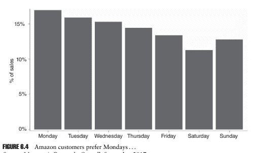

下午，其他日子显示下降。到周日晚上 10 点，周日排名为一周中第三繁忙的一天。

这些例子说明了 Quandl 数据库的一些重要特征。

信息的粒度，甚至到个别产品的水平，是非常显著的。此外，订单被收集并附有时间戳，确保数据趋势可以以比以前更高的频率和实时捕获。值得一提的是，尽管我们在这里不追求这个想法，但是

可以使用数据推断出不同公司之间的数据模式。一个例子是检查顾客是否倾向于用竞争对手的产品替代 Domino 的产品，或者是否倾向于将他们的消费在餐厅上以大致相同的比例分配给其他提供者。也可以基于他们的购买（例如大笔支出者与小笔支出者）对样本参与者进行聚类，并分析在集群之间数据模式的任何差异，这可能会识别出早期采用者。

## 6.2 Quandl 的电子邮件收据数据库 

## 6.2.1 处理电子收据

我们首先描述将在报告中分析的 Quandl 数据集的结构。该数据集依赖于一大批同意与 Quandl 的合作伙伴分享他们的在线购买信息的美国消费者样本。通常，当安装电子邮件生产力增强应用程序时，他们选择参与此数据共享协议。

我们的数据提供商因此能够每周扫描所有活跃示例参与者的收件箱，以确定他们可能已从许多参与的在线商户（例如亚马逊、沃尔玛、H&M）收到的任何电子收据。

图 6.6 说明了这个过程：电子收据（显示在左侧）被扫描并转换成一系列记录，每个记录代表购买的每个单独产品。在我们的示例中，购买了三种不同的产品，但总物品数量等于四，因为订单包括两个单位的线路跟踪传感器。在数据库中，这由图 6.6 右侧显示的三行表示。数据在周二交付，延迟八天。

（即覆盖到上一个星期一为止）。

不用说，每个用户都是匿名的，因为我们只观察到一个永久 id，所有关于姓名、电子邮件地址和支付方式的信息都被丢弃了。用户 id 可以用来查询一个单独的表，其中包含额外的信息，比如邮政编码、用户进入和退出样本的日期，以及他或她最后一次购买的日期等等。值得强调的是，用户 id 是唯一的和永久的，因此可以在不同平台（例如在亚马逊、蒂芙尼和沃尔玛订购的商品）和时间上重建每个个体用户的购买历史。

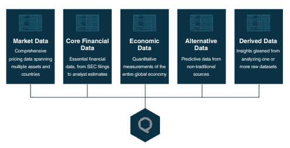

图 6.6 中的表显示了 Quandl 实际提供的一小部分字段。这些字段包括每个记录所指的订单、产品和用户的永久标识符。我们还得到了每个产品的描述、数量、价格以及许多可能有用的其他字段，如税费、送货成本、折扣等等。一些字段是指特定产品（例如价格、描述），而另一些字段如运费和时间戳则是指整个订单。

我们用于分析的电子商务收据数据库是 Quandl 提供的替代数据产品之一（图 6.7）。产品范围涵盖了消费者数据之外，还有来自物联网设备、农田传感器中的农业数据、物流和建筑活动数据。

每次新用户加入样本时，Quandl 的合作伙伴都会扫描他们的收件箱，寻找仍然在保存的电子邮件中可用的收据。例如，如果一个用户在 2017 年 9 月加入，但她的电子邮件帐户仍然保留着自 2007 年 9 月以来的 Expedia 收据，那么这 10 年的 Expedia 预订将立即添加到数据库中。因此，数据库确实包含一小部分在数据收集开始之前发生的交易。虽然没有明显的理由认为这种回填方法会引入偏见，但事实上，如果我们实时使用数据，回填的观察结果将不可用。正如我们下面详细说明的那样，出于这个原因，我们决定集中在用户实际上是样本的一部分时记录的交易。

## 6.2.2 样本

图 6.8 显示了随时间活跃在样本中的用户总数，即那些可以通过 Quandl 合作伙伴部署的工具访问其收件箱的用户。

如上所述，新用户加入样本时是在个人选择数据共享协议时选择的，而一些现有用户则在其收件箱不再可访问时退出。数据显示，当 Quandl 的一个合作伙伴撤回时，样本大小在 2015 年底急剧下降。在样本期间的其余时间里，大小一直稳步增长，特别是在 2016 年中期有明显加速。构成数据库的独特用户总数接近 470 万。

对于我们的分析，我们可以访问三家公司发布的收据数据：

亚马逊、Domino's Pizza 和 Expedia。此外，我们可获得的数据集截止到 2017 年 4 月。

我们提到我们样本中的所有用户都位于美国。图 6.9 是他们在 2017 年 4 月时在美国领土上的分布的图形示例（使用送货邮政编码，如果可用，否则使用账单邮政编码）。深色表示用户较多的邮政编码区域。该地图显示了围绕洛杉矶、旧金山、休斯顿和纽约等城市的大型城市地区的强烈集中。

为了将这些数字置于上下文中，我们在图 6.10 中显示了每个美国州人口的用户数量占总人口的百分比（不包括阿拉斯加和夏威夷），截至 2017 年 4 月。 总的来说，数据库跟踪了大约 250 万用户，而美国

人口约为 3.25 亿（比例为 0.77％）。 大多数州的覆盖率约为该值，这表明我们的覆盖范围不集中在几个地理区域。 极端值是特拉华州（覆盖率最高）和新墨西哥州（覆盖率最低）。

通过检查一些亚马逊交易，我们得出结论，大多数*用户*似乎是个人或家庭。 然而，在一些情况下，一个用户似乎代表一个更大的群体下订单。 在一个案例中，我们同时处理了 500 个微控制器（带有同样数量的箱子和电适配器）的购买，这表明该订单是代表学校下的。

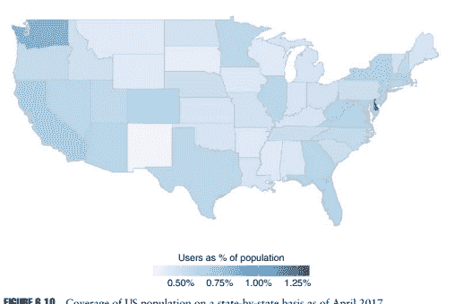

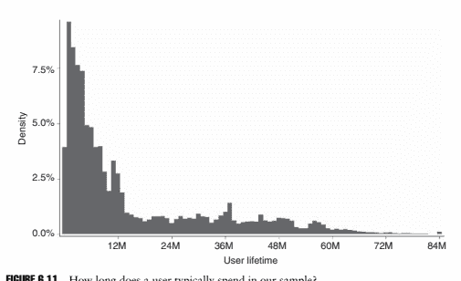

单个用户多频繁地进入和退出样本？ 图 6.11 是 4.7 百万独特用户中每个用户在样本中花费的时间的直方图。 我们包括了当前活跃的用户（例如，加入日期为 2017 年 1 月 1 日的用户在 4 月 1 日之前显示为具有三个月的持续时间，无论他在 4 月 1 日之后是否离开了样本）。 图表显示，大多数用户在样本中的停留时间不到 12 个月。 这并不奇怪，考虑到过去 18 个月参与者人数激增。 在正好 12 个月处似乎有一个峰值，这可能与试用期的长度或 Quandl 合作伙伴提供的应用程序的初始订阅有关。 加入样本三年前或更早的用户中有相当大比例仍然活跃，而已经超过五年的用户很少。

为了评估数据质量，我们查询了数据库，以确定在样本期间发生的亚马逊电商平台上的最大交易（图 6.12）。 大多数物品是由第三方销售而不是直接由亚马逊销售。 在表中的六个项目中，有三个似乎是真实的数据点：一张从未发布过的电影的稀有海报，一块豪华手表和一枚稀有硬币。 剩下的产品似乎有些可疑。 尽管如此，总体上声称价格超过 10 万美元的物品很少，这表明由于对电子邮件收据的解析不佳而导致的数据错误不太可能成为问题。

另一个简单的检查方法是对数据进行汇总，并检查 Quandl 样本参与者所作的总购买与我们在零售电子商务中所期望看到的模式是否一致。众所周知，亚马逊销售显示出强烈的季节性模式。通过使用会计数据，我们可以检测到 Q4 的高峰，随后是 Q2 的低谷（图 6.13）。利用我们的大数据样本，我们可以以更高的频率聚合在亚马逊上的购买行为。在图 6.14 中，我们计算了每年 52 周的平均*每周*销售额，并对其进行了重新调整，使得销售指数的平均值等于一。数据清楚地显示了与亚马逊的*Prime Days*和黑色星期五相对应的显著高峰，传统上被认为是圣诞购物季的开始。表明了 Q4 销售增长的高峰（图 6.13）集中在黑色星期五到 12 月底的几周之间。

| 描述 | 类别 | 价格，美元 |
| --- | --- | --- |
| 1907 年圣高登斯二十美元 PR69 PCGS | 稀有硬币 | 4,194,800.00 |
| 圣灵办公室：由乌尔里希·里舍·比松撰写的所有教堂必备的研究 | 书 | 4,000,003.99 |
| 怪物 1932 年 TOD BROWNING 27 x 41 ONE SHEET  经典恐怖极其罕见！ | 电影海报 | 850,000.00 |
| 一块非常昂贵的石头 | ? | 500,004.99 |
| 三星 SmartCam HD Pro 1080p 全高清 Wi-Fi 摄像头 | Wi-Fi 摄像头 | 360,006.24 |
| 沛纳海 Jules Grande Complication | 手表 | 275,504.49 |
| FIGURE 6.12 | 亚马逊上六笔最昂贵的购买。 |   |

FIGURE 6.12 亚马逊上六笔最昂贵的购买。

来源：Macquarie Research，Quandl，2017 年 9 月。

FIGURE 6.13 基本数据的季节性模式：亚马逊的季度销售。

来源：Macquarie Research，Factset，2017 年 9 月。图表以对数刻度绘制。

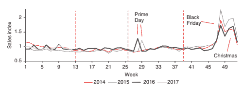

我们在介绍中提到，从大数据中推导出财务预测并不总是直接的。Expedia 是 Quandl 电子收据数据库涵盖的公司之一的一个很好的例子。正如 Expedia 收入表附注中所解释的那样，该公司不会将用户在其平台上预订的服务的总价值视为收入。相反，收入来源于 Expedia 收取的预订费，这不能直接从发送给其客户的收据中推断出。

即使费用是通过对预订成本应用固定百分比计算的，我们也无法从我们的数据中推导出总销售额的估算。每个业务线可能会收取不同的费用，销售按业务部门分解的情况随时间显著变化，正如 Expedia 的收据数据清楚显示的那样。

（图 6.15）。例如，与住宿相比，航班往往具有较低的利润率。

因此，在分析中融入深刻的基本见解对于充分利用大数据的潜力至关重要。在这种情况下，我们将不得不从公司为每个业务线（航班、住宿、汽车租赁）收取的典型费用的估算开始。然后，我们将能够使用我们的大数据样本进行预测

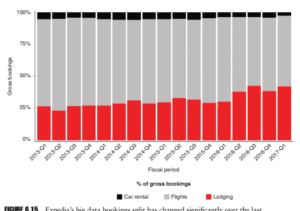

按段落累积总销售额的总数，并合计以获得头条销售额的估算。

## 6.3 处理大数据的挑战

我们在分析中使用的数据，在存储为平面文件时占用了超过 80 GB。它包括 4.7 百万个独特用户的 144.1 百万次购买（行）。因此，我们数据集的庞大规模（即使我们只能访问 Quandl 数据库涵盖的三个名称之一）使得使用标准数据库工具运行甚至最简单的查询变得困难。面对这一技术挑战，我们尝试了其他解决方案来在合理的时间范围内处理数据。

Amazon Redshift 被证明是我们首选的解决方案，因为它经过优化，可以使用简单的语法进行分析处理（只需要对我们的标准 SQL 查询进行少量修改），并且在我们的设置中，与 MySQL 相比速度显著提升（约为 10 倍）。Redshift 通过列而不是行的方式以压缩形式存储数据库表信息，从而减少了磁盘输入/输出请求的数量和从磁盘加载的数据量，特别是在处理像我们这样大量列的情况下。

将更少的数据加载到内存中，使得 Redshift 在执行查询时可以执行更多内存处理。此外，Redshift 查询引擎经过优化，可以在多个计算节点上并行运行查询，并且为了进一步提高速度，完全优化的代码以编译格式发送到计算节点。

## 6.4 预测公司销售额

股票投资者和分析师关注的最重要的指标之一是公司营收的增长。因此，销售额的意外变化已知会引发股价波动，并且分析师动量信号（即销售预测的修订）已被发现可以预测股票回报。

## 6.4.1 我们方法的总结

本节的目的是传达我们预测方法的基本原理。设置如图 6.16 所示：我们的任务是根据管理层发布的指导方针和我们电子邮件收据数据集中的信息来预测第 t 季度的销售额。

如图 6.16 所示，财政第 t 季度的实际收入数据在该季度结束后才可用，通常是在 t+1 季度的中期。使用收据数据集的一个优点是，我们可以在季度结束后立即生成预测，因为所有样本信息都每周更新。换句话说，我们样本中的用户在第 t 季度购买的所有信息在季度结束几天后就可用。

另外，我们可以利用频繁的更新，在第 t 季度的数据可用后进行实时预测，因为随着每周购买数据的更新，新的数据变得可用。我们将在本节末尾更详细地解释我们的方法论。

我们利用了两个信息来源：管理指导和电子邮件收据。

前者由一系列值（预测收入）组成，可以转换为最新报告的季度的增长率范围。我们可以从测量一组用户在两个季度内增长的购买额开始。然后，可以将这一增长率与指导范围进行比较，以预测销售是否会在管理层指示的范围的下限或上限。如果样本内的增长率超出了指导范围，那么我们可以简单地假设销售额将位于范围的下限或上限。

例如，在 2016 年第三季度，亚马逊对销售的指导范围在 310 亿美元至 335 亿美元之间。这对应于第二季度的增长率在 2% 到 10.2% 之间，当时收入总额为 304 亿美元。如果 Quandl 监测的用户样本在 Q3 比 Q2 花费增加了 3.6%，那么我们将以 3.6% 作为我们的估计值，接近范围的下限。然而，如果我们样本的增长率为 12.5%（超出指导范围），那么我们将认为这一结果表明销售可能位于管理层指示的范围的顶端。因此我们将使用 10.2% 作为我们的估计值。

本节的其余部分表明，这种简单方法可以在正式的统计框架中得到证明。特别地，我们认为将两种信息源结合的一种自然方式是采用贝叶斯方法，并将指导视为*先验*信息。然后，我们处理数据以描述销售增长的*后验分布*（图 6.17），即在给定数据的情况下增长率的分布。

如图 6.17 所示，先验分布仅仅利用了指导中隐含的范围，例如增长率在 2%至 10.2%之间。后验的众数是先验分布中的假设样本增长率 3.6%。

## 6.4.2 贝叶斯方法

目标是根据两个样本估计在期间 1 和期间 2 之间的销售变化。形式上，我们假设有两组观察值可用：`{y[11], ..., y[1n]}`和`{y[21], ..., y[2n]}`。让我们暂时忽略本节稍后将处理的两个复杂因素：

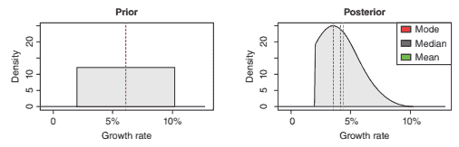

1. 我们的样本可能引入了一些选择偏差，因为'Quandl 总体'与整体总体不同。

2. 总体随时间增长。

我们假设每个样本是从两个时间点的大总体中抽取的。总体中的个体保持不变：一些个体花费为零，但没有新用户加入，也没有用户退出。我们还假设，在每个时间点给定分布的参数后，两个期间的支出是独立的，即分布的形状总结了关于消费增长的所有相关信息。

每个样本被假定从具有参数 i 的负指数分布中抽取：

$$p(y\mid\lambda_{i})=\lambda_{i}e^{-\lambda_{i}y}$$

$$(6.1)$$

p(y ∣ i) = ie−iy (6.1)

指数分布（图 6.18）是一个简单的设备，用于模拟具有严重偏斜分布的正随机变量。实际上，消费者购买的样本将被长尾右侧特征化，这反映了在期间内有少数用户支出非常大的金额。2 在给定参数 1 和 2 的情况下，假设这两个样本是独立抽取的。这相当于假设均值参数的变化总结了在期间 1 和期间 2 之间的总体变化的所有信息。

每个总体的均值是 1/i，这是指数分布的一个特性。

6.4.2.1 先验分布 感兴趣的主要数量是均值的比率 1 2

，其中捕捉了从期间 1 到期间 2 购买的平均金额的增长。我们定义 1 = 1/2，并设置如下的均匀先验：3

$$\phi_{1}\sim U(\underline{{{\mu}}},\overline{{{\mu}}})$$

$$(6.2)$$

1 ∼ U(, ) (6.2)

其中 和 为存货指导范围的上下界，以季度基础的增长率（加一）表示。我们强调，先验是不确定的，即我们不在管理范围内的任何其他值内强加任何其他结构。这在图 6.17 中有所说明。

该推导可向作者索取，首先选择了参数 的先验分布，即 Gamma 分布。这是我们对 1 的假设： 1∼*Gamma*(, )。然后，我们对第 2 时期人口的平均值施加了先验，以考虑存货指导所隐含的增长率范围：

$$\lambda_{2}^{-1}\mid\lambda_{1}\sim U\left(\frac{\mu}{\lambda_{1}},\frac{\overline{{{\mu}}}}{\lambda_{1}}\right)$$

其中量 ∕1 可视为时期 1 的平均值乘以增长率，该增长率等于指导范围的下限。

作为替代，我们还考虑了高斯先验和 Datta 和 Ghosh（1996 年）对 1 的不恰当先验。详情可向作者索取。

6.4.2.2 后验分布 本节描述了我们的收据数据集中参数的分布特征，即平均支出增长率。在推导后验分布时，我们使用了对先验的假设。

（方程（6.2））（Gamma 和均匀）以及似然（方程（6.1））（指数）来推断出给定数据的参数 1 的分布。

可以证明

$$p(\phi_{1}\mid d a t a)\propto\begin{cases}\left(\frac{\phi_{1}}{s}\right)^{\alpha+n}\left(1+\frac{\phi_{1}}{s}\right)^{-(\alpha+2n)}&\text{if}\underline{{{\mu}}}\leq\phi_{1}\leq\overline{{{\mu}}}\\ 0&\text{otherwise}\end{cases}$$

其中 s = ∑iy2i/( + ∑iy1i)。后验分布在 ≤ 区间内具有

1 ≤ ，一个属于 Pearson 分布家族的众所周知的表达式，并且可以重写为 F 分布的转换。因此，其众数可以明确计算，而其均值和中位数可以通过数值积分计算。后验分布如图 6.17 右侧所示。

在实践中，我们可以使用后验分布的众数作为销售增长的估计值。我们首先建立每个时期平均支出的估计器：

$${\widehat{\lambda}}_{1}={\frac{\alpha+n}{\beta+\sum_{i}y_{1i}}},\quad{\widehat{\lambda}}_{2}={\frac{n}{\sum_{i}y_{2i}}}$$

值得注意的是

̂1 只是 1 的后验分布的均值，而

̂2 是第 2 时期样本均值的倒数。然后，增长率的最大*后验概率*（MAP）估计值为

$$\widehat{\phi}_{1\,\mathrm{MAP}}=\begin{cases}\frac{\mu}{\widehat{\lambda}_{1}/\widehat{\lambda}_{2}}&\text{if}\,\widehat{\lambda}_{1}/\widehat{\lambda}_{2}<\mu\\ \widehat{\lambda}_{1}/\widehat{\lambda}_{2}&\text{if}\,\mu\leq\widehat{\lambda}_{1}/\widehat{\lambda}_{2}\leq\overline{\mu}\\ \overline{\mu}&\text{if}\,\widehat{\lambda}_{1}/\widehat{\lambda}_{2}>\overline{\mu}\end{cases}\tag{6.3}$$

因此，我们可以通过在两个时期的参数估计之比来估计增长率。如果估计值超出了指导中隐含的范围，则我们将取较低或较高边界作为我们的估计。值得注意的是，随着样本量的增加，先验分布对估计的影响往往会消失，即参数和变得无关。

6.4.2.3 我们的样本具有代表性吗？ 在本节中，我们介绍了一种简单的调整方法，处理由于抽样误差可能产生的潜在失真。Quandl 数据集相关的人口可能与全球客户和潜在客户的更广泛人口性质不同。此外，正如下一节为亚马逊案例研究所详述的，企业的电子商务部分可能不允许我们就整个业务的销售增长得出结论。

季度季节性效应可能是一个问题，因为企业的不同部分可能有非常不同的模式。特别是电子商务可能会在 12 月和季节性销售期间显示出更明显的高峰，这将导致我们高估这些效应的影响。此外，我们很可能捕捉到的是倾向于年轻化并且更广泛使用电子商务平台的客户子集，而这些客户不代表整个人口。

一个简单而实用的方法是将从我们的样本中测得的增长率视为与实际感兴趣的变量相关的信号，即全体人口的增长率。形式上，我们可以将其写为

$$g_{t}=f(\phi_{t})+\varepsilon_{t}$$

其中，gt 是销售季度环比增长率。然后我们可以利用数据拟合一个适当的函数 f，例如通过使用诸如核回归之类的非参数方法。然而，在我们的案例中，由于我们历史样本的长度极短，我们更倾向于专注于一个考虑到季节性因素的线性模型：

$$g_{t}=\beta^{\prime}f_{t}\,\phi_{t}+\varepsilon_{t}$$

其中是一个 4 × 1 的季度斜率向量，ft 是一个 4 × 1 的向量，根据时间索引 t 指示的季度选择正确的斜率，即 ft = (f1t, f2t, f3t, f4t)

′

和

$$f_{q t}=\left\{\begin{array}{l}{{1}}\\ {{0}}\end{array}\right.$$

$$\begin{array}{l}{{i f t=4k+q\,\,\,f o r\,s o m e\,k\in\mathbb{N}}}\\ {{o t h e r w i s e}}\end{array}$$

产品

′ft 是一个随着时间变化的缩放因子，因为受到季节效应的影响。可以通过回归从数据中估计系数向量。在经验分析中，我们还考虑了一个简单的变体，其中所有  的分量相等。

一旦模型被估计，就可以生成一个经过偏差校正的大数据预测版本

̂1MAP:

$$\widetilde{\phi}_{1t M A P}=\widehat{\beta^{\prime}}f_{t}\,\widehat{\phi}_{1t M A P}$$

$$(6.4)$$

然而，似乎很重要允许季节性组分本身的时间变化。例如，如果公司不同业务的相对重要性发生变化，那么我们可以预期最佳缩放系数也会相应变化。处理这个潜在问题的一种简单方法是将斜率向量  视为（缓慢）变化的系数。在这种情况下可以使用的流行模型之一是状态空间模型，将系数向量视为随机游走：

$$g_{t}=\beta_{t}^{\prime}f_{t}\,\phi_{t}+\varepsilon_{t}$$

$$\beta_{t}=\beta_{t-1}+\eta_{t}$$

其中 t 和 t 是均值为零、方差为 2 , 方差为 2 的扰动项。该模型可以用先验 0∼N(1, I) 初始化，并通过卡尔曼滤波器和平滑器（KFS）进行估计。参数 2 , 2 和  可以根据数据进行校准。由于我们样本的持续时间有限，我们不再深入探讨这个想法。

另一个潜在的偏倚来源是人口增长。我们的样本不包括任何活跃用户（即已选择加入 Quandl 数据库并可联系到的用户），但选择不在电子商务平台上购买任何产品。这应该捕捉到一般人口水平上用户增长的一个方面，即开始使用该平台的新客户。然而，由出生、死亡和移民引起的美国人口规模和人口构成的变化也可能影响电子商务销售的增长。例如，大量移民可能会增加销售额。同样，年轻的人口可能更倾向于在线购物。

在我们的分析中，当计算增长率时故意保持人口恒定，这样我们的结果就不会误以为是应用程序用户的增长导致的。鉴于大部分收入来自人口增长较低的发达国家，这种影响似乎可以忽略不计，我们决定忽略它。另一种方法是明确建模用户增长，并将其添加到从样本中获得的销售增长的预测中。

## 6.5 实时预测 6.5.1 我们的结构时间序列模型

本节处理实时生成季度销售额预测的问题，即在季度期间有新的每周更新可用时更新当前预测。为了避免不必要地复杂化符号，我们将每个季度人为地划分为 13 个期间，将其称为“周”。在实践中，当季度的天数不完全是 91 天时，我们允许较长或较短的第 13 个“周”。在闰年中，我们总是假设第一季度的第 9 周有八天。我们的命名约定的完整描述见图 6.19。

以亚马逊为例，图 6.20 显示了我们数据集中捕获到的购买在每个季度内显示出强烈的季节性模式。我们绘制了一个周销售的指数，该指数在每个季度内归一化为单位平均值（与图 6.14 不同，在图 6.14 中，我们强加了整个日历年的单位平均值）。因此，需要对季节性进行建模，以便基于每周数据生成有用的预测。例如，如果我们仅查看了 Q4 上半年的累计销售额，我们可能会低估增长，因为大多数购买通常在 12 月份进行。

为了简化符号，我们将区分季度销售额 Yt 和季度 t 期间观察到的周销售额 Yt, n，其中 n 标识特定的周，因此 1≤n≤13。按照∑13 n=1 Yt,n = Yt 构建。

我们的周时间序列模型可以写成

Yt,n = Yt(It,n + ΛnMt,n) + ut,n, n = 1*, ...,* 13

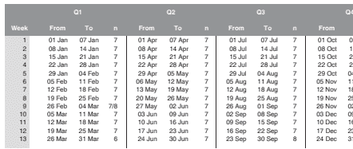

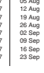

| 10 月 01 日 10 月 08 日 10 月 15 日 10 月 22 日 10 月 29 日 11 月 05 日 11 月 12 日 11 月 19 日 11 月 26 日 12 月 03 日 | 10 月 07 日 10 月 14 日 10 月 21 日 10 月 28 日 11 月 04 日 11 月 11 日 11 月 18 日 11 月 25 日 12 月 02 日 12 月 09 日 |
| --- | --- |

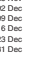 7 7 7 7 7 7 7 7 7 7 7 8

其中*It,n*是一个不规则成分，捕捉例如亚马逊的*prime*日对销售的影响，Λn 是季节性成分，而*Mt,n*是捕捉周具有不规则持续时间效应的乘数（例如，在 Q1 结束时的六天星期）。 期望误差。系数随我们建模的季度而变化（即，Q1 的第一周与 Q4 的第一周不同），但我们只使用下标 t 来保持符号简单。

需要注意的是，假定季节性成分Λn 在不同年份间是恒定的，而*prime day*的日期和乘数 M

随时间变化（后者是因为闰年）。为了关闭模型，我们施加了限制。

t=1

$$(I_{t,n}+\Lambda_{n}M_{t,n})=1$$

以便

E(Y)可以被视为季度销售额的预期总和。

## 6.5.2 估计与预测

由于模型的乘性特性，我们可以直接从图 6.20 中所示的规范化销售系列估计参数，即我们可以使用比率 Yt,n/Yt 进行计算。 *Prime Day* 的效应 It 可以通过对平均值进行估算来估计

*Prime Day* 周的规范化销售与没有举行 *Prime Day* 的同一周的规范化销售之间的差异。

由于一年中的天数已知，因此乘数 Mt 是已知的。为了估计季节性组件 Λn，我们使用 KFS 对比率 Yt,n/Yt（在减去不规则组件之后）拟合了一个三次样条曲线。7 亚马逊的估计结果绘制在图 6.21–6.24 中。从图中可以清楚地看出，季节效应在最后一个季度中更加明显。

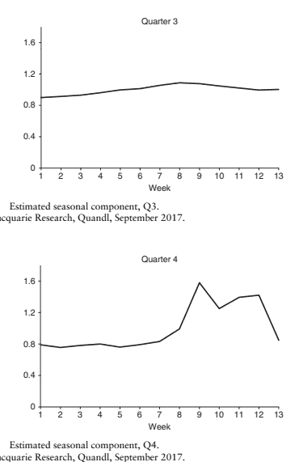

假设我们已经观察到新季度前 s < 13 周一组客户的每周购买情况，那么我们可以预测整个季度的总数为

$$\hat{Y}_{t|s}=\sum_{n=1}^{s}Y_{t,n}\left(\sum_{n=1}^{s}(I_{t,n}+\hat{\Lambda}_{n}M_{t,n})\right)^{-1}$$

季度增长率随后可以使用前一节介绍的方法进行预测。

## 6.6 案例研究：Http://Amazon.Com 销售 6.6.1 背景

在本节中，我们将上面讨论的方法应用于预测亚马逊的季度收入问题。在 Quandl 数据库中，亚马逊是观察次数最多的公司。此外，它是一个需要结合定量和基本洞察的复杂结构的公司的很好的例子。

亚马逊报告业务部门的季度销售额分拆，这在一段时间内发生了变化。在图 6.25 中，我们绘制了两个广泛类别的相对重要性：电子商务和其他销售（其中包括亚马逊网络服务，AWS）。由于我们数据集的特性，通过集中研究电子邮件收据，我们只能调查美国电子商务销售的趋势。图 6.25 表明，尽管由于快速增长，来自电子商务的收入占总收入的比例很大，但占比正在下降。

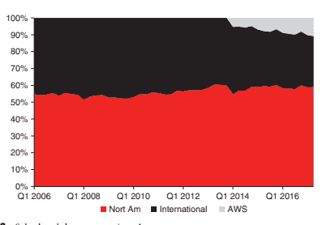

AWS 的增长。8 同样，我们可以从图 6.26 看出，向北美客户（我们可以接近美国销售的客户）的销售额占总销售额的一半以上。

然而，我们无法得出结论，专注于美国电子商务将产生无偏的预测。首先，正如我们在前一节中所论述的，我们的样本仍可能具有显著的选择偏差，因为我们无法确定 Quandl 样本是否代表美国人口。

其次，即使非通过电子商务平台预订的销售比例和发生在美国以外的销售比例都很小，这些部分的增长率可能完全不同，最终导致我们的预测出现偏差。

为了解决这个潜在的问题，我们将销售增长（按季度计）分解为各地区的贡献加上 AWS（图 6.27–6.30）。在每个图中，柱的总高度代表了亚马逊相应季度营收的增长率。通过将每个部分的相对权重与其季度增长率相乘来获得各个组成部分。

结果表明，AWS 对总体销售增长的贡献仍然较小，特别是在 Q1 和 Q4。然而，在 Q2 和 Q3 的预测中，它变得越来越重要。北美和世界其他地区对总体增长率都有显著贡献，但在大多数情况下，前者占据较大份额。

结论是，专注于美国不太可能导致显著偏差，但忽视 AWS 部门（最近增长速度远远快于电子商务）似乎越来越危险。通过业务部门的分解（这里省略以节省空间）得出类似的结果。

## 6.6.2 结果

现在我们转向预测头条销售数字的问题。但在这样做之前，我们通过散点图（图 6.31）检查了总销售增长与电子商务收入增长之间的差异。黑色实线上方的点表示电子商务增长速度超过总体增长速度的季度。

如预期的那样，这往往发生在 Q4（当季度增长率超过 30％时）因为圣诞节销售高峰期。图 6.32 显示，专注于美国的销售本身不太可能导致显著的偏差。

我们实施了上一节中讨论的估计器，以预测亚马逊季度销售增长。图 6.33 呈现了我们对预测的替代版本的结果，并将其与共识进行了比较，即从 I/B/E/S 在日历季度结束后一周获取的平均分析师估计值。到那时，所有季度的客户交易都已经处理并由 Quandl 添加到数据库中，因此两个预测都是可用的。

表格的中间部分显示，与共识相比，大数据估算表现出了良好的比较：预测的两个版本都显示出了较低的平均绝对误差（MAE）。

与平均分析师预测相比。由于样本期间早期出现了一些导致大误差的离群值，根均方误差（RMSE）将倾向于共识。在第三列中，我们显示命中率，即我们的预测改善共识的次数，作为总样本量的百分比。

| 预测器 | MAE | RMSE | 击中率 |
| --- | --- | --- | --- |
| 共识（1） | 1.76% | 2.11% |   |
| 收据和指导（2）无偏差校正 偏差校正 | 1.64% 1.51% | 2.34% 2.40% | 66.7% 66.7% |
| 结合（1）-（2）无偏差校正 偏差校正 | 1.21% 1.32% | 1.47% 2.15% | 75.0% 75.0% |

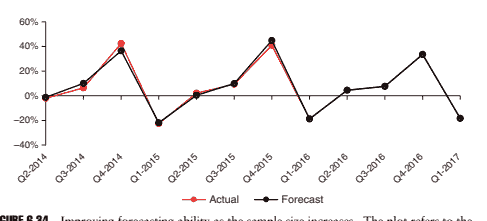

我们在三分之二的时间内取得了改善。尽管时间序列中的观察次数确实有限，但我们的分析似乎表明，大数据估计至少与共识一样准确。

通过偏差校正进一步改善了估计（以 MAE 为指标），这再次表明 Quandl 样本不是不受选择偏差影响的。然而，我们的结果表明，通过使用上一节详细介绍的简单解决方案，即方程（6.4），可以准确建模偏差。随着更长的时间序列的可用性，如果表征我们样本偏差的季节模式随时间变化，则可能需要使用先前建议的自适应估计。

在图 6.33 底部，我们提供了分析师估计和大数据相结合的结果。在这里，两个预测值简单地通过取两个值的平均值来结合。这导致准确性的提高，无论是以 MAE 还是命中率来衡量，后者达到了 75%。尽管就 RMSE 而言，证据不如预期（校正偏差版本与共识相比略高），但总体而言，结果突显了通过结合大数据和分析师的基本见解所能获得的预测能力的改善。

图 6.34 给出了大数据预测与实际值之间距离的图形印象（图表中未使用分析师输入）。预测似乎紧随销售实际增长，估计误差似乎随着时间序列观测次数的增加而减小。再次，这一结果可以归因于，随着用于估计的扩展窗口增加，偏差校正机制变得越来越准确。

## 6.6.3 综合考虑

对比我们的大数据估计与时间的共识也很有用（图 6.35 和 6.36）。在图 6.35 中，我们绘制了两个估计器的预测误差。

在样本期间早期（特别是 2014 年第四季度）发生的相对较大的误差导致我们的预测显示较高的 RMSE。有趣的是，共识显示了季节模式：分析师往往低估 Q1 销售额，并高估 Q4 销售额。在大数据预测中找不到这样的模式。

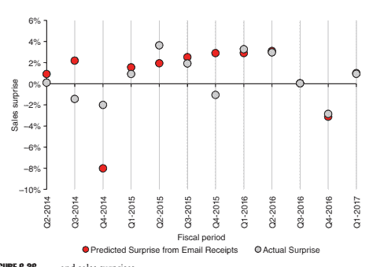

图 6.36 以稍微不同的方式呈现相同的信息，通过绘制预测和实际销售意外。实际数字计算为报告数字与共识之间的差异（在形成预测时不可访问的）。预测意外是我们的大数据估计和共识之间的差异，即如果我们的估计器被证明是 100% 准确的，会发生的意外。从图中明显可见第 4 季度的强烈负面意外的模式。除了两次例外（2014 年第 3 季度和 2015 年第 4 季度），我们将能够在每个季度中正确预测意外的符号。

图 6.33 中一个令人惊讶的结果是，使用偏差校正（表格的最后一行）的预测组合表现不佳，与不使用偏差校正的情况相反。这与使用大数据估计器时，当单独使用时受益于偏差校正的证据不符。为什么当我们的估计器与共识结合时，结论会发生变化呢？事实证明，如果我们依赖 Quandl 数据而不试图校正偏差，我们在第 4 季度往往比共识更不乐观，在第 1 季度至第 3 季度更乐观。正如图 6.37 明确显示的那样，我们样本中的增长率往往低于第 4 季度的报告数字，而在其余时间，特别是第 1 季度，则高于年度报告数字。这正好与共识显示的错误模式相反（图 6.35）。因此，与“两个错误不构成一个正确”的古话相反，当我们结合两个估计时，错误会相互抵消，从而提高了 MAE 和特别是 RMSE。然而，我们不解释我们的结果表明应该在将大数据与分析师预测结合使用时使用原始估计器 ̂1MAP。

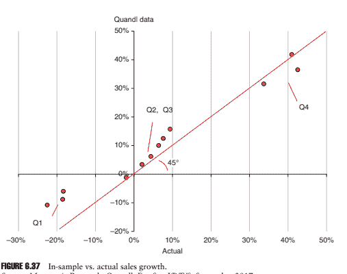

| 模型 | 输入 | MAE | RMSE | 命中率 |
| --- | --- | --- | --- | --- |
| 不当的先验 | 收入数据 | | |   |
| 指数 | 收入，指导 | | |   |
| 高斯 | 收入，指导 | 5.14% 1.64% 1.64% | 6.52% 2.34% 2.34% | 33.3% 66.7% 66.7% |
| 指导中值 | 指导 | 2.73% | 3.23% | 16.7% |
| 季度平均增长率 | 历史增长率 | 7.86% | 12.94% | 25.0% |

图 6.38 结果稳健。数据覆盖了 2014 年第 2 季度至 2017 年第 1 季度的时间段。

出处：Macquarie Research、Quandl、Fact Set、I/B/E/S，2017 年 9 月。

为了得出强有力的结论，需要更好地理解偏差的驱动因素。

图 6.38 的上半部分评估了我们的大数据估计器的表现在多大程度上受到两个输入的影响，即指导和收据数据。我们首先检查结果对我们选择的先验分布的敏感性。有两种方法：

通过仅依赖于 Quandl 数据得出一个预测的方法。这相当于对增长率的不当先验，就像 Datta 和 Ghosh（1996）所提倡的那样。

2. 使用基于正态先验而不是我们的 Gamma-指数模型的模型。9

我们的基准模型在表中被称为*指数*。

忽略来自管理指导的信息会导致估计器质量显著恶化，例如，MAE 从 1.64%上升到 5.14%。命中率仅为 33.3%。然而，单独的指导并不足以匹配我们的大数据估计器的预测准确性。在图 6.38 中，我们展示了指导中点（即指导范围中间的点）作为未来季度增长的估计的性能指标。得到的 MAE（2.73%）和 RMSE（3.23%）明显高于图 6.33 中的任何预测因子。命中率低于 20%。总之，我们方法中的两个要素（指导和大数据）在提供极其准确的销售估计方面发挥着重要作用。我们的结果表明，指导在减少可能结果范围方面很重要，而 Quandl 数据集则提供了关于范围内增长率可能性的宝贵信息。

图 6.38 还包含了一个天真的预测结果，即历史平均增长。

鉴于强烈的季节效应，我们计算了每个季度（Q1-Q4）的历史季节平均值，从扩展窗口中获得。其性能明显比迄今考虑的其他方法差得多。

## 6.6.4 实时预测

在本节中，我们实施前一节讨论的方法，以模拟随着 Quandl 数据库的每周更新而实时估计销售增长。

我们根据前 t<13 周的数据推断整个季度的增长率，然后应用上述纠正潜在偏差并整合来自管理指导的信息的估计程序。

可用数据库对系统分析来说太短了。因此，我们将重点放在样本期间的最后四个季度（2016 年第二季度至 2017 年第一季度），并展示了一个样本外分析的结果。唯一使用完整样本估计的参数是影响周销售的季节性组件（如图 6.21-6.24 所示），这些估计是使用 2014 年至 2016 年的数据进行估计的，并用于推断每周销售趋势。我们承认这可能会产生轻微的前瞻性偏差。但是，这种偏差不会影响 Q1 2017 的样本外分析。此外，任何前瞻性偏差仅在每个季度的前期才相关，因为随着更多周的数据变得可用，我们的推断过程对结果的影响变得不那么重要。一旦日历季度结束，估计值就不再变化，我们对每周季节性影响的估计也不再需要。

图 6.39-6.42 显示了结果的时间序列图。灰线代表共识估计，而黑线显示了我们实时大数据预测的演变。此外，我们以灰色阴影区域的形式图形化地表示了管理指导所暗示的增长率范围，该区域始于发布指导的日期。最后，每张图片中的红点代表实际报告值。

在所有四种情况下，当亚马逊发布其结果时，大数据估计都比共识更准确。我们在这里评估了 Quandl 数据库中的信息需要多长时间才能产生足够准确的估计。

有趣的是，共识在发布指导后往往会有较大幅度的变动（图 6.39 是一个明显的例子），然后保持在范围内。

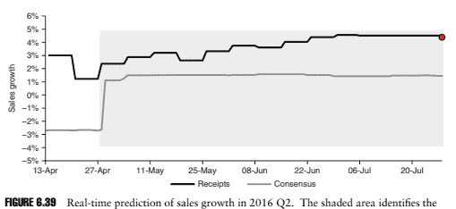

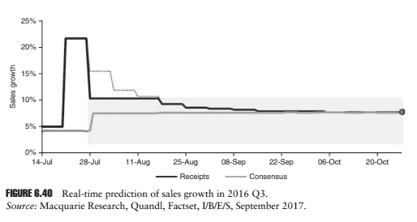

出处：Macquarie Research、Quandl、Factset、I/B/E/S，2017 年 9 月。

管理层指示的指导范围内。与指导范围相比，共识值在此后往往变动很小，并且通常保持在上半部分。

我们的大数据估计在日历季度结束后保持不变（例如，在 6 月 30 日，在图 6.39 中有一周的滞后）因为在那之后没有新信息可用。在这个分析考虑的期间内，只有在一个案例中，Quandl 样本产生的增长率超过了指导范围（图 6.42）。图中的虚线代表原始估计值。在 2016 年 Q3（图 6.40）中，估计值开始高于上限（并向中间收缩），但随着更多周的数据变得可用，它逐渐减小直到进入指导范围。

我们的大数据预测通常比共识更不稳定，特别是在季度初期甚至在发布指导之前更加明显。尽管如此，值得注意的是，这两种预测——分析师预测和大数据预测——很少交叉（图 6.42 中仅一次），这表明即使在季度初期也能预测到销售意外的方向。

## 参考文献

Adrian, T. and Franzoni, F. (2009). 学习有关 Beta 的知识：时间变化的因子负载、预期收益和条件性 CAPM。*J. Empir. Financ.* 16：537–556。

Ben-Rephael, A., Da, Z., 和 Israelsen, R.D. (2017). 这取决于你在哪里搜索：机构投资者的关注度和对新闻的反应不足。 *Rev. Financ. Stud.,* 30: 3009–3047。

Brar, G., De Rossi, G., 和 Kalamkar, N. (2016). 使用文本挖掘工具预测股票回报。

在：*金融情感分析手册*（ed. G. Mitra and X. Yu）。伦敦：OptiRisk。

Das, S.R. 和 Chen, M.Y. (2007). 从网络上的闲聊中提取情感：Yahoo！适用于亚马逊。 *Manag. Sci.,* 53: 1375–1388.

Datta, G.S. 和 Ghosh, M. (1996). 关于非信息先验的不变性。*Ann. Stat.,* 24:

141–159。

Donaldson, D. 和 Storeygard, A. (2016). 俯瞰全局：在经济学中应用卫星数据。 *J. Econ. Perspect.,* 30: 171–198.

Dragulescu, A. 和 Yakovenko, V.M. (2001). 指数和幂律概率分布。

财富和收入的分布。 *Phys. A.,* 299:

213–221。

Gholampour, V. 和 van Wincoop, E. (2017). 我们可以从欧元美元推文中学到什么？

NBER 工作论文编号 23293。

Green, T.C., Huang, R., Wen, Q. 和 Zhou, D. (2017). 员工群体的智慧：

雇主评论和股票回报，工作论文。可在 SSRN 上获取：https://ssrn.com/

abstract=3002707.

Johnson, N.L., Kotz, S., 和 Balakrishnan, N. (1995). *连续单变量分布*，

vol. 2. 纽约：Wiley。

Madi, M.T. 和 Raqab, M.Z. (2007). 使用广义指数分布的贝叶斯降雨记录预测。 *Environmetrics,* 18: 541–549。

Perlin, M.S., Caldeira, J.F., Santos, A.A.P., 和 Pontuschka, M. (2017). 我们可以根据 Google 的搜索查询预测金融市场吗？ *J. Forecast.,* 36: 454–467。

Rajgopal, S., Venkatachalam, M., 和 Kotha, S. (2003). 网络优势的价值相关性：电子商务公司的案例。 *J. Account. Res.,* 41: 135–162。

Trueman, B., Wong, M.H.F., 和 Zhang, X.J. (2001). 回归基础：预测互联网公司的收入。 *Rev. Acc. Stud.,* 6: 305–329.

Wahba, G. (1978). 不恰当的先验、样条平滑和回归中防止模型错误的问题。 *J. R. Stat. Soc. Ser. B* 40: 364–372.

"本文最初由麦格理研究于 2017 年 9 月 11 日向其客户发布的报告中发表。本文中的观点反映了所列作者的观点。本文中的任何内容不应被视为投资建议或投资建议。

本文基于据信为可靠的信息获得，不作准确性、完整性或最新性的声明或保证。麦格理对因使用本文而导致的任何直接、间接、后果性或其他损失概不负责。版权所有。©麦格理集团 2017 年"

