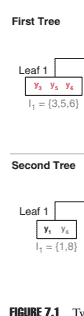
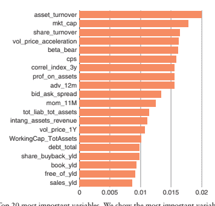
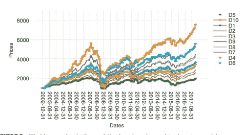
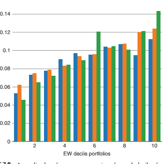

# 第七章：应用于量化股票：梯度提升在多因子框架中的集成学习

Tony Guida 和 Guillaume Coqueret

## 7.1 引言

一个既直观又有充分文献支持的事实是，公司在股票市场上的表现受到它们某些核心特征的驱动。在他们的开创性文章中，法玛和法伦奇（1992）表明，具有较高账面市值比的公司明显优于那些具有较低账面市值比的公司。他们还报告说，小公司的回报往往高于大公司的回报。后来，杰格迪什和提特曼

(1993, 2001) 构建了异常盈利的（动量）投资组合，通过购买表现优异的股票和做空表现不佳的股票。

此类发现导致了所谓的因子指数的构建，投资者购买表现高于平均水平的股票并卖出低于平均水平的股票。关于这些*异常*的文献非常庞大，并且有自己的元研究（例如见 Subrahmanyam 2010; Green et al. 2013; Harvey et al. 2016）。

2016）。2 这是否源于真正普遍（和定价）的影响股票回报横截面的因素（这是法玛和法伦奇 1993 年启动的文献流）或者直接来自公司特征，正如丹尼尔和提特曼（1997）提出的那样，这个问题是有争议的。

无论如何，有很大的共识认为，投资者应该能够从引入公司特征到其资产配置过程中受益。

这些貌似显而易见的建议更为重要，因为智能贝塔指数正在重塑资产管理行业（Kahn and Lemmon 2016）。除了简单的投资组合构建过程外，3 出现了更复杂的方法，例如 Brandt et al. (2009) 和 Ammann et al. (2016) 中所述。

人工智能（AI）的崛起，特别是机器学习（ML）在无关领域（计算机视觉、翻译等）的应用，已经影响了量化管理者如何处理手头所有数据的方式。最近的贡献包括贝叶斯推理（Bodnar et al. 2017）、旗形图案识别（Arévalo et al. 2017）、聚类（Nair et al. 2017）、随机森林、提升树和神经网络（Ballings et al. 2015; Patel et al. 2015; Krauss et al. 2017）甚至是循环神经网络（Fischer and Krauss 2018）等技术。

这些文章的限制在于预测变量通常仅限于价格数据或可能是技术数据。这是次优的，因为正如资产定价文献已经证明的那样，还有许多其他可作为解释变量的候选因素。

在本章中，我们建议充分利用 ML 总体和提升树特别是其优势，例如非线性，正则化和良好的泛化结果，以及随着大量数据的增加而良好的扩展性。本文的贡献与 Ballings 等人的工作（2015 年）精神上最接近。两者之间的主要区别在于标签过程的复杂性：Ballings 等人（2015 年）只考虑价格方向，而我们采用更结构化的方法。

本章的组织如下。在第 7.2 节中，我们对提升树进行了略微技术性的介绍。第 7.3 节专门介绍数据和协议，将介绍数据集的构建，包括特征和标签工程，我们将在随后的章节中使用的协议以及通过计算机科学界建立的严格协议进行 ML 的校准。

## 7.2 提升树初探

本节专门介绍决策树和提升树的自包含且合理技术性的介绍。有关更多详细信息，请参阅 Friedman 等人（2009 年）的第九章和第十章。

我们考虑一个被分成两部分的数据库：解释变量，聚集在矩阵 x 中，以及我们的目标变量，为简单起见，我们假设它是一个向量，y。设 T 为数据中的出现次数，K 为解释变量的数量：矩阵 x = xt,k 的维度为（T× K）。因此，我们将 xt 记为包含出现 t 的所有字段的 K 值向量。

树的目的是将数据（即（x，y）的集合）分割成尽可能相似的簇。如果 y 是一个数值变量，这意味着减少簇内的方差；如果是一个分类变量，则意味着减少簇的'不纯度'（我们寻求一个明显占优势的类）。

为了简化演示，我们首先处理回归树。在树的根部，变量 j 的最佳分割 s 是这样的，即根据该变量形成的两个簇的 y 的总方差最小：

$$V_{j}^{s}=\sum_{t=1}^{T}{\bf1}_{\{x_{t,k}>s\}}(y_{t}-\mu_{j}^{+})^{2}+\sum_{t=1}^{T}{\bf1}_{\{x_{t,k}\leq s\}}(y_{t}-\mu_{j}^{-})^{2},$$

其中$\mu_{j}^{+}$和$\mu_{j}^{-}$是

其中+j 和−j 是簇内平均值：

符号 1{.}表示指示运算符：如果 x 为真，则 1{x}等于 1，否则等于零。对于所有解释变量 j，该算法在所有可能的值 s 上最小化 Vsj，并保留使得总方差最小的那个值。然后进行第一次分割，然后在生成的两个簇上重复该过程。

注意在 Vsj 的定义中

，术语(yt − ±j)

2 仅仅是缩放的方差，因为我们构建了一个回归树。与线性回归的类比很明显：经典的最小二乘估计器也试图最小化实际数据与预测值之间的方差。在分类树的情况下，方差的计算被一个捕捉群集不纯度的度量所替代。这样的度量的一个流行选择是交叉熵。如果 s±k 是由排序 s 产生的两个聚类中 y 的 K± 类别的比例，交叉熵是不纯度的常用度量：− ∑k±

k=1 s±k log(s±k ). 最小化交叉熵通常会导致一个主导类的出现（至少，这是其目的）。

当节点分裂成两个时，树会逐步增长，而拟合度会随着叶子节点数量的增加而自然增加。显然，叶子节点数为数百个的树很可能会过拟合数据。确定节点数量的标准通常是一个线性组合：拟合度减去一个惩罚项，该惩罚项由叶子节点数量的倍数组成。

一旦建立了一棵树，增强的背后思想是将其与一棵或多棵其他树组合起来，以增加拟合度（这是集成学习的一个特例）。一种直观的解决方案是训练多个分类器，并将它们的预测组合成一个输出信号。在他的开创性贡献中，Schapire（1990）建议拟合三棵树，然后对二元分类进行多数投票。这一思想的改进导致了 AdaBoost 分类器族的发展（Freund 和 Schapire 1997）。有关此主题的综述，请参阅 Friedman 等人的文章（2000）。在后两篇文章中，作者们表明 AdaBoost 原理具有简单的加法表示。

为了图形化地说明这些观点，我们在图 7.1 中绘制了两棵简单的树。我们只对决定性特征感兴趣，即 y。后者的值通过颜色编码，并且树的目的是建立具有相似颜色的聚类。两棵树最终都形成了一个“热”聚类（左侧/叶子 1/第一棵树），但它们在确定第二个实例 y2 的位置上有所不同。现在，如果我们要预测具有类似于 y2 的特征的新事件的颜色，我们的预测将混合两个相应聚类的结果。

现在我们更深入地指定加法方法。让我们从一个拟合的树开始，然后让我们在其上“叠加”另一棵树，以减小第一棵树的误差（例如，通过将新树拟合到残差）。让我们称第一棵树为 T1。

第二棵树 T2 是按以下方式构建的：T2(xt) = T1(xt)+2f2(xt)，其中 2 和 f2 被选择为使 T2 最小化损失函数（例如总方差或加权交叉熵的加权和）。该过程可以任意次迭代，当然：

$$T_{m}(x_{t})=T_{m-1}(x_{t})+\gamma_{m}f_{m}(x_{t}).$$

真正的挑战显然是找到最优的 m 和 fm。 最近的方法 4 使用基于梯度的技术解决了这个问题。 下面，我们描述了 XGBoost 背后的算法（Chen 和 Guestrin 2016）。 对于每个发生的情况，该方法归结为计算来自不同树的预测的加权和。

我们从一些符号开始。 我们将 ̂ym 写成过程的第 m 次迭代的预测。 L 是损失函数，例如回归树的加权方差或多类分类的加权交叉熵。 我们希望最小化的目标是以下内容：

$$\Lambda^{m}=\sum_{t=1}^{T}L(y_{t},\hat{y}_{t}^{m}+f^{m}(x_{t}))+\Omega(f^{m}),$$

其中 f m 是我们正在寻找的函数（在这里，是树）。 (f m) 是一个正则化项，用于惩罚树的复杂性。 我们用 q 抽象地表示 f m 的结构

(节点/分裂)。 另外，我们将叶子的数量设置为 J，没有损失一般性。

和它们的权重（在最终加权和中）为 wj。 假设对于 (f m) 采用 L2 形式，并使用关于 ̂ymt 的 L 的二阶泰勒展开，目标简化为近似形式

$$\widetilde{\Lambda}^{m}=\sum_{t=1}^{T}\left[g_{i}f^{m}(x_{t})+\frac{1}{2}h_{i}f^{m}(x_{t})^{2}\right]+\frac{\lambda}{2}\sum_{j=1}^{J}w_{j}^{2},$$

其中 gi 和 hi 对应于泰勒展开中的前两个导数。 如果我们定义叶子号 j 的实例集：Ij = {i ∣ q(xt) = j}，那么

$$\widetilde{\Lambda}^{m}=\sum_{j=1}^{J}\left[w_{j}\sum_{k\in I_{j}}g_{k}+\frac{w_{j}^{2}}{2}\left(\sum_{k\in I_{j}}b_{k}+\lambda\right)\right],$$

并且对于每个给定的叶子，最小化的权重是：

$$w_{j}^{*}=-\frac{\sum_{k\in I_{j}}g_{k}}{\sum_{k\in I_{j}}b_{k}+\lambda}.$$

然后的问题是找到一个合适的树结构，这通常通过一些贪婪算法来执行。 注意，在上述权重中，梯度位于分子上，这在给定负号时似乎很直观：按照惯例，算法朝相反的方向前进。 最后，可以加入改进以进一步增强算法。 其中一种可能性是收缩。 其背后的想法是全面学习可能会使优化朝着正确的方向，但是*太远*了。

因此，新增加的树可以稍微被因子稀释，这为未来的树留下了更多的空间：

$$\mathbf{\Phi}_{m}(\mathbf{x}_{t})=T_{m-1}$$

Tm(xt) = Tm−1(xt) +  mfm(xt).

另一种可能性是子采样，我们参考原始贡献以了解有关此主题的更多详细信息。

## 7.3 数据和协议

本节描述了我们的 ML 模型使用的数据和实证协议。 我们专注于美国股票，以避免处理欧洲或全球股票中可能出现的不同货币和国家。 我们还选择了美国股票的宇宙，因为其财务指标的覆盖范围更广，相对效率更高。

因此，我们将术语“特征”或因变量互换使用，以表达股票特征。在本节中，我们将解释已执行的特征转换，以使每个特征线性化，并以相同的单位表达它们（即使 XGBoost 和树回归设计用于处理非归一化变量）。

## 数据

我们按市值调整的自由流通股本收集了前 3000 只美国股票的月回报率和月股票特征。完整数据集从 1999 年 12 月至 2017 年 12 月。股票的股票宇宙包括使用 Quandl 高级股票套餐的所有普通股权。数据集是时点数据，因此不会受到幸存偏差的影响。价格是每月离散总回报，考虑了股票拆分和股利调整。价格以美元表示，与其他金额一样。

此数据集代表大约 620,000 个实例，其中实例由股票和日期的组合组成。我们要预测的变量 y 是一年后的板块中性超额表现的概率。我们模型中的解释变量包括基于传统、金融、价格和基于成交量的指标的一大套 200 个特征。

为了避免前瞻性偏差，我们将使用一个为期 24 个月的滚动窗口来训练模型。因此，预测仅在 t+12 个月时才可能进行，并且我们将预测日期向前推移，以适应用于训练的正向时间段。我们将每个月重复一次训练，因此每个月更新每只股票在 12 个月后表现优异的概率。每个滚动分析周期将根据 80% 划分。

训练数据和 20% 的测试数据，保持测试数据在滚动窗口的最近部分，以避免“测试过去”的情况。测试部分用于调整超参数，因为避免过拟合是至关重要的，以便在样本外实现优越表现。

## 特征与标签工程

在基于 ML 的金融应用的大部分研究中，由于缺乏经济框架和不切实际或不明确的目标，例如寻找“最佳股票”，而失败。相反，我们的目的更为合理，因为我们寻求预测极端行为，并在每个板块中挑选出优质股票和最差股票，并将其表示为概率，以便对全面的股票横截面进行排序。

我们“工程化”了标签（未来回报）和特征，以便为算法提供更具因果关系的股票市场表示结构。

再次，我们摆脱了传统方法，该方法试图从过去的价格或短期回报推断未来的表现。我们将基本、风险、成交量和动量等基于信号的特征设为我们的特征。每个特征和标签都以 z 分数表示，然后转换为百分位数，以便在结果分析部分进行比较。

遵循古老的量化格言“垃圾进，垃圾出”，我们尽可能地对特征施加一些结构。

以同样的方式，我们通过顺序进行一些结构：

1. 回到一年（1Y）的表现，这足以在数据集的特征性质和标签的趋势之间建立一定程度的因果关系。

2. 根据每支股票的部门进行归一化。另一种方法是在特征中使用虚拟部门变量，但通过将正确的结构放在标签上，目的更加明确。

3. 摆脱标签中的异常值：超出其部门中性表现（第 5；95）百分位数的股票被排除在培训之外。我们在这里的目标是尽可能地将特征与标签联系起来。例如，我们摆脱了被并购的股票或被涉及欺诈会计丑闻的股票，因为我们希望标签真正与特征相关联。

4. 仅处理筛选后股票的剩余顶部和底部五分位数。

我们希望对横截面的顶部和底部部分的函数进行近似。通过这样做，我们希望对表现良好/不良好的股票有一个清晰的分层表示。

我们定义 Yi1 为股票 i 在一年后的一段时间内表现优于其部门 S 的概率。因此，Yi0 = 1 − Yi1 将是股票 i 在一年后表现不及其部门的概率。Yi1 作为我们分类任务的主要输入。我们在算法中处理的标签如下：

$$y^{i}=\left\{\begin{array}{l l}{{1\ i f\ Y_{0}^{i}\geq0.5}}\\ {{0\ i f\ Y_{0}^{i}<0.5}}\end{array}\right.$$

因此，这个变量跟踪相应的股票是否有可能

表现良好。在下一小节中，我们将重点关注我们依赖于来预测 yi 的解释变量。

## 7.3.3 使用的变量/特征

在我们的模型中，我们旨在使用极端梯度增强树每个月预测一只股票在其部门表现优于的概率。由于我们想要顺序地创建弱学习器（单独的树），并且使用残差（错误分类的标签）进行下一轮，我们将使用数据集中的所有特征。在使用树进行 ML 预测的情况下，高度相关的变量不会干扰模型。大量高度相关的变量将为算法提供更多自由度，以确定每个单一变量的增值。

为了评估特征数据集之间的潜在相关性水平，我们计算了特征的等级相关性的分层聚类。如图 7.2 所示，我们可以确定代表信号族的不同指标组。

例如，图 7.2 中的左矩形显示了基于估值比率的指标，从简单的收益率和账面价值比指标到更基于规则的复合指标，根据公司性质施加更多的条件性。

中间的矩形代表基于价格的风险信号的聚类，例如价格波动信号的不同期限，或者波动率中的相关性加速。总共，这 200 个特征可以被聚类成六类指标，我们在表 7.1 中列出了它们。

在本章中，我们保留数据集中的所有特征。换句话说，在第一阶段我们不求助于重要特征发现，而是留下了树提升模型。

| 成交量/ | | | | |   |
| --- | --- | --- | --- | --- | --- |
| 估值 | 职称/资格 | 月度经营/技术 | 风险 | 估算 | 流动性 |
| 收益率 | ROE | 12-1 月度 | 5 年熊市 | 每股收益修订 | 市值 |
| | 回报 | 成交量 | | |   |
| 账面收益率 | 自由现金流/资产 | 6 个月 RSI | 3 年 | FY1 收益 | 成交量 |
| 相关性 | | | | |   |
| 销售收益率 | 毛利润/资本投入 | 12–1 个月回报/ | 特定风险 | | |
| 成交量 | 来自 PCA 的残差 | 每股收益增长 | 流动性 | | |
| FY1 | 风险 | | | | |

通过训练部分的正则化参数来确定哪些特征在训练中起作用。此外，我们在训练的每个步骤中都使用了非常短的时间段。

（两年），因此在适应市场变化条件（例如部门和风格轮换、风险打开-风险关闭期间等）时，保留高数量的特征是获得更多自由度的好方法。

## 7.4 模型构建

在前一节中，我们介绍并解释了方法的目标、数据集和变量以及它们的结构。现在，我们将深入探讨 XGBoost6 模型中使用的常规参数和超参数的细节。在本节中，我们介绍了 ML 模型，以及我们使用我们的数据找到的感兴趣的超参数。此外，我们将介绍如何调整它们，以便给读者提供更实用的操作指南。

XGBoost 是一种开源模型，可用于不同的语言（C++、R、Python、Julia、Scala），由于其在超参数调整方面的灵活性和快速的代码执行，在计算机科学界非常受欢迎。

我们在第 7.2 节中讨论了树提升的数学方面，因此我们将把本节的范围限制在实际方面。我们在这个练习中的目标是预测一只股票的行业中性超额表现的概率，我们依靠分类方法进行（我们回顾一下，我们的标签 yi 只能取一个或零作为值）。

为了获得行业中性超额收益的概率，我们采用基于逻辑的分类：发生的得分将通过 sigmoid 函数进行处理，这将导致一个介于零和一之间的数字。

目标函数将是通常的 logistic 损失函数，补充了一个正则化项，我们用它来控制模型的复杂性。控制模型复杂性是提升树的一级重点，因为它们往往会对数据过拟合，并可能在样本外表现出较差的泛化行为。

## 7.4.1 超参数

提升树中有许多不同的超参数；覆盖它们超出了本章的范围（它们通常取决于树聚合方法和实现方式）。我们将把介绍限制在我们测试或在本练习中使用的参数上。列表如下：

- 学习率：它是用于防止过拟合的步长缩减。在每次提升步骤之后，我们可以直接得到新特征的权重，并实际上缩小特征权重，使提升过程更保守。

- 最小分割损失：它是使叶节点的树进一步分割所需的最小损失减少。算法越大，就越保守（树将更小）。

- 最大深度：它是树的从根到叶子的最长路径（以节点计）。增加这个值会使模型更复杂，更容易过拟合。

- 正权重的比例控制正权重和负权重的平衡：

对于不平衡的类别很有用。考虑的典型值：sum(负案例)/sum(正案例)。

- 回归：它是权重上的 L2 正则化项（在技术部分中提到），增加这个值会使模型更保守。

## 7.4.2 交叉验证

在图 7.3 中，我们对三个不同的参数进行了交叉验证。为了给读者一个一步一步的方法，我们计算了一个图表，保留了在对 1000 个树的聚合上测试的每对参数的训练和测试预测错误。这个交叉验证练习使用的评估指标是简单的平均误差，由概率阈值 0.5 定义，给出二元分类错误率。

从左到右我们增加了树的深度，使它们更加复杂，遵循（3,5,7）的顺序。从上到下我们增加

更高的学习速率意味着模型将学习得更快，有可能过拟合，并且在预测未见实例时泛化效果不佳。

偏差/方差折衷是机器学习算法的核心，并呼应了 XGBoost 中惩罚目标函数的核心原则：最小化损失并控制复杂性。与简单模型相关的较高误差率更有可能在样本外进行良好的泛化。例如，使用低收缩率（eta = 0.01）和非常浅的树（深度 = 3）测试的模型即使经过 1000 次迭代后仍然学习得非常缓慢。这个模型位于图 7.3 的左上部分，明显地对数据拟合不足：学习速度不够快。相反，图 7.3 右下部分的模型（深度 = 7; eta = 0.3）学习速度很快（从 0.01 到 0.1 最终到 0.3 的学习率达到 20%。

100 轮测试集后的误差率）之后就趋于平稳。在这个例子中，模型更可能过拟合：这个模型在训练集中几乎达到了 99%的准确率。

一般来说，可以看出增加树的深度有助于降低收缩的误差水平。可以注意到，对于 eta 为 0.3，深度为 5 或 7 之间的测试误差差异非常小，这表明这两个模型存在一些偏差（它们在 1000 轮后在训练集上达到了 99%的准确率）。

我们进行了网格搜索，以确认我们从图 7.3 中得出的结论。我们预测增强树模型的选定参数是：

- 1000 轮，早停在 100 以防止过拟合

- 设置为 0.1 以确保合理的学习速度 - 设置为 0：在我们的测试中，与其他参数相比似乎不太重要

- 深度为 5：我们需要一些（但不要太多）复杂性来从 200 个特征的完整集合中获益

- L2 正则化参数固定为 1，在 XGBoost 模型中是默认值。

## 7.4.3 评估模型质量

在评估模型质量的过程中，有许多不同的评估指标可用。在交叉验证部分，我们故意只披露了训练集和测试集的平均误差。在这个子部分中，我们想介绍混淆矩阵的概念及所有相关指标，以便精确评估 ML 模型的质量。

图 7.4 的每个部分都可以解释为：

- Fp：假阳性。预测为表现优异的股票，但样本外实际上并不优秀。

- Fn：假阴性。预测为表现不佳的股票，而样本外实际表现优异。

- Tp：真阳性。预测为表现优异的股票，在样本外实际上表现优异。

- Tn：真阴性。预测为表现不佳的股票，在样本外实际上表现不佳。

从这四种情况中，我们可以得出评估模型质量的几个经典指标。

精度：Tp /（Tp + Fp）

精度可以定义为中性部门的超额股票成功预测率。

召回率：Tp /（Tp + Fn）

召回率可以定义为真实率，因为我们包括了被错误分类为负的实例。

准确性：（Tp + Tn）/（Tp + Tn + Fp + Fn）

这是交叉验证部分使用的准确性水平。这些措施可以帮助检测类别的不平衡，这可能导致“懒惰”的分类器问题，即全局准确性结果很好，但一个类别的表示较少，并且显示较低水平的准确性。在我们的练习中，我们将对发现真正的负面而不是真正的正面的准确性不太感兴趣。

在我们选定的模型中，不同评估指标的结果如下：

- 准确性：0.80 - 精度：0.797

- 召回率：0.795。

在早期阶段，我们决定对横截面分布的尾部进行训练，因此类别中几乎没有不平衡：因此召回率、精度和准确率非常接近。

## 7.4.4 变量重要性

对于 ML 的一个常见批评是所谓的“黑箱”性质的预测，好像不可能理解或追踪哪个特征或特征组合负责预测。使用树进行集成学习确实具有一个非常好的特性，可以排除这一批评：变量重要性。

在图 7.5 中，我们展示了从 2002 年 12 月到 2017 年 12 月，我们每个月训练并用于预测的模型的平均变量重要性。每个月，我们保留来自训练模型的变量重要性。有很多不同的变量重要性指标。树集成中的一种流行指标是用于选择分割点的基尼不纯度指数。

在我们的练习中，我们使用增益度量，它等于相对贡献

（在准确性方面）与模型相对应的特征。要计算增益度量，必须对每个月的每个特征的贡献进行平均。可以将增益度量总结为预测有用性指标。

所有特征的增益度量总和为 1。

首先，我们可以看到，平均而言，没有一项特征是占主导地位并解释大多数预测重要性的。然后，看看特征的类型，可以注意到：

- 我们有来自表 7.1 中收集的六个不同指标家族的特征。

- 在前 20 个特征中，价格风险指标似乎比估值、流动性指标等排名更靠前。

- 我们发现了一些常见的、众所周知的并且在资产定价文献中反复研究过的特征（价值的书籍收益、规模的市值、质量的资产盈利能力、低波动性异常的价格波动率和 12-1 个月的动量）。

## 7.5 结果与讨论

现在我们进行一个用例。我们的用例将测试我们基于 ML 的信号作为构建等权重投资组合的基础。我们处理我们的部门胜率概率就像处理任何其他信号一样。我们对其进行归一化处理，用百分位数表示，并评估月度重新平衡的十分位组合的表现。作为基准，我们构建了两个信号，并遵循上述相同的协议。这两个信号是：

1. 使用常用的综合指标进行简单的多因子信号混合，以反映“因子投资”的定义。

2. 根据我们的提升树模型中最重要的 20 个特征挑选的排名前 20 个指标的线性组合。

在本节中，我们提供了实施为天真策略的信号的统计评估。我们将使用常用的股票特征制成的等权重（EW）投资组合作为基准，这些特征包括：

1. 价值：收益率，账面收益率，企业价值/EBITDA。

2. 质量：净资产收益率，债务/股权比。3. 动量：12-1 总回报表现。

4. 低波动性：三年和一年的价格波动率。5. 大小：市值。

第二个基准将是一个等权重投资组合，使用由排名前 20 个最重要特征的线性组合构成的信号。

## 7.5.1 等权重十分位投资组合的时间序列分析

我们在这次回测中的目的是评估在多因子框架中使用 ML 信号相较于现有方法的附加价值。为了比较不同的

信号，我们根据每个信号的排名 z 得分创建等权重十分位投资组合。然后，我们使用月度回报分析这些信号的计算时间序列。最后，我们将重点放在前十分位（D10，最倾斜）上，以提供更多的分析结果。

图 7.6–7.8 是两个基准的以美元表示的财富曲线

（多因子信号和排名前 20 个特征的线性组合）以及使用提升树分类的 ML 模型。

可以注意到三个模型在十分位之间显示出累积的单调性能模式，即第一分位的性能低于第二分位的性能，低于第三分位的性能，等等。

三张图的比例故意相同，使得视觉比较更加容易。可以看到，使用 ML 模型的性能分散在不同十分位之间的差异要比使用排名前 20 个特征的线性组合更加清晰，后者也展现出更好的累积性能单调性模式。

## 7.5.2 经济收益的进一步证据

为了进一步简化我们模型与两个基准之间的比较，我们在一个图表中绘制了每个模型每个分位的年化收益率。在图 7.9 中，可以看到 ML 模型的平均收益率之间的差距（9.8%）比前 20 个特征的线性组合模型（6%）更大。

和简单的多因子组合投资组合 (5.1%)。

在这里，ML 模型受益于尾部训练，我们根据一年后的表现将重点放在了前五分之一和后五分之一上来训练模型。因此，正如预期的那样，ML 模型对于最低十分位数（D1）的表现最差，而对于第十分位数（D10）的表现最好。

到目前为止，我们的分析集中在纯粹的绩效上，表格 7.2 为我们提供了一些关于替代和互补感兴趣的指标的光。这更深入地评估了 ML 模型的稳健性。

分析风险指标显示，与线性组合 (19%) 和 ML 方法 (17.6%) 相比，多因子组合投资组合的波动率最低 (14.7%)。这个结果并不令人意外: 多因子组合投资组合有五分之一的最终混合信号来自低波动性的投资。此外，它也很好。

MFactor-Signal linear_var_imp-Signal ML-Signal

表格 7.2 分析

| MFactor | lin_var_imp | ML |   |
| --- | --- | --- | --- |
| 观测次数 | 180 | 180 | 180 |
| 中位数月收益率 (%) | 1.2 | 1.5 | 1.9 |
| 年化收益率 (%) | 11.2 | 12.4 | 14.3 |
| 年化波动率 (%) | 14.7 | 19.0 | 17.6 |
| 平均秩 IC (12 M) | 0.05 | 0.06 | 0.11 |
| 平均秩 IC (12M forward vol) | −0.46 | 0.02 | −0.05 |
| 收益/风险 | 0.76 | 0.65 | 0.81 |
| t-stats | 2.87 | 2.39 | 2.95 |
| 平均年换手率 (两种方式) (%) | 155 | 203 | 189 |
| 我们正在比较每个模型的前十分位（第十分位）投资组合的分析 - | | |   |

我们正在比较每个模型的前十分位数（第十分位数）投资组合的分析 - 左侧的两个基准和右侧的机器学习模型。

已知，某些简单的质量关联度量，如债务与权益重叠，与低波动性轮廓重叠。

关于风险调整后的绩效，与多因子的 0.76 和前 20 个特征的线性组合的 0.65 相比，ML 模型产生了 0.81 的夏普比率。

查看平均等级信息系数（IC）显示，ML 信号更适合预测未来 12 个月的表现。ML 信号显示平均 IC

相比之下，多因子为 5%，线性组合为前 20 个变量的 6%。

最有趣的是，预测前实现波动性的平均 IC 数字显示，多因子信号的结果为 -46%。这一数字应该解释为：多因子信号水平高意味着与波动率呈负相关。换句话说，高水平的多因子得分意味着更高的低波动性股票曝光。这一结果对于 ML 模型和其他基准不成立。

最后，我们模型的三个 t 统计量都是显著的，ML 为最高

分别为 2.95，多因子和线性组合分别为 2.87 和 2.39。

由于其更动态的方法，与多因子信号（155%）相比，ML 信号产生了更高水平的周转率（189%）。然而，资产轮换低于前 20 个特征的线性组合。

本节结果显示，基于 ML 信号的投资组合在风险调整的基础上表现优于两个基准。ML 信号显示出更好的 IC

对于一年期前向表现和波动性的中立 IC。基于 ML 信号的多空策略（多头持有前十分位数，空头持有底部）在美元中性基础上表现优于两个基准。

基于我们的 ML 模型的非线性和动态方法在所有指标上都被证明更具回报和更高效（除了周转率）。这凸显了提升树算法、正则化以及用于训练模型的大型特征数据集的附加价值。

## 7.6 结论

在本章中，我们介绍了应用于系统性股票投资的提升树算法。我们展示了使用特征和标签工程的效率。应用更多条件性并施加更多因果结构使得现代量化方法能够进行准确的长期预测。这一有见地的发现与最近的批评相矛盾，即基于机器学习的方法仅适用于预测非常短期的价格波动。

我们提供了如何使用传统的财务特征（如估值和盈利能力指标）、价格动量、风险估计、成交量和流动性特征调整、训练和测试基于机器学习的模型的指导。我们表明，界定问题是首要任务，我们通过工程化特征和根据投资目标转换标签来解决这个问题。

我们发现，使用一个具有 200 个特征的提升树算法的天真的等权组合，与简单信号混合的多因素组合相比，平均表现优于 3.1%。我们的结果还表明，基于机器学习的信号对简单多因素信号是互补的。在股票多因素组合可能面临被大量涌入的风险、可能导致风格股票风险溢价套利的商品化风险的背景下，基于机器学习的信号可以构成智能贝塔过度消费时代的有效疗法。即使在最简单的加权方案和实施过程中，信号的动态特性也可能构成一个真正的优势。

## 参考文献

Ammann, M.，Coqueret, G.，Schade, J.P.（2016）。具有杠杆约束的基于特征的投资组合选择。《银行与金融杂志》70：23–37。

Ang, A.（2014）。《资产管理：因子投资的系统方法》。牛津大学出版社。

Arévalo, R.，García, J.，Guijarro, F.，Peris, A.（2017）。一种基于滤波标志模式识别的动态交易规则，用于股票市场价格预测。《应用专家系统》81：177–192。

Ballings, M.，Van den Poel, D.，Hespeels, N.，Gryp, R.（2015）。评估多个分类器对股价方向预测的效果。《应用专家系统》42（20）：7046–7056。

Banz, R.W.（1981）。普通股的回报与市值的关系。金融经济学杂志 9（1）：3–18。

Bodnar, T.，Mazur, S.，Okhrin, Y.（2017）。全球最小方差组合的贝叶斯估计。《欧洲运筹学杂志》256（1）：292–307。

Brandt, M.W.，Santa-Clara, P.，Valkanov, R.（2009）。参数化组合策略：利用股票收益横截面中的特征。《金融研究评论》22（9）：

3411–3447。

Chen, T.，Guestrin, C.（2016）。XGBoost：一种可扩展的树提升系统。在：《第 22 届 ACM SIGKDD 国际知识发现与数据挖掘会议论文集》785––794。ACM。

Daniel, K.，Titman, S.（1997）。有关股票回报横截面变化特征的证据。《金融学杂志》52（1）：1–33。

Fama, E.F.和 French, K.R.（1992）。股票预期收益的横截面。《金融杂志》47（2）：427–465。

Fama, E.F.和 French, K.R.（1993）。股票和债券回报的共同风险因素。

金融经济学杂志 33（1）：3–56。

费舍尔（Fischer, T.）和克劳斯（Krauss, C.）（2018）。利用长短期记忆网络进行金融市场预测的深度学习。*欧洲运营研究杂志* 270：654––669。

弗洛因德（Freund, Y.）和施皮尔（Schapire, R.E.）（1997）。在线学习的决策理论概括及其在增强中的应用。*计算机与系统科学杂志* 55（1）：119–139。

弗里德曼（Friedman, J.）、哈斯蒂（Hastie, T.）、蒂布什拉尼（Tibshirani, R.）（2000）。加法逻辑回归：对提升的统计视角（附讨论和作者的答辩）。*统计年鉴* 28（2）：

337–407。

弗里德曼（Friedman, J.）（2001）。贪婪函数近似：梯度提升机。*统计年鉴* 1189–1232。

弗里德曼（Friedman, J.）、哈斯蒂（Hastie, T.）、蒂布什拉尼（Tibshirani, R.）（2009）。*统计学习的要素*，第 2 版。

斯普林格。

格林（Green, J.）、汉德（Hand, J.R.）和张（Zhang, X.F.）（2013）。收益预测信号的超级视图。*会计研究评论* 18（3）：692–730。

哈维（Harvey, C.R.）、刘（Liu, Y.）、朱（Zhu, H.）（2016）。 . . . 以及预期收益的横截面。*金融研究评论* 29（1）：5–68。

伊尔曼（Ilmanen, A.）（2011）。*预期收益：投资者收获市场回报的指南*。

约翰·威利。

杰加迪什（Jegadeesh, N.）和提特曼（Titman, S.）（1993）。买赢家和卖输家的回报：对股票市场效率的影响。*金融杂志* 48（1）：65–91。

杰加迪什（Jegadeesh, N.）和提特曼（Titman, S.）（2001）。动量策略的盈利能力：替代解释的评估。*金融杂志* 56（2）：699–720。

卡恩（Kahn, R.N.）和莱蒙（Lemmon, M.）（2016）。资产管理者的困境：智能贝塔如何颠覆投资管理行业。*金融分析师杂志* 72（1）：15–20。

克劳斯（Krauss, C.）、多（Do, X.A.）和赫克（Huck, N.）（2017）。深度神经网络、梯度提升树、随机森林：标准普尔 500 指数上的统计套利。*欧洲运营研究杂志* 259（2）：689–702。

麦克莱恩（McLean, R.D.）和庞蒂夫（Pontiff, J.）（2016）。学术研究是否破坏了股票回报的可预测性？

金融杂志 71（1）：5–32。

尼尔（Nair, B.B.）、库马尔（Kumar, P.S.）、萨克西维尔（Sakthivel, N.R.）和维平（Vipin, U.）（2017）。聚类股价时间序列数据以生成股票交易建议：一项实证研究。专家系统与应用 70：20–36。

帕特尔（Patel, J.）、沙阿（Shah, S.）、萨卡尔（Thakkar, P.）和科特查（Kotecha, K.）（2015）。利用趋势确定性数据准备和机器学习技术预测股票和股价指数的运动。专家系统与应用 42（1）：259–268。

施皮尔（Schapire, R.E.）（1990）。弱可学习性的强度。*机器学习* 5（2）：197–227。史巴拉曼扬（Subrahmanyam, A.）（2010）。预期股票收益的横截面：我们从过去二十五年的研究中学到了什么？*欧洲金融管理* 16（1）：27–42。

范·迪克（Van Dijk, M.A.）（2011）。尺寸已经过时了吗？对股票回报尺寸效应的审视。*银行与金融杂志* 35（12）：3263–3274。

