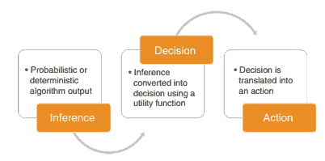
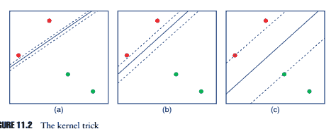
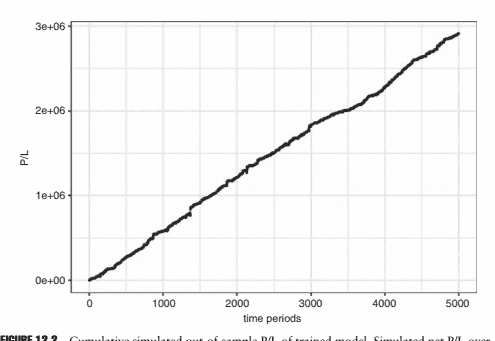
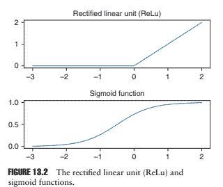
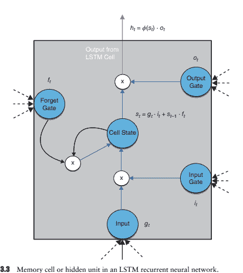

# 第十章：金融新闻的自然语言处理

M. Berkan Sesen, Yazann Romahi 和 Victor Li

## 10.1 引言

新闻一直是投资决策的关键因素。众所周知，公司特定、宏观经济和政治新闻都会对金融市场产生强烈影响。随着技术的进步和市场参与者之间联系的加强，新闻的数量和频率正在迅速增长。事实上，过去两年创造的数据量比人类历史上前 5000 年还要多。据估计，仅在 2017 年，我们创造的数据量就超过了整个人类历史上的数量（Landro 2016）。其中相当大的一部分来自新闻来源，使得人工处理所有与新闻相关的信息几乎不可能。

新闻数据的激增，加上机器学习（ML）的重大发展，使自然语言处理（NLP）在金融领域得到了应用。NLP 是人工智能的一个子领域，涉及编程计算机以处理自然语言语料库以获得有用的见解。NLP 在许多学科中以各种形式呈现，具有各种别名，包括（但不限于）文本分析、文本挖掘、计算语言学和内容分析（Loughran 和 McDonald 2016）。

在金融中有效利用新闻数据需要及时高效地识别相关新闻。主要新闻可能会对市场和投资者情绪产生重大影响，导致投资宇宙的风险特性动态变化（Mitra 和 Mitra 2011）。为了做出明智及时的决策，投资者越来越依赖于程序化解决方案，帮助他们实时提取、处理和解释大量新闻数据。

对新闻数据做出反应的有效 NLP 模型非常受欢迎，不仅用于资产管理和交易，还用于风险控制。在金融领域，NLP 通常用于新闻文章的监控、过滤和情感分析。在资产管理的背景下，这些技术可以作为知识提炼工具，使投资组合经理不再被阅读所有已发表的材料的负担所拖累，并允许他们更有选择地关注注意力。

在本章中，我们将讨论金融新闻数据的各个方面，以及现代学术研究中应用于金融的自然语言处理，并介绍行业如何利用这些方法获得竞争优势。我们将从第 10.2 节介绍新闻数据的不同来源开始我们的讨论。接着，在第 10.3 节，我们将回顾现有文献和实际应用中自然语言处理解决金融中不同问题的情况。

在第 10.4 节中，我们简要总结了自然语言处理分析中涉及的常见分析步骤，如预处理文本数据、词语的特征表示技术，最后从模型中获取所需的推理并评估其预测性能。在第 10.5 节中，我们介绍了一个实际的自然语言处理解决方案，用于从其余部分过滤并购相关新闻文章。在第 10.6 节中，我们通过总结提出的要点，并讨论金融领域自然语言处理面临的挑战和未来的研究方向来总结。

## 10.2 新闻数据的来源

过去十年中金融新闻数据量的激增主要是由传统媒体机构的电子化、监管机构以及交易所采用基于网络的传播方式，以及网络社交媒体和内容分享服务的兴起所推动的。因此，将新闻数据的来源分为三类是明智的，这三类提供了丰富的文本数据集，以测试不同的金融假设。

## 10.2.1 主流新闻

由汤姆森路透社、彭博社和 Factset 等主流新闻提供商生产的新闻文章通常是通过供应商提供的新闻订阅服务访问的。新闻项目通常包含时间戳、简短的标题，有时还有标签和其他元数据。在过去的十年中，大多数数据供应商已经大量投资于基础设施和人力资源，以处理和丰富他们发布的文章，通过提供来自新闻文本内容的见解。目前，彭博社、汤姆森路透社、RavenPack 等公司都提供自己的低延迟情绪分析和主题分类服务。

## 10.2.2 一手资讯新闻

记者在写文章之前调查的一手信息来源包括证券交易委员会（SEC）的申报文件、产品说明书、法庭文件和并购交易。特别是，SEC 的电子数据收集、分析和检索（EDGAR）系统免费提供了对美国超过 2100 万家公司申报文件的访问权限，包括注册声明、定期报告和其他表格。因此，它一直是许多自然语言处理研究项目的重点（Li 2010；Bodnaruk 等 2015；Hadlock 和 Pierce 2010；Gerde 2003；Grant 和 Conlon 2006）。

对 EDGAR 中的大多数报告的分析相当简单，因为它们具有一致的结构，通过使用 HTML 解析器可以轻松地识别部分并提取相关文本。与 EDGAR 相比，在英国公司申报文件的内容和结构方面标准化程度较低，因为公司管理层在公开不同主题的哪些信息以及多少方面有更大的自由裁量权。在没有一致的模板的情况下，从这些文件中提取文本数据对研究人员来说变得更加困难。

我们还可以进一步将一手资讯新闻分为计划和非计划两类。

预定的新闻事件示例包括货币政策委员会公告或公司盈利公告。未预定的，即事件驱动的新闻可以是并购公告或业务重组。预定新闻发布的优点是市场参与者准备及时消化和对这些新闻做出反应。由于消费者需求，预定的新闻项目通常以结构化或半结构化格式提供。相比之下，事件驱动的新闻嘈杂，需要对通常是非结构化的文本数据进行持续监控和处理。

## 10.2.3 社交媒体

通过社交媒体服务获得的新闻，进入门槛以及因此产生的信号噪声比率都很低。社交媒体来源可以包括推文、博客和个人帖子。尽管噪声水平高，缺乏验证和编辑，但由于新闻在网上提供的速度非常快，社交媒体仍然可以作为宝贵的信息来源。事实上，最值得注意的信息传播范式转变发生在社交媒体平台的到来，这些平台使个人以及企业能够即时发布他们对（市场）事件的反应。

有很多支持和反对使用社交媒体的论点。其中一项支持的论点是，博客文章或推文可以让人们利用“群体智慧”，这是指许多个体提供的信息的聚合往往会产生比任何单个群体成员所做出的预测更好的现象（Bartov 等人 2017 年）。然而，社交媒体帖子可能缺乏可信度，因为大多数提供者没有机制来核实所分享的信息或激励高质量的信息。来自发达国家同期政治选举的轶事证据表明，社交媒体帖子中的信息可能是有意误导的，以服务于发布者自己的议程。

使用社交媒体作为替代主要信息提供者传播公司信息的做法也越来越受欢迎。2013 年 4 月，证监会批准了使用帖子和推文来传达公司盈利等企业公告。Jung 等人（2015 年）发现，截至 2015 年，大约有一半的标准普尔公司，1500 家公司要么有公司 Twitter 账号，要么有 Facebook 页面。后来有报道称，公司利用 Twitter 等社交媒体渠道与投资者互动，以减弱消费产品召回所引起的负面价格反应（Lee 等人 2015 年）。

用于处理新闻并从中提取模式的 NLP 模型都是使用历史数据训练的。新闻数据通常可以通过订阅新闻流和/或像彭博、汤姆森路透或 RavenPack 这样的第三方供应商的数据库来访问。另一种常见的方法，更多地被个人投资者使用，是通过网络爬虫来提取有关历史新闻的文本以及元数据，例如来自 Rich Site Summary（RSS）源或新闻提供者或监管机构公开的存档。

无论如何分类，所有新闻项目都需要通过一系列转换转换为机器可读格式。新闻文章始终带有时间戳，并且在大多数情况下，由发布者标记为相关主题、标记甚至有时甚至是情绪得分。这种元数据有助于处理信息。在讨论自然语言处理（NLP）和对原始文本输入数据应用的常见顺序步骤之前，下一节我们将重点关注 NLP 在金融中的实际应用。

## 10.3 实际应用

在本节中，我们将回顾 NLP 在金融领域的当代学术研究和工业应用。Niederhoffer（1971 年）进行的一项关于应用 NLP 于金融新闻数据的开创性研究之一。作者调查了《纽约时报》的头条新闻与股价走势的广泛关系，其中头条新闻是从报纸的专栏中手动提取出来的。研究报告称，股价的大幅波动更有可能跟随宏观经济新闻。

然而，新闻项目的特定类别并未增加有关未来价格变动的信息。此后，计算机和统计推断在该领域的作用逐渐变得更加突出。

今天，金融领域的 NLP 研究涵盖了广泛的主题，从涉及交易和投资决策到市场制造和风险系统的主题。有越来越多的工业应用和学术研究在金融新闻分析中应用 NLP。然而，由于明显的知识产权和商业秘密问题，相对较少的工业报告描述了这些技术在金融公司中的专有用途，因此很少公开。

## 10.3.1 交易和投资

NLP 在金融领域最常见的应用领域之一是系统性交易和投资，在过去的十年中，这些领域取得了显著增长，并在许多股票、期货、期权和外汇交易的场所继续快速增长。市场参与者将 NLP 视为通过分析新闻数据来利用预测模式获得竞争优势的众多方法之一。基本原理与投资者可能如何暗示地应用他们对过去市场在类似条件下的行为的知识来预测在当前环境下接下来可能发生的事情高度类似。

新闻被认为是影响市场微观结构的“信息事件”，影响价格形成、波动性和特定证券或市场的流动性（Mitra 等人，2015 年）。虽然理论上应用的方法是与领域无关的，但在交易和投资中的自然语言处理分析在股票领域最为发展。

研究人员为此目的而利用的信息来源因应用而异。由于从 EDGAR 数据库中提取数据相对容易，因此处理 SEC 文件是非常流行的，正如我们在 10.2 节中讨论的那样。在 2011 年的文献调查中，Li（2010）报告称，对公司文件的大多数研究集中在披露的语气或复杂性以及其对收益或股价的影响方面。在 Bodnaruk 等人（2015）的一项示例研究中，作者们试图通过评估 10-K 披露中的语气来预测流动性事件，以向股东传达他们的担忧。作者们计算了专有一组限制性词语的频率，例如“义务”、“减值”、“施加”，以衡量 10-K 文件的语气。他们报告称，“限制性词语的百分比具有非常重要的经济影响。例如，限制性词语数量的一个标准差增加将使股利遗漏的可能性增加 10.32%，并将使股利增加的概率减少 6.46%”（Bodnaruk 等人，2015 年）。

产品说明书可能用于预测收益。汉利和霍伯格（2010）利用 1996 年至 2005 年期间大量首次公开发行（IPO）的样本，研究了 IPO 说明书语气对定价和首日回报的影响。作者将说明书文本分解为标准和信息组件，并发现信息含量较低的说明书会降低定价准确性，因为它暗示了更多依赖投资者在配售书建立期间定价的情况，并导致报价的变化增加以及更高的初始回报。与此相关的一系列研究是情感分析，在流行度不断增长的情况下，值得我们在报道中单独设置一个子部分。

## 10.3.2 情感分析

情感分析旨在分析一段文本传达对特定主题或实体的观点。在金融领域，大多数情感分析任务背后的主要动机是将这些观点与未来证券收益的方向联系起来。这与监测新闻报道程度以预测交易量和价格波动的自然语言处理应用形成了对比，后者可以说是更简单的任务。

尽管情绪分析在金融领域目前很受欢迎，但情绪分析的开创性研究实际上集中在电影评论上，以训练一个能够检测文本情感的算法（Lee et al. 2002）。与电影评论相比，金融新闻的情感提取是一项更加困难的任务，因为增加了噪音和涉及的上下文信息的不确定性。

通常情况下，情绪可以被建模为二元分类的“积极”或者“消极”，或作为指定文章积极或消极程度的序数得分。作为一项监督学习练习，情绪分析可能涉及手动将训练数据集标记为不同的情绪类别/分数，然后将这些数据输入到分类或回归算法中。这是一项劳动密集型的工作，可能会受到标记者主观性的负面影响，并且在存在多个注释者的情况下容易出现标记者之间的不一致。事实上，Loughran 和 McDonald (2016) 表明金融新闻很容易被错误分类。

一个手动标记的替代方法是编制一个将单词与不同情绪相关联的“单词列表”。使用这样的列表，研究人员可以计算与特定情绪相关联的单词的数量，其中新闻文章中悲观词汇比例较高表明负面情绪。虽然 NLP 从业者可以选择编制和使用他们自己的专有单词列表，但也存在一些公开可用的列表，如亨利单词列表（Henry 2008），该列表是为金融文本编制的。有了这样的公开可用的单词列表，更容易复制其他研究人员的分析。

最后，一种更有原则的方法是将研究人员的主观性从情绪标记中删除，即将新闻文章与从新闻发布时间开始的预测时段内的回报相关联。一个例子是路透社新闻范围事件指数（NEIs）(Lo 2008)，它们被构造为对资产回报和（实现的）波动率具有“预测”能力。NEI 的最佳权重是通过将单词（主题）频率对抗一天中的资产回报进行回归来确定的。

情绪分析在金融领域最突出的应用之一是路透社新闻范围情感引擎（Reuters 2015），该引擎根据正面、中性或负面情感对公司特定新闻进行分类。Groß-Klußman 和 Hautsch(2011) 调查了高频率的回报、波动率和流动性在多大程度上可以通过路透社新闻报道的一天中未安排的新闻到达来解释。作者得出的结论是，尽管情绪标签对未来价格趋势有一定的可预测性，但新闻到达周围波动率和买卖价差的显著增加使简单基于情绪的交易策略无利可图。

在一项独立研究中，Heston 和 Sinha (2017) 探索了使用 Thomson Reuters NewsScope 从 2003 年到 2010 年提取的情感数据预测个别股票回报率的可预测性。他们报告称，特定交易日的新闻情感与随后 1-2 天的股票回报率呈正相关。他们指出，这种预测时间范围的长度严重依赖于投资组合形成程序。同样，Das 和 Chen (2007) 得出结论，情感分析在摩根斯坦利高科技 (MSH) 指数水平上提供了一定的解释能力。然而，自相关使得难以确定关系的经验性质。

除了使用主流新闻外，越来越多的研究关注社交媒体的情感分析。Bollen 等人 (2011) 的一个例子，他们调查了是否从大规模 Twitter 资料中派生的集体情绪状态测量与随时间变化的道琼斯工业平均指数 (DJIA) 的值相关。为了捕捉情绪状态，他们使用 Opinion Finder 和 Google-Profile of Mood States (GPOMS)，前者衡量正面 vs 负面情绪，后者以六个维度 (冷静、警觉、确信、活力、友善和快乐) 对情绪进行分类。作者报告称，一些 GPOMS 情绪状态与 DJIA 的变化相匹配。

出现在 3-4 天后的值，而 Opinion Finder 情绪状态似乎不具有预测信息。值得一提的是，尽管一些 GPOMS 情绪状态与 DJIA 值具有滞后相关性，但作者警告称这并不保证公众情绪状态与 DJIA 值之间存在因果关系。

从一手资料中提取情感的研究也很常见。Huang 等人 (2014) 使用朴素贝叶斯 (NB) 方法预测了 S&P 500 公司在 1995 年至 2008 年期间发布的 35 万份分析师报告中包含的情感。他们将超过 2700 万个句子从分析师报告中归类为正面、负面或中性情感，并聚合句子级别的意见来确定整体报告情感。他们报告称，投资者对负面文本的反应比对正面文本更强烈，这表明分析师在传播坏消息方面尤为重要。

在金融领域进行情感分析所面临的常见挑战包括提取一致情感的困难、确定特定新闻涉及的证券（以及程度）以及过滤新颖的文章。

已经被回收利用的那些。 值得一提的是，情感分析充斥着数据可用性和偏见问题。 Moniz 等人（2009 年）报告称，公司可获得的新闻数据量严重依赖于其规模，以至于标普大型欧洲股票指数中规模最大的五分之一的公司占据了所有新闻报道的 40％，而规模最小的五分之一仅占 5％。 除了缺乏市值较小的公司的数据外，一些研究发现，所谓的积极新闻的数量要比消极新闻的数量更多（Das 和 Chen，2007 年）。 相比之下，个别股票价格对负面新闻的反应要比对积极新闻的反应更强烈（Tetlock，2007 年）。 因此，了解伴随情感分析的常见陷阱是明智的。

情感分析面临的另一个方法论挑战是 NLP 从业者无意中通过诱人的改善结果并不断调整模型参数化而过度拟合推理算法。 这表现在模型过于专门针对训练期间的特殊情况，从而无法很好地推广到新数据。 虽然可以认为这是关于应用于金融时间序列的机器学习的更一般性缺陷，但在情感分析中更加突出，因为情感评分和标记涉及的复杂性和自由度更多。

最后，作为经验法则，在进行情感分析练习之后，应该检查结果，以验证所捕获的信息“优势”是否确实是由新闻来源产生的，而不是由自相关或其他市场信号的同时信息驱动的。 换句话说，应该确认基于情感的预测（例如价格）是否增加了预测市场信号本身的过去价值中不包含的信息。 我们在第 10.4.4 节中讨论了一些常用的评估指标，以达到这个目的。

## 10.3.3 做市商

做市商是金融工具中的流动性提供者，旨在通过差价获利。 在报价驱动的市场中，做市商提供买入和卖出价格。 在订单驱动的市场中，限价订单提供流动性。 在做市商的背景下，新闻数据可以用来更新经纪商对交易量、市场深度和波动性的估计，以便扭曲价格并调整买卖价差。 做市商希望通过扩大其买卖价差来补偿在重大市场事件发生时暴露于市场的风险。 正如前一节中讨论的，这些事件可以是预定的货币政策公告或未预定的新闻发布，这些事件可能引发相关工具的波动或交易量的激增。

正如我们所提到的，不可预期的新闻项目通常需要更多时间来处理公告的含义并制定适当的行动。在这种沉思的时期，市场制造商通常更加谨慎地交易，流动性枯竭。Groß-Klußman 和 Hautsch（2011）报告称，新闻发布会对买卖价差产生显著影响，但不一定影响市场深度。市场制造商主要通过修订报价而不是订单量来对新闻做出反应。

这与基于不对称信息的市场微观结构理论非常一致，专家旨在过度弥补可能存在的信息不对称性(Mitra 等人 2015)。

Von Beschwitz 等人（2013）研究了媒体分析提供商如何影响市场微观结构，特别是它们的存在如何影响股票市场对新闻的反应。他们发现，如果一篇文章在 RavenPack 中得到一致的报道，那么股价和交易量对新闻的调整速度更快。市场暂时对错误的信息作出反应，但随后很快恢复。因此，对市场制造商来说，消化这种类型的信息并根据财经新闻发布情况进行相应定位非常重要。

## 10.3.4 风险系统

金融中的 NLP 应用也用于风险管理。随着市场的成长和变得更加复杂，风险管理工具不断发展以满足更具挑战性的需求。重大新闻事件可能对市场环境和投资者情绪产生重大影响，从而导致交易证券的风险结构和风险特征发生快速变化。NLP 在风险管理中以各种方式使用，从检测和管理事件风险到增强欺诈和内幕交易检测。

事件风险可以描述为由不可预期的新闻引起的在短时间间隔内导致主要市场波动的不确定性。尽管经常被引用但很少被管理，由于难以量化文本新闻（Healy 和 Lo 2011），事件风险在很大程度上被归类为定性判断和经理自由裁量权。金融风险中 NLP 的常见用途之一是作为交易执行算法的熔断器。我们已经讨论过，主要市场事件通常会导致市场制造商提高买卖价差。作为交易的交易对手，资产管理公司和专有交易商可以通过在交易证券上发布“实质性”和“新颖”的新闻时暂时停止当前行动来做出反应。Brown（2011）报告称，将新闻分析用作自动交易策略中的“熔断器”和“狼检测”系统可以帮助增强此类策略的稳健性和可靠性。

类似地，有时排除与投资宇宙相关的投机市场新闻的证券可能是明智的。这类投机性新闻事件通常会引发价格波动和波动性飙升，构成不可分散的，即特异性的风险。在第 10.5 节中，我们提供了一个真实的 NLP 应用，旨在准确区分与并购相关的新闻文章标题和不相关的标题，以减少并购公告造成的特异性风险。

NLP 在金融风险管理中的另一个应用领域是异常检测，以识别异常活动和欺诈性报告。Purda 和 Skillicorn（2015）分析 10-K 报告，以区分基于报告中管理层讨论和分析部分所使用的语言的欺诈性和真实性报告。他们的方法论在于识别一些报告与同一公司发布的报告之间的显著偏差，突出了使用公司自身作为控制对象的效力。在异常检测方面的类似研究也可能在检测不规律模式时受到欢迎。除了讨论的用例外，NLP 还可以用于改进内部财务报告，并及时更新关键事项，特别是合规方面。对元数据进行文本分析和内容的‘理解’使人能够高效地跟踪法规要求的变化和确定与合规相关的成本（LaPlanter 和 Coleman，2017）。因此，NLP 可以显著减少确保法规和法律合规所需的手动处理，并且可以通过从不同业务线聚合相关数据来促进与监管机构的沟通。

需要注意的是，对财经新闻进行文本分析也可能带来意想不到的后果。NLP 带来的提速也增加了对正确回应新闻的要求。快速但错误地回应可能会带来危险。例如，2013 年 4 月，一条关于白宫爆炸的误导性推文引发了一次微型闪崩，结果有些人迅速将责任归咎于算法。同年晚些时候，汤姆逊路透因为将经济数据发布的几秒钟提前出售给高频交易公司而受到指责（von Beschwitz 等，2013）。在接下来的部分中，我们将专注于 NLP 的技术方面。

## 10.4 自然语言处理

正如我们已经确定的，NLP 是人工智能的一个子领域，关注于编程计算机以处理文本数据以获得有用的见解。它以多种形式和名称跨越许多学科，如文本分析，文本挖掘，计算语言学和内容分析。前一节涵盖的所有 NLP 应用都需要经过一些共同的顺序步骤，例如对文本数据进行预处理以及在将其输入统计推断算法之前将单词表示为预测特征。在本节中，我们将更详细地看一下所有 NLP 任务中都需要的这些常见步骤。

自然地，任何统计分析都始于数据收集。对于金融中的 NLP 应用，用于收集数据的不同方法包括订阅主要信息提供者的新闻源，如路透社或彭博社，或使用自定义脚本进行 Web 爬取以提取文本数据以及有关历史新闻的元数据，例如从 RSS 源，或从新闻提供者或监管机构的公开可用档案中提取。

一旦数据被收集，NLP 从业者将需要首先对数据进行预处理和清理，并尽可能减少噪音。预处理后，选择适合数据和手头任务的特征表示方法非常重要。一旦单词被转换为预测特征，它们就可以被馈送到统计推断算法中以提取有用的见解。图 10.1 说明了这种常见的 NLP 流水线，这在很大程度上与包括在一般机器学习分析中的步骤重叠。

在接下来的四节中，我们将稍微详细地讨论图 10.1 中描绘的顺序步骤。我们有意保持我们的覆盖范围概念化，并旨在给出这些常用步骤的风格而不是提供彻底的技术讨论。

## 10.4.1 文本数据预处理

金融新闻数据最显著的特点是其不精确性。为了将新闻数据输入计算机，我们需要将一系列字符，以一种明确和精确的方式，转换为以捕捉传达的信息为特征的格式。下面我们介绍一些应用于文本数据的最常见的预处理和转换步骤。有关本节讨论的预处理步骤的更全面覆盖，读者可以参考 Manning 等人（2009）。

## 10.4.1.1 分词 

在大多数 NLP 应用中，通常首先对原始文本数据进行分词处理，这将通过定位单词边界来将其分解为称为标记的单位。然而，标记不必只是单词；它们可以是数字或标点符号。事实上，分词可能会与去除标点和停用词（极为常见的对 NLP 任务可能毫无价值的词）捆绑在一起。确定这些停用词显然是一项特定于语言的练习，并且可能涉及不同的子阶段，具体取决于语料库的语言。

## 10.4.1.2 词汇表 

虽然将文本建模为字母集合是完全可能的，但大多数 NLP 方法将单词视为作为预测特征的原子单位。在 NLP 的背景下，词汇表是指出现在待处理语料库中的不同单词集合。限制词汇表的一种常见方式是通过词频，只保留出现频率较高的单词。这导致较不频繁出现的单词被捆绑到一个通用的单词索引中，也可以视为应用特定的停用词移除过程。

NLP（自然语言处理）中最简单但又强大的方法之一是通过针对给定文本中的少数特定词语或短语进行处理。由于歧义性，过大的词汇量通常比专注于较少明确的词语或短语的测试更容易出错。一种可能的解决方案是在我们的词汇表中省略或捆绑货币金额、数字和 URL 等标记，因为它们的个体表示会大大扩展词汇表的大小。

较少遇到的单词通常包括专有名词，如个人或组织名称，限制词汇表的大小可能有助于正则化，其中任何公司或国家名称都被捆绑到一个通用的索引中，从而可能消除偏见。减少词汇表大小类似于机器学习术语中的特征选择。这是机器学习中非常活跃的研究领域，存在比频率更加有原则的技术，如互信息和增益比，用于评分所捕获的不同特征的类别判别信息。

## 10.4.1.3 词性标注 

词性标注是将标记分配给其语法类别（例如动词、名词等）的过程，以便了解其在句子中的角色。词性标注器是专门的计算机程序，其接受一个单词序列（即一个句子）作为输入，并提供一个元组列表作为输出，其中每个单词与相关标签相关联。词性标注的一个示例实用性是，如果我们想要根据它们的标签为单词指定不同的权重，重点放在具有高强调的文本段落上，例如在形容词和副词周围的区域。例如，作为情感分析五分类器集成框架的一部分，Das 和 Chen（2007）使用了一个基于形容词和副词的分类器，假设使用形容词或副词的短语包含了大部分情感，因此在基于单词计数的特征表示中‘应该’给予更大的权重。

## 10.4.1.4 词干提取和词形还原 

词干提取和词形还原都用于将单词从其派生的语法形式减少到其基本形式。虽然对于大多数英语单词，词干提取和词形还原会生成相同的单词，但两者并不相同。词干提取通常在不了解上下文的情况下操作单个单词，并使用一个粗糙的启发式过程，删除派生词缀，希望将单词简化为其词干。相比之下，词形还原旨在以更有原则的方式实现这一点，使用词汇表和单词的形态分析来返回单词的基本形式或字典形式，也称为其词形（Manning 等人，2009 年）。与词干提取不同，词形还原不仅处理基本的词变化，如单数与复数，还处理诸如将'car'与'automobile'匹配等同义词。此外，词形还通常需要先使用词性标注器来提供上下文信息，以便将单词映射到适当的词形。

## 10.4.2 单词的特征表示

绝大多数新闻数据是为人类消费而创建的，因此以无结构的格式存储，例如新闻订阅文章、PDF 报告、社交媒体帖子和音频文件，计算机无法直接处理这些数据。在前一节讨论的预处理步骤之后，为了将信息内容传达给统计推理算法，预处理的标记需要转换为预测特征。

在自然语言处理中最常用的特征表示技术是词袋模型，根据这个模型，一个文档被编码为其单词的（无序的）集合，忽略语法和单词顺序，但保留了多重性。文本转换为‘词袋’之后，可以计算各种度量来生成预测特征。由词袋模型生成的最常见度量是词项频率，在前一节中已经讨论过。

在词项频率表示中，所有单词都被假定为相互独立的，文本被折叠成一个术语-文档矩阵，其中行表示单个单词，列提供每个文档的单词计数。

这种方法存在各种缺点。首先，它不保留单词出现的顺序，因此失去了上下文。考虑可口可乐公司 2017 年第三季度财报的标题为“净收入下降 15％，由于 18 点重组的阻力下滑；有机收入（非 GAAP）增长 4％，由价格/混合影响驱动”（可口可乐公司，2017 年）。即使在像这样的小文本中，词项频率表示也无法确定什么是‘下降’，什么‘增长’以及由哪个因素驱动。

基于相邻单词的词义表示是简单词袋方法之外最常见的扩展之一。N-gram 模型属于这一类，部分解决了上下文缺失的问题，通过存储相邻出现的单词序列。因此，例如，一个两个词的 n-gram 模型，即 bigram 模型，将文本解析为一组连续的对。这显然有助于捕获单词的共现情况。理论上，通过更大的 n，模型可以存储更多的上下文信息。然而，实际上大多数 NLP 应用程序仅限于 bigrams 或最好的 trigrams，因为全面的 n-gram 方法可能由于计算和时间限制而具有挑战性。

词频的另一个缺点是常见词，如代词或介词，几乎总是文本中频率最高的词，这并不一定意味着相应的词更重要。为了解决这个问题，最流行的一种方式是通过文档频率的倒数对词进行加权，即词频-逆文档频率（tf-idf）。Tf-idf 是 NLP 中最流行的词加权方案之一，旨在反映一个词对语料库中文档的重要性（Aizawa 2003）。

在 NLP 中，我们应该跨越另一个维度来看待特征表示的方式，即特征是如何编码的。较早的 NLP 工作大部分将单词编码为离散的原子符号，即如果我们的词汇表中包含'buy'和'acquire'作为不同的词，'acquire'可能被表示为 ID-102，'buy'为 ID-052。这种编号完全是任意的，并不提供关于这些单个符号之间明显存在的关系的有用信息给学习算法。这意味着模型无法利用其所学到的知识。

在处理包含'acquire'的新闻文章时，'buy'会被识别为购买。在机器学习中，这种特征表示方式，即将分类特征编码为唯一的 ID，被称为'one-hot-encoding'，导致数据稀疏性。这意味着我们可能需要更多的数据才能成功训练统计模型。

使用分布式表示可以克服一些这些障碍。分布式表示，也称为向量空间模型或向量嵌入，将单词表示为连续的向量空间，其中语义上相似的单词被聚集在一起。回到我们的'acquire'和'buy'的例子，在分布式表示设置中，这两个词在训练后会被映射到向量空间中的附近坐标。因此，遇到这两个看似不同的预测特征的算法可以感知到它们确实密切相关。

利用分布式表示的不同方法可以分为两类。第一类被称为基于计数的方法（例如潜在语义分析（LSA）），它量化了大文本中单词与其他单词的共现频率，并将这些统计映射到每个不同单词的密集向量。第二类是所谓的预测方法，通过迭代更新单词的向量坐标，以更准确地预测单词来训练。

邻居们。两个模型的最终结果与基于计数的模型相同，即词汇表中每个不同单词的一组密集嵌入向量（Tensorflow 2017）。使用这些预测模型计算得到的分布式表示特别有趣，因为向量空间明确地编码了许多语言规律和模式。令人惊讶的是，许多这些模式可以被表示为线性翻译（Mikolov 等人 2013 年）。

迁移学习是近年来与 NLP 中的分布式表示紧密相关的另一个热门话题。这个概念已经存在了几十年，指的是通过从已经学习过的类似领域中的相关任务转移知识，改进在新任务中的学习。在 NLP 中，知识的转移通常是指重复使用在非常大的语料库上训练过的单词的分布式表示，以应用于更小的、小众的领域。这允许 NLP 实践者可以利用大规模研究捕获的语义信息和语言模式，应用于自己领域特定的应用，而不必依赖于通常更为小众和有限的数据集来重新学习相同的信息。

在第 10.5 节中，我们将提供一个由一家领先的资产管理公司使用的真实 NLP 应用示例，该公司使用在数百万篇新闻文章上训练的向量嵌入，并将其应用于 M&A 的特定领域。其中较常用的预训练向量表示包括 Google 的 Word2Vec（Tensorflow 2017）和斯坦福大学的 GloVe（Pennington 等人 2014）。

虽然无法量化一组词的整个信息内容，但特征表示的总体目标是最大化这个量。

语言本质上是复杂的，不仅依赖于构成文本的字母和符号，还依赖于人类大脑理解内涵和上下文的能力。因此，随着我们从基于语法的方法转向考虑上下文和语义关联的方法，开发能够捕捉人类交流所有复杂性的自然语言处理工具变得越来越困难。重要的是要意识到，例如，假设单词是独立单元的方法会损失多少上下文。

## 推理

像所有其他人工智能任务一样，NLP 应用生成的推理通常需要被转化为决策，以便被执行。从推理到决策和行动的自然流程如图 10.2 所示。NLP 应用程序的推理可以用于辅助人类的决策，其中使用效用函数将推理转换为决策。这个效用函数可以简单到一个概率阈值，或者是领域专家大脑中利弊权衡的隐含。另外，推理也可以直接作为自动化定量策略的一部分由计算机转换成行动。

推理一直是机器学习中的一个核心主题，在过去的二十年里，NLP 从业者使用的推理工具取得了前所未有的进步。

机器学习中的推理分为三个广泛的类别，即监督、无监督和强化学习。虽然所需的推理类型取决于业务问题和训练数据的类型，在 NLP 中最常用的算法是监督或无监督。简而言之，监督学习需要标记的训练数据，旨在将一组预测性特征映射到它们记录的或期望的输出。

相比之下，无监督算法可以从未标记的数据中学习模式。还有一个介于两者之间的混合类别，被称为半监督学习。半监督学习通常使用少量标记数据和更多的未标记数据来解决监督问题。

NLP 中最常用的监督方法之一是朴素贝叶斯模型，该模型假设所有的单词特征在给定类别标签的情况下都是独立的。由于这个简化但很大程度上是错误的假设，朴素贝叶斯与词袋(word bag)表示法非常兼容。朴素贝叶斯通常被描述为 ML 中更复杂算法的“沙包”。然而，尽管它的简化假设，它经常与更复杂的分类器正面交锋，甚至在某些情况下表现更好。Friedman 等人（1997 年）将这个悖论归因于分类估计仅仅是函数估计的符号（在二元情况下）; 即使函数近似仍然很差，分类准确度仍然很高。这指的是分类器的校准不良，我们将在下一节中讨论这一点。

在监督方法的复杂性光谱的另一端是现代神经网络架构。在过去的五年中，诸如循环神经网络（RNNs）和卷积神经网络（CNNs）已经主导了基于自然语言处理的推理，将以前的技术水平远远甩在了身后。与朴素贝叶斯模型相比，这些架构能够学习复杂和相关的特征，可以识别输入数据中的模式，并将其映射到期望的输出。在自然语言处理领域，这些架构性能提升的催化剂之一是我们在前一节中讨论的分布式表示的崛起。

自然语言处理领域的大部分现有文献都集中在监督学习上；因此，无监督学习应用构成了一个相对较不发达的子领域，其中测量文档相似性是最常见的任务之一。通常通过计算两个新闻项目之间的余弦相似度来实现这一点，其中文档被表示为术语频率或术语加权的向量。该领域的最新研究包括 Hoberg 和 Phillips（2016）的分析，重点关注 10-K 产品描述以创建基于文本的行业分类，以及 Lang 和 Stice-Lawrence（2015），他们比较年度报告的相似性。

在自然语言处理中应用的另一种流行的无监督技术是 LSA，也被称为潜在语义索引（LSI）。LSA 通过生成一组与文档和它们包含的单词相关的潜在概念来查看文档之间以及它们包含的单词之间的关系。从技术上讲，这些潜在概念是通过应用奇异值分解（SVD）来提取的，以减少术语-文档矩阵的维度，同时保留矩阵内的相似性结构。简单来说，我们可以将这些技术看作是单词的因子分析。LSA 通常用于衡量文档之间的相似性，并揭示不同领域之间的文本关联模式。

将 LSA 应用于金融新闻是一个未充分开发的研究领域。在这个领域的少数研究之一中，Mazis 和 Tsekrekos（2017）分析了美国联邦公开市场委员会（FOMC）发布的声明对美国国库市场的影响。

国库市场。作者利用 LSA 识别了委员会使用的重复文本“主题”，这些主题能够描述作者样本期间大部分传达的货币政策。即使在控制货币政策不确定性和同时经济前景之后，这些主题在解释三个月、两年、五年和十年国库券收益率的变化方面具有统计显著性。

LSA 还有一种基于概率的变体，称为概率隐含语义分析（pLSA），基于潜在类模型（Hofmann 2001）。pLSA 为一种更复杂的方法铺平了道路，该方法称为潜在狄利克雷分配（LDA），其使用了基于狄利克雷的先验（Blei et al. 2003）。LDA 允许研究人员使用术语-文档矩阵识别语料库中的潜在主题结构。LDA 是一种生成模型，更具体地说是一种分层贝叶斯模型，在该模型下，文档被建模为主题的有限混合物，而主题反过来被建模为词汇表中的词的有限混合物。主题建模是一个不断发展的研究领域，在这个领域，自然语言处理从业者构建文本语料库的概率生成模型，以推断文档组中的潜在统计结构，以揭示单词的可能主题归因。

## 10.4.4 评估

通常情况下，自然语言处理任务中的推断与任何其他机器学习分析类似。对于试图预测连续因变量（如回报或波动性）的回归模型，评估指标通常是各种误差项，包括但不限于均方根误差（RMSE）、平均绝对误差（MEA）和均方误差（MSE）。对于分类练习，其中输出是分类的情况，存在许多基于混淆矩阵的指标，例如准确率、精确度和召回率。混淆矩阵是一个列联表，比较分类器预测的类标签与真实标签，也称为地面真相。因此，对于二元分类任务，混淆矩阵是一个 2 × 2 矩阵，提供了比较预测标签与真实标签的汇总统计信息。最直观的基于混淆矩阵的指标是准确率，它指示分类器成功分类了数据集的哪一部分。

值得一提的是，对于分类任务，基于混淆矩阵的指标只提供了对整体性能的部分视图。这是因为为了形成混淆矩阵，分类器输出的后验类概率，例如 P('Related') = 0.78，需要通过应用概率截断值转换为类标签。对于二元分类问题，最常见的做法是将此概率阈值选为 0.5，其中超过此值的任何预测都被标记为“正”预测，以用于混淆矩阵。正如敏锐的读者可能注意到的那样，将概率输出二元化会导致信息损失，并且理论上可以通过在 0 到 1 之间变化概率阈值来简单地建立使用相同分类输出的多种混淆矩阵。

为了克服这些缺点，存在一些评估分类器在可能阈值范围内的预测性能的方法。这种“系统性”指标的常见示例是接收者操作特征曲线下的面积（AUROC）。ROC 曲线绘制了分类器在不同概率阈值下的召回率，即真正例率，与假正例率。图 10.3(a)展示了一个示例 ROC 曲线。AUROC 的值在 0.5 和 1 之间变化，其中 1 表示完美的分类器，0.5 表示完全随机的分类器。另一个与 AUROC 类似但在处理高度不平衡数据集时确实适用的“系统性”指标是精度-召回率曲线下的面积（AUPRC）。精度-召回率曲线旨在捕获分类器精度与召回率（正类别）之间的折衷，随着正类别标签的概率阈值变化。图 10.3(b)展示了一个示例精度-召回率曲线。关于 AUROC 和 AUPRC 的全面覆盖，读者可参考 Davis 和 Goadrich（2006）。

评估后验类概率（分类器输出）而不是最大后验（MAP）类标签对于 NLP 从业者了解分类器的“校准”非常有用。校准良好的分类器是概率分类器，其后验概率可以直接解释为置信水平。例如，预期具有良好校准的（二元）分类器将对样本进行分类，以便在输出为正类别的概率为 0.8 的样本中，大约有 80%实际属于正类别。一些模型，例如我们在前一节中讨论的朴素贝叶斯，可能会给出可接受的准确性结果，但实际上校准不佳，输出可能过于自信或不足。

Mittermayer 和 Knolmayer（2006）审查了八种不同的基于新闻的交易应用程序，指出大多数应用程序中没有报告技术性能指标，如基于混淆矩阵的指标。然而，在过去的十年中，随着机器学习的发展，最近的 NLP 研究更加注重用原则性能指标评估结果。

在时间维度上评估结果的有效性也是至关重要的。当将新闻项目建模为时间序列时，推断的形式是点事件。在回归应用中，在宣布诸如价格、运行波动率等市场数据与这些点事件之间的因果关系之前，验证这种关系的 Granger 因果性是很重要的。Granger 因果性是一种假设检验，用于确定一个时间序列是否有助于预测另一个。根据 Granger 因果性，如果时间序列 x1 中的信号“Granger 导致”时间序列 x2 中的信号，那么 x1 的过去值应该包含有助于预测 x2 的信息，这些信息超出了仅包含 x2 的过去值的信息。

对于无监督学习，不同算法的变化意味着每种技术都需要不同的性能评估方法。即使是不同的聚类技术之间也没有建立起常见的性能指标。对于 k-means 聚类任务，一种常用的指标是“簇内平方残差和”（也称为惯性），而对于层次聚类，更常用的是“轮廓系数”。对于我们在前一节中讨论过的诸如 LSA 和 LDA 之类的主题模型，存在着评估潜在空间的各种指标，如单词插入和主题插入。

## 10.4.5 示例用例：过滤合并套利新闻

在本节中，我们将看一个 NLP 应用于对金融新闻进行分类的实际例子，具体来说是确定一篇新闻文章是否与 M&A 活动相关。

合并套利是一种成熟的投资策略。简单来说，这是一种在合并公告日期由投资者发起的风险赌注，他们选择打赌合并将完成。尽管 M&A 策略的盈利能力随着时间的推移而降低，但即使仅基于公开信息（Jetley 和 Ji 2010）也仍然可以从这些策略中捕获相当大的风险溢价。传统上，M&A 策略被机构投资者如对冲基金所使用，但随着交易所交易基金（ETF）和共同基金的兴起，它们也越来越受到零售投资者的青睐。

我们已经讨论过，在金融领域高效利用新闻数据需要及时而有效地识别相关新闻。在这种情况下，相关性可以是针对特定主题的，比如合并、重组、要约收购、股东回购或其他资本结构调整。媒体在 M&A 交易中的作用已经得到了深入研究。媒体报道可能会影响潜在的有声誉风险的收购公司放弃正在进行中的交易（Liu 和 McConnell 2013）。媒体可能会发布关于吸引报纸读者的公司的投机性并购传闻，这些传闻可能会扭曲价格并导致回报波动。

（Ahern 和 Sosyura 2015）。

尽管其受欢迎程度，但在并购套利中，新闻流的特征化在文献中受到了相对较少的关注。在专注于并购套利的自然语言处理研究中，有几篇研究了预测媒体暗示的完成概率。

Buehlmaier 和 Zechner（2014）使用简单的朴素贝叶斯方法分析了大量并购公告的完成决定因素。

他们发现与并购相关的财经新闻传播速度较慢，需要数天的时间才能够充分定价。一种简单的并购策略，通过财经新闻内容的支持，将风险调整后的回报率提高了超过 12 个百分点。最近，同一作者发现，如果使用财经新闻来过滤掉完成概率低的交易，那么并购套利的盈利能力将显著提高（Buehlmaier 和 Zechner 2017）。

正如现有研究所示范的那样，投资经理随时关注不仅关于新的而且关于现有并购交易的媒体报道对其有利。为此，我们调查了一种系统的自然语言处理方法的有效性，该方法旨在准确区分与并购相关的新闻文章标题

从那些不相关的新闻中分离出来。这是通过训练一个监督学习算法实现的，该算法能够捕捉到新闻文章中的类别区分模式，这些文章是手动标记为与并购相关或不相关的。我们的最终目标是利用这个自然语言处理模型，即 NewsFilter，来推断之前未见的文章是否属于前者还是后者。这被用来及时对官方的并购公告进行行动，以提交套利交易，并从其他股票策略中过滤出与并购交易相关的股票，以减少特异风险。

## 10.5 数据与方法

我们的数据集包括从 2017 年 1 月至 2017 年 6 月之间从正式新闻来源（如彭博社）检索到的 13,000 条新闻标题。这些标题由一家领先资产管理公司的投资组合经理手动标记为与并购套利相关或不相关。在手动标记结束时，约 31% 的数据集被标记为与并购套利相关，其余的被标记为与并购套利不相关。

我们使用日期供应商提供的相关标签来确定特定新闻标题涉及哪些股票代码。一般来说，一篇新闻文章可能提及多家公司，其强调程度不同，并且大多数新闻提供商为新闻项目指定相关度分数，量化一篇特定文章关于某个特定公司的程度。在并购领域，由于提到的代码主要是目标公司和收购方，因此相对较少存在歧义。

我们的自然语言处理分析流程包括在第 10.4 节已经讨论过的常见步骤。我们首先对手动标记的数据进行预处理，以减少噪音并将输入转换为机器可读形式。为此，文本新闻标题首先被标记化。在标记化之后，我们删除了标点符号和英文停用词，并且还应用了词干提取以减少一个词的派生形式到一个公共基本形式，例如将 'acquiring' 转换为 'acquire'。这些步骤有助于巩固数据集中的唯一术语。此外，我们还通过词频减少了我们的词汇量，只包括最常见的 5000 个词作为不同的术语，并将其余的表示为 '其他' 类别下的总体类别。

对于推断，我们使用了一系列二元分类器，从传统的稀疏朴素贝叶斯、岭回归和随机森林到各种神经网络架构。随着过去五年中神经网络的复苏，自然语言处理是受益最多的领域之一。在我们的分析中，我们使用了下面列出的以下网络架构。对于关于该主题的彻底的详细介绍，请参阅 Goodfellow 等人的*Deep Learning*（2016）一书。

1. 前馈神经网络（FNN）：FNN 包含（可能是大量的）简单类似神经元的节点，组织在层中。与所有神经网络架构一样，数据进入网络的输入层，随着名称暗示，通过网络向前馈送，逐层进行，直到到达输出层。层中的节点本身从不连接，通常相邻的两个层是完全连接的（从一层的每个神经元到另一层的每个神经元）。随着信息的向前传播，层之间没有循环或反馈循环。FNN 是被设计出来的第一个和最简单的网络结构。

2. RNN：与前馈结构相比，RNN 包含递归循环，使其能够展示动态时间行为并捕捉序列输入中的长期依赖关系。因此，RNN 适用于自然语言处理，因为它们可以在上下文中评估每个单词/标记输入与之前出现的单词。然而，由于信息的递归性质和梯度流的递归性质，这种架构的训练可能存在问题。为了缓解这些问题，提出了不同的门控机制，导致了各种 RNN 架构。在我们的研究中，我们使用了一种流行的递归架构，称为长短期记忆（LSTM）（Hochreiter 和 Schmidhuber，1997）。

3. CNN：这些由输入层和输出层之间的一系列卷积块组成。对于自然语言处理应用，单个卷积块通常包括一个卷积核，该核将上一层的输入沿着一个空间维度进行卷积，然后是一个最大池化层，用于对卷积输出进行下采样以生成输出张量。卷积核用于生成具有位置不变性的特征，这些特征具有组合性。换句话说，CNN 可以将基本特征（例如图像中的边缘）组合成更复杂的特征，如物体的轮廓等。因此，CNN 通常被应用于计算机视觉应用中，以自动训练能够检测图像中对象等位置不变和组合特征。现在，很明显，文本输入具有类似于图像的属性，其中字符组合形成单词；单词形成 n-gram，短语和句子。

因此，近年来在 NLP 任务中使用 CNN 的趋势逐渐变得更加突出（Conneau 等人 2016 年；Yin 等人 2017 年）。在我们这样的实际实现中，通常会将卷积块序列的输出与一个浅层 FNN 连接起来，以在产生输出之前进一步处理卷积特征。在我们的分析中，我们使用具有不同卷积窗口大小的 CNN，旨在提取不同长度的语言特征 - 我们将其称为多尺寸 CNN。

就特征表示而言，对于神经网络分类器，我们选择使用分布式表示，使用预先训练的 GloVe（Pennington 等人 2014 年）。

嵌入。我们使用了在 2014 年维基百科的快照和 Gigaword 5 数据集上训练的 GloVe 版本，后者是包含近 1000 万篇文章的新闻文本数据的综合存档。以这种方式应用迁移学习使我们能够利用 GloVe 在大规模新闻和维基百科文章语料库中捕获的丰富语义信息和语言模式。

对于所有其他'常规'分类器，我们使用了术语频率-逆文档频率（tf-idf）表示法，这在第 10.2 节中已经讨论过了。所有与自然语言处理相关的预处理步骤都由 spaCy 包完成（参见 s. d. 团队 2017 年）。

在 Python 中。对于推理，我们使用了由 scikitlearn 实现的常规分类器（Pedregosa 等人 2011 年），并使用了 tensorflow（Abadi 等人 2016 年）和 keras。

（Chollet 2015）用于构建上述神经网络架构。

## 10.5.1 结果

我们通过将手动标记的数据集分成五个大小相等的部分，其中大约具有相等的先验结果概率，即“相关”的概率约为 0.69，进行了多次实验。对于每个实验，分类器在四个分区上进行训练，并在剩余的一个分区上进行测试。通过在所有五个分区上迭代此过程，我们确保了在实验中包含了所有新闻标题。所有预测模型的性能都基于 AUROC，AUPRC 的评估结果

这些分层五倍交叉验证的值和预测准确率。

表格 10.1 为我们的二元分类任务提供了五倍交叉验证的预测性能结果。作为基准，第一行和第二行分别代表了两个基本分类器的预测结果。正如其名称所示，随机预测器随机将一半的新闻标题分配为“相关”，其余的分配为“不相关”，与并购套利的先验分类分布相比，先验预测器非常相似，除了事实上它是按照先验类分布而不是等概率进行随机标记分配的。预期地，随机和先验预测器在预测正确的类标签方面表现不佳。

表格 10.1 中的第三行和第四行给出了两个基于实例的分类器的结果，分别是 k-最近邻（k-NN）和最近质心。这些分类器基于它们与新闻文章最相似的训练样本的类标签来为新的新闻文章产生类标签。虽然远远优于随机分类器，但基于实例的分类器表现并不特别好。有趣的观察是，虽然基于实例的分类器的平均准确率几乎相同，为 0.793，但 AUPRC 和 AUROC 指标表明，最近质心在将文章分类为与并购套利“相关”与“不相关”方面做得更好。

第五行和第六行给出了两个朴素贝叶斯变体的结果，分别是多项式和伯努利朴素贝叶斯。多项式朴素贝叶斯通常需要文档-词项矩阵中的整数词频。然而，在实践中，tf-idf 等分数计数也是常用的。相反，伯努利朴素贝叶斯使用二元特征，其中 tf-idf 频率被减少为 0 和 1。因此，有趣的是，更丰富的多项式表示仅在很小程度上优于伯努利朴素贝叶斯。

第八行到第十四行展示了其他常用的分类器，从感知器到随机森林和具有不同（L1 和 L2）正则化惩罚的支持向量机的变体。这些可以归类为传统但相对复杂的分类器，正如它们的性能所反映的那样，它们在准确分类新闻项目方面做得相当不错。

第 xv 行提供了一个集成分类器的预测结果，该分类器对测试集中每篇新闻文章所列行 iii 和 xiv 之间的所有传统分类器进行多数表决。 如文献中常报告的那样，集成分类器

TABLE 10.1 五折交叉验证的新闻样本预测性能结果

数据集

| 数据集 | 准确率 | AUPRC | AUROC |   |
| --- | --- | --- | --- | --- |
| i | 随机预测器 | 0.498±0.005 | 0.488±0.006 | 0.497±0.005 |
| ii | 先验预测器 | 0.56±0.01 | 0.421±0.014 | 0.493±0.012 |
| iii | k-NN | 0.793±0.005 | 0.707±0.01 | 0.724±0.003 |
| iv | 最近的质心 | 0.793±0.005 | 0.74±0.011 | 0.785±0.007 |
| v | 稀疏伯努利朴素贝叶斯 | 0.808±0.011 | 0.733±0.008 | 0.756±0.012 |
| vi | 稀疏多项式朴素贝叶斯 | 0.812±0.01 | 0.746±0.01 | 0.779±0.012 |
| vii | 被动式学习 | 0.833±0.009 | 0.778±0.007 | 0.812±0.008 |
| viii | 感知器 | 0.829±0.009 | 0.774±0.009 | 0.81±0.01 |
| ix | 随机森林 | 0.851±0.005 | 0.797±0.009 | 0.812±0.007 |
| x | SVM L1 | 0.854±0.005 | 0.803±0.008 | 0.83±0.004 |
| xi | SVM L2 | 0.858±0.006 | 0.808±0.006 | 0.832±0.006 |
| xii | 使用 L-1 特征的线性 SVM | 0.855±0.006 | 0.804±0.009 | 0.829±0.007 |
| selection | | | | |
| xiii | 岭回归分类器 | 0.858±0.004 | 0.808±0.005 | 0.827±0.005 |
| xiv | 弹性网络 | 0.86±0.003 | 0.809±0.009 | 0.827±0.005 |
| xv | 集成 [iii–xiv] | 0.863±0.004 | 0.814±0.003 | 0.83±0.003 |
| xvi | 神经网络 - FNN | 0.849±0.005 | 0.802±0.007 | 0.906±0.003 |
| xvii | 神经网络 - LSTM | 0.869±0.006 | 0.805±0.006 | 0.908±0.003 |
| xviii | 神经网络 - 多尺寸 CNN | 0.875±0.005 | 0.817±0.006 | 0.912±0.004 |
| 列表示预测性能增加。单元格包含期望值和标准 | | | | |

列表示预测性能增加。单元格包含期望值和标准

交叉验证结果的偏差。

毫不奇怪地胜过了所有其成分，提供了略优于其最佳成分（即第 xiv 行的弹性网络）的预测性能。

最后，我们可以看到在 xvi 至 xviii 行中三种神经网络架构的表现。FNN 的预测性能优于感知机。这可以解释为 FNN 中隐藏层数量更多，使其具有更高的表示能力，我们用于神经网络架构的 GloVe 向量嵌入可能给出了更丰富的单词表示。将 FNN 与循环和卷积架构进行比较，显然 LSTM 和多尺寸卷积网络明显优于更简单的 FNN 架构。

将 LSTM 与多尺寸 CNN 进行比较，我们发现后者略微优于前者。目前文献中对于循环还是卷积架构更适合于自然语言处理任务尚无定论（Yin 等人，2017）。

## 10.5.2 讨论

如本节所述，NewsFilter 可以归类为一种风险导向的自然语言处理（NLP）技术。

应用程序有助于将与 M&A 相关的证券引起投资经理的注意，以从投资组合中排除特有风险。对于每一个机器学习应用程序，都要意识到模型的不准确性可能带来的经济影响，例如误报和漏报。鉴于应用背景，NewsFilter 的误分类后果仅限于错误地排除/包含某些证券，与一些自动交易或市场做市应用程序（在第 10.3 节中介绍）出现故障所导致的即时财务后果相比，这种最坏情况可能较轻。

更重要的是，与自动交易应用程序相反 - 例如，基于情绪分析导出的交易信号 - 模型生成的推理用于辅助投资经理的决策，留出了专家自由裁量的空间，以发现和缓解模型的潜在缺陷。

尽管本文所列的更复杂和更强大的神经网络方法引起了热议，但重要的是通过分析与更简单的分类器相比获得的性能优势来证明使用这些工具的合理性。这是因为具有更大自由度的复杂模型容易出现实现错误和过拟合，在未经通知的用户手中，意外后果可能会超过所感知的好处。此外，正如机器学习中经常引用的那样，“没有免费的午餐”。换句话说，在任何机器学习问题中都没有完美的一刀切方法，应该在最终确定方法之前尽可能探索尽可能多的替代方案。

尽管 NewsFilter 实现了相当令人满意的预测性能水平，但它依赖于新闻提要元数据进行实体提取，换句话说，确定特定文章所涉及的证券/股票。我们目前正在努力丰富模型的实体提取能力，以补充元数据中报告的标签。除了实体提取之外，另一个研究的活跃领域是文章的新颖性检测，以区分新信息和已经被回收的信息。没有这种过滤，可能会陷入重复报道的泥沼，这可能会不合理地放大新闻相关信号的强度/重要性。

## 10.6 结论

与详尽的审查不同，本章旨在为未曾涉足的人提供进入日益流行的金融领域中 NLP 应用的入口。过去 30 年内，由于计算能力的指数增长以及处理不断增长的新闻数据量需求驱动的文本方法的增加，NLP 在金融中的应用变得更加突出。MarketsandMarkets 在 2016 年的一份报告估计，NLP 市场价值为 2016 年的 76 亿美元，并预计到 2021 年将增长到 160 亿美元。

（Marketsandmarkets 2016）。

过去十年金融新闻数据的爆炸性增长主要是由主流媒体的电子化、监管机构以及交易所采用基于网络的传播方式，以及网络社交媒体的兴起所推动的。在金融领域，新闻被视为影响市场微观结构的“信息事件”。利用 NLP 技术，现代计算机的庞大计算能力能够识别并利用嵌入在文本数据中的模式，用于从系统投资到市场做市和风险控制等金融应用。在所有这些领域中，NLP 技术的推理作为传统市场数据的补充信息来源，并有潜力发现技术或基本分析未捕捉到的模式。

与传统的市场时间序列数据相比，绝大部分新闻数据是为人类消费而创造的，因此以非结构化格式存储。这种非结构化格式，即人类语言，本质上是复杂的，并且不仅依赖于构成文本的字母和符号，还依赖于人类大脑理解内涵和上下文的能力。尽管尚未达到计算机完全理解语言的程度，但 NLP 的持续研究使我们离这一现实越来越近。在文本分析中剩下的挑战之一是超越假设词语作为独立单元出现的阶段，这是我们在第 10.4 节中简要讨论过的特征表示和推断的上下文中提到的话题。

一般来说，无监督学习和半监督学习在应用于金融新闻的自然语言处理中是较为不发达的研究领域。然而，随着数据生成速度的前所未有的激增，其中大部分是未标记且非结构化的形式，它们的重要性日益增加。监督学习依赖于标记数据，而新闻项目的手动标记是一个劳动密集型的步骤。在多个人类标记者的情况下，标记的一致性是机器提取的任何推断可用的重要先决条件。特别是在情感分析中，不同市场参与者受相同事件影响的方式不同，可能导致对相同事件的多种解释。即使在第 10.5 节讨论的应用中，标记方面的不一致性也可能出现在哪些新闻项目应视为与并购活动相关还是无关的问题上。在多位专家共同对数据集进行标记的情况下，这些人为标记的不一致性自然会更加突出。

NLP 分析应用于金融新闻的另一个潜在关注点是，大多数这些分析是由数据供应商提供的共同数据集或公开访问的数据驱动的，例如 SEC 文件。有人认为，这可能会使人们更难以通过类似的算法获得与其他市场参与者的竞争优势。虽然这是一个合理的担忧，但同样的论点也适用于传统的市场数据，在这些数据源的变异性缺乏同样普遍。此外，不同的应用程序在我们在第 10.4 节中涵盖的 NLP 步骤、它们标记数据的方式以及为实现不同目标而使用的一些专有手工特征上有所不同（Mittermayer 和 Knolmayer 2006）。因此，通过谨慎的实施和定制的用例脱颖而出不仅是可能的，而且是高度可预期的。

尽管我们仍然没有接近实现对金融新闻的完全语义和上下文理解，但自然语言处理领域已经取得了显著进展，使得能够产生并将继续革命化金融机构的技术成为可能。在金融领域采用 NLP 技术可以提高性能，但也可能产生意想不到的后果。NLP 为我们提供了更快速地对新闻做出反应的能力，但这也增加了响应必须是正确的要求。快速但错误地做出反应可能会导致市场不稳定性增加。未来，监管机构的挑战是了解这些技术的综合影响，并提出可以控制波动性、改善提供流动性并在总体上稳定市场行为的监管规定。

## 参考文献

M. Abadi, A. Agarwal 和 P. Barham (2016)。'TensorFlow：异构分布式系统上的大规模机器学习'，*arXiv:1603.04467v2*。

Ahern, K.R. 和 Sosyura, D. (2015). 传言四起：金融媒体的轰动效应。《金融研究评论》 28 (7): 2050–2093。

Aizawa, A. (2003). 从信息论的角度看 tf-idf 测量。《信息处理与管理》 39: 45–65。

E. Bartov, L. Faurel 和 P. S. Mohanram，'Twitter 能帮助预测公司级别的收益和股票回报吗？'，罗特曼管理学院工作论文编号 2631421，2017 年。

B. von Beschwitz, D. B. Keim 和 M. Massa，'基于媒体的高频交易：来自新闻分析的证据'，工作论文，2013 年。

Blei, D., Ng, A. 和 Jordan, M. (2003). 潜在狄利克雷分配。《机器学习》研究 993–1022。

Bodnaruk, A., Loughran, T. 和 McDonald, B. (2015). 利用 10-K 文本评估财务约束。《金融与数量分析杂志》 50: 623–646。J. Bollen, H. Mao 和 X.-J. Zeng，Twitter 情绪预测股市。《计算科学杂志》，2011 年。

Brown, R. (2011). 将新闻纳入算法交易策略：增加信号与噪声比。在：*金融新闻分析手册*，307–310。

Buehlmaier, M. 和 Zechner, J. (2014). *并购套利中的缓慢实时信息*。欧洲金融协会。

Buehlmaier, M. 和 Zechner, J. (2017). 金融媒体、价格发现和并购套利。

CFS WP 551。

Chollet, F. (2015). keras。*GitHub*。

Conneau, A., Schwenk, H. 和 Cun, Y. L.，'用于文本分类的非常深的卷积网络'，*arXiv:1606.01781,* 2016 年。

Das, S. 和 Chen, M. (2007). 为亚马逊搜寻雅虎：从网络上的闲聊中提取情绪。《管理科学杂志》 53 (9): 1375–1388。

Davis, J. 和 Goadrich, M. (2006). 精确度-召回率和 ROC 曲线之间的关系。

机器学习会议论文集 233–240。

Friedman, N., Geiger, D. 和 Goldszmidt, M. (1997). 贝叶斯网络分类器。《机器学习》 29: 131–163。

Gerde, J. (2003). EDGAR-Analyzer: 自动化分析美国证券交易委员会 EDGAR 数据库中的公司数据。《决策支持系统》 35 (1): 7–29。

Goodfellow, I., Bengio, Y. 和 Courville, A. (2016). *深度学习*。麻省理工学院出版社。

Grant, G.H. 和 Conlon, S.J. (2006). EDGAR 提取系统：分析员工股票期权披露的一种方法。《信息系统杂志》 20 (2): 119–142。

Groß-Klußmann, A. 和 Hautsch, N. (2011). 当机器读取新闻：利用自动化文本分析来量化高频新闻所引起的市场反应。《实证金融学杂志》 18: 321–340。

Hadlock, C. 和 Pierce, J. (2010). 关于测量金融约束的新证据：超越 KZ 指数。《金融研究评论》 23: 1909–1940。

Hanley, K.W. 和 Hoberg, G. (2010). IPO 招股说明书的信息内容。《金融研究评论》 23 (7): 2821–2864。

Healy, A.D. 和 Lo, A.W. (2011). 管理实时风险和回报：汤森路透新闻范围事件指数。在：*金融新闻分析手册*，73–109。

Henry, E. (2008). 投资者受益于盈余新闻稿的撰写方式吗？ 商业沟通杂志 45: 363–407。

Heston, S.L. 和 Sinha, N.R. (2017). 新闻与情绪：从新闻报道预测股票收益。 *金融分析师杂志* 73 (3): 67–83。

Hoberg, G. 和 Phillips, G. (2016). 基于文本的网络产业和内生产品差异化。 *政治经济学杂志* 124: 1423–1465。

Hochreiter, S. 和 Schmidhuber, J. (1997). 长短期记忆。 *神经计算* 9 (8)：

1735–1780。

Hofmann, T. (2001). 通过概率潜在语义分析进行无监督学习。 机器学习 42: 177–196。

Huang, A., Zang, A., 和 Zheng, R. (2014). 分析师报告文本信息内容的证据。 *会计审阅* 89: 2151–2180。

Jetley, G. 和 Ji, X. (2010). 合并套利价差的缩小：原因和影响。

金融分析师杂志 66 (2): 54–68。

Jung, M., Naughton, J., Tahoun, A., 和 Wang, C. (2015). *企业对社交媒体的利用*。纽约大学。

A. Landro, '2017 年的 5 个网络技术预测'，Sencha，2016 年 12 月 13 日。 [在线]. 可用：https://www.sencha.com/blog/5-web-technology-predictions-for-2017。[访问于 2017 年 12 月 12 日]。

Lang, M. 和 Stice-Lawrence, L. (2015). 文本分析与国际财务报告：

大样本证据。 *会计与经济学杂志* 60: 110–135。

LaPlanter, A. 和 Coleman, T.F. (2017). *教会计算机理解人类语言*：

自然语言处理如何重塑金融世界。 全球风险研究所。

L. Lee, B. Pang 和 S. Vaithyanathan，'点赞？使用机器学习技术进行情感分类'，2002 年经验方法国际自然语言处理会议论文集，2002 年。

Lee, F., Hutton, A., 和 Shu, S. (2015). 社交媒体在资本市场中的作用：来自消费品召回的证据。 *会计研究杂志* 53 (2): 367–404。

Li, F. (2010). 公司披露的文本分析：文献综述。 *会计文献杂志* 29: 143–165。

Liu, B. 和 McConnell, J. (2013). 媒体在公司治理中的作用：媒体影响管理者的资本配置决策吗？ *金融经济学杂志* 110 (1): 1–17。

Lo, A，'路透社新闻范围事件指数'，AlphaSimplex 研究报告，汤姆逊·路透社，2008 年。

Loughran, T. 和 Mcdonald, B. (2016). 会计和金融中的文本分析：一项调查。

会计研究杂志。

Manning, C.D., Raghavan, P., 和 Schütze, H. (2009). *信息检索简介*。

剑桥大学出版社。

Marketsandmarkets '按市场类型、技术、发展、垂直和地区进行的自然语言处理'，2016 年 7 月。[在线]. 可用：https://www.marketsandmarkets.com/ Market-Reports/natural-language-processing-nlp-825.html。[访问于 2017 年 12 月 12 日]。

马兹，P. 和 Tsekrekos，A.（2017 年）。FOMC 声明的潜在语义分析。会计与金融评论 16（2）：179–217。

Mikolov，T.，Sutskever，I.，Chen，K. 等（2013 年）。词和短语的分布式表示及其组合性。*神经信息处理系统进展* 26。

米特拉，L. 和 米特拉，G.（2011 年）。新闻分析在金融中的应用：综述。在：《金融新闻分析手册》，1–39。Wiley Finance。

G. 米特拉，D. 迪·巴托洛梅奥，A. 巴内尔吉和 X. 余，'自动分析新闻以计算市场情绪：对流动性和交易的影响'，英国政府科学办公室，2015 年。

米特迈尔，M.-A. 和 克诺尔迈尔，G.F.（2006 年）。用于市场对新闻反应的文本挖掘系统：一项调查。伯尔尼大学。

莫尼兹，A.，布拉尔，G.，戴维斯，C.，和斯特拉德维克，A.（2009 年）。新闻流对资产回报的影响：一项实证研究。在：*金融新闻分析手册*，211–231。

尼德霍夫，V.（1971 年）。世界事件和股价的分析。*商业杂志* 44：193–219。

Pedregosa，F.，Varoquaux，G.，和 Gramfort，A.（2011 年）。Scikit-learn：Python 中的机器学习。

机器学习研究杂志 12：2825–2830。

Pennington，J.，Socher，R.，和 Manning，C.D.（2014 年）。[在线]. 可访问：https://nlp.stanford

.edu/projects/glove）。*GloVe：全局词向量表示*。斯坦福大学

[2017 年 7 月访问]。

Purda，L. 和 Skillicorn，D.（2015 年）。会计变量，欺诈和一袋词语：评估欺诈检测工具。*当代会计研究* 32：1193–1223。

路透社，T.（2015 年）。*利用新闻中的信号进行量化策略和系统交易*。

汤姆逊路透社。

s. d. 团队，'工业级自然语言处理'，spaCy，2017 年。[在线]. 可访问：https://spacy.io。Tensorflow，'词的向量表示'，Google，2017 年 11 月。[在线]. 可访问：

https://www.tensorflow.org/tutorials/word2vec。[2017 年 12 月访问]。

特特洛克，P.（2007 年）。赋予投资者情绪内容：媒体在股市中的作用。

金融学杂志 62：1139–1168。

可口可乐公司。'可口可乐公司 2017 年第三季度报告稳健的运营业绩'，可口可乐公司，2017 年 10 月。[在线]. 可访问：http://www

.coca-colacompany.com/press-center/press-releases/the-coca-cola-company-reports-thirdquarter-2017-results。[2017 年 12 月访问]。

W. 尹，K. 康，M. 尤兹和 H. 舒兹，'CNN 和 RNN 在自然语言处理中的比较研究'，*arXiv:1702.01923v1*，2017 年。

第十一章

# 基于支持向量机的全球战术资产配置

乔尔·古格利塔

## 11.1 引言

在本章中，我们将展示机器学习，更具体地说是支持向量机/回归（SVM/R）如何帮助构建全球战术资产配置（GTAA）组合。首先，我们将对 GTAA 进行快速文献回顾，解释资产配置的不同家族。然后，我们将通过过去 50 年战术资产配置的历史视角，介绍其背后的重要概念。

第 11.3 节将解释支持向量机（SVM）和支持向量相关性（SVR）的定义。第 11.4 节将介绍用于战术资产配置的机器学习模型，并讨论结果。

## 11.2 五十年全球战术资产配置

冒着陈词滥调的风险，资产配置的目标是获得最佳预期回报与风险的组合（Dahlquist and Harvey, 2001）。作者区分了三类资产配置：(i)基准资产配置，(ii)战略资产配置，(iii)GTAA（见图 11.1）。本章中构建的投资组合策略属于第三类模型，在该模型中，预测模型使用当天的信息集来预测资产回报。

从实践者的角度来看，GTAA 策略的管理已经有近 50 年的历史。GTAA

广义上指的是通过“根据收益和风险变化的模式，灵活调整组合中的资产配置，以提升组合绩效”的主动管理组合（Martellini and Sfeir, 2003）。雷·达里奥，Bridgewater 首席执行官，在 20 世纪 90 年代通过他的“全天候”投资组合使这种方法流行起来。

支持这种投资方法的理论已有充分的文献支持。W. Sharpe 在 1963 年表明资产的回报可以分解为系统和特定组成部分。掌握了这一历史悠久的框架后，投资组合经理采用两种形式的主动策略：(i)市场定时，旨在利用系统回报的可预测性，(ii)选股，旨在利用特定回报的可预测性。学术文献表明，有充分的证据

信息索引

在系统组成中可预测性的历史(Keim and Stambaugh 1986; Campbell 1987; Campbell and Shiller 1988; Fama and French 1989; Ferson and Harvey 1991; Bekaert and Hodrick 1992; Harasty and Roulet 2000)得到证明，而这对于具体组成则不太适用。

在 Samuelson (1969) 和 Merton (1969, 1971, 1973) 之后，他们表明最佳投资组合策略受到随机机会集存在的显著影响之后，最佳投资组合决策规则已被丰富，以考虑可预测收益的存在 (Barberis 2000; Campbell 和 Viceira 1998; Campbell 等人 2000; Brennan 等人 1997; Lynch 和 Balduzzi 1999, 2000; Ait-Sahalia 和 Brandt 2001)。简而言之，所有这些模型都表明投资者应在预期收益高的时期增加对风险资产的配置 (市场时机) 并在波动率高的时期减少对其配置 (波动率时机)。有趣的是，Kandel 和 Stambaugh (1996) 认为，即使有低水平的统计可预测性，也可以产生经济意义，即使市场成功时机只有 100 次中的 1 次，也可能获得异常收益。

本质上，GTAA 是一个两步流程，首先从业者通过资产类别预测资产收益，然后根据这一预测构建投资组合。与 GTAA 接近但没有预测部分的风险平价投资组合 (Hurst 等人 2010) 如今已经成为一种正在崛起的庞然大物，根据此方法管理的资金几乎达到了 3 万亿美元。风险平价通常被称为是 Bridgewater 的“廉价”版本。

“全天候”投资组合。我们同意。GTAA 和风险平价具有某些相似之处，因为它们都试图利用唯一的免费午餐：分散化。然而，风险平价只是投资组合构建的一个“技术细节”（所谓的

“一对西格玛”方法中，给定工具的权重与其实现的波动性（有时是预期的）成反比）。GTAA 试图根据当前信息集调整资产组合，以构建一个“更好”的（即希望提供更高回报风险比）适合当前（或预期的）经济周期的投资组合。例如，Chong 和 Phillips (2014) 利用他们的“Eta 定价模型”构建了基于 18 个经济因素的 GTAA。其中一个是均值-方差优化 (ECR-MVO)，另一个是构建为减少其经济敞口的 (MIN)。两者都是仅多头投资组合，每半年重新平衡一次。

总之，GTAA 的圣杯仍然是构建一个在任何类型的经济环境下都表现出色的投资组合。为了实现这一点，投资组合经理必须找到最佳的资产配置。资产配置通常由固定收入构成

（长期和中介），股票和商品（其他人有时还会添加房地产）。

影响此资产配置的经济周期可以用不同的细度进行建模。

我们跟随 R. Dalio 的做法，试图不要过于复杂化事物，并选择经济周期的稀疏模型，仅使用软数据 (调查) 来进行实际商业周期 (RBC) 指标和实现通胀的预测。

## 11.3 经济文献中的支持向量机

对 SVM 和支持向量回归的全面介绍超出了本章的范围。然而，我们认为简要解释 SVM 和支持向量回归对于不熟悉它的金融从业者（并且花时间定义一些有用的数学概念）以及为什么我们选择这种方法而不是选择替代的机器学习算法是合适的。我们在这里解释 SVM 的基本技术细节。

正如 Y. Abu-Mostafa（加州理工学院）所说，SVM 可能是机器学习中最成功的分类方法，具有非常直观的解释。受统计学习理论的启发，SVM 是由 Boser、Guyon 和 Vapnik 于 1992 年引入的一种“学习机器”，属于监督估计算法的类别（一种分析训练数据并生成推断函数的学习算法，该函数可用于映射新数据点）。它由三个步骤组成：

(i) 参数估计，即从数据集中训练。

(ii) 计算函数值，即测试。

(iii) 泛化精度，即性能。

正如 M. Sewell（2008，2010）所指出的，“人工神经网络的发展

（人工神经网络）遵循一条启发式路径，在理论之前有应用和广泛的实验。相比之下，SVM 的发展首先涉及扎实的理论，然后是实现和实验。

就参数估计而言，“SVM 的一个显著优势在于，虽然人工神经网络可能受到多个局部最小值的影响，但 SVM 的解决方案是全局且唯一的”。这是因为训练涉及优化凸代价函数，这解释了为什么没有局部最小值来复杂化学习过程。测试是基于使用数据中最具信息的模式来评估模型，即支持向量（分隔超平面所在的点）。性能是基于错误率确定的，随着测试集大小趋于无穷大。

SVM 相对于人工神经网络有更多优势。首先，它们具有简单的几何解释，并提供稀疏解。与人工神经网络不同，SVM 的计算复杂性不取决于输入空间的维度。其次，虽然人工神经网络使用经验风险最小化（在实践中效果不佳，因为界限太松），SVM 使用结构风险最小化（SRM）。在他们 1974 年的开创性论文中，V. Vapnik 和 A. Chervonenkis 阐明了使用 VC

（对于 Vapnik–Chervonenkis）维度。VC 维度是容量的度量

通过统计分类算法可以学习的函数空间的（复杂性）。SRM 是用于从有限训练数据集中学习的模型选择的归纳原则。它描述了一般的容量控制模型，并提供了假设空间复杂度和拟合训练数据质量（经验误差）之间的权衡。Sewell（见上文）定义了以下过程。

（i）使用领域的先验知识，选择一个函数类，例如 n 次多项式、具有 n 个隐藏层神经元的神经网络、具有 n 个节点的样条集或模糊逻辑（一种多值逻辑，其中变量的真值可以是介于 0 和 1 之间的任意实数）模型。

（ii）按照递增复杂性的顺序，将函数类划分为嵌套子集的层次结构。 例如，递增次数的多项式。

（iii）对每个子集执行经验风险最小化（这本质上是参数选择）。

（iv）选择其经验风险和 VC 置信度之和最小的系列模型。

在实践中，SVM 通常比人工神经网络（ANNs）表现更好，因为它们处理了人工神经网络面临的最大问题，即过度拟合。 由于它们不太容易受到这种主要疾病的影响，它们以更好的方式“泛化”。 但是，我们应该注意，尽管使用核函数可以解决维度的诅咒，但某些问题的适当核函数取决于特定的数据集，因此在选择核函数方面没有好的方法（Chaudhuri 2014）。 从实际的角度来看，支持向量方法的最大局限性在于核的选择（Burges 1998；Horváth 2003）。

SVM 可用于分类和回归。 当将 SVM 应用于回归问题时，称为支持向量回归。 SVM 和 SVR 有什么区别？ SVR 是基于在高维特征空间中计算线性回归函数的，其中输入数据通过非线性函数映射。 为了直观地了解 SVR 的工作原理，假设我们给定了一个线性可分的两个不同类别的点集 yi ∈{−1,+1}。 SVM 的目标是找到一个特定的超平面，分隔这两个类别 yi，使得最小误差，同时确保这两个类别中距离最近的两个点之间的垂直距离被最大化。 为了确定这个超平面，我们设置了这样的约束：

→−w。

→−xi − b = 1，*如果 yi* = 1 和 →−w。

→−xi − b = −1，*如果 yi* = −1 将此分类问题直接转化为回归问题是直接的。 让我们写：yi − w. xi −b≤ 和 −(yi − w. xi −b)≤。

上述两个方程说明超平面有点位于其两侧，使得这些点与超平面之间的距离不应超过ε。在二维平面上，这意味着试图在点集的中间某处画一条线，使得这条线尽可能靠近这些点。这正是支持向量回归（SVR）所做的。SVR 不是试图最小化观察到的训练误差，而是试图最小化泛化误差界限，以实现泛化性能。

支持向量机提供了一种新颖的方法来解决两类分类问题，例如危机或非危机（Burges 1998）。该方法已成功应用于许多应用程序，从粒子识别、人脸识别和文本分类到引擎检测、生物信息学和数据库营销。例如，A. Chaudhuri 使用支持向量机进行货币危机检测。Lai 和 Liu（2010）

比较人工神经网络方法和支持向量机回归特征在金融市场预测中的表现。使用的历史数值是恒生指数的数值。

（HSI）从 2002 年到 2007 年以及 2007 年 1 月和 2008 年 1 月的数据。支持向量机在短期预测中表现良好。其他作者，如 Shafiee 等人（2013），在伊朗股票回报预测中获得高达 92.16%的准确率。使用 34 只科技股票的每日收盘价来计算个别股票和整个部门的价格波动率和动量，Mage（2015）使用支持向量机预测未来某个时刻股价是高于还是低于给定日的股价。尽管作者发现短期内几乎没有预测能力，但他发现长期内确实有预测能力。

Bajari 等人（2015）指出，应用计量经济学家对机器学习模型表示怀疑，因为它们没有明确的解释，并且不明显如何应用它们来估计因果效应。然而，一些最近的研究表明，这些机器学习方法产生了有趣的结果。例如，McNelis 和 McAdam（2004）应用线性和基于神经网络的“厚”模型，根据美国、日本和欧元区的菲利普斯曲线公式预测通货膨胀。厚模型代表来自几个神经网络模型的“修剪均值”预测。它们在欧元区服务指数的“实时”和“自举”预测中胜过表现最佳的线性模型，并且在各种国家的更一般的消费者和生产者价格指数方面表现良好，有时甚至更好。回到支持向量机，Bajari 和 Ali 解决需求估计问题，专注于三类模型：（i）线性回归作为基准模型，（ii）逻辑回归作为计量模型，（iii）逐步、前向逐步、LASSO、随机森林、支持向量机。

并将装袋作为机器学习模型。有趣的是，他们表明，机器学习模型在持有样本内预测误差可比的情况下，始终提供更好的样本外预测精度以估计。SVR 已经应用于时间序列和金融预测。例如，张和李（2013）

使用 SVR 来建模预测 CPI。货币差距和 CPI 历史数据被利用来进行预测。此外，应用网格搜索方法来选择 SVR 的参数。此外，本研究通过与反向传播神经网络和线性回归进行比较，检验了将 SVR 应用于通胀预测的可行性。结果表明，SVR 为通胀预测提供了一个有希望的替代方案。

## 11.3.1 理解 SVM

SVM 本质上是一种用于解决分类问题的算法，例如决定买入和卖出哪些股票。其主要概念归结为最大化这两组股票之间的“边缘”。所谓的“核技巧”（下文定义）用于处理非线性。所涉及的主要数学是一些大学几何和二次优化（导数微积分）。

我们首先假设有一个线性可分的数据集，例如四支股票。

为了更好地可视化我们的问题，让我们假设我们测量两个属性 xi。

在输入空间 X 中，关于这四支股票的（例如收益质量和价格动量等）这两个属性形成了一个二维空间。在任意给定的时间，可以将这四支股票绘制在这个平面上（如图 11.2 的散点图所示）。假设有两个类别 yi ∈{−1,+1}，长期持有股票（+1，绿点）和短期持有股票（−1，红点）。我们试图解决的问题是是否选择一条分离线而不是其他线有任何优势。首先应该注意到这样一条线是一个超平面。

（维度为 1，线）方程为 w′. x = 0，其中 w 是权重向量（w′

作为转置）。

让我们检查以上三个例子，并问自己哪个是分离点的最佳线。在情况（a）中，边缘低于情况（b）中的边缘，情况（c）中的边缘低于情况（b）。在这三种情况下，样本内误差为零。就泛化而言，由于我们处理处于线性可分状态的四个点，所以泛化作为估计将是相同的。然而，直观地说，人们应该感觉到一个粗边缘（情况 c）更好。这带来了两个问题：（i）为什么粗边缘更好？（ii）我们如何解决最大化此边缘的权重 w 的问题？

很可能，生成数据的过程是嘈杂的。因此，当边缘较窄时，误分类点的机会比较大于边缘较粗的情况。这解释了为什么粗边缘更好的直觉。

证明基于所谓的 Vapnik-Chervonenkis 分析，其中可以证明更宽的边距导致更低的 Vapnik-Chervonenkis 维度（VC 维度是算法可以破坏的最大点集的基数）。

实际上，更宽的边距意味着更好的样本外表现。

现在，让我们找到最大化边距的权重 w。边距简单地是从平面到点的距离 D，这让我们回到了大学几何学。让我们定义 xn 为距离分隔线（超平面）w′最近的数据点。x = 0。这个点距离超平面有多远？在做这个之前，让我们解决两个技术问题。

首先，我们对 w 进行归一化。让我们注意到对于每个点，我们有| w′. xn | >0。目标是将 w 与边距联系起来。请注意，我们可以将 w 放大或缩小，因为超平面方程(w′. x = 0)是尺度不变的。不失一般性，我们考虑同一超平面的所有表示，并选择对于最小点有 | w′. xn | = 1 的表示。这将简化后续的分析。

其次，我们引入一个人工坐标 x0。将其视为一个常数，我们为其分配一个权重 w0。为了避免混淆，我们将这个权重 w0 重命名为

偏差 b。现在我们有一个新的（与用于 w′的向量 w 相比较的'新'向量，x = 0）权重向量 w = (w1, ..., wp)，其中 p 是属性的数量（如收益质量、价格动量、默顿距离到违约、流动性）。我们将看到当我们解决最大边距时，这个新向量 w 和 b 有不同的作用，将它们混合在同一个向量中不再方便。现在超平面的方程是：w′. x+b = 0 和 w = (w1, ..., wp)。

现在我们可以计算 xn 和方程 w′. x+b = 0 的超平面之间的距离 D，其中∣ w′. xn +b ∣ = 1。

首先，向量 w 垂直于输入空间 X 中的平面。这很容易证明。让我们考虑平面上的任意两点 x1 和 x2。我们有 w′. x1 +b = 0 和 w′. x2 +b = 0。这两点之间的差异是 w′. (x1 −x2) = 0，这表明 w′对平面上的每个向量(x1 −x2)都是正交的，因此是平面的正交向量。

其次，我们取平面上的任意点 x。从点 x 到点 xn（即向量 xn −x）在垂直于平面的向量 w 上的投影是到平面的距离。为此，我们首先计算单位向量 ŵ，即由其范数| |w | |归一化的向量，使得 ŵ = w∕‖w‖。距离是内积，即 D = | ŵ′.(xn − x) | 。因此，D =1/ | |w | | * | w′. (xn −x) | = 1/ | |w | | * |w′.

xn +b− w′. x−b| = 1/ | |w | |，因为 | w′. xn +b | = 1 且 | w′. x−b | = 0。可以看出，最接近超平面的点与这个超平面之间的距离只是 w 的范数 | |w ||的倒数。

现在我们可以制定我们的优化问题。我们的目标是

最大化 1∕‖w‖

限制为*minn* = 1,2, . . . ,N| w′. xn +b | = 1（表示对数据集的所有点 1, 2, . . . , N 进行最小化）。

这不是一个友好的优化问题，因为约束有一个最小值（其中有一个绝对值，但这个很容易解决）。因此，我们试图找到一个更容易解决的等价问题，即摆脱约束中的最小化，主要是摆脱约束中的最小化。

首先，我们仅考虑正确分离数据集的点，即标签 yn（长或短）与信号（w′. xn +b）一致的点，使得我们有| w′. xn +b | = yn(w′. xn +b)，这样我们就可以去掉绝对值。

其次，我们不是在最大化 1/| |w ||，而是在最小化以下二次量

（目标函数）1/2* w′. w，约束条件是对于所有点 n = 1, 2, . . . , N，都有 yn(w′. xn +b)≥1。

从形式上讲，我们面临一个受约束的优化问题，其中目标函数是最小化 1/2* w′. w。通常情况下，这是通过编写拉格朗日表达式来解决的。这里的一个较小的问题是我们在约束条件中有一个不等式。解决这样的拉格朗日不等式约束被称为 Karush-Kuhn-Tucker 方法（KKT）。

第一步是将不等式约束 yn(w′. xn +b)≥1 重写为零形式，即写成“松弛”yn(w′. xn +b)−1≥0，然后将其乘以拉格朗日乘子 n，这样我们就得到了表达式 n(yn(w′. xn +b)−1)，我们将其加到目标函数中。

我们的优化问题的拉格朗日形式变为：

$$m i n i m i n s i e\,L(w,b,\alpha)=1/2w^{\prime}w-\sum_{n=1}^{N}\alpha_{n}(y_{n}(w^{\prime}.x_{n}+b)-1),$$

关于 w 和 b，n≥0（我们对域施加了限制），n 是拉格朗日乘子，数据集中的每个点都有这样的拉格朗日乘子。

将 L(w, b, )关于向量 w 的梯度∇wL 写成另一个条件：

∇wL = w − ∑Nn=1 *nynxn* = 0（我们希望梯度是向量 0，这是我们为了得到最小值而提出的条件）。

将 L(w,b,)对标量 b 的偏导数写成另一个条件：

$$\partial L/\partial b=-\sum_{n=1}^{N}\alpha_{n}y_{n}=0.$$

在这一关键时刻，为了使问题易于解决，我们将这两个条件代入原始的拉格朗日函数，并将这个最小化问题转化为一个最大化问题，这样对（这是棘手的，因为 有一个范围）的最大化就不再受 w 和 b 的限制了。这称为问题的对偶形式。

从上述条件我们得到：

$$w=\sum_{n=1}^{N}\alpha_{n}y_{n}x_{n}\qquad{\mathrm{and}}\qquad\sum_{n=1}^{N}\alpha_{n}y_{n}=0.$$

如果我们将这些表达式代入拉格朗日函数 L(w,b,)中，在一些操作之后，我们得到以下次要约束优化问题：

$$L(w,b,\alpha)=L(\,\alpha)=\sum_{n=1}^{N}\alpha_{n}-0.5\,*\sum_{n=1}^{N}\sum_{m=1}^{N}y_{n}y_{m}\alpha_{n}\alpha_{m}x_{n}^{\prime}x_{m}$$

人们会看到 w 和 b 从优化问题中消失。

我们最大化上述表达式 L( ) w.r.t. 服从（讨厌的约束）

n ≥0 for n = 1,2, . . . ,N and ∑Nn=1 nyn = 0.

解决上述问题需要二次规划（二次规划包通常使用最小化）。因此，我们最小化：

$$\operatorname*{min}_{\alpha}$$

$$\left(0.5^{*}\sum_{n=1}^{N}\sum_{m=1}^{N}y_{n}y_{m}\alpha_{n}\alpha_{m}x_{n}^{\prime}x_{m}-\sum_{n=1}^{N}\alpha_{n}\right)$$

二次规划包给出了一个向量= 1, 2, ..., n，我们从中推断出 w。

$$w=\sum_{n=1}^{N}\alpha_{n}y_{n}x_{n}$$

决定最终支持向量的关键条件是满足于最小值的 KKT 条件。这个条件的零形式是 n(yn(w'. xn +b)−1) = 0，其中 n = 1, 2, . . . , N。这意味着拉格朗日乘子 n 要么是 0，要么是松弛

(yn(w′. xn +b)−1)为零。对于所有内部点，松弛都是严格正的，这意味着拉格朗日乘子 n 为 0。

数据集中最重要的点是定义超平面和间隔的点。这些点 xn 被称为支持向量 - 它们支持超平面，并且对于 n >0 的点。所有其他点都是内部点。

一旦我们找到了 w，我们从方程式 yn(w′. xn +b) = 1 中挑选任意支持向量并轻松推断出 b。

到目前为止，我们已经讨论了线性可分的情况。但是对于不可分的情况呢？我们可以通过一个非线性函数将 x 转换为新变量 z 来处理这种情况。优化问题变成了 L( ) =

∑N

n=1 n − 0.5∗ ∑Nn=1

∑N

m=1 ynymn*mznzm*. 这就是使 SVM

处理非线性问题非常强大。我们不是在高维特征空间 X 中使用标量积，而是使用一个核函数 Z，例如 z = Z(x)在 Rk 中，它在 X 中起着标量积的作用。举个例子，假设我们有一条有 30 颗珍珠的项链 - 中间有 10 颗黑珍珠，然后两边各有 10 颗红珍珠。我们被要求只画一条线来区分黑珍珠和红珍珠。假设珍珠首先在一维空间（线性，情况 a）。只用一条线分开珍珠是不可能的。但是，在二维空间中，借助简单的核函数（Z(x) = z = xa），这变得很容易，正如图 11.3 在情况(b)中所示。

## 11.4 基于 Svr 的 Gtaa

我们的 GTAA 是使用交易所交易基金（ETF）部署的，涵盖了通常在这类投资组合中找到的所有资产类别（14 个工具）（表 11.1）。

表 11.1 交易的宇宙

| 领域 | 彭博代码 | 证券名称 | 费用比率 |
| --- | --- | --- | --- |
| SPY 美国股票 | 标普 500 ETF 信托 | 0.09% |   |
| QQQ 美国股票 | PowerShares QQQ 信托一系列 1 | 0.20% |   |
| 股票 | VGK 美国股票 | 先锋富时欧洲 ETF | 0.10% |
| EWJ 美国股票 | 爱智擎日本 MSCI ETF | 0.48% |   |
| VWO 美国股票 | 先锋富时新兴市场 ETF | 0.14% |   |
| 房地产投资信托 | VNQ 美国股票 | 先锋地产投资信托 ETF | 0.12% |
| AGG 美国股票 | 爱智擎美国核心综合债券 | 0.05% |   |
| LQD 美国股票 | 爱智擎 iBoxx 美元投资级公司债 | 0.15% |   |
| 固定收益 | 美国 TIP 股票 | 爱智擎美国国债指数 ETF | 0.20% |
| MUB 美国股票 | 爱智擎国家市政债券 ETF | 0.25% |   |
| HYG 美国股票 | 爱智擎 iBoxx 美元高收益公司债 | 0.50% |   |
| EMB 美国股票 | 爱智擎摩根大通美元新兴市场债券 | 0.40% |   |
| GLD 美国股票 | 费城黄金股份 | 0.40% |   |
| DBC 美国股票 | PowerShares DB 商品指数 | 0.89% |   |
| 来源：J. Guglietta。 | | |   |

## 11.4.1 数据

我们使用 ETF 是因为它们具有一些特点，使它们成为理想的投资工具。 最吸引人的特点是多样性，因为可用的 ETF 范围几乎涵盖了每个资产类别。 多种 ETF 的广泛范围使我们能够使用较少的投资构建多样化的投资组合，从而使用较少的资金。 ETF 现在是一个 3 万亿美元的全球市场，比共同基金更具流动性，并且可以在全天交易。 最后，ETF 的运行成本比共同基金更低。 这种较低的成本往往会传递给投资者。

## 11.4.2 模型描述

正如上文所述，我们使用今天的信息建立预测模型以预测资产回报。 每周 t，对于每一个工具 i，我们都会预测回报 R

̃i t+k 提前一周（由于我们的数据库是每日的，所以 k = 5）使用具有线性内核的 SVR（使用高斯、径向基函数或多项式内核都没有帮助），并且有三种不同类别的因素作为“预测”变量。 从形式上来说，我们有：

R

̃i t+k = SVRT(MacroFactorst, GreedFearIndext, Momentat)，其中 i = 1, 2*，...* N

以及 T，用于校准 SVR 的滚动期。

第一个区块由宏观因素组成。 遵循 R. Dalio/Bridgewater 的做法，我们避免过于复杂化，并选择了有限数量的经济时间序列，以建模经济周期。 虽然 Bridgewater 使用（季度）国内生产总值

(GDP)模型 RBC，我们使用四个月的软数据（调查）。我们对所有资产使用相同的宏观经济因素。这些宏观因素在一周内不会改变。然而，我们的经验表明，认为金融市场会迅速因应宏观经济信息并基于月度数据更新每周预测是错误的，这样做能增加价值。由于该模型仍在生产中，我们不会透露使用哪些时间序列。第五个时间序列捕捉通货膨胀。

第二类因素是系统风险的衡量。我们使用我们首选的贪婪和恐惧指数，该指数基于美国股票的隐含波动率和实现波动率之间的方差风险溢价。

第三组也是最后一组因素是内生的，具有不同的价格动量，回溯期从一周到一年不等。

我们选择每周重新平衡我们的 GTAA。请注意，每月或每季度重新平衡也会产生良好的结果。

每周结束时，SVR 向我们交出 14 个（仪器数量）

预测收益 R

̃i t+1。我们将投资组合限制为仅做多。由于可能出现 R

̃i t+1 < 0，我们使用一个变换（函数）来限制预测收益严格为正，使得对所有 i 都有 (R

̃i t+1 > 0) > (R

̃j t+1 < 0) 和 (R

̃i t+1) > 0。最后，我们通过仪器日收益的实现波动率对这些预测收益进行缩放，以获得信噪比，例如：

$$S N_{t}^{i}=\phi(\widetilde{R_{t+1}^{i}})/\sigma_{t-d,t}^{i}.$$

最后一步归结为将这些信噪比插入投资组合优化算法中，以构建投资组合。投资组合构建，即找到最优权重，是一个丰富的研究领域，详细讨论超出了本章的范围。

可能有许多投资组合构建方法。风险平价（所谓的一对 sigma）

组合是最简单的一个。还有其他选择，从均值–方差优化到等风险贡献或最大分散的组合（产生有趣的结果）。

我们相信投资组合经理更担心左侧风险而不是波动率本身。这就是为什么我们最喜欢的投资组合构建方法是条件风险价值（CVaR）投资组合，这是我们目前生产的许多模型中使用的方法。

CVaR 被定义为超过风险值（VaR）的预期损失。优先最小化 CVaR 而不是 VaR，因为 VaR 不是一种一致的风险度量。然而，CVaR 较低的投资组合必然也具有较低的 VaR。我们意识到 CVaR 投资组合的局限性可能会导致一些不稳定的解决方案。然而，我们要注意这种批评适用于所有投资组合构建方法。

因此，我们的 GTAA 是一个两步过程，每周我们根据 SVR、宏观因素、我们的贪婪和恐惧指数以及工具价格动量预测下周回报。这些预期回报被转化为信号，随后被插入到条件 CVaR 组合中。根据收盘价给出投资组合权重，并在下一个交易日开盘时执行（回报按费用费用和交易成本净计算）。

## 11.4.3 模型结果

图 11.4 显示了我们的流程相对于常用流程的相对性能

（Hurst 等人 2010 年）基准策略投资 60%债券和 40%股票。

在此期间（2001 年 3 月至 2017 年 3 月），总复合几何回报率为 189%，而基准策略为 102%。我们的策略表现优于基准策略 87%，并且在全球金融危机期间尤其表现出较小的回撤。一年和两年滚动信息比率（收益单位风险单位）在最近过去并不是恒定的，但一直在 2 左右。总期间信息比率为 0.77，比基准策略高 52.6%（0.50）。策略的年化实现波动率为 8.9%，比所选基准的低 0.44%。策略的稳定性，以累积对数回报的线性拟合的 R²值来衡量，为 91.7%，比基准高 40%（65.4%）（图 11.4 和 11.5）。

## 11.5 结论

我们提出了一个基于透明“量化基本面”框架的 GTAA 组合。我们认为，分散仍然是唯一（几乎）免费的午餐，因此能够构建强大的分散投资组合应该受到所有投资者的追捧。

由于其机器学习特性，我们基于 SVR 的 GTAA 组合可以适应（修改资产组合）不同的经济环境，并为这些投资者提供一个强大的解决方案，改善我们描述的资产配置的主要目标：获得最佳的预期收益风险配置。

一年滚动信息比率 二年滚动信息比率

图 11.5 SVR GTAA 与 60%债券、40%股票（非复合算术回报）的比较。

## 参考文献

Ait-Sahalia, Y.和 Brandt, M.W.（2001）。投资组合选择的变量选择。《金融学杂志》56：1297–1351。

Barberis, N.（2000）。当回报可预测时长期投资。《金融学杂志》55：225–264。

Bekaert, G.和 Hodrick, R.J.（1992）。描述股票和外汇市场超额回报中可预测的组成部分。《金融学杂志》47（2）：467–509。

Burges, C.J.C.（1998）。支持向量机模式识别教程。《数据挖掘与知识发现》2：121–167。

Campbell, J.Y.（1987）。股票回报和期限结构。《金融经济学杂志》18：

373–399。

Campbell, J.Y. and Shiller, R.J. (1998). 估值比率和长期股市展望。

投资组合管理杂志 24 (2): 11–26.

Campbell, J.Y. and Viceira, L. (1998). 谁应该购买长期债券？NBER。工作论文 6801。

Campbell, J., Chan, Y., and Viceira, L. (2000). *战略资产配置的多变量模型*。

工作论文。哈佛大学。

Chaudhuri, A. (2014). *用于货币危机鉴别的支持向量机模型*。比尔拉工学院。

Chong, J. and Phillips, M. (2014). 利用宏观经济因素的战术资产配置。*财富管理杂志* 17 (1): 58–69.

Dahlquist, M. and Harvey, C.R. (2001). *全球战术资产配置*。杜克大学。

Fama, E.F. and French, K.R. (1989). 商业状况和股票和债券的预期回报。*金融经济学杂志* 25: 2349。

Ferson, W.E. and Harvey, C.R. (1991). 经济风险溢价的变化。*政治经济学杂志* 99 (2): 385–341.

Harasty, H. and Roulet, J. (2000). 建模股票市场回报。*投资组合管理杂志* 26 (2): 33–46。

Horváth, G. (2003). 学习理论的进展：方法，模型和应用。

在：*NATO-ASI Series III: 计算机与系统科学*，卷 190 (编辑 J.A.K. Suykens, G. Horvath, S. Basu, 等)。阿姆斯特丹：IOS Press。

Hurst, B., Johnson, B.W., and Ooi, Y.H. (2010). *理解风险平价*。AQR。

Kandel, S. and Stambaugh, R.F. (1996). 关于股票回报可预测性的资产配置视角。*金融学杂志* 51 (2): 385–424。

Keim, D.B. and Stambauh, R.F. (1986). 预测股票和债券市场回报。金融经济学杂志 17 (2): 357–390。

Lai, L.K.C. and Liu, J.N.K. (2010). 利用支持向量机进行股票预测。国际机器学习和网络技术会议（ICMLC）。Lynch, A.W. and Balduzzi, P. (1999). 交易成本和可预测性：一些实用成本计算。*金融经济学杂志* 52 (1): 47–78。

Lynch, A.W. and Balduzzi, P. (2000). 可预测性和交易成本：再平衡规则和行为的影响。*金融杂志* 55: 2285–2310。

Madge, S. (2015). 利用支持向量机预测股票价格走向。独立工作报告。2015 年春季。

Martellini, L. and Sfeir, D. (2003). *战术资产配置*。EDHEC。

McNelis, P. and McAdam, P. (2004). 利用厚模型和神经网络预测通货膨胀。欧洲央行，工作论文系列 n352，四月。

Merton, R.C. (1969). 不确定性下的终身投资组合选择：连续时间情况。

经济与统计评论 51: 247–257。

Merton, R.C. (1971). 连续时间模型中的最佳消费和投资规则。

经济理论杂志 3: 373–413。

Merton, R.C. (1973). 一个跨时间的资本资产定价模型。*计量经济学* 41: 867–888.

Samuelson，P.（1969）。动态随机生命周期投资组合选择。*经济与统计评论* 51（3）：239-246。

Sewell，M.（2008）。*结构风险最小化*。计算机科学系：伦敦大学学院。

Sewell，M.（2010）。智能系统应用于金融时间序列分析。博士

论文，计算机科学系，伦敦大学学院，博士论文。

张，L. 和李，J.（2013）。使用支持向量回归进行通货膨胀预测。2012 年第四届信息科学与工程国际研讨会。

第十二章

# 金融中的强化学习

戈登·里特

## 12.1 引言

我们生活在人工智能（AI）和机器学习迅速发展的时期，这些技术以惊人的方式改变了日常生活。AlphaGo Zero

（Silver 等人，2017 年）表明，纯粹的强化学习可以实现超人类的表现，只需要非常少的领域知识和（令人惊讶地！）不依赖于人类数据或指导。AlphaGo Zero 仅在被告知游戏规则后学会了玩，并且对抗了模拟器（在那种情况下是自己）。

围棋与交易有许多共同之处。优秀的交易员经常使用复杂的策略并计划几个时期的发展。他们有时会做出‘长期贪婪’的决策，并为了实施他们的长期计划而付出短期暂时损失的代价。在每一时刻，代理人可以采取的行动是相对较少的、离散的。在围棋和国际象棋等游戏中，可用的动作是由游戏规则决定的。

在交易中，也有游戏规则。目前在金融市场中最广泛使用的交易机制是‘具有时间优先权的连续双边竞价电子订单簿’。通过这种机制，报价到达和交易是连续进行的，执行优先级是根据报价的价格和它们的到达顺序来分配的。当提交买入（分别，卖出）订单 x 时，交易所的匹配引擎会检查是否可能将 x 与之前提交的某些其他卖出（分别，买入）订单匹配。如果是，则立即进行匹配。如果不是，则 x 变为活动状态，直到它与另一个新的卖出订单匹配为止

（分别，购买）订单或被取消。在给定价格水平上的所有活跃订单构成一个先进先出（FIFO）队列。关于微观结构理论还有很多要说的，我们参考 Hasbrouck（2007）的书，但简言之，这些是‘游戏规则’。

这些观察结果表明了量化金融的一个新的子领域的开始：

里特（2017 年）的交易强化学习。这个新兴领域中最基本的问题也许是以下问题。

## 基本问题 1

一个人工智能能否在不被告知要寻找什么样的策略的情况下发现一个*最优*的动态交易策略（带有交易成本）？

如果存在的话，这将是 AlphaGo Zero 的金融类比。在本说明中，我们将处理此问题的各个要素：

1. 什么是最优动态交易策略？我们如何计算其成本？2. 哪些学习方法甚至有可能攻击这样一个困难的问题？3. 我们如何设计奖励函数，以便人工智能有可能学习优化正确的事物？

这些子问题中的第一个也许是最简单的。在金融领域，*最优*意味着该策略优化了最终财富的预期效用（效用是一个微妙的概念，将在下文中解释）。最终财富是初始财富与较短时间段内的一系列财富增量之和：

最大化：$\mathbb{E}[u(w_{T})]=\mathbb{E}\left[u\left(w_{0}+\sum_{t=1}^{T}\delta w_{t}\right)\right]$（12.1）

其中 $w_t = w_t - w_{t−1}$。成本包括市场影响、交易价差、佣金、借入成本等。这些成本通常会对 $w_T$ 产生负面影响。

因为每个 $w_t$ 在该期间支付的成本而减少。

我们现在讨论第二个问题：哪些学习方法有可能奏效？当一个孩子第一次尝试骑自行车（没有平衡轮）时，孩子无法完美地知道确保自行车保持平衡并向前的确切行动顺序（踩踏板、转动把手、向左或向右倾斜等）。这是一个试错过程，正确的行动会受到奖励；错误的行动会受到惩罚。我们需要一个连贯的数学框架，承诺模拟或捕捉这个有关生物如何学习的方面。

此外，复杂的代理/行为者/存在能够进行复杂的战略规划。这通常涉及到向前思考几个时期，并可能为了在后续时期取得更大的预期收益而承受小损失。一个明显的例子是在象棋中失去一个兵作为捕获对手皇后的多部分策略的一部分。我们如何教会机器'战略性地思考'？

许多智能行为之所以被认为是'智能'，恰恰是因为它们是与环境的最优交互。如果算法能够优化分数，则它在计算机游戏中的表现是智能的。如果机器人能够找到没有碰撞的最短路径，则它的导航是智能的：最小化包含路径长度和碰撞的负惩罚的函数。

在这种情况下，学习是指学会如何明智地选择行动，以优化与环境的交互，并最大化随时间接收到的奖励。在人工智能领域，致力于研究这种学习方式的子领域称为*强化学习*。其中大部分关键发展内容总结在 Sutton 和 Barto (2018) 中。

一个经常引用的格言是，机器学习基本上分为三种类型：

监督，无监督和强化。故事如下，*监督学习*

从称为“训练集”的标记集中学习，而*无监督学习*是在未标记数据集中查找隐藏的结构，而强化学习则是完全不同的。现实情况是，这些形式的学习都是相互关联的。大多数生产质量的强化学习系统在价值函数的表示中使用了监督和无监督学习的元素。强化学习是关于随着时间的推移最大化累积奖励，而不是找到隐藏的结构，但通常情况下，最大化奖励信号的最佳方法是找到隐藏的结构。

## 12.2 马尔可夫决策过程：决策制定的通用框架

桑顿和巴托（1998）说：

强化学习的关键思想通常是使用价值函数来组织和结构化对好策略的搜索。

关于价值函数的基础论著是由贝尔曼（1957）撰写的，当时“机器学习”这个短语并不常见。然而，强化学习的存在部分归功于理查德·贝尔曼。

*价值函数*是在某种概率空间中的数学期望。潜在的概率度量是与经典训练有素的统计学家非常熟悉的系统相关联的。马尔可夫过程。当马尔可夫过程描述系统的状态时，有时称为*状态空间模型*。当在马尔可夫过程之上，你有可能从一系列可用选择中选择一个*决策*（或行动），并且有一些奖励度量告诉你你的选择有多好时，它被称为*马尔可夫决策过程*（MDP）。

在马尔可夫决策过程中，一旦我们观察到系统的当前状态，我们就拥有了做出决策所需的信息。换句话说（假设我们知道当前状态），那么也不会帮助我们（即我们无法做出更好的决策）了解导致当前状态的过去状态的完整历史。这种历史依赖性与贝尔曼原理密切相关。

贝尔曼（1957）写道：“在每个过程中，规定过程的泛函方程是通过以下直观应用得到的。”

最优策略具有这样的属性，即无论初始状态和初始决策是什么，其余的决策都必须构成对于由第一次决策产生的状态而言的最优策略。

贝尔曼（1957）

贝尔曼所谈论的“泛函方程”本质上是（12.7）和

（12.8），正如我们在下一节中解释的那样。考虑一个交互系统：代理与环境交互。 '环境' 是代理直接控制之外的系统部分。在每个时间步骤 t，代理观察环境的当前状态 St ∈ S 并选择行动 At ∈ A。这个选择影响到下一个状态的转换以及代理接收到的奖励（图 12.1）。

一切的基础是假设存在一个分布

$$(12.2)$$

p

（s 0,r ∣ s, a

）

对于过渡到状态 s0 ∈ S 并接收奖励 r 的联合概率，条件是前一状态是 s 并且代理采取行动 a。代理通常不知道这个分布，但其存在给出了诸如'期望奖励'之类的概念的数学意义。

代理的目标是最大化预期的累积奖励，表示为

$$G t=R_{t+1}+\gamma R_{t+2}+\gamma^{2}R_{t+3}\cdots$$

Gt = Rt+1 + Rt+2 + 2Rt+3 ...（12.2）

其中 0 << 1 是无限和被定义的必要条件。

*策略* 是大致上基于所处状态选择下一个动作的算法。更正式地，策略是从状态到动作空间的概率分布的映射。如果代理遵循策略 ，那么在状态 s 中，代理将以概率选择行动 a（a|s）。

强化学习是寻找最大化

$$\mathbb{E}[G_{t}]=\mathbb{E}\left[R_{t+1}+\gamma R_{t+2}+\gamma^{2}R_{t+3}+\dots\right]$$

通常，策略空间太大，不允许暴力搜索，因此寻找具有良好性质的策略必须通过值函数的使用来进行。

*状态值函数* 为策略  定义为

$$v_{\pi}(s)=\mathbb{E}_{\pi}[G_{t}\mid S_{t}=s]$$

其中 E 表示在假设策略  被遵循的情况下的期望。对于任何策略  和任何状态 s，以下一致性条件成立：

$v_{\pi}(s)=\mathbb{E}_{\pi}[G_{t}\mid S_{t}=s]$  $$=\mathbb{E}_{\pi}[\mathbb{R}_{t+1}+\gamma\,G_{t+1}\,\}S_{t}=s]$$ $$=\sum_{a}\pi(a\mid s)\sum_{s^{\prime},\pi}p(s^{\prime},r\mid s,a)[r+\gamma E_{\pi}[G_{t+1}\mid S_{t+1}-s^{\prime}]]$$ $$=\sum_{a}\pi(a\mid s)\sum_{s^{\prime},\pi}p(s^{\prime},r\mid s,a)[r+\gamma v_{\pi}(s^{\prime})]$$

$$(12.3)$$

$$(12.4)$$

$$(12.5)$$  $$(12.6)$$

′]]（12.5）

上述计算的最终结果，

$$v_{\pi}(s)=\sum_{a,s^{\prime},r}\pi(a\mid s)p(s^{\prime},r\mid s,a)[r+\gamma v_{\pi}(s^{\prime})]$$

被称为*贝尔曼方程*。值函数 v 是其贝尔曼方程的唯一解。类似地，*动作值函数* 表达了从状态 s 开始，采取行动 a，然后随后遵循策略  的价值：

$$q_{\pi}(s,a):=\mathrm{E}\pi[G_{t}\mid S_{t}=s,A_{t}=a]$$

策略  被定义为至少与 0 同样好，如果

$$\mathrm{{\dot{\boldsymbol{\theta}}}}\ \mathrm{{as}}\ \pi^{0}\ \mathrm{{if}}$$

$$v_{\pi}(s)\geq v_{\pi}0(s)$$

对于所有的状态 s。

*最优策略* 被定义为至少与任何其他策略一样好的策略。最优策略不一定是唯一的，但所有最优策略共享相同的最优状态值函数 v∗(s) = max v(s)

和最优动作值函数

$\star\cup\star$

$$d_{\pi}(s,a).$$

$$(*\backslash({\mathcal{S}},\mathbf{a})$$

q∗(s, a) = max q(s, a)。

注意到 v*(s) = maxa q*(s,a)，因此动作值函数比状态值函数更一般。

最优状态值函数和动作值函数满足贝尔曼方程

$$\nu_{\rm s}(s)=\max_{a}\sum_{s^{\prime},r}p(s^{\prime},r\mid s,a)[r+\gamma\nu_{\rm s}(s^{\prime})]\tag{12.7}$$ $$q_{\rm s}(s,a)=\sum_{s^{\prime},r}p(s^{\prime},r\mid s,a)[r+\gamma\max_{a^{\prime}}q_{\rm s}(s^{\prime},a)]\tag{12.8}$$

其中对 s0,r 的求和表示对所有状态 s0 和所有奖励 r 的求和。

如果我们拥有一个函数 q(s,a)，它是对 q*(s,a) 的估计，则 *贪婪策略*

(与函数 q 相关联)，在时间 t 选择动作 a∗t，它最大化了所有可能的 a 上的 q(*st,a*)，其中 st 是时间 t 的状态。给定函数 q*，

相关的贪婪策略是最优策略。因此我们可以将问题简化为寻找 q*，或者产生一系列收敛到 q* 的迭代。

值得注意的是，现代多期交易成本组合优化方法（Gârleanu 和 Pedersen 2013; Kolm 和 Ritter 2015; Benveniste 和 Ritter 2017）也被组织成了最优控制问题，原则上可以通过找到（12.7）的解来解决，尽管这些方程很难在约束和不可微成本下求解。

有一个简单的算法可以产生一系列收敛到 q* 的函数，称为 Q 学习（Watkins 1989）。许多后续的进展都建立在 Watkins 的开创性工作之上，最初形式的 Q 学习可能已经不再是最先进的。它的缺点包括可能需要大量的时间步骤才能收敛。

Watkins 算法包括以下步骤。首先初始化一个矩阵 Q

每个状态一行，每个动作一列的矩阵。这个矩阵可以最初是零矩阵，或者如果有的话，用一些先前的信息初始化。让 S 表示当前状态。

重复以下步骤，直到达到预先选择的收敛准则为止：

1. 使用从 Q 派生的既探索又利用的策略选择动作 A ∈ A。

2. 执行动作 A，之后环境的新状态是 S0，我们观察到奖励 R。

3. 更新 Q(S,A) 的值：设。

$$\operatorname*{max}_{a}Q(S^{\prime},a)$$

Target = R +  maxa Q(S′, a)

和

$$Q(S,A)+=\alpha[\mathrm{Target}-Q(S,A)]$$

$${\mathrm{TD-error}}$$

$$(12.9)$$

其中 ∈ (0,1) 被称为步长参数。步长参数不必是常数，事实上可以随着每个时间步长而变化。收敛证明通常需要这样做；据推测，生成奖励的 MDP 具有一些无法通过更好的学习来消除的不可避免的过程噪声，因此 TD 误差的方差永远不会趋于零。因此，t 必须对于大时间步长 t 趋于零。

假设所有状态-动作对都继续更新，并假设在一系列步长参数的变体上满足通常的随机逼近条件（见下文的（12.10）），已经证明 Q 学习算法以概率 1 收敛到 q*。

在许多感兴趣的问题中，状态空间、行动空间或两者都最自然地建模为连续空间（即适当维度 d 的 Rd 的子空间）。在这种情况下，无法直接使用上述算法。此外，上述收敛结果没有以任何明显的方式泛化。

许多最近的研究（例如，Mnih 等人（2015））提出用深度神经网络替换上述算法中的 Q 矩阵。与查找表不同，神经网络具有一组关联参数，有时称为*权重*。然后我们可以将 Q 函数写成 Q(s,a;)，强调其参数依赖性。

我们将不再在表中迭代更新值，而是迭代更新参数，，使得网络学会计算状态-动作值的更好估计。

虽然神经网络是一般的函数逼近器，但根据真正的最优 Q 函数 q*的结构，可能是神经网络学习速度非常慢，无论是在训练所需的 CPU 时间方面，还是在有效样本使用方面（定义为需要达到可接受结果所需的较低样本数）。网络拓扑结构和各种选择（如激活函数和优化器（Kingma 和 Ba 2014））在训练时间和有效样本使用方面都非常重要。

在某些问题中，使用更简单的函数逼近器（例如回归树集合）来表示未知函数 Q(s,a;)可能会导致更快的训练时间和更有效的样本使用。当 q*可以被简单的函数形式（如局部线性形式）很好地逼近时，尤其如此。

机敏的读者会注意到 Q 学习更新过程与随机梯度下降的相似性。这种有益的联系是由 Baird III 和 Moore（1999）注意到并利用的，他们将几种不同的学习过程重新阐述为随机梯度下降的特例。

随机梯度下降的收敛性在随机逼近文献中已经得到了广泛的研究（Bottou 2012）。收敛结果通常要求满足条件的学习率

$$\sum_{t}\alpha_{t}^{2}<\infty\,\mathrm{and}\,\,\sum_{t}\alpha_{t}=\infty$$

$$(12.10)$$

t = ∞ (12.10)

罗宾斯和西格蒙德（1985）的定理提供了一种方法来建立随机梯度下降的几乎确定收敛性，这在包括损失函数是非光滑的情况下都是出乎意料的温和条件。

## 12.3 理性与不确定条件下的决策制定

给定一些相互排斥的结果（每个结果可能都以某种方式影响财富或消费），一个*彩票*是这些事件上的概率分布，使得总概率为 1。通常，但不总是，这些结果涉及财富的增加或减少。例如，“支付 1000 以获得 10000 的 20%的机会”就是一个彩票。

尼古拉斯·伯努利在 1713 年 9 月 9 日给皮埃尔·雷蒙·德·蒙莫尔写信，描述了圣彼得堡彩票/悖论。一家赌场为单个玩家提供了一场只有一个公平硬币被投掷的机会游戏。奖池从$2 开始，并且每次出现正面时都会加倍。第一次出现反面时，游戏结束，玩家赢得奖池中的任何金额。数学期望值是

$${\frac{1}{2}}\cdot2+{\frac{1}{4}}\cdot4+\cdots=+\infty$$

这个悖论导致了大量新的发展，因为数学家和经济学家们努力理解解决它的所有方法。

丹尼尔·伯努利（尼古拉斯的堂兄）于 1738 年在圣彼得堡帝国科学院的评论中发表了一篇开创性的论文；事实上，这正是这个悖论的现代名称的来源。伯努利的作品有现代翻译（伯努利 1954 年），因此可以受到英语世界的欣赏。

对一个物品价值的确定不应该基于价格，而是基于它产生的效用……毫无疑问，对于乞丐而言，一千杜卡的收益比对于富人更重要，尽管两者都获得了相同的数量。

伯努利（1954）

除其他事项外，伯努利的论文中还提出了解决这个悖论的一个方案：如果投资者具有对数效用，则他们通过玩这个游戏的预期财富效用的变化是有限的。

当然，如果我们唯一的目标是研究圣彼得堡悖论，那么还有其他更实际的解决方案。在圣彼得堡彩票中，只有非常不太可能发生的事件才能产生导致无穷期望值的高奖金，因此，如果我们愿意，在实际上，忽略预计在宇宙整个寿命中不到一次发生的事件，那么期望值就变得有限。

此外，即使与最大资源实际上可想象的赌场进行游戏，彩票的期望值也相当适度。如果总资源

（或者赌场的总最大奖金）是 W 美元，那么 L = blog2(W)c 是赌场可以进行的最大次数，直到它不再完全覆盖下一笔赌注，即 2L ≤W 但 2L+1 > W。互斥事件是你翻转一次、两次、三次...直到 L 次，赢得 21,22,23...2L 或最后，你翻转 2L+1 次并赢得 W。然后彩票的预期值变为：

$$\sum_{k=1}^{L}{\frac{1}{2^{k}}}\cdot2^{k}+\left(1-\sum_{k=1}^{L}{\frac{1}{2^{k}}}\right)W=L+W2^{-L}$$

如果赌场有 W = 10 亿美元，那么'现实圣彼得堡彩票'的预期值只约为 30.86 美元。

如果彩票 M 优先于彩票 L，我们写 L≺ M。如果 M 优先于或相对于 L 视为无关，则写 L ≺ M。如果代理人对 L 和 M 持中立态度，则写 L∼ M。冯·诺伊曼和莫根斯滕（1945 年）提供了当偏好关系是合理的时的定义，并证明了任何合理的偏好关系都可以用效用函数的术语来表达。

定义 1（冯·诺伊曼和莫根斯滕 1945）。如果所有四个公理都成立，则偏好关系称为*合理*。

1. 对于任何彩票 L,M，以下情况确切成立：

$$L\prec M,M\prec L,o r\,L\sim M$$

2. 如果 L ≺ M，且 M ≺ N，则 L ≺ N 3. 如果 L ≺ M ≺ N，则存在 p ∈ [0,1]，使得

$$p L+(1-p)N\sim M$$

4. 如果 L≺ M，则对于任何 N 和 p ∈（0,1]，有

$$p L+(1-p)$$

pL + (1 − p)N ≺ pM + (1 − p)N。

最后一个公理称为'无关替代品的独立性'。满足 VNM 公理的偏好的代理人称为'VNM-理性'。我将进一步讨论'什么是合理'的问题留给哲学家，但是那些偏好不符合这些公理的人可能不应该被允许靠近赛车场

（或者股票市场）。定理 1（冯·诺伊曼和莫根斯滕 1945 年）。对于任何 VNM-理性的代理人（即

满足 1–4)，存在一个函数 u，将每个结果 A 分配给一个实数 u(A)

对于任何两个彩票，都有

$$L\prec M\operatorname{iff}\operatorname{E}(u(L))<\operatorname{E}(u(M)).$$

相反，任何试图最大化函数 u 的期望的代理人都将遵守公理 1–4。

由于

$\mbox{E}u(p_{1}A_{1}+\ldots+p_{r}A_{n})=p_{1}u(A_{1})+\ldots+p_{n}u(A_{n})$。

根据对*简单彩票*的偏好，u 是唯一确定的（除了加上一个常数和乘以正标量之外）。

（1−p）B 只有两个结果。

我们现在通过一个关于在面临风险的决策中实际情况下使用效用函数的直观理解和正确使用来说明。我们通过一个有趣的海上历险故事来做到这一点。现在是 1776 年，你拥有位于国外的商品，价值相当于一个标准尺寸的金条。这些商品在经过海上航行的船只将它们送回你之前，无法增加你的财富，但这是一段危险的旅程；船只在海上丢失的概率为 1/2。

你原计划将整个货物发送到一艘船上。库克船长建议你这样做是不明智的，并慷慨地提出将货物分成两半，并分别在两艘船上免费送货。你应该接受库克的提议吗？

一艘船： $\mathbb{E}[w_{T}]=\frac{1}{2}\times1=0.5$ 金条  两艘船： $\mathbb{E}[w_{T}]=\frac{1}{2}\times\frac{1}{2}+\frac{1}{2}\times\frac{1}{2}=0.5$ 金条

你正准备建议库克船长，由于极其巧妙地使用概率论，你已经证明这并不重要——他可以简单地使用一艘船。就在这时，丹尼尔·伯努利教授赶来建议你计算 E[u(wT)]

其中 u(w) = 1−e−w，导致：

$\nu$) = 1 - $e^{-\nu_{T}}$, 导致。 $$\mbox{一艘船}:\mathbb{E}[1-e^{-\nu_{T}}]=\frac{1}{2}\times(1-e^{-1})\approx0.32$$  两艘船： $\mathbb{E}[1-e^{-\nu_{T}}]=\frac{1}{4}(1-e^{-0})+\frac{1}{2}(1-e^{-1/2})+\frac{1}{4}(1-e^{-1})$  $$\approx0.35$$

使用伯努利方法，似乎更倾向于选择两艘船，尽管方法有效的原因可能仍然不明确。伯努利问你是否在比较两种情况时考虑了*风险*。你愤怒地回答说你更喜欢先行动，再考虑风险。但为了让伯努利满意，你计算了：

一艘船： $\mathbb{V}[w_{T}]=\frac{1}{2}(0-0.5)^{2}+\frac{1}{2}(1-0.5)^{2}$  $=0.25$

$$=0.25$$  两艘船： $\mathbb{V}[w_{T}]=\frac{1}{4}(0-0.5)^{2}+\frac{1}{2}(0.5-0.5)^{2}+\frac{1}{4}(1-0.5)^{2}$  $$=0.125$$

伯努利说如果 $\theta$

$$u(w)={\frac{1-\exp(-\kappa w)}{\kappa}}$$

$${\mathrm{is~normal}},$$

其中  > 0 是任意正标量，然后假设 wT 是正态分布的，

$$\mathbb{E}[u(w_{T})]=u\left(\mathbb{E}[w_{T}]-{\frac{\kappa}{2}}\mathbb{V}[w_{T}]\right)$$

)(12.11)

这意味着最大化 E[u(wT)] 相当于最大化

$$(12.11)$$

$$\mathbb{E}[w_{T}]-{\frac{\kappa}{2}}\mathbb{V}[w_{\mathrm{T}}]$$

$$(12.12)$$

[wT] (12.12)

因为 u 是单调的。事实证明，对于许多长尾分布，这也是成立的，正如我们在下一节中所展示的那样。

## 12.4 平均方差等价

在前一节中，我们回顾了一个众所周知的结果，即对于指数效用函数和正态分布的财富增量，可以放弃最大化 E[u(wT)]，并等价地解决数学上更简单的问题，即最大化 E[wT]−(/2)V[wT]。由于这实际上是我们的强化学习系统将要解决的问题，自然我们想知道它适用于哪类问题。结果发现，正态性或指数效用的条件都不是必要的；两者都可以大幅放宽。定义 2 如果一个效用函数 u：R → R 是增加的、凹的和连续可微的，则称其为*标准*。。

定义一个"标准"效用函数的特性具有经济意义。

即使是伟大的慈善家在其投资组合中也具有增加的财富效用——他们更愿意能够做更多来结束饥饿、疾病等。因此，一个不是线性的二次函数永远不能是一个标准效用函数。一个严格凹的二次函数必须上升然后下降，好像在某个点之后，更多的财富就变得更糟糕了。特别是（12.12）不是一个效用函数。

凹凸性对应于风险规避。最后，如果效用函数不是连续可微的，则意味着存在某个特定的财富水平，使得比该水平高一分与比该水平低一分相比大不相同。

定义 3 让'表示一场抽签，让 w'表示与抽签'相关联的（随机的）最终财富。对于两个标量 m ∈ R 和 s> 0，让 L(,)表示使得 E[w′] = 且 V[w′] = 2 的抽签'的空间。我们说*期望效用是均值*和方差的函数，如果对于所有'∈ L(,)，E[u(w′)]都是相同的。这意味着函数 Û

由 Û(, )定义：={E[u(w′)] ∶′ ∈ L(, )}

是单值的；右侧始终是一个单一的数字。

让 r ∈ Rn 表示[t,t+1]区间内的收益。因此，r ∈ Rn 是一个 n 维向量，其第 i 个分量是

$$1:^{\prime}\in L(\mu,\omega)\}$$

$$r_{i}=p_{i}(t+1)/p_{i}(t)-1$$

其中 pi(t)是第 i 个资产在时间 t 的价格（根据需要调整拆分或资本行动）。

让 h ∈ Rn 表示未来某个时间 t 的投资组合持有量，以美元或适当的计价货币计量。让 h0 表示当前的投资组合。

因此（一期）财富随机变量是

$${\widetilde{w}}=\mathrm{h}^{\prime}\mathrm{r}$$

$\left(12.13\right)^{2}$

$$(12.14)^{\frac{1}{2}}$$

期望效用最大化者选择由以下定义的最优组合 h*：

$$\mathbf{h}^{*}:={\mathrm{argmax}}[u(w^{\sim})]$$

h∗ := argmaxE[u(w∼)] (12.13)

定义 4 底层资产回报分布 p(r)被称为均值方差等价，如果分布的第一和第二矩存在，并且对于任何标准效用函数 u，存在某个常数> 0（其中取决于 u），使得

$$\mathbf{\dot{n}}^{*}=\operatorname{argn}$$

$$\mathbf{h}^{*}=\operatorname{argmax}\{\operatorname{E}[{\tilde{w}}]-(\kappa/2)\mathrm{V}[{\tilde{w}}]\}$$

h∗ = argmax{E[w*̃]−(*∕2)V[w̃]} (12.14)

其中 h* = argmaxE[u(w̃)] 如（12.13）所定义。

多变量柯西分布是椭圆形的，但其一阶及更高阶矩都是无限的/未定义的。因此，它不是均值-方差等价的，因为所需的均值和方差将是未定义的。

那么，哪些分布是均值-方差等价的？我们之前证明了正态分布是的；这很容易。许多分布，包括多元学生 t 分布等重尾分布，也是均值-方差等价的。

假设所有的抽签都对应于持有风险资产的投资组合，那么定义 3，就像定义 4 一样，是资产回报分布 p(r)的一个属性；有些分布具有这个属性，而有些分布则没有。

如果给定分布不满足定义 3，则希望均值-方差等价也不成立。直觉上，如果定义 3 不成立，那么 E[u(w′ )]必须依赖于除 E[w′ ]和 V[w′]之外的其他东西，因此很容易构造一个由于这个“额外项”而使右边项(12.14)不是最优的反例。

定义 5 一条*无差别曲线*是表面 Û的等高线，或者等价地，是形式为 Û−1(c)的集合。

定义 5 术语背后的直觉是，投资者对曲线上描述的各个点的结果都持无差别态度。

Tobin (1958) 假设期望效用是均值和方差的函数，并显示均值-方差等价是其结果。不幸的是，Tobin 的证明是有缺陷的 - 它包含了一个仅对椭圆形分布有效的推导。Feldstein (1969) 指出了 Tobin 证明中的缺陷和一个反例。在提出正确证明后，我们将讨论这个缺陷。

回顾一下，对于标量随机变量 X，*特征函数*由 X(t) = [*eitX*]定义，

如果变量有密度，那么特征函数是密度的傅里叶变换。实值随机变量的特征函数总是存在的，因为它是有界连续函数在有限测度空间上的积分。

一般来说，特征函数在分析随机变量的矩和随机变量的线性组合时特别有用。特征函数已经被用来提供概率论中一些关键结果的特别优雅的证明，如中心极限定理。

如果随机变量 X 的矩直到 k 阶，那么 X 的特征函数在 R 上连续可微 k 次。在这种情况下，

$$\mathbb{E}[X^{k}]=(-i)^{k}\phi_{X}^{(k)}(0).$$

如果 X 在零点具有 k 阶导数，则如果 k 为偶数，则 X 具有直到 k 的所有矩，但如果 k 为奇数，则只有直到 k-1 的所有矩，并且

$$\phi_{X}^{(k)}(0)=i^{k}\mathbb{E}[X^{k}]$$

如果 X1*，...，Xn*是独立随机变量，则

$$1+\ldots+X_{n}(t)=\phi$$

X1 + ... + Xn(t) = X1(t)··· Xn(t)。

定义 6 如果 Rn 值随机变量 x 的特征函数，由(t) = E[exp(it 0x)]定义，采用以下形式，则称其为*椭圆*的

$$(12.15)$$

$$\varphi(\mathbf{t})=\exp(i\mathbf{t}^{0}\mu)\psi(\mathbf{t}^{0}\mathbf{\Omega}\mathbf{t})$$

0Ωt) (12.15)

其中 ∈ Rn 是中位数向量，Ω是矩阵，假定为正定，称为*离散矩阵*。函数 不依赖于 n。

我们用特征函数(12.15)来表示分布 E(,Ω)。

名称“   名称“椭圆”源于等概率轮廓是椭球形的。如果存在方差，则协方差矩阵与Ω成比例，如果存在均值，则也是均值向量。

方程(12.15)并不意味着随机向量 x 具有密度，但如果有，则密度必须为形式

$$f_{n}(\mathbf{x})=| \Omega |^{-1/2}g_{n}[(\mathbf{x}-\mu)^{\prime}\Omega^{-1}(\mathbf{x}-\mu)]$$

′Ω−1(x − )] (12.16)

当假定存在密度时，方程(12.16)有时被用作椭圆分布的定义。特别地，(12.16)显示，如果 n = 1，则

$$(12.16)^{\frac{1}{2}}$$

$\mathsf{V}_{\mathrm{f}}$

$$(12.17)$$

√_

变换后的变量 z = (x−)/

√Ω满足 z∼E(0,1)。

多元正态分布是最知名的椭圆家族；对于正态分布，有 gn(s) = cn exp(−s/2)（其中 cn 是归一化常数），并且

(T) = exp(−T/2)。注意 gn 取决于 n，而 不取决于 n。椭圆类还包括许多非正态分布，包括显示重尾的例子，因此更适合建模资产回报。例如，具有 自由度的多元学生 t 分布具有形式的密度(12.16)

$$g n(s)\propto(v+s)-(n+v)/2$$

$$(12.18)$$

gn(s)∝(v + s)−(n + v)∕2 (12.17)

对于 = 1，可以恢复多元柯西分布。

人们可以选择对于足够大的 s，gn(s)为恒定的零，这将使得资产回报的分布在上限和下限上都有界。因此，对 CAPM 的一项批评 - 即它要求资产具有无限责任 - 不是一个有效的批评。

让 v = Tx 表示随机向量 x 的固定（非随机）线性变换。将 v 的特征函数与 x 的特征函数联系起来是很有意义的。

$\phi_{\rm v}(t)=\mathbb{E}[e^{it^{\prime}{\rm v}}]=\mathbb{E}[e^{it^{\prime}{\rm Tx}}]=\phi_{\rm x}(\Gamma^{\prime}t)=e^{it^{\prime}{\rm T}\mu}\psi(t^{\prime}{\rm T}\Omega{\rm T}^{\prime}t)$  $=e^{it^{\primei(t^{\prime}\Delta t)$

为了方便起见，我们定义 m = T，Δ = TΩT0。

即使是相同的函数，函数 *fn,gn* 出现在密度中(12.16)

对于不同的 n（=Rn 的维度），可能具有相当不同的形状，我们在中看到

(12.17)。然而，函数 与 n 无关。 因此，人们有时称椭圆的 'family' 与单个函数等同，但可能具有不同的值 ,Ω 和一组确定密度的函数 gn - 欧几里德空间的每个维度的一个这样的函数。 椭圆家族的边际化导致新的椭圆属于同一家族（即相同的 -函数）。

定理 2 如果 r 的分布是椭圆的，并且 u 是标准效用函数，则预期效用是均值和方差的函数，而且还有

$$\partial_{\mu}\widehat{U}(\mu,\omega)\geq0\;\mathrm{and}\;\partial_{\omega}\widehat{U}(\mu,\omega)\leq0$$

Û(, ) ≥ 0，而 U*̂(,* ) ≤ 0 (12.19)

证明。在此证明的持续时间内，固定一个持有向量 h ∈ Rn 的投资组合，令 x = h0r 表示财富增量。 让  = h0E[r] 和 2 = h0Ωh 表示 x 的时刻。 使用边际化性质 (12.18) 和 1 × n 矩阵 T = h0，我们有

$$(12.19)$$

x 的第 k 中心时刻将是

$$i^{-k}\frac{d^{k}}{d t^{k}}\psi(t^{2}\omega^{2})\Bigg|_{t=0}$$

从这里可以清楚地看出，所有奇数时刻都将为零，而第 2k 时刻将与 2k 成比例。因此，x 的完整分布完全由,,决定，因此预期效用是的函数，。

我们现在证明不等式 (12.19)。 写成

$$\widehat{U}(\mu,\omega)=\mathbb{E}[u(x)]=\int_{-\infty}^{\infty}u(x)f(x)dx.\tag{12.20}$$

请注意，积分是关于一个一维变量的。 使用 n = 1 的 Eq. (12.16) 的特例，我们有

$f_{1}(x)=\omega^{-1}g_{1}[(x-\mu)^{2}/\omega^{2}]$. (12.21)

使用 $(12.21)$ 来更新。

使用 (12.21) 更新 (12.20)，我们有

$${\hat{U}}(\mu,\omega)=\mathbb{E}[u(x)]=\int_{-\infty}^{\infty}(x)\omega^{-1}g_{1}[(x-\mu)^{2}/\omega^{2}]d x.$$

现在做变量变换 z = (x−)/ 和 dx =  dz，得到

$$\hat{U}(\mu,\omega)=\int_{-\infty}^{\infty}u(\mu+\omega z)g_{1}(z^{2})d z.$$

期望的性质 U*̂(,* ) ≥ 0 立即根据定义 2 中的条件得到，该条件是 u 递增的。

对于 Û的情况如下：

$$\partial_{\omega}\widehat{U}(\mu,\omega)=\int_{-\infty}^{\infty}\tau s^{\prime}(\mu+\omega z)zg_{1}(z^{2})dz$$ $$=\left[\int_{-\infty}^{0}+\int_{0}^{\infty}\right]u^{\prime}(\mu+\omega z)zg_{1}(z^{2})dz$$ $$=-\int_{0}^{\infty}u^{\prime}(\mu-\omega z)zg_{1}(z^{2})dz+\int_{0}^{\infty}u^{\prime}(\mu+\omega z)zg_{1}(z^{2})dz$$ $$=\int_{0}^{\infty}zg_{1}(z^{2})[u^{\prime}(\mu+\omega z)-u^{\prime}(\mu-\omega z)]dz$$

如果在一个区间上一个可微函数是凹的，当且仅当它的导数在该区间上单调递减，因此 u0( + z) − u0( − z) < 0 而 g1(z2) > 0，因为它是一个概率密度函数。因此在积分域内，∫ ∞0 zg1(z2)[u′( + z) − u′( − z)]dz 的被积函数是非正的，因此 U*̂(,* ) ≤ 0，完成定理 2 的证明。

回顾上面关于无差别曲线的定义 5。想象一下在 , 平面上写出的无差别曲线，其中在水平轴上。如果曲线有两个分支，那么只取上半部分。在定理 2 的条件下，关于无差别曲线可以做出两个陈述：

当 d/d > 0 时，或者投资者对于具有不同方差的两个投资组合不加区分，只有当具有更大的投资组合也具有更大的方差时，

d2/d2 > 0，或者一个人必须得到补偿才能接受更大的（这个速率是 d/d），这个速率随着的增加而增加。这两个属性表明无差别曲线是凸的。

如果想知道如何沿着无差别曲线计算 d/d，我们可以假设无差别曲线是由参数化的

$$\lambda\rightarrow(\mu(\lambda),\sigma(\lambda))$$

$$[z^{2}]d z.$$

并且将 E[u(x)] = u( + z)g1[z2]两边求导。

关于求导。根据假设，左侧在无差别曲线上是常数（导数为零）。因此

$$0=\int u^{\prime}(\mu+\sigma z)(\mu^{\prime}(\lambda)+z\sigma^{\prime}(\lambda))g_{1}(z^{2})d z$$  $$\frac{d\mu}{d\sigma}=\frac{\mu^{\prime}(\lambda)}{\sigma^{\prime}(\lambda)}=-\frac{\int_{\mathbb{R}}z u^{\prime}(\mu+\sigma z)g_{1}(z^{2})d z}{\int_{\mathbb{R}}u^{\prime}(\mu+\sigma z)g_{1}(z^{2})\,d z}$$

如果 u0 > 0 且 u00 < 0 对所有点都成立，则分子 RR z u0( +z)g1(z2)dz 为负，因此 d/d > 0。

证明 d2/d2 > 0 类似（练习）。

如果分布 p(r)不是椭圆形的话，具体是什么导致失败呢？这个证明的关键步骤假设可以通过变量变换 z = (x−)/将两参数分布 f(x;,)放入“标准形式”f(z;0,1)。这不是所有两参数概率分布的性质；例如，对数正态分布就不是。

可以通过直接计算来看到，对于对数效用函数，u(x) = logx，对于财富的对数正态分布，

$$f(x;m,s)={\frac{1}{s x{\sqrt{2\pi}}}}\exp(-(\log\,x-m)^{2}/2s^{2})$$

那么无差别曲线不是凸的。x 的矩是

$$\mu=e m+s^{2}/2,\quad\mathrm{and}$$

2∕2，且 2 = (em + s

$$\sigma2=(e m+s^{2}/2)2(e s^{2}-1)$$

通过一点代数运算得到

$$\mathbb{E}u=\log\,\mu-{\frac{1}{2}}\log(\sigma^{2}/\mu^{2}+1)$$

然后可以计算沿着 Eu = 常数的参数曲线的 d/d 和 d2/d2，并且看到在曲线的每个点处 d/d > 0，但是 d2/d2 的符号变化。因此，这个例子不能是均值-方差等价的。

定理 2 意味着对于给定水平的中位回报，正确类型的投资者总是不喜欢离散度。我们因此假设，除非另有说明，分布的前两个时刻存在。在这种情况下（对于椭圆分布），中位数是平均值，离散度是方差，因此根据定义 4 的意义上，基础资产回报分布是均值方差等价的。我们强调，这适用于任何光滑的、凹的效用。

## 12.5 奖励

在某些情况下，奖励函数的形状并不明显。这是问题和模型制定的艺术的一部分。我在制定奖励函数时的建议是，非常仔细地思考问题的“成功”是什么，并且以一种非常完整的方式思考。强化学习代理只能学会最大化它所知道的奖励。如果奖励函数中缺少了定义成功的某些部分，那么你正在训练的代理在成功的这一方面很可能会落后。

## 12.5.1 交易奖励函数的形式

在金融领域，与某些其他领域一样，奖励函数的问题也是微妙的，但令人高兴的是，这个微妙的问题已经被伯努利（1954）、冯·诺伊曼和莫根斯坦（1945）、阿罗（1971）和普拉特（1964）解决了。在不确定性下的决策理论足够一般，以包括非常多，如果不是所有的，组合选择和最优交易问题；如果你选择忽略它，你就会自食其果。

再次考虑最大化（12.12）：

$${\mathrm{maximize}}\colon\left\{\mathbb{E}[\omega_{T}]-{\frac{k}{2}}\mathbb{V}[\omega_{T}]\right\}$$

$$(12.22)$$

假设我们可以发明一些定义 'reward' Rt 的定义，以便

$$\mathbb{E}[\omega_{T}]-{\frac{k}{2}}\mathbb{V}[\omega_{T}]\approx\sum_{t=1}^{T}R_{t}$$

为了使得。

$$(12.23)$$

Rt (12.23)

这里（12.22）看起来像是一个随时间累积的奖励问题。

强化学习是寻找最大化期望 Gt = E[Rt + 1 + Rt + 2 + 2Rt + 3 + ...] 的策略。

根据（12.23），只要  ≈1，那么最大化预期效用。

考虑奖励函数

$R_{t}:=\delta\omega_{t}-\frac{k}{2}(\delta\omega_{t}-\widehat{\mu})^{2}$ (12.24)

其中 ̂ 是一个参数的估计，代表一个期间的平均财富增量， = E[wt]。

$${\frac{1}{T}}\sum_{t=1}^{T}R_{t}=\underbrace{{\frac{1}{T}}\sum_{t=1}^{T}\delta\omega_{t}}_{\rightarrow\mathbb{E}[\delta\omega_{t}]}-{\frac{k}{2}}\underbrace{{\frac{1}{T}}\sum_{t=1}^{T}(\delta\omega_{t}-{\widehat{\mu}})^{2}}_{\rightarrow\mathbb{V}[\delta\omega_{t}]}$$

那么，对于大的 T，右侧的两项逼近样本均值和样本方差，分别。

因此，通过这种特殊选择的奖励函数（12.24），如果代理学会最大化累积奖励，它也应该近似最大化均值方差形式的效用。

## 12.5.2  利润和损失的会计

假设在时刻 t=0,1,2*, . . . ,T* 的离散时间内发生 N 个资产的市场交易。

让 nt ∈ ZN 表示 t 时刻的 *股份数量* 向量，以便

$$\mathbf{\partial}\cdot\mathbf{\partial}p_{t}$$

ht := *ntpt* ∈ RN

表示了以美元计的持仓向量，其中 pt 表示 t 时刻的中点价格向量。

假设对于每个 t，数量 nt 的股票在 t 之前的瞬间交易，并且在 t+1 之前的瞬间没有进一步的交易发生。 让 vt = navt + casht，其中 navt = nt ⋅ pt 表示“投资组合价值”，我们将其定义为风险资产的净资产价值，加上现金。 在 [t,t+1) 区间内的*利润和损失*(PL) 在佣金和融资之前

是由组合价值 vt+1 的变化给出的。

例如，假设我们在 t 之前购买了 nt = 100 股股票，每股价格为 pt = 100 美元。 然后，尽管参考价格 pt 没有变化，但 navt 增加了 10 000，而 casht 减少了 10 000，导致 vt 保持不变。 假设在 t+1 之前没有进一步的交易发生，pt+1 = 105；那么 vt+1 = 500，尽管这个 PL 被称为*未实现*，直到我们再次交易并将利润转入现金项时，它才*实现*。

现在假设 pt = 100，但由于买卖价差、临时冲击或其他相关摩擦，我们的有效购买价格为 ̃pt = 101。 进一步假设我们继续使用中点价格 pt 进行“按市场标记”，或计算净资产价值。

然后，由于交易，navt 增加了 (nt)pt = 10 000，而 casht 减少了 10 100，这意味着即使参考价格 pt 没有变化，vt 也减少了 100。 这种差异称为*滑点*；它显示为 vt 的现金部分的成本项。

执行交易列表导致现金余额变化，给出

$$\delta(\mathrm{cash})_{t}=-\delta n_{t}\cdot\widetilde{p}_{t}$$

$$(12.25)$$ $$(12.26)$$ $$(12.27)$$

其中 ̃pt 是我们的有效交易价格，包括滑点。 如果 nt 的分量全部为正，则表示支付正金额的现金，而如果 nt 的分量为负，则我们收到现金收益。

因此，在融资和借款成本之前，一个人有 vt:=vt − vt−1 = (nav)t + (cash)t

$\mu_{0}\cdot\rho_{t-1}=\delta(\mu t)_{t}\cdot\delta(\mu t)_{t}$  $=n_{t}\cdot p_{t}-n_{t-1}\cdot p_{t-1}-\delta n_{t}\cdot\widetilde{p}_{t}$  $=nt\cdot pt-nt-1\cdot pt+nt-1\cdot pt-1\cdot pt-1-\delta nt\cdot\widetilde{pt}$  $=\delta nt\cdot(pt-\widetilde{pt})+nt-1\cdot(pt-pt-1)$  $=\delta n_{t}\cdot(p_{t}-\widetilde{p}_{t})+b_{t-1}\cdot r_{t}$

其中资产回报率为 rt = *pt/pt*−1 −1。 让我们将包括滑点和借款/融资成本在内的*总成本 ct* 定义如下：

$$(12.28)$$

$$(12.29)$$

$$c_{t}:=\mathrm{slip}_{t}+f\!n_{t},\quad\mathrm{where}$$

$$(12.30)$$

ct := slipt + *fint*, where (12.29)

$$\mathrm{slip}_{t}:=\delta n_{t}\cdot(\widetilde{p}_{t}-p_{t})$$

slipt := nt ⋅ (̃pt − pt) (12.30)

其中 fint 表示期间发生的佣金和融资成本，佣金与 nt 成正比，融资成本是 nt 组件的凸函数。slipt 组件被称为 *滑点成本*。我们的约定是 fint 总是大于 0，并且由于市场冲击和买卖价差，slipt 大概率大于 0。

## 12.6 投资组合价值与财富

结合 (12.29),(12.30) 与 (12.28)，我们最终得到

$$(12.31)$$

$$\delta v_{t}=h_{t-1}\cdot r_{t}-c_{t}$$

vt = ht−1 ⋅ rt − ct (12.31)

如果我们可以以中间价格矢量 pt 清算投资组合，那么 vt 将代表考虑中的交易策略在时间 t 关联的总财富。由于滑点，期望以 pt 价格清算投资组合是不合理的，这导致了形式为 (12.30) 的成本。

具体而言，vt = navt + casht 有现金部分和非现金部分。现金部分已经以财富单位存在，而非现金部分 navt = nt ⋅ pt 如果支付成本则可以转换为现金；该成本被称为 *清算滑点*：

liqslipt := − nt ⋅ (̃pt − pt)

因此，这是滑点的公式，但带有 nt = −nt。注意，清算在每个周期最多一次是相关的，这意味着清算滑点应该在最终时间 T 之后最多收费一次。

总之，只要我们愿意添加一个形式为 E[liqslipT] 的单个项，我们就可以将 vt 与财富过程 wt 互相对应（12.32）

对于多期目标。如果 T 很大且策略盈利，或者如果投资组合与典型的日交易量相比较小，则 liqslip T ≪ vT，并且 (12.32)

可以忽略而对最终策略的影响不大。在接下来的内容中，为简单起见，我们将 vt 与总财富 wt 都视为相同。

## 12.7 详细例子

将智能行为制定为强化学习问题始于对状态空间 S 和行动空间 A 的识别。状态变量 st 是一个数据结构，简单地说，必须包含代理需要做出交易决策所需的一切，而不包含其他内容。任何 alpha 预测或交易信号的值必须是状态的一部分，因为如果它们不是，代理将无法使用它们。

适合包含在状态中的变量：

1. 当前仓位或持有量。

2. 任何被认为具有预测性的信号的值。

3. 市场微观结构的当前状态（即限价订单簿），以便代理商可以决定最佳执行方式。

在交易问题中，行动的最明显选择是要交易的股票数量 nt，卖单对应于 nt < 0。在一些市场上，交易轮数有利可图，这限制了可能的行动到一个更粗的网格。如果代理与市场微观结构的互动很重要，通常会有更多选择要做，因此行动空间会更大。例如，代理可以决定使用哪种执行算法，是否跨越价差或被动，目标参与率等。

我们现在讨论如何在交易过程中观察奖励。在时刻 t 之前立即，代理观察到状态 pt 并决定一个行动，即以股票单位为单位的交易列表 nt。代理将此交易列表提交给执行系统，然后在 t+1 之前几乎什么都不能做。

代理等待一个周期并观察奖励

$$R_{t+1}\approx\delta v_{t+1}-\frac{k}{2}(\delta v_{t+1})^{2}.$$

2. (12.33)

$$(12.33)$$

在这种情况下，强化学习的目标是，代理将学会如何最大化累积奖励，即近似于均值方差形式 E[v]−(/2)V[v]的(12.33)的总和。

对于本例，假设存在一种可交易的证券，其严格正价格过程 pt > 0。（这个“证券”本身可以是其他证券的投资组合，如 ETF 或套期保值相对价值交易。）

进一步假设存在某个“均衡价格”pe，使得 xt = log(*pt/pe*)

具有动态 dxt = −xt +  t (12.34)

$$\mathbf{\omega}_{t}=-\lambda\mathbf{x}_{t}+\mathbf{\omega}$$

其中 t ∼ N(0,1)，并且当 t 6 = s 时 t,s 是独立的。这意味着 pt 倾向于以均值回归速率回归到其长期均衡水平 pe。这些假设暗示着类似套利的东西！在非常远离均衡的情况下采取的头寸几乎没有损失的可能性，并且具有极端不对称的损失-收益配置文件。

对于此练习，动态（12.34）的参数被取为

= log(2)/H，其中 H = 5 是半衰期， = 0.1，均衡价格为 pe = 50。

所有现实的交易系统都有限制来界定它们的行为。对于这个例子，我们使用一个减少了行动空间的空间，其中单个间隔内的交易量 nt 最多限制为 K 轮数，其中一个“轮数”通常是 100 股

大多数机构股票交易都是整数倍的轮数。此外，我们假设最大持仓量为 M 轮。因此，可能的交易空间，以及行动空间，是

$=\;\;\pi r$ .

$$\mathrm{A}=\mathrm{LotSize}\cdot\{-K,-K+1,\,\ldots,K\}$$

让 H 表示持有量 nt 的可能值，则类似地

$$H=\{-M,-M+1,\,\ldots,M\}.$$

对于以下示例，我们取 K = 5 和 M = 10。

真实市场的另一个特征是*价格跳动*，定义为小的价格增量

（例如美元 0.01 美元），以便所有报价价格（即所有买价和卖价）都是跳动尺寸的整数倍数。存在跳动尺寸，以平衡价格优先和时间优先。

这对我们来说很方便，因为我们无论如何都想构建一个离散模型。我们在这个例子中使用 TickSize = 0.1。

我们选择可能价格空间的（有限）边界，使得过程（12.34）的样本路径以极小的概率离开空间。使用上述参数，价格路径离开区间[0.1, 100]的概率足够小，以至于问题的任何方面都不依赖于这些边界。

具体来说，可能价格空间是：

P = TickSize - {1,2,..., 1000} C R+

最初，我们不允许代理知道任何关于动态的信息。因此，代理不知道，，甚至不知道（12.34）形式的某些动态是有效的。

代理也不知道交易成本。我们为任何交易收取一个 tick 大小的差价成本。如果买卖价差等于两个 ticks，那么这个固定成本就对应于穿过价差执行的积极成交所产生的滑点。如果价差仅为一个 tick，那么我们的选择过于保守。因此

$$\mathrm{SpreadCost}(\delta n)=\mathrm{TickSize}\cdot| \delta n |$$

$$(12.35)$$

$$(12.36)$$

SpreadCost(n) = TickSize ⋅ | n | (12.35)

我们还假设存在永久性价格影响，其具有线性的函数形式：假定每轮交易一手，价格就会移动一个 tick，因此每交易一股的美元成本为| nt | × TickSize/LotSize，因此所有股票的总美元成本为 ImpactCost(n)=(n)

2 × TickSize∕LotSize. (12.36)

总成本是 SpreadCost(n) + ImpactCost(n)的总和

= TickSize ⋅ | n | + (n)

2 × TickSize∕LotSize.

我们的主张不是这些是我们生活中的确切成本函数，尽管函数形式有些讲得通。

环境状态 st = (*pt,nt*−1)将包含安全价格 pt，以及代理进入期间的持仓（以股票计）：nt−1。因此，状态空间是笛卡尔积 S = H × P。然后代理选择一个动作

$$a_{t}=\delta n_{t}\in A$$

这改变了位置为 nt = nt−1 +nt，并观察到的利润/损失等于 vt = nt(pt + 1 − pt) − ct

并且奖励

$$R_{t+1}=\delta v_{t+1}-\frac{1}{2}k(\delta v_{t+1})^{2}$$

如式（12.33）中所示。

我们通过反复应用涉及的更新过程来训练 Q-学习者

（12.9）。该系统具有控制学习速率、折现率、风险厌恶等的各种参数。为了完整起见，以下示例中使用的参数值为：k = 10−4，= 0.999，= 0.001，= 0.1。我们使用 *ntrain* = 107 训练步骤（每个“训练步骤”包括根据（12.9）进行一次动作值更新），然后在 5000 个随机过程新样本上评估系统（见图 12.2）。

出乎意料的是，对样本外的优异表现或许是可以预料的；假设奥恩斯坦-乌伦贝克过程意味着系统中几乎存在套利机会。当价格偏离均衡太远时，打赌价格回归到均衡的交易几乎没有损失的可能性。即使考虑了成本，根据我们的参数设置，这仍然是。

正确。因此，在这个理想化的世界中存在类似套利的交易策略并不令人惊讶，而完美的均值回归过程，如（12.34），在真实市场中可能不存在。

相反，令人惊讶的是，Q-学习者最初并不知道资产价格存在均值回归，也不知道交易成本。它从不计算参数的估计值，。它学会在无模型的情境下最大化期望效用，即直接从奖励中而不是间接地（使用模型）。

我们还验证了期望效用最大化比期望利润最大化具有更高的样本外夏普比率。对这个原理的理解可以追溯到至少 1713 年，当时贝努利指出，基于马丁格尔赌博的财富最大化投资者在面对时表现得毫无道理（参见贝努利（1954）的最新翻译）。

## 12.7.1 基于模拟的方法

我们在这里提出的程序的一个主要缺点是它需要大量的训练步骤（在我们提出的问题上是几百万个）。当然，有数百万个时间步的金融数据集（例如，每秒采样一次的高频数据，持续几年），但在其他情况下，需要采用不同的方法。

即使在高频率的例子中，也可能不希望使用几年的数据来训练模型。

幸运的是，基于模拟的方法为这些问题提供了一种有吸引力的解决方案。我们提出了一个多步训练程序：

2. 从市场数据中估计模型的参数，确保参数估计的置信区间相对较小。

3. 使用模型模拟比实际世界呈现的数据集大得多的数据集。

4. 在模拟数据上训练强化学习系统。

对于模型 dxt = −xt + t，这相当于从市场数据中估计，符合简洁模型的标准。

“圣杯”将是市场微观结构如何对各种下单策略作出响应的完全真实的模拟器。 为了最大限度地有用，这样的模拟器应该能够准确地表示由过度激进交易引起的市场影响。

有了这两个组成部分 - 资产回报的随机过程模型和良好的微观结构模拟器 - 就可以生成任意大小的训练数据集。

然后学习过程仅部分是无模型的：它需要一个资产回报模型，但不需要明确的功能形式来模拟交易成本。 在这种情况下，“交易成本模型”将由市场微观结构模拟器提供，这可以说提供了比试图将交易成本简化为单一函数更详细的图像。

我们注意到，训练数据的自动生成是 AlphaGo Zero（Silver 等人 2017）的关键组成部分，该模型主要通过自我对弈进行训练 - 有效地使用其之前版本作为模拟器。 无论是否使用模拟器进行训练，都在寻找在较少时间步骤内收敛到所需性能水平的训练方法。 在所有训练数据都是真实市场数据的情况下，时间步骤的数量是固定的，毕竟。

## 12.8 结论与进一步工作

在本章中，我们看到强化学习关注寻找良好的价值函数（因此也是良好的策略）。 在金融的几乎每个子领域中，这种对最佳行为的模型都是基础性的。 例如，市场微观结构理论的大部分经典著作（Glosten 和 Milgrom 1985; Copeland 和 Galai 1983; Kyle 1985）都将经销商和知情交易者都建模为随着时间优化其累积货币奖励。 在许多情况下，被引用的作者假设经销商简单地交易以最大化预期利润（即风险中性）。 实际上，没有交易者是风险中性的，但是如果以某种其他方式控制了风险（例如，严格的库存控制），并且与经销商从事市场制造活动所赚取的溢价相比，风险非常小，则风险中性可能是一个很好的近似值。

最近的多期优化方法（Gârleanu 和 Pedersen 2013; Kolm 和 Ritter 2015; Benveniste 和 Ritter 2017; Boyd 等人 2017）都围绕贝尔曼最优性的价值函数方法展开。

期权定价是基于动态对冲，其目的是在期权的生命周期内最小化方差：在其中期权与复制组合进行对冲的组合的方差。 而带有交易成本时，实际上需要解决这种多期优化问题，而不仅仅是查看当前期权希腊字母。 有关一些相关工作，请参阅 Halperin（2017）。

因此，我们认为寻找和使用良好的价值函数可能是金融中最基本的问题之一，跨越从微观结构到衍生品定价和套期保值等各个领域。 强化学习，广义地定义，是研究如何在计算机上解决这些问题的学科； 因此，它也是基本的。

一个有趣的进一步研究领域受到古典物理学的启发。

牛顿动力学代表了相对于一个称为哈密尔顿'*的主要函数的动作价值函数的贪婪策略。 对于拥有大量（数千）资产的投资组合的最优执行问题，最好将其视为哈密尔顿动力学的特例，就像 Benveniste 和 Ritter 所展示的那样

（2017 年）。Benveniste 和 Ritter（2017）中的方法也可以看作是上述框架的特例； 那里的一个关键思想是使用与值函数相关的梯度下降的函数方法。 令人惊讶的是，即使它从连续路径开始，Benveniste 和 Ritter 的方法

（2017 年）将一般化为处理市场微观结构，其中行动空间总是有限的。

传闻中，一些大型投资银行的更为复杂的算法执行部门开始使用强化学习来优化他们在短期时间内的决策。 这看起来非常自然； 毕竟，强化学习提供了一种处理由结构丰富、微妙且非常离散的限价订单簿提出的离散行动空间的自然方法。 《最佳执行》（Almgren and Chriss, 1999）这本经典著作实际上并没有指定如何与订单簿交互。

如果将交易科学分为（1）涉及数千资产的大规模投资组合分配决策和（2）市场微观结构和最优执行理论，那么这两种问题都可以统一到最优控制理论（也许是随机的）的框架下。 主要区别在于，在问题（2）中，交易的离散性至关重要：在双向拍卖电子限价订单簿中，一般只有少数几个价格水平可以在任何时刻进行交易（例如，出价和要约，或者可能是附近的报价）

一次只有有限数量的股份会进行交易。 在大规模投资组合分配决策中，将投资组合持有建模为连续的（例如，Rn 中的向量）通常是足够的。

强化学习很好地处理离散性。相对较小的、有限的动作空间，如围棋、国际象棋和雅达利游戏中的空间，是强化学习实现超人类表现的领域。展望未来的 10 年，我们预测，在上述两个研究领域中，虽然像（12.24）这样的奖励函数同样适用，但在市场微观结构和最优执行领域，强化学习将最为有用。

## 参考文献

Almgren, R. 和 Chriss, N. (1999)。清算价值。*Risk* 12 (12): 61–63。

Arrow, K.J. (1971)。*风险承担理论论文集*。North-Holland，阿姆斯特丹。

Baird, L.C. III 和 Moore, A.W. (1999)。一般强化学习的梯度下降。

Advances in Neural Information Processing Systems 968–974。

Bellman, R. (1957)。*动态规划*。普林斯顿大学出版社。

Benveniste, E.J. 和 Ritter, G. (2017)。带有长期效用函数的最优微观结构交易。[链接](https://ssrn.com/abstract=3057570)。

Bernoulli, D. (1954)。对风险度量的新理论的阐述。*经济计量学*:

经济计量学会杂志 22 (1): 23–36。

Bottou, L. (2012)。随机梯度下降技巧。在：*神经网络：行业的技巧*，

421–436。Springer。

Boyd, S. 等人 (2017)。通过凸优化进行多期交易。arXiv 预印本 arXiv:1705.00109。

Copeland, T.E. 和 Galai, D. (1983)。信息对买卖差价的影响。*金融学杂志* 38 (5): 1457–1469。

Feldstein, M.S. (1969)。流动性偏好理论和投资组合选择中的均值-方差分析。*经济研究评论* 36 (1): 5–12。

Gârleanu, N. 和 Pedersen, L.H. (2013)。可预测收益和交易成本下的动态交易。*金融学杂志* 68 (6): 2309–2340。

Glosten, L.R. 和 Milgrom, P.R. (1985)。在具有异质信息交易者的专家市场中的报价、询价和交易价格。*金融经济学杂志* 14 (1): 71–100。

Halperin, I. (2017)。QLBS：黑-肖尔斯（-默顿）世界中的 Q 学习者。arXiv 预印本 arXiv:1712.04609。

Hasbrouck, J. (2007)。*经验市场微观结构*，第 250 卷。纽约：牛津大学出版社。

Kingma, D. 和 Ba, J. (2014)。Adam：一种随机优化方法。*arXiv 预印本* arXiv:1412.6980。

Kolm, P.N. 和 Ritter, G. (2015)。多期组合选择和贝叶斯动态模型。

风险 28 (3): 50–54。

Kyle, A.S. (1985)。连续拍卖和内幕交易。*经济计量学会的经济计量学* 53 (6): 1315–1335。

Mnih, V. 等人 (2015)。通过深度强化学习实现人类水平的控制。*自然* 518

(7540): 529。

Pratt, J.W. (1964)。小规模和大规模中的风险规避。*经济计量学会的经济计量学* 32 (1–2): 122–136。

Ritter, G. (2017)。用于交易的机器学习。*Risk* 30 (10): 84–89。[链接](https://ssrn.com/)

abstract=3015609。

Robbins, H. 和 Siegmund, D. (1985)。非负几乎超级马丁格尔的收敛定理及其一些应用。在： *赫伯特·罗宾斯精选论文*，111–135。

Springer.

Silver, D. 等人 (2017)。在没有人类知识的情况下掌握围棋。 *自然* 550 (7676)：

354–359。

Sutton, R.S. 和 Barto, A.G. (1998)。 *强化学习：导论*。剑桥：MIT

出版社。

Sutton, R.S. 和 Barto, A.G. (2018)。 *强化学习：导论*。第二版，正在进行中。剑桥：MIT 出版社 http://incompleteideas.net/book/bookdraft2018jan1.pdf。

Tobin, J. (1958)。流动性偏好作为对风险的行为。 *经济研究评论* 25 (2)：65–86。

Von Neumann, J. 和 Morgenstern, O. (1945)。 *博弈论与经济行为理论*。普林斯顿，NJ：普林斯顿大学出版社。

Watkins, C.J.C.H. (1989)。Q-learning. 博士论文。

第十三章

# 金融中的深度学习：使用长短期记忆网络预测股票收益

Miquel N. Alonso, Gilberto Batres-Estrada 和 Aymeric Moulin

## 13.1 介绍

循环神经网络是捕捉序列顺序的模型，因此经常用于处理序列数据。RNN 是强大的模型，因为它们能够扩展到比常规神经网络更长的序列。它们遇到两个严重的问题：第一个与梯度消失有关，第二个与梯度爆炸有关 (Graves 2012; Hochreiter 和 Schmidhuber 1997; Sutskever 2013)。这两个问题都被 LSTM 解决了。近年来，LSTM 在语音识别和机器翻译等领域解决了许多问题，其中目标通常是将输入序列匹配到输出序列。LSTM 网络可用于解决分类和回归问题。在机器学习中，有两个重要的事情区分了这两个领域。第一个是输出的类型，在回归中，它取实数值，而在分类中，它取离散集合中的值。第二个是在训练期间使用的成本函数的类型。

本章内容安排如下。第 13.2 节介绍了与金融和深度学习相关的相关工作，第 13.3 节讨论了金融中的时间序列分析。

第 13.4 节介绍了一般的深度学习，第 13.5 节涵盖了 RNN，它的构建模块和训练方法。第 13.6 节描述了 LSTM 网络，第 13.7 节涵盖了我们试图用 LSTM 解决的金融问题，使用的数据和方法。在同一节中，我们呈现了结果。第 13.8 节总结。

## 13.2 相关工作

多年来，金融和神经网络之间的研究很少，特别是使用 RNN。 最近，有一些非常有趣的论文发表在这个主题上，例如 Lee 和 Yoo (2017) 研究了投资组合的构建，并专注于交易的 10 只股票。 他们构建的投资组合在各种阈值水平上展现出一致的风险-收益特征。 他们的 LSTM 具有 100 个隐藏单元的隐藏层。 Fischer 和 Krauss (n.d.) 进行了一项详尽的研究，比较了许多机器学习算法，并表明 LSTMs 在研究中的其他模型中表现更好。 他们审视了整个 S&P 500 列表。 根据他们的结果，他们在交易成本之前实现了每天 0.23%的回报。

## 13.3 金融中的时间序列分析

资产收益（例如股票的对数收益率）可以被视为随时间变化的随机变量的集合。 然后，这个随机变量 rt 是一个时间序列。 线性时间序列分析提供了研究这种系列动态结构的自然框架。 线性时间序列的理论包括平稳性、动态依赖性、自相关函数、建模和预测。

标准计量经济模型包括自回归（AR）模型、移动平均（MA）模型、混合自回归移动平均（ARMA）模型、季节性模型、单位根非平稳性、具有时间序列误差的回归模型，以及长程依赖的分数差分模型。

对于资产收益率 rt，简单模型试图捕捉 rt 与时间 t 之前可用信息之间的线性关系。 信息可能包含 rt 的历史值和随机向量 Y，描述了决定资产价格的经济环境。 因此，相关性在理解这些模型中起着重要作用。 特别是，感兴趣变量与其过去值之间的相关性成为线性时间序列分析的焦点。

这些相关性被称为串行相关性或自相关性。 它们是研究平稳时间序列的基本工具。 例如，Box–Jenkins ARIMA

利用过去的滞后变量本身和错误；GARCH 可以捕捉股票收益的波动率聚类。 另外，还有许多其他的衍生模型，如非线性 GARCH (NGARCH)，积分 GARCH

(IGARCH)，指数 GARCH (EGARCH) 在具有不同设置的情况下表现良好（Qian n.d.）。

## 13.3.1 多元时间序列分析

金融建模中最重要的领域之一是多元时间序列分析的建模。 我们有几个建模选择：

- 多元分布。

- Copulas：主要用于风险管理和监管目的。

- 因子模型：广泛用于预测、解释、降维、估计、风险和绩效归因。

- 多元时间序列模型。

向量自回归 (VAR) 模型是最广泛使用的多元时间序列统计方法之一。这些模型已被应用于各种应用程序，从描述经济和金融时间序列的行为到建模动态系统和估计脑功能连接。

VAR 模型在建模金融数据和检测各种类型异常方面表现良好，优于现有的最先进方法。基于线性自回归、移动平均模型的基本多元时间序列模型有：

向量自回归 VAR(p)

$$y^{t}=c+\sum_{i=1}^{p}\Phi_{i}y_{t-i}+e_{t}$$

向量移动平均 VMA(q)

$$y^{t}=c+\sum_{j=1}^{q}\Theta_{j}\varepsilon_{t-j}+\varepsilon_{t}$$

向量自回归移动平均 VARMA (p, q)

$$y^{t}=c+\sum_{i=1}^{p}\Phi_{i}y_{t-i}+\sum_{j=1}^{q}\Theta_{j}e_{t-j}+e_{t}$$

具有线性时间趋势的向量自回归移动平均 VARMAL(p, q)

$$y^{t}=c+\delta t+\sum_{i=1}^{p}\Phi_{i}y_{t-i}+\sum_{j=1}^{q}\Theta_{j}\varepsilon_{t-j}+\varepsilon_{t}$$

具有外生输入的向量自回归移动平均 VARMAX(p, q)

$$y^{t}=c+\beta x_{t}+\sum_{i=1}^{p}\Phi_{i}y_{t-i}+\sum_{j=1}^{q}\Theta_{j}e_{t-j}+e_{t}$$

结构向量自回归移动平均 SVARMA(p, q)

$$\Phi_{0}y_{t}=c+\beta x_{t}+\sum_{i=1}^{p}\Phi_{i}y_{t-i}+\sum_{j=1}^{q}\Theta_{j}\varepsilon_{t-j}+\Theta_{0}\varepsilon_{t}$$

方程中出现以下变量：

- yt 是时间 t 的响应时间序列变量向量。 yt 有 n 个元素。

- c 是偏移的恒定向量，有 n 个元素。

- i 为每个 i 都是 n×n 矩阵，其中 i 是自回归矩阵。有 p 个自回归矩阵，其中一些可能完全由零组成。

- t 是序列不相关的创新向量，长度为 n 的向量。 t 是具有协方差矩阵的多元正态随机向量。

- j 为每个 j 都是 n×n 矩阵，其中 j 是移动平均矩阵。有 q 个移动平均矩阵，其中一些可能完全由零组成。

-  是线性时间趋势系数的恒定向量，有 n 个元素。

- xt 是表示每个时间 t 的外生项的 r×1 向量，r 是外生系列的数量。外生项是响应时间序列 yt 之外的数据（或其他未建模的输入）。每个外生系列都出现在所有响应方程中。

-  是大小为 r 的回归系数的 n×r 恒定矩阵。因此，乘积 xt 是大小为 n 的向量。

LSTMs 提供了这些标准模型的非线性版本。该论文在实验 2 中使用具有外生变量的多元 LSTMs 进行股票选择预测。

## 机器学习模型在金融领域

在过去五年中，机器学习模型在金融应用领域获得了势头，这主要得益于在诸如图像识别和自然语言处理等领域取得了巨大成功。这些模型已被证明在建模非结构化数据方面非常有用。除此之外，机器学习模型能够灵活地对分类和回归问题中的非线性进行建模，并发现监督学习中的隐藏结构。像 XGBoost 和 AdaBoost 这样的弱学习器的组合尤其受欢迎。无监督学习是机器学习的一个分支，用于从由没有标签的响应组成的数据集中推断出结论——主成分分析就是一个例子。在金融中使用机器学习的挑战是重要的，因为与其他模型一样，它需要应对估计风险、潜在的非稳态、过度拟合以及在某些情况下的可解释性问题。

## 13.4 深度学习

深度学习是机器学习领域的一个热门研究领域，部分原因是它在人工智能领域取得了巨大成功，尤其是在计算机视觉、自然语言处理、机器翻译和语音识别等领域，另一部分原因是现在可以基于深度学习构建应用程序。基于深度学习的日常应用包括推荐系统、语音助手以及基于计算机视觉的搜索引擎技术，仅举几例。这一成功得益于现在可用的大量数据，今天通常被称为大数据，以及执行计算比以往任何时候都要快得多的可能性。今天，可以将计算从计算机的中央处理单元（CPU）移植到其图形处理单元（GPU）。另一种方法是将计算移植到本地网络或云中的计算机集群中。

“深度学习”一词用于描述训练深度神经网络的活动。有许多不同类型的架构和训练这些模型的不同方法。最常见的网络是前馈神经网络。

(FNN) 用于假定为独立同分布（i.i.d.）的数据。

与此同时，循环神经网络（RNNs）更适用于序列数据，如时间序列、语音数据、自然语言数据（Bengio et al. n.d.）和其他数据，其中独立同分布的假设不成立。在深度学习中，主要任务是学习或近似一些将输入 x 映射到输出 y 的函数 f。深度学习试图解决以下学习问题 yˆ = f(;x)，其中 x 是神经网络的输入，yˆ是其输出，而  是给出 f 的最佳拟合的一组参数。在回归中，yˆ将由实数组成，而在分类中，它将由分配给离散值集中的每个类的概率表示。

## 13.4.1 深度学习和时间序列

金融中的时间序列模型需要处理自相关性、波动率聚类、非高斯性以及可能的周期和制度。深度学习特别是 RNN 可以帮助建模这些风格化事实。因此，RNN 是一种更灵活的模型，因为它在其反馈连接中编码了时间上下文，这些连接能够捕捉基础系统的时间变化动态（Bianchi 等

n.d.；Schäfer 和 Zimmermann 2007）。 RNN 是一种特殊类别的神经网络，其特点是内部自连接，在原理上可以近似或模拟任何非线性动态系统，达到一定的准确度。

## 13.5 递归神经网络 13.5.1 介绍

RNN 适用于处理序列，其中输入可能是序列

（x1，x2，...，xT），其中每个数据点 xt 都是实值向量或标量值。

目标信号（y1，y2，...，yT）也可以是一个序列或标量值。RNN

架构与传统神经网络的架构不同。它具有递归连接或带有时间延迟的反馈。递归连接代表了 RNN 处理的序列历史的内部状态（Yu 和 Deng，2015 年）。反馈可以以许多方式实现。 RNN 架构的一些常见示例是从隐藏层中取出输出并将其与新到达的输入一起反馈到隐藏层。另一种形式的递归反馈是取出 t−1 时间步网络的输出信号，并将其作为新输入与 t 时间步的新输入一起反馈（Goodfellow 等人，2016 年）。

当在时间上展开 RNN（图 13.1）时，RNN 具有深层结构，其深度与网络的时间输入一样长。这种深度与常规深度神经网络不同，常规深度神经网络通过将隐藏单元层堆叠在一起来实现深度。在某种意义上，RNN 可以被认为在时间和特征空间中都具有深度，特征空间中的深度通过将隐藏单元层堆叠在一起来实现。甚至存在适用于视频处理、医学成像和其他多维序列数据的多维 RNN（Graves 2012）。

RNN 已成功地用于建模可变长度序列，如语言建模（Graves 2012；Sutskever 2013）、学习词嵌入（Mokolov 等，2013 年）和语音识别（Graves 2012）。

## 13.5.2 Elman 递归神经网络

Elman 递归神经网络（ERNN），也称为简单 RNN 或原始 RNN，被认为是 RNN 最基本的版本。大多数更复杂

$$(13.1)$$

RNN 架构，如 LSTM 和门控循环单元（GRUs），可以解释为 ERNN 的一种变体或扩展。 ERNN 已被应用于许多不同的上下文中。 在自然语言处理应用中，ERNN 表现出能够使用一组未注释的句子进行语法学习，以预测句子中的连续单词（Elman 1995; Ogata et al. 2007）。 Mori 和小笠原

(1993) 研究了 ERNN 在短期负载预测中的性能，并提出了一种学习方法，称为 '扩散学习'（一种基于动量的梯度下降），以避免在优化过程中出现局部最小值。 蔡等人（2007 年）使用混合算法训练了一个 ERNN，该算法结合了粒子群优化和进化计算，以克服基于梯度的方法的局部最小值问题。

RNN 中的层可以分为输入层、一个或多个隐藏层和一个输出层。 虽然输入和输出层以前馈连接为特征，但隐藏层包含循环连接。 在每个时间步 t，输入层处理串行输入 x 的组件 x[t] ∈ RNi。 时间序列 x 的长度为 T，可以包含实值、离散值、独热向量等。 在输入层中，每个组件 x[t] 与偏置向量 b[i] ∈ RNh 相加，其中 Nh 是隐藏层中的节点数，然后与输入权重矩阵 Wi h ∈ RNh×Nh 相乘。

网络的内部状态 h[t − ] ∈ RNh 从上一个时间间隔开始首先与偏置向量 b ∈ RNh 相加，然后乘以循环连接的权重矩阵 Wh h ∈ RNh×Nh。 然后，转换后的当前输入和过去的网络状态被组合并由隐藏层中的神经元处理，这些神经元应用非线性变换。 在时间步 t 的网络内部状态更新和网络输出的差分方程为：

$$\begin{array}{l}{{h(t)=f(W_{i}^{b}(x(t)+b_{i})+W_{i}^{b}(b(t-1)+b_{b}))}}\\ {{y(t)=g(W_{i}^{o}b(t)+b_{o})}}\end{array}$$

其中 f(⋅) 是神经元的激活函数，通常由 sigmoid 或双曲正切实现。 隐藏状态 h[t]，它在时间步 t 传递网络的记忆内容，通常用零向量初始化，并且依赖于过去的网络状态和输入。 输出 y[t] ∈ RNo 通过转换 g(⋅) 计算，通常在回归设置中是线性的，对于使用当前状态 h[t] 和偏置向量 bo ∈ RNo 应用于输出权重矩阵 Wh o ∈ RNT×No 的分类问题，则为非线性。 所有的权重矩阵和偏置都可以通过梯度下降进行训练，使用时间的反向传播（BPPT）过程。

除非另有说明，在以下内容中，为了简化表示，我们通过假设 x = [x;1]，h = [h;1]，y = [y;1] 并通过扩充 Whi，Whh，Wh o 来忽略偏置项附加一列。

## 13.5.3 激活函数

激活函数用于将神经网络的输入转换为特征空间中的输出，表达为权重和偏差的线性组合

## H = G(Wtx + B)

其中 T 表示权重矩阵的转置。在正向传播中，这些变换被传播并最终到达网络的最后一层，并成为整个网络的输出。这种转换是使神经网络学习非线性函数的关键。修正线性单元（ReLu）（图 13.2）是现代神经网络中使用的最常见的隐藏单元类型（Goodfellow 等人。

2016)。它定义为 g(z) = max{0,z}。

另一个激活函数是逻辑 Sigmoid，(x) = (1+exp.(−x))−1，它是一个可微的压缩函数（见图 13.2）。它的缺点之一是

当其参数变得太负或者变得太大时，学习变慢。如今，特别是在前馈神经网络中，不建议使用它。在 RNN 中，逻辑 Sigmoid 可用作隐藏单元和输出单元。tanh(x) 与 Sigmoid 非常相似，但其范围在区间 (−1,1) 内。它被用作所有类型的神经网络：FNN、RNN、LSTM 的激活函数。

## 13.5.4 训练循环神经网络

我们从对 RNN 训练过程的简短介绍开始这一节。

为了训练 RNN，我们需要在正向传播中计算成本函数。然后，我们反向传播网络产生的误差，并利用这些误差来优化模型的参数，使用梯度下降。

在 RNN 的背景下，用于计算梯度的算法称为时间反向传播（BPTT）。我们介绍损失和成本函数，然后展示模型参数是如何更新的，最后介绍 BPTT

算法。

## 13.5.5 损失函数

损失函数衡量了神经网络对训练数据中目标信号的预测与实际情况的差异。为了评估我们的模型是否在学习，我们在训练过程中计算成本（见下文），并在模型未见过的测试集上测试其泛化能力。根据我们希望应用 RNN 的预测任务，有几种损失函数可供选择。接下来我们将使用以下定义。令 y 为目标信号，f(x,) 为网络输出。对于二分类任务，目标属于集合 y = {0,1}。在这种情况下，损失函数为

(Bishop 2006)：

$$L(y,f(x,\theta))=-\sum_{i=1}^{n}y n\log f n+(1-y n)\log(1-f n).$$

其导出如下。来自二元分类问题的结果由伯努利分布描述 p(y ∣ x, ) = f(x, )

y(1−f(x, ))1−y。对伯努利分布取自然对数得到似然函数，在这种情况下等于成本函数，给出了所述结果。在这种情况下，输出由 f = (a) = (1+exp(−a))−1 给出，满足 0≤f(x,)≤1。对于多类分类，我们经常使用损失函数

$$L(y f(x,\theta))=\sum_{n=1}^{N}\sum_{k=1}^{K}-y_{kn}\,\log\,f_{k}(x_{n},\theta)$$

我们模型的输出由 softmax 函数给出

$$f_{k}(x,\theta)={\frac{\exp(a_{k}(x,\theta))}{\sum_{j}\exp(a_{j}(x,\theta))}}$$

满足条件 0≤fk ≤1 和 Pk fk = 1。在回归估计任务中，我们使用均方误差作为损失函数（Bishop 2006）

$$L(y,f(x,\theta))={\frac{1}{2}}\sum_{n=1}^{N}\| f_{n}\left(x_{n},\theta\right)-y_{n}\ |^{2}$$

$$0=-\log$$

其中 fn 是网络的输出，xn 是输入向量，n = 1, ... ,N，并且 yn 是相应的目标向量。在无监督学习中，主要任务之一是从一组密度中找到密度 p(x,)，以便最小化损失函数（Vapnik 2000）

L(p(x, )) = −log p(x*, )。

## 13.5.6 成本函数

通过最小化经验风险来实现学习。风险最小化原则可以定义如下（Vapnik 2000）。将损失函数 L(y,(x,)) 定义为学习机输出与目标信号 y 之间的差异。然后定义风险函数或成本函数为

$$J(\theta)=\int L(y,f(x,\theta))\mathrm{d}F(x,y)$$

其中 F(x,y) 是联合概率分布。机器学习算法然后必须找到最小化成本函数的最佳函数 f。实际上，我们必须依靠最小化经验风险，因为联合分布对于数据生成过程是未知的（Goodfellow 等人 2016）。经验成本函数由下式给出

$$\mathbb{E}_{x,y\sim{\hat{p}}(x,y)}[L(f(x,\theta),y)]={\frac{1}{m}}\sum_{i=1}^{m}L(f(x^{(i)},\theta),y^{(i)})$$

其中期望值 E 取自经验数据分布 ∧p(x,y)。

## 13.5.7 梯度下降

为了训练 RNN，我们利用梯度下降，一种用于找到成本函数或目标函数的最优点的算法，也称为目标函数。目标函数是衡量模型与真实目标的比较的一种方法。对于计算梯度下降，我们需要计算参数的成本函数的导数。对于训练 RNN，这可以通过后向传播通过时间（BPTT）来实现，稍后在本节中展示。如前所述，我们将忽略偏置项的推导。类似的恒等式可以从权重的恒等式中获得。

*梯度下降*的名字指的是权重的更新规则选择在权重空间中梯度最陡峭的方向进行下一步。要理解这意味着什么，让我们将损失函数 J(w)想象成由权重 w 张成的表面。当我们从 w 处向小步长 w +w 走时，损失函数的变化为 J 'wT ΔJ(w)。然后向量ΔJ(w)指向变化率最大的方向（Bishop 2006）。优化是找到满足以下条件的最优点：

$$\Delta J(w)=0.$$

若在第 n 次迭代中未找到最优点，我们可以沿着由 w 张成的表面继续向下走向−ΔJ(w)的方向，减少损失函数，直到最终找到最优点。在深度学习的背景下，很难找到唯一的全局最优点。原因在于深度学习中使用的深度神经网络是输入、权重和偏差的函数组合。这个函数组合跨越了许多隐藏单元层，使得成本函数成为权重和偏差的非线性函数，因此我们面临一个非凸优化问题。梯度下降由以下公式给出

$$w(t+1)=w(t)-\eta\Delta J(w(t))$$

其中 是学习率。在这种形式下，梯度下降一次处理所有数据以更新权重。这种学习形式称为*批量学习*，指的是在每次迭代中使用整个训练集来更新参数（Bishop 2006; Haykin 2009）。梯度下降不鼓励使用批量学习（Bishop 2006, p. 240），因为有更好的批量优化方法，如共轭梯度或拟牛顿方法（Bishop 2006）。更适合使用梯度下降的是它的*在线学习*版本（Bishop 2006; Haykin 2009）。这意味着在每次迭代后，使用部分数据或单个数据点更新参数。成本函数的形式为

$$J(w)=\sum_{n=1}^{N}J_{n}(w)$$

其中求和对每个数据点进行。这导致了在线或随机梯度下降算法

$$w(t+1)=w(t)-\eta\Delta J_{n}(w(t)).$$

它的名字，即随机梯度下降，源自于参数的更新是逐个训练样本进行或者随机选择点进行（Bishop 2006）。

13.5.7.1 时域反向传播算法 用于计算梯度的梯度下降算法，在 RNN 的情况下，称为 BPTT。它类似于用于训练常规 FNN 的常规反向传播算法。通过在时间上展开 RNN，我们可以通过向后传播错误来计算梯度。让我们将成本函数定义为平方误差的和（Yu and Deng 2015）：

$$J={\frac{1}{2}}\sum_{t=1}^{T}\| \tau_{t}-y_{t}\ |^{2}={\frac{1}{2}}\sum_{t=1}^{T}\sum_{j=1}^{L}\left(\tau_{t}(j)-y_{t}(j)\right)^{2}$$

其中 t 表示目标信号，y_t 表示 RNN 的输出。变量 t 的总和在时间步 t = 1, t, ... , T 上运行，变量 j 的总和在单元 j 上运行。为了进一步简化表示，让我们重新定义 RNN 的方程为：

$$\begin{array}{l}{{h_{t}=f(W^{T}h_{t-1}+U^{T}x_{t}+b)}}\\ {{y_{t}=g(V^{T}h_{t}).}}\end{array}$$

h_t = f(W^T h_{t-1} + *U^T x_t* + b) (13.3)

y_t = g(*V_T h_t*). (13.4)

通过方程 (13.3) 和 (13.4) 以及使用局部势或激活势 u_t = W^T h_{t-1} + U^T x_t 和 v_t = V^T h_t，我们可以定义误差 (Yu 和 Deng 2015)

$$(13.3)$$

$$(13.4)$$

$$\delta_{t}^{y}(j)=-\frac{\partial J(\theta)}{\partial v_{t}(j)}$$  $$\delta_{t}^{b}(j)=-\frac{\partial J(\theta)}{\partial u_{t}(j)}$$

$$(13.5)$$  $$(13.6)$$

作为成本函数相对于单元势的梯度。BPTT

逐步迭代地计算时间步 t = T 到 t = 1 上的梯度。

对于最终时间步，我们计算

$$\delta_{T}^{y}(j)=\frac{\partial J(\theta)}{\partial y_{T}(j)}\frac{\partial y_{T}(j)}{\partial v_{T}(j)}=(\tau_{T}(j)-y_{T}(j))g_{0}^{\prime}(v_{T}(j))$$

对于单元组 j = 1,2, ... ,L。这个误差项可以用向量表示如下：

$$\delta_{T}^{y}=(\tau_{T}-y_{T})\odot g_{0}^{\prime}(v_{T}),$$

其中是矩阵之间的逐元素哈达玛积。对于隐藏层，我们有：

$$\delta_{T}^{b}=-\sum_{i=1}^{L}\frac{\partial J}{\partial v_{T}(i)}\frac{\partial v_{T}(i)}{\partial b_{T}(i)}\frac{\partial b_{T}(j)}{\partial u_{T}(j)}=\sum_{i=1}^{L}\tilde{\sigma}_{T}^{y}(i)v_{b y}(i,j)f^{\prime}(u_{T}(j))$$

对于 j = 1,2, ... ,N。这个表达式也可以写成向量形式 h_T = V_T

y_T ⊙ f ′(u_T).

对于所有其他时间步 t = T−1,T−2, ... ,1，我们可以总结输出的误差为：

y_t = (t - y_t) ⊙ g′(v_t),

对于所有单元 j = 1,2, ... ,L。同样，对于隐藏单元，我们可以总结结果为

$$\delta_{t}^{b}=(\mathrm{W}^{T}\delta_{t+1}^{b}+V^{T}\delta_{t}^{y})\odot f^{\prime}(u_{t})$$

其中 t y 是时间 t 的输出层传播的，h_{t+1} 是时间步 t+1 的隐藏层传播的。

13.5.7.2 正则化理论 对于病态问题，正则化理论试图解决我们是否可以防止机器学习模型过拟合的问题，因此在深度学习中起着重要作用。

在 20 世纪初期，发现了线性算子方程形式的解 (Vapnik 2000)

Af = F

对于线性算子 A 和一组函数 f ∈ Γ，在任意函数空间 Γ 中

是不适定的。上述方程不适定意味着像将 F 更改为满足 kF−Fk <  的小偏差会导致 kf −f k 变大。在函数 R(f) = kAf−Fk2 的表达式中，如果函数 f 最小化函数 R(f)，则无法保证我们找到的是正确解的好近似，即使  → 0。

许多现实生活中的问题是不适定的，例如试图颠倒因果关系，一个很好的例子是从已知结果中找出未知原因。

即使这个问题是一对一映射（Vapnik 2000），它也是不适定的。

另一个例子是从数据中估计密度函数（Vapnik 2000）。在 20 世纪 60 年代，人们意识到，如果改为最小化正则化函数（Vapnik 2000）

$$R^{*}(f)=\| A f-F_{\delta}\ |^{2}+\gamma(\delta)\Omega(f)，$$

$$(13.8)$$

其中 (f) 是一个泛函，() 是一个常数，然后我们获得一系列解，这些解随着  → 0 收敛于正确解。在深度学习中，泛函中的第一项，R*(f)，将被成本函数替换，而正则化项取决于要优化的参数集。对于 L1 正则化

()(f) =

∑n i ∣ Wi ∣而对于 L2 正则化，这个项等于 2 ‖W‖2 (参见 Bishop 2006; Friedman 等人 n.d.)。

13.5.7.3 Dropout Dropout 是一种防止神经网络过拟合的正则化方法（Srivastava 等人，2014）。这种类型的正则化也是廉价的

(Goodfellow 等人，2016)，特别是在训练神经网络时。在训练过程中，dropout 从不同稀疏网络中抽取样本

(Srivastava 等人，2014)。在测试时，模型是所有稀疏网络所有预测的平均值的近似值，只是它是一个比训练期间使用的网络少得多的模型。如果我们有一个具有 L 个隐藏层的网络，则 l ∈ {1，...，L} 是每个层的索引。如果 z(l) 是第 l 层的输入，则 y(l) 是该层的输出，其中 y(0) = x 表示网络的输入。

让 W(l) 表示权重，b(l) 表示偏差，那么网络方程为：

$$\begin{array}{l}{{z_{i}^{(l+1)}=w_{i}^{(i+1)}y^{l}+b_{i}^{(l+1)}}}\\ {{y_{i}^{(l+1)}=f(z_{i}^{(l+1)}),}}\end{array}$$

$$(13.7)$$

i (13.7)

其中 f 是激活函数。Dropout 是一个因素，通过执行以下操作随机地摆脱每个层的一些输出 (Srivastava 等人，2014)：

r

(l)

j ∼ 伯努利分布(p)，

其中 * 表示逐元素相乘。

## 13.6 长短期记忆网络

LSTM 架构最初由 Hochreiter 和 Schmidhuber（1997）提出

如今广泛应用于由于其在准确建模数据中的短期和长期依赖性方面的优越性能。因此，我们选择了 LSTM

架构比普通的 RNN 网络更高级。

当使用 BPTT 计算梯度时，错误向后流动。

因为在 RNN 中每个时间步使用相同的权重，所以它的梯度依赖于相同的权重集，这会导致梯度要么无限增长，要么消失（Goodfellow 等人 2016；Hochreiter 和 Schmidhuber 1997；Pascanu 等人 2013）。在第一种情况下，权重会振荡；在第二种情况下，学习长时间滞后需要花费很长时间（Hochreiter 和 Schmidhuber 1997）。在梯度爆炸的情况下，有一种被称为裁剪梯度的解决方案（Pascanu 等人。

2013），由以下过程给出，其中 ∧g 是梯度， 是阈值，而 L 是损失函数。但是消失梯度问题似乎没有解决方案。

为了解决这个问题，Hochreiter 和 Schmidhuber（1997）引入了 LSTM 网络，类似于 RNN，但其中隐藏单元被记忆单元替换。LSTM 是对 RNN 中遇到的梯度消失和爆炸的优雅解决方案。LSTM 中的隐藏单元（图 13.3）是一个结构，它保存一个内部状态，并且有一个恒定权重的递归连接，使得梯度可以多次传递而不会爆炸或消失（Lipton 等人 n.d.）。

算法 1 梯度裁剪

̂g ← L

if | |̂g || ≥  then

̂g ←

| |̂g ||

̂g end if

LSTM 网络是一组具有递归连接的子网，称为内存块。每个块包含一个或多个自连接内存单元和三个乘法单元，称为输入、输出和遗忘门，它们分别支持单元的读取、写入和重置操作（Graves 2012）。门控单元控制梯度通过内存单元的流动，当关闭它们时，允许梯度在不变化的情况下无限传递，使得 LSTM 适用于学习长时间依赖性，从而克服了 RNN 遇到的梯度消失问题。我们更详细地描述 LSTM 单元的内部工作。内存单元由输入节点、输入门、内部状态、遗忘门和输出门组成。内存单元中的组件如下：

- 输入节点从输入层 xt 和时间 t−1 处的隐藏状态 ht−1 中获取激活。然后将输入馈送到激活函数中，可以是 tanh 或 sigmoid。

- 输入门使用一个 sigmoid 单元，它从当前数据 xt 和时间步 t−1 处的隐藏单元获取输入。输入门将输入节点的值相乘，并且因为它是一个范围在零和一之间的 sigmoid 单元，它可以控制它所乘的信号的流动。

- 内部状态与单位权重具有自回归连接，也称为 Hochreiter 和 Schmidhuber（1997）中的常量错误旋转木马，并且由 s t = gt ⊙ it +ft ⊙ st−1 给出。Hadamard 乘积表示逐元素乘积，ft 是遗忘门（见下文）。

- 遗忘门 ft 并不是 LSTM 模型的原始部分，而是由 Gers 等人在 2000 年引入的。遗忘门将时间步 t−1 的内部状态乘以，以此方式可以清除过去的所有内容，如上述列表项中的方程所示。

- 内存单元的输出由内部状态 sc 乘以输出门 oc 得到。通常，内部状态会通过 tanh 激活函数运行。

LSTM 网络的方程可以总结如下。与之前一样，让 g 表示内存单元的输入，i 表示输入门，f 表示遗忘门，o 表示输出门，(参见图 13.4)

$$g_{t}=\varphi(W^{g X}x_{t}+W^{g b}h_{t-1}+b_{g})$$

$$(13.13)$$

gt = (WgXxt + *Wghht*−1 + bg) (13.13)

$\delta_{t}=\varphi(\,W^{i\!X}\,x_{t}+\,W^{i\!b}\,h_{t-1}+\,b_{i})$  $i_{t}=\sigma(\,W^{i\!X}x_{t}+\,W^{i\!b}h_{t-1}+\,b_{i})$  $i_{t}=\varphi(\,W^{i\!X}\,x_{t}+\,W^{i\!b}h_{t-1}+\,b_{i})$

$$(13.14)$$

$$f_{t}=\sigma(W^{f X}x_{t}+W^{f h}b_{t-1}+b_{f})$$ $$o_{t}=\sigma(W^{o X}x_{t}+W^{o b}b_{t-1}+b_{o})$$

$$(13.1S)$$

ft = (WfXxt + *Wfhht*−1 + bf ) (13.15)

$$(13.16)$$

ot = (WoXxt + *Wohht*−1 + bo) (13.16)

$s_{t}=g_{t}\odot i_{t}+s_{t-1}\odot f_{t}$  $h_{t}=\phi(s_{t})\odot o_{t}$.

$$(13.17)$$

$$(13.18)$$

其中哈达玛积表示逐元素相乘。在方程中，ht 是时间 t 的隐藏层的值，而 ht−1 是时间 t−1 时隐藏层中每个记忆单元的输出。权重 {*WgX,WiX,WfX,WoX*} 分别表示输入 xt 与输入节点、输入门、遗忘门和输出门之间的连接。同样地，{*Wgh,Wih,Wfh,Woh*} 表示隐藏层与输入节点、输入门、遗忘门和输出门之间的连接。每个单元组件的偏置项由下式给出

{*bg,bi,bf,bo*}.

## 13.7 Financial Model

本工作的目标是预测标普 500 指数中 50 支股票的收益。作为模型的输入，我们使用了直到时间 t 的股票收益和模型的预测，即一个 LSTM，其输出是时间 t+1 的股票收益。模型的预测帮助我们在时间 t 决定买入、持有或卖出哪些股票。这样，我们就有了一个自动化的交易策略。对于股票 i，我们使用直到时间 t 的历史收益来预测时间 t+1 的收益。

## 13.7.1 Return Series Construction

The returns are computed as:

$$R_{t+1}^{i}={\frac{P_{t+1}^{i}}{P_{t}^{i}}}-1$$

其中 Pt i 表示时间 t 的股票或商品 i 的价格，而 Rt i+1 表示其在时间 t+1 的收益。我们的深度学习模型然后尝试学习一个函数 G(⋅)，以预测参数集合 t+1 时的收益：

Rti+1 = G(Rt, Rt−1*, ...,* Rt−k)

其中 k 是历史收益向后推移的时间步数。

我们使用 30 个每日收益的滚动窗口来预测第 31 天的收益。 这个过程生成了 30 个连续一天收益的序列

{Rit−29, Rit−28*, ...,* Rit

},其中对于所有股票 i，t≥30。

## 13.7.2 模型评估

通过使用深度学习进行投资的一个解决方案是构建一个分类器，其中类 0 表示负收益，类 1 表示正收益。 但是，在我们的实验中，我们观察到，使用回归比使用纯分类给出了更好的结果。 在学习我们的模型时，我们使用均方误差（MSE）损失作为目标函数。 首先，在模型用验证集进行训练和验证后，我们对一个独立的测试集进行了预测，或者在这里我们称之为实时数据集。 这些预测是针对我们的股票收益的目标系列进行测试的（请参见实验 1 和 2），使用了称为命中率的正确性度量。 与李和尤（2017 年）一致，我们选择 HR 作为度量模型与实际股票收益结果相比预测结果的准确性的度量标准。 HR 定义为：

$$H R={\frac{1}{N}}\sum_{t=1}^{N}U_{t}$$

其中 N 是交易日的总数，Ut 定义为：

$$U_{t}=\left\{\begin{array}{l l}{{1\,如果\,R_{t}{\widehat{R}}_{t}}}\\ {{0\,否则}}\end{array}\right.$$

其中 Rt 是实现的股票收益，R

̂t 是第 t 个交易日的预测股票收益。 因此，HR 是根据实际目标系列测量的正确预测率。 通过使用 HR 作为差异的度量，我们可以得出结论，预测要么与实时目标收益移动在同一方向，要么与相反方向移动。 如果 HR 等于 1，则表示完全相关性，而值为零表示预测和实际系列移动在相反方向。 HR > 0.50 的值表示模型正确的概率超过 50％，而 HR ≤ 0.50 的值表示模型猜测结果。

我们使用 Python 进行计算，以及 Keras 和 PyTorch 深度学习库。 Keras 和 PyTorch 使用具有强大 GPU 加速的张量。 GPU 计算既在 NVIDIA GeForce GTX 1080 Ti 上进行，也在 NVIDIA GeForce GTX 1070 GDDR5 卡上进行。

在两台单独的机器上使用了 GeForce GTX 1070 GDDR5 卡。

## 13.7.3 数据和结果

我们进行了两种类型的实验。 第一种旨在演示 LSTM 使用一次一个股票作为输入直到时间 t，以及目标相同股票在时间 t+1 的预测能力。 从现在开始我们将其称为实验 1。

第二个实验旨在同时预测所有股票的收益。

这意味着我们所有 50 个股票的收益直到时间 t 都被输入到 LSTM 中

这个模型是训练来预测 t+1 时刻的 50 只股票回报率。除了这 50 只股票外，我们还向模型提供了原油期货、白银和黄金的回报率。

我们称之为实验 2。本章中使用的所有股票都来自标准普尔 500 指数，而商品价格则来自数据提供商 Quandl（Quandl n.d.）。

## 13.7.3.1 实验 1

13.7.3.1.1 主要实验 对于实验 1，我们的模型将时间 t 之前的股票回报率作为输入，一个接一个地预测时间 t+1 的相同回报率 - 请参阅上面关于回报序列构建的讨论。为每支股票训练了一个新模型。大多数参数在每支股票的训练过程中都保持不变。学习率设置为 0.001，我们使用了 0.01 的 dropout 率，唯一的例外是隐藏单元的数量。对于不同的股票，隐藏单元的数量是不同的。对于每支股票，我们从具有 100 个隐藏单元的 LSTM 开始，并增加该数量，直到满足条件 HR > 0.70，每次迭代增加 50 个单位，直到 200 个隐藏单元。

请注意，条件 HR > 0.70 从未满足，但这个值仅仅是为了保持计算的运行直到找到最佳值而选择的。在大多数情况下，我们运行了最多 400 个时期的实验，但如果测试误差没有改善或者测试误差增加，我们就会停止。这种技术称为提前停止。对于提前停止，我们在停止训练之前最多使用 50 个时期。训练是以 512 个样本的批次进行的。

由于我们为不同的股票训练了不同的 LSTM，因此我们获得了不同数量的数据用于训练、测试和验证模型。有时我们将测试数据称为实时数据。首先将数据分为 90%和 10%，其中 10%用于测试（实时数据），对应于最近的股票价格。然后将 90%的部分再次分为 85%和 15%，分别用于训练和验证。数据集的数据点和周期数在附录中的表 13.A.1 中给出。为了优化，我们测试了 RMSProp 和 Adam 两种算法，但发现最佳结果是使用随机梯度下降和动量。这仅在一次处理一个时间序列时才成立。对于实验 2，我们使用了 Adam 优化算法。实验 1 的结果如表 13.1 所示。

13.7.3.1.2 基准实验 LSTM 模型与另外两个模型进行了比较。基准模型是支持向量机（SVM）（Friedman et al. n.d.）

和一个神经网络（NN）。 NN 由一个隐藏层组成，隐藏单元的数量是使用与 LSTM 相同的过程选择的，唯一的区别是选择隐藏单元的范围在 50-150 之间。此外，我们使用了与 LSTM 相同的学习率、迭代次数、批量大小和丢失率。对于 NN，我们在回归设置中使用 MSE 训练模型。对于 NN 产生的预测，我们在实时数据集上计算了 HR。结果与 LSTM 的结果一起呈现在表 13.1 中。

通过检查表 13.1，我们可以得到以下数据。 LSTM 在 50 只股票中有 43 只股票的 HR > 0.50，而对于剩下的 7 只股票，它的表现不如随机（HR ≤0.50）。 SVM 对 21 只股票做出了“正确”的预测（HR >0.50），而 NN

只有 27 只股票的表现与真实序列的方向相同。如果我们假设通过四舍五入可以实现 HR = 0.51，那么这些值也可能是由于偶然性而实现的。 LSTM 对 10 只股票的 HR 值为 0.51，SVM 对 3 只股票，而 NN 对 8 只股票。即使 LSTM 似乎优于其他模型，但在性能上的差异并不大，除了一些情况。在某些股票上，SVM 和 NN 都可以与 LSTM 一样好甚至更好。但这个实验表明，LSTM 在预测其预测结果与真实序列的方向一致方面是一致的。

13.7.3.2 实验 2 在这个实验中，我们使用了所有 50 只股票的回报率。此外，我们使用了过去 30 天的石油、黄金和标普 500 指数的回报率作为输入。

我们模型的输出是对 50 只股票回报率的预测。为了测试 LSTM 的稳健性，我们还针对一个基准模型进行了实验，该模型由一种适用于回归的 SVM（Friedman 等人，无日期）组成。为了测试 LSTM 的盈利能力，我们在一个由我们最初的股票（见表 13.4）和标普 500 指数、石油和黄金的回报序列组成的较小投资组合上进行了实验。这部分实验旨在表明 LSTM 在其预测独立于时间段时是一致的。特别是我们对看到模型是否对次级房贷危机具有稳健性感兴趣。这些结果显示在表 13.5 中。

由于这一部分包含许多实验，我们在主要实验子部分中展示了对 50 只股票加商品进行的实验。基准实验在上面的子部分中呈现，最后一个实验针对不同市场环境的时间段在下面的“不同市场环境中的结果”子部分中呈现。

13.7.3.2.1 主要实验 在这个实验中，所有特征都使用最小-最大公式进行了缩放：

x0 = Δ x ⋅ (b − a) + a，

| 和 NN 股票 | 隐藏单元 | HR LSTM | HR SVM | HR NN |
| --- | --- | --- | --- | --- |
| AAPL | 150 | 0.53 | 0.52 | 0.52 (130) |
| MSFT | 100 | 0.51 | 0.49 | 0.49 (150) |
| FB | 100 | 0.58 | 0.58 | 0.56 (90) |
| AMZN | 100 | 0.55 | 0.56 | 0.53 (90) |
| JNJ | 100 | 0.52 | 0.47 | 0.50 (50) |
| BRK/B | 150 | 0.51 | 0.51 | 0.51 (50) |
| JPM | 100 | 0.52 | 0.51 | 0.50 (90) |
| XOM | 100 | 0.52 | 0.52 | 0.49 (50) |
| GOOGL | 100 | 0.54 | 0.53 | 0.53 (70) |
| GOOG | 100 | 0.55 | 0.55 | 0.55 (50) |
| BAC | 100 | 0.47 | 0.50 | 0.59 (50) |
| PG | 100 | 0.50 | 0.50 | 0.50 (110) |
| T | 150 | 0.52 | 0.48 | 0.50 (70) |
| WFC | 150 | 0.51 | 0.47 | 0.50 (70) |
| GE | 100 | 0.51 | 0.50 | 0.50 (110) |
| CVX | 150 | 0.50 | 0.53 | 0.50 (70) |
| PFE | 100 | 0.49 | 0.49 | 0.49 (50) |
| VZ | 150 | 0.51 | 0.53 | 0.50 (50) |
| CMCSA | 150 | 0.54 | 0.49 | 0.50 (110) |
| UNH | 100 | 0.52 | 0.48 | 0.52 (130) |
| V | 100 | 0.59 | 0.51 | 0.55 (70) |
| C | 150 | 0.52 | 0.50 | 0.51 (50) |
| PM | 100 | 0.56 | 0.56 | 0.52 (110) |
| HD | 100 | 0.53 | 0.50 | 0.53 (70) |
| KO | 150 | 0.51 | 0.48 | 0.50 (70) |
| MRK | 200 | 0.54 | 0.49 | 0.50 (110) |
| PEP | 100 | 0.55 | 0.52 | 0.51 (50) |
| INTC | 150 | 0.53 | 0.45 | 0.51 (110) |
| CSCO | 100 | 0.51 | 0.48 | 0.50 (90) |
| ORCL | 150 | 0.52 | 0.48 | 0.50 (130) |
| DWDP | 150 | 0.51 | 0.48 | 0.50 (90) |
| DIS | 150 | 0.53 | 0.49 | 0.52 (130) |
| BA | 100 | 0.54 | 0.53 | 0.51 (50) |
| AMGN | 100 | 0.51 | 0.52 | 0.53 (90) |
| MCD | 150 | 0.55 | 0.48 | 0.52 (130) |
| MA | 100 | 0.57 | 0.57 | 0.55 (130) |
| IBM | 100 | 0.49 | 0.49 | 0.50 (50) |
| MO | 150 | 0.55 | 0.47 | 0.52 (50) |
| MMM | 100 | 0.53 | 0.46 | 0.52 (90) |
| ABBV | 100 | 0.60 | 0.38 | 0.41 (110) |
| WMT | 100 | 0.52 | 0.50 | 0.51 (50) |
| MDT | 150 | 0.52 | 0.49 | 0.50 (50) |
| GILD | 100 | 0.50 | 0.52 | 0.51 (70) |
| CELG | 100 | 0.51 | 0.52 | 0.50 (90) |
| HON | 150 | 0.55 | 0.46 | 0.52 (130) |
| NVDA | 100 | 0.56 | 0.55 | 0.54 (90) |
| AVGO | 100 | 0.57 | 0.57 | 0.51 (130) |
| BMY | 200 | 0.52 | 0.49 | 0.50 (50) |
| PCLN | 200 | 0.54 | 0.54 | 0.53 (70) |
| ABT | 150 | 0.50 | 0.47 | 0.50 (70) |
| | | | |   |
| 结果是根据独立的实时数据集计算的。NN 列中括号中的数字代表隐藏单元的数量。 | | | | |

Δx = x − min(x)

max(x) − min(x)

, 而 a, b 是特征的范围 (a,b)。通常将 a 设为 0，b 设为 1。训练数据包括从 2014-05-13 到 2016-08-01 的 560 天。我们使用了一个验证集，由从 2016-08-02 到 2016-11-25 的 83 天组成，用于选择元参数，以及一个测试集，由从 2016-11-28 到 2017-03-28 的 83 天组成。最后，我们使用了一个实时数据集，涵盖了从 2017-03-29 到 2017-09-05 的 111 天。

我们使用了一个具有一个隐藏层 LSTM 和 50 个隐藏单元的 LSTM。作为激活函数，我们使用了 ReLu；我们还使用了一个 dropout 率为 0.01 和一个批量大小为 32。

模型经过了 400 个周期的训练。Adam 优化器的参数为学习率为 0.001，1 = 0.9，2 = 0.999， = 10−9，并且衰减参数设置为 0.0。我们使用了 MSE 作为损失函数。

为了评估我们模型的质量，并尝试确定它是否具有投资价值，我们查看了“实时数据集”，这是最新的数据集。 这个数据集在训练过程中没有使用，可以被认为是一个独立的数据集。 我们使用实时数据进行预测，以评估我们的模型与真实目标回报相比有多少次是正确的。 命中率告诉我们，如果模型的预测与真实回报的方向相同。 为了评估模型的盈利能力，我们使用模型的预测构建了每日更新的投资组合，并计算了它们的平均每日回报。 一个典型的情景是我们在市场开盘前使用我们的 LSTM 模型为所有 50 支股票的每日回报进行预测。 根据预测的方向，正或负，如果 Rt i > 0，我们就对股票 i 开仓； 如果 Rt i < 0，我们可以选择对股票 i 开空仓（在这种情况下，我们称之为长-短期投资组合），或者不采取任何行动，如果我们拥有这些股票，我们可以选择保留它们（我们称之为长期投资组合）。 在市场收盘时，我们关闭所有仓位。 因此，对于长-短期投资组合，第 t 天的投资组合的每日回报为∑50 i=1 sign(R̂t) ⋅ Rt。

关于投资组合权重的绝对值，我们尝试了两种类似的、等权重的投资组合。 投资组合 1：在开始时，我们将相同比例的资金分配给每支股票进行投资，然后每支股票的回报独立累积，因此一个时期的投资组合回报是该时期每支股票的回报的平均值。 投资组合 2：投资组合每天重新平衡，即每天我们将相同比例的资金分配给每支股票进行投资，因此投资组合的每日回报是每支股票的每日回报的平均值。 每个投资组合都有一个长期和一个长-短期版本。 我们意识到不优化权重可能会导致我们的策略具有非常保守的回报特征。 实验 2 的结果在表 13.2 中呈现。

13.7.3.2.2 基线实验 这个实验首先旨在将 LSTM 与一个基线（在本例中是 SVM）进行比较，并且第二个目的是测试模型之间在用作 LSTM 输入的回望期方面的泛化能力。

对于 SVM 和 LSTM，我们注意到使用更长的历史回报序列作为输入时，LSTM 仍然保持稳健，并且我们没有看到过拟合现象，而 SVM 则不同。 SVM 在训练集上表现非常好，但在验证集和测试集上表现较差。 LSTM 和 SVM 都使用了滚动窗口的天数进行测试，窗口集合为：{1,2,5,10}。

| 表格 13.2 | 实验 2（主要实验） | | |
| --- | --- | --- | --- |
| 股票 | HR | Avg Ret %(L) | Avg Ret %(L/S) |
| 投资组合 1 | 0.63 | 0.18 | 0.27 |
| 投资组合 2 | 0.63 | 0.18 | 0.27 |
| AAPL | 0.63 | 0.24 | 0.32 |
| MSFT | 0.71 | 0.29 | 0.45 |
| FB | 0.71 | 0.31 | 0.42 |
| AMZN | 0.69 | 0.27 | 0.41 |
| JNJ | 0.65 | 0.12 | 0.19 |
| BRK/B | 0.70 | 0.19 | 0.31 |
| JPM | 0.62 | 0.22 | 0.38 |
| XOM | 0.70 | 0.11 | 0.25 |
| GOOGL | 0.72 | 0.31 | 0.50 |
| GOOG | 0.75 | 0.32 | 0.52 |
| BAC | 0.70 | 0.30 | 0.55 |
| PG | 0.60 | 0.60 | 0.90 |
| T | 0.61 | 0.80 | 0.22 |
| WFC | 0.67 | 0.16 | 0.38 |
| GE | 0.64 | 0.50 | 0.24 |
| CVX | 0.71 | 0.18 | 0.31 |
| PFE | 0.66 | 0.70 | 0.14 |
| VZ | 0.50 | 0.10 | 0.10 |
| CMCSA | 0.63 | 0.23 | 0.36 |
| UNH | 0.59 | 0.20 | 0.22 |
| V | 0.65 | 0.23 | 0.31 |
| C | 0.69 | 0.28 | 0.39 |
| PM | 0.64 | 0.17 | 0.28 |
| HD | 0.61 | 0.10 | 0.17 |
| KO | 0.61 | 0.80 | 0.90 |
| MRK | 0.61 | 0.90 | 0.16 |
| PEP | 0.60 | 0.80 | 0.11 |
| INTC | 0.63 | 0.16 | 0.31 |
| CSCO | 0.68 | 0.14 | 0.31 |
| ORCL | 0.52 | 0.80 | 0.40 |
| DWDP | 0.60 | 0.21 | 0.35 |
| DIS | 0.59 | 0 | 0.90 |
| BA | 0.57 | 0.23 | 0.16 |
| AMGN | 0.65 | 0.21 | 0.36 |
| MCD | 0.58 | 0.16 | 0.12 |
| MA | 0.66 | 0.25 | 0.34 |
| IBM | 0.54 | −0.40 | 0.60 |
| MO | 0.59 | 0.10 | 0.13 |
| MMM | 0.63 | 0.16 | 0.24 |
| ABBV | 0.61 | 0.18 | 0.22 |
| WMT | 0.50 | 0.14 | 0.16 |
| MDT | 0.59 | 0.90 | 0.17 |
| GILD | 0.50 | 0.16 | 0.11 |
| CELG | 0.64 | 0.28 | 0.45 |
| HON | 0.66 | 0.15 | 0.20 |
| NVDA | 0.68 | 0.54 | 0.68 |
| AVGO | 0.65 | 0.37 | 0.59 |
| BMY | 0.57 | 0.13 | 0.19 |
| PCLN | 0.61 | 0.14 | 0.24 |
| ABT | 0.63 | 0.21 | 0.28 |
| | | | |
| HR，长期投资组合（L）和多空投资组合（L/S）的平均每日收益率（以百分比表示）。结果是 | | |   |

HR，长期投资组合（L）和多空投资组合（L/S）的平均每日收益率（以百分比表示）。结果是

计算得出的独立实时数据集。

| Model | HR | Avg Ret %(L) | Avg Ret %(L/S) |
| --- | --- | --- | --- |
| LSTM (1) | 0.59 | 0.14 | 0.21 |
| LSTM (2) | 0.61 | 0.17 | 0.26 |
| LSTM (5) | 0.62 | 0.17 | 0.26 |
| LSTM (10) | 0.62 | 0.17 | 0.26 |
| SVM (1) | 0.59 | 0.14 | 0.21 |
| SVM (2) | 0.58 | 0.13 | 0.18 |
| SVM (5) | 0.57 | 0.12 | 0.16 |
| SVM (10) | 0.55 | 0.11 | 0.14 |
| 表格显示了每个模型的 HR 和每日平均回报；所有计算都是在 | | |   |

表格显示了每个模型的 HR 和每日平均回报；所有计算都是在样本外的实时数据集上进行的。模型名称中括号中的数字表示回报序列的回顾长度，即交易日数。

基准实验的结果如表 13.3 所示。从结果可以看出，LSTM 在 HR 和每日平均回报上的表现都有所提升，无论是长期还是长短期投资组合。对于 SVM 来说，情况正好相反，即只有考虑最近的历史数据时，SVM 与 LSTM 相比才可比拟。我们使用的历史数据越多，SVM 在所有指标中的表现就越差，无论是长期还是长短期投资组合的 HR 和每日平均回报。这表明，随着我们向后看的时间窗口变长，SVM 对训练数据的过度拟合程度越来越严重，而 LSTM 保持稳健。

13.7.3.2.3 不同市场环境下的结果为了验证此实验的结果，我们在投资组合 1 上进行了另一个实验。这一次，我们不是使用全部 50 只股票作为模型的输入和输出，而是挑选了 40 只股票。与之前一样，在此投资组合中加入了标准普尔 500、石油和黄金的回报序列。数据分为训练集 66%、验证集（1）11%、验证集（2）11%、实时数据集 11%。用于此投资组合的股票列在表 13.4 中，结果显示在表 13.5 中。请注意，投资组合的表现（夏普比率）在金融危机前期（2005-2008 年）达到了顶峰，但在危机期间出现下滑，尽管仍有

| AAPL | MSFT US | AMZN US Equity | JNJ US |
| --- | --- | --- | --- |
| BRK/B | JPM | XOM | BAC |
| PG | T | WFC | GE |
| CVX | PFE | VZ | CMCSA |
| UNH | C | HD | KO |
| MRK | PEP | INTC | CSCO |
| ORCL | DWDP | DIS | BA |
| AMGN | MCD | IBM | MO |
| MMM | WMT | MDT | GILD |
| CELG | HON | BMY | ABT |
| 用于第二部分实验的 40 只股票。 | | |   |
| 平均回报 | 平均回报 | 夏普比率 | 夏普比率 | | | | 训练期 | HR % | % (L) | % (L/S) | ratio (L) | ratio (L/S) |
| 2000–2003 | 49.7 | −0.05 | −0.12 | −0.84 | −1.60 |
| 2001–2004 | 48.1 | 0.05 | −0.02 | 2.06 | −0.73 |
| 2002–2005 | 52.5 | 0.11 | 0.10 | 6.05 | 3.21 |
| 2003–2006 | 55.9 | 0.10 | 0.16 | 5.01 | 5.85 |
| 2004–2007 | 54.0 | 0.14 | 0.12 | 9.07 | 5.11 |
| 2005–2008 | 61.7 | 0.26 | 0.45 | 7.00 | 9.14 |
| 2006–2009 | 59.7 | 0.44 | 1.06 | 3.10 | 6.22 |
| 2007–2010 | 53.8 | 0.12 | 0.12 | 5.25 | 2.70 |
| 2008–2011 | 56.5 | 0.20 | 0.26 | 6.12 | 6.81 |
| 2009–2012 | 62.8 | 0.40 | 0.68 | 6.31 | 9.18 |
| 2010–2013 | 55.4 | 0.09 | 0.14 | 3.57 | 3.73 |
| 2011–2014 | 58.1 | 0.16 | 0.21 | 5.59 | 6.22 |
| 2012–2015 | 56.0 | 0.15 | 0.21 | 5.61 | 5.84 |
| 这个表格显示了长（L）投资组合的 HR，平均每日收益，以及长-空（L/S）投资组合的平均每日收益 | | | | |   |

表格 13.5 实验 2（不同市场制度的结果）

这个表格显示了长（L）投资组合的 HR，平均每日收益，以及长-空（L/S）投资组合的平均每日收益。

以及它们各自的夏普比率（L）和（L/S）。结果是针对独立的实时数据集计算的。

每个三年周期分为 66% 的训练集，11% 的验证集（1），11% 的验证集（2）和 11% 的实时集。

这是一个相当高的表现。这些实验是在没有交易成本的情况下进行的，我们仍然假设我们可以在没有任何市场摩擦的情况下买卖，而在现实中，在金融危机期间可能是不可能的。

LSTM 网络训练周期为三年，对实时数据的测试是在训练和验证期之后进行的。这个实验意图展示的是，LSTM 网络能够帮助我们选择具有非常高夏普比率的投资组合，而不受回测中选择的时间段的影响。这意味着 LSTM 的良好性能不仅仅是在股市处于繁荣时期的一时运气。

## 13.8 结论

深度学习已经被证明是在多个领域（如计算机视觉和自然语言处理）中建模非结构化数据的最成功的机器学习模型之一。深度学习通过引入用其他更简单的表示来表达的表示来解决表示学习中的核心问题。深度学习允许计算机通过组合更简单的概念来构建复杂的概念。深度学习系统可以通过结合诸如角和轮廓之类的更简单的概念来表示一个人的图像的概念，这些概念又是通过边缘来定义的。

学习为数据找到正确的表示提供了对深度学习的一种视角。你可以将其看作是第一层次“发现”了允许高效降维和进行非线性建模的特征。

深度学习的另一个视角是，深度使计算机能够学习多步计算机程序。表示的每一层可以被认为是在并行执行另一组指令后计算机内存的状态。

深度更大的网络可以按顺序执行更多的指令。顺序指令提供了很大的力量，因为后续指令可以参考先前指令的结果。

卷积神经网络用于图像处理，循环神经网络用于自然语言处理在金融领域以及其他科学领域中的应用越来越多。

为这些深度模型付出的代价是需要学习的大量参数、进行非凸优化和可解释性。研究人员在不同的背景下找到了执行任务的正确模型，这些模型具有很高的准确性、达到稳定性、避免过度拟合并改善这些模型的可解释性。

金融是一个领域，在这个领域中，由于金融从业者和研究人员可以利用大量的结构化和非结构化数据，这些好处可以得到利用。

在本章中，我们探讨了时间序列的一个应用。鉴于时间序列中存在自相关、周期性和非线性，LSTM 网络是金融时间序列建模的一个合适选择。Elman 神经网络也是这个任务的一个很好的选择，但是 LSTMs 在其他非金融应用中已被证明更好。时间序列还表现出其他具有挑战性的特征，如估计和非平稳性。

我们已经在单变量环境中测试了 LSTM。LSTM 网络的表现优于 SVM 和 NN - 见实验 1。尽管性能差异不是很重要，但 LSTM 在其预测中表现一致。

我们具有外生变量的多变量 LSTM 网络实验显示，在不同市场环境中，与 AR 模型相比，与 VAR 模型相比，其线性对应物，表现良好的性能。在我们的实验中，LSTMs 在我们的等权重长仓组合和无约束组合中显示出更好的准确率、命中率和高夏普比率。

这些比率在样本内和样本外都表现良好。我们组合实验的夏普比率为长仓组合为 8，多头-空头版本为 10，使用 2014 年至 2017 年的模型的等权重组合提供了 2.7 的夏普比率。结果显示，在不同市场环境中使用相同的建模方法时具有一致性。未考虑交易成本。

我们可以得出结论，LSTM 网络是金融时间序列中一种有前景的建模工具，特别是具有外生变量的多变量 LSTM 网络。这些网络可以使金融工程师建模时间依赖性、非线性、具有非常灵活的模型的特征发现，这些模型可能能够抵消金融中具有挑战性的估计和非平稳性以及过度拟合的潜力。在金融领域，这些问题永远不容忽视，尤其是在具有大量参数、非线性和难以解释的模型，如 LSTM 网络中。

我们认为金融工程师应该纳入深度学习，不仅用于对非结构化数据进行建模，还用于对结构化数据进行建模。我们面前有着有趣的建模时代。

## 附录 A

表 13.A.1 实验 1 中训练集、测试集和实时数据集的时期

| 股票 | 训练期 | 测试期 | 实时期 |
| --- | --- | --- | --- |
| AAPL | 1982-11-15 2009-07-08 (6692) | 2009-07-09 2014-03-18 (1181) | 2014-03-19 2017-09-05 (875) |
| MSFT | 1986-03-17 2010-04-21 (6047) | 2010-04-22 2014-07-17 (1067) | 2014-07-18 2017-09-05 (791) |
| FB | 2012-05-21 2016-06-20 (996) | 2016-06-21 2017-03-02 (176) | 2017-03-03 2017-09-05 (130) |
| AMZN | 1997-05-16 2012-12-07 (3887) | 2012-12-10 2015-08-31 (686) | 2015-09-01 2017-09-05 (508) |
| JNJ | 1977-01-05 2008-02-20 (7824) | 2008-02-21 2013-08-14 (1381) | 2013-08-15 2017-09-05 (1023) |
| BRK/B | 1996-05-13 2012-09-11 (4082) | 2012-09-12 2015-07-24 (720) | 2015-07-27 2017-09-05 (534) |
| JPM | 1980-07-30 2008-12-19 (7135) | 2008-12-22 2013-12-20 (1259) | 2013-12-23 2017-09-05 (933) |
| XOM | 1980-07-30 2008-12-19 (7136) | 2008-12-22 2013-12-20 (1259) | 2013-12-23 2017-09-05 (933) |
| GOOGL | 2004-08-20 2014-08-25 (2490) | 2014-08-26 2016-05-23 (439) | 2016-05-24 2017-09-05 (325) |
| GOOG | 2014-03-31 2016-11-22 (639) | 2016-11-23 2017-05-08 (113) | 2017-05-09 2017-09-05 (84) |
| BAC | 1980-07-30 2008-12-19 (7134) | 2008-12-22 2013-12-20 (1259) | 2013-12-23 2017-09-05 (933) |
| PG | 1980-07-30 2008-12-19 (7136) | 2008-12-22 2013-12-20 (1259) | 2013-12-23 2017-09-05 (933) |
| T | 1983-11-23 2009-10-02 (6492) | 2009-10-05 2014-04-24 (1146) | 2014-04-25 2017-09-05 (849) |
| WFC | 1980-07-30 2008-12-19 (7135) | 2008-12-22 2013-12-20 (1259) | 2013-12-23 2017-09-05 (933) |
| GE | 1971-07-08 2006-11-06 (8873) | 2006-11-07 2013-01-29 (1566) | 2013-01-30 2017-09-05 (1160) |
| CVX | 1980-07-30 2008-12-19 (7136) | 2008-12-22 2013-12-20 (1259) | 2013-12-23 2017-09-05 (933) |
| PFE | 1980-07-30 2008-12-19 (7135) | 2008-12-22 2013-12-20 (1259) | 2013-12-23 2017-09-05 (933) |
| VZ | 1983-11-23 2009-10-02 (6492) | 2009-10-05 2014-04-24 (1146) | 2014-04-25 2017-09-05 (849) |
| CMCSA | 1983-08-10 2009-09-09 (6549) | 2009-09-10 2014-04-14 (1156) | 2014-04-15 2017-09-05 (856) |
| UNH | 1985-09-04 2010-03-08 (6150) | 2010-03-09 2014-06-27 (1085) | 2014-06-30 2017-09-05 (804) |
| V | 2008-03-20 2015-06-26 (1800) | 2015-06-29 2016-09-29 (318) | 2016-09-30 2017-09-05 (235) |
| C | 1986-10-31 2010-06-14 (5924) | 2010-06-15 2014-08-08 (1046) | 2014-08-11 2017-09-05 (775) |
| PM | 2008-03-19 2015-06-26 (1801) | 2015-06-29 2016-09-29 (318) | 2016-09-30 2017-09-05 (235) |
| HD | 1981-09-24 2009-03-31 (6913) | 2009-04-01 2014-02-04 (1220) | 2014-02-05 2017-09-05 (904) |
| KO | 1968-01-04 2006-01-13 (9542) | 2006-01-17 2012-09-20 (1684) | 2012-09-21 2017-09-05 (1247) |
| MRK | 1980-07-30 2008-12-19 (7135) | 2008-12-22 2013-12-20 (1259) | 2013-12-23 2017-09-05 (933) |
| PEP | 1980-07-30 2008-12-19 (7135) | 2008-12-22 2013-12-20 (1259) | 2013-12-23 2017-09-05 (933) |
| INTC | 1982-11-15 2009-07-08 (6692) | 2009-07-09 2014-03-18 (1181) | 2014-03-19 2017-09-05 (875) |
| CSCO | 1990-02-20 2011-03-24 (5287) | 2011-03-25 2014-12-08 (933) | 2014-12-09 2017-09-05 (691) |
| ORCL | 1986-04-16 2010-04-29 (6032) | 2010-04-30 2014-07-22 (1064) | 2014-07-23 2017-09-05 (788) |
| DWDP | 1980-07-30 2008-12-19 (7135) | 2008-12-22 2013-12-20 (1259) | 2013-12-23 2017-09-05 (933) |
| DIS | 1974-01-07 2007-06-06 (8404) | 2007-06-07 2013-04-26 (1483) | 2013-04-29 2017-09-05 (1099) |
| BA | 1980-07-30 2008-12-19 (7136) | 2008-12-22 2013-12-20 (1259) | 2013-12-23 2017-09-05 (933) |
| AMGN | 1984-01-04 2009-10-13 (6473) | 2009-10-14 2014-04-29 (1142) | 2014-04-30 2017-09-05 (846) |
| MCD | 1980-07-30 2008-12-19 (7135) | 2008-12-22 2013-12-20 (1259) | 2013-12-23 2017-09-05 (933) |
| MA | 2006-05-26 2015-01-23 (2149) | 2015-01-26 2016-07-26 (379) | 2016-07-27 2017-09-05 (281) |
| IBM | 1968-01-04 2006-01-13 (9541) | 2006-01-17 2012-09-20 (1684) | 2012-09-21 2017-09-05 (1247) |
| MO | 1980-07-30 2008-12-19 (7134) | 2008-12-22 2013-12-20 (1259) | 2013-12-23 2017-09-05 (933) |
| MMM | 1980-07-30 2008-12-19 (7135) | 2008-12-22 2013-12-20 (1259) | 2013-12-23 2017-09-05 (933) |
| ABBV | 2012-12-12 2016-08-05 (888) | 2016-08-08 2017-03-22 (157) | 2017-03-23 2017-09-05 (116) |
| WMT | 1972-08-29 2007-02-09 (8664) | 2007-02-12 2013-03-08 (1529) | 2013-03-11 2017-09-05 (1133) |
| MDT | 1980-07-30 2008-12-19 (7135) | 2008-12-22 2013-12-20 (1259) | 2013-12-23 2017-09-05 (933) |
| GILD | 1992-01-24 2011-09-07 (4912) | 2011-09-08 2015-02-19 (867) | 2015-02-20 2017-09-05 (642) |
| CELG | 1987-09-02 2010-08-27 (5755) | 2010-08-30 2014-09-11 (1016) | 2014-09-12 2017-09-05 (752) |
| HON | 1985-09-23 2010-03-11 (6139) | 2010-03-122014-06-30 (1083) | 2014-07-01 2017-09-05 (803) |
| NVDA | 1999-01-25 2013-05-03 (3562) | 2013-05-06 2015-10-29 0(466) | 2015-10-30 2017-09-05 (466) |
| AVGO | 2009-08-07 2015-10-22 (1533) | 2015-10-23 2016-11-17 (271) | 2016-11-18 2017-09-05 (200) |
| BMY | 1980-07-30 2008-12-18 (7135) | 2008-12-19 2013-12-19 (1259) | 2013-12-20 2017-09-01 (933) |
| PCLN | 1999-03-31 2013-05-20 (3527) | 2013-05-21 2015-11-05 (622) | 015-11-06 2017-09-05 (461) |
| ABT | 1980-07-30 2008-12-19 (7135) | 2008-12-22 2013-12-20 (1259) | 2013-12-23 2017-09-05 (933) |
| | | | |

括号内显示了每个数据集中的交易日数。

## 参考资料

Bengio, S., Vinyals, O., Jaitly, N., Shazeer, N. n.d. *Scheduled Sampling for Sequence Prediction with Recurrent Neural Networks*. Google Research, Mountain View, CA, USA

bengio,vinyals,ndjaitly,noam@google.com.

Bianchi, F. M., Kampffmeyer, M., Maiorino, E., Jenssen, R. (未来日期). Temporal Overdrive Recurrent Neural Network, arXiv preprint arXiv:1701.05159.

Bishop, C.M. (2006). *模式识别和机器学习*。Springer Science, Business Media, LLC。ISBN: 10: 0-387-31073-8，13: 978-0387-31073-2。

Cai, X., Zhang, N., Venayagamoorthy, G.K., and Wunsch, D.C. (2007). 用混合 PSO-EA 算法训练的递归神经网络进行时间序列预测。 *神经计算* 70 (13–15): 2342–2353。ISSN 09252312。https://doi.org/10.1016/j.neucom.2005.12.138。

Elman, J.L. (1995). 语言作为动态系统。在：Mind as motion: Explorations in the dynamics of cognition (ed. T. van Gelder and R. Port)，195–223 页。MIT Press。

Fischer, T. and Krauss, C. *用于金融市场预测的长短期记忆网络的深度学习*。Friedrich-Alexander-Universität Erlangen-Nürnberg, 经济学研究所。ISSN: 1867-6767。www.iwf.rw.fau.de/research/iwf-discussion-paper-series/。

Friedman, J.; Hastie, T.; Tibshirani, R.. *统计学习的要素，数据挖掘，推理和预测*。2008 年 9 月 30 日。

Gers, F.A., Schmidhuber, J., and Cummins, F. (2000). 学习遗忘：LSTM 的持续预测。 *神经计算* 12 (10): 2451–2471.

Goodfellow, I., Bengio, Y., and Courville, A. (2016). *深度学习*。MIT Press，www.deep learningbook.org。

Graves, A. (2012). *使用递归神经网络进行监督序列标记*。

Springer-Verlag Berlin Heidelberg。ISBN: 978-3642-24797-2。

Haykin, S. (2009). *神经网络和学习机器*，第 3 版。Pearson, Prentice Hall。ISBN:

13 : 978-0-13-147139-9, 10 : 0-13-147139-2.

Hochreiter, S. and Schmidhuber, J. (1997). 长短期记忆。 *神经计算* 9:

1735–1780. ©1997 麻省理工学院.

Lee, S.I. and Yoo, S.J. (2017). 用于最佳投资的深度高效前沿方法。 *应用专家系统*.

Lipton, Z.C., Berkowitz, J.; Elkan, C.. *序列学习的递归神经网络的关键评论*。arXiv:1506.00019v4 [cs.LG] 2015 年 10 月 17 日。

Mokolov, T., Sutskever, I., Chen, K., Corrado, G., Dean, J.. Google Inc. Mountain View. *单词和短语及其组合性的分布表示* ArXiv;1310.4546v1 [cs.CL] 2013 年 10 月 16 日。

Mori, H.M.H. and Ogasawara, T.O.T. (1993). 用于短期负荷预测的递归神经网络。在：*1993 年国际应用神经网络论坛论文集*，第 31 卷，276–281 页。https://doi.org/10.1109/ANN.1993

.264315.

Ogata, T., Murase, M., Tani, J. 等人。 (2007). 递归神经网络实现复合句子和手臂运动的双向翻译。在：IROS 2007. IEEE/RSJ 国际智能机器人与系统会议，1858–1863 页。IEEE。

Pascanu, R., Mikolov, T.; Bengio, Y.. *训练递归神经网络的困难*。

第 30 届国际机器学习会议论文集，美国乔治亚州亚特兰大，2013 年。JMLR WandCP 卷 28。版权归作者所有，2013 年。

Qian，X。*金融系列预测：时间序列模型和*机器学习方法的精度比较。ArXiv：1706.00948v4 [cs.LG] 2017 年 12 月 25 日。

Quandl（无日期）。https://www.quandl.com

Schäfer，A.M.和 Zimmermann，H.-G.（2007 年）。循环神经网络是通用逼近器。*国际神经系统杂志*17（4）：253–263。https://doi.org/10.1142/

S0129065707001111。

Srivastava，N.，Hinton，G.，Krizhevsky，A.等（2014 年）。Dropout：防止神经网络过度拟合的简单方法。*机器学习研究杂志*15：1929–1958。

Sutskever，I。*训练循环神经网络：数据挖掘，推理和预测*。博士

论文，多伦多大学计算机科学系，2013 年。

Vapnik，V.N.（2000 年）。*统计学习理论的本质*，第二版。斯普林格科学，商业媒体纽约，公司。ISBN：978-1-4419-3160-3。

Yu，D.和 Deng，L.（2015 年）。*自动语音识别，深度学习方法*。伦敦：

斯普林格出版社。ISBN：978-1-4471-5778-6。ISSN 1860-4862。https://doi.org/10.1007/9781-4471-5779-3。

## 第一章

Michael Kollo 是 Rosenberg Equities 的副全球研究主管，专注于机器学习和大数据应用、因子研究和股票组合的定量策略。在加入 Rosenberg Equities 之前，Michael 曾担任 Renaissance Asset Management 的风险负责人，负责专门的新兴市场股票策略。在 Renaissance 之前，Michael 在 Fidelity 和 BlackRock 担任高级研究和投资组合管理职位。Michael 的经验涵盖了从风险建模到信号生成、投资组合管理和产品设计的因子投资。Michael 在伦敦的伦敦经济学院获得金融博士学位，并在澳大利亚新南威尔士大学获得学士和硕士学位。他在帝国理工学院讲课，并且是伦敦金融科技公司的积极导师。

## 第二章

Rado Lipuš，CFA，是 Neudata 创始人兼首席执行官，该公司是一家提供替代数据智能的提供商。在创立 Neudata 之前，Rado 的职业经验涵盖了 20 年的金融科技领导、销售管理和为买方提供数据创新。他曾在 MSCI（Barra）和 S&P Capital IQ 从事数年量化组合构建和风险管理工作，并为 CITE Investments 筹集资金。Rado 最近在伦敦的 PerTrac 担任董事总经理，该公司是欧洲、中东和亚洲对冲基金分配商和机构投资者的领先金融科技和数据分析解决方案提供商。他还在金融数据公司如 eVestment、2iQ Research、I/B/E/S 和 TIM Group 有经验。作为替代数据方面的承认专家，Rado 经常受邀在会议和行业活动上演讲。Rado 毕业于奥地利格拉茨大学获得工商管理硕士学位，并拥有 CFA 特许资格。

Daryl Smith，CFA，是 Neudata 的研究主管。他和他的团队负责为全球范围内的各种资产管理公司研究和发现替代数据集。在加入 Neudata 之前，Daryl 在精品投资公司 Liberum Capital 担任股票研究分析师，涉及农业、化工和多元金融等多个领域。在 Liberum 之前，他在高盛担任股票衍生品分析师和监管报告战略师。Daryl 拥有巴斯大学的机械工程硕士学位，并且是 CFA 牌照持有者。

## 第三章

Ekaterina Sirotyuk 是瑞士信贷的投资解决方案与产品投资组合经理，也是《技术驱动的投资》的首席作者，这是关于人工智能/大数据在投资管理中应用的部门报告。在 2014 年加入瑞士信贷之前，Ekaterina 曾是一家德国投资公司的经理，负责能源相关投资的获取和评估以及交易结构。在此之前，她在伦敦的美国银行美林担任过一名副手，从事固定收益、货币和商品部门的跨资产类结构，为欧洲的养老金基金和保险公司提供服务。Ekaterina 的职业生涯始于位于纽约和苏黎世的瑞银替代与量化投资部门的投资分析师。

她获得了伦敦大学（主校区 - 伦敦政治经济学院）的经济与管理学士学位（一等荣誉）和欧洲工商管理学院的工商管理硕士学位，她还在那里完成了金融学的博士课程。此外，Ekaterina 还是瑞士金融科技协会的领导者。

## 第四章

Vinesh Jha 是 ExtractAlpha 的首席执行官和创始人，该公司于 2013 年在香港成立，旨在为资本市场的新数据分析和营销带来严谨的分析能力。从 1999 年到 2005 年，Vinesh 在旧金山的 StarMine 担任量化研究总监，在那里他开发了行业领先的卖方分析师绩效指标，以及基于分析师、基本面和其他数据来源的成功商业 alpha 信号和产品。随后，他为纽约的美林和摩根士丹利的专有交易台开发了系统交易策略。最近，他在 PDT 担任执行董事。

Partners 是摩根士丹利旗下首个量化专有交易团队的子公司，Vinesh 在这里除了研究外，还将他在传达复杂量化概念方面的经验应用到投资者关系中。Vinesh 持有芝加哥大学的本科学位和剑桥大学的研究生学位，两者都是数学专业。

## 第五章

Saeed Amen 是 Cuemacro 的创始人。在过去的十年里，Saeed 在雷曼兄弟（Lehman Brothers）和野村证券（Nomura）等主要投资银行开发了系统化交易策略。此外，他还是一名独立的系统化外汇交易员，自 2013 年以来一直在交易流动性较强的 G10 外汇。他是《Trading Thalesians: What the Ancient World Can Teach Us About Trading Today》（Palgrave Macmillan, 2014）的作者。通过 Cuemacro，他现在为系统化交易领域的客户提供咨询和研究服务。Saeed 的客户包括主要的量化基金和数据公司，如 RavenPack 和 TIM Group。他还是 Thalesians 的联合创始人。Saeed 拥有伦敦帝国学院（Imperial College London）的数学与计算机科学硕士学位。

Iain J. Clark 是 Efficient Frontier Consulting Ltd 的董事总经理和创始人，这是一家独立的量化咨询公司，为银行、对冲基金、交易所和金融服务行业的其他参与者提供咨询和培训服务。

他专注于外汇（FX）、外汇/利率（FX/IR）和大宗商品，并且是波动率建模和将数值方法应用于金融领域的行业专家。Iain 在金融领域有着 14 年的经验，包括担任标准银行（Standard Bank）外汇和大宗商品量化分析主管、联合信用（UniCredit）和德累斯顿克莱因沃特（Dresdner Kleinwort）外汇量化分析主管；他还曾在雷曼兄弟（Lehman Brothers）、巴黎银行（BNP Paribas）和摩根大通（JP Morgan）工作过。他是《外汇期权定价：从业者指南》（Wiley, 2011）和《大宗商品期权定价：从业者指南》（Wiley, 2014）的作者。Iain 不仅是一位实战型量化技术专家，还是一位专业的量化模型师和策略顾问，具有丰富的 C++等语言实践经验。

（多线程、Boost、STL）、C\#、Java、Matlab、Python 和 R。

## 第六章

Giuliano De Rossi 是麦格理（Macquarie）欧洲量化研究团队的负责人，驻地伦敦。他从 PIMCO 加入，曾在信用和权益分析与资产配置团队担任分析师。在此之前，他在瑞银（UBS）的量化研究团队工作了六年。他拥有剑桥大学的经济学博士学位，并在加入金融行业全职工作前在剑桥担任经济学学院讲师三年。Giuliano 的硕士学位是来自伦敦政治经济学院（London School of Economics），他的本科学位是来自米兰的博科尼大学（Bocconi University）。

他曾就多个主题进行研究，包括配对交易、低波动率、全球 ETF 的跟踪误差、跨资产策略、下行风险和文本挖掘。他的学术研究发表在《计量经济学杂志》和《实证金融杂志》上。

Jakub Kolodziej 于 2014 年加入伦敦的欧洲量化研究团队，在此之前，他曾在一家量化对冲基金担任投资分析师。

他拥有伦敦政治经济学院的金融和私募股权硕士学位，以及华沙经济学院的金融和会计学学士学位。

Gurvinder Brar 是麦格理全球量化研究团队的全球负责人。全球量化研究团队包括 13 名分析师，团队在所有主要的股票市场地区运作。他们的目标是提供关于阿尔法、风险和组合构建问题的前沿、有针对性和可行性研究，并愿意与客户建立深度合作伙伴关系。地区团队密切合作，旨在建立一个共同的全球知识库，备有特定的本地专业知识。此外，该团队还为客户承担定制项目，协助投资过程的各个方面。

## 第七章

Tony Guida 是一名高级定量投资组合经理，在伦敦一家英国养老基金资产管理公司管理多因子股票组合。在此之前，Tony 曾担任 EDHEC RISK 的智能β和风险配置高级研究顾问。

Scientific Beta，为资产所有者提供构建和配置风险溢价的建议。在加入 EDHEC 之前，Tony 在 UNIGESTION 工作了八年，担任高级研究分析师。Tony 曾是最小方差策略研究和投资委员会的成员，并领导机构客户的因子投资研究小组。Tony 是《量化投资中的大数据和机器学习》（Wiley，2018）的编辑和合著者。他在法国萨瓦大学获得了经济计量学和金融学的学士和硕士学位。Tony 是关于量化投资现代方法的演讲者，并举办了几场关于“量化投资中的机器学习应用”的研讨会。

Guillaume Coqueret 自 2015 年起担任蒙彼利埃商学院金融助理教授。他拥有 ESSEC 的工商管理博士学位。

商学院。在担任 MBS 教授之前，他曾在 EDHEC 风险研究所担任高级定量研究分析师，从 2013 年到 2015 年。他在定量金融领域拥有两个硕士学位。他的工作已经发表在《银行与金融杂志》、《投资组合管理杂志》和《专家系统与应用》等期刊上。

## 第八章

Andy Moniz 是德意志银行的全球市场首席数据科学家。Andy 是自然语言处理方面的专家，此前曾在瑞士银行担任定量投资组合经理，负责瑞士银行的多空股票选择和宏观策略。

在瑞士银行担任 O'Connor 和系统性环境社会治理（ESG）策略的环境社会治理（ESG）策略。

利用会计信号和非结构化数据进行资产管理。在加入 UBS 之前，Andy 是荷兰国际退休金基金管理公司的高级量化投资组合经理，负责因子溢价、文本挖掘和 ESG 股票选择策略。Andy 于 2000 年在英格兰银行担任宏观经济学家开始他的职业生涯。2003 年至 2011 年期间，他在各投资银行从事量化股票交易。Andy 拥有剑桥大学经济学学士和硕士学位、伦敦大学统计学硕士学位以及荷兰鹿特丹伊拉斯姆斯大学的信息检索和自然语言处理博士学位。

## 第九章

Peter Hafez 是 RavenPack 的数据科学负责人。自 2008 年加入 RavenPack 以来，他一直是应用新闻分析领域的先驱，为世界顶级银行和对冲基金带来了另类数据见解。Peter 在量化金融方面拥有超过 15 年的经验，曾在标准普尔、瑞士信贷第一波士顿和萨克索银行等公司工作。他持有伦敦卡斯商学院的量化金融硕士学位以及哥本哈根大学的经济学本科学位。Peter 是量化金融会议上另类数据和人工智能方面的知名演讲者，并在一些世界顶级学术机构，包括伦敦商学院、纽约大学库兰数学研究所和伦敦帝国学院，发表演讲。

Francesco Lautizi 是 RavenPack 的高级数据科学家，他研究大数据和新闻分析如何重塑金融市场，并提供这些新信息来源如何被金融机构用于投资组合和风险管理目的的见解。他持有罗马托尔维加塔大学的经济学和金融学博士学位，他在那里研究了估计误差对大规模投资组合表现的影响。他曾在 EIEF 作为访问学生，并在罗马托尔维加塔大学获得了金融学硕士学位。

## 第十章

M. Berkan Sesen，博士，是美国一家重要资产管理公司的量化研究员和投资组合经理。在此之前，他曾在花旗集团担任量化分析师，负责监督一个小团队，负责构建/维护用于辅助算法交易和电子市场做市的统计模型。他还共同领导了花旗集团量化分析部门的全球数据分析工作组。

Berkan 拥有牛津大学人工智能博士学位，专攻机器学习和统计学。他还在牛津大学获得了生物医学工程学硕士学位，成绩优异。

Yazann Romahi，博士，特许金融分析师（CFA），董事总经理，是一家美国大型资产管理公司的首席投资官，专注于发展公司的因子式特许经营业务，涵盖替代贝塔和战略性贝塔。 在此之前，他是研究和量化策略主管，负责建立反映全球多资产解决方案投资组合的广泛资产配置的量化模型。 Yazann 曾在剑桥大学金融研究中心担任研究分析师，并为多家金融机构提供咨询服务，包括先锋资产管理、普华永道和汇丰银行。 Yazann 在剑桥大学获得计算金融/人工智能博士学位，并持有特许金融分析师资格。

Victor Li，博士，特许金融分析师（CFA），执行董事，是一家美国大型资产管理公司的股权和替代性贝塔研究负责人兼投资组合经理。 Victor 的主要职责包括管理研究议程，以及为量化贝塔产品套件开发模型和投资组合管理。 Victor 毕业于伦敦帝国理工学院，获得通信与信号处理博士学位，并曾担任全职研究助理。 Victor 在曼彻斯特大学获得了通信工程硕士学位，并且是特许金融分析师。

特许持有人。

## 第十一章

Joel Guglietta 是 Graticule Asset Management 在香港的宏观量化投资组合经理，使用机器学习算法管理多元资产对冲基金。 在此之前，Joel 是亚洲和澳大利亚的对冲基金和投资银行的宏观量化策略师和投资组合经理（Brevan Howard、BTIM、汇丰银行）。

超过 12 年的工作经验。 他的专长是使用各种技术进行资产配置、投资组合构建和管理的量化模型，包括机器学习技术和遗传算法。 Joel 目前是 GREQAM（由法国国家科学研究中心、巴黎高等社会科学研究院和中央理工学院共同管理的研究单位）的博士候选人。 他曾是亚洲许多深度学习和机器学习活动的演讲者。

## 第十二章

Gordon Ritter 于 2007 年在哈佛大学完成了他的数学物理博士学位，他的发表作品涵盖了量子计算、量子场论、微分几何和抽象代数等领域。在哈佛之前，他在芝加哥大学获得了数学荣誉学士学位。Gordon 是 GSA Capital 的高级投资组合经理，领导着一个团队在不同地理区域和资产类别上交易一系列系统的绝对回报策略。GSA Capital 四次赢得了 EuroHedge 奖项中的股票市场中性和定量策略类别，还获得了众多其他奖项，包括长期表现类别。在加入 GSA 之前，Gordon 曾是 Highbridge Capital 的副总裁，是该公司统计套利团队的核心成员，尽管该团队不到 20 人，但负责的交易额度数十亿美元，涉及股票、期货和期权，与传统资产类别的相关性很低。除了在工业界的职位外，Gordon 还在罗格斯大学统计系教授包括投资组合管理、计量经济学、连续时间金融和市场微观结构等课程，还在巴鲁克学院（CUNY）和纽约大学的 MFE 项目中教授课程（这两所学校的 MFE 项目均排名前五）。Gordon 在*Risk*等顶级从业者期刊和*European Journal of Operational Research*等学术期刊上发表了原创作品。他是主要行业会议上备受追捧的演讲嘉宾。

## 第十三章

Miquel Noguer Alonso 是一位金融市场从业者，在资产管理领域拥有超过 20 年的经验。他目前是全球 AI 开发部门的主管。

（大数据人工智能在金融公司）以及 IEF 的创新和技术主管。他曾担任瑞士联合银行 AG（UBS AG）的执行董事。他已经是欧洲投资委员会的成员已有 10 年。他曾在 Andbank 担任首席投资官和 CIO，从 2000 年到 2006 年。他在 KPMG 开始了他的职业生涯。Miquel 是哥伦比亚大学的兼职教授，教授资产配置、金融中的大数据和金融科技。他还是 ESADE 的教授，教授对冲基金、金融中的大数据和金融科技。他于 2017 年在伦敦商学院教授了第一门金融科技和大数据课程。Miquel 于 1993 年在 ESADE 获得 MBA 学位和工商管理学位。2010 年，他以优异成绩（UNED - 西班牙马德里）获得量化金融博士学位。2012 年，他在哥伦比亚商学院完成了博士后研究。在博士期间，他与瑞士弗里堡大学的数学系合作。他还拥有 2000 年的欧洲金融分析师（CEFA）资格。

他的学术合作包括 2013 年在哥伦比亚大学金融与经济学系的访问学者，2010 年在弗里堡大学数学系，以及在印第安纳大学、ESADE 和 CAIA 的演讲，还有包括 2017 年和 2010 年的 Quant Summit USA 等行业研讨会。

Gilberto Batres-Estrada 是瑞典斯德哥尔摩 Webstep 公司的高级数据科学家，他在那里担任顾问，为 Webstep 的客户开发机器学习和深度学习算法。他在计算机视觉、目标检测、自然语言处理和金融领域开发算法，为金融、电信、交通等行业的客户提供服务。在此之前，Gilberto 曾在瑞典哥德堡的 Assa Bay Capital 公司开发交易算法。他有超过

在瑞典半官方机构工作的 IT 经验已达九年。

Gilberto 拥有瑞典斯德哥尔摩大学理论物理学硕士学位和瑞典皇家理工学院工程学硕士学位，专攻应用数学和统计学。

Aymeric Moulin 是哥伦比亚大学 IEOR 系的研究生，在那里主修运筹学。他在法国的预备班学习理论数学和物理，并在 CentraleSupélec 工程学院获得理学学士学位，即将获得硕士学位。

过去几年，他一直专注于将深度学习和强化学习应用于金融市场。他目前在 JP Morgan 全球股票部门担任实习生。
