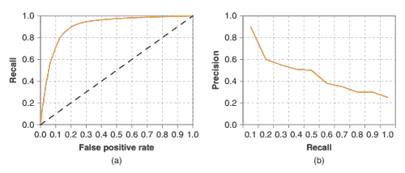

# 第十章：金融新闻的自然语言处理

M. Berkan Sesen, Yazann Romahi 和 Victor Li

## 10.1 引言

新闻一直是投资决策的关键因素。众所周知，公司特定、宏观经济和政治新闻都会对金融市场产生强烈影响。随着技术的进步和市场参与者之间联系的加强，新闻的数量和频率正在迅速增长。事实上，过去两年创造的数据量比人类历史上前 5000 年还要多。据估计，仅在 2017 年，我们创造的数据量就超过了整个人类历史上的数量（Landro 2016）。其中相当大的一部分来自新闻来源，使得人工处理所有与新闻相关的信息几乎不可能。

新闻数据的激增，加上机器学习（ML）的重大发展，使自然语言处理（NLP）在金融领域得到了应用。NLP 是人工智能的一个子领域，涉及编程计算机以处理自然语言语料库以获得有用的见解。NLP 在许多学科中以各种形式呈现，具有各种别名，包括（但不限于）文本分析、文本挖掘、计算语言学和内容分析（Loughran 和 McDonald 2016）。

在金融中有效利用新闻数据需要及时高效地识别相关新闻。主要新闻可能会对市场和投资者情绪产生重大影响，导致投资宇宙的风险特性动态变化（Mitra 和 Mitra 2011）。为了做出明智及时的决策，投资者越来越依赖于程序化解决方案，帮助他们实时提取、处理和解释大量新闻数据。

对新闻数据做出反应的有效 NLP 模型非常受欢迎，不仅用于资产管理和交易，还用于风险控制。在金融领域，NLP 通常用于新闻文章的监控、过滤和情感分析。在资产管理的背景下，这些技术可以作为知识提炼工具，使投资组合经理不再被阅读所有已发表的材料的负担所拖累，并允许他们更有选择地关注注意力。

在本章中，我们将讨论金融新闻数据的各个方面，以及现代学术研究中应用于金融的自然语言处理，并介绍行业如何利用这些方法获得竞争优势。我们将从第 10.2 节介绍新闻数据的不同来源开始我们的讨论。接着，在第 10.3 节，我们将回顾现有文献和实际应用中自然语言处理解决金融中不同问题的情况。

在第 10.4 节中，我们简要总结了自然语言处理分析中涉及的常见分析步骤，如预处理文本数据、词语的特征表示技术，最后从模型中获取所需的推理并评估其预测性能。在第 10.5 节中，我们介绍了一个实际的自然语言处理解决方案，用于从其余部分过滤并购相关新闻文章。在第 10.6 节中，我们通过总结提出的要点，并讨论金融领域自然语言处理面临的挑战和未来的研究方向来总结。

## 10.2 新闻数据的来源

过去十年中金融新闻数据量的激增主要是由传统媒体机构的电子化、监管机构以及交易所采用基于网络的传播方式，以及网络社交媒体和内容分享服务的兴起所推动的。因此，将新闻数据的来源分为三类是明智的，这三类提供了丰富的文本数据集，以测试不同的金融假设。

## 10.2.1 主流新闻

由汤姆森路透社、彭博社和 Factset 等主流新闻提供商生产的新闻文章通常是通过供应商提供的新闻订阅服务访问的。新闻项目通常包含时间戳、简短的标题，有时还有标签和其他元数据。在过去的十年中，大多数数据供应商已经大量投资于基础设施和人力资源，以处理和丰富他们发布的文章，通过提供来自新闻文本内容的见解。目前，彭博社、汤姆森路透社、RavenPack 等公司都提供自己的低延迟情绪分析和主题分类服务。

## 10.2.2 一手资讯新闻

记者在写文章之前调查的一手信息来源包括证券交易委员会（SEC）的申报文件、产品说明书、法庭文件和并购交易。特别是，SEC 的电子数据收集、分析和检索（EDGAR）系统免费提供了对美国超过 2100 万家公司申报文件的访问权限，包括注册声明、定期报告和其他表格。因此，它一直是许多自然语言处理研究项目的重点（Li 2010；Bodnaruk 等 2015；Hadlock 和 Pierce 2010；Gerde 2003；Grant 和 Conlon 2006）。

对 EDGAR 中的大多数报告的分析相当简单，因为它们具有一致的结构，通过使用 HTML 解析器可以轻松地识别部分并提取相关文本。与 EDGAR 相比，在英国公司申报文件的内容和结构方面标准化程度较低，因为公司管理层在公开不同主题的哪些信息以及多少方面有更大的自由裁量权。在没有一致的模板的情况下，从这些文件中提取文本数据对研究人员来说变得更加困难。

我们还可以进一步将一手资讯新闻分为计划和非计划两类。

预定的新闻事件示例包括货币政策委员会公告或公司盈利公告。未预定的，即事件驱动的新闻可以是并购公告或业务重组。预定新闻发布的优点是市场参与者准备及时消化和对这些新闻做出反应。由于消费者需求，预定的新闻项目通常以结构化或半结构化格式提供。相比之下，事件驱动的新闻嘈杂，需要对通常是非结构化的文本数据进行持续监控和处理。

## 10.2.3 社交媒体

通过社交媒体服务获得的新闻，进入门槛以及因此产生的信号噪声比率都很低。社交媒体来源可以包括推文、博客和个人帖子。尽管噪声水平高，缺乏验证和编辑，但由于新闻在网上提供的速度非常快，社交媒体仍然可以作为宝贵的信息来源。事实上，最值得注意的信息传播范式转变发生在社交媒体平台的到来，这些平台使个人以及企业能够即时发布他们对（市场）事件的反应。

有很多支持和反对使用社交媒体的论点。其中一项支持的论点是，博客文章或推文可以让人们利用“群体智慧”，这是指许多个体提供的信息的聚合往往会产生比任何单个群体成员所做出的预测更好的现象（Bartov 等人 2017 年）。然而，社交媒体帖子可能缺乏可信度，因为大多数提供者没有机制来核实所分享的信息或激励高质量的信息。来自发达国家同期政治选举的轶事证据表明，社交媒体帖子中的信息可能是有意误导的，以服务于发布者自己的议程。

使用社交媒体作为替代主要信息提供者传播公司信息的做法也越来越受欢迎。2013 年 4 月，证监会批准了使用帖子和推文来传达公司盈利等企业公告。Jung 等人（2015 年）发现，截至 2015 年，大约有一半的标准普尔公司，1500 家公司要么有公司 Twitter 账号，要么有 Facebook 页面。后来有报道称，公司利用 Twitter 等社交媒体渠道与投资者互动，以减弱消费产品召回所引起的负面价格反应（Lee 等人 2015 年）。

用于处理新闻并从中提取模式的 NLP 模型都是使用历史数据训练的。新闻数据通常可以通过订阅新闻流和/或像彭博、汤姆森路透或 RavenPack 这样的第三方供应商的数据库来访问。另一种常见的方法，更多地被个人投资者使用，是通过网络爬虫来提取有关历史新闻的文本以及元数据，例如来自 Rich Site Summary（RSS）源或新闻提供者或监管机构公开的存档。

无论如何分类，所有新闻项目都需要通过一系列转换转换为机器可读格式。新闻文章始终带有时间戳，并且在大多数情况下，由发布者标记为相关主题、标记甚至有时甚至是情绪得分。这种元数据有助于处理信息。在讨论自然语言处理（NLP）和对原始文本输入数据应用的常见顺序步骤之前，下一节我们将重点关注 NLP 在金融中的实际应用。

## 10.3 实际应用

在本节中，我们将回顾 NLP 在金融领域的当代学术研究和工业应用。Niederhoffer（1971 年）进行的一项关于应用 NLP 于金融新闻数据的开创性研究之一。作者调查了《纽约时报》的头条新闻与股价走势的广泛关系，其中头条新闻是从报纸的专栏中手动提取出来的。研究报告称，股价的大幅波动更有可能跟随宏观经济新闻。

然而，新闻项目的特定类别并未增加有关未来价格变动的信息。此后，计算机和统计推断在该领域的作用逐渐变得更加突出。

今天，金融领域的 NLP 研究涵盖了广泛的主题，从涉及交易和投资决策到市场制造和风险系统的主题。有越来越多的工业应用和学术研究在金融新闻分析中应用 NLP。然而，由于明显的知识产权和商业秘密问题，相对较少的工业报告描述了这些技术在金融公司中的专有用途，因此很少公开。

## 10.3.1 交易和投资

NLP 在金融领域最常见的应用领域之一是系统性交易和投资，在过去的十年中，这些领域取得了显著增长，并在许多股票、期货、期权和外汇交易的场所继续快速增长。市场参与者将 NLP 视为通过分析新闻数据来利用预测模式获得竞争优势的众多方法之一。基本原理与投资者可能如何暗示地应用他们对过去市场在类似条件下的行为的知识来预测在当前环境下接下来可能发生的事情高度类似。

新闻被认为是影响市场微观结构的“信息事件”，影响价格形成、波动性和特定证券或市场的流动性（Mitra 等人，2015 年）。虽然理论上应用的方法是与领域无关的，但在交易和投资中的自然语言处理分析在股票领域最为发展。

研究人员为此目的而利用的信息来源因应用而异。由于从 EDGAR 数据库中提取数据相对容易，因此处理 SEC 文件是非常流行的，正如我们在 10.2 节中讨论的那样。在 2011 年的文献调查中，Li（2010）报告称，对公司文件的大多数研究集中在披露的语气或复杂性以及其对收益或股价的影响方面。在 Bodnaruk 等人（2015）的一项示例研究中，作者们试图通过评估 10-K 披露中的语气来预测流动性事件，以向股东传达他们的担忧。作者们计算了专有一组限制性词语的频率，例如“义务”、“减值”、“施加”，以衡量 10-K 文件的语气。他们报告称，“限制性词语的百分比具有非常重要的经济影响。例如，限制性词语数量的一个标准差增加将使股利遗漏的可能性增加 10.32%，并将使股利增加的概率减少 6.46%”（Bodnaruk 等人，2015 年）。

产品说明书可能用于预测收益。汉利和霍伯格（2010）利用 1996 年至 2005 年期间大量首次公开发行（IPO）的样本，研究了 IPO 说明书语气对定价和首日回报的影响。作者将说明书文本分解为标准和信息组件，并发现信息含量较低的说明书会降低定价准确性，因为它暗示了更多依赖投资者在配售书建立期间定价的情况，并导致报价的变化增加以及更高的初始回报。与此相关的一系列研究是情感分析，在流行度不断增长的情况下，值得我们在报道中单独设置一个子部分。

## 10.3.2 情感分析

情感分析旨在分析一段文本传达对特定主题或实体的观点。在金融领域，大多数情感分析任务背后的主要动机是将这些观点与未来证券收益的方向联系起来。这与监测新闻报道程度以预测交易量和价格波动的自然语言处理应用形成了对比，后者可以说是更简单的任务。

尽管情绪分析在金融领域目前很受欢迎，但情绪分析的开创性研究实际上集中在电影评论上，以训练一个能够检测文本情感的算法（Lee et al. 2002）。与电影评论相比，金融新闻的情感提取是一项更加困难的任务，因为增加了噪音和涉及的上下文信息的不确定性。

通常情况下，情绪可以被建模为二元分类的“积极”或者“消极”，或作为指定文章积极或消极程度的序数得分。作为一项监督学习练习，情绪分析可能涉及手动将训练数据集标记为不同的情绪类别/分数，然后将这些数据输入到分类或回归算法中。这是一项劳动密集型的工作，可能会受到标记者主观性的负面影响，并且在存在多个注释者的情况下容易出现标记者之间的不一致。事实上，Loughran 和 McDonald (2016) 表明金融新闻很容易被错误分类。

一个手动标记的替代方法是编制一个将单词与不同情绪相关联的“单词列表”。使用这样的列表，研究人员可以计算与特定情绪相关联的单词的数量，其中新闻文章中悲观词汇比例较高表明负面情绪。虽然 NLP 从业者可以选择编制和使用他们自己的专有单词列表，但也存在一些公开可用的列表，如亨利单词列表（Henry 2008），该列表是为金融文本编制的。有了这样的公开可用的单词列表，更容易复制其他研究人员的分析。

最后，一种更有原则的方法是将研究人员的主观性从情绪标记中删除，即将新闻文章与从新闻发布时间开始的预测时段内的回报相关联。一个例子是路透社新闻范围事件指数（NEIs）(Lo 2008)，它们被构造为对资产回报和（实现的）波动率具有“预测”能力。NEI 的最佳权重是通过将单词（主题）频率对抗一天中的资产回报进行回归来确定的。

情绪分析在金融领域最突出的应用之一是路透社新闻范围情感引擎（Reuters 2015），该引擎根据正面、中性或负面情感对公司特定新闻进行分类。Groß-Klußman 和 Hautsch(2011) 调查了高频率的回报、波动率和流动性在多大程度上可以通过路透社新闻报道的一天中未安排的新闻到达来解释。作者得出的结论是，尽管情绪标签对未来价格趋势有一定的可预测性，但新闻到达周围波动率和买卖价差的显著增加使简单基于情绪的交易策略无利可图。

在一项独立研究中，Heston 和 Sinha (2017) 探索了使用 Thomson Reuters NewsScope 从 2003 年到 2010 年提取的情感数据预测个别股票回报率的可预测性。他们报告称，特定交易日的新闻情感与随后 1-2 天的股票回报率呈正相关。他们指出，这种预测时间范围的长度严重依赖于投资组合形成程序。同样，Das 和 Chen (2007) 得出结论，情感分析在摩根斯坦利高科技 (MSH) 指数水平上提供了一定的解释能力。然而，自相关使得难以确定关系的经验性质。

除了使用主流新闻外，越来越多的研究关注社交媒体的情感分析。Bollen 等人 (2011) 的一个例子，他们调查了是否从大规模 Twitter 资料中派生的集体情绪状态测量与随时间变化的道琼斯工业平均指数 (DJIA) 的值相关。为了捕捉情绪状态，他们使用 Opinion Finder 和 Google-Profile of Mood States (GPOMS)，前者衡量正面 vs 负面情绪，后者以六个维度 (冷静、警觉、确信、活力、友善和快乐) 对情绪进行分类。作者报告称，一些 GPOMS 情绪状态与 DJIA 的变化相匹配。

出现在 3-4 天后的值，而 Opinion Finder 情绪状态似乎不具有预测信息。值得一提的是，尽管一些 GPOMS 情绪状态与 DJIA 值具有滞后相关性，但作者警告称这并不保证公众情绪状态与 DJIA 值之间存在因果关系。

从一手资料中提取情感的研究也很常见。Huang 等人 (2014) 使用朴素贝叶斯 (NB) 方法预测了 S&P 500 公司在 1995 年至 2008 年期间发布的 35 万份分析师报告中包含的情感。他们将超过 2700 万个句子从分析师报告中归类为正面、负面或中性情感，并聚合句子级别的意见来确定整体报告情感。他们报告称，投资者对负面文本的反应比对正面文本更强烈，这表明分析师在传播坏消息方面尤为重要。

在金融领域进行情感分析所面临的常见挑战包括提取一致情感的困难、确定特定新闻涉及的证券（以及程度）以及过滤新颖的文章。

已经被回收利用的那些。 值得一提的是，情感分析充斥着数据可用性和偏见问题。 Moniz 等人（2009 年）报告称，公司可获得的新闻数据量严重依赖于其规模，以至于标普大型欧洲股票指数中规模最大的五分之一的公司占据了所有新闻报道的 40％，而规模最小的五分之一仅占 5％。 除了缺乏市值较小的公司的数据外，一些研究发现，所谓的积极新闻的数量要比消极新闻的数量更多（Das 和 Chen，2007 年）。 相比之下，个别股票价格对负面新闻的反应要比对积极新闻的反应更强烈（Tetlock，2007 年）。 因此，了解伴随情感分析的常见陷阱是明智的。

情感分析面临的另一个方法论挑战是 NLP 从业者无意中通过诱人的改善结果并不断调整模型参数化而过度拟合推理算法。 这表现在模型过于专门针对训练期间的特殊情况，从而无法很好地推广到新数据。 虽然可以认为这是关于应用于金融时间序列的机器学习的更一般性缺陷，但在情感分析中更加突出，因为情感评分和标记涉及的复杂性和自由度更多。

最后，作为经验法则，在进行情感分析练习之后，应该检查结果，以验证所捕获的信息“优势”是否确实是由新闻来源产生的，而不是由自相关或其他市场信号的同时信息驱动的。 换句话说，应该确认基于情感的预测（例如价格）是否增加了预测市场信号本身的过去价值中不包含的信息。 我们在第 10.4.4 节中讨论了一些常用的评估指标，以达到这个目的。

## 10.3.3 做市商

做市商是金融工具中的流动性提供者，旨在通过差价获利。 在报价驱动的市场中，做市商提供买入和卖出价格。 在订单驱动的市场中，限价订单提供流动性。 在做市商的背景下，新闻数据可以用来更新经纪商对交易量、市场深度和波动性的估计，以便扭曲价格并调整买卖价差。 做市商希望通过扩大其买卖价差来补偿在重大市场事件发生时暴露于市场的风险。 正如前一节中讨论的，这些事件可以是预定的货币政策公告或未预定的新闻发布，这些事件可能引发相关工具的波动或交易量的激增。

正如我们所提到的，不可预期的新闻项目通常需要更多时间来处理公告的含义并制定适当的行动。在这种沉思的时期，市场制造商通常更加谨慎地交易，流动性枯竭。Groß-Klußman 和 Hautsch（2011）报告称，新闻发布会对买卖价差产生显著影响，但不一定影响市场深度。市场制造商主要通过修订报价而不是订单量来对新闻做出反应。

这与基于不对称信息的市场微观结构理论非常一致，专家旨在过度弥补可能存在的信息不对称性(Mitra 等人 2015)。

Von Beschwitz 等人（2013）研究了媒体分析提供商如何影响市场微观结构，特别是它们的存在如何影响股票市场对新闻的反应。他们发现，如果一篇文章在 RavenPack 中得到一致的报道，那么股价和交易量对新闻的调整速度更快。市场暂时对错误的信息作出反应，但随后很快恢复。因此，对市场制造商来说，消化这种类型的信息并根据财经新闻发布情况进行相应定位非常重要。

## 10.3.4 风险系统

金融中的 NLP 应用也用于风险管理。随着市场的成长和变得更加复杂，风险管理工具不断发展以满足更具挑战性的需求。重大新闻事件可能对市场环境和投资者情绪产生重大影响，从而导致交易证券的风险结构和风险特征发生快速变化。NLP 在风险管理中以各种方式使用，从检测和管理事件风险到增强欺诈和内幕交易检测。

事件风险可以描述为由不可预期的新闻引起的在短时间间隔内导致主要市场波动的不确定性。尽管经常被引用但很少被管理，由于难以量化文本新闻（Healy 和 Lo 2011），事件风险在很大程度上被归类为定性判断和经理自由裁量权。金融风险中 NLP 的常见用途之一是作为交易执行算法的熔断器。我们已经讨论过，主要市场事件通常会导致市场制造商提高买卖价差。作为交易的交易对手，资产管理公司和专有交易商可以通过在交易证券上发布“实质性”和“新颖”的新闻时暂时停止当前行动来做出反应。Brown（2011）报告称，将新闻分析用作自动交易策略中的“熔断器”和“狼检测”系统可以帮助增强此类策略的稳健性和可靠性。

类似地，有时排除与投资宇宙相关的投机市场新闻的证券可能是明智的。这类投机性新闻事件通常会引发价格波动和波动性飙升，构成不可分散的，即特异性的风险。在第 10.5 节中，我们提供了一个真实的 NLP 应用，旨在准确区分与并购相关的新闻文章标题和不相关的标题，以减少并购公告造成的特异性风险。

NLP 在金融风险管理中的另一个应用领域是异常检测，以识别异常活动和欺诈性报告。Purda 和 Skillicorn（2015）分析 10-K 报告，以区分基于报告中管理层讨论和分析部分所使用的语言的欺诈性和真实性报告。他们的方法论在于识别一些报告与同一公司发布的报告之间的显著偏差，突出了使用公司自身作为控制对象的效力。在异常检测方面的类似研究也可能在检测不规律模式时受到欢迎。除了讨论的用例外，NLP 还可以用于改进内部财务报告，并及时更新关键事项，特别是合规方面。对元数据进行文本分析和内容的‘理解’使人能够高效地跟踪法规要求的变化和确定与合规相关的成本（LaPlanter 和 Coleman，2017）。因此，NLP 可以显著减少确保法规和法律合规所需的手动处理，并且可以通过从不同业务线聚合相关数据来促进与监管机构的沟通。

需要注意的是，对财经新闻进行文本分析也可能带来意想不到的后果。NLP 带来的提速也增加了对正确回应新闻的要求。快速但错误地回应可能会带来危险。例如，2013 年 4 月，一条关于白宫爆炸的误导性推文引发了一次微型闪崩，结果有些人迅速将责任归咎于算法。同年晚些时候，汤姆逊路透因为将经济数据发布的几秒钟提前出售给高频交易公司而受到指责（von Beschwitz 等，2013）。在接下来的部分中，我们将专注于 NLP 的技术方面。

## 10.4 自然语言处理

正如我们已经确定的，NLP 是人工智能的一个子领域，关注于编程计算机以处理文本数据以获得有用的见解。它以多种形式和名称跨越许多学科，如文本分析，文本挖掘，计算语言学和内容分析。前一节涵盖的所有 NLP 应用都需要经过一些共同的顺序步骤，例如对文本数据进行预处理以及在将其输入统计推断算法之前将单词表示为预测特征。在本节中，我们将更详细地看一下所有 NLP 任务中都需要的这些常见步骤。

自然地，任何统计分析都始于数据收集。对于金融中的 NLP 应用，用于收集数据的不同方法包括订阅主要信息提供者的新闻源，如路透社或彭博社，或使用自定义脚本进行 Web 爬取以提取文本数据以及有关历史新闻的元数据，例如从 RSS 源，或从新闻提供者或监管机构的公开可用档案中提取。

一旦数据被收集，NLP 从业者将需要首先对数据进行预处理和清理，并尽可能减少噪音。预处理后，选择适合数据和手头任务的特征表示方法非常重要。一旦单词被转换为预测特征，它们就可以被馈送到统计推断算法中以提取有用的见解。图 10.1 说明了这种常见的 NLP 流水线，这在很大程度上与包括在一般机器学习分析中的步骤重叠。

在接下来的四节中，我们将稍微详细地讨论图 10.1 中描绘的顺序步骤。我们有意保持我们的覆盖范围概念化，并旨在给出这些常用步骤的风格而不是提供彻底的技术讨论。

## 10.4.1 文本数据预处理

金融新闻数据最显著的特点是其不精确性。为了将新闻数据输入计算机，我们需要将一系列字符，以一种明确和精确的方式，转换为以捕捉传达的信息为特征的格式。下面我们介绍一些应用于文本数据的最常见的预处理和转换步骤。有关本节讨论的预处理步骤的更全面覆盖，读者可以参考 Manning 等人（2009）。

## 10.4.1.1 分词 

在大多数 NLP 应用中，通常首先对原始文本数据进行分词处理，这将通过定位单词边界来将其分解为称为标记的单位。然而，标记不必只是单词；它们可以是数字或标点符号。事实上，分词可能会与去除标点和停用词（极为常见的对 NLP 任务可能毫无价值的词）捆绑在一起。确定这些停用词显然是一项特定于语言的练习，并且可能涉及不同的子阶段，具体取决于语料库的语言。

## 10.4.1.2 词汇表 

虽然将文本建模为字母集合是完全可能的，但大多数 NLP 方法将单词视为作为预测特征的原子单位。在 NLP 的背景下，词汇表是指出现在待处理语料库中的不同单词集合。限制词汇表的一种常见方式是通过词频，只保留出现频率较高的单词。这导致较不频繁出现的单词被捆绑到一个通用的单词索引中，也可以视为应用特定的停用词移除过程。

NLP（自然语言处理）中最简单但又强大的方法之一是通过针对给定文本中的少数特定词语或短语进行处理。由于歧义性，过大的词汇量通常比专注于较少明确的词语或短语的测试更容易出错。一种可能的解决方案是在我们的词汇表中省略或捆绑货币金额、数字和 URL 等标记，因为它们的个体表示会大大扩展词汇表的大小。

较少遇到的单词通常包括专有名词，如个人或组织名称，限制词汇表的大小可能有助于正则化，其中任何公司或国家名称都被捆绑到一个通用的索引中，从而可能消除偏见。减少词汇表大小类似于机器学习术语中的特征选择。这是机器学习中非常活跃的研究领域，存在比频率更加有原则的技术，如互信息和增益比，用于评分所捕获的不同特征的类别判别信息。

## 10.4.1.3 词性标注 

词性标注是将标记分配给其语法类别（例如动词、名词等）的过程，以便了解其在句子中的角色。词性标注器是专门的计算机程序，其接受一个单词序列（即一个句子）作为输入，并提供一个元组列表作为输出，其中每个单词与相关标签相关联。词性标注的一个示例实用性是，如果我们想要根据它们的标签为单词指定不同的权重，重点放在具有高强调的文本段落上，例如在形容词和副词周围的区域。例如，作为情感分析五分类器集成框架的一部分，Das 和 Chen（2007）使用了一个基于形容词和副词的分类器，假设使用形容词或副词的短语包含了大部分情感，因此在基于单词计数的特征表示中‘应该’给予更大的权重。

## 10.4.1.4 词干提取和词形还原 

词干提取和词形还原都用于将单词从其派生的语法形式减少到其基本形式。虽然对于大多数英语单词，词干提取和词形还原会生成相同的单词，但两者并不相同。词干提取通常在不了解上下文的情况下操作单个单词，并使用一个粗糙的启发式过程，删除派生词缀，希望将单词简化为其词干。相比之下，词形还原旨在以更有原则的方式实现这一点，使用词汇表和单词的形态分析来返回单词的基本形式或字典形式，也称为其词形（Manning 等人，2009 年）。与词干提取不同，词形还原不仅处理基本的词变化，如单数与复数，还处理诸如将'car'与'automobile'匹配等同义词。此外，词形还通常需要先使用词性标注器来提供上下文信息，以便将单词映射到适当的词形。

## 10.4.2 单词的特征表示

绝大多数新闻数据是为人类消费而创建的，因此以无结构的格式存储，例如新闻订阅文章、PDF 报告、社交媒体帖子和音频文件，计算机无法直接处理这些数据。在前一节讨论的预处理步骤之后，为了将信息内容传达给统计推理算法，预处理的标记需要转换为预测特征。

在自然语言处理中最常用的特征表示技术是词袋模型，根据这个模型，一个文档被编码为其单词的（无序的）集合，忽略语法和单词顺序，但保留了多重性。文本转换为‘词袋’之后，可以计算各种度量来生成预测特征。由词袋模型生成的最常见度量是词项频率，在前一节中已经讨论过。

在词项频率表示中，所有单词都被假定为相互独立的，文本被折叠成一个术语-文档矩阵，其中行表示单个单词，列提供每个文档的单词计数。

这种方法存在各种缺点。首先，它不保留单词出现的顺序，因此失去了上下文。考虑可口可乐公司 2017 年第三季度财报的标题为“净收入下降 15％，由于 18 点重组的阻力下滑；有机收入（非 GAAP）增长 4％，由价格/混合影响驱动”（可口可乐公司，2017 年）。即使在像这样的小文本中，词项频率表示也无法确定什么是‘下降’，什么‘增长’以及由哪个因素驱动。

基于相邻单词的词义表示是简单词袋方法之外最常见的扩展之一。N-gram 模型属于这一类，部分解决了上下文缺失的问题，通过存储相邻出现的单词序列。因此，例如，一个两个词的 n-gram 模型，即 bigram 模型，将文本解析为一组连续的对。这显然有助于捕获单词的共现情况。理论上，通过更大的 n，模型可以存储更多的上下文信息。然而，实际上大多数 NLP 应用程序仅限于 bigrams 或最好的 trigrams，因为全面的 n-gram 方法可能由于计算和时间限制而具有挑战性。

词频的另一个缺点是常见词，如代词或介词，几乎总是文本中频率最高的词，这并不一定意味着相应的词更重要。为了解决这个问题，最流行的一种方式是通过文档频率的倒数对词进行加权，即词频-逆文档频率（tf-idf）。Tf-idf 是 NLP 中最流行的词加权方案之一，旨在反映一个词对语料库中文档的重要性（Aizawa 2003）。

在 NLP 中，我们应该跨越另一个维度来看待特征表示的方式，即特征是如何编码的。较早的 NLP 工作大部分将单词编码为离散的原子符号，即如果我们的词汇表中包含'buy'和'acquire'作为不同的词，'acquire'可能被表示为 ID-102，'buy'为 ID-052。这种编号完全是任意的，并不提供关于这些单个符号之间明显存在的关系的有用信息给学习算法。这意味着模型无法利用其所学到的知识。

在处理包含'acquire'的新闻文章时，'buy'会被识别为购买。在机器学习中，这种特征表示方式，即将分类特征编码为唯一的 ID，被称为'one-hot-encoding'，导致数据稀疏性。这意味着我们可能需要更多的数据才能成功训练统计模型。

使用分布式表示可以克服一些这些障碍。分布式表示，也称为向量空间模型或向量嵌入，将单词表示为连续的向量空间，其中语义上相似的单词被聚集在一起。回到我们的'acquire'和'buy'的例子，在分布式表示设置中，这两个词在训练后会被映射到向量空间中的附近坐标。因此，遇到这两个看似不同的预测特征的算法可以感知到它们确实密切相关。

利用分布式表示的不同方法可以分为两类。第一类被称为基于计数的方法（例如潜在语义分析（LSA）），它量化了大文本中单词与其他单词的共现频率，并将这些统计映射到每个不同单词的密集向量。第二类是所谓的预测方法，通过迭代更新单词的向量坐标，以更准确地预测单词来训练。

邻居们。两个模型的最终结果与基于计数的模型相同，即词汇表中每个不同单词的一组密集嵌入向量（Tensorflow 2017）。使用这些预测模型计算得到的分布式表示特别有趣，因为向量空间明确地编码了许多语言规律和模式。令人惊讶的是，许多这些模式可以被表示为线性翻译（Mikolov 等人 2013 年）。

迁移学习是近年来与 NLP 中的分布式表示紧密相关的另一个热门话题。这个概念已经存在了几十年，指的是通过从已经学习过的类似领域中的相关任务转移知识，改进在新任务中的学习。在 NLP 中，知识的转移通常是指重复使用在非常大的语料库上训练过的单词的分布式表示，以应用于更小的、小众的领域。这允许 NLP 实践者可以利用大规模研究捕获的语义信息和语言模式，应用于自己领域特定的应用，而不必依赖于通常更为小众和有限的数据集来重新学习相同的信息。

在第 10.5 节中，我们将提供一个由一家领先的资产管理公司使用的真实 NLP 应用示例，该公司使用在数百万篇新闻文章上训练的向量嵌入，并将其应用于 M&A 的特定领域。其中较常用的预训练向量表示包括 Google 的 Word2Vec（Tensorflow 2017）和斯坦福大学的 GloVe（Pennington 等人 2014）。

虽然无法量化一组词的整个信息内容，但特征表示的总体目标是最大化这个量。

语言本质上是复杂的，不仅依赖于构成文本的字母和符号，还依赖于人类大脑理解内涵和上下文的能力。因此，随着我们从基于语法的方法转向考虑上下文和语义关联的方法，开发能够捕捉人类交流所有复杂性的自然语言处理工具变得越来越困难。重要的是要意识到，例如，假设单词是独立单元的方法会损失多少上下文。

## 推理

像所有其他人工智能任务一样，NLP 应用生成的推理通常需要被转化为决策，以便被执行。从推理到决策和行动的自然流程如图 10.2 所示。NLP 应用程序的推理可以用于辅助人类的决策，其中使用效用函数将推理转换为决策。这个效用函数可以简单到一个概率阈值，或者是领域专家大脑中利弊权衡的隐含。另外，推理也可以直接作为自动化定量策略的一部分由计算机转换成行动。

推理一直是机器学习中的一个核心主题，在过去的二十年里，NLP 从业者使用的推理工具取得了前所未有的进步。

机器学习中的推理分为三个广泛的类别，即监督、无监督和强化学习。虽然所需的推理类型取决于业务问题和训练数据的类型，在 NLP 中最常用的算法是监督或无监督。简而言之，监督学习需要标记的训练数据，旨在将一组预测性特征映射到它们记录的或期望的输出。

相比之下，无监督算法可以从未标记的数据中学习模式。还有一个介于两者之间的混合类别，被称为半监督学习。半监督学习通常使用少量标记数据和更多的未标记数据来解决监督问题。

NLP 中最常用的监督方法之一是朴素贝叶斯模型，该模型假设所有的单词特征在给定类别标签的情况下都是独立的。由于这个简化但很大程度上是错误的假设，朴素贝叶斯与词袋(word bag)表示法非常兼容。朴素贝叶斯通常被描述为 ML 中更复杂算法的“沙包”。然而，尽管它的简化假设，它经常与更复杂的分类器正面交锋，甚至在某些情况下表现更好。Friedman 等人（1997 年）将这个悖论归因于分类估计仅仅是函数估计的符号（在二元情况下）; 即使函数近似仍然很差，分类准确度仍然很高。这指的是分类器的校准不良，我们将在下一节中讨论这一点。

在监督方法的复杂性光谱的另一端是现代神经网络架构。在过去的五年中，诸如循环神经网络（RNNs）和卷积神经网络（CNNs）已经主导了基于自然语言处理的推理，将以前的技术水平远远甩在了身后。与朴素贝叶斯模型相比，这些架构能够学习复杂和相关的特征，可以识别输入数据中的模式，并将其映射到期望的输出。在自然语言处理领域，这些架构性能提升的催化剂之一是我们在前一节中讨论的分布式表示的崛起。

自然语言处理领域的大部分现有文献都集中在监督学习上；因此，无监督学习应用构成了一个相对较不发达的子领域，其中测量文档相似性是最常见的任务之一。通常通过计算两个新闻项目之间的余弦相似度来实现这一点，其中文档被表示为术语频率或术语加权的向量。该领域的最新研究包括 Hoberg 和 Phillips（2016）的分析，重点关注 10-K 产品描述以创建基于文本的行业分类，以及 Lang 和 Stice-Lawrence（2015），他们比较年度报告的相似性。

在自然语言处理中应用的另一种流行的无监督技术是 LSA，也被称为潜在语义索引（LSI）。LSA 通过生成一组与文档和它们包含的单词相关的潜在概念来查看文档之间以及它们包含的单词之间的关系。从技术上讲，这些潜在概念是通过应用奇异值分解（SVD）来提取的，以减少术语-文档矩阵的维度，同时保留矩阵内的相似性结构。简单来说，我们可以将这些技术看作是单词的因子分析。LSA 通常用于衡量文档之间的相似性，并揭示不同领域之间的文本关联模式。

将 LSA 应用于金融新闻是一个未充分开发的研究领域。在这个领域的少数研究之一中，Mazis 和 Tsekrekos（2017）分析了美国联邦公开市场委员会（FOMC）发布的声明对美国国库市场的影响。

国库市场。作者利用 LSA 识别了委员会使用的重复文本“主题”，这些主题能够描述作者样本期间大部分传达的货币政策。即使在控制货币政策不确定性和同时经济前景之后，这些主题在解释三个月、两年、五年和十年国库券收益率的变化方面具有统计显著性。

LSA 还有一种基于概率的变体，称为概率隐含语义分析（pLSA），基于潜在类模型（Hofmann 2001）。pLSA 为一种更复杂的方法铺平了道路，该方法称为潜在狄利克雷分配（LDA），其使用了基于狄利克雷的先验（Blei et al. 2003）。LDA 允许研究人员使用术语-文档矩阵识别语料库中的潜在主题结构。LDA 是一种生成模型，更具体地说是一种分层贝叶斯模型，在该模型下，文档被建模为主题的有限混合物，而主题反过来被建模为词汇表中的词的有限混合物。主题建模是一个不断发展的研究领域，在这个领域，自然语言处理从业者构建文本语料库的概率生成模型，以推断文档组中的潜在统计结构，以揭示单词的可能主题归因。

## 10.4.4 评估

通常情况下，自然语言处理任务中的推断与任何其他机器学习分析类似。对于试图预测连续因变量（如回报或波动性）的回归模型，评估指标通常是各种误差项，包括但不限于均方根误差（RMSE）、平均绝对误差（MEA）和均方误差（MSE）。对于分类练习，其中输出是分类的情况，存在许多基于混淆矩阵的指标，例如准确率、精确度和召回率。混淆矩阵是一个列联表，比较分类器预测的类标签与真实标签，也称为地面真相。因此，对于二元分类任务，混淆矩阵是一个 2 × 2 矩阵，提供了比较预测标签与真实标签的汇总统计信息。最直观的基于混淆矩阵的指标是准确率，它指示分类器成功分类了数据集的哪一部分。

值得一提的是，对于分类任务，基于混淆矩阵的指标只提供了对整体性能的部分视图。这是因为为了形成混淆矩阵，分类器输出的后验类概率，例如 P('Related') = 0.78，需要通过应用概率截断值转换为类标签。对于二元分类问题，最常见的做法是将此概率阈值选为 0.5，其中超过此值的任何预测都被标记为“正”预测，以用于混淆矩阵。正如敏锐的读者可能注意到的那样，将概率输出二元化会导致信息损失，并且理论上可以通过在 0 到 1 之间变化概率阈值来简单地建立使用相同分类输出的多种混淆矩阵。

为了克服这些缺点，存在一些评估分类器在可能阈值范围内的预测性能的方法。这种“系统性”指标的常见示例是接收者操作特征曲线下的面积（AUROC）。ROC 曲线绘制了分类器在不同概率阈值下的召回率，即真正例率，与假正例率。图 10.3(a)展示了一个示例 ROC 曲线。AUROC 的值在 0.5 和 1 之间变化，其中 1 表示完美的分类器，0.5 表示完全随机的分类器。另一个与 AUROC 类似但在处理高度不平衡数据集时确实适用的“系统性”指标是精度-召回率曲线下的面积（AUPRC）。精度-召回率曲线旨在捕获分类器精度与召回率（正类别）之间的折衷，随着正类别标签的概率阈值变化。图 10.3(b)展示了一个示例精度-召回率曲线。关于 AUROC 和 AUPRC 的全面覆盖，读者可参考 Davis 和 Goadrich（2006）。

评估后验类概率（分类器输出）而不是最大后验（MAP）类标签对于 NLP 从业者了解分类器的“校准”非常有用。校准良好的分类器是概率分类器，其后验概率可以直接解释为置信水平。例如，预期具有良好校准的（二元）分类器将对样本进行分类，以便在输出为正类别的概率为 0.8 的样本中，大约有 80%实际属于正类别。一些模型，例如我们在前一节中讨论的朴素贝叶斯，可能会给出可接受的准确性结果，但实际上校准不佳，输出可能过于自信或不足。

Mittermayer 和 Knolmayer（2006）审查了八种不同的基于新闻的交易应用程序，指出大多数应用程序中没有报告技术性能指标，如基于混淆矩阵的指标。然而，在过去的十年中，随着机器学习的发展，最近的 NLP 研究更加注重用原则性能指标评估结果。

在时间维度上评估结果的有效性也是至关重要的。当将新闻项目建模为时间序列时，推断的形式是点事件。在回归应用中，在宣布诸如价格、运行波动率等市场数据与这些点事件之间的因果关系之前，验证这种关系的 Granger 因果性是很重要的。Granger 因果性是一种假设检验，用于确定一个时间序列是否有助于预测另一个。根据 Granger 因果性，如果时间序列 x1 中的信号“Granger 导致”时间序列 x2 中的信号，那么 x1 的过去值应该包含有助于预测 x2 的信息，这些信息超出了仅包含 x2 的过去值的信息。

对于无监督学习，不同算法的变化意味着每种技术都需要不同的性能评估方法。即使是不同的聚类技术之间也没有建立起常见的性能指标。对于 k-means 聚类任务，一种常用的指标是“簇内平方残差和”（也称为惯性），而对于层次聚类，更常用的是“轮廓系数”。对于我们在前一节中讨论过的诸如 LSA 和 LDA 之类的主题模型，存在着评估潜在空间的各种指标，如单词插入和主题插入。

## 10.4.5 示例用例：过滤合并套利新闻

在本节中，我们将看一个 NLP 应用于对金融新闻进行分类的实际例子，具体来说是确定一篇新闻文章是否与 M&A 活动相关。

合并套利是一种成熟的投资策略。简单来说，这是一种在合并公告日期由投资者发起的风险赌注，他们选择打赌合并将完成。尽管 M&A 策略的盈利能力随着时间的推移而降低，但即使仅基于公开信息（Jetley 和 Ji 2010）也仍然可以从这些策略中捕获相当大的风险溢价。传统上，M&A 策略被机构投资者如对冲基金所使用，但随着交易所交易基金（ETF）和共同基金的兴起，它们也越来越受到零售投资者的青睐。

我们已经讨论过，在金融领域高效利用新闻数据需要及时而有效地识别相关新闻。在这种情况下，相关性可以是针对特定主题的，比如合并、重组、要约收购、股东回购或其他资本结构调整。媒体在 M&A 交易中的作用已经得到了深入研究。媒体报道可能会影响潜在的有声誉风险的收购公司放弃正在进行中的交易（Liu 和 McConnell 2013）。媒体可能会发布关于吸引报纸读者的公司的投机性并购传闻，这些传闻可能会扭曲价格并导致回报波动。

（Ahern 和 Sosyura 2015）。

尽管其受欢迎程度，但在并购套利中，新闻流的特征化在文献中受到了相对较少的关注。在专注于并购套利的自然语言处理研究中，有几篇研究了预测媒体暗示的完成概率。

Buehlmaier 和 Zechner（2014）使用简单的朴素贝叶斯方法分析了大量并购公告的完成决定因素。

他们发现与并购相关的财经新闻传播速度较慢，需要数天的时间才能够充分定价。一种简单的并购策略，通过财经新闻内容的支持，将风险调整后的回报率提高了超过 12 个百分点。最近，同一作者发现，如果使用财经新闻来过滤掉完成概率低的交易，那么并购套利的盈利能力将显著提高（Buehlmaier 和 Zechner 2017）。

正如现有研究所示范的那样，投资经理随时关注不仅关于新的而且关于现有并购交易的媒体报道对其有利。为此，我们调查了一种系统的自然语言处理方法的有效性，该方法旨在准确区分与并购相关的新闻文章标题

从那些不相关的新闻中分离出来。这是通过训练一个监督学习算法实现的，该算法能够捕捉到新闻文章中的类别区分模式，这些文章是手动标记为与并购相关或不相关的。我们的最终目标是利用这个自然语言处理模型，即 NewsFilter，来推断之前未见的文章是否属于前者还是后者。这被用来及时对官方的并购公告进行行动，以提交套利交易，并从其他股票策略中过滤出与并购交易相关的股票，以减少特异风险。

## 10.5 数据与方法

我们的数据集包括从 2017 年 1 月至 2017 年 6 月之间从正式新闻来源（如彭博社）检索到的 13,000 条新闻标题。这些标题由一家领先资产管理公司的投资组合经理手动标记为与并购套利相关或不相关。在手动标记结束时，约 31% 的数据集被标记为与并购套利相关，其余的被标记为与并购套利不相关。

我们使用日期供应商提供的相关标签来确定特定新闻标题涉及哪些股票代码。一般来说，一篇新闻文章可能提及多家公司，其强调程度不同，并且大多数新闻提供商为新闻项目指定相关度分数，量化一篇特定文章关于某个特定公司的程度。在并购领域，由于提到的代码主要是目标公司和收购方，因此相对较少存在歧义。

我们的自然语言处理分析流程包括在第 10.4 节已经讨论过的常见步骤。我们首先对手动标记的数据进行预处理，以减少噪音并将输入转换为机器可读形式。为此，文本新闻标题首先被标记化。在标记化之后，我们删除了标点符号和英文停用词，并且还应用了词干提取以减少一个词的派生形式到一个公共基本形式，例如将 'acquiring' 转换为 'acquire'。这些步骤有助于巩固数据集中的唯一术语。此外，我们还通过词频减少了我们的词汇量，只包括最常见的 5000 个词作为不同的术语，并将其余的表示为 '其他' 类别下的总体类别。

对于推断，我们使用了一系列二元分类器，从传统的稀疏朴素贝叶斯、岭回归和随机森林到各种神经网络架构。随着过去五年中神经网络的复苏，自然语言处理是受益最多的领域之一。在我们的分析中，我们使用了下面列出的以下网络架构。对于关于该主题的彻底的详细介绍，请参阅 Goodfellow 等人的*Deep Learning*（2016）一书。

1. 前馈神经网络（FNN）：FNN 包含（可能是大量的）简单类似神经元的节点，组织在层中。与所有神经网络架构一样，数据进入网络的输入层，随着名称暗示，通过网络向前馈送，逐层进行，直到到达输出层。层中的节点本身从不连接，通常相邻的两个层是完全连接的（从一层的每个神经元到另一层的每个神经元）。随着信息的向前传播，层之间没有循环或反馈循环。FNN 是被设计出来的第一个和最简单的网络结构。

2. RNN：与前馈结构相比，RNN 包含递归循环，使其能够展示动态时间行为并捕捉序列输入中的长期依赖关系。因此，RNN 适用于自然语言处理，因为它们可以在上下文中评估每个单词/标记输入与之前出现的单词。然而，由于信息的递归性质和梯度流的递归性质，这种架构的训练可能存在问题。为了缓解这些问题，提出了不同的门控机制，导致了各种 RNN 架构。在我们的研究中，我们使用了一种流行的递归架构，称为长短期记忆（LSTM）（Hochreiter 和 Schmidhuber，1997）。

3. CNN：这些由输入层和输出层之间的一系列卷积块组成。对于自然语言处理应用，单个卷积块通常包括一个卷积核，该核将上一层的输入沿着一个空间维度进行卷积，然后是一个最大池化层，用于对卷积输出进行下采样以生成输出张量。卷积核用于生成具有位置不变性的特征，这些特征具有组合性。换句话说，CNN 可以将基本特征（例如图像中的边缘）组合成更复杂的特征，如物体的轮廓等。因此，CNN 通常被应用于计算机视觉应用中，以自动训练能够检测图像中对象等位置不变和组合特征。现在，很明显，文本输入具有类似于图像的属性，其中字符组合形成单词；单词形成 n-gram，短语和句子。

因此，近年来在 NLP 任务中使用 CNN 的趋势逐渐变得更加突出（Conneau 等人 2016 年；Yin 等人 2017 年）。在我们这样的实际实现中，通常会将卷积块序列的输出与一个浅层 FNN 连接起来，以在产生输出之前进一步处理卷积特征。在我们的分析中，我们使用具有不同卷积窗口大小的 CNN，旨在提取不同长度的语言特征 - 我们将其称为多尺寸 CNN。

就特征表示而言，对于神经网络分类器，我们选择使用分布式表示，使用预先训练的 GloVe（Pennington 等人 2014 年）。

嵌入。我们使用了在 2014 年维基百科的快照和 Gigaword 5 数据集上训练的 GloVe 版本，后者是包含近 1000 万篇文章的新闻文本数据的综合存档。以这种方式应用迁移学习使我们能够利用 GloVe 在大规模新闻和维基百科文章语料库中捕获的丰富语义信息和语言模式。

对于所有其他'常规'分类器，我们使用了术语频率-逆文档频率（tf-idf）表示法，这在第 10.2 节中已经讨论过了。所有与自然语言处理相关的预处理步骤都由 spaCy 包完成（参见 s. d. 团队 2017 年）。

在 Python 中。对于推理，我们使用了由 scikitlearn 实现的常规分类器（Pedregosa 等人 2011 年），并使用了 tensorflow（Abadi 等人 2016 年）和 keras。

（Chollet 2015）用于构建上述神经网络架构。

## 10.5.1 结果

我们通过将手动标记的数据集分成五个大小相等的部分，其中大约具有相等的先验结果概率，即“相关”的概率约为 0.69，进行了多次实验。对于每个实验，分类器在四个分区上进行训练，并在剩余的一个分区上进行测试。通过在所有五个分区上迭代此过程，我们确保了在实验中包含了所有新闻标题。所有预测模型的性能都基于 AUROC，AUPRC 的评估结果

这些分层五倍交叉验证的值和预测准确率。

表格 10.1 为我们的二元分类任务提供了五倍交叉验证的预测性能结果。作为基准，第一行和第二行分别代表了两个基本分类器的预测结果。正如其名称所示，随机预测器随机将一半的新闻标题分配为“相关”，其余的分配为“不相关”，与并购套利的先验分类分布相比，先验预测器非常相似，除了事实上它是按照先验类分布而不是等概率进行随机标记分配的。预期地，随机和先验预测器在预测正确的类标签方面表现不佳。

表格 10.1 中的第三行和第四行给出了两个基于实例的分类器的结果，分别是 k-最近邻（k-NN）和最近质心。这些分类器基于它们与新闻文章最相似的训练样本的类标签来为新的新闻文章产生类标签。虽然远远优于随机分类器，但基于实例的分类器表现并不特别好。有趣的观察是，虽然基于实例的分类器的平均准确率几乎相同，为 0.793，但 AUPRC 和 AUROC 指标表明，最近质心在将文章分类为与并购套利“相关”与“不相关”方面做得更好。

第五行和第六行给出了两个朴素贝叶斯变体的结果，分别是多项式和伯努利朴素贝叶斯。多项式朴素贝叶斯通常需要文档-词项矩阵中的整数词频。然而，在实践中，tf-idf 等分数计数也是常用的。相反，伯努利朴素贝叶斯使用二元特征，其中 tf-idf 频率被减少为 0 和 1。因此，有趣的是，更丰富的多项式表示仅在很小程度上优于伯努利朴素贝叶斯。

第八行到第十四行展示了其他常用的分类器，从感知器到随机森林和具有不同（L1 和 L2）正则化惩罚的支持向量机的变体。这些可以归类为传统但相对复杂的分类器，正如它们的性能所反映的那样，它们在准确分类新闻项目方面做得相当不错。

第 xv 行提供了一个集成分类器的预测结果，该分类器对测试集中每篇新闻文章所列行 iii 和 xiv 之间的所有传统分类器进行多数表决。 如文献中常报告的那样，集成分类器

TABLE 10.1 五折交叉验证的新闻样本预测性能结果

数据集

| 数据集 | 准确率 | AUPRC | AUROC |   |
| --- | --- | --- | --- | --- |
| i | 随机预测器 | 0.498±0.005 | 0.488±0.006 | 0.497±0.005 |
| ii | 先验预测器 | 0.56±0.01 | 0.421±0.014 | 0.493±0.012 |
| iii | k-NN | 0.793±0.005 | 0.707±0.01 | 0.724±0.003 |
| iv | 最近的质心 | 0.793±0.005 | 0.74±0.011 | 0.785±0.007 |
| v | 稀疏伯努利朴素贝叶斯 | 0.808±0.011 | 0.733±0.008 | 0.756±0.012 |
| vi | 稀疏多项式朴素贝叶斯 | 0.812±0.01 | 0.746±0.01 | 0.779±0.012 |
| vii | 被动式学习 | 0.833±0.009 | 0.778±0.007 | 0.812±0.008 |
| viii | 感知器 | 0.829±0.009 | 0.774±0.009 | 0.81±0.01 |
| ix | 随机森林 | 0.851±0.005 | 0.797±0.009 | 0.812±0.007 |
| x | SVM L1 | 0.854±0.005 | 0.803±0.008 | 0.83±0.004 |
| xi | SVM L2 | 0.858±0.006 | 0.808±0.006 | 0.832±0.006 |
| xii | 使用 L-1 特征的线性 SVM | 0.855±0.006 | 0.804±0.009 | 0.829±0.007 |
| selection | | | | |
| xiii | 岭回归分类器 | 0.858±0.004 | 0.808±0.005 | 0.827±0.005 |
| xiv | 弹性网络 | 0.86±0.003 | 0.809±0.009 | 0.827±0.005 |
| xv | 集成 [iii–xiv] | 0.863±0.004 | 0.814±0.003 | 0.83±0.003 |
| xvi | 神经网络 - FNN | 0.849±0.005 | 0.802±0.007 | 0.906±0.003 |
| xvii | 神经网络 - LSTM | 0.869±0.006 | 0.805±0.006 | 0.908±0.003 |
| xviii | 神经网络 - 多尺寸 CNN | 0.875±0.005 | 0.817±0.006 | 0.912±0.004 |
| 列表示预测性能增加。单元格包含期望值和标准 | | | | |

列表示预测性能增加。单元格包含期望值和标准

交叉验证结果的偏差。

毫不奇怪地胜过了所有其成分，提供了略优于其最佳成分（即第 xiv 行的弹性网络）的预测性能。

最后，我们可以看到在 xvi 至 xviii 行中三种神经网络架构的表现。FNN 的预测性能优于感知机。这可以解释为 FNN 中隐藏层数量更多，使其具有更高的表示能力，我们用于神经网络架构的 GloVe 向量嵌入可能给出了更丰富的单词表示。将 FNN 与循环和卷积架构进行比较，显然 LSTM 和多尺寸卷积网络明显优于更简单的 FNN 架构。

将 LSTM 与多尺寸 CNN 进行比较，我们发现后者略微优于前者。目前文献中对于循环还是卷积架构更适合于自然语言处理任务尚无定论（Yin 等人，2017）。

## 10.5.2 讨论

如本节所述，NewsFilter 可以归类为一种风险导向的自然语言处理（NLP）技术。

应用程序有助于将与 M&A 相关的证券引起投资经理的注意，以从投资组合中排除特有风险。对于每一个机器学习应用程序，都要意识到模型的不准确性可能带来的经济影响，例如误报和漏报。鉴于应用背景，NewsFilter 的误分类后果仅限于错误地排除/包含某些证券，与一些自动交易或市场做市应用程序（在第 10.3 节中介绍）出现故障所导致的即时财务后果相比，这种最坏情况可能较轻。

更重要的是，与自动交易应用程序相反 - 例如，基于情绪分析导出的交易信号 - 模型生成的推理用于辅助投资经理的决策，留出了专家自由裁量的空间，以发现和缓解模型的潜在缺陷。

尽管本文所列的更复杂和更强大的神经网络方法引起了热议，但重要的是通过分析与更简单的分类器相比获得的性能优势来证明使用这些工具的合理性。这是因为具有更大自由度的复杂模型容易出现实现错误和过拟合，在未经通知的用户手中，意外后果可能会超过所感知的好处。此外，正如机器学习中经常引用的那样，“没有免费的午餐”。换句话说，在任何机器学习问题中都没有完美的一刀切方法，应该在最终确定方法之前尽可能探索尽可能多的替代方案。

尽管 NewsFilter 实现了相当令人满意的预测性能水平，但它依赖于新闻提要元数据进行实体提取，换句话说，确定特定文章所涉及的证券/股票。我们目前正在努力丰富模型的实体提取能力，以补充元数据中报告的标签。除了实体提取之外，另一个研究的活跃领域是文章的新颖性检测，以区分新信息和已经被回收的信息。没有这种过滤，可能会陷入重复报道的泥沼，这可能会不合理地放大新闻相关信号的强度/重要性。

## 10.6 结论

与详尽的审查不同，本章旨在为未曾涉足的人提供进入日益流行的金融领域中 NLP 应用的入口。过去 30 年内，由于计算能力的指数增长以及处理不断增长的新闻数据量需求驱动的文本方法的增加，NLP 在金融中的应用变得更加突出。MarketsandMarkets 在 2016 年的一份报告估计，NLP 市场价值为 2016 年的 76 亿美元，并预计到 2021 年将增长到 160 亿美元。

（Marketsandmarkets 2016）。

过去十年金融新闻数据的爆炸性增长主要是由主流媒体的电子化、监管机构以及交易所采用基于网络的传播方式，以及网络社交媒体的兴起所推动的。在金融领域，新闻被视为影响市场微观结构的“信息事件”。利用 NLP 技术，现代计算机的庞大计算能力能够识别并利用嵌入在文本数据中的模式，用于从系统投资到市场做市和风险控制等金融应用。在所有这些领域中，NLP 技术的推理作为传统市场数据的补充信息来源，并有潜力发现技术或基本分析未捕捉到的模式。

与传统的市场时间序列数据相比，绝大部分新闻数据是为人类消费而创造的，因此以非结构化格式存储。这种非结构化格式，即人类语言，本质上是复杂的，并且不仅依赖于构成文本的字母和符号，还依赖于人类大脑理解内涵和上下文的能力。尽管尚未达到计算机完全理解语言的程度，但 NLP 的持续研究使我们离这一现实越来越近。在文本分析中剩下的挑战之一是超越假设词语作为独立单元出现的阶段，这是我们在第 10.4 节中简要讨论过的特征表示和推断的上下文中提到的话题。

一般来说，无监督学习和半监督学习在应用于金融新闻的自然语言处理中是较为不发达的研究领域。然而，随着数据生成速度的前所未有的激增，其中大部分是未标记且非结构化的形式，它们的重要性日益增加。监督学习依赖于标记数据，而新闻项目的手动标记是一个劳动密集型的步骤。在多个人类标记者的情况下，标记的一致性是机器提取的任何推断可用的重要先决条件。特别是在情感分析中，不同市场参与者受相同事件影响的方式不同，可能导致对相同事件的多种解释。即使在第 10.5 节讨论的应用中，标记方面的不一致性也可能出现在哪些新闻项目应视为与并购活动相关还是无关的问题上。在多位专家共同对数据集进行标记的情况下，这些人为标记的不一致性自然会更加突出。

NLP 分析应用于金融新闻的另一个潜在关注点是，大多数这些分析是由数据供应商提供的共同数据集或公开访问的数据驱动的，例如 SEC 文件。有人认为，这可能会使人们更难以通过类似的算法获得与其他市场参与者的竞争优势。虽然这是一个合理的担忧，但同样的论点也适用于传统的市场数据，在这些数据源的变异性缺乏同样普遍。此外，不同的应用程序在我们在第 10.4 节中涵盖的 NLP 步骤、它们标记数据的方式以及为实现不同目标而使用的一些专有手工特征上有所不同（Mittermayer 和 Knolmayer 2006）。因此，通过谨慎的实施和定制的用例脱颖而出不仅是可能的，而且是高度可预期的。

尽管我们仍然没有接近实现对金融新闻的完全语义和上下文理解，但自然语言处理领域已经取得了显著进展，使得能够产生并将继续革命化金融机构的技术成为可能。在金融领域采用 NLP 技术可以提高性能，但也可能产生意想不到的后果。NLP 为我们提供了更快速地对新闻做出反应的能力，但这也增加了响应必须是正确的要求。快速但错误地做出反应可能会导致市场不稳定性增加。未来，监管机构的挑战是了解这些技术的综合影响，并提出可以控制波动性、改善提供流动性并在总体上稳定市场行为的监管规定。

## 参考文献

M. Abadi, A. Agarwal 和 P. Barham (2016)。'TensorFlow：异构分布式系统上的大规模机器学习'，*arXiv:1603.04467v2*。

Ahern, K.R. 和 Sosyura, D. (2015). 传言四起：金融媒体的轰动效应。《金融研究评论》 28 (7): 2050–2093。

Aizawa, A. (2003). 从信息论的角度看 tf-idf 测量。《信息处理与管理》 39: 45–65。

E. Bartov, L. Faurel 和 P. S. Mohanram，'Twitter 能帮助预测公司级别的收益和股票回报吗？'，罗特曼管理学院工作论文编号 2631421，2017 年。

B. von Beschwitz, D. B. Keim 和 M. Massa，'基于媒体的高频交易：来自新闻分析的证据'，工作论文，2013 年。

Blei, D., Ng, A. 和 Jordan, M. (2003). 潜在狄利克雷分配。《机器学习》研究 993–1022。

Bodnaruk, A., Loughran, T. 和 McDonald, B. (2015). 利用 10-K 文本评估财务约束。《金融与数量分析杂志》 50: 623–646。J. Bollen, H. Mao 和 X.-J. Zeng，Twitter 情绪预测股市。《计算科学杂志》，2011 年。

Brown, R. (2011). 将新闻纳入算法交易策略：增加信号与噪声比。在：*金融新闻分析手册*，307–310。

Buehlmaier, M. 和 Zechner, J. (2014). *并购套利中的缓慢实时信息*。欧洲金融协会。

Buehlmaier, M. 和 Zechner, J. (2017). 金融媒体、价格发现和并购套利。

CFS WP 551。

Chollet, F. (2015). keras。*GitHub*。

Conneau, A., Schwenk, H. 和 Cun, Y. L.，'用于文本分类的非常深的卷积网络'，*arXiv:1606.01781,* 2016 年。

Das, S. 和 Chen, M. (2007). 为亚马逊搜寻雅虎：从网络上的闲聊中提取情绪。《管理科学杂志》 53 (9): 1375–1388。

Davis, J. 和 Goadrich, M. (2006). 精确度-召回率和 ROC 曲线之间的关系。

机器学习会议论文集 233–240。

Friedman, N., Geiger, D. 和 Goldszmidt, M. (1997). 贝叶斯网络分类器。《机器学习》 29: 131–163。

Gerde, J. (2003). EDGAR-Analyzer: 自动化分析美国证券交易委员会 EDGAR 数据库中的公司数据。《决策支持系统》 35 (1): 7–29。

Goodfellow, I., Bengio, Y. 和 Courville, A. (2016). *深度学习*。麻省理工学院出版社。

Grant, G.H. 和 Conlon, S.J. (2006). EDGAR 提取系统：分析员工股票期权披露的一种方法。《信息系统杂志》 20 (2): 119–142。

Groß-Klußmann, A. 和 Hautsch, N. (2011). 当机器读取新闻：利用自动化文本分析来量化高频新闻所引起的市场反应。《实证金融学杂志》 18: 321–340。

Hadlock, C. 和 Pierce, J. (2010). 关于测量金融约束的新证据：超越 KZ 指数。《金融研究评论》 23: 1909–1940。

Hanley, K.W. 和 Hoberg, G. (2010). IPO 招股说明书的信息内容。《金融研究评论》 23 (7): 2821–2864。

Healy, A.D. 和 Lo, A.W. (2011). 管理实时风险和回报：汤森路透新闻范围事件指数。在：*金融新闻分析手册*，73–109。

Henry, E. (2008). 投资者受益于盈余新闻稿的撰写方式吗？ 商业沟通杂志 45: 363–407。

Heston, S.L. 和 Sinha, N.R. (2017). 新闻与情绪：从新闻报道预测股票收益。 *金融分析师杂志* 73 (3): 67–83。

Hoberg, G. 和 Phillips, G. (2016). 基于文本的网络产业和内生产品差异化。 *政治经济学杂志* 124: 1423–1465。

Hochreiter, S. 和 Schmidhuber, J. (1997). 长短期记忆。 *神经计算* 9 (8)：

1735–1780。

Hofmann, T. (2001). 通过概率潜在语义分析进行无监督学习。 机器学习 42: 177–196。

Huang, A., Zang, A., 和 Zheng, R. (2014). 分析师报告文本信息内容的证据。 *会计审阅* 89: 2151–2180。

Jetley, G. 和 Ji, X. (2010). 合并套利价差的缩小：原因和影响。

金融分析师杂志 66 (2): 54–68。

Jung, M., Naughton, J., Tahoun, A., 和 Wang, C. (2015). *企业对社交媒体的利用*。纽约大学。

A. Landro, '2017 年的 5 个网络技术预测'，Sencha，2016 年 12 月 13 日。 [在线]. 可用：https://www.sencha.com/blog/5-web-technology-predictions-for-2017。[访问于 2017 年 12 月 12 日]。

Lang, M. 和 Stice-Lawrence, L. (2015). 文本分析与国际财务报告：

大样本证据。 *会计与经济学杂志* 60: 110–135。

LaPlanter, A. 和 Coleman, T.F. (2017). *教会计算机理解人类语言*：

自然语言处理如何重塑金融世界。 全球风险研究所。

L. Lee, B. Pang 和 S. Vaithyanathan，'点赞？使用机器学习技术进行情感分类'，2002 年经验方法国际自然语言处理会议论文集，2002 年。

Lee, F., Hutton, A., 和 Shu, S. (2015). 社交媒体在资本市场中的作用：来自消费品召回的证据。 *会计研究杂志* 53 (2): 367–404。

Li, F. (2010). 公司披露的文本分析：文献综述。 *会计文献杂志* 29: 143–165。

Liu, B. 和 McConnell, J. (2013). 媒体在公司治理中的作用：媒体影响管理者的资本配置决策吗？ *金融经济学杂志* 110 (1): 1–17。

Lo, A，'路透社新闻范围事件指数'，AlphaSimplex 研究报告，汤姆逊·路透社，2008 年。

Loughran, T. 和 Mcdonald, B. (2016). 会计和金融中的文本分析：一项调查。

会计研究杂志。

Manning, C.D., Raghavan, P., 和 Schütze, H. (2009). *信息检索简介*。

剑桥大学出版社。

Marketsandmarkets '按市场类型、技术、发展、垂直和地区进行的自然语言处理'，2016 年 7 月。[在线]. 可用：https://www.marketsandmarkets.com/ Market-Reports/natural-language-processing-nlp-825.html。[访问于 2017 年 12 月 12 日]。

马兹，P. 和 Tsekrekos，A.（2017 年）。FOMC 声明的潜在语义分析。会计与金融评论 16（2）：179–217。

Mikolov，T.，Sutskever，I.，Chen，K. 等（2013 年）。词和短语的分布式表示及其组合性。*神经信息处理系统进展* 26。

米特拉，L. 和 米特拉，G.（2011 年）。新闻分析在金融中的应用：综述。在：《金融新闻分析手册》，1–39。Wiley Finance。

G. 米特拉，D. 迪·巴托洛梅奥，A. 巴内尔吉和 X. 余，'自动分析新闻以计算市场情绪：对流动性和交易的影响'，英国政府科学办公室，2015 年。

米特迈尔，M.-A. 和 克诺尔迈尔，G.F.（2006 年）。用于市场对新闻反应的文本挖掘系统：一项调查。伯尔尼大学。

莫尼兹，A.，布拉尔，G.，戴维斯，C.，和斯特拉德维克，A.（2009 年）。新闻流对资产回报的影响：一项实证研究。在：*金融新闻分析手册*，211–231。

尼德霍夫，V.（1971 年）。世界事件和股价的分析。*商业杂志* 44：193–219。

Pedregosa，F.，Varoquaux，G.，和 Gramfort，A.（2011 年）。Scikit-learn：Python 中的机器学习。

机器学习研究杂志 12：2825–2830。

Pennington，J.，Socher，R.，和 Manning，C.D.（2014 年）。[在线]. 可访问：https://nlp.stanford

.edu/projects/glove）。*GloVe：全局词向量表示*。斯坦福大学

[2017 年 7 月访问]。

Purda，L. 和 Skillicorn，D.（2015 年）。会计变量，欺诈和一袋词语：评估欺诈检测工具。*当代会计研究* 32：1193–1223。

路透社，T.（2015 年）。*利用新闻中的信号进行量化策略和系统交易*。

汤姆逊路透社。

s. d. 团队，'工业级自然语言处理'，spaCy，2017 年。[在线]. 可访问：https://spacy.io。Tensorflow，'词的向量表示'，Google，2017 年 11 月。[在线]. 可访问：

https://www.tensorflow.org/tutorials/word2vec。[2017 年 12 月访问]。

特特洛克，P.（2007 年）。赋予投资者情绪内容：媒体在股市中的作用。

金融学杂志 62：1139–1168。

可口可乐公司。'可口可乐公司 2017 年第三季度报告稳健的运营业绩'，可口可乐公司，2017 年 10 月。[在线]. 可访问：http://www

.coca-colacompany.com/press-center/press-releases/the-coca-cola-company-reports-thirdquarter-2017-results。[2017 年 12 月访问]。

W. 尹，K. 康，M. 尤兹和 H. 舒兹，'CNN 和 RNN 在自然语言处理中的比较研究'，*arXiv:1702.01923v1*，2017 年。

