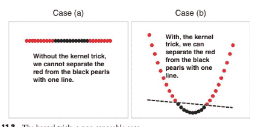

# 第十一章：基于支持向量机的全球战术资产配置

乔尔·古格利塔

## 11.1 引言

在本章中，我们将展示机器学习，更具体地说是支持向量机/回归（SVM/R）如何帮助构建全球战术资产配置（GTAA）组合。首先，我们将对 GTAA 进行快速文献回顾，解释资产配置的不同家族。然后，我们将通过过去 50 年战术资产配置的历史视角，介绍其背后的重要概念。

第 11.3 节将解释支持向量机（SVM）和支持向量相关性（SVR）的定义。第 11.4 节将介绍用于战术资产配置的机器学习模型，并讨论结果。

## 11.2 五十年全球战术资产配置

冒着陈词滥调的风险，资产配置的目标是获得最佳预期回报与风险的组合（Dahlquist and Harvey, 2001）。作者区分了三类资产配置：(i)基准资产配置，(ii)战略资产配置，(iii)GTAA（见图 11.1）。本章中构建的投资组合策略属于第三类模型，在该模型中，预测模型使用当天的信息集来预测资产回报。

从实践者的角度来看，GTAA 策略的管理已经有近 50 年的历史。GTAA

广义上指的是通过“根据收益和风险变化的模式，灵活调整组合中的资产配置，以提升组合绩效”的主动管理组合（Martellini and Sfeir, 2003）。雷·达里奥，Bridgewater 首席执行官，在 20 世纪 90 年代通过他的“全天候”投资组合使这种方法流行起来。

支持这种投资方法的理论已有充分的文献支持。W. Sharpe 在 1963 年表明资产的回报可以分解为系统和特定组成部分。掌握了这一历史悠久的框架后，投资组合经理采用两种形式的主动策略：(i)市场定时，旨在利用系统回报的可预测性，(ii)选股，旨在利用特定回报的可预测性。学术文献表明，有充分的证据

信息索引

在系统组成中可预测性的历史(Keim and Stambaugh 1986; Campbell 1987; Campbell and Shiller 1988; Fama and French 1989; Ferson and Harvey 1991; Bekaert and Hodrick 1992; Harasty and Roulet 2000)得到证明，而这对于具体组成则不太适用。

在 Samuelson (1969) 和 Merton (1969, 1971, 1973) 之后，他们表明最佳投资组合策略受到随机机会集存在的显著影响之后，最佳投资组合决策规则已被丰富，以考虑可预测收益的存在 (Barberis 2000; Campbell 和 Viceira 1998; Campbell 等人 2000; Brennan 等人 1997; Lynch 和 Balduzzi 1999, 2000; Ait-Sahalia 和 Brandt 2001)。简而言之，所有这些模型都表明投资者应在预期收益高的时期增加对风险资产的配置 (市场时机) 并在波动率高的时期减少对其配置 (波动率时机)。有趣的是，Kandel 和 Stambaugh (1996) 认为，即使有低水平的统计可预测性，也可以产生经济意义，即使市场成功时机只有 100 次中的 1 次，也可能获得异常收益。

本质上，GTAA 是一个两步流程，首先从业者通过资产类别预测资产收益，然后根据这一预测构建投资组合。与 GTAA 接近但没有预测部分的风险平价投资组合 (Hurst 等人 2010) 如今已经成为一种正在崛起的庞然大物，根据此方法管理的资金几乎达到了 3 万亿美元。风险平价通常被称为是 Bridgewater 的“廉价”版本。

“全天候”投资组合。我们同意。GTAA 和风险平价具有某些相似之处，因为它们都试图利用唯一的免费午餐：分散化。然而，风险平价只是投资组合构建的一个“技术细节”（所谓的

“一对西格玛”方法中，给定工具的权重与其实现的波动性（有时是预期的）成反比）。GTAA 试图根据当前信息集调整资产组合，以构建一个“更好”的（即希望提供更高回报风险比）适合当前（或预期的）经济周期的投资组合。例如，Chong 和 Phillips (2014) 利用他们的“Eta 定价模型”构建了基于 18 个经济因素的 GTAA。其中一个是均值-方差优化 (ECR-MVO)，另一个是构建为减少其经济敞口的 (MIN)。两者都是仅多头投资组合，每半年重新平衡一次。

总之，GTAA 的圣杯仍然是构建一个在任何类型的经济环境下都表现出色的投资组合。为了实现这一点，投资组合经理必须找到最佳的资产配置。资产配置通常由固定收入构成

（长期和中介），股票和商品（其他人有时还会添加房地产）。

影响此资产配置的经济周期可以用不同的细度进行建模。

我们跟随 R. Dalio 的做法，试图不要过于复杂化事物，并选择经济周期的稀疏模型，仅使用软数据 (调查) 来进行实际商业周期 (RBC) 指标和实现通胀的预测。

## 11.3 经济文献中的支持向量机

对 SVM 和支持向量回归的全面介绍超出了本章的范围。然而，我们认为简要解释 SVM 和支持向量回归对于不熟悉它的金融从业者（并且花时间定义一些有用的数学概念）以及为什么我们选择这种方法而不是选择替代的机器学习算法是合适的。我们在这里解释 SVM 的基本技术细节。

正如 Y. Abu-Mostafa（加州理工学院）所说，SVM 可能是机器学习中最成功的分类方法，具有非常直观的解释。受统计学习理论的启发，SVM 是由 Boser、Guyon 和 Vapnik 于 1992 年引入的一种“学习机器”，属于监督估计算法的类别（一种分析训练数据并生成推断函数的学习算法，该函数可用于映射新数据点）。它由三个步骤组成：

(i) 参数估计，即从数据集中训练。

(ii) 计算函数值，即测试。

(iii) 泛化精度，即性能。

正如 M. Sewell（2008，2010）所指出的，“人工神经网络的发展

（人工神经网络）遵循一条启发式路径，在理论之前有应用和广泛的实验。相比之下，SVM 的发展首先涉及扎实的理论，然后是实现和实验。

就参数估计而言，“SVM 的一个显著优势在于，虽然人工神经网络可能受到多个局部最小值的影响，但 SVM 的解决方案是全局且唯一的”。这是因为训练涉及优化凸代价函数，这解释了为什么没有局部最小值来复杂化学习过程。测试是基于使用数据中最具信息的模式来评估模型，即支持向量（分隔超平面所在的点）。性能是基于错误率确定的，随着测试集大小趋于无穷大。

SVM 相对于人工神经网络有更多优势。首先，它们具有简单的几何解释，并提供稀疏解。与人工神经网络不同，SVM 的计算复杂性不取决于输入空间的维度。其次，虽然人工神经网络使用经验风险最小化（在实践中效果不佳，因为界限太松），SVM 使用结构风险最小化（SRM）。在他们 1974 年的开创性论文中，V. Vapnik 和 A. Chervonenkis 阐明了使用 VC

（对于 Vapnik–Chervonenkis）维度。VC 维度是容量的度量

通过统计分类算法可以学习的函数空间的（复杂性）。SRM 是用于从有限训练数据集中学习的模型选择的归纳原则。它描述了一般的容量控制模型，并提供了假设空间复杂度和拟合训练数据质量（经验误差）之间的权衡。Sewell（见上文）定义了以下过程。

（i）使用领域的先验知识，选择一个函数类，例如 n 次多项式、具有 n 个隐藏层神经元的神经网络、具有 n 个节点的样条集或模糊逻辑（一种多值逻辑，其中变量的真值可以是介于 0 和 1 之间的任意实数）模型。

（ii）按照递增复杂性的顺序，将函数类划分为嵌套子集的层次结构。 例如，递增次数的多项式。

（iii）对每个子集执行经验风险最小化（这本质上是参数选择）。

（iv）选择其经验风险和 VC 置信度之和最小的系列模型。

在实践中，SVM 通常比人工神经网络（ANNs）表现更好，因为它们处理了人工神经网络面临的最大问题，即过度拟合。 由于它们不太容易受到这种主要疾病的影响，它们以更好的方式“泛化”。 但是，我们应该注意，尽管使用核函数可以解决维度的诅咒，但某些问题的适当核函数取决于特定的数据集，因此在选择核函数方面没有好的方法（Chaudhuri 2014）。 从实际的角度来看，支持向量方法的最大局限性在于核的选择（Burges 1998；Horváth 2003）。

SVM 可用于分类和回归。 当将 SVM 应用于回归问题时，称为支持向量回归。 SVM 和 SVR 有什么区别？ SVR 是基于在高维特征空间中计算线性回归函数的，其中输入数据通过非线性函数映射。 为了直观地了解 SVR 的工作原理，假设我们给定了一个线性可分的两个不同类别的点集 yi ∈{−1,+1}。 SVM 的目标是找到一个特定的超平面，分隔这两个类别 yi，使得最小误差，同时确保这两个类别中距离最近的两个点之间的垂直距离被最大化。 为了确定这个超平面，我们设置了这样的约束：

→−w。

→−xi − b = 1，*如果 yi* = 1 和 →−w。

→−xi − b = −1，*如果 yi* = −1 将此分类问题直接转化为回归问题是直接的。 让我们写：yi − w. xi −b≤ 和 −(yi − w. xi −b)≤。

上述两个方程说明超平面有点位于其两侧，使得这些点与超平面之间的距离不应超过ε。在二维平面上，这意味着试图在点集的中间某处画一条线，使得这条线尽可能靠近这些点。这正是支持向量回归（SVR）所做的。SVR 不是试图最小化观察到的训练误差，而是试图最小化泛化误差界限，以实现泛化性能。

支持向量机提供了一种新颖的方法来解决两类分类问题，例如危机或非危机（Burges 1998）。该方法已成功应用于许多应用程序，从粒子识别、人脸识别和文本分类到引擎检测、生物信息学和数据库营销。例如，A. Chaudhuri 使用支持向量机进行货币危机检测。Lai 和 Liu（2010）

比较人工神经网络方法和支持向量机回归特征在金融市场预测中的表现。使用的历史数值是恒生指数的数值。

（HSI）从 2002 年到 2007 年以及 2007 年 1 月和 2008 年 1 月的数据。支持向量机在短期预测中表现良好。其他作者，如 Shafiee 等人（2013），在伊朗股票回报预测中获得高达 92.16%的准确率。使用 34 只科技股票的每日收盘价来计算个别股票和整个部门的价格波动率和动量，Mage（2015）使用支持向量机预测未来某个时刻股价是高于还是低于给定日的股价。尽管作者发现短期内几乎没有预测能力，但他发现长期内确实有预测能力。

Bajari 等人（2015）指出，应用计量经济学家对机器学习模型表示怀疑，因为它们没有明确的解释，并且不明显如何应用它们来估计因果效应。然而，一些最近的研究表明，这些机器学习方法产生了有趣的结果。例如，McNelis 和 McAdam（2004）应用线性和基于神经网络的“厚”模型，根据美国、日本和欧元区的菲利普斯曲线公式预测通货膨胀。厚模型代表来自几个神经网络模型的“修剪均值”预测。它们在欧元区服务指数的“实时”和“自举”预测中胜过表现最佳的线性模型，并且在各种国家的更一般的消费者和生产者价格指数方面表现良好，有时甚至更好。回到支持向量机，Bajari 和 Ali 解决需求估计问题，专注于三类模型：（i）线性回归作为基准模型，（ii）逻辑回归作为计量模型，（iii）逐步、前向逐步、LASSO、随机森林、支持向量机。

并将装袋作为机器学习模型。有趣的是，他们表明，机器学习模型在持有样本内预测误差可比的情况下，始终提供更好的样本外预测精度以估计。SVR 已经应用于时间序列和金融预测。例如，张和李（2013）

使用 SVR 来建模预测 CPI。货币差距和 CPI 历史数据被利用来进行预测。此外，应用网格搜索方法来选择 SVR 的参数。此外，本研究通过与反向传播神经网络和线性回归进行比较，检验了将 SVR 应用于通胀预测的可行性。结果表明，SVR 为通胀预测提供了一个有希望的替代方案。

## 11.3.1 理解 SVM

SVM 本质上是一种用于解决分类问题的算法，例如决定买入和卖出哪些股票。其主要概念归结为最大化这两组股票之间的“边缘”。所谓的“核技巧”（下文定义）用于处理非线性。所涉及的主要数学是一些大学几何和二次优化（导数微积分）。

我们首先假设有一个线性可分的数据集，例如四支股票。

为了更好地可视化我们的问题，让我们假设我们测量两个属性 xi。

在输入空间 X 中，关于这四支股票的（例如收益质量和价格动量等）这两个属性形成了一个二维空间。在任意给定的时间，可以将这四支股票绘制在这个平面上（如图 11.2 的散点图所示）。假设有两个类别 yi ∈{−1,+1}，长期持有股票（+1，绿点）和短期持有股票（−1，红点）。我们试图解决的问题是是否选择一条分离线而不是其他线有任何优势。首先应该注意到这样一条线是一个超平面。

（维度为 1，线）方程为 w′. x = 0，其中 w 是权重向量（w′

作为转置）。

让我们检查以上三个例子，并问自己哪个是分离点的最佳线。在情况（a）中，边缘低于情况（b）中的边缘，情况（c）中的边缘低于情况（b）。在这三种情况下，样本内误差为零。就泛化而言，由于我们处理处于线性可分状态的四个点，所以泛化作为估计将是相同的。然而，直观地说，人们应该感觉到一个粗边缘（情况 c）更好。这带来了两个问题：（i）为什么粗边缘更好？（ii）我们如何解决最大化此边缘的权重 w 的问题？

很可能，生成数据的过程是嘈杂的。因此，当边缘较窄时，误分类点的机会比较大于边缘较粗的情况。这解释了为什么粗边缘更好的直觉。

证明基于所谓的 Vapnik-Chervonenkis 分析，其中可以证明更宽的边距导致更低的 Vapnik-Chervonenkis 维度（VC 维度是算法可以破坏的最大点集的基数）。

实际上，更宽的边距意味着更好的样本外表现。

现在，让我们找到最大化边距的权重 w。边距简单地是从平面到点的距离 D，这让我们回到了大学几何学。让我们定义 xn 为距离分隔线（超平面）w′最近的数据点。x = 0。这个点距离超平面有多远？在做这个之前，让我们解决两个技术问题。

首先，我们对 w 进行归一化。让我们注意到对于每个点，我们有| w′. xn | >0。目标是将 w 与边距联系起来。请注意，我们可以将 w 放大或缩小，因为超平面方程(w′. x = 0)是尺度不变的。不失一般性，我们考虑同一超平面的所有表示，并选择对于最小点有 | w′. xn | = 1 的表示。这将简化后续的分析。

其次，我们引入一个人工坐标 x0。将其视为一个常数，我们为其分配一个权重 w0。为了避免混淆，我们将这个权重 w0 重命名为

偏差 b。现在我们有一个新的（与用于 w′的向量 w 相比较的'新'向量，x = 0）权重向量 w = (w1, ..., wp)，其中 p 是属性的数量（如收益质量、价格动量、默顿距离到违约、流动性）。我们将看到当我们解决最大边距时，这个新向量 w 和 b 有不同的作用，将它们混合在同一个向量中不再方便。现在超平面的方程是：w′. x+b = 0 和 w = (w1, ..., wp)。

现在我们可以计算 xn 和方程 w′. x+b = 0 的超平面之间的距离 D，其中∣ w′. xn +b ∣ = 1。

首先，向量 w 垂直于输入空间 X 中的平面。这很容易证明。让我们考虑平面上的任意两点 x1 和 x2。我们有 w′. x1 +b = 0 和 w′. x2 +b = 0。这两点之间的差异是 w′. (x1 −x2) = 0，这表明 w′对平面上的每个向量(x1 −x2)都是正交的，因此是平面的正交向量。

其次，我们取平面上的任意点 x。从点 x 到点 xn（即向量 xn −x）在垂直于平面的向量 w 上的投影是到平面的距离。为此，我们首先计算单位向量 ŵ，即由其范数| |w | |归一化的向量，使得 ŵ = w∕‖w‖。距离是内积，即 D = | ŵ′.(xn − x) | 。因此，D =1/ | |w | | * | w′. (xn −x) | = 1/ | |w | | * |w′.

xn +b− w′. x−b| = 1/ | |w | |，因为 | w′. xn +b | = 1 且 | w′. x−b | = 0。可以看出，最接近超平面的点与这个超平面之间的距离只是 w 的范数 | |w ||的倒数。

现在我们可以制定我们的优化问题。我们的目标是

最大化 1∕‖w‖

限制为*minn* = 1,2, . . . ,N| w′. xn +b | = 1（表示对数据集的所有点 1, 2, . . . , N 进行最小化）。

这不是一个友好的优化问题，因为约束有一个最小值（其中有一个绝对值，但这个很容易解决）。因此，我们试图找到一个更容易解决的等价问题，即摆脱约束中的最小化，主要是摆脱约束中的最小化。

首先，我们仅考虑正确分离数据集的点，即标签 yn（长或短）与信号（w′. xn +b）一致的点，使得我们有| w′. xn +b | = yn(w′. xn +b)，这样我们就可以去掉绝对值。

其次，我们不是在最大化 1/| |w ||，而是在最小化以下二次量

（目标函数）1/2* w′. w，约束条件是对于所有点 n = 1, 2, . . . , N，都有 yn(w′. xn +b)≥1。

从形式上讲，我们面临一个受约束的优化问题，其中目标函数是最小化 1/2* w′. w。通常情况下，这是通过编写拉格朗日表达式来解决的。这里的一个较小的问题是我们在约束条件中有一个不等式。解决这样的拉格朗日不等式约束被称为 Karush-Kuhn-Tucker 方法（KKT）。

第一步是将不等式约束 yn(w′. xn +b)≥1 重写为零形式，即写成“松弛”yn(w′. xn +b)−1≥0，然后将其乘以拉格朗日乘子 n，这样我们就得到了表达式 n(yn(w′. xn +b)−1)，我们将其加到目标函数中。

我们的优化问题的拉格朗日形式变为：

$$m i n i m i n s i e\,L(w,b,\alpha)=1/2w^{\prime}w-\sum_{n=1}^{N}\alpha_{n}(y_{n}(w^{\prime}.x_{n}+b)-1),$$

关于 w 和 b，n≥0（我们对域施加了限制），n 是拉格朗日乘子，数据集中的每个点都有这样的拉格朗日乘子。

将 L(w, b, )关于向量 w 的梯度∇wL 写成另一个条件：

∇wL = w − ∑Nn=1 *nynxn* = 0（我们希望梯度是向量 0，这是我们为了得到最小值而提出的条件）。

将 L(w,b,)对标量 b 的偏导数写成另一个条件：

$$\partial L/\partial b=-\sum_{n=1}^{N}\alpha_{n}y_{n}=0.$$

在这一关键时刻，为了使问题易于解决，我们将这两个条件代入原始的拉格朗日函数，并将这个最小化问题转化为一个最大化问题，这样对（这是棘手的，因为 有一个范围）的最大化就不再受 w 和 b 的限制了。这称为问题的对偶形式。

从上述条件我们得到：

$$w=\sum_{n=1}^{N}\alpha_{n}y_{n}x_{n}\qquad{\mathrm{and}}\qquad\sum_{n=1}^{N}\alpha_{n}y_{n}=0.$$

如果我们将这些表达式代入拉格朗日函数 L(w,b,)中，在一些操作之后，我们得到以下次要约束优化问题：

$$L(w,b,\alpha)=L(\,\alpha)=\sum_{n=1}^{N}\alpha_{n}-0.5\,*\sum_{n=1}^{N}\sum_{m=1}^{N}y_{n}y_{m}\alpha_{n}\alpha_{m}x_{n}^{\prime}x_{m}$$

人们会看到 w 和 b 从优化问题中消失。

我们最大化上述表达式 L( ) w.r.t. 服从（讨厌的约束）

n ≥0 for n = 1,2, . . . ,N and ∑Nn=1 nyn = 0.

解决上述问题需要二次规划（二次规划包通常使用最小化）。因此，我们最小化：

$$\operatorname*{min}_{\alpha}$$

$$\left(0.5^{*}\sum_{n=1}^{N}\sum_{m=1}^{N}y_{n}y_{m}\alpha_{n}\alpha_{m}x_{n}^{\prime}x_{m}-\sum_{n=1}^{N}\alpha_{n}\right)$$

二次规划包给出了一个向量= 1, 2, ..., n，我们从中推断出 w。

$$w=\sum_{n=1}^{N}\alpha_{n}y_{n}x_{n}$$

决定最终支持向量的关键条件是满足于最小值的 KKT 条件。这个条件的零形式是 n(yn(w'. xn +b)−1) = 0，其中 n = 1, 2, . . . , N。这意味着拉格朗日乘子 n 要么是 0，要么是松弛

(yn(w′. xn +b)−1)为零。对于所有内部点，松弛都是严格正的，这意味着拉格朗日乘子 n 为 0。

数据集中最重要的点是定义超平面和间隔的点。这些点 xn 被称为支持向量 - 它们支持超平面，并且对于 n >0 的点。所有其他点都是内部点。

一旦我们找到了 w，我们从方程式 yn(w′. xn +b) = 1 中挑选任意支持向量并轻松推断出 b。

到目前为止，我们已经讨论了线性可分的情况。但是对于不可分的情况呢？我们可以通过一个非线性函数将 x 转换为新变量 z 来处理这种情况。优化问题变成了 L( ) =

∑N

n=1 n − 0.5∗ ∑Nn=1

∑N

m=1 ynymn*mznzm*. 这就是使 SVM

处理非线性问题非常强大。我们不是在高维特征空间 X 中使用标量积，而是使用一个核函数 Z，例如 z = Z(x)在 Rk 中，它在 X 中起着标量积的作用。举个例子，假设我们有一条有 30 颗珍珠的项链 - 中间有 10 颗黑珍珠，然后两边各有 10 颗红珍珠。我们被要求只画一条线来区分黑珍珠和红珍珠。假设珍珠首先在一维空间（线性，情况 a）。只用一条线分开珍珠是不可能的。但是，在二维空间中，借助简单的核函数（Z(x) = z = xa），这变得很容易，正如图 11.3 在情况(b)中所示。

## 11.4 基于 Svr 的 Gtaa

我们的 GTAA 是使用交易所交易基金（ETF）部署的，涵盖了通常在这类投资组合中找到的所有资产类别（14 个工具）（表 11.1）。

表 11.1 交易的宇宙

| 领域 | 彭博代码 | 证券名称 | 费用比率 |
| --- | --- | --- | --- |
| SPY 美国股票 | 标普 500 ETF 信托 | 0.09% |   |
| QQQ 美国股票 | PowerShares QQQ 信托一系列 1 | 0.20% |   |
| 股票 | VGK 美国股票 | 先锋富时欧洲 ETF | 0.10% |
| EWJ 美国股票 | 爱智擎日本 MSCI ETF | 0.48% |   |
| VWO 美国股票 | 先锋富时新兴市场 ETF | 0.14% |   |
| 房地产投资信托 | VNQ 美国股票 | 先锋地产投资信托 ETF | 0.12% |
| AGG 美国股票 | 爱智擎美国核心综合债券 | 0.05% |   |
| LQD 美国股票 | 爱智擎 iBoxx 美元投资级公司债 | 0.15% |   |
| 固定收益 | 美国 TIP 股票 | 爱智擎美国国债指数 ETF | 0.20% |
| MUB 美国股票 | 爱智擎国家市政债券 ETF | 0.25% |   |
| HYG 美国股票 | 爱智擎 iBoxx 美元高收益公司债 | 0.50% |   |
| EMB 美国股票 | 爱智擎摩根大通美元新兴市场债券 | 0.40% |   |
| GLD 美国股票 | 费城黄金股份 | 0.40% |   |
| DBC 美国股票 | PowerShares DB 商品指数 | 0.89% |   |
| 来源：J. Guglietta。 | | |   |

## 11.4.1 数据

我们使用 ETF 是因为它们具有一些特点，使它们成为理想的投资工具。 最吸引人的特点是多样性，因为可用的 ETF 范围几乎涵盖了每个资产类别。 多种 ETF 的广泛范围使我们能够使用较少的投资构建多样化的投资组合，从而使用较少的资金。 ETF 现在是一个 3 万亿美元的全球市场，比共同基金更具流动性，并且可以在全天交易。 最后，ETF 的运行成本比共同基金更低。 这种较低的成本往往会传递给投资者。

## 11.4.2 模型描述

正如上文所述，我们使用今天的信息建立预测模型以预测资产回报。 每周 t，对于每一个工具 i，我们都会预测回报 R

̃i t+k 提前一周（由于我们的数据库是每日的，所以 k = 5）使用具有线性内核的 SVR（使用高斯、径向基函数或多项式内核都没有帮助），并且有三种不同类别的因素作为“预测”变量。 从形式上来说，我们有：

R

̃i t+k = SVRT(MacroFactorst, GreedFearIndext, Momentat)，其中 i = 1, 2*，...* N

以及 T，用于校准 SVR 的滚动期。

第一个区块由宏观因素组成。 遵循 R. Dalio/Bridgewater 的做法，我们避免过于复杂化，并选择了有限数量的经济时间序列，以建模经济周期。 虽然 Bridgewater 使用（季度）国内生产总值

(GDP)模型 RBC，我们使用四个月的软数据（调查）。我们对所有资产使用相同的宏观经济因素。这些宏观因素在一周内不会改变。然而，我们的经验表明，认为金融市场会迅速因应宏观经济信息并基于月度数据更新每周预测是错误的，这样做能增加价值。由于该模型仍在生产中，我们不会透露使用哪些时间序列。第五个时间序列捕捉通货膨胀。

第二类因素是系统风险的衡量。我们使用我们首选的贪婪和恐惧指数，该指数基于美国股票的隐含波动率和实现波动率之间的方差风险溢价。

第三组也是最后一组因素是内生的，具有不同的价格动量，回溯期从一周到一年不等。

我们选择每周重新平衡我们的 GTAA。请注意，每月或每季度重新平衡也会产生良好的结果。

每周结束时，SVR 向我们交出 14 个（仪器数量）

预测收益 R

̃i t+1。我们将投资组合限制为仅做多。由于可能出现 R

̃i t+1 < 0，我们使用一个变换（函数）来限制预测收益严格为正，使得对所有 i 都有 (R

̃i t+1 > 0) > (R

̃j t+1 < 0) 和 (R

̃i t+1) > 0。最后，我们通过仪器日收益的实现波动率对这些预测收益进行缩放，以获得信噪比，例如：

$$S N_{t}^{i}=\phi(\widetilde{R_{t+1}^{i}})/\sigma_{t-d,t}^{i}.$$

最后一步归结为将这些信噪比插入投资组合优化算法中，以构建投资组合。投资组合构建，即找到最优权重，是一个丰富的研究领域，详细讨论超出了本章的范围。

可能有许多投资组合构建方法。风险平价（所谓的一对 sigma）

组合是最简单的一个。还有其他选择，从均值–方差优化到等风险贡献或最大分散的组合（产生有趣的结果）。

我们相信投资组合经理更担心左侧风险而不是波动率本身。这就是为什么我们最喜欢的投资组合构建方法是条件风险价值（CVaR）投资组合，这是我们目前生产的许多模型中使用的方法。

CVaR 被定义为超过风险值（VaR）的预期损失。优先最小化 CVaR 而不是 VaR，因为 VaR 不是一种一致的风险度量。然而，CVaR 较低的投资组合必然也具有较低的 VaR。我们意识到 CVaR 投资组合的局限性可能会导致一些不稳定的解决方案。然而，我们要注意这种批评适用于所有投资组合构建方法。

因此，我们的 GTAA 是一个两步过程，每周我们根据 SVR、宏观因素、我们的贪婪和恐惧指数以及工具价格动量预测下周回报。这些预期回报被转化为信号，随后被插入到条件 CVaR 组合中。根据收盘价给出投资组合权重，并在下一个交易日开盘时执行（回报按费用费用和交易成本净计算）。

## 11.4.3 模型结果

图 11.4 显示了我们的流程相对于常用流程的相对性能

（Hurst 等人 2010 年）基准策略投资 60%债券和 40%股票。

在此期间（2001 年 3 月至 2017 年 3 月），总复合几何回报率为 189%，而基准策略为 102%。我们的策略表现优于基准策略 87%，并且在全球金融危机期间尤其表现出较小的回撤。一年和两年滚动信息比率（收益单位风险单位）在最近过去并不是恒定的，但一直在 2 左右。总期间信息比率为 0.77，比基准策略高 52.6%（0.50）。策略的年化实现波动率为 8.9%，比所选基准的低 0.44%。策略的稳定性，以累积对数回报的线性拟合的 R²值来衡量，为 91.7%，比基准高 40%（65.4%）（图 11.4 和 11.5）。

## 11.5 结论

我们提出了一个基于透明“量化基本面”框架的 GTAA 组合。我们认为，分散仍然是唯一（几乎）免费的午餐，因此能够构建强大的分散投资组合应该受到所有投资者的追捧。

由于其机器学习特性，我们基于 SVR 的 GTAA 组合可以适应（修改资产组合）不同的经济环境，并为这些投资者提供一个强大的解决方案，改善我们描述的资产配置的主要目标：获得最佳的预期收益风险配置。

一年滚动信息比率 二年滚动信息比率

图 11.5 SVR GTAA 与 60%债券、40%股票（非复合算术回报）的比较。

## 参考文献

Ait-Sahalia, Y.和 Brandt, M.W.（2001）。投资组合选择的变量选择。《金融学杂志》56：1297–1351。

Barberis, N.（2000）。当回报可预测时长期投资。《金融学杂志》55：225–264。

Bekaert, G.和 Hodrick, R.J.（1992）。描述股票和外汇市场超额回报中可预测的组成部分。《金融学杂志》47（2）：467–509。

Burges, C.J.C.（1998）。支持向量机模式识别教程。《数据挖掘与知识发现》2：121–167。

Campbell, J.Y.（1987）。股票回报和期限结构。《金融经济学杂志》18：

373–399。

Campbell, J.Y. and Shiller, R.J. (1998). 估值比率和长期股市展望。

投资组合管理杂志 24 (2): 11–26.

Campbell, J.Y. and Viceira, L. (1998). 谁应该购买长期债券？NBER。工作论文 6801。

Campbell, J., Chan, Y., and Viceira, L. (2000). *战略资产配置的多变量模型*。

工作论文。哈佛大学。

Chaudhuri, A. (2014). *用于货币危机鉴别的支持向量机模型*。比尔拉工学院。

Chong, J. and Phillips, M. (2014). 利用宏观经济因素的战术资产配置。*财富管理杂志* 17 (1): 58–69.

Dahlquist, M. and Harvey, C.R. (2001). *全球战术资产配置*。杜克大学。

Fama, E.F. and French, K.R. (1989). 商业状况和股票和债券的预期回报。*金融经济学杂志* 25: 2349。

Ferson, W.E. and Harvey, C.R. (1991). 经济风险溢价的变化。*政治经济学杂志* 99 (2): 385–341.

Harasty, H. and Roulet, J. (2000). 建模股票市场回报。*投资组合管理杂志* 26 (2): 33–46。

Horváth, G. (2003). 学习理论的进展：方法，模型和应用。

在：*NATO-ASI Series III: 计算机与系统科学*，卷 190 (编辑 J.A.K. Suykens, G. Horvath, S. Basu, 等)。阿姆斯特丹：IOS Press。

Hurst, B., Johnson, B.W., and Ooi, Y.H. (2010). *理解风险平价*。AQR。

Kandel, S. and Stambaugh, R.F. (1996). 关于股票回报可预测性的资产配置视角。*金融学杂志* 51 (2): 385–424。

Keim, D.B. and Stambauh, R.F. (1986). 预测股票和债券市场回报。金融经济学杂志 17 (2): 357–390。

Lai, L.K.C. and Liu, J.N.K. (2010). 利用支持向量机进行股票预测。国际机器学习和网络技术会议（ICMLC）。Lynch, A.W. and Balduzzi, P. (1999). 交易成本和可预测性：一些实用成本计算。*金融经济学杂志* 52 (1): 47–78。

Lynch, A.W. and Balduzzi, P. (2000). 可预测性和交易成本：再平衡规则和行为的影响。*金融杂志* 55: 2285–2310。

Madge, S. (2015). 利用支持向量机预测股票价格走向。独立工作报告。2015 年春季。

Martellini, L. and Sfeir, D. (2003). *战术资产配置*。EDHEC。

McNelis, P. and McAdam, P. (2004). 利用厚模型和神经网络预测通货膨胀。欧洲央行，工作论文系列 n352，四月。

Merton, R.C. (1969). 不确定性下的终身投资组合选择：连续时间情况。

经济与统计评论 51: 247–257。

Merton, R.C. (1971). 连续时间模型中的最佳消费和投资规则。

经济理论杂志 3: 373–413。

Merton, R.C. (1973). 一个跨时间的资本资产定价模型。*计量经济学* 41: 867–888.

Samuelson，P.（1969）。动态随机生命周期投资组合选择。*经济与统计评论* 51（3）：239-246。

Sewell，M.（2008）。*结构风险最小化*。计算机科学系：伦敦大学学院。

Sewell，M.（2010）。智能系统应用于金融时间序列分析。博士

论文，计算机科学系，伦敦大学学院，博士论文。

张，L. 和李，J.（2013）。使用支持向量回归进行通货膨胀预测。2012 年第四届信息科学与工程国际研讨会。

