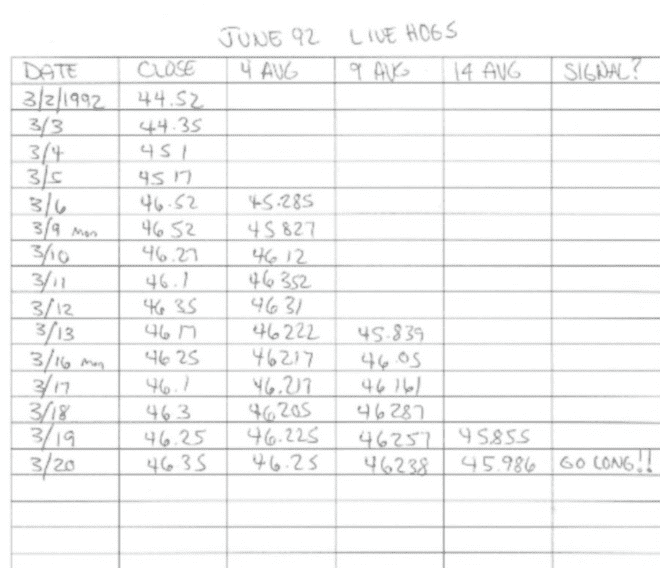
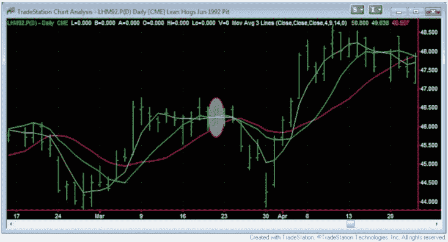

# 引言

星期六早上 6:20 再也等不及了。那时我通常会听到熟悉的“咚”的一声，卷起的《洛杉矶时报》报纸击打我公寓的前门。前提是送报员今天瞄得准。有些日子，附近的灌木丛会热情迎接报纸（树枝？）。而其他日子报纸根本就没有到达。但在这个星期六，我听到了报纸撞门的声音，知道是时候准备星期一的交易了。

我急匆匆地起床，打开门，抓起报纸，撕开它，直到找到商业版块。后面的数据正是我所寻找的信息——在短时间内使我变得富有（或者我认为是这样）：前一天的每日商品价格。

正如你所猜测的，这一切发生在电脑统治之前，日常和盘中数据只需几个按键就能获取。这是一种极其传统的方式——所有东西都是纸质的！

无论如何，我扫描了商品价格，找到了当时称为“活猪”的价格（现在是瘦肉猪）。我记录了最近一个月合约的收盘价，并将其复制到一张有 6 列的纸上：日期、收盘价、4 周期均线、9 周期均线、14 周期均线和信号。

我认真地手动计算每一个均线——记住，那时我没有电脑可以帮我——然后将结果与我的规则进行比较：

9 周期均线高于 14 周期均线？ 是的！

4 周期均线高于 9 周期均线？ 是的！！

收盘价突破 4 周期均线？是的！！！！

就这样——一切都是“是”，我有了一个明确的信号！星期一早上，我会下单购买 1 个活猪合约。我郑重其事地在信号栏中写下“做多”，在我脑海中巩固了这笔交易。

图 1 - 旧派算法交易，手动进行！

图 2 - 算法买入信号，现代技术助力

周末的剩余时间里，我紧张、兴奋，仿佛置身梦中——这是我第一次真正的商品交易！

我之前并不知道，但即使在那段旧时光，我也在进行算法交易，或称为“算法”交易。我是根据一套精确的规则进行交易，归根结底，这就是算法交易的本质。

当时，交易员称之为系统交易、机械交易或基于规则的交易。几年前，很多人提到了机器人或“机器人”交易。但直到最近，很少有人使用算法交易这个术语。然而，所有这些基本上都是同一种东西。

所以，当有人提到这些术语时——机械的、系统化的、基于规则或算法的交易——他们很可能指的是同样的事：一套规则，告诉你何时进出交易。这些规则可以存在于计算机上、你的脑海中，或者像我早期一样，写在老纸上。

这是本书的第一课——算法交易 = 交易规则。

这本书中还有许多其他课程，旨在引导你进入算法交易的世界。这种交易适用于许多不同的工具：股票、ETF、外汇、期货和期权等。不要让“算法”或“算法交易”这些术语吓到你；在这本书中，我将带你了解算法交易的基础：

+   对算法交易到底是什么，以及它不是什么的讨论

+   算法交易的基础，适合初学者到中级交易者

+   了解算法交易是否是你应该考虑的事情

+   算法交易的诸多优点

+   算法交易的缺点

+   如何开始自己的算法交易

+   选择一个交易软件平台

+   学习你平台的基础知识

+   学习在你平台上的编程语言

+   一个简单的算法让你入门

+   成功算法交易的提示

+   阅读完这本书后的步骤

本书的目的是不教你一般交易的基础；在这个主题上有很多其他书籍可供选择。本书旨在让你入门算法交易，假设你了解一些交易基础。我坚信算法交易是小型零售交易者与专业交易者竞争的好方式。

到书的最后，你不会对人们谈论交易算法感到害怕。你将了解基础知识，并为未来的算法交易努力制定计划。

那么，让我们开始这段旅程吧！
