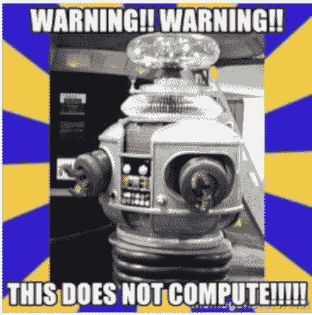
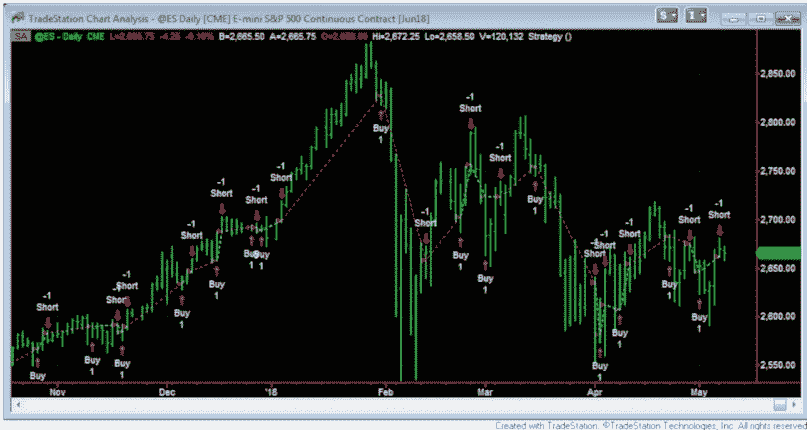
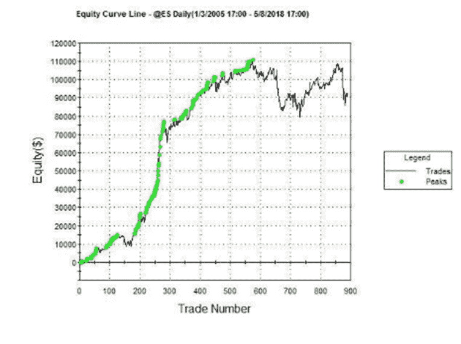
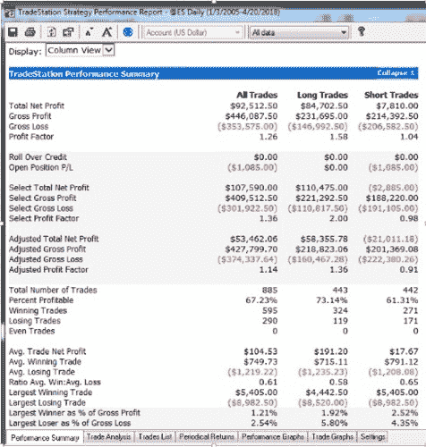

第一章 - 不同类型的交易

“算法”和“算法”。这两个词让许多交易员心生畏惧。计算机程序失控，肆意买卖的情景，常常是噩梦。一个交易员平静入睡，却发现一个流氓算法在夜间耗尽了他的账户，因一个简单的编程错误买卖不止。

图 3 - 一个失控的交易机器人？

更糟的是，交易员醒来发现自己空头 100 份 ES（迷你 S&P）合约，而他只想空头一份合约！

也许你的噩梦是对冲基金以闪电般的速度执行“杀手机器人”算法，耗尽所有较慢交易员的账户。

当然，事实是交易算法可以做这些事情，甚至更糟。关于这些毁灭账户的计算机代码的恐怖故事屡见不鲜。这些确切的噩梦情境确实发生过。但设计得当的算法也可以是友好的。

我显然会关注友好的算法！

但在我深入讨论算法的细节之前，重要的是要讨论一些不同类型的交易。这将帮助你理解算法是什么，它能做什么，最重要的是，它不能做什么。

## 自由裁量交易

大多数零售交易员都是自由裁量交易员。自由裁量意味着交易员在进出交易时使用某种判断。

例如，一位交易员在 CNBC 上听说了一只热门股票，立刻决定买入。这就是自由裁量交易。

另一位交易员有一张她整天盯着的图表。它可能充满了指标、趋势线、移动平均线等，或者可能只有价格数据。 一旦该交易员基于她所看到的做出交易决策，那就是一次自由裁量交易。

我们的第三位交易员只有一个 DOM 梯子，这是一种可视化工具，显示所有挂单买卖订单和价格。他是根据这个工具进行交易的。他很可能也是一位自由裁量交易员。

在一天结束时，如果你问这些交易员为何做出某些交易，或为何避免其他看似完全相同的交易，他们可能会给你一个“呆若木鸡”的表情，或像“我不知道，感觉就是对的！”这样模糊的回答。

事实上，自由裁量交易员可能有或没有规则，他们可能遵循或不遵循这些规则，且在应用这些规则时可能不一致。哎，他们甚至可能无法描述促使他们交易的规则。

我记得前一段时间在一个“价格行为”大师的交易室里。他在实时预测市场，内容大致是这样的：“是的，市场看起来很弱，这里有一个我通常会采取的空头设置，所以我只是等待短期入场……等待……等待……不，这是一个多头交易！我刚刚获利出局！”

啊？

后来当被问起时，导师无法解释他认为的教科书式（短线）入场是如何突然变成一个盈利的长线套利交易的。“感觉就是对的，”他解释道。

我开始想知道他是否在进行真实交易，但这是另一个故事。关键是，他在以自由裁量的方式进行交易（可能是模拟交易）。

因此，自由裁量交易涉及一些人类判断的交易决策。也许是直觉，或者第六感，甚至是随机猜测，但交易选择通常包含一些无法明确界定或测试的内容。

现在，这种交易可能听起来对你不对劲（“谁会根据直觉交易？”）或者可能听起来很吸引人（“太好了，我可以用我的大脑来帮助我决策！”）。但事实是，很多人确实这样做，并且一些人也取得了成功。这是一种合法的交易方式。

然而，自由裁量交易绝对不是算法交易。

我猜，如果你在读这本书，可能已经尝试过自由裁量交易但失败了。别觉得沮丧，我也算是你们中的一员——我从来不是一个好的自由裁量交易者。这就是我深入算法交易的主要原因。

## 算法交易

算法交易完全是关于规则。事实上，它就是规则。没有自由裁量。没有人类判断。

交易算法可以简单，也可以复杂，随你选择。

有多简单？这里有一个基本的两行策略：

如果收盘价 < 最近 5 根 K 线的平均收盘价，就买入

如果收盘价 > 最近 5 根 K 线的平均收盘价，就卖出

图 4- 简单算法的买卖信号

在过去 13 年里，这个策略在扣除滑点和佣金后，仅仅交易一个合约就赚了超过 92,000 美元！而且在多头和空头方面都能盈利！不过别太兴奋，过去几年对这个策略并不友好……

图 5- 一个简单（但不稳定盈利）的算法收益曲线

图 6- 典型的算法绩效报告

这只是一个非常简单的算法。相比之下，算法策略也可以极其复杂。有些交易者的单一算法运行的代码行数超过 25,000 行——真正的火箭科学！

交易算法有两个关键：

1. 它们可以被测试。大多数算法可以进行历史测试，通常称为回测。这被认为是创建算法的主要优势之一，稍后我会描述。对于无法进行历史测试的算法，几乎总是可以在模拟模式下进行实时测试，但需要适当的预防措施和一些注意事项。在这两种情况下，交易者通常可以在用真钱交易之前确定策略的可接受性。

2. 算法被严格定义。如果算法今天看到一个看涨的信号，它会告诉你做多。如果明天看到同样的信号，它会再次告诉你做多。算法只关注其编程时设定的内容。它不关心美联储的想法，不关心新闻，也不关心吉姆·克莱默昨晚大喊某只股票是买入 – 除非你将这些类型的规则编入算法中。算法在遵循规则方面是一致的。

许多交易者谈论“黑箱”，这是一种特殊类型的算法。对于黑箱，规则（算法）对交易者是隐藏的。他或她仅仅得到进出场信号，并不知道这些信号是如何产生的。

这种类型的算法可能听起来不吸引人或令人害怕，但许多人喜欢这种方法。干扰你根本看不见的计算机代码是非常困难的！

## 一些算法交易的示例

那么，算法交易者是什么样的呢？以下是一些典型的示例：

- 一位在家进行交易的零售交易者。他全职工作，因此交易是他的爱好。每晚，他下载最新的价格，要么手动计算信号，要么在计算机上完成，然后根据规则进行交易。他可能在白天检查仓位，也可能不检查，但由于他在非工作时间下单，他知道自己每天都在遵循策略。

- 一位全职的自营交易员。他全天进出交易，同样根据设定的规则。他从不偏离规则，因为他知道他的老板会抽查他的交易以确保遵循规则。

- 一段由众多数学、统计学和物理学博士编写的对冲基金计算机代码。他们运行的计算机代码有 50,000 行，能够完成一切 – 进出交易、计算仓位、自动执行滚仓等。一位初级交易员始终在附近监控交易，以防发生故障，但计算机控制整个过程。他们运行的策略可以是微秒级的（快速进出），也可以是持续几小时的日内交易，或持续几周的波段交易。

- 一位使用标准零售平台 Tradestation 的专业零售交易者。他创建策略，然后让 Tradestation 自动运行这些策略。他通常会密切监控仓位，因为 Tradestation 的工作人员表示“自动交易并不意味着无人值守交易”。他可以进行相当多的自动化策略交易，前提是他有足够的资本，并且他的策略足够多样化。

这些人之所以被称为算法交易者，是因为他们遵循严格的进场和出场规则。这才是关键——他们是 100%的规则遵循者。凭借这些严格的规则，他们可以对自己的方法进行历史回测，尽管“过去的表现并不能预示未来的结果”（正如美国政府免责声明所正确指出的那样），但很高兴地意识到，所交易的策略在过去是有效的。

很多交易者无法做到 100%遵循规则，因此他们落入最后一个主要类别——混合交易。

## 混合交易

现在我已经讨论了自主交易和算法交易，是时候引入另一种交易类型——我称之为混合交易。

混合交易仅仅是自主交易和算法交易的结合。一些例子：

+   进场是基于技术指标和规则，但退出则留给交易者自行决定。

+   进场是基于交易者的判断，但一旦进入交易，自动退出“机器人”就控制了交易，不需要交易者干预。

+   进场和出场都由规则明确界定，但交易者有权决定是否遵循这些规则。例如，交易者可能会在自然灾害或人为灾难后选择忽视多头信号。或者，交易者可能会在重大世界事件（如英国脱欧投票、特朗普选举之夜）之前选择平仓。

混合交易的优势在于交易者仍然可以对交易有一定的自主影响。这也是一个劣势！我在自己的算法交易中注意到的一点是，我一些最好的算法交易实际上是我“人类判断”绝对不喜欢的交易！如果我把这些交易当作混合交易，我将消除所有算法带来的良好效果。

*****

读到最后一节时，你可能会想，“那些专业交易者在做什么，我该如何与他们竞争？”这是个好问题！专业交易者使用上面详细介绍的所有方法。你可以通过将交易视为一项严肃的事业来竞争。不要幻想“我每天有 15 分钟来进行交易”类型的系统。希望成为最优秀的交易者——那样你就能与专业人士竞争。

在所有这些交易类型中，很难决定哪种交易方式适合你。在整本书中，我将讨论一些优秀算法交易者的特点和特征，但现在我假设你已经知道算法交易是你想追求的道路。如果你仍然不确定，继续阅读，也许在书的最后你会确定！
