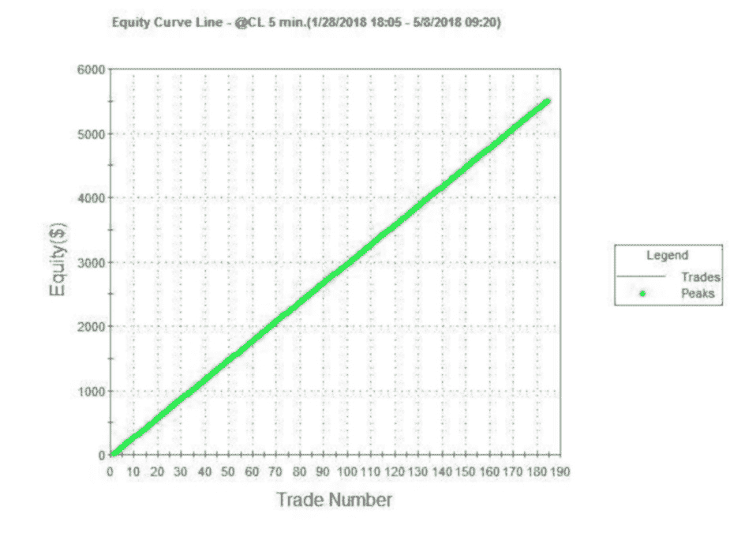
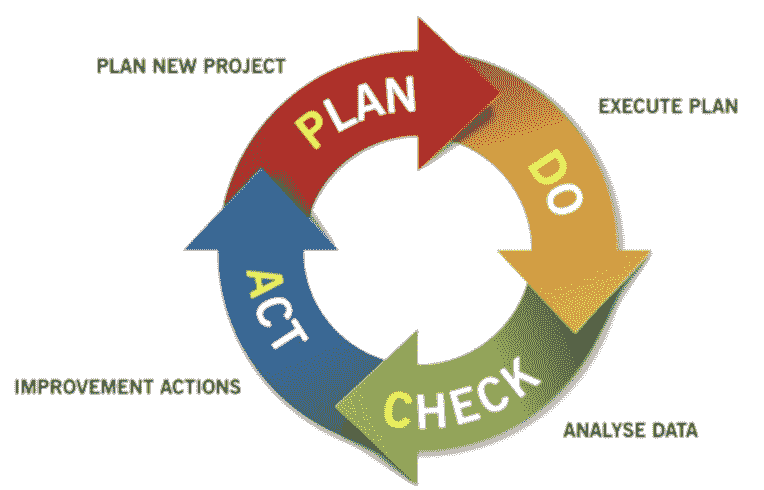

第三章 - 算法交易适合你吗？

“你的经验不足。”

“你并不适合这个职位/我们的组织。”

“你不适合这个职位/我们的组织。”

如果你曾经找过工作，可能听过潜在雇主说出一个或多个这样的借口。问题是，你怎么知道他们说的是否真实，甚至不给你机会证明自己？

算法交易也是如此，最终你会发现算法交易是否适合你。不幸的是，交易者发现的方法是市场从你的账户中提取资金！

我将为你简化这一痛苦的过程。

在后面的章节中，我将帮助解决第一个拒绝——经验。本书将帮助你获得开始进行算法交易所需的经验。你将走在正确的道路上，尽管还有很多事情需要做。

关于另外两种拒绝——知道你是否是适合算法交易的人，以及这种交易方式是否与你的个性“匹配”——在这一章我将讨论一些我认为对成功的算法交易者重要（或不重要）的性格特征。

记住，你是一个小型零售交易者，交易世界里充满了专业的“鲨鱼”。如果你想竞争，首先要知道算法交易是否适合你。本章是一个很好的了解途径。

我的建议是拿一张纸，写下我列出的每个特征，然后在我解释之后，对每一项进行自我评分。你很快就会看到算法交易是否适合你！

## 分析性思维

科学家说，世界上有两种人，左脑思考者和右脑思考者。左脑的人倾向于更具分析性，注重数字。通常，这些人会在医生、律师、会计师、科学家、工程师、计算机程序员等职位上工作。这类人喜欢规则。

另一方面，右脑的人倾向于更自由的思考者。艺术家、音乐家、销售人员、市场营销人员和其他“软技能”职业通常属于他们的领域。

这两类人对世界都很重要。想象一下没有像莫奈这样的艺术家，没有像贝多芬这样的作曲家，没有像爱因斯坦这样的杰出逻辑思考者的生活。没有多样性的世界将会是一个悲伤的地方。

在交易中，某些领域似乎更适合左撇子和右撇子。右脑交易者可能更擅长视觉图表交易和自主交易。我所接触的算法交易者大多是左脑思考者。多年来，我与许多医生和科学家做过算法工作，但艺术家并不多。

现在我意识到我真的过于简单化了。但一般来说，分析型的左脑思考者更有可能发现算法交易的吸引力，并更有可能在其中获得成功。

如果你主要是左脑的分析型思考者，给自己一分。

## 控制狂？

不久前，我和一位交易者喝咖啡。他下周将上线他的外汇系统。他有多年有利的回测、明确的规则，而且已经设置好自动化。

一周后，我问他情况如何。他告诉我，他在第一个星期赚了 500 美元，账户为 5000 美元。我告诉他不错。但他摇头害羞地说：“其实不然。我这周把系统开关了几次。如果我让它正常运行，我本可以赚 2500 美元！”

他是一个典型的控制狂。但他并不算特别异常。

很多交易者喜欢“掌握主动权”——随时准备在感觉不对时进入或退出交易。让电脑独自控制进出交易的想法对这些人来说是不可接受的。这些交易者想要，并且确实渴望对交易拥有终极控制。

一个很好的非交易例子就是“直升机”父母。这些父母总是围着孩子，随时准备出手“拯救”他们的后代，无论他们的年龄。我甚至听说这些控制狂父母会代孩子给大学教授和雇主发邮件！控制狂，到了极点。

而算法交易则完全是关于放手。它是关于准备、测试和设置交易策略，但当时机来临时，要放手，让经过回测验证的算法发挥作用。这并不容易，尤其是刚开始时。但这是进行适当算法交易所必需的。

如果你不是控制狂，给自己一点分数。

## 动手者/完美主义者

你是否有想要正确、完美的需求？这在学校和许多“分析型”职业中是一个很好的特质。但在交易中，这却是个坏事！

图 7- 这应该是你回测时的目标吗？（答案：“不！”）

为什么？作为交易者，我们为什么不应该追求看起来出色的历史回测，追求交易的完美呢？

答案可能让人震惊——不！

追求完美，不断调试交易算法直到产生良好的回测，实际上是你能做的最糟糕的事情。你实际上是在自我欺骗，以为通过不断测试可以改善事物（注意到那点控制狂特质了吗？）。

但最优秀的交易者只会进行他们绝对需要的测试。他们意识到完美是不可能的，因此不会试图追求它。

想想你在交易之外所做的事情——如果你总是努力追求完美，或总是尝试改善事物，这就是算法交易的警告信号。如果你不是完美主义者或动手者，给自己 1 分。

## 情绪驱动的人

图 8- 这桶炸药描述了你典型的情绪状态吗？对于交易者来说可不好！

有些人天生就非常兴奋。他们欢呼声最大，嘘声也最大，情绪总是外露。你几乎总能知道他们对某个问题的立场。

另一方面，有些人在压力下非常冷静，从不慌乱，无论发生什么都不会过于激动或沮丧。

你是哪种人？如果你大多数时候认为自己冷静、沉着，请给自己两分。这是算法交易时的理想状态。

## 有耐心的人

花一分钟去谷歌搜索“交易系统快速致富”。你会发现超过 2,000,000 个匹配结果。

然后搜索“交易系统慢致富”——你只会看到大约 300,000 个匹配结果。

很明显，大多数人希望快速致富——我指的是，谁真的想等待呢？然而，等待和耐心是成功的关键。你不会在开始算法交易的第一周就创造出十几个算法。而且你的算法可能不会让你一夜暴富。

良好的交易在于耐心，让交易自然发展，让策略发挥作用。你是否尝试过一个新策略，却在亏损一周后就放弃了？也许你的策略确实失败了，但也许它只是经历了一个不幸运的星期。

把交易想象成一次长跑。许多跑者从一开始就开始冲刺。有些人因为没有适当热身而拉伤腿筋。其他人起步领先，但随后他们意识到——自己是在进行 26.2 英里的马拉松，而不是 100 码的短跑！

把交易视为马拉松。慢慢来，保持耐心。正如他们所说：“罗马不是一天建成的。”如果你能慢慢来，请给自己一分。

## 遵循规则的人

你见过小孩子在涂色书上涂色吗？有些会整齐地保持在边界内，另一些则只把边界当作指南，随心所欲地涂画。不过，两者都能创造出美丽的最终作品！

图 9- 你是如何上色的？

之前，我谈到了左脑和右脑的人。我猜遵循规则的人往往更偏向左脑，但并不总是如此。

优秀的算法交易者往往是遵循规则的人。如果你认为自己是遵循规则的人，请给自己一分。

## 经常感到沮丧的人

我有三个孩子，基本上都同样有才华。但在体育方面，我的小儿子很多时候表现不佳。问题是什么？他很容易沮丧。一旦路障出现，他就会放弃，或者生气，然后再放弃。

他现在会是一个糟糕的算法交易者。

你有多“无沮丧”？开发算法策略充满了挫折。如果你无法应对挫折、路障和几乎持续的沮丧，你会陷入困境。算法交易系统的开发并不简单——如果简单，大家都会去做！

如果你能够轻松处理和克服挫折，就给自己两分。

## 过程导向的交易者

你目前如何评估潜在的策略？你是否以相同的方式评估每一个，经过相同的步骤？如果是，给自己一分——遵循明确的流程对算法交易者来说是好的。

如果你没有一个流程，无论是寻找和测试交易策略、实际交易还是事后分析你的交易结果，都给自己零分。

最优秀的算法交易者往往是最注重流程的。他们始终坚持自己的市场交易方法和交易方式。

为什么这很重要？简单来说，没有正确的交易方式，但有无数错误的方式。通过成为一个一致的、过程导向的交易者，可以更容易地进行课程调整。

在质量保证领域，这被称为计划-执行-检查-行动循环。在行动阶段，交易者会找出改进自己所做事情的方法。想象一下，没有固定流程时，改变是多么困难！(提示：这实际上是不可行的。有了流程，改进变得更容易。)

图 10- 计划-执行-检查-行动质量改进工具

如果你注重流程，就在总分上加一分。

## 总分

你做得怎么样？这次练习总共可以得 10 分。

+   如果你得了 9 或 10 分，恭喜你！你拥有征服算法交易所需的大部分技能和特质。

+   如果你得了 6-8 分，你接近于具备算法交易的准备，但还没有完全到位。花些时间，努力改进你不足的领域。

+   如果你得分为 5 分或更少，退一步重新评估你的情况。算法交易真的适合你吗？这并不适合每个人，当然，现在发现你的个性与算法交易不匹配总比以后浪费大量时间和金钱要好。算法交易并不适合每个人，因此如果你的个性不支持它，我建议你考虑其他类型的交易。

## 好消息

好消息是，如果你对算法交易的可能性感到非常兴奋，经过一点努力，你可以将每个缺点转变为资产。例如，如果你没有一个固定的交易流程，就去创建一个，最重要的是，遵循它。如果你容易感到挫败，或者你是一个情绪化的火药桶，意识到这一点是改变的第一步。这需要一些时间，但在你考虑算法交易之前，先花一些时间来提升自己。一旦你在练习中得分达到 9 或 10 分，你就会准备好参与算法交易的众多优势。
