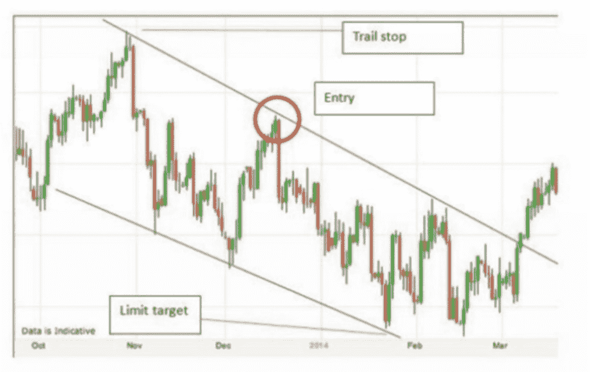
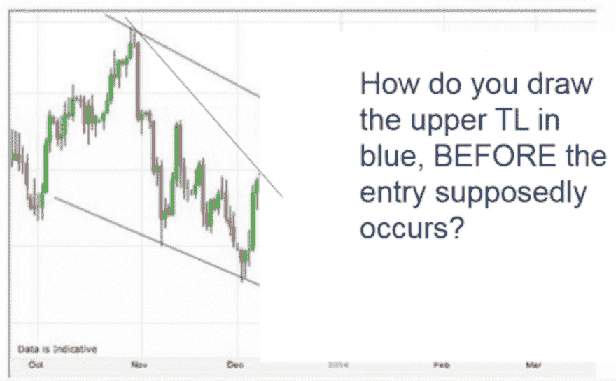
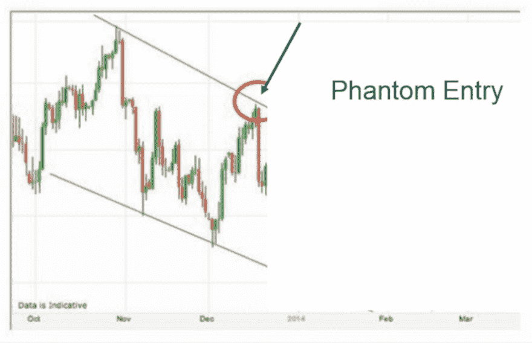
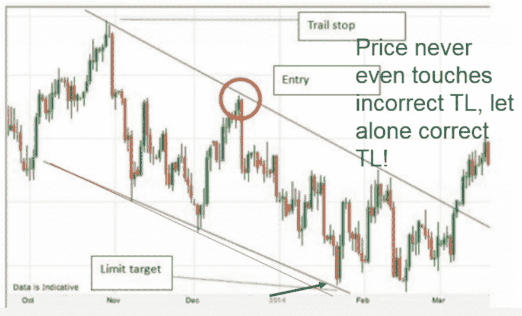
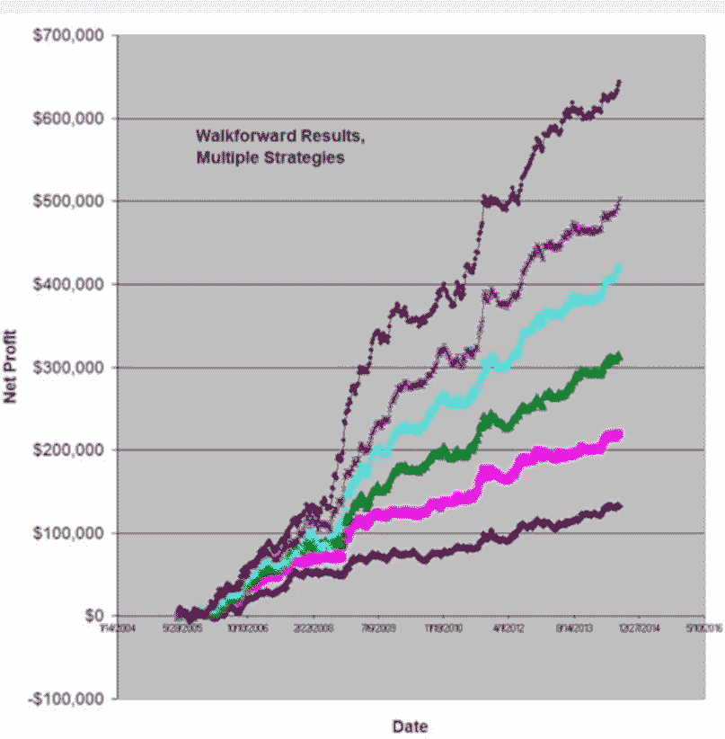

# 第四章 - 算法交易的诸多优势

在这一点上，希望你对算法交易有一个不错的了解，以及它不是什么。但你可能还在想“我为什么要进行算法交易？”这一章将讨论零售算法交易者的许多优势。

## 优势 #1 - 没有可疑交易的骗子

几年前，我参加了一位所谓“交易大师”的网络研讨会。这个人——我甚至不愿称他为交易者，因为我非常怀疑他是否积极交易——是一位所谓的趋势线交易专家。

对于那些不熟悉这个术语的人，趋势线交易是一种在价格图表上绘制线条以捕捉主要趋势的方法。特别关注价格触及趋势线并反弹的时刻，以及价格触及趋势线后继续穿越的时刻。在第一种情况下，趋势线被“尊重”，在第二种情况下，趋势线被“拒绝”。两者据称都有意义。

现在不是讨论这种方法有效性的时间和地点——也许随机画出的线有时也会显示出意义——但重点是这是一个许多人使用的交易方法。大多数使用趋势线的人可能是自由裁量交易者，趋势线只是影响交易信号的因素之一（包括交易者判断）。他们有规则，但有时规则模糊——不适合算法交易。

无论如何，在网络研讨会的某个时刻，主持人展示了以下图表：

图 11- 趋势线“专家”交易

“只需看看这个例子，”嘉年华主持人兴奋地说道，“这展示了趋势线交易的伟大和完美！完美的入场，完美的出场，没有止损被击中的危险，利润丰厚。确实是一次伟大的交易！跟随我的教导，我会给你展示更多更多这样的交易。”

毫无疑问，从表面上看，这似乎是一笔伟大的交易。房间里大多数人都被这个交易欺骗了，可能花了数千美元来获取“趋势线秘密”。

但这位所谓的专家实际上是一个骗子。一个展示虚幻、假交易的骗子。我怎么能这么说？好吧，让我们更深入地看看这个“交易”。

首先，这笔交易——即使你可以称之为交易——纯粹是事后偏见的结果。这是由于查看完成的图表，然后回过头来选择一笔看起来很不错的交易。这样做很简单，一旦你做到这一点，就很难“抹去”。

看看进场点。几乎在上趋势线附近，基于此看起来是有效的。但是，那个上趋势线是怎么画出来的？在所谓的进场之前几根 K 线，一条正确的趋势线应该像红线，而不是蓝线。在进场发生之后，根本无法画出蓝色上趋势线。你怎么可能以这种方式交易？（答案是：你不能！）

图 12——事后偏差让趋势线看起来很棒！

这就是江湖骗子的第一个花招——使用事后偏差。

但这个假交易者的把戏并没有就此结束。假设一下，错误绘制的事后偏差趋势线是正确的，仔细看看进场。注意，价格在进场点根本没有触及趋势线。换句话说，虚幻的进场！价格必须离趋势线多近才算是进场？

图 13——“差不多”的进场。

所以，错误#2 是认为“差不多”的进场是有效的——使用经过计算机测试的算法时你不能这样做！

当然，由于大师在趋势线上的作弊，并且给出了虚幻的进场，有什么理由相信他做对了出场？看看……

图 14——错误的下趋势线改变了出场点！

毫不意外——大师错误地画出了下趋势线，这使得交易看起来是盈利的。但是当趋势线正确绘制时（如上图红线所示），盈利目标从未达到！

这就是江湖骗子的第三个花招——画出错误的趋势线以假装盈利的出场。

所以，江湖骗子的完美交易其实远非完美。糟糕的趋势线、糟糕的进场和糟糕的出场。换句话说，完全是个闹剧的交易。

这对算法交易为何重要？在算法交易中，规则是编程好的，可以进行准确的测试。没有虚假的交易，没有“差不多”的情境。算法策略中的规则是明确的，结果是不模糊的。性能报告的真实度可能非常残酷，而且它不会撒谎。

大多数交易教育的江湖骗子（数量众多）正因为这个原因而厌恶算法交易。当他们所谓的绝妙技巧被进行适当测试时，他们的方法通常会惨败。

## 优势#2——通过回测增加信心。

正如通过适当测试揭示江湖骗子的方法，历史回测可以极大地帮助你的策略。这是一个巨大的优势。在决定交易特定策略之前，考虑一下你拥有的选项：

1.  交易一种别人告诉你“这个策略很棒”的策略。

1.  交易一种你未测试但认为可能盈利的策略。

1.  交易一个你测试过并发现历史上亏损的策略。

1.  交易一个你测试过并确定历史上赚钱的策略。

这看起来可能是个简单的问题，甚至你可能觉得我问这个问题很荒谬。但在现实中，你会惊讶于有多少人选择前三个选项！让我们来看看：

1.  交易一个别人告诉你“这个策略很好”的策略。

这是最常见的交易方式。一些大师会告诉你他或她的策略有多好，甚至可能展示一些假设的收益曲线来证明这一点。该策略可能来自书籍或杂志。或者，可能这个策略本身是保密的，提供的信号在一个聊天或交易房间中给出。

至于你可能在书籍或交易杂志中看到的策略，在你交易之前，请意识到显示的结果总是良好的。想一想——你会买一本揭示亏损交易策略的杂志吗？当然不会。所以杂志文章的作者会尽一切可能展示他们策略的盈利结果。不幸的是，这通常导致实时表现不佳，因为他们的策略是基于虚假的前提开发的。

这种选择的最终结果是，许多人依赖他人来完成繁琐的测试工作。那么问题就变成了：“你愿意基于他人的话来冒险你的辛苦钱吗？”

1.  交易一个你没有测试过但认为可能有利可图的策略。

这听起来很疯狂——交易一个你真的不知道是否有利可图的策略。例如，购买任何创下 52 周高点的股票，理论上认为它在上涨。这是一个合理的理论，但谁知道呢？难道不应该先测试一下吗？

1.  交易一个你测试过并发现历史上亏损的策略。

在第三个选项中，我们逐渐接近一个好的选择。你采取一个策略，然后在历史数据上进行测试，以查看它是否有效。这很好。不幸的是，许多人首先看到无利可图的结果，其次则忽视这些结果。这听起来很疯狂，但很多人有一个“宠爱”的想法，他们坚信其有效性，无论历史回测如何。

1.  交易一个你测试过并确定历史上赚钱的策略。

这个最终选项是唯一真正明智的选择，这也是你希望用算法实现的。你创建一个算法，在你的交易平台上编程（你也可以手动编程和测试，但那很费力），然后在历史数据上进行测试（回测）。如果它盈利，你考虑交易。如果没有盈利，你就简单地丢弃这个策略，创造另一个不同的策略。

这里的理论是，如果一个策略在过去有效，那么在未来更有可能有效。请注意，我说的是“更有可能”。这远不是对未来表现的保证。市场可能会发生变化，或者你在历史测试中犯了错误，导致该策略的未来表现可能很糟糕。

但在所有条件相同的情况下，你不觉得至少拥有一个经过验证且在过去表现良好的策略，相比其他选项更好么？这就是算法交易的一个主要优势——测试能力。知道一个策略经过良好的测试并产生盈利结果，这在你开始实时交易时会给你很多信心。以上选项 A-C 都无法提供这种保证。

## 优势#3——分散投资

在交易中没有“圣杯”。没有任何策略或算法能够永远有效，一直稳定盈利而几乎没有回撤。大多数专业交易者都知道这一点。

但在我超过 25 年的交易经验中，分散投资接近“圣杯”，至少比我见过的任何其他方法都要接近。

为什么在算法交易中分散投资是一种优势？答案是交易量。通过算法交易，一旦你建立了一个稳固的开发流程——一个能够产生盈利交易策略的流程——你就可以不断创建更多策略，从而形成一个大型策略库。

在执行这一点时有两个关键，二者相关。首先，你将通过市场进行分散。以期货为例，美国大约有 40 个不同的市场可供选择。这些市场大致被分为 6 个不同的行业：

股票市场指数

农产品和软商品

货币

贵金属

利率

能源

通过在多个市场创建多种策略，你可以形成一个多元化的投资组合。例如，某一周货币策略可能表现不佳，但可能会被金属或能源的良好表现所抵消。

第二个关键是为不同市场的不同状态和行为创建不同类型的算法。你将创建跟随趋势的算法，也会创建反趋势（均值回归）策略。这些策略往往随着时间的推移相互平衡。

要在不同市场和不同交易风格下成功使用多种算法，一个首要的要求是：策略结果之间的相关性应低。拥有一个黄金算法与原油策略在完全相同的时间段内波动，几乎没有任何好处。如此高的相关性会增加而非减少你的投资组合风险。

多样化之所以有效，是因为不相关的算法在不同时间会出现回撤和困难时期。也许某个欧元策略正在回撤，但同时一个大豆策略正在创下新高。下图显示，随着越来越多的算法策略的增加，累计权益曲线变得更陡，权益曲线也更加平滑。

图 15 - 多个不相关策略的收益叠加，但回撤不叠加

借助交易软件，使用算法进行多样化相对容易。由于可以自动化，交易软件可以根据每个策略的规则监控 10、20 甚至 100 个交易策略的进出。这可以成为一个主要优势。

## 优势 #4 - 无计算机视觉综合症

如果你待在这个领域一段时间，我相信你听说过“屏幕僵尸”——那些在股市交易时间紧盯电脑屏幕的交易者，或者整晚盯着日本或欧洲市场的交易者。这些人不会错过任何出现的价格模式，甚至放弃吃饭和上厕所的时间。

图 16 - 这是你想要的交易方式吗？

这听起来对我来说没什么乐趣。但我想，如果对他们有效的话……

算法交易完全不同。当然，你仍然会花时间在电脑前，测试新想法、监控头寸等。但是算法交易并不需要不断地查看交易屏幕。实际上，考虑到人类本能会干扰算法，在进行算法交易时盯着屏幕甚至是不受欢迎的。

算法交易带来的远离电脑屏幕的自由是一个主要优势。

## 优势 #5 - 完全控制

当你创建并交易算法时，你处于控制之中。你决定以下所有内容：

 交易哪些市场

 交易什么类型的算法

 每个算法的具体性能特点（利润、回撤、期望值等）

 如何以及何时开启和关闭算法

 每个算法在投资组合中的头寸大小

 你将何时进行交易，何时不进行（周末、隔夜）

上述清单甚至还不完整，但你大概明白了。你可以选择和决定你交易的特点以及交易方式。再也不需要依赖他人的黑箱策略、信号等。

这种控制感在不可避免的下行期变得重要。为什么？考虑两个交易者：

+   交易者 A 交易一个黑箱策略。他对其中的内容一无所知。对他来说，这可能包括随机猜测。有时，他看到这个策略做出他不同意的交易。它开始出现回撤。

+   交易员 B 交易他创建的算法。他知道这个策略是如何形成的，知道它何时可能会交易，也知道它恢复所需的时间。它也开始进入回撤状态。

大多数交易者在有选择时，无疑会更愿意成为交易员 B。你对算法及其开发过程了解得越多，就越能感到安心，因为你对算法构建的信心更足。对一个大多数重要特性都是秘密的算法，保持信心是困难的。

当然，这种自由可能会让人不知所措，特别是对于刚接触算法交易的交易者。但所有这些特性不必一开始就处理。以一两个算法开始交易，每个算法一个合约（或在股票情况下的小股份），是“试水”算法交易的绝佳方式，而不会感到压倒。然后，随着时间推移，利润（希望）累积，交易者可以开始探索与组合交易相关的高级主题。

因此，控制你的交易是算法交易的一个主要优势。

## 优势 #6 – 始终准备好并愿意工作

想象一下，你是一家快餐连锁店的老板。要想成功，你需要员工。你的部分员工很出色，你很幸运能有他们为你的企业工作。

但其他员工主要造成问题。他们上班迟到，偷你的东西，侮辱你的顾客。有时你会想“我真的需要这么多麻烦吗？”

人为因素可能是你业务成功的一个重要因素。但在交易算法中则不是这样。

你的算法就是你的工人。它们按照指示行事。它们不会请病假。它们可以全天候工作，周六工作——市场开放时随时可用。它们始终准备就绪。它们在波动市场中不会感到恐惧。它们不会因为市场平淡而感到无聊而错过交易。

当然，一些算法会“偷”走你的钱，导致你亏损，但大多数情况下，这些算法是可靠的忠诚员工。你的工作就是选择正确的算法！

*****

阅读完这些主要优势后，希望你能明白为什么算法吸引了如此多的交易者。事实上，你可能已经准备好现在就开始交易算法。但别急，先读下一章。
