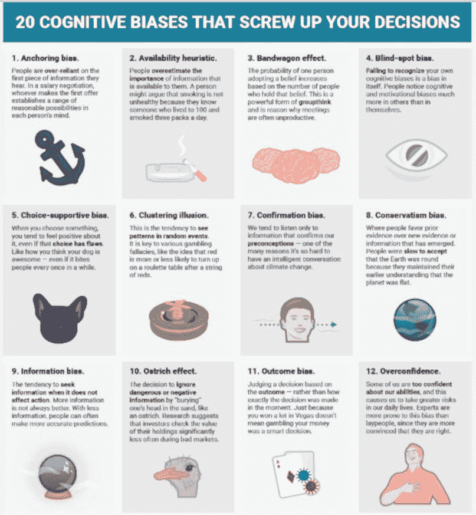

# 第五章 – 算法交易的缺点和误解

在阅读了上一章后，算法交易的世界可能看起来像是一个理想国，与您当前的交易方式相比。不幸的是，事实并非如此。算法交易像任何类型的交易一样，极其困难且充满陷阱。在你开始算法交易生涯之前，了解一些主要缺点是重要的。这些缺点可能会改变你想要进行算法交易的想法。

## 缺点#1 – 情绪仍然是交易的一部分

我仍然清晰地记得我的第一次“算法”交易，就是我在介绍中提到的那一次。那时没人称之为算法交易，但那就是它。我有规则，我遵循规则，我本该像机器人一样没有情感。

然而，我却害怕得要命！

我每 15 分钟就打电话给经纪人，问“我能知道六月生猪的最后价格吗？”然后根据最新的数字计算我的未平仓利润或亏损。在接下来的 15 分钟里，我要么因为赚钱而欣喜若狂，要么因为亏钱而沮丧。经纪人开始对我不断的电话感到厌烦。那时没有在线查询价格的方式，如果你还记得那段旧时光的话。如果有在线报价，我肯定会每分钟刷新那个报价页面。

那么我为什么害怕得要命，像个疯子一样呢？毕竟，许多人说当你遵循规则交易时，就不会有情绪干扰。我本该是一个冷静、沉着、冷酷的机器人。

可我并不是——我是一团令人恶心的紧张情绪！

事实是，无论何时你在用钱交易，情感都会介入。资本的快速盈亏才是带来情绪的原因，而不是交易风格。算法交易、主观交易、随机猜测交易——只要涉及钱，哪种方式都是情绪化的。

那么，为什么那么多“专家”推荐算法交易，声称它没有情绪呢？我相信这都是这些骗子的销售把戏。那些江湖骗子知道情绪会毁掉很多交易者，而交易者正想避免情绪，因此他们声称算法交易解决了情绪问题。

但事实并非如此。正如我所说，情绪是由于涉及的钱，而不是交易的类型。我个人猜测，声称算法交易没有情绪的人，要么是 1）仅在模拟器上交易，或者 2）根本不以任何形式进行交易。他们显然并没有用真钱交易。

不过，算法交易所经历的情绪与自主交易的情绪有所不同。消除了是否该进出交易的恐慌感，但取而代之的是是否该开启或关闭算法的恐慌感。基本上，自主交易中导致情绪的每一个事件，在算法交易中可能都有类似但不同的情绪。

所以，在算法交易中第一个误解——没有情绪——也是第一个劣势。用真钱交易涉及情绪。你必须学会接受这一点。

## 劣势 #2 – 计算机编程

如果编程的想法让你感到害怕，也许算法交易就不适合你。虽然有可视化编程工具可以协助，但要成为一个好的算法交易者，你需要能够编程你的交易规则。确实，你可以雇人来帮你，但由于大多数算法在测试中失败，支付给某人的费用会很快变得昂贵。编程数千个算法是一项庞大的任务。

所以，如果你决定进行算法交易，现在就要说服自己，你会学会编程。一旦你开始这样做，知道如何编程将使这从劣势转变为优势。

## 劣势 #3 – 过去并不代表未来

如果你见过关于交易教育、交易系统、经纪商等的广告，你无疑看到过美国政府要求的免责声明：“过去的表现并不一定能预测未来的结果。”

这是对所有交易者的一个重要警告。这意味着，无论历史测试显示什么，都不意味着未来的表现会持续。事实上，很多时候正好相反，情况会回归到均值。

这对算法交易者提出了一个难题，他们几乎总是在进行实时交易之前对他们的方法进行历史回测。如果过去的表现与未来的表现没有相关性，为什么还要回测呢？

显然，回测算法会面临棘手的局面。交易者希望得到算法在历史上有效的保证，但同时又必须意识到，从第一天的实时交易开始，一切都有可能崩溃。

事实证明，诀窍是拥有一种在历史测试和实时测试中证明有效的开发方法。它并不像大多数交易平台让你相信的那样简单，仅仅是优化参数。这将在后面更详细地讨论。

因此，历史测试就像在熔岩坑上走钢丝。一旦出现失误，死亡就会降临。但如果做得正确，观众会惊叹地欢呼。我们的目标显然是后者的结果！

## 劣势 #4 – 调整是乐趣

当我第一次起草这本书时，一位女性校对员问我：“为什么调整是个劣势？调整是有趣的，我喜欢这样做，但我不明白这与交易有什么关系。”

嗯，这可能是对的，尽管我有点太老了，不适合跳扭腰舞（相信我！）。而且，这个词是调整（TWEAKING）。改变一个字母会带来很大差别！

调整是想要改变和改进事物的自然倾向。正如我之前所示，改进是交易的重要部分。但这并不是算法开发所期望的部分。调整真的会引发问题。

这里有一个例子：我有一个交易朋友，他已经开发和调整他的策略超过五年。每次他有一个亏损交易时，他都会仔细检查，并找到这个交易无效的原因。然后，他制定一个规则——一个调整——来消除这个交易。他的回测看起来更好，因为那个讨厌的交易再也不会出现，他很开心。

当然很开心，直到下一个调整需要进行。

因此，超过五年，他的策略被调整得过头。事实上，我敢打赌，他的算法中调整代码比原始策略代码多得多。不幸的是，他的实时结果从未改善。总有一个调整待完成。

调整你的代码很简单。但这样做是错误的，这对算法交易来说是一个大缺陷。

## 缺点 #5 – 我在这里是老板！

之前我写过拥有员工的生意。对于交易而言，唯一的员工通常是你自己。这可以是一个重大优势——没有员工需要溺爱或担心——但也可能是一个重大缺点。

如果你的算法策略表现不佳——通常是你的错。

如果你无法开发新策略——那只能怪你自己。

如果你在自动化你的算法时犯错，错误地进行期货合约展期，错过截止日期——这都要你负责。

无论决策是什么，或者行动是什么，好的坏的，你都是大老板，首席执行官，头号人物 ([`www.youtube.com/watch?v=0yC4gm_vN3s`](https://www.youtube.com/watch?v=0yC4gm_vN3s))。

虽然这看起来对那些陷在不喜欢的工作和讨厌的老板下的人来说是终极自由，但事实是，这也可能是一个重大缺点。

在算法交易中，当事情崩溃时——而且确实会崩溃，至少在某种程度上和某种程度上——除了你自己，没有人可以怪。许多交易者无法承受这种压力和责任。

当老板可以很棒，特别是在算法交易中。但请记住，这也可能是一个大缺点。

## 缺点 #6 – 做事的错误方式

正确进行算法交易时，可以取得很好的效果。问题是错误地进行算法交易是极其简单的。而且，猜猜怎么着，错误的方式通常会导致亏损。

这是算法交易的一个主要劣势，因为有许多方法可能会错误地开发交易策略。事实上，这个清单长到我可能可以写一本关于如何不开发交易算法的书——也许有一天我会写！下面列出许多偏见，确实会严重干扰你的算法交易。

图 17- 这些偏见中的每一个都可能导致不当的算法开发

那么，面对这些算法开发的陷阱，交易者如何将这一劣势转变为优势呢？显然，如果大多数交易者在算法创建过程中犯错，那么正确开发的好处就变得更加明显。

这里有一些建议来抵消这个劣势。首先，仅使用可信赖的来源来获取交易建议。互联网充满了提供建议的人，但其中许多人甚至不进行交易！向你知道进行交易的人寻求建议。

第二，愿意从许多不同的交易者那里获取信息，并将其结合成对你感觉正确的东西。

第三，通过真实货币交易来证明。理论不错，想法更好，但最终唯一重要的是底线结果。你的算法开发方法是否产生利润？如果是，恭喜你！如果不是，你可能需要深入审查你的流程，并整合新概念或改进。

构建和交易算法是艰难的，并且没有一种“正确”的方法来做到这一点。此外，还有许多不正确的方法。这使得算法交易面临劣势。

## 劣势 #7 – 算法交易不是“设定后就忘”

你可能还记得几年前在深夜电视广告中出售的一种便携式烹饪器具。它的口号是“设定后就忘”。它的使用非常简单，你只需放入食物，按几个按钮，几个小时后就能享受到美味的家常饭。

图 18- 绝对不是算法交易的方法！

许多交易者认为同样的口号适用于算法交易，特别是在自动化系统时。他们错了！

Tradestation 的技术支持人员（一个领先的交易软件平台，也是我主要的交易软件）有不同的口号：“自动交易并不意味着无人值守的交易。”

每当你有一个自动化算法时，可能出现的错误有一百万种。互联网连接可能中断，与交易服务器的断开连接可能发生，交易所可能会经历间歇性的故障，价格数据的修正会出现（但坏数据在算法中处理之前就已经出现）——潜在问题的清单几乎是无穷无尽的。

将所有这些问题乘以你可能交易的几十种算法，潜在问题变得非常明显。

你不能随便启动一个算法，离开，然后一周后回来数你的利润。这并不是那样运作的。你不需要整天整夜盯着屏幕，确保你的算法正常运行，但至少每天要监控几次你的算法。你必须准备好在出现问题时采取行动。我保证你会发现，某些干预比你想象的要频繁得多。

这是算法交易的最终误解和缺陷——你必须时刻关注你的算法，保持警惕。绝对不要“设定后就忘”！
